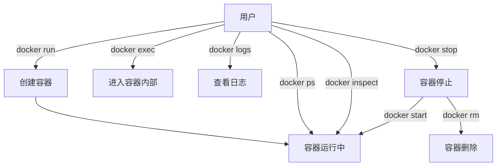
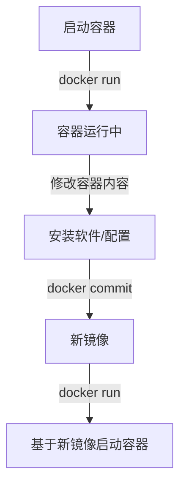
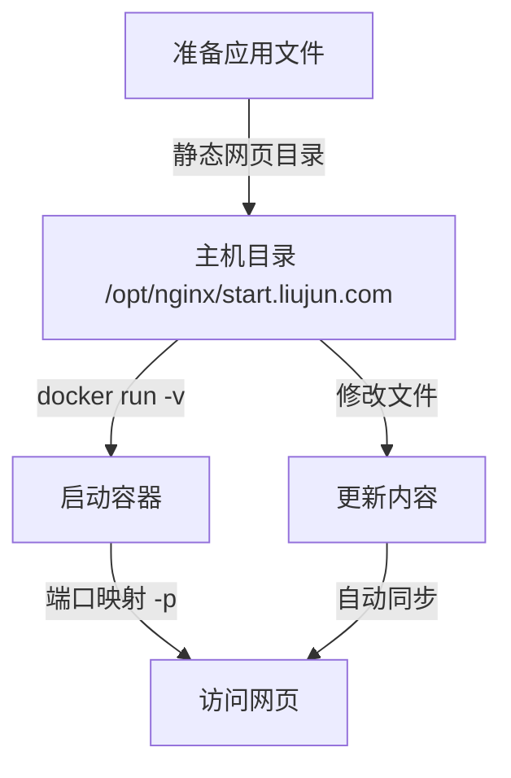
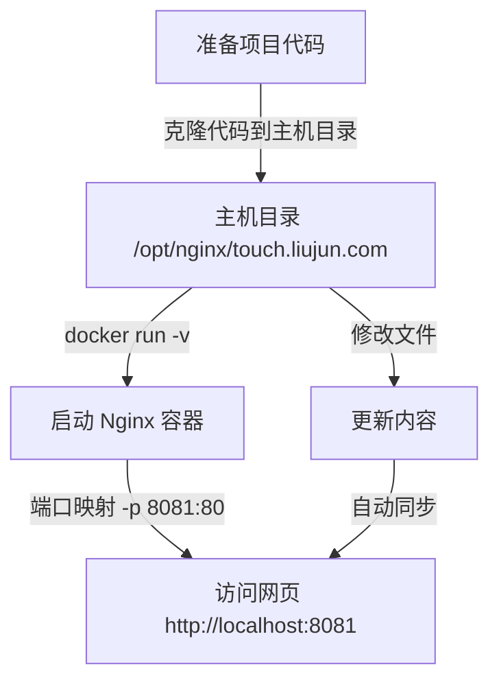

# Docker 基础与初步学习

## 学习目标
* 理解容器技术的基本概念和 Docker 的作用：通过抽象例子和图表，掌握容器技术的核心思想，了解 Docker 作为容器化平台的价值。
* 掌握 Docker 的安装、镜像管理和容器管理基本命令：能够独立完成 Docker 环境的搭建和基本操作，命令以表格形式总结。
* 完成简单应用的容器化部署：通过实践案例，将一个简单的应用部署到 Docker 容器中，初步体验容器化优势。

## 1. 容器技术理论讲解
### 1.1 什么是容器技术？与虚拟机（VM）的区别

* 容器技术：容器是一种轻量级的虚拟化技术，允许我们在同一台主机上运行多个隔离的应用环境。想象一下，容器就像是一个个“便携式小房间”，每个房间里装着应用和它需要的所有工具（如库、配置文件），这些房间共享主机的“地板”（操作系统内核），但彼此之间有墙壁隔离，互不干扰。
* 抽象例子：
    * 假设你在一个大房子里（主机），虚拟机（VM）就像是建造了几个完全独立的公寓，每个公寓有自己的水电系统（独立操作系统），需要大量资源。而容器就像是在大房子里用隔板分出几个小隔间，每个隔间共享水电（主机内核），但各自有自己的家具（应用和依赖），资源占用少得多。

* 与虚拟机（VM）的区别：
    * 架构：虚拟机通过 Hypervisor 模拟完整硬件，运行独立的操作系统；容器直接运行在主机内核上，共享操作系统。
    * 资源占用：虚拟机需要分配独立的内存、CPU 和存储，资源开销大（几 GB）；容器资源占用小（几 MB），启动速度快（秒级）。
    * 隔离性：虚拟机隔离更彻底，安全性更高；容器隔离依赖内核，可能存在一定安全风险。
    * 应用场景：虚拟机适合运行异构系统（如 Windows 和 Linux 混合）；容器更适合微服务、CI/CD 和快速部署。

* 结构图（使用 Mermaid 展示容器与虚拟机的区别）：


### 1.2 Docker 的核心组件
* Docker Engine：Docker 的核心运行时，负责创建和管理容器。想象它是一个“工厂经理”，指挥着容器和镜像的生产和运行。包括 Docker Daemon（后台服务）和 Docker CLI（命令行工具）。
* Docker Hub：官方镜像仓库，就像一个“应用超市”，提供大量预构建的镜像（如 Nginx、Ubuntu），你可以从中下载（拉取）镜像，或者上传（推送）自己的镜像。
* 镜像（Image）：只读的模板，包含应用和其依赖环境，用于创建容器。想象它是一个“蓝图”或者“压缩包”，里面装好了所有需要的文件和设置。
* 容器（Container）：镜像的运行实例，是隔离的应用运行环境。想象它是一个“正在运行的程序”，是从蓝图（镜像）启动的一个具体实例。
* 结构图（使用 Mermaid 展示 Docker 核心组件关系）：


### 1.3 Docker 的优势与适用场景
* 优势：
    * 环境一致性：解决“在我机器上能跑”的问题。想象你做了一道菜（应用），容器就像一个便携式厨房，连同所有食材和工具一起打包，确保在任何地方都能做出一样的味道（运行一致）。
    * 轻量快速：容器启动时间以秒计，资源占用少。就像搭帐篷（容器）比建房子（虚拟机）更快更省力。
    * 可移植性：镜像可以在任何支持 Docker 的平台上运行，就像一个 U 盘，插到哪里都能用。
    * 生态丰富：Docker Hub 提供大量现成镜像，社区活跃，就像一个巨大的工具库，随手可得。

* 适用场景：
    * 微服务架构：将一个大应用拆分为多个小服务，每个服务运行在独立容器中，就像把一个大乐队拆分成多个小乐手，各司其职，方便管理。
    * CI/CD 流程：自动化构建、测试和部署，容器就像流水线上的标准化零件，快速组装和替换。
    * 开发测试环境：快速搭建隔离环境，避免依赖冲突，就像给每个开发者分配一个独立的工作台，不会互相干扰。

### 1.4 面试常见问题
* 容器与虚拟机的区别？
    * 答：容器是操作系统级虚拟化，共享主机内核，资源占用少，启动快，就像在大房子里用隔板分隔小房间；虚拟机是硬件级虚拟化，运行独立操作系统，资源占用大，隔离性更强，就像建造独立公寓。

* Docker 解决了什么问题？
    * 答：Docker 解决了环境不一致问题，通过容器化技术将应用及其依赖打包，确保在开发、测试、生产环境中运行一致，就像把整个厨房打包带走；同时提高资源利用率，简化部署流程，降低运维成本。

* Docker 镜像和容器的关系？
    * 答：镜像是只读模板，容器是镜像的运行实例。就像你有一个蓝图（镜像），可以复制多份（容器）用于制作不同的房屋。

* Docker 常用命令有哪些？
    * 答：常用命令包括镜像管理（拉取、推送、构建）、容器管理（创建、启动、停止、删除）、网络配置、存储卷等。


## 2. Docker 安装与部署

### Ubuntu（基于 Ubuntu 18.04/22.04）：

```bash
# 添加阿里云官方GPG密钥
curl -fsSL http://mirrors.aliyun.com/docker-ce/linux/ubuntu/gpg | sudo apt-key add -
# 写入阿里云Docker仓库地址
sudo sh -c 'echo "deb [arch=amd64] http://mirrors.aliyun.com/docker-ce/linux/ubuntu $(lsb_release -cs) stable" > /etc/apt/sources.list.d/docker.list'
# 更新源
sudo apt-get update
# 安装Containerd服务
sudo dpkg --configure -a
sudo apt-get install -y docker-ce docker-ce-cli containerd.io docker-buildx-plugin docker-compose-plugin

```

### 验证安装：
* 检查 Docker 版本：
    ```bash
    docker --version
    ```

* 运行一个测试容器，确保 Docker 正常工作：
    ```bash
    docker run hello-world
    ```

* 预期输出：看到类似 “Hello from Docker!” 的消息，说明安装成功。


### 添加镜像加速（阿里云）
* 背景：Docker Hub 默认服务器在国外，拉取镜像速度较慢，使用阿里云镜像加速可以显著提升下载速度。
* 步骤：
    * 创建或编辑 Docker 配置文件：
        ```bash
        vim /etc/docker/daemon.json
        # 内容
        {
            "registry-mirrors": [
                "https://dockerproxy.com",
                "https://docker.m.daocloud.io",
                "https://cr.console.aliyun.com",
                "https://ccr.ccs.tencentyun.com",
                "https://hub-mirror.c.163.com",
                "https://mirror.baidubce.com",
                "https://docker.nju.edu.cn",
                "https://docker.mirrors.sjtug.sjtu.edu.cn",
                "https://github.com/ustclug/mirrorrequest",
                "https://registry.docker-cn.com"
            ]
        }
        ```

* **注意**：your-mirror-registry 需要替换为阿里云提供的个人专属加速地址。登录阿里云控制台（https://cr.console.aliyun.com），在“镜像加速器”页面获取专属加速地址。

* 重载配置并重启 Docker：
    ```bash
    sudo systemctl daemon-reload
    sudo systemctl restart docker

    ```

## 3. 镜像管理
### 3.1 基本命令
* 背景：Docker 镜像就像一个“软件安装包”，包含了应用和运行环境。我们需要从 Docker Hub 下载镜像，或者管理本地镜像。
* 抽象例子：镜像管理就像管理手机上的 App 安装包，你可以从应用商店下载（pull），查看已下载的列表（images），了解安装包的组成（history），或者备份和恢复（save 和 load）。

### 3.2 镜像管理命令总结表格
| 操作            | 命令                                              | 说明                                           |
|-----------------|--------------------------------------------------|------------------------------------------------|
| 拉取镜像        | `docker pull <image_name>:<tag>`                | 从 Docker Hub 下载镜像，如 `swr.cn-north-4.myhuaweicloud.com/ddn-k8s/docker.io/nginx:latest`     |
| 查看镜像列表    | `docker images`                                 | 显示本地所有镜像，包括名称、大小、创建时间等   |
| 查看镜像层级结构| `docker history <image_name>:<tag>`            | 显示镜像的每一层构建历史，了解镜像组成         |
| 导出镜像        | `docker save -o <file_name>.tar <image_name>:<tag>` | 将镜像保存为 tar 文件，用于备份或传输          |
| 导入镜像        | `docker load -i <file_name>.tar`                | 从 tar 文件导入镜像到本地                      |

### 3.3 案例：拉取 Nginx 镜像，查看镜像层级结构，导出和导入镜像
#### 步骤 1：拉取 Nginx 镜像：
* 命令：
    ```bash
    docker pull swr.cn-north-4.myhuaweicloud.com/ddn-k8s/docker.io/nginx:latest
    ```
* 说明：`latest` 是标签，表示最新版本。拉取过程会显示进度条，完成后镜像存储在本地。

#### 步骤 2：查看镜像列表：
* 命令：
    ```bash
    docker images
    ```
* 预期输出：看到 swr.cn-north-4.myhuaweicloud.com/ddn-k8s/docker.io/nginx:latest 及其大小（如 133MB）。

#### 步骤 3：查看镜像层级结构：
* 命令：
    ```bash
    docker history swr.cn-north-4.myhuaweicloud.com/ddn-k8s/docker.io/nginx:latest

    ```
* 说明：显示镜像的每一层构建步骤（如添加文件、运行命令），每一层是一个只读文件系统，叠加形成完整镜像。
* 预期输出：类似 CREATED BY 列显示每层的构建命令。

#### 步骤 4：导出镜像到文件：
* 命令： 
    ```bash
    docker save -o nginx_backup.tar swr.cn-north-4.myhuaweicloud.com/ddn-k8s/docker.io/nginx:latest

    ```

* 说明：将镜像保存为 nginx_backup.tar 文件，可用于备份或传输到其他机器。

#### 步骤 5：删除本地镜像并导入：
* 删除镜像：
    ```bash
    docker rmi swr.cn-north-4.myhuaweicloud.com/ddn-k8s/docker.io/nginx:latest

    ```
* 确认删除：
    ```bash
    docker images

    ```

* 导入镜像：
    ```bash
    docker load -i nginx_backup.tar

    ```

* 再次确认：
    ```bash
    docker images

    ```
* 预期输出：`swr.cn-north-4.myhuaweicloud.com/ddn-k8s/docker.io/nginx:latest` 重新出现在列表中。

### 3.4 镜像管理流程图（使用 Mermaid 展示）


## 4. 容器管理
### 4.1 基本命令
* 背景：容器是镜像的运行实例，就像启动了一个程序。容器管理包括创建、查看、控制和删除容器。
* 抽象例子：容器管理就像管理手机上的 App，你可以启动一个 App（run），查看运行中的 App（ps），关闭或重启 App（stop、restart），甚至进入 App 内部调整设置（exec）。

### 4.2 容器管理命令总结表格

| 操作                | 命令                                                  | 说明                                              |
|---------------------|------------------------------------------------------|---------------------------------------------------|
| 运行容器            | `docker run [options] <image_name>:<tag> [command]` | 启动一个新容器，常用选项如 `-d` (后台运行)、`-p` (端口映射)、`--name` (命名) |
| 查看运行中容器      | `docker ps`                                         | 显示当前运行中的容器信息                          |
| 查看所有容器        | `docker ps -a`                                      | 显示所有容器，包括已停止的                        |
| 启动容器            | `docker start <container_id/name>`                 | 启动一个已停止的容器                              |
| 停止容器            | `docker stop <container_id/name>`                  | 停止一个运行中的容器                              |
| 重启容器            | `docker restart <container_id/name>`               | 重启一个容器                                      |
| 查看容器详情        | `docker inspect <container_id/name>`               | 显示容器的详细信息（如 IP、端口、配置）           |
| 进入容器            | `docker exec -it <container_id/name> /bin/bash`    | 进入容器内部，执行交互式命令（或用 `/bin/sh`）   |
| 复制文件（容器到主机） | `docker cp <container_id>:<path> <host_path>`     | 从容器复制文件到主机                              |
| 复制文件（主机到容器） | `docker cp <host_path> <container_id>:<path>`     | 从主机复制文件到容器                              |
| 删除容器            | `docker rm <container_id/name>`                    | 删除一个已停止的容器                              |
| 查看容器日志        | `docker logs <container_id/name>`                  | 查看容器运行日志                                  |
| 删除镜像            | `docker rmi <image_name>:<tag>`                    | 删除本地镜像                                      |
| 给镜像打标签        | `docker tag <source_image>:<tag> <new_image>:<new_tag>` | 为镜像添加新标签，便于管理                        |

### 4.3 案例：运行一个 Nginx 容器，查看容器状态，进入容器执行命令，查看日志
#### 步骤 1：运行 Nginx 容器：
* 命令：
    ```bash
    docker run -d -p 8080:80 --name my-nginx swr.cn-north-4.myhuaweicloud.com/ddn-k8s/docker.io/nginx:latest

    ```
* 说明：
    * -d：后台运行容器，不占用终端。
    * -p 8080:80：将容器内部的 80 端口映射到主机的 8080 端口，访问 http://localhost:8080 即可看到 Nginx 默认页面。
    * --name my-nginx：给容器命名，方便后续操作。
    * 使用指定的镜像 swr.cn-north-4.myhuaweicloud.com/ddn-k8s/docker.io/nginx:latest。

#### 步骤 2：查看运行中的容器：
* 命令：
    ```bash
    docker ps

    ```
* 预期输出：看到 my-nginx 容器，状态为 Up，端口映射为 0.0.0.0:8080->80/tcp。

#### 步骤 3：查看容器详情：
* 命令：
    ```bash
    docker inspect my-nginx

    ```

* 说明：显示容器的详细信息，包括 IP 地址、端口映射、挂载点等，输出为 JSON 格式。

#### 步骤 4：进入容器内部：
* 命令：
    ```bash
    docker exec -it my-nginx /bin/bash

    ```

* 说明：进入容器后，可以执行命令，如查看文件：
    ```bash
    ls /usr/share/nginx/html

    ```
* 退出容器：
    ```bash
    exit
    ```
#### 步骤 5：查看容器日志：
* 命令：
    ```bash
    docker logs my-nginx

    ```

* 说明：显示 Nginx 的运行日志，如访问记录或错误信息。

#### 步骤 6：停止并删除容器：
* 命令：
    ```bash
    docker stop my-nginx
    docker rm my-nginx

    ```

* 说明：停止容器后删除，确保不占用资源。

### 4.4 容器管理流程图（使用 Mermaid 展示）


## 5. 简单镜像制作

### 5.1 使用 commit 命令基于容器制作镜像
* `背景`：当你对一个容器进行了修改（如安装软件、更改配置），可以使用 commit 命令将容器保存为一个新镜像，供后续使用。
* `抽象例子`：这就像你对一个手机 App 做了个性化设置后，将这个状态保存为一个新版本的安装包，方便以后直接安装这个定制版本。
* `命令`：
    ```bash
    docker commit <container_id/name> <new_image_name>:<tag>

    ```

### 5.2 案例：基于 Nginx 容器添加自定义配置，制作自定义镜像
#### 步骤 1：运行一个 Nginx 容器：
* 命令：
    ```bash
    docker run -it --name nginx-custom swr.cn-north-4.myhuaweicloud.com/ddn-k8s/docker.io/nginx:latest /bin/bash

    ```
* 说明：启动一个交互式 Nginx 容器，进入内部，使用指定的镜像。

#### 步骤 2：在容器内安装工具或修改配置：
* 命令：
    ```bash
    apt update
    apt install -y vim
    echo "server { listen 80; server_name custom.example.com; location / { root /usr/share/nginx/html; index index.html; } }" > /etc/nginx/conf.d/custom.conf

    ```
* 说明：更新包索引并安装 Vim 编辑器，同时添加一个简单的自定义 Nginx 配置文件。
* 退出容器：
    ```bash
    exit

    ```

#### 步骤 3：提交容器为新镜像：
* 命令：
    ```bash
    docker commit nginx-custom my-nginx-custom:latest

    ```
* 说明：将容器 nginx-custom 保存为新镜像 my-nginx-custom:latest。

#### 步骤 4：验证新镜像：
* 查看镜像列表：
    ```bash
    docker images

    ```

* 运行新镜像：
    ```bash
    docker run -d -p 8081:80 my-nginx-custom:latest

    ```

* 检查是否正常运行：
    ```bash
    docker ps

    ```

* 预期输出：看到新容器运行在 8081 端口。

* 清理测试容器：
    ```bash
    docker stop <container_id>
    docker rm <container_id>

    ```

#### 步骤 5：清理临时容器：
* 命令：
    ```bash
    docker rm nginx-custom
    ```

### 5.3 镜像制作流程图（使用 Mermaid 展示）


## 6. 容器部署应用
### 6.1 案例：部署一个静态网页应用（基于 /opt/nginx/start.liujun.com）
* `背景`：通过容器部署一个静态网页，展示 Docker 如何快速运行一个 Web 服务，使用您提供的项目目录 /opt/nginx/start.liujun.com 作为静态页面目录。
* `抽象例子`：这就像用一个便携式展示柜（容器）展示你的作品（网页），你可以随时把展示柜搬到任何地方（主机），作品都能正常展示。

#### 步骤 1：确认静态网页目录：
* 确保 /opt/nginx/start.liujun.com 目录存在且包含静态网页文件（如 index.html）：
    ```bash
    # 创建项目路径
    mkdir /opt/nginx/stars.liujun.com
    # 进入站点目录
    cd /opt/nginx/stars.liujun.com
    # 克隆项目代码（注意末尾的点，表示克隆到当前目录）
    git clone https://github.com/wangyasai/Stars-Emmision .

    ```
* 说明：确保目录和文件权限正确，Docker 容器能够访问（建议目录权限为 755 或 775）。
    ```bash
    # 递归授权项目所有文件
    chmod -R 775 /opt/nginx/stars.liujun.com
    ```
#### 步骤 2：运行 Nginx 容器，挂载本地目录：
* 命令：
    ```bash
    docker run -d -p 8080:80 \
        -v /opt/nginx/start.liujun.com:/usr/share/nginx/html \
        --name web-app \
        swr.cn-north-4.myhuaweicloud.com/ddn-k8s/docker.io/nginx:latest

    ```

* 说明：
    * `-v /opt/nginx/start.liujun.com:/usr/share/nginx/html`: 将主机目录挂载到容器的 Nginx 默认网页目录，容器会显示主机上的网页内容。
    * `-p 8080:80`：映射端口，访问主机 8080 端口即可看到网页。
    * 使用指定的镜像 `swr.cn-north-4.myhuaweicloud.com/ddn-k8s/docker.io/nginx:latest`。

#### 步骤 3：访问网页：
* 在浏览器中访问 `http://localhost:8080`，应看到您的静态网页内容（如 “Welcome to start.liujun.com”）。
* 说明：如果无法访问，检查容器是否运行（docker ps），或端口是否被占用，或者挂载目录权限是否正确。

#### 步骤 4：停止并删除容器：
* 命令：
    ```bash
    docker stop web-app
    docker rm web-app

    ```
* 说明：清理容器，释放资源。

### 6.2 部署应用流程图（使用 Mermaid 展示）


## 7. 总结与小测验
### 7.1 总结
* Docker 的基本概念：
    * 容器是轻量级虚拟化技术，共享主机内核，隔离应用环境。
    * Docker 是容器管理平台，核心组件包括 Engine（运行时）、Hub（镜像仓库）、镜像（模板）和容器（运行实例）。

* 操作流程：
    * 拉取镜像（如 swr.cn-north-4.myhuaweicloud.com/ddn-k8s/docker.io/nginx:latest）、查看和管理镜像（images、history）。
    * 运行容器（run）、管理容器（ps、stop、exec）。
    * 制作镜像（commit）和部署简单应用（Nginx 网页）。

* 学习成果：学习者应掌握 Docker 的基本命令（镜像和容器管理）以及简单应用的容器化部署。

### 7.2 小测验
1. 命令填空：
    * 拉取镜像的命令是：docker ______ <image_name>。
    * 查看运行中容器的命令是：docker ______。
    * 进入容器的命令是：docker ______ -it <container_id> /bin/bash。
    * 将容器保存为镜像的命令是：docker ______ <container_id> <new_image_name>。

2. 简答题：
    * 容器和镜像的关系是什么？举一个生活中的例子说明。
    * 为什么容器比虚拟机更轻量？从资源占用和启动速度两方面回答。
3. 实践题：
    * 运行一个 Nginx 容器，使用镜像 `swr.cn-north-4.myhuaweicloud.com/ddn-k8s/docker.io/nginx:latest`，端口映射到主机的 8082，并命名为 `test-nginx`。写出完整命令。

## 8. 思考题（面试准备）
1. Docker 的镜像分层机制是什么？
    * 提示：思考镜像如何存储和构建，docker history 命令的作用。镜像分层如何帮助节省存储空间？
2. 如何选择合适的镜像大小和版本？
    * 提示：考虑镜像标签（如 latest、alpine）、应用需求和安全性。为什么小型镜像（如 Alpine）更受欢迎？


## 作业：使用 Docker 挂载并发布 touch.liujun.com 静态网页项目
### 目标
* 使用 Docker 部署一个静态网页项目，将主机目录 /opt/nginx/touch.liujun.com 挂载到容器中，通过 Nginx 提供 Web 服务。
* 确保项目内容可以通过浏览器访问。

### 前提条件
* 已安装 Docker 环境（参考前面的教案内容）。
* 主机上有 /opt/nginx/touch.liujun.com 目录，并已克隆 Light-Year-Admin-Template 项目。
* 使用指定的 Nginx 镜像：swr.cn-north-4.myhuaweicloud.com/ddn-k8s/docker.io/nginx:latest。

### 步骤详解



#### 步骤 1：准备项目目录和代码
* 创建目录并克隆项目代码：
    * 命令：
        ```bash
        # 创建目录（如果不存在）
        sudo mkdir -p /opt/nginx/touch.liujun.com
        # 进入站点目录
        cd /opt/nginx/touch.liujun.com
        # 克隆项目代码（注意末尾的点，表示克隆到当前目录）
        git clone https://gitee.com/yinqi/Light-Year-Admin-Template.git .

        ```
    * 说明：
        * mkdir -p 确保目录存在，如果已存在则不会报错。
        * git clone 会将 Light-Year-Admin-Template 项目的代码下载到当前目录 /opt/nginx/touch.liujun.com。
        * 如果您已经完成这一步，可以跳过此命令。

* 检查项目文件：
    * 命令：
        ```bash
        ls -l /opt/nginx/touch.liujun.com
        ```
    * 说明：确保目录中包含项目文件（如 index.html 或其他 HTML 文件）。Light-Year-Admin-Template 是一个前端模板，通常会在根目录或子目录（如 html）下包含入口文件 index.html。
    * 如果找不到 index.html，可以进一步查看子目录：
        ```bash
        find /opt/nginx/touch.liujun.com -name "index.html"
        ```
    * 预期输出：类似 /opt/nginx/touch.liujun.com/index.html 或 /opt/nginx/touch.liujun.com/html/index.html。


#### 步骤 2：运行 Nginx 容器并挂载项目目录
* 启动容器：
    * 命令：
        ```bash
        docker run -d -p 8081:80 \
            -v /opt/nginx/touch.liujun.com:/usr/share/nginx/html \
            --name touch-web-app \
            swr.cn-north-4.myhuaweicloud.com/ddn-k8s/docker.io/nginx:latest

        ```
    * 说明：
        * -d：后台运行容器，不占用终端。
        * -p 8081:80：将容器内部的 80 端口映射到主机的 8081 端口，访问 http://localhost:8081 即可看到网页内容。选择 8081 端口以避免与之前的案例（8080）冲突。
        * -v /opt/nginx/touch.liujun.com:/usr/share/nginx/html：将主机目录 /opt/nginx/touch.liujun.com 挂载到容器的 Nginx 默认网页目录 /usr/share/nginx/html，容器会显示主机上的项目内容。
        * --name touch-web-app：给容器命名，方便后续管理。
        * 使用指定的镜像 swr.cn-north-4.myhuaweicloud.com/ddn-k8s/docker.io/nginx:latest。

* 检查容器状态：
    * 命令：
        ```bash
        docker ps
        ```
    * 预期输出：看到 touch-web-app 容器，状态为 Up，端口映射为 0.0.0.0:8081->80/tcp。

#### 步骤 3：访问网页并验证
* 访问网页：
    * 在浏览器中访问 http://localhost:8081，应看到 Light-Year-Admin-Template 的页面内容。
    * 说明：如果页面无法显示，可能是以下原因：
        * 容器未正常运行：检查 docker ps 输出。
        * 端口被占用：尝试其他端口（如 -p 8082:80）。
        * 挂载目录权限问题：确保 /opt/nginx/touch.liujun.com 目录权限允许 Docker 访问（建议 sudo chmod -R 755 /opt/nginx/touch.liujun.com）。
        * 项目入口文件不在根目录：如果 index.html 在子目录（如 html），需要调整挂载路径或配置 Nginx。

