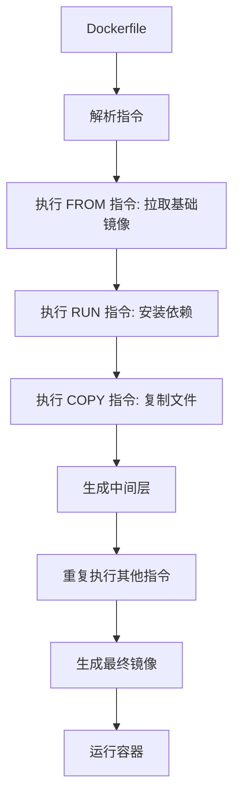
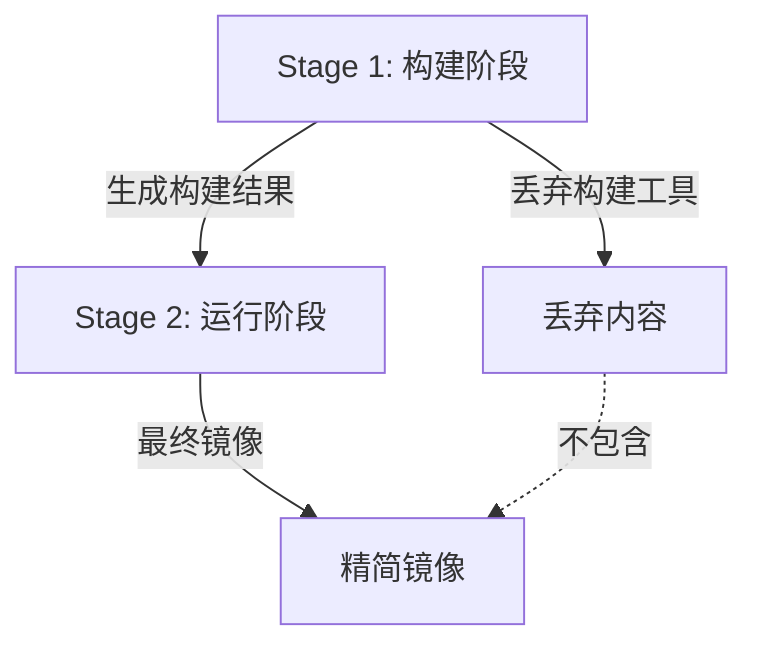
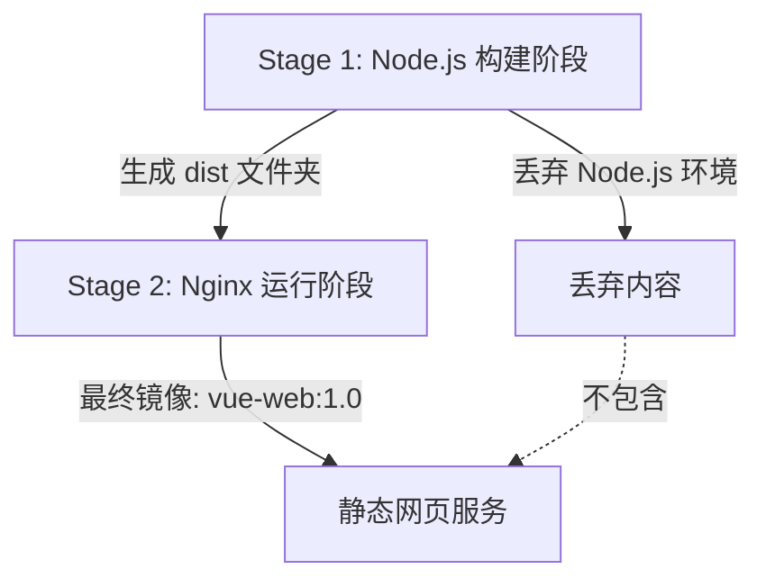

# Docker 镜像编排与 Dockerfile 详解

## 学习目标
1. 掌握镜像编排理论：理解什么是镜像编排，为什么需要 Dockerfile，以及镜像构建过程和分层原理。
2. 熟练编写 Dockerfile：学习 Dockerfile 的核心指令（如 FROM、RUN、CMD、ENTRYPOINT、COPY、ADD、WORKDIR、EXPOSE、ENV 等），并通过案例构建自定义镜像。
3. 掌握项目实践能力：
    * 构建并部署前端静态页面
    * 掌握 Python Flask 应用镜像构建
    * 掌握 Java Spring Boot 应用镜像构建
    * 掌握 Node.js Express 应用镜像构建
    * 掌握 React/Vue 前端应用镜像构建
    * 掌握 Go Web 应用的多阶段构建
4. 优化 Docker 镜像：
    * 学习减少镜像层级技巧
    * 掌握清理缓存文件方法
    * 熟练使用多阶段构建
    * 能够优化各类应用镜像大小
5. 掌握问题排查和最佳实践：
    * 能够解决构建失败问题
    * 理解 CMD 和 ENTRYPOINT 的区别
    * 掌握镜像优化的最佳实践
    * 能够应对面试常见问题

## 1. 镜像编排理论讲解
### 什么是镜像编排？
镜像编排（Image Orchestration）是指通过一系列指令和工具，将应用程序及其依赖环境打包成一个标准化的、可移植的容器镜像的过程。想象一下，你要搬家，但不想每次都把所有家具、家电一件件搬运，而是把整个家打包成一个“大箱子”，到新地方直接打开就能用。Docker 镜像就是这个“大箱子”，它包含了你的应用、运行环境、配置文件等所有东西。而镜像编排就是如何把这些东西有条理地装进箱子的过程。


在 Docker 中，镜像编排的核心工具是 Dockerfile，它就像一个“装箱指南”，告诉 Docker 如何一步步构建这个镜像。
### 为什么需要 Dockerfile？
Dockerfile 是一个文本文件，里面写满了构建镜像的步骤。为什么需要它呢？原因如下：

1. 自动化构建：手动配置环境很麻烦，Dockerfile 让构建过程自动化，像写菜谱一样，按步骤执行。
2. 可重复性：有了 Dockerfile，任何人在任何地方都可以构建出完全一样的镜像，避免“在我电脑上能跑”的尴尬。
3. 版本控制：Dockerfile 可以像代码一样用 Git 管理，方便追踪变更。
4. 分层优化：Dockerfile 支持分层构建，能减少镜像体积，提高构建速度。

简单来说，Dockerfile 是构建 Docker 镜像的“说明书”，没有它，构建镜像就像没有图纸盖房子，效率低还容易出错。

### Docker 镜像构建过程与分层原理

#### 构建过程
Docker 镜像的构建过程可以看作是一个“搭积木”的过程，每一步指令都会生成一个新的“积木层”。具体步骤如下：

1. 读取 Dockerfile：Docker 读取 Dockerfile 文件，解析里面的每一条指令。
2. 执行指令：按照指令顺序，逐步执行操作，比如下载基础镜像、安装软件、复制文件等。
3. 生成中间层：每执行一条指令，Docker 都会生成一个中间镜像层（Layer），这些层是只读的。
4. 最终镜像：所有指令执行完毕后，生成最终的镜像，可以用于创建容器。
#### 分层原理
Docker 镜像是由多个层（Layer）堆叠而成的，每一层都是前一层的增量修改。这种设计的好处是：

* 复用性：相同的层可以在多个镜像间共享，比如多个镜像都用同一个基础镜像（如 Ubuntu），只需要存储一次。
* 高效性：构建时，只需要重新构建变化的部分，未变化的层可以直接复用。
* 节省空间：Docker 使用 UnionFS（联合文件系统），将所有层叠加成一个统一的视图，容器运行时只看到最终结果。

想象一下，镜像就像一个洋葱，剥开一层一层，每层都是一个独立的修改记录，最终叠加成一个完整的“洋葱”。

以下是一个简单的 Mermaid 流程图，展示 Docker 镜像构建过程：



#### 面试常见问题：Dockerfile 的构建过程是怎样的？
答：Dockerfile 的构建过程是 Docker 根据文件中的指令，逐步构建镜像的过程。具体步骤是：

1. 从 FROM 指令开始，拉取指定的基础镜像作为起点。
2. 按顺序执行其他指令（如 RUN、COPY 等），每条指令生成一个新的镜像层。
3. 每层都是前一层的增量修改，Docker 会缓存这些层以提高构建效率。
4. 最终生成一个完整的镜像，可用于启动容器

#### 面试常见问题：如何优化镜像大小？
答：优化镜像大小可以从以下几个方面入手：

1. 选择轻量级基础镜像：比如用 alpine 版本的基础镜像，它比完整版的镜像小很多。
2. 减少层数：将多个命令合并到一条 RUN 指令中，减少中间层。
3. 清理无用文件：在 RUN 指令中，安装完依赖后删除临时文件（如 apt-get clean）。
4. 多阶段构建：对于编译型语言，先用一个镜像编译代码，再用一个轻量级镜像运行代码，丢弃编译时的中间文件。
5. 避免不必要的文件复制：只复制需要的文件到镜像中，避免把整个项目目录都复制进去。


## Dockerfile 详解
### 核心指令
Dockerfile 是一个脚本文件，包含一系列指令，用于构建 Docker 镜像。以下是常用的核心指令，通俗解释如下：

* `FROM`：指定基础镜像，就像盖房子要先有地基。比如 `FROM nginx:alpine` 就是用 Nginx 的 Alpine 版本作为起点。
* `RUN`：在镜像构建时执行命令，比如安装软件、更新系统。就像在房子装修时安装水电。
* `CMD`：指定容器启动时默认执行的命令，但可以被 `docker run` 覆盖。比如 CMD ["nginx"] 就是启动 Nginx。
* `ENTRYPOINT`：和 `CMD` 类似，但它是容器启动时的入口点，不能被轻易覆盖，通常用于设置主程序。
* `COPY`：将本地文件复制到镜像中，比如把网页文件复制到容器里。
* `ADD`：类似 COPY，但支持解压 tar 文件和下载 URL 文件（不常用）。
* `WORKDIR`：设置工作目录，类似 cd 命令，后续指令都在这个目录下执行。
* `EXPOSE`：声明容器监听的端口，比如 EXPOSE 80 表示容器会监听 80 端口。
* `ENV`：设置环境变量，比如 `ENV PATH=/usr/local/bin`。

这些指令就像“菜谱”里的每一步，Docker 会按照顺序执行，构建出最终的镜像。

### 指令使用注意事项
* 指令顺序：尽量将不常变化的指令（如 FROM、RUN apt update）放在前面，利用缓存加速构建。
* 层数控制：合并 RUN 指令，减少镜像层数。
* 权限与用户：必要时使用 USER 指令，避免以 root 运行容器。
* 示例：USER nginx


### 实践案例 1：构建一个简单的静态页面镜像
接下来，我们动手实践，用 Dockerfile 构建一个简单的静态页面镜像，发布一个前端页面。

#### 步骤 1：准备静态页面文件
假设你已经克隆了一个前端静态页面项目，我们以 Light-Year-Admin-Template 为例，操作如下：

```bash
# 创建目录
sudo mkdir -p /opt/nginx/touch.liujun.com
cd /opt/nginx/touch.liujun.com

# 克隆前端项目
git clone https://gitee.com/yinqi/Light-Year-Admin-Template.git .
```

#### 步骤 2：准备 Nginx 配置文件
我们需要一个自定义的 Nginx 配置文件，用于配置静态页面的发布。配置文件内容如下（已提供）：

将上述内容保存为 `vim /opt/nginx/touch.liujun.com/nginx.conf` 文件。

```bash
user  nginx;
worker_processes  auto;

error_log  /var/log/nginx/error.log warn;
pid        /var/run/nginx.pid;

events {
    worker_connections  1024;
    multi_accept on; # 尽可能多地接受请求
    use epoll;       # 使用 epoll 事件驱动 (Linux 环境优化)
}

http {
    include       /etc/nginx/mime.types;
    default_type  application/octet-stream;

    # 定义JSON格式的日志
    log_format json_combined escape=json '{"time_local":"$time_local", "remote_addr":"$remote_addr", "host":"$host", "request":"$request", "status":"$status", "body_bytes_sent":"$body_bytes_sent", "http_referer":"$http_referer", "http_user_agent":"$http_user_agent", "http_x_forwarded_for":"$http_x_forwarded_for", "request_time":"$request_time", "upstream_response_time":"$upstream_response_time", "upstream_addr":"$upstream_addr"}';

    # 访问日志路径
    access_log /var/log/nginx/access.log json_combined;

    sendfile        on;
    tcp_nopush      on;
    tcp_nodelay     on;
    keepalive_timeout  65;
    types_hash_max_size 2048;

    # Gzip 压缩：若外部有流量入口管理，则不需要开启
    gzip off;

    server {
        listen       80;
        server_name  localhost;

        # 站点配置
        root /app;
        index index.html index.htm index;

        # 禁止缓存 index.html
        location = /index.html {
            add_header Cache-Control "no-store, no-cache, must-revalidate";
            add_header Pragma "no-cache";
            expires -1;
        }

        # 禁止访问隐藏文件 (如 .git)
        location ~ /\. {
            deny all;
        }

        # Cache settings for static files
        location ~* \.(?:ico|gif|jpg|jpeg|png|svg|webp|css|js|woff|woff2|ttf|otf|eot|ttc|mp4|webm|ogg|mp3|wav|zip|tar|gz|rar|bz2|7z)$ {
            expires 30d; # 缓存这些文件 30 天
            access_log off; # 禁止记录访问日志
            add_header Cache-Control "public";
        }

        # 禁止缓存 HTML 文件（除 index.html 外）
        location ~* \.(?:html|htm)$ {
            expires 1h; # 缓存 1 小时
            add_header Cache-Control "public";
        }
    }
}

```

#### 步骤 3：编写 Dockerfile
```bash
# 使用指定的基础镜像
FROM swr.cn-north-4.myhuaweicloud.com/ddn-k8s/docker.io/nginx:alpine3.20

# 创建 Nginx 的工作目录
WORKDIR /app

# 复制静态页面到容器的 /app 目录
COPY /opt/nginx/touch.liujun.com /app

# 替换默认的 Nginx 配置文件
COPY /opt/nginx/touch.liujun.com/nginx.conf /etc/nginx/nginx.conf

# 暴露 HTTP 端口（默认 80）
EXPOSE 80

# 启动 Nginx
CMD ["nginx", "-g", "daemon off;"]
```

**说明**：这个 Dockerfile 的每一步都非常清晰：

* `FROM`：选择一个轻量级的 Nginx 镜像作为基础。
* `WORKDIR`：设置工作目录为 /app，后续操作都在这个目录下。
* `COPY`：把本地静态页面和配置文件复制到容器中。
* `EXPOSE`：声明容器监听 80 端口。
* `CMD`：启动 Nginx 服务。

#### 步骤 4：构建镜像
在 `/opt/nginx/touch.liujun.com` 目录下，执行以下命令构建镜像：

```bash
# 镜像取名规范:  项目名/代码分支:版本
docker build -t light-year-admin-template/master:1.0 .
```

**解释**：

* `-t` 参数是给镜像取一个名字和标签，这里是 my-nginx-static:1.0。
* `.` 表示在当前目录寻找 Dockerfile。

构建完成后，你可以用命令查看镜像  `docker images`


#### 步骤 5：运行容器并测试
现在我们启动一个容器，将容器的 80 端口映射到主机的 9000 端口：

```bash
docker run -d -p 9000:80 --name light-year-admin-template light-year-admin-template/master:1.0
```

**解释**：

* `-d`：后台运行容器。
* `-p 9000:80`：将容器内的 80 端口映射到主机的 9000 端口。
* `--name light-year-admin-template`：给容器取个名字，方便管理。
* `light-year-admin-template/master:1.0`：指定使用的镜像。

运行后，打开浏览器，访问 http://localhost:9000，你应该能看到静态页面。如果页面正常显示，说明镜像构建和容器运行成功！

### 实践案例 2：构建一个 Nginx 镜像，添加自定义网页
这个案例和案例 1 类似，只是再重复一次以加深印象。我们依然用 Light-Year-Admin-Template 项目，步骤如下：

#### 步骤 1：准备文件
文件已经准备好（同案例 1），目录为 /opt/nginx/stars.liujun.com。
```bash
# 创建目录
sudo mkdir -p /opt/nginx/stars.liujun.com
cd /opt/nginx/stars.liujun.com

# 克隆前端项目
git clone https://github.com/wangyasai/Stars-Emmision .
```

#### 步骤 2：编写 Dockerfile 与 Nignx.conf配置文件准备

内容同案例 1，不再重复。

#### 步骤 3：构建镜像
```bash
docker build -t stars-emmision/master:v1.0 .
```

#### 步骤 4：运行容器并测试
这次我们映射到 9001 端口：

```bash
docker run -d -p 9001:80 --name stars-emmision stars-emmision/master:v1.0
```

访问 http://localhost:9001，确认页面正常显示。


## 分阶段构建与镜像大小优化

### 什么是镜像大小问题？
在 Docker 中，镜像是一个包含应用程序及其运行环境的文件系统快照。镜像大小直接影响到以下几个方面：

1. `存储空间`：镜像越大，占用的磁盘空间越多，尤其是在服务器或本地开发环境中存储多个镜像时，空间占用会迅速增加。
2. `传输效率`：镜像需要通过网络推送（push）到仓库或拉取（pull）到其他机器，镜像越大，传输时间越长，消耗的带宽越多。
3. `启动速度`：虽然镜像大小不直接影响容器启动速度，但较大的镜像可能会间接影响部署流程，尤其是在 CI/CD 流水线中。
4. `安全与维护`：较大的镜像往往包含不必要的文件或依赖，增加了潜在的安全漏洞和维护成本。

因此，优化镜像大小是 Docker 使用中的一个重要实践目标，尤其是对于生产环境。

#### 镜像大小问题的来源
镜像大小问题通常来源于以下几点：
* 基础镜像过大：选择的基础镜像（如 ubuntu 或 node）可能包含很多不必要的工具和库，导致镜像体积庞大。
* 不必要的文件：在构建过程中，复制了不需要的文件（如源码中的 .git 目录、临时文件等）到镜像中。
* 构建工具残留：对于编译型项目，构建工具（如编译器、依赖包）在最终运行时并不需要，但被包含在镜像中。
* 多层级累积：Docker 镜像由多个层（Layer）组成，每条指令生成一个层。如果不优化指令，层数过多会导致镜像体积增加。

#### 镜像大小问题及其影响
镜像大小直接影响存储空间、传输效率和部署速度：

* 存储空间：镜像越大，占用的磁盘空间越多。
* 传输效率：镜像推送（push）和拉取（pull）时，体积越大，耗时越长。
* 安全与维护：大镜像可能包含不必要的文件，增加安全风险。

### 什么是分阶段构建（Multi-Stage Build）？
分阶段构建是 Docker 提供的一种优化镜像大小的技术，核心思想是将构建过程和运行环境分开处理。

**工作原理：**

* 在 Dockerfile 中定义多个 FROM 指令，每个 FROM 代表一个阶段（Stage）。
* 前面的阶段负责构建项目（如编译代码、安装依赖），生成最终需要的文件。
* 最后一个阶段基于轻量级镜像，只复制前面阶段生成的文件，丢弃不必要的构建工具和中间文件。
* 最终镜像只包含最后一个阶段的内容。

**好处：**
* 镜像体积小：丢弃构建工具和临时文件。
* 安全性高：减少不必要的内容，降低漏洞风险。
* 构建效率高：精简镜像，传输和存储更高效。

#### 分阶段构建的核心思想-镜像优化技巧
* 选择轻量级基础镜像：优先使用 alpine 版本（如 node:alpine），体积比完整版本小很多。
* 减少镜像层数：将多个命令合并到一条 RUN 指令中，避免生成过多中间层。
* 清理缓存文件：在构建过程中删除临时文件（如 npm cache clean）。
* 多阶段构建：分离构建和运行阶段。
* 避免复制不必要文件：使用 .dockerignore 排除不需要的内容（如 .git 目录）。
* 优化指令顺序：将不常变化的指令放在前面，利用 Docker 层缓存机制。

#### 分阶段构建的工作原理流程
以下是多阶段构建的流程图，使用 Mermaid 语法表示：



**解释：**

Stage 1：构建阶段，负责编译代码、安装依赖，生成最终文件（如静态文件、可执行文件）。
Stage 2：运行阶段，只复制构建结果，基于轻量级镜像，丢弃构建工具。
最终镜像：只包含运行时所需内容，体积小且精简。

### 分阶段构建 - Dockerfile 核心指令详解
以下是 Dockerfile 中常用的核心指令及其作用，结合通俗解释：

* FROM：指定基础镜像，作为构建的起点。
    * 示例：FROM node:18-alpine（选择 Node.js 18 的轻量级 Alpine 版本）。
    * 解释：就像盖房子要先选地基，FROM 是你构建镜像的基础。
* RUN：在镜像构建时执行命令，生成新的镜像层。
    * 示例：RUN npm install（安装依赖）。
    * 解释：就像在安装软件时执行的每一步操作，RUN 会在构建时运行命令。
* CMD：指定容器启动时默认执行的命令（可以被运行时覆盖）。
    * 示例：CMD ["nginx", "-g", "daemon off;"]（启动 Nginx）。
    * 解释：就像开机后自动运行的程序，CMD 是容器启动时的默认动作。
* ENTRYPOINT：指定容器启动时的入口点命令（不可被覆盖，常用于固定启动逻辑）。
    * 示例：ENTRYPOINT ["node"]（固定以 Node.js 启动）。
    * 解释：就像一个固定的启动脚本，ENTRYPOINT 确保容器总是以特定方式启动。
* COPY：将本地文件复制到镜像中。
    * 示例：COPY . /app（复制当前目录到镜像的 /app）。
    * 解释：就像把文件拷贝到 U 盘，COPY 把文件放进镜像。
* ADD：类似 COPY，但支持解压 tar 文件和远程 URL。
    * 示例：ADD archive.tar.gz /app（复制并解压文件）。
    * 解释：ADD 是 COPY 的增强版，支持更多操作。
* WORKDIR：设置工作目录，后续指令都在此目录下执行。
    * 示例：WORKDIR /app（设置工作目录为 /app）。
    * 解释：就像切换到某个文件夹操作，WORKDIR 定义后续命令的执行位置。
* EXPOSE：声明容器运行时监听的端口（仅声明，不实际映射）。
    * 示例：EXPOSE 80（声明监听 80 端口）。
    * 解释：就像告诉别人“我的服务在这个端口”，但实际映射需要运行时指定。
* ENV：设置环境变量，在构建和运行时可用。
    * 示例：ENV PORT=3000（设置环境变量 PORT）。
    * 解释：就像设置一个全局参数，供程序读取。

#### CMD 和 ENTRYPOINT 的区别（面试常见问题）：
* `CMD` 是容器启动时的默认命令，可以在运行时通过 `docker run` 参数覆盖。
* `ENTRYPOINT` 是固定的入口命令，通常不可覆盖，常用于定义容器主进程。
* 结合使用：`ENTRYPOINT` 定义主程序，`CMD` 提供默认参数。例如：

```bash
ENTRYPOINT ["nginx"]
CMD ["-g", "daemon off;"]

```

这样容器总是以 nginx 启动，但参数可以被覆盖。

## 分阶段构建-实践案例
接下来，我们将结合你提供的三个项目（Vue 前端、Node.js 后端、Python FastAPI 后端），逐步编写 Dockerfile，展示多阶段构建和镜像优化的实际应用。每个案例都包含准备、构建、运行和测试步骤。、

### Vue 前端项目：多阶段构建静态页面镜像
#### 项目背景与目标
Vue 是一个流行的前端框架，我们的目标是将 Vue 项目打包成静态文件，通过 Nginx 发布为一个网页。我们会使用多阶段构建优化镜像大小，并映射到 9002 端口进行测试。

#### 准备项目文件
你已经克隆了 Vue 项目并完成依赖安装和构建，操作如下：
```bash
# 创建项目目录
mkdir -p /opt/nginx/vue-web.liujun.com
cd /opt/nginx/vue-web.liujun.com

# 克隆 Vue 项目
git clone https://gitee.com/anydev/vue-manage-system.git .

# nginx.conf 配置文件自己准备哈
```

#### 编写 Dockerfile
在 `/opt/nginx/vue-web.liujun.com` 目录下，创建 Dockerfile，内容如下：
```bash
# 第一阶段：构建 Vue 项目
FROM swr.cn-north-4.myhuaweicloud.com/ddn-k8s/docker.io/node:20-alpine3.20 AS build

# 设置工作目录
WORKDIR /app

# 复制项目文件到容器
COPY . .

# 配置 npm 镜像源，加速下载
RUN npm config set registry https://registry.npmmirror.com

# 安装依赖并构建项目，清理缓存以减少镜像大小
RUN npm install && npm run build && npm cache clean --force

# 第二阶段：使用 Nginx 发布静态文件
FROM swr.cn-north-4.myhuaweicloud.com/ddn-k8s/docker.io/nginx:alpine3.20


# 创建工作目录
WORKDIR /app

# 从第一阶段复制构建好的静态文件到 Nginx 目录
COPY --from=build /app/dist /app

# 复制 Nginx 配置文件
COPY nginx.conf /etc/nginx/nginx.conf

# 暴露 80 端口
EXPOSE 80

# 启动 Nginx
CMD ["nginx", "-g", "daemon off;"]

```

**说明：**
* 第一阶段：使用 node:18-alpine 构建 Vue 项目，生成 dist 目录。
* 第二阶段：使用轻量级的 nginx:alpine3.20 镜像，只复制 dist 文件和 Nginx 配置文件，丢弃 Node.js 环境。
* 镜像优化：通过多阶段构建，最终镜像只包含静态文件和 Nginx，体积大幅减小。


#### 构建镜像
在 /opt/nginx/vue-web.liujun.com 目录下，执行以下命令构建镜像：

```bash
docker build -t vue-manage-system/master:v1.0 .
```

#### 构建完成后，查看镜像大小：
```bash
docker images
```

#### 运行容器并测试
启动一个容器，将容器的 80 端口映射到主机的 9002 端口：
```bash
docker run -d -p 9002:80 --name vue-manage-system vue-manage-system/master:v1.0
```

访问 http://localhost:9002，确认页面正常显示。如果页面加载成功，说明镜像构建和容器运行无误。

#### Mermaid 架构图：Vue 项目多阶段构建


### Node.js 后端项目：多阶段构建后端服务镜像
#### 项目背景与目标
Node.js 是一个流行的后端运行环境，我们的目标是构建一个 Node.js 应用的镜像，并通过多阶段构建优化镜像大小。项目启动端口为 3000，映射到主机的 9003 端口进行测试。

#### 准备项目文件
你已经克隆了 Node.js 项目并完成依赖安装，操作如下：

```bash
# 创建项目目录
mkdir -p /opt/nginx/vue-backup.liujun.com
cd /opt/nginx/vue-backup.liujun.com

# 克隆项目源码
git clone https://gitee.com/Tender-Liu/typescript-starter.git .

```

#### 准备nignx.conf 配置文件
```bash
vim /opt/nginx/vue-web.liujun.com/nginx.conf
# 以下是文件内容

user  nginx;
worker_processes  auto;

error_log  /var/log/nginx/error.log warn;
pid        /var/run/nginx.pid;

events {
    worker_connections  1024;
    multi_accept on;
    use epoll;
}

http {
    include       /etc/nginx/mime.types;
    default_type  application/octet-stream;

    # 定义JSON格式的日志
    log_format json_combined escape=json '{"time_local":"$time_local", "remote_addr":"$remote_addr", "host":"$host", "request":"$request", "status":"$status", "body_bytes_sent":"$body_bytes_sent", "http_referer":"$http_referer", "http_user_agent":"$http_user_agent", "http_x_forwarded_for":"$http_x_forwarded_for", "request_time":"$request_time", "upstream_response_time":"$upstream_response_time", "upstream_addr":"$upstream_addr"}';

    access_log /var/log/nginx/access.log json_combined;

    sendfile        on;
    tcp_nopush      on;
    tcp_nodelay     on;
    keepalive_timeout  65;
    types_hash_max_size 2048;

    # Gzip 压缩配置 - 为了更好的前端性能，建议开启
    gzip on;
    gzip_min_length 1k;
    gzip_comp_level 6;
    gzip_types text/plain text/css text/javascript application/json application/javascript application/x-javascript application/xml application/xml+rss;
    gzip_vary on;
    gzip_disable "MSIE [1-6]\.";

    server {
        listen       80;
        server_name  localhost;

        # Vue 项目构建后的目录
        root /app;
        index index.html;

        # 支持 Vue Router 的 history 模式
        location / {
            try_files $uri $uri/ /index.html;
            add_header Cache-Control "no-store, no-cache, must-revalidate";
        }

        # 禁止缓存 index.html
        location = /index.html {
            add_header Cache-Control "no-store, no-cache, must-revalidate";
            add_header Pragma "no-cache";
            expires -1;
        }

        # 禁止访问隐藏文件
        location ~ /\. {
            deny all;
        }

        # 静态资源缓存配置
        # Vue CLI 构建后的文件会带有 hash，所以可以设置较长的缓存时间
        location /assets {
            expires 1y;
            add_header Cache-Control "public";
            access_log off;
        }

        # 针对常见静态文件的缓存配置
        location ~* \.(?:ico|gif|jpg|jpeg|png|svg|webp|css|js|woff|woff2|ttf|otf|eot|ttc)$ {
            expires 30d;
            access_log off;
            add_header Cache-Control "public";
        }

    }
}

```

#### 编写 Dockerfile
在 `/opt/nginx/vue-backup.liujun.com` 目录下，创建 `Dockerfile`，内容如下：
```bash
# 第一阶段：构建 Node.js 项目
FROM swr.cn-north-4.myhuaweicloud.com/ddn-k8s/docker.io/node:20-alpine3.20 AS build

# 设置工作目录
WORKDIR /app

# 复制项目文件到容器
COPY . .

# 配置 npm 镜像源，加速下载
RUN npm config set registry https://registry.npmmirror.com

# 安装依赖并构建项目，清理缓存
RUN npm install && npm run build && npm cache clean --force

# 第二阶段：运行 Node.js 应用
FROM swr.cn-north-4.myhuaweicloud.com/ddn-k8s/docker.io/node:20-alpine3.20

# 创建工作目录
WORKDIR /app

# 从第一阶段复制构建好的文件
COPY --from=build /app/dist ./dist
COPY --from=build /app/package.json ./package.json
COPY --from=build /app/package-lock.json ./package-lock.json

# 安装生产环境依赖（不安装开发依赖）
RUN npm install --production && npm cache clean --force

# 暴露 3000 端口
EXPOSE 3000

# 启动应用
CMD ["node", "dist/index.js"]

```


```bash
项目实践：Dockerfile 编写
Python 项目：构建 Flask 应用镜像。
Java 项目：构建 Spring Boot 应用镜像。
Node.js 项目：构建 Express 应用镜像。
前端页面：构建 React/Vue 应用镜像。
Go 项目：构建 Go Web 应用镜像，使用多阶段构建优化镜像大小。
镜像优化与最佳实践
减少镜像层级，清理缓存文件。
使用多阶段构建（Multi-stage Build）。
案例：优化一个 Python 应用镜像，减少大小。
总结与小测验
总结：Dockerfile 的核心指令与镜像构建优化。
小测验：编写一个简单的 Dockerfile，回答构建失败的可能原因。
思考题（面试准备）
什么是多阶段构建？如何减少镜像体积？
CMD 和 ENTRYPOINT 的区别是什么？
```