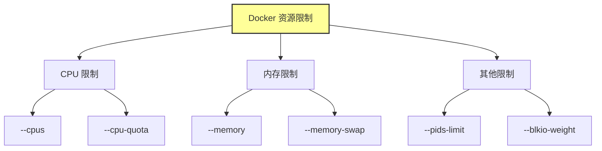
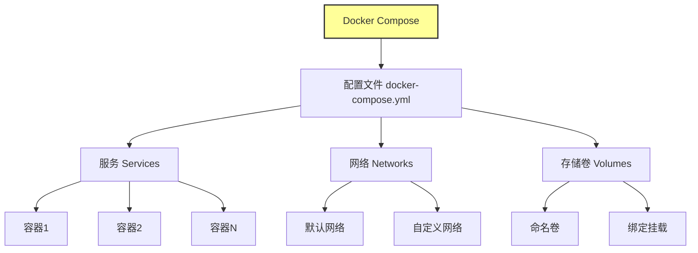

# Docker 进阶技术与企业级实践

## 学习目标：
* 掌握 Docker 网络模型，尤其是用户自定义桥接网络的使用，解决容器间通信问题。
* 掌握 Docker 存储卷的两种方式（绑定挂载和命名卷）的区别与应用场景，实现数据持久化。
* 掌握 Docker 资源限制方法，合理分配 CPU 和内存资源，确保系统稳定。
* 掌握 Docker Compose 的使用，能够通过 YAML 文件编排多容器应用，完成企业级项目实战。
* 了解企业级私有镜像仓库 Harbor 的部署与使用，提升镜像管理的安全性和效率。

## 深入理解 Docker 网络
### 理论讲解：Docker 网络模型
Docker 网络是 Docker 容器运行时的重要组成部分，它决定了容器如何与外界以及其他容器通信。为了让小白用户更容易理解，我会用生活中常见的例子来形容每种网络模型，并结合企业场景说明其适用性。

### Bridge（桥接模式 - 默认）：
想象你住在一个小区，小区里有一个内部网络（就像一个路由器），你家里的设备（容器）都可以通过这个网络互相通信，但如果你想访问外面的大网络（互联网或主机外部），必须通过小区的出口（端口映射）才能出去。

**举例：** 就像你在家用 Wi-Fi，设备之间可以通过 IP 地址互相 ping，但如果你不做额外设置，外面的人无法直接访问你家设备。Docker 的 Bridge 模式就是这样，容器在内部网络中可以通信，但外部访问需要通过 `-p` 参数映射端口。

**企业场景：** 适合单容器或简单测试环境，比如一个临时的 Web 服务器测试。

### Host（主机模式）：
想象你直接把家里的设备插到小区的主干网络上，没有任何隔离墙，设备完全暴露在小区网络中。虽然速度很快，但其他设备可能和你抢资源，甚至发生冲突。

**举例：** 就像你把电脑直接连到小区的公共路由器上，不用再设置端口转发，速度很快，但如果别人也在用同一个端口，可能会打架（端口冲突）。Docker 的 Host 模式就是容器直接用主机的网络，没有隔离，性能高但不安全。

**企业场景：** 适合需要极致性能的场景，比如某些高频交易系统，但生产环境不推荐，因为缺乏隔离。

### None（无网络模式）：
想象你家设备完全不联网，就像一台离线的电脑，只能自己玩，不能和任何人交流。

**举例：** 就像你用一台不联网的电脑做文档处理，完全独立。Docker 的 None 模式就是容器没有任何网络配置，完全隔离。

**企业场景：** 适合执行不需要网络的任务，比如离线数据处理或计算任务。


### 重点：用户自定义桥接网络（User-Defined Bridge Network）：
想象你在小区里建了一个私人俱乐部，只有俱乐部成员（容器）能加入这个网络。俱乐部内部有一个通讯录（内置 DNS 服务），你可以通过名字找到其他成员，不用记住他们的具体地址（IP）。即使有人搬家（容器重启，IP 变化），通讯录会自动更新，你还是能找到他们。

**举例：** 就像你在公司内部建了一个局域网，员工可以通过名字直接访问彼此的电脑，不用管 IP 地址是否变了。Docker 的用户自定义桥接网络就是这样，容器可以通过容器名直接通信，非常稳定。


**企业场景：** 非常适合多容器应用，比如一个微服务架构的项目，前端、后端、数据库都在同一个自定义网络中，互相调用非常方便。

### 总结
总结： 在企业中，用户自定义桥接网络是最常用的模式，因为它解决了容器间通信的稳定性问题，尤其是在微服务架构中，比如一个电商系统，前端容器需要调用后端 API，后端需要连接数据库，通过自定义网络可以直接用服务名通信，不用担心 IP 变化带来的麻烦。


### 结构图：网络模型对比（Mermaid 图）
以下是 Docker 网络模型的对比结构图，帮助你直观理解各种模式的区别：
```bash
graph TD
    A[Docker 网络模式] --> B[Bridge 默认]
    A --> C[Host 主机模式]
    A --> D[None 无网络]
    A --> E[用户自定义桥接网络]
    B --> B1[内部子网通信]
    B --> B2[无法通过容器名解析]
    B --> B3[适合单容器测试]
    C --> C1[共享主机网络]
    C --> C2[无隔离,易冲突]
    C --> C3[适合高性能需求]
    D --> D1[完全隔离]
    D --> D2[无网络配置]
    D --> D3[适合离线任务]
    E --> E1[内置DNS服务]
    E --> E2[通过容器名通信]
    E --> E3[适合微服务架构]

```

### 实践操作：创建自定义网络并测试容器间通信（基于你的镜像）
为了让学习内容更贴近你的实际需求，我们将使用你提供的镜像来验证 Docker 网络模式，尤其是用户自定义桥接网络的优势。我们将模拟一个企业级应用场景，包含多个服务（前端、后端、管理系统等），并通过不同网络模式测试容器间通信的效果。

### 实验背景（企业案例）：
设你是一家企业的运维工程师，需要部署一个综合管理系统，包括以下服务：

* fastapi-starter/master:2.0（后端 API 服务，Python 实现，内部端口 8070）。
* vue-manage-system/master:2.0（前端管理系统，Vue + Nginx 实现，内部端口 80）。
* typescript-starter/master:v1.0（另一个后端服务或中间件，Node.js 实现，内部端口 3000）。
* light-year-admin-template/master:0710-v1.0（另一个前端界面，HTML + Nginx 实现，内部端口 80）。

目标是让这些服务能够稳定通信，例如前端服务需要通过服务名调用后端 API，而不是依赖不稳定的 IP 地址。我们将对比默认 Bridge 网络和用户自定义桥接网络的效果。


### 实验: 使用自定义桥接网络与端口映射结合部署你的镜像

#### 实验背景：
模拟一个企业应用场景，部署你的镜像（`fastapi-starter/master:2.0` 作为后端 API，`vue-manage-system/master:2.0` 作为前端界面），使用用户自定义桥接网络实现容器间通信，并通过端口映射实现外部访问。

#### 实验目标：
1. 验证自定义桥接网络下容器间可以通过容器名通信。
2. 验证通过端口映射可以从主机访问容器服务。

#### 实验步骤

**1. 创建用户自定义桥接网络**

创建一个名为 enterprise-net 的自定义网络，用于容器间通信。

```bash
docker network create network-route
```

**2. 启动容器并加入自定义网络，同时映射端口**

* 启动后端 API 服务（fastapi-starter/master:2.0），内部端口 8070，映射到主机 8070 端口：
    ```bash
    docker run -d --name fastapi-starter --network network-route -p 8070:8070 fastapi-starter/master:2.0
    ```

* 启动前端服务（`vue-manage-system/master:2.0`），内部端口 80，映射到主机 8080 端口：
    ```bash
    docker run -d --name vue-manage-system --network network-route -p 8080:80 vue-manage-system/master:2.0
    ```

**说明：**

* --network network-route 确保两个容器在同一个自定义网络中，可以通过容器名通信。
* -p 8070:8070 和 -p 8080:80 将容器内部端口映射到主机端口，供外部访问。

**3. 测试容器间通信（内部通信）**

验证前端容器是否可以通过容器名访问后端 API 服务。

* 进入 `vue-manage-system`d 容器，尝试访问 `fastapi-starter：`
    ```bash
    docker exec -it vue-manage-system curl http://fastapi-starter:8070
    ```

#### 预期结果：

如果后端服务正常运行，应该返回 API 响应内容（具体响应取决于镜像实现）。这表明自定义桥接网络支持通过容器名通信。

#### 排查提示：
如果通信失败，可以用以下命令查看日志：

```bash
docker logs fastapi-starter
docker logs vue-manage-system
```

#### 测试外部访问（通过端口映射）
验证从主机是否可以访问容器服务。

* 在主机上使用浏览器或工具访问前端服务：`http://192.168.110.5:8080` 或 `http://主机IP:8080`。
* 预期结果： 应该能看到前端界面（具体内容取决于 vue-manage-system 镜像）。

#### 实验总结
* 自定义桥接网络：通过 network-route 网络，容器间可以直接使用容器名（如 vue-manage-system）通信，无需担心 IP 变化，适合企业中多服务协作场景。
* 端口映射（-p）：通过映射端口，主机或外部用户可以访问容器服务（如前端界面和 API），满足企业应用对外提供服务的需求。
* 结合使用：自定义网络和端口映射结合，既解决了内部通信问题，又满足了外部访问需求，是企业部署中的常见实践。

**注意事项：**

1. 确保主机端口（如 8070 和 8080）未被占用，否则映射会失败，可更换端口（如 -p 8081:80）。
2. 如果镜像服务未正常启动或响应异常，可通过 docker logs 排查问题。
3. 如果需要加入更多服务（如你的其他镜像 typescript-starter 或 light-year-admin-template），可以按照类似步骤添加。


## 深入理解 Docker 存储卷与资源限制

### Docker 存储卷：绑定挂载与命名卷

#### 1.1 理论讲解：绑定挂载（Bind Mount）与命名卷（Named Volume）的区别与优势
* 绑定挂载（Bind Mount）：
    * 定义：将主机上的目录或文件直接挂载到容器内，容器可以直接读写主机文件系统中的内容。
    * 优势：
        * 灵活性高，可以挂载主机任意目录，适合开发环境（如代码同步）。
        * 数据完全由主机管理，容器删除后数据不会丢失。
    * 劣势：
        * 依赖主机路径，跨主机迁移时需要手动调整路径。
        * 权限问题可能导致容器无法正常读写。
* 命名卷（Named Volume）：
    * 定义：由 Docker 管理的存储卷，独立于主机文件系统，数据存储在 Docker 内部（通常在 /var/lib/docker/volumes）。
    * 优势：
        * 便于管理，Docker 提供命令（如 docker volume ls）查看和操作。
        * 跨主机迁移更方便，配合备份工具可以轻松转移数据。
        * 支持驱动扩展（如 NFS、云存储）。
    * 劣势：
        * 数据位置不直观，需通过 Docker 命令管理。
        * 不如绑定挂载适合开发中的文件同步场景。

**总结：** 绑定挂载适合开发和临时数据共享，命名卷更适合生产环境和持久化数据管理。

#### 1.2 结构图：存储卷对比（Mermaid 图）
```bash
graph TD
    A[Docker 存储卷] --> B[绑定挂载 Bind Mount]
    A --> C[命名卷 Named Volume]
    B --> B1[主机目录/文件]
    B --> B2[容器内部路径]
    B1 --- B2[直接映射]
    C --> C1[Docker 管理存储]
    C --> C2[容器内部路径]
    C1 --- C2[逻辑映射]
    style B1 fill:#f9f,stroke:#333,stroke-width:2px
    style C1 fill:#bbf,stroke:#333,stroke-width:2px

```

#### 1.3 实践操作：创建命名卷并挂载到容器
我们以 MySQL 为例，创建命名卷存储数据库数据，确保容器删除后数据依然保留。

##### 1.3.1 MySQL 简介
MySQL 是一个流行的开源关系型数据库管理系统（RDBMS），广泛用于企业应用中存储和管理结构化数据。它支持 SQL 查询语言，适用于 Web 应用、电商系统、内容管理等场景。Docker 提供官方 MySQL 镜像，方便快速部署。

##### 1.3.2 实践步骤：安装 MySQL 并挂载命名卷

1. 创建命名卷：
    ```bash
    # 用于存储 MySQL 数据。
    docker volume create mysql-data
    ```

2. 启动 MySQL 容器并挂载命名卷：
    ```bash
    # 将命名卷挂载到 MySQL 的数据目录 /var/lib/mysql，并设置环境变量。
    docker run -d --name mysql-server \
        -e MYSQL_ROOT_PASSWORD=root123 \
        -v mysql-data:/var/lib/mysql \
        -p 3306:3306 \
        mysql:8.0
    ```

3. 验证命名卷是否生效：
    ```bash
    # 查看卷信息，确认挂载成功。
    docker volume ls
    docker inspect mysql-data
    ```

4. 创建用户并授权：
    ```bash
    进入 MySQL 容器，创建用户 admin 并授予权限，方便本地连接。
    docker exec -it mysql-server mysql -uroot -p
    ```

    ```bash
    # 输入密码 root123 后，执行以下 SQL 命令：
    CREATE USER 'admin'@'%' IDENTIFIED WITH 'caching_sha2_password' BY 'admin123';
    GRANT ALL PRIVILEGES ON *.* TO 'admin'@'%' WITH GRANT OPTION;
    FLUSH PRIVILEGES;
    EXIT;
    ```

5. 本地连接测试：
    在主机安装 MySQL 客户端（如 navicat ），连接 主机IP:3306，使用用户名 admin 和密码 admin123 登录，验证是否成功。

6. 验证数据持久化：
    ```bash
    # 删除容器并重新创建，确认数据依然存在。
    docker rm -f mysql-server
    docker run -d --name mysql-server \
    -e MYSQL_ROOT_PASSWORD=root123 \
    -v mysql-data:/var/lib/mysql \
    -p 3306:3306 \
    swr.cn-north-4.myhuaweicloud.com/ddn-k8s/docker.io/mysql:8.0.30

    ```

    再次登录，数据应未丢失。


## Docker 资源限制

### 理论讲解：资源限制的必要性及常用参数
* 必要性：
    * 防止容器过度占用主机资源（如 CPU、内存），影响其他服务或主机稳定性。
    * 企业环境中，资源分配需合理规划，确保关键服务优先级。
    * 避免资源竞争导致服务崩溃，特别是在多容器部署场景。
* 常用参数：
    * CPU 限制：--cpus（指定 CPU 核心数，如 --cpus="1.5"）或 --cpu-quota（更细粒度的 CPU 时间片限制）。
    * 内存限制：--memory（限制最大内存，如 --memory="512m"）和 --memory-swap（限制交换分区使用）。
    * 其他：--pids-limit（限制进程数）、--blkio-weight（限制 I/O 带宽）等。

**总结：** 资源限制是企业部署中保障服务稳定性和资源均衡的重要手段。


### 结构图：资源限制结构（Mermaid 图）


### 实践操作：启动容器并设置 CPU 和内存限制
我们继续以 MySQL 容器和你的镜像为例，设置资源限制。

#### 对 MySQL 容器设置资源限制
重新启动 MySQL 容器，限制 CPU 为 1 核心，内存为 512MB。

```bash
docker rm -f mysql-server
docker run -d --name mysql-server \
  -e MYSQL_ROOT_PASSWORD=root123 \
  -v mysql-data:/var/lib/mysql \
  -p 3306:3306 \
  --cpus="1" \
  --memory="512m" \
  mysql:8.0

```

#### 对你的镜像设置资源限制
以 `fastapi-starter/master:2.0` 为例，限制 CPU 为 0.5 核心，内存为 256MB。

1. 删除之前启动的容器
    ```bash
    docker stop fastapi-starter && docker rm fastapi-starter
    docker stop vue-manage-system && docker rm vue-manage-system
    ```

2. 启动容器并设置资源限制：
    ```bash
    docker run -d --name fastapi-starter \
        --network network-route \
        -p 8070:8070 \
        --cpus="0.5" \
        --memory="256m" \
        fastapi-starter/master:2.0
    ```

3. 验证资源限制
查看容器资源使用情况，确认限制是否生效。

```bash
docker stats mysql-server fastapi-starter

```

输出会显示 CPU 和内存使用情况，确认是否在限制范围内。

### 综合总结
* 存储卷： 命名卷适合生产环境持久化数据（如 MySQL 数据），绑定挂载适合开发和临时文件共享。结合 MySQL 实践，创建用户并授权后，本地可以成功连接数据库。
* 资源限制： 通过 --cpus 和 --memory 参数，可以有效控制容器资源占用，保障企业环境中多服务的稳定性。
* 结合实践： 使用你的镜像和 MySQL，模拟了企业场景下的存储和资源管理，验证了理论的实际效果。

**注意事项：**

* MySQL 连接时若遇到认证插件问题，可尝试将 caching_sha2_password 改为 mysql_native_password。
* 资源限制值需根据实际硬件和业务需求调整，避免过低导致服务不可用。
* 清理资源时，注意备份重要数据（如命名卷）。


## 服务编排：Docker Compose 实战（核心）
### 什么是 Docker Compose？
Docker Compose 是一个用于定义和运行多容器 Docker 应用的工具。通过一个简单的 YAML 文件，你可以配置应用的多个服务、网络和卷（volume），然后用一条命令启动或停止整个应用。它特别适合开发、测试和生产环境，帮助你管理多个容器之间的依赖关系。

简单来说：

* Docker：用来创建和运行单个容器。
* Docker Compose：用来管理多个容器，让它们协同工作。

### 理论讲解：Docker Compose 的概念与优势
* **概念：** Docker Compose 是一个用于定义和运行多容器 Docker 应用的工具，通过一个 YAML 格式的配置文件 (docker-compose.yml)，可以一次性配置和启动多个容器及其依赖关系（如网络、卷、环境变量等）。
* **优势：**
    * 简化多容器管理： 通过单个文件定义多个服务、网络和存储卷，减少手动命令操作。
    * 依赖管理： 自动处理服务间的启动顺序和网络连接，适合复杂应用（如微服务架构）。
    * 环境一致性： 配置文件可版本化，确保开发、测试和生产环境一致。
    * 易于扩展： 支持参数化配置，方便调整规模或环境变量。
* **适用场景：** 企业中多服务应用（如前端+后端+数据库）的快速部署与测试。

### Docker Compose 的基本用法
1. 安装：首先确保你已经安装了 Docker 和 Docker Compose。Docker Compose 通常随 Docker Desktop 一起安装。
2. 配置文件：创建一个名为 docker-compose.yml 的文件，用来定义你的服务。
3. 命令：通过 docker compose 命令来管理容器，比如启动、停止、重启等。

### docker-compose.yml 文件的基本语法
`docker-compose.yml` 文件是 Docker Compose 的核心，使用 YAML 格式（一种易读的配置文件格式）。下面是一个简单的例子和基本结构的说明：

### 示例文件
```bash
services:       # 定义应用的服务
  web:          # 服务名称，可以自定义
    image: nginx:latest  # 使用哪个镜像
    ports:               # 端口映射
      - "80:80"          # 主机端口:容器端口
    volumes:             # 挂载数据卷
      - ./html:/usr/share/nginx/html  # 本地路径:容器路径
  db:           # 另一个服务
    image: mysql:5.7
    environment:         # 环境变量
      MYSQL_ROOT_PASSWORD: rootpassword
    volumes:
      - db_data:/var/lib/mysql

volumes:  # 定义数据卷
  db_data:

```

**主要字段解释**

1. version：指定 Docker Compose 文件的版本，不同版本支持的特性可能不同。建议使用较新的版本，比如 3.8。
2. services：定义你的应用中包含的服务（可以理解为容器组）。每个服务可以是一个独立的容器。
    * image：指定服务使用的 Docker 镜像，比如 nginx:latest。
    * ports：映射端口，格式为 "主机端口:容器端口"，让外部可以访问容器内的服务。
    * volumes：挂载数据卷，用于持久化数据或共享文件。格式为 本地路径:容器路径 或引用定义的卷。
    * environment：设置环境变量，比如数据库密码。
    * 其他常用字段：
        * depends_on：指定服务依赖关系，确保某些服务先启动。
        * restart：定义容器重启策略，比如 always。
3. volumes：定义数据卷，用于在服务之间共享数据或持久化存储。
4. networks（可选）：定义网络，控制服务之间的通信。


### 结构图：Docker Compose 结构（Mermaid 图）


### 常用 Docker Compose 命令
* `docker compose up`：根据配置文件启动服务。
* `docker compose down`：停止并删除服务。
* `docker compose ps`：查看运行中的服务。
* `docker compose logs`：查看服务日志。
* `docker compose build`：根据配置文件构建镜像。
* `docker compose config`：验证配置文件语法错误。

### 总结
Docker Compose 是一个强大的工具，通过一个简单的 YAML 文件，你可以轻松管理多个容器及其配置。作为初学者，建议从一个简单的项目开始，比如搭建一个简单的 Web 应用和数据库，熟悉 `docker-compose.yml` 的基本字段和命令。

### 实践操作：通过 Docker Compose 搭建 Pear Admin Golang 项目

#### 项目简介
`pear-admin-golang` 是一个基于 Go 语言开发的后台管理系统（Pear Admin），支持用户管理、权限控制等功能，依赖数据库（如 SQLite 或 MySQL）和 Redis 作为存储服务。本实践将通过 Docker Compose 编排项目服务、MySQL 和 Redis，并基于提供的配置文件进行部署。

#### 准备工作
1. 安装 Docker 和 Docker Compose（确保已安装）。
2. 克隆项目代码：
    ```bash
    git clone https://gitee.com/pear-admin/pear-admin-golang.git
    cd pear-admin-golang
    ```

#### 编写 Dockerfile
为 `pear-admin-golang` 构建镜像，Dockerfile 内容如下：

```bash
# 基础镜像使用 Go 官方镜像
FROM swr.cn-north-4.myhuaweicloud.com/ddn-k8s/docker.io/library/golang:1.24-alpine AS builder

# 设置工作目录
WORKDIR /app

# 复制项目代码到容器
COPY . .

# 下载依赖并构建
RUN go mod tidy
RUN CGO_ENABLED=0 GOOS=linux go build -o pear-admin ./main.go

# 使用轻量级镜像运行
FROM swr.cn-north-4.myhuaweicloud.com/ddn-k8s/docker.io/library/alpine:latest

# 安装必要的工具
RUN apk --no-cache add ca-certificates

# 设置工作目录
WORKDIR /app

# 复制构建好的二进制文件
COPY --from=builder /app/pear-admin .

# 复制配置文件（如果有）
COPY --from=builder /app/config.toml .

# 暴露端口
EXPOSE 8009

# 运行应用
CMD ["./pear-admin"]

```

#### 编写配置文件 config.toml
根据提供的配置内容，创建或修改 config.toml 文件，确保与 MySQL 和 Redis 服务匹配：

```bash
# 数据库配置 (使用 MySQL)
[db]
DBType = "mysql"
DBName = "pear_admin"
DBUser = "admin"
DBPwd = "admin123"
DBHost = "mysql:3306"

# Redis 配置
[redis]
RedisAddr = "redis:6379"
RedisPWD = ""
RedisDB = 0

# 日志配置
[zaplog]
director = 'runtime/log'

# 其他杂项配置
[app]
HttpPort = 8009
PageSize = 20
RunMode = "debug"
JwtSecret = "0102$%#&*^*&150405"
ImgSavePath = "static/upload"
ImgUrlPath = "runtime/upload/images"

```

#### 编写 Docker Compose 文件 docker-compose.yml
定义三个服务：pear-admin（应用）、mysql（数据库）和 redis（缓存）。
```bash
version: '3.8'  # 指定 Docker Compose 文件的版本，3.8 是一个比较新的版本，支持较多的功能和兼容性

services:  # 定义应用中的服务（可以理解为多个容器）
  pear-admin:  # 第一个服务，名字叫 pear-admin，可以自定义
    build: .  # 从当前目录下的 Dockerfile 构建镜像（说明你有自己的自定义镜像）
    image: pear-admin:latest  # 构建后的镜像名称和标签
    container_name: pear-admin  # 容器名称，方便识别和管理
    ports:  # 端口映射设置
      - "8009:8009"  # 将主机的 8009 端口映射到容器的 8009 端口，外部可以通过主机 8009 访问服务
    depends_on:  # 指定依赖关系
      - mysql  # pear-admin 服务依赖 mysql 服务，Docker Compose 会先启动 mysql
      - redis  # pear-admin 服务也依赖 redis 服务，Docker Compose 会先启动 redis
    networks:  # 指定网络
      - app-net  # 将该服务连接到自定义网络 app-net，方便服务间通信
    volumes:  # 挂载数据卷，用于文件共享或持久化
      - ./config.toml:/app/config.toml  # 将本地目录下的 config.toml 文件挂载到容器内的 /app/config.toml 路径
      - pear-log:/app/runtime/log  # 将自定义的数据卷 pear-log 挂载到容器内的 /app/runtime/log 路径，用于存储日志
    restart: always  # 重启策略，容器退出时总是重启（比如崩溃后自动恢复）

  mysql:  # 第二个服务，名字叫 mysql
    image: mysql:8.0  # 使用官方的 MySQL 镜像，版本为 8.0
    container_name: mysql  # 容器名称，方便识别
    environment:  # 设置环境变量，用于配置 MySQL
      MYSQL_ROOT_PASSWORD: root123  # 设置 MySQL 的 root 用户密码为 root123
      MYSQL_DATABASE: pear_admin  # 创建一个名为 pear_admin 的数据库
      MYSQL_USER: admin  # 创建一个用户名为 admin 的用户
      MYSQL_PASSWORD: admin123  # 设置用户 admin 的密码为 admin123
    ports:  # 端口映射
      - "3306:3306"  # 将主机的 3306 端口映射到容器的 3306 端口，外部可以通过主机 3306 访问 MySQL
    volumes:  # 挂载数据卷
      - mysql-data:/var/lib/mysql  # 将自定义的数据卷 mysql-data 挂载到容器内的 /var/lib/mysql，用于持久化 MySQL 数据
    networks:  # 指定网络
      - app-net  # 连接到自定义网络 app-net，与其他服务通信
    restart: always  # 重启策略，容器退出时总是重启

  redis:  # 第三个服务，名字叫 redis
    image: redis:latest  # 使用官方的 Redis 镜像，最新版本
    container_name: redis  # 容器名称，方便识别
    ports:  # 端口映射
      - "6379:6379"  # 将主机的 6379 端口映射到容器的 6379 端口，外部可以通过主机 6379 访问 Redis
    networks:  # 指定网络
      - app-net  # 连接到自定义网络 app-net，与其他服务通信
    restart: always  # 重启策略，容器退出时总是重启

networks:  # 定义网络
  app-net:  # 自定义网络名称为 app-net
    driver: bridge  # 使用 bridge 驱动，这是一种默认的网络模式，容器可以通过该网络互相通信

volumes:  # 定义数据卷
  mysql-data:  # 自定义数据卷名称为 mysql-data，用于存储 MySQL 数据
  pear-log:  # 自定义数据卷名称为 pear-log，用于存储 pear-admin 的日志

```

**整体解释**
这段 docker-compose.yml 文件定义了一个包含三个服务的应用：

* pear-admin：这是一个自定义的服务，可能是你的主应用（比如一个后端服务）。它依赖于 mysql 和 redis，通过构建当前目录的 Dockerfile 生成镜像，并映射了 8009 端口供外部访问。配置文件和日志通过挂载方式与主机共享。
* mysql：这是一个数据库服务，使用 MySQL 8.0 镜像，配置了数据库名称、用户和密码，并将数据持久化存储在 mysql-data 卷中，映射了 3306 端口供外部访问。
* redis：这是一个缓存服务，使用最新的 Redis 镜像，映射了 6379 端口供外部访问。

此外，三个服务都连接到一个名为 app-net 的自定义网络中，这样它们可以通过服务名称（如 mysql 或 redis）直接通信，而不需要通过 IP 地址。

**关键点说明**
* depends_on：确保 pear-admin 在 mysql 和 redis 启动后再启动，但这只是启动顺序的保证，不代表服务已经完全可用（比如 MySQL 可能还没初始化完成）。
* volumes：数据卷非常重要，mysql-data 确保 MySQL 数据在容器重启后不会丢失；pear-log 确保日志可以持久化存储。
* networks：自定义网络 app-net 让服务之间可以通过名称互相访问，比如 pear-admin 可以直接用 mysql:3306 连接数据库。
* restart: always：确保容器在崩溃或主机重启后自动恢复，适合生产环境。

#### 系统垃圾的，用这个，我给你加了资源限制
```bash
version: '3.8'  # 指定 Docker Compose 文件的版本，3.8 是一个较新的版本，支持更多功能和兼容性

services:  # 定义应用中的服务，每个服务对应一个或多个容器
  pear-admin:  # 第一个服务，名字叫 pear-admin，通常是你的主应用
    build: .  # 从当前目录下的 Dockerfile 构建镜像，说明你有自定义镜像
    image: pear-admin:latest  # 构建后的镜像名称和标签
    container_name: pear-admin  # 容器名称，方便识别和管理
    ports:  # 端口映射设置
      - "8009:8009"  # 将主机的 8009 端口映射到容器的 8009 端口，外部可以通过主机 8009 访问服务
    depends_on:  # 指定依赖关系
      - mysql  # pear-admin 依赖 mysql 服务，Docker Compose 会先启动 mysql
      - redis  # pear-admin 也依赖 redis 服务，Docker Compose 会先启动 redis
    networks:  # 指定网络
      - app-net  # 将该服务连接到自定义网络 app-net，方便服务间通信
    volumes:  # 挂载数据卷，用于文件共享或持久化
      - ./config.toml:/app/config.toml  # 将本地目录下的 config.toml 文件挂载到容器内的 /app/config.toml 路径
      - pear-log:/app/runtime/log  # 将自定义数据卷 pear-log 挂载到容器内的 /app/runtime/log，用于存储日志
    restart: always  # 重启策略，容器退出时总是重启（比如崩溃后自动恢复）
    deploy:  # 资源限制配置，用于限制内存和 CPU 使用，防止主机资源耗尽
      resources:
        limits:  # 设置资源上限，容器无法超过这些限制
          cpus: "0.5"  # 限制使用 0.5 个 CPU 核心（约 25% 的 2 核主机）
          memory: "1G"  # 限制最大内存使用为 1GB（约 25% 的 4G 主机）
        reservations:  # 设置资源预留，保证最低资源
          cpus: "0.2"  # 预留 0.2 个 CPU 核心
          memory: "512M"  # 预留 512MB 内存

  mysql:  # 第二个服务，名字叫 mysql，通常是数据库服务
    image: mysql:8.0  # 使用官方 MySQL 镜像，版本为 8.0
    container_name: mysql  # 容器名称，方便识别
    environment:  # 设置环境变量，用于配置 MySQL
      MYSQL_ROOT_PASSWORD: root123  # 设置 MySQL 的 root 用户密码为 root123
      MYSQL_DATABASE: pear_admin  # 创建一个名为 pear_admin 的数据库
      MYSQL_USER: admin  # 创建一个用户名为 admin 的用户
      MYSQL_PASSWORD: admin123  # 设置用户 admin 的密码为 admin123
    ports:  # 端口映射
      - "3306:3306"  # 将主机的 3306 端口映射到容器的 3306 端口，外部可以通过主机 3306 访问 MySQL
    volumes:  # 挂载数据卷
      - mysql-data:/var/lib/mysql  # 将自定义数据卷 mysql-data 挂载到容器内的 /var/lib/mysql，用于持久化 MySQL 数据
    networks:  # 指定网络
      - app-net  # 连接到自定义网络 app-net，与其他服务通信
    restart: always  # 重启策略，容器退出时总是重启
    deploy:  # 资源限制配置
      resources:
        limits:  # 设置资源上限
          cpus: "0.5"  # 限制使用 0.5 个 CPU 核心
          memory: "1G"  # 限制最大内存使用为 1GB
        reservations:  # 设置资源预留
          cpus: "0.2"  # 预留 0.2 个 CPU 核心
          memory: "512M"  # 预留 512MB 内存

  redis:  # 第三个服务，名字叫 redis，通常是缓存服务
    image: redis:latest  # 使用官方 Redis 镜像，最新版本
    container_name: redis  # 容器名称，方便识别
    ports:  # 端口映射
      - "6379:6379"  # 将主机的 6379 端口映射到容器的 6379 端口，外部可以通过主机 6379 访问 Redis
    networks:  # 指定网络
      - app-net  # 连接到自定义网络 app-net，与其他服务通信
    restart: always  # 重启策略，容器退出时总是重启
    deploy:  # 资源限制配置
      resources:
        limits:  # 设置资源上限
          cpus: "0.3"  # 限制使用 0.3 个 CPU 核心
          memory: "512M"  # 限制最大内存使用为 512MB
        reservations:  # 设置资源预留
          cpus: "0.1"  # 预留 0.1 个 CPU 核心
          memory: "256M"  # 预留 256MB 内存

networks:  # 定义网络
  app-net:  # 自定义网络名称为 app-net
    driver: bridge  # 使用 bridge 驱动，这是一种默认网络模式，容器可以通过该网络互相通信

volumes:  # 定义数据卷
  mysql-data:  # 自定义数据卷名称为 mysql-data，用于存储 MySQL 数据
  pear-log:  # 自定义数据卷名称为 pear-log，用于存储 pear-admin 的日志

```

**资源限制（重点）**
考虑到你的主机是 2 核 4G，我为每个服务添加了资源限制，防止某个容器占用过多资源导致主机崩溃：

* deploy.resources.limits：设置容器的资源上限，容器无法超过这个值。
    * cpus：限制 CPU 使用量，单位可以是小数（如 "0.5" 表示半个核心）。总和为 1.3 核，占主机 65%，留一些给系统。
    * memory：限制内存使用量，单位可以用 M（MB）或 G（GB）。总和为 2.5GB，占主机 62.5%，留一些给其他进程。
* deploy.resources.reservations：设置最低资源预留，如果主机资源不足以满足预留值，容器可能无法启动。预留值比上限小，确保容器在资源紧张时也能运行。
* 分配情况：
    * pear-admin：主应用，分配 0.5 核和 1GB 内存上限。
    * mysql：数据库，分配 0.5 核和 1GB 内存上限。
    * redis：缓存服务，分配 0.3 核和 512MB 内存上限。

#### 启动与验证
1. 先把go项目build一下，注意哦，用的docker compose 构建的
    ```bash
    docker compose build pear-admin
    ```
1. 启动服务： `docker-compose up -d`
2. 查看日志，确保服务正常运行：
    ```bash
    docker-compose logs pear-admin
    docker-compose logs mysql
    ```
3. 访问应用：
    在浏览器中访问 http://localhost:8009，查看 Pear Admin 界面（初始用户和密码可能需要在日志中查找或根据文档设置）。

4. 停止与清理：(留着先别做)
    ```bash
    docker-compose down
    ```


## 