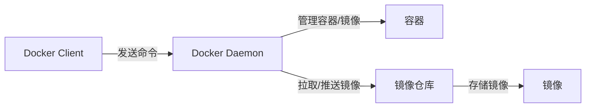
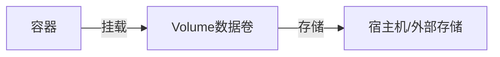

好的！我会按照你的要求，把**所有题目**都详细讲解一遍，继续保持教学文案风格、通俗类比、配合 mermaid 结构图和实际例子，尽量让每个知识点都讲清楚。

---

## 基础概念类

### 1. 能详细介绍一下Docker是什么？为什么现在企业都在使用Docker？它解决了哪些问题？

**Docker 是什么？**  
Docker 是一个“容器化”平台，可以把应用和它的环境、依赖全部打包在一个可移植的容器里。这样不管运行环境如何变化，应用都能“一次打包，到处运行”。

**为什么企业用 Docker？**  
- 解决“环境不一致”问题（开发、测试、生产环境完全一致）
- 部署快、升级方便、回滚简单
- 资源利用率高（比虚拟机轻量）
- 易于自动化运维、弹性扩容

**举例类比：**  
- 像快递公司用统一的箱子运货，保证无论送到哪里，货物都不会变形。

---

### 2. Docker和虚拟机的区别（资源利用、启动速度、隔离性等）

| 对比项       | Docker 容器               | 虚拟机                   |
|--------------|--------------------------|--------------------------|
| 启动速度     | 秒级，像启动一个进程      | 分钟级，像开一台新电脑   |
| 资源利用率   | 共享主机内核，轻量高效    | 独立OS，资源占用大       |
| 隔离性       | 进程级隔离，安全性较弱    | 硬件级隔离，安全性更高   |
| 体积         | 小（MB级）                | 大（GB级）               |

**类比：**  
- 虚拟机像租独立公寓，Docker像租单人房（共用厨房和厕所）。

---

### 3. Docker整体架构（mermaid结构图）



- **Client**：你操作的终端
- **Daemon**：后台服务，实际执行命令
- **Registry**：镜像仓库（如Docker Hub）
- **Image**：镜像，容器的模板
- **Container**：运行中的实例

---

### 4. 镜像和容器的关系（类比）

- **镜像（Image）**：像游戏安装包，是静态模板
- **容器（Container）**：像正在运行的游戏，是动态实例

---

### 5. Docker Hub是什么？还有哪些仓库？企业如何选择？

- **Docker Hub**：官方镜像仓库，像“应用商店”
- **其他公共仓库**：阿里云、腾讯云、Google GCR等
- **私有仓库**：Harbor、Nexus、GitLab Container Registry

**企业选择：**
- 公共镜像用Docker Hub或国内云厂商
- 自研镜像建议用私有仓库，保证安全和可控

---

### 6. 容器隔离实现原理（Namespace和CGroup）

- **Namespace**：把进程的“视野”隔开（如PID、网络、文件系统等）
- **CGroup**：限制每个容器能用多少CPU、内存等资源

**类比：**  
- Namespace像每人一个房间，互不干扰  
- CGroup像每个房间的电表，限制用多少电

---

### 7. Docker网络模式（实际场景举例）

- **bridge**（默认）：容器有独立IP，适合大多数应用
- **host**：容器和主机共用网络，适合需要极致性能的场景
- **none**：容器没有网络，适合安全隔离场景

---

### 8. Docker Volume原理及图示

**问题**：容器删了，数据也没了  
**Volume**：数据独立存储，不随容器消失



**类比**：  
- 容器=租房，Volume=行李箱，换房行李还在

---

### 9. 镜像分层存储的优势

- 只存储变化部分，节省空间
- 多镜像共用底层，构建快
- 升级、回滚方便

**例子**：  
- 基础层是Ubuntu，多个镜像共用，不重复下载

---

### 10. 不同存储驱动区别（overlay2、devicemapper等）

- **overlay2**：主流，性能好，支持大多数场景
- **devicemapper**：老驱动，适合老系统
- **aufs、btrfs、zfs**：各有优缺点，需特殊需求时选用

**企业建议**：  
- 新系统首选 overlay2（官方推荐）

---

## 命令操作类

### 11. 必须掌握的基本Docker命令（按场景分类）

**镜像操作：**
- 拉取镜像：`docker pull`
- 查看镜像：`docker images`
- 删除镜像：`docker rmi`

**容器操作：**
- 启动容器：`docker run`
- 查看容器：`docker ps -a`
- 停止容器：`docker stop`
- 删除容器：`docker rm`

**其他：**
- 查看日志：`docker logs`
- 进入容器：`docker exec -it`
- 构建镜像：`docker build`

---

### 12. 查看容器日志及常用参数

- 查看日志：`docker logs <container>`
- 常用参数：
  - `-f`：实时跟踪日志
  - `--tail N`：只看最后N行
  - `--since`：从指定时间开始

---

### 13. 进入容器内部操作：docker exec vs docker attach

- `docker exec -it <容器名> bash/sh`：开启新终端，安全，推荐
- `docker attach <容器名>`：连接容器主进程，容易“卡死”，不推荐

**类比：**  
- exec像新开一扇门，attach像钻进别人正在用的门

---

### 14. 容器随宿主机重启自动启动

- 启动容器时加参数：`--restart=always`
- 其他选项：`no`（默认）、`on-failure`、`unless-stopped`

---

### 15. 批量清理不用的镜像和容器

- 删除所有停止的容器：`docker container prune`
- 删除所有未使用的镜像：`docker image prune`
- 一键清理所有无用资源：`docker system prune`

---

### 16. 构建Docker镜像的方式及Dockerfile过程

- 方式1：用Dockerfile（推荐，自动化）
- 方式2：用`docker commit`（手动，不推荐）

**Dockerfile 构建流程：**
1. 编写Dockerfile
2. `docker build`命令构建镜像
3. 每一条命令生成一层镜像，分层存储

---

### 17. save和export的区别（备份镜像和容器）

- `docker save`：导出镜像（包括所有历史层），适合迁移镜像
- `docker export`：导出容器（只有当前文件系统），适合迁移容器快照

**类比：**
- save像复制整个游戏安装包
- export像只复制当前存档

---

### 18. 监控容器资源（CPU、内存、网络）

- 命令：`docker stats`
- 工具：cAdvisor、Prometheus、Grafana等

---

### 19. 限制每个容器的资源上限（多用户共享）

- CPU：`--cpus=1.5`
- 内存：`--memory=512m`
- 网络：用`tc`工具限制带宽

---

### 20. 生产环境创建镜像：commit还是Dockerfile？

- **推荐Dockerfile**，可追溯、自动化、便于维护
- commit只适合临时快照，生产不建议

---

## Dockerfile相关

### 21. 常用指令及例子

- `FROM`：指定基础镜像  
  `FROM ubuntu:20.04`
- `RUN`：执行命令  
  `RUN apt-get update`
- `COPY`：复制文件  
  `COPY . /app`
- `ADD`：复制文件并支持解压、URL  
  `ADD app.tar.gz /app/`
- `CMD`：默认启动命令  
  `CMD ["python","app.py"]`
- `ENTRYPOINT`：入口点  
  `ENTRYPOINT ["nginx"]`
- `ENV`：设置环境变量  
  `ENV PORT=8080`
- `EXPOSE`：声明端口  
  `EXPOSE 80`

---

### 22. CMD和ENTRYPOINT的区别

- **CMD**：建议的默认命令，可被`docker run`后面的命令覆盖
- **ENTRYPOINT**：强制入口点，不会被覆盖

**场景：**
- CMD适合可变命令
- ENTRYPOINT适合固定主程序

---

### 23. ADD和COPY的区别

- **COPY**：仅复制本地文件到镜像
- **ADD**：除复制外，还能自动解压tar包，支持URL下载

**建议：**
- 只复制用COPY，需要解压或下载用ADD

---

### 24. 多阶段构建（优化镜像大小）

**原理：**  
- 多个FROM，每阶段只保留需要的文件

**例子：**
```dockerfile
FROM golang:1.20 AS builder
WORKDIR /app
COPY . .
RUN go build -o main .

FROM alpine:latest
WORKDIR /app
COPY --from=builder /app/main .
CMD ["./main"]
```
**好处：**  
- 只保留最终二进制文件，极大减小镜像体积

---

### 25. 优化镜像体积的常用方法

- 用更小的基础镜像（如alpine）
- 合并RUN命令减少层数
- 清理无用文件（如apt缓存）
- 多阶段构建只保留必要文件
- 精确COPY/ADD需要的内容

---

如果还有具体某一题想要更深入举例或者代码演示，可以随时告诉我！