# Jenkins CI/CD 综合企业实战

## 教学目标
- 明确学习路径，通过三个项目（入门、中等、高级）逐步掌握 Jenkins Pipeline 的编写与部署。
- 学会分析项目需求、设计参数界面、规划部署步骤，并将参数传递给 PyDockerDeploy 工具。

## 前提环境配置
**理论讲解**：
- **Jenkins 环境**：需要一个运行中的 Jenkins 服务器，支持主从架构（Master 和 Slave/Agent）。
- **从节点（Agent）**：从节点负责执行具体任务，如代码拉取、构建和部署。
- **工具准备**：
  - **Git**：用于代码拉取。
  - **Docker**：用于镜像构建和容器部署。
  - **PyDockerDeploy**：一个 Python 脚本工具，用于自动化 Docker 部署。
  - **Harbor**：私有镜像仓库，用于存储构建的 Docker 镜像。

**实践步骤**：
1. **检查 Jenkins 环境**：
   - 登录 Jenkins UI，确保可以正常访问。
   - 确认已配置从节点（后续会详细讲解从节点配置）。
2. **安装基础工具**：
   - 在从节点主机上安装 Git 和 Docker：
   - 确保 Docker 服务启动
   - 配置私有仓库 `harbor.labworlds.cc` 必须要能够登录
3. **下载并配置 PyDockerDeploy 工具**：
   - 登录从节点主机，使用 `ubuntu` 用户。
   - 使用 Git 拉取代码仓库：
     ```bash
     git clone https://gitee.com/Tender-Liu/PyDockerDeploy.git
     ```
   - 修改 `config_manager.py` 文件中的 SSH 配置：
     打开文件 `PyDockerDeploy/config_manager.py`，找到以下代码段：
     ```python
     # 构建 SSH 配置
     ssh_config = {
         'hostname': host,
         'port': 5423,
         'username': "ubuntu",
         'private_key_file': "/home/ubuntu/.ssh/id_rsa"
     }
     ```
     根据企业需求修改为指定内容，例如：
     ```python
     ssh_config = {
         'hostname': host,
         'port': 22,  # 修改为企业 SSH 端口
         'username': "your_username",  # 修改为企业用户名
         'private_key_file': "/path/to/your/private/key"  # 修改为企业私钥路径
     }
     ```
   - 修改 `deployer.py` 文件中的 SSH 配置：
     打开文件 `PyDockerDeploy/deployer.py`，找到以下代码段：
     ```python
     for host in deployer.config.hosts:
         ssh_client = Client(
             hostname=host,
             port=5423,  # SSH 默认端口
             username='ubuntu',  # 默认用户名
             private_key_file='E:/ssh-key/school_linux_key/id_rsa'  # 默认私钥路径
         )
         ssh_clients.append(ssh_client)
     ```
     根据企业需求修改为指定内容，例如：
     ```python
     for host in deployer.config.hosts:
         ssh_client = Client(
             hostname=host,
             port=22,  # 修改为企业 SSH 端口
             username='your_username',  # 修改为企业用户名
             private_key_file='/path/to/your/private/key'  # 修改为企业私钥路径
         )
         ssh_clients.append(ssh_client)
     ```
4. **配置 Git 免密拉取**（详细步骤将在后续部分展开）：
   - 生成 SSH 公私钥对，并将公钥添加到 Git 仓库（如 Gitee）。
   - 将私钥存储到 Jenkins 凭据管理。
   - 配置 SSH 配置文件和文件权限。

**注意事项**：
- 确保 Jenkins 和从节点之间网络通畅。
- 确认从节点有权限访问 Git 仓库和 Harbor 镜像仓库。
- 所有从节点主机都需要完成上述配置。


## 教案：入门项目 - Go 后端服务 (`training-go-starter-liujun`) CI/CD 流程

### 1. 学习路径
**理论讲解**：
- **综合项目目标**：通过 `training-go-starter-liujun` 项目，掌握 Go 语言后端服务的 CI/CD 流程，熟悉 Jenkins Pipeline 的基本使用，学习如何处理后端项目的编译、镜像构建和部署。
- **学习步骤**：
  1. 分析 Go 后端项目的特性和部署需求。
  2. 设计参数界面，满足后端项目的灵活部署需求。
  3. 规划 Pipeline 的部署步骤，拆分为多个 Stage。
  4. 将参数传递给部署工具（如 PyDockerDeploy），完成自动化部署。

**Mermaid 结构图**：学习路径
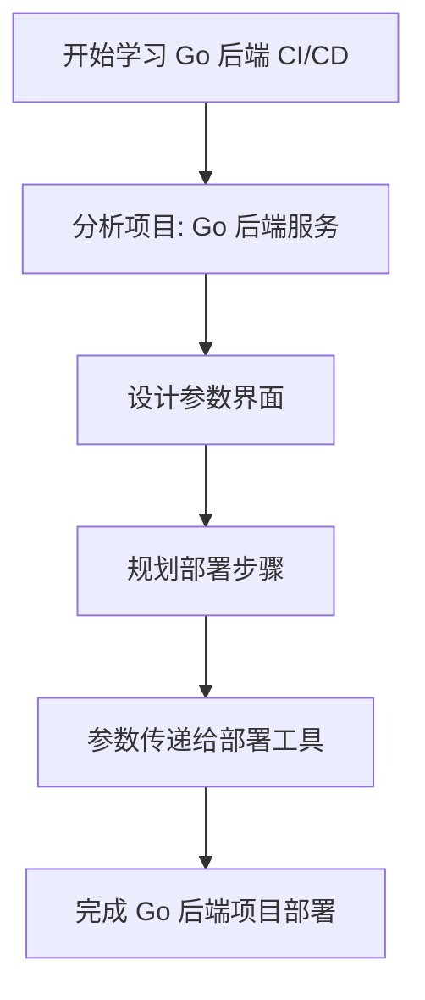

### 2. 分析项目与部署步骤
**理论讲解**：
- **项目分析**：`training-go-starter-liujun` 是一个 Go 语言编写的后端服务项目，部署需求包括代码拉取、编译二进制文件、构建镜像和容器部署。
- **技术栈**：
  - 语言：Go（Golang）。
  - 构建工具：Go 编译器（用于生成可执行文件）。
  - 部署方式：Docker 容器运行。
- **部署步骤**：
  1. **代码拉取**：从 Git 仓库（如 Gitee）拉取指定分支或标签的代码。
  2. **构建镜像**：基于基础镜像（如 `alpine`），将编译后的 Go 二进制文件打包成 Docker 镜像。
  3. **推送镜像**：将构建的镜像推送到私有镜像仓库（如 Harbor）。
  4. **部署服务**：在目标主机上运行 Docker 容器，映射端口以提供后端服务。

**Mermaid 结构图**：部署步骤
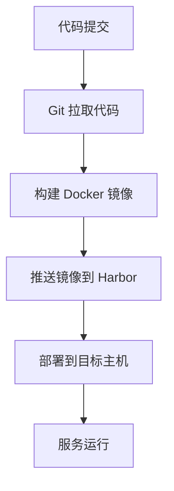

### 3. 参数界面需要哪些才能满足
**理论讲解**：
- **参数的作用**：通过 Jenkins 参数化构建，用户可以在运行 Pipeline 时选择代码版本、目标主机和 Docker 运行命令，提升部署灵活性。
- **设计原则**：参数应覆盖后端部署的所有变量，包括代码来源、镜像信息、主机列表和运行命令。

**参数设计**：
- **`rendering`**（布尔类型）：
  - 描述：是否渲染页面。
  - 默认值：`false`。
  - 用途：控制是否需要额外的页面渲染步骤（本项目中通常为 false）。
- **`git_branch`**（字符串类型）：
  - 描述：代码分支。
  - 默认值：`master`。
  - 用途：指定从哪个分支拉取代码。
- **`git_tag`**（字符串类型）：
  - 描述：代码标签。
  - 默认值：空字符串。
  - 用途：指定从哪个标签拉取代码（若为空则优先使用分支）。
- **`image`**（字符串类型）：
  - 描述：完整镜像地址。
  - 默认值：空字符串。
  - 用途：允许用户手动指定镜像地址（若为空则使用 Pipeline 构建的镜像）。
- **`hosts`**（多选类型）：
  - 描述：目标主机 IP 列表。
  - 选项示例：`192.168.110.8, 192.168.110.171, 192.168.110.172`。
  - 用途：选择需要部署的服务主机。
- **`docker_run`**（字符串类型）：
  - 描述：Docker 运行命令。
  - 默认值：`docker run -d -p 9006:8080 --restart=always`。
  - 用途：指定容器启动命令，包括端口映射和重启策略。
- **`project_name`**（隐藏类型）：
  - 描述：项目名称。
  - 默认值：`go-starter`。
  - 用途：固定项目名称，用于镜像命名等。
- **`harbor_registry`**（隐藏类型）：
  - 描述：Harbor 私有仓库地址。
  - 默认值：`harbor.labworlds.cc`。
  - 用途：指定镜像推送的目标仓库地址。

**Mermaid 结构图**：参数界面设计逻辑
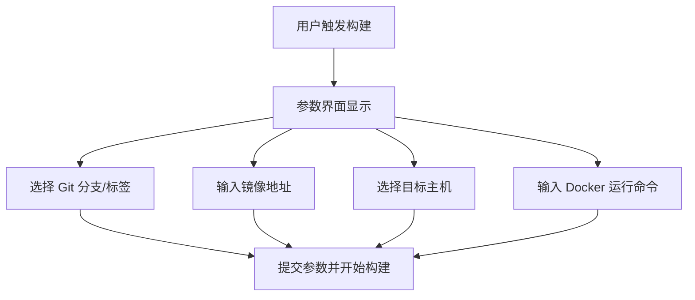


### 4. 需要哪些步骤才能部署
**理论讲解**：
- **Pipeline 部署步骤**：Jenkins Pipeline 将 CI/CD 流程拆分为多个 Stage，每个 Stage 完成特定任务。
- **Stage 设计**：根据 Go 后端项目需求，设计合理的 Stage，确保流程清晰且可维护。

**具体部署步骤（Pipeline Stage）**：
1. **Stage 1: Git Clone（拉取代码）**：
   - 使用 Git 插件从指定仓库拉取代码。
   - 根据参数 `git_branch` 或 `git_tag` 确定代码版本。
   - 条件：只有当 `rendering` 为 false 且 `git_branch` 或 `git_tag` 不为空时执行。
2. **Stage 2: Build Image（构建镜像）**：
   - 编写 Dockerfile，编译 Go 项目并将二进制文件打包成 Docker 镜像。
   - 使用时间戳和构建编号生成镜像标签。
   - 推送镜像到 Harbor 私有仓库，并清理本地镜像。
   - 条件：只有在拉取代码后才构建镜像。
3. **Stage 3: Deploy（部署到目标主机）**：
   - 使用 PyDockerDeploy 工具将镜像部署到指定主机。
   - 根据 `hosts` 参数循环部署到每个主机。
   - 条件：只要 `rendering` 为 false 就执行此阶段。

**Mermaid 结构图**：Pipeline 部署步骤
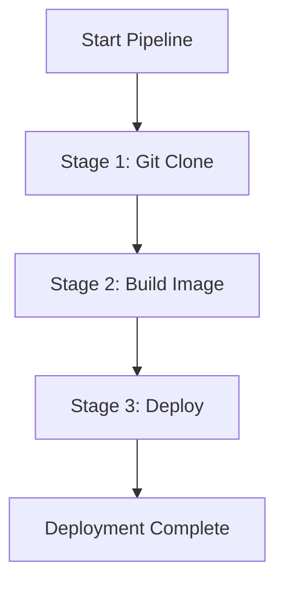

### 5. 参数给 PyDockerDeploy
**理论讲解**：
- **PyDockerDeploy 工具**：这是一个 Python 脚本，用于自动化 Docker 部署，支持通过命令行参数指定镜像、主机和运行命令。
- **参数传递**：Jenkins Pipeline 中通过 shell 命令调用 PyDockerDeploy，并将用户输入的参数传递给工具。

**参数传递方式**：
- **镜像名称（`--image`）**：由 Pipeline 构建生成，通常为 `${params.harbor_registry}/${params.project_name}/${branch}:${image_tag}`，或用户手动指定的 `${params.image}`。
- **目标主机（`--hosts`）**：从参数 `hosts` 获取，格式为逗号分隔的 IP 列表，如 `192.168.110.8,192.168.110.171`。
- **运行命令（`--docker_run`）**：从参数 `docker_run` 获取，如 `docker run -d -p 9006:8080 --restart=always`。

**示例调用命令**：
```bash
python3 /home/ubuntu/PyDockerDeploy/deployer.py \
    -p "${params.project_name}" \
    --git_branch "${branch}" \
    --image_tag "${image_tag}" \
    --image "${params.image}" \
    --hosts "${params.hosts}" \
    --harbor_registry "${params.harbor_registry}" \
    --docker_run "${params.docker_run}"
```

**注意事项**：
- 确保 PyDockerDeploy 工具已配置好 SSH 连接参数，能无密码访问目标主机。
- 参数中的变量（如 `${image_tag}`）由 Jenkins 自动替换，确保格式正确。
- 如果 `hosts` 参数包含多个主机，工具应支持批量部署。

**Mermaid 结构图**：参数传递流程
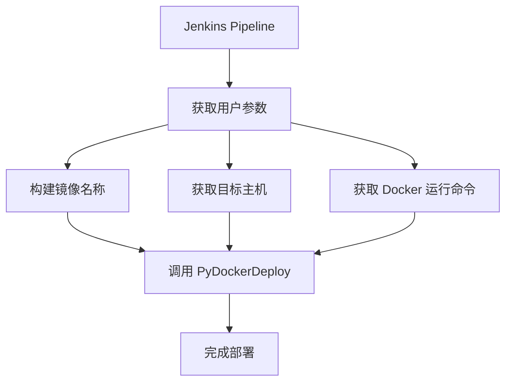


### 6. Jenkins Pipeline 脚本实现
以下是针对 `training-go-starter-liujun` 项目的完整 Jenkins Pipeline 脚本实现，分为多个阶段逐步展开，确保学习者能够循序渐进地掌握内容。

#### 6.1 阶段 1：参数界面设计
**目标**：学习如何在 Jenkins 中设计参数界面，允许用户在运行 Pipeline 时输入必要信息。

**理论讲解**：
- 参数化构建是 Jenkins 的核心功能之一，通过 `properties` 插件可以为 Pipeline 定义多种类型的参数。
- 参数设计需要覆盖部署过程中的所有变量，例如代码分支、目标主机和 Docker 运行命令等。

**实现代码**：
```groovy
// 定义 Pipeline 参数，允许用户在运行时选择拉取代码的分支、标签等信息
properties([
    parameters([
        // 布尔参数：是否要渲染页面，默认值为 false，勾选为 true
        booleanParam(name: 'rendering', defaultValue: false, description: '是否要渲染页面'),
        // 字符串参数：输入 Git 分支名称，默认值为 'master'，trim 去除首尾空格
        string(name: 'git_branch', defaultValue: 'master', description: '请输入代码分支', trim: true),
        // 字符串参数：输入 Git 标签名称，默认值为空，trim 去除首尾空格
        string(name: 'git_tag', defaultValue: '', description: '请输入代码TAG', trim: true),
        // 字符串参数：输入镜像地址，默认值为空，trim 去除首尾空格
        string(name: 'image', defaultValue: '', description: '请输入完整的镜像地址', trim: true),
        // 隐藏参数：项目名称，默认值为 'go-starter'，用户不可见也不可修改
        hidden(name: 'project_name', defaultValue: 'go-starter', description: '隐藏参数不给修改'),
        // harbor私库地址
        hidden(name: 'harbor_registry', defaultValue: 'harbor.labworlds.cc', description: '隐藏参数不给修改'),
        // 扩展选择参数：多选主机 IP，支持勾选多个选项，用逗号分隔
        extendedChoice(
            name: 'hosts', 
            type: 'PT_CHECKBOX', 
            value: '192.168.110.8,192.168.110.171,192.168.110.172', 
            description: '请选择主机',
            multiSelectDelimiter: ','
        ),
        // 字符串参数：输入 Docker 运行命令，默认值已提供，trim 去除首尾空格
        string(name: 'docker_run', defaultValue: 'docker run -d -p 9006:8080 --restart=always', description: '请输入Docker运行命令', trim: true),
    ])
])
```

**说明**：
- 以上代码定义了用户在 Jenkins 界面上可以看到的参数，包括布尔类型、字符串类型和多选类型等。
- 学习者可以先在 Jenkins 中运行这段代码，观察参数界面效果，并尝试输入不同的值来熟悉参数功能。


#### 6.2 阶段 2：Pipeline 基本结构
**目标**：学习 Jenkins Pipeline 的基本结构，了解如何定义运行节点、选项和阶段（Stages）。

**理论讲解**：
- Pipeline 是一个完整的 CI/CD 流程，通常包含多个阶段（Stage），每个阶段完成一个具体任务。
- `agent` 指定 Pipeline 在哪个节点运行，`options` 设置构建行为，`stages` 定义具体的流程步骤。

**实现代码**：
```groovy
// 定义 Pipeline 主结构
pipeline {
    // 指定运行节点：任务在特定 Agent 节点上执行，企业中常指定跳板机
    agent { node 'node-192.168.110.6-shiqi' }
    // 设置 Pipeline 选项
    options {
        // 保留最近 30 个构建记录，防止日志过多占用空间
        buildDiscarder(logRotator(numToKeepStr: '30'))
        // 禁止并行构建，确保一次只运行一个构建
        disableConcurrentBuilds()  
        // 启用 ANSI 颜色输出，日志显示更美观
        ansiColor('xterm')
    }
    // 定义环境变量，在整个 Pipeline 中都可以使用
    environment {
        // 自定义变量：初始化分支变量，稍后根据参数赋值
        branch = null
    }
    // 定义 Pipeline 阶段
    stages {
        // 阶段 1：Git 克隆代码 - 占位阶段
        stage('Git Clone') {
            when {
                expression { params.rendering == false && (params.git_branch != "" || params.git_tag != "") }
            }
            steps {
                // 占位符，具体实现将在后续阶段添加
                echo "Git Clone 阶段，具体步骤将在后续实现"
            }
        }
        // 阶段 2：构建镜像 - 占位阶段
        stage('Build Image') {
            when {
                expression { params.rendering == false && (params.git_branch != "" || params.git_tag != "") }
            }
            steps {
                // 占位符，具体实现将在后续阶段添加
                echo "Build Image 阶段，具体步骤将在后续实现"
            }
        }
        // 阶段 3：部署 - 占位阶段
        stage('Deploy') {
            when {
                expression { params.rendering == false }
            }
            steps {
                // 占位符，具体实现将在后续阶段添加
                echo "Deploy 阶段，具体步骤将在后续实现"
            }
        }
    }
}
```

**说明**：
- 以上代码是一个简单的 Pipeline 框架，包含三个占位阶段，用于后续逐步填充具体实现。
- 每个阶段都设置了 `when` 条件，以便学习者理解条件控制的用法，但 `steps` 中仅使用 `echo` 作为占位符。
- 学习者可以将这段代码与参数界面代码结合，在 Jenkins 中运行，观察 Pipeline 的执行流程和日志输出。


#### 6.3 阶段 3：完整步骤与实际内容
**目标**：在掌握了参数界面和 Pipeline 基本结构后，逐步实现每个阶段的实际功能，包括代码拉取、镜像构建和部署。

**理论讲解**：
- 完整的 CI/CD 流程需要多个阶段配合，每个阶段都有明确的条件（`when`）和步骤（`steps`）。
- 本阶段将实现从代码拉取到部署的全过程，并结合用户输入的参数动态调整行为。

**完整实现代码**：
```groovy
// docker镜像标签，按照时间-构建编号命名
def getBuildTag() {
    return new Date().format('MMddHH') + "-${env.BUILD_ID}"
}

// 定义 Pipeline 参数，允许用户在运行时选择拉取代码的分支、标签等信息
properties([
    parameters([
        // 布尔参数：是否要渲染页面，默认值为 false，勾选为 true
        booleanParam(name: 'rendering', defaultValue: false, description: '是否要渲染页面'),
        // 字符串参数：输入 Git 分支名称，默认值为 'master'，trim 去除首尾空格
        string(name: 'git_branch', defaultValue: 'master', description: '请输入代码分支', trim: true),
        // 字符串参数：输入 Git 标签名称，默认值为空，trim 去除首尾空格
        string(name: 'git_tag', defaultValue: '', description: '请输入代码TAG', trim: true),
        // 字符串参数：输入镜像地址，默认值为空，trim 去除首尾空格
        string(name: 'image', defaultValue: '', description: '请输入完整的镜像地址', trim: true),
        // 隐藏参数：项目名称，默认值为 'go-starter'，用户不可见也不可修改
        hidden(name: 'project_name', defaultValue: 'go-starter', description: '隐藏参数不给修改'),
        // harbor私库地址
        hidden(name: 'harbor_registry', defaultValue: 'harbor.labworlds.cc', description: '隐藏参数不给修改'),
        // 扩展选择参数：多选主机 IP，支持勾选多个选项，用逗号分隔
        extendedChoice(
            name: 'hosts', 
            type: 'PT_CHECKBOX', 
            value: '192.168.110.8,192.168.110.171,192.168.110.172', 
            description: '请选择主机',
            multiSelectDelimiter: ','
        ),
        // 字符串参数：输入 Docker 运行命令，默认值已提供，trim 去除首尾空格
        string(name: 'docker_run', defaultValue: 'docker run -d -p 9006:8080 --restart=always', description: '请输入Docker运行命令', trim: true),
    ])
])

// 定义 Pipeline 主结构
pipeline {
    // 指定运行节点：任务在特定 Agent 节点上执行，企业中常指定跳板机
    agent { node 'node-192.168.110.6-shiqi' }
    // 设置 Pipeline 选项
    options {
        // 保留最近 30 个构建记录，防止日志过多占用空间
        buildDiscarder(logRotator(numToKeepStr: '30'))
        // 禁止并行构建，确保一次只运行一个构建
        disableConcurrentBuilds()  
        // 启用 ANSI 颜色输出，日志显示更美观
        ansiColor('xterm')
    }
    // 定义环境变量，在整个 Pipeline 中都可以使用
    environment {
        // 自定义变量：获取构建标签（通常是时间戳或版本号）
        image_tag = getBuildTag()
        // 自定义变量：初始化分支变量，稍后根据参数赋值
        branch = null
    }
    // 定义 Pipeline 阶段
    stages {
        // 阶段 1：Git 克隆代码，只有当分支或标签参数不为空时才执行
        stage('Git Clone') {
            when {
                expression { params.rendering == false && (params.git_branch != "" || params.git_tag != "") }
            }
            steps {
                script {
                    if (params.git_tag != "") {
                        checkout([$class: 'GitSCM',
                            branches: [[name: "refs/tags/${params.git_tag}"]],
                            doGenerateSubmoduleConfigurations: false,
                            extensions: [],
                            userRemoteConfigs: [[
                                credentialsId: 'c4b7f929-0269-4967-b9e3-7d462db21aca',
                                url: 'git@gitee.com:Tender-Liu/go-starter.git'
                            ]]
                        ])
                        branch = params.git_tag
                    } else {
                        git credentialsId: 'c4b7f929-0269-4967-b9e3-7d462db21aca', url: 'git@gitee.com:Tender-Liu/go-starter.git', branch: "${params.git_branch}"
                        branch = params.git_branch
                    }
                }
            }
        }
        // 阶段 2：构建镜像
        stage('Build Image') {
            when {
                expression { params.rendering == false && (params.git_tag != "" || params.git_branch != "") }
            }
            steps {
                script {
                    def docker_image_name = "${params.harbor_registry}/${params.project_name}/${branch}:${image_tag}"
                    sh "docker build -t ${docker_image_name} ."
                    sh "docker push ${docker_image_name}"
                    sh "docker rmi ${docker_image_name}"
                }
            }
        }
        // 阶段 3：部署到目标主机
        stage('Deploy') {
            when {
                expression { params.rendering == false }
            }
            steps {
                script {
                    sh """
                        python3 /home/ubuntu/PyDockerDeploy/deployer.py \
                            -p "${params.project_name}" \
                            --git_branch "${branch}" \
                            --image_tag "${image_tag}" \
                            --image "${params.image}" \
                            --hosts "${params.hosts}" \
                            --harbor_registry "${params.harbor_registry}" \
                            --docker_run "${params.docker_run}"
                    """
                }
            }
        }
    }
}
```

**各阶段详细说明**：
1. **Git Clone 阶段**：
   - **功能**：根据用户输入的 `git_branch` 或 `git_tag` 参数，从 Gitee 仓库拉取代码。
   - **条件**：只有当 `rendering` 为 false 且分支或标签参数不为空时执行。
   - **逻辑**：如果指定了标签，则拉取指定标签的代码；否则拉取指定分支的代码。拉取后将代码版本赋值给 `branch` 变量，用于后续镜像命名。
2. **Build Image 阶段**：
   - **功能**：构建 Docker 镜像，镜像标签基于时间戳和构建编号生成。
   - **条件**：只有在拉取代码后才构建镜像。
   - **逻辑**：构建镜像后推送到 Harbor 私有仓库，并删除本地镜像以节省空间。
3. **Deploy 阶段**：
   - **功能**：调用 PyDockerDeploy 工具，将镜像部署到用户选择的目标主机。
   - **条件**：只要 `rendering` 为 false 就执行此阶段。
   - **逻辑**：通过 Python 脚本传递镜像信息、主机列表和运行命令，完成自动化部署。

**学习建议**：
- 学习者可以先运行前两个阶段的代码，观察参数界面和 Pipeline 执行效果。
- 然后逐步添加每个阶段的功能，运行并调试代码，理解每个步骤的作用。
- 最后结合完整代码，运行整个 CI/CD 流程，完成从代码拉取到部署的全过程。


## 第二部分: 前端服务 (`admin3-ui`) CI/CD 流程

### 1. 学习路径
**理论讲解**：
- **综合项目目标**：通过 `admin3-ui` 项目，全面掌握前端服务的 CI/CD 流程，深化对 Jenkins Pipeline 的理解，学习如何处理前端项目编译、镜像构建、环境变量管理和部署。
- **学习步骤**：
  1. 分析前端项目的技术栈和部署需求。
  2. 设计参数界面，满足前端项目的灵活部署和配置需求（如后端域名）。
  3. 规划 Pipeline 的部署步骤，拆分为多个 Stage。
  4. 将参数传递给部署工具（如 PyDockerDeploy），完成自动化部署。

**Mermaid 结构图**：学习路径
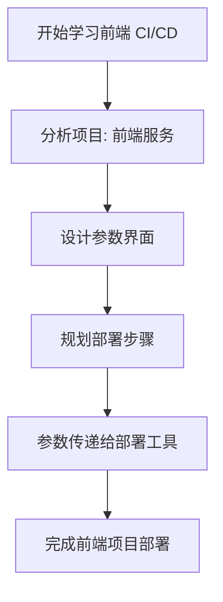

### 2. 分析项目与部署步骤
**理论讲解**：
- **项目分析**：`admin3-ui` 是一个前端服务项目，假设基于 Vue.js 或 React 框架，部署需求包括代码拉取、环境变量配置、编译静态文件、构建镜像和容器部署。
- **技术栈**：
  - 语言：JavaScript/TypeScript（前端框架如 Vue.js 或 React）。
  - 构建工具：NPM（用于依赖管理和构建）。
  - 部署方式：Docker 容器运行，静态文件通过 Nginx 服务。
- **部署步骤**：
  1. **代码拉取**：从 Git 仓库（如 Gitee）拉取指定分支或标签的代码。
  2. **环境变量配置**：根据用户输入的后端域名，修改 `.env` 文件中的 API 地址。
  3. **编译代码**：使用 `npm install` 和 `npm run build` 编译前端项目，生成静态文件。
  4. **构建镜像**：基于基础镜像（如 `nginx`），将编译后的静态文件打包成 Docker 镜像。
  5. **推送镜像**：将构建的镜像推送到私有镜像仓库（如 Harbor）。
  6. **部署服务**：在目标主机上运行 Docker 容器，映射端口以提供前端服务。

**Mermaid 结构图**：部署步骤
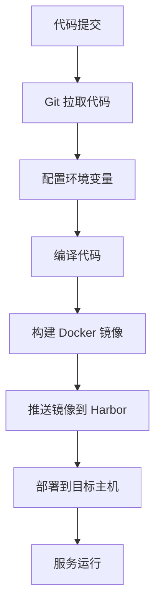

### 3. 参数界面需要哪些才能满足
**理论讲解**：
- **参数的作用**：通过 Jenkins 参数化构建，用户可以在运行 Pipeline 时选择代码版本、目标主机、后端域名和 Docker 运行命令，提升部署灵活性。
- **设计原则**：参数应覆盖前端部署的所有变量，包括代码来源、镜像信息、主机列表、后端域名和运行命令。

**参数设计**：
- **`rendering`**（布尔类型）：
  - 描述：是否渲染页面。
  - 默认值：`false`。
  - 用途：控制是否需要额外的页面渲染步骤（本项目中通常为 false）。
- **`git_branch`**（字符串类型）：
  - 描述：代码分支。
  - 默认值：`master`。
  - 用途：指定从哪个分支拉取代码。
- **`git_tag`**（字符串类型）：
  - 描述：代码标签。
  - 默认值：空字符串。
  - 用途：指定从哪个标签拉取代码（若为空则优先使用分支）。
- **`image`**（字符串类型）：
  - 描述：完整镜像地址。
  - 默认值：空字符串。
  - 用途：允许用户手动指定镜像地址（若为空则使用 Pipeline 构建的镜像）。
- **`domain`**（字符串类型）：
  - 描述：后端域名地址。
  - 默认值：`https://shiqi.admin.labworlds.cc:1443/admin3`。
  - 用途：指定前端连接的后端 API 地址，用于动态配置环境变量。
- **`hosts`**（多选类型）：
  - 描述：目标主机 IP 列表。
  - 选项示例：`192.168.110.8, 192.168.110.171, 192.168.110.172`。
  - 用途：选择需要部署的服务主机。
- **`docker_run`**（字符串类型）：
  - 描述：Docker 运行命令。
  - 默认值：`docker run -d -p 8000:80 --restart=always`。
  - 用途：指定容器启动命令，包括端口映射和重启策略。
- **`project_name`**（隐藏类型）：
  - 描述：项目名称。
  - 默认值：`admin3-ui`。
  - 用途：固定项目名称，用于镜像命名等。
- **`harbor_registry`**（隐藏类型）：
  - 描述：Harbor 私有仓库地址。
  - 默认值：`harbor.labworlds.cc`。
  - 用途：指定镜像推送的目标仓库地址。

**Mermaid 结构图**：参数界面设计逻辑
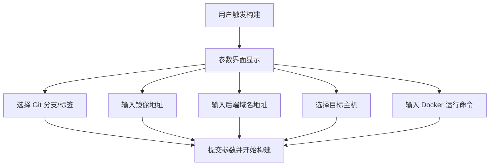

### 4. 需要哪些步骤才能部署
**理论讲解**：
- **Pipeline 部署步骤**：Jenkins Pipeline 将 CI/CD 流程拆分为多个 Stage，每个 Stage 完成特定任务。
- **Stage 设计**：根据前端项目需求，设计合理的 Stage，确保流程清晰且可维护。

**具体部署步骤（Pipeline Stage）**：
1. **Stage 1: Git Clone（拉取代码）**：
   - 使用 Git 插件从指定仓库拉取代码。
   - 根据参数 `git_branch` 或 `git_tag` 确定代码版本。
   - 条件：只有当 `rendering` 为 false 且 `git_branch` 或 `git_tag` 不为空时执行。
2. **Stage 2: Env Edit（环境变量编辑）**：
   - 根据用户输入的 `domain` 参数，动态修改 `.env` 文件中的后端 API 地址。
   - 条件：与 Git Clone 阶段相同，只有在需要拉取代码时才执行。
3. **Stage 3: Compile Code（编译代码）**：
   - 使用 `npm install` 和 `npm run build` 编译前端项目，生成静态文件。
   - 条件：同上，只有在拉取代码后才编译。
4. **Stage 4: Build Image（构建镜像）**：
   - 编写 Dockerfile，将编译后的静态文件打包成 Docker 镜像（基于 Nginx）。
   - 使用时间戳和构建编号生成镜像标签。
   - 推送镜像到 Harbor 私有仓库，并清理本地镜像。
   - 条件：同上，只有在编译代码后才构建镜像。
5. **Stage 5: Deploy（部署到目标主机）**：
   - 使用 PyDockerDeploy 工具将镜像部署到指定主机。
   - 根据 `hosts` 参数循环部署到每个主机。
   - 条件：只要 `rendering` 为 false 就执行此阶段。

**Mermaid 结构图**：Pipeline 部署步骤
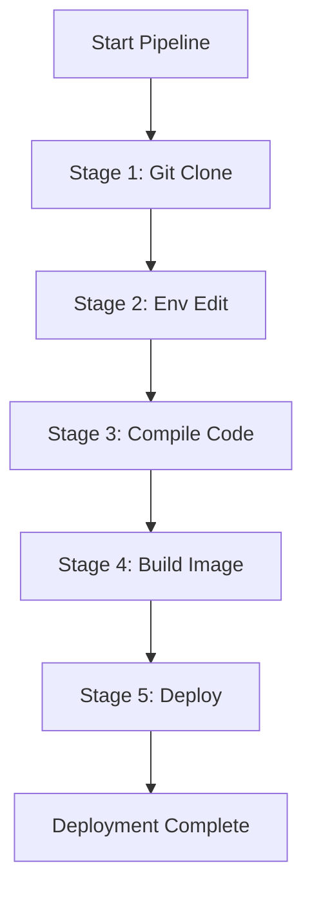

### 5. 参数给 PyDockerDeploy
**理论讲解**：
- **PyDockerDeploy 工具**：这是一个 Python 脚本，用于自动化 Docker 部署，支持通过命令行参数指定镜像、主机和运行命令。
- **参数传递**：Jenkins Pipeline 中通过 shell 命令调用 PyDockerDeploy，并将用户输入的参数传递给工具。

**参数传递方式**：
- **镜像名称（`--image`）**：由 Pipeline 构建生成，通常为 `${params.harbor_registry}/${params.project_name}/${branch}:${image_tag}`，或用户手动指定的 `${params.image}`。
- **目标主机（`--hosts`）**：从参数 `hosts` 获取，格式为逗号分隔的 IP 列表，如 `192.168.110.8,192.168.110.171`。
- **运行命令（`--docker_run`）**：从参数 `docker_run` 获取，如 `docker run -d -p 8000:80 --restart=always`。

**示例调用命令**：
```bash
python3 /home/ubuntu/PyDockerDeploy/deployer.py \
    -p "${params.project_name}" \
    --git_branch "${branch}" \
    --image_tag "${image_tag}" \
    --image "${params.image}" \
    --hosts "${params.hosts}" \
    --harbor_registry "${params.harbor_registry}" \
    --docker_run "${params.docker_run}"
```

**注意事项**：
- 确保 PyDockerDeploy 工具已配置好 SSH 连接参数，能无密码访问目标主机。
- 参数中的变量（如 `${image_tag}`）由 Jenkins 自动替换，确保格式正确。
- 如果 `hosts` 参数包含多个主机，工具应支持批量部署。

**Mermaid 结构图**：参数传递流程


### 6. Jenkins Pipeline 脚本实现
以下是针对 `admin3-ui` 项目的完整 Jenkins Pipeline 脚本实现，分为多个阶段逐步展开，确保学习者能够循序渐进地掌握内容。

#### 6.1 阶段 1：参数界面设计
**目标**：学习如何在 Jenkins 中设计参数界面，允许用户在运行 Pipeline 时输入必要信息。

**理论讲解**：
- 参数化构建是 Jenkins 的核心功能之一，通过 `properties` 插件可以为 Pipeline 定义多种类型的参数。
- 参数设计需要覆盖部署过程中的所有变量，例如代码分支、后端域名、目标主机和 Docker 运行命令等。

**实现代码**：
```groovy
// 定义 Pipeline 参数，允许用户在运行时选择拉取代码的分支、标签等信息
properties([
    parameters([
        // 布尔参数：是否要渲染页面，默认值为 false，勾选为 true
        booleanParam(name: 'rendering', defaultValue: false, description: '是否要渲染页面'),
        // 字符串参数：输入 Git 分支名称，默认值为 'master'，trim 去除首尾空格
        string(name: 'git_branch', defaultValue: 'master', description: '请输入代码分支', trim: true),
        // 字符串参数：输入 Git 标签名称，默认值为空，trim 去除首尾空格
        string(name: 'git_tag', defaultValue: '', description: '请输入代码TAG', trim: true),
        // 字符串参数：输入镜像地址，默认值为空，trim 去除首尾空格
        string(name: 'image', defaultValue: '', description: '请输入完整的镜像地址', trim: true),
        // 字符串参数：输入后端域名地址，默认值已提供，trim 去除首尾空格
        string(name: 'domain', defaultValue: 'https://shiqi.admin.labworlds.cc:1443/admin3', description: '请输入后端域名地址', trim: true),
        // 隐藏参数：项目名称，默认值为 'admin3-ui'，用户不可见也不可修改
        hidden(name: 'project_name', defaultValue: 'admin3-ui', description: '隐藏参数不给修改'),
        // harbor私库地址
        hidden(name: 'harbor_registry', defaultValue: 'harbor.labworlds.cc', description: '隐藏参数不给修改'),
        // 扩展选择参数：多选主机 IP，支持勾选多个选项，用逗号分隔
        extendedChoice(
            name: 'hosts', 
            type: 'PT_CHECKBOX', 
            value: '192.168.110.8,192.168.110.171,192.168.110.172', 
            description: '请选择主机',
            multiSelectDelimiter: ','
        ),
        // 字符串参数：输入 Docker 运行命令，默认值已提供，trim 去除首尾空格
        string(name: 'docker_run', defaultValue: 'docker run -d -p 8000:80 --restart=always', description: '请输入Docker运行命令', trim: true),
    ])
])
```

**说明**：
- 以上代码定义了用户在 Jenkins 界面上可以看到的参数，包括布尔类型、字符串类型和多选类型等。
- 学习者可以先在 Jenkins 中运行这段代码，观察参数界面效果，并尝试输入不同的值来熟悉参数功能。


#### 6.2 阶段 2：Pipeline 基本结构
**目标**：学习 Jenkins Pipeline 的基本结构，了解如何定义运行节点、选项和阶段（Stages）。

**理论讲解**：
- Pipeline 是一个完整的 CI/CD 流程，通常包含多个阶段（Stage），每个阶段完成一个具体任务。
- `agent` 指定 Pipeline 在哪个节点运行，`options` 设置构建行为，`stages` 定义具体的流程步骤。

**实现代码**：
```groovy
// 定义 Pipeline 主结构
pipeline {
    // 指定运行节点：任务在特定 Agent 节点上执行，企业中常指定跳板机
    agent { node 'node-192.168.110.6-shiqi' }
    // 设置 Pipeline 选项
    options {
        // 保留最近 30 个构建记录，防止日志过多占用空间
        buildDiscarder(logRotator(numToKeepStr: '30'))
        // 禁止并行构建，确保一次只运行一个构建
        disableConcurrentBuilds()  
        // 启用 ANSI 颜色输出，日志显示更美观
        ansiColor('xterm')
    }
    // 定义环境变量，在整个 Pipeline 中都可以使用
    environment {
        // 自定义变量：初始化分支变量，稍后根据参数赋值
        branch = null
    }
    // 定义 Pipeline 阶段
    stages {
        // 阶段 1：Git 克隆代码 - 占位阶段
        stage('Git Clone') {
            when {
                expression { params.rendering == false && (params.git_branch != "" || params.git_tag != "") }
            }
            steps {
                // 占位符，具体实现将在后续阶段添加
                echo "Git Clone 阶段，具体步骤将在后续实现"
            }
        }
        // 阶段 2：环境变量编辑 - 占位阶段
        stage('Env Edit') {
            when {
                expression { params.rendering == false && (params.git_branch != "" || params.git_tag != "") }
            }
            steps {
                // 占位符，具体实现将在后续阶段添加
                echo "Env Edit 阶段，具体步骤将在后续实现"
            }
        }
        // 阶段 4：构建镜像 - 占位阶段
        stage('Build Image') {
            when {
                expression { params.rendering == false && (params.git_branch != "" || params.git_tag != "") }
            }
            steps {
                // 占位符，具体实现将在后续阶段添加
                echo "Build Image 阶段，具体步骤将在后续实现"
            }
        }
        // 阶段 5：部署 - 占位阶段
        stage('Deploy') {
            when {
                expression { params.rendering == false }
            }
            steps {
                // 占位符，具体实现将在后续阶段添加
                echo "Deploy 阶段，具体步骤将在后续实现"
            }
        }
    }
}
```

**说明**：
- 以上代码是一个简单的 Pipeline 框架，包含五个占位阶段，用于后续逐步填充具体实现。
- 每个阶段都设置了 `when` 条件，以便学习者理解条件控制的用法，但 `steps` 中仅使用 `echo` 作为占位符。
- 学习者可以将这段代码与参数界面代码结合，在 Jenkins 中运行，观察 Pipeline 的执行流程和日志输出。


#### 6.3 阶段 3：完整步骤与实际内容
**目标**：在掌握了参数界面和 Pipeline 基本结构后，逐步实现每个阶段的实际功能，包括代码拉取、环境变量配置、编译、镜像构建和部署。

**理论讲解**：
- 完整的 CI/CD 流程需要多个阶段配合，每个阶段都有明确的条件（`when`）和步骤（`steps`）。
- 本阶段将实现从代码拉取到部署的全过程，并结合用户输入的参数动态调整行为。

**完整实现代码**：
```groovy
// docker镜像标签，按照时间-构建编号命名
def getBuildTag() {
    return new Date().format('MMddHH') + "-${env.BUILD_ID}"
}

// 定义 Pipeline 参数，允许用户在运行时选择拉取代码的分支、标签等信息
properties([
    parameters([
        // 布尔参数：是否要渲染页面，默认值为 false，勾选为 true
        booleanParam(name: 'rendering', defaultValue: false, description: '是否要渲染页面'),
        // 字符串参数：输入 Git 分支名称，默认值为 'master'，trim 去除首尾空格
        string(name: 'git_branch', defaultValue: 'master', description: '请输入代码分支', trim: true),
        // 字符串参数：输入 Git 标签名称，默认值为空，trim 去除首尾空格
        string(name: 'git_tag', defaultValue: '', description: '请输入代码TAG', trim: true),
        // 字符串参数：输入镜像地址，默认值为空，trim 去除首尾空格
        string(name: 'image', defaultValue: '', description: '请输入完整的镜像地址', trim: true),
        // 字符串参数：输入后端域名地址，默认值已提供，trim 去除首尾空格
        string(name: 'domain', defaultValue: 'https://shiqi.admin.labworlds.cc:1443/admin3', description: '请输入后端域名地址', trim: true),
        // 隐藏参数：项目名称，默认值为 'admin3-ui'，用户不可见也不可修改
        hidden(name: 'project_name', defaultValue: 'admin3-ui', description: '隐藏参数不给修改'),
        // harbor私库地址
        hidden(name: 'harbor_registry', defaultValue: 'harbor.labworlds.cc', description: '隐藏参数不给修改'),
        // 扩展选择参数：多选主机 IP，支持勾选多个选项，用逗号分隔
        extendedChoice(
            name: 'hosts', 
            type: 'PT_CHECKBOX', 
            value: '192.168.110.8,192.168.110.171,192.168.110.172', 
            description: '请选择主机',
            multiSelectDelimiter: ','
        ),
        // 字符串参数：输入 Docker 运行命令，默认值已提供，trim 去除首尾空格
        string(name: 'docker_run', defaultValue: 'docker run -d -p 8000:80 --restart=always', description: '请输入Docker运行命令', trim: true),
    ])
])

// 定义 Pipeline 主结构
pipeline {
    // 指定运行节点：任务在特定 Agent 节点上执行，企业中常指定跳板机
    agent { node 'node-192.168.110.6-shiqi' }
    // 设置 Pipeline 选项
    options {
        // 保留最近 30 个构建记录，防止日志过多占用空间
        buildDiscarder(logRotator(numToKeepStr: '30'))
        // 禁止并行构建，确保一次只运行一个构建
        disableConcurrentBuilds()  
        // 启用 ANSI 颜色输出，日志显示更美观
        ansiColor('xterm')
    }
    // 定义环境变量，在整个 Pipeline 中都可以使用
    environment {
        // 自定义变量：获取构建标签（通常是时间戳或版本号）
        image_tag = getBuildTag()
        // 自定义变量：初始化分支变量，稍后根据参数赋值
        branch = null
    }
    // 定义 Pipeline 阶段
    stages {
        // 阶段 1：Git 克隆代码，只有当分支或标签参数不为空时才执行
        stage('Git Clone') {
            when {
                expression { params.rendering == false && (params.git_branch != "" || params.git_tag != "") }
            }
            steps {
                script {
                    if (params.git_tag != "") {
                        checkout([$class: 'GitSCM',
                            branches: [[name: "refs/tags/${params.git_tag}"]],
                            doGenerateSubmoduleConfigurations: false,
                            extensions: [],
                            userRemoteConfigs: [[
                                credentialsId: 'c4b7f929-0269-4967-b9e3-7d462db21aca',
                                url: 'git@gitee.com:Tender-Liu/admin3.git'
                            ]]
                        ])
                        branch = params.git_tag
                    } else {
                        git credentialsId: 'c4b7f929-0269-4967-b9e3-7d462db21aca', url: 'git@gitee.com:Tender-Liu/admin3.git', branch: "${params.git_branch}"
                        branch = params.git_branch
                    }
                }
            }
        }
        // 阶段 2：环境变量编辑
        stage('Env Edit') {
            when {
                expression { params.rendering == false && (params.git_tag != "" || params.git_branch != "") }
            }
            steps {
                script {
                    sh "sed -i 's|^VITE_BASE_URI=.*|VITE_BASE_URI=${params.domain}|' ./admin3-ui/.env"
                }
            }
        }
        // 阶段 4：构建镜像
        stage('Build Image') {
            when {
                expression { params.rendering == false && (params.git_tag != "" || params.git_branch != "") }
            }
            steps {
                script {
                    def docker_image_name = "${params.harbor_registry}/${params.project_name}/${branch}:${image_tag}"
                    sh "cd ./admin3-ui && docker build -t ${docker_image_name} ."
                    sh "docker push ${docker_image_name}"
                    sh "docker rmi ${docker_image_name}"
                }
            }
        }
        // 阶段 5：部署到目标主机
        stage('Deploy') {
            when {
                expression { params.rendering == false }
            }
            steps {
                script {
                    sh """
                        python3 /home/ubuntu/PyDockerDeploy/deployer.py \
                            -p "${params.project_name}" \
                            --git_branch "${branch}" \
                            --image_tag "${image_tag}" \
                            --image "${params.image}" \
                            --hosts "${params.hosts}" \
                            --harbor_registry "${params.harbor_registry}" \
                            --docker_run "${params.docker_run}"
                    """
                }
            }
        }
    }
}
```

**各阶段详细说明**：
1. **Git Clone 阶段**：
   - **功能**：根据用户输入的 `git_branch` 或 `git_tag` 参数，从 Gitee 仓库拉取代码。
   - **条件**：只有当 `rendering` 为 false 且分支或标签参数不为空时执行。
   - **逻辑**：如果指定了标签，则拉取指定标签的代码；否则拉取指定分支的代码。拉取后将代码版本赋值给 `branch` 变量，用于后续镜像命名。
2. **Env Edit 阶段**：
   - **功能**：根据用户输入的 `domain` 参数，动态修改 `.env` 文件中的 `VITE_BASE_URI` 字段。
   - **条件**：与 Git Clone 阶段相同，只有在需要拉取代码时才执行。
   - **逻辑**：使用 `sed` 命令替换环境变量，确保前端项目能正确连接到后端服务。
3. **Compile Code 阶段**：
   - **功能**：使用 `npm install` 和 `npm run build` 编译前端项目，生成静态文件。
   - **条件**：同上，只有在拉取代码后才编译。
   - **逻辑**：安装依赖并构建静态文件，为后续镜像构建准备内容。
4. **Build Image 阶段**：
   - **功能**：构建 Docker 镜像，镜像标签基于时间戳和构建编号生成。
   - **条件**：同上，只有在编译代码后才构建镜像。
   - **逻辑**：构建镜像后推送到 Harbor 私有仓库，并删除本地镜像以节省空间。
5. **Deploy 阶段**：
   - **功能**：调用 PyDockerDeploy 工具，将镜像部署到用户选择的目标主机。
   - **条件**：只要 `rendering` 为 false 就执行此阶段。
   - **逻辑**：通过 Python 脚本传递镜像信息、主机列表和运行命令，完成自动化部署。


## 第三部分：综合项目 - 后端服务 (`admin3-server`)

### 1. 学习路径
**理论讲解**：
- **综合项目目标**：通过 `admin3-server` 项目，全面掌握后端服务的 CI/CD 流程，深化对 Jenkins Pipeline 的理解，学习如何处理后端项目编译、镜像构建、配置文件管理和部署。
- **学习步骤**：
  1. 分析后端项目的技术栈和部署需求。
  2. 设计参数界面，满足后端项目的灵活部署和配置需求。
  3. 规划 Pipeline 的部署步骤，拆分为多个 Stage。
  4. 将参数传递给部署工具（如 PyDockerDeploy），完成自动化部署。

**Mermaid 结构图**：学习路径
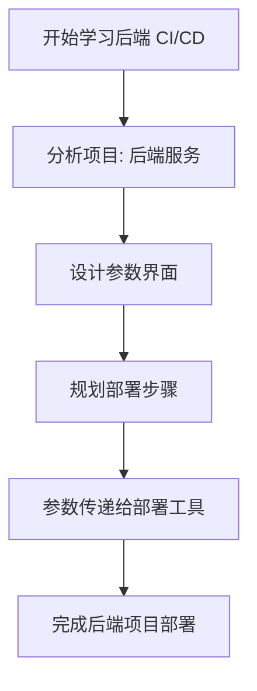


### 2. 分析项目与部署步骤
**理论讲解**：
- **项目分析**：`admin3-server` 是一个后端服务项目，假设基于 Java Spring Boot 框架，部署需求包括代码拉取、编译、构建镜像、配置文件管理和容器部署。
- **技术栈**：
  - 语言：Java（Spring Boot 项目）。
  - 构建工具：Maven（用于依赖管理和构建）。
  - 部署方式：Docker 容器运行，需挂载配置文件。
- **部署步骤**：
  1. **代码拉取**：从 Git 仓库（如 Gitee）拉取指定分支或标签的代码。
  2. **编译代码**：使用 `mvn clean package` 编译后端项目，生成可执行文件（如 JAR 文件）。
  3. **构建镜像**：基于基础镜像（如 `openjdk`），将编译后的文件打包成 Docker 镜像。
  4. **推送镜像**：将构建的镜像推送到私有镜像仓库（如 Harbor）。
  5. **配置文件管理**：将用户指定的配置文件内容上传到目标主机。
  6. **部署服务**：在目标主机上运行 Docker 容器，映射端口和配置文件路径。

**Mermaid 结构图**：部署步骤
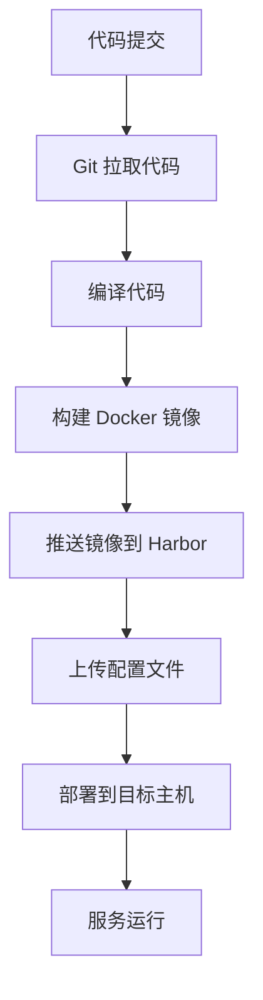

### 3. 参数界面需要哪些才能满足
**理论讲解**：
- **参数的作用**：通过 Jenkins 参数化构建，用户可以在运行 Pipeline 时选择代码版本、目标主机、配置文件内容和 Docker 运行命令，提升部署灵活性。
- **设计原则**：参数应覆盖后端部署的所有变量，包括代码来源、镜像信息、主机列表、配置文件和运行命令。

**参数设计**：
- **`rendering`**（布尔类型）：
  - 描述：是否渲染页面。
  - 默认值：`false`。
  - 用途：控制是否需要额外的页面渲染步骤（本项目中通常为 false）。
- **`git_branch`**（字符串类型）：
  - 描述：代码分支。
  - 默认值：`master`。
  - 用途：指定从哪个分支拉取代码。
- **`git_tag`**（字符串类型）：
  - 描述：代码标签。
  - 默认值：空字符串。
  - 用途：指定从哪个标签拉取代码（若为空则优先使用分支）。
- **`image`**（字符串类型）：
  - 描述：完整镜像地址。
  - 默认值：空字符串。
  - 用途：允许用户手动指定镜像地址（若为空则使用 Pipeline 构建的镜像）。
- **`filepath`**（字符串类型）：
  - 描述：配置文件路径。
  - 默认值：`/opt/admin3-server/application.yml`。
  - 用途：指定配置文件在目标主机上的存储路径。
- **`data`**（文本类型）：
  - 描述：配置文件内容。
  - 默认值：包含 Spring Boot 典型 `application.yml` 配置。
  - 用途：允许用户自定义配置文件内容。
- **`hosts`**（多选类型）：
  - 描述：目标主机 IP 列表。
  - 选项示例：`192.168.110.8, 192.168.110.171, 192.168.110.172`。
  - 用途：选择需要部署的服务主机。
- **`docker_run`**（字符串类型）：
  - 描述：Docker 运行命令。
  - 默认值：`docker run -d -p 8080:8080 -v /opt/admin3-server/application.yml:/app/application.yml --restart=always`。
  - 用途：指定容器启动命令，包括端口映射、配置文件挂载和重启策略。
- **`project_name`**（隐藏类型）：
  - 描述：项目名称。
  - 默认值：`admin3-server`。
  - 用途：固定项目名称，用于镜像命名等。
- **`harbor_registry`**（隐藏类型）：
  - 描述：Harbor 私有仓库地址。
  - 默认值：`harbor.labworlds.cc`。
  - 用途：指定镜像推送的目标仓库地址。

**Mermaid 结构图**：参数界面设计逻辑
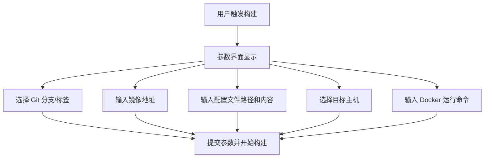


### 4. 需要哪些步骤才能部署
**理论讲解**：
- **Pipeline 部署步骤**：Jenkins Pipeline 将 CI/CD 流程拆分为多个 Stage，每个 Stage 完成特定任务。
- **Stage 设计**：根据后端项目需求，设计合理的 Stage，确保流程清晰且可维护。

**具体部署步骤（Pipeline Stage）**：
1. **Stage 1: Git Clone（拉取代码）**：
   - 使用 Git 插件从指定仓库拉取代码。
   - 根据参数 `git_branch` 或 `git_tag` 确定代码版本。
   - 条件：只有当 `rendering` 为 false 且 `git_branch` 或 `git_tag` 不为空时执行。
2. **Stage 2: Compile Code（编译代码）**：
   - 使用 `mvn clean package` 编译后端项目，生成可执行文件。
   - 条件：与 Git Clone 阶段相同，只有在需要拉取代码时才编译。
3. **Stage 3: Build Image（构建镜像）**：
   - 编写 Dockerfile，将编译后的文件打包成 Docker 镜像。
   - 使用时间戳和构建编号生成镜像标签。
   - 推送镜像到 Harbor 私有仓库，并清理本地镜像。
   - 条件：同上，只有在编译代码后才构建镜像。
4. **Stage 4: Upload ConfigFile（上传配置文件）**：
   - 使用工具（如 `config_manager.py`）将用户输入的配置文件内容上传到目标主机。
   - 条件：只要 `rendering` 为 false 就执行此阶段。
5. **Stage 5: Deploy（部署到目标主机）**：
   - 使用 PyDockerDeploy 工具将镜像部署到指定主机。
   - 根据 `hosts` 参数循环部署到每个主机。
   - 条件：只要 `rendering` 为 false 就执行此阶段。

**Mermaid 结构图**：Pipeline 部署步骤
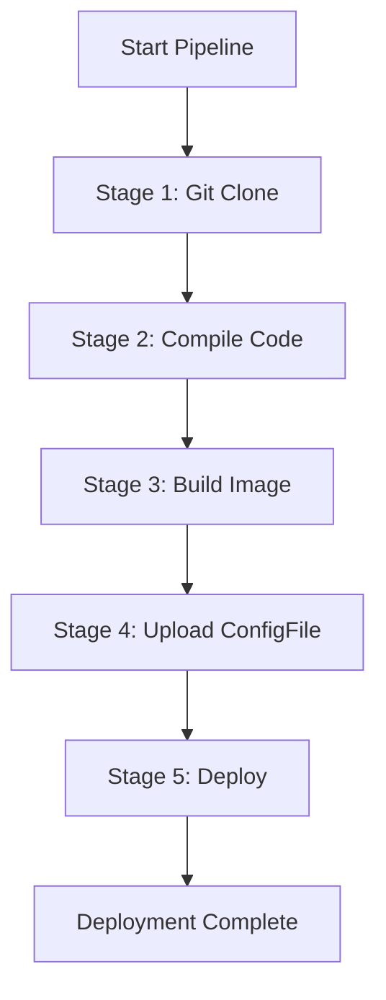


### 5. 参数给 PyDockerDeploy
**理论讲解**：
- **PyDockerDeploy 工具**：这是一个 Python 脚本，用于自动化 Docker 部署，支持通过命令行参数指定镜像、主机和运行命令。
- **参数传递**：Jenkins Pipeline 中通过 shell 命令调用 PyDockerDeploy，并将用户输入的参数传递给工具。

**参数传递方式**：
- **镜像名称（`--image`）**：由 Pipeline 构建生成，通常为 `${params.harbor_registry}/${params.project_name}/${branch}:${image_tag}`，或用户手动指定的 `${params.image}`。
- **目标主机（`--hosts`）**：从参数 `hosts` 获取，格式为逗号分隔的 IP 列表，如 `192.168.110.8,192.168.110.171`。
- **运行命令（`--docker_run`）**：从参数 `docker_run` 获取，如 `docker run -d -p 8080:8080 -v /opt/admin3-server/application.yml:/app/application.yml --restart=always`。

**示例调用命令**：
```bash
python3 /home/ubuntu/PyDockerDeploy/deployer.py \
    -p "${params.project_name}" \
    --git_branch "${branch}" \
    --image_tag "${image_tag}" \
    --image "${params.image}" \
    --hosts "${params.hosts}" \
    --harbor_registry "${params.harbor_registry}" \
    --docker_run "${params.docker_run}"
```

**配置文件上传命令**（使用 `config_manager.py`）：
```bash
python3 /home/ubuntu/PyDockerDeploy/config_manager.py \
    --data "${params.data}" \
    --filepath "${params.filepath}" \
    --hosts "${params.hosts}"
```

**注意事项**：
- 确保 PyDockerDeploy 和 config_manager 工具已配置好 SSH 连接参数，能无密码访问目标主机。
- 参数中的变量（如 `${image_tag}`）由 Jenkins 自动替换，确保格式正确。
- 如果 `hosts` 参数包含多个主机，工具应支持批量部署和文件上传。

**Mermaid 结构图**：参数传递流程
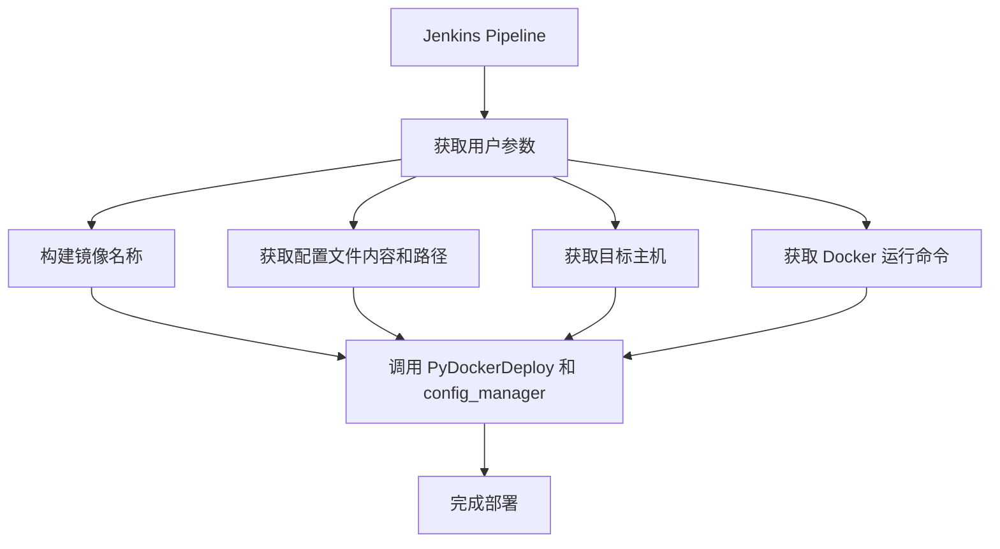

### 6. Jenkins Pipeline 脚本实现
以下是针对 `admin3-server` 项目的完整 Jenkins Pipeline 脚本实现，分为多个阶段逐步展开，确保学习者能够循序渐进地掌握内容。

#### 6.1 阶段 1：参数界面设计
**目标**：学习如何在 Jenkins 中设计参数界面，允许用户在运行 Pipeline 时输入必要信息。

**理论讲解**：
- 参数化构建是 Jenkins 的核心功能之一，通过 `properties` 插件可以为 Pipeline 定义多种类型的参数。
- 参数设计需要覆盖部署过程中的所有变量，例如代码分支、配置文件内容、目标主机和 Docker 运行命令等。

**实现代码**：
```groovy
// 定义 Pipeline 参数，允许用户在运行时选择拉取代码的分支、标签等信息
properties([
    parameters([
        // 布尔参数：是否要渲染页面，默认值为 false，勾选为 true
        booleanParam(name: 'rendering', defaultValue: false, description: '是否要渲染页面'),
        // 字符串参数：输入 Git 分支名称，默认值为 'master'，trim 去除首尾空格
        string(name: 'git_branch', defaultValue: 'master', description: '请输入代码分支', trim: true),
        // 字符串参数：输入 Git 标签名称，默认值为空，trim 去除首尾空格
        string(name: 'git_tag', defaultValue: '', description: '请输入代码TAG', trim: true),
        // 字符串参数：输入镜像地址，默认值为空，trim 去除首尾空格
        string(name: 'image', defaultValue: '', description: '请输入完整的镜像地址', trim: true),
        // 字符串参数：输入配置文件路径，默认值已提供
        string(name: 'filepath', defaultValue: '/opt/admin3-server/application.yml', description: '请输入文件路径', trim: true),
        // 文本参数：输入配置文件内容，默认值已提供
        text(name: 'data', 
            defaultValue: """spring:
  jpa:
    generate-ddl: true
    defer-datasource-initialization: true
    show-sql: true
    hibernate:
      ddl-auto: update
    properties:
      hibernate.auto_quote_keyword: true
  application:
    name: admin3
  datasource:
    driver-class-name: com.mysql.cj.jdbc.Driver
    url: jdbc:mysql://192.168.110.167:3306/admin3?characterEncoding=utf8
    username: admin
    password: admin123
  sql:
    init:
      encoding: utf8
      data-locations: classpath:data.sql
      mode: always
      continue-on-error: true
  data:
    web:
      pageable:
        one-indexed-parameters: true
  profiles:
    include: biz
server:
  servlet:
    context-path: /admin3""", 
            description: '请输入文件内容：', trim: true
        ),
        // 隐藏参数：项目名称，默认值为 'admin3-server'，用户不可见也不可修改
        hidden(name: 'project_name', defaultValue: 'admin3-server', description: '隐藏参数不给修改'),
        // harbor私库地址
        hidden(name: 'harbor_registry', defaultValue: 'harbor.labworlds.cc', description: '隐藏参数不给修改'),
        // 扩展选择参数：多选主机 IP，支持勾选多个选项，用逗号分隔
        extendedChoice(
            name: 'hosts', 
            type: 'PT_CHECKBOX', 
            value: '192.168.110.8,192.168.110.171,192.168.110.172', 
            description: '请选择主机',
            multiSelectDelimiter: ','
        ),
        // 字符串参数：输入 Docker 运行命令，默认值已提供，trim 去除首尾空格
        string(name: 'docker_run', defaultValue: 'docker run -d -p 8080:8080 -v /opt/admin3-server/application.yml:/app/application.yml --restart=always', description: '请输入Docker运行命令', trim: true),
    ])
])
```

**说明**：
- 以上代码定义了用户在 Jenkins 界面上可以看到的参数，包括布尔类型、字符串类型、文本类型和多选类型等。
- 学习者可以先在 Jenkins 中运行这段代码，观察参数界面效果，并尝试输入不同的值来熟悉参数功能。


#### 6.2 阶段 2：Pipeline 基本结构
**目标**：学习 Jenkins Pipeline 的基本结构，了解如何定义运行节点、选项和阶段（Stages）。

**理论讲解**：
- Pipeline 是一个完整的 CI/CD 流程，通常包含多个阶段（Stage），每个阶段完成一个具体任务。
- `agent` 指定 Pipeline 在哪个节点运行，`options` 设置构建行为，`stages` 定义具体的流程步骤。

**实现代码**：
```groovy
// 定义 Pipeline 主结构
pipeline {
    // 指定运行节点：任务在特定 Agent 节点上执行，企业中常指定跳板机
    agent { node 'node-192.168.110.6-shiqi' }
    // 设置 Pipeline 选项
    options {
        // 保留最近 30 个构建记录，防止日志过多占用空间
        buildDiscarder(logRotator(numToKeepStr: '30'))
        // 禁止并行构建，确保一次只运行一个构建
        disableConcurrentBuilds()  
        // 启用 ANSI 颜色输出，日志显示更美观
        ansiColor('xterm')
    }
    // 定义环境变量，在整个 Pipeline 中都可以使用
    environment {
        // 自定义变量：初始化分支变量，稍后根据参数赋值
        branch = null
    }
    // 定义 Pipeline 阶段
    stages {
        // 阶段 1：Git 克隆代码 - 占位阶段
        stage('Git Clone') {
            when {
                expression { params.rendering == false && (params.git_branch != "" || params.git_tag != "") }
            }
            steps {
                // 占位符，具体实现将在后续阶段添加
                echo "Git Clone 阶段，具体步骤将在后续实现"
            }
        }
        // 阶段 2：构建镜像 - 占位阶段
        stage('Build Image') {
            when {
                expression { params.rendering == false && (params.git_branch != "" || params.git_tag != "") }
            }
            steps {
                // 占位符，具体实现将在后续阶段添加
                echo "Build Image 阶段，具体步骤将在后续实现"
            }
        }
        // 阶段 4：上传配置文件 - 占位阶段
        stage('Upload ConfigFile') {
            when {
                expression { params.rendering == false }
            }
            steps {
                // 占位符，具体实现将在后续阶段添加
                echo "Upload ConfigFile 阶段，具体步骤将在后续实现"
            }
        }
        // 阶段 5：部署 - 占位阶段
        stage('Deploy') {
            when {
                expression { params.rendering == false }
            }
            steps {
                // 占位符，具体实现将在后续阶段添加
                echo "Deploy 阶段，具体步骤将在后续实现"
            }
        }
    }
}
```

**说明**：
- 以上代码是一个简单的 Pipeline 框架，包含五个占位阶段，用于后续逐步填充具体实现。
- 每个阶段都设置了 `when` 条件，以便学习者理解条件控制的用法，但 `steps` 中仅使用 `echo` 作为占位符。
- 学习者可以将这段代码与参数界面代码结合，在 Jenkins 中运行，观察 Pipeline 的执行流程和日志输出。


#### 6.3 阶段 3：完整步骤与实际内容
**目标**：在掌握了参数界面和 Pipeline 基本结构后，逐步实现每个阶段的实际功能，包括代码拉取、编译、镜像构建、配置文件管理和部署。

**理论讲解**：
- 完整的 CI/CD 流程需要多个阶段配合，每个阶段都有明确的条件（`when`）和步骤（`steps`）。
- 本阶段将实现从代码拉取到部署的全过程，并结合用户输入的参数动态调整行为。

**完整实现代码**：
```groovy
// docker镜像标签，按照时间-构建编号命名
def getBuildTag() {
    return new Date().format('MMddHH') + "-${env.BUILD_ID}"
}


// 定义 Pipeline 参数，允许用户在运行时选择拉取代码的分支、标签等信息
properties([
    parameters([
        // 布尔参数：是否要渲染页面，默认值为 false，勾选为 true
        booleanParam(name: 'rendering', defaultValue: false, description: '是否要渲染页面'),
        // 字符串参数：输入 Git 分支名称，默认值为 'master'，trim 去除首尾空格
        string(name: 'git_branch', defaultValue: 'master', description: '请输入代码分支', trim: true),
        // 字符串参数：输入 Git 标签名称，默认值为空，trim 去除首尾空格
        string(name: 'git_tag', defaultValue: '', description: '请输入代码TAG', trim: true),
        // 字符串参数：输入镜像地址，默认值为空，trim 去除首尾空格
        string(name: 'image', defaultValue: '', description: '请输入完整的镜像地址', trim: true),
        booleanParam(name: 'upload_config', defaultValue: false, description: '是否要更新配置文件'),
        // 字符串参数：输入 Git 标签名称，默认值为空，trim 去除首尾空格
        string(name: 'filepath', defaultValue: '/opt/admin3-server/application.yml', description: '请输入文件路径', trim: true),
        text(name: 'data', 
            defaultValue: """spring:
  jpa:
    generate-ddl: true
    defer-datasource-initialization: true
    show-sql: true
    hibernate:
      ddl-auto: update
    properties:
      hibernate.auto_quote_keyword: true
  application:
    name: admin3
  datasource:
    driver-class-name: com.mysql.cj.jdbc.Driver
    url: jdbc:mysql://192.168.110.162:3306/admin3?characterEncoding=utf8
    username: admin
    password: admin123
  sql:
    init:
      encoding: utf8
      data-locations: classpath:data.sql
      mode: always
      continue-on-error: true
  data:
    web:
      pageable:
        one-indexed-parameters: true
  profiles:
    include: biz
server:
  servlet:
    context-path: /admin3""", 
            description: '请输入文件内容：', trim: true
        ),
        // 隐藏参数：项目名称，默认值为 'admin3-ui'，用户不可见也不可修改
        hidden(name: 'project_name', defaultValue: 'admin3-server', description: '隐藏参数不给修改'),
        // harbor私库地址
        hidden(name: 'harbor_registry', defaultValue: 'harbor.labworlds.cc', description: '隐藏参数不给修改'),
        // 扩展选择参数：多选主机 IP，支持勾选多个选项，用逗号分隔
        extendedChoice(
            name: 'hosts', 
            type: 'PT_CHECKBOX', 
            value: '192.168.110.8,192.168.110.171,192.168.110.172', 
            description: '请选择主机',
            multiSelectDelimiter: ','
        ),
        // 字符串参数：输入 Docker 运行命令，默认值已提供，trim 去除首尾空格
        string(name: 'docker_run', defaultValue: 'docker run -d -p 8080:8080 -v /opt/admin3-server/application.yml:/app/application.yml', description: '请输入Docker运行命令', trim: true),
    ])
])

// 定义 Pipeline 主结构
pipeline {
    // 指定运行节点：任务在特定 Agent 节点上执行，企业中常指定跳板机
    agent { node 'node-192.168.110.6-shiqi' }
    // 设置 Pipeline 选项
    options {
        // 保留最近 30 个构建记录，防止日志过多占用空间
        buildDiscarder(logRotator(numToKeepStr: '30'))
        // 禁止并行构建，确保一次只运行一个构建
        disableConcurrentBuilds()  
        // 启用 ANSI 颜色输出，日志显示更美观
        ansiColor('xterm')
    }
    // 定义环境变量，在整个 Pipeline 中都可以使用
    environment {
        // 自定义变量：获取构建标签（通常是时间戳或版本号），具体实现可由函数定义
        image_tag = getBuildTag()
        // 自定义变量：初始化分支变量，稍后根据参数赋值
        branch = null
    }
    // 定义 Pipeline 阶段
    stages {
        // 阶段 1：Git 克隆代码，只有当分支或标签参数不为空时才执行
        stage('Git Clone') {
            when {
                // 条件表达式：如果 git_branch 或 git_tag 参数有一个不为空，则执行此阶段
                expression { params.rendering == false && (params.git_branch != "" || params.git_tag != "") }
            }
            steps {
                // 使用脚本块，允许更复杂的逻辑处理
                script {
                    // 判断逻辑：如果用户输入了标签（Tag），则拉取指定 Tag 的代码
                    if (params.git_tag != "") {
                        // 使用 GitSCM 插件拉取代码，指定 Tag 引用
                        checkout([$class: 'GitSCM',
                            // 指定 Tag 路径，格式为 refs/tags/标签名
                            branches: [[name: "refs/tags/${params.git_tag}"]],
                            // 不生成子模块配置
                            doGenerateSubmoduleConfigurations: false,
                            // 无额外扩展配置
                            extensions: [],
                            // 指定 Git 远程仓库信息和凭据
                            userRemoteConfigs: [[
                                // 使用之前配置的私钥凭据 ID
                                credentialsId: 'c4b7f929-0269-4967-b9e3-7d462db21aca',
                                // 仓库地址，指向 Gitee 上的 admin3-ui 项目
                                url: 'git@gitee.com:Tender-Liu/admin3.git'
                            ]]
                        ])
                        // 将 branch 变量赋值为选择的 Tag，便于后续使用
                        branch = params.git_tag
                    } else {
                        git credentialsId: 'c4b7f929-0269-4967-b9e3-7d462db21aca', url: 'git@gitee.com:Tender-Liu/admin3.git', branch: "${params.git_branch}"
                        branch = params.git_branch
                    }
                }
            }
        }
        stage('Build Image'){
            when {
                expression { params.rendering == false && (params.git_tag != "" || params.git_branch != "") }
            }
            steps {
                script{
                    // 企业镜像地址拼接
                    // harbor.labworlds.cc/admin3-ui/master:liujun-v1.0
                    def docker_imaeg_name = "${params.harbor_registry}/${params.project_name}/${branch}:${image_tag}"
                    sh "cd admin3-server && docker build -t ${docker_imaeg_name} ."
                    sh "docker push ${docker_imaeg_name}"
                    sh "docker rmi ${docker_imaeg_name}"
                }
            }
        }
        stage('Upload ConfigFile'){
            when {
                expression { params.rendering == false && params.upload_config == true}
            }
            steps {
                script{
                    sh """
                        python3 /home/ubuntu/PyDockerDeploy/config_manager.py \
                        --data "${params.data}" \
                        --filepath "${params.filepath}" \
                        --hosts "${params.hosts}"
                    """
                }
            }
        }
        stage('Config Confirm'){
            when {
              expression { params.rendering == false && params.git_branch != "" || params.image != "" }
            }
            steps {
                script {
                    input(
                        message: "请确认要发布吗?",
                        ok: "Submit"
                    )
                }
            }
            
        }
        stage('Deploy'){
            when {
                expression { params.rendering == false }
            }
            steps {
                script{
                    sh """
                        python3 /home/ubuntu/PyDockerDeploy/deployer.py \
                            -p "${params.project_name}" \
                            --git_branch "${branch}" \
                            --image_tag "${image_tag}" \
                            --image "${params.image}" \
                            --hosts "${params.hosts}" \
                            --harbor_registry "${params.harbor_registry}" \
                            --docker_run "${params.docker_run}"
                    """
                }
            }
        }
    }
}
```

**各阶段详细说明**：
1. **Git Clone 阶段**：
   - **功能**：根据用户输入的 `git_branch` 或 `git_tag` 参数，从 Gitee 仓库拉取代码。
   - **条件**：只有当 `rendering` 为 false 且分支或标签参数不为空时执行。
   - **逻辑**：如果指定了标签，则拉取指定标签的代码；否则拉取指定分支的代码。拉取后将代码版本赋值给 `branch` 变量，用于后续镜像命名。
2. **Compile Code 阶段**：
   - **功能**：使用 `mvn clean package` 编译后端项目，生成可执行文件（如 JAR 文件）。
   - **条件**：与 Git Clone 阶段相同，只有在需要拉取代码时才编译。
   - **逻辑**：使用 `-DskipTests` 参数跳过测试以加快构建速度（可根据实际需求调整）。
3. **Build Image 阶段**：
   - **功能**：构建 Docker 镜像，镜像标签基于时间戳和构建编号生成。
   - **条件**：同上，只有在编译代码后才构建镜像。
   - **逻辑**：构建镜像后推送到 Harbor 私有仓库，并删除本地镜像以节省空间。
4. **Upload ConfigFile 阶段**：
   - **功能**：调用 `config_manager.py` 工具，将用户输入的配置文件内容上传到目标主机。
   - **条件**：只要 `rendering` 为 false 就执行此阶段。
   - **逻辑**：通过 Python 脚本传递配置文件内容、路径和主机列表，确保配置文件在部署前准备好。
5. **Deploy 阶段**：
   - **功能**：调用 PyDockerDeploy 工具，将镜像部署到用户选择的目标主机。
   - **条件**：只要 `rendering` 为 false 就执行此阶段。
   - **逻辑**：通过 Python 脚本传递镜像信息、主机列表和运行命令，完成自动化部署。