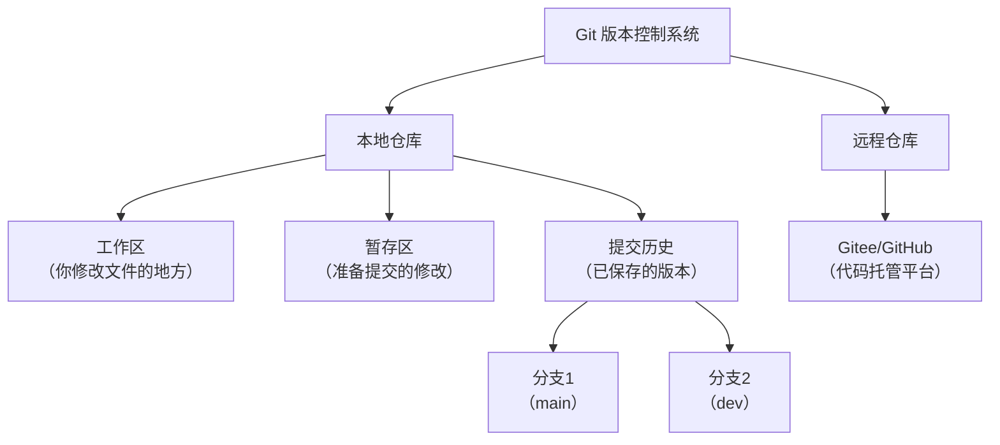
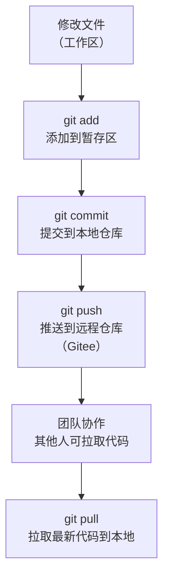
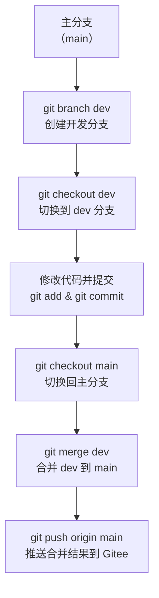

# Git 基础与 Gitee 实践：版本管理与权限配置

## 技能掌握目标
- Git 基础概念：理解 Git 的基本原理，包括版本控制、仓库、分支、提交等核心概念。
- Git 核心命令：熟练掌握 Git 初始化、克隆、提交、分支管理、推送拉取等命令。
- Gitee 项目管理：学会在 Gitee 上创建项目、配置权限（只读、开发者、管理者）。
- Git 免密配置：掌握在 Windows 和 Linux 环境下配置 Git 免密拉取代码（SSH 方式）。
- 运维应用场景：将 Git 应用于运维脚本管理、配置管理，并解决实际工作中的权限和协作问题。

## 第一部分：Git 入门与基础命令

### 1. Git 基础概念
**目标**：理解 Git 的核心概念和基本原理，为后续学习和实践打下坚实基础。  
**内容**：  
Git 是一种分布式版本控制系统（Version Control System, VCS），它的设计初衷是帮助开发者（或运维人员）管理代码或文件的变更历史，特别是在团队协作中避免混乱。以下是 Git 的几个核心概念，理解它们是学习 Git 的第一步。我们会用类比和图表来帮助你更容易掌握这些抽象概念。

- **版本控制**：  
  想象你写一篇文档，每次修改后都保存一个副本，这样你就能随时回到之前的版本。Git 就是这样的工具，它记录每次文件或代码的变更，形成一个个“版本快照”，让你可以追溯历史、撤销错误或对比差异。版本控制的核心优势是：
  - 防止误操作导致内容丢失。
  - 支持多人协作，避免互相覆盖修改。
  - 提供历史记录，方便问题排查。
  
- **仓库（Repository）**：  
  仓库是存储代码和版本历史的地方，相当于一个项目的“档案库”。Git 的仓库分为两种：
  - **本地仓库**：存在于你的电脑上，包含你正在编辑的代码和所有历史版本，你可以自由修改和提交。
  - **远程仓库**：托管在网络平台（如 Gitee、GitHub）上，用于团队共享代码和备份。  
  通过本地和远程仓库的同步，你可以实现个人开发与团队协作的无缝衔接。

- **分支（Branch）**：  
  分支是 Git 的一个强大特性，相当于代码的“平行宇宙”。你可以创建一个分支，在上面开发新功能或修复问题，而不影响主代码（通常在 `main` 或 `master` 分支）。开发完成后，再将分支合并到主代码中。分支特别适合：
  - 多人协作：每个人在自己的分支上工作，避免冲突。
  - 功能开发：隔离新功能的开发，测试稳定后再合并。

- **提交（Commit）**：  
  提交是保存代码变更的操作，每次提交就像给当前代码拍一个“快照”，记录下这一刻的文件状态和修改内容。每个提交都有一个唯一的 ID（一串字母数字），便于追溯历史。

- **合并（Merge）**：  
  合并是将不同分支的代码整合到一起的操作。例如，你在一个分支上开发了一个新功能，完成后可以通过合并将其整合到主分支。合并可能会遇到冲突（多人修改了同一文件的同一部分），Git 会提示你手动解决。

**Mermaid 图 1：Git 基本结构**  
为了更直观地展示这些概念，以下是一个 Git 的结构图，描述了本地仓库、远程仓库以及分支的关系：  

**图表解释**：  
- **本地仓库**：包含工作区（你编辑文件的地方）、暂存区（标记要提交的修改）和提交历史（已保存的版本记录）。
- **分支**：从提交历史中分叉出来，`main` 是主分支，`dev` 是开发分支，各自可以有独立的提交记录。
- **远程仓库**：托管在 Gitee 等平台上，与本地仓库通过推送和拉取保持同步。

**小结**：Git 的核心是通过版本控制管理代码变更，用仓库存储代码和历史，用分支隔离不同开发任务，用提交记录每次变更，用合并整合代码。这些概念是后续操作的基础，理解它们后，我们再看看 Git 的工作流程。

**思考练习**：  
- 想象一个场景，你和朋友一起写一个文档，如何用“版本控制”和“分支”的思路避免互相覆盖对方的修改？  
  （答案可以是：各自在不同分支上修改，完成后合并文档。无需操作，仅概念理解。）

### 2. Git 工作流程（理论与结构图）
**目标**：理解 Git 的基本工作流程，知道代码从修改到提交再到远程同步的完整路径。  
**内容**：  
Git 的工作流程可以分为几个关键步骤，涵盖从本地修改代码到与远程仓库同步的全过程。以下是详细说明，并通过流程图直观展示。

- **步骤 1：修改文件（工作区）**：  
  你在本地仓库的工作区编辑文件，比如添加代码、修改配置等。此时，文件处于“未跟踪”或“已修改”状态，尚未被 Git 记录。
- **步骤 2：暂存修改（暂存区）**：  
  使用 `git add` 命令将修改添加到暂存区，相当于告诉 Git：“这些变更我准备保存。”暂存区就像一个中转站，筛选出你要提交的内容。
- **步骤 3：提交变更（本地仓库）**：  
  使用 `git commit` 命令将暂存区的修改保存到本地仓库，形成一个新的版本快照。每个提交都有一个描述信息，用于说明变更内容。
- **步骤 4：推送至远程（远程仓库）**：  
  使用 `git push` 命令将本地提交上传到 Gitee 等远程仓库，供团队成员查看或协作。
- **步骤 5：拉取更新（同步远程变更）**：  
  使用 `git pull` 命令从远程仓库下载最新代码到本地，确保你的代码与团队保持同步。

**Mermaid 图 2：Git 基本工作流程**  
以下是 Git 工作流程的图形化展示：  

**图表解释**：  
- 流程从修改文件开始，经过暂存和提交，保存到本地仓库。
- 通过 `push` 上传到远程仓库，实现团队共享。
- 通过 `pull` 下载远程更新，确保本地代码最新。

**小结**：Git 的工作流程是一个循环：修改 -> 暂存 -> 提交 -> 推送 -> 拉取。通过这个流程，你可以管理代码变更并与团队协作。理解流程后，我们再看看分支如何融入工作流程。

**思考练习**：  
- 如果你在修改文件后忘记使用 `git add`，直接运行 `git commit` 会发生什么？  
  （答案：未暂存的修改不会被提交，Git 会提示你先添加修改。）

### 3. Git 分支管理流程（理论与结构图）
**目标**：理解分支的作用和操作流程，掌握如何通过分支实现并行开发。  
**内容**：  
分支是 Git 的核心特性之一，允许你在不影响主代码的情况下进行开发、测试或修复。以下是分支管理的典型流程：

- **创建分支**：使用 `git branch <分支名>` 创建一个新分支，通常基于当前分支的最新提交。
- **切换分支**：使用 `git checkout <分支名>` 或 `git switch <分支名>` 切换到目标分支，切换后你的工作区会显示该分支的代码状态。
- **分支开发**：在新分支上修改代码、提交变更，与主分支互不影响。
- **合并分支**：完成开发后，切换回主分支，使用 `git merge <分支名>` 将新分支的变更合并到主分支。
- **推送结果**：合并完成后，使用 `git push` 将更新上传到远程仓库。

**Mermaid 图 3：Git 分支管理流程**  
以下是分支管理的流程图：  

**图表解释**：  
- 从主分支 `main` 创建一个开发分支 `dev`，并切换过去。
- 在 `dev` 分支上进行开发和提交，独立于主分支。
- 开发完成后，切换回 `main`，合并 `dev` 分支的变更，并推送至远程仓库。

**小结**：分支管理让多人协作和功能开发变得更加安全和有序，是 Git 的核心优势之一。理解分支流程后，我们已经具备了 Git 的基本理论框架。

**思考练习**：  
- 如果你在 `dev` 分支开发了一个功能，但发现有问题，不想合并到 `main`，你会怎么做？  
  （答案：可以继续在 `dev` 分支修改直到完善，或者放弃该分支不合并。）

### 4. Git 在运维中的应用场景（理论铺垫）
**目标**：了解 Git 在运维工作中的实际用途，为后续实践提供背景。  
**内容**：  
作为运维人员，Git 不仅是开发者的工具，也可以极大提升你的工作效率。以下是几个典型应用场景，帮助你理解为什么需要学习 Git：

- **脚本管理**：运维人员经常编写自动化脚本（如 Shell、Python），用 Git 管理脚本版本，可以记录每次修改，防止误删或错误覆盖。
- **配置管理**：服务器配置文件（如 Nginx、Apache 配置）可以用 Git 跟踪变更，出现问题时快速回滚到历史版本。
- **团队协作**：在团队中，Git 帮助共享脚本和配置，结合权限管理，确保敏感内容不被误改。
- **自动化部署**：结合 CI/CD 工具，Git 可以实现代码或配置的自动化部署，减少手动操作风险。

**小结**：Git 在运维中是一个强大的版本管理和协作工具，学习它能帮助你更高效地管理资源和解决问题。接下来，我们将进入实践部分，基于这些理论创建项目并操作命令。

## 第一部分：Git 入门与基础命令（实践环节）

### 2. 前置准备：创建 Gitee 项目
**目标**：在 Gitee 上创建一个远程仓库，为后续 Git 命令练习准备环境。  
**为什么需要这一步**：学习 Git 命令需要一个实际的项目来练习，而 Gitee 是一个免费的代码托管平台，适合用来创建和管理远程仓库。没有项目就无法实践克隆、提交、推送等操作，所以我们先创建项目。

**步骤**（简单易懂，适合小白）：  
1. **注册 Gitee 账户**：  
   - 打开浏览器，访问 Gitee 官网（https://gitee.com）。  
   - 点击右上角的“注册”按钮，填写你的邮箱、用户名和密码，完成注册。  
   - 注册后登录你的账户。  
   - （如果已有账户，直接登录即可。）  
2. **创建新项目（仓库）**：  
   - 登录后，在 Gitee 首页右上角找到“+”号图标，点击后选择“新建仓库”。  
   - 在新建页面填写以下信息：  
     - **仓库名称**：输入一个名字，比如 `my-first-git-project`。  
     - **仓库路径**：通常自动生成，可不改。  
     - **公开/私有**：选择“公开”（免费用户建议选公开，方便学习）。  
     - **初始化仓库**：勾选“使用 README 初始化这个仓库”（这样会自动创建一个初始文件）。  
   - 填写完成后，点击底部的“创建”按钮。  
3. **获取仓库地址**：  
   - 创建成功后，页面会跳转到你的项目主页。  
   - 在页面顶部找到“克隆/下载”按钮，点击后复制仓库的 HTTPS 链接（类似 `https://gitee.com/你的用户名/my-first-git-project.git`）。  
   - 这个链接后续会用来克隆项目到本地。  

**小结**：现在你已经在 Gitee 上有了一个远程仓库，接下来我们会安装 Git 工具，把这个仓库克隆到本地电脑，然后开始练习 Git 命令。

**实践练习**：  
- 按照上述步骤，在 Gitee 上创建一个项目，复制仓库地址并保存好。  
- （如果遇到问题，如界面找不到“新建仓库”，可以留言告诉我，我会进一步指导。）  

**注意**：如果你还没有安装 Git 工具，请根据你的操作系统下载并安装：  
- **Windows 用户**：访问 https://git-scm.com/downloads 下载 Git for Windows，安装时一路默认选项即可。  
- **Linux 用户**：在终端输入 `sudo apt install git`（Ubuntu/Debian）或 `sudo yum install git`（CentOS）安装。  
- 安装后，在命令行输入 `git --version`，如果显示版本号，说明安装成功。

---

### 3. 学习 Git 的核心命令
**目标**：掌握 Git 基础命令，理解每个命令的作用，并在 Gitee 项目中实践。  
**内容**：以下是运维人员学习 Git 时需要掌握的核心命令，我会结合 Gitee 使用场景，逐一讲解每个命令的作用，并附上实践步骤。所有命令都需要在命令行（Windows 用 Git Bash，Linux 用终端）中执行。

#### 3.1 初始化和配置
**作用**：设置 Git 的基本信息，初始化本地仓库。  
**命令**：  
- `git init`：在本地文件夹中创建一个新的 Git 仓库。  
- `git config --global user.name "你的名字"`：设置你的用户名，标识提交者身份。  
- `git config --global user.email "你的邮箱"`：设置你的邮箱，通常与 Gitee 账户关联。  

**实践练习**：  
1. 打开命令行（Windows 用 Git Bash，Linux 用终端）。  
2. 设置用户信息：  
   - 输入 `git config --global user.name "你的名字"`（替换为你的名字）。  
   - 输入 `git config --global user.email "你的邮箱"`（替换为你的邮箱）。  
   - 输入 `git config --list` 查看配置是否生效，找到 `user.name` 和 `user.email` 确认信息正确。  
3. （暂时不初始化本地仓库，因为我们会直接克隆 Gitee 项目，下一节实践。）  

**小结**：配置用户名和邮箱是使用 Git 的第一步，确保每次提交都能正确标识你的身份。

#### 3.2 创建和克隆项目
**作用**：从 Gitee 获取远程仓库代码，或将本地仓库与远程关联。  
**命令**：  
- `git clone <仓库地址>`：从 Gitee 克隆一个远程仓库到本地。例如，你可以在 Gitee 上创建一个新项目，然后复制其 HTTPS/SSH 链接进行克隆。  
  - 示例：`git clone https://gitee.com/你的用户名/my-first-git-project.git`  
- `git remote add origin <仓库地址>`：将本地仓库与 Gitee 远程仓库关联（如果你是先本地初始化再关联远程）。  

**实践练习**：  
1. 打开命令行，选择一个本地目录（如 Windows 的 `D:\Projects` 或 Linux 的 `~/projects`），输入：  
   - `git clone https://gitee.com/你的用户名/my-first-git-project.git`（替换为你在 Gitee 上复制的仓库地址）。  
2. 克隆完成后，进入项目文件夹：  
   - 输入 `cd my-first-git-project`。  
3. 查看文件夹内容（Windows 用 `dir`，Linux 用 `ls`），确认是否包含 Gitee 初始化时创建的 `README.md` 文件。  

**小结**：克隆操作将远程仓库的代码下载到本地，现在你有了一个本地仓库副本，可以开始修改和提交代码了。

#### 3.3 基本操作（代码提交）
**作用**：管理代码变更并上传到远程仓库。  
**命令**：  
- `git status`：查看当前仓库的状态，了解哪些文件被修改或未跟踪。  
- `git add <文件名>` 或 `git add .`：将修改的文件添加到暂存区。  
- `git commit -m "提交信息"`：提交暂存区的修改到本地仓库，提交信息要简洁有意义。  
- `git push origin <分支名>`：将本地提交推送到 Gitee 远程仓库，例如 `git push origin main`。  

**实践练习**：  
1. 进入克隆的项目文件夹（如 `my-first-git-project`）。  
2. 创建一个新文件：  
   - 使用文本编辑器（如 Notepad 或 vim）创建一个名为 `test.txt` 的文件，写入任意内容（如 “这是我的第一个 Git 练习”），保存。  
3. 查看状态：  
   - 输入 `git status`，观察输出信息，会显示 `test.txt` 是未跟踪文件（untracked）。  
4. 添加文件到暂存区：  
   - 输入 `git add test.txt` 或 `git add .`（`.` 表示添加所有修改）。  
   - 再次输入 `git status`，确认文件状态变为已暂存（staged）。  
5. 提交变更：  
   - 输入 `git commit -m "添加 test.txt 文件"`，提交信息描述本次变更内容。  
6. 推送至远程仓库：  
   - 输入 `git push origin main`（如果你的默认分支是 `master`，则用 `master`）。  
   - 如果提示输入用户名和密码，输入你的 Gitee 账户信息（后续会教免密配置）。  
7. 登录 Gitee 网站，进入项目页面，确认 `test.txt` 是否已上传。  

**小结**：通过 `add`、`commit` 和 `push`，你完成了从修改文件到提交并上传到 Gitee 的完整流程。回顾之前的 Mermaid 图 2（Git 基本工作流程），可以帮助你理解每一步的作用。

#### 3.4 分支管理
**作用**：使用分支进行并行开发，隔离不同任务。  
**命令**：  
- `git branch`：查看当前分支列表。  
- `git branch <分支名>`：创建新分支。  
- `git checkout <分支名>` 或 `git switch <分支名>`：切换到指定分支。  
- `git merge <分支名>`：将指定分支合并到当前分支。  
- `git pull origin <分支名>`：从远程仓库拉取最新代码并合并到本地。  

**实践练习**：  
1. 查看当前分支：  
   - 输入 `git branch`，会显示当前分支列表，通常默认是 `main` 或 `master`，当前分支前有 `*` 号。  
2. 创建新分支：  
   - 输入 `git branch dev`，创建一个名为 `dev` 的分支。  
   - 输入 `git branch`，确认新分支已创建。  
3. 切换到新分支：  
   - 输入 `git checkout dev` 或 `git switch dev`，切换到 `dev` 分支。  
4. 修改文件并提交：  
   - 修改 `test.txt` 文件，添加一行内容（如 “在 dev 分支的修改”）。  
   - 输入 `git add .` 和 `git commit -m "在 dev 分支修改 test.txt"`。  
5. 切换回主分支并合并：  
   - 输入 `git checkout main`，切换回主分支。  
   - 输入 `git merge dev`，将 `dev` 分支的变更合并到主分支。  
6. 推送合并结果：  
   - 输入 `git push origin main`，将合并后的代码推送到 Gitee。  
7. 从远程拉取最新代码：  
   - 输入 `git pull origin main`，确保本地与远程同步。  

**小结**：分支管理是 Git 的强大功能，允许你在不影响主代码的情况下进行开发，完成后通过合并整合变更。参考之前的 Mermaid 图 3（Git 分支管理流程），可以更直观地理解这一过程。

#### 3.5 查看历史和差异
**作用**：查看代码变更历史和文件差异，方便追溯问题。  
**命令**：  
- `git log`：查看提交历史记录。  
- `git diff`：查看当前未暂存的修改。  
- `git show <提交ID>`：查看某次提交的详细信息。  

**实践练习**：  
1. 查看提交历史：  
   - 输入 `git log`，显示所有提交记录，每条记录包含提交 ID、作者、日期和提交信息。  
   - 输入 `git log --oneline`，显示简洁版历史，每条记录一行。  
2. 查看未暂存修改：  
   - 修改 `test.txt` 文件（添加一行内容），但不提交。  
   - 输入 `git diff`，查看修改的差异内容。  
3. 查看某次提交详情：  
   - 从 `git log` 中找到某次提交的 ID（一串字母数字，如 `a1b2c3...`）。  
   - 输入 `git show <提交ID>`，查看该提交的详细信息，包括修改的文件和内容。  

**小结**：通过 `log` 和 `diff`，你可以快速了解代码变更历史和当前修改状态，便于调试和回溯。

#### 3.6 撤销和回退
**作用**：撤销错误修改或回退到历史版本。  
**命令**：  
- `git reset <提交ID>`：回退到某个提交版本（谨慎使用，可能丢失未保存的修改）。  
- `git checkout -- <文件名>`：撤销对某个文件的修改（未暂存的修改）。  
- `git revert <提交ID>`：创建一个新的提交来撤销指定提交的影响（更安全的方式）。  

**实践练习**：  
1. 撤销未暂存修改：  
   - 修改 `test.txt` 文件，但不提交。  
   - 输入 `git checkout -- test.txt`，撤销修改，文件恢复到上次提交的状态。  
   - 输入 `git status`，确认修改已撤销。  
2. 撤销某次提交（安全方式）：  
   - 输入 `git log --oneline`，找到最近一次提交的 ID。  
   - 输入 `git revert <提交ID>`，创建一个新提交来撤销该次变更。  
   - 输入 `git push origin main`，推送撤销结果到 Gitee。  

**小结**：`revert` 是安全的撤销方式，不会丢失历史记录，适合团队协作中使用。

#### 3.7 与远程仓库交互
**作用**：同步本地和远程仓库的代码。  
**命令**：  
- `git fetch origin`：从远程仓库获取最新代码，但不自动合并。  
- `git pull origin <分支名>`：获取并合并远程代码。  
- `git push origin <分支名>`：推送本地代码到远程。  

**实践练习**：  
1. 获取远程更新：  
   - 登录 Gitee 网站，在项目中修改 `README.md` 文件，提交变更。  
   - 在本地输入 `git fetch origin`，获取远程更新。  
   - 输入 `git pull origin main`，将更新合并到本地。  
2. 推送本地变更：  
   - 修改本地 `test.txt` 文件，提交变更。  
   - 输入 `git push origin main`，推送至 Gitee，网站确认更新。  

**小结**：`pull` 和 `push` 是与远程仓库交互的核心命令，确保团队协作时代码同步。

## 第二部分：Gitee 进阶与运维应用

在掌握了 Git 基础命令后，我们将进一步学习 Gitee 的高级功能（如权限管理）和 Git 的进阶配置（如 SSH 免密），并探讨如何将 Git 应用于运维场景中。这一部分内容将帮助你从个人练习过渡到团队协作和实际工作应用。

### 1. Gitee 项目权限配置
**目标**：学会在 Gitee 上为团队成员分配权限，确保代码安全和协作效率。  
**内容**：  
在团队协作中，不同成员可能需要不同的权限，例如只读权限（查看代码）、开发者权限（提交代码）或管理者权限（管理项目）。Gitee 提供了灵活的权限管理功能，以下是具体步骤。

**步骤**：  
1. **进入项目设置**：  
   - 登录 Gitee，进入你的项目主页（如 `my-first-git-project`）。  
   - 点击页面顶部的“设置”选项卡（需要管理者权限）。  
2. **添加团队成员**：  
   - 在设置页面找到“成员管理”或“协作者”选项，点击“添加成员”。  
   - 输入团队成员的 Gitee 用户名或邮箱，发送邀请。  
   - 对方接受邀请后，会显示在成员列表中。  
3. **分配权限**：  
   - 在成员列表中，为每个成员设置权限：  
     - **只读**：只能查看代码，无法修改或提交，适合外部查看者。  
     - **开发者**：可以提交代码、创建分支，适合开发人员。  
     - **管理者**：拥有全部权限，包括删除项目和修改设置，适合项目负责人。  
   - 设置完成后，点击“保存”或“确认”。  
4. **验证权限**：  
   - 让团队成员登录 Gitee，访问项目页面，确认他们的操作权限是否符合预期（如只读成员无法推送代码）。  

**实践练习**：  
- 在你的 Gitee 项目中，添加一个朋友或测试账户作为协作者，设置为“开发者”权限。  
- 让对方尝试克隆项目并提交一个文件，确认是否成功。  
- 然后将权限改为“只读”，让对方尝试提交，确认是否被拒绝。  

**小结**：通过权限管理，你可以控制团队成员对项目的访问和操作权限，确保代码安全和协作有序。运维人员在管理敏感配置或脚本时，权限分配尤为重要。

---

### 2. Git SSH 免密配置
**目标**：掌握在 Windows 和 Linux 环境下配置 Git 免密拉取和推送代码（SSH 方式），提升操作效率。  
**内容**：  
每次使用 `git push` 或 `git pull` 时输入用户名和密码会很麻烦，SSH 免密配置可以解决这个问题。SSH 是一种安全的通信协议，通过公钥和私钥实现免密认证。以下是配置步骤。

#### 2.1 生成 SSH 密钥
**步骤**：  
1. 打开命令行（Windows 用 Git Bash，Linux 用终端）。  
2. 输入以下命令生成 SSH 密钥对：  
   - `ssh-keygen -t rsa -C "你的邮箱"`  
   - 按回车键接受默认文件路径（通常是 `~/.ssh/id_rsa`）。  
   - 如果提示设置密码，直接回车跳过（为空密码，实现免密）。  
3. 生成成功后，会在用户目录的 `.ssh` 文件夹中生成两个文件：  
   - `id_rsa`：私钥，保存在本地，不要泄露。  
   - `id_rsa.pub`：公钥，需要上传到 Gitee。  

#### 2.2 将公钥添加到 Gitee
**步骤**：  
1. 查看公钥内容：  
   - 输入 `cat ~/.ssh/id_rsa.pub`（Linux）或 `type ~/.ssh/id_rsa.pub`（Windows Git Bash），复制显示的公钥内容（以 `ssh-rsa` 开头的一串字符）。  
2. 添加到 Gitee：  
   - 登录 Gitee，点击右上角头像，选择“设置” -> “SSH 公钥”。  
   - 点击“添加公钥”，粘贴刚才复制的内容，输入一个标题（如 “我的电脑”），点击“确定”。  

#### 2.3 配置本地 SSH
**步骤**：  
1. 确保 SSH 配置文件正确：  
   - 输入 `ssh -T git@gitee.com`，测试是否能连接 Gitee。  
   - 如果提示“Permission denied”，可能是 SSH 配置问题，检查是否生成了密钥或公钥是否正确添加。  
   - 如果提示“Hi 你的用户名”，说明配置成功。  
2. 将仓库地址从 HTTPS 改为 SSH：  
   - 在本地项目目录中，输入 `git remote -v` 查看当前远程地址。  
   - 如果是 HTTPS 地址（如 `https://gitee.com/...`），用以下命令改为 SSH 地址：  
     - `git remote set-url origin git@gitee.com:你的用户名/my-first-git-project.git`  
   - 再次输入 `git remote -v` 确认地址已更新。  

#### 2.4 测试免密操作
**步骤**：  
- 修改一个文件，提交并推送：`git add .`、`git commit -m "测试 SSH 免密"`、`git push origin main`。  
- 如果无需输入密码即可成功推送，说明免密配置成功。  

**实践练习**：  
- 按照以上步骤，在你的电脑上配置 SSH 免密，完成一次免密推送和拉取操作。  
- 如果遇到问题（如连接失败），可以检查 `.ssh` 目录权限或重新生成密钥。  

**小结**：SSH 免密配置大大提升了 Git 操作效率，尤其在运维场景中，频繁的代码同步会更加便捷。

---

### 3. 版本标签创建与管理
**目标**：学会为代码版本打标签，方便管理重要版本或发布。  
**内容**：  
在运维或开发中，某些提交可能是重要的里程碑（如某个脚本的稳定版本），可以用 Git 的标签（Tag）标记这些提交。标签分为轻量标签和附注标签，以下是操作方法。

**命令**：  
- `git tag <标签名>`：创建轻量标签，直接标记当前提交。  
- `git tag -a <标签名> -m "标签描述"`：创建附注标签，包含额外描述信息。  
- `git tag`：查看所有标签列表。  
- `git push origin <标签名>`：推送标签到远程仓库。  
- `git checkout <标签名>`：切换到某个标签的代码状态（注意：标签是只读的，不能直接修改）。  

**实践练习**：  
1. 为当前提交打一个轻量标签：  
   - 输入 `git tag v1.0`，标记当前版本为 `v1.0`。  
   - 输入 `git tag`，确认标签已创建。  
2. 为历史提交打一个附注标签：  
   - 输入 `git log --oneline`，找到一个历史提交的 ID。  
   - 输入 `git tag -a v1.1 <提交ID> -m "版本 1.1，修复 bug"`，为该提交添加附注标签。  
3. 推送标签到 Gitee：  
   - 输入 `git push origin v1.0` 和 `git push origin v1.1`。  
   - 登录 Gitee，在项目页面查看“标签”选项卡，确认标签已上传。  

**小结**：标签是标记重要版本的工具，运维人员可以用它标记配置或脚本的稳定版本，方便后续回溯或部署。

---

### 4. Git 在运维场景中的应用
**目标**：将 Git 应用于运维脚本管理、配置管理，并解决实际工作中的权限和协作问题。  
**内容**：  
以下是 Git 在运维工作中的几个典型应用场景，通过具体案例帮助你理解如何将 Git 融入日常工作。

#### 4.1 运维脚本管理
**场景**：你编写了一个自动化脚本（如监控服务器的 Shell 脚本），需要记录每次修改并与团队共享。  
**实践步骤**：  
1. 创建一个新仓库：  
   - 在 Gitee 上新建一个项目（如 `monitoring-scripts`）。  
   - 克隆到本地：`git clone https://gitee.com/你的用户名/monitoring-scripts.git`。  
2. 添加脚本文件：  
   - 将你的脚本（如 `monitor.sh`）放入项目文件夹。  
   - 输入 `git add monitor.sh` 和 `git commit -m "添加监控脚本"`。  
3. 推送至远程：  
   - 输入 `git push origin main`，团队成员即可克隆并使用。  
4. 每次修改后提交：  
   - 修改脚本后重复 `add` 和 `commit`，形成版本历史。  

**小结**：用 Git 管理脚本，可以记录变更历史，防止误改丢失，同时方便团队共享。

#### 4.2 配置管理
**场景**：你管理服务器的 Nginx 配置文件，需要跟踪每次变更，出现问题时快速回滚。  
**实践步骤**：  
1. 将配置文件纳入 Git 管理：  
   - 在服务器上创建目录（如 `/etc/nginx/git-config`），复制 Nginx 配置到该目录。  
   - 在该目录初始化 Git 仓库：`git init`。  
   - 输入 `git add .` 和 `git commit -m "初始 Nginx 配置"`。  
2. 关联远程仓库：  
   - 在 Gitee 创建项目，复制 SSH 地址，输入 `git remote add origin <地址>`。  
   - 输入 `git push origin main`，上传配置。  
3. 变更与回滚：  
   - 修改配置后提交：`git add .` 和 `git commit -m "更新配置"`。  
   - 如果配置出错，查看历史：`git log --oneline`，找到正确版本 ID。  
   - 回滚到历史版本：`git checkout <提交ID>`，恢复配置。  

**小结**：Git 让配置变更可追溯，运维中遇到问题时可以快速回滚到稳定版本。

#### 4.3 解决分支冲突（团队协作）
**场景**：团队中两人同时修改了同一个脚本，导致合并时冲突。  
**实践步骤**：  
1. 模拟冲突：  
   - 在本地 `dev` 分支修改 `test.txt` 文件，提交变更。  
   - 登录 Gitee，直接在线修改 `test.txt` 文件并提交。  
2. 拉取远程变更：  
   - 在本地输入 `git pull origin main`，Git 会提示冲突。  
3. 解决冲突：  
   - 打开 `test.txt`，找到冲突标记（`<<<<<<< HEAD` 和 `>>>>>>>`），手动编辑保留需要的修改，删除标记。  
   - 输入 `git add test.txt` 和 `git commit -m "解决冲突"`。  
   - 输入 `git push origin main`，完成合并。  

**小结**：Git 的冲突解决机制确保团队协作中不会丢失修改，运维人员在多人维护配置时经常会用到这一功能。
