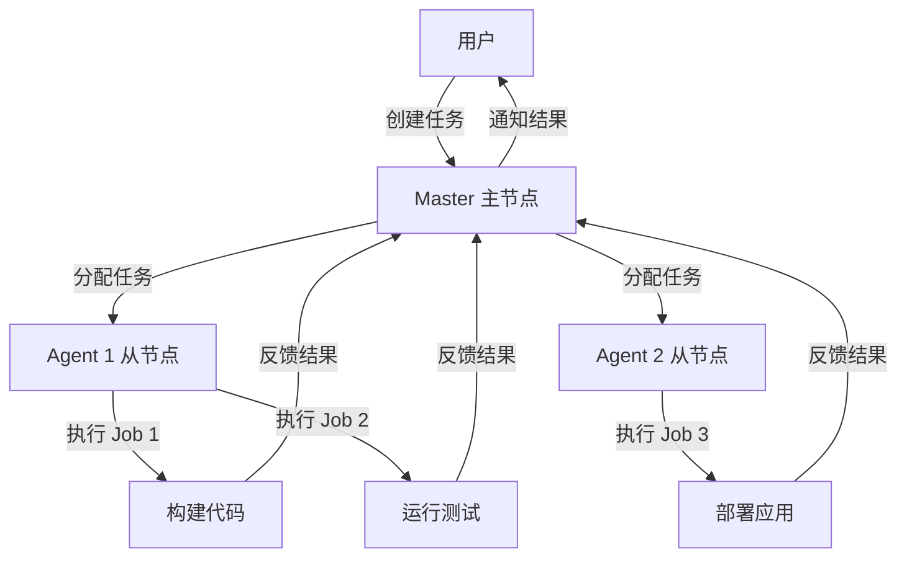
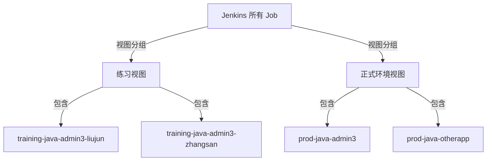

# 教学标题：Jenkins 入门与 Linux 环境搭建
## 教学目标：
1. 深入理解 Jenkins 的基本概念和 CI/CD 的核心思想，清楚其在软件开发中的作用和价值。
2. 掌握 Jenkins 在 Linux 系统（Ubuntu）上的安装步骤，包括国内源优化和 root 用户启动。
3. 通过直观图表（Mermaid）和比喻，全面认识 Jenkins 的工作流程和 CI/CD 生态。
4. 了解市场上其他主流 CI/CD 工具的特点和适用场景，为未来选型提供参考。
5. 理解 properties 和 parameters 在 Jenkins Pipeline 中的作用。
6. 掌握常见参数类型的定义、语法和使用方法。
7. 通过实验练习，学会创建参数化构建 Job 并查看结果。
8. 解决参数化构建中可能遇到的问题（如输出不显示）。


## 第一部分：Jenkins 基础与 CI/CD 概念
### 1.1 什么是 CI/CD？
- **面向小白的解释**：  
  CI/CD 是现代软件开发中的一种“高效工作方式”，就像一个蛋糕工厂的“自动化流水线”：
  - **CI（持续集成）**：想象你是一个蛋糕师傅，每次有同事加了新原料（新代码）到面糊中，你就立刻搅拌（合并代码）并检查面糊是否顺滑（运行自动化测试）。这样做能马上发现问题，比如“面粉加多了”（代码有 bug），避免等到最后才发现大问题。
  - **CD（持续交付/持续部署）**：一旦面糊没问题，你就把蛋糕烘焙好（构建软件），并快速送到客户手中（部署到服务器）。持续交付是“随时可以送货但等你确认”，持续部署是“自动送货到客户家门口”，让客户总能拿到最新鲜的蛋糕（最新版本软件）。
- **正式定义**：  
  - **CI（Continuous Integration，持续集成）**：开发人员频繁地将代码变更合并到主分支，通过自动化构建和测试验证代码质量，减少代码集成时的冲突和错误。
  - **CD（Continuous Delivery，持续交付）**：在 CI 基础上，确保代码随时可以部署到生产环境，通常需要手动确认发布。
  - **CD（Continuous Deployment，持续部署）**：更进一步，代码通过测试后自动部署到生产环境，无需人工干预。
- **为什么要用 CI/CD？**  
  传统的开发方式就像“攒一大堆面糊，等到最后一天才搅拌和烘焙”，如果发现问题（比如面糊发酵过度），修复成本非常高，甚至要全部重做。而 CI/CD 就像“边做边检查，每次加一点原料就测试一次”，小问题立刻解决，节省时间和精力。
- **CI/CD 的好处（深入理解）**：
  1. **减少风险**：每次小变更都测试，就像“每次加原料就尝一尝”，不会等到最后才发现蛋糕没法吃。
  2. **提高效率**：自动化代替手动操作，就像“机器搅拌比手拌快”，开发团队可以专注写代码。
  3. **加速交付**：新功能可以更快上线，就像“蛋糕做好就送，不用等一周”，用户体验更好。
  4. **团队协作**：多人同时开发不会互相干扰，就像“多个师傅同时加原料，流水线自动协调”。
- **CI/CD 流程（用 Mermaid 图展示）**：  
  以下是一个详细的 CI/CD 流程图，帮助小白直观理解每个环节：
  ```mermaid
  flowchart LR
      A[开发写代码] --> B[提交代码到仓库<br>如 Git]
      B --> C[Jenkins 检测变更<br>拉取最新代码]
      C --> D[构建代码<br>编译/打包]
      D --> E[自动化测试<br>单元测试/集成测试]
      subgraph 持续集成 CI
      C --- E
      end
      E --> F{测试通过?}
      F -->|是| G[部署到测试环境<br>如 Staging]
      F -->|否| H[通知开发者<br>修复问题]
      G --> I[进一步测试<br>如手动测试]
      I --> J{确认发布?}
      J -->|是| K[部署到生产环境<br>如 Production]
      J -->|否| L[等待调整]
      subgraph 持续交付 CDelivery
      G --- J
      end
      subgraph 持续部署 CDeployment
      J -.->|自动| K
      end
  ```
  - **图解比喻**：  
    - **CI 部分**：从“写代码”到“自动化测试”，就像蛋糕工厂的“原料收集-搅拌-初步检查”，确保面糊没问题。
    - **CDelivery 部分**：从“部署测试环境”到“确认发布”，就像“试烤蛋糕并让经理尝一尝，经理点头才正式卖”，需要人工确认。
    - **CDeployment 部分**：如果启用持续部署，就像“蛋糕试烤通过就自动装箱送货”，完全自动化。
  - **小白互动问题**：看到流程图，你觉得 CI/CD 哪个环节最重要？为什么“自动化测试”就像“尝面糊”一样不可缺少？

### 1.2 什么是 Jenkins？
- **面向小白的解释**：  
  Jenkins 就像蛋糕工厂里的“智能管家机器人”。它负责管理整个流水线：从收集原料（拉取代码）、搅拌面糊（构建和测试），到烘焙和送货（部署）。你只需要告诉它“做什么、怎么做”（配置任务），它就会自动完成，还会告诉你哪里出了问题（构建失败通知）。
- **正式定义**：  
  Jenkins 是一个开源的自动化服务器，主要用于实现 CI/CD 流程。它通过插件支持各种工具集成，可以自动化执行代码构建、测试、部署等任务。
- **Jenkins 的核心特点（深入理解）**：
  1. **开源免费**：任何人都可以用，不用花钱，就像“免费的机器人帮你干活”。
  2. **插件丰富**：可以安装各种插件，就像“给机器人加装不同工具”，让它能干更多活。
  3. **高度定制**：你可以自己写规则（Pipeline 脚本），就像“教机器人按你的方式做蛋糕”。
  4. **跨平台支持**：支持多种编程语言和环境，就像“不管你做中式包子还是西式蛋糕，机器人都能帮你”。
- **Jenkins 的简单工作流程（用 Mermaid 图展示）**：  
  以下是 Jenkins 在 CI/CD 中的简化工作流程：
  ```mermaid
  flowchart LR
      A[代码仓库<br>如 Git] -->|拉取代码| B[Jenkins]
      B -->|构建| C[编译/打包]
      B -->|测试| D[运行测试用例]
      B -->|部署| E[发布到服务器]
      B -->|通知| F[邮件/消息反馈]
  ```
  - **图解比喻**：Jenkins 是“总指挥”，它从仓库拿原料（代码），指挥不同的机器（插件或步骤）完成搅拌（构建）、检查（测试）、送货（部署），最后告诉你“蛋糕做好了”或“面糊有问题”。
- **小白互动问题**：Jenkins 像“管家机器人”一样自动化工作，你觉得它能帮你节省哪些手动操作？

### 1.3 市场上好用的 CI/CD 工具比较
- **面向小白的解释**：  
  CI/CD 工具就像不同品牌的“厨房机器人”，每个机器人都有自己的特长，有的适合小家庭厨房，有的适合大工厂流水线。Jenkins 是最“老牌且灵活”的机器人，但市场上还有其他好用的选择，我们来对比一下，帮你了解它们的区别。
- **主流 CI/CD 工具对比（表格形式）**：

  | 工具名称          | 开源/付费       | 主要特点                                   | 适合场景                        | 比喻解释                          | 优点                              | 缺点                              |
  |------------------|----------------|------------------------------------------|-------------------------------|---------------------------------|---------------------------------|---------------------------------|
  | **Jenkins**      | 开源免费       | 插件丰富，高度可定制，支持几乎所有语言和工具       | 需要复杂定制的企业，预算有限团队     | 万能厨师，可教它做任何菜，但需自己设置菜单 | 灵活性高，社区支持强，成本低         | 界面老旧，初学者配置复杂             |
  | **GitLab CI/CD** | 开源+付费版本   | 集成在 GitLab 中，开箱即用，YAML 配置简单      | 已在用 GitLab 托管代码的团队       | 套餐厨师，菜单已设计好，选套餐就行     | 配置简单，与 GitLab 无缝集成         | 依赖 GitLab 平台，迁移成本高          |
  | **GitHub Actions** | 免费额度+付费  | 与 GitHub 深度集成，社区支持强，YAML 配置     | 使用 GitHub 的小型团队或开源项目    | 时尚新厨师，操作简单，年轻人喜欢       | 免费额度充足，易上手               | 对 GitHub 以外生态支持有限            |
  | **CircleCI**     | 免费额度+付费  | 云端服务，速度快，支持并行构建                | 追求效率的中小型团队              | 外卖厨师，不需自己准备厨房，但好服务要钱 | 速度快，配置简单                  | 免费额度有限，成本较高               |
  | **Travis CI**    | 免费额度+付费  | 早期流行 CI 工具，配置简单，适合开源项目        | 小型开源项目                    | 老朋友厨师，曾经受欢迎，但现在不活跃    | 简单易用，开源项目友好              | 新功能少，竞争力下降                |

- **文字解释（深入理解）**：
  1. **Jenkins**：作为 CI/CD 领域的“老大哥”，它的最大优势是灵活性，就像一个“万能厨师”，你可以教它做任何菜（定制流程），而且完全免费。但缺点是需要你自己设置菜单（配置），对新手来说可能有点复杂，界面也像“老式厨房”，不够现代化。
  2. **GitLab CI/CD**：它是 GitLab 平台的一部分，就像一个“套餐厨师”，如果你已经在 GitLab 存原料（代码），用它非常省心，菜单（模板）都设计好了，直接选就行。但如果你想换平台，就像“换餐厅”，成本很高。
  3. **GitHub Actions**：这是 GitHub 推出的“新潮机器人”，特别适合年轻人（小型团队或开源项目），操作简单，免费额度多，就像“新手也能用的智能家电”。但它主要服务 GitHub 用户，换个平台就不好用了。
  4. **CircleCI**：这是一个“外卖服务”，你不需要自己建厨房（服务器），直接用它的云服务，速度快，体验好，就像“点餐就送来”。但好服务要花钱，免费额度用完后成本较高。
  5. **Travis CI**：它是 CI 工具的“老朋友”，早期很受欢迎，适合简单项目，就像“老式但可靠的机器”。但现在更新慢，功能不如其他工具丰富，逐渐被取代。
- **小结**：Jenkins 因其开源和灵活性，是学习 CI/CD 的最佳起点，尤其适合需要深度定制的企业环境。其他工具更注重“开箱即用”，适合特定平台或预算充足的团队。
- **小白互动问题**：看完对比表，你觉得 Jenkins 和 GitHub Actions 哪个更适合个人学习？为什么？

## 第二部分：Jenkins 在 Ubuntu 上的安装

### 2.1 安装前的准备与所需组件介绍
- **准备事项**：
  - **操作系统**：Ubuntu 20.04 或 22.04（企业常用，社区支持好）。
  - **权限要求**：使用 root 用户登录（或通过 `sudo` 提升权限）。
  - **网络环境**：确保服务器能联网，以便使用国内源加速下载。
- **Jenkins 安装所需的组件**：
  1. **Java 运行环境（JDK）**：
     - **作用**：Jenkins 是 Java 应用程序，必须有 Java 环境才能运行。安装 Jenkins 时，系统会自动安装所需的 JDK，因此无需手动安装。
  2. **Jenkins 软件包**：
     - **作用**：这是 Jenkins 的核心程序，包含所有功能。
     - **来源**：通过官方 Debian/Ubuntu 软件源安装，确保获取官方版本。
  3. **Web 服务器接口**：
     - **作用**：Jenkins 自带一个简单的 Web 服务器（默认 8080 端口），用于访问管理界面。
  4. **依赖工具（自动安装）**：
     - **作用**：如 `systemd`（管理 Jenkins 服务）、基本库文件等，Ubuntu 会自动处理这些依赖。

### 2.2 安装步骤
- **详细步骤（参考官方文档 https://www.jenkins.io/doc/book/installing/linux/#debianubuntu）**：
  1. **安装 Java**：
     ```bash
     sudo apt update
     sudo apt install fontconfig openjdk-21-jre -y
     java -version  # 检查是否安装成功
     ```
     - **预期输出**：
       ```
       openjdk version "21.0.3" 2024-04-16
       OpenJDK Runtime Environment (build 21.0.3+11-Debian-2)
       OpenJDK 64-Bit Server VM (build 21.0.3+11-Debian-2, mixed mode, sharing)
       ```
  2. **添加 Jenkins 官方源**：
     ```bash
     sudo wget -O /usr/share/keyrings/jenkins-keyring.asc \
       https://pkg.jenkins.io/debian-stable/jenkins.io-2023.key
     echo "deb [signed-by=/usr/share/keyrings/jenkins-keyring.asc]" \
       https://pkg.jenkins.io/debian-stable binary/ | sudo tee \
       /etc/apt/sources.list.d/jenkins.list > /dev/null
     sudo apt-get update
     ```
  3. **安装 Jenkins**：
     ```bash
     sudo apt-get install jenkins -y
     ```
  4. **修改 Jenkins 插件源（在启动前配置）**：
     - **说明**：在首次启动 Jenkins 前，可以通过修改配置文件来设置插件更新源为国内镜像源，这样后续在界面安装插件时会更加方便和快速。
     - **步骤**：
       1. 创建 Jenkins 配置文件：
          ```bash
          sudo vim /var/lib/jenkins/hudson.model.UpdateCenter.xml
          ```
       2. 添加以下内容-华为云：
            ```xml
            <?xml version='1.1' encoding='UTF-8'?>
            <sites>
            <site>
                <id>default</id>
                <url>https://mirrors.huaweicloud.com/jenkins/updates/update-center.json</url>
            </site>
            </sites>
            ```
        3. 批量修改jenkins插件源
        ```bash
        sed -i 's#www.google.com#https:/www.baidu.com#g' /var/lib/jenkins/updates/default.json
        sed -i 's#http://updates.jenkins-ci.org/download#https://mirrors.huaweicloud.com/jenkins/#g' /var/lib/jenkins/updates/default.json
        ```
  6. **以 root 用户启动 Jenkins**：
     ```bash
     vim /usr/lib/systemd/system/jenkins.service
     ```
     在编辑器中添加：
     ```ini
     [Service]
     User=root
     Group=root
     ```
  7. 修改 Jenkins 配置文件
      确保 Jenkins 的配置文件正确设置。通常，Jenkins 的配置文件位于 Ubuntu的 `/etc/default/jenkins` 或 Centos的 `/etc/sysconfig/jenkins` 中。确保以下设置正确：

     ```bash
     JENKINS_USER=root
     JENKINS_GROUP=root
     ```
     然后执行：
     ```bash
     sudo systemctl daemon-reload
     sudo systemctl restart jenkins
     sudo systemctl enable jenkins
     ps -ef | grep jenkins  # 验证运行用户
     ```
  8. **访问 Jenkins**：
     - 在浏览器访问 `http://你的服务器IP:8080`。
     - 获取初始密码：
       ```bash
       sudo cat /var/lib/jenkins/secrets/initialAdminPassword
       ```

### 2.3 初始配置与插件安装
- **初始配置步骤**：
  1. 在浏览器输入初始密码解锁 Jenkins。
  2. 选择“Select plugins to install”（稍后手动安装插件）。
  3. 创建管理员账户（用户名、密码）。
  4. 配置 Jenkins URL（默认 `http://你的服务器IP:8080`）。
- **修改插件源为国内镜像（面向小白的解释）**：  
  Jenkins 的插件就像“给工厂管家加装不同工具”，让它能干更多活，比如连接代码仓库、运行测试、部署软件等。但默认的插件源在国外，下载速度慢，就像“从外国邮寄工具要一个月”，我们换成国内源，就像“从本地商店买工具，当天就能到货”。  
  - **步骤**：
    1. 进入 Jenkins 管理界面，点击左侧菜单“Manage Jenkins” > “Manage Plugins” > “Advanced”选项卡。
    2. 在“Update Site”或“插件更新站点”字段中，将默认的 `https://updates.jenkins.io/update-center.json` 替换为国内镜像源，例如华为云源：
       ```
       https://mirrors.huaweicloud.com/jenkins/updates/update-center.json
       ```
    3. 点击“Submit”保存设置，然后返回“Available”选项卡，搜索并安装需要的插件。
  - **注意事项**：修改后需要重启 Jenkins（通过“Manage Jenkins” > “Prepare for Shutdown”并重启服务）以确保新源生效。
  - **好处**：使用国内源后，插件下载和更新速度会显著提升，尤其是在安装多个插件时，能节省大量时间。
  - **官方查询源**：https://www.jenkins-zh.cn/tutorial/management/mirror/
- **安装中文插件（面向小白的解释）**：  
  Jenkins 默认界面是英文的，对非英语用户可能不太友好。通过安装中文插件，可以将界面切换为中文，操作更直观，就像“把外国说明书翻译成中文”，一看就懂。  
  - **步骤**：
    1. 进入 Jenkins 管理界面，点击右侧螺丝图标菜单“Manage Jenkins” > Plugins” > “Available Plugins””选项卡。
    2. 在搜索框中输入 `Locale`，找到 `Locale Plugin` 并安装。
    3. 安装完成后，点击“Manage Jenkins” > “Configure System”，找到 `Locale` 设置项。
    4. 在 `Default Language` 字段中输入 `Chinese`（代表中文简体）。
    5. 保存设置并重启 Jenkins，界面将变为中文。
  - **注意事项**：部分界面可能仍保留英文，因为不是所有插件都完全支持中文，但主要功能和菜单会变成中文，方便理解和操作。
- **修改初始管理员密码（面向小白的解释）**：  
  初始密码是系统生成的随机字符串，不好记且不安全，就像“工厂大门的临时钥匙”，用完要换成自己的锁。修改密码可以保护 Jenkins 管理界面不被未经授权的人访问。  
  - **步骤**：
    1. 登录 Jenkins 后，点击右上角的用户名（默认为 `admin`）。
    2. 在下拉菜单中选择“Configure”或“配置”。
    3. 在“Password”或“密码”字段中输入新密码，并确认新密码。
    4. 点击“Save”或“保存”按钮完成修改。
  - **注意事项**：新密码要足够复杂（建议包含字母、数字和符号），并妥善保存，避免忘记。如果忘记密码，可以通过文件 `/var/lib/jenkins/secrets/initialAdminPassword` 重置，但需要服务器权限。
- **常用插件及其作用（面向小白的解释，补充完整版）**：  
  以下是 Jenkins 中最常用的几款插件，每个插件的作用通过比喻和实际功能详细讲解，帮助你理解它们在 CI/CD 流程中的价值。特别补充了与参数化构建和代码中提到的功能相关的插件。
  1. **Git Plugin(1-15)**：
     - **作用**：让 Jenkins 能从 Git 仓库（如 GitHub、GitLab）拉取代码，支持多种 Git 操作。
     - **比喻**：就像给工厂管家装上一个“原料收集器”，它能自动去仓库拿最新材料（代码），不管材料放在哪个仓库（GitHub 或 GitLab），它都能找到并带回来。
     - **使用场景**：如果你用 Git 管理代码（几乎所有现代开发都用），这个插件是必装的。比如，你写完代码推送到 GitHub，Jenkins 就能立刻检测到变化并开始构建。
     - **代码关联**：在你的 `Jenkinsfile` 中，`Git Pull` 阶段使用了 `checkout` 和 `git` 命令来拉取代码，这依赖于 Git Plugin。
  2. **Pipeline Plugin(1-28)**：
     - **作用**：支持用脚本（Jenkinsfile）定义整个 CI/CD 流程，允许你把构建、测试、部署写成代码，版本化管理。
     - **比喻**：就像给管家一个“详细的工作手册”，你可以用文字告诉它“先搅拌，再烘焙，最后送货”，而且这手册可以存档、修改、复用，比手动点按钮更高效。
     - **使用场景**：适合复杂项目，比如一个流程有多个步骤（构建前端、后端、测试、部署），用 Pipeline 脚本能清晰定义每个步骤，还能复用到其他项目。
     - **代码关联**：你的整个脚本是一个 Pipeline 脚本，定义了从代码拉取到部署的完整流程，这依赖于 Pipeline Plugin。
  3. **Blue Ocean Plugin(1-15)**：
     - **作用**：提供一个现代化的 UI 界面，展示 Pipeline 流程，比默认界面更直观，方便查看构建状态和日志。
     - **比喻**：就像把工厂老旧的“黑白仪表盘”换成“彩色触摸屏”，你能一眼看到每台机器（每个流程步骤）在干什么，哪里出了问题一目了然。
     - **使用场景**：对新手特别友好，比如你运行一个复杂流程，Blue Ocean 会用图形展示每个阶段是否成功，点击就能看详细错误信息。
  4. **Maven Integration Plugin（不装）**：
     - **作用**：支持用 Maven 构建 Java 项目，Jenkins 能自动运行 Maven 命令（如 `mvn clean install`）来编译、测试、打包代码。
     - **比喻**：就像给管家装上一个“专业搅拌机”，专门处理 Java 项目的原料（代码），能自动完成搅拌（编译）和检查（测试）。
     - **使用场景**：如果你开发 Java 项目，这个插件必装。比如，Jenkins 可以用 Maven 自动构建 Spring Boot 应用并生成 JAR 文件。
  5. **Docker Plugin（不装）**：
     - **作用**：让 Jenkins 能与 Docker 交互，比如构建 Docker 镜像、运行容器、部署应用。
     - **比喻**：就像给管家一个“集装箱工具”，它能把蛋糕（应用）装进标准集装箱（Docker 镜像），然后在任何地方快速摆摊卖（部署到任何服务器）。
     - **使用场景**：现代微服务项目常用 Docker，比如你可以用 Jenkins 构建一个 Node.js 应用的镜像，然后推送到 Docker Hub。
     - **代码关联**：在你的 `Jenkinsfile` 中，`Docker Build` 阶段使用了 `docker build` 和 `docker push` 命令，这需要 Docker Plugin 支持 Jenkins 与 Docker 交互。
  6. **Email Extension Plugin(就2个)**：
     - **作用**：增强 Jenkins 的邮件通知功能，可以自定义邮件内容、收件人、触发条件。
     - **比喻**：就像给管家装上一个“智能电话”，一旦工厂出问题（构建失败）或生产完成（构建成功），它会立刻打电话通知你，还能详细说明情况。
     - **使用场景**：团队协作时很重要，比如构建失败时通知开发人员，构建成功时通知测试人员。
  7. **Credentials Plugin（就一个）**：
     - **作用**：安全地管理用户名、密码、API 密钥等敏感信息，避免直接在脚本中硬编码。
     - **比喻**：就像给管家一个“保险箱”，把工厂大门的钥匙（密码）、仓库的通行证（API 密钥）都锁进去，只有需要时才拿出来用，防止被偷。
     - **使用场景**：连接 GitHub、Docker Hub 或服务器时需要输入密码，用这个插件可以安全保存，不用担心泄露。
     - **代码关联**：在你的 `Jenkinsfile` 中，`credentialsId` 用于指定 Git 仓库的访问凭据（如 `4c4463c8-1c2b-480d-91f1-46ca481f08ab`），这依赖于 Credentials Plugin 来安全存储和调用这些凭据。
  8. **Publish Over SSH Plugin（一个）**：
     - **作用**：通过 SSH 将构建产物（文件、包）发布到远程服务器。
     - **比喻**：就像给管家一个“远程传送器”，它能把做好的蛋糕（构建的文件）直接传送到客户家（目标服务器），不用你亲自送。
     - **使用场景**：部署应用到生产环境时常用，比如把 WAR 文件传到 Tomcat 服务器。
  9. **Build User Vars Plugin（一个）**：
      - **作用**：提供构建任务的触发者信息（如用户名），可以在脚本中获取并用于通知或权限控制。
      - **比喻**：就像给管家一个“签名簿”，记录是谁下达了生产命令（触发构建），方便后续追踪或通知这个人。
      - **使用场景**：需要根据触发构建的用户发送通知或限制操作权限时使用。
      - **代码关联**：在你的 `Jenkinsfile` 中，`Config Confirm` 和 `Deployment Confirm` 阶段使用了 `wrap([$class: 'BuildUser'])` 来获取构建触发者的用户名（`env.BUILD_USER`），这依赖于 Build User Vars Plugin。
      - **安装步骤**：
        1. 进入“Manage Jenkins” > “Manage Plugins” > “Available”选项卡。
        2. 搜索 `Build User Vars`，安装该插件。
  10. **Active Choices Plugin（参数化构建插件）（2个）**：
      - **作用**：允许在构建任务时动态生成参数选项，比如从 Git 仓库拉取分支列表供用户选择，或者根据输入值动态生成选项。
      - **比喻**：就像管家问你“要用哪个仓库的材料？”，然后列出所有可用选项供你挑，不用自己手动输入，减少出错。
      - **使用场景**：多分支开发时，选择要构建的分支；多环境部署时，选择目标环境（如测试服、生产服）。
      - **代码关联**：虽然你的 `Jenkinsfile` 中未直接使用 Active Choices 参数，但这种插件非常适合动态生成 `git_branch` 或 `git_tag` 的选项列表。
      - **安装步骤**：
        1. 进入“Manage Jenkins” > “Manage Plugins” > “Available”选项卡。
        2. 搜索 `Active Choices Plugin`，安装该插件。
      - **配置示例**：
        1. 创建或编辑一个任务（Job），选择“Add Parameter”或“添加参数”。
        2. 选择“Active Choices Parameter”。
        3. 设置参数名称（如 `BRANCH`），并在“Script”字段中编写 Groovy 脚本以动态生成选项，例如从 Git 仓库获取分支列表：
           ```groovy
           return ['main', 'dev', 'feature/new-feature']
           ```
        4. 保存后，构建任务时会显示下拉菜单供用户选择参数。
  11. **Parameterized Build Plugin（基础参数化构建插件）（一个）**：
      - **作用**：支持在构建任务中添加各种类型的参数，如字符串（String）、选择（Choice）、文本（Text）、隐藏（Hidden）等，让用户在触发构建时输入或选择值。
      - **比喻**：就像让管家记住你手动写的“订单号”（String Parameter），或者从“菜单”中选一个固定的菜品（Choice Parameter）。
      - **使用场景**：简单任务中需要用户输入版本号、环境名称等信息，或者隐藏一些不需要用户修改的默认值。
      - **代码关联**：在你的 `Jenkinsfile` 中，`properties([parameters([...])])` 定义了多个参数，如 `hidden`（隐藏参数，如 `jobName`）、`string`（字符串参数，如 `git_branch`）、`text`（文本参数，如 `meme`），这些都依赖于 Parameterized Build Plugin 或相关参数化功能。
      - **安装步骤**：通常 Jenkins 自带基础参数化功能，若缺失，可安装 `Parameterized Build Plugin` 或确保 Pipeline Plugin 已安装。
      - **配置示例（代码中已体现）**：
        - 隐藏参数：`hidden(name: "jobName", defaultValue: "${JOB_NAME}")`，用于存储默认值，不显示给用户。
        - 字符串参数：`string(name: 'git_branch', defaultValue: "", description: 'Github仓库分支')`，让用户输入 Git 分支名。
        - 文本参数：`text(name: 'meme', defaultValue: "", description: '本次发布的内容详情')`，让用户输入多行文本描述。
  12. **Scriptler Plugin（一个）**：
      - **作用**：允许在 Jenkins 中管理和运行 Groovy 脚本，方便复用代码逻辑或从外部文件加载脚本。
      - **比喻**：就像给管家一个“脚本库”，里面存了很多常用指令（Groovy 脚本），需要时直接调用，不用每次都重新写。
      - **使用场景**：复杂 Pipeline 中需要复用逻辑时，可以将脚本存储在 Scriptler 中，并在多个任务中调用。
      - **代码关联**：在你的 `Jenkinsfile` 中，脚本开头使用了 `evaluate(new File("/var/lib/jenkins/scriptler/scripts/reviewer.groovy"))` 来加载外部 Groovy 脚本获取 reviewer 信息，这依赖于 Scriptler Plugin。
      - **安装步骤**：
        1. 进入“Manage Jenkins” > “Manage Plugins” > “Available”选项卡。
        2. 搜索 `Scriptler`，安装该插件。
        3. 配置：在“Manage Jenkins” > “Scriptler”中添加和管理 Groovy 脚本。
- **小白互动问题**：
  1. 你觉得 Git Plugin 和 Pipeline Plugin 哪个对你的项目更重要？为什么？
  2. Blue Ocean 的“彩色触摸屏”界面会如何帮助你理解 CI/CD 流程？
  3. 如果你要部署一个应用到服务器，哪个插件会帮到你？它的作用是什么？
  4. 中文界面对你操作 Jenkins 有哪些帮助？你会选择使用中文界面吗？
  5. 参数化构建在你的项目中可能有哪些应用场景？比如如何利用 `Active Choices Plugin` 改进分支选择？
  6. 在你的 `Jenkinsfile` 中，`hidden` 参数和 `string` 参数分别有什么作用？你能想到其他需要隐藏或用户输入的参数吗？

### 2.4 总结与注意事项
- **总结**：
  - 完成了 Jenkins 在 Ubuntu 上的安装，使用官方 APT 源完成安装，并优化了插件源为国内镜像，加速下载。
  - 配置了中文界面、修改了管理员密码，并通过参数插件增强了任务的灵活性。
  - 了解了 Jenkins 常用插件的作用，每个插件就像“管家的不同工具”，能帮助完成代码拉取、构建、测试、部署等任务，特别是参数化构建插件和与代码相关的插件（如 Slack Notification、Build User Vars、Scriptler）。
- **注意事项**：
  - 安装插件时不要一次性装太多，避免 Jenkins 过载，建议根据项目需求逐步添加。
  - 修改插件源后记得重启 Jenkins，确保新源生效。
  - 部分插件可能有依赖关系，比如 Pipeline 相关插件可能需要先装其他基础插件，安装时注意提示信息。
  - 定期备份 Jenkins 配置文件和数据目录（如 `/var/lib/jenkins`），以防误操作或系统故障导致数据丢失。
  - 参数化构建脚本（如 Groovy 脚本）编写时要测试，避免语法错误导致构建失败。
  - 使用 `Credentials Plugin` 存储敏感信息（如 GitHub Token、Slack Token），避免在脚本中硬编码（如你的代码中直接写入了 `github_access_token` 和 `notion_api_key`，建议改为凭据存储）。
  - 确保与外部工具（如 Docker、Argocd）的集成环境已正确配置，否则相关阶段会失败。


## 第三部分：Jenkins 基础架构、视图与 Job 创建
欢迎进入 Jenkins 的学习阶段！在本部分中，我们将从 Jenkins 的基础架构开始，帮助你理解 Jenkins 的整体结构和工作方式，然后逐步学习视图（View）的管理和 Job 的创建，并按照学习环境的要求制定命名规范。这将为后续的参数化构建内容打好基础。

### 3.1 Jenkins 基础架构（面向小白的解释）

- **什么是 Jenkins**？
  - Jenkins 是一个开源的自动化服务器，主要用于持续集成（CI）和持续部署（CD）。它可以帮助你自动化执行代码构建、测试和部署等任务。
  - **比喻**：Jenkins 就像一个“工厂管家”，你告诉它要做什么（比如编译代码、运行测试、部署应用），它会自动完成这些任务，并反馈结果。
- **Jenkins 的基本架构**：
  1. **Master（主节点）**：
     - Master 是 Jenkins 的核心，负责管理任务、分配工作和存储配置。
     - **比喻**：就像工厂的总管，负责接收订单（任务），并安排工人（节点）去执行。
  2. **Agent（代理节点/从节点）**：
     - Agent 是实际执行任务的地方，可以是 Master 本身，也可以是其他服务器。
     - **比喻**：就像工厂里的工人，具体干活（比如编译代码、运行脚本）的是他们。
     - **使用场景**：当任务量大时，可以添加多个 Agent 分担工作，比如一个 Agent 专门构建 Java 项目，另一个专门跑测试。
  3. **Job（任务）**：
     - Job 是 Jenkins 中定义的一个具体任务，比如构建一个项目、运行测试脚本或部署应用。
     - **比喻**：就像工厂里的一个生产订单，告诉管家要生产什么，怎么生产。
  4. **Plugin（插件）**：
     - 插件是 Jenkins 的扩展工具，让它能做更多事情，比如连接 Git 仓库、发送通知等。
     - **比喻**：就像给管家加装不同工具，让他能干更多活。
- **Jenkins 的工作流程**：
  - 用户创建 Job，定义任务内容（比如拉取代码、构建、部署）。
  - Master 接收任务，分配给合适的 Agent 执行。
  - Agent 执行任务，并将结果（成功或失败）反馈给 Master。
  - Master 记录结果，通知用户（比如通过邮件或 Slack）。
- **官方文档**：https://www.jenkins.io/doc/book/architecture/

#### 3.1.1 Jenkins 架构 Mermaid 图解
为了更直观地展示 Jenkins 的架构和工作流程，我使用 Mermaid 流程图来表示 Master、Agent 和 Job 之间的关系：



- **图解说明**：
  - 用户通过 Jenkins 界面创建任务（Job），提交给 Master。
  - Master 作为核心控制器，将任务分配给不同的 Agent（从节点）。
  - 每个 Agent 负责执行具体的 Job，比如构建代码、运行测试或部署应用。
  - Agent 执行完成后，将结果反馈给 Master，Master 再通知用户。
  - **比喻**：就像工厂总管（Master）收到订单后，安排工人（Agent）去生产不同产品（Job），最后汇总结果报告给客户（用户）。

### 3.2 Jenkins 视图（View）管理

- **什么是视图**？
  - 视图是 Jenkins 界面上的一种组织方式，用于分组和展示 Job，让你能快速找到自己关心的任务。
  - **比喻**：就像工厂里的“任务看板”，你可以按部门或项目把订单分门别类地展示，方便查看。
- **视图的作用**：
  - 默认情况下，Jenkins 有一个“All”视图，显示所有 Job。
  - 你可以创建自定义视图，比如按环境（dev、test、prod）、按团队、按项目类型分组。
- **如何创建和使用视图**：
  1. 登录 Jenkins，点击左侧菜单中的“New View”或“新建视图”。
  2. 输入视图名称（我们这里命名为“练习”），选择视图类型（常用的是“List View”或列表视图）。
  3. 在视图配置页面，选择要包含的 Job（可以用正则表达式匹配 Job 名称，例如 `prod-java-*`）。
  4. 保存后，点击视图名称“练习”即可看到分组后的 Job 列表。
- **学习环境示例**：
  - 我们将视图命名为“练习”，专门显示学习环境中的所有任务，方便区分正式环境和其他团队的任务。
- **官方文档**：https://www.jenkins.io/doc/book/using/views/

#### 3.2.1 视图分组 Mermaid 图解
以下是使用 Mermaid 图展示视图如何分组 Job 的逻辑：



- **图解说明**：
  - Jenkins 中所有 Job 可以按需求分组到不同的视图中。
  - “练习”视图包含学习环境的任务，例如 `training-java-admin3-liujun` 和 `training-java-admin3-zhangsan`。
  - “正式环境视图”包含正式环境的 Job，例如 `prod-java-admin3`。
  - **比喻**：就像工厂把订单按“练习订单”和“正式订单”分类到不同的看板上，方便不同团队查看和管理。

### 3.3 Jenkins Job（任务）创建与命名规范

- **什么是 Job**？
  - Job 是 Jenkins 中一个具体的任务单元，可以是构建代码、运行测试、部署应用等。
  - **比喻**：就像工厂里的一个具体订单，明确规定了要生产什么产品（任务目标）和生产步骤（任务流程）。
- **Job 的类型**：
  1. **Freestyle Project**：自由风格项目，适合简单任务，通过界面配置步骤。
  2. **Pipeline**：管道项目，使用脚本（Jenkinsfile）定义任务流程，适合复杂 CI/CD 流程（我们后续会重点学习）。
  3. **Multibranch Pipeline**：多分支管道，适合管理多个分支的构建任务。
- **如何创建 Job**（以 Pipeline 为例）：
  1. 登录 Jenkins，点击左侧菜单中的“New Item”或“新建任务”。
  2. 输入 Job 名称（按照下面的命名规范），选择“Pipeline”类型，点击“OK”或“确定”。
  3. 在配置页面，滚动到“Pipeline”部分，选择“Pipeline script”或“Pipeline script from SCM”。
     - **Pipeline script**：直接在界面中编写脚本，适合简单测试。
     - **Pipeline script from SCM**：从代码仓库（如 Git）拉取 Jenkinsfile，适合正式项目。
  4. 如果选择“Pipeline script”，可以在文本框中输入简单的 Pipeline 脚本（后续会教学）。
  5. 点击“Save”或“保存”，完成 Job 创建。
- **Job 命名规范**：
  - **通用规范**：通常 Job 命名遵循“环境-类型-项目名”的格式，比如 `prod-java-admin3` 表示生产环境的 Java 类型项目 `admin3`。
  - **学习环境特殊要求**：由于是学习环境，为了区分不同学员的任务，我们在命名中加入“姓名英文”，格式为“环境-类型-项目名-姓名英文”。
  - **示例**：
    - 正式环境任务：`prod-java-admin3`
    - 学习环境任务：`training-java-admin3-liujun`
  - **好处**：这种命名方式可以避免任务名称冲突，方便导师和学员快速找到自己的任务。
- **注意事项**：
  - Job 名称尽量简洁，避免使用特殊字符（如空格、#），以免脚本引用时出错。
  - 在视图中可以进一步分组，比如将所有学习环境的 Job 放入“练习”视图。
- **官方文档**：https://www.jenkins.io/doc/book/using/building-a-pipeline/#creating-a-pipeline

### 3.4 参数化构建简介（为后续内容铺垫）

- **什么是参数化构建**？
  - 参数化构建是 Jenkins 提供的一种功能，允许用户在触发 Job 时通过 UI 界面输入或选择参数（如分支名、环境、版本号），这些参数会传递给任务脚本，增加任务的灵活性。
  - **比喻**：就像给工厂管家一个“选项清单”，每次下订单时可以选不同的材料（参数值），用同一个流程生产不同产品。
- **为什么需要参数化构建**？
  - 之前你可能需要手动修改脚本或命令来指定参数（如 Git 分支、镜像标签），非常麻烦。参数化构建通过 UI 界面收集输入，减少手动操作，提高效率。
- **简单示例**（后续详细教学）：
  - 在 Job 配置中，添加一个字符串参数：
    - 名称：`git_branch`
    - 默认值：`master`
    - 描述：`Git 仓库分支`
  - 触发 Job 时，Jenkins 会显示一个输入框，用户可以输入分支名，脚本中通过 `${params.git_branch}` 获取该值。
- **依赖插件**：
  - 基础参数化功能：Jenkins 自带。
  - 动态参数（如联动选择）：需要安装 `Active Choices Plugin`。
- **官方文档**：https://www.jenkins.io/doc/book/pipeline/jenkinsfile/#handling-parameters

### 练习：创建视图“练习”与创建 Job

在本练习中，我们将动手创建 Jenkins 中的视图（View）和 Job（任务），以便更好地组织和管理学习环境中的任务。视图将命名为“练习”，用于分组学习环境的相关 Job；Job 将选择 Pipeline 类型，并按照命名规范创建。以下是详细步骤：

#### 练习 1：创建视图“练习”

现在让我们创建一个名为“练习”的视图，用于管理学习环境中的 Job。请按照以下步骤操作：

1. **登录 Jenkins**：
   - 打开浏览器，输入你的 Jenkins 地址（例如 `http://localhost:8080` 或公司提供的地址），输入用户名和密码登录。
2. **进入视图创建页面-（有bug注意听我讲）**：
   - 登录后，在 Jenkins 首页左侧菜单中找到并点击“New View”或“新建视图”（具体文字可能因语言设置而异）。
   - 如果你没有看到“New View”，可能是权限问题，请联系管理员或导师确认。
3. **设置视图名称和类型**：
   - 在“视图名称”或“View Name”输入框中输入“练习”。
   - 选择视图类型为“List View”或“列表视图”（这是最常用的类型，适合初学者）。
   - 点击“OK”或“确定”按钮进入配置页面。
4. **配置视图内容**：
   - 在配置页面中，你会看到一个选项“Job Filters”或“任务过滤器”。
   - 勾选“Use a regular expression to include jobs into the view”或“使用正则表达式包含任务到视图”。
   - 在正则表达式输入框中输入 `training-java-.*`，这样可以匹配所有以 `training-java-` 开头的 Job（包括学习环境的 Job）。
   - 如果目前没有 Job，可以先不设置过滤条件，后续有 Job 后再调整。
5. **保存视图**：
   - 滚动到页面底部，点击“Apply”或“应用”，然后点击“Save”或“保存”。
   - 保存后，点击顶部导航栏中的“练习”，你将看到一个空的视图页面（如果还没有 Job）。
6. **验证结果**：
   - 确认视图名称显示为“练习”，后续创建 Job 后，可以在这个视图中查看你的任务。
   - 如果视图没有正确显示，请重新检查正则表达式是否正确，或联系导师协助。

- **注意事项**：
  - 如果你的 Jenkins 是中文界面，按钮和选项可能是中文的，但功能是一致的。
  - 视图名称“练习”是区分大小写的，确保输入正确。
  - 如果你误删了视图，可以随时重新创建。

#### 练习 2：创建 Job（选择 Pipeline 类型）

现在让我们动手创建一个 Job，选择 Pipeline 类型，并按照学习环境的命名规范命名。请按照以下步骤操作：

1. **选择视图**：
   - 点击顶部导航栏中的“练习”视图。
2. **进入 Job 创建页面**：
   - 登录后，在 Jenkins 首页左侧菜单中找到并点击“New Item”或“新建任务”。
   - 如果你没有看到“New Item”，可能是权限问题，请联系管理员或导师确认。
3. **设置 Job 名称和类型**：
   - 在“Enter an item name”或“输入任务名称”输入框中输入你的 Job 名称，按照学习环境规范，例如`liujun`应输入 `training-java-admin3-liujun`。
   - 在下方类型列表中选择“Pipeline”或“管道”，然后点击“OK”或“确定”按钮进入配置页面。
4. **配置 Pipeline Job**：
   - 进入配置页面后，滚动到“Pipeline”或“管道”部分。
   - 在“Definition”或“定义”下拉框中，选择“Pipeline script”或“管道脚本”（适合初学者直接在界面编写脚本）。
   - 在脚本输入框中，暂时输入以下简单脚本（后续会详细讲解 Pipeline 语法）：
     ```groovy
     pipeline {
         agent any
         stages {
             stage('Hello') {
                 steps {
                     echo 'Hello, Jenkins!'
                 }
             }
         }
     }
     ```
   - 这段脚本仅用于测试，作用是输出一句“Hello, Jenkins!”。
5. **保存 Job**：
   - 滚动到页面底部，点击“Apply”或“应用”，然后点击“Save”或“保存”。
6. **验证结果**：
   - 保存后，你会跳转到该 Job 的详情页面。
   - 点击左侧菜单中的“Build Now”或“立即构建”，触发一次构建。
   - 构建完成后，点击构建记录（例如“#1”），然后点击“Console Output”或“控制台输出”，查看输出是否包含“Hello, Jenkins!”。
   - 如果构建失败，请检查脚本是否正确输入，或联系导师协助。
7. **检查视图“练习”**：
   - 返回 Jenkins 首页，点击顶部导航栏中的“练习”视图。
   - 确认你的 Job（例如 `training-java-admin3-liujun`）是否出现在“练习”视图中。
   - 如果没有出现，可能是视图配置的正则表达式不匹配，请返回视图配置页面调整。

- **注意事项**：
  - Job 名称必须符合规范，例如 `training-java-admin3-liujun`，避免重复或使用特殊字符。
  - 如果你的 Jenkins 是中文界面，按钮和选项可能是中文的，但功能是一致的。
  - 初次创建 Pipeline 时，建议使用简单的脚本测试，熟悉界面操作后再添加复杂逻辑。
  - 如果遇到权限问题或界面选项缺失，请联系管理员或导师确认环境是否正确配置。

## 第四部分：Jenkins Pipeline 参数化构建：properties 和 parameters

### 1.1 `properties` 是什么？
- **定义**：`properties` 是 Jenkins Pipeline 中的一个步骤（step），用于配置 Job 的各种属性和行为，包括参数化构建（`parameters`）、触发器（`pipelineTriggers`）、构建丢弃策略（`buildDiscarder`）等。
- **作用**：
  - 定义参数化构建，让用户在触发构建时输入或选择值。
  - 配置自动触发规则（如定时任务）。
  - 设置构建历史保留策略、并发控制等。
- **位置**：通常放在 Pipeline 脚本的顶部，在 `pipeline` 块之前，作为 Job 的全局配置入口。

### 1.2 `parameters` 是什么？
- **定义**：`parameters` 是 `properties` 中的一个配置项，用于定义参数化构建的输入参数。
- **作用**：允许用户在构建时提供自定义输入（如字符串、选择框、密码等），从而控制 Pipeline 的执行逻辑。
- **访问方式**：在 Pipeline 脚本中通过 `params` 对象访问参数值，例如 `params.MY_PARAM`。

### 1.3 参数化构建的优势
- 提高构建灵活性：根据用户输入动态调整构建行为。
- 减少硬编码：避免在脚本中写死值，提升可维护性。
- 支持交互式构建：用户可以通过界面输入参数，降低误操作风险。


### 常见参数类型及插件依赖

以下是 Jenkins Pipeline 中常见的参数类型及其插件依赖：

1. **String 参数（字符串）**：
   - 描述：允许用户输入单行文本。
   - 插件依赖：无需额外插件，Jenkins 核心支持。
2. **Text 参数（文本）**：
   - 描述：允许用户输入多行文本。
   - 插件依赖：无需额外插件，Jenkins 核心支持。
3. **Choice 参数（选择框）**：
   - 描述：从预定义列表中选择一个选项。
   - 插件依赖：无需额外插件，Jenkins 核心支持。
4. **Boolean 参数（布尔）**：
   - 描述：复选框，选择 true 或 false。
   - 插件依赖：无需额外插件，Jenkins 核心支持。
5. **Password 参数（密码）**：
   - 描述：输入敏感信息，界面显示为星号（***）。
   - 插件依赖：无需额外插件，Jenkins 核心支持。
6. **隐藏参数（Hidden Parameter）**：
   - 描述：不在构建页面显示的参数，通常用于传递内部配置值或系统变量。
   - 插件依赖：需要安装 `Hidden Parameter Plugin`。
7. **extendedChoice 参数（多选框）**：
   - 描述：支持复选框、多选下拉框等多种形式，可选择多个选项并返回逗号分隔的字符串。
   - 插件依赖：需要安装 `Extended Choice Parameter Plugin`。

8. **activeChoiceParam（动态选择框）**：
   - 描述：通过 Groovy 脚本动态生成选项列表，支持根据时间、环境变量等条件生成不同选项。
   - 插件依赖：需要安装 `Active Choices Plugin`。

9. **activeChoiceReactiveParam（联动选择框）**：
   - 描述：基于其他参数的选择值动态更新当前参数的选项列表，实现参数间的级联联动效果。
   - 插件依赖：需要安装 `Active Choices Plugin`。

**插件安装步骤**（如需 MultiSelect、ChoiceParameter 或 CascadeChoiceParameter 参数）：
- 登录 Jenkins，点击“Manage Jenkins” -> “Manage Plugins”或“管理 Jenkins” -> “管理插件”。
- 在“Available”或“可用插件”选项卡中搜索 `Active Choices Plugin`，勾选并点击“Install without restart”或“安装无需重启”。
- 如果无权限，请联系管理员。


### 第三部分：实验练习

本部分为每个参数类型提供详细的实验练习，包括 Job 创建、脚本配置、构建步骤和预期结果。所有 Job 名称按照格式 `training-parameters-类型名-liujun` 命名。

#### 3.1 String 参数（字符串）
- **功能**：允许用户输入单行文本，适用于简单的输入场景，例如用户名、版本号或配置文件路径。
- **语法**：
  ```groovy
  properties([
      parameters([
          string(name: 'MY_STRING', defaultValue: 'default', description: '请输入一个字符串')
      ])
  ])
  ```

- **属性解释**：
  下表列出了 `string` 参数常用的属性及其说明：
  | 属性名         | 说明                                                                 |
  |----------------|----------------------------------------------------------------------|
  | `name`        | 参数的唯一标识符，用于在 Pipeline 中引用该参数。                     |
  | `defaultValue`| 默认值，如果用户未输入内容，则使用该值。                            |
  | `description` | 参数的描述信息，显示在用户界面上，帮助用户理解参数的作用。           |
  | `trim`        | 是否去除输入内容的前后空格，默认为 `false`，可设置为 `true`。       |

- **实验练习**：
  1. **创建 Job**：
     - 登录 Jenkins，点击“New Item”或“新建项目”。
     - 输入 Job 名称：`training-parameters-string-liujun`，选择类型为“Pipeline”，点击“OK”或“确定”。
  2. **配置 Pipeline 脚本**：
     - 在 Job 配置页面，滚动到“Pipeline”部分，输入以下脚本：
       ```groovy
       properties([
           parameters([
               string(name: 'MY_STRING', defaultValue: 'default', description: '请输入一个字符串')
           ])
       ])
       pipeline {
           agent any
           stages {
               stage('Print String Param') {
                   steps {
                       echo "String 参数值为：${params.MY_STRING}"
                   }
               }
           }
       }
       ```
  3. **保存配置**：
     - 点击“Save”或“保存”按钮。
  4. **触发构建**：
     - 返回 Job 详情页面，点击“Build with Parameters”或“参数化构建”。
     - 输入一个字符串（例如 `HelloJenkins`），点击“Build”或“构建”。
  5. **查看结果**：
     - 构建完成后，点击构建记录，查看“Console Output”或“控制台输出”。
- **预期输出**：
  ```
  String 参数值为：HelloJenkins
  ```

- **扩展说明：去除空格的用法**：
  如果用户输入的内容可能包含前后空格，可以设置 `trim: true` 来自动去除这些空格。例如：
    ```groovy
    properties([
        parameters([
            string(name: 'MY_STRING', defaultValue: 'default', description: '请输入一个字符串', trim: true)
        ])
    ])
    ```
  这样，即使输入为 `  Hello  `，最终参数值也会被处理为 `Hello`，避免不必要的格式问题。

#### 3.2 Hidden 参数（隐藏参数）
- **功能**：不在构建页面显示的参数，通常用于传递内部配置值或系统变量，防止用户修改。
- **插件依赖**：需要安装 `Hidden Parameter Plugin`。
- **语法**：
  ```groovy
  properties([
      parameters([
          parameters {
              hidden(
                name: 'hidden_param',
                defaultValue: 'hidden_value',
                description: 'Hidden parameter'
              )
          }
      ])
  ])
  ```

- **属性解释**：
  下表列出了 `WHideParameterDefinition` 参数常用的属性及其说明：
  | 属性名         | 说明                                                                 |
  |----------------|----------------------------------------------------------------------|
  | `name`        | 参数的唯一标识符，用于在 Pipeline 中引用该参数。                     |
  | `defaultValue`| 默认值，用户无法在界面上修改此值。                                  |
  | `description` | 参数的描述信息，通常用于内部文档记录，界面上不可见。                 |

- **实验练习**：
  1. **创建 Job**：
     - 登录 Jenkins，点击“New Item”或“新建项目”。
     - 输入 Job 名称：`training-parameters-hidden-liujun`，选择类型为“Pipeline”，点击“OK”或“确定”。
  2. **配置 Pipeline 脚本**：
     - 在 Job 配置页面，滚动到“Pipeline”部分，输入以下脚本：
       ```groovy
       properties([
          parameters([
              hidden(
                name: 'hidden_param',
                defaultValue: 'hidden_value',
                description: 'Hidden parameter'
              )
          ])
       ])
       pipeline {
           agent any
           stages {
               stage('Print Hidden Param') {
                   steps {
                       echo "隐藏参数值为：${params.hidden_param}"
                   }
               }
           }
       }
       ```
  3. **保存配置**：
     - 点击“Save”或“保存”按钮。
  4. **触发构建**：
     - 返回 Job 详情页面，点击“Build with Parameters”或“参数化构建”。
     - 注意：隐藏参数不会在页面显示，直接点击“Build”或“构建”。
  5. **查看结果**：
     - 构建完成后，点击构建记录，查看“Console Output”或“控制台输出”。
- **预期输出**：
  ```
  隐藏参数值为：secret-config-value
  ```

- **扩展说明：使用场景**：
  隐藏参数适用于需要在 Pipeline 内部传递固定配置值但不希望用户看到或修改的场景，例如内部 API 密钥、固定版本号等。需要注意的是，虽然参数在界面上不可见，但如果在日志中直接输出（如示例中的 `echo`），仍可能泄露信息，建议谨慎使用。

- **注意事项**：
  - 确保已安装 `Hidden Parameter Plugin`，否则此参数类型将不可用。
  - 避免在日志中直接输出隐藏参数值，建议结合 Jenkins 凭据管理功能处理敏感信息。


#### 3.3 Text 参数（文本）
- **功能**：允许用户输入多行文本，适合输入脚本片段、描述信息或配置文件内容。
- **语法**：
  ```groovy
  properties([
      parameters([
          text(name: 'MY_TEXT', defaultValue: '请输入多行文本\n例如脚本或描述', description: '请输入多行文本内容')
      ])
  ])
  ```

- **属性解释**：
  下表列出了 `text` 参数常用的属性及其说明：
  | 属性名         | 说明                                                                 |
  |----------------|----------------------------------------------------------------------|
  | `name`        | 参数的唯一标识符，用于在 Pipeline 中引用该参数。                     |
  | `defaultValue`| 默认值，可以是多行文本内容，换行使用 `\n` 表示。                    |
  | `description` | 参数的描述信息，显示在用户界面上，帮助用户理解参数的作用。           |

- **实验练习**：
  1. **创建 Job**：
     - 登录 Jenkins，点击“New Item”或“新建项目”。
     - 输入 Job 名称：`training-parameters-text-liujun`，选择类型为“Pipeline”，点击“OK”或“确定”。
  2. **配置 Pipeline 脚本**：
     - 在 Job 配置页面，滚动到“Pipeline”部分，输入以下脚本：
       ```groovy
       properties([
           parameters([
               text(name: 'MY_TEXT', defaultValue: '请输入多行文本\n例如脚本或描述', description: '请输入多行文本内容')
           ])
       ])
       pipeline {
           agent any
           stages {
               stage('Print Text Param') {
                   steps {
                       echo "Text 参数值为：\n${params.MY_TEXT}"
                   }
               }
           }
       }
       ```
  3. **保存配置**：
     - 点击“Save”或“保存”按钮。
  4. **触发构建**：
     - 返回 Job 详情页面，点击“Build with Parameters”或“参数化构建”。
     - 在文本框中输入多行文本（例如 `Line 1\nLine 2`），点击“Build”或“构建”。
  5. **查看结果**：
     - 构建完成后，点击构建记录，查看“Console Output”或“控制台输出”。
- **预期输出**：
  ```
  Text 参数值为：
  Line 1
  Line 2
  ```

- **扩展说明：处理多行文本**：
  `Text` 参数的值在 Pipeline 中可以直接作为脚本或配置文件内容使用。例如，可以将用户输入的文本写入文件：
    ```groovy
    pipeline {
        agent any
        stages {
            stage('Write Text to File') {
                steps {
                    writeFile file: 'user_input.txt', text: "${params.MY_TEXT}"
                    echo "已将文本内容写入文件 user_input.txt"
                }
            }
        }
    }
    ```
  这种用法适用于需要用户提供脚本或配置内容的场景。

#### 3.3 Choice 参数（选择框）
- **功能**：从预定义列表中选择一个选项，适合有限选项场景（如环境选择、版本选择）。
- **语法**：
  ```groovy
  properties([
      parameters([
          choice(name: 'ENVIRONMENT', choices: ['dev', 'test', 'prod'], description: '请选择环境')
      ])
  ])
  ```

- **属性解释**：
  下表列出了 `choice` 参数常用的属性及其说明：
  | 属性名         | 说明                                                                 |
  |----------------|----------------------------------------------------------------------|
  | `name`        | 参数的唯一标识符，用于在 Pipeline 中引用该参数。                     |
  | `choices`     | 可选值的列表，可以是字符串列表或用换行符分隔的字符串，用户只能选择一个值。 |
  | `description` | 参数的描述信息，显示在用户界面上，帮助用户理解参数的作用。           |

- **实验练习**：
  1. **创建 Job**：
     - 登录 Jenkins，点击“New Item”或“新建项目”。
     - 输入 Job 名称：`training-parameters-choice-liujun`，选择类型为“Pipeline”，点击“OK”或“确定”。
  2. **配置 Pipeline 脚本**：
     - 在 Job 配置页面，滚动到“Pipeline”部分，输入以下脚本：
       ```groovy
       properties([
           parameters([
               choice(name: 'ENVIRONMENT', choices: ['dev', 'test', 'prod'], description: '请选择环境')
           ])
       ])
       pipeline {
           agent any
           stages {
               stage('Print Choice Param') {
                   steps {
                       echo "Choice 参数值为：${params.ENVIRONMENT}"
                   }
               }
           }
       }
       ```
  3. **保存配置**：
     - 点击“Save”或“保存”按钮。
  4. **触发构建**：
     - 返回 Job 详情页面，点击“Build with Parameters”或“参数化构建”。
     - 从下拉列表中选择一个选项（例如 `test`），点击“Build”或“构建”。
  5. **查看结果**：
     - 构建完成后，点击构建记录，查看“Console Output”或“控制台输出”。
- **预期输出**：
  ```
  Choice 参数值为：test
  ```

- **扩展说明：使用换行符定义选项**：
  如果选项列表较长或需要更好的可读性，可以使用换行符（`\n`）分隔选项。以下是示例代码片段：
    ```groovy
    properties([
        parameters([
            choice(
                name: 'ENVIRONMENT', 
                choices: 'dev\ntest\nprod', 
                description: '请选择环境'
            )
        ])
    ])
    ```
  这种写法在界面上效果与列表形式一致，但代码更易于维护。

#### 3.4 Boolean 参数（布尔）
- **功能**：提供复选框形式，允许用户选择 `true` 或 `false`，适合开关类型选项（如是否启用某功能）。
- **语法**：
  ```groovy
  properties([
      parameters([
          booleanParam(name: 'IS_DEBUG', defaultValue: false, description: '是否启用调试模式')
      ])
  ])
  ```

- **属性解释**：
  下表列出了 `booleanParam` 参数常用的属性及其说明：
  | 属性名         | 说明                                                                 |
  |----------------|----------------------------------------------------------------------|
  | `name`        | 参数的唯一标识符，用于在 Pipeline 中引用该参数。                     |
  | `defaultValue`| 默认值，`true` 表示默认勾选，`false` 表示默认未勾选。               |
  | `description` | 参数的描述信息，显示在用户界面上，帮助用户理解参数的作用。           |

- **实验练习**：
  1. **创建 Job**：
     - 登录 Jenkins，点击“New Item”或“新建项目”。
     - 输入 Job 名称：`training-parameters-boolean-liujun`，选择类型为“Pipeline”，点击“OK”或“确定”。
  2. **配置 Pipeline 脚本**：
     - 在 Job 配置页面，滚动到“Pipeline”部分，输入以下脚本：
       ```groovy
       properties([
           parameters([
               booleanParam(name: 'IS_DEBUG', defaultValue: false, description: '是否启用调试模式')
           ])
       ])
       pipeline {
           agent any
           stages {
               stage('Print Boolean Param') {
                   when {
                       expression { params.IS_DEBUG == false }
                   }
                   steps {
                       echo "Boolean 参数值为：${params.IS_DEBUG}"
                   }
               }
           }
       }
       ```
  3. **保存配置**：
     - 点击“Save”或“保存”按钮。
  4. **触发构建**：
     - 返回 Job 详情页面，点击“Build with Parameters”或“参数化构建”。
     - 勾选或取消勾选“是否启用调试模式”，点击“Build”或“构建”。
  5. **查看结果**：
     - 构建完成后，点击构建记录，查看“Console Output”或“控制台输出”。
- **预期输出**：
  - 如果勾选：
    ```
    Boolean 参数值为：true
    ```
  - 如果未勾选：
    ```
    Boolean 参数值为：false
    ```

- **扩展说明：条件逻辑应用**：
  `Boolean` 参数常用于条件判断。例如，可以根据参数值决定是否执行某个阶段：
    ```groovy
    pipeline {
        agent any
        stages {
            stage('Debug Mode') {
                when {
                    expression { params.IS_DEBUG == 'true' }
                }
                steps {
                    echo "调试模式已启用，正在执行调试步骤..."
                }
            }
        }
    }
    ```
  这种用法在自动化流程中非常实用。

#### 3.5 Password 参数（密码）
- **功能**：用于输入敏感信息（如密码、密钥），界面上显示为星号（***）以保护隐私。
- **语法**：
  ```groovy
  properties([
      parameters([
          password(name: 'MY_PASSWORD', defaultValue: '', description: '请输入密码')
      ])
  ])
  ```

- **属性解释**：
  下表列出了 `password` 参数常用的属性及其说明：
  | 属性名         | 说明                                                                 |
  |----------------|----------------------------------------------------------------------|
  | `name`        | 参数的唯一标识符，用于在 Pipeline 中引用该参数。                     |
  | `defaultValue`| 默认值，通常为空字符串（''），不建议直接设置默认密码。              |
  | `description` | 参数的描述信息，显示在用户界面上，帮助用户理解参数的作用。           |

- **实验练习**：
  1. **创建 Job**：
     - 登录 Jenkins，点击“New Item”或“新建项目”。
     - 输入 Job 名称：`training-parameters-password-liujun`，选择类型为“Pipeline”，点击“OK”或“确定”。
  2. **配置 Pipeline 脚本**：
     - 在 Job 配置页面，滚动到“Pipeline”部分，输入以下脚本：
       ```groovy
       properties([
           parameters([
               password(name: 'MY_PASSWORD', defaultValue: '', description: '请输入密码')
           ])
       ])
       pipeline {
           agent any
           stages {
               stage('Print Password Param') {
                   steps {
                       echo "Password 参数值为：${params.MY_PASSWORD}"
                   }
               }
           }
       }
       ```
  3. **保存配置**：
     - 点击“Save”或“保存”按钮。
  4. **触发构建**：
     - 返回 Job 详情页面，点击“Build with Parameters”或“参数化构建”。
     - 输入一个密码（例如 `MySecret123`），点击“Build”或“构建”。
  5. **查看结果**：
     - 构建完成后，点击构建记录，查看“Console Output”或“控制台输出”。
- **预期输出**：
  ```
  Password 参数值为：MySecret123
  ```

- **注意事项**：
  - **避免直接输出密码**：在实际使用中，避免将密码直接输出到控制台日志，以防止敏感信息泄露。建议结合 Jenkins 的凭据管理功能（Credentials Plugin）存储和使用敏感信息。
  - **凭据管理替代方案**：可以使用 `credentials` 参数类型绑定已存储的凭据，而不是直接使用 `password` 参数。例如：
    ```groovy
    properties([
        parameters([
            credentials(
                name: 'MY_CREDENTIAL', 
                credentialType: 'Username with password', 
                description: '请选择凭据'
            )
        ])
    ])
    ```
  这种方式更安全，推荐在生产环境中使用。

#### 3.6 extendedChoice 参数（多选框）
- **功能**：支持复选框、多选下拉框等多种形式，可选择多个选项并返回逗号分隔的字符串。
- **插件依赖**：需要安装 `Extended Choice Parameter Plugin`。
- **语法**：
    ```groovy
    properties([
        parameters([
            extendedChoice(
            name: 'MULTI_SELECT', 
            type: 'PT_CHECKBOX', 
            value: 'option1,option2,option3', 
            description: '请选择多个选项'
            )
        ])
    ])
    ```

- **属性解释**：
  下表列出了 `extendedChoice` 参数常用的属性及其说明（以多选框 `PT_CHECKBOX` 为重点）：
  | 属性名                 | 说明                                                                 |
  |------------------------|----------------------------------------------------------------------|
  | `name`                | 参数的唯一标识符，用于在 Pipeline 中引用该参数。                     |
  | `type`                | 参数类型，对于多选框通常设置为 `PT_CHECKBOX`，也可设置为 `PT_MULTI_SELECT`（多选下拉框）。 |
  | `value`               | 可选值的列表，多个值之间用逗号（`,`）分隔，用户可选择多个值。        |
  | `description`         | 参数的描述信息，显示在用户界面上，帮助用户理解参数的作用。           |
  | `defaultValue`        | 默认选中的值，可以是 `value` 中的一个或多个值，用逗号分隔。          |
  | `delimiter`           | 多选框专用，定义多选结果的拼接分隔符，默认值为逗号（`,`），可自定义为其他字符如 `;`。 |
  | `visibleItemCnt`      | 可见项目数量，控制界面上可见的选项数量，若选项较多可通过滚动查看，默认为全部可见。 |
  | `quoteValue`          | 是否为选项值添加引号，通常设置为 `false`，默认为 `false`。          |

- **实验练习**：
  1. **创建 Job**：
     - 登录 Jenkins，点击"New Item"或"新建项目"。
     - 输入 Job 名称：`training-parameters-extendedchoice-liujun`，选择类型为"Pipeline"，点击"OK"或"确定"。
  2. **配置 Pipeline 脚本**：
     - 在 Job 配置页面，滚动到"Pipeline"部分，输入以下脚本：
        ```groovy
        properties([
            parameters([
                extendedChoice(
                    name: 'MULTI_SELECT', 
                    type: 'PT_CHECKBOX', 
                    value: 'option1,option2,option3', 
                    description: '请选择多个选项'
                )
            ])
        ])
        pipeline {
            agent any
            stages {
                stage('Print Extended Choice Param') {
                    steps {
                        echo "Extended Choice 参数值为：${params.MULTI_SELECT}"
                    }
                }
            }
        }
        ```
  3. **保存配置**：
     - 点击"Save"或"保存"按钮。
  4. **触发构建**：
     - 返回 Job 详情页面，点击"Build with Parameters"或"参数化构建"。
     - 选择多个选项（例如 `option1` 和 `option3`），点击"Build"或"构建"。
  5. **查看结果**：
     - 构建完成后，点击构建记录，查看"Console Output"或"控制台输出"。
- **预期输出**：
  ```
  Extended Choice 参数值为：option1,option3
  ```

- **扩展说明：自定义分隔符**：
  如果需要更改多选结果的分隔符，可以使用 `delimiter` 属性。例如，将分隔符改为分号（`;`），只需在参数配置中添加 `delimiter: ';'`，则选择 `option1` 和 `option3` 后的输出为 `option1;option3`。以下是示例代码片段：
    ```groovy
    properties([
        parameters([
            extendedChoice(
                name: 'MULTI_SELECT', 
                type: 'PT_CHECKBOX', 
                value: 'option1,option2,option3', 
                description: '请选择多个选项',
                delimiter: ';'
            )
        ])
    ])
    ```

- **扩展说明：设置可见项目数量**：
  如果选项列表较长，可以通过 `visibleItemCnt` 属性限制界面上可见的项目数量，用户可通过滚动查看更多选项。例如，将可见项目数量设为 `2`，只需在参数配置中添加 `visibleItemCnt: 2`。以下是示例代码片段：
    ```groovy
    properties([
        parameters([
            extendedChoice(
                name: 'MULTI_SELECT', 
                type: 'PT_CHECKBOX', 
                value: 'option1,option2,option3,option4,option5', 
                description: '请选择多个选项',
                visibleItemCnt: 2
            )
        ])
    ])
    ```

#### 3.7 extendedChoice 参数（单选按钮）
- **功能**：以单选按钮的形式展示选项，用户只能选择一个选项。
- **插件依赖**：需要安装 `Extended Choice Parameter Plugin`。
- **语法**：
    ```groovy
    properties([
        parameters([
            extendedChoice(
                name: 'RADIO_SELECT', 
                type: 'PT_RADIO', 
                value: 'option1,option2,option3', 
                description: '请选择一个选项'
            )
        ])
    ])
    ```

- **属性解释**：
  下表列出了 `extendedChoice` 参数常用的属性及其说明（以单选按钮 `PT_RADIO` 为重点）：
  | 属性名             | 说明                                                                 |
  |--------------------|----------------------------------------------------------------------|
  | `name`            | 参数的唯一标识符，用于在 Pipeline 中引用该参数。                     |
  | `type`            | 参数类型，对于单选按钮必须设置为 `PT_RADIO`。                       |
  | `value`           | 可选值的列表，多个值之间用逗号（`,`）分隔，用户只能选择一个。        |
  | `description`     | 参数的描述信息，显示在用户界面上，帮助用户理解参数的作用。           |
  | `defaultValue`    | 默认选中的值，必须是 `value` 中的一个值，适用于单选按钮。            |
  | `visibleItemCnt`  | 控制界面上可见的选项数量，若选项较多可通过滚动查看，默认为全部可见。  |
  | `quoteValue`      | 是否为选项值添加引号，通常设置为 `false`，默认为 `false`。          |

- **实验练习**：
  1. **创建 Job**：
     - 登录 Jenkins，点击"New Item"或"新建项目"。
     - 输入 Job 名称：`training-parameters-radio-liujun`，选择类型为"Pipeline"，点击"OK"或"确定"。
  2. **配置 Pipeline 脚本**：
     - 在 Job 配置页面，滚动到"Pipeline"部分，输入以下脚本：
        ```groovy
        properties([
            parameters([
                extendedChoice(
                    name: 'RADIO_SELECT', 
                    type: 'PT_RADIO', 
                    value: 'option1,option2,option3', 
                    description: '请选择一个选项'
                )
            ])
        ])
        pipeline {
            agent any
            stages {
                stage('Print Radio Param') {
                    steps {
                        echo "Radio 参数值为：${params.RADIO_SELECT}"
                    }
                }
            }
        }
        ```
  3. **保存配置**：
     - 点击"Save"或"保存"按钮。
  4. **触发构建**：
     - 返回 Job 详情页面，点击"Build with Parameters"或"参数化构建"。
     - 选择一个选项（例如 `option2`），点击"Build"或"构建"。
  5. **查看结果**：
     - 构建完成后，点击构建记录，查看"Console Output"或"控制台输出"。
- **预期输出**：
  ```
  Radio 参数值为：option2
  ```

#### 3.8 CascadeChoiceParameter 参数（联动选择框）
- **声明**：非必学内容，如果老师讲了但您没有完全掌握，不必担心，这部分内容属于进阶知识，不会影响基础学习。
- **功能**：基于其他参数值的选择动态更新选项，实现参数间的联动，例如根据选择的地区动态显示城市列表。支持单选和多选模式。
- **前提条件**：需要安装 `Active Choices Plugin` 插件。
- **语法（单选模式）**：
    ```groovy
    properties([
        parameters([
            choice(name: 'REGION', choices: ['', 'North', 'South'], description: '请选择地区'),
            [
                $class: 'CascadeChoiceParameter',
                name: 'CITY',
                referencedParameters: 'REGION',
                choiceType: 'PT_RADIO',
                script: [
                    $class: 'GroovyScript',
                    fallbackScript: [classpath: [], sandbox: true, script: 'return ["请先选择地区"]'],
                    script: [
                        classpath: [],
                        sandbox: true,
                        script: '''
                        if (REGION == 'North') {
                            return ['Beijing', 'Tianjin', 'Harbin']
                        } else if (REGION == 'South') {
                            return ['Shanghai', 'Guangzhou', 'Shenzhen']
                        } else {
                            return ['请先选择地区']
                        }
                        '''
                    ]
                ],
                description: '请选择城市'
            ]
        ])
    ])
    ```

- **语法（多选模式）**：
    ```groovy
    properties([
        parameters([
            choice(name: 'REGION', choices: ['', 'North', 'South'], description: '请选择地区'),
            [
                $class: 'CascadeChoiceParameter',
                name: 'CITIES',
                referencedParameters: 'REGION',
                choiceType: 'PT_CHECKBOX',
                script: [
                    $class: 'GroovyScript',
                    fallbackScript: [classpath: [], sandbox: true, script: 'return ["请先选择地区"]'],
                    script: [
                        classpath: [],
                        sandbox: true,
                        script: '''
                        if (REGION == 'North') {
                            return ['Beijing', 'Tianjin', 'Harbin']
                        } else if (REGION == 'South') {
                                return ['Shanghai', 'Guangzhou', 'Shenzhen']
                            } else {
                                return ['请先选择地区']
                            }
                            '''
                    ]
                ],
                description: '请选择多个城市'
            ]
        ])
    ])
    ```

- **属性解释**：
  下表列出了 `CascadeChoiceParameter` 参数常用的属性及其说明：
  | 属性名                  | 说明                                                                 |
  |-------------------------|----------------------------------------------------------------------|
  | `$class`               | 指定参数类型为级联选择参数，固定值为 `CascadeChoiceParameter`。       |
  | `name`                 | 参数的唯一标识符，用于在 Pipeline 中引用该参数。                     |
  | `referencedParameters` | 引用的参数名称，用于联动，通常是其他参数的 `name` 值。               |
  | `choiceType`           | 选择类型，`PT_RADIO` 为单选，`PT_CHECKBOX` 为多选。      |
  | `script`               | 动态生成选项的 Groovy 脚本，基于引用的参数值返回选项列表。          |
  | `fallbackScript`       | 脚本执行失败时的备用脚本，通常返回默认或错误提示选项。               |
  | `description`          | 参数的描述信息，显示在用户界面上，帮助用户理解参数的作用。           |

- **实验练习（单选模式）**：
  1. **安装必要插件**：
     - 登录 Jenkins，进入“Manage Jenkins”或“系统管理” → “Manage Plugins”或“插件管理”。
     - 在“Available”或“可选插件”选项卡中搜索 `Active Choices Plugin`，安装并重启 Jenkins。
  2. **创建 Job**：
     - 登录 Jenkins，点击“New Item”或“新建项目”。
     - 输入 Job 名称：`training-parameters-cascadechoice-single-liujun`，选择类型为“Pipeline”，点击“OK”或“确定”。
  3. **配置 Pipeline 脚本**：
     - 在 Job 配置页面，滚动到“Pipeline”部分，输入以下脚本：
        ```groovy
        properties([
            parameters([
                choice(name: 'REGION', choices: ['', 'North', 'South'], description: '请选择地区'),
                [
                    $class: 'CascadeChoiceParameter',
                    name: 'CITY',
                    referencedParameters: 'REGION',
                    choiceType: 'PT_CHECKBOX',
                    script: [
                        $class: 'GroovyScript',
                        fallbackScript: [classpath: [], sandbox: true, script: 'return ["请先选择地区"]'],
                        script: [
                            classpath: [],
                            sandbox: true,
                            script: '''
                            if (REGION == 'North') {
                                return ['Beijing', 'Tianjin', 'Harbin']
                            } else if (REGION == 'South') {
                                return ['Shanghai', 'Guangzhou', 'Shenzhen']
                            } else {
                                return ['请先选择地区']
                            }
                            '''
                        ]
                ],
                description: '请选择城市']
            ])
        ])
        pipeline {
            agent any
            stages {
                stage('Print Cascade Choice Param') {
                    steps {
                        echo "Region 参数值为：${params.REGION}"
                        echo "City 参数值为：${params.CITY}"
                        script {
                            if (params.REGION && params.CITY && params.CITY != '请先选择地区') {
                                echo "您选择了 ${params.REGION} 地区的 ${params.CITY} 城市"
                            } else {
                                echo "请确保已正确选择地区和城市"
                            }
                        }
                    }
                }
            }
        }
        ```
  4. **保存配置**：
     - 点击“Save”或“保存”按钮。
  5. **初次运行**：
     - 返回 Job 详情页面，点击“Build Now”或“立即构建”，让 Jenkins 识别参数定义。
  6. **参数化构建**：
     - 点击“Build with Parameters”或“参数化构建”。
     - 先选择地区（例如 `North`），等待城市选项自动更新。
     - 然后选择对应的城市（例如 `Beijing`），点击“Build”或“构建”。
  7. **查看结果**：
     - 构建完成后，点击构建记录，查看“Console Output”或“控制台输出”。
- **预期输出（单选模式）**：
  ```
  Region 参数值为：North
  City 参数值为：Beijing
  您选择了 North 地区的 Beijing 城市
  ```

- **实验练习（多选模式）**：
  1. **创建 Job**：
     - 登录 Jenkins，点击“New Item”或“新建项目”。
     - 输入 Job 名称：`training-parameters-cascadechoice-multi-liujun`，选择类型为“Pipeline”，点击“OK”或“确定”。
  2. **配置 Pipeline 脚本**：
     - 在 Job 配置页面，滚动到“Pipeline”部分，输入以下脚本：
        ```groovy
        properties([
            parameters([
                choice(name: 'REGION', choices: ['', 'North', 'South'], description: '请选择地区'),
                [
                    $class: 'CascadeChoiceParameter',
                    name: 'CITIES',
                    referencedParameters: 'REGION',
                    choiceType: 'PT_MULTI_SELECT',
                    script: [
                        $class: 'GroovyScript',
                        fallbackScript: [classpath: [], sandbox: true, script: 'return ["请先选择地区"]'],
                        script: [
                            classpath: [],
                            sandbox: true,
                            script: '''
                            if (REGION == 'North') {
                                return ['Beijing', 'Tianjin', 'Harbin']
                            } else if (REGION == 'South') {
                                return ['Shanghai', 'Guangzhou', 'Shenzhen']
                            } else {
                                return ['请先选择地区']
                            }
                            '''
                        ]
                    ],
                    description: '请选择多个城市'
                ]
            ])
        ])
        pipeline {
            agent any
            stages {
                stage('Print Cascade Choice Param') {
                    steps {
                        echo "Region 参数值为：${params.REGION}"
                        echo "Cities 参数值为：${params.CITIES}"
                        script {
                            if (params.REGION && params.CITIES && params.CITIES != '请先选择地区') {
                                echo "您选择了 ${params.REGION} 地区的以下城市：${params.CITIES}"
                            } else {
                                echo "请确保已正确选择地区和城市"
                            }
                        }
                    }
                }
            }
        }
        ```
  3. **保存配置**：
     - 点击“Save”或“保存”按钮。
  4. **初次运行**：
     - 返回 Job 详情页面，点击“Build Now”或“立即构建”，让 Jenkins 识别参数定义。
  5. **参数化构建**：
     - 点击“Build with Parameters”或“参数化构建”。
     - 先选择地区（例如 `South`），等待城市选项自动更新。
     - 然后选择多个城市（例如 `Shanghai` 和 `Guangzhou`），点击“Build”或“构建”。
  6. **查看结果**：
     - 构建完成后，点击构建记录，查看“Console Output”或“控制台输出”。
- **预期输出（多选模式）**：
  ```
  Region 参数值为：South
  Cities 参数值为：Shanghai,Guangzhou
  您选择了 South 地区的以下城市：Shanghai,Guangzhou
  ```

- **扩展说明：多选模式处理**：
  在多选模式（`PT_MULTI_SELECT`）下，用户可以选择多个选项，参数值会以逗号（`,`）分隔的字符串形式返回。例如，选择 `Shanghai` 和 `Guangzhou` 后，`params.CITIES` 的值将是 `Shanghai,Guangzhou`。

### 常见问题及解决方法
1. **`echo` 输出不显示内容**：
   - **原因**：
     - 未点击“Build with Parameters”或“参数化构建”，直接点击“Build Now”或“立即构建”，导致参数未传递。
     - `properties` 配置未生效（语法错误或 Jenkins 版本问题）。
     - 控制台输出被其他错误覆盖。
   - **解决方法**：
     - 确保点击“Build with Parameters”或“参数化构建”。
     - 检查脚本语法，确保 `properties` 在 `pipeline` 之前。
     - 查看完整控制台输出，确认是否有其他错误。
2. **参数类型不支持（如 `CascadeChoiceParameter`）**：
   - **原因**：缺少必要插件（如 `Active Choices Plugin`）。
   - **解决方法**：联系管理员安装插件，或检查是否已安装并重启 Jenkins。
3. **参数值为空或默认值未生效**：
   - **原因**：参数定义有误或未正确保存 Job 配置。
   - **解决方法**：重新检查脚本并保存配置，确保参数名称和默认值正确。
4. **多选模式下参数值处理问题**：
   - **原因**：未正确处理逗号分隔的字符串。
   - **解决方法**：使用 `split(',')` 将多选值拆分为列表，或直接处理字符串，确保逻辑正确。


### `properties` 属性（扩展内容）

除了 `parameters`，`properties` 还支持以下配置：
1. **构建触发器（Build Triggers）**：
   - 示例：`pipelineTriggers([cron('H 0 * * *')])`（每天凌晨 0 点触发）。
2. **构建丢弃策略（Build Discarder）**：
   - 示例：`buildDiscarder(logRotator(numToKeepStr: '5'))`（保留最近 5 次构建）。
3. **禁用并发构建（Disable Concurrent Builds）**：
   - 示例：`disableConcurrentBuilds()`。
- **完整示例**：
  ```groovy
  properties([
      parameters([
          string(name: 'MY_STRING', defaultValue: 'default', description: '请输入一个字符串')
      ]),
      buildDiscarder(logRotator(numToKeepStr: '5')),
      disableConcurrentBuilds(),
      pipelineTriggers([cron('H 0 * * *')])
  ])
  ```

## 第六部分：总结与练习作业

### 总结
- 本课程详细讲解了 Jenkins Pipeline 参数化构建的核心概念，包括 `properties` 和 `parameters` 的作用。
- 学习了 8 种常见参数类型（String、Text、Choice、Boolean、Password、MultiSelect、ChoiceParameter、CascadeChoiceParameter）的语法和使用场景。
- 通过实验练习，掌握了如何创建参数化 Job 并查看构建结果。
- 了解了常见问题及解决方法，以及 `properties` 的其他配置选项。

### 作业
1. **基础练习**：
   - 完成所有 8 个实验练习，确保每个 Job 都能成功构建并输出预期结果。
2. **进阶练习**：
   - 创建一个组合参数的 Job，名称为 `training-parameters-combined-liujun`，包含 String、Choice、Boolean 和 CascadeChoiceParameter 参数，并根据参数值执行条件逻辑（例如 `if (params.IS_DEBUG) { echo 'Debug Mode Enabled' }`）。
3. **扩展学习**：
   - 学习如何使用 Jenkins 凭据管理（Credentials Plugin）存储和访问 Password 参数，避免明文输出。
4. **Docker CD 部署参数练习**：
   - 基于之前学习的 Docker CD 部署命令，创建一个参数化 Job，名称为 `training-parameters-docker-cd-liujun`，用于模拟部署过程中的参数输入。
   - 使用 `properties` 和 `parameters` 定义以下参数，并通过 `echo` 输出这些参数值（暂不涉及 Pipeline 执行逻辑）。
   - **注意**：`HOSTS` 参数调整为多选类型，支持选择多台机器（从 `192.168.110.8` 到 `192.168.110.17` 共 10 台），输出时以逗号分隔。
   - **参数定义与输出示例**：
     - **部署 admin3-ui**：
       - 参数：
         - `PROJECT_NAME`：项目名称，字符串类型，默认值 `admin3-ui`。
         - `GIT_BRANCH`：Git 分支，字符串类型，默认值 `master`。
         - `IMAGE_TAG`：镜像标签，字符串类型，默认值 `liujun-0802`。
         - `HOSTS`：目标主机，多选类型，默认值 `192.168.110.8`，选项列表为 `192.168.110.8` 到 `192.168.110.17`。
         - `HARBOR_REGISTRY`：镜像仓库地址，字符串类型，默认值 `harbor.labworlds.cc`。
         - `DOCKER_RUN`：Docker 运行命令，字符串类型，默认值 `docker run -d -p 8000:80`。
       - 输出脚本（仅 `echo` 示例）：
            ```groovy
            properties([
                parameters([
                    string(name: 'PROJECT_NAME', defaultValue: 'admin3-ui', description: '项目名称'),
                    string(name: 'GIT_BRANCH', defaultValue: 'master', description: 'Git 分支'),
                    string(name: 'IMAGE_TAG', defaultValue: 'liujun-0802', description: '镜像标签'),
                    extendedChoice(
                        name: 'HOSTS', 
                        type: 'PT_CHECKBOX', 
                        value: '192.168.110.8,192.168.110.9,192.168.110.10,192.168.110.11', 
                        description: '目标主机（支持多选）'
                    ),
                    string(name: 'HARBOR_REGISTRY', defaultValue: 'harbor.labworlds.cc', description: '镜像仓库地址'),
                    string(name: 'DOCKER_RUN', defaultValue: 'docker run -d -p 8000:80', description: 'Docker 运行命令')
                ])
            ])

            pipeline {
                agent any
                stages {
                    stage('Print Docker CD Parameters for admin3-ui') {
                        steps {
                            echo "部署 admin3-ui 参数如下："
                            echo "项目名称：${params.PROJECT_NAME}"
                            echo "Git 分支：${params.GIT_BRANCH}"
                            echo "镜像标签：${params.IMAGE_TAG}"
                            echo "目标主机：${params.HOSTS}"
                            echo "镜像仓库地址：${params.HARBOR_REGISTRY}"
                            echo "Docker 运行命令：${params.DOCKER_RUN}"
                        }
                    }
                }
            }
            ```
     - **部署 go-starter**：
       - 参数：
         - `PROJECT_NAME`：项目名称，字符串类型，默认值 `go-starter`。
         - `GIT_BRANCH`：Git 分支，字符串类型，默认值 `master`。
         - `IMAGE_TAG`：镜像标签，字符串类型，默认值 `liujun-v1.0`。
         - `HOSTS`：目标主机，多选类型，默认值 `192.168.110.8,192.168.110.171`，选项列表为 `192.168.110.8` 到 `192.168.110.17`。
         - `HARBOR_REGISTRY`：镜像仓库地址，字符串类型，默认值 `harbor.labworlds.cc`。
         - `DOCKER_RUN`：Docker 运行命令，字符串类型，默认值 `docker run -d -p 9006:8080`。
       - 输出脚本（仅 `echo` 示例）：
            ```groovy
            properties([
                parameters([
                    string(name: 'PROJECT_NAME', defaultValue: 'go-starter', description: '项目名称'),
                    string(name: 'GIT_BRANCH', defaultValue: 'master', description: 'Git 分支'),
                    string(name: 'IMAGE_TAG', defaultValue: 'liujun-v1.0', description: '镜像标签'),
                    extendedChoice(
                        name: 'HOSTS', 
                        type: 'PT_CHECKBOX', 
                        value: '192.168.110.8,192.168.110.9,192.168.110.10,192.168.110.11', 
                        description: '目标主机（支持多选）'
                    ),
                    string(name: 'HARBOR_REGISTRY', defaultValue: 'harbor.labworlds.cc', description: '镜像仓库地址'),
                    string(name: 'DOCKER_RUN', defaultValue: 'docker run -d -p 9006:8080', description: 'Docker 运行命令')
                ])
            ])
            pipeline {
                agent any
                stages {
                    stage('Print Docker CD Parameters for go-starter') {
                        steps {
                            echo "部署 go-starter 参数如下："
                            echo "项目名称：${params.PROJECT_NAME}"
                            echo "Git 分支：${params.GIT_BRANCH}"
                            echo "镜像标签：${params.IMAGE_TAG}"
                            echo "目标主机：${params.HOSTS}"
                            echo "镜像仓库地址：${params.HARBOR_REGISTRY}"
                            echo "Docker 运行命令：${params.DOCKER_RUN}"
                        }
                    }
                }
            }
            ```
     - **配置管理 admin3-server**：
       - 参数：
         - `DATA`：配置文件内容，文本类型，默认值为空（可手动输入或从文件读取）。
         - `FILEPATH`：文件路径，字符串类型，默认值 `/opt/admin3-server/application.yml`。
         - `HOSTS`：目标主机，多选类型，默认值 `192.168.110.17`，选项列表为 `192.168.110.8` 到 `192.168.110.17`。
       - 输出脚本（仅 `echo` 示例）：
            ```groovy
            properties([
                parameters([
                    text(name: 'DATA', defaultValue: '', description: '配置文件内容'),
                    string(name: 'FILEPATH', defaultValue: '/opt/admin3-server/application.yml', description: '文件路径'),
                    extendedChoice(
                        name: 'HOSTS', 
                        type: 'PT_CHECKBOX', 
                        value: '192.168.110.8,192.168.110.9,192.168.110.10,192.168.110.11', 
                        description: '目标主机（支持多选）'
                    ),
                ])
            ])
            pipeline {
                agent any
                stages {
                    stage('Print Config Manager Parameters for admin3-server') {
                        steps {
                            echo "配置文件管理 admin3-server 参数如下："
                            echo "文件路径：${params.FILEPATH}"
                            echo "目标主机：${params.HOSTS}"
                            echo "配置文件内容：\n${params.DATA}"
                        }
                    }
                }
            }
            ```
   - **任务要求**：
     - 将以上四个场景的参数化配置整合到一个 Job 中，或者分别创建四个 Job，名称分别为：
       - `training-parameters-docker-cd-admin3-ui-liujun`
       - `training-parameters-docker-cd-go-starter-liujun`
       - `training-parameters-docker-cd-config-manager-liujun`
       - `training-parameters-docker-cd-admin3-server-liujun`
     - 确保通过“Build with Parameters”或“参数化构建”输入参数后，控制台能正确输出所有参数值，特别是 `HOSTS` 参数的多选结果以逗号分隔。
   - **注意**：多选参数需要安装 `Active Choices Plugin`，否则 `multiSelect` 功能无法正常工作。


