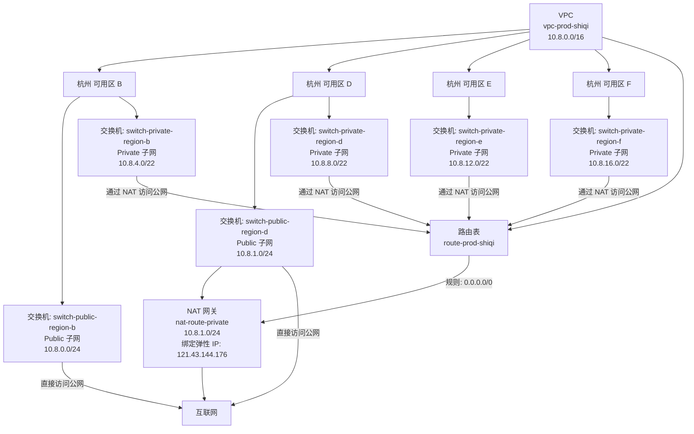
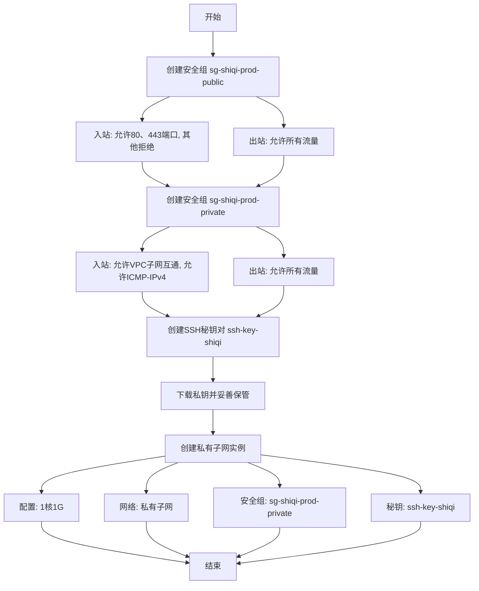

# 阿里云服务介绍与网络架构

## 教学目标
1. 了解阿里云基本概念：掌握云计算的核心理念，认识阿里云作为云计算服务提供商的定位及其主要服务。
2. 深入理解 VPC（专有网络）：学习 VPC 的概念、核心组件（如交换机、路由表、公网 NAT 网关）及其与传统网络的对比，掌握 VPC 的创建与配置。
3. 掌握 ECS（弹性计算服务）功能：理解 ECS 的概念及核心组件（如安全组、弹性 IP、自定义镜像、密钥管理），学习 ECS 的创建、配置及与传统服务器的对比。
4. 对比阿里云与传统网络：通过类比，理解阿里云在网络隔离、公网访问及资源管理方面的优势与差异。
5. 实践操作与应用：通过搭建简单的 VPC 网络和配置 ECS，模拟传统网络功能，加深对阿里云架构的理解。
6. 学习使用阿里云ECS发布应用，并配置cloudflare域名

## 第一部分 云计算与传统机房对比及优缺点

### 理论讲解：云计算与传统机房的区别

欢迎大家第一次学习阿里云！今天我们将从基础开始，带大家了解云计算的概念，以及它与传统机房物理服务器的区别。通过这个对比，您将明白为什么越来越多的企业和个人选择像阿里云这样的云计算服务。

#### 1. 什么是云计算？
云计算是一种通过互联网提供计算资源（如服务器、存储、网络、软件等）的服务模式。简单来说，您不需要自己购买和维护物理服务器，只需在云服务商（如阿里云）的平台上按需租用资源即可。阿里云是国内领先的云计算服务提供商，提供包括云服务器（ECS）、虚拟网络（VPC）等服务。

云计算的核心特点是：
- **按需分配**：需要多少资源就租用多少，随时调整。
- **弹性扩展**：业务增长时可以快速增加资源，业务减少时可以释放资源。
- **无需维护硬件**：底层设备由云服务商负责，您只需关注自己的业务。

#### 2. 什么是传统机房？
传统机房是指企业自己购买物理服务器，搭建机房环境（包括电源、冷却、网络设备等），并自行维护和管理所有硬件和软件。想象一下，您需要在办公室或数据中心放置一大堆服务器，自己负责它们的运行和维修，这就是传统机房模式。

传统机房的特点是：
- **高前期投入**：需要一次性购买服务器、网络设备等。
- **固定资源**：资源无法灵活调整，用不完的服务器会闲置。
- **维护复杂**：需要专业团队管理硬件、解决故障。

#### 3. 云计算与传统机房的对比分析
为了让大家更直观地理解阿里云（云计算）和传统机房的区别，我们从几个关键角度进行详细对比：

- **资源获取方式**：  
  云计算（如阿里云）可以在线快速创建服务器（比如 ECS），几分钟就能用上。而传统机房需要提前购买设备、安装系统，耗时可能长达几天甚至几周。
- **扩展性**：  
  云计算支持弹性扩展，比如您的网站流量突然增加，可以马上增加服务器资源。传统机房则需要购买新硬件再安装，扩展速度慢且成本高。
- **成本模式**：  
  阿里云支持按量付费（用多少付多少）或包年包月，无需前期投入大笔资金。传统机房则需要一开始就花很多钱买设备，还要支付电费、维护费等。
- **维护与管理**：  
  在阿里云上，服务器硬件、网络故障等问题都由阿里云团队处理，您只需关注自己的应用。传统机房则需要自己解决所有问题，比如服务器坏了要自己修。
- **网络架构**：  
  阿里云提供虚拟网络（VPC），可以像搭积木一样灵活设计网络结构。传统机房依赖物理设备（如路由器、交换机），调整起来很麻烦。
- **安全性**：  
  阿里云内置了很多安全功能，比如防火墙（安全组）、防攻击保护（DDoS 防护）。传统机房需要自己买软件、设防火墙，安全成本高。
- **可靠性**：  
  阿里云的服务器分布在多个地点（多地域、多可用区），一台服务器坏了可以自动切换到另一台，确保业务不中断。传统机房如果服务器坏了，可能业务就停了，除非您自己花钱建备份系统。
- **公网访问**：  
  阿里云通过弹性 IP 和 NAT 网关，让您的服务器轻松连接互联网。传统机房需要自己配置网络设备，设置复杂。
- **资源利用率**：  
  云计算能动态分配资源，减少浪费。传统机房资源是固定的，服务器没用满也会一直耗电，造成浪费。

### 云计算（阿里云）的优势
通过上述对比，我们可以看到云计算（以阿里云为例）相比传统机房有以下优势：
1. **成本低、灵活付费**：不需要大笔前期投入，用多少资源付多少钱。
2. **快速部署、弹性扩展**：几分钟就能用上服务器，资源随时调整，适应业务变化。
3. **无需维护硬件**：省去硬件管理烦恼，专注业务开发。
4. **高可靠性**：多地备份，业务不容易中断。
5. **安全性强**：内置安全防护，减少安全投入。
6. **网络灵活**：虚拟网络配置简单，适应性强。
7. **资源高效**：减少资源闲置，节约成本。

### 表格汇总：阿里云与传统机房物理机的对比

为了让大家更清晰地掌握这些区别，我们用表格总结一下：

| **维度**            | **阿里云（云计算）**                                      | **传统机房物理机**                                  |
|---------------------|---------------------------------------------------------|--------------------------------------------------|
| **资源获取方式**    | 按需分配，分钟级创建服务器（ECS），无需提前采购。         | 需要提前采购硬件设备，部署周期长（数天到数周）。  |
| **扩展性**          | 弹性扩展，可随时增加或减少资源（如 CPU、内存）。          | 扩展受限于硬件，需购买新设备，成本高且耗时。     |
| **成本模式**        | 按量付费或包年包月，无需前期高额投入，成本灵活。          | 高额前期投入（购买服务器、机房建设），维护成本高。 |
| **维护与管理**      | 由云服务商负责硬件维护，用户只关注应用层。               | 需自行维护硬件、电源、冷却、网络等，工作量大。    |
| **网络架构**        | 提供 VPC（专有网络），逻辑隔离，灵活配置子网和路由。      | 依赖物理网络设备（如路由器、交换机），配置复杂。  |
| **安全性**          | 内置安全组、DDoS 防护、数据备份，安全性有保障。          | 需自行配置防火墙、防病毒软件，安全成本高。       |
| **可靠性与容错**    | 多地域、多可用区部署，自动故障转移，数据冗余备份。        | 需自建冗余系统（如 RAID、备用机），成本高。      |
| **公网访问**        | 通过弹性 IP 和 NAT 网关，快速实现公网访问和映射。         | 需配置路由器拨号、端口映射，设置复杂。           |
| **资源利用率**      | 资源共享，动态分配，闲置率低。                          | 资源固定分配，闲置率高，浪费严重。              |

## 第二部分: 阿里云 VPC 介绍

### 1. 什么是专有网络（VPC）？如何形象对比？

#### 定义
专有网络（Virtual Private Cloud，简称 VPC）是阿里云提供的一种虚拟网络服务。它允许用户在云端创建一个逻辑上完全隔离的私有网络环境，用户可以自定义网络地址范围、划分子网，并控制网络访问规则。简单来说，VPC 就像是您在阿里云上“租用”的一块私有网络空间，里面的网络结构和规则完全由您决定。

#### 功能与特点
- **隔离性**：每个 VPC 之间是逻辑隔离的，相当于您和其他用户的网络互不干扰。
- **自定义性**：您可以自定义 IP 地址范围、子网划分和路由规则。
- **安全性**：通过安全组和网络访问控制，保护内部资源。
- **灵活性**：支持连接公网、连接其他 VPC 或本地数据中心。

#### 形象对比
为了让大家更容易理解，我们把 VPC 比作一栋“私人别墅”：
- **阿里云整体平台**就像一个大社区，里面有很多用户。
- **VPC** 就是您在社区里拥有的私人别墅，这个别墅是完全属于您的，别人进不来。
- **别墅的房间**可以看作 VPC 内的子网（通过交换机划分），每个房间有不同的功能（比如客厅、卧室）。
- **别墅的门和窗户**就像 VPC 的公网访问配置，决定谁能进来、谁能出去。

通过这个比喻，大家可以想象 VPC 是一个完全由您掌控的网络空间，与外界隔离，但又可以通过特定规则与外界沟通。

### 2. 交换机（VSwitch）

#### 定义
交换机（Virtual Switch，简称 VSwitch）是 VPC 内的虚拟网络设备，用于划分子网。它是 VPC 的一个子集，负责连接同一子网内的云资源（如 ECS 实例），并管理这些资源之间的通信。每个交换机属于一个可用区（即阿里云数据中心的一个物理区域）。

#### 功能与特点
- **子网划分**：一个 VPC 可以有多个交换机，每个交换机对应一个子网，子网有自己的 IP 地址范围。
- **资源连接**：同一交换机内的 ECS 实例可以直接通信，就像在一个局域网内。
- **隔离性**：不同交换机（子网）之间的资源默认不能直接通信，除非通过路由表配置。

#### 形象对比
继续用“私人别墅”的比喻：
- **交换机（VSwitch）**就像别墅内的“房间”。每个房间有自己的功能，比如客厅用来接待客人，卧室用来休息。
- 每个房间内的设备（如电视、电脑）可以直接互动，就像同一子网内的 ECS 实例可以直接通信。
- 不同房间之间需要通过“走廊”或“门”才能互通，这就像不同子网之间需要路由表来转发流量。

简单来说，交换机是 VPC 内的“小网络”，帮助您把大网络分成小块，方便管理和隔离。

### 3. 路由表（Route Table）

#### 定义
路由表（Route Table）是 VPC 内的虚拟路由设备，用于定义网络流量的转发规则。它决定了 VPC 内部以及 VPC 与外部网络之间的通信路径。每个 VPC 都会有一个默认路由表，您也可以创建自定义路由表来满足特定需求。

#### 功能与特点
- **流量转发**：决定数据包从一个子网到另一个子网，或从 VPC 到公网的路径。
- **规则配置**：用户可以添加路由条目，比如指定某个 IP 范围的数据走哪个网关。
- **灵活控制**：支持精细化管理网络流量，比如限制某些子网只能访问特定目标。

#### 形象对比
继续用“私人别墅”的比喻：
- **路由表**就像别墅内的“导航员”或“交通规则”。它告诉您从客厅到卧室怎么走，或者从别墅到外面的大街怎么走。
- 如果您想去外面吃饭，导航员会告诉您走哪条路（比如通过公网 NAT 网关），这就是路由表定义的转发规则。
- 如果某些房间不让随便进，导航员会限制路径，这就像路由表限制某些流量。

简单来说，路由表是 VPC 的“交通指挥官”，确保数据包能正确到达目的地。

### 4. 公网 NAT 网关

#### 定义
公网 NAT 网关（NAT Gateway）是阿里云提供的一种网络服务，用于实现 VPC 内部资源（没有公网 IP 的 ECS 实例）访问互联网的能力。它通过网络地址转换（NAT）技术，将私有 IP 地址映射为公网 IP，从而让内网资源可以访问外网，但外网无法直接访问内网资源（除非配置特定规则）。

#### 功能与特点
- **内网访问公网**：让 VPC 内的 ECS 实例通过 NAT 网关访问互联网，比如下载软件、访问外部 API。
- **单向访问**：默认情况下，外网无法直接访问内网资源，增强安全性。
- **带宽管理**：支持配置带宽大小，控制访问速度。

#### 形象对比
继续用“私人别墅”的比喻：
- **公网 NAT 网关**就像别墅的“门卫”或“单向门”。它允许您从别墅内走出去（访问互联网），但不让外面的陌生人随便进来。
- 比如，您想在网上订餐，门卫会帮您把请求送出去，并把外卖带回来，但不会让外卖员直接进到您的房间。
- 门卫还能控制您出去的速度（带宽限制），避免占用太多资源。

简单来说，公网 NAT 网关是 VPC 连接互联网的“安全出口”，保护内部资源的同时提供访问外网的能力。

### 5. 弹性公网 IP（EIP）

#### 定义
弹性公网 IP（Elastic IP Address，简称 EIP）是阿里云提供的一种独立公网 IP 地址资源。用户可以将 EIP 绑定到 VPC 内的 ECS 实例上，使其具备直接访问互联网的能力，也可以随时解绑并绑定到其他实例，灵活性非常高。

#### 功能与特点
- **独立性**：EIP 是一个独立的公网 IP，可以单独购买和管理。
- **灵活绑定**：可以动态绑定到 ECS 实例，也可以解绑后绑定到其他实例或 NAT 网关。
- **公网访问**：绑定 EIP 的实例可以直接被互联网访问（需配合安全组规则），适合部署网站、API 等服务。

#### 形象对比
继续用“私人别墅”的比喻：
- **弹性公网 IP（EIP）**就像别墅的“对外电话号码”或“公开地址”。有了这个号码，外面的朋友可以直接找到您（访问您的服务器）。
- 您可以把这个号码贴在客厅门上（绑定到某个 ECS），也可以换到卧室门上（绑定到另一个 ECS），非常灵活。
- 当然，为了安全，您还可以在号码旁边加个门锁（安全组规则），只让特定的人打进来。

简单来说，弹性公网 IP 是 VPC 内资源与互联网直接沟通的“门牌号”，让外部用户可以访问您的服务。

### 总结：VPC 及其组件的关系与作用

让我们用“私人别墅”的比喻把这些概念串联起来：
- **VPC（专有网络）**是您的私人别墅，与外界隔离，是您在阿里云上的私有网络空间。
- **交换机（VSwitch）**是别墅内的房间，划分出不同的子网，让资源分组管理。
- **路由表（Route Table）**是别墅内的导航员，指挥流量怎么走，确保数据到达正确目的地。
- **公网 NAT 网关**是别墅的单向门，允许内部资源访问外网，但保护内部不被外网直接入侵。
- **弹性公网 IP（EIP）**是别墅的对外号码，让外界可以直接找到并访问您的某个房间（ECS 实例）。

通过这些组件，阿里云 VPC 为您提供了一个安全、灵活、可自定义的网络环境，让您可以像管理物理网络一样管理云端网络，但更加简单高效。

## 第三部分: 企业网络架构拓扑图教案：基于阿里云 VPC 的网络设计

### 理论讲解——企业网络架构设计要点

#### 1. VPC 默认 16 位子网掩码
- **什么是 VPC 和子网掩码？**  
  VPC（专有网络）是阿里云上一个逻辑隔离的私有网络空间，就像您在云端租用的一栋“私人别墅”。子网掩码是一个用来划分 IP 地址范围的规则，决定了您的网络能容纳多少设备。  
  阿里云 VPC 默认使用 16 位子网掩码（即 CIDR 表示为 `/16`），对应的 IP 地址范围是 `192.168.0.0/16`，可以容纳 65,536 个 IP 地址。这意味着您的“别墅”很大，可以容纳很多设备和子网。
- **为什么要用 16 位？**  
  16 位子网掩码范围大，适合企业初期规划，方便后续划分为多个小网络（子网）。这就像规划别墅时先留出大片土地，之后可以根据需要建多个小房间。
- **好处**：为企业预留足够的 IP 地址空间，方便未来扩展。

#### 2. 交换机划分 Public 和 Private 子网
- **什么是交换机（VSwitch）？**  
  交换机是 VPC 内的虚拟网络设备，用于划分子网。每个交换机对应一个子网，就像别墅内的“房间”，每个房间有自己的功能和 IP 地址范围。
- **Public 子网和 Private 子网的区别**：  
  - **Public 子网**：用于放置需要直接访问互联网的资源（如 Web 服务器）。通常使用 24 位子网掩码（`/24`），可容纳 256 个 IP 地址。  
    形象比喻：就像别墅的“客厅”，对外开放，允许访客进入。
  - **Private 子网**：用于放置不需要直接访问互联网的资源（如数据库服务器）。通常使用 22 位子网掩码（`/22`），可容纳 1024 个 IP 地址，范围更大。  
    形象比喻：就像别墅的“卧室”，对外封闭，保护隐私。
- **可用区要求**：阿里云要求每个子网（交换机）绑定到一个可用区（数据中心的物理区域），且企业网络设计中可用区数量必须大于等于 2。  
  形象比喻：就像别墅建在不同地段（可用区），如果一个地段有问题（故障），另一个地段还能正常运行，增强可靠性。
- **好处**：通过 Public 和 Private 子网划分，实现网络功能的隔离；多可用区设计提高业务连续性。
- **安全性**：Private 子网不直接暴露在公网上，降低了被攻击的风险。

#### 3. 路由表管理所有交换机子网
- **什么是路由表（Route Table）？**  
  路由表是 VPC 内的“交通指挥官”，定义了网络流量的转发规则，决定数据包从一个子网到另一个子网，或从子网到公网的路径。  
  形象比喻：就像别墅内的“导航员”，告诉您从客厅到卧室怎么走，或者从别墅到外面的大街怎么走。
- **作用**：路由表统一管理所有交换机（子网）的流量，确保数据能正确到达目的地。
- **好处**：集中管理网络规则，方便调整和维护。
- **安全性**：可以通过路由规则限制某些子网的访问权限，比如禁止 Private 子网直接访问公网。

#### 4. 使用 Public 子网创建 NAT 网关
- **什么是 NAT 网关？**  
  公网 NAT 网关（NAT Gateway）是一种服务，允许 VPC 内部没有公网 IP 的资源（比如 Private 子网中的服务器）访问互联网，但外部无法直接访问这些资源。  
  形象比喻：就像别墅的“单向门卫”，允许您从里面走出去（访问公网），但不让外面的陌生人进来。
- **为什么放在 Public 子网？**  
  NAT 网关需要与公网连接，因此必须部署在 Public 子网中。它为 Private 子网的无公网 IP 主机提供访问公网的能力，比如下载软件、访问外部 API。
- **好处**：让 Private 子网的资源也能访问公网，满足业务需求（如更新系统、获取数据）。
- **安全性**：NAT 网关默认单向通信，外部无法直接访问 Private 子网，保护内部资源。

#### 5. NAT 网关绑定路由表，提供无公网 IP 主机访问公网能力
- **如何实现？**  
  在路由表中添加一条规则，将 Private 子网的流量（目标为公网）转发到 NAT 网关。NAT 网关会将私有 IP 转换为公网 IP，完成访问。  
  形象比喻：导航员（路由表）告诉卧室（Private 子网）的人，如果要出去，就通过门卫（NAT 网关）走。
- **好处**：Private 子网的服务器无需公网 IP 也能访问互联网，节省公网 IP 资源。
- **安全性**：外部无法直接找到 Private 子网的服务器，减少攻击面。

### Mermaid 拓扑图代码

### 图表说明
1. **VPC 整体结构**：
   - VPC 名称为 `vpc-prod-shiqi`，IP 范围为 `10.8.0.0/16`，覆盖所有子网。
   - VPC 分布在杭州的四个可用区（B、D、E、F），确保高可用性。
2. **交换机（子网）划分**：
   - **Public 子网**：两个交换机，分别为 `switch-public-region-b`（10.8.0.0/24，杭州可用区 B）和 `switch-public-region-d`（10.8.1.0/24，杭州可用区 D）。
   - **Private 子网**：四个交换机，分别为 `switch-private-region-b`（10.8.4.0/22，杭州可用区 B）、`switch-private-region-d`（10.8.8.0/22，杭州可用区 D）、`switch-private-region-e`（10.8.12.0/22，杭州可用区 E）、`switch-private-region-f`（10.8.16.0/22，杭州可用区 F）。
3. **NAT 网关**：
   - NAT 网关 `nat-route-private` 部署在 Public 子网 `10.8.1.0/24`（杭州可用区 D），绑定弹性 IP `121.43.144.176`，用于 Private 子网访问公网。
4. **路由表和流量路径**：
   - 路由表 `route-prod-shiqi` 管理所有子网流量，规则 `0.0.0.0/0` 将 Private 子网的公网流量转发至 NAT 网关。
   - Public 子网假设直接访问互联网（未明确指定设备是否绑定 EIP，但通常 Public 子网资源会通过 EIP 直接通信）。
   - Private 子网的流量通过路由表转发至 NAT 网关，再访问互联网。

### 设计的好处与安全性分析

#### 设计的好处
1. **灵活性和扩展性**：
   - VPC 使用 `/16` 子网掩码，IP 地址充足，未来可以增加更多子网和设备。
   - 多可用区设计支持业务扩展和高可用性，一个区域故障不影响整体业务。
2. **成本效益**：
   - Private 子网的服务器无需公网 IP，通过 NAT 网关共享公网访问，节省 IP 资源和费用。
   - 按需分配资源，随时调整子网和服务器数量，降低浪费。
3. **易于管理**：
   - 路由表集中管理流量规则，方便调整和维护。
   - Public 和 Private 子网划分清晰，功能分离，管理更高效。

#### 安全性防护
1. **网络隔离**：
   - Public 和 Private 子网逻辑隔离，外部用户只能访问 Public 子网的 Web 服务器，无法直接接触 Private 子网的数据库。
2. **单向访问控制**：
   - NAT 网关实现单向通信，Private 子网可以访问公网，但公网无法主动访问 Private 子网，保护核心数据。
3. **路由表限制**：
   - 通过路由表规则，可以进一步限制子网间的访问，比如只允许 Web 服务器访问数据库服务器，其他流量一律禁止。
4. **安全组配合（额外防护）**：
   - 虽然本教案未详细展开，但阿里云的安全组（类似防火墙）可以在 ECS 实例层面设置访问规则，比如只允许特定 IP 访问 Web 服务器，进一步提升安全性。

## 操作实验：企业网络架构部署（基于阿里云 VPC）

本实验指导您在阿里云上部署一个企业网络架构，基于您提供的 VPC 网络设计。我们将使用表格整理需求和资源配置，并详细说明操作步骤。由于没有 ECS 实例，无法进行实际网络测试，因此本实验专注于网络架构的搭建。

### 实验目标
在阿里云上搭建一个企业网络架构，满足以下需求，并熟悉控制台操作界面。

### 实验环境
- **阿里云账号**：确保已注册并完成实名认证。
- **地域**：杭州。
- **工具**：阿里云控制台（通过浏览器登录）。

### 需求与资源配置表格

以下表格列出了您提供的网络架构需求，包括 VPC、交换机、路由表和 NAT 网关的配置信息。

| **资源类型**         | **名称**                       | **配置信息**                          | **地域/可用区**         | **备注**                          |
|----------------------|-------------------------------|--------------------------------------|-------------------------|-----------------------------------|
| VPC                 | vpc-prod-shiqi               | CIDR: 10.8.0.0/16                   | 杭州                    | 企业生产环境 VPC                 |
| 交换机 (Public)     | switch-public-region-b       | CIDR: 10.8.0.0/24                   | 杭州 可用区 B           | Public 子网                     |
| 交换机 (Public)     | switch-public-region-d       | CIDR: 10.8.1.0/24                   | 杭州 可用区 D           | Public 子网                     |
| 交换机 (Private)    | switch-private-region-b      | CIDR: 10.8.4.0/22                   | 杭州 可用区 B           | Private 子网                    |
| 交换机 (Private)    | switch-private-region-d      | CIDR: 10.8.8.0/22                   | 杭州 可用区 D           | Private 子网                    |
| 交换机 (Private)    | switch-private-region-e      | CIDR: 10.8.12.0/22                  | 杭州 可用区 E           | Private 子网                    |
| 交换机 (Private)    | switch-private-region-f      | CIDR: 10.8.16.0/22                  | 杭州 可用区 F           | Private 子网                    |
| 路由表              | route-prod-shiqi             | 规则: 0.0.0.0/0 指向 NAT 网关        | 杭州                    | 管理所有子网流量                 |
| NAT 网关            | nat-route-private            | 部署在子网: 10.8.1.0/24 弹性 IP: 121.43.144.176 | 杭州 可用区 D           | 为 Private 子网提供公网访问      |

### 操作步骤

以下是基于阿里云控制台的操作步骤，结合表格信息，确保您能按需完成部署。

#### 步骤 1：创建 VPC
1. **进入 VPC 控制台**：
   - 登录阿里云控制台，点击顶部“产品与服务”，搜索“VPC”或找到“专有网络 VPC”，进入管理页面。
2. **创建 VPC**：
   - 在“专有网络”页面，点击右上角“创建专有网络”。
   - 填写信息：
     - 名称：`vpc-prod-shiqi`
     - 地域：华东 1（杭州）
     - IPv4 CIDR：`10.8.0.0/16`
     - 描述：可选，填写“企业生产环境 VPC”
   - 点击“确定”创建。
3. **确认**：在列表中看到 `vpc-prod-shiqi`，状态为“可用”。

#### 步骤 2：创建交换机（VSwitch）
根据表格中的交换机配置，逐一创建 6 个交换机。

| **交换机名称**                | **CIDR**          | **可用区**       | **类型**       |
|------------------------------|------------------|------------------|---------------|
| switch-public-region-b       | 10.8.0.0/24      | 杭州 可用区 B    | Public 子网   |
| switch-public-region-d       | 10.8.1.0/24      | 杭州 可用区 D    | Public 子网   |
| switch-private-region-b      | 10.8.4.0/22      | 杭州 可用区 B    | Private 子网  |
| switch-private-region-d      | 10.8.8.0/22      | 杭州 可用区 D    | Private 子网  |
| switch-private-region-e      | 10.8.12.0/22     | 杭州 可用区 E    | Private 子网  |
| switch-private-region-f      | 10.8.16.0/22     | 杭州 可用区 F    | Private 子网  |

**操作步骤**：
1. 在 VPC 控制台左侧导航栏，点击“交换机”，然后点击“创建交换机”。
2. 按表格逐个创建：
   - 名称：输入表格中的名称（如 `switch-public-region-b`）。
   - 专有网络：选择 `vpc-prod-shiqi`。
   - 可用区：选择对应可用区（如“华东 1 可用区 B”）。
   - IPv4 CIDR：输入对应 CIDR（如 `10.8.0.0/24`）。
   - 描述：可选，填写类型（如“Public 子网”）。
3. 点击“确定”创建，重复此步骤直到创建所有 6 个交换机。
4. **确认**：在“交换机”列表中查看，确保 6 个交换机状态均为“可用”。

#### 步骤 3：创建并配置路由表
1. **创建路由表**：
   - 在 VPC 控制台左侧导航栏，点击“路由表”，然后点击“vpc-shiqi的路由表”。
   - 添加名称：`route-prod-shiqi`
   - 描述：可选，填写“企业生产环境路由表”
   - 点击“确定”保存。
2. **关联交换机**：
   - 点击路由表名称 `route-prod-shiqi` 进入详情页。
   - 在“关联交换机”选项卡中，点击“关联交换机”，将所有 6 个交换机关联到此路由表。
   - **注意**：如果 Public 子网需直接访问公网，可只关联 Private 子网交换机，Public 子网保持系统路由表。此处按需求统一关联。
3. **暂不添加规则**：路由规则在创建 NAT 网关后配置。

#### 步骤 4：创建 NAT 网关
1. **创建 NAT 网关**：
   - 在阿里云控制台搜索“NAT 网关”，进入管理页面，点击“创建 NAT 网关”。
   - 名称：`nat-route-private`
   - 地域：华东 1（杭州）
   - 专有网络：选择 `vpc-prod-shiqi`
   - 交换机：选择 `switch-public-region-d`（CIDR: 10.8.1.0/24）
   - 计费类型：选择“按量计费”或“包年包月”（根据需求）
   - 点击“立即购买”并完成支付。
   - **确认**：在列表中看到 `nat-route-private`，状态为“运行中”。

    

2. **绑定弹性 IP（EIP）**：
   - 创建后，点击 NAT 网关名称进入详情页，点击“绑定弹性公网 IP”。
   - 若有弹性 IP `121.43.144.xxx`，选择绑定；否则点击“购买并绑定弹性公网 IP”（可能分配不同 IP）。
   - **确认**：绑定成功后，状态为“可用”。

   

3. **创建SNAT规则**：
   - 在 NAT 网关详情页，点击“SNAT 规则”，点击“创建 SNAT 规则”。
   - 名称：`snat-private`
   - 源网段：`0.0.0.0/0`（所有子网都给包含，反正没有公网的主机，我都能帮助上网）
   - 点击“确定”创建。
   - **确认**：在列表中看到 `snat-private`，状态为“可用”。

   

#### 步骤 5：配置路由表规则
1. **添加路由规则**：
   - 返回“路由表”页面，点击 `route-prod-shiqi` 进入详情页。
   - 在“路由条目列表”选项卡，点击“自定义路由条目”,点击“添加路由条目”。
   - 目标网段：`0.0.0.0/0`
   - 下一跳类型：选择“NAT 网关”
   - 下一跳：选择 `nat-route-private`
   - 点击“确定”保存。
2. **确认**：规则生效后，Private 子网流量将通过 NAT 网关访问公网。

   

### 实验结果与局限性

#### 实验结果确认
- VPC、交换机、路由表和 NAT 网关已按表格配置完成。
- 网络架构静态部署完成，所有资源状态应为“可用”。

#### 当前局限性
- 由于没有 ECS 实例，无法测试网络连通性（如 Private 子网通过 NAT 访问公网）。
- 后续建议：在部署 ECS 实例后，测试 Public 子网直接访问公网、Private 子网通过 NAT 访问公网，以及子网间通信。

## 第四部分: 云服务器 ECS 介绍

云服务器 ECS（Elastic Compute Service）是阿里云提供的一种弹性计算服务，允许用户在云端快速创建和管理虚拟服务器实例。它具有高可用性、弹性扩展和按需计费等特点，广泛应用于网站托管、应用部署、数据处理等场景。以下是您提到的 ECS 相关核心组件的详细介绍，包括实例、镜像、块存储和安全组（注意：您提到两次“镜像”，我将只介绍一次）。

### 1. 实例（Instance）
- **定义**：ECS 实例是阿里云提供的最基本的计算单元，相当于一台虚拟服务器。每个实例运行在阿里云的数据中心内，具备独立的 CPU、内存、操作系统和网络配置。
- **特点**：
  - **弹性**：支持按需创建、启动、停止或释放实例，灵活应对业务需求。
  - **规格**：提供多种实例类型（如通用型、计算型、内存型等），满足不同负载需求。例如，`ecs.g6.large` 提供 2 核 CPU 和 8GB 内存。
  - **计费方式**：支持按量计费（按小时付费）和包年包月（预付费），可根据预算选择。
- **使用场景**：运行 Web 服务器、数据库、应用程序，或用于开发测试环境。
- **操作示例**（阿里云控制台）：
  1. 登录阿里云控制台，点击“产品与服务”，搜索“ECS”或选择“云服务器 ECS”。
  2. 在“实例”页面，点击“创建实例”，选择地域、实例规格、镜像等配置。
  3. 完成支付后，实例状态变为“运行中”，即可通过远程连接（如 SSH）访问。

### 2. 镜像（Image）
- **定义**：镜像是一个包含操作系统、预装软件和配置文件的模板，用于快速创建 ECS 实例。镜像相当于实例的“启动盘”，决定了实例启动后的初始环境。
- **类型**：
  - **公共镜像**：由阿里云官方提供，包含主流操作系统（如 CentOS、Ubuntu、Windows Server）及基础软件。
  - **自定义镜像**：用户基于现有实例创建的镜像，包含个性化配置和应用。
  - **共享镜像**：其他用户共享的镜像，可用于特定场景。
  - **市场镜像**：阿里云镜像市场提供的第三方镜像，通常预装特定软件（如 LAMP 环境）。
- **特点**：
  - 快速部署：通过镜像可批量创建相同配置的实例。
  - 跨地域复制：支持将镜像复制到其他地域，便于全球部署。
- **使用场景**：快速部署相同环境的服务器，恢复系统，或迁移应用。
- **操作示例**（阿里云控制台）：
  1. 在 ECS 控制台左侧导航栏，点击“镜像”。
  2. 查看“公共镜像”列表，选择适合的操作系统。
  3. 创建实例时，在“镜像”选项中选择所需镜像，或基于现有实例创建自定义镜像。

### 3. 块存储（Block Storage）
- **定义**：块存储是阿里云为 ECS 提供的持久化存储服务，用于存储实例的数据。相当于虚拟硬盘，可挂载到实例上，支持数据读写。
- **类型**：
  - **云盘（Cloud Disk）**：基于分布式存储架构的高性能存储，分为高效云盘、SSD 云盘和 ESSD 云盘（性能依次提升）。
  - **本地盘**：部分实例类型提供本地存储，性能高但不支持持久化（实例释放后数据丢失）。
- **特点**：
  - **持久性**：云盘数据独立于实例生命周期，实例释放后数据仍可保留。
  - **弹性扩展**：支持在线扩容云盘容量，满足存储需求增长。
  - **快照备份**：支持创建云盘快照，用于数据备份和恢复。
- **使用场景**：存储操作系统、应用程序数据、数据库文件，或作为数据备份介质。
- **操作示例**（阿里云控制台）：
  1. 在 ECS 控制台左侧导航栏，点击“磁盘”。
  2. 创建实例时，选择“系统盘”和“数据盘”类型及容量（如 SSD 云盘 40GB）。
  3. 实例运行后，可在“磁盘”页面挂载新云盘或扩容现有云盘。

### 4. 安全组（Security Group）
- **定义**：安全组是一种虚拟防火墙，用于控制 ECS 实例的网络访问规则，保护实例安全。每个实例必须绑定至少一个安全组。
- **特点**：
  - **规则配置**：支持设置入站和出站规则，控制端口、协议和访问来源（如 IP 范围）。
  - **默认规则**：默认拒绝所有未授权访问，需手动配置允许规则。
  - **灵活性**：一个实例可绑定多个安全组，规则叠加生效。
- **使用场景**：限制外部访问（如仅允许特定 IP 访问 SSH 端口 22），防止未经授权的访问，或配置内部网络通信规则。
- **操作示例**（阿里云控制台）：
  1. 在 ECS 控制台左侧导航栏，点击“安全组”。
  2. 点击“创建安全组”，设置名称和描述，选择所属 VPC（如果使用 VPC）。
  3. 创建后，点击“配置规则”，添加规则：
     - 入站规则示例：协议类型“TCP”，端口范围“22”，授权对象“0.0.0.0/0”（允许所有 IP 访问 SSH）。
     - 出站规则示例：默认允许所有出站流量。
  4. 创建实例时，选择该安全组，或在实例详情页绑定安全组。

### 5. 密钥对（Key Pair）
- **定义**：密钥对是一种基于 SSH（Secure Shell）的认证方式，用于远程登录到 ECS 实例。它由公钥和私钥组成，公钥存储在 ECS 实例中，私钥由用户保存，用于身份验证。
- **特点**：
  - **安全性高**：相比传统的密码登录，密钥对基于加密算法（如 RSA），更难被破解。
  - **便捷管理**：一个密钥对可绑定到多个实例，方便批量管理服务器。
  - **跨平台支持**：支持通过 SSH 客户端（如 PuTTY、OpenSSH）使用密钥对登录 Linux 实例，Windows 实例也可通过密钥对生成初始密码。
- **使用场景**：远程管理 ECS 实例（如通过 SSH 登录 Linux 服务器进行配置），或在自动化脚本中实现无密码登录。
- **操作步骤**（阿里云控制台）：
  1. **创建密钥对**：
     - 登录阿里云控制台，进入“云服务器 ECS”管理页面。
     - 在左侧导航栏，点击“密钥对”。
     - 点击右上角“创建密钥对”按钮。
     - 输入密钥对名称（如 `my-key-pair`），选择加密算法（默认 RSA 2048 位）。
     - 点击“确定”创建，系统会自动生成并下载私钥文件（`.pem` 格式），请妥善保存，**私钥文件不会存储在阿里云服务器上，丢失后无法找回**。
  2. **绑定密钥对**：
     - 创建 ECS 实例时，在“基本配置”页面，选择“密钥对”作为登录凭据，并选择已创建的密钥对（如 `my-key-pair`）。
     - 如果实例已创建，可在“实例详情”页面，点击“更多 > 密码/密钥 > 绑定密钥对”，选择密钥对进行绑定（需先停止实例）。
  3. **使用密钥对登录**：
     - **Linux 实例**：使用 SSH 客户端（如 OpenSSH 或 PuTTY）。
       - OpenSSH 示例：在终端输入 `ssh -i my-key-pair.pem root@<实例公网IP>`，其中 `my-key-pair.pem` 是下载的私钥文件路径。
       - PuTTY 示例：将 `.pem` 文件转换为 `.ppk` 格式（使用 PuTTYgen 工具），在 PuTTY 中加载私钥并连接实例。
     - **Windows 实例**：密钥对用于获取初始管理员密码，登录后仍通过远程桌面（RDP）访问。
       - 在实例详情页，点击“获取密码”，上传公钥或选择已绑定的密钥对，系统会解密并显示初始密码。
  4. **注意事项**：
     - 私钥文件需妥善保管，避免泄露，若丢失需创建新密钥对并重新绑定。
     - Linux 实例绑定密钥对后，默认禁用密码登录，需通过密钥对访问。
     - 确保实例的安全组规则已开放 SSH 端口（默认 22）或 RDP 端口（默认 3389）。

### 总结
云服务器 ECS 是阿里云的核心服务，通过实例、镜像、块存储和安全组等组件，用户可以快速构建安全、可靠的云端计算环境：
- **实例**提供计算能力，支持弹性扩展。
- **镜像**简化系统和应用部署。
- **块存储**保障数据持久性和扩展性。
- **安全组**保护实例免受网络威胁。
- **密钥对**：安全远程登录。

## 练习: ECS实例前置安全环境准备

### 需求背景与原因分析

在搭建云环境时，我们的目标是创建一个安全、可控且符合生产环境标准的网络架构。以下是为什么要进行这些前置准备的原因：

1. **安全组的创建与配置**（`sg-shiqi-prod-public` 和 `sg-shiqi-prod-private`）  
   - **目的**：通过安全组控制网络流量，确保云环境中实例的安全性。  
   - **原因**：  
     - `sg-shiqi-prod-public` 面向公网，限制入站流量（如只允许80和443端口，用于HTTP和HTTPS访问），防止未经授权的访问，同时允许所有出站流量以便实例可以访问外部资源。  
     - `sg-shiqi-prod-private` 用于私有子网，入站规则允许VPC内部子网互通以及ICMP-IPv4（用于网络诊断如ping），确保内部通信顺畅，同时出站规则允许所有流量以支持外部资源访问。  
   - **重要性**：通过区分公网和私网安全组，可以实现分层安全策略，保护内部资源不被外部直接访问。

2. **秘钥对创建**（`ssh-key-shiqi`）  
   - **目的**：为实例提供安全的远程登录方式。  
   - **原因**：使用SSH秘钥对进行身份验证比密码登录更安全，可以有效防止暴力破解攻击。创建秘钥对后，公钥存储在云实例中，私钥由用户保管，用于远程登录。  
   - **重要性**：确保只有持有私钥的用户才能访问实例，增强安全性。

3. **创建私有子网实例**（1核1G，绑定 `sg-shiqi-prod-private` 安全组和 `ssh-key-shiqi` 秘钥）  
   - **目的**：在私有子网中部署实例，确保其不直接暴露在公网中。  
   - **原因**：私有子网中的实例无法直接通过公网访问，需通过NAT网关或VPN等机制访问外部网络，同时可以通过VPC内部通信与公网实例交互。这种设计符合“最小暴露原则”，提高安全性。  
   - **重要性**：私有子网实例适合运行数据库、后端服务等关键组件，避免直接受到外部攻击。

### 流程描述（文字版流程图）

以下是上述步骤的逻辑流程描述，您可以基于此绘制流程图：

### 前置准备步骤

基于上述需求，以下是具体的操作步骤：

1. **创建安全组 `sg-shiqi-prod-public`**  
    - 入站规则：仅允许80端口（HTTP）和443端口（HTTPS），其他全部拒绝。  
    - 出站规则：允许所有流量通过。  

    

    

    

    

    

    

2. **创建安全组 `sg-shiqi-prod-private`**  
    - 入站规则：允许VPC子网内部互通，允许所有ICMP-IPv4流量。  
    - 出站规则：允许所有流量通过。  

3. **创建SSH秘钥对 `ssh-key-shiqi`**  
    - 在云平台控制台生成秘钥对，下载私钥并妥善保管，公钥自动绑定到云平台。

    

4. **创建私有子网实例**  
    - 配置：1核1G规格。  
    - 网络：选择私有子网。  
    - 安全组：绑定 `sg-shiqi-prod-private`。  
    - 秘钥：选择 `ssh-key-shiqi` 进行身份验证。  

    

    

    

5. **远程连接实例，测试NAT地址**
    - 这里有坑
    - 使用阿里云自带的实例连接工具，连接实例。
    - 测试实例是否能访问公网资源，如下载软件包、更新系统等。

    

    

    

### 总结

通过上述步骤，我们搭建了一个安全的云环境基础架构：  
- 安全组实现了公网与私网的流量控制，保护实例安全。  
- SSH秘钥对确保了远程登录的安全性。  
- 私有子网实例的部署遵循了最小暴露原则，适合运行敏感服务。  
