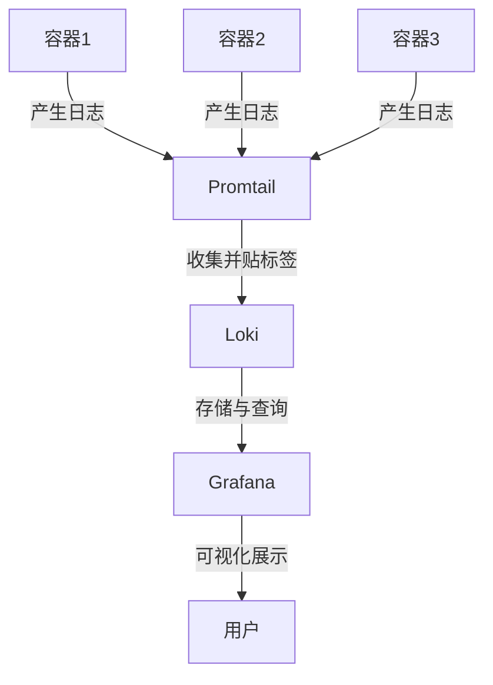
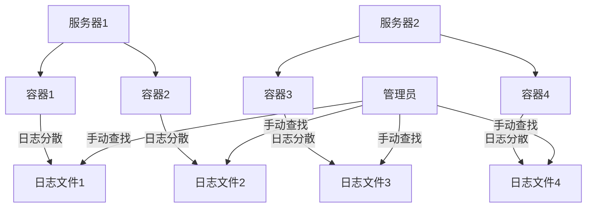
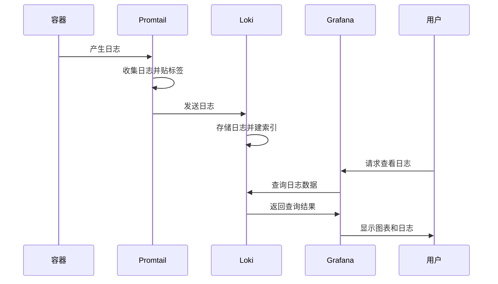
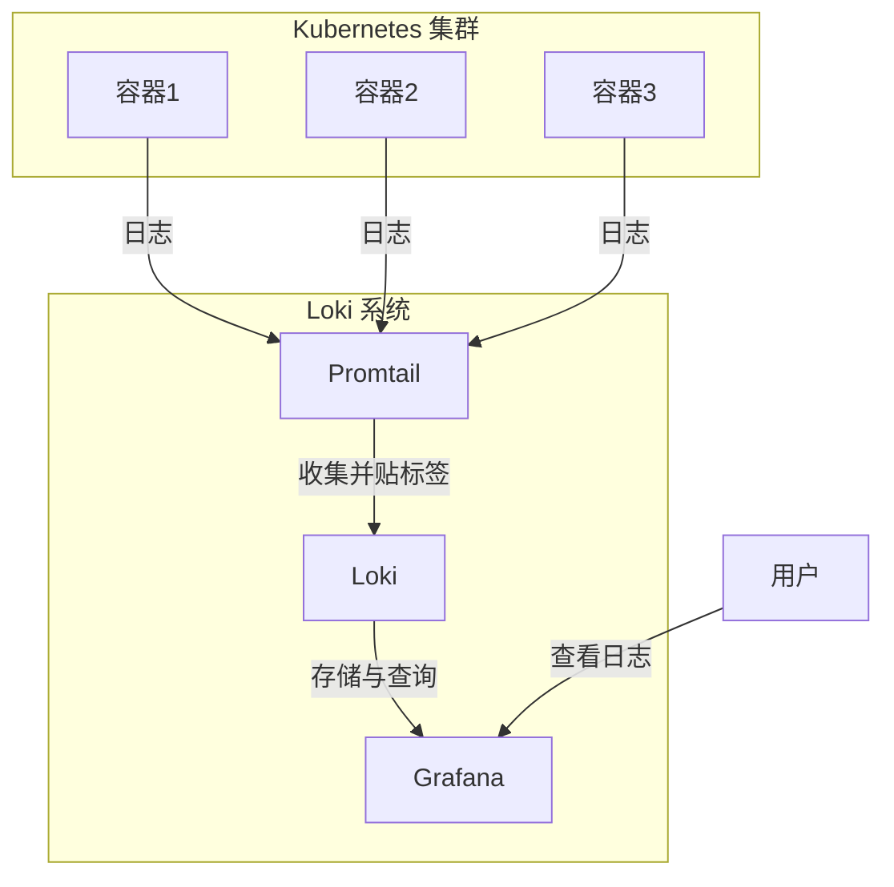

# Kubernetes 日志管理与 Loki 实践

## 学习目标
1. 理解 Kubernetes 日志管理的基本概念、挑战及其在云原生环境中的重要性。
2. 掌握 Loki 日志系统的核心原理、组件功能（Promtail、Loki、Grafana）以及 LogQL 查询语言的使用。
3. 能够对比 Loki 与其他日志系统（如 ELK/EFK）的优劣，明确适用场景。
4. 学会在本地 Kubernetes 环境中部署 Loki 日志系统，包括官方一键安装和 Helm Chart 方式。
5. 理解日志体量对 Loki 部署模式（单体与分布式）的影响，以及分布式模式与云存储服务的结合方式。
6. 掌握 Loki 在生产环境中的优化策略，学会配置监控（通过 Prometheus 采集指标）与告警（设置规则和通知），并能够通过 Grafana 可视化日志以应对企业级需求。


## 第一部分：Kubernetes 日志管理与 Loki 简介

### 1. 什么是日志？为什么 Kubernetes 日志管理至关重要？

- **什么是日志？**
  - 日志就像是计算机世界的“日记本”。想象一下，你每天写日记记录自己的活动，比如“今天几点吃了什么，去了哪里，遇到了什么问题”。计算机和应用程序也会做类似的事情，它们会记录下自己运行时的每一个动作和状态，比如“某用户在几点几分登录了系统”或者“某个程序在运行时出现了错误”。
  - 在技术世界里，日志是一行行文字，记录了程序运行时的关键信息。这些信息包括：时间、事件、错误提示等。简单来说，日志就是帮助我们了解“程序发生了什么”的重要线索。
  - 举个例子：如果你玩一款手机游戏，突然游戏崩溃了，游戏开发者可能就需要查看游戏的日志文件，找到崩溃的原因，比如“内存不足”或者“网络连接中断”。

- **Kubernetes 中的日志是什么？**
  - Kubernetes 是一个管理“容器”的平台。容器就像是一个个小盒子，每个盒子里装着一个应用程序（比如一个网站、一个数据库）。这些应用程序运行时，也会产生自己的“日记本”，也就是日志。
  - 在 Kubernetes 里，日志不仅仅来自一个应用程序，而是来自成百上千个容器，甚至是整个集群（由多台服务器组成的大系统）。比如，一个电商网站可能有几十个容器负责处理订单、支付、库存，每个容器都会产生日志，记录自己的工作情况。

- **为什么 Kubernetes 日志管理至关重要？**
  - 想象一下，如果你是电商网站的管理员，突然有用户反馈“无法下单”，你该怎么办？如果没有日志，你就像大海捞针，完全不知道问题出在哪里。但如果有日志，你可以快速翻看“日记本”，找到哪个容器在哪个时间点报错了，比如“支付模块在 10:00 出现了连接超时”。
  - 日志管理的重要性在于，它能帮助我们：
    1. **发现问题**：通过日志找到系统出错的原因，比如某个服务崩溃了。
    2. **追踪行为**：了解用户或系统的操作轨迹，比如某个用户做了什么导致系统异常。
    3. **优化性能**：通过分析日志，发现系统哪里慢、哪里资源不够用。
  - 在 Kubernetes 这种复杂的环境中，容器数量多、分布广，如果没有好的日志管理，就像在一个没有路标的大城市里迷路，根本无法快速找到问题。


### 2. Kubernetes 日志管理的挑战

- **挑战 1：日志分散，像散落的拼图**
  - 在 Kubernetes 集群中，日志不是集中在一个地方，而是像散落的拼图碎片一样，分布在不同的容器、不同的服务器上。想象你有 100 个容器，每个容器都有自己的“日记本”，这些日记本存放在不同的抽屉里，你要一个个打开抽屉才能看到内容，非常费时费力。
  - 举例：一个订单系统可能有 10 个容器负责处理订单，10 个负责支付，如果订单失败，你可能需要逐个查看 20 个容器的日志，才能找到问题根源。

- **挑战 2：规模化查询困难，像在图书馆找一本书**
  - 当容器数量增加到几百个甚至几千个时，日志量会变得非常庞大，就像一个巨大的图书馆里有成千上万本书。你想找某一天某个容器的特定错误信息，可能需要翻阅无数行日志，就像在没有目录的图书馆里找一本书，效率极低。
  - 举例：如果你的集群每天产生 1 百万行日志，而你只想找到某个用户的登录失败记录，手动查找几乎是不可能的。

- **挑战 3：日志生命周期短，像过期的牛奶**
  - Kubernetes 容器是动态的，容器可能会被销毁重建，日志也会随之消失，就像牛奶过了保质期就不能用了。如果没有及时保存日志，关键信息可能会永远丢失。
  - 举例：一个容器在凌晨报错后被自动重启，等你早上查看时，日志已经没了，问题就无从查起。

- **总结**：Kubernetes 日志管理的挑战就像管理一个繁忙城市的交通，没有统一的监控和记录系统，交通事故发生时就无法快速找到原因和解决办法。


### 3. 日志系统的价值：集中化存储、快速查询和可视化

- **什么是日志系统？**
  - 日志系统就像一个“超级日记本管理员”，它能把所有分散的日志收集到一个地方，整理得井井有条，还能帮你快速找到需要的内容。
  - 想象你有一个智能助手，它不仅能收集所有容器的“日记本”，还能帮你标注重点，甚至画出图表让你一目了然地看到问题。

- **日志系统的三大价值：**
  1. **集中化存储**：把所有日志从分散的容器中收集到一个中央仓库，就像把所有日记本放到一个大书架上，方便统一管理，不用再东奔西跑查找。
  2. **快速查询**：提供搜索功能，让你输入关键词就能找到相关日志，就像在搜索引擎中输入“错误”就能立刻看到所有报错信息，省时省力。
  3. **可视化展示**：把日志数据变成图表或仪表盘，就像把日记内容画成彩色图表，让你一眼就能看出系统的健康状况，比如哪些服务报错最多。

- **举个例子**：有了日志系统，之前提到的“订单无法下单”问题可以这样解决：你打开日志系统，输入“订单失败”，系统立刻显示所有相关日志，甚至用红色标记出错误最多的容器，你再一看图表，发现支付模块报错率最高，几分钟就锁定了问题。


### 4. Loki 简介：专为 Kubernetes 设计的轻量级日志系统

- **什么是 Loki？**
  - Loki 是一个专门为 Kubernetes 设计的日志管理系统，就像一个贴心的“日志管家”，它能帮你收集、存储和查询 Kubernetes 集群中的所有日志，而且操作简单，资源占用少。
  - Loki 由 Grafana Labs 开发，名字来源于北欧神话中的“洛基”（一个聪明又有点狡猾的神），象征它在日志管理中的灵活和高效。

- **Loki 的核心优势：**
  1. **专为 Kubernetes 设计**：Loki 就像是为 Kubernetes 量身定制的衣服，完美贴合 Kubernetes 的动态环境，能自动发现容器和日志，不需要复杂配置。
  2. **标签索引，查询快**：Loki 不像传统日志系统那样把每行日志都存得很复杂，它只对“标签”建索引（标签就像日志的分类标签，比如“哪个应用”“哪个容器”），查询时就像按分类找书，速度非常快。
  3. **低资源占用，轻量级**：Loki 就像一辆节能小车，不需要太多燃料（CPU 和内存），就能跑得很远，适合资源有限的小团队或测试环境。
  4. **与 Grafana 集成，界面友好**：Loki 可以无缝连接 Grafana（一个画图表的工具），让你通过漂亮的界面查看日志，就像用手机看图文并茂的报告，直观又方便。

- **举个例子**：如果你的 Kubernetes 集群有 50 个容器，每天产生 10 万行日志，用 Loki 你可以轻松收集所有日志，只需几秒就能找到某个应用的错误信息，还能在 Grafana 上看到错误趋势图，比手动翻日志快百倍。


### 5. 简要介绍核心组件：Promtail（采集）、Loki（存储与查询）、Grafana（可视化）

- **Promtail：日志采集员**
  - Promtail 就像一个勤劳的“快递员”，它的任务是到 Kubernetes 集群的每一个容器门口，把日志（日记本）收集起来，然后贴上标签（比如“来自哪个容器”“属于哪个应用”），最后送到 Loki 那里。
  - 比喻：Promtail 就像超市里的收银员，把每件商品（日志）扫描一下，记录好类别，再打包送到仓库。

- **Loki：日志存储与查询中心**
  - Loki 是整个系统的“大脑”和“仓库”，它负责接收 Promtail 送来的日志，存好这些日志，并在你需要时快速帮你找到想要的内容。
  - 比喻：Loki 就像一个智能图书馆，日志是书本，它会按标签分类存放，你只要说“我要找某个应用的错误日志”，它就能立刻把相关书本找出来。

- **Grafana：日志可视化工具**
  - Grafana 就像一个“画家”，它能把 Loki 提供的日志数据画成图表或仪表盘，让你一眼就能看懂日志背后的故事，比如哪个服务报错最多、错误是否在增加。
  - 比喻：Grafana 就像把日记内容变成动画片，用颜色和图形告诉你“系统哪里生病了”，非常直观。

- **三者关系图（Mermaid 结构图）**：
  以下是用 Mermaid 绘制的简单流程图，帮助你理解三者如何协作：



- **图解说明**：上图展示了日志从容器产生，到 Promtail 收集，再到 Loki 存储，最后通过 Grafana 展示给用户的完整流程。就像一条流水线，日志从源头到最终呈现，环环相扣。


### 小案例：Kubernetes 日志分散的场景

- **场景描述**：
  - 假设你管理一个小型 Kubernetes 集群，里面有 5 个容器运行一个简单的博客网站。其中 2 个容器负责前端页面，2 个负责后端接口，1 个负责数据库。
  - 突然有用户反馈“无法发表评论”，你想找到原因，但日志分散在 5 个容器中，每个容器都要用命令行单独查看，费时费力。
  - 如果没有日志系统，你可能花 30 分钟才找到问题（比如后端接口报错）；但如果有 Loki 这样的系统，日志集中存储，你只需 2 分钟就能通过标签找到后端容器的错误日志。

- **思考问题**：
  - 如果你是管理员，面对分散的日志会怎么做？有没有想过如果日志能集中管理会多方便？
  - 通过这个小案例，你可以感受到日志管理工具的必要性，为后续学习 Loki 做好准备。

### 重点总结

- **日志是什么**：日志是程序运行的“日记本”，记录了系统和应用的关键信息。
- **为什么重要**：在 Kubernetes 中，日志帮助我们发现问题、追踪行为、优化性能。
- **面临的挑战**：日志分散、查询困难、生命周期短。
- **日志系统的价值**：集中存储、快速查询、可视化展示。
- **Loki 的作用**：专为 Kubernetes 设计的轻量级日志系统，查询快、资源占用低、界面友好。
- **核心组件**：Promtail 收集日志，Loki 存储和查询，Grafana 可视化展示。

### 补充图表：Kubernetes 日志管理挑战

为了帮助你更直观地理解 Kubernetes 日志管理的挑战，这里再提供一个 Mermaid 图，展示日志分散的场景：



- **图解说明**：上图展示了 Kubernetes 集群中日志分散的情况，管理员需要逐个查看每个容器的日志文件，非常低效。通过对比，你可以更容易理解集中化日志系统的必要性。


## 第二部分：Loki 架构与工作原理

### 1. Loki 核心组件与工作流程

Loki 是一个强大的日志管理系统，它由几个核心组件组成，每个组件都有自己的“职责”，它们协作起来，就像一个高效的团队，把日志从产生到查询的每一步都处理得井井有条。下面我们来逐一了解这些组件，以及它们如何一起工作。

#### 1.1 Promtail：日志采集与标签附加机制
- **Promtail 是什么？**
  - Promtail 是 Loki 系统中的“采集员”，它的任务就像一个勤劳的快递员，跑遍 Kubernetes 集群中的每一个容器，收集它们产生的日志（就像收集日记本），然后给这些日志贴上“标签”（就像给包裹贴上分类标签），最后把日志送到 Loki 去存储。
  - 比喻：Promtail 就像超市里的收银员，把每件商品（日志）扫描一下，记录好类别（比如“哪个容器”“哪个应用”），再打包送到仓库。

- **Promtail 怎么工作？**
  - Promtail 会自动发现 Kubernetes 集群中的容器，读取每个容器产生的日志文件。
  - 它会给日志加上标签，比如“这个日志来自哪个应用”“来自哪个服务器”“属于哪个环境（测试还是生产）”。
  - 加上标签后，Promtail 把日志发送到 Loki，就像快递员把包裹送到中央仓库。

- **为什么标签重要？**
  - 标签就像日志的“身份证”，有了标签，Loki 就能快速找到你想要的日志，不用一行行翻看所有内容。我们后面会详细讲标签的作用。

#### 1.2 Loki：单体模式与分布式模式的区别，日志存储与查询流程
- **Loki 是什么？**
  - Loki 是整个系统的“大脑”和“仓库”，它负责接收 Promtail 送来的日志，把这些日志存储起来，并在你需要时快速帮你找到想要的内容。
  - 比喻：Loki 就像一个智能图书馆，日志是书本，它会按标签分类存放，你只要说“我要找某个应用的错误日志”，它就能立刻把相关书本找出来。

- **Loki 的两种模式：单体模式和分布式模式**
  1. **单体模式（简单版）**：
     - 单体模式就像一个小型家庭图书馆，所有的功能（存储、查询等）都在一台机器上完成。
     - 适合小型团队或测试环境，资源占用少，设置简单，但处理大量日志时可能不够快。
     - 比喻：就像你家里的书柜，虽然容量有限，但管理起来很方便。
  2. **分布式模式（高级版）**：
     - 分布式模式就像一个大型公共图书馆，把不同任务分配到多台机器上，比如一台机器专门存储日志，一台机器专门处理查询，还有一台负责协调。
     - 适合大规模集群，能处理海量日志，速度更快，但设置复杂，资源需求高。
     - 比喻：就像一个连锁书店，各地分店分工合作，效率更高。

- **Loki 的日志存储与查询流程**
  - **存储**：Loki 收到 Promtail 送来的日志后，会把日志按时间顺序存到磁盘上，同时只对“标签”建立索引（就像图书馆只记录书的类别，而不是每页内容），这样存储和查找都很节省资源。
  - **查询**：当你想查找日志时，Loki 先根据标签快速定位相关日志（比如“只看某个应用的日志”），然后再从这些日志中搜索具体内容（比如“找错误信息”），速度非常快。
  - 比喻：就像你在图书馆先找到“计算机类书籍”区域，然后再翻书找具体章节，比一本本翻快得多。

#### 1.3 Grafana：日志可视化与告警工具
- **Grafana 是什么？**
  - Grafana 是 Loki 系统的“画家”，它能把 Loki 提供的日志数据画成图表或仪表盘，让你一眼就能看懂日志背后的故事，比如哪个服务报错最多、错误是否在增加。
  - 比喻：Grafana 就像把日记内容变成动画片，用颜色和图形告诉你“系统哪里生病了”，非常直观。

- **Grafana 怎么工作？**
  - Grafana 连接到 Loki，读取日志数据，然后把这些数据变成图表，比如柱状图（显示每个应用的错误数量）或折线图（显示错误随时间的变化）。
  - 它还能设置告警，比如当某个应用的错误日志超过 100 条时，自动给你发通知，就像一个贴心的助手提醒你“有问题啦，快来看”。

#### 1.4 日志从采集到查询的完整流程（时序图）
以下是用 Mermaid 绘制的时序图，展示日志从产生到查询的全过程，帮助你更直观地理解每个组件的角色：



- **图解说明**：上图展示了日志的“旅行”过程：从容器产生日志，到 Promtail 收集和贴标签，再到 Loki 存储和查询，最后通过 Grafana 展示给用户。就像一条流水线，每个环节都不可或缺。


### 2. 标签（Labels）机制

- **标签是什么？**
  - 标签是 Loki 的一个“聪明设计”，它是日志的“分类标记”，就像书本上的类别标签（比如“小说”“科技”）。每个日志都会被 Promtail 贴上多个标签，比如“来自哪个应用”“来自哪个容器”“属于哪个环境”。
  - 比喻：标签就像超市货架上的标签，你想买牛奶，直接看“乳制品”区域就行，不用逛遍整个超市。

- **标签的作用：仅对标签建索引，降低存储和查询成本**
  - Loki 的特别之处在于，它不像传统日志系统那样对每行日志的每一句话都建索引（那样会很占资源，就像把书的每一页都记下来）。Loki 只对标签建索引，存储和查询都非常高效。
  - 查询时，Loki 先用标签快速缩小范围（比如“只看某个应用的日志”），然后再在这个小范围内搜索具体内容（比如“找错误信息”）。
  - 比喻：就像你在图书馆先找到“计算机书籍”区域，然后再翻书找具体内容，比一本本翻快得多。

- **示例：通过标签快速定位特定应用或 Pod 的日志**
  - 假设你有一个 Kubernetes 集群，里面运行了两个应用：“订单系统”和“支付系统”。每个应用的日志都有标签，比如：
    - 订单系统的日志标签：`app=order-system`
    - 支付系统的日志标签：`app=payment-system`
  - 如果你只想看订单系统的日志，在 Loki 中输入标签条件 `app=order-system`，系统会立刻过滤掉其他日志，只显示订单系统的内容，几秒钟就能完成。
  - 比喻：就像你在超市输入“牛奶”标签，货架上只显示牛奶相关商品，其他东西都被隐藏，找起来特别快。

### 3. LogQL 查询语言

- **LogQL 是什么？**
  - LogQL 是 Loki 专用的查询语言，名字来源于“Log Query Language”（日志查询语言）。它就像一个“搜索工具”，让你能快速从海量日志中找到想要的信息。
  - 比喻：LogQL 就像搜索引擎的搜索框，你输入关键词和条件，就能找到你需要的内容。

- **LogQL 的基础语法**
  1. **标签过滤**：用标签缩小日志范围，语法是 `{标签名="值"}`，比如 `{app="order-system"}` 意思是“只看订单系统的日志”。
  2. **内容过滤**：在日志内容中搜索关键词，用 `|` 符号，比如 `|="error"` 意思是“只显示包含 error 关键词的日志”。
  3. **逻辑运算**：可以组合多个条件，比如 `{app="order-system"} |="error"` 意思是“只看订单系统里包含 error 的日志”。

- **简单查询示例：过滤特定错误日志**
  - **场景**：假设你想查找订单系统中所有的错误日志。
  - **查询语句**：`{app="order-system"} |="error"`
  - **解释**：这条语句先用标签 `app="order-system"` 锁定订单系统的日志，然后用 `|="error"` 筛选出包含“error”关键词的日志。
  - **结果**：查询结果会显示所有订单系统中的错误日志，比如：
    ```
    2025-08-24 10:00:01 [order-system] error: database connection failed
    2025-08-24 10:01:15 [order-system] error: timeout on request
    ```
  - 比喻：就像你在搜索引擎中输入“订单系统 错误”，只显示相关的搜索结果，非常精准。

- **另一个示例：查找特定容器和环境的日志**
  - **场景**：你想查找生产环境中某个特定容器的日志。
  - **查询语句**：`{env="production", pod="order-pod-1"}`
  - **解释**：这条语句用两个标签条件，锁定“生产环境”（`env="production"`）和“特定容器”（`pod="order-pod-1"`）的日志。
  - **结果**：只显示符合这两个条件的日志，其他日志都被过滤掉。

- **小提示**：LogQL 很简单，就像搭积木，把标签和条件组合起来，就能找到你想要的日志。后续你可以多练习，熟悉不同组合的使用。


### 重点总结

- **Loki 核心组件**：
  - **Promtail**：负责日志采集和贴标签，就像快递员收集和分类日志。
  - **Loki**：负责日志存储和查询，有单体模式（简单）和分布式模式（高效）两种，存储时只对标签建索引，节省资源。
  - **Grafana**：负责日志可视化和告警，把日志数据变成图表，直观易懂。
- **标签机制**：标签是日志的分类标记，Loki 只对标签建索引，查询效率高，就像用类别快速定位书本。
- **LogQL 查询语言**：Loki 的搜索工具，通过标签过滤和内容过滤，快速找到目标日志，就像搜索引擎一样方便。

### 补充图表：Loki 架构图

为了帮助你更直观地理解 Loki 的整体架构，这里提供一个 Mermaid 架构图，展示组件之间的关系：



- **图解说明**：上图展示了 Kubernetes 集群中的容器产生日志，Promtail 收集并贴标签后发送到 Loki，Loki 存储和查询日志，最后通过 Grafana 展示给用户。整个系统就像一个流水线，各司其职。


## 第三部分：Loki 与其他日志系统对比

- **学习目标**：通过对比分析，帮助你理解 Loki 的独特优势和适用场景，学会根据实际需求选择合适的日志管理工具。
- **内容**：以下内容将介绍常见的日志系统（如 ELK/EFK），并与 Loki 进行详细对比，让你明白每种工具的优劣和适用场景。
- **重点**：通过对比表格和场景分析，明确 Loki 的定位和选择依据。
- **时长建议**：约 1 小时阅读和理解。

### 1. ELK/EFK 栈简介

- **什么是 ELK/EFK 栈？**
  - ELK 栈是一个非常流行的日志管理解决方案，全称是 Elasticsearch、Logstash 和 Kibana 的组合。EFK 栈是它的一个变种，用 Fluentd 代替 Logstash。
  - 比喻：ELK/EFK 就像一个功能强大的“日志图书馆”，能收集、存储、搜索和展示日志，适合各种复杂的场景。

- **组件与原理**
  1. **Elasticsearch**：负责存储和搜索日志，是整个系统的“仓库”和“搜索引擎”。它会对日志内容进行全文索引（就像把书的每一页都记录下来），让你能搜索日志中的每一个词。
     - 比喻：Elasticsearch 就像一个超级详细的图书馆目录，能帮你找到书里的每一句话。
  2. **Logstash/Fluentd**：负责日志采集和预处理，是系统的“采集员”。它们从各种来源收集日志（比如文件、数据库），还能对日志进行格式化或过滤，然后发送到 Elasticsearch。
     - 比喻：Logstash/Fluentd 就像图书管理员，把各种书籍（日志）整理好再放入库中。
  3. **Kibana**：负责日志可视化，是系统的“展示窗口”。它连接到 Elasticsearch，把日志数据变成图表和仪表盘，让你直观地查看日志。
     - 比喻：Kibana 就像图书馆的展示屏，用图表告诉你哪些书最受欢迎。

- **优势与劣势**
  - **优势**：
    1. **全文搜索能力强**：Elasticsearch 会对日志的每一部分建索引，搜索非常精准，比如你输入一个词，就能找到所有包含这个词的日志。
    2. **功能丰富**：支持复杂的查询、分析和告警，适合需要深度挖掘日志数据的场景。
    3. **生态完善**：有大量插件和社区支持，能处理各种日志来源和格式。
  - **劣势**：
    1. **资源占用高**：因为全文索引需要大量存储和计算资源，运行 ELK/EFK 需要强大的服务器，尤其在日志量大时，成本很高。
    2. **配置复杂**：设置和维护 ELK/EFK 需要较多技术知识，比如配置 Logstash/Fluentd 的过滤规则，优化 Elasticsearch 的性能。
    3. **不完全贴合 Kubernetes**：虽然可以用在 Kubernetes 环境，但自动发现容器和动态变化的功能不如 Loki 自然。

### 2. Loki 与 ELK/EFK 的对比

为了帮助你更清楚地了解 Loki 和 ELK/EFK 的区别，我们从多个维度进行对比，让你明白它们各自的强项和适用场景。

#### 2.1 架构差异：标签索引 vs 全文索引
- **Loki**：
  - 采用“标签索引”方式，只对日志的标签（比如“哪个应用”“哪个容器”）建索引，不对日志内容本身建详细索引。
  - 好处：存储和查询占用的资源少，速度快，就像图书馆只记录书的类别，不记录每页内容。
  - 坏处：内容搜索能力稍弱，如果要找日志里的某个词，速度可能不如 ELK。
- **ELK/EFK**：
  - 采用“全文索引”方式，对日志的每一行、每个词都建索引。
  - 好处：搜索非常精准，能找到日志里的任何内容，就像图书馆记录了书的每一页。
  - 坏处：索引占用的存储空间大，查询和存储都需要更多资源。

#### 2.2 性能与成本：Loki 轻量级 vs ELK/EFK 高资源需求
- **Loki**：
  - 设计轻量级，资源占用少，就像一辆节能小车，适合资源有限的小团队或测试环境。
  - 成本低：可以用普通服务器运行，甚至在单机上就能处理中等规模的日志。
- **ELK/EFK**：
  - 资源需求高，就像一辆大卡车，需要强大的 CPU、内存和存储来支持全文索引和复杂查询。
  - 成本高：大规模部署时往往需要多台高配服务器，维护成本也较高。

#### 2.3 Kubernetes 集成：Loki/Promtail 自动发现 vs ELK/EFK 配置复杂
- **Loki**：
  - 专为 Kubernetes 设计，Promtail 能自动发现集群中的容器和日志，配置简单，就像“即插即用”的设备。
  - 与 Kubernetes 的动态环境（容器创建、销毁）无缝适配。
- **ELK/EFK**：
  - 虽然也能用在 Kubernetes，但配置复杂，需要手动设置 Logstash/Fluentd 的采集规则，对动态环境的支持不如 Loki 自然。
  - 比喻：就像用一个通用工具箱，虽然能用，但需要自己调整工具，不如定制工具好用。

#### 2.4 适用场景：Loki 适合云原生环境，ELK/EFK 适合复杂搜索需求
- **Loki**：
  - 适合云原生环境（尤其是 Kubernetes），日志量中等，追求低成本和简单配置的场景。
  - 比如：中小型团队、测试环境、Kubernetes 集群的日志管理。
- **ELK/EFK**：
  - 适合需要复杂搜索和深度分析的场景，日志量大且对搜索精度要求高。
  - 比如：大型企业、需要分析用户行为或安全事件的场景。

#### 2.5 直观对比表格
以下表格总结了 Loki 和 ELK/EFK 的主要区别，帮助你一目了然地了解两者的特点：

| **维度**            | **Loki**                              | **ELK/EFK**                          |
|---------------------|---------------------------------------|---------------------------------------|
| **架构设计**        | 标签索引，存储和查询效率高            | 全文索引，搜索精准但资源占用大        |
| **资源占用**        | 轻量级，低 CPU 和内存需求             | 高资源需求，需要强大服务器            |
| **配置难度**        | 简单，Kubernetes 自动发现             | 复杂，需要手动配置采集和过滤规则      |
| **Kubernetes 集成** | 专为 Kubernetes 设计，适配性强        | 通用性强，但集成 Kubernetes 较复杂    |
| **查询能力**        | 标签过滤快，内容搜索稍弱             | 全文搜索能力强，适合复杂查询          |
| **成本**            | 低成本，适合小团队                    | 高成本，适合大企业                    |
| **适用场景**        | 云原生环境、中小规模日志管理          | 大规模日志、复杂分析、安全审计        |

- **表格说明**：通过对比，你可以看到 Loki 更适合 Kubernetes 环境和资源有限的场景，而 ELK/EFK 更适合需要深度搜索和分析的复杂场景。

### 3. 其他工具简述

除了 Loki 和 ELK/EFK，市场上还有其他日志管理工具，下面简单介绍两种常见的工具，供你参考。

- **Graylog**：
  - Graylog 是一个集中化日志管理工具，类似于 ELK，但更注重用户界面和易用性。
  - 优势：界面友好，支持多种日志来源，适合中小型企业。
  - 劣势：性能不如 ELK/EFK，处理超大规模日志时可能有瓶颈。
  - 比喻：Graylog 就像一个小型社区图书馆，功能齐全但规模有限。

- **Fluentd 独立部署**：
  - Fluentd 是一个强大的日志收集和处理工具，可以独立使用，也可以作为 EFK 栈的一部分。
  - 优势：支持多种输入输出插件，能灵活处理各种日志格式。
  - 劣势：没有自带的存储和查询功能，需要搭配其他工具（如数据库或 Elasticsearch）。
  - 比喻：Fluentd 就像一个万能的“搬运工”，能收集各种东西，但需要一个“仓库”来存放。

- **小提示**：这些工具各有特色，选择时要根据你的具体需求（比如日志量、预算、技术能力）来决定。

### 重点总结

- **ELK/EFK 栈**：功能强大，全文搜索能力强，适合复杂分析场景，但资源占用高，配置复杂。
- **Loki 的优势**：轻量级，专为 Kubernetes 设计，标签索引效率高，适合云原生环境和中小规模日志管理。
- **对比关键点**：Loki 追求低成本和简单配置，ELK/EFK 追求搜索精度和功能全面。
- **选择依据**：如果你用 Kubernetes 且日志量中等，Loki 是首选；如果需要深度分析或处理超大规模日志，ELK/EFK 更合适。
- **其他工具**：Graylog 和 Fluentd 等工具也有各自优势，适合特定场景。