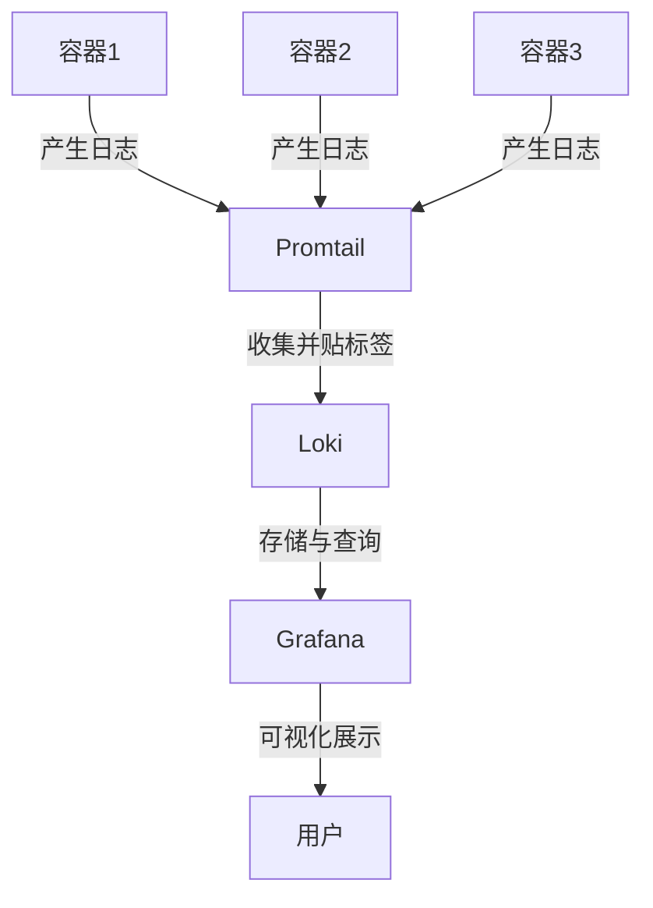
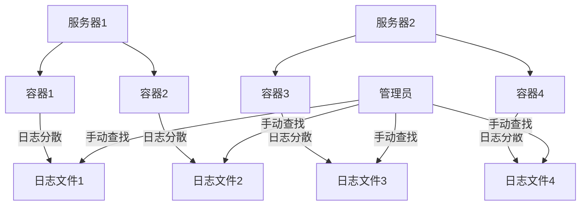
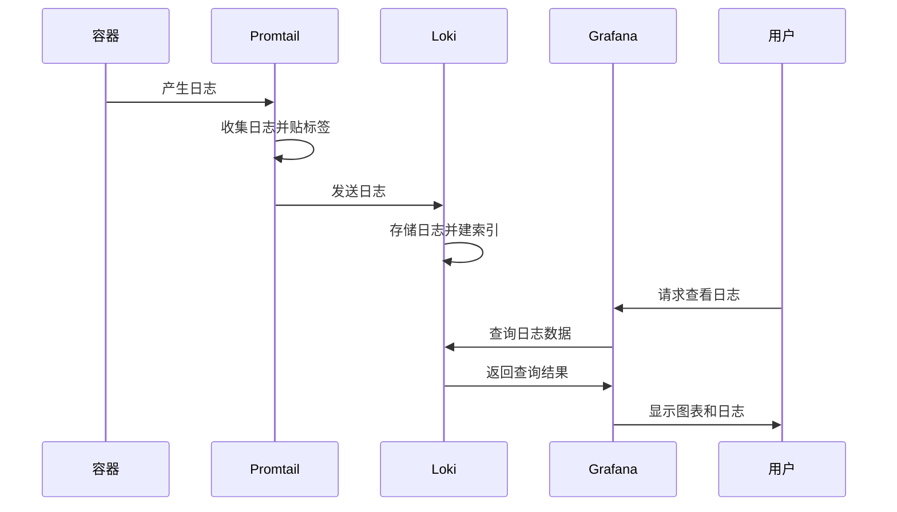
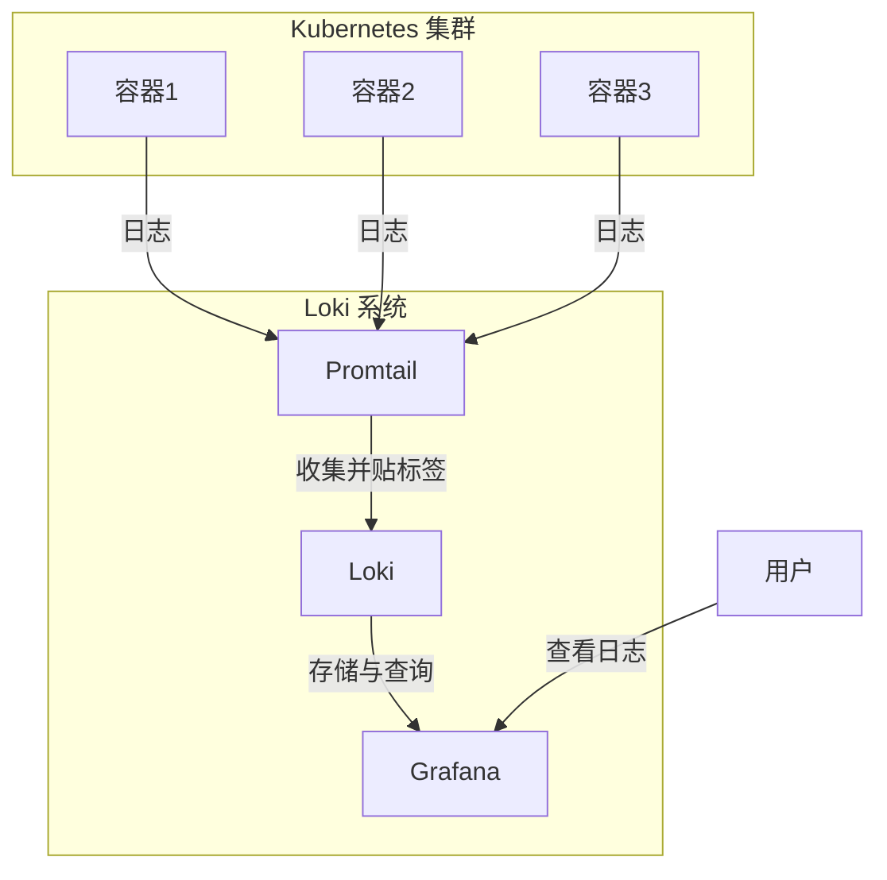
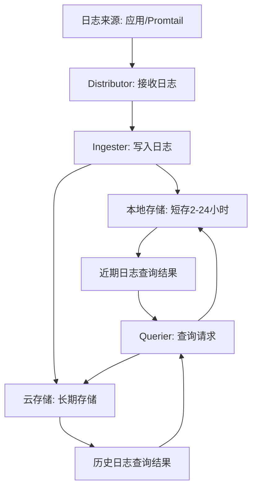
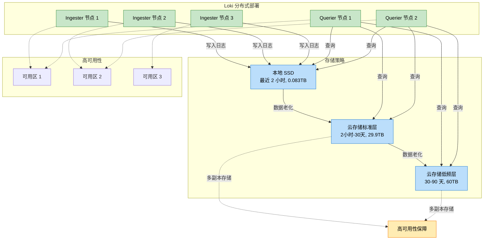

# Kubernetes 日志管理与 Loki 实践

## 学习目标
1. 理解 Kubernetes 日志管理的基本概念、挑战及其在云原生环境中的重要性。
2. 掌握 Loki 日志系统的核心原理、组件功能（Promtail、Loki、Grafana）以及 LogQL 查询语言的使用。
3. 能够对比 Loki 与其他日志系统（如 ELK/EFK）的优劣，明确适用场景。
4. 学会在本地 Kubernetes 环境中部署 Loki 日志系统，包括官方一键安装和 Helm Chart 方式。
5. 理解日志体量对 Loki 部署模式（单体与分布式）的影响，以及分布式模式与云存储服务的结合方式。
6. 掌握 Loki 在生产环境中的优化策略，学会配置监控（通过 Prometheus 采集指标）与告警（设置规则和通知），并能够通过 Grafana 可视化日志以应对企业级需求。


## 第一部分：Kubernetes 日志管理与 Loki 简介

### 1. 什么是日志？为什么 Kubernetes 日志管理至关重要？

- **什么是日志？**
  - 日志就像是计算机世界的“日记本”。想象一下，你每天写日记记录自己的活动，比如“今天几点吃了什么，去了哪里，遇到了什么问题”。计算机和应用程序也会做类似的事情，它们会记录下自己运行时的每一个动作和状态，比如“某用户在几点几分登录了系统”或者“某个程序在运行时出现了错误”。
  - 在技术世界里，日志是一行行文字，记录了程序运行时的关键信息。这些信息包括：时间、事件、错误提示等。简单来说，日志就是帮助我们了解“程序发生了什么”的重要线索。
  - 举个例子：如果你玩一款手机游戏，突然游戏崩溃了，游戏开发者可能就需要查看游戏的日志文件，找到崩溃的原因，比如“内存不足”或者“网络连接中断”。

- **Kubernetes 中的日志是什么？**
  - Kubernetes 是一个管理“容器”的平台。容器就像是一个个小盒子，每个盒子里装着一个应用程序（比如一个网站、一个数据库）。这些应用程序运行时，也会产生自己的“日记本”，也就是日志。
  - 在 Kubernetes 里，日志不仅仅来自一个应用程序，而是来自成百上千个容器，甚至是整个集群（由多台服务器组成的大系统）。比如，一个电商网站可能有几十个容器负责处理订单、支付、库存，每个容器都会产生日志，记录自己的工作情况。

- **为什么 Kubernetes 日志管理至关重要？**
  - 想象一下，如果你是电商网站的管理员，突然有用户反馈“无法下单”，你该怎么办？如果没有日志，你就像大海捞针，完全不知道问题出在哪里。但如果有日志，你可以快速翻看“日记本”，找到哪个容器在哪个时间点报错了，比如“支付模块在 10:00 出现了连接超时”。
  - 日志管理的重要性在于，它能帮助我们：
    1. **发现问题**：通过日志找到系统出错的原因，比如某个服务崩溃了。
    2. **追踪行为**：了解用户或系统的操作轨迹，比如某个用户做了什么导致系统异常。
    3. **优化性能**：通过分析日志，发现系统哪里慢、哪里资源不够用。
  - 在 Kubernetes 这种复杂的环境中，容器数量多、分布广，如果没有好的日志管理，就像在一个没有路标的大城市里迷路，根本无法快速找到问题。


### 2. Kubernetes 日志管理的挑战

- **挑战 1：日志分散，像散落的拼图**
  - 在 Kubernetes 集群中，日志不是集中在一个地方，而是像散落的拼图碎片一样，分布在不同的容器、不同的服务器上。想象你有 100 个容器，每个容器都有自己的“日记本”，这些日记本存放在不同的抽屉里，你要一个个打开抽屉才能看到内容，非常费时费力。
  - 举例：一个订单系统可能有 10 个容器负责处理订单，10 个负责支付，如果订单失败，你可能需要逐个查看 20 个容器的日志，才能找到问题根源。

- **挑战 2：规模化查询困难，像在图书馆找一本书**
  - 当容器数量增加到几百个甚至几千个时，日志量会变得非常庞大，就像一个巨大的图书馆里有成千上万本书。你想找某一天某个容器的特定错误信息，可能需要翻阅无数行日志，就像在没有目录的图书馆里找一本书，效率极低。
  - 举例：如果你的集群每天产生 1 百万行日志，而你只想找到某个用户的登录失败记录，手动查找几乎是不可能的。

- **挑战 3：日志生命周期短，像过期的牛奶**
  - Kubernetes 容器是动态的，容器可能会被销毁重建，日志也会随之消失，就像牛奶过了保质期就不能用了。如果没有及时保存日志，关键信息可能会永远丢失。
  - 举例：一个容器在凌晨报错后被自动重启，等你早上查看时，日志已经没了，问题就无从查起。

- **总结**：Kubernetes 日志管理的挑战就像管理一个繁忙城市的交通，没有统一的监控和记录系统，交通事故发生时就无法快速找到原因和解决办法。


### 3. 日志系统的价值：集中化存储、快速查询和可视化

- **什么是日志系统？**
  - 日志系统就像一个“超级日记本管理员”，它能把所有分散的日志收集到一个地方，整理得井井有条，还能帮你快速找到需要的内容。
  - 想象你有一个智能助手，它不仅能收集所有容器的“日记本”，还能帮你标注重点，甚至画出图表让你一目了然地看到问题。

- **日志系统的三大价值：**
  1. **集中化存储**：把所有日志从分散的容器中收集到一个中央仓库，就像把所有日记本放到一个大书架上，方便统一管理，不用再东奔西跑查找。
  2. **快速查询**：提供搜索功能，让你输入关键词就能找到相关日志，就像在搜索引擎中输入“错误”就能立刻看到所有报错信息，省时省力。
  3. **可视化展示**：把日志数据变成图表或仪表盘，就像把日记内容画成彩色图表，让你一眼就能看出系统的健康状况，比如哪些服务报错最多。

- **举个例子**：有了日志系统，之前提到的“订单无法下单”问题可以这样解决：你打开日志系统，输入“订单失败”，系统立刻显示所有相关日志，甚至用红色标记出错误最多的容器，你再一看图表，发现支付模块报错率最高，几分钟就锁定了问题。


### 4. Loki 简介：专为 Kubernetes 设计的轻量级日志系统

- **什么是 Loki？**
  - Loki 是一个专门为 Kubernetes 设计的日志管理系统，就像一个贴心的“日志管家”，它能帮你收集、存储和查询 Kubernetes 集群中的所有日志，而且操作简单，资源占用少。
  - Loki 由 Grafana Labs 开发，名字来源于北欧神话中的“洛基”（一个聪明又有点狡猾的神），象征它在日志管理中的灵活和高效。

- **Loki 的核心优势：**
  1. **专为 Kubernetes 设计**：Loki 就像是为 Kubernetes 量身定制的衣服，完美贴合 Kubernetes 的动态环境，能自动发现容器和日志，不需要复杂配置。
  2. **标签索引，查询快**：Loki 不像传统日志系统那样把每行日志都存得很复杂，它只对“标签”建索引（标签就像日志的分类标签，比如“哪个应用”“哪个容器”），查询时就像按分类找书，速度非常快。
  3. **低资源占用，轻量级**：Loki 就像一辆节能小车，不需要太多燃料（CPU 和内存），就能跑得很远，适合资源有限的小团队或测试环境。
  4. **与 Grafana 集成，界面友好**：Loki 可以无缝连接 Grafana（一个画图表的工具），让你通过漂亮的界面查看日志，就像用手机看图文并茂的报告，直观又方便。

- **举个例子**：如果你的 Kubernetes 集群有 50 个容器，每天产生 10 万行日志，用 Loki 你可以轻松收集所有日志，只需几秒就能找到某个应用的错误信息，还能在 Grafana 上看到错误趋势图，比手动翻日志快百倍。


### 5. 简要介绍核心组件：Promtail（采集）、Loki（存储与查询）、Grafana（可视化）

- **Promtail：日志采集员**
  - Promtail 就像一个勤劳的“快递员”，它的任务是到 Kubernetes 集群的每一个容器门口，把日志（日记本）收集起来，然后贴上标签（比如“来自哪个容器”“属于哪个应用”），最后送到 Loki 那里。
  - 比喻：Promtail 就像超市里的收银员，把每件商品（日志）扫描一下，记录好类别，再打包送到仓库。

- **Loki：日志存储与查询中心**
  - Loki 是整个系统的“大脑”和“仓库”，它负责接收 Promtail 送来的日志，存好这些日志，并在你需要时快速帮你找到想要的内容。
  - 比喻：Loki 就像一个智能图书馆，日志是书本，它会按标签分类存放，你只要说“我要找某个应用的错误日志”，它就能立刻把相关书本找出来。

- **Grafana：日志可视化工具**
  - Grafana 就像一个“画家”，它能把 Loki 提供的日志数据画成图表或仪表盘，让你一眼就能看懂日志背后的故事，比如哪个服务报错最多、错误是否在增加。
  - 比喻：Grafana 就像把日记内容变成动画片，用颜色和图形告诉你“系统哪里生病了”，非常直观。

- **三者关系图（Mermaid 结构图）**：
  以下是用 Mermaid 绘制的简单流程图，帮助你理解三者如何协作：



- **图解说明**：上图展示了日志从容器产生，到 Promtail 收集，再到 Loki 存储，最后通过 Grafana 展示给用户的完整流程。就像一条流水线，日志从源头到最终呈现，环环相扣。


### 小案例：Kubernetes 日志分散的场景

- **场景描述**：
  - 假设你管理一个小型 Kubernetes 集群，里面有 5 个容器运行一个简单的博客网站。其中 2 个容器负责前端页面，2 个负责后端接口，1 个负责数据库。
  - 突然有用户反馈“无法发表评论”，你想找到原因，但日志分散在 5 个容器中，每个容器都要用命令行单独查看，费时费力。
  - 如果没有日志系统，你可能花 30 分钟才找到问题（比如后端接口报错）；但如果有 Loki 这样的系统，日志集中存储，你只需 2 分钟就能通过标签找到后端容器的错误日志。

- **思考问题**：
  - 如果你是管理员，面对分散的日志会怎么做？有没有想过如果日志能集中管理会多方便？
  - 通过这个小案例，你可以感受到日志管理工具的必要性，为后续学习 Loki 做好准备。

### 重点总结

- **日志是什么**：日志是程序运行的“日记本”，记录了系统和应用的关键信息。
- **为什么重要**：在 Kubernetes 中，日志帮助我们发现问题、追踪行为、优化性能。
- **面临的挑战**：日志分散、查询困难、生命周期短。
- **日志系统的价值**：集中存储、快速查询、可视化展示。
- **Loki 的作用**：专为 Kubernetes 设计的轻量级日志系统，查询快、资源占用低、界面友好。
- **核心组件**：Promtail 收集日志，Loki 存储和查询，Grafana 可视化展示。

### 补充图表：Kubernetes 日志管理挑战

为了帮助你更直观地理解 Kubernetes 日志管理的挑战，这里再提供一个 Mermaid 图，展示日志分散的场景：



- **图解说明**：上图展示了 Kubernetes 集群中日志分散的情况，管理员需要逐个查看每个容器的日志文件，非常低效。通过对比，你可以更容易理解集中化日志系统的必要性。


## 第二部分：Loki 架构与工作原理

### 1. Loki 核心组件与工作流程

Loki 是一个强大的日志管理系统，它由几个核心组件组成，每个组件都有自己的“职责”，它们协作起来，就像一个高效的团队，把日志从产生到查询的每一步都处理得井井有条。下面我们来逐一了解这些组件，以及它们如何一起工作。

#### 1.1 Promtail：日志采集与标签附加机制
- **Promtail 是什么？**
  - Promtail 是 Loki 系统中的“采集员”，它的任务就像一个勤劳的快递员，跑遍 Kubernetes 集群中的每一个容器，收集它们产生的日志（就像收集日记本），然后给这些日志贴上“标签”（就像给包裹贴上分类标签），最后把日志送到 Loki 去存储。
  - 比喻：Promtail 就像超市里的收银员，把每件商品（日志）扫描一下，记录好类别（比如“哪个容器”“哪个应用”），再打包送到仓库。

- **Promtail 怎么工作？**
  - Promtail 会自动发现 Kubernetes 集群中的容器，读取每个容器产生的日志文件。
  - 它会给日志加上标签，比如“这个日志来自哪个应用”“来自哪个服务器”“属于哪个环境（测试还是生产）”。
  - 加上标签后，Promtail 把日志发送到 Loki，就像快递员把包裹送到中央仓库。

- **为什么标签重要？**
  - 标签就像日志的“身份证”，有了标签，Loki 就能快速找到你想要的日志，不用一行行翻看所有内容。我们后面会详细讲标签的作用。

#### 1.2 Loki：单体模式与分布式模式的区别，日志存储与查询流程
- **Loki 是什么？**
  - Loki 是整个系统的“大脑”和“仓库”，它负责接收 Promtail 送来的日志，把这些日志存储起来，并在你需要时快速帮你找到想要的内容。
  - 比喻：Loki 就像一个智能图书馆，日志是书本，它会按标签分类存放，你只要说“我要找某个应用的错误日志”，它就能立刻把相关书本找出来。

- **Loki 的两种模式：单体模式和分布式模式**
  1. **单体模式（简单版）**：
     - 单体模式就像一个小型家庭图书馆，所有的功能（存储、查询等）都在一台机器上完成。
     - 适合小型团队或测试环境，资源占用少，设置简单，但处理大量日志时可能不够快。
     - 比喻：就像你家里的书柜，虽然容量有限，但管理起来很方便。
  2. **分布式模式（高级版）**：
     - 分布式模式就像一个大型公共图书馆，把不同任务分配到多台机器上，比如一台机器专门存储日志，一台机器专门处理查询，还有一台负责协调。
     - 适合大规模集群，能处理海量日志，速度更快，但设置复杂，资源需求高。
     - 比喻：就像一个连锁书店，各地分店分工合作，效率更高。

- **Loki 的日志存储与查询流程**
  - **存储**：Loki 收到 Promtail 送来的日志后，会把日志按时间顺序存到磁盘上，同时只对“标签”建立索引（就像图书馆只记录书的类别，而不是每页内容），这样存储和查找都很节省资源。
  - **查询**：当你想查找日志时，Loki 先根据标签快速定位相关日志（比如“只看某个应用的日志”），然后再从这些日志中搜索具体内容（比如“找错误信息”），速度非常快。
  - 比喻：就像你在图书馆先找到“计算机类书籍”区域，然后再翻书找具体章节，比一本本翻快得多。

#### 1.3 Grafana：日志可视化与告警工具
- **Grafana 是什么？**
  - Grafana 是 Loki 系统的“画家”，它能把 Loki 提供的日志数据画成图表或仪表盘，让你一眼就能看懂日志背后的故事，比如哪个服务报错最多、错误是否在增加。
  - 比喻：Grafana 就像把日记内容变成动画片，用颜色和图形告诉你“系统哪里生病了”，非常直观。

- **Grafana 怎么工作？**
  - Grafana 连接到 Loki，读取日志数据，然后把这些数据变成图表，比如柱状图（显示每个应用的错误数量）或折线图（显示错误随时间的变化）。
  - 它还能设置告警，比如当某个应用的错误日志超过 100 条时，自动给你发通知，就像一个贴心的助手提醒你“有问题啦，快来看”。

#### 1.4 日志从采集到查询的完整流程（时序图）
以下是用 Mermaid 绘制的时序图，展示日志从产生到查询的全过程，帮助你更直观地理解每个组件的角色：



- **图解说明**：上图展示了日志的“旅行”过程：从容器产生日志，到 Promtail 收集和贴标签，再到 Loki 存储和查询，最后通过 Grafana 展示给用户。就像一条流水线，每个环节都不可或缺。


### 2. 标签（Labels）机制

- **标签是什么？**
  - 标签是 Loki 的一个“聪明设计”，它是日志的“分类标记”，就像书本上的类别标签（比如“小说”“科技”）。每个日志都会被 Promtail 贴上多个标签，比如“来自哪个应用”“来自哪个容器”“属于哪个环境”。
  - 比喻：标签就像超市货架上的标签，你想买牛奶，直接看“乳制品”区域就行，不用逛遍整个超市。

- **标签的作用：仅对标签建索引，降低存储和查询成本**
  - Loki 的特别之处在于，它不像传统日志系统那样对每行日志的每一句话都建索引（那样会很占资源，就像把书的每一页都记下来）。Loki 只对标签建索引，存储和查询都非常高效。
  - 查询时，Loki 先用标签快速缩小范围（比如“只看某个应用的日志”），然后再在这个小范围内搜索具体内容（比如“找错误信息”）。
  - 比喻：就像你在图书馆先找到“计算机书籍”区域，然后再翻书找具体内容，比一本本翻快得多。

- **示例：通过标签快速定位特定应用或 Pod 的日志**
  - 假设你有一个 Kubernetes 集群，里面运行了两个应用：“订单系统”和“支付系统”。每个应用的日志都有标签，比如：
    - 订单系统的日志标签：`app=order-system`
    - 支付系统的日志标签：`app=payment-system`
  - 如果你只想看订单系统的日志，在 Loki 中输入标签条件 `app=order-system`，系统会立刻过滤掉其他日志，只显示订单系统的内容，几秒钟就能完成。
  - 比喻：就像你在超市输入“牛奶”标签，货架上只显示牛奶相关商品，其他东西都被隐藏，找起来特别快。

### 3. LogQL 查询语言

- **LogQL 是什么？**
  - LogQL 是 Loki 专用的查询语言，名字来源于“Log Query Language”（日志查询语言）。它就像一个“搜索工具”，让你能快速从海量日志中找到想要的信息。
  - 比喻：LogQL 就像搜索引擎的搜索框，你输入关键词和条件，就能找到你需要的内容。

- **LogQL 的基础语法**
  1. **标签过滤**：用标签缩小日志范围，语法是 `{标签名="值"}`，比如 `{app="order-system"}` 意思是“只看订单系统的日志”。
  2. **内容过滤**：在日志内容中搜索关键词，用 `|` 符号，比如 `|="error"` 意思是“只显示包含 error 关键词的日志”。
  3. **逻辑运算**：可以组合多个条件，比如 `{app="order-system"} |="error"` 意思是“只看订单系统里包含 error 的日志”。

- **简单查询示例：过滤特定错误日志**
  - **场景**：假设你想查找订单系统中所有的错误日志。
  - **查询语句**：`{app="order-system"} |="error"`
  - **解释**：这条语句先用标签 `app="order-system"` 锁定订单系统的日志，然后用 `|="error"` 筛选出包含“error”关键词的日志。
  - **结果**：查询结果会显示所有订单系统中的错误日志，比如：
    ```
    2025-08-24 10:00:01 [order-system] error: database connection failed
    2025-08-24 10:01:15 [order-system] error: timeout on request
    ```
  - 比喻：就像你在搜索引擎中输入“订单系统 错误”，只显示相关的搜索结果，非常精准。

- **另一个示例：查找特定容器和环境的日志**
  - **场景**：你想查找生产环境中某个特定容器的日志。
  - **查询语句**：`{env="production", pod="order-pod-1"}`
  - **解释**：这条语句用两个标签条件，锁定“生产环境”（`env="production"`）和“特定容器”（`pod="order-pod-1"`）的日志。
  - **结果**：只显示符合这两个条件的日志，其他日志都被过滤掉。

- **小提示**：LogQL 很简单，就像搭积木，把标签和条件组合起来，就能找到你想要的日志。后续你可以多练习，熟悉不同组合的使用。


### 重点总结

- **Loki 核心组件**：
  - **Promtail**：负责日志采集和贴标签，就像快递员收集和分类日志。
  - **Loki**：负责日志存储和查询，有单体模式（简单）和分布式模式（高效）两种，存储时只对标签建索引，节省资源。
  - **Grafana**：负责日志可视化和告警，把日志数据变成图表，直观易懂。
- **标签机制**：标签是日志的分类标记，Loki 只对标签建索引，查询效率高，就像用类别快速定位书本。
- **LogQL 查询语言**：Loki 的搜索工具，通过标签过滤和内容过滤，快速找到目标日志，就像搜索引擎一样方便。

### 补充图表：Loki 架构图

为了帮助你更直观地理解 Loki 的整体架构，这里提供一个 Mermaid 架构图，展示组件之间的关系：



- **图解说明**：上图展示了 Kubernetes 集群中的容器产生日志，Promtail 收集并贴标签后发送到 Loki，Loki 存储和查询日志，最后通过 Grafana 展示给用户。整个系统就像一个流水线，各司其职。


## 第三部分：Loki 与其他日志系统对比

- **学习目标**：通过对比分析，帮助你理解 Loki 的独特优势和适用场景，学会根据实际需求选择合适的日志管理工具。
- **内容**：以下内容将介绍常见的日志系统（如 ELK/EFK），并与 Loki 进行详细对比，让你明白每种工具的优劣和适用场景。
- **重点**：通过对比表格和场景分析，明确 Loki 的定位和选择依据。
- **时长建议**：约 1 小时阅读和理解。

### 1. ELK/EFK 栈简介

- **什么是 ELK/EFK 栈？**
  - ELK 栈是一个非常流行的日志管理解决方案，全称是 Elasticsearch、Logstash 和 Kibana 的组合。EFK 栈是它的一个变种，用 Fluentd 代替 Logstash。
  - 比喻：ELK/EFK 就像一个功能强大的“日志图书馆”，能收集、存储、搜索和展示日志，适合各种复杂的场景。

- **组件与原理**
  1. **Elasticsearch**：负责存储和搜索日志，是整个系统的“仓库”和“搜索引擎”。它会对日志内容进行全文索引（就像把书的每一页都记录下来），让你能搜索日志中的每一个词。
     - 比喻：Elasticsearch 就像一个超级详细的图书馆目录，能帮你找到书里的每一句话。
  2. **Logstash/Fluentd**：负责日志采集和预处理，是系统的“采集员”。它们从各种来源收集日志（比如文件、数据库），还能对日志进行格式化或过滤，然后发送到 Elasticsearch。
     - 比喻：Logstash/Fluentd 就像图书管理员，把各种书籍（日志）整理好再放入库中。
  3. **Kibana**：负责日志可视化，是系统的“展示窗口”。它连接到 Elasticsearch，把日志数据变成图表和仪表盘，让你直观地查看日志。
     - 比喻：Kibana 就像图书馆的展示屏，用图表告诉你哪些书最受欢迎。

- **优势与劣势**
  - **优势**：
    1. **全文搜索能力强**：Elasticsearch 会对日志的每一部分建索引，搜索非常精准，比如你输入一个词，就能找到所有包含这个词的日志。
    2. **功能丰富**：支持复杂的查询、分析和告警，适合需要深度挖掘日志数据的场景。
    3. **生态完善**：有大量插件和社区支持，能处理各种日志来源和格式。
  - **劣势**：
    1. **资源占用高**：因为全文索引需要大量存储和计算资源，运行 ELK/EFK 需要强大的服务器，尤其在日志量大时，成本很高。
    2. **配置复杂**：设置和维护 ELK/EFK 需要较多技术知识，比如配置 Logstash/Fluentd 的过滤规则，优化 Elasticsearch 的性能。
    3. **不完全贴合 Kubernetes**：虽然可以用在 Kubernetes 环境，但自动发现容器和动态变化的功能不如 Loki 自然。

### 2. Loki 与 ELK/EFK 的对比

为了帮助你更清楚地了解 Loki 和 ELK/EFK 的区别，我们从多个维度进行对比，让你明白它们各自的强项和适用场景。

#### 2.1 架构差异：标签索引 vs 全文索引
- **Loki**：
  - 采用“标签索引”方式，只对日志的标签（比如“哪个应用”“哪个容器”）建索引，不对日志内容本身建详细索引。
  - 好处：存储和查询占用的资源少，速度快，就像图书馆只记录书的类别，不记录每页内容。
  - 坏处：内容搜索能力稍弱，如果要找日志里的某个词，速度可能不如 ELK。
- **ELK/EFK**：
  - 采用“全文索引”方式，对日志的每一行、每个词都建索引。
  - 好处：搜索非常精准，能找到日志里的任何内容，就像图书馆记录了书的每一页。
  - 坏处：索引占用的存储空间大，查询和存储都需要更多资源。

#### 2.2 性能与成本：Loki 轻量级 vs ELK/EFK 高资源需求
- **Loki**：
  - 设计轻量级，资源占用少，就像一辆节能小车，适合资源有限的小团队或测试环境。
  - 成本低：可以用普通服务器运行，甚至在单机上就能处理中等规模的日志。
- **ELK/EFK**：
  - 资源需求高，就像一辆大卡车，需要强大的 CPU、内存和存储来支持全文索引和复杂查询。
  - 成本高：大规模部署时往往需要多台高配服务器，维护成本也较高。

#### 2.3 Kubernetes 集成：Loki/Promtail 自动发现 vs ELK/EFK 配置复杂
- **Loki**：
  - 专为 Kubernetes 设计，Promtail 能自动发现集群中的容器和日志，配置简单，就像“即插即用”的设备。
  - 与 Kubernetes 的动态环境（容器创建、销毁）无缝适配。
- **ELK/EFK**：
  - 虽然也能用在 Kubernetes，但配置复杂，需要手动设置 Logstash/Fluentd 的采集规则，对动态环境的支持不如 Loki 自然。
  - 比喻：就像用一个通用工具箱，虽然能用，但需要自己调整工具，不如定制工具好用。

#### 2.4 适用场景：Loki 适合云原生环境，ELK/EFK 适合复杂搜索需求
- **Loki**：
  - 适合云原生环境（尤其是 Kubernetes），日志量中等，追求低成本和简单配置的场景。
  - 比如：中小型团队、测试环境、Kubernetes 集群的日志管理。
- **ELK/EFK**：
  - 适合需要复杂搜索和深度分析的场景，日志量大且对搜索精度要求高。
  - 比如：大型企业、需要分析用户行为或安全事件的场景。

#### 2.5 直观对比表格
以下表格总结了 Loki 和 ELK/EFK 的主要区别，帮助你一目了然地了解两者的特点：

| **维度**            | **Loki**                              | **ELK/EFK**                          |
|---------------------|---------------------------------------|---------------------------------------|
| **架构设计**        | 标签索引，存储和查询效率高            | 全文索引，搜索精准但资源占用大        |
| **资源占用**        | 轻量级，低 CPU 和内存需求             | 高资源需求，需要强大服务器            |
| **配置难度**        | 简单，Kubernetes 自动发现             | 复杂，需要手动配置采集和过滤规则      |
| **Kubernetes 集成** | 专为 Kubernetes 设计，适配性强        | 通用性强，但集成 Kubernetes 较复杂    |
| **查询能力**        | 标签过滤快，内容搜索稍弱             | 全文搜索能力强，适合复杂查询          |
| **成本**            | 低成本，适合小团队                    | 高成本，适合大企业                    |
| **适用场景**        | 云原生环境、中小规模日志管理          | 大规模日志、复杂分析、安全审计        |

- **表格说明**：通过对比，你可以看到 Loki 更适合 Kubernetes 环境和资源有限的场景，而 ELK/EFK 更适合需要深度搜索和分析的复杂场景。

### 3. 其他工具简述

除了 Loki 和 ELK/EFK，市场上还有其他日志管理工具，下面简单介绍两种常见的工具，供你参考。

- **Graylog**：
  - Graylog 是一个集中化日志管理工具，类似于 ELK，但更注重用户界面和易用性。
  - 优势：界面友好，支持多种日志来源，适合中小型企业。
  - 劣势：性能不如 ELK/EFK，处理超大规模日志时可能有瓶颈。
  - 比喻：Graylog 就像一个小型社区图书馆，功能齐全但规模有限。

- **Fluentd 独立部署**：
  - Fluentd 是一个强大的日志收集和处理工具，可以独立使用，也可以作为 EFK 栈的一部分。
  - 优势：支持多种输入输出插件，能灵活处理各种日志格式。
  - 劣势：没有自带的存储和查询功能，需要搭配其他工具（如数据库或 Elasticsearch）。
  - 比喻：Fluentd 就像一个万能的“搬运工”，能收集各种东西，但需要一个“仓库”来存放。

- **小提示**：这些工具各有特色，选择时要根据你的具体需求（比如日志量、预算、技术能力）来决定。

### 重点总结

- **ELK/EFK 栈**：功能强大，全文搜索能力强，适合复杂分析场景，但资源占用高，配置复杂。
- **Loki 的优势**：轻量级，专为 Kubernetes 设计，标签索引效率高，适合云原生环境和中小规模日志管理。
- **对比关键点**：Loki 追求低成本和简单配置，ELK/EFK 追求搜索精度和功能全面。
- **选择依据**：如果你用 Kubernetes 且日志量中等，Loki 是首选；如果需要深度分析或处理超大规模日志，ELK/EFK 更合适。
- **其他工具**：Graylog 和 Fluentd 等工具也有各自优势，适合特定场景。


## 第四部分：Loki 在本地 Kubernetes 中的部署实操

- **学习目标**：通过实际操作，掌握 Loki 在本地 Kubernetes 环境中的部署方法，学会如何安装、配置和使用 Loki 进行日志管理。
- **内容**：以下内容将带你一步步完成 Loki 的部署。我们会介绍两种部署场景：1）Loki 和 Grafana 在主机中独立部署（使用 `apt` 安装）；2）在 Kubernetes 中部署 Promtail，用于采集日志并推送至指定 IP 的 Loki 服务。此外，我们会详细介绍 Helm 工具及其安装方法。
- **重点**：通过不同的部署方式，理解 Loki、Promtail 和 Grafana 的配合方式，具备实际动手能力。
- **时长建议**：约 2 小时（包括阅读和动手练习）。


### 1. 前置条件

在开始部署之前，我们需要确认以下环境和工具已经准备好。全班同学已经配置好 `kubectl` 和 Kubernetes 环境，可以直接连接到教室的 Kubernetes 集群。如果你有疑问，可以随时向教员提问。

- **本地 Kubernetes 集群准备**
  - 教室已经提供了 Kubernetes 集群环境，同学们可以通过配置好的 `kubectl` 直接连接到集群。
  - **验证集群状态**：运行 `kubectl get nodes` 命令，确保能看到集群节点信息。如果有问题，请联系教员解决。

- **工具安装**
  1. **kubectl**：Kubernetes 的命令行工具，用于管理集群。同学们已经配置好，可以直接使用。
     - 验证：运行 `kubectl version` 检查是否正常工作。
  2. **Helm（可选，但推荐）**：Kubernetes 的包管理工具，用于简化应用部署（后面会用 Helm 部署 Promtail）。我们会在下面详细介绍 Helm 是什么以及如何安装。

- **小提示**：由于 Kubernetes 环境已经由教室统一配置，同学们无需自己搭建集群，可以直接进入部署步骤。如果对环境有疑问，请随时向教员反馈。


### 1.1 什么是 Helm？为什么要用 Helm？

在介绍 Helm 的安装之前，我们先来了解一下 Helm 是什么，以及为什么我们在部署 Promtail 时会用到它。

- **Helm 是什么？**
  - Helm 是 Kubernetes 的一个包管理工具，类似于手机上的应用商店。它的作用是帮助你快速安装和管理 Kubernetes 上的复杂应用，而不需要手动编写大量的配置文件。
  - 比喻：Helm 就像一个“应用商店”，你只需要输入一个命令，就能下载并安装一个完整的应用（比如 Promtail），而不用自己去组装每一个零件。

- **为什么要用 Helm？**
  1. **简化部署**：Kubernetes 应用通常需要多个配置文件（如 Deployment、Service 等），手动编写和维护很麻烦。Helm 把这些配置打包成一个“Chart”（类似于安装包），一键就能部署。
  2. **复用性强**：Helm Chart 可以被多人共享，比如 Grafana 官方提供了 Promtail 的 Helm Chart，我们直接用就行，不需要自己写配置。
  3. **易于管理**：通过 Helm，你可以轻松升级、卸载或调整应用配置，就像管理手机应用一样简单。
  - 比喻：没有 Helm 就像自己组装电脑，有了 Helm 就像直接买一台组装好的电脑，开箱即用。

- **Helm 与 Promtail 的关系**：在 Kubernetes 中，Promtail 的部署需要多个组件配合，用 Helm 可以一键安装并配置好这些组件，省时省力。

- **小提示**：如果你之前没听说过 Helm，不用担心，下面我们会详细教你如何安装和使用它。

### 1.2 在 Windows 上安装 Helm

Helm 的安装通常需要访问官方下载链接，但由于网络限制，可能需要科学上网。我们会详细讲解在 Windows 系统上安装 Helm 的步骤。如果你使用的是 Linux 或 macOS，可以参考官方文档 [Helm 安装指南](https://helm.sh/docs/intro/install/)。

#### 步骤：Windows 系统安装 Helm
Windows 系统需要下载 Helm 的安装包并手动配置环境变量。以下是以 Helm 版本 v3.18.6 为例的安装步骤：

1. **下载安装包**：
   - 访问以下链接下载 Helm 的 Windows 版本：
     [https://get.helm.sh/helm-v3.18.6-windows-amd64.tar.gz](https://get.helm.sh/helm-v3.18.6-windows-amd64.tar.gz)
   - **注意**：如果直接访问受限，你可能需要使用科学上网工具（如 VPN）来下载文件。如果无法下载，可以联系教员或同学帮忙提供安装包。

2. **解压文件**：
   - 将下载的 `helm-v3.18.6-windows-amd64.tar.gz` 文件解压，得到 `helm.exe` 可执行文件。
   - 解压工具：可以使用 Windows 自带的解压功能，或安装 7-Zip 等工具（如果文件是 `.tar.gz` 格式，可能需要两次解压）。

3. **放置到指定目录**：
   - 将 `helm.exe` 文件移动到一个固定目录，例如 `C:\helm\`。如果该目录不存在，请先创建。
   - 比喻：这就像把一个工具放到工具箱里，方便以后找到。

4. **配置环境变量**：
   - 环境变量的作用是让系统知道 `helm.exe` 在哪里，这样你可以在任何地方运行 `helm` 命令。
   - 具体步骤：
     1. 右键点击“此电脑”或“我的电脑”，选择“属性”。
     2. 点击“高级系统设置” -> “环境变量”。
     3. 在“系统变量”下找到“Path”，点击“编辑”。
     4. 点击“新建”，添加路径 `C:\helm`（确保路径指向 `helm.exe` 所在的目录）。
     5. 点击“确定”保存更改。
   - 比喻：这就像告诉系统“工具箱在 C:\helm 这个位置，需要用工具时去那里找”。

5. **验证安装**：
   - 打开命令提示符（CMD）或 PowerShell，输入以下命令：
     ```cmd
     helm version
     ```
   - 如果输出 Helm 的版本信息（例如 `version.BuildInfo{Version:"v3.18.6", ...}`），说明安装成功。
   - 如果提示“命令未找到”，请检查环境变量是否正确配置，或者重新打开 CMD/PowerShell 让配置生效。

#### 注意事项
- **网络问题**：如果无法访问 Helm 官方下载链接，可以尝试使用科学上网工具，或者请教员或同学提供安装包。
- **版本选择**：建议下载最新版本的 Helm，版本号可能与示例不同，但安装步骤一致。
- **权限问题**：确保你有管理员权限来修改环境变量，否则可能无法保存更改。

- **小提示**：安装好 Helm 后，建议记下 `helm.exe` 的路径，方便后续排查问题。如果安装遇到困难，可以随时向教员提问。


### 2. 主机独立部署：Loki 和 Grafana（使用 `apt` 安装）

在我们的教学环境中，Loki 和 Grafana 将作为独立服务部署在主机上（非 Kubernetes 内部），使用 `apt` 安装方式。以下是具体步骤，适用于 Debian/Ubuntu 系统，参考了官方文档 [Loki 安装指南](https://grafana.org.cn/docs/loki/latest/setup/install/local/)。

#### 2.1 部署 Loki（IP：192.168.110.174）
Loki 是日志存储和查询服务，我们将它安装在指定的主机上，IP 为 `192.168.110.174`。以下步骤需要在该主机上执行（教员可能已经完成部署，同学们可以观察或跟随操作）。

1. **添加 Grafana 软件源和密钥**
   - 运行以下命令，将 Grafana 的软件源添加到系统，并导入 GPG 密钥以验证软件包：
     ```bash
     mkdir -p /etc/apt/keyrings/
     wget -q -O - https://apt.grafana.com/gpg.key | gpg --dearmor > /etc/apt/keyrings/grafana.gpg
     echo "deb [signed-by=/etc/apt/keyrings/grafana.gpg] https://apt.grafana.com stable main" | tee /etc/apt/sources.list.d/grafana.list
     ```

2. **更新软件包列表并安装 Loki**
   - 运行以下命令，更新软件包列表并安装 Loki：
     ```bash
     apt update
     apt install loki/stable
     ```

3. **配置 Loki**
   - 安装完成后，Loki 的配置文件通常位于 `/etc/loki/config.yml`。可以用文本编辑器打开并检查默认配置：
     ```bash
     vim /etc/loki/config.yml
     ```
   - 初次使用可以保留默认配置，确保监听地址为 `0.0.0.0:3100`，以便外部（如 Promtail）可以访问。

4. **启动 Loki 服务**
   - 运行以下命令启动 Loki 服务，并设置为开机自启：
     ```bash
     systemctl start loki
     systemctl enable loki
     ```
   - 验证服务是否运行：运行 `systemctl status loki` 检查状态，确保显示 “active (running)”。

5. **测试 Loki 是否正常工作**
   - 默认情况下，Loki 监听 `3100` 端口。可以用 `curl` 命令测试：
     ```bash
     curl http://192.168.110.174:3100/ready
     ```
   - 如果返回 `ready`，说明 Loki 已成功启动。

#### 2.1.1 Loki 配置文件详细解释

Loki 的配置文件（`/etc/loki/config.yml`）决定了它的运行行为。下面是一个示例配置，我们会逐段解释每个配置项的含义，让你明白每个设置的作用。配置文件内容如下：

官方地址: https://github.com/grafana/loki/blob/main/cmd/loki/loki-local-config.yaml

```yaml
auth_enabled: false

server:
  http_listen_port: 3100
  grpc_listen_port: 9096
  log_level: info
  grpc_server_max_concurrent_streams: 1000

common:
  instance_addr: 0.0.0.0
  path_prefix: /data/loki
  storage:
    filesystem:
      chunks_directory: /data/loki/chunks
      rules_directory: /data/loki/rules
  replication_factor: 1
  ring:
    kvstore:
      store: inmemory

query_range:
  results_cache:
    cache:
      embedded_cache:
        enabled: true
        max_size_mb: 256

limits_config:
  metric_aggregation_enabled: true
  enable_multi_variant_queries: true

schema_config:
  configs:
    - from: 2020-10-24
      store: tsdb
      object_store: filesystem
      schema: v13
      index:
        prefix: index_
        period: 24h

pattern_ingester:
  enabled: true
  metric_aggregation:
    loki_address: 192.168.110.174:3100

ruler:
  alertmanager_url: http://192.168.110.174:9093

frontend:
  encoding: protobuf
```

##### 配置项解释

- **`auth_enabled: false`**
  - **含义**：是否启用身份验证。设置为 `false` 表示不需要用户名和密码，任何人都可以访问 Loki。
  - **通俗解释**：这就像把家门锁打开，任何人都能进来。适合测试环境，但生产环境中建议设置为 `true` 并配置认证。
  - **注意**：我们目前是教学环境，所以设置为 `false`，方便大家测试。

- **`server:` 部分**
  - **`http_listen_port: 3100`**：Loki 的 HTTP 服务监听端口，用于接收查询请求和日志推送（比如 Promtail 推送日志到这个端口）。
    - **通俗解释**：这就像 Loki 开了一个窗口，编号是 3100，别人通过这个窗口和它交流。
  - **`grpc_listen_port: 9096`**：gRPC 服务监听端口，用于内部组件通信。
    - **通俗解释**：这是 Loki 的另一个窗口，专门给内部“家人”交流用，普通用户不会用到。
  - **`log_level: debug`**：日志级别，`debug` 表示记录非常详细的日志信息，方便排查问题。
    - **通俗解释**：这就像让 Loki 把所有操作细节都写在日记里，出了问题可以查日记，但会占用更多资源。
    - **注意**：生产环境建议改为 `info` 或 `warn`，减少日志量。
  - **`grpc_server_max_concurrent_streams: 1000`**：gRPC 服务允许的最大并发流数量，控制同时处理的请求数。
    - **通俗解释**：这就像规定 Loki 一次能接待多少个“客人”说话，设得高可以处理更多请求，但会增加服务器负担。

- **`common:` 部分**
  - **`instance_addr: 127.0.0.1`**：Loki 实例的地址，用于内部标识和通信。
    - **通俗解释**：这就像 Loki 的“家庭地址”，但这里设置为 `127.0.0.1` 只能本地访问。外部（如 Promtail）要推送日志，需要改为 `0.0.0.0` 或实际 IP（如 `192.168.110.174`）。
    - **注意**：我们需要改成 `0.0.0.0`，让 Promtail 能访问。
  - **`path_prefix: /tmp/loki`**：Loki 数据存储的根目录。
    - **通俗解释**：这就像 Loki 的“文件柜”，所有数据都存在这个柜子里。
  - **`storage: filesystem: chunks_directory: /tmp/loki/chunks` 和 `rules_directory: /tmp/loki/rules`**：存储日志块（chunks）和规则的目录。
    - **通俗解释**：日志数据和规则就像文件柜里的不同抽屉，分别存放在这两个目录。
    - **注意**：`/tmp` 是临时目录，重启可能会丢失数据，建议改为持久化目录。
  - **`replication_factor: 1`**：数据副本数量，设置为 1 表示不做副本。
    - **通俗解释**：这就像只写一份日志，不备份。适合单机测试，生产环境可以增加副本提高可靠性。
  - **`ring: kvstore: store: inmemory`**：分布式环的存储方式，`inmemory` 表示存在内存中。
    - **通俗解释**：这就像 Loki 把“地址簿”存在脑子里，速度快但重启会丢失，单机环境可以接受。

- **`query_range: results_cache: ...`**：
  - **`embedded_cache: enabled: true` 和 `max_size_mb: 100`**：启用查询结果缓存，最大缓存大小为 100MB。
    - **通俗解释**：这就像 Loki 记住了之前查过的答案，下次有人问同样的问题可以直接回答，节省时间。100MB 是记忆容量。

- **`limits_config: metric_aggregation_enabled: true`**：
  - **含义**：启用指标聚合功能，允许从日志中提取指标。
    - **通俗解释**：这就像让 Loki 能从日志里总结出统计数据（比如错误数量），方便分析。

- **`schema_config: configs: ...`**：
  - **`from: 2020-10-24`、`store: tsdb`、`object_store: filesystem` 等**：定义日志存储的模式和位置，`tsdb` 是时间序列数据库模式，`filesystem` 表示存储在本地文件系统。
    - **通俗解释**：这就像规定日志按时间顺序存档，存在本地硬盘上，方便按时间查找。
  - **`schema: v13`**：使用的存储模式版本，v13 是较新的版本，支持更多功能。
    - **通俗解释**：这就像用最新版的“日志存档规则”，功能更完善。
  - **`index: prefix: index_` 和 `period: 24h`**：索引前缀和周期，索引每 24 小时生成一个。
    - **通俗解释**：这就像每天给日志编一个目录，方便查找。

- **`pattern_ingester: enabled: true` 和 `metric_aggregation: loki_address: localhost:3100`**：
  - **含义**：启用模式摄入器，用于处理特定格式的日志，并指定 Loki 地址。
    - **通俗解释**：这就像让 Loki 能识别特定“套路”的日志，方便统计。地址需要指向自己。

- **`ruler: alertmanager_url: http://localhost:9093`**：
  - **含义**：规则引擎的告警管理器地址，用于发送告警。
    - **通俗解释**：这就像设置一个“报警器”，如果日志里有异常，就通知这个地址。目前是本地测试地址。

- **`frontend: encoding: protobuf`**：
  - **含义**：前端使用的编码格式，`protobuf` 是一种高效的格式。
    - **通俗解释**：这就像用一种“压缩语言”交流，节省带宽和时间。

- **`querier: engine: enable_multi_variant_queries: true`**：
  - **含义**：启用多变量查询引擎，支持更复杂的查询。
    - **通俗解释**：这就像让 Loki 能回答更复杂的问题，查询功能更强大。

#### 2.1.2 针对 4 核 8G 主机（SSD 磁盘）的优化建议

我们的主机配置是 4 核 CPU、8G 内存、SSD 磁盘，虽然资源有限，但通过一些简单的优化，可以让 Loki 运行得更高效。以下是针对这个配置的优化建议，适合教学和小型测试环境：

1. **调整存储路径，避免使用 `/tmp`**
   - **问题**：默认配置中，`chunks_directory` 和 `rules_directory` 都放在 `/tmp/loki` 下，`/tmp` 是临时目录，重启系统可能会丢失数据。
   - **优化建议**：将存储路径改为持久化目录，例如 `/var/lib/loki`，并确保有足够磁盘空间。
   - **修改方法**：在 `common: storage: filesystem:` 下修改：
     ```yaml
     chunks_directory: /var/lib/loki/chunks
     rules_directory: /var/lib/loki/rules
     ```
   - **原因**：SSD 磁盘读写速度快，放在持久化目录可以充分利用 SSD 的性能，同时避免数据丢失。
   - **操作**：修改前确保目录存在并有写入权限，可以用以下命令创建：
     ```bash
     mkdir -p /var/lib/loki/chunks /var/lib/loki/rules
     chown loki:root -R /var/lib/loki
     ```

2. **调整监听地址，允许外部访问**
   - **问题**：默认配置中 `instance_addr: 127.0.0.1` 限制了只能本地访问，Promtail 无法从 Kubernetes 推送日志。
   - **优化建议**：将 `instance_addr` 改为 `0.0.0.0`，允许所有网络接口访问。
   - **修改方法**：在 `common:` 下修改：
     ```yaml
     instance_addr: 0.0.0.0
     ```
   - **原因**：这样 Promtail 可以从 Kubernetes 集群连接到 `192.168.110.174:3100`。

3. **调整日志级别，减少资源占用**
   - **问题**：默认 `log_level: debug` 会生成大量日志，占用 CPU 和磁盘资源。
   - **优化建议**：将日志级别改为 `info`，减少不必要的日志输出。
   - **修改方法**：在 `server:` 下修改：
     ```yaml
     log_level: info
     ```
   - **原因**：4 核 8G 的主机资源有限，减少日志输出可以降低 CPU 和磁盘的负担。

4. **增加缓存大小，提升查询性能**
   - **问题**：默认 `query_range: results_cache: embedded_cache: max_size_mb: 100` 缓存只有 100MB，查询频繁时可能不够用。
   - **优化建议**：将缓存大小增加到 512MB 或更高（根据内存余量调整）。
   - **修改方法**：在 `query_range: results_cache: cache: embedded_cache:` 下修改：
     ```yaml
     max_size_mb: 512
     ```
   - **原因**：8G 内存可以支持更大的缓存，增加缓存大小可以减少重复查询的计算量，提高响应速度。

5. **调整并发流限制，避免过载**
   - **问题**：默认 `grpc_server_max_concurrent_streams: 1000` 设置过高，可能会导致 4 核 CPU 过载。
   - **优化建议**：将并发流限制降低到 200 或 300，减少同时处理的请求数。
   - **修改方法**：在 `server:` 下修改：
     ```yaml
     grpc_server_max_concurrent_streams: 200
     ```
   - **原因**：4 核 CPU 处理能力有限，降低并发可以避免系统过载，保证稳定性。

6. **充分利用 SSD 磁盘，优化索引周期**
   - **问题**：默认 `schema_config: configs: index: period: 24h` 每 24 小时生成一个索引，可能导致查询范围较大时性能下降。
   - **优化建议**：将索引周期缩短到 24 小时，减少单个索引文件的大小。
   - **修改方法**：在 `schema_config: configs: index:` 下修改：
     ```yaml
     period: 24h
     ```
   - **原因**：SSD 磁盘读取速度快，缩短索引周期可以提高查询效率，同时不会显著增加磁盘负担。

7. **内存和 CPU 使用监控**
   - **建议**：安装监控工具（如 `htop` 或 Prometheus）观察 Loki 的资源使用情况，确保 CPU 和内存占用不超过 80%。
   - **操作**：可以用以下命令安装 `htop`：
     ```bash
     apt install htop
     htop
     ```
   - **原因**：4 核 8G 的配置在高负载下可能出现瓶颈，及时监控可以避免服务崩溃。

- **小提示**：以上优化建议适合我们的教学环境和主机配置。如果资源使用率仍然较高，可以进一步调整参数，或联系教员讨论更高级的优化方案。修改配置文件后，记得重启 Loki 服务让配置生效：
  ```bash
  systemctl restart loki
  ```

#### 2.2 部署 Grafana（IP：192.168.110.166）
Grafana 是日志可视化工具，我们将它安装在另一台主机上，IP 为 `192.168.110.166`。以下步骤需要在该主机上执行（教员可能已经完成部署，同学们可以观察或跟随操作）。

1. **添加 Grafana 软件源和密钥**
   - 如果之前未添加软件源，运行以下命令：
     ```bash
     mkdir -p /etc/apt/keyrings/
     wget -q -O - https://apt.grafana.com/gpg.key | gpg --dearmor > /etc/apt/keyrings/grafana.gpg
     echo "deb [signed-by=/etc/apt/keyrings/grafana.gpg] https://apt.grafana.com stable main" | tee /etc/apt/sources.list.d/grafana.list
     ```

2. **更新软件包列表并安装 Grafana**
   - 运行以下命令，更新软件包列表并安装 Grafana：
     ```bash
     apt update
     apt install grafana/stable
     ```

3. **启动 Grafana 服务**
   - 运行以下命令启动 Grafana 服务，并设置为开机自启：
     ```bash
     systemctl start grafana-server
     systemctl enable grafana-server
     ```
   - 验证服务是否运行：运行 `systemctl status grafana-server` 检查状态，确保显示 “active (running)”。

4. **访问 Grafana 并配置 Loki 数据源**
   - 默认情况下，Grafana 监听 `3000` 端口。在浏览器中访问 `http://192.168.110.166:3000`，默认用户名为 `admin`，密码为 `admin`（首次登录会提示修改密码）。
   - 配置 Loki 数据源：
     1. 在 Grafana 界面中，点击左侧菜单的 “Configuration” -> “Data Sources”。
     2. 点击 “Add data source”，选择 “Loki”。
     3. 在 “URL” 字段输入 Loki 的服务地址：`http://192.168.110.174:3100`。
     4. 点击 “Save & Test”，如果显示 “Data source is working”，说明连接成功。

#### 2.3 注意事项
- **网络访问**：确保 Loki（`192.168.110.174:3100`）和 Grafana（`192.168.110.166:3000`）的端口未被防火墙阻止，Promtail 和其他服务需要能访问这些地址。
- **环境依赖**：确保主机安装了必要的依赖（如 `wget`、`gpg`），否则可能无法完成软件源添加。
- **小提示**：这种方式适合将 Loki 和 Grafana 作为独立服务运行，集中管理日志，而 Kubernetes 集群只负责日志采集。

### 3. Kubernetes 部署：Promtail（日志采集并推送至 Loki）

在我们的教学环境中，Kubernetes 集群只部署 Promtail，负责采集集群中的日志，并将日志推送至主机上的 Loki 服务（IP：`192.168.110.174`）。我们将使用 Helm 工具来简化 Promtail 的部署。同时，由于国内网络环境的限制，我们需要对 Promtail 的镜像源进行替换，并调整相关配置。

#### 3.1 使用 Helm 安装 Promtail
1. **添加 Grafana Helm 仓库**
   - 运行以下命令，将 Grafana 的 Helm 仓库添加到你的 Helm 配置中：
     ```bash
     helm repo add grafana https://grafana.github.io/helm-charts
     helm repo update
     ```
   - 解释：这会添加 Grafana 官方的 Helm Chart 仓库，并更新本地缓存。
   - **注意**：如果添加仓库时遇到网络问题，可能需要科学上网工具。如果无法连接，可以联系教员寻求帮助。

2. **安装 Promtail**
   - Promtail 负责采集 Kubernetes 集群中的日志，运行以下命令安装，并配置其将日志推送至指定 Loki 服务：
     ```bash
     helm install promtail grafana/promtail --namespace=loki --create-namespace --set loki.serviceName="" --set loki.addr=http://192.168.110.174:3100
     ```
   - 解释：`--namespace=loki` 指定安装在 `loki` 命名空间，`--create-namespace` 自动创建该命名空间，`--set loki.addr=http://192.168.110.174:3100` 配置 Promtail 将日志发送到主机上的 Loki 服务（而非 Kubernetes 内部的服务）。

#### 3.2 国内网络环境适配：修改 Promtail 镜像和配置
由于国内网络环境的限制，访问 Docker Hub 镜像（`docker.io`）可能较慢或受限，我们需要将 Promtail 的镜像替换为国内镜像源（渡渡鸟镜像）。同时，需要调整 Promtail 的配置，确保推送日志的 URL 符合 Loki 的 API 路径。以下是具体步骤：

1. **登录 Kuboard 管理界面**
   - 打开浏览器，访问教员提供的 Kuboard 管理地址（例如 `http://<kuboard-ip>:<port>`），输入用户名和密码登录。
   - 解释：Kuboard 是一个 Kubernetes 管理工具，类似于一个“控制面板”，可以直观地查看和管理集群资源。
   - **注意**：如果不知道 Kuboard 的地址或登录信息，请联系教员获取。

2. **进入 Loki 命名空间**
   - 在 Kuboard 界面中，点击左侧菜单的“命名空间”或“Namespaces”，找到 `loki` 命名空间并点击进入。
   - 解释：命名空间就像 Kubernetes 里的“文件夹”，我们把 Promtail 安装在了 `loki` 这个文件夹里。
   - **小提示**：如果找不到 `loki` 命名空间，可能是 Helm 安装时未成功创建，请联系教员确认。

3. **修改 Promtail 镜像**
   - 在 `loki` 命名空间中，找到名为 `promtail` 的 DaemonSet（可能显示为 `promtail-xxx`），点击进入详情页面。
   - 点击“编辑”或“Edit”按钮，找到镜像（`image`）字段，将原来的镜像地址：
     ```
     docker.io/grafana/promtail:3.5.1
     ```
     修改为渡渡鸟镜像地址：
     ```
     swr.cn-north-4.myhuaweicloud.com/ddn-k8s/docker.io/grafana/promtail:3.5.1
     ```
   - 保存修改。
   - 解释：这就像把 Promtail 的“安装包”从国外网站换成国内网站下载，速度更快更稳定。
   - **注意**：确保镜像标签（`:3.5.1`）保持一致，不要随意更改版本号。

4. **修改 Promtail 配置中的 Secret**
   - 在 `loki` 命名空间中，找到与 Promtail 相关的 Secret 资源（可能名为 `promtail-xxx` 或类似名称），点击进入详情页面。
   - 找到 `clients` 配置项，将其中的 `url` 字段修改为：
     ```
     url: http://192.168.110.174:3100/loki/api/v1/push
     ```
   - 保存修改。
   - 解释：Secret 就像一个“密码本”，存储了 Promtail 推送日志的目标地址。我们需要明确指定 Loki 的推送 API 路径（`/loki/api/v1/push`），确保日志能正确送达。
   - **注意**：如果找不到对应的 Secret，可以通过 `kubectl` 命令查看：
     ```bash
     kubectl get secret -n loki
     ```
     找到与 Promtail 相关的 Secret 名称后，用以下命令编辑：
     ```bash
     kubectl edit secret <secret-name> -n loki
     ```

5. **重启 Promtail DaemonSet 服务**
   - 修改镜像和 Secret 后，需要重启 Promtail 服务以应用更改。在 Kuboard 中，回到 `promtail` 的 DaemonSet 详情页面，点击“重启”或“Restart”按钮。
   - 或者，可以通过 `kubectl` 命令重启：
     ```bash
     kubectl rollout restart daemonset promtail -n loki
     ```
   - 解释：重启就像“刷新” Promtail，让它加载新的镜像和配置。
   - **小提示**：重启后，可以用以下命令检查 Pod 是否正常运行：
     ```bash
     kubectl get pods -n loki
     ```

#### 3.3 验证部署状态
- 检查 Promtail 的 Pod 是否正常运行：
  ```bash
  kubectl get pods -n loki
  ```
  - 确保所有 Pod 状态为 `Running`。
- 查看 Promtail 日志，确认是否成功推送至 Loki：
  ```bash
  kubectl logs -l app.kubernetes.io/name=promtail -n loki
  ```
  - 检查日志中是否有错误信息，确保能看到与 `192.168.110.174:3100` 连接成功的记录。

#### 3.4 常见问题排查
- **Pod 启动失败**：用 `kubectl logs <pod-name> -n loki` 查看日志，检查错误原因。
- **日志未推送至 Loki**：确认 Promtail 配置中 `loki.addr` 是否正确设置为 `http://192.168.110.174:3100`，并检查网络是否通畅（可以用 `curl http://192.168.110.174:3100/ready` 测试）。
- **镜像拉取失败**：如果新的渡渡鸟镜像拉取失败，可能是镜像地址错误或网络问题，请检查地址是否正确，或者联系教员确认镜像是否可用。
- **Secret 配置错误**：如果日志显示无法连接 Loki，确认 Secret 中的 `url` 是否正确设置为 `http://192.168.110.174:3100/loki/api/v1/push`。


### 4. 日志查询与可视化（通过 Grafana）

现在，Promtail 已经在 Kubernetes 集群中采集日志并推送至 Loki（`192.168.110.174:3100`），我们可以通过 Grafana（`192.168.110.166:3000`）来查询和可视化这些日志。

#### 4.1 访问 Grafana
- 在浏览器中访问 `http://192.168.110.166:3000`，输入用户名和密码登录（默认用户名为 `admin`，密码为 `admin`，首次登录会提示修改）。
- 如果教员已经配置好 Loki 数据源，可以直接进入下一步；否则，请参考主机部署部分的 Grafana 配置步骤。

#### 4.2 日志查询与可视化仪表盘创建
1. 点击左侧菜单的 “Explore”，选择数据源为 “Loki”。
2. 在查询框中输入 LogQL 查询语句，例如 `{app="your-app"}`，点击 “Run query”，查看 Kubernetes 集群中的日志。
3. 创建仪表盘：点击左侧菜单 “Dashboards” -> “Manage” -> “+ New Dashboard”，添加一个面板，选择 Loki 数据源，输入查询语句，保存即可。

- **小提示**：如果在 Grafana 中看不到日志，请检查 Promtail 是否正常运行，并确认其配置是否正确指向 Loki 服务。


### 5. 故障排查指南

在部署和使用过程中，可能会遇到一些问题。以下是常见问题及解决方法：

- **常见问题 1：Loki 服务无法访问**
  - **可能原因**：端口 3100 被占用、防火墙阻止、Loki 服务未启动。
  - **解决方法**：在 Loki 主机上用 `netstat -tuln | grep 3100` 检查端口是否被占用；用 `systemctl status loki` 检查服务状态；确保防火墙允许访问 `192.168.110.174:3100`。
- **常见问题 2：Promtail 日志未推送至 Loki**
  - **可能原因**：Promtail 配置错误，或网络无法访问 Loki。
  - **解决方法**：用 `kubectl logs <promtail-pod-name> -n loki` 检查 Promtail 日志；确认 `loki.addr` 配置为 `http://192.168.110.174:3100`；测试网络是否通畅（`curl http://192.168.110.174:3100/ready`）。
- **常见问题 3：Grafana 无法显示日志**
  - **可能原因**：Grafana 未正确连接 Loki，或 Loki 中无日志数据。
  - **解决方法**：确认 Grafana 数据源 URL 为 `http://192.168.110.174:3100`；检查 Promtail 是否成功推送日志。
- **常见问题 4：Helm 命令无法运行或网络受限**
  - **可能原因**：Helm 环境变量未配置正确，或无法访问 Helm 仓库。
  - **解决方法**：检查环境变量是否正确设置；如果网络受限，可以尝试科学上网，或联系教员获取离线 Chart 包。
- **排查工具**：
  1. `kubectl logs <pod-name> -n <namespace>`：查看 Pod 日志。
  2. `kubectl describe pod <pod-name> -n <namespace>`：查看 Pod 详细信息。
  3. 本地网络诊断：用 `curl` 或 `ping` 测试服务是否可达。

- **小提示**：遇到问题时不要慌张，逐步检查日志和配置，通常都能找到原因。如果解决不了，可以参考官方文档或向教员提问。


### 重点总结

- **前置条件**：教室已提供 Kubernetes 集群环境，同学们已配置好 `kubectl`，可以直接连接使用。
- **Helm 工具**：Helm 是 Kubernetes 的包管理工具，简化应用部署。Windows 安装需要下载安装包并配置环境变量，可能需要科学上网。
- **主机部署**：Loki（`192.168.110.174`）和 Grafana（`192.168.110.166`）作为独立服务部署在主机上，使用 `apt` 安装。
- **Kubernetes 部署**：在 Kubernetes 集群中只部署 Promtail，负责采集日志并推送至 Loki（`192.168.110.174:3100`）。
- **日志可视化**：通过 Grafana（`192.168.110.166:3000`）连接 Loki，查询和可视化 Kubernetes 集群日志。
- **故障排查**：学会使用 `kubectl logs` 和 `curl` 等工具，逐步定位问题。


### 补充资源：官方文档

为了帮助你更深入了解 Loki 和 Helm 的部署和配置，建议多查看官方文档，获取最新信息和详细说明：
- **Loki 官方安装指南**：[https://grafana.org.cn/docs/loki/latest/setup/install/local/](https://grafana.org.cn/docs/loki/latest/setup/install/local/)
- **Grafana Helm Chart 文档**：[https://grafana.github.io/helm-charts](https://grafana.github.io/helm-charts)
- **Helm 官方安装指南**：[https://helm.sh/docs/intro/install/](https://helm.sh/docs/intro/install/)


## 第五部分：日志体量对 Loki 单体与分布式模式的影响及云存储依赖

### 1. 日志体量与部署模式的关系

日志体量（即每天产生的日志数据量）是决定 Loki 部署模式的重要因素。不同的部署模式适用于不同的场景，下面我们将详细对比单体模式和分布式模式的特点、适用场景和限制，帮助大家根据实际需求做出选择。

#### 1.1 单体模式（Monolithic Mode）
- **适用场景**：日志体量较小（如每日日志量在 GB 级别），适合测试环境、小型集群或学习场景。
- **特点**：
  - 所有组件（如日志写入、查询、存储）都运行在单个进程或 Pod 中，就像一个“全能选手”，一个人干所有活。
  - 部署简单，配置少，资源占用低，适合快速搭建和测试。
- **限制**：
  - 当日志量增大时，性能瓶颈会非常明显，比如内存和 CPU 压力过大，查询速度变慢，甚至服务宕机。
  - 不支持水平扩展，无法通过增加节点来提升性能。
  - 不适合大规模生产环境，缺乏高可用性和数据冗余机制。
- **量化参考**：
  - 通常适用于日志量小于 10GB/天，查询并发较低的场景（具体取决于硬件配置，比如我们之前提到的 4 核 8G 主机）。
- **通俗解释**：单体模式就像一个小型作坊，老板一个人负责采购、生产、销售，适合小生意，但如果订单量暴增，老板就忙不过来了。

#### 1.2 分布式模式（Distributed Mode）
- **适用场景**：日志体量较大（如每日日志量在 TB 级别），适合生产环境或大规模集群。
- **特点**：
  - 组件分离，比如 Distributor（负责接收日志）、Ingester（负责写入日志）、Querier（负责查询日志）等，各司其职，就像一个工厂里的不同部门。
  - 支持水平扩展，可以通过增加节点来提升性能和容量。
  - 性能和可靠性更高，适合处理高并发写入和查询。
- **优势**：
  - 可以轻松处理大规模日志存储和长时间保留，数据不会因为单点故障而丢失。
  - 模块化设计，某个组件出问题不会影响整体服务。
- **量化参考**：
  - 适用于日志量超过 100GB/天或查询并发较高的场景。
- **通俗解释**：分布式模式就像一个大型工厂，有专门的采购员、生产线工人和销售团队，分工明确，订单再多也能通过增加人手来解决。

#### 1.3 单体模式 vs 分布式模式图表对比
为了更直观地理解两种模式的差异，我们用以下表格进行对比：

| **维度**            | **单体模式**                          | **分布式模式**                       |
|---------------------|--------------------------------------|-------------------------------------|
| **适用日志量**      | 小于 10GB/天                        | 大于 100GB/天                      |
| **部署复杂度**      | 简单，单进程配置                    | 复杂，需配置多个组件               |
| **资源占用**        | 低，适合小规模硬件                  | 高，需多节点支持                   |
| **扩展性**          | 无，无法水平扩展                    | 强，可增加节点扩展                 |
| **高可用性**        | 差，单点故障风险高                  | 强，支持冗余和高可用               |
| **适用场景**        | 测试、学习、小型项目                | 生产环境、大型集群                 |

- **小提示**：如果你的日志量介于 10GB 到 100GB 之间，可以先从单体模式开始，随着业务增长再逐步过渡到分布式模式。

#### 2.1 为什么需要云存储
- **容量与统一性**：
  - 日志量大时，本地磁盘（如 SSD）空间不足，且不同节点的数据难以统一管理。
  - 云存储提供无限容量，支持多节点共享同一份数据，确保数据一致性。
- **高可用与冗余**：
  - 云存储内置多副本和跨地域备份，防止数据丢失。
  - 本地存储有单点故障风险，不适合分布式架构。
- **类似 Prometheus 的策略**：
  - Prometheus 常见做法是本地存储最近 2 小时或几天的数据，历史数据通过 Remote Write 上传到云存储或远程服务。
  - Loki 同样可以配置本地存储近期日志（如最近 2-24 小时），其余数据上传到云存储（如 AWS S3、阿里云 OSS），既保证查询性能，又满足长期存储需求。
- **通俗解释**：本地存储就像你桌上的小抽屉，放最近用的东西；云存储像一个大仓库，放所有历史东西，还能让所有人一起用。

#### 2.2 云存储服务选择
- **对象存储**：如 AWS S3、阿里云 OSS，成本低，适合长期存储历史日志。
- **分布式文件系统**：如 Ceph，性能较高，适合高频访问场景。
- **通俗解释**：对象存储像便宜的大仓库，存得多取稍慢；分布式文件系统像储物柜，存取都快但成本高。

#### 2.3 分布式 Loki 结合云存储的架构与流程
为了直观展示分布式 Loki 如何利用云存储实现数据统一，我用 Mermaid 流程图来描述其架构和数据流转过程。



- **图表解释**：
  - **日志来源**：应用通过 Promtail 采集日志，发送到 Loki 的 Distributor 组件。
  - **Distributor**：负责接收日志并分发给多个 Ingester 节点。
  - **Ingester**：将日志写入本地存储（短存，比如最近 2-24 小时），同时上传到云存储（长期存储）。
  - **Querier**：处理查询请求，优先从本地存储读取近期日志，若查询历史数据则从云存储获取。
  - **本地存储**：保存短时间数据，查询速度快。
  - **云存储**：保存所有历史数据，确保数据统一和长期保留。
- **通俗解释**：这就像一个快递系统，新包裹先放前台（本地存储），方便快速取用；老包裹存到大仓库（云存储），需要时再调出来。

#### 2.3 配置与实践
下面以对象存储（阿里云 OSS）为例，简要介绍如何将 Loki 的存储后端配置为云存储。Loki 的配置文件中可以通过 `storage` 字段指定存储类型和参数。

- **配置示例（阿里云 OSS）**：
  在 Loki 的配置文件（如 `/etc/loki/config.yml`）中，修改 `storage` 部分：
  ```yaml
  storage:
    bucketNames:
      chunks: your-chunks-bucket
      ruler: your-ruler-bucket
      admin: your-admin-bucket
    type: s3
    endpoint: oss-cn-hangzhou.aliyuncs.com
    region: cn-hangzhou
    secretAccessKey: your-secret-access-key
    accessKeyId: your-access-key-id
    sse:
      type: SSE-OSS
  ```
  - **解释**：
    - `bucketNames`：指定不同类型数据的存储桶名称（chunks 是日志数据，ruler 是规则，admin 是管理数据）。
    - `type: s3`：指定存储类型为 S3 协议（阿里云 OSS 兼容 S3 协议）。
    - `endpoint` 和 `region`：指定 OSS 的访问地址和地域。
    - `secretAccessKey` 和 `accessKeyId`：阿里云账户的访问密钥，用于身份验证。
    - `sse`：启用服务器端加密，保护数据安全。
  - **注意**：密钥信息不要硬编码到配置文件中，建议使用环境变量或 Secret 管理工具。

- **成本与性能权衡**：
  - 云存储通常提供多种存储类型，比如标准存储、低频访问存储和归档存储。
  - 建议：近期日志（比如最近 7 天）用标准存储，查询速度快；历史日志（比如 30 天前）转到低频访问或归档存储，降低成本。
  - **通俗解释**：这就像把常用物品放桌面上，不常用的收进柜子里，很老的东西扔到地下室，省空间也省钱。

#### 2.4 注意事项
- **云存储引入的延迟**：
  - 相比本地 SSD，云存储的读写速度可能略慢，尤其是查询历史日志时会有延迟。
  - 建议：根据业务需求选择存储类型，如果查询速度优先，可以结合本地存储和云存储（详见混合存储策略）。
- **数据安全**：
  - 配置加密：启用服务器端加密（如 SSE）或客户端加密，保护日志内容。
  - 访问控制：使用 IAM 角色或 AccessKey 限制访问权限，避免未经授权访问。
  - **通俗解释**：这就像给仓库加锁，只允许特定的人进去拿东西，防止数据被偷。

### 3. 企业场景中的决策建议

在企业环境中，选择合适的 Loki 部署模式和存储方案需要综合考虑日志量、性能需求和成本。下面是一些实用的决策建议。- 也许有一天你需要帮助公司设计架构时，希望这个能帮到你

#### 3.1 日志量评估
- **如何估算企业日志体量**：
  - 统计应用数量：每个应用每天产生的日志量（如一个微服务每天 100MB）。
  - 分析日志频率：高流量应用（如 API 网关）日志量更大，需重点关注。
  - 预留增长空间：考虑未来业务增长，日志量可能翻倍。
  - **示例**：一个企业有 50 个微服务，每个服务每天 200MB 日志，总量约为 10GB/天，适合单体模式；如果有 500 个服务，总量 100GB/天，则需考虑分布式模式。
- **通俗解释**：这就像估算每天要处理的邮件数量，邮件少可以自己处理，邮件多就得请团队帮忙。

#### 3.2 部署模式选择
- **小规模场景**：日志量小于 10GB/天，用单体模式，快速上手，节省资源。
- **大规模场景**：日志量大于 100GB/天，用分布式模式，结合云存储，确保性能和可靠性。
- **过渡期策略**：如果日志量接近临界值，可以先部署单体模式，后期通过 Helm 或配置文件升级到分布式模式。
- **通俗解释**：小公司用一个电脑就能管账，大公司得用多台服务器和数据库。

#### 3.3 混合存储策略
- **短期高频日志**：存储在本地 SSD，查询速度快，适合最近 7-14 天的日志。
- **长期低频日志**：转存到云存储（如阿里云 OSS 的低频访问层），降低成本，适合 30 天前的日志。
- **实现方式**：Loki 支持配置存储生命周期策略，自动将老数据迁移到云存储。
- **通俗解释**：这就像把新收到的文件放办公桌上，旧文件归档到仓库，既方便又省空间。

#### 3.4 案例分析：假设企业每日日志量为 1TB
- **场景描述**：某电商企业有数百个微服务，每日日志量约为 1TB，查询需求包括实时监控（最近 1 天）和历史分析（最近 90 天）。
- **设计方案**：
  1. **部署模式**：选择分布式模式，部署多个 Loki 节点（比如 3 个 Ingester 节点处理写入，2 个 Querier 节点处理查询）。
  2. **存储策略**：
     - 最近 1 天日志存储在本地 SSD（高性能查询）。
     - 2-30 天日志存储在云存储标准层（如阿里云 OSS 标准存储）。
     - 30-90 天日志转存到云存储低频访问层，降低成本。
  3. **高可用性**：配置云存储多副本，确保数据不丢失；Loki 节点跨可用区部署，避免单点故障。
  4. **成本估算**：本地 SSD 存储 1TB（1 天数据），云存储标准层存储 15TB（2-14 天），低频层存储 80TB（15-90 天），综合成本可控。
- **通俗解释**：这就像一个大超市，每天进货 1 吨，新鲜货物放前台卖，稍旧的放冷库，过期的放仓库，既满足顾客需求，又不浪费资源。

- **mermaid架构图**


#### 图表解释
- **本地存储调整**：本地 SSD 存储时间设置为 2 小时（假设每日 1TB 日志量，2 小时约 0.083TB），大幅减少本地存储容量和费用。
- **云存储分层**：2 小时至 30 天的日志存储在云存储标准层（约 29.9TB），30-90 天的日志存储在低频访问层（60TB）。
- **数据流转**：日志从 Ingester 写入 SSD，2 小时后快速迁移到云存储标准层，随后老化到低频层；Querier 节点可查询所有存储层。
- **高可用性**：Loki 节点跨可用区部署，云存储使用多副本机制，确保数据可靠性。

### 3. Loki 修改为本地最小存储，减少本地费用
为了减少本地存储费用，我将存储策略调整为本地最小存储时间（以 2 小时为例）。以下是更新后的方案设计，适用于每日日志量 1TB 的电商企业场景。

#### 调整后的设计方案
- **场景描述**：某电商企业每日日志量约为 1TB，查询需求包括实时监控（最近 1 天）和历史分析（最近 90 天）。
- **设计方案**：
  1. **部署模式**：分布式模式，部署 3 个 Ingester 节点处理写入，2 个 Querier 节点处理查询。
  2. **存储策略**：
     - 最近 2 小时日志存储在本地 SSD（约 0.083TB，即 83GB），极大地减少本地存储容量需求和费用。
     - 2 小时至 30 天日志存储在云存储标准层（如阿里云 OSS 标准存储，约 29.9TB）。
     - 30-90 天日志转存到云存储低频访问层（约 60TB），进一步降低成本。
  3. **高可用性**：Loki 节点跨可用区部署（3 个可用区），云存储配置多副本（3 副本），确保数据不丢失。
  4. **成本估算**：
     - 本地 SSD：仅存储 83GB，成本极低（相比之前 1TB 或 7TB 的方案）。
     - 云存储标准层：29.9TB，中等成本，但由于本地存储减少，整体费用更优。
     - 云存储低频层：60TB，成本最低。
  5. **注意事项**：
     - 确保云存储查询延迟能满足实时监控需求（建议测试 2 小时外数据的查询性能）。
     - 配置高效的数据迁移策略，避免频繁迁移导致的额外 API 调用费用。
- **通俗解释**：这就像一个快递站，包裹只停留 2 小时就转走，几乎不占地方，节省了大量仓库租金，主要靠远程存储解决问题。

#### 成本节约分析
- **本地存储成本减少**：以每日 1TB 日志量计算，存储 2 小时（83GB）相比存储 24 小时（1TB）或 7 天（7TB），本地存储容量分别减少了 91.7% 和 98.8%，显著降低 SSD 存储费用（SSD 存储成本通常为云存储的 5-10 倍）。
- **云存储成本增加**：本地存储减少的部分转移到云存储标准层，但云存储单价远低于 SSD，整体成本仍大幅下降。
- **潜在风险**：过于依赖云存储可能导致查询延迟增加，建议在实施前进行性能测试，或为高频查询场景预留少量本地缓存。


### 重点总结
- **单体模式**：适合小规模场景（日志量 < 10GB/天），部署简单但扩展性差。
- **分布式模式**：适合大规模场景（日志量 > 100GB/天），支持水平扩展，需结合云存储实现持久化和高可用。
- **云存储依赖**：分布式模式下，云存储（如 AWS S3、阿里云 OSS）是必需品，需权衡成本与性能，注意延迟和安全问题。
- **企业决策**：根据日志量评估选择部署模式，采用混合存储策略优化成本和效率。
- **实践思路**：从小规模单体模式入手，随着日志量增长过渡到分布式模式，配置云存储支持长期保留。

