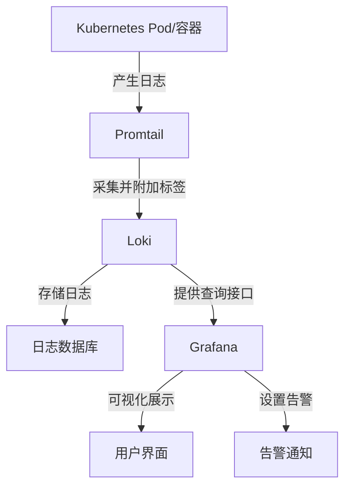

# Kubernetes 日志采集分析与告警

## 学习目标
1. 理解 Kubernetes 日志采集的基本概念和重要性。
2. 掌握 Loki 日志系统的核心原理和组件（Promtail、Loki、Grafana）。
3. 学会在 Kubernetes 环境中部署日志采集系统。
4. 能够通过 Grafana 可视化日志并设置告警。

## 第一部分：Loki 原理

### 1.1 为什么需要日志采集和分析？
- **什么是日志？** 日志是程序运行时记录的关键信息，类似于“运行日记”，记录了程序在某个时间点的行为。例如，Web 服务器可能记录“2025-08-21 20:23: 用户张三登录成功”。日志主要用于排查问题（如程序崩溃原因）或监控系统运行状态。
- **Kubernetes 中的挑战**：在 Kubernetes 集群中，成百上千个容器（Pod）运行在不同节点上，每个容器都会产生日志。手动登录到每个节点查看日志效率极低，且 Pod 重启或节点故障可能导致日志丢失。
- **日志采集的作用**：通过工具自动收集所有容器的日志，集中存储到一个地方，方便统一管理和查看。
- **日志分析的价值**：从日志中提取有用信息，例如发现应用凌晨频繁报错或接口响应缓慢，从而优化系统或提前预警问题。
- **举例**：电商网站用户反馈下单失败，若没有集中日志系统，你需要逐个检查服务器日志，耗时长；有了日志系统，可快速定位到支付接口超时问题并修复。

### 1.2 Loki 简介
- **Loki 是什么？** Loki 是 Grafana Labs 开发的一款日志管理系统，专为 Kubernetes 等复杂环境设计，类似于 Prometheus，但专注于日志而非指标。
- **Loki 的优势**：
  - **高效存储**：Loki 只为日志的“标签”建索引，而非每条日志内容，查询速度快，资源占用少。
  - **成本低**：相比传统日志工具，Loki 存储和计算需求更低。
  - **举例**：一个 Kubernetes 集群每天产生 1GB 日志，用传统工具可能需要高配服务器和大量存储，而 Loki 用普通服务器即可高效运行。

### 1.3 Loki 日志系统的核心组件
Loki 系统由三个核心组件组成，协同工作实现日志采集、存储和展示：

- **Promtail**：日志“采集员”，运行在 Kubernetes 每个节点上，负责从容器读取日志，附加标签（如应用名、命名空间），然后发送到 Loki。
  - **举例**：Promtail 从 Nginx 容器读取访问日志“用户访问 /home”，打上标签 `app="nginx"`，再发送到 Loki。
- **Loki**：日志“存储库”和“查询中心”，接收 Promtail 发送的日志并存储（支持本地磁盘或云存储），同时提供查询接口。
  - **举例**：查询过去 1 小时 Nginx 错误日志，Loki 根据标签 `app="nginx"` 快速返回结果。
- **Grafana**：日志“展示窗口”，通过连接 Loki，在网页界面上可视化展示日志、绘制图表，并支持设置告警。
  - **举例**：在 Grafana 输入查询条件，查看 Nginx 错误日志列表，若错误激增，可自动收到邮件告警。

### 1.4 Loki 日志采集流程
以下是日志从产生到展示的简化流程图，帮助直观理解整个过程：



**流程举例**：
1. Kubernetes Pod 中的 Web 应用产生日志“用户登录失败”。
2. Promtail 读取日志，打上标签 `app="webapp", level="error"`。
3. Promtail 将日志发送到 Loki 服务器存储。
4. 通过 Grafana 查询 `{app="webapp", level="error"}`，获取相关日志并以图表展示。
5. 若设置告警规则（如错误日志超 10 条），Grafana 自动发送通知。

### 1.5 Loki 的标签（Labels）机制
- **什么是标签？** 标签是 Loki 的核心机制，用键值对描述日志来源和属性，如 `app="nginx"` 表示日志来自 Nginx，`namespace="default"` 表示来自 default 命名空间。
- **标签的重要性**：Loki 仅对标签建索引，而非日志内容，极大提升查询效率，降低存储成本。
- **举例**：有 100 万条日志，查询 `{app="nginx"}` 时，Loki 快速定位所有 Nginx 日志；再查询 `{app="nginx"} |= "error"`，则在 Nginx 日志中筛选含“error”的内容，效率极高。

### 1.6 LogQL 查询语言简介
- **LogQL 是什么？** LogQL 是 Loki 提供的查询语言，类似 SQL，专为日志查询设计，简单易用。
- **基础查询举例**：
  - 所有 Nginx 日志：`{app="nginx"}`
  - Nginx 含“error”的日志：`{app="nginx"} |= "error"`
  - Nginx 不含“info”的日志：`{app="nginx"} != "info"`
- **高级查询举例**：统计过去 1 小时 Nginx 错误日志数量：`sum(rate({app="nginx"} |= "error" [1h]))`
- **说明**：LogQL 后续课程会深入讲解，初学者先了解可通过标签和关键字快速定位日志。

### 1.7 为什么选择 Loki？
- **轻量级**：相比传统日志系统（如 ELK 栈：Elasticsearch、Logstash、Kibana），Loki 占用的 CPU、内存和存储成本更低。
  - **举例**：小型 Kubernetes 集群用 ELK 可能需 3 台高配服务器，而 Loki 1 台普通服务器即可。
- **Kubernetes 集成**：Loki 和 Promtail 天然支持 Kubernetes，自动发现 Pod 和标签，部署简便。
- **Grafana 兼容**：若已用 Grafana 监控其他数据（如 Prometheus 指标），添加 Loki 作为日志数据源无缝衔接。


## 第二部分：Loki 系统整体架构和部署准备

### 2.1 Kubernetes 日志管理的核心挑战
在 Kubernetes 环境中，日志管理面临以下核心挑战，这些问题凸显了集中化日志系统的必要性：
- **存储空间限制**：容器日志由 kubelet 管理，存储在节点文件系统（如 `/var/log/containers`），磁盘空间有限，日志会轮转（rotation），旧日志可能被覆盖或删除。
- **日志生命周期问题**：日志与 Pod 生命周期绑定，若 Pod 被删除或重新调度到其他节点，日志可能丢失。
- **分散管理效率低**：通过 `kubectl logs` 查看单个 Pod 日志尚可，但在大规模集群中，逐个排查日志耗时长，效率极低。
- **缺乏持久化机制**：Kubernetes 本身不提供内置的日志持久化功能，节点故障或重启可能导致日志永久丢失。
- **分布式环境挑战**：多节点、多 Pod 环境下，日志分散在不同节点，难以统一管理和查询。
- **举例**：假设一个应用由 50 个 Pod 组成，分布在阿里云 Kubernetes 集群（ACK）的 5 个节点上，若某用户反馈问题，你需要逐个节点检查日志，可能耗费数小时，且 Pod 重启后日志可能已丢失。

### 2.2 Loki 系统的价值
Loki 作为轻量级日志管理系统，针对 Kubernetes 的日志管理痛点提供了高效解决方案：
- **集中化存储**：通过 Promtail 从各节点和 Pod 采集日志，集中存储到 Loki，避免日志分散。
- **持久化存储**：支持多种存储后端（如本地文件系统、阿里云 OSS），确保日志长期保存，不受 Pod 或节点生命周期影响。
- **高效查询**：基于标签（Labels）索引日志，结合 LogQL 查询语言，快速定位特定应用或 Pod 的日志。
- **可视化与告警**：通过 Grafana 集成，提供直观的日志查询界面和图表展示，支持设置告警规则。
- **动态扩展**：支持分布式部署，适应大规模集群的日志量需求。
- **举例**：在阿里云 ACK 集群中，Pod 重启后日志丢失问题，Loki 通过集中存储到阿里云 OSS 解决；面对大规模日志，Loki 能快速查询特定应用的错误日志，并通过 Grafana 告警通知。

### 2.3 Loki 整体架构简介
Loki 系统的架构设计清晰，各组件分工明确，共同完成日志从采集到展示的全流程：
- **架构组件回顾**：
  - **Promtail**：日志采集代理，运行在每个节点，负责从容器读取日志、附加标签，并发送到 Loki。
  - **Loki**：核心服务，负责日志存储和查询，支持多种存储后端。
  - **Grafana**：可视化工具，连接 Loki 提供日志展示、分析和告警功能。
- **架构流程**：Pod 产生日志 → Promtail 采集并打标签 → Loki 接收并存储 → Grafana 查询和展示。
- **举例**：在阿里云 ACK 集群中，一个 Web 应用 Pod 产生“登录失败”日志，Promtail 采集并标记 `app="webapp"`，Loki 存储后，你通过 Grafana 查询 `{app="webapp"}`，快速定位问题。
- **架构图**（延续第一部分的 Mermaid 图，略）。

### 2.4 Loki 部署模式简介
Loki 支持多种部署模式，适应不同规模和需求的 Kubernetes 环境，特别是在阿里云 ACK（阿里云容器服务 Kubernetes）上部署时，可结合阿里云资源优化：
- **单体模式（Monolithic Mode）**：
  - 所有 Loki 组件（如存储、查询）运行在单个实例中，配置简单，资源占用小。
  - 适用场景：测试环境、小型阿里云 ACK 集群、学习用途。
  - 限制：不适合高负载场景，日志量大时性能受限。
  - **举例**：在阿里云 ACK 上学习 Loki 时，可在单台 ECS 实例或少量节点上部署单体模式，快速体验完整功能。
  - **架构图**：
    ```mermaid
    graph TD
        A[Kubernetes Pod/容器] -->|产生日志| B[Promtail]
        B -->|采集并发送| C[Loki 单体实例<br>（包含所有组件：存储、查询等）]
        C -->|存储日志| D[存储后端<br>（如阿里云 OSS）]
        C -->|查询接口| E[Grafana]
        E -->|可视化展示| F[用户界面]
    ```
    **说明**：在单体模式下，Loki 作为一个整体运行在一个容器或进程中，负责所有功能（日志接收、存储、查询等），适合资源有限的小型环境。

- **分布式模式（Microservices Mode）**：
  - 将 Loki 拆分为多个微服务组件（如 Ingester、Querier、Distributor），各组件独立运行，支持水平扩展，可结合阿里云 SLB（负载均衡）实现高可用。
  - 适用场景：生产环境、大规模阿里云 ACK 集群、高日志量场景。
  - 挑战：配置复杂，需更多资源和管理。
  - **举例**：在阿里云 ACK 上管理 TB 级日志量时，通过分布式模式部署 Loki，结合阿里云弹性伸缩（Auto Scaling）动态调整资源。
  - **架构图**：
    ```mermaid
    graph TD
        A[Kubernetes Pod/容器] -->|产生日志| B[Promtail]
        B -->|采集并发送| C[Distributor<br>（分发器：接收日志）]
        C -->|分发日志| D[Ingester 1<br>（写入器：写入日志）]
        C -->|分发日志| E[Ingester 2<br>（写入器：写入日志）]
        D -->|存储| F[存储后端<br>（如阿里云 OSS/Tablestore）]
        E -->|存储| F
        G[Querier 1<br>（查询器：处理查询）] -->|读取| F
        H[Querier 2<br>（查询器：处理查询）] -->|读取| F
        I[Grafana] -->|查询请求| J[阿里云 SLB<br>（负载均衡）]
        J -->|分发查询| G
        J -->|分发查询| H
        I -->|可视化展示| K[用户界面]
    ```
    **说明**：在分布式模式下，Loki 被拆分为多个独立组件，Distributor 负责接收日志并分发给多个 Ingester 写入存储，Querier 负责处理查询请求，各组件可独立扩展，适合大规模、高并发的生产环境。通过阿里云 SLB 实现查询请求的负载均衡，提升系统可靠性。

- **部署工具**：常用 Helm Chart 部署，阿里云 ACK 支持 Helm 应用市场，可直接通过 ACK 控制台或命令行快速安装 Loki。

### 2.5 Loki 存储选项简介（适配阿里云）
Loki 支持多种存储后端，结合阿里云服务可实现更高效的持久化和扩展性：
- **文件系统（Filesystem）**：
  - 日志存储在本地磁盘，配置简单，适合测试或小型环境。
  - 限制：不适合分布式部署，阿里云 ECS 节点故障可能丢失数据。
  - **举例**：在阿里云 ACK 学习时，可用 ECS 本地文件系统存储日志，成本低，易上手。
- **对象存储（阿里云 OSS）**：
  - 将日志存储在阿里云对象存储服务（OSS）中，持久性高，支持分布式部署，性价比高。
  - 适用场景：生产环境，需要高可用和持久化。
  - **优势**：OSS 提供无限存储容量，按量计费，结合 Loki 的压缩存储可大幅降低成本。
  - **举例**：在阿里云 ACK 上使用 OSS 存储日志，即使 Loki 服务器宕机，日志数据仍安全存储于 OSS，可随时恢复。
- **数据库（如阿里云 Tablestore）**：
  - 阿里云 Tablestore 是一种高性能 NoSQL 数据库，支持大规模数据存储和高并发查询，适合分布式 Loki 部署。
  - 挑战：配置复杂，成本较高。
  - **举例**：在阿里云 ACK 上管理超大规模日志时，可选择 Tablestore 作为 Loki 存储后端，确保扩展性和可靠性。
- **选择建议**：测试环境用文件系统，生产环境优先阿里云 OSS（成本和持久性平衡），超大规模场景可考虑 Tablestore。


## 第三部分：阿里云 OSS 存储桶原理

在 Loki 的部署与配置实操中，我们选择阿里云 OSS（对象存储服务）作为日志数据的存储后端。为了更好地理解为什么使用 OSS 以及如何与 Loki 集成，本节将深入探讨 OSS 的基本原理、架构设计、核心特性和工作机制。

### 3.1 阿里云 OSS 基本概念与原理
阿里云 OSS（Object Storage Service）是一种面向互联网的分布式存储服务，专门为存储海量非结构化数据（如日志、图片、视频等）设计。它通过简单的 RESTful API 和 S3 兼容接口提供数据访问，适用于云原生应用和分布式系统的存储需求。

- **对象存储的核心概念**：
  - **对象（Object）**：OSS 中存储的基本单位，每个对象包含数据、元数据和唯一标识符（Key）。例如，Loki 存储的日志块可以看作一个个对象。
  - **存储桶（Bucket）**：对象的容器，所有对象必须存储在某个 Bucket 中。Bucket 名称全局唯一，类似于文件系统中的根目录。
  - **地域（Region）**：Bucket 所在的地理位置，影响访问延迟和成本。选择与阿里云 ACK 集群相同地域可优化性能。
- **设计原理**：
  - OSS 采用分布式架构，数据分散存储在多个物理设备上，通过多副本机制（默认 3 副本）确保高可靠性和耐久性（99.9999999999%，即 12 个 9）。
  - 提供无限容量扩展能力，按使用量计费，无需提前规划存储空间。
  - 支持分层存储（如标准存储、低频访问、归档存储），用户可根据数据访问频率选择合适的存储类型，优化成本。

- **举例**：在 Loki 场景中，日志数据被切分成小块（Chunks），每个块作为独立对象存储在 OSS 的 Bucket 中，Loki 通过对象的 Key（如时间戳+标签）快速定位和读取日志。

### 3.2 阿里云 OSS 架构与工作机制
OSS 是一个高度分布式的存储系统，其架构设计确保了高可用性、可扩展性和安全性。以下是其核心架构和工作原理：

- **架构组成**：
  - **前端访问层**：负责接收用户请求，提供 RESTful API 和 S3 兼容接口，支持 HTTP/HTTPS 访问。用户（或 Loki）通过 AccessKey 认证后可上传、下载或删除对象。
  - **分布式存储层**：核心数据存储模块，数据被切分并存储在多个节点上，通过 erasure coding（纠删码）和多副本技术实现数据冗余和容错。
  - **元数据管理层**：存储和管理对象的元数据（如大小、创建时间、Key），支持高效查询和索引。
  - **负载均衡与缓存**：通过阿里云 SLB（负载均衡）和 CDN（内容分发网络）优化访问速度，减少延迟。
- **工作机制**：
  1. **数据写入**：Loki 将日志数据封装为对象，通过 S3 API 上传到指定 Bucket。OSS 接收后，将数据切分并存储到多个节点，同时生成元数据记录对象信息。
  2. **数据读取**：Loki 查询日志时，根据对象 Key 通过 API 请求 OSS，OSS 定位数据位置并返回给 Loki。
  3. **数据保护**：OSS 自动维护多副本，即使某个节点故障，系统会从其他副本恢复数据，确保不丢失。
  4. **访问控制**：通过 AccessKey 和 RAM 权限策略，限制对 Bucket 和对象的访问，确保数据安全。

- **在 Loki 中的流程**：
  - Loki 的 Ingester 组件将日志流切分为 Chunks（日志块），通过 S3 API 上传到 OSS Bucket。
  - 日志元数据（如标签、时间范围）存储在 Loki 内存或本地索引中，而实际日志内容存储在 OSS。
  - 查询时，Loki 的 Querier 组件根据索引定位所需对象 Key，从 OSS 下载对应日志块并返回给用户（如通过 Grafana 展示）。

- **举例**：假设 Loki 每小时生成一个日志块，Key 格式为 `chunks/2025/08/21/13`，存储在 Bucket `loki-log-storage` 中。查询当天日志时，Loki 会批量请求相关 Key，从 OSS 获取数据。

### 3.3 阿里云 OSS 核心特性与优势
OSS 作为 Loki 存储后端，具有以下特性，非常适合云原生日志管理场景：
- **S3 兼容性**：Loki 原生支持 S3 协议作为存储后端，无需额外开发即可直接配置 OSS（只需指定 Endpoint 和 AccessKey）。
- **高可靠性**：多副本存储和自动容错机制，确保日志数据不会因硬件故障丢失，满足生产环境需求。
- **低成本与分层存储**：支持多种存储类型，日志数据可先存储在标准存储，长时间未访问的数据可转入低频或归档存储，降低成本。
- **弹性扩展**：支持无限容量扩展，日志量增长时无需担心存储瓶颈，特别适合 TB 级甚至 PB 级日志场景。
- **全球加速**：结合阿里云 CDN 和多地域部署，优化跨地域访问速度，适合分布式团队查询日志。
- **安全机制**：支持服务器端加密、访问控制列表（ACL）和 RAM 权限管理，确保日志数据安全，防止未授权访问。

- **举例**：在阿里云 ACK 集群中，Loki 每天生成 100GB 日志，初期使用标准存储（约 0.12 元/GB/月），成本约 12 元/月；半年后将旧日志转入归档存储（约 0.005 元/GB/月），成本大幅降低。

### 3.4 阿里云 OSS 在 Loki 中的配置原理
在 Loki 配置中，OSS 通过 S3 兼容模式集成，具体配置参数映射如下：
- **Bucket 名称**：对应 OSS 的 Bucket，如 `loki-log-storage`，Loki 将不同类型数据（如 Chunks、索引）存储在同一 Bucket 的不同前缀下。
- **Endpoint**：OSS 的访问端点，如 `oss-cn-hangzhou.aliyuncs.com`，根据 Bucket 地域选择，确保低延迟。
- **Region**：地域代码，如 `cn-hangzhou`，用于定位 Bucket。
- **AccessKey ID 和 Secret**：用于认证，Loki 通过这些密钥以编程方式访问 OSS，确保安全通信。
- **存储路径**：Loki 可配置不同数据类型的存储路径（如 `chunks/`、`ruler/`），在 OSS 中表现为对象 Key 的前缀，方便分类管理。

- **配置示例**（对应 `loki-values.yaml` 文件片段）：
  ```yaml
  loki:
    structuredConfig:
      storage:
        type: s3
        s3:
          bucketNames:
            chunks: loki-log-storage
            ruler: loki-log-storage
            admin: loki-log-storage
          endpoint: oss-cn-hangzhou.aliyuncs.com
          region: cn-hangzhou
          secretAccessKey: <你的 AccessKey Secret>
          accessKeyId: <你的 AccessKey ID>
  ```
  **说明**：Loki 将日志块（Chunks）存储在 `loki-log-storage` Bucket 中，访问端点为杭州地域的 OSS 服务地址，通过 AccessKey 认证。

### 3.5 阿里云 OSS 使用中的注意事项
- **地域选择**：Bucket 地域应与 ACK 集群一致，避免跨地域访问导致高延迟和高成本。
- **权限管理**：建议为 Loki 创建专用子账号和 AccessKey，限制权限仅访问特定 Bucket，避免权限过大导致安全风险。
- **成本监控**：定期检查 OSS 使用量和计费情况，避免因日志量激增导致费用超支，可设置预算告警。
- **生命周期管理**：配置 Bucket 生命周期规则，将旧日志转入低频或归档存储，甚至设置过期删除，优化存储成本。
- **性能优化**：对于高频查询的日志，可结合 OSS 的“加速域名”或 CDN 服务，提升访问速度。

- **举例**：设置生命周期规则，将 30 天前的日志从标准存储转为低频访问存储，90 天前的转为归档存储，365 天前的自动删除，显著降低长期存储成本。

### 3.6 总结
阿里云 OSS 是一种高可靠、低成本、可扩展的对象存储服务，其 S3 兼容性和分布式架构非常适合作为 Loki 的日志存储后端。通过将日志数据持久化存储在 OSS 中，Loki 不仅实现了数据的高可用性和安全性，还能灵活应对日志量的增长。理解 OSS 的基本原理和工作机制，有助于我们在部署 Loki 时优化存储配置，确保系统性能和成本的平衡。


## 第四部分：Loki 部署与配置实操（基于阿里云 ACK）

在了解了 Loki 的整体架构和部署模式后，本部分将进入实际操作环节。我们将在阿里云 ACK（阿里云容器服务 Kubernetes）环境中部署 Loki，采用**单体模式**（Monolithic Mode）以简化操作，并使用阿里云 OSS 作为存储后端，同时安装 Grafana 用于日志可视化。以下是详细步骤，适合初学者或测试环境。

### 3.1 前置条件检查
在开始部署前，请确保以下条件已满足：
- **阿里云 ACK 集群就绪**：已创建并能通过 `kubectl` 访问集群（可通过命令 `kubectl get nodes` 确认节点状态）。
- **Helm 工具安装**：已安装 Helm 客户端（版本 3.x），可通过命令 `helm version` 确认。
- **阿里云账号权限**：具备创建 OSS 存储桶和获取访问密钥（AccessKey）的权限。
- **本地环境**：已配置好 `kubectl` 连接到阿里云 ACK 集群。

**举例**：运行 `kubectl get nodes` 应返回类似输出：
```
NAME            STATUS   ROLES    AGE   VERSION
cn-hangzhou-a   Ready    <none>   1d    v1.24.6-aliyun.1
cn-hangzhou-b   Ready    <none>   1d    v1.24.6-aliyun.1
```
如果未满足条件，请先完成集群创建或工具安装（可参考阿里云官方文档）。

### 3.1 前置条件的helm安装
#### 1. 在 Ubuntu (Linux) 或者 macOS 上安装 Helm

Ubuntu 系统的安装步骤如下，使用官方提供的脚本快速安装 Helm 3。声明本地不翻墙安装不了

##### 步骤：
1. 下载 Helm 安装脚本：
   ```bash
   curl -fsSL -o get_helm.sh https://raw.githubusercontent.com/helm/helm/main/scripts/get-helm-3
   ```
2. 给脚本添加执行权限：
   ```bash
   chmod 700 get_helm.sh
   ```
3. 执行脚本安装 Helm：
   ```bash
   ./get_helm.sh
   ```

##### 验证安装：
安装完成后，可以通过以下命令检查 Helm 是否安装成功：
```bash
helm version
```
如果输出类似 `version.BuildInfo{Version:"v3.x.x", ...}` 的信息，说明安装成功。


#### 2. 在 Windows 上安装 Helm

Windows 系统需要下载 Helm 的安装包并手动配置环境变量。

##### 步骤：
1. **下载安装包**：
   访问以下链接下载 Helm 的 Windows 版本（以 v3.18.6 为例）：
   [https://get.helm.sh/helm-v3.18.6-windows-amd64.tar.gz](https://get.helm.sh/helm-v3.18.6-windows-amd64.tar.gz)

2. **解压文件**：
   将下载的 `helm-v3.18.6-windows-amd64.tar.gz` 文件解压，得到 `helm.exe` 可执行文件。

3. **放置到指定目录**：
   将 `helm.exe` 文件移动到一个固定目录，例如 `C:\helm\`。如果该目录不存在，请先创建。

4. **配置环境变量**：
   - 右键点击“此电脑”或“我的电脑”，选择“属性”。
   - 点击“高级系统设置” -> “环境变量”。
   - 在“系统变量”下找到“Path”，点击“编辑”。
   - 点击“新建”，添加路径 `C:\helm`（确保路径指向 `helm.exe` 所在的目录）。
   - 点击“确定”保存更改。

5. **验证安装**：
   打开命令提示符（CMD）或 PowerShell，输入以下命令：
   ```cmd
   helm version
   ```
   如果输出 Helm 的版本信息，说明安装成功。


### 3.2 创建阿里云 OSS 存储桶并配置权限
Loki 需要持久化存储日志数据，我们使用阿里云 OSS（对象存储服务）作为存储后端。

#### 步骤 1：创建 OSS 存储桶
1. 登录阿里云控制台，进入 **对象存储 OSS** 服务页面。
    
2. 点击 **创建 Bucket**，填写以下信息：
   - **Bucket 名称**：如 `loki-log-storage`（名称全局唯一，建议加上个人标识）。
   - **地域**：选择与 ACK 集群相同或相近地域（如 `华东 1（杭州）`），减少延迟。
   - **存储类型**：选择 **标准存储**（成本和性能平衡）。
   - **访问权限**：选择 **私有**（后续通过密钥访问）。
   
   
3. 点击 **确定** 创建存储桶。

#### 步骤 2：获取 AccessKey 访问密钥 （还记得我给你们的账号密码吗？里面有秘钥）

1. 在阿里云控制台右上角，点击个人头像，选择 **AccessKey 管理**。
2. 如果已有 AccessKey，可直接使用；否则点击 **创建 AccessKey**，生成新的 AccessKey ID 和 AccessKey Secret（注意保存，创建后 Secret 不可再次查看）。
3. 记录下 AccessKey ID 和 Secret，稍后配置 Loki 时需要使用。

#### 步骤 3：为 AccessKey 授权 OSS 权限 （不用了，我们是最大）
1. 进入 **RAM 访问控制** 页面，选择 **用户**，找到对应 AccessKey 所属的子账号（或创建新子账号）。
2. 为该用户添加权限策略 `AliyunOSSFullAccess`（完全访问 OSS 权限），或自定义策略仅允许访问特定 Bucket。
3. 保存权限配置。

**举例**：创建的 Bucket 名称为 `loki-log-storage`，AccessKey ID 为 `LTAI5tXXXXX`，Secret 为 `XXXXXXXX`（请妥善保存，避免泄露）。

### 3.3 安装 Helm Chart 并部署 Loki（单体模式）
我们使用 Helm Chart 快速部署 Loki，结合阿里云 OSS 作为存储后端。

#### 步骤 1：添加 Loki Helm 仓库
在本地终端运行以下命令，添加 Grafana 官方 Helm 仓库：
```bash
helm repo add grafana https://grafana.github.io/helm-charts
helm repo update
```

#### 步骤 2：创建 Loki 配置文件
创建一个自定义配置文件 `loki-values.yaml`，用于指定单体模式和 OSS 存储配置。内容如下：
```yaml
loki:
  structuredConfig:
    storage:
      type: s3
      s3:
        bucketNames:
          chunks: loki-log-storage
          ruler: loki-log-storage
          admin: loki-log-storage
        endpoint: oss-cn-hangzhou.aliyuncs.com
        region: cn-hangzhou
        secretAccessKey: <你的 AccessKey Secret>
        accessKeyId: <你的 AccessKey ID>
    replication_factor: 1
  singleBinaryReplicas: 1

promtail:
  enabled: true
```

**参数说明**：
- `storage.type: s3`：指定使用 S3 兼容存储（阿里云 OSS 支持 S3 协议）。
- `bucketNames`：指定 OSS Bucket 名称（替换为前面创建的 Bucket，如 `loki-log-storage`）。
- `endpoint`：OSS 地域端点，根据 Bucket 地域调整（如杭州为 `oss-cn-hangzhou.aliyuncs.com`）。
- `region`：OSS 地域代码（如 `cn-hangzhou`）。
- `secretAccessKey` 和 `accessKeyId`：替换为前面获取的阿里云 AccessKey 信息。
- `singleBinaryReplicas: 1`：指定单体模式，运行一个 Loki 实例。

#### 步骤 3：安装 Loki
在本地终端运行以下命令，安装 Loki 和 Promtail：
```bash
helm install loki grafana/loki -n loki --create-namespace -f loki-values.yaml
```

**命令说明**：
- `install loki`：安装名为 `loki` 的 Helm 发布。
- `grafana/loki`：使用 Grafana 仓库中的 Loki Chart。
- `-n loki --create-namespace`：在 `loki` 命名空间中安装，若命名空间不存在则自动创建。
- `-f loki-values.yaml`：使用自定义配置文件。

#### 步骤 4：验证 Loki 部署
检查 Loki 和 Promtail 是否正常运行：
```bash
kubectl get pods -n loki
```

预期输出类似：
```
NAME                    READY   STATUS    RESTARTS   AGE
loki-0                  1/1     Running   0          2m
loki-promtail-XXXXX     1/1     Running   0          2m
```
- `loki-0`：Loki 单体实例。
- `loki-promtail-XXXXX`：Promtail 采集代理，运行在各节点上。

### 3.4 安装 Grafana 用于日志可视化
Grafana 用于连接 Loki，查询和展示日志数据。

#### 步骤 1：添加 Grafana Helm 仓库
如果之前未添加 Grafana 仓库，可重复添加：
```bash
helm repo add grafana https://grafana.github.io/helm-charts
helm repo update
```

#### 步骤 2：安装 Grafana
运行以下命令安装 Grafana：
```bash
helm install grafana grafana/grafana -n grafana --create-namespace
```

#### 步骤 3：获取 Grafana 管理员密码
安装完成后，获取 Grafana 默认管理员密码：
```bash
kubectl get secret --namespace grafana grafana -o jsonpath="{.data.admin-password}" | base64 --decode ; echo
```

记录输出的密码，默认用户名为 `admin`。

#### 步骤 4：访问 Grafana UI
将 Grafana 服务暴露出来（临时测试可用 port-forward）：
```bash
kubectl port-forward service/grafana 3000:80 -n grafana
```

在本地浏览器访问 `http://localhost:3000`，使用用户名 `admin` 和前面获取的密码登录。

#### 步骤 5：配置 Loki 数据源
1. 登录 Grafana 后，点击左侧菜单 **Configuration（齿轮图标）** > **Data Sources** > **Add data source**。
2. 选择 **Loki** 类型。
3. 在 **URL** 字段输入 Loki 服务地址：
   ```
   http://loki.loki.svc.cluster.local:3100
   ```
   （此地址为 Kubernetes 内部服务地址，假设 Loki 部署在 `loki` 命名空间）。
4. 点击 **Save & Test**，确认连接成功。

### 3.5 验证日志采集与查询
1. 在 Grafana 界面，点击左侧菜单 **Explore**。
2. 选择数据源为 **Loki**，在查询框输入简单 LogQL 查询语句，如：
   ```
   {job="varlogs"}
   ```
   （查询系统日志，具体标签视环境而定）。
3. 点击 **Run Query**，查看是否能正常显示日志数据。

**举例**：如果集群中有应用 Pod 产生日志，Promtail 会采集并发送到 Loki，Grafana 可查询到类似输出：
```
2025-08-21T13:05:00Z [INFO] app: "webapp" message: "User login failed"
```

### 3.6 总结与常见问题排查
- **总结**：通过以上步骤，我们完成了阿里云 OSS 存储桶创建、Loki 单体模式部署（包含 Promtail 采集）和 Grafana 安装，并在 Grafana 中成功连接 Loki 数据源，实现了日志的可视化查询。
- **常见问题**：
  - **Loki Pod 启动失败**：检查日志（`kubectl logs loki-0 -n loki`），确认 OSS 配置是否正确（Bucket 名称、AccessKey 等）。
  - **Grafana 无法连接 Loki**：确认 Loki 服务地址是否正确，可通过 `kubectl get svc -n loki` 查看服务名称和端口。
  - **无日志显示**：确认 Promtail 是否正常运行（`kubectl get pods -n loki`），以及 Pod 是否有日志输出。

