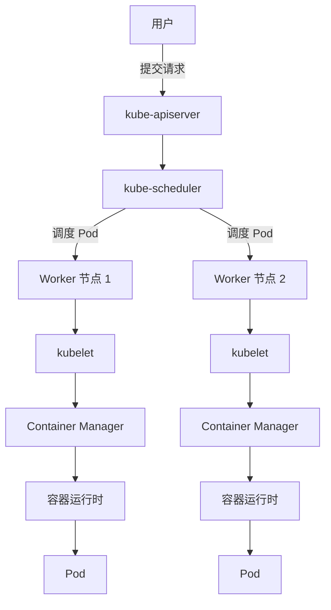
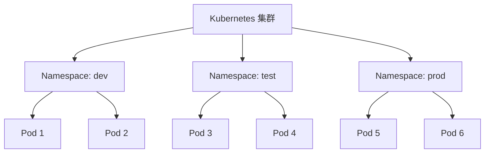

# 第1天：Pod 与配置管理（ConfigMap 和 Secret）

## 目标
- 掌握 Pod 的基本操作，包括创建、生命周期管理、资源限制和健康检查。
- 理解并实践 Namespace 的使用，学习资源隔离。
- 掌握 ConfigMap 和 Secret 的使用，学习如何管理配置和敏感数据。
- 结合命令行（`kubectl`）和 Kuboard 界面操作，帮助学员直观理解 Kubernetes 管理。
- 通过理论和实践结合，为后续部署案例打下基础。


## 第一部分：Namespace 与 Kubernetes 基础与 Pod 定位

### 什么是 Kubernetes？——从零开始理解容器编排

#### 为什么需要 Kubernetes？

想象一下，你是一个餐厅的经理，手下有很多厨师（就像服务器上的应用程序），每个厨师都在忙着做不同的菜（运行不同的容器）。如果没有一个好的管理系统，厨师们可能会互相抢占厨房资源（CPU、内存），有的菜做不出来（应用崩溃），有的菜做多了浪费（资源闲置）。这时候，你需要一个“超级调度员”来协调一切：谁用哪个炉灶、谁先做哪道菜、怎么保证厨房高效运转。这个“超级调度员”就是 Kubernetes。

Kubernetes（简称 K8s）是一个开源的容器编排平台，它就像餐厅里的经理，专门管理成百上千个容器（应用程序的最小运行单位），确保它们在服务器集群中高效、安全地运行。它的主要任务包括：
- **自动部署**：帮你快速把应用放到服务器上，不用手动操作。
- **资源调度**：合理分配服务器资源（CPU、内存、存储），避免浪费或冲突。
- **自动扩展**：当用户访问量增加时，自动增加应用副本；访问量减少时，自动减少副本。
- **故障恢复**：如果某个应用挂了，Kubernetes 会自动重启或替换它，保证服务不中断。

#### Kubernetes 的核心组件——认识“大家庭”

Kubernetes 是一个大系统，里面有很多“家庭成员”各司其职。以下是几个核心组件，理解它们就像认识餐厅里的不同岗位：

- **Master 节点（大脑）**：这是 Kubernetes 的“指挥中心”，负责决策和调度。Master 节点包含以下关键部分：
  - **kube-apiserver**：相当于“前台接待员”，接收用户的所有请求（比如创建应用、查看状态），然后转发给其他组件。
  - **kube-scheduler**：相当于“调度员”，决定哪个应用（Pod）应该运行在哪个服务器（节点）上，确保资源分配合理。
  - **kube-controller-manager**：相当于“监管员”，不断检查集群状态，确保一切按计划运行，比如应用数量是否正确。它包含多个控制器，比如 Replication Controller、Deployment Controller 等，分别管理不同的资源。
  - **etcd**：相当于“记账本”，存储集群的所有配置和状态信息，是 Kubernetes 的“数据库”。

- **Worker 节点（工人）**：这是“干活的地方”，实际运行你的应用。每个 Worker 节点包含：
  - **kubelet**：相当于“现场监工”，负责在节点上创建、运行、监控应用（Pod），并向 Master 汇报情况。
  - **kube-proxy**：相当于“网络管理员”，管理节点上的网络流量，确保应用之间、应用与外界能正常通信。
  - **容器运行时**：比如 Docker、containerd 等，相当于“工具箱”，真正运行容器的引擎，负责拉取镜像、启动容器、停止容器等具体操作。

#### Container Manager（容器管理器）——“工具箱”的管理者

在 Worker 节点中，Container Manager（容器管理器）是一个非常重要的角色，虽然它不像 Master 节点的组件那样“高调”，但却是实际运行容器的“幕后英雄”。容器管理器是 Kubernetes 与容器运行时之间的“桥梁”，负责管理容器的生命周期。

- **什么是 Container Manager？**
  容器管理器是 Kubernetes 用来与容器运行时（如 Docker、containerd、CRI-O）交互的组件，kubelet 通过它来控制容器的创建、启动、停止和删除。简单来说，kubelet 就像一个“监工”，而容器管理器是“监工”手里的“工具”，真正去执行具体的容器操作。

- **为什么需要 Container Manager？**
  Kubernetes 本身并不直接操作容器，它需要一个中间层来统一管理不同的容器运行时工具（比如 Docker 和 containerd 的接口和用法不同）。容器管理器通过 CRI（Container Runtime Interface，容器运行时接口）提供一个标准化的方式，让 Kubernetes 能够兼容多种容器运行时，而不用关心底层实现细节。这就像一个“翻译官”，让 Kubernetes 和不同的“工具箱”无缝沟通。

- **Container Manager 的工作内容**：
  - 接收 kubelet 的指令，比如“启动一个容器”。
  - 调用容器运行时（如 Docker）去拉取镜像、创建容器、配置网络等。
  - 监控容器状态，并将信息反馈给 kubelet。
  - 处理容器停止、删除等操作。

- **举个通俗的例子**：
  假设 kubelet 是“建筑工地的监工”，它接到任务要建一栋房子（运行一个容器），但监工不会自己动手挖地基、砌墙，它会把任务交给“施工队”（容器运行时，如 Docker）。而 Container Manager 就像监工和施工队之间的“协调员”，负责把监工的指令翻译成施工队能听懂的语言，确保房子按要求建好。

在早期的 Kubernetes 中，Docker 是最常用的容器运行时，kubelet 直接通过 Docker 的接口操作容器。后来为了支持更多的容器运行时（如 containerd、CRI-O），Kubernetes 引入了 CRI 标准，Container Manager 就变成了一个抽象层，统一管理这些工具。

#### Kubernetes 集群的运行流程——一个简单的故事

假设你要部署一个网站应用，流程是这样的：
1. 你（用户）通过命令或界面告诉 Kubernetes：“我要部署一个网站应用。”
2. 请求送到 Master 节点的“前台”（kube-apiserver），它记录下来并通知“调度员”（kube-scheduler）。
3. “调度员”查看所有 Worker 节点的情况，挑一个资源最合适的节点，说：“这个应用跑在节点 2 上。”
4. 节点 2 的“监工”（kubelet）接到任务，通过 Container Manager 协调“工具箱”（容器运行时），启动应用（Pod），并不断监控它的状态。
5. 如果应用出了问题，“监工”会报告给 Master，Master 再决定是否重启或换个节点运行。

下图用 Mermaid 流程图直观展示这个过程：



**解释**：用户通过 API 提交请求，Master 节点负责调度，Worker 节点的 kubelet 通过 Container Manager 调用容器运行时，最终让 Pod（应用）运行在合适的节点上。

### Pod 是什么？——Kubernetes 的最小“工人”

#### Pod 的定义与作用

在 Kubernetes 中，Pod 是最小的调度单位，相当于一个“工作小组”。一个 Pod 通常包含一个或多个容器（container），这些容器共享相同的网络和存储资源，就像一个小组的成员共享同一个办公室和文件柜。

为什么不直接用容器而要用 Pod 呢？因为容器是独立的运行单元，但有些应用需要多个容器协作，比如一个 Web 服务器容器和一个日志收集容器，它们需要紧密配合。Pod 就像一个“套装”，把这些容器打包在一起，确保它们在同一个节点上运行，互相通信就像在同一个房间里聊天一样方便。

#### Pod 的特点——为什么这么重要？

- **共享资源**：Pod 内的容器共享 IP 地址和端口，就像住在同一栋房子里的家人，用同一个门牌号和电话号码。它们可以通过 `localhost` 直接通信，不需要额外的网络配置。
- **生命周期短暂**：Pod 通常是临时的，可能会因为任务完成、故障或调度需要被销毁和重建。Kubernetes 会通过控制器（如 Deployment）确保 Pod 的数量和状态符合你的要求。
- **不可分割**：Pod 是一个整体，Kubernetes 不会把 Pod 内的容器拆开调度，它们要么一起运行在某个节点，要么都不运行。

#### Pod 在 Kubernetes 中的定位

Pod 是 Kubernetes 的“基层工人”，直接运行你的业务逻辑（比如网站、数据库）。它位于整个架构的最底层，接收来自 Master 节点的指令，由 Worker 节点上的 kubelet 负责创建和监控。简单来说：
- 用户定义想要运行的应用（通过 YAML 文件或命令）。
- Master 节点决定 Pod 跑在哪里。
- Worker 节点通过 kubelet 和 Container Manager 让 Pod 真正跑起来。

想象一个工厂：Master 节点是“厂长办公室”，下达生产任务；Worker 节点是“车间”，负责生产；Pod 就是车间里的“生产小组”，完成具体的产品（应用功能）；Container Manager 是“协调员”，确保生产工具（容器运行时）按要求工作。

### Namespace 是什么？——Kubernetes 的“分区管理员”

#### Namespace 的定义与作用

Namespace（命名空间）是 Kubernetes 提供的一种逻辑隔离机制，相当于给集群划分了不同的“区域”或“部门”。在同一个 Kubernetes 集群中，你可能有多个团队、多个项目、多个环境（比如开发环境、测试环境、生产环境），如果不隔离，大家的资源名称可能会冲突，管理也会很混乱。

Namespace 就像在一栋大厦里划分不同的楼层：每个楼层有自己的房间（资源），互不干扰，但都在同一栋楼（集群）里。每个 Namespace 内的资源（如 Pod、ConfigMap）是独立的，名称可以重复，但不会影响其他 Namespace。

#### Namespace 的典型应用场景

- **团队隔离**：开发团队和测试团队各用一个 Namespace，避免误操作对方的资源。
- **环境隔离**：开发环境（dev）、测试环境（test）、生产环境（prod）分别用不同的 Namespace，确保生产环境不会被测试操作影响。
- **权限管理**：通过 Kubernetes 的 RBAC（基于角色的访问控制），可以给不同 Namespace 设置不同权限，比如只允许某些用户访问某个 Namespace。

#### Namespace 的基本操作

- **创建 Namespace**：通过命令行或配置文件创建。
  - 命令行：`kubectl create namespace my-namespace`
  - YAML 文件示例：
    ```yaml
    apiVersion: v1
    kind: Namespace
    metadata:
      name: my-namespace
    ```
- **查看 Namespace**：列出集群中所有的 Namespace。
  - 命令行：`kubectl get namespaces`
- **指定 Namespace**：创建资源时，可以指定它属于哪个 Namespace。
  - 命令行：`kubectl apply -f pod.yaml -n my-namespace`
  - YAML 文件：在 `metadata` 中添加 `namespace` 字段。
- **删除 Namespace**：删除 Namespace 会同时删除它里面的所有资源。
  - 命令行：`kubectl delete namespace my-namespace`

#### Namespace 的可视化理解

下图用 Mermaid 图展示 Namespace 如何隔离资源：



**解释**：Kubernetes 集群就像一个大容器，里面有多个 Namespace（dev、test、prod），每个 Namespace 管理自己的 Pod，互不干扰，就像不同楼层的办公室各自独立运作。

#### Namespace 与 Pod 的关系

Pod 通常属于某个 Namespace。如果你在创建 Pod 时没有指定 Namespace，它会默认放在 `default` 这个 Namespace 里。指定 Namespace 后，Pod 就只能被该 Namespace 内的其他资源或用户访问（除非有特殊权限设置）。这就像一个员工被分配到某个部门，只能使用该部门的资源和工具。

### 总结：Namespace、Kubernetes 基础与 Pod 的关系

- **Kubernetes** 是整个系统的“大脑”和“管理者”，负责协调容器化应用的运行，包含 Master 节点（决策）和 Worker 节点（执行）。
- **Pod** 是 Kubernetes 的最小工作单位，相当于“工人小组”，直接运行你的应用，接收 Master 节点的调度指令，由 Worker 节点上的 kubelet 管理。
- **Container Manager** 是 Kubernetes 与容器运行时之间的“桥梁”，通过 CRI 标准接口，让 kubelet 能够统一管理不同的容器运行时（如 Docker、containerd），确保容器按要求创建和运行。
- **Namespace** 是 Kubernetes 的“分区工具”，通过逻辑隔离让多个团队、项目或环境在同一个集群中和谐共存，避免冲突。


## 第二部分：实践练习——创建 Namespace 与 Pod

### 练习目标

通过本次实践练习，同学们将学会：
- 使用 VMware 准备 Harbor 镜像。
- 使用 `kubectl` 命令创建属于自己的 Namespace（命名空间）。
- 构建、运行和上传 Docker 镜像到 Harbor 私库。
- 在 Kubernetes 集群中创建 Pod，并将其运行在自己创建的 Namespace 中。
- 使用命令行和 Kuboard 界面查看 Pod 状态。

### 前期准备

在开始今天的练习之前，确保你已经完成了以下准备工作：
- **Windows 或 Mac 电脑**：所有操作（除 VMware 部分外）都在自己的 Windows 或 Mac 电脑上完成。
- **kubectl 工具**：已经安装并配置好，可以与 Kubernetes 集群通信。
- **Docker 环境**：已经安装 Docker Desktop，并配置好 `daemon.json` 和 Harbor 私库登录。
- **VMware**：确保 VMware 虚拟机环境已准备好，用于 Harbor 镜像相关操作。
- **Visual Studio Code (VS Code)**：安装并配置好，用于编写 Kubernetes YAML 文件。
- **Kuboard 访问权限**：确保你有权限访问 Kuboard 管理界面，并已知晓登录地址、用户名和密码（由老师提供）。

#### VS Code 插件安装

为了方便编写 Kubernetes YAML 文件和后期学习，推荐安装以下 VS Code 插件：

- **Kubernetes**：提供 Kubernetes 资源支持，包括语法高亮、自动补全和片段。
- **YAML**：提供 YAML 文件的语法高亮、验证和格式化支持。
- **Kube-Extension**：直接与 Kubernetes 集群交互，查看和管理资源。
- **Helm Intellisense**：支持 Helm Charts 的智能提示和语法高亮（可选）。
- **GitLens**：增强 Git 功能，方便跟踪文件版本变更。
- **Prettier - Code formatter**：统一代码格式，支持 YAML 文件格式化。

**安装方法**：
1. 打开 VS Code。
2. 点击左侧扩展图标（或按 `Ctrl + Shift + X`）。
3. 在搜索框中输入插件名称。
4. 点击“安装”按钮。

**使用技巧**：
- 使用插件提供的代码片段，快速生成 Kubernetes 配置。
- 利用 YAML 插件验证配置文件，确保格式正确。
- 通过 Kubernetes 插件直接与集群交互，方便调试。

### 练习步骤

#####步骤 1：打开 VMware 准备 Harbor 镜像

我们首先需要在 VMware 环境中准备 Harbor 镜像相关工作。请按照以下步骤操作：

1. 打开 VMware，启动你的虚拟机环境。
2. 确保虚拟机网络配置正确，可以访问外部网络和 Harbor 私库 `harbor.labworlds.cc`。
3. 如果老师已经在 VMware 环境中为大家准备好相关镜像或项目，直接确认 Harbor 私库是否可访问；如果需要自行准备，请登录 Harbor 私库并确保后续镜像上传和拉取操作顺畅。
   - 登录命令（如果需要）：
     ```bash
     docker login harbor.labworlds.cc
     ```
   - 输入用户名和密码，确保登录成功。

**小贴士**：VMware 环境主要用于模拟服务器或测试环境，确保你的虚拟机已配置好 Docker 和网络，后续镜像构建和上传可能需要用到虚拟机中的资源。

#### 步骤 2：构建和运行 Docker 镜像（在 Windows 或 Mac 电脑上操作）

接下来，我们将在自己的 Windows 或 Mac 电脑上构建 Docker 镜像，并测试运行。确保你已经安装了 Docker 并登录了 Harbor 私库 `harbor.labworlds.cc`。

1. **克隆代码仓库**：
   打开终端（Windows 使用 PowerShell 或 CMD，Mac 使用 Terminal），执行以下命令克隆项目代码：
   ```bash
   git clone https://gitee.com/Tender-Liu/stars-emmision.git
   ```
2. **进入项目目录**：
   ```bash
   cd stars-emmision
   ```
3. **构建 Docker 镜像**：
   使用 `docker build` 命令构建镜像，标签格式为 `harbor.labworlds.cc/stars-emmision/master:日期-名字拼音`。请根据当前日期和自己的名字拼音修改，例如日期 `08061743`（表示 08 月 06 日 17:43），名字 `shiqi`：
   ```bash
   docker build -t harbor.labworlds.cc/stars-emmision/master:08061743-shiqi .
   ```
   **注意**：命令末尾的 `.` 表示在当前目录构建镜像，请不要遗漏。
4. **测试运行镜像**：
   构建完成后，测试镜像是否可以正常运行。执行以下命令，替换为你的镜像标签：
   ```bash
   docker run --rm -p 80:80 harbor.labworlds.cc/stars-emmision/master:08061743-shiqi
   ```
   运行后，打开浏览器访问 `http://localhost`，检查是否能看到应用页面。如果正常显示，说明镜像构建成功。
5. **上传镜像到 Harbor 私库**：
   如果测试没有问题，将镜像上传到 Harbor 私库：
   ```bash
   docker push harbor.labworlds.cc/stars-emmision/master:08061743-shiqi
   ```
   **注意**：确保你已经登录 Harbor 私库（使用 `docker login harbor.labworlds.cc` 命令）。

**小贴士**：Harbor 是一个私有的镜像仓库，老师已经为大家创建好项目，上传镜像后可以在 Kubernetes 中使用这些镜像运行应用。

#### 步骤 3：创建自己的 Namespace（在 Windows 或 Mac 电脑上操作）

我们将使用 `kubectl` 命令创建一个属于自己的命名空间。命名空间名称请使用自己名字的拼音全拼，这样方便老师认识大家。

1. 打开终端（Windows 使用 PowerShell 或 CMD，Mac 使用 Terminal）。
2. 输入以下命令创建 Namespace，替换 `your-pinyin-name` 为你名字的拼音全拼，例如 `zhangwei`：
   ```bash
   kubectl create namespace your-pinyin-name
   ```
3. 验证 Namespace 是否创建成功：
   ```bash
   kubectl get namespaces
   ```
   在输出结果中，你应该能看到自己创建的 Namespace 名称。

**小贴士**：Namespace 就像 Kubernetes 集群中的一个“私人空间”，你可以在这里管理自己的资源，不会与其他同学的资源冲突。

#### 步骤 4：在自己的 Namespace 中创建 Harbor 登录 Secret（在 Windows 或 Mac 电脑上操作）

在 Kubernetes 中，Secret 是一种用于存储敏感信息（如用户名、密码等）的资源。我们需要创建一个 Secret 来存储 Harbor 私库的登录凭据，以便 Kubernetes 在拉取镜像时使用这些凭据进行身份验证。以下是具体操作步骤。

##### 4.1 使用 YAML 文件和 `kubectl` 命令创建 Secret

1. 打开 VS Code，在之前存放 Kubernetes 配置文件的文件夹中新建一个文件，命名为 `secret-harbor-login.yml`。
2. 将以下内容复制到文件中，并确保 Namespace 字段替换为你自己的 Namespace 名称（拼音全拼）。这里提供两种方式：明文方式和已编码方式，你可以根据需要选择。

   **选项 1：以明文形式编写（使用 `stringData` 字段）**  
   如果你希望在 YAML 文件中直接以明文形式编写用户名和密码，可以使用 `stringData` 字段，Kubernetes 会自动将明文转换为 Base64 编码存储在 Secret 中：
   ```yaml
   apiVersion: v1  # 指定 Kubernetes API 的版本
   kind: Secret  # 资源类型，这里是 Secret
   metadata:
     name: secret-harbor-login  # Secret 的名称
     namespace: your-pinyin-name  # 替换为你的 Namespace 名称，例如 zhangwei
   type: kubernetes.io/dockerconfigjson  # Secret 类型，用于存储 Docker 镜像仓库登录信息
   stringData:  # 使用 stringData 字段直接以明文形式输入数据
     .dockerconfigjson: '{"auths":{"harbor.labworlds.cc":{"username":"admin","password":"admin123","auth":"YWRtaW46YWRtaW4xMjM="}}}'  # 明文 JSON 格式的 Docker 配置信息
   ```
   **注意**：
   - 将 `namespace` 字段替换为你的 Namespace 名称（拼音全拼，例如 `zhangwei`）。
   - `stringData` 字段中的内容是明文，Kubernetes 在创建 Secret 时会自动将这些内容编码为 Base64 并存储到 `data` 字段中。
   - 虽然这种方式便于编写和阅读，但不建议在生产环境中使用，因为 YAML 文件可能会被意外共享或存储在版本控制系统中，导致敏感信息泄露。

   **选项 2：以 Base64 编码形式编写（使用 `data` 字段）**  
   如果你希望更安全地处理敏感信息，可以先对数据进行 Base64 编码，然后写入 `data` 字段：
   ```yaml
   apiVersion: v1  # 指定 Kubernetes API 的版本
   kind: Secret  # 资源类型，这里是 Secret
   metadata:
     name: secret-harbor-login  # Secret 的名称
     namespace: your-pinyin-name  # 替换为你的 Namespace 名称，例如 zhangwei
   type: kubernetes.io/dockerconfigjson  # Secret 类型，用于存储 Docker 镜像仓库登录信息
   data:
     .dockerconfigjson: eyJhdXRocyI6eyJoYXJib3IubGFid29ybGRzLmNjIjogeyJ1c2VybmFtZSI6ImFkbWluIiwicGFzc3dvcmQiOiJhZG1pbjEyMyIsImF1dGgiOiJZV1J0YVc0NmFXTnNhV05vYldWdWRDST0ifX19  # Base64 编码后的 Docker 配置信息
   ```
   **注意**：
   - `data` 字段中的 `.dockerconfigjson` 值是已经对 Harbor 登录信息（地址：`http://harbor.labworlds.cc`，账号：`admin`，密码：`admin123`）进行 Base64 编码后的结果。你可以直接使用上述值，无需手动编码。如果需要自行生成，可以使用以下命令：
     ```bash
     echo -n '{"auths":{"harbor.labworlds.cc":{"username":"admin","password":"admin123","auth":"'"$(echo -n 'admin:admin123' | base64)"'"}}}' | base64
     ```

3. 保存文件。
4. 在终端中，进入 `secret-harbor-login.yml` 文件所在的目录，执行以下命令创建 Secret：
   ```bash
   kubectl apply -f secret-harbor-login.yml
   ```
5. 验证 Secret 是否创建成功：
   ```bash
   kubectl get secrets -n your-pinyin-name
   ```
   替换 `your-pinyin-name` 为你的 Namespace 名称。输出中应该能看到 `secret-harbor-login`。

**小贴士**：Secret 中的数据最终都会以 Base64 编码形式存储在 Kubernetes 中。虽然 Base64 编码不是加密，但可以防止直接明文查看敏感信息。创建 Secret 后，Kubernetes 会自动使用其中的凭据来访问 Harbor 私库拉取镜像（需要在 Pod 配置中引用此 Secret，后续步骤会介绍）。建议尽量避免在 YAML 文件中直接使用明文，尤其是在文件可能被共享或提交到版本控制系统的情况下。

##### 4.2 使用 Kuboard 界面创建 Secret（可选）

如果你不习惯使用命令行，也可以通过 Kuboard 界面创建 Secret。以下是具体步骤：

1. **访问 Kuboard 界面**：
   - 打开浏览器，输入老师提供的 Kuboard 访问地址（例如 `http://kuboard.your-cluster-domain.com`）。
   - 使用老师提供的用户名和密码登录 Kuboard。
2. **选择 Namespace**：
   - 登录后，在页面顶部或左侧导航栏中找到 Namespace 选择框。
   - 从下拉列表中选择你创建的 Namespace（例如 `your-pinyin-name`）。
3. **进入 Secret 创建页面**：
   - 在 Namespace 页面中，点击左侧导航栏中的“配置（Config）”或“Secret”选项。
   - 点击页面右上角的“创建（Create）”或“添加（Add）”按钮，进入 Secret 创建页面。
4. **填写 Secret 信息**：
   - **名称（Name）**：输入 `secret-harbor-login`。
   - **类型（Type）**：选择 `kubernetes.io/dockerconfigjson`（用于 Docker 镜像仓库登录）。
   - **数据（Data）**：在数据字段中，点击添加键值对，键为 `.dockerconfigjson`，值粘贴以下内容：
     ```
     {"auths":{"harbor.labworlds.cc":{"username":"admin","password":"admin123","auth":"YWRtaW46YWRtaW4xMjM="}}}
     ```
     上述内容是未编码的 JSON 格式，部分 Kuboard 版本会自动进行 Base64 编码。如果需要手动编码，可以参考 3.1 中的命令。
   - 确认无误后，点击“保存（Save）”或“创建（Create）”按钮。
5. **验证 Secret 创建**：
   - 创建完成后，回到 Secret 列表页面，你应该能看到 `secret-harbor-login` 出现在列表中。

**小贴士**：使用 Kuboard 界面创建 Secret 更加直观，适合初学者。如果界面中没有看到刚创建的 Secret，可以刷新页面或确认 Namespace 是否选择正确。

##### 4.3 使用 Kuboard 界面查看 Secret

创建 Secret 后，你可以通过 Kuboard 界面查看其基本信息（注意，敏感数据通常会被隐藏或以星号显示）。

1. **进入 Secret 列表**：
   - 在 Kuboard 界面中，选择你的 Namespace（例如 `your-pinyin-name`）。
   - 点击左侧导航栏中的“配置（Config）”或“Secret”选项。
2. **查看 Secret 详情**：
   - 在 Secret 列表中找到 `secret-harbor-login`，点击其名称进入详情页面。
   - 你可以看到 Secret 的基本信息，如名称、类型、创建时间等。
   - 数据字段中的具体内容（如 `.dockerconfigjson`）通常会以星号（***）显示，以保护敏感信息。如果你需要确认数据是否正确，可以通过 `kubectl` 命令查看编码后的值：
     ```bash
     kubectl get secret secret-harbor-login -n your-pinyin-name -o jsonpath='{.data.\.dockerconfigjson}' | base64 -d
     ```


#### 步骤 5：创建 Pod YAML 文件（在 Windows 或 Mac 电脑上操作）

现在，我们将使用 VS Code 创建一个 Kubernetes Pod 的配置文件，并指定 Pod 运行在自己创建的 Namespace 中。

1. 打开 VS Code，选择一个文件夹用于存放 Kubernetes 配置文件。
2. 新建一个文件，命名为 `pod-stars-emmision.yml`。
3. 将以下内容复制到文件中，并根据自己的 Namespace 和镜像标签进行修改：
   ```yaml
   apiVersion: v1  # 指定 Kubernetes API 的版本
   kind: Pod  # 资源类型，这里是 Pod
   metadata:
     name: pod-stars-emmision  # Pod 的名称，符合企业标准
     namespace: your-pinyin-name  # 替换为你的 Namespace 名称，例如 zhangwei
   spec:
     containers:  # 定义 Pod 中的容器
       - name: stars-emmision  # 容器的名称
         image: harbor.labworlds.cc/stars-emmision/master:08061743-shiqi  # 替换为你的镜像标签
         ports:  # 指定容器暴露的端口
           - containerPort: 80  # 容器内部使用的端口号，这里是 80
         livenessProbe:  # 活性探测配置，用于检查容器是否正常运行
           httpGet:  # 使用 HTTP GET 请求进行探测
             path: /  # 请求的路径，这里是根路径
             port: 80  # 请求的端口，这里是 80
           initialDelaySeconds: 30  # 在容器启动后，等待 30 秒再进行第一次探测
           periodSeconds: 10  # 每 10 秒进行一次探测
         readinessProbe:  # 就绪探测配置，用于检查容器是否可以接收流量
           httpGet:  # 使用 HTTP GET 请求进行探测
             path: /  # 请求的路径，这里是根路径
             port: 80  # 请求的端口，这里是 80
           initialDelaySeconds: 5  # 在容器启动后，等待 5 秒再进行第一次探测
           periodSeconds: 10  # 每 10 秒进行一次探测
     imagePullSecrets:  # 指定用于拉取镜像的 Secret
       - name: secret-harbor-login  # 引用之前创建的 Secret 名称
   ```
   **注意**：
   - 将 `namespace` 字段替换为你的 Namespace 名称（拼音全拼）。
   - 将 `image` 字段替换为你在步骤 2 中构建并上传的镜像标签。

4. 保存文件。

**小贴士**：
- **livenessProbe（活性探测）**：用来检查容器是否还“活着”，如果探测失败，Kubernetes 会重启容器。
- **readinessProbe（就绪探测）**：用来检查容器是否准备好接收流量，如果探测失败，Kubernetes 不会将流量发送到这个容器。

#### 步骤 6：部署 Pod 到 Kubernetes 集群并查看状态（在 Windows 或 Mac 电脑上操作）

YAML 文件准备好后，使用 `kubectl` 命令将 Pod 部署到 Kubernetes 集群中，并通过命令行和 Kuboard 界面查看 Pod 状态。

##### 6.1 使用 `kubectl` 命令部署和查看 Pod

1. 在终端中，进入 `pod-stars-emmision.yml` 文件所在的目录。
2. 执行以下命令部署 Pod：
   ```bash
   kubectl apply -f pod-stars-emmision.yml
   ```
3. 检查 Pod 是否创建成功：
   ```bash
   kubectl get pods -n your-pinyin-name
   ```
   替换 `your-pinyin-name` 为你的 Namespace 名称。输出中应该能看到 `pod-stars-emmision` 的状态为 `Running`。
4. 查看 Pod 的详细状态和日志（可选）：
   - 查看 Pod 详细信息：
     ```bash
     kubectl describe pod pod-stars-emmision -n your-pinyin-name
     ```
   - 查看 Pod 内容器的日志：
     ```bash
     kubectl logs pod-stars-emmision -n your-pinyin-name
     ```

**小贴士**：如果 Pod 状态显示为 `ImagePullBackOff` 或其他错误，可能是镜像地址有误或未上传成功，请检查镜像标签和 Harbor 登录状态。

##### 5.2 使用 Kuboard 界面查看 Pod

除了命令行工具 `kubectl`，我们还可以使用 Kuboard 界面来查看和管理 Kubernetes 资源。Kuboard 是一个可视化管理工具，可以更直观地展示集群中的资源状态。以下是具体操作步骤：

1. **访问 Kuboard 界面**：
   - 打开浏览器，输入老师提供的 Kuboard 访问地址（例如 `http://kuboard.your-cluster-domain.com`）。
   - 使用老师提供的用户名和密码登录 Kuboard。
2. **选择 Namespace**：
   - 登录后，在页面顶部或左侧导航栏中找到 Namespace 选择框。
   - 从下拉列表中选择你创建的 Namespace（例如 `your-pinyin-name`）。
   - 如果没有看到你的 Namespace，可能需要刷新页面或确认登录账户是否有权限查看该 Namespace。
3. **查看 Pod 列表**：
   - 在 Namespace 页面中，点击左侧导航栏中的“工作负载（Workloads）”或“Pod”选项。
   - 你会看到当前 Namespace 下的 Pod 列表，找到名为 `pod-stars-emmision` 的 Pod。
   - Pod 列表会显示状态（例如 `Running` 或 `Pending`）、创建时间等信息。如果状态为绿色，表示 Pod 运行正常；如果为红色或黄色，可能存在问题。
4. **查看 Pod 详细信息**：
   - 点击 `pod-stars-emmision` 的名称，进入 Pod 详情页面。
   - 在详情页面中，你可以看到 Pod 的基本信息（如镜像、端口）、容器状态、事件（Events）等。
   - 如果需要查看日志，找到“日志（Logs）”选项卡，选择容器名称 `stars-emmision`，即可查看容器运行日志。
5. **排查问题（可选）**：
   - 如果 Pod 状态异常，可以在“事件（Events）”选项卡中查看详细错误信息，例如镜像拉取失败或资源不足。
   - 根据错误信息，回到命令行工具或 Harbor 私库进行排查和修复。

**小贴士**：
- Kuboard 界面操作直观，适合初学者快速了解集群资源状态，但某些复杂操作（如修改配置）仍需使用 `kubectl` 命令。
- 如果 Kuboard 中看不到 Pod 或 Namespace，可能需要检查你的权限设置或询问老师是否已分配正确的访问权限。

### 总结与检查

完成以上步骤后，你应该已经：
- 在 VMware 环境中准备好 Harbor 镜像相关工作。
- 创建了一个属于自己的 Namespace（以名字拼音全拼命名）。
- 在 Windows 或 Mac 电脑上构建并上传了 Docker 镜像到 Harbor 私库。
- 在自己的 Namespace 中成功部署了一个 Pod，并运行了 `stars-emmision` 应用。
- 使用 `kubectl` 命令行工具和 Kuboard 界面查看了 Pod 的状态和详细信息。


## 第三部分：基本命令学习——Pod 管理（结合 Kuboard 界面）

### 前期准备
在开始本部分的学习之前，确保你已经完成了以下准备工作：
- 完成了第二部分的实践练习，已经在自己的 Namespace 中创建并部署了一个 Pod（例如 `pod-stars-emmision`）。
- 确保 `kubectl` 工具已正确配置，可以与 Kubernetes 集群通信。
- 确保你有权限访问 Kuboard 管理界面，并已知晓登录地址、用户名和密码（由老师提供）。
- 熟悉基本的终端操作（Windows 使用 PowerShell 或 CMD，Mac 使用 Terminal）。

### 学习内容

我们将通过命令行工具 `kubectl` 和 Kuboard 图形化界面两种方式学习 Pod 的基本管理操作。以下内容会逐一介绍每个操作，并提供命令行和界面对应的步骤，方便同学们对比学习。

**Pod 管理操作总结表格**：
以下表格总结了 Pod 管理的常用操作，方便同学们日后快速参考 `kubectl` 命令和 Kuboard 界面操作步骤。注意：以下命令中需将 `your-pinyin-name` 替换为你的 Namespace 名称，Pod 名称以 `pod-stars-emmision` 为例。

| **操作内容**         | **kubectl 命令行操作**                                                                 | **Kuboard 界面操作步骤**                                                                                     |
|----------------------|---------------------------------------------------------------------------------------|-------------------------------------------------------------------------------------------------------------|
| 查看 Pod 列表        | `kubectl get pods -n your-pinyin-name`                                               | 选择 Namespace → 点击“工作负载”或“Pod” → 查看列表                                                          |
| 查看 Pod 详情        | `kubectl describe pod pod-stars-emmision -n your-pinyin-name`                       | 选择 Namespace → 点击“工作负载”或“Pod” → 点击 Pod 名称 → 查看详情                                         |
| 查看 Pod 日志        | `kubectl logs pod-stars-emmision -n your-pinyin-name`                               | 选择 Namespace → 点击“工作负载”或“Pod” → 点击 Pod 名称 → 选择“日志”选项卡                                 |
| 进入 Pod 内部        | `kubectl exec -it pod-stars-emmision -n your-pinyin-name -- /bin/bash`              | 选择 Namespace → 点击“工作负载”或“Pod” → 点击 Pod 名称 → 选择“终端”选项卡                                 |
| 创建 Pod             | `kubectl apply -f pod-stars-emmision.yml`                                           | 选择 Namespace → 点击“工作负载”或“Pod” → 点击“创建” → 上传 YAML 或填写表单 → 保存                        |
| 删除 Pod             | `kubectl delete -f pod-stars-emmision.yml` 或<br>`kubectl delete pod pod-stars-emmision -n your-pinyin-name` | 选择 Namespace → 点击“工作负载”或“Pod” → 勾选 Pod → 点击“删除” → 确认                                    |
| 重启 Pod（单独 Pod） | `kubectl delete pod pod-stars-emmision -n your-pinyin-name` 后重新 `apply`          | 选择 Namespace → 点击“工作负载”或“Pod” → 勾选 Pod → 点击“删除” → 重新创建                                |
| 重启 Pod（Deployment）| `kubectl rollout restart deployment <deployment-name> -n your-pinyin-name`          | 选择 Namespace → 点击“工作负载”或“Deployment” → 选择 Deployment → 点击“重启”或“滚动更新”                 |
| 查看健康检查状态     | `kubectl describe pod pod-stars-emmision -n your-pinyin-name` （查看 Events）       | 选择 Namespace → 点击“工作负载”或“Pod” → 点击 Pod 名称 → 查看“事件（Events）”选项卡                      |

#### 1. 查看 Pod 列表

了解当前 Namespace 中运行的 Pod 是管理的第一步。我们可以通过命令行和 Kuboard 界面查看 Pod 列表及其状态。

- **命令行操作（使用 `kubectl`）**：
  打开终端，输入以下命令查看当前 Namespace 中的 Pod 列表（替换 `your-pinyin-name` 为你的 Namespace 名称）：
  ```bash
  kubectl get pods -n your-pinyin-name
  ```
  输出结果会显示 Pod 的名称、状态（例如 `Running`）、重启次数和运行时间等信息。如果不指定 Namespace，可以使用以下命令查看所有 Namespace 中的 Pod：
  ```bash
  kubectl get pods --all-namespaces
  ```
  **小贴士**：如果列表中没有看到你的 Pod，可能是 Namespace 名称输入错误或 Pod 尚未创建成功。

- **Kuboard 界面操作**：
  1. 打开浏览器，访问老师提供的 Kuboard 登录地址（例如 `http://kuboard.your-cluster-domain.com`）。
  2. 使用提供的用户名和密码登录 Kuboard。
  3. 在页面顶部或左侧导航栏中找到 Namespace 选择框，选择你的 Namespace（例如 `your-pinyin-name`）。
  4. 点击左侧导航栏中的“工作负载（Workloads）”或“Pod”选项。
  5. 在 Pod 列表页面，你可以看到当前 Namespace 中所有 Pod 的名称、状态（例如绿色表示 `Running`）、所属节点和创建时间等信息。
  **小贴士**：如果列表中没有看到你的 Pod，可以刷新页面或确认是否选择了正确的 Namespace。

#### 2. 查看 Pod 详情

当需要了解 Pod 的详细信息（例如镜像、端口、事件等）时，可以查看 Pod 的详细描述。

- **命令行操作（使用 `kubectl`）**：
  在终端中输入以下命令，查看特定 Pod 的详细信息（替换 `your-pinyin-name` 为你的 Namespace 名称）：
  ```bash
  kubectl describe pod pod-stars-emmision -n your-pinyin-name
  ```
  输出结果会显示 Pod 的基本信息、容器配置、状态以及相关事件（Events），例如镜像拉取是否成功或容器启动是否正常。
  **小贴士**：通过 `describe` 命令可以快速排查 Pod 异常问题，例如 `ImagePullBackOff` 错误通常表示镜像拉取失败。

- **Kuboard 界面操作**：
  1. 在 Kuboard 界面中，选择你的 Namespace（例如 `your-pinyin-name`）。
  2. 点击左侧导航栏中的“工作负载（Workloads）”或“Pod”选项，进入 Pod 列表页面。
  3. 在列表中找到你的 Pod（例如 `pod-stars-emmision`），点击其名称进入详情页面。
  4. 在详情页面中，你可以看到 Pod 的基本信息（如镜像、端口）、容器状态以及事件（Events）等详细信息。
  **小贴士**：如果 Pod 状态异常，可以在“事件（Events）”选项卡中查看具体错误信息，帮助排查问题。

#### 3. 查看 Pod 日志

查看 Pod 中容器的日志是调试和监控的重要手段，可以帮助了解应用运行情况。

- **命令行操作（使用 `kubectl`）**：
  在终端中输入以下命令，查看特定 Pod 的日志（替换 `your-pinyin-name` 为你的 Namespace 名称）：
  ```bash
  kubectl logs pod-stars-emmision -n your-pinyin-name
  ```
  输出结果会显示 Pod 中容器的运行日志。如果 Pod 中有多个容器，可以指定容器名称，例如：
  ```bash
  kubectl logs pod-stars-emmision -c stars-emmision -n your-pinyin-name
  ```
  **小贴士**：如果需要实时查看日志，可以添加 `--follow` 参数，例如 `kubectl logs --follow pod-stars-emmision -n your-pinyin-name`。

- **Kuboard 界面操作**：
  1. 在 Kuboard 界面中，选择你的 Namespace（例如 `your-pinyin-name`）。
  2. 点击左侧导航栏中的“工作负载（Workloads）”或“Pod”选项，进入 Pod 列表页面。
  3. 在列表中找到你的 Pod（例如 `pod-stars-emmision`），点击其名称进入详情页面。
  4. 在详情页面中，找到“日志（Logs）”选项卡，选择容器名称（例如 `stars-emmision`）。
  5. 日志内容会显示在页面中，你可以滚动查看或刷新以获取最新日志。
  **小贴士**：Kuboard 界面支持实时日志查看，点击“刷新”按钮或勾选“自动刷新”选项即可。

#### 4. 进入 Pod 内部

有时需要进入 Pod 内部的容器进行调试或查看文件，可以通过命令行或 Kuboard 界面进入容器。

- **命令行操作（使用 `kubectl`）**：
  在终端中输入以下命令，进入特定 Pod 的容器内部（替换 `your-pinyin-name` 为你的 Namespace 名称）：
  ```bash
  kubectl exec -it pod-stars-emmision -n your-pinyin-name -- /bin/bash
  ```
  如果容器中没有 `/bin/bash`，可以尝试使用 `/bin/sh`：
  ```bash
  kubectl exec -it pod-stars-emmision -n your-pinyin-name -- /bin/sh
  ```
  进入容器后，你可以执行命令查看文件或环境变量等，输入 `exit` 退出容器。
  **小贴士**：如果 Pod 中有多个容器，需要指定容器名称，例如 `kubectl exec -it pod-stars-emmision -c stars-emmision -n your-pinyin-name -- /bin/bash`。

- **Kuboard 界面操作**：
  1. 在 Kuboard 界面中，选择你的 Namespace（例如 `your-pinyin-name`）。
  2. 点击左侧导航栏中的“工作负载（Workloads）”或“Pod”选项，进入 Pod 列表页面。
  3. 在列表中找到你的 Pod（例如 `pod-stars-emmision`），点击其名称进入详情页面。
  4. 在详情页面中，找到“终端（Terminal）”选项卡，选择容器名称（例如 `stars-emmision`）。
  5. 终端窗口会打开，你可以在其中输入命令进行操作，操作完成后关闭窗口即可退出。
  **小贴士**：Kuboard 的终端功能类似 `kubectl exec`，但更直观，适合不熟悉命令行的同学使用。

#### 5. 创建 Pod

如果你需要重新创建或部署一个新的 Pod，可以通过 YAML 文件或 Kuboard 界面完成。

- **命令行操作（使用 `kubectl`）**：
  假设你已经准备好 Pod 的 YAML 文件（例如 `pod-stars-emmision.yml`），在终端中进入文件所在目录，执行以下命令创建 Pod：
  ```bash
  kubectl apply -f pod-stars-emmision.yml
  ```
  创建完成后，可以使用 `kubectl get pods` 命令查看 Pod 状态。
  **小贴士**：如果 YAML 文件有误，命令会报错，请仔细检查文件内容。

- **Kuboard 界面操作**：
  1. 在 Kuboard 界面中，选择你的 Namespace（例如 `your-pinyin-name`）。
  2. 点击左侧导航栏中的“工作负载（Workloads）”或“Pod”选项，进入 Pod 列表页面。
  3. 点击页面右上角的“创建（Create）”或“添加（Add）”按钮。
  4. 在创建页面中，你可以选择上传 YAML 文件（直接上传 `pod-stars-emmision.yml`），或者通过表单填写 Pod 的基本信息（如名称、镜像、端口等）。
  5. 填写或上传完成后，点击“保存（Save）”或“创建（Create）”按钮。
  6. 创建完成后，回到 Pod 列表页面查看新创建的 Pod 状态。
  **小贴士**：Kuboard 界面支持表单和 YAML 两种方式创建 Pod，表单方式更适合初学者。

#### 6. 删除 Pod

当不再需要某个 Pod 时，可以将其删除。

- **命令行操作（使用 `kubectl`）**：
  有两种方式删除 Pod：
  - 如果有 YAML 文件，可以使用以下命令删除：
    ```bash
    kubectl delete -f pod-stars-emmision.yml
    ```
  - 或者直接指定 Pod 名称删除（替换 `your-pinyin-name` 为你的 Namespace 名称）：
    ```bash
    kubectl delete pod pod-stars-emmision -n your-pinyin-name
    ```
  删除后，可以使用 `kubectl get pods` 命令确认 Pod 是否已删除。
  **小贴士**：如果 Pod 由控制器（如 Deployment）管理，删除 Pod 后控制器可能会自动重建 Pod。

- **Kuboard 界面操作**：
  1. 在 Kuboard 界面中，选择你的 Namespace（例如 `your-pinyin-name`）。
  2. 点击左侧导航栏中的“工作负载（Workloads）”或“Pod”选项，进入 Pod 列表页面。
  3. 在列表中找到你的 Pod（例如 `pod-stars-emmision`），勾选该 Pod 或点击右侧操作按钮。
  4. 选择“删除（Delete）”选项，确认删除操作。
  5. 删除完成后，刷新页面确认 Pod 已从列表中消失。
  **小贴士**：Kuboard 界面删除操作简单直观，但同样需要注意是否由控制器管理 Pod。

#### 7. 重启 Pod

Kubernetes 没有直接的重启 Pod 命令，但可以通过删除 Pod 让控制器（如 Deployment）自动重建，或者手动触发重启。

- **命令行操作（使用 `kubectl`）**：
  如果你的 Pod 直接创建（而非通过 Deployment 等控制器），可以通过删除 Pod 后重新创建来实现重启：
  ```bash
  kubectl delete pod pod-stars-emmision -n your-pinyin-name
  kubectl apply -f pod-stars-emmision.yml
  ```
  如果 Pod 由 Deployment 管理，可以通过以下命令触发滚动重启（后续课程会详细讲解 Deployment）：
  ```bash
  kubectl rollout restart deployment <deployment-name> -n your-pinyin-name
  ```
  **小贴士**：直接删除 Pod 是一种简单重启方式，但建议使用控制器管理 Pod 以实现自动化。

- **Kuboard 界面操作**：
  1. 在 Kuboard 界面中，选择你的 Namespace（例如 `your-pinyin-name`）。
  2. 点击左侧导航栏中的“工作负载（Workloads）”或“Pod”选项，进入 Pod 列表页面。
  3. 在列表中找到你的 Pod（例如 `pod-stars-emmision`），点击右侧操作按钮。
  4. 如果 Pod 由 Deployment 管理，可能有“重启（Restart）”或“滚动更新”选项；否则，可以选择“删除（Delete）”，然后重新创建 Pod。
  **小贴士**：Kuboard 界面的重启功能依赖于资源类型，如果是单独的 Pod，需要手动删除并重新创建。

#### 8. 健康检查（通过配置实现）

健康检查是确保 Pod 和容器正常运行的重要机制，Kubernetes 提供了 `livenessProbe`（活性探测）和 `readinessProbe`（就绪探测）两种方式。这部分已在第二部分的 YAML 示例中介绍过，同学们可以回顾 `pod-stars-emmision.yml` 文件中的配置：
- `livenessProbe`：检查容器是否存活，如果探测失败，Kubernetes 会重启容器。
- `readinessProbe`：检查容器是否准备好接收流量，如果探测失败，Kubernetes 不会将流量发送到该容器。

- **命令行操作（使用 `kubectl`）**：
  使用 `describe` 命令查看 Pod 的健康检查状态：
  ```bash
  kubectl describe pod pod-stars-emmision -n your-pinyin-name
  ```
  在输出中的“Events”部分，可以看到健康检查的结果。

- **Kuboard 界面操作**：
  在 Pod 详情页面中，查看“事件（Events）”选项卡，了解健康检查的探测情况。

**小贴士**：健康检查配置需要根据应用特点调整，例如探测路径、频率和延迟时间等。

#### 总结与对比

通过本部分的学习，同学们应该已经掌握了以下内容：
- 使用 `kubectl` 命令行工具管理 Pod 的基本操作，包括查看列表、详情、日志，进入容器，创建、删除和重启 Pod。
- 使用 Kuboard 图形化界面完成相同的 Pod 管理操作，理解图形化工具与命令行的对应关系。
- 初步了解健康检查的概念及其在 Pod 配置中的作用。

**命令行与 Kuboard 界面对比**：
- **命令行（`kubectl`）**：操作灵活，适合自动化脚本和复杂任务，但需要记忆命令和参数，对初学者有一定学习曲线。
- **Kuboard 界面**：直观易用，适合初学者快速上手，降低了学习难度，但某些高级功能可能不如命令行灵活。

建议同学们在学习初期结合两种方式操作，先通过 Kuboard 界面熟悉资源管理流程，再逐步掌握 `kubectl` 命令，提升效率和深度理解。