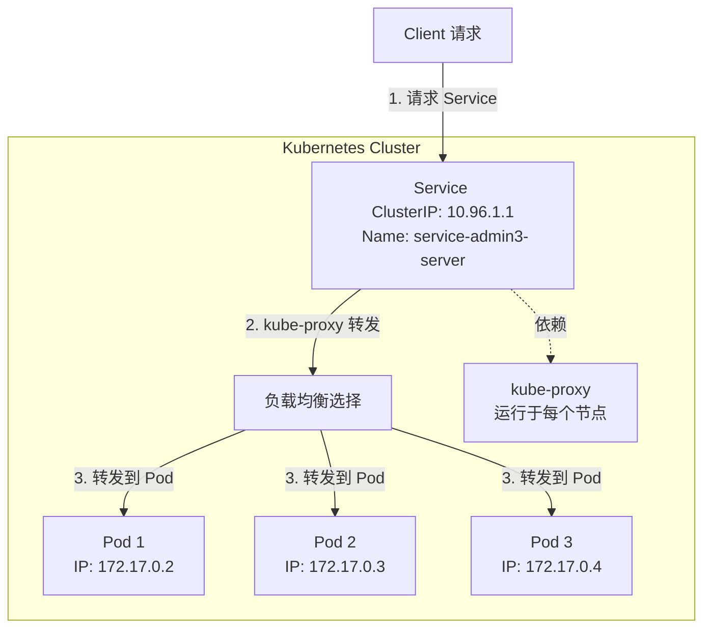

# Kubernetes 工作负载控制器（Deployment）与 服务（Service）

## 学习目标
- 深入理解 Deployment 的使用，掌握无状态应用的部署方式。
- 学习 Service 为应用提供网络访问的原理和配置方法。


## 第一部分：Deployment 详解

### 1.1 Deployment 的概念与理论
- **定义**：Deployment 是 Kubernetes 中用于管理无状态应用的控制器。它通过声明式配置，定义了应用的期望状态（比如运行几个副本、使用哪个镜像），并由 Kubernetes 自动确保实际状态与期望状态一致。
- **通俗理解**：想象 Deployment 是一个“智能工厂经理”，它负责监督一群工人（Pod），确保工人数量正确、工作正常。如果某个工人“生病”或“离职”（Pod 宕机或被删除），经理会立刻安排一个新工人顶上（自动创建新的 Pod）。它还能在不影响工厂生产的情况下，逐步更换工人的工具（滚动更新镜像或配置）。
- **核心功能**：
  - 管理 Pod 的生命周期（创建、销毁、重启）。
  - 维持指定数量的 Pod 副本（高可用性）。
  - 支持滚动更新（逐步替换 Pod，减少停机时间）和回滚（恢复到之前的版本）。

### 1.2 Pod 与 Deployment 的调度过程
- **Pod 的调度过程**：
  - Pod 是 Kubernetes 的最小调度单位，直接运行你的应用容器。
  - 当你创建一个 Pod 时，Kubernetes 的调度器（kube-scheduler）会根据节点的资源情况（CPU、内存等）和 Pod 的资源需求（requests 和 limits），选择一个合适的节点运行 Pod。
  - **问题**：Pod 本身不具备“自我修复”能力。如果 Pod 所在的节点宕机或 Pod 因故障被删除，Kubernetes 不会自动重建 Pod，需要手动重新创建。
  - **通俗比喻**：Pod 就像一个独立的手艺人，接到任务后自己去干活，但如果手艺人病了或工具坏了，没人会自动找替补，必须老板（你自己）亲自安排。

- **Deployment 的调度过程**：
  - Deployment 是一个更高层次的控制器，它不直接运行应用，而是通过管理一组 Pod 来实现应用的部署。
  - 你在 Deployment 中定义期望状态（比如运行 3 个 Pod 副本），Kubernetes 会自动创建和管理这些 Pod。
  - Deployment 背后依赖 ReplicaSet（副本集）来维持 Pod 的数量。ReplicaSet 会不断监控 Pod 的状态，如果发现实际 Pod 数量少于期望数量（比如某个 Pod 宕机），它会立即创建一个新的 Pod；如果多于期望数量，则会删除多余的 Pod。
  - **详细调度流程（包含 Kubernetes 核心组件）**：
    1. **用户发送命令**：你通过 `kubectl apply -f deployment.yml` 提交 Deployment 配置。
    2. **API Server 接收指令**：Kubernetes 的 API Server（集群的“前台接待”）接收到你的请求，验证配置是否合法，并将配置记录到 etcd（集群的“数据库”）中，作为系统的“期望状态”。
    3. **Controller Manager 安排 Deployment**：Controller Manager（集群的“管理者”）中的 Deployment Controller 检测到 etcd 中有新的 Deployment 配置，它会根据配置创建一个 ReplicaSet（副本集），并记录到 etcd 中。
    4. **ReplicaSet 创建 Pod**：ReplicaSet Controller（也是 Controller Manager 的一部分）根据 Deployment 中定义的 `replicas` 数量，创建对应的 Pod 配置，并记录到 etcd 中。
    5. **Scheduler 寻找合适机器**：Scheduler（集群的“调度员”）检测到 etcd 中有未分配节点的 Pod，它会根据节点的资源情况、Pod 的资源需求以及调度策略（如节点亲和性），为每个 Pod 选择一个合适的节点，并将分配结果更新到 etcd 中。
    6. **Kubelet 运行 Pod**：每个节点上的 Kubelet（节点的“执行者”）检测到 etcd 中有分配到本节点的 Pod 配置后，会在本地启动 Pod 中的容器，确保 Pod 正常运行。
    7. **持续监控与修复**：ReplicaSet Controller 持续监控 Pod 的状态（通过 API Server 查询 etcd），如果发现 Pod 数量或状态与期望不符（例如 Pod 宕机），会再次创建或删除 Pod，重复上述调度流程。
  - **通俗比喻**：Deployment 的调度就像一个工厂的生产流程：你（用户）向工厂前台（API Server）提交订单（Deployment 配置），前台记录订单到账本（etcd），工厂经理（Controller Manager）看到订单后安排生产计划（创建 ReplicaSet 和 Pod），调度员（Scheduler）决定每个产品在哪个车间生产（分配节点），最后车间工人（Kubelet）执行具体生产任务（运行 Pod）。如果产品损坏，经理会立刻安排补货（重建 Pod）。
  - **复习核心组件的作用**：
    - **API Server**：集群的入口，接收用户请求并更新状态。
    - **etcd**：集群数据库，存储所有配置和状态信息。
    - **Controller Manager**：运行各种控制器（如 Deployment Controller 和 ReplicaSet Controller），确保资源状态符合期望。
    - **Scheduler**：负责 Pod 的调度，选择合适的节点。
    - **Kubelet**：节点上的代理，负责启动和管理 Pod。

- **Mermaid 图：Deployment 调度流程（包含 Kubernetes 组件）**：
  ```mermaid
  graph TD
    User[用户] -->|提交 Deployment 配置| APIServer[API Server]
    APIServer -->|记录配置| etcd[etcd 数据库]
    etcd -->|通知| ControllerManager[Controller Manager]
    ControllerManager -->|创建 ReplicaSet| etcd
    ControllerManager -->|创建 Pod 配置| etcd
    etcd -->|通知| Scheduler[Scheduler]
    Scheduler -->|分配节点| etcd
    etcd -->|通知| Kubelet[Kubelet]
    Kubelet -->|运行 Pod| Node[节点]
    ControllerManager -->|监控 Pod 状态| etcd
  ```
  **解释**：用户通过 API Server 提交 Deployment 配置，记录到 etcd 中，Controller Manager 创建 ReplicaSet 和 Pod，Scheduler 分配节点，Kubelet 在节点上运行 Pod，整个过程由 Controller Manager 持续监控。

### 1.3 为什么 Pod 不好，需要引入 Deployment？
- **Pod 的局限性**：
  - **缺乏自我修复能力**：Pod 不会自动重启或重新调度。如果节点宕机或 Pod 因故障被删除，需要手动重新创建，非常麻烦。
  - **无法管理副本**：Pod 本身不具备副本概念。如果需要运行多个相同应用的实例以提高可用性，必须手动创建多个 Pod，且无法动态调整数量。
  - **不支持滚动更新**：如果要更新 Pod 的镜像或配置，必须手动删除旧 Pod 并创建新 Pod，容易导致服务中断。
  - **不适合生产环境**：Pod 的管理方式过于原始，难以应对复杂的运维需求（如高可用性、版本管理）。
  - **通俗比喻**：Pod 就像一个单打独斗的手艺人，虽然能干活，但如果生病或任务量增加，老板（你）必须亲自找替补或加人，非常费力。

- **Deployment 的必要性**：
  - **自我修复**：Deployment 通过 ReplicaSet 监控 Pod 状态，自动重建宕机的 Pod，确保服务不中断。
  - **副本管理**：通过 `replicas` 字段，轻松指定 Pod 数量，实现高可用性和负载均衡。
  - **滚动更新与回滚**：Deployment 支持逐步替换 Pod（滚动更新），避免服务中断；如果更新出错，可以快速回滚到上一个版本。
  - **声明式管理**：只需定义期望状态，Kubernetes 自动完成所有操作，减少手动干预。
  - **通俗比喻**：Deployment 就像一个智能工厂经理，不仅能自动安排工人（Pod）数量，还能在不影响生产的情况下逐步更换设备（滚动更新），如果新设备有问题还能立刻换回旧设备（回滚），大大减轻老板（你）的负担。

- **Mermaid 图：Pod 与 Deployment 的管理对比**：
  ```mermaid
  graph TD
    subgraph Pod 管理
      User1[用户] -->|手动创建| PodA[Pod 1]
      User1 -->|手动创建| PodB[Pod 2]
      User1 -->|手动重建| PodC[Pod 3 宕机]
    end
    subgraph Deployment 管理
      User2[用户] -->|定义期望状态| Deployment[Deployment]
      Deployment -->|自动管理| ReplicaSet[ReplicaSet]
      ReplicaSet -->|自动维持| PodX[Pod 1]
      ReplicaSet -->|自动维持| PodY[Pod 2]
      ReplicaSet -->|自动重建| PodZ[Pod 3]
    end
  ```
  **解释**：Pod 管理需要用户手动操作每个 Pod 的创建和重建，而 Deployment 通过声明式配置自动完成所有管理工作，效率更高。

### 1.4 Deployment 的 YAML 语法
- **基本结构**：以下是一个简单的 Deployment YAML 示例，包含常见字段。
  ```yaml
  apiVersion: apps/v1  # 指定 API 版本，Deployment 使用 apps/v1
  kind: Deployment     # 资源类型为 Deployment
  metadata:
    name: my-app       # Deployment 的名称
    namespace: your-pinyin-name  # 所在的命名空间
  spec:
    replicas: 3        # 期望运行的 Pod 副本数
    selector:          # 选择器，用于关联 Deployment 和 Pod
      matchLabels:     # 通过标签匹配 Pod
        app: pod-my-app
    template:          # Pod 模板，定义 Pod 的结构
      metadata:
        labels:        # Pod 的标签，必须与 selector.matchLabels 一致
          app: pod-my-app
      spec:            # Pod 的具体配置
        containers:    # 容器定义
        - name: my-container  # 容器名称
          image: nginx:1.14.2  # 使用的镜像
          ports:       # 容器暴露的端口
          - containerPort: 80  # 容器内部端口号
  ```

- **关键字段说明**：
  - `apiVersion: apps/v1`：Deployment 属于 `apps` 组，版本为 `v1`，与 Pod 的 `v1` 不同。
  - `replicas`：指定 Pod 副本数量，Kubernetes 会自动维持这个数量。
  - `selector.matchLabels`：用于关联 Deployment 和 Pod，必须与 `template.metadata.labels` 一致，否则 Deployment 无法管理 Pod。
  - `template`：定义 Pod 的模板，包含 Pod 的所有配置（相当于一个嵌入的 Pod 定义）。

### 1.5 与之前的 Pod YAML 对比，新增语法的意义
- **之前的 Pod YAML 示例**（保留所有注释，供学员复习）：
    ```yaml
    apiVersion: v1
    kind: Pod
    metadata:
      name: pod-light-year-admin-template  # Pod 的名称
      namespace: shiqi  # 所在的命名空间
    spec:
      containers:  # 容器配置列表
      - name: light-year-admin-template  # 容器名称
        image: harbor.labworlds.cc/light-year-admin-template/master:08061743-shiqi  # 容器镜像地址
        ports:  # 容器暴露的端口
        - containerPort: 80  # 容器内部端口
          name: http  # 端口名称
        resources:  # 资源限制和请求
          requests:  # 资源请求（最低需求）
            cpu: "100m"  # 请求 100 毫核 CPU
            memory: "64Mi"  # 请求 64MB 内存
          limits:  # 资源限制（最大使用）
            cpu: "200m"  # 限制 200 毫核 CPU
            memory: "128Mi"  # 限制 128MB 内存
        livenessProbe:  # 存活探针，检测容器是否存活
          httpGet:  # 使用 HTTP GET 请求检测
            path: /  # 检测路径
            port: 80  # 检测端口
          initialDelaySeconds: 15  # 首次检测延迟 15 秒
          periodSeconds: 10  # 每 10 秒检测一次
        readinessProbe:  # 就绪探针，检测容器是否准备好提供服务
          httpGet:  # 使用 HTTP GET 请求检测
            path: /  # 检测路径
            port: 80  # 检测端口
          initialDelaySeconds: 5  # 首次检测延迟 5 秒
          periodSeconds: 5  # 每 5 秒检测一次
        volumeMounts:  # 挂载卷
        - name: volumes-nginx-conf  # 卷名称
          mountPath: /etc/nginx/nginx.conf  # 挂载到容器内的路径
          subPath: nginx.conf  # 卷中的子路径
      volumes:  # 卷定义
      - name: volumes-nginx-conf  # 卷名称
        configMap:  # 使用 ConfigMap 作为卷来源
          name: configmap-nginx-conf  # ConfigMap 名称
      imagePullSecrets:  # 镜像拉取凭据
      - name: secret-harbor-login  # 镜像仓库登录密钥名称
    ```

- **实践步骤：从 Pod 切换到 Deployment**：
  1. **删除之前的 Pod**：由于我们现在开始使用 Deployment 管理应用，需要先删除之前手动创建的 Pod。
     ```bash
     kubectl delete pod pod-light-year-admin-template -n shiqi
     ```
     **说明**：删除旧 Pod 是为了避免资源冲突，Deployment 会自动创建和管理新的 Pod。
  2. **创建 Deployment YAML 文件**：我们将之前的 Pod 配置转换为 Deployment 配置，并保存为文件。
     - 文件名：`deployment-light-year-admin-template.yml`
     - 内容如下（新增了 `strategy.type: RollingUpdate` 配置）：
        ```yaml
        apiVersion: apps/v1  # 变更：从 v1 改为 apps/v1，因为 Deployment 属于 apps 组
        kind: Deployment     # 变更：从 Pod 改为 Deployment
        metadata:
          name: deployment-light-year-admin-template  # 名称调整，体现资源类型
          namespace: shiqi  # 所在的命名空间
        spec:
          replicas: 2        # 新增：指定 Pod 副本数，实现高可用性
          selector:          # 新增：选择器，用于关联 Deployment 和 Pod
            matchLabels:
              app: pod-light-year-admin-template  # 新增：定义标签，用于匹配 Pod
          strategy:          # 新增：定义更新策略
            type: RollingUpdate  # 设置为滚动更新，确保更新时服务不中断
            rollingUpdate:
              maxSurge: 1      # 最多允许 1 个额外 Pod
              maxUnavailable: 0  # 不允许有不可用 Pod，确保服务始终可用
          template:          # 新增：Pod 模板，包含 Pod 的完整定义
            metadata:
              labels:        # 新增：Pod 标签，必须与 selector.matchLabels 一致
                app: pod-light-year-admin-template
            spec:            # 以下为原 Pod 的 spec 内容，基本保持不变
              containers:  # 容器配置列表
              - name: light-year-admin-template  # 容器名称
                image: harbor.labworlds.cc/light-year-admin-template/master:08061743-shiqi  # 容器镜像地址
                ports:  # 容器暴露的端口
                - containerPort: 80  # 容器内部端口
                  name: http  # 端口名称
                resources:  # 资源限制和请求
                  requests:  # 资源请求（最低需求）
                    cpu: "100m"  # 请求 100 毫核 CPU
                    memory: "64Mi"  # 请求 64MB 内存
                  limits:  # 资源限制（最大使用）
                    cpu: "200m"  # 限制 200 毫核 CPU
                    memory: "128Mi"  # 限制 128MB 内存
                livenessProbe:  # 存活探针，检测容器是否存活
                  httpGet:  # 使用 HTTP GET 请求检测
                    path: /  # 检测路径
                    port: 80  # 检测端口
                  initialDelaySeconds: 15  # 首次检测延迟 15 秒
                  periodSeconds: 10  # 每 10 秒检测一次
                readinessProbe:  # 就绪探针，检测容器是否准备好提供服务
                  httpGet:  # 使用 HTTP GET 请求检测
                    path: /  # 检测路径
                    port: 80  # 检测端口
                  initialDelaySeconds: 5  # 首次检测延迟 5 秒
                  periodSeconds: 5  # 每 5 秒检测一次
                volumeMounts:  # 挂载卷
                - name: volumes-nginx-conf  # 卷名称
                  mountPath: /etc/nginx/nginx.conf  # 挂载到容器内的路径
                  subPath: nginx.conf  # 卷中的子路径
              volumes:  # 卷定义
              - name: volumes-nginx-conf  # 卷名称
                configMap:  # 使用 ConfigMap 作为卷来源
                  name: configmap-nginx-conf  # ConfigMap 名称
              imagePullSecrets:  # 镜像拉取凭据
              - name: secret-harbor-login  # 镜像仓库登录密钥名称
        ```
  3. **部署 Deployment**：使用 `kubectl apply` 命令部署文件。
     ```bash
     kubectl apply -f deployment-light-year-admin-template.yml
     ```
     **说明**：此命令会将配置提交到 Kubernetes 集群，Deployment 控制器会自动创建 2 个 Pod 副本。
  4. **通过 Kuboard 界面观察**：登录 Kuboard 管理界面（假设已安装 Kuboard），在 `shiqi` 命名空间下查看 `deployment-light-year-admin-template`，可以看到 Deployment 的状态和 Pod 副本数量。
     - 路径：Kuboard > 命名空间 > shiqi > 工作负载 > Deployment
     - 观察点：Deployment 详情页面会显示 Pod 数量、状态以及更新历史。
  5. **通过命令行验证**：使用以下命令查看 Deployment 和 Pod 状态。
     ```bash
     kubectl get deployment -n shiqi
     kubectl get pod -n shiqi -o wide
     ```
     **说明**：`get deployment` 显示 Deployment 的期望副本数和实际副本数，`get pod` 显示每个 Pod 的状态和所在节点。

- **新增语法及其作用**：
  1. **`apiVersion: apps/v1`**：
     - **变更原因**：Pod 使用 `v1`，而 Deployment 属于 `apps` 组，使用 `apps/v1`。
     - **作用**：确保 Kubernetes 正确识别资源类型和版本。
  2. **`kind: Deployment`**：
     - **变更原因**：从 `Pod` 改为 `Deployment`，表示这是一个控制器资源。
     - **作用**：告诉 Kubernetes 使用 Deployment 控制器管理资源。
  3. **`spec.replicas: 2`**：
     - **作用**：指定运行 2 个 Pod 副本，Kubernetes 会自动维持这个数量。如果某个 Pod 宕机，会自动重建一个新的，确保高可用性。
  4. **`spec.selector.matchLabels`**：
     - **作用**：定义 Deployment 如何找到它管理的 Pod。通过标签匹配，确保 Deployment 能正确识别和控制 Pod。
  5. **`spec.strategy.type: RollingUpdate`**：
     - **作用**：设置更新策略为滚动更新，确保在更新镜像或配置时，Pod 逐步替换，服务不中断。
  6. **`spec.strategy.rollingUpdate.maxSurge: 1`**：
     - **作用**：更新时最多允许 1 个额外 Pod，确保更新速度可控。
  7. **`spec.strategy.rollingUpdate.maxUnavailable: 0`**：
     - **作用**：更新时不允许有不可用 Pod，确保服务始终可用。
  8. **`spec.template`**：
     - **作用**：定义 Pod 的模板，包含 Pod 的完整配置（相当于把 Pod 的 `metadata` 和 `spec` 嵌入到 Deployment 中）。Deployment 根据这个模板创建和管理 Pod。
  9. **`template.metadata.labels`**：
     - **作用**：为 Pod 打上标签，必须与 `selector.matchLabels` 一致，否则 Deployment 无法管理这些 Pod。

- **通俗解释**：从 Pod 到 Deployment，就像从“单人作业”升级到“团队管理”。Pod 是一个人干活，出了问题自己解决不了；而 Deployment 是一个团队经理，定下团队人数（replicas）、工作模式（template），并通过名牌（labels 和 selector）认出自己的团队成员，随时调整和补充人员。

### 1.6 Deployment 的优势（结合实践操作）
以下内容结合实际操作，帮助学员通过命令和 Kuboard 界面直观感受 Deployment 的强大功能。

- **1. 自动管理 Pod 副本**：
  - **优势**：通过 `replicas` 字段，确保指定数量的 Pod 始终运行，实现高可用性和负载均衡。
  - **实践操作与观察**：
    1. 查看当前 Pod 副本数量（应为 3 个）。
       ```bash
       kubectl get pod -n shiqi -o wide
       ```
    2. 手动删除一个 Pod，模拟故障。
       ```bash
       kubectl delete pod <pod-name> -n shiqi
       ```
    3. 再次查看 Pod 列表，观察 Deployment 自动重建 Pod。
       ```bash
       kubectl get pod -n shiqi -o wide
       ```
    4. 登录 Kuboard 界面，在 `shiqi` 命名空间的 Deployment 详情页，查看 Pod 状态变化，确认副本数始终保持为 2。
  - **学习命令**：
    - `kubectl get deployment -n <namespace>`：查看 Deployment 状态。
    - `kubectl describe deployment <deployment-name> -n <namespace>`：查看 Deployment 详细信息，包括事件日志。
    - **通俗比喻**：Deployment 就像一个工厂经理，定下 2 个工人的目标，如果有工人“离职”，经理会立刻招聘新人补上，始终保持人数不变。

- **2. 滚动更新（类型与配置）**：
  - **优势**：更新镜像或配置时，Deployment 会逐步替换 Pod（一个接一个），避免服务中断。
  - **滚动更新的基本原理**：Deployment 在更新时会创建一个新的 ReplicaSet，逐步增加新版本 Pod 的数量，同时减少旧版本 Pod 的数量，直到完全替换完成。
  - **滚动更新的类型**：
    1. **Recreate（重建更新）**：
       - **定义**：先删除所有旧版本 Pod，再创建新版本 Pod。
       - **特点**：会导致服务短暂中断，适合对可用性要求不高的场景。
       - **通俗比喻**：就像工厂停工换设备，先把旧设备全拆掉，再装上新设备，中间生产会暂停。
    2. **RollingUpdate（滚动更新，默认类型）**：
       - **定义**：逐步替换 Pod，保持一定数量的 Pod 始终可用。
       - **特点**：不会导致服务中断，适合生产环境。
       - **配置参数**：
         - `maxSurge`：更新期间最多可以超出 `replicas` 的 Pod 数量（默认 25%），控制更新速度。
         - `maxUnavailable`：更新期间最多不可用的 Pod 数量（默认 25%），确保服务可用性。
       - **通俗比喻**：就像工厂换设备时，一个车间一个车间地换，始终保证大部分车间在生产，不会完全停工。
  - **实践操作与观察**：
    1. 修改滚动更新配置，调整 `maxSurge` 和 `maxUnavailable` 参数，观察更新速度和可用性。
        - 编辑 `deployment-light-year-admin-template.yml`，将 `maxSurge` 改为 2，`maxUnavailable` 改为 1。
          ```yaml
          spec:
            strategy:
              type: RollingUpdate
              rollingUpdate:
                maxSurge: 2  # 最多允许 2 个额外 Pod，加速更新
                maxUnavailable: 1  # 允许 1 个 Pod 不可用，观察服务影响
          ```
        - 或者百分比，调整 `maxSurge` 和 `maxUnavailable` 参数，观察更新速度和可用性。
        ```yaml
          spec:
            strategy:
              type: RollingUpdate
              rollingUpdate:
                maxSurge: 50%  # 最多允许 2 个额外 Pod，加速更新
                maxUnavailable: 50%  # 允许 1 个 Pod 不可用，观察服务影响
          ```
        - 应用更改：
          ```bash
          kubectl apply -f deployment-light-year-admin-template.yml
          ```
    2. 在 Kuboard 界面观察更新过程，查看 Pod 数量变化，确认更新期间服务是否可用。
    3. 使用命令查看更新状态：
       ```bash
       kubectl rollout status deployment/deployment-light-year-admin-template -n shiqi
       ```
  - **学习点**：通过调整 `maxSurge` 和 `maxUnavailable`，可以控制更新的速度和服务的可用性，适合不同场景需求。

- **3. 编辑 Deployment 镜像（发布新版本）**：
  - **优势**：发布新版本只需要修改 `template.spec.containers.image` 字段，Deployment 会自动完成滚动更新，操作非常方便。
  - **实践操作与观察（第一次发版）**：
    以下提供三种方式来更新镜像版本，学员可以根据习惯选择最适合自己的方式。建议初学者优先尝试 Kuboard 界面操作，简单直观；有一定基础的学员可以尝试配置文件或命令行操作，深入理解 Kubernetes 的工作原理。
    1. **方式一：通过 Kuboard 界面修改镜像（最简单）**：
       - 登录 Kuboard 管理界面，进入 `shiqi` 命名空间下的 `deployment-light-year-admin-template` 详情页面。
       - 点击“编辑”或“更新镜像”按钮（具体按钮名称根据 Kuboard 版本可能不同），在容器配置中将镜像字段修改为：
         ```
         harbor.labworlds.cc/light-year-admin-template/master:08061743-shiqi-v2
         ```
       - 保存并提交更改，Kuboard 会自动触发滚动更新。
       - 在 Kuboard 界面观察 Pod 逐步替换的过程，查看新旧版本 Pod 的镜像字段变化。
       **说明**：Kuboard 提供了图形化界面，操作直观，无需记住复杂命令，适合初学者。
    2. **方式二：通过修改配置文件更新镜像（推荐）**：
       - 编辑 `deployment-light-year-admin-template.yml` 文件，将 `image` 字段修改为新版本：
         ```yaml
         spec:
           template:
             spec:
               containers:
               - name: light-year-admin-template
                 image: harbor.labworlds.cc/light-year-admin-template/master:08061743-shiqi-v2  # 更新为 v2 版本
         ```
       - 应用更改：
         ```bash
         kubectl apply -f deployment-light-year-admin-template.yml
         ```
       - 查看更新状态：
         ```bash
         kubectl rollout status deployment/deployment-light-year-admin-template -n shiqi
         ```
       **说明**：通过配置文件更新镜像，清晰记录了每次变更，便于版本管理和团队协作。
    3. **方式三：通过命令行直接更新镜像（快速但需熟悉命令）**：
       - 使用 `kubectl set image` 命令直接修改镜像版本：
         ```bash
         kubectl set image deployment/deployment-light-year-admin-template light-year-admin-template=harbor.labworlds.cc/light-year-admin-template/master:08061743-shiqi-v2 -n shiqi
         ```
       - 查看更新状态：
         ```bash
         kubectl rollout status deployment/deployment-light-year-admin-template -n shiqi
         ```
       **说明**：命令行操作高效，适合自动化脚本或有经验的用户，但容易出错，需谨慎使用。
    - **观察结果**：无论使用哪种方式，Deployment 都会自动触发滚动更新。在 Kuboard 界面或通过命令行观察 Pod 逐步替换的过程，确认新版本镜像已应用。
  - **实践操作与观察（第二次发版）**：
    同样提供三种方式，模拟第二次发版，学员可选择任意一种方式操作。
    1. **方式一：通过 Kuboard 界面修改镜像**：
       - 在 Kuboard 界面中，将镜像字段更新为：
         ```
         harbor.labworlds.cc/light-year-admin-template/master:08061743-shiqi-v3
         ```
       - 保存并提交更改，观察更新历史和 Pod 状态。
    2. **方式二：通过修改配置文件更新镜像**：
       - 编辑 `deployment-light-year-admin-template.yml`，将 `image` 字段更新为：
         ```yaml
         spec:
           template:
             spec:
               containers:
               - name: light-year-admin-template
                 image: harbor.labworlds.cc/light-year-admin-template/master:08061743-shiqi-v3  # 更新为 v3 版本
         ```
       - 应用更改：
         ```bash
         kubectl apply -f deployment-light-year-admin-template.yml
         ```
       - 查看更新状态：
         ```bash
         kubectl rollout status deployment/deployment-light-year-admin-template -n shiqi
         ```
    3. **方式三：通过命令行直接更新镜像**：
       - 使用命令更新镜像：
         ```bash
         kubectl set image deployment/deployment-light-year-admin-template light-year-admin-template=harbor.labworlds.cc/light-year-admin-template/master:08061743-shiqi-v3 -n shiqi
         ```
       - 查看更新状态：
         ```bash
         kubectl rollout status deployment/deployment-light-year-admin-template -n shiqi
         ```
    - **观察结果**：在 Kuboard 界面查看更新历史和 Pod 状态，确认第二次发版完成。
  - **学习点**：
    - 只需要修改 `image` 字段，Deployment 就会自动完成新版本发布，无需手动删除或创建 Pod，操作简便且无服务中断。
    - 三种操作方式各有优势：Kuboard 界面最直观，适合初学者；配置文件便于管理和追溯；命令行高效但需熟悉语法。建议学员三种方式都尝试，找到最适合自己的操作方式。
  - **通俗比喻**：就像工厂更换设备型号，你可以通过车间管理软件（Kuboard）、书面计划（配置文件）或直接口头指令（命令行）通知经理（Deployment），经理会自动安排工人逐步使用新设备，确保生产不中断。

- **4. 回滚功能**：
  - **优势**：如果更新出错，可以快速回滚到上一个版本。
  - **实践操作与观察**：
    同样提供三种方式来执行回滚操作，学员可根据习惯选择。
    1. **方式一：通过 Kuboard 界面回滚（最简单）**：
       - 登录 Kuboard 界面，进入 `shiqi` 命名空间下的 `deployment-light-year-admin-template` 详情页面。
       - 在“更新历史”或“修订版本”选项中，找到之前的版本（如 v2），点击“回滚”按钮。
       - 确认回滚操作，Kuboard 会自动将 Deployment 恢复到 v2 版本。
       - 观察 Pod 镜像版本回滚到 v2，确认服务恢复正常。
       **说明**：Kuboard 界面操作直观，无需记住命令，适合快速回滚。
    2. **方式二：通过命令行回滚（快速但需熟悉命令）**：
       - 假设第二次发版（v3）有问题，需要回滚到第一次发版（v2）。
         ```bash
         kubectl rollout undo deployment/deployment-light-year-admin-template -n shiqi
         ```
       - 查看回滚状态：
         ```bash
         kubectl rollout status deployment/deployment-light-year-admin-template -n shiqi
         ```
       **说明**：命令行回滚高效，适合有经验的用户或自动化场景。
    3. **方式三：通过修改配置文件回滚（记录清晰）**：
       - 编辑 `deployment-light-year-admin-template.yml` 文件，将 `image` 字段改回之前的版本：
         ```yaml
         spec:
           template:
             spec:
               containers:
               - name: light-year-admin-template
                 image: harbor.labworlds.cc/light-year-admin-template/master:08061743-shiqi-v2  # 回滚到 v2 版本
         ```
       - 应用更改：
         ```bash
         kubectl apply -f deployment-light-year-admin-template.yml
         ```
       - 查看回滚状态：
         ```bash
         kubectl rollout status deployment/deployment-light-year-admin-template -n shiqi
         ```
       **说明**：通过配置文件回滚，可以清晰记录每次版本变更，便于管理和追溯。
    - **观察结果**：无论使用哪种方式，在 Kuboard 界面或通过命令行观察 Pod 镜像版本回滚到 v2，确认服务恢复正常。
  - **学习点**：
    - Deployment 自动保存每次更新的历史（Revision），可以通过多种方式快速回滚，降低发版风险。
    - Kuboard 界面回滚最直观，适合初学者；命令行操作高效；配置文件方式便于记录和团队协作。建议学员尝试不同方式，熟悉回滚流程。
  - **通俗比喻**：就像在工厂更换设备后发现新设备有问题，Deployment 能立刻换回旧设备，你可以通过管理软件（Kuboard）、书面计划（配置文件）或口头指令（命令行）通知经理，经理会确保生产恢复正常。

- **5. 声明式配置**：
  - **优势**：只需定义期望状态，Kubernetes 自动完成创建、监控和修复，减少手动操作。声明式配置可以通过配置文件、Kuboard 界面或命令行实现，灵活性高。
  - **实践操作与观察**：
    - **配置文件方式**：通过 `kubectl apply -f` 应用 YAML 文件，定义 Deployment 的期望状态（如副本数、镜像版本），Kubernetes 自动维护。
    - **Kuboard 界面方式**：通过图形化界面编辑 Deployment 配置，修改副本数或镜像版本，提交后 Kubernetes 自动执行。
    - **命令行方式**：通过 `kubectl set image` 或 `kubectl edit` 修改配置，Kubernetes 同样会自动调整到期望状态。
    - **观察结果**：无论使用哪种方式，Kubernetes 都会持续监控并确保实际状态与期望状态一致。例如，若 Pod 数量不足，自动重建；若镜像版本不符，自动更新。
  - **学习点**：
    - 声明式配置的核心是“告诉 Kubernetes 你想要什么”，而无需关心“如何实现”。这大大降低了运维复杂度，尤其适合大规模集群管理。
    - 建议优先使用配置文件方式，便于版本控制和团队协作；Kuboard 界面适合快速调整；命令行适合临时修改或脚本自动化。
  - **通俗比喻**：Deployment 就像一个智能管家，你只需通过手机 App（Kuboard）、书面清单（配置文件）或口头指令（命令行）告诉它“家里要保持 3 个清洁工，用的工具是最新款”，管家会自动招聘、监督和更换清洁工（滚动更新），甚至在出错时恢复到旧工具（回滚），完全不用你操心具体细节。

### 1.7 Deployment 总结命令表格
以下是 Deployment 常用命令的总结表格，方便学员快速上手和复习：

| **命令**                                                                 | **作用**                                   | **示例**                                                                                   |
|-------------------------------------------------------------------------|-------------------------------------------|-------------------------------------------------------------------------------------------|
| `kubectl apply -f <file>.yml`                                           | 应用 Deployment 配置文件，创建或更新资源       | `kubectl apply -f deployment-light-year-admin-template.yml`                              |
| `kubectl get deployment -n <namespace>`                                 | 查看指定命名空间下的 Deployment 列表          | `kubectl get deployment -n shiqi`                                                       |
| `kubectl describe deployment <name> -n <namespace>`                     | 查看指定 Deployment 的详细信息（包括事件日志） | `kubectl describe deployment deployment-light-year-admin-template -n shiqi`            |
| `kubectl get pod -n <namespace> -o wide`                                | 查看 Pod 列表，包含状态和节点信息             | `kubectl get pod -n shiqi -o wide`                                                      |
| `kubectl delete pod <pod-name> -n <namespace>`                          | 删除指定 Pod（测试自动重建）                  | `kubectl delete pod <pod-name> -n shiqi`                                                |
| `kubectl set image deployment/<name> <container>=<image> -n <namespace>`| 更新 Deployment 的容器镜像，触发滚动更新      | `kubectl set image deployment/deployment-light-year-admin-template light-year-admin-template=harbor.labworlds.cc/light-year-admin-template/master:08061743-shiqi-v2 -n shiqi` |
| `kubectl rollout status deployment/<name> -n <namespace>`               | 查看滚动更新状态                              | `kubectl rollout status deployment/deployment-light-year-admin-template -n shiqi`       |
| `kubectl rollout undo deployment/<name> -n <namespace>`                 | 回滚到上一个版本                              | `kubectl rollout undo deployment/deployment-light-year-admin-template -n shiqi`         |
| `kubectl edit deployment <name> -n <namespace>`                         | 编辑 Deployment 配置（可修改 replicas 等）     | `kubectl edit deployment deployment-light-year-admin-template -n shiqi`                |

**学习建议**：将以上命令结合 Kuboard 界面操作，反复练习 Deployment 的创建、更新和回滚流程，加深对 Deployment 优势的理解。


## 作业 Admin3前后端项目部署 （最佳企业的项目部署）

### 2. 部署介绍
**部署** 是将开发好的代码和程序放到服务器上运行的过程，使得用户可以通过网络访问到这个系统。我们使用 Kubernetes（简称 K8s）作为容器编排工具来管理我们的应用。Kubernetes 是一个强大的系统，可以帮助我们自动管理应用的运行、扩展和故障恢复。

- **部署工具**：我们使用 Docker 将应用打包成镜像（就像一个轻量级的虚拟机），然后通过 Kubernetes 的 Deployment 资源在服务器上运行这些镜像。
- **部署目标**：
  - 将前端和后端分别打包成 Docker 镜像，上传到 Harbor 镜像仓库（一个存储 Docker 镜像的地方）。
  - 在 Kubernetes 集群中部署前端和后端，确保它们可以正常运行并相互通信。
  - 配置资源限制、更新策略和健康检查，确保系统稳定运行。
- **部署顺序**：按照您的要求，我们会先完成前端的部署和测试，确保前端可以正常访问，再进行后端的部署和测试。
- **Deployment 要求**：
  1. **命名规范**：所有资源必须按照规范命名，例如 Deployment、Pod、ConfigMap 等名称需清晰反映其作用和所属项目。
  2. **前端资源限制**：
     - 最小：CPU 50m，内存 64Mi
     - 最大：CPU 100m，内存 128Mi
  3. **后端资源限制**：
     - 最小：CPU 100m，内存 256Mi
     - 最大：CPU 200m，内存 256Mi
  4. **更新策略**：前端和后端均采用滚动更新策略，可以使用数字（如 maxSurge: 1）或百分比（如 maxSurge: 25%）。
  5. **后端 ConfigMap**：合理创建 `configmap-admin3-server.yml`，用于存储后端配置文件（如 `application.yml`），并挂载到后端容器中。


### 实现步骤列表（面向小白用户）

#### 前言：什么是 Kubernetes 和 Docker？
- **Docker**：想象 Docker 是一个打包工具，它把你的程序和程序运行所需的所有东西（比如依赖库、配置文件等）打包成一个“镜像”，就像一个便携的盒子。这个盒子可以在任何支持 Docker 的服务器上运行。
- **Kubernetes (K8s)**：Kubernetes 是一个“管家”，它负责管理很多 Docker 容器（从镜像运行出来的程序实例），确保它们正常运行、自动重启故障容器、分配资源等。我们通过写配置文件（比如 Deployment）告诉 Kubernetes 如何运行和管理我们的程序。

#### 步骤列表：前端部署（先完成并测试）
1. **拉取前端源码**
   - **命令**：`git clone https://gitee.com/Tender-Liu/admin3.git`
   - **解释**：使用 `git clone` 命令从 Gitee（一个代码托管平台）下载 Admin3 项目的源码到本地服务器。这就像从网上下载一个压缩包，只不过这里是代码。
2. **修改前端配置文件**
   - **命令**：
     ```bash
     cd admin3/admin3-ui
     # 编辑 .env 文件，确保 VITE_BASE_URI 设置为指定域名
     echo "VITE_BASE_URI=https://shiqi.admin.labworlds.cc:1443/admin3" > .env
     ```
   - **解释**：进入前端代码目录，修改 `.env` 文件（环境配置文件），设置前端请求后端的域名和路径。就像告诉前端程序“你的后台服务在这个地址，去找它吧”。
3. **构建前端 Docker 镜像**
   - **命令**：`docker build -t harbor.labworlds.cc/admin3-ui/master:081003-shiqi .`
   - **解释**：在当前目录下执行 `docker build` 命令，将前端代码打包成一个 Docker 镜像。`-t` 参数是给镜像起一个名字，包含了仓库地址、项目名、分支和版本号（类似一个标签）。这就像把程序装进一个盒子并贴上标签。
4. **推送前端镜像到 Harbor**
   - **命令**：`docker push harbor.labworlds.cc/admin3-ui/master:081003-shiqi`
   - **解释**：将本地构建好的镜像上传到 Harbor 镜像仓库（一个存储镜像的云端仓库）。这就像把盒子送到一个公共仓库，供其他人或服务器使用。
5. **部署前端到 Kubernetes**
   - **操作**：将之前整理好的 `deployment-admin3-ui.yml` 文件应用到 Kubernetes 集群。
   - **命令**：`kubectl apply -f deployment-admin3-ui.yml`
   - **解释**：`kubectl apply` 命令会读取配置文件，告诉 Kubernetes 按照文件内容创建资源。`Deployment` 是 Kubernetes 中的一种资源类型，它会启动一个或多个 Pod（容器实例）运行你的程序。配置文件中指定了镜像、资源限制、端口等信息。
6. **测试前端是否正常访问**
   - **操作**：通过浏览器访问前端地址 `https://shiqi.admin.labworlds.cc:1443/admin3`，检查页面是否可以正常加载。
   - **命令**（检查 Pod 状态）：`kubectl get pod -n shiqi`
   - **解释**：Pod 是 Kubernetes 中运行容器的最小单位，检查 Pod 状态可以确认前端容器是否正常运行。如果状态显示为 `Running`，说明容器启动成功。如果页面无法访问，可能需要检查日志：`kubectl logs -l app=pod-admin3-ui -n shiqi`。
   - **重要**：只有前端测试通过后（页面能正常打开），我们才会进入后端部署步骤。如果测试失败，需要排查问题（如镜像是否正确、配置文件是否有误等）。

#### 步骤列表：后端部署（前端测试通过后进行）
7. **拉取后端源码**
   - **命令**：`git clone https://gitee.com/Tender-Liu/admin3.git`
   - **解释**：与前端类似，从 Gitee 下载后端代码。
8. **构建后端 Docker 镜像**
   - **命令**：
     ```bash
     cd admin3/admin3-server
     docker build -t harbor.labworlds.cc/admin3-server/master:081003-shiqi .
     ```
   - **解释**：进入后端代码目录，构建后端镜像。注意镜像名称已更正为 `admin3-server`，以区分前端和后端。
9. **推送后端镜像到 Harbor**
   - **命令**：`docker push harbor.labworlds.cc/admin3-server/master:081003-shiqi`
   - **解释**：将后端镜像上传到 Harbor 仓库。
10. **创建后端 ConfigMap**
    - **操作**：将之前整理好的 `configmap-admin3-server.yml` 文件应用到 Kubernetes。
    - **命令**：`kubectl apply -f configmap-admin3-server.yml`
    - **解释**：ConfigMap 是一种 Kubernetes 资源，用于存储配置数据（比如后端的数据库连接信息）。我们通过 ConfigMap 将 `application.yml` 文件内容挂载到后端容器中，供程序读取。
11. **部署后端到 Kubernetes**
    - **操作**：将之前整理好的 `deployment-admin3-server.yml` 文件应用到 Kubernetes。
    - **命令**：`kubectl apply -f deployment-admin3-server.yml`
    - **解释**：与前端类似，通过 Deployment 启动后端容器。配置文件中指定了镜像、资源限制、端口、ConfigMap 挂载等信息。
12. **测试后端是否正常运行**
    - **操作**：检查后端 Pod 状态，并通过前端页面测试是否能正常调用后端接口。
    - **命令**：
      ```bash
      kubectl get pod -n shiqi
      kubectl logs -l app=pod-admin3-server -n shiqi
      ```
    - **解释**：确认后端 Pod 状态为 `Running`，并通过日志检查是否有错误。如果前端页面可以正常登录或加载数据，说明后端接口调用成功。


### 前端和后端配置文件（已整理）
#### 前端 Deployment 配置 (`deployment-admin3-ui.yml`)
```yaml
apiVersion: apps/v1
kind: Deployment
metadata:
  name: deployment-admin3-ui
  namespace: shiqi
spec:
  replicas: 1
  selector:
    matchLabels:
      app: pod-admin3-ui
  strategy:
    type: RollingUpdate
    rollingUpdate:
      maxSurge: 1
      maxUnavailable: 0
  template:
    metadata:
      labels:
        app: pod-admin3-ui
    spec:
      containers:
      - name: admin3-ui
        image: harbor.labworlds.cc/admin3-ui/master:081003-shiqi
        ports:
        - containerPort: 80
          name: http
        resources:
          requests:
            cpu: "50m"
            memory: "64Mi"
          limits:
            cpu: "100m"
            memory: "128Mi"
        livenessProbe:
          httpGet:
            path: /
            port: 80
          initialDelaySeconds: 15
          periodSeconds: 10
        readinessProbe:
          httpGet:
            path: /
            port: 80
          initialDelaySeconds: 5
          periodSeconds: 5
      imagePullSecrets:
      - name: secret-harbor-login
```

#### 后端 ConfigMap 配置 (`configmap-admin3-server.yml`)
```yaml
apiVersion: v1
kind: ConfigMap
metadata:
  name: configmap-admin3-server
  namespace: shiqi
data:
  application.yml: |
    spring:
      jpa:
        generate-ddl: true
        defer-datasource-initialization: true
        show-sql: true
        hibernate:
          ddl-auto: update
        properties:
          hibernate.auto_quote_keyword: true
      application:
        name: admin3
      datasource:
        driver-class-name: com.mysql.cj.jdbc.Driver
        url: jdbc:mysql://192.168.110.162:3306/admin3?characterEncoding=utf8
        username: admin
        password: admin123
      sql:
        init:
          encoding: utf8
          data-locations: classpath:data.sql
          mode: always
          continue-on-error: true
      data:
        web:
          pageable:
            one-indexed-parameters: true
      profiles:
        include: biz
    server:
      servlet:
        context-path: /admin3
    management:
      endpoints:
        web:
          exposure:
            include: health
```

#### 后端 Deployment 配置 (`deployment-admin3-server.yml`)
```yaml
apiVersion: apps/v1
kind: Deployment
metadata:
  name: deployment-admin3-server
  namespace: shiqi
spec:
  replicas: 1
  selector:
    matchLabels:
      app: pod-admin3-server
  strategy:
    type: RollingUpdate
    rollingUpdate:
      maxSurge: 1
      maxUnavailable: 0
  template:
    metadata:
      labels:
        app: pod-admin3-server
    spec:
      containers:
      - name: admin3-server
        image: harbor.labworlds.cc/admin3-server/master:081003-shiqi
        ports:
        - containerPort: 8080
          name: http
        resources:
          requests:
            cpu: "100m"
            memory: "256Mi"
          limits:
            cpu: "500m"
            memory: "512Mi"
        livenessProbe:
          httpGet:
            path: /admin3/actuator/health
            port: 8080
          initialDelaySeconds: 60
          periodSeconds: 10
        readinessProbe:
          httpGet:
            path: /admin3/actuator/health
            port: 8080
          initialDelaySeconds: 30
          periodSeconds: 5
        volumeMounts:
        - name: volumes-admin3-server
          mountPath: /app/application.yml
          subPath: application.yml
      volumes:
      - name: volumes-admin3-server
        configMap:
          name: configmap-admin3-server
      imagePullSecrets:
      - name: secret-harbor-login
```

### 检查命令（必须做）
这些命令用于检查你的程序是否正常运行，类似“医生检查病人”的工具。

1. **查看所有资源状态**：
   - 命令：`kubectl get all -n shiqi`
   - 解释：列出 `shiqi` 命名空间下的所有资源（Deployment、Pod 等），看看它们是否正常。
2. **查看 Deployment 状态**：
   - 命令：`kubectl get deployment -n shiqi`
   - 解释：专门查看 Deployment 是否创建成功，是否所有副本都就绪。
3. **查看 Pod 状态**：
   - 命令：`kubectl get pod -n shiqi`
   - 解释：Pod 是程序运行的地方，状态为 `Running` 说明程序启动了。如果是 `CrashLoopBackOff` 或 `Error`，说明有问题。
4. **查看日志（程序运行记录）**：
   - 前端：`kubectl logs -l app=pod-admin3-ui -n shiqi`
   - 后端：`kubectl logs -l app=pod-admin3-server -n shiqi`
   - 解释：日志就像程序的日记，记录了程序运行中遇到的问题。查看日志可以帮助你找到错误原因。
5. **详细描述资源（排查问题）**：
   - 前端：`kubectl describe deployment deployment-admin3-ui -n shiqi`
   - 后端：`kubectl describe deployment deployment-admin3-server -n shiqi`
   - 解释：如果程序有问题，这个命令会提供更详细的信息，比如为什么 Pod 启动失败。

### Kuboard 界面查看步骤（必须做）
Kuboard 是一个图形化界面，就像 Windows 桌面，比命令行更直观。

1. **登录 Kuboard**：
   - 打开浏览器，输入 Kuboard 的网址（问你的管理员要），输入用户名和密码登录。
2. **选择命名空间**：
   - 登录后，左侧有个菜单，找到“命名空间”，点击 `shiqi`（就像选择一个文件夹）。
3. **查看程序（Deployment 和 Pod）**：
   - 在 `shiqi` 命名空间下，点击“工作负载” -> “Deployment”，你会看到 `deployment-admin3-ui` 和 `deployment-admin3-server`。
   - 点击某个 Deployment，里面有“Pod”选项卡，显示程序是否运行（状态应为绿色或 `Running`）。
4. **查看配置（ConfigMap）**：
   - 左侧菜单选“配置” -> “ConfigMap”，找到 `configmap-admin3-server`，点开可以看到后端配置内容。
5. **查看日志**：
   - 在 Pod 页面，点击某个 Pod，再点“日志”，选择容器名（比如 `admin3-ui`），就能看到程序运行记录。
6. **监控资源**：
   - 在 Deployment 或 Pod 页面，有 CPU 和内存使用图表，确保没有超出限制（就像检查电脑内存是否不够用）。


## Kubernetes Service 原理与实现


### 一、引言：从 Pod 的问题到 Service 的必要性

同学们，还记得我们之前学习 Pod 和 Deployment 时的内容吗？在 Kubernetes 中，Pod 是运行容器的基本单位，我们通过 Deployment 管理 Pod，确保高可用性和滚动更新。当时我们给 Pod 打上了标签（Labels），并通过选择器（Selector）让 Deployment 管理一组 Pod。这些标签和选择器不仅是 Deployment 的基础，也是今天要学习的 **Service** 的核心机制。

#### 1.1 Pod 的 IP 问题
在学习 Pod 部署时，大家可能已经注意到一个痛点：Pod 的 IP 地址是动态的。每次 Pod 因为故障、调度或重启而被重建时，它的 IP 地址都会发生变化。如果我们直接通过 Pod 的 IP 地址访问某个服务，一旦 Pod IP 变了，访问就会失败。这就像你给朋友寄信，但朋友搬家了，地址变了，信就送不到了。

#### 1.2 为什么需要 Service？
为了解决 Pod IP 动态变化的问题，Kubernetes 引入了 **Service** 这个概念。Service 是一个虚拟的网络层，为 Pod 提供一个稳定的访问入口（虚拟 IP 或域名），无论 Pod 的 IP 如何变化，Service 都能找到正确的 Pod 并转发流量。这就像一个“固定邮局地址”，即使朋友搬家了，你还是可以把信寄到邮局，邮局会负责转交给朋友。

#### 1.3 与 Nginx Upstream 的类比
同学们，你们之前学习过 Nginx，应该对 Nginx 的 `upstream` 模块很熟悉吧？在 Nginx 中，`upstream` 是一个反向代理模块，可以定义一组后端服务器（比如多个 Web 服务器的 IP 和端口），然后将客户端的请求通过负载均衡的方式转发到这些后端服务器上。即使某个后端服务器宕机或 IP 变化，只要 `upstream` 配置正确，Nginx 依然能找到可用的服务器。

Kubernetes 的 Service 和 Nginx 的 `upstream` 非常类似：
- **Service 就像 Nginx 的 upstream**：Service 定义了一组 Pod（就像 upstream 定义了一组后端服务器），并将请求转发到这些 Pod 上。
- **负载均衡**：Service 内置了简单的负载均衡机制（默认是轮询），就像 Nginx 的 upstream 可以配置轮询、权重等策略。
- **动态更新**：Service 通过标签选择器动态关联 Pod，即使 Pod IP 变化，Service 也能自动更新转发目标，这类似于 Nginx 的 upstream 在后端服务器变化时依然能正常工作（虽然 Nginx 需要手动更新配置）。

通过这个类比，相信大家能更快理解 Service 的作用：它是一个“Kubernetes 版本的 upstream”，专门解决 Pod IP 动态变化的问题，并提供稳定的访问入口。


### 二、Service 的基本原理

#### 2.1 Service 的核心作用
Service 是 Kubernetes 网络模型中的核心概念，它的主要作用包括：
1. **提供稳定的访问入口**：Service 创建一个虚拟 IP（称为 ClusterIP）或 DNS 名称，作为 Pod 的固定访问地址，屏蔽 Pod IP 的动态变化。
2. **服务发现**：通过 Kubernetes 内置的 DNS 服务（通常是 CoreDNS），可以将 Service 名称解析为 ClusterIP，方便集群内部的服务调用。
3. **负载均衡**：Service 会将请求均匀分发到后端的多个 Pod 上，实现简单的负载均衡。

#### 2.2 Service 与 Pod 的关系：标签和选择器的再次应用
还记得我们在 Pod 和 Deployment 中学习的标签（Labels）和选择器（Selector）吗？当时我们用标签给 Pod 分类，用选择器让 Deployment 管理一组 Pod。现在，Service 同样依赖标签和选择器来工作。
- **标签（Labels）**：Pod 上定义的标签，用于标识 Pod 的功能或角色（例如 `app: pod-admin3-ui`）。
- **选择器（Selector）**：Service 通过选择器匹配标签，找到需要转发的 Pod 组。即使 Pod 被重建，IP 变化，只要标签不变，Service 就能找到它。

这就像邮局通过“收件人标签”找到正确的收件人，无论收件人搬到哪里，只要标签没变，邮局就能把信送达。


### 三、Service 的类型：满足不同访问需求

Service 不仅仅是解决 Pod IP 变化的问题，它还支持不同的访问方式，类似于 Nginx 的反向代理可以配置不同的转发规则。Kubernetes 中的 Service 有以下几种类型：
1. **ClusterIP（默认类型）**：
   - 提供集群内部访问的虚拟 IP，仅在集群内部可用。
   - 类似于 Nginx 的 upstream 只对内网开放，外部无法访问。
   - 适用场景：Pod 之间的通信，例如前端 Pod 调用后端 API。
2. **NodePort**：
   - 在每个节点上分配一个端口（范围通常是 30000-32767），通过 `节点IP:NodePort` 访问 Service。
   - 类似于 Nginx 配置了一个对外开放的端口，外部用户可以通过这个端口访问服务。
   - 适用场景：临时外部访问，用于测试或调试。
3. **LoadBalancer**：
   - 集成云提供商的负载均衡器，分配一个外部 IP，供外部访问。
   - 类似于 Nginx 前面加了一个云负载均衡器，处理大规模外部流量。
   - 适用场景：生产环境，暴露服务给外部用户（需要云提供商支持）。
4. **ExternalName**：
   - 不创建 ClusterIP，而是通过 DNS 记录将服务映射到外部域名。
   - 类似于 Nginx 的 upstream 直接指向一个外部域名。
   - 适用场景：访问集群外部的服务，例如外部数据库。

通过这些类型，Service 能满足从内部通信到外部访问的多种需求，就像 Nginx 的 upstream 可以灵活配置内部转发或外部代理。


### 四、Service 语法介绍

#### **Service 基本 YAML 语法详解**
- 展示一个通用的 Service YAML 结构，并详细解释每个字段：
    ```yaml
    apiVersion: v1
    kind: Service
    metadata:
      name: my-service
      namespace: default
    spec:
      selector:
        app: my-app  # 匹配 Pod 的标签
      ports:
      - port: 8080     # Service 暴露的端口
        targetPort: 8080  # 转发到 Pod 容器内的端口
        protocol: TCP   # 协议类型
        name: http      # 端口名称，可选
      type: ClusterIP   # Service 类型
    ```
- 关键字段解释：
    - `apiVersion` 和 `kind`：指定 Kubernetes API 版本和资源类型，Service 固定为 `v1` 和 `Service`。
    - `metadata.name`：Service 的名称，集群内唯一，用于 DNS 解析（如 `my-service.default.svc.cluster.local`）。
    - `metadata.namespace`：Service 所在的命名空间，与目标 Deployment 一致。
    - `spec.selector`：通过标签匹配 Pod，确保 Service 能找到正确的 Pod 组。标签需与目标 Pod 的标签一致。
    - `spec.ports`：定义端口映射，支持多个端口。
        - `port`：Service 接收请求的端口，客户端访问这个端口。
        - `targetPort`：流量转发到 Pod 的容器端口，与 Pod 内应用监听的端口一致。
        - `protocol`：协议类型，通常为 TCP 或 UDP。
        - `name`：端口名称，可选，用于区分多个端口。
    - `spec.type`：决定 Service 的访问方式，默认是 ClusterIP，支持 ClusterIP、NodePort、LoadBalancer、ExternalName。
- 通俗比喻：Service 就像一个“电话总机”，`selector` 是查找目标分机的“电话簿”，`ports` 是“拨号规则”，`type` 决定这个总机是“内部使用”还是“对外开放”。


#### **ClusterIP（默认类型）**
- 作用：提供集群内部访问的虚拟 IP，仅在集群内部可用。
- 使用场景：Pod 之间的通信，例如前端 Pod 调用后端 API。
- 通俗比喻：就像公司内部的电话系统，只能在公司内拨打。
- **练习 1：编写 ClusterIP 类型 Service YAML**
  - 文件名：`service-light-year-admin-template-clusterip.yml`
  - 内容：
      ```yaml
      apiVersion: v1
      kind: Service
      metadata:
        name: service-light-year-admin-template-clusterip
        namespace: shiqi
      spec:
        selector:
          app: pod-light-year-admin-template  # 假设 Pod 标签为 app: pod-light-year-admin-template
        ports:
        - port: 80
          targetPort: 80
          protocol: TCP
          name: http
        type: ClusterIP
      ```
- **执行与查看**：
    - 应用配置：
        ```bash
        kubectl apply -f service-light-year-admin-template-clusterip.yml
        ```
    - 查看 Service（命令行）：
        ```bash
        kubectl get service -n shiqi
        ```
    - 说明：确认 Service 创建成功，观察其 ClusterIP（如 `10.96.x.x`），这是一个虚拟 IP，用于集群内部访问。
    - 查看详细信息（命令行）：
        ```bash
        kubectl describe service service-light-year-admin-template-clusterip -n shiqi
        ```
    - 说明：检查 `Endpoints` 字段，确认 Service 关联到了 `deployment-light-year-admin-template` 的 Pod IP 和端口。
    - **通过 Kuboard 查看**：
        - 打开 Kuboard 界面，登录后进入 `shiqi` 命名空间。
        - 在左侧菜单选择“应用程序”的“服务（Services）”，找到 `service-light-year-admin-template-clusterip`。
        - 点击进入详情页，查看 Service 的基本信息（如 ClusterIP、类型）、端口配置以及关联的 Endpoints（后端 Pod 列表）。
        - 说明：Kuboard 提供图形化界面，直观展示 Service 状态，Endpoints 列表显示了流量转发的目标 Pod。
        - 点击Serive中间的TCP代理按钮，通过 KuboardProxy 访问一下页面

#### **NodePort**
- 作用：在每个节点上分配一个端口（默认范围 30000-32767），通过 `节点IP:NodePort` 访问 Service。
- 使用场景：临时外部访问，用于测试或调试。
- 通俗比喻：就像在公司大楼开了一个侧门，外部人员可以通过这个门临时进入。
- **练习 2：编写 NodePort 类型 Service YAML**
  - 文件名：`service-light-year-admin-template-nodeport.yml`
  - 内容：
    ```yaml
    apiVersion: v1
    kind: Service
    metadata:
      name: service-light-year-admin-template-nodeport
      namespace: shiqi
    spec:
      selector:
        app: pod-light-year-admin-template  # 假设 Pod 标签为 app: pod-light-year-admin-template
      ports:
      - port: 80
        targetPort: 80
        nodePort: 30080  # 指定端口号，可选, 号外号外，我一般都不写，让他自己分配
        protocol: TCP
        name: http
      type: NodePort
    ```
  - **执行与查看**：
    - 应用配置：
      ```bash
      kubectl apply -f service-light-year-admin-template-nodeport.yml
      ```
    - 查看 Service（命令行）：
      ```bash
      kubectl get service -n shiqi
      ```
    - 说明：确认 Service 创建成功，观察其类型为 NodePort，且端口为 `30080`（或系统分配的端口）。
    - 查看详细信息（命令行）：
      ```bash
      kubectl describe service service-light-year-admin-template-nodeport -n shiqi
      ```
    - 说明：检查 `Endpoints` 字段，确认 Service 关联到了正确的 Pod。
    - **通过 Kuboard 查看**：
      - 在 Kuboard 界面中，进入 `shiqi` 命名空间，选择“服务（Services）”。
      - 找到 `service-light-year-admin-template-nodeport`，点击进入详情页。
      - 查看 Service 类型（NodePort）、端口信息（包括 nodePort 值）以及关联的 Endpoints。
      - 说明：Kuboard 直观显示 NodePort 的端口号，方便确认外部访问方式。
      - Service详情界面中，请查看nodeport端口, 随意使用一个nodeip:nodeport访问一下页面


#### **LoadBalancer(等教学阿里云的时候用的)**
- 作用：集成云提供商的负载均衡器，分配一个外部 IP，供外部访问。
- 使用场景：生产环境，暴露服务给外部用户（需要云提供商支持）。
- 通俗比喻：就像在公司前门雇佣一个专业接待员，处理大量访客。
- **练习 3：编写 LoadBalancer 类型 Service YAML**
  - 文件名：`service-light-year-admin-template-loadbalancer.yml`
  - 内容：
    ```yaml
    apiVersion: v1
    kind: Service
    metadata:
      name: service-light-year-admin-template-loadbalancer
      namespace: shiqi
    spec:
      selector:
        app: pod-light-year-admin-template  # 假设 Pod 标签为 app: pod-light-year-admin-template
      ports:
      - port: 80
        targetPort: 80
        protocol: TCP
        name: http
      type: LoadBalancer
    ```
  - **执行与查看**：
    - 应用配置：
      ```bash
      kubectl apply -f service-light-year-admin-template-loadbalancer.yml
      ```
    - 查看 Service（命令行）：
      ```bash
      kubectl get service -n shiqi
      ```
    - 说明：确认 Service 创建成功，若在支持 LoadBalancer 的云环境中，观察是否分配了外部 IP（可能显示 `<pending>`，需等待）。
    - 查看详细信息（命令行）：
      ```bash
      kubectl describe service service-light-year-admin-template-loadbalancer -n shiqi
      ```
    - 说明：检查状态，了解 LoadBalancer 是否正常工作。
    - **通过 Kuboard 查看**：
      - 在 Kuboard 界面中，进入 `shiqi` 命名空间，选择“服务（Services）”。
      - 找到 `service-light-year-admin-template-loadbalancer`，点击进入详情页。
      - 查看 Service 类型（LoadBalancer）和外部 IP 状态（可能显示 Pending）。
      - 说明：Kuboard 会显示 LoadBalancer 的分配状态，方便跟踪外部 IP 是否就绪。

#### **ExternalName（给你们看的不要去做, 了解即可）**
- 作用：不创建 ClusterIP，而是通过 DNS 记录将服务映射到外部域名，流量直接转发到外部服务。
- 使用场景：访问集群外部的服务，例如外部数据库或第三方 API。
- 通俗比喻：就像公司不自己提供某个服务，而是告诉你“去隔壁公司找他们的服务”。
- **练习 4：编写 ExternalName 类型 Service YAML**
  - 文件名：`service-external-example.yml`
  - 内容：
    ```yaml
    apiVersion: v1
    kind: Service
    metadata:
      name: external-db-service
      namespace: shiqi
    spec:
      type: ExternalName
      externalName: db.example.com  # 外部域名
    ```
  - **执行与查看**：
    - 应用配置：
      ```bash
      kubectl apply -f service-external-example.yml
      ```
    - 查看 Service（命令行）：
      ```bash
      kubectl get service -n shiqi
      ```
    - 说明：确认 Service 创建成功，观察其类型为 ExternalName，ClusterIP 字段为空。
    - 查看详细信息（命令行）：
      ```bash
      kubectl describe service external-db-service -n shiqi
      ```
    - 说明：检查配置，确认 `externalName` 字段指向了外部域名 `db.example.com`。
    - **通过 Kuboard 查看**：
      - 在 Kuboard 界面中，进入 `shiqi` 命名空间，选择“服务（Services）”。
      - 找到 `external-db-service`，点击进入详情页。
      - 查看 Service 类型（ExternalName）和 `externalName` 字段值（`db.example.com`）。
      - 说明：Kuboard 清晰显示 ExternalName 的目标域名，方便确认配置是否正确。
  - **ExternalName 示例解释**：
    - 假设你的应用需要连接一个外部数据库（如 MySQL），域名是 `db.example.com`。
    - 通过创建 `external-db-service`，你的 Pod 可以直接使用 `external-db-service` 作为域名访问外部数据库，Kubernetes 会通过 DNS 将其解析到 `db.example.com`。
    - 好处：如果外部数据库地址变更，只需更新 Service 配置，应用无需调整。

### 五、Service 流量转发与 kube-proxy 的关系（面试重点）

在面试中，经常会被问到 Kubernetes 的流量走向，尤其是 Service 如何将请求转发到 Pod。下面我们详细讲解 Service 流量转发与 `kube-proxy` 的关系，并通过 Mermaid 图直观展示流量走向。

#### 5.1 什么是 kube-proxy？
`kube-proxy` 是 Kubernetes 集群中的一个核心组件，运行在每个节点上，负责处理 Service 的网络转发规则。它是 Service 功能的实际执行者，确保请求能够从 Service 的 ClusterIP 准确转发到后端的 Pod IP。

**通俗比喻**：
如果把 Service 比作一个“前台接待员”，负责接收客户请求，那么 `kube-proxy` 就是“后台调度员”，真正负责把请求转交给合适的工作人员（Pod）。没有 `kube-proxy`，Service 就只是一个空壳，无法实现流量转发。

#### 5.2 kube-proxy 的工作原理
`kube-proxy` 的主要工作方式有以下几种（具体取决于配置和版本）：
1. **iptables 模式（常用）**：
   - `kube-proxy` 在每个节点上维护一组 iptables 规则，这些规则将 Service 的 ClusterIP 和端口映射到后端 Pod 的 IP 和端口。
   - 当请求到达 Service 的 ClusterIP 时，iptables 规则会将其转发到某个 Pod（通过负载均衡策略选择）。
   - 这种模式下，`kube-proxy` 本身不处理流量，只是设置转发规则，实际转发由内核的 iptables 完成。
2. **IPVS 模式（高性能）**：
   - 在大规模集群中，iptables 规则过多会导致性能下降，因此 Kubernetes 支持 IPVS 模式。
   - IPVS（IP Virtual Server）是一种更高效的负载均衡技术，`kube-proxy` 使用 IPVS 来实现 Service 的流量转发。
   - IPVS 模式支持更多的负载均衡策略（如轮询、权重、最少连接等），适合高并发场景。
3. **用户态模式（较老，不常用）**：
   - 早期版本的 `kube-proxy` 会在用户态直接处理流量，但这种方式性能较低，现在基本不再使用。

**通俗比喻**：
- iptables 模式就像一个“交通警察”，在路口设置指示牌（规则），告诉车辆（流量）该往哪走。
- IPVS 模式就像一个“智能导航系统”，不仅能指示方向，还能根据路况（负载）选择最佳路径。

#### 5.3 kube-proxy 如何实现负载均衡？
`kube-proxy` 在转发流量时，会根据 Service 的 Endpoints（后端 Pod 列表）进行负载均衡：
- 默认策略是轮询（Round-Robin），将请求依次分发到每个 Pod。
- 在 IPVS 模式下，可以配置更复杂的策略，例如基于权重的分发或最少连接优先。
- 当 Pod 增加或减少时，Kubernetes 会动态更新 Endpoints，`kube-proxy` 会同步更新转发规则，确保流量始终转发到可用的 Pod。

#### 5.4 ClusterIP 为什么无法 ping 通？
很多同学可能好奇，为什么 Service 的 ClusterIP 无法 ping 通？这是因为 ClusterIP 是一个虚拟 IP，由 `kube-proxy` 通过 iptables 或 IPVS 规则实现，并不是一个真实的网络接口。它的作用仅限于流量转发，无法响应 ICMP 包（ping 命令使用的协议）。但在集群内部，可以通过 DNS 名称或 ClusterIP 直接访问 Service。

#### 5.5 流量走向：Service 到 Pod 的完整路径（面试重点）
在面试中，经常会被问到“Kubernetes 中一个请求的流量走向是什么？”下面通过文字和 Mermaid 图详细说明从客户端到 Pod 的流量路径。

**流量走向步骤**：
1. 客户端（可以是集群内的 Pod 或外部用户）发起请求，目标是 Service 的 ClusterIP（例如 `10.96.1.1`）或 DNS 名称（例如 `service-admin3-server`）。
2. 如果是通过 DNS 名称访问，Kubernetes 内置的 DNS 服务（CoreDNS）会将名称解析为 ClusterIP。
3. 请求到达 Service 的 ClusterIP，这是一个虚拟 IP，由 `kube-proxy` 维护的 iptables 或 IPVS 规则捕获。
4. `kube-proxy` 根据 Service 的 Endpoints（后端 Pod 列表）和负载均衡策略，选择一个目标 Pod（例如 `172.17.0.2`）。
5. 流量通过节点的网络栈（依赖 CNI 插件实现 Pod 网络通信），最终到达目标 Pod。

**Mermaid 图展示流量走向**：


**图解说明**：
- **步骤 1**：客户端请求到达 Service 的 ClusterIP 或通过 DNS 名称解析到 ClusterIP。
- **步骤 2**：`kube-proxy` 捕获请求，根据 iptables 或 IPVS 规则进行负载均衡，选择目标 Pod。
- **步骤 3**：流量通过集群网络（由 CNI 插件支持）转发到目标 Pod。

#### 5.6 kube-proxy 与 Service 类型的关系
`kube-proxy` 不仅支持 ClusterIP 类型的 Service，还支持 NodePort 和 LoadBalancer 类型：
- **NodePort**：`kube-proxy` 在节点上监听指定的端口（例如 30000-32767 范围内的端口），将流量转发到 Service 的后端 Pod。
- **LoadBalancer**：`kube-proxy` 配合云提供商的负载均衡器，将外部流量转发到 Service。虽然外部 IP 由云提供商分配，但内部转发仍然依赖 `kube-proxy`。


### 五、Kubernetes 网络与初始化配置的关系（有兴趣了解）

在学习 Service 和 `kube-proxy` 的流量转发时，我们需要了解 Kubernetes 网络的底层支持。还记得我们在初始化 Kubernetes 集群时执行的以下命令吗？
```bash
sudo modprobe overlay
sudo modprobe br_netfilter
```
这些命令与 Kubernetes 的网络模型（包括 Service 的流量转发）密切相关，下面详细解释它们的作用。

#### 5.1 为什么需要 `sudo modprobe overlay`？
- **overlay** 是一种 Linux 内核模块，支持 OverlayFS 文件系统，它是 Docker 和 Kubernetes 常用的存储驱动之一。
- 在 Kubernetes 中，Overlay 网络（例如 Flannel、Calico 等 CNI 插件使用的网络模型）依赖 overlay 模块来实现 Pod 之间的跨节点通信。
- Overlay 网络通过在节点之间创建虚拟网络层（类似于 VPN 隧道），让不同节点上的 Pod 能够直接通信，就像在同一个局域网中。这为 Service 的流量转发提供了基础，因为 Service 需要将请求从一个节点的 ClusterIP 转发到另一个节点的 Pod IP。

**通俗比喻**：
overlay 模块就像“虚拟网线”，把不同节点上的 Pod 连接成一个大网络。没有它，Pod 之间的通信就无法跨节点实现，Service 的转发也会失败。

#### 5.2 为什么需要 `sudo modprobe br_netfilter`？
- **br_netfilter** 是 Linux 内核中的一个桥接网络过滤模块，支持在桥接网络上应用 netfilter 规则（例如 iptables）。
- 在 Kubernetes 中，Pod 网络通常通过 Linux 桥接（bridge）实现，而 Service 的流量转发依赖 iptables 规则（由 `kube-proxy` 配置）。`br_netfilter` 模块确保 iptables 规则能够应用到桥接网络的流量上。
- 简单来说，没有 `br_netfilter`，`kube-proxy` 配置的 iptables 规则无法作用于 Pod 网络，Service 的 ClusterIP 转发就会失败。

**通俗比喻**：
`br_netfilter` 就像一个“网络过滤器开关”，打开它后，`kube-proxy` 才能在 Pod 网络上设置“交通规则”（iptables），确保流量正确转发。

#### 5.3 初始化配置与 Service 的关系
- `overlay` 模块支持 Overlay 网络，为 Pod 之间的跨节点通信提供基础，确保 Service 转发的流量能够到达目标 Pod。
- `br_netfilter` 模块支持桥接网络的 iptables 规则，为 `kube-proxy` 实现 Service 的 ClusterIP 转发提供必要条件。
- 这两个模块是 Kubernetes 网络模型的底层依赖，缺少它们，Service 和 `kube-proxy` 就无法正常工作。

**面试提示**：
如果面试官问到 Kubernetes 网络初始化或 Service 转发失败的排查方法，可以提到 `overlay` 和 `br_netfilter` 模块，确保它们被正确加载（通过 `lsmod | grep overlay` 和 `lsmod | grep br_netfilter` 检查）。

#### 5.4 原理总结(简单版)

- **Service 流量转发需要 kube-proxy**：没错，Service 本身只是一个抽象概念，实际的流量转发是由 kube-proxy 实现的。kube-proxy 负责将 Service 的虚拟 IP（ClusterIP）映射到具体的 Pod IP，确保请求能到达目标 Pod。
  
- **kube-proxy 需要管理 iptables 规则**：对的，kube-proxy 的主要工作方式之一就是通过设置 iptables 规则（在 iptables 模式下）来实现流量转发。这些规则定义了从 Service IP 到 Pod IP 的映射关系。

- **iptables 规则需要 Linux 的 overlay 和 br_netfilter 才能实现**：这里需要稍微 уточнить。iptables 规则本身并不直接依赖 overlay，但 Kubernetes 的网络环境和 Service 转发整体依赖 overlay 和 br_netfilter 模块：
  - **overlay**：支持 Overlay 网络，让不同节点上的 Pod 能跨节点通信。这是 Kubernetes 网络的基础，确保流量能从一个节点的 Service 转发到另一个节点的 Pod。
  - **br_netfilter**：支持桥接网络上的 iptables 规则生效。因为 Kubernetes 的 Pod 网络通常通过桥接实现，br_netfilter 确保 kube-proxy 设置的 iptables 规则能作用于 Pod 网络的流量。

**总结**：您的理解是正确的，Service 流量转发依赖 kube-proxy，而 kube-proxy 在 iptables 模式下通过管理 iptables 规则实现转发。iptables 规则要在 Kubernetes 网络中生效，需要 br_netfilter 的支持；同时，Pod 间的跨节点通信（流量转发的必要条件）依赖 overlay 模块。所以，overlay 和 br_netfilter 是 Kubernetes 网络和 Service 转发的重要基础。

### 六、为什么要学习 Service？与之前的学习内容如何呼应？

#### 6.1 解决 Pod 部署中的痛点
在之前的 Pod 和 Deployment 学习中，我们已经成功部署了应用（例如前端 `admin3-ui` 和后端 `admin3-server`），但如果前端 Pod 需要调用后端 Pod 的 API，直接用 Pod IP 是不可靠的，因为 IP 会变。这时，Service 就派上用场了：它为后端 Pod 创建一个固定的访问入口（例如 `service-admin3-server:8080`），前端 Pod 只需要记住这个 Service 名称，就能稳定访问后端。

#### 6.2 标签和选择器的延续
Service 的实现离不开标签和选择器，这正是我们之前学习的内容。还记得我们在 Deployment 中给 Pod 打标签、用选择器匹配 Pod 的场景吗？Service 也是通过同样的方式找到 Pod 的。这说明 Kubernetes 的设计是环环相扣的，之前的知识点并不是孤立的，而是为后续学习打基础。

#### 6.3 网络模型的基石
Service 是 Kubernetes 网络模型的重要组成部分。之前我们学习 Pod 时，可能只关注了 Pod 的创建和运行，但没有深入探讨 Pod 之间如何通信。Service 填补了这个空白，它不仅解决了 Pod IP 变化的问题，还支持服务发现和负载均衡，是构建复杂分布式系统的基础。

#### 6.4 与 Nginx 知识的衔接
对于已经学习过 Nginx 的同学，Service 是一个非常容易理解的概念。就像 Nginx 的 upstream 通过一组后端服务器提供稳定的服务入口，Service 通过一组 Pod 提供稳定的访问入口。不同的是，Service 是动态的、自动更新的，而 Nginx 的 upstream 配置通常是静态的。通过这种类比，大家可以把 Service 看作是“Kubernetes 中的 Nginx upstream”，从而快速上手。

#### 6.5 与初始化配置的呼应
还记得我们在初始化 Kubernetes 集群时配置的 `overlay` 和 `br_netfilter` 模块吗？这些配置为 Service 和 `kube-proxy` 的流量转发提供了底层支持。Kubernetes 的网络模型是一个完整的体系，从底层的内核模块到上层的 Service 抽象，每一层都紧密相关。

好的，我将为您编写一个关于 `admin3-ui` 和 `admin3-server` 的课后作业需求，内容包括创建 ClusterIP 和 NodePort 类型的 Service，并通过命令行和 Kuboard 进行观察，同时验证访问功能。以下是完整的作业需求、实现步骤和 YAML 文件内容。


### Kubernetes Service 课后作业：为 `admin3-ui` 和 `admin3-server` 创建和管理 Service

#### 作业需求
为了巩固对 Kubernetes Service 的理解，您需要为已部署的两个应用 `admin3-ui` 和 `admin3-server` 创建不同类型的 Service，并通过命令行和 Kuboard 进行观察和验证。具体任务如下：
1. 为 `admin3-ui` 和 `admin3-server` 分别创建 **ClusterIP** 和 **NodePort** 类型的 Service。
2. 使用 `kubectl` 命令观察 Service 的创建状态和详细信息。
3. 使用 Kuboard 图形化界面查看 Service 的状态和配置。
4. 对于 ClusterIP 类型 Service，使用 Kuboard 的 Service 页面中的 **TCP 代理按钮**（KuboardProxy）访问页面，验证是否能正常加载。
5. 对于 NodePort 类型 Service，通过随机选择的节点 IP 和 NodePort 端口访问页面，验证是否能正常加载。

#### 步骤 1：创建 ClusterIP 类型 Service
1. **为 `admin3-ui` 创建 ClusterIP 类型 Service**
    - 文件名：`service-admin3-ui-clusterip.yml`
    - 内容：
      ```yaml
      答案在下面，我建议你自己写
      ```
    - 应用配置：
      ```bash
      kubectl apply -f service-admin3-ui-clusterip.yml
      ```

2. **为 `admin3-server` 创建 ClusterIP 类型 Service**
    - 文件名：`service-admin3-server-clusterip.yml`
    - 内容：
      ```yaml
      答案在下面，我建议你自己写
      ```
    - 应用配置：
      ```bash
      kubectl apply -f service-admin3-server-clusterip.yml
     ```

3. **通过命令行查看 ClusterIP 类型 Service**
    - 查看 Service 列表：
      ```bash
      kubectl get service -n shiqi
      ```
      说明：确认两个 Service 创建成功，观察其类型为 ClusterIP，并记录分配的 ClusterIP 地址。
    - 查看详细信息：
      ```bash
      kubectl describe service service-admin3-ui-clusterip -n shiqi
      kubectl describe service service-admin3-server-clusterip -n shiqi
      ```
      说明：检查 `Endpoints` 字段，确认 Service 关联到了正确的 Pod。

4. **通过 Kuboard 查看 ClusterIP 类型 Service**
   - 打开 Kuboard 界面，登录后进入 `shiqi` 命名空间。
   - 在左侧菜单选择“服务（Services）”，找到 `service-admin3-ui-clusterip` 和 `service-admin3-server-clusterip`。
   - 点击进入每个 Service 的详情页，查看基本信息（如 ClusterIP、类型）、端口配置以及关联的 Endpoints（后端 Pod 列表）。
   - 说明：Kuboard 提供图形化界面，直观展示 Service 状态，Endpoints 列表显示了流量转发的目标 Pod。

5. **通过 Kuboard 的 TCP 代理按钮（KuboardProxy）访问 ClusterIP Service**
   - 在 Kuboard 界面中，进入 `service-admin3-ui-clusterip` 的详情页。
   - 找到页面中的“TCP 代理”按钮（通常显示为“访问”或“代理”按钮，具体名称可能因 Kuboard 版本而异），点击后会通过 KuboardProxy 打开一个新页面。
   - 确认页面是否正常加载，验证 `admin3-ui` 的前端界面是否可访问。
   - 对 `service-admin3-server-clusterip` 重复类似操作，检查 API 是否响应（可能需要通过浏览器开发者工具查看接口调用，或使用其他工具如 Postman 测试）。
   - 说明：KuboardProxy 允许通过浏览器直接访问 ClusterIP 类型 Service，无需额外配置外部访问，适合快速验证。

#### 步骤 2：创建 NodePort 类型 Service
1. **为 `admin3-ui` 创建 NodePort 类型 Service**
    - 文件名：`service-admin3-ui-nodeport.yml`
    - 内容：
      ```yaml
      答案在下面，我建议你自己写
      ```
    - 应用配置：
      ```bash
      kubectl apply -f service-admin3-ui-nodeport.yml
      ```

2. **为 `admin3-server` 创建 NodePort 类型 Service**
    - 文件名：`service-admin3-server-nodeport.yml`
    - 内容：
      ```yaml
      答案在下面，我建议你自己写
      ```
    - 应用配置：
      ```bash
      kubectl apply -f service-admin3-server-nodeport.yml
      ```

3. **通过命令行查看 NodePort 类型 Service**
   - 查看 Service 列表：
     ```bash
     kubectl get service -n shiqi
     ```
     说明：确认两个 Service 创建成功，观察其类型为 NodePort，并记录分配的 NodePort 端口（如 `30080` 和 `30081`，或系统分配的其他端口）。
   - 查看详细信息：
     ```bash
     kubectl describe service service-admin3-ui-nodeport -n shiqi
     kubectl describe service service-admin3-server-nodeport -n shiqi
     ```
     说明：检查 `Endpoints` 字段，确认 Service 关联到了正确的 Pod，注意 NodePort 字段显示外部访问端口。

4. **通过 Kuboard 查看 NodePort 类型 Service**
   - 在 Kuboard 界面中，进入 `shiqi` 命名空间，选择“服务（Services）”。
   - 找到 `service-admin3-ui-nodeport` 和 `service-admin3-server-nodeport`，点击进入详情页。
   - 查看 Service 类型（NodePort）、端口信息（包括 nodePort 值）以及关联的 Endpoints。
   - 说明：Kuboard 直观显示 NodePort 的端口号，方便确认外部访问方式。

5. **通过 NodePort 访问页面**
   - **获取节点 IP**：首先获取 Kubernetes 集群中任一节点的 IP 地址：
     ```bash
     kubectl get nodes -o wide
     ```
     说明：查看 `INTERNAL-IP` 字段，选择任一节点的 IP 地址（例如 `192.168.1.100`）。
   - **访问 `admin3-ui`**：在浏览器中输入 `节点IP:NodePort`，例如 `192.168.1.100:30080`，确认 `admin3-ui` 的前端页面是否正常加载。
   - **访问 `admin3-server`**：在浏览器中输入 `节点IP:NodePort`，例如 `192.168.1.100:30081`，确认是否能访问 API 服务（可能需要通过浏览器开发者工具查看接口响应，或使用工具如 Postman 测试）。
   - 说明：NodePort 允许通过节点 IP 和指定端口从外部访问服务，适合临时测试。如果端口未指定，系统会随机分配一个端口（范围 30000-32767），需通过 `kubectl get service` 确认实际端口。

#### YAML 文件答案
以下是作业中使用的完整 YAML 文件内容，供参考和直接使用：

1. **ClusterIP 类型 Service for `admin3-ui`** (`service-admin3-ui-clusterip.yml`)：
    ```yaml
    apiVersion: v1
    kind: Service
    metadata:
      name: service-admin3-ui-clusterip
      namespace: shiqi
    spec:
      selector:
        app: admin3-ui
      ports:
      - port: 80
        targetPort: 80
        protocol: TCP
        name: http
      type: ClusterIP
    ```

2. **ClusterIP 类型 Service for `admin3-server`** (`service-admin3-server-clusterip.yml`)：
    ```yaml
    apiVersion: v1
    kind: Service
    metadata:
      name: service-admin3-server-clusterip
      namespace: shiqi
    spec:
      selector:
        app: admin3-server
      ports:
      - port: 8080
        targetPort: 8080
        protocol: TCP
        name: http
      type: ClusterIP
    ```

3. **NodePort 类型 Service for `admin3-ui`** (`service-admin3-ui-nodeport.yml`)：
    ```yaml
    apiVersion: v1
    kind: Service
    metadata:
      name: service-admin3-ui-nodeport
      namespace: shiqi
    spec:
      selector:
        app: admin3-ui
      ports:
      - port: 80
        targetPort: 80
        nodePort: 30080
        protocol: TCP
        name: http
      type: NodePort
    ```

4. **NodePort 类型 Service for `admin3-server`** (`service-admin3-server-nodeport.yml`)：
    ```yaml
    apiVersion: v1
    kind: Service
    metadata:
      name: service-admin3-server-nodeport
      namespace: shiqi
    spec:
      selector:
        app: admin3-server
      ports:
      - port: 8080
        targetPort: 8080
        nodePort: 30081
        protocol: TCP
        name: http
      type: NodePort
    ```

## 注意事项
- **标签匹配**：确保 YAML 文件中的 `selector` 字段与 `admin3-ui` 和 `admin3-server` 的 Pod 标签一致。如果标签不同，请根据实际情况调整（可以通过 `kubectl describe pod -n shiqi` 查看 Pod 标签）。
- **端口号**：NodePort 的 `nodePort` 字段指定了固定端口（如 `30080` 和 `30081`），如果端口冲突或未指定，系统会随机分配一个端口，需通过 `kubectl get service` 确认。
- **网络限制**：通过 NodePort 访问时，确保您的网络环境允许访问节点 IP 和指定端口，可能需要调整防火墙规则或集群网络策略。
- **KuboardProxy 功能**：Kuboard 的 TCP 代理功能依赖于 Kuboard 的版本和配置，如果界面中未找到“TCP 代理”按钮，可咨询管理员或参考 Kuboard 文档。

