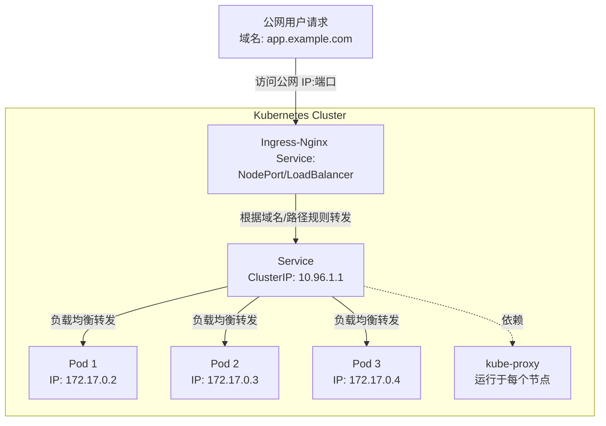
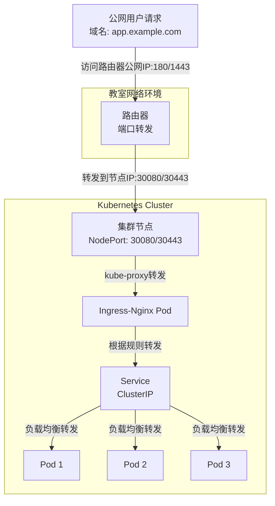
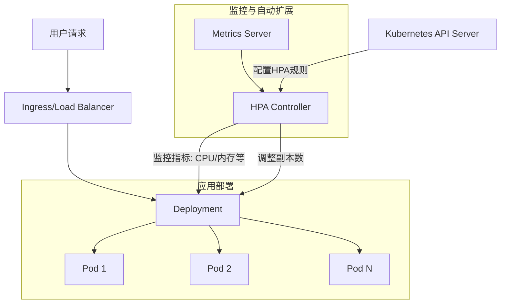
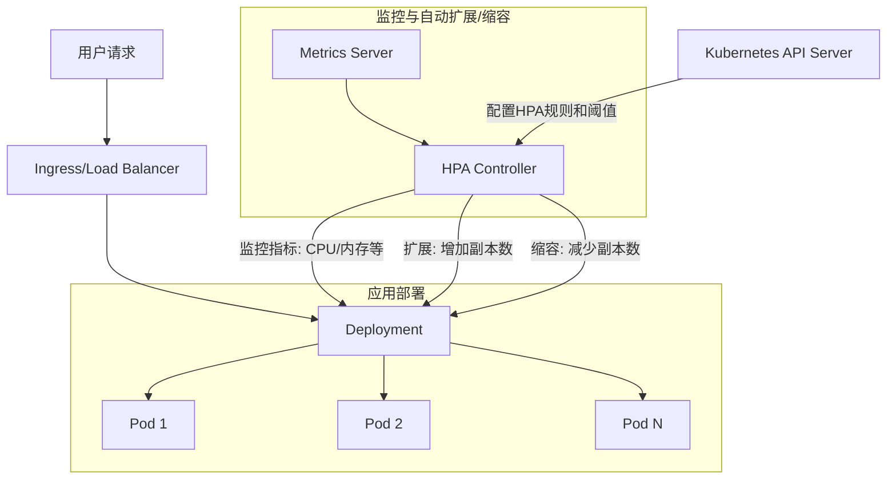

# IngresNginx 与 HPA(水平自动扩展)

## 学习目标
1. 理解 Ingress 和 Ingress-Nginx 的核心概念与作用，掌握其作为 Kubernetes 高级流量管理资源的功能，区分 Ingress 与 Service 的使用场景，并了解 Ingress-Nginx 支持域名路由、路径匹配和 SSL 终止等特性。
2. 掌握 Ingress-Nginx 的基本配置与应用，能够编写简单的 Ingress 资源配置文件，为应用配置基于域名的访问入口，并通过 kubectl 或 Kuboard 验证配置效果，确保外部流量正确路由到目标服务。
3. 理解水平自动扩展（HPA）的原理与价值，能够描述 HPA 基于资源指标（如 CPU、内存）或自定义指标动态调整 Pod 副本数的工作机制，并解释其在流量高峰场景下的作用及与 Deployment 静态副本管理的区别。
4. 掌握 HPA 的基本配置与验证，能够为 Deployment 配置 HPA 资源，设置基于 CPU 利用率的扩展规则，并通过 kubectl 或 Kuboard 观察 Pod 副本数量变化，验证自动扩展效果。
5. 具备综合应用能力，能够在 Kubernetes 集群中结合 Ingress-Nginx 和 HPA 部署一个简单的无状态应用（如 Web 服务器），实现外部访问与动态扩展，并分析流量管理与资源扩展如何提升应用的高可用性。

## 第一部分：Ingress-Nginx 详解

### 1.1 Ingress-Nginx 是什么？与 Service 如何搭配？

#### 1.1.1 Ingress 和 Ingress-Nginx 的基本概念
- **Ingress**：Ingress 是 Kubernetes 提供的一种高级流量管理资源，用于管理外部访问集群内部服务的方式。它通过定义规则（如基于域名或路径的路由），将外部流量转发到集群内的 Service 上。相比于 Service 的简单端口转发，Ingress 提供了更复杂的路由功能，例如支持域名路由、路径匹配、SSL 终止等，特别适合 Web 应用和 API 网关场景。
- **Ingress-Nginx**：Ingress-Nginx 是 Ingress 的一种具体实现方式，即 Ingress Controller。Kubernetes 中的 Ingress 资源本身只是一个声明式配置，需要一个控制器来解析和执行这些规则。Ingress-Nginx 是最常用的控制器之一，它基于 Nginx（一个高性能的 Web 服务器和反向代理工具）构建，支持丰富的功能，如域名路由、路径重写、限流、SSL 证书管理等。

**通俗比喻**：如果把 Ingress 比作一个“交通规则手册”，定义了外部流量如何进入集群，那么 Ingress-Nginx 就是“交通警察”，实际执行这些规则，确保流量按照手册指引到达正确的地方。

#### 1.1.2 Ingress-Nginx 与 Service 的搭配关系
- **Service 的作用**：Service 是 Kubernetes 中为 Pod 提供稳定访问入口的资源，解决 Pod IP 动态变化的问题。它通过 ClusterIP、NodePort 或 LoadBalancer 等类型，将流量转发到后端的 Pod 上。但 Service 本身功能较为基础，主要关注端口和负载均衡，无法处理复杂的路由规则（如基于域名的转发）。
- **Ingress-Nginx 的补充**：Ingress-Nginx 构建在 Service 之上，负责处理更高级的流量管理需求。它通过定义 Ingress 资源，将外部流量根据域名或路径转发到不同的 Service 上，而 Service 再将流量转发到具体的 Pod 上。
- **搭配方式**：在实际应用中，Ingress-Nginx 通常作为一个入口网关，接收外部流量，并根据 Ingress 规则将流量转发到对应的 Service。Service 则负责将流量分发到后端的 Pod 上。这样，Ingress-Nginx 和 Service 形成了一个完整的流量转发链条：外部流量 → Ingress-Nginx → Service → Pod。

**通俗比喻**：Service 就像小区的“门卫”，负责把访客（流量）带到具体的楼栋（Pod）；而 Ingress-Nginx 就像城市级的“交通指挥中心”，根据访客的目的地（域名或路径）决定把他们送到哪个小区（Service）。

#### 1.1.3 流量路径：从公网到 Ingress-Nginx 到 Service 再到 Pod
以下是外部流量从公网进入 Kubernetes 集群并最终到达 Pod 的完整路径：
1. **外部请求发起**：用户通过浏览器或客户端发起请求，目标是一个域名（如 `app.example.com`）或公网 IP 地址加端口。
2. **到达 Ingress-Nginx**：请求首先到达 Ingress-Nginx 控制器。Ingress-Nginx 通常以 Service 的形式暴露在集群外部（常见类型为 NodePort 或 LoadBalancer），用户通过公网 IP 和端口访问到它。Ingress-Nginx 根据 Ingress 资源中定义的规则（如域名或路径），决定将流量转发到哪个 Service。
3. **转发到 Service**：Ingress-Nginx 将流量转发到目标 Service（通常是 ClusterIP 类型）。Service 是一个虚拟 IP 层，由 `kube-proxy` 维护，通过标签选择器找到后端的 Pod，并通过负载均衡策略将流量分发到某个 Pod。
4. **最终到达 Pod**：流量通过集群网络（依赖 CNI 插件）到达目标 Pod，Pod 内的容器处理请求并返回响应。响应沿原路径返回给用户。

**Mermaid 图展示流量路径**：


**图解说明**：
- **步骤 1**：用户请求通过公网到达 Ingress-Nginx（通常通过 NodePort 或 LoadBalancer 类型的 Service 暴露）。
- **步骤 2**：Ingress-Nginx 根据 Ingress 规则将流量转发到对应的 Service（ClusterIP）。
- **步骤 3**：Service 由 `kube-proxy` 维护，通过负载均衡将流量转发到后端 Pod。

**通俗比喻**：流量路径就像寄快递：你（用户）把包裹寄到一个中央仓库（Ingress-Nginx），仓库根据地址标签（域名/路径）分拣包裹并送到某个小区（Service），小区门卫（Service）再把包裹送到具体住户（Pod）。

### 1.2 为什么 Ingress-Nginx 也是 Service NodePort？

#### 1.2.1 Ingress-Nginx 的部署方式
- Ingress-Nginx 作为 Ingress 控制器，通常以 Pod 的形式运行在 Kubernetes 集群中。为了让外部流量能够访问到 Ingress-Nginx，需要通过 Service 将其暴露出去。
- 在大多数非云环境（如本地或教室环境）中，Ingress-Nginx 的 Service 通常配置为 **NodePort** 类型。这意味着 Kubernetes 会在每个节点上分配一个端口（默认范围 30000-32767，或手动指定），外部流量可以通过 `节点IP:NodePort` 访问到 Ingress-Nginx。

#### 1.2.2 为什么选择 NodePort？
- **简单易用**：NodePort 是一种简单直接的方式，无需依赖云提供商的负载均衡器（LoadBalancer），适合本地开发、测试或资源受限的环境。
- **外部访问需求**：Ingress-Nginx 的主要作用是接收外部流量，因此需要一种方式将集群内部的 Pod 暴露到外部。NodePort 通过在节点上开放端口，允许外部流量直接访问 Ingress-Nginx 的 Service。
- **通用性**：NodePort 不依赖特定的云环境或网络配置，几乎可以在任何 Kubernetes 集群上快速部署和测试。

#### 1.2.3 NodePort 的工作原理
- 当 Ingress-Nginx 的 Service 配置为 NodePort 类型时，Kubernetes 会在每个节点上监听指定的端口。外部请求到达 `节点IP:NodePort` 后，`kube-proxy` 会将流量转发到 Ingress-Nginx 的 Pod 上。
- 例如，如果 Ingress-Nginx 的 Service 指定了 `nodePort: 30080`，你可以通过 `任何节点IP:30080` 访问 Ingress-Nginx，流量会最终到达 Ingress-Nginx Pod。

**通俗比喻**：NodePort 就像在每个小区门口开了一个临时窗口（端口），访客可以通过这个窗口联系到小区的“接待中心”（Ingress-Nginx Pod），接待中心再根据访客的需求分发到具体住户（后端 Service 和 Pod）。

### 1.3 教室环境中的端口转发：路由器与 180/1443 端口

#### 1.3.1 教室环境的网络限制
- 在教室或非企业网络环境中，通常没有公网 IP 或标准的 80（HTTP）和 443（HTTPS）端口可用。80 和 443 是 Web 服务的标准端口，但在非企业环境中，这些端口可能被 ISP（互联网服务提供商）限制，或无法直接对外开放。
- 为了解决这个问题，我们使用路由器进行端口转发，将外部流量从自定义端口（如 180 和 1443）转发到 Kubernetes 集群中 Ingress-Nginx 的 NodePort 端口。

#### 1.3.2 路由器端口转发的配置
- **路由器配置**：在教室环境中，我们会在路由器上配置端口转发规则。例如，将外部访问的 `路由器公网IP:180` 转发到集群某个节点的 `节点IP:30080`（Ingress-Nginx 的 NodePort），将 `路由器公网IP:1443` 转发到 `节点IP:30443`（用于 HTTPS 的 NodePort）。
- **流量路径**：用户通过 `路由器公网IP:180` 或 `路由器公网IP:1443` 访问服务，路由器将流量转发到集群节点的 NodePort 端口，节点上的 `kube-proxy` 再将流量转发到 Ingress-Nginx Pod。

#### 1.3.3 为什么使用 180 和 1443 端口？
- 由于非企业网络的限制，无法直接使用标准端口 80 和 443，因此选择 180 和 1443 作为替代端口。这两个端口是自定义选择的，避免与其他服务冲突，同时便于记忆（1443 接近 443）。
- **未来展望**：在企业或云环境中，可以使用 LoadBalancer 类型的 Service，自动分配公网 IP 并绑定到标准端口 80 和 443，无需手动配置路由器转发，也无需使用非标准端口。LoadBalancer 会直接将流量转发到 Ingress-Nginx，简化配置并提升用户体验。

**通俗比喻**：在教室环境里，我们就像在小区门口设置了一个临时代理窗口（路由器端口 180/1443），访客通过这个窗口联系到小区内部的接待中心（Ingress-Nginx 的 NodePort），虽然不是标准的正门（80/443），但也能完成任务。等到使用云环境时，我们会直接打开正门（LoadBalancer 绑定 80/443），访客可以更方便地进入。

#### Mermaid 图展示教室环境中的端口转发流量路径：


### 1.4 Ingress-Nginx 与传统 Nginx 的对比

#### 1.4.1 功能定位不同
- **传统 Nginx**：是一个独立的高性能 Web 服务器和反向代理工具，通常手动配置文件（如 `nginx.conf`），用于静态网站托管、负载均衡、反向代理等场景。
- **Ingress-Nginx**：是专门为 Kubernetes 设计的控制器，动态解析 Ingress 资源（Kubernetes 的 YAML 配置），无需手动修改配置文件，自动实现流量路由和负载均衡，适配 Kubernetes 的动态环境。

#### 1.4.2 配置方式不同
- **传统 Nginx**：需要手动编写配置文件，定义服务器块（Server Block）、路由规则等，修改后需重载配置。
- **Ingress-Nginx**：通过 Kubernetes 的 Ingress 资源定义规则，控制器自动读取并应用这些规则，无需直接操作 Nginx 配置文件，更加自动化和声明式。

#### 1.4.3 运行环境不同
- **传统 Nginx**：可以独立运行在任何服务器上，作为通用的 Web 服务器或代理。
- **Ingress-Nginx**：运行在 Kubernetes 集群中，以 Pod 形式部署，通过 Service 暴露，通常与 Kubernetes 的其他组件（如 Service、Pod）紧密集成。

#### 1.4.4 功能扩展不同
- **传统 Nginx**：功能扩展需要安装模块或手动配置，可能需要重新编译。
- **Ingress-Nginx**：内置了许多 Kubernetes 专用的功能（如 Annotations 支持自定义配置），并通过社区维护不断更新，适配云原生场景。

**通俗比喻**：传统 Nginx 就像一个手动操作的交通指挥员，需要你亲自告诉他每条路怎么走；Ingress-Nginx 则像一个智能交通系统，自动根据规则（Ingress 资源）指挥流量，专门为 Kubernetes 这种“城市”（集群）设计。


## 第二部分: 安装 `ingress-nginx` 的步骤（官方 GitHub 源）

#### 1. 获取官方 GitHub 源
- 访问官方 GitHub 仓库：https://github.com/kubernetes/ingress-nginx
- 根据您的 Kubernetes 版本选择合适的 `ingress-nginx` 版本。
- 以上操作，老师在教案中有准备一份`ingress-nginx-deploy-cn.yml`, 学员不需要操作，直接使用即可。


#### 2. 查看支持的版本表（Supported Versions Table）
- 参考官方支持的版本表，确认与您 Kubernetes 版本兼容的 `ingress-nginx` 版本。
- 您的 Kubernetes 版本是 **1.28**，根据版本表，支持的 `ingress-nginx` 版本范围为 **v1.10.1 到 v1.12.5**。
- 为了稳定性（运维不尝鲜的原则），选择版本 **v1.12.4**。

#### 3. 选择安装方式
- 进入 `ingress-nginx` 仓库中的文件夹路径：`deploy/static/provider`。
- 该路径下有多种安装方式，适用于不同环境：
  - `aws`：适用于 AWS 云环境。
  - `baremetal`：适用于物理机（裸机）环境。
  - `cloud`：通用云环境。
  - `do`：DigitalOcean 云环境。
  - `exoscale`：Exoscale 云环境。
  - `kind`：适用于 Kind（Kubernetes in Docker）环境。
  - `oracle`：Oracle 云环境。
  - `scw`：Scaleway 云环境。
- 由于您使用的是物理机环境，应选择 **baremetal**（裸机）版本。

#### 4. 下载并修改部署文件（针对国内环境）
- 下载裸机版本的部署文件：
  - URL：https://github.com/kubernetes/ingress-nginx/blob/controller-v1.12.4/deploy/static/provider/baremetal/deploy.yaml
- 由于国内网络环境限制，直接拉取官方镜像可能会较慢或失败，因此需要手动替换镜像地址并调整资源限制。

##### 4.1 替换镜像地址
- 访问国内镜像同步网站（如渡渡鸟镜像同步网站：https://docker.aityp.com/）查找指定版本的镜像地址。
- 需要替换的官方镜像包括：
  - `registry.k8s.io/ingress-nginx/kube-webhook-certgen:v1.6.0`
  - `registry.k8s.io/ingress-nginx/controller:v1.12.4`
- 将上述镜像地址修改为国内加速镜像地址（具体地址需在镜像同步网站上查询）。

##### 4.2 修改资源限制
- 在 `deploy.yaml` 文件中找到 `Deployment` 资源部分（大约在第482行）。
- 添加或修改资源限制配置，确保 `ingress-nginx` 运行时不会占用过多资源：
  ```yaml
  resources:
    requests:
      cpu: 100m
      memory: 90Mi
    limits:
      cpu: 1
      memory: 1024Mi
  ```
  - `requests`：指定最低资源需求，CPU 为 100m（0.1核），内存为 90Mi。
  - `limits`：指定最大资源限制，CPU 为 1核，内存为 1024Mi（1Gi）。

##### 4.3 调整滚动更新策略
- 在 `deploy.yaml` 文件中找到 `Deployment` 资源部分（大约在第409行）。
- 添加或修改滚动发布与replicas配置，确保 `ingress-nginx` 非单节点运行：
- 因为ingress-nignx是整个集群的流量入口，最少需要2个节点，才能确保高可用。
  ```yaml
  replicas: 2
  strategy:
    rollingUpdate:
      maxUnavailable: 25%
      maxSurge: 25%
    type: RollingUpdate
  ```
  - `replicas`：指定 `ingress-nginx`: 控制器的副本数为 2，确保高可用。
  - `maxUnavailable`与 `maxSurge`: 滚动更新策略，`maxUnavailable` 表示最大不可用副本数，`maxSurge` 表示最大额外副本数。

#### 5. 安装 `ingress-nginx`
- 使用修改后的 `deploy.yaml` 文件，执行安装命令，完成 `ingress-nginx` 的完整部署。
- 确保所有配置符合您的环境需求，运行 `kubectl apply -f deploy.yaml` 或其他相关命令进行安装。


## 第三部分：`ingress-nginx` 的优化配置与实现
都是老师操作的，你们去给我看看我怎么配置的，以后到工作的时候，按照我的内容来配置。


#### 1. 介绍命名空间 `ingress-nginx` 的 `ConfigMap`：`ingress-nginx-controller`
在 Kubernetes 环境中，`ingress-nginx` 的配置主要通过 `ConfigMap` 资源来管理，用于定义 Nginx 的行为和参数。

- **命名空间**：通常 `ingress-nginx` 部署在 `ingress-nginx` 命名空间中（如果您自定义了命名空间，则以实际为准）。
- **ConfigMap 名称**：默认情况下，配置存储在名为 `ingress-nginx-controller` 的 `ConfigMap` 中。
- **自动重载（Reload）**：修改 `ConfigMap` 后，`ingress-nginx` 会自动检测配置变化并重新加载配置，无需重启 Pod，方便动态调整。
- **官方文档**：更多配置项和说明可在官方文档中查阅：[https://kubernetes.github.io/ingress-nginx/user-guide/nginx-configuration/configmap/](https://kubernetes.github.io/ingress-nginx/user-guide/nginx-configuration/configmap/)。

**操作方式**：
- **命令行操作**：使用以下命令查看或编辑 `ConfigMap`：
  ```bash
  kubectl edit configmap ingress-nginx-controller -n ingress-nginx
  ```
- **Kuboard 界面操作**：如果您使用 Kuboard 管理 Kubernetes 集群，可以通过以下步骤操作：
  1. 登录 Kuboard 界面。
  2. 在左侧导航栏选择“命名空间”，找到 `ingress-nginx` 命名空间。
  3. 进入命名空间后，点击“配置与存储” -> “ConfigMap”，找到 `ingress-nginx-controller`。
  4. 点击编辑按钮，修改配置内容，保存后配置会自动应用。

`ConfigMap` 示例：
```yaml
apiVersion: v1
kind: ConfigMap
metadata:
  name: ingress-nginx-controller
  namespace: ingress-nginx
data:
  log-format-upstream: '{"time_local":"$time_local", "remote_addr":"$remote_addr", "host":"$host"}'
  server-tokens: "false"
  # 其他配置项...
```

#### 2. 传统 Nginx 配置优化与在 `ingress-nginx` 中的实现
以下是您提供的传统 `nginx.conf` 优化配置，以及如何将其映射到 `ingress-nginx` 中。对于无法直接映射的配置项，我会说明原因并提供替代方案。

##### 2.1 运行用户和工作进程数
**传统 Nginx 配置**：
```nginx
user www-data;
worker_processes auto;
```
**在 `ingress-nginx` 中的实现**：
- `user`：`ingress-nginx` 在容器中运行，通常以非 root 用户运行，无需手动配置用户。
- `worker_processes`：可以通过 `ConfigMap` 设置：
  ```yaml
  data:
    worker-processes: "auto"
  ```
- 说明：`worker-processes` 建议设置为 `auto`，让 Nginx 根据 CPU 核心数自动调整。

##### 2.2 事件模块配置
**传统 Nginx 配置**：
```nginx
events {
    use epoll;
    worker_connections 1024;
    multi_accept on;
}
```
**在 `ingress-nginx` 中的实现**：
- `use epoll`：`ingress-nginx` 默认根据操作系统选择最佳事件驱动模型（如 Linux 使用 `epoll`），无需手动配置。
- `worker_connections`：可以通过 `ConfigMap` 设置：
  ```yaml
  data:
    worker-connections: "1024"
  ```
- `multi_accept`：目前 `ingress-nginx` 不直接支持此参数，但其底层已针对高并发优化。

##### 2.3 日志优化
**传统 Nginx 配置**：
```nginx
log_format json_combined escape=json '{"time_local":"$time_local", "remote_addr":"$remote_addr", "host":"$host", "request":"$request", "status":"$status", "body_bytes_sent":"$body_bytes_sent", "http_referer":"$http_referer", "http_user_agent":"$http_user_agent", "http_x_forwarded_for":"$http_x_forwarded_for", "request_time":"$request_time", "upstream_response_time":"$upstream_response_time", "upstream_addr":"$upstream_addr"}';
access_log /var/log/nginx/access.log json_combined;
error_log /var/log/nginx/error.log warn;
```
**在 `ingress-nginx` 中的实现**：
- 在 `ConfigMap` 中添加：
  ```yaml
  data:
    log-format-upstream: '{"time_local":"$time_local", "remote_addr":"$remote_addr", "host":"$host", "request":"$request", "status":"$status", "body_bytes_sent":"$body_bytes_sent", "http_referer":"$http_referer", "http_user_agent":"$http_user_agent", "http_x_forwarded_for":"$http_x_forwarded_for", "request_time":"$request_time", "upstream_response_time":"$upstream_response_time", "upstream_addr":"$upstream_addr"}'
    enable-access-log: "true"
  ```
- 说明：日志路径由 Kubernetes 环境管理，无法直接指定。可以通过 Pod 日志收集工具（如 Fluentd、ELK）获取日志。

##### 2.4 隐藏 Nginx 版本号
**传统 Nginx 配置**：
```nginx
server_tokens off;
```
**在 `ingress-nginx` 中的实现**：
- 在 `ConfigMap` 中添加：
  ```yaml
  data:
    server-tokens: "false"
  ```

##### 2.5 文件传输和连接超时
**传统 Nginx 配置**：
```nginx
sendfile on;
tcp_nopush on;
tcp_nodelay on;
keepalive_timeout 65;
client_max_body_size 20m;
```
**在 `ingress-nginx` 中的实现**：
- 在 `ConfigMap` 中添加：
  ```yaml
  data:
    sendfile: "true"
    tcp-nopush: "true"
    tcp-nodelay: "true"
    keep-alive: "65"
    client-max-body-size: "20m"
  ```

##### 2.6 GZIP 压缩配置
**传统 Nginx 配置**：
```nginx
gzip on;
gzip_disable "msie6";
gzip_vary on;
gzip_proxied any;
gzip_comp_level 6;
gzip_min_length 1000;
gzip_types text/plain text/css application/json application/javascript text/xml application/xml application/xml+rss text/javascript image/svg+xml;
```
**在 `ingress-nginx` 中的实现**：
- 在 `ConfigMap` 中添加：
  ```yaml
  data:
    gzip: "true"
    gzip-types: "text/plain text/css application/json application/javascript text/xml application/xml application/xml+rss text/javascript image/svg+xml"
    gzip-min-length: "1000"
    gzip-vary: "true"
    gzip-proxied: "any"
    gzip-disable: "msie6"
  ```

##### 2.7 安全相关的响应头配置
**传统 Nginx 配置**：
```nginx
add_header X-Frame-Options "SAMEORIGIN";
add_header X-Content-Type-Options "nosniff";
add_header X-XSS-Protection "1; mode=block";
add_header Strict-Transport-Security "max-age=31536000" always;
```
**在 `ingress-nginx` 中的实现**：
- 在 `ConfigMap` 中添加：
  ```yaml
  data:
    add-headers: |
      X-Frame-Options: SAMEORIGIN
      X-Content-Type-Options: nosniff
      X-XSS-Protection: 1; mode=block
      Strict-Transport-Security: max-age=31536000; includeSubDomains; preload
  ```

##### 2.8 SSL 会话缓存与协议配置
**传统 Nginx 配置**：
```nginx
ssl_session_cache shared:SSL:10m;
ssl_session_timeout 10m;
ssl_protocols TLSv1.2 TLSv1.3;
ssl_prefer_server_ciphers on;
ssl_ciphers ECDHE-ECDSA-AES128-GCM-SHA256:ECDHE-RSA-AES128-GCM-SHA256:ECDHE-ECDSA-AES256-GCM-SHA384:ECDHE-RSA-AES256-GCM-SHA384:ECDHE-ECDSA-CHACHA20-POLY1305:ECDHE-RSA-CHACHA20-POLY1305:DHE-RSA-AES128-GCM-SHA256:DHE-RSA-AES256-GCM-SHA384;
```
**在 `ingress-nginx` 中的实现**：
- 在 `ConfigMap` 中添加：
  ```yaml
  data:
    ssl-session-cache: "true"
    ssl-session-cache-size: "10m"
    ssl-session-timeout: "10m"
    ssl-protocols: "TLSv1.2 TLSv1.3"
    ssl-prefer-server-ciphers: "true"
    ssl-ciphers: "ECDHE-ECDSA-AES128-GCM-SHA256:ECDHE-RSA-AES128-GCM-SHA256:ECDHE-ECDSA-AES256-GCM-SHA384:ECDHE-RSA-AES256-GCM-SHA384:ECDHE-ECDSA-CHACHA20-POLY1305:ECDHE-RSA-CHACHA20-POLY1305:DHE-RSA-AES128-GCM-SHA256:DHE-RSA-AES256-GCM-SHA384"
  ```

#### 3. `ingress-nginx` 独有的优化参数
`ingress-nginx` 除了支持传统 Nginx 配置外，还提供了一些 Kubernetes 环境特有的优化参数，以下是一些常用的独有参数：

- **`enable-opentracing`**：启用 OpenTracing 支持，便于分布式追踪（如与 Jaeger 集成）。
  ```yaml
  data:
    enable-opentracing: "true"
  ```
- **`proxy-buffer-size`** 和 **`proxy-buffers`**：调整代理缓冲区大小，适用于处理大请求头（如包含大量 Cookie）。
  ```yaml
  data:
    proxy-buffer-size: "8k"
    proxy-buffers: "4 8k"
  ```
- **`upstream-max-fails`** 和 **`upstream-fail-timeout`**：配置上游服务的健康检查参数，避免请求转发到不可用服务。
  ```yaml
  data:
    upstream-max-fails: "3"
    upstream-fail-timeout: "30"
  ```
- **`use-forwarded-headers`**：启用后，`ingress-nginx` 会信任上游代理（如负载均衡器）发送的 `X-Forwarded-*` 头信息，获取真实客户端 IP。
  ```yaml
  data:
    use-forwarded-headers: "true"
  ```
- **`enable-real-ip`**：启用真实 IP 获取，结合 `real-ip-header` 使用，确保日志记录客户端真实 IP。
  ```yaml
  data:
    enable-real-ip: "true"
    real-ip-header: "X-Real-IP"
  ```
- **`limit-rate`** 和 **`limit-burst`**：全局限速配置，防止 DDoS 攻击（也可以通过 `Ingress` 注解针对特定服务配置）。
  ```yaml
  data:
    limit-rate: "50"
    limit-burst: "100"
  ```

更多独有参数和详细说明可参考官方文档：[https://kubernetes.github.io/ingress-nginx/user-guide/nginx-configuration/configmap/](https://kubernetes.github.io/ingress-nginx/user-guide/nginx-configuration/configmap/)。

#### 4. 其他优化建议
- **资源限制与请求**：为 `ingress-nginx` 的 Pod 设置合理的 CPU 和内存限制，避免资源竞争。
  ```yaml
  resources:
    limits:
      cpu: "500m"
      memory: "512Mi"
    requests:
      cpu: "200m"
      memory: "256Mi"
  ```
- **监控集成**：使用 Prometheus 和 Grafana 监控 `ingress-nginx` 的性能指标，启用内置的 `/metrics` 端点。
  ```yaml
  data:
    enable-metrics: "true"
    metrics-port: "10254


#### 5. 完整的 `ingress-nginx` 优化配置
以下是一个完整的 `ConfigMap` 配置示例，涵盖了传统 Nginx 优化的映射配置以及 `ingress-nginx` 独有的优化参数：

```yaml
apiVersion: v1
kind: ConfigMap
metadata:
  name: ingress-nginx-controller
  namespace: ingress-nginx
data:
  # 工作进程和连接数优化
  worker-processes: "auto"
  worker-connections: "1024"
  
  # 日志格式优化（JSON 格式）
  log-format-upstream: '{"time_local":"$time_local", "remote_addr":"$remote_addr", "host":"$host", "request":"$request", "status":"$status", "body_bytes_sent":"$body_bytes_sent", "http_referer":"$http_referer", "http_user_agent":"$http_user_agent", "http_x_forwarded_for":"$http_x_forwarded_for", "request_time":"$request_time", "upstream_response_time":"$upstream_response_time", "upstream_addr":"$upstream_addr"}'
  enable-access-log: "true"
  
  # 隐藏 Nginx 版本号
  server-tokens: "false"
  
  # 文件传输和连接超时优化
  sendfile: "true"
  tcp-nopush: "true"
  tcp-nodelay: "true"
  keep-alive: "65"
  client-max-body-size: "20m"
  
  # GZIP 压缩配置
  gzip: "true"
  gzip-types: "text/plain text/css application/json application/javascript text/xml application/xml application/xml+rss text/javascript image/svg+xml"
  gzip-min-length: "1000"
  gzip-vary: "true"
  gzip-proxied: "any"
  gzip-disable: "msie6"
  
  # 安全相关的响应头配置
  add-headers: |-
    X-Frame-Options: SAMEORIGIN
    X-Content-Type-Options: nosniff
    X-XSS-Protection: 1; mode=block
    Strict-Transport-Security: max-age=31536000; includeSubDomains; preload
  
  # SSL 会话缓存与协议配置
  ssl-session-cache: "true"
  ssl-session-cache-size: "10m"
  ssl-session-timeout: "10m"
  ssl-protocols: "TLSv1.2 TLSv1.3"
  ssl-prefer-server-ciphers: "true"
  ssl-ciphers: "ECDHE-ECDSA-AES128-GCM-SHA256:ECDHE-RSA-AES128-GCM-SHA256:ECDHE-ECDSA-AES256-GCM-SHA384:ECDHE-RSA-AES256-GCM-SHA384:ECDHE-ECDSA-CHACHA20-POLY1305:ECDHE-RSA-CHACHA20-POLY1305:DHE-RSA-AES128-GCM-SHA256:DHE-RSA-AES256-GCM-SHA384"
  
  # ingress-nginx 独有优化参数
  proxy-buffer-size: "8k"
  proxy-buffers: "4 8k"
  upstream-max-fails: "3"
  upstream-fail-timeout: "30"
  use-forwarded-headers: "true"
  enable-real-ip: "true"
  real-ip-header: "X-Real-IP"
  limit-rate: "50"
  limit-burst: "100"
  
  # 监控相关配置（仅针对 Prometheus）
  enable-metrics: "true"
  metrics-port: "10254"
  
  # 保留 OpenTracing 配置以备将来使用 Jaeger
  enable-opentracing: "false"  # 暂时禁用，保留以备将来启用
```


## 第四部分：`ingress-nginx` 的语法学习

### 1. `Ingress` 语法与结构详细介绍
`Ingress` 是 Kubernetes 中的一种资源对象，用于定义外部访问集群内部服务的规则。`ingress-nginx` 作为一种常用的 Ingress 控制器，会根据 `Ingress` 资源的定义生成对应的 Nginx 配置。

#### 1.1 `Ingress` 资源的基本结构
`Ingress` 资源的 YAML 文件通常包含以下核心部分：
- **`apiVersion`**：指定 Kubernetes API 版本，通常为 `networking.k8s.io/v1`（较新版本）或 `extensions/v1beta1`（旧版本）。
- **`kind`**：资源类型，固定为 `Ingress`。
- **`metadata`**：元数据信息，用于描述资源。
  - **`name`**：`Ingress` 资源的名称，唯一标识。
  - **`namespace`**：资源所在的命名空间，与目标 Service 通常一致。
  - **`annotations`**：附加配置，`ingress-nginx` 通过注解提供额外的功能，如重写规则、限速、认证等。常用注解前缀为 `nginx.ingress.kubernetes.io/`。
- **`spec`**：定义 `Ingress` 的具体行为和路由规则。
  - **`ingressClassName`**：指定使用的 Ingress 控制器类，通常为 `nginx`，表示由 `ingress-nginx` 处理（旧版本可能使用注解 `kubernetes.io/ingress.class: nginx`）。
  - **`tls`**：配置 TLS（HTTPS）支持。
    - **`hosts`**：列出支持 HTTPS 的域名。
    - **`secretName`**：引用存储 TLS 证书和私钥的 Secret 资源名称。
  - **`rules`**：定义路由规则。
    - **`host`**：指定匹配的域名（可选，若不指定则匹配所有域名）。
    - **`http`**：定义 HTTP 路由规则。
      - **`paths`**：定义路径匹配规则。
        - **`path`**：指定路径字符串，如 `/`、`/api`。
        - **`pathType`**：路径匹配类型，支持 `Exact`（精确匹配）、`Prefix`（前缀匹配）、`ImplementationSpecific`（控制器特定实现）。
        - **`backend`**：指定后端目标。
          - **`service`**：引用目标 Service。
            - **`name`**：Service 名称。
            - **`port`**：Service 的端口，可以是 `number`（端口号）或 `name`（端口名称）。

### 1.2 基本结构示例
以下是一个最基本的 `Ingress` 资源配置，展示了结构层次，并附上详细注释：

```yaml
apiVersion: networking.k8s.io/v1  # 指定 Kubernetes API 版本，Ingress 资源属于 networking.k8s.io 组的 v1 版本
kind: Ingress                     # 资源类型为 Ingress，用于定义外部流量如何进入集群内部服务
metadata:                         # 元数据，包含资源的基本信息
  name: basic-ingress             # Ingress 资源的名称，唯一标识该资源
  namespace: default              # 资源所在的命名空间，这里是默认命名空间 default
spec:                             # 规范部分，定义 Ingress 的具体配置和行为
  ingressClassName: nginx         # 指定 Ingress 控制器类型为 nginx，表示使用 NGINX Ingress Controller 处理此资源
  rules:                          # 路由规则列表，定义如何根据域名和路径转发请求
  - host: example.com             # 指定域名，只有匹配此域名的请求才会被处理
    http:                         # HTTP 协议配置，定义路径和后端服务
      paths:                      # 路径列表，定义具体的路径匹配规则
      - path: /                   # 路径为根路径 /，表示匹配所有以 / 开头的请求
        pathType: Prefix          # 路径类型为 Prefix，表示匹配以指定路径为前缀的请求
        backend:                  # 后端配置，定义请求转发到的目标服务
          service:                # 目标服务配置
            name: my-service      # 目标服务的名称，需在同一命名空间内存在
            port:                 # 目标服务的端口
              number: 80          # 服务监听的端口号为 80
```

### 1.3 常用案例模板
以下是几种常见场景下的 `Ingress` 配置模板，均附上详细注释，供学习和参考：

#### 模板 1：单域名单路径转发
适用于将某个域名下的所有请求转发到单一服务。

```yaml
apiVersion: networking.k8s.io/v1  # 指定 Kubernetes API 版本
kind: Ingress                     # 资源类型为 Ingress
metadata:                         # 元数据部分
  name: single-path-ingress       # Ingress 资源的名称
  namespace: default              # 资源所在的命名空间
spec:                             # 规范部分，定义具体配置
  ingressClassName: nginx         # 指定 Ingress 控制器为 nginx
  tls:                            # TLS 配置，用于启用 HTTPS
  - hosts:                        # 启用 TLS 的域名列表
    - example.com                 # 指定域名 example.com 使用 TLS
    secretName: example-tls       # 引用存储 TLS 证书的 Secret 名称，需提前创建
  rules:                          # 路由规则列表
  - host: example.com             # 匹配的域名，只有此域名的请求会被处理
    http:                         # HTTP 协议配置
      paths:                      # 路径匹配规则
      - path: /                   # 匹配根路径 /，即所有请求
        pathType: Prefix          # 路径类型为 Prefix，匹配以 / 开头的请求
        backend:                  # 请求转发到的后端服务
          service:                # 目标服务配置
            name: my-service      # 目标服务名称
            port:                 # 目标服务端口
              number: 80          # 服务监听端口为 80
```

**说明**：此模板适用于简单的单域名应用，所有请求都会转发到同一个服务，并通过 TLS 启用 HTTPS 访问。


#### 模板 2：单域名多路径转发
适用于一个域名下根据路径转发到不同服务（如前后端分离）。

```yaml
apiVersion: networking.k8s.io/v1  # 指定 Kubernetes API 版本
kind: Ingress                     # 资源类型为 Ingress
metadata:                         # 元数据部分
  name: multi-path-ingress        # Ingress 资源的名称
  namespace: default              # 资源所在的命名空间
spec:                             # 规范部分，定义具体配置
  ingressClassName: nginx         # 指定 Ingress 控制器为 nginx
  tls:                            # TLS 配置，用于启用 HTTPS
  - hosts:                        # 启用 TLS 的域名列表
    - app.com                     # 指定域名 app.com 使用 TLS
    secretName: app-tls           # 引用存储 TLS 证书的 Secret 名称
  rules:                          # 路由规则列表
  - host: app.com                 # 匹配的域名，只有此域名的请求会被处理
    http:                         # HTTP 协议配置
      paths:                      # 路径匹配规则列表
      - path: /api                # 匹配路径 /api，表示 API 请求
        pathType: Prefix          # 路径类型为 Prefix，匹配以 /api 开头的请求
        backend:                  # 请求转发到的后端服务
          service:                # 目标服务配置
            name: backend-service # 目标服务名称，用于处理 API 请求
            port:                 # 目标服务端口
              number: 8080        # 服务监听端口为 8080
      - path: /                   # 匹配根路径 /，表示其他非 API 请求
        pathType: Prefix          # 路径类型为 Prefix，匹配以 / 开头的请求
        backend:                  # 请求转发到的后端服务
          service:                # 目标服务配置
            name: frontend-service # 目标服务名称，用于处理前端请求
            port:                 # 目标服务端口
              number: 80          # 服务监听端口为 80
```

**说明**：此模板适用于前后端分离的场景，域名 `app.com` 下，`/api` 路径的请求转发到后端服务，其他请求（如前端页面）转发到前端服务。


#### 模板 3：多域名转发
适用于多个域名分别转发到不同服务，使用多证书配置。

```yaml
apiVersion: networking.k8s.io/v1  # 指定 Kubernetes API 版本
kind: Ingress                     # 资源类型为 Ingress
metadata:                         # 元数据部分
  name: multi-host-ingress        # Ingress 资源的名称
  namespace: default              # 资源所在的命名空间
spec:                             # 规范部分，定义具体配置
  ingressClassName: nginx         # 指定 Ingress 控制器为 nginx
  tls:                            # TLS 配置，用于启用 HTTPS
  - hosts:                        # 第一个域名及其 TLS 配置
    - api.example.com             # 指定域名 api.example.com 使用 TLS
    secretName: api-example-tls   # 引用存储 api.example.com 证书的 Secret 名称
  - hosts:                        # 第二个域名及其 TLS 配置
    - web.example.com             # 指定域名 web.example.com 使用 TLS
    secretName: web-example-tls   # 引用存储 web.example.com 证书的 Secret 名称
  rules:                          # 路由规则列表
  - host: api.example.com         # 匹配域名 api.example.com 的请求
    http:                         # HTTP 协议配置
      paths:                      # 路径匹配规则
      - path: /                   # 匹配根路径 /，即所有请求
        pathType: Prefix          # 路径类型为 Prefix，匹配以 / 开头的请求
        backend:                  # 请求转发到的后端服务
          service:                # 目标服务配置
            name: api-service     # 目标服务名称，用于处理 API 请求
            port:                 # 目标服务端口
              number: 8080        # 服务监听端口为 8080
  - host: web.example.com         # 匹配域名 web.example.com 的请求
    http:                         # HTTP 协议配置
      paths:                      # 路径匹配规则
      - path: /                   # 匹配根路径 /，即所有请求
        pathType: Prefix          # 路径类型为 Prefix，匹配以 / 开头的请求
        backend:                  # 请求转发到的后端服务
          service:                # 目标服务配置
            name: web-service     # 目标服务名称，用于处理前端请求
            port:                 # 目标服务端口
              number: 80          # 服务监听端口为 80
```

**说明**：此模板适用于多个域名分别指向不同服务的场景，每个域名使用独立的 TLS 证书（通过不同的 Secret 存储），确保安全性和灵活性。

### 带注解的配置（重写规则）

#### 概述
适用于需要路径重写的场景，通过注解实现路径转换。

```yaml
apiVersion: networking.k8s.io/v1  # 指定 Kubernetes API 版本
kind: Ingress                     # 资源类型为 Ingress
metadata:                         # 元数据
  name: rewrite-ingress           # Ingress 资源名称
  namespace: default              # 所在命名空间
  annotations:                    # 注解部分
    nginx.ingress.kubernetes.io/rewrite-target: /$2  # NGINX Ingress 控制器的路径重写规则
spec:                             # 规范部分
  ingressClassName: nginx         # 指定 Ingress 控制器类型
  tls:                            # TLS 配置
  - hosts:                        # TLS 适用的域名
    - api.example.com             # 域名
      secretName: api-example-tls   # TLS 证书 Secret 名称
  rules:                          # 路由规则
  - host: rewrite.example.com     # 匹配的域名
    http:                         # HTTP 协议配置
      paths:                      # 路径列表
      - path: /api(/|$)(.*)      # 匹配路径 /api 后的请求 我写的是/api(/|$)(.*) 不别没事找事写成/api/(/|$)(.*)
        pathType: ImplementationSpecific  # 路径类型
        backend:                  # 后端配置
          service:                # 目标服务配置
            name: api-service     # 目标服务名称
            port:                 # 目标服务端口
              number: 8080        # 服务监听的端口号
```

### 路径重写规则说明
- **注解的作用**：`nginx.ingress.kubernetes.io/rewrite-target: /$2` 表示将请求路径重写为指定的目标格式。在本例中，请求路径 `/api/v1/users` 会被重写为 `/v1/users`，即去掉 `/api/` 前缀。
- **正则表达式捕获组**：路径 `/api(/|$)(.*)` 中的 `(/|$)(.*)` 是一个捕获组，表示匹配 `/api` 后的所有内容，并将其存储为 `$2`。重写目标 `/$2` 会在转发到后端服务时将路径替换为捕获的内容。
- **适用场景**：适用于前端请求路径与后端服务路径不一致的情况，例如前端请求 `/api/something`，而后端服务只识别 `/something`。

### 图示

下面是带注解的配置逻辑图示：

````mermaid
  graph TD
    A[用户请求] -->|请求路径| B["/api/v1/users"]
    B -->|重写规则| C["/v1/users"]
    C -->|转发到| D[api-service]
    D -->|返回响应| E[用户响应]
    
    style A fill:#e1f5fe
    style B fill:#f3e5f5
    style C fill:#fff3e0
    style D fill:#e8f5e8
    style E fill:#fce4ec
````

### 说明图示内容
- **用户请求**：表示外部用户发起的请求。
- **请求路径**：显示原始请求路径 `/api/v1/users`。
- **重写规则**：展示重写后的路径 `/v1/users`。
- **转发到**：表示请求被转发到后端服务 `api-service`。
- **返回响应**：最终用户收到的响应。


#### 2. 路由匹配方法
`ingress-nginx` 支持基于域名和路径的路由匹配，以下通过表格形式详细说明各种匹配方法及其特点，方便日后学习和查阅。

| **匹配类型**          | **字段/配置**                     | **描述**                                                                 | **示例**                                      | **优先级**                     |
|-----------------------|-----------------------------------|-------------------------------------------------------------------------|----------------------------------------------|--------------------------------|
| **域名匹配 (Host)**   | `spec.rules.host`                | 根据请求的 `Host` 头匹配域名，支持具体域名或通配符。未指定 `host` 时匹配所有域名（默认规则）。 | `host: example.com` 或 `host: *.example.com` | 具体域名 > 通配符 > 默认规则   |
| **路径匹配 - Exact**  | `pathType: Exact`                | 精确匹配，路径必须完全一致，不包含子路径。                              | `path: /api`, 只匹配 `/api`，不匹配 `/api/` | 最高优先级                     |
| **路径匹配 - Prefix** | `pathType: Prefix`               | 前缀匹配，路径以指定值开头即可，包含子路径。                            | `path: /api`, 匹配 `/api` 和 `/api/test`     | 次高，低于 Exact               |
| **路径匹配 - ImplementationSpecific** | `pathType: ImplementationSpecific` | 由控制器决定匹配逻辑，通常等同于 `Prefix`，但可能有额外行为。             | `path: /api`                                 | 最低，取决于控制器实现         |
| **正则表达式匹配**    | 注解 `nginx.ingress.kubernetes.io/use-regex: "true"` | 启用正则表达式匹配路径，需配合 `rewrite-target` 使用。                   | `path: /api/(.*)`                            | 依赖注解，优先级由路径长度决定 |

**补充说明**：
- **优先级规则**：域名匹配优先于路径匹配；路径匹配中，`Exact` > `Prefix` > `ImplementationSpecific`；路径越长优先级越高。
- **通配符域名**：如 `*.example.com` 匹配 `sub.example.com`，但不匹配 `example.com`。
- **默认规则**：如果没有匹配的域名或路径规则，`ingress-nginx` 会尝试转发到默认后端（若配置）。


#### 3. 如何匹配 Service
`Ingress` 通过 `backend.service` 字段将流量转发到具体的 Service：
- **`name`**：指定目标 Service 的名称，必须与集群中已存在的 Service 名称一致。
- **`port`**：指定 Service 的端口，可以是：
  - **`number`**：直接指定端口号，如 `80`。
  - **`name`**：引用 Service 中定义的端口名称，如 `http`（推荐使用名称，便于维护）。
- **注意事项**：
  - Service 必须在同一命名空间内，或者通过全限定名（如 `service-name.namespace.svc.cluster.local`）引用其他命名空间的 Service。
  - Service 类型通常为 `ClusterIP`，因为 `Ingress` 负责外部访问，Service 仅需内部通信。

##### 示例：匹配 Service
```yaml
backend:
  service:
    name: my-service
    port:
      name: http
```
或
```yaml
backend:
  service:
    name: my-service
    port:
      number: 80
```

### 作业一：配置 shiqi-light.labworlds.cc 域名
这个作业的目标是为 shiqi-light.labworlds.cc 配置 HTTPS 访问，包括生成证书、创建 TLS Secret、配置 Ingress，并设置 Cloudflare DNS。

#### 步骤 1：生成自签名证书
由于证书是在 Linux 环境中生成，以下是为 `shiqi-light.labworlds.cc` 生成证书的完整命令和文件名。请在 Linux 环境中执行以下命令：

```bash
# 创建目录用于存放证书文件
mkdir -p /root/shiqi-light.labworlds.cc

# 进入目录
cd /root/shiqi-light.labworlds.cc

# 生成自签名证书和私钥
sudo openssl req -x509 -nodes -days 365 -newkey rsa:2048 \
    -keyout /root/shiqi-light.labworlds.cc/tls.key \
    -out /root/shiqi-light.labworlds.cc/tls.crt \
    -subj "/CN=shiqi-light.labworlds.cc"
```

**生成的文件**：
- 私钥文件：`/root/shiqi-light.labworlds.cc/tls.key`
- 证书文件：`/root/shiqi-light.labworlds.cc/tls.crt`

#### 步骤 2：复制证书内容
在 Linux 环境中，使用以下命令查看证书内容并复制到你的 Windows 电脑（可以通过文本编辑器保存为临时文件）：

```bash
# 查看私钥内容并复制
cat /root/shiqi-light.labworlds.cc/tls.key

# 查看证书内容并复制
cat /root/shiqi-light.labworlds.cc/tls.crt
```

#### 步骤 3：在 Kuboard 界面创建 TLS Secret
登录 Kuboard 界面，按照以下步骤创建 TLS Secret：
1. 进入你的集群，导航到 `shiqi` 命名空间。
2. 点击 `Secret` 或 `配置` 选项，选择创建新的 Secret。
3. 选择类型为 `TLS`，并按照以下内容填写：
   - **Secret 名称**：`secret-shiqi-light-labworlds-cc`
   - **TLS 证书 (CRT)**：粘贴 `tls.crt` 的内容
   - **TLS 私钥 (KEY)**：粘贴 `tls.key` 的内容
   - **命名空间**：`shiqi`
4. 保存创建。

#### 步骤 4：创建 Ingress 配置
1. 创建 `ingress-shiqi-light-labworlds-cc.yml` 文件
2. 编辑文件内容
    ```yaml
    apiVersion: networking.k8s.io/v1  # 指定 Kubernetes API 版本
    kind: Ingress                     # 资源类型为 Ingress
    metadata:                         # 元数据部分
      name: ingress-shiqi-light-labworlds-cc  # Ingress 资源名称，符合命名规范
      namespace: shiqi                # 资源所在的命名空间
    spec:                             # 规范部分，定义具体配置
      ingressClassName: nginx         # 指定 Ingress 控制器为 nginx
      tls:                            # TLS 配置，用于启用 HTTPS
      - hosts:                        # 启用 TLS 的域名列表
        - shiqi-light.labworlds.cc    # 指定域名
        secretName: secret-shiqi-light-labworlds-cc  # 引用对应的 TLS Secret
      rules:                          # 路由规则列表
      - host: shiqi-light.labworlds.cc  # 匹配的域名
        http:                         # HTTP 协议配置
          paths:                      # 路径匹配规则
          - path: /                   # 匹配根路径
            pathType: Prefix          # 路径类型为 Prefix
            backend:                  # 后端服务配置
              service:                # 目标服务
                name: service-light-year-admin-template  # 后端服务名称
                port:                 # 服务端口
                  number: 80          # 后端服务端口
    ```
3. 应用配置
    ```bash
    kubectl apply -f ingress-shiqi-light-labworlds-cc.yml
    ```

#### 步骤 5：配置 Cloudflare DNS
1. 登录 Cloudflare 控制台，选择你的域名管理页面。
2. 添加 DNS 记录：
   - **类型**：`A`（如果指向 IP）或 `CNAME`（如果指向域名）
   - **名称**：`shiqi-light.labworlds.cc`
   - **目标**：你的 Ingress 控制器外部 IP 或域名（通过 `kubectl get svc -n ingress-nginx` 获取）（这是公司的）
   - **目标**：打开网页搜索 IP, 获取公网 IP （这是教室的）
   - **TTL**：自动或设置为 120 秒
   - **代理状态**：选择“仅 DNS”（不启用 Cloudflare 代理，四级域名无法使用代理）
3. 保存并等待 DNS 解析生效。

#### 步骤 6：测试 HTTPS 访问
在浏览器中访问 `https://shiqi-light.labworlds.cc`，检查是否可以正常加载页面。由于是自签名证书，浏览器可能会提示不受信任，点击“继续”即可。


### 作业二：配置 shiqi-stars.labworlds.cc 域名
这个作业的目标是为 `shiqi-stars.labworlds.cc` 配置 HTTPS 访问，包括生成证书、创建 TLS Secret、配置 Ingress，并设置 Cloudflare DNS。

#### 步骤 1：生成自签名证书
由于证书是在 Linux 环境中生成，以下是为 `shiqi-stars.labworlds.cc` 生成证书的完整命令和文件名。请在 Linux 环境中执行以下命令：

```bash
# 创建目录用于存放证书文件
mkdir -p /root/shiqi-stars.labworlds.cc

# 进入目录
cd /root/shiqi-stars.labworlds.cc

# 生成自签名证书和私钥
sudo openssl req -x509 -nodes -days 365 -newkey rsa:2048 \
    -keyout /root/shiqi-stars.labworlds.cc/tls.key \
    -out /root/shiqi-stars.labworlds.cc/tls.crt \
    -subj "/CN=shiqi-stars.labworlds.cc"
```

**生成的文件**：
- 私钥文件：`/root/shiqi-stars.labworlds.cc/tls.key`
- 证书文件：`/root/shiqi-stars.labworlds.cc/tls.crt`

#### 步骤 2：复制证书内容
在 Linux 环境中，使用以下命令查看证书内容并复制到你的 Windows 电脑（可以通过文本编辑器保存为临时文件）：

```bash
# 查看私钥内容并复制
cat /root/shiqi-stars.labworlds.cc/tls.key

# 查看证书内容并复制
cat /root/shiqi-stars.labworlds.cc/tls.crt
```

#### 步骤 3：在 Kuboard 界面创建 TLS Secret
登录 Kuboard 界面，按照以下步骤创建 TLS Secret：
1. 进入你的集群，导航到 `shiqi` 命名空间。
2. 点击 `Secret` 或 `配置` 选项，选择创建新的 Secret。
3. 选择类型为 `TLS`，并按照以下内容填写：
   - **Secret 名称**：`secret-shiqi-stars-labworlds-cc`
   - **TLS 证书 (CRT)**：粘贴 `tls.crt` 的内容
   - **TLS 私钥 (KEY)**：粘贴 `tls.key` 的内容
   - **命名空间**：`shiqi`
4. 保存创建。

#### 步骤 4：创建 Ingress 配置
1. 创建 `ingress-shiqi-stars-labworlds-cc.yml` 文件
2. 编辑文件内容
    ```yaml
    apiVersion: networking.k8s.io/v1  # 指定 Kubernetes API 版本
    kind: Ingress                     # 资源类型为 Ingress
    metadata:                         # 元数据部分
      name: ingress-shiqi-stars-labworlds-cc  # Ingress 资源名称，符合命名规范
      namespace: shiqi                # 资源所在的命名空间
    spec:                             # 规范部分，定义具体配置
      ingressClassName: nginx         # 指定 Ingress 控制器为 nginx
      tls:                            # TLS 配置，用于启用 HTTPS
      - hosts:                        # 启用 TLS 的域名列表
        - shiqi-stars.labworlds.cc    # 指定域名
        secretName: secret-shiqi-stars-labworlds-cc  # 引用对应的 TLS Secret
      rules:                          # 路由规则列表
      - host: shiqi-stars.labworlds.cc  # 匹配的域名
        http:                         # HTTP 协议配置
          paths:                      # 路径匹配规则
          - path: /                   # 匹配根路径
            pathType: Prefix          # 路径类型为 Prefix
            backend:                  # 后端服务配置
              service:                # 目标服务
                name: service-stars-emmision  # 后端服务名称
                port:                 # 服务端口
                  number: 80          # 后端服务端口
    ```
3. 应用配置
    ```bash
    kubectl apply -f ingress-shiqi-stars-labworlds-cc.yml
    ```

#### 步骤 5：配置 Cloudflare DNS
1. 登录 Cloudflare 控制台，选择你的域名管理页面。
2. 添加 DNS 记录：
   - **类型**：`A`（如果指向 IP）或 `CNAME`（如果指向域名）
   - **名称**：`shiqi-stars.labworlds.cc`
   - **目标**：你的 Ingress 控制器外部 IP 或域名（通过 `kubectl get svc -n ingress-nginx` 获取）（这是公司的）
   - **目标**：打开网页搜索 IP, 获取公网 IP （这是教室的）
   - **TTL**：自动或设置为 120 秒
   - **代理状态**：选择“仅 DNS”（不启用 Cloudflare 代理，四级域名无法使用代理）
3. 保存并等待 DNS 解析生效。

#### 步骤 6：测试 HTTPS 访问
在浏览器中访问 `https://shiqi-stars.labworlds.cc`，检查是否可以正常加载页面。由于是自签名证书，浏览器可能会提示不受信任，点击“继续”即可。


### 作业三：配置 shiqi.admin.labworlds.cc 域名
这个作业的目标是为 `shiqi.admin.labworlds.cc` 配置 HTTPS 访问，包括生成证书、创建 TLS Secret、配置 Ingress，并设置 Cloudflare DNS。

#### 步骤 1：生成自签名证书
由于你提到证书是在 Linux 环境中生成，以下是为 `shiqi.admin.labworlds.cc` 生成证书的完整命令和文件名。请在 Linux 环境中执行以下命令：

```bash
# 创建目录用于存放证书文件
mkdir -p /root/shiqi.admin.labworlds.cc

# 进入目录
cd /root/shiqi.admin.labworlds.cc

# 生成自签名证书和私钥
sudo openssl req -x509 -nodes -days 365 -newkey rsa:2048 \
    -keyout /root/shiqi.admin.labworlds.cc/tls.key \
    -out /root/shiqi.admin.labworlds.cc/tls.crt \
    -subj "/CN=shiqi.admin.labworlds.cc"
```

**生成的文件**：
- 私钥文件：`/root/shiqi.admin.labworlds.cc/tls.key`
- 证书文件：`/root/shiqi.admin.labworlds.cc/tls.crt`

#### 步骤 2：复制证书内容
在 Linux 环境中，使用以下命令查看证书内容并复制到你的 Windows 电脑（可以通过文本编辑器保存为临时文件）：

```bash
# 查看私钥内容并复制
cat /root/shiqi.admin.labworlds.cc/tls.key

# 查看证书内容并复制
cat /root/shiqi.admin.labworlds.cc/tls.crt
```

#### 步骤 3：在 Kuboard 界面创建 TLS Secret
登录 Kuboard 界面，按照以下步骤创建 TLS Secret：
1. 进入你的集群，导航到 `shiqi` 命名空间。
2. 点击 `Secret` 或 `配置` 选项，选择创建新的 Secret。
3. 选择类型为 `TLS`，并按照以下内容填写：
   - **Secret 名称**：`secret-shiqi-admin-labworlds-cc`
   - **TLS 证书 (CRT)**：粘贴 `tls.crt` 的内容
   - **TLS 私钥 (KEY)**：粘贴 `tls.key` 的内容
   - **命名空间**：`shiqi`
4. 保存创建。

### 步骤 4：创建 Ingress 配置
1. 创建`ingress-shiqi-admin-labworlds-cc.yml`文件
2. 编辑文件内容
    ```yaml
    apiVersion: networking.k8s.io/v1  # 指定 Kubernetes API 版本
    kind: Ingress                     # 资源类型为 Ingress
    metadata:                         # 元数据部分
      name: ingress-shiqi-admin-labworlds-cc  # Ingress 资源名称，符合命名规范
      namespace: shiqi                # 资源所在的命名空间
    spec:                             # 规范部分，定义具体配置
      ingressClassName: nginx         # 指定 Ingress 控制器为 nginx
      tls:                            # TLS 配置，用于启用 HTTPS
      - hosts:                        # 启用 TLS 的域名列表
        - shiqi.admin.labworlds.cc    # 指定域名
        secretName: secret-shiqi-admin-labworlds-cc  # 引用对应的 TLS Secret
      rules:                          # 路由规则列表
      - host: shiqi.admin.labworlds.cc  # 匹配的域名
        http:                         # HTTP 协议配置
          paths:                      # 路径匹配规则
          - path: /admin3             # 匹配后端 API 路径
            pathType: Prefix          # 路径类型为 Prefix
            backend:                  # 后端服务配置
              service:                # 目标服务
                name: service-admin3-server  # 后端服务名称
                port:                 # 服务端口
                  number: 8080        # 后端服务端口
          - path: /                   # 匹配根路径，用于前端页面
            pathType: Prefix          # 路径类型为 Prefix
            backend:                  # 后端服务配置
              service:                # 目标服务
                name: service-admin3-ui  # 前端服务名称
                port:                 # 服务端口
                  number: 80          # 前端服务端口
    ```
3. 应用配置
    ```bash
    kubectl apply -f ingress-shiqi-admin-labworlds-cc.yml
    ```

### 步骤 5：配置 Cloudflare DNS
1. 登录 Cloudflare 控制台，选择你的域名管理页面。
2. 添加 DNS 记录：
   - **类型**：`A`（如果指向 IP）或 `CNAME`（如果指向域名）
   - **名称**：`shiqi.admin.labworlds.cc`
   - **目标**：你的 Ingress 控制器外部 IP 或域名（通过 `kubectl get svc -n ingress-nginx` 获取）（这是公司的）
   - **目标**: 打开网页搜索IP, 获取公网IP （这是教室的）
   - **TTL**：自动或设置为 120 秒
   - **代理状态**：选择“仅 DNS”（不启用 Cloudflare 代理,4级域名白嫖不了）
3. 保存并等待 DNS 解析生效。

### 步骤 6：测试 HTTPS 访问
在浏览器中访问 `https://shiqi.admin.labworlds.cc:1443`，检查是否可以正常加载页面。由于是自签名证书，浏览器可能会提示不受信任，点击“继续”即可。


### 作业四：配置 shiqi.go.labworlds.cc

这个作业的目标是为 `shiqi.go.labworlds.cc` 配置 Kubernetes 部署，包括创建 Deployment、Service 和 Ingress 资源，并为项目添加 URL 前缀，同时生成证书以支持 HTTPS。

#### 步骤 1：生成自签名证书

在 Linux 环境中执行以下命令，以生成自签名证书：

```bash
# 创建目录用于存放证书文件
mkdir -p /root/shiqi.go.labworlds.cc

# 进入目录
cd /root/shiqi.go.labworlds.cc

# 生成自签名证书和私钥
sudo openssl req -x509 -nodes -days 365 -newkey rsa:2048 \
    -keyout /root/shiqi.go.labworlds.cc/tls.key \
    -out /root/shiqi.go.labworlds.cc/tls.crt \
    -subj "/CN=shiqi.go.labworlds.cc"
```

**生成的文件**：
- 私钥文件：`/root/shiqi.go.labworlds.cc/tls.key`
- 证书文件：`/root/shiqi.go.labworlds.cc/tls.crt`

#### 步骤 2：复制证书内容
在 Linux 环境中，使用以下命令查看证书内容并复制到你的 Windows 电脑（可以通过文本编辑器保存为临时文件）：

```bash
# 查看私钥内容并复制
cat /root/shiqi.go.labworlds.cc/tls.key

# 查看证书内容并复制
cat /root/shiqi.go.labworlds.cc/tls.crt
```

#### 步骤 3：在 Kuboard 界面创建 TLS Secret
登录 Kuboard 界面，按照以下步骤创建 TLS Secret：
1. 进入你的集群，导航到 `shiqi` 命名空间。
2. 点击 `Secret` 或 `配置` 选项，选择创建新的 Secret。
3. 选择类型为 `TLS`，并按照以下内容填写：
   - **Secret 名称**：`secret-shiqi-go-labworlds-cc`
   - **TLS 证书 (CRT)**：粘贴 `tls.crt` 的内容
   - **TLS 私钥 (KEY)**：粘贴 `tls.key` 的内容
   - **命名空间**：`shiqi`
4. 保存创建。


#### 步骤 3：创建 Deployment

创建 `deployment-go-starter.yml` 文件，内容如下：

```yaml
apiVersion: apps/v1
kind: Deployment
metadata:
  name: deployment-go-starter
  namespace: shiqi
  labels:
    app: deployment-go-starter
spec:
  selector:
    matchLabels:
      app: pod-go-starter
  replicas: 1
  strategy:
    rollingUpdate:
      maxSurge: 25%
      maxUnavailable: 25%
    type: RollingUpdate
  template:
    metadata:
      labels:
        app: pod-go-starter
    spec:
      containers:
      - name: go-starter
        image: harbor.labworlds.cc/go-starter/master:liujun-v1.0
        resources:
          requests:
            cpu: 50m
            memory: 64Mi
          limits:
            cpu: 200m
            memory: 256Mi
        livenessProbe:
          tcpSocket:
            port: 8080
          initialDelaySeconds: 5
          timeoutSeconds: 5
          successThreshold: 1
          failureThreshold: 3
          periodSeconds: 10
        readinessProbe:
          httpGet:
            path: /api/users
            port: 8080
          initialDelaySeconds: 5
          timeoutSeconds: 2
          successThreshold: 1
          failureThreshold: 3
          periodSeconds: 10
        ports:
        - containerPort: 8080
          name: http
      restartPolicy: Always
      imagePullSecrets:
      - name: secret-harbor-login
```

#### 步骤 4：创建 Service

创建 `service-go-starter.yml` 文件，内容如下：

```yaml
apiVersion: v1
kind: Service
metadata:
  name: service-go-starter
  namespace: shiqi
spec:
  selector:
    app: pod-go-starter
  ports:
  - port: 8080
    targetPort: 8080
    protocol: TCP
    name: http
  type: ClusterIP
```

#### 步骤 5：配置 Ingress

创建 `ingress-shiqi-go-labworlds-cc.yml` 文件，内容如下：

```yaml
apiVersion: networking.k8s.io/v1
kind: Ingress
metadata:
  name: ingress-shiqi-go-labworlds-cc
  namespace: shiqi
  annotations:
    nginx.ingress.kubernetes.io/rewrite-target: /$2  # URL 重写，去掉前缀
spec:
  ingressClassName: nginx
  tls:
    - hosts:
      - shiqi.go.labworlds.cc
      secretName: secret-shiqi-go-labworlds-cc
  rules:
  - host: shiqi.go.labworlds.cc
    http:
      paths:
      - path: /go(/|$)(.*)    # (/|$)(.*) 是一个正则表达式，表示捕获 /go/ 后的所有内容作为第二个捕获组（$2）
        pathType: ImplementationSpecific
        backend:
          service:
            name: service-go-starter
            port:
              number: 8080
```

#### 步骤 6：应用配置

在 Kubernetes 集群中应用上述配置文件：

```bash
kubectl apply -f deployment-go-starter.yml
kubectl apply -f service-go-starter.yml
kubectl apply -f ingress-shiqi-go-labworlds-cc.yml
```

#### 步骤 7：测试页面

访问以下链接以测试服务是否正常工作：

[https://shiqi.go.labworlds.cc/go/swagger/index.html](https://shiqi.go.labworlds.cc/go/swagger/index.html)


## 第五部分: HPA 的作用、必要性及使用场景

#### HPA 是什么？
Horizontal Pod Autoscaler (HPA) 是 Kubernetes 中的一种自动扩展机制，用于根据工作负载的资源使用情况（如 CPU 或内存使用率）或其他自定义指标，自动调整 Deployment 或其他控制器中 Pod 的数量。简单来说，HPA 能够动态地增加或减少 Pod 的副本数，以适应当前的需求。

#### 为什么要用 HPA？
在 Kubernetes 中，Deployment 已经可以帮助你管理应用的部署和副本数量，但手动调整副本数可能会非常繁琐，尤其是在以下情况下：
- **流量波动**：如果你的应用流量有高峰和低谷（例如电商网站在促销期间流量激增），手动调整副本数无法及时响应。
- **资源优化**：手动管理副本数可能导致资源浪费（副本过多）或性能瓶颈（副本不足）。
- **高可用性**：通过自动扩展，HPA 可以在 Pod 故障或负载增加时快速增加副本，确保服务的高可用性。

HPA 的核心优势在于**自动化**和**动态调整**，它可以根据实时的监控数据（如通过 Metrics Server 提供的 CPU 使用率）来决定是否需要扩展或缩减 Pod 数量，从而提高资源利用率和应用性能。

#### HPA 的使用场景
- **Web 应用**：当访问量突然增加时，HPA 可以自动增加 Pod 数量以分担负载；当访问量减少时，缩减 Pod 数量以节约资源。
- **批处理任务**：对于周期性任务，HPA 可以根据任务负载动态调整 Pod 数量。
- **微服务架构**：在微服务系统中，某些服务可能在特定时间段内负载较高，HPA 可以针对这些服务进行独立扩展。
- **突发事件处理**：例如实时数据处理系统在突发事件（如新闻热点）时需要更多计算资源，HPA 可以快速响应。

与 Deployment 的关系：Deployment 负责定义和管理应用的 Pod 副本，而 HPA 则是基于 Deployment 的基础上，通过监控指标动态调整副本数量。两者结合使用可以实现更智能的资源管理。

### 2. Mermaid 结构图

为了帮助你更直观地理解 HPA 的工作原理，我用 Mermaid 绘制了一个结构图，展示了 HPA 如何与 Deployment 和其他组件交互。



#### 图解说明：
- **用户请求**：通过 Ingress 或 Load Balancer 到达 Deployment 管理的 Pod。
- **Deployment**：管理多个 Pod 副本，负责应用的部署和基本副本控制。
- **Metrics Server**：收集 Pod 的资源使用情况（如 CPU、内存），并提供给 HPA Controller。
- **HPA Controller**：根据预设的规则（如 CPU 使用率超过 70% 时扩展），监控指标并动态调整 Deployment 中的 Pod 数量。
- **Kubernetes API Server**：用于配置 HPA 的规则和目标值。


### 2. HPA 语法介绍与示例 YAML 文件（带详细注释）

Horizontal Pod Autoscaler (HPA) 是 Kubernetes 中的一种资源对象，用于根据指定的指标（如 CPU 使用率、内存使用率或其他自定义指标）自动调整 Deployment、StatefulSet 等控制器中 Pod 的副本数量。HPA 通过与 Metrics Server 或其他监控系统集成，动态监控资源使用情况，并在指标达到预设阈值时增加或减少 Pod 数量。

HPA 的配置文件同样使用 YAML 格式，结构清晰。下面是 HPA YAML 文件的基本结构：

- **apiVersion**：指定 Kubernetes API 的版本，通常为 `autoscaling/v2`（较新版本支持更多功能）。
- **kind**：指定资源类型，这里是 `HorizontalPodAutoscaler`。
- **metadata**：包含资源的元数据，如名称、命名空间等。
- **spec**：定义 HPA 的具体配置，包括：
  - **scaleTargetRef**：指定要进行自动扩展的目标资源（如某个 Deployment）。
  - **minReplicas**：Pod 的最小副本数量。
  - **maxReplicas**：Pod 的最大副本数量。
  - **metrics**：定义用于触发扩展的指标（如 CPU 使用率）及其目标值。

以下是一个针对之前 `deployment-start-emmision` 的 HPA 配置示例，我为每个字段添加了详细的中文注释，方便你理解：

```yaml
apiVersion: autoscaling/v2  # 指定 Kubernetes API 版本，autoscaling/v2 支持多种指标类型
kind: HorizontalPodAutoscaler  # 资源类型为 HorizontalPodAutoscaler，用于自动水平扩展
metadata:  # 元数据部分，包含 HPA 的基本信息
  name: hpa-stars-emmision  # HPA 的名称，唯一标识资源
  namespace: shiqi  # HPA 所在的命名空间，与目标 Deployment 一致
spec:  # HPA 的具体配置内容
  scaleTargetRef:  # 指定要进行自动扩展的目标资源
    apiVersion: apps/v1  # 目标资源的 API 版本
    kind: Deployment  # 目标资源类型为 Deployment
    name: deployment-stars-emmision  # 目标 Deployment 的名称
  minReplicas: 2  # Pod 的最小副本数量，即使负载很低也不会少于 2 个 Pod
  maxReplicas: 10  # Pod 的最大副本数量，即使负载很高也不会超过 10 个 Pod
  metrics:  # 定义用于触发扩展的指标，可以有多个指标
  - type: Resource  # 指标类型为资源指标（如 CPU 或内存）
    resource:  # 资源指标的具体配置
      name: cpu  # 监控的资源为 CPU
      target:  # 目标值配置
        type: Utilization  # 目标类型为利用率（百分比）
        averageUtilization: 70  # 目标 CPU 平均利用率为 70%，超过此值时增加 Pod，低于此值时减少 Pod
  - type: Resource  # 另一个指标，监控内存（可选）
    resource:
      name: memory  # 监控的资源为内存
      target:
        type: Utilization  # 目标类型为利用率
        averageUtilization: 80  # 目标内存平均利用率为 80%
```

### 3. HPA 配置的要点说明

- **scaleTargetRef**：指定 HPA 控制的目标资源，通常是 Deployment。确保名称和命名空间与实际 Deployment 一致。
- **minReplicas 和 maxReplicas**：设置 Pod 副本数量的上下限，避免过度扩展或缩减。
- **metrics**：HPA 支持多种指标类型：
  - **Resource**：基于 CPU 或内存利用率，需要安装 Metrics Server 来提供数据。
  - **Pods**：基于 Pod 级别的自定义指标。
  - **Object**：基于外部对象（如 Ingress 请求率）的指标。
  - **External**：基于外部系统（如 Prometheus）的自定义指标。
- **averageUtilization**：目标利用率是一个百分比，HPA 会根据当前 Pod 的平均资源使用率与此值比较，决定是否调整副本数量。

### 4. HPA 在架构中的位置

HPA 依赖于 Kubernetes 的监控系统（如 Metrics Server）来获取 Pod 的资源使用数据，并通过 Kubernetes API 与 Deployment 交互，动态调整副本数量。它的位置如下：
- **监控层**：Metrics Server 收集 Pod 的 CPU 和内存使用数据。
- **控制层**：HPA 根据监控数据和预设规则，决定是否调整 Pod 数量。
- **执行层**：HPA 通知 Deployment 增加或减少 Pod 副本。

### 5. 前置条件

在配置 HPA 之前，需要确保以下条件已满足：
1. **安装 Metrics Server**：HPA 需要 Metrics Server 来获取 Pod 的资源使用数据。可以通过以下命令安装：
   ```bash
   kubectl apply -f https://github.com/kubernetes-sigs/metrics-server/releases/latest/download/components.yaml
   ```
2. **Deployment 已配置资源限制**：确保目标 Deployment 中的 Pod 已设置 `resources.requests` 和 `resources.limits`，否则 HPA 无法准确计算利用率。


### 实验练习：为 deployment-stars-emmision 配置水平扩展
这个实验练习的目标是为 `deployment-stars-emmision` 配置水平扩展（HPA），以便在 CPU 使用率超过 30% 时自动扩展 Pod 数量。同时，提供一个压力测试命令用于测试配置的效果。

#### 步骤 1：确保 Metrics Server 已安装
HPA 需要 Metrics Server 来收集 Pod 的资源使用数据。请确保你的 Kubernetes 集群中已安装 Metrics Server。如果未安装，可以使用以下命令安装：

```bash
kubectl apply -f https://github.com/kubernetes-sigs/metrics-server/releases/latest/download/components.yaml
```

#### 步骤 2：创建 HPA 配置
1. 创建 `hpa-stars-emmision.yml` 文件
2. 编辑文件内容
    ```yaml
    apiVersion: autoscaling/v2  # 指定 Kubernetes API 版本
    kind: HorizontalPodAutoscaler  # 资源类型为 HorizontalPodAutoscaler
    metadata:                      # 元数据部分
      name: hpa-stars-emmision    # HPA 资源名称
      namespace: shiqi            # 资源所在的命名空间
    spec:                          # 规范部分，定义具体配置
      scaleTargetRef:             # 指定要扩展的目标资源
        apiVersion: apps/v1       # 目标资源的 API 版本
        kind: Deployment          # 目标资源类型为 Deployment
        name: deployment-stars-emmision  # 目标 Deployment 名称
      minReplicas: 1              # 最小 Pod 副本数
      maxReplicas: 5             # 最大 Pod 副本数
      metrics:                    # 指标配置
      - type: Resource            # 指标类型为资源
        resource:                 # 资源指标
          name: cpu               # 监控 CPU 使用率
          target:                 # 目标值配置
            type: Utilization     # 目标类型为利用率
            averageUtilization: 60  # 平均 CPU 使用率超过 30% 时触发扩展
    ```
3. 应用配置
    ```bash
    kubectl apply -f hpa-stars-emmision.yml
    ```

#### 步骤 3：验证 HPA 配置
使用以下命令检查 HPA 是否正确创建和运行：

```bash
kubectl get hpa -n shiqi
```

你可以看到 `hpa-stars-emmision` 的状态，包括当前副本数、目标 CPU 使用率等信息。

#### 步骤 4：压力测试命令
为了测试 HPA 是否能在 CPU 使用率超过 30% 时自动扩展 Pod 数量，可以使用 `ab`（Apache Benchmark）工具对 `https://shiqi-stars.labworlds.cc:1443/index.html` 进行压力测试。以下是压力测试命令：

```bash
# 安装 ab 工具（如果未安装，以 Ubuntu 为例）
sudo apt-get update
sudo apt-get install apache2-utils

# 执行压力测试命令
ab -n 1000 -c 100 -t 180 https://shiqi-stars.labworlds.cc:1443/index.html

```

**参数说明**：
- `-n 1000`：总请求数为 1000。
- `-c 100`：并发用户数为 100。
- `-t 180`: 测试时间为 180 秒。

**注意**：由于目标 URL 使用的是自签名证书，`ab` 可能无法直接访问 HTTPS 地址。如果遇到证书不受信任的错误，可以尝试使用 `-k` 参数忽略证书验证：

```bash
ab -n 1000 -c 100 -t 180 -k https://shiqi-stars.labworlds.cc:1443/index.html

```

#### 步骤 5：观察 HPA 效果
在执行压力测试后，使用以下命令观察 Pod 数量是否增加：

```bash
kubectl get pods -n shiqi -o wide
```

同时，检查 HPA 状态以确认是否触发了扩展：

```bash
kubectl get hpa -n shiqi
```

如果 CPU 使用率超过 30%，HPA 应该会自动增加 Pod 副本数（最多到 10 个）。

#### 步骤 6：测试完成后清理
如果不再需要压力测试，可以删除 HPA 配置（可选）：

```bash
kubectl delete -f hpa-stars-emmision.yml
```

好的，我来补充关于 HPA（Horizontal Pod Autoscaler）在压力减少后缩容 Pod 的相关说明，并完善内容。

### HPA 的缩容机制

HPA 不仅可以在负载增加时自动扩展 Pod 数量（scale up），还可以在负载减少时自动缩减 Pod 数量（scale down），以释放不必要的资源。缩容的触发条件通常基于同样的监控指标（如 CPU 或内存使用率），当指标低于预设的下限阈值时，HPA 会减少 Pod 副本数。

- **缩容延迟（Cooldown Period）**：为了避免频繁的扩展和缩容操作导致系统不稳定，HPA 通常会设置一个缩容延迟时间（在 Kubernetes 中通过 `--horizontal-pod-autoscaler-downscale-stabilization` 参数配置，默认值为 5 分钟）。这意味着在负载减少后，HPA 不会立即缩容，而是会等待一段时间以确认负载确实持续较低。
- **最小副本数**：HPA 配置中可以设置最小副本数（`minReplicas`），确保即使负载很低，系统仍然保留一定数量的 Pod 以保证可用性。

### 缩容的具体时机
HPA 的缩容时机取决于以下因素：
1. **指标阈值**：如果 Pod 的资源使用率（如 CPU）持续低于目标值或下限阈值（例如目标值为 50%，当前使用率低于 30% 持续一段时间），HPA 会触发缩容。
2. **稳定时间**：如上所述，默认情况下 Kubernetes 会等待 5 分钟以确认负载是否持续低。如果在这段时间内负载再次增加，缩容操作会被取消。
3. **自定义配置**：可以通过调整 HPA 的策略或使用自定义指标来改变缩容的触发条件和延迟时间。

### 为什么要设置缩容延迟？
- **避免震荡**：如果没有延迟，Pod 可能会因为短期的负载波动而频繁扩展和缩容，导致系统不稳定。
- **用户体验**：快速缩容可能导致负载突然增加时没有足够的 Pod 来处理请求，影响性能。

### 示例
假设一个 HPA 配置如下：
- 目标 CPU 使用率：60%
- 最小副本数：1
- 最大副本数：5
- 缩容稳定时间：5 分钟

如果当前有 5 个 Pod 运行，CPU 使用率持续低于 60% 超过 5 分钟，HPA 会根据算法计算出需要的副本数（例如减少到 3 个），并触发缩容操作，但不会低于最小副本数 1。

### 补充到使用场景
- **资源优化**：在流量低谷时（例如深夜），HPA 可以通过缩容减少 Pod 数量，节约集群资源，同时确保最小副本数以维持基本服务能力。
- **成本控制**：对于云原生环境，缩容可以减少云资源的占用，从而降低成本。

### 更新后的 Mermaid 结构图
为了更清晰地展示 HPA 的扩展和缩容机制，我对结构图稍作调整，增加缩容流程的说明。



#### 图解补充说明：
- **HPA Controller**：不仅在负载高时增加 Pod 副本数（扩展），还会在负载持续低且满足缩容稳定时间后减少 Pod 副本数（缩容）。
- **Metrics Server**：提供实时的资源使用数据，用于判断是否需要扩展或缩容。