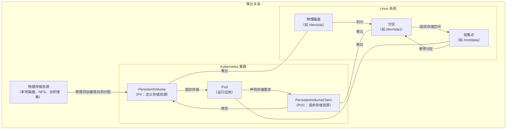
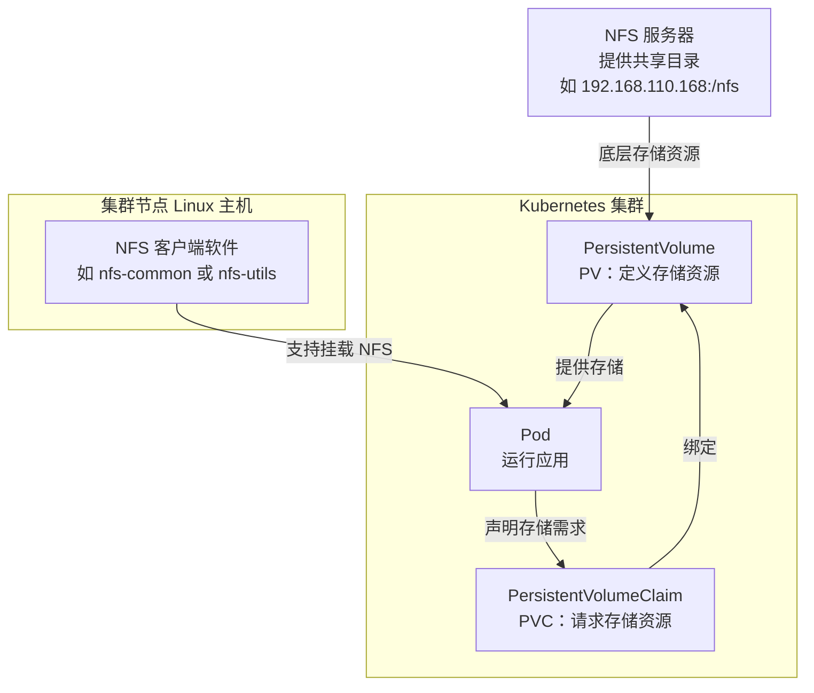
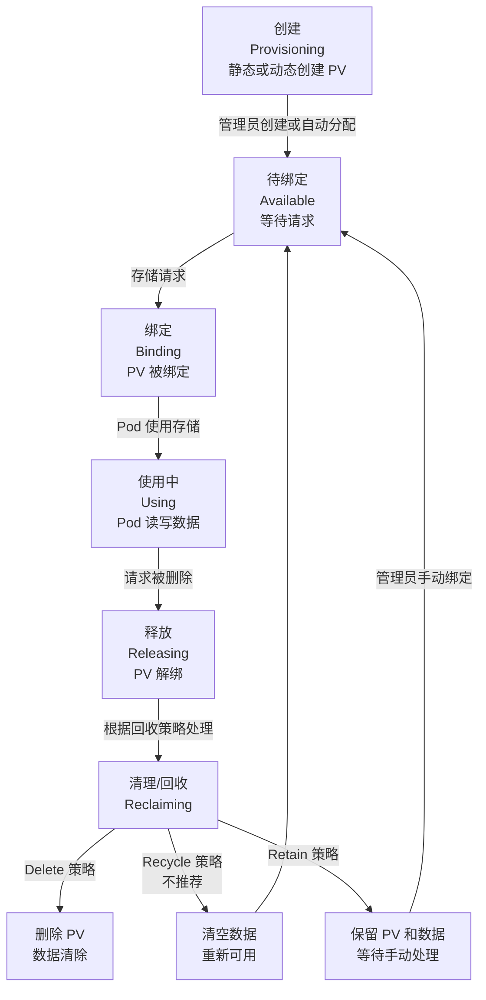

# Kubernetes存储与StatefulSet

## 教学目标


## 第一部分：什么是 Storage、PV 和 PVC

### 1. 从 ConfigMap 和 Secret 的缺点说起：为什么需要更好的存储机制？
- **回顾已有知识**：在第一天的学习中，我们已经了解了 ConfigMap 和 Secret。ConfigMap 用于存储非敏感的配置数据，Secret 用于存储敏感数据（如密码、密钥）。它们可以通过挂载（mount）或环境变量的方式将数据注入到 Pod 中，供应用使用。
- **ConfigMap 和 Secret 的缺点**：
  1. **存储内容限制**：ConfigMap 和 Secret 主要用于存储小规模的配置数据（通常是文本或键值对），不适合存储大规模数据（如数据库文件、日志文件、用户上传的图片等）。它们的存储容量有限，无法满足应用运行时生成的大量数据需求。
  2. **生命周期限制**：虽然 ConfigMap 和 Secret 可以挂载到 Pod 中，但它们并不是为持久化存储设计的。如果应用需要动态读写数据（比如用户上传文件后保存），ConfigMap 和 Secret 无法支持这种动态存储需求。
  3. **功能定位不同**：ConfigMap 和 Secret 的主要作用是“配置管理”，而不是“数据存储”。它们无法像文件系统或数据库那样支持应用的持续读写操作。
- **问题引导**：如果我们部署一个 Web 应用，用户上传的图片需要永久保存，ConfigMap 和 Secret 能做到吗？如果 Pod 被删除，数据丢失了怎么办？显然，我们需要一种更强大的存储机制来解决这些问题。
- **互动思考**：问学习者，如果用 ConfigMap 存储一个数据库的配置文件，可以吗？如果要存储数据库运行时生成的数据文件，ConfigMap 能胜任吗？为什么？

### 2. 引入 Storage：Kubernetes 中的存储机制
- **Storage 的含义**：在 Kubernetes 中，Storage（存储）是指用来保存数据的机制。它并不是特指某种特定的存储技术（如云存储中的“存储桶”），而是一个广义的概念，涵盖了各种存储资源和解决方案。Storage 可以是临时的（随 Pod 生命周期存在），也可以是持久的（独立于 Pod 生命周期）。
- **Storage 的类型**：
  1. **临时存储**：比如 Pod 内部的 `emptyDir`，数据随 Pod 删除而丢失，适合临时缓存等场景。
  2. **持久化存储**：通过外部存储资源（如本地磁盘、网络文件系统 NFS、云存储）保存数据，即使 Pod 删除，数据依然保留。
- **关于存储驱动的澄清**：Kubernetes 本身对一些存储类型提供了原生支持，例如 NFS（网络文件系统）。对于 NFS，Kubernetes 内置了支持，**不需要额外安装驱动**，只需在集群中配置好 NFS 服务器并在 PV 定义中指定即可。但对于某些特定的存储类型（如云存储 AWS EBS、Google Cloud Persistent Disk 或其他分布式存储系统如 Ceph），则需要安装相应的存储插件或驱动（通常称为 CSI 插件，Container Storage Interface），以便 Kubernetes 与这些存储系统交互。
- **问题引导**：既然 ConfigMap 和 Secret 无法满足持久化存储需求，而临时存储又不够可靠，我们该如何实现数据的持久保存？Kubernetes 提供了什么工具来管理持久化存储？
- **互动思考**：问学习者，Storage 在 Kubernetes 中指的是什么？Kubernetes 对哪些存储类型有原生支持？

### 3. PV 和 PVC 的作用：解决数据持久化问题
- **基本概念**：
  - **PersistentVolume（PV）**：PV 是集群中的一个存储资源，通常由管理员创建或通过存储插件动态分配。它代表了一块具体的存储空间（如本地磁盘、NFS、云存储等），定义了存储的容量、访问模式等属性。
  - **PersistentVolumeClaim（PVC）**：PVC 是用户或应用对存储资源的一个请求。Pod 通过 PVC 声明自己需要多少存储空间、什么样的访问模式，Kubernetes 会自动将 PVC 绑定到一个合适的 PV 上。
- **PV 和 PVC 的关系**：可以把 PV 想象成“存储资源的池子”，PVC 是“对存储资源的需求单”。PVC 提出需求，Kubernetes 负责从 PV 池子中找到合适的资源进行绑定。
- **作用**：
  1. **数据持久化**：PV 和 PVC 确保数据独立于 Pod 生命周期，即使 Pod 被删除，数据依然保存在 PV 中，可以被新的 Pod 重新挂载。
  2. **资源抽象**：PV 和 PVC 将存储资源的具体实现（比如用的是本地磁盘还是云存储）与用户需求分开，用户只需要关心自己需要多少存储，不需要关心存储从哪里来。
  3. **灵活管理**：通过 PV 和 PVC，集群管理员可以统一管理存储资源，用户可以按需申请，互不干扰。
- **互动思考**：问学习者，PV 和 PVC 的分工是什么？为什么不直接让 Pod 绑定存储资源，而是要通过 PVC 这一层抽象？

### 4. 类比 Linux 磁盘与分区：理解 PV 和 PVC
为了让学习者更直观地理解 PV 和 PVC 的概念，我们可以用 Linux 系统中的磁盘与分区的关系来进行类比：
- **Linux 磁盘与分区类比**：
  1. **磁盘（Disk）类比 PV**：在 Linux 中，磁盘（如 `/dev/sda`）是一块物理存储设备，提供了原始的存储空间。同样，PV（PersistentVolume）是 Kubernetes 集群中的一块存储资源，代表了可用的存储空间（如本地磁盘、NFS 共享、云存储卷）。
  2. **分区（Partition）类比 PVC**：在 Linux 中，分区（如 `/dev/sda1`）是从磁盘上划分出来的一部分存储空间，供用户或系统使用。用户通过分区来请求和使用存储资源。同样，PVC（PersistentVolumeClaim）是用户对存储资源的一个请求，声明需要多少存储空间，Kubernetes 将其绑定到合适的 PV 上。
  3. **挂载（Mount）类比 Pod 使用存储**：在 Linux 中，分区需要挂载到某个目录（如 `/mnt/data`）才能被应用读写。同样，在 Kubernetes 中，Pod 通过 PVC 挂载 PV 提供的存储空间，应用才能读写数据。
- **类比总结**：PV 就像是磁盘上的可用存储空间，PVC 就像是用户从磁盘上划分出来的分区，Pod 则是通过挂载分区来使用存储的应用。
- **互动思考**：问学习者，根据这个类比，如果一个磁盘（PV）已经被完全划分（绑定）给多个分区（PVC），新的分区请求还能成功吗？Kubernetes 如何处理这种情况？

### 5. Mermaid 结构图：PV 和 PVC 的关系与 Linux 磁盘分区的类型比对
为了更直观地展示 PV 和 PVC 与 Linux 磁盘和分区的类比关系，我们用 Mermaid 图进行类型比对和工作流程展示。



- **图解说明**：
  1. **Kubernetes 部分**：展示了存储资源池到 PV、PVC 再到 Pod 的绑定和使用流程。
  2. **Linux 部分**：展示了物理磁盘到分区再到挂载点的划分和使用流程。
  3. **类比关系**：PV 类比于物理磁盘，PVC 类比于分区，Pod 类比于挂载点（应用使用存储的入口）。
- **互动思考**：问学习者，根据这个图，Kubernetes 中的 PV 和 PVC 绑定过程与 Linux 中的磁盘分区和挂载过程有哪些相似之处？有什么不同？

### 6. 举例说明：PV 和 PVC 的实际应用场景
- **场景描述**：假设我们要部署一个简单的 Web 应用，这个应用允许用户上传图片，图片需要永久保存。如果 Pod 被删除或重启，图片不能丢失。
  - **不使用 PV/PVC 的情况**：如果只用 Pod 内部的临时存储（比如 `emptyDir`），用户上传的图片会保存在 Pod 内部。一旦 Pod 被删除（比如节点故障或手动删除），图片数据也会丢失，用户体验很差。
  - **使用 PV/PVC 的情况**：我们为这个 Web 应用创建一个 PVC，声明需要 10Gi 的存储空间。Kubernetes 自动将这个 PVC 绑定到一个 PV（可能是本地磁盘或云存储）。用户上传的图片保存在 PV 对应的存储空间中，即使 Pod 被删除，新的 Pod 可以通过同样的 PVC 挂载到相同的存储，图片数据不会丢失。
- **互动思考**：问学习者，如果我们要部署一个数据库（如 MySQL），数据文件需要持久保存，PV 和 PVC 能如何帮助我们？如果没有 PV 和 PVC，会有什么风险？


## 第二部分：教员 NFS 环境准备

### 1. 什么是 NFS？与 Kubernetes PV 的关系
- **NFS 基本概念**：
  - NFS（Network File System，网络文件系统）是一种分布式文件系统协议，允许客户端通过网络访问远程服务器上的文件，就像访问本地文件系统一样。NFS 广泛用于局域网内共享文件，适用于多台主机需要访问同一存储空间的场景。
  - 在 NFS 中，一台服务器（称为 NFS 服务器）提供文件存储服务，其他主机（称为 NFS 客户端）可以通过网络挂载服务器上的共享目录，读写其中的文件。
- **NFS 与 Kubernetes PV 的关系**：
  - 在 Kubernetes 中，NFS 可以作为一种持久化存储资源。通过将 NFS 共享目录配置为 PersistentVolume（PV），Kubernetes 集群中的 Pod 可以通过 PersistentVolumeClaim（PVC）挂载这个共享目录，实现数据的持久保存和跨 Pod 共享。
  - **关系总结**：NFS 提供底层的存储资源（共享目录），而 PV 是 Kubernetes 对这种存储资源的抽象表示。Kubernetes 通过内置的 NFS 支持（无需额外 CSI 驱动插件）将 NFS 共享目录绑定到 Pod 上，供应用使用。
  - **注意事项**：虽然 Kubernetes 原生支持 NFS，不需要额外的 CSI 驱动插件，但在 Kubernetes 集群的节点（运行 Pod 的 Linux 主机）上，必须安装 NFS 客户端软件（如 `nfs-common` 或 `nfs-utils`），以便节点能够挂载 NFS 共享目录。
- **为什么要用 NFS**：
  1. **简单易用**：NFS 配置相对简单，适合中小型集群或测试环境。
  2. **原生支持**：Kubernetes 内置对 NFS 的支持，无需安装额外的存储驱动或 CSI 插件。
  3. **共享存储**：NFS 支持多客户端同时访问，适合多个 Pod 需要共享同一存储空间的场景（例如日志收集、配置文件共享）。
- **互动思考**：问学习者，NFS 在 Kubernetes 中扮演什么角色？如果我们有一个 NFS 服务器，它的共享目录如何变成 Kubernetes 中的 PV？

### 2. Mermaid 结构图：NFS 与 Kubernetes PV/PVC 的关系
为了更直观地展示 NFS 如何作为存储资源与 Kubernetes 的 PV 和 PVC 集成，我们用 Mermaid 图展示其结构和工作流程。



- **图解说明**：
  1. **NFS 服务器**：提供共享目录（如 `192.168.110.168:/nfs`），作为底层的存储资源。
  2. **PersistentVolume（PV）**：Kubernetes 中的存储资源对象，引用 NFS 服务器的共享目录。
  3. **PersistentVolumeClaim（PVC）**：用户或 Pod 对存储资源的请求，声明需要的存储空间。
  4. **Pod**：通过 PVC 挂载 PV 提供的存储空间（实际挂载的是 NFS 共享目录）。
  5. **NFS 客户端软件**：运行在 Kubernetes 集群节点（Linux 主机）上的软件，支持 Pod 挂载 NFS 共享目录。
- **互动思考**：问学习者，根据这个图，NFS 服务器和 Kubernetes 集群之间的关系是什么？如果集群节点没有安装 NFS 客户端软件，会发生什么？

### 3. NFS 环境准备：安装与配置
以下是基于你提供的环境信息（主机：`nas-192.168.110.168`，目录：`/nfs`，共享范围：`192.168.110.0/24`）的 NFS 服务器安装与配置步骤。我们假设这台主机运行的是基于 Debian/Ubuntu 或 CentOS 的 Linux 系统。如果实际系统不同，可以相应调整命令。

#### 3.1 在 NFS 服务器上安装 NFS 服务
- **目标主机**：`nas-192.168.110.168`
- **步骤**：
  1. **更新软件包列表**：
     - Ubuntu/Debian：`sudo apt update`
     - CentOS/RHEL：`sudo yum update`
  2. **安装 NFS 服务器软件**：
     - Ubuntu/Debian：`sudo apt install nfs-kernel-server -y`
     - CentOS/RHEL：`sudo yum install nfs-utils -y`
  3. **启动并启用 NFS 服务**：
     - Ubuntu/Debian：
       ```
       sudo systemctl start nfs-kernel-server
       sudo systemctl enable nfs-kernel-server
       ```
     - CentOS/RHEL：
       ```
       sudo systemctl start nfs-server
       sudo systemctl enable nfs-server
       ```
  4. **检查 NFS 服务状态**：
     - `sudo systemctl status nfs-kernel-server` （Ubuntu/Debian）
     - `sudo systemctl status nfs-server` （CentOS/RHEL）
     - 确保服务处于 `active (running)` 状态。

#### 3.2 创建并配置共享目录
- **共享目录**：`/nfs`
- **步骤**：
  1. **创建共享目录**：
     ```
     sudo mkdir -p /nfs
     ```
  2. **设置目录权限**：为了让 NFS 客户端可以读写目录，需要调整权限（这里设置为 777，仅供教学演示，生产环境应根据实际需求设置更严格的权限）。
     ```
     sudo chmod -R 777 /nfs
     ```
  3. **配置 NFS 共享**：编辑 NFS 配置文件 `/etc/exports`，添加共享目录和访问权限。
     ```
     sudo vim /etc/exports
     ```
     在文件末尾添加以下内容：
     ```
     /nfs 192.168.110.0/24(rw,sync,no_root_squash,no_subtree_check)
     ```
     - **参数解释**：
       - `/nfs`：共享的目录路径。
       - `192.168.110.0/24`：允许访问的客户端 IP 范围，表示 `192.168.110.1` 到 `192.168.110.254` 的所有主机。
       - `rw`：允许读写权限。
       - `sync`：同步写入，确保数据一致性。
       - `no_root_squash`：允许客户端以 root 身份访问（教学环境使用，生产环境谨慎）。
       - `no_subtree_check`：禁用子树检查，提升性能。
  4. **应用配置**：更新 NFS 导出表。
     ```
     sudo exportfs -a
     ```
  5. **重启 NFS 服务**：确保配置生效。
     - Ubuntu/Debian：`sudo systemctl restart nfs-kernel-server`
     - CentOS/RHEL：`sudo systemctl restart nfs-server`
  6. **检查共享目录**：验证共享是否生效。
     ```
     sudo showmount -e
     ```
     应该能看到类似 `/nfs 192.168.110.0/24` 的输出。

#### 3.4 在 Kubernetes 集群节点上安装 NFS 客户端软件
- **目标**：在 Kubernetes 集群的所有节点（运行 Pod 的 Linux 主机）上安装 NFS 客户端软件，以便 Pod 能够挂载 NFS 共享目录。
- **步骤**：
  1. **更新软件包列表**：
     - Ubuntu/Debian：`sudo apt update`
     - CentOS/RHEL：`sudo yum update`
  2. **安装 NFS 客户端软件**：
     - Ubuntu/Debian：`sudo apt install nfs-common -y`
     - CentOS/RHEL：`sudo yum install nfs-utils -y`
  3. **验证安装**：检查是否安装成功。
     ```
     rpcinfo -p | grep nfs
     ```
     如果输出包含 NFS 相关信息，说明客户端软件已正确安装。

## 第三部分：PV 理论类型与语法介绍

### 1. 什么是 PV？再回顾一下
- **基本概念**：PersistentVolume（PV）是 Kubernetes 集群中的一个存储资源，代表了一块具体的存储空间，可以是本地磁盘、网络文件系统（如 NFS）、云存储（如 AWS EBS、Google Cloud Persistent Disk）等。PV 的作用是为 Pod 提供持久化的存储空间，确保即使 Pod 被删除，数据依然可以保留。
- **类比理解**：想象 PV 是一个“存储仓库”，里面存放着我们可以使用的存储空间。这个仓库可以很大，也可以很小，可以是本地的，也可以是远程的。Pod 就像一个“工人”，需要从仓库中借用空间来存放东西（比如用户上传的文件、数据库数据）。
- **互动思考**：问学习者，如果 PV 是一个存储仓库，那么 Pod 是什么？Kubernetes 在这个过程中扮演了什么角色？

### 2. PV 的类型：不同的存储仓库与动态/静态供应
- **说明**：PV 就像存储仓库，但仓库可以有不同的类型。Kubernetes 支持多种存储类型，每种类型对应不同的存储资源。此外，PV 的创建方式也分为静态供应和动态供应两种模式，分别适用于不同的场景。
- **常见 PV 类型**：
  1. **本地存储（hostPath）**：
     - **特点**：使用 Kubernetes 节点（主机）上的本地目录或文件作为存储空间。
     - **类比**：就像在你家电脑上划出一块硬盘空间给 Pod 用。
     - **适用场景**：测试环境或单节点集群，简单方便。
     - **缺点**：如果节点故障，数据可能丢失；不适合多节点集群，因为 Pod 可能调度到其他节点，无法访问原来的本地存储。
  2. **网络文件系统（NFS）**：
     - **特点**：使用远程 NFS 服务器提供的共享目录作为存储空间，支持多个 Pod 同时访问。
     - **类比**：就像一个大家都能访问的网络共享文件夹。
     - **适用场景**：中小型集群，需要多个 Pod 共享数据的场景（如日志收集）。
     - **优点**：Kubernetes 原生支持，配置简单。
  3. **云存储（如 AWS EBS、Google Cloud Persistent Disk、Azure Disk）**：
     - **特点**：使用云服务商提供的磁盘作为存储空间，通常需要安装对应的存储插件（CSI 插件）。
     - **类比**：就像租用云端的一个硬盘，安全且稳定。
     - **适用场景**：生产环境，数据可靠性要求高的场景。
     - **缺点**：依赖云服务商，可能有额外费用。
  4. **分布式存储（如 Ceph、GlusterFS）**：
     - **特点**：使用分布式存储系统提供存储空间，支持高可用和扩展性，通常需要 CSI 插件。
     - **类比**：就像一个分布在多台机器上的超级大仓库，数据不会因为一台机器故障而丢失。
     - **适用场景**：大规模集群，高可用性需求场景。
     - **缺点**：配置复杂，维护成本高。
- **PV 的供应方式**：
  1. **静态供应（Static Provisioning）**：
     - **定义**：PV 由管理员手动创建，通常用于内部存储服务（如 NFS、本地磁盘）。管理员提前定义好存储资源，然后创建 PV，等待绑定。
     - **类比**：就像管理员提前建好一个仓库，等着有人来租用。
     - **适用场景**：公司内部存储资源有限，需要严格控制存储分配的场景。
  2. **动态供应（Dynamic Provisioning）**：
     - **定义**：PV 由 Kubernetes 自动创建，通常用于云服务提供的存储资源。通过定义 Storage Class（存储类），当有存储需求时，Kubernetes 会根据 Storage Class 自动创建一个 PV 并绑定。
     - **类比**：就像你提出租用仓库的需求，系统自动为你建一个新仓库并分配给你。
     - **适用场景**：云存储环境，存储资源可以按需扩展的场景。
- **互动思考**：问学习者，如果公司内部有一个 NFS 服务器，应该选择静态供应还是动态供应？如果是使用 AWS 云存储呢？为什么？

### 3. PV 的读写模式与状态：访问控制与生命周期管理
- **说明**：PV 的读写模式（Access Modes）定义了存储资源如何被 Pod 访问，是 Kubernetes 存储管理的重要属性。不同的存储类型支持的读写模式不同，了解这些模式有助于选择合适的存储资源。此外，PV 的状态（Status）反映了其生命周期中的位置，方便管理员监控和管理。
- **PV 读写模式（Access Modes）**：
  以下表格详细列出了三种主要的读写模式及其适用场景：

  | 读写模式            | 描述                                      | 支持的存储类型示例                       | 适用场景                              |
  |--------------------|------------------------------------------|-----------------------------------------|--------------------------------------|
  | **ReadWriteOnce (RWO)** | 存储资源只能被一个 Pod 读写，独占访问。      | 本地存储（hostPath）、云存储（AWS EBS） | 数据库等需要独占存储的场景。          |
  | **ReadOnlyMany (ROM)**  | 存储资源可以被多个 Pod 只读访问，但不能写入。 | NFS、云存储（部分支持）、分布式存储      | 静态配置文件或只读数据的共享访问。    |
  | **ReadWriteMany (RWM)** | 存储资源可以被多个 Pod 同时读写。           | NFS、分布式存储（如 Ceph）              | 多个 Pod 需要共享读写数据的场景，如日志收集。 |

  - **注意事项**：并非所有存储类型都支持所有读写模式。例如，本地存储（hostPath）和某些云存储（如 AWS EBS）通常只支持 ReadWriteOnce，而 NFS 和分布式存储（如 Ceph）可以支持 ReadWriteMany。选择存储类型时需根据应用需求匹配合适的读写模式。
- **PV 状态（Status）**：
  以下表格列出了 PV 的常见状态及其含义，帮助学习者理解 PV 在生命周期中的位置：

  | 状态            | 描述                                      | 含义与管理建议                         |
  |----------------|------------------------------------------|---------------------------------------|
  | **Available**  | PV 已创建，但尚未绑定到任何请求，处于可用状态。 | 可以被新的存储请求绑定，管理员可检查是否需要调整容量或模式。 |
  | **Bound**      | PV 已被绑定到一个存储请求，正在被 Pod 使用。 | 正常使用中，管理员可监控存储使用情况。      |
  | **Released**   | PV 已被解绑，处于待释放状态，等待回收处理。   | 根据回收策略处理，可能是删除、保留或重新可用。 |
  | **Failed**     | PV 出现错误，可能由于配置问题或存储资源不可用。 | 管理员需检查配置或底层存储资源，修复问题。   |

- **互动思考**：问学习者，如果我要部署一个需要多个 Pod 同时读写数据的应用，应该选择哪种读写模式？如果 PV 状态显示为 Failed，可能是什么原因？

### 4. PV 的生命周期与清理（回收）机制
- **PV 生命周期概述**：PV 作为存储资源，有自己的“出生”和“死亡”过程，也就是生命周期。理解 PV 的生命周期和清理机制，可以帮助我们管理存储资源，避免资源浪费或数据丢失。
- **PV 生命周期阶段**：
  1. **创建（Provisioning）**：PV 被创建出来，可以是管理员手动创建（静态供应），也可以通过 Storage Class 自动创建（动态供应）。这就像仓库被建好，等待分配。
  2. **绑定（Binding）**：当有存储请求时，Kubernetes 会将一个合适的 PV 绑定。绑定后，PV 就“属于”这个请求了，其他请求不能再使用它。这就像仓库被某个工人租用，其他人暂时不能用。
  3. **使用（Using）**：Pod 使用 PV 提供的存储空间，读写数据。这就像工人在仓库中存放和取出东西。
  4. **释放（Releasing）**：当存储请求被删除时（比如 Pod 不再需要存储），PV 会解绑，进入“待释放”状态。这就像工人退租了仓库，仓库空出来了。
  5. **清理/回收（Reclaiming）**：PV 解绑后，Kubernetes 会根据 PV 的“回收策略”决定如何处理这个存储资源。这就像仓库空出来后，决定是重新出租还是拆除。
- **PV 的回收策略（Reclaim Policy）**：
  - **Delete（删除）**：当存储请求被删除后，PV 也会被自动删除，存储资源中的数据会被清除。这就像仓库退租后直接拆掉，里面的东西全丢了。适用于临时存储或不需要保留数据的场景。
  - **Recycle（回收）**：当存储请求被删除后，PV 不会被删除，而是清空数据，重新变为可用状态，等待新的绑定。这就像仓库退租后清空里面的东西，重新出租给别人。**注意**：Recycle 策略目前已不推荐使用，因为可能导致数据泄露或误操作。
  - **Retain（保留）**：当存储请求被删除后，PV 不会被删除，数据也不会被清除，PV 只是解绑，进入待释放状态。管理员可以手动决定是否重新绑定或删除。这就像仓库退租后不拆除，里面的东西也保留，等着决定下一步怎么用。适用于需要保留数据的重要场景。
- **类比总结**：PV 的回收策略就像租房合同到期后的处理方式：Delete 是直接拆房，Recycle 是清空房子再出租，Retain 是保留房子和东西，等着新决定。
- **互动思考**：问学习者，如果你的 PV 存储的是用户上传的重要文件，适合用哪种回收策略？为什么？如果只是临时缓存数据呢？

### 5. Mermaid 结构图：PV 的生命周期与清理机制
为了更直观地展示 PV 的生命周期和清理机制，我们用 Mermaid 图展示其阶段和流程。



- **图解说明**：
  1. **创建阶段**：PV 被静态或动态创建，进入可用状态。
  2. **绑定和使用阶段**：PV 被绑定，Pod 使用存储资源读写数据。
  3. **释放和回收阶段**：请求删除后，PV 根据回收策略（Delete、Recycle、Retain）决定是否删除、清空或保留。
- **互动思考**：问学习者，根据这个图，如果 PV 使用 Retain 策略，解绑后会进入哪个状态？管理员可以做什么？

### 6. PV 的语法介绍：不同存储类型的 YAML 模板
- **说明**：在 Kubernetes 中，PV 是通过 YAML 文件定义的资源对象。以下是为不同存储类型（本地存储 hostPath、NFS、云存储、分布式存储）提供的 PV YAML 模板，供学习者参考和实践。每个模板都包含基本的配置字段，并根据存储类型的特点设置合适的读写模式。
- **本地存储（hostPath）模板(偶尔用)**：
  ```yaml
  apiVersion: v1
  kind: PersistentVolume
  metadata:
    name: pv-hostpath-example
  spec:
    capacity:
      storage: 5Gi  # 定义存储容量为 5GiB
    accessModes:
      - ReadWriteOnce  # 仅支持单个 Pod 读写
    reclaimPolicy: Retain  # 回收策略，保留数据
    hostPath:  # 指定存储类型为 hostPath
      path: /mnt/data  # 节点上的本地目录路径
      type: DirectoryOrCreate  # 如果目录不存在则创建
  ```
  - **适用场景**：测试环境，单节点存储需求。
- **网络文件系统（NFS）模板（教学用）**：
  ```yaml
  apiVersion: v1
  kind: PersistentVolume
  metadata:
    name: pv-nfs-example
  spec:
    capacity:
      storage: 10Gi  # 定义存储容量为 10GiB
    accessModes:
      - ReadWriteMany  # 支持多个 Pod 同时读写
    reclaimPolicy: Retain  # 回收策略，保留数据
    nfs:  # 指定存储类型为 NFS
      path: /nfs/share  # NFS 服务器上的共享目录
      server: 192.168.110.168  # NFS 服务器地址
  ```
  - **适用场景**：中小型集群，共享存储需求。
- **云存储（AWS EBS）模板（以后去阿里云再学）**：
  - **注意**：云存储通常需要安装对应的 CSI 插件，并通过 Storage Class 动态供应，以下是静态配置的示例。
  ```yaml
  apiVersion: v1
  kind: PersistentVolume
  metadata:
    name: pv-aws-ebs-example
  spec:
    capacity:
      storage: 20Gi  # 定义存储容量为 20GiB
    accessModes:
      - ReadWriteOnce  # 仅支持单个 Pod 读写
    reclaimPolicy: Delete  # 回收策略，删除数据（云存储常见）
    awsElasticBlockStore:  # 指定存储类型为 AWS EBS
      volumeID: vol-1234567890abcdef0  # EBS 卷 ID
      fsType: ext4  # 文件系统类型
  ```
  - **适用场景**：生产环境，AWS 云上部署。

- **字段通用解释**：
  - `apiVersion` 和 `kind`：指定这是 Kubernetes 的 PV 资源。
  - `metadata.name`：给 PV 起个名字，方便识别。
  - `spec.capacity.storage`：定义 PV 提供的存储空间大小。
  - `spec.accessModes`：定义访问模式，根据存储类型选择合适的模式。
  - `spec.reclaimPolicy`：定义回收策略（Delete、Recycle、Retain）。
  - 存储类型字段（如 `hostPath`、`nfs` 等）：指定具体的存储类型和配置参数。
- **互动思考**：问学习者，如果我要创建一个容量为 30Gi 的 NFS PV，支持多个 Pod 读写，回收策略为 Retain，NFS 服务器地址为 `192.168.110.168:/nfs/data`，应该怎么写 YAML 文件？

### 6.1 预绑定 PVC 的 PV：使用 `claimRef` 字段

#### 1. 基本概念：什么是预绑定 PVC 的 PV？
- **定义**：通过在 PV 的 `spec` 中设置 `claimRef` 字段，可以将 PV 预绑定到一个特定的 PVC（PersistentVolumeClaim）。`claimRef` 指定了 PVC 的名称（`name`）和命名空间（`namespace`），确保 PV 只被该 PVC 使用。
- **作用**：
  1. **资源控制**：避免存储资源被其他无关 PVC 占用，确保 PV 分配给特定应用或团队。
  2. **明确分配**：在多租户或多项目环境中，预绑定可以明确存储资源的归属。
- **注意事项**：
  - 如果 PV 指定了 `claimRef`，只有名称和命名空间匹配的 PVC 才能绑定到该 PV。
  - 如果指定的 PVC 尚未创建，PV 状态会保持为 `Available`，等待 PVC 创建后自动绑定。
  - 如果 PVC 已存在但绑定到其他 PV，则绑定会失败，需管理员手动干预。
- **互动思考**：问学习者，为什么需要预绑定 PVC？在什么场景下这种方式特别有用？

#### 2. `claimRef` 字段的语法结构
- `claimRef` 是一个嵌套字段，包含以下子字段：
  - `name`：指定目标 PVC 的名称。
  - `namespace`：指定目标 PVC 所在的命名空间。
- 示例：
  ```yaml
  claimRef:
    name: pvc-example-data
    namespace: example
  ```
- **互动思考**：问学习者，如果想将 PV 预绑定到命名空间 `app` 的 PVC `pvc-app-storage`，应该如何编写 `claimRef` 字段？

#### 3. 不同存储类型的 PV 模板：添加 `claimRef` 预绑定 PVC
以下是为不同存储类型提供的 PV YAML 模板，均加入了 `claimRef` 字段，用于预绑定到特定 PVC。

- **本地存储（hostPath）模板**：
  ```yaml
  apiVersion: v1
  kind: PersistentVolume
  metadata:
    name: pv-hostpath-example
  spec:
    capacity:
      storage: 5Gi  # 定义存储容量为 5GiB
    accessModes:
      - ReadWriteOnce  # 仅支持单个 Pod 读写
    reclaimPolicy: Retain  # 回收策略，保留数据
    hostPath:  # 指定存储类型为 hostPath
      path: /mnt/data  # 节点上的本地目录路径
      type: DirectoryOrCreate  # 如果目录不存在则创建
    claimRef:  # 预绑定到特定 PVC
      name: pvc-hostpath-data
      namespace: test
  ```
  - **适用场景**：测试环境，单节点存储需求，指定分配给 `test` 命名空间的 PVC。

- **网络文件系统（NFS）模板**：
  ```yaml
  apiVersion: v1
  kind: PersistentVolume
  metadata:
    name: pv-nfs-example
  spec:
    capacity:
      storage: 10Gi  # 定义存储容量为 10GiB
    accessModes:
      - ReadWriteMany  # 支持多个 Pod 同时读写
    reclaimPolicy: Retain  # 回收策略，保留数据
    nfs:  # 指定存储类型为 NFS
      path: /nfs/share  # NFS 服务器上的共享目录
      server: 192.168.110.168  # NFS 服务器地址
    claimRef:  # 预绑定到特定 PVC
      name: pvc-nfs-share
      namespace: shiqi
  ```
  - **适用场景**：中小型集群，共享存储需求，指定分配给 `shiqi` 命名空间的 PVC。


### 7. 实践练习：创建 NFS 目录和 PV
为了帮助学习者更好地理解 PV 的实际配置，我们将通过一个简单的练习，模拟在 NFS 服务器上创建目录并定义 PV 的过程。

#### 7.1 登录 NFS 主机并创建目录
- **目标**：在 NFS 服务器 `192.168.110.168` 上创建一个目录 `/nfs/shiqi-redis`，用于 Redis 数据的持久化存储。
- **步骤**：
  1. **登录 NFS 主机**：使用 SSH 登录到 NFS 服务器（假设已配置好 NFS 服务）。
     ```
     ssh user@192.168.110.168
     ```
  2. **创建目录**：创建指定目录并设置权限。
     ```
     sudo mkdir -p /nfs/shiqi-redis
     sudo chmod -R 777 /nfs/shiqi-redis  # 教学环境使用，生产环境应设置更严格权限
     ```
  3. **验证目录**：确认目录已创建。
     ```
     ls -ld /nfs/shiqi-redis
     ```
  4. **检查 NFS 共享配置**：确保 `/nfs` 已配置为共享目录。如果未配置，需编辑 `/etc/exports` 文件并重启 NFS 服务。

#### 7.2 创建 PV
- **目标**：基于上述 NFS 目录创建一个 PV，指定容量为 10Gi，回收策略为 Retain，支持多个 Pod 读写。
- **步骤**：
  1. **编写 PV YAML 文件**：创建一个名为 `pv-shiqi-redis.yaml` 的文件，内容如下：
      ```yaml
      apiVersion: v1
      kind: PersistentVolume
      metadata:
        name: pv-shiqi-redis
      spec:
        capacity:
          storage: 10Gi
        accessModes:
          - ReadWriteMany  # 支持多个 Pod 读写
        reclaimPolicy: Retain
        nfs:
          path: /nfs/shiqi-redis
          server: 192.168.110.168
        claimRef:  # 预绑定到特定 PVC
          name: pvc-shiqi-redis
          namespace: shiqi
      ```
  2. **应用 PV 配置**：使用 `kubectl` 命令创建 PV。
     ```
     kubectl apply -f pv-shiqi-redis.yaml
     ```
  3. **验证 PV 创建**：检查 PV 状态，确保其状态为 `Available`。
     ```
     kubectl get pv pv-shiqi-redis-db
     ```