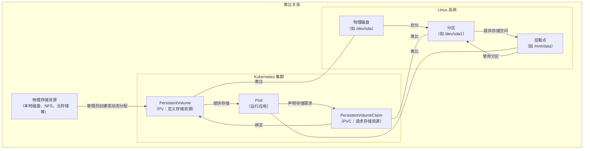
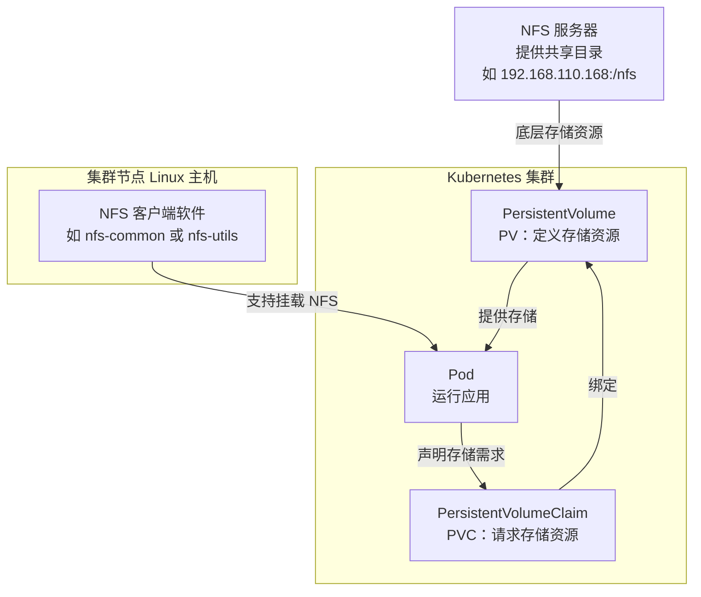
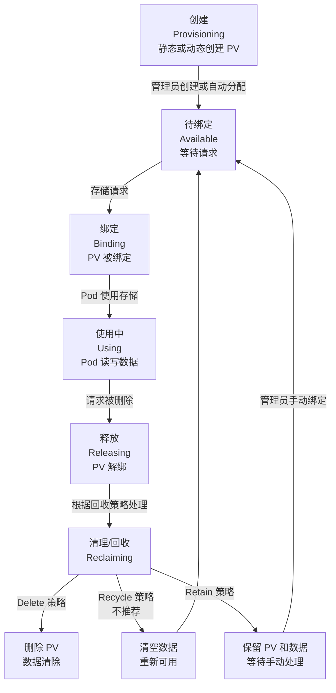
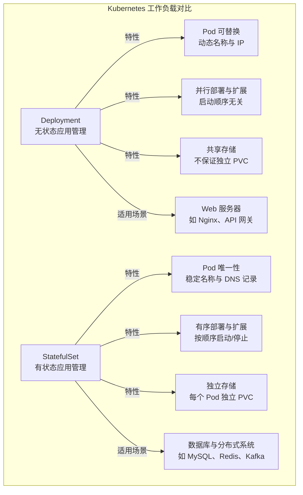
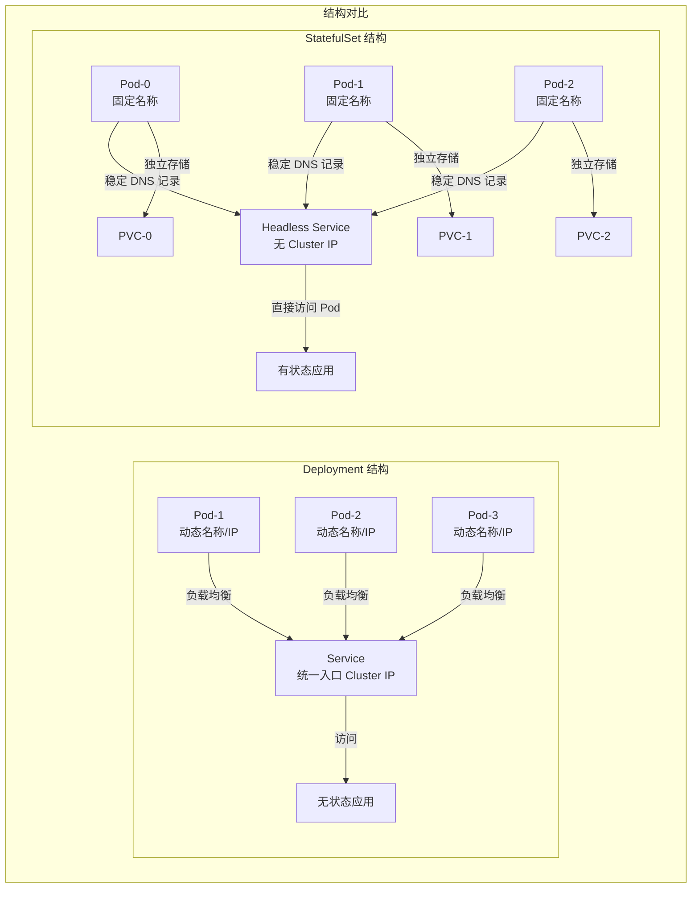

# Kubernetes存储与StatefulSet

## 教学目标
- 理解 Kubernetes 中的存储机制，包括临时存储和持久化存储的区别
- 掌握 PersistentVolume（PV）和 PersistentVolumeClaim（PVC）的创建、绑定和使用
- 了解 StorageClass 的作用及其在动态供应 PV 中的应用
- 熟练操作 StatefulSet，包括部署有状态应用和数据持久化管理
- 学习 StatefulSet 与 Deployment 的区别及其在数据库等有状态服务中的作用
- 实践 PV、PVC 和 StatefulSet 的组合使用，处理实际部署场景中的数据持久化问题

## 第一部分：什么是 Storage、PV 和 PVC

### 1. 从 ConfigMap 和 Secret 的缺点说起：为什么需要更好的存储机制？
- **回顾已有知识**：在第一天的学习中，我们已经了解了 ConfigMap 和 Secret。ConfigMap 用于存储非敏感的配置数据，Secret 用于存储敏感数据（如密码、密钥）。它们可以通过挂载（mount）或环境变量的方式将数据注入到 Pod 中，供应用使用。
- **ConfigMap 和 Secret 的缺点**：
  1. **存储内容限制**：ConfigMap 和 Secret 主要用于存储小规模的配置数据（通常是文本或键值对），不适合存储大规模数据（如数据库文件、日志文件、用户上传的图片等）。它们的存储容量有限，无法满足应用运行时生成的大量数据需求。
  2. **生命周期限制**：虽然 ConfigMap 和 Secret 可以挂载到 Pod 中，但它们并不是为持久化存储设计的。如果应用需要动态读写数据（比如用户上传文件后保存），ConfigMap 和 Secret 无法支持这种动态存储需求。
  3. **功能定位不同**：ConfigMap 和 Secret 的主要作用是“配置管理”，而不是“数据存储”。它们无法像文件系统或数据库那样支持应用的持续读写操作。
- **问题引导**：如果我们部署一个 Web 应用，用户上传的图片需要永久保存，ConfigMap 和 Secret 能做到吗？如果 Pod 被删除，数据丢失了怎么办？显然，我们需要一种更强大的存储机制来解决这些问题。
- **互动思考**：问学习者，如果用 ConfigMap 存储一个数据库的配置文件，可以吗？如果要存储数据库运行时生成的数据文件，ConfigMap 能胜任吗？为什么？

### 2. 引入 Storage：Kubernetes 中的存储机制
- **Storage 的含义**：在 Kubernetes 中，Storage（存储）是指用来保存数据的机制。它并不是特指某种特定的存储技术（如云存储中的“存储桶”），而是一个广义的概念，涵盖了各种存储资源和解决方案。Storage 可以是临时的（随 Pod 生命周期存在），也可以是持久的（独立于 Pod 生命周期）。
- **Storage 的类型**：
  1. **临时存储**：比如 Pod 内部的 `emptyDir`，数据随 Pod 删除而丢失，适合临时缓存等场景。
  2. **持久化存储**：通过外部存储资源（如本地磁盘、网络文件系统 NFS、云存储）保存数据，即使 Pod 删除，数据依然保留。
- **关于存储驱动的澄清**：Kubernetes 本身对一些存储类型提供了原生支持，例如 NFS（网络文件系统）。对于 NFS，Kubernetes 内置了支持，**不需要额外安装驱动**，只需在集群中配置好 NFS 服务器并在 PV 定义中指定即可。但对于某些特定的存储类型（如云存储 AWS EBS、Google Cloud Persistent Disk 或其他分布式存储系统如 Ceph），则需要安装相应的存储插件或驱动（通常称为 CSI 插件，Container Storage Interface），以便 Kubernetes 与这些存储系统交互。
- **问题引导**：既然 ConfigMap 和 Secret 无法满足持久化存储需求，而临时存储又不够可靠，我们该如何实现数据的持久保存？Kubernetes 提供了什么工具来管理持久化存储？
- **互动思考**：问学习者，Storage 在 Kubernetes 中指的是什么？Kubernetes 对哪些存储类型有原生支持？

### 3. PV 和 PVC 的作用：解决数据持久化问题
- **基本概念**：
  - **PersistentVolume（PV）**：PV 是集群中的一个存储资源，通常由管理员创建或通过存储插件动态分配。它代表了一块具体的存储空间（如本地磁盘、NFS、云存储等），定义了存储的容量、访问模式等属性。
  - **PersistentVolumeClaim（PVC）**：PVC 是用户或应用对存储资源的一个请求。Pod 通过 PVC 声明自己需要多少存储空间、什么样的访问模式，Kubernetes 会自动将 PVC 绑定到一个合适的 PV 上。
- **PV 和 PVC 的关系**：可以把 PV 想象成“存储资源的池子”，PVC 是“对存储资源的需求单”。PVC 提出需求，Kubernetes 负责从 PV 池子中找到合适的资源进行绑定。
- **作用**：
  1. **数据持久化**：PV 和 PVC 确保数据独立于 Pod 生命周期，即使 Pod 被删除，数据依然保存在 PV 中，可以被新的 Pod 重新挂载。
  2. **资源抽象**：PV 和 PVC 将存储资源的具体实现（比如用的是本地磁盘还是云存储）与用户需求分开，用户只需要关心自己需要多少存储，不需要关心存储从哪里来。
  3. **灵活管理**：通过 PV 和 PVC，集群管理员可以统一管理存储资源，用户可以按需申请，互不干扰。
- **互动思考**：问学习者，PV 和 PVC 的分工是什么？为什么不直接让 Pod 绑定存储资源，而是要通过 PVC 这一层抽象？

### 4. 类比 Linux 磁盘与分区：理解 PV 和 PVC
为了让学习者更直观地理解 PV 和 PVC 的概念，我们可以用 Linux 系统中的磁盘与分区的关系来进行类比：
- **Linux 磁盘与分区类比**：
  1. **磁盘（Disk）类比 PV**：在 Linux 中，磁盘（如 `/dev/sda`）是一块物理存储设备，提供了原始的存储空间。同样，PV（PersistentVolume）是 Kubernetes 集群中的一块存储资源，代表了可用的存储空间（如本地磁盘、NFS 共享、云存储卷）。
  2. **分区（Partition）类比 PVC**：在 Linux 中，分区（如 `/dev/sda1`）是从磁盘上划分出来的一部分存储空间，供用户或系统使用。用户通过分区来请求和使用存储资源。同样，PVC（PersistentVolumeClaim）是用户对存储资源的一个请求，声明需要多少存储空间，Kubernetes 将其绑定到合适的 PV 上。
  3. **挂载（Mount）类比 Pod 使用存储**：在 Linux 中，分区需要挂载到某个目录（如 `/mnt/data`）才能被应用读写。同样，在 Kubernetes 中，Pod 通过 PVC 挂载 PV 提供的存储空间，应用才能读写数据。
- **类比总结**：PV 就像是磁盘上的可用存储空间，PVC 就像是用户从磁盘上划分出来的分区，Pod 则是通过挂载分区来使用存储的应用。
- **互动思考**：问学习者，根据这个类比，如果一个磁盘（PV）已经被完全划分（绑定）给多个分区（PVC），新的分区请求还能成功吗？Kubernetes 如何处理这种情况？

### 5. Mermaid 结构图：PV 和 PVC 的关系与 Linux 磁盘分区的类型比对
为了更直观地展示 PV 和 PVC 与 Linux 磁盘和分区的类比关系，我们用 Mermaid 图进行类型比对和工作流程展示。



- **图解说明**：
  1. **Kubernetes 部分**：展示了存储资源池到 PV、PVC 再到 Pod 的绑定和使用流程。
  2. **Linux 部分**：展示了物理磁盘到分区再到挂载点的划分和使用流程。
  3. **类比关系**：PV 类比于物理磁盘，PVC 类比于分区，Pod 类比于挂载点（应用使用存储的入口）。
- **互动思考**：问学习者，根据这个图，Kubernetes 中的 PV 和 PVC 绑定过程与 Linux 中的磁盘分区和挂载过程有哪些相似之处？有什么不同？

### 6. 举例说明：PV 和 PVC 的实际应用场景
- **场景描述**：假设我们要部署一个简单的 Web 应用，这个应用允许用户上传图片，图片需要永久保存。如果 Pod 被删除或重启，图片不能丢失。
  - **不使用 PV/PVC 的情况**：如果只用 Pod 内部的临时存储（比如 `emptyDir`），用户上传的图片会保存在 Pod 内部。一旦 Pod 被删除（比如节点故障或手动删除），图片数据也会丢失，用户体验很差。
  - **使用 PV/PVC 的情况**：我们为这个 Web 应用创建一个 PVC，声明需要 64Mi 的存储空间。Kubernetes 自动将这个 PVC 绑定到一个 PV（可能是本地磁盘或云存储）。用户上传的图片保存在 PV 对应的存储空间中，即使 Pod 被删除，新的 Pod 可以通过同样的 PVC 挂载到相同的存储，图片数据不会丢失。
- **互动思考**：问学习者，如果我们要部署一个数据库（如 MySQL），数据文件需要持久保存，PV 和 PVC 能如何帮助我们？如果没有 PV 和 PVC，会有什么风险？


## 第二部分：教员 NFS 环境准备

### 1. 什么是 NFS？与 Kubernetes PV 的关系
- **NFS 基本概念**：
  - NFS（Network File System，网络文件系统）是一种分布式文件系统协议，允许客户端通过网络访问远程服务器上的文件，就像访问本地文件系统一样。NFS 广泛用于局域网内共享文件，适用于多台主机需要访问同一存储空间的场景。
  - 在 NFS 中，一台服务器（称为 NFS 服务器）提供文件存储服务，其他主机（称为 NFS 客户端）可以通过网络挂载服务器上的共享目录，读写其中的文件。
- **NFS 与 Kubernetes PV 的关系**：
  - 在 Kubernetes 中，NFS 可以作为一种持久化存储资源。通过将 NFS 共享目录配置为 PersistentVolume（PV），Kubernetes 集群中的 Pod 可以通过 PersistentVolumeClaim（PVC）挂载这个共享目录，实现数据的持久保存和跨 Pod 共享。
  - **关系总结**：NFS 提供底层的存储资源（共享目录），而 PV 是 Kubernetes 对这种存储资源的抽象表示。Kubernetes 通过内置的 NFS 支持（无需额外 CSI 驱动插件）将 NFS 共享目录绑定到 Pod 上，供应用使用。
  - **注意事项**：虽然 Kubernetes 原生支持 NFS，不需要额外的 CSI 驱动插件，但在 Kubernetes 集群的节点（运行 Pod 的 Linux 主机）上，必须安装 NFS 客户端软件（如 `nfs-common` 或 `nfs-utils`），以便节点能够挂载 NFS 共享目录。
- **为什么要用 NFS**：
  1. **简单易用**：NFS 配置相对简单，适合中小型集群或测试环境。
  2. **原生支持**：Kubernetes 内置对 NFS 的支持，无需安装额外的存储驱动或 CSI 插件。
  3. **共享存储**：NFS 支持多客户端同时访问，适合多个 Pod 需要共享同一存储空间的场景（例如日志收集、配置文件共享）。
- **互动思考**：问学习者，NFS 在 Kubernetes 中扮演什么角色？如果我们有一个 NFS 服务器，它的共享目录如何变成 Kubernetes 中的 PV？

### 2. Mermaid 结构图：NFS 与 Kubernetes PV/PVC 的关系
为了更直观地展示 NFS 如何作为存储资源与 Kubernetes 的 PV 和 PVC 集成，我们用 Mermaid 图展示其结构和工作流程。



- **图解说明**：
  1. **NFS 服务器**：提供共享目录（如 `192.168.110.168:/nfs`），作为底层的存储资源。
  2. **PersistentVolume（PV）**：Kubernetes 中的存储资源对象，引用 NFS 服务器的共享目录。
  3. **PersistentVolumeClaim（PVC）**：用户或 Pod 对存储资源的请求，声明需要的存储空间。
  4. **Pod**：通过 PVC 挂载 PV 提供的存储空间（实际挂载的是 NFS 共享目录）。
  5. **NFS 客户端软件**：运行在 Kubernetes 集群节点（Linux 主机）上的软件，支持 Pod 挂载 NFS 共享目录。
- **互动思考**：问学习者，根据这个图，NFS 服务器和 Kubernetes 集群之间的关系是什么？如果集群节点没有安装 NFS 客户端软件，会发生什么？

### 3. NFS 环境准备：安装与配置
以下是基于你提供的环境信息（主机：`nas-192.168.110.168`，目录：`/nfs`，共享范围：`192.168.110.0/24`）的 NFS 服务器安装与配置步骤。我们假设这台主机运行的是基于 Debian/Ubuntu 或 CentOS 的 Linux 系统。如果实际系统不同，可以相应调整命令。

#### 3.1 在 NFS 服务器上安装 NFS 服务
- **目标主机**：`nas-192.168.110.168`
- **步骤**：
  1. **更新软件包列表**：
     - Ubuntu/Debian：`sudo apt update`
     - CentOS/RHEL：`sudo yum update`
  2. **安装 NFS 服务器软件**：
     - Ubuntu/Debian：`sudo apt install nfs-kernel-server -y`
     - CentOS/RHEL：`sudo yum install nfs-utils -y`
  3. **启动并启用 NFS 服务**：
     - Ubuntu/Debian：
       ```
       sudo systemctl start nfs-kernel-server
       sudo systemctl enable nfs-kernel-server
       ```
     - CentOS/RHEL：
       ```
       sudo systemctl start nfs-server
       sudo systemctl enable nfs-server
       ```
  4. **检查 NFS 服务状态**：
     - `sudo systemctl status nfs-kernel-server` （Ubuntu/Debian）
     - `sudo systemctl status nfs-server` （CentOS/RHEL）
     - 确保服务处于 `active (running)` 状态。

#### 3.2 创建并配置共享目录
- **共享目录**：`/nfs`
- **步骤**：
  1. **创建共享目录**：
     ```
     sudo mkdir -p /nfs
     ```
  2. **设置目录权限**：为了让 NFS 客户端可以读写目录，需要调整权限（这里设置为 777，仅供教学演示，生产环境应根据实际需求设置更严格的权限）。
     ```
     sudo chmod -R 777 /nfs
     ```
  3. **配置 NFS 共享**：编辑 NFS 配置文件 `/etc/exports`，添加共享目录和访问权限。
     ```
     sudo vim /etc/exports
     ```
     在文件末尾添加以下内容：
     ```
     /nfs 192.168.110.0/24(rw,sync,no_root_squash,no_subtree_check)
     ```
     - **参数解释**：
       - `/nfs`：共享的目录路径。
       - `192.168.110.0/24`：允许访问的客户端 IP 范围，表示 `192.168.110.1` 到 `192.168.110.254` 的所有主机。
       - `rw`：允许读写权限。
       - `sync`：同步写入，确保数据一致性。
       - `no_root_squash`：允许客户端以 root 身份访问（教学环境使用，生产环境谨慎）。
       - `no_subtree_check`：禁用子树检查，提升性能。
  4. **应用配置**：更新 NFS 导出表。
     ```
     sudo exportfs -a
     ```
  5. **重启 NFS 服务**：确保配置生效。
     - Ubuntu/Debian：`sudo systemctl restart nfs-kernel-server`
     - CentOS/RHEL：`sudo systemctl restart nfs-server`
  6. **检查共享目录**：验证共享是否生效。
     ```
     sudo showmount -e
     ```
     应该能看到类似 `/nfs 192.168.110.0/24` 的输出。

#### 3.4 在 Kubernetes 集群节点上安装 NFS 客户端软件
- **目标**：在 Kubernetes 集群的所有节点（运行 Pod 的 Linux 主机）上安装 NFS 客户端软件，以便 Pod 能够挂载 NFS 共享目录。
- **步骤**：
  1. **更新软件包列表**：
     - Ubuntu/Debian：`sudo apt update`
     - CentOS/RHEL：`sudo yum update`
  2. **安装 NFS 客户端软件**：
     - Ubuntu/Debian：`sudo apt install nfs-common -y`
     - CentOS/RHEL：`sudo yum install nfs-utils -y`
  3. **验证安装**：检查是否安装成功。
     ```
     rpcinfo -p | grep nfs
     ```
     如果输出包含 NFS 相关信息，说明客户端软件已正确安装。

## 第三部分：PV 理论与语法介绍

### 1. 什么是 PV？再回顾一下
- **基本概念**：PersistentVolume（PV）是 Kubernetes 集群中的一个存储资源，代表了一块具体的存储空间，可以是本地磁盘、网络文件系统（如 NFS）、云存储（如 AWS EBS、Google Cloud Persistent Disk）等。PV 的作用是为 Pod 提供持久化的存储空间，确保即使 Pod 被删除，数据依然可以保留。
- **类比理解**：想象 PV 是一个“存储仓库”，里面存放着我们可以使用的存储空间。这个仓库可以很大，也可以很小，可以是本地的，也可以是远程的。Pod 就像一个“工人”，需要从仓库中借用空间来存放东西（比如用户上传的文件、数据库数据）。
- **互动思考**：问学习者，如果 PV 是一个存储仓库，那么 Pod 是什么？Kubernetes 在这个过程中扮演了什么角色？

### 2. PV 的类型：不同的存储仓库与动态/静态供应
- **说明**：PV 就像存储仓库，但仓库可以有不同的类型。Kubernetes 支持多种存储类型，每种类型对应不同的存储资源。此外，PV 的创建方式也分为静态供应和动态供应两种模式，分别适用于不同的场景。
- **常见 PV 类型**：
  1. **本地存储（hostPath）**：
     - **特点**：使用 Kubernetes 节点（主机）上的本地目录或文件作为存储空间。
     - **类比**：就像在你家电脑上划出一块硬盘空间给 Pod 用。
     - **适用场景**：测试环境或单节点集群，简单方便。
     - **缺点**：如果节点故障，数据可能丢失；不适合多节点集群，因为 Pod 可能调度到其他节点，无法访问原来的本地存储。
  2. **网络文件系统（NFS）**：
     - **特点**：使用远程 NFS 服务器提供的共享目录作为存储空间，支持多个 Pod 同时访问。
     - **类比**：就像一个大家都能访问的网络共享文件夹。
     - **适用场景**：中小型集群，需要多个 Pod 共享数据的场景（如日志收集）。
     - **优点**：Kubernetes 原生支持，配置简单。
  3. **云存储（如 AWS EBS、Google Cloud Persistent Disk、Azure Disk）**：
     - **特点**：使用云服务商提供的磁盘作为存储空间，通常需要安装对应的存储插件（CSI 插件）。
     - **类比**：就像租用云端的一个硬盘，安全且稳定。
     - **适用场景**：生产环境，数据可靠性要求高的场景。
     - **缺点**：依赖云服务商，可能有额外费用。
  4. **分布式存储（如 Ceph、GlusterFS）**：
     - **特点**：使用分布式存储系统提供存储空间，支持高可用和扩展性，通常需要 CSI 插件。
     - **类比**：就像一个分布在多台机器上的超级大仓库，数据不会因为一台机器故障而丢失。
     - **适用场景**：大规模集群，高可用性需求场景。
     - **缺点**：配置复杂，维护成本高。
- **PV 的供应方式**：
  1. **静态供应（Static Provisioning）**：
     - **定义**：PV 由管理员手动创建，通常用于内部存储服务（如 NFS、本地磁盘）。管理员提前定义好存储资源，然后创建 PV，等待绑定。
     - **类比**：就像管理员提前建好一个仓库，等着有人来租用。
     - **适用场景**：公司内部存储资源有限，需要严格控制存储分配的场景。
  2. **动态供应（Dynamic Provisioning）**：
     - **定义**：PV 由 Kubernetes 自动创建，通常用于云服务提供的存储资源。通过定义 Storage Class（存储类），当有存储需求时，Kubernetes 会根据 Storage Class 自动创建一个 PV 并绑定。
     - **类比**：就像你提出租用仓库的需求，系统自动为你建一个新仓库并分配给你。
     - **适用场景**：云存储环境，存储资源可以按需扩展的场景。
- **互动思考**：问学习者，如果公司内部有一个 NFS 服务器，应该选择静态供应还是动态供应？如果是使用 AWS 云存储呢？为什么？

### 3. PV 的读写模式与状态：访问控制与生命周期管理
- **说明**：PV 的读写模式（Access Modes）定义了存储资源如何被 Pod 访问，是 Kubernetes 存储管理的重要属性。不同的存储类型支持的读写模式不同，了解这些模式有助于选择合适的存储资源。此外，PV 的状态（Status）反映了其生命周期中的位置，方便管理员监控和管理。
- **PV 读写模式（Access Modes）**：
  以下表格详细列出了三种主要的读写模式及其适用场景：

  | 读写模式            | 描述                                      | 支持的存储类型示例                       | 适用场景                              |
  |--------------------|------------------------------------------|-----------------------------------------|--------------------------------------|
  | **ReadWriteOnce (RWO)** | 存储资源只能被一个 Pod 读写，独占访问。      | 本地存储（hostPath）、云存储（AWS EBS） | 数据库等需要独占存储的场景。          |
  | **ReadOnlyMany (ROM)**  | 存储资源可以被多个 Pod 只读访问，但不能写入。 | NFS、云存储（部分支持）、分布式存储      | 静态配置文件或只读数据的共享访问。    |
  | **ReadWriteMany (RWM)** | 存储资源可以被多个 Pod 同时读写。           | NFS、分布式存储（如 Ceph）              | 多个 Pod 需要共享读写数据的场景，如日志收集。 |

  - **注意事项**：并非所有存储类型都支持所有读写模式。例如，本地存储（hostPath）和某些云存储（如 AWS EBS）通常只支持 ReadWriteOnce，而 NFS 和分布式存储（如 Ceph）可以支持 ReadWriteMany。选择存储类型时需根据应用需求匹配合适的读写模式。
- **PV 状态（Status）**：
  以下表格列出了 PV 的常见状态及其含义，帮助学习者理解 PV 在生命周期中的位置：

  | 状态            | 描述                                      | 含义与管理建议                         |
  |----------------|------------------------------------------|---------------------------------------|
  | **Available**  | PV 已创建，但尚未绑定到任何请求，处于可用状态。 | 可以被新的存储请求绑定，管理员可检查是否需要调整容量或模式。 |
  | **Bound**      | PV 已被绑定到一个存储请求，正在被 Pod 使用。 | 正常使用中，管理员可监控存储使用情况。      |
  | **Released**   | PV 已被解绑，处于待释放状态，等待回收处理。   | 根据回收策略处理，可能是删除、保留或重新可用。 |
  | **Failed**     | PV 出现错误，可能由于配置问题或存储资源不可用。 | 管理员需检查配置或底层存储资源，修复问题。   |

- **互动思考**：问学习者，如果我要部署一个需要多个 Pod 同时读写数据的应用，应该选择哪种读写模式？如果 PV 状态显示为 Failed，可能是什么原因？

### 4. PV 的生命周期与清理（回收）机制
- **PV 生命周期概述**：PV 作为存储资源，有自己的“出生”和“死亡”过程，也就是生命周期。理解 PV 的生命周期和清理机制，可以帮助我们管理存储资源，避免资源浪费或数据丢失。
- **PV 生命周期阶段**：
  1. **创建（Provisioning）**：PV 被创建出来，可以是管理员手动创建（静态供应），也可以通过 Storage Class 自动创建（动态供应）。这就像仓库被建好，等待分配。
  2. **绑定（Binding）**：当有存储请求时，Kubernetes 会将一个合适的 PV 绑定。绑定后，PV 就“属于”这个请求了，其他请求不能再使用它。这就像仓库被某个工人租用，其他人暂时不能用。
  3. **使用（Using）**：Pod 使用 PV 提供的存储空间，读写数据。这就像工人在仓库中存放和取出东西。
  4. **释放（Releasing）**：当存储请求被删除时（比如 Pod 不再需要存储），PV 会解绑，进入“待释放”状态。这就像工人退租了仓库，仓库空出来了。
  5. **清理/回收（Reclaiming）**：PV 解绑后，Kubernetes 会根据 PV 的“回收策略”决定如何处理这个存储资源。这就像仓库空出来后，决定是重新出租还是拆除。
- **PV 的回收策略（Reclaim Policy）**：
  - **Delete（删除）**：当存储请求被删除后，PV 也会被自动删除，存储资源中的数据会被清除。这就像仓库退租后直接拆掉，里面的东西全丢了。适用于临时存储或不需要保留数据的场景。
  - **Recycle（回收）**：当存储请求被删除后，PV 不会被删除，而是清空数据，重新变为可用状态，等待新的绑定。这就像仓库退租后清空里面的东西，重新出租给别人。**注意**：Recycle 策略目前已不推荐使用，因为可能导致数据泄露或误操作。
  - **Retain（保留）**：当存储请求被删除后，PV 不会被删除，数据也不会被清除，PV 只是解绑，进入待释放状态。管理员可以手动决定是否重新绑定或删除。这就像仓库退租后不拆除，里面的东西也保留，等着决定下一步怎么用。适用于需要保留数据的重要场景。
- **类比总结**：PV 的回收策略就像租房合同到期后的处理方式：Delete 是直接拆房，Recycle 是清空房子再出租，Retain 是保留房子和东西，等着新决定。
- **互动思考**：问学习者，如果你的 PV 存储的是用户上传的重要文件，适合用哪种回收策略？为什么？如果只是临时缓存数据呢？

### 5. Mermaid 结构图：PV 的生命周期与清理机制
为了更直观地展示 PV 的生命周期和清理机制，我们用 Mermaid 图展示其阶段和流程。



- **图解说明**：
  1. **创建阶段**：PV 被静态或动态创建，进入可用状态。
  2. **绑定和使用阶段**：PV 被绑定，Pod 使用存储资源读写数据。
  3. **释放和回收阶段**：请求删除后，PV 根据回收策略（Delete、Recycle、Retain）决定是否删除、清空或保留。
- **互动思考**：问学习者，根据这个图，如果 PV 使用 Retain 策略，解绑后会进入哪个状态？管理员可以做什么？

### 6. PV 的语法介绍：不同存储类型的 YAML 模板
- **说明**：在 Kubernetes 中，PV 是通过 YAML 文件定义的资源对象。以下是为不同存储类型（本地存储 hostPath、NFS、云存储、分布式存储）提供的 PV YAML 模板，供学习者参考和实践。每个模板都包含基本的配置字段，并根据存储类型的特点设置合适的读写模式。

- 在 Kubernetes 中，持久卷（Persistent Volume，PV）使用的单位主要包括以下几种：
    1. 存储单位
        - **Gi（Gibibyte）**：1 Gi = 1024 MiB，常用于表示存储容量。
        - **Mi（Mebibyte）**：1 Mi = 1024 KiB。
        - **Ti（Tebibyte）**：1 Ti = 1024 GiB。
        - **Ki（Kibibyte）**：1 Ki = 1024 字节（Bytes）。

    2. 其他单位
        - **GiB（GigaByte）**：有时也会看到 GiB，通常用于表示存储容量，但 GiB 和 Gi 是不同的，GiB 是以 1000 为基数的单位。
        - **TB（Terabyte）**：1 TB = 1000 GB，主要用于大规模存储。
        - **PB（Petabyte）**：1 PB = 1000 TB。


- **本地存储（hostPath）模板(偶尔用)**：
  ```yaml
  apiVersion: v1
  kind: PersistentVolume
  metadata:
    name: pv-hostpath-example
  spec:
    capacity:
      storage: 5Gi  # 定义存储容量为 5GiB
    accessModes:
      - ReadWriteOnce  # 仅支持单个 Pod 读写
    persistentVolumeReclaimPolicy: Retain  # 回收策略，保留数据
    hostPath:  # 指定存储类型为 hostPath
      path: /mnt/data  # 节点上的本地目录路径
      type: DirectoryOrCreate  # 如果目录不存在则创建
  ```
  - **适用场景**：测试环境，单节点存储需求。
- **网络文件系统（NFS）模板（教学用）**：
  ```yaml
  apiVersion: v1
  kind: PersistentVolume
  metadata:
    name: pv-nfs-example
  spec:
    capacity:
      storage: 64Mi  # 定义存储容量为 64MiB
    accessModes:
      - ReadWriteMany  # 支持多个 Pod 同时读写
    persistentVolumeReclaimPolicy: Retain  # 回收策略，保留数据
    nfs:  # 指定存储类型为 NFS
      path: /nfs/share  # NFS 服务器上的共享目录
      server: 192.168.110.168  # NFS 服务器地址
  ```
  - **适用场景**：中小型集群，共享存储需求。
- **云存储（AWS EBS）模板（以后去阿里云再学）**：
  - **注意**：云存储通常需要安装对应的 CSI 插件，并通过 Storage Class 动态供应，以下是静态配置的示例。
  ```yaml
  apiVersion: v1
  kind: PersistentVolume
  metadata:
    name: pv-aws-ebs-example
  spec:
    capacity:
      storage: 20Gi  # 定义存储容量为 20GiB
    accessModes:
      - ReadWriteOnce  # 仅支持单个 Pod 读写
    persistentVolumeReclaimPolicy: Delete  # 回收策略，删除数据（云存储常见）
    awsElasticBlockStore:  # 指定存储类型为 AWS EBS
      volumeID: vol-1234567890abcdef0  # EBS 卷 ID
      fsType: ext4  # 文件系统类型
  ```
  - **适用场景**：生产环境，AWS 云上部署。

- **字段通用解释**：
  - `apiVersion` 和 `kind`：指定这是 Kubernetes 的 PV 资源。
  - `metadata.name`：给 PV 起个名字，方便识别。
  - `spec.capacity.storage`：定义 PV 提供的存储空间大小。
  - `spec.accessModes`：定义访问模式，根据存储类型选择合适的模式。
  - `spec.persistentVolumeReclaimPolicy`：定义回收策略（Delete、Recycle、Retain）。
  - 存储类型字段（如 `hostPath`、`nfs` 等）：指定具体的存储类型和配置参数。
- **互动思考**：问学习者，如果我要创建一个容量为 30Gi 的 NFS PV，支持多个 Pod 读写，回收策略为 Retain，NFS 服务器地址为 `192.168.110.168:/nfs/data`，应该怎么写 YAML 文件？

### 6.1 预绑定 PVC 的 PV：使用 `claimRef` 字段

#### 1. 基本概念：什么是预绑定 PVC 的 PV？
- **定义**：通过在 PV 的 `spec` 中设置 `claimRef` 字段，可以将 PV 预绑定到一个特定的 PVC（PersistentVolumeClaim）。`claimRef` 指定了 PVC 的名称（`name`）和命名空间（`namespace`），确保 PV 只被该 PVC 使用。
- **作用**：
  1. **资源控制**：避免存储资源被其他无关 PVC 占用，确保 PV 分配给特定应用或团队。
  2. **明确分配**：在多租户或多项目环境中，预绑定可以明确存储资源的归属。
- **注意事项**：
  - 如果 PV 指定了 `claimRef`，只有名称和命名空间匹配的 PVC 才能绑定到该 PV。
  - 如果指定的 PVC 尚未创建，PV 状态会保持为 `Available`，等待 PVC 创建后自动绑定。
  - 如果 PVC 已存在但绑定到其他 PV，则绑定会失败，需管理员手动干预。
- **互动思考**：问学习者，为什么需要预绑定 PVC？在什么场景下这种方式特别有用？

#### 2. `claimRef` 字段的语法结构
- `claimRef` 是一个嵌套字段，包含以下子字段：
  - `name`：指定目标 PVC 的名称。
  - `namespace`：指定目标 PVC 所在的命名空间。
- 示例：
  ```yaml
  claimRef:
    name: pvc-example-data
    namespace: example
  ```
- **互动思考**：问学习者，如果想将 PV 预绑定到命名空间 `app` 的 PVC `pvc-app-storage`，应该如何编写 `claimRef` 字段？

#### 3. 不同存储类型的 PV 模板：添加 `claimRef` 预绑定 PVC
以下是为不同存储类型提供的 PV YAML 模板，均加入了 `claimRef` 字段，用于预绑定到特定 PVC。

- **本地存储（hostPath）模板**：
  ```yaml
  apiVersion: v1
  kind: PersistentVolume
  metadata:
    name: pv-hostpath-example
  spec:
    capacity:
      storage: 5Gi  # 定义存储容量为 5GiB
    accessModes:
      - ReadWriteOnce  # 仅支持单个 Pod 读写
    persistentVolumeReclaimPolicy: Retain  # 回收策略，保留数据
    hostPath:  # 指定存储类型为 hostPath
      path: /mnt/data  # 节点上的本地目录路径
      type: DirectoryOrCreate  # 如果目录不存在则创建
    claimRef:  # 预绑定到特定 PVC
      name: pvc-hostpath-data
      namespace: test
  ```
  - **适用场景**：测试环境，单节点存储需求，指定分配给 `test` 命名空间的 PVC。

- **网络文件系统（NFS）模板**：
  ```yaml
  apiVersion: v1
  kind: PersistentVolume
  metadata:
    name: pv-nfs-example
  spec:
    capacity:
      storage: 64Mi  # 定义存储容量为 64MiB
    accessModes:
      - ReadWriteMany  # 支持多个 Pod 同时读写
    persistentVolumeReclaimPolicy: Retain  # 回收策略，保留数据
    nfs:  # 指定存储类型为 NFS
      path: /nfs/share  # NFS 服务器上的共享目录
      server: 192.168.110.168  # NFS 服务器地址
    claimRef:  # 预绑定到特定 PVC
      name: pvc-nfs-share
      namespace: shiqi
  ```
  - **适用场景**：中小型集群，共享存储需求，指定分配给 `shiqi` 命名空间的 PVC。


### 7. 实践练习：创建 NFS 目录和 PV
为了帮助学习者更好地理解 PV 的实际配置，我们将通过一个简单的练习，模拟在 NFS 服务器上创建目录并定义 PV 的过程。

#### 7.1 登录 NFS 主机并创建目录
- **目标**：在 NFS 服务器 `192.168.110.168` 上创建一个目录 `/nfs/shiqi-redis`，用于 Redis 数据的持久化存储。
- **步骤**：
  1. **登录 NFS 主机**：使用 SSH 登录到 NFS 服务器（假设已配置好 NFS 服务）。
     ```
     ssh user@192.168.110.168
     ```
  2. **创建目录**：创建指定目录并设置权限。
     ```
     sudo mkdir -p /nfs/shiqi-redis
     sudo chmod -R 777 /nfs/shiqi-redis  # 教学环境使用，生产环境应设置更严格权限
     ```
  3. **验证目录**：确认目录已创建。
     ```
     ls -ld /nfs/shiqi-redis
     ```
  4. **检查 NFS 共享配置**：确保 `/nfs` 已配置为共享目录。如果未配置，需编辑 `/etc/exports` 文件并重启 NFS 服务。

#### 7.2 创建 PV
- **目标**：基于上述 NFS 目录创建一个 PV，指定容量为 64Mi，回收策略为 Retain，支持多个 Pod 读写。
- **步骤**：
  1. **编写 PV YAML 文件**：创建一个名为 `pv-shiqi-redis.yaml` 的文件，内容如下：
      ```yaml
      apiVersion: v1
      kind: PersistentVolume
      metadata:
        name: pv-shiqi-redis
      spec:
        capacity:
          storage: 64Mi
        accessModes:
          - ReadWriteMany  # 支持多个 Pod 读写
        persistentVolumeReclaimPolicy: Retain
        nfs:
          path: /nfs/shiqi-redis
          server: 192.168.110.168
        claimRef:  # 预绑定到特定 PVC
          name: pvc-shiqi-redis
          namespace: shiqi
      ```
  2. **应用 PV 配置**：使用 `kubectl` 命令创建 PV。
     ```
     kubectl apply -f pv-shiqi-redis.yaml
     ```
  3. **验证 PV 创建**：检查 PV 状态，确保其状态为 `Available`。
     ```
     kubectl get pv pv-shiqi-redis-db
     ```

#### 7.3 使用 Kuboard 查看和管理 Kubernetes 资源
- **目标**：通过 Kuboard 界面查看刚刚创建的 PV 资源，了解如何使用图形化工具管理 Kubernetes 集群。
- **步骤**：
  1. **访问 Kuboard 界面**：
     - 打开浏览器，输入 Kuboard 的访问地址（假设为 `http://your-kuboard-url:port`，具体地址和端口根据你的环境配置提供，通常由管理员提供）。
     - 使用管理员提供的用户名和密码登录。
  2. **导航到资源视图**：
     - 登录后，在左侧导航栏中选择“集群管理”的“存储”视图。
  3. **查看 PV 资源**：
     - 在“Persistent Volumes(存储卷)”列表中，找到之前创建的 PV（名称为 `pv-shiqi-redis`）。
     - 点击 PV 名称，查看详细信息，包括状态（`Available` 或 `Bound`）、容量、存储类型（NFS）等。
  4. **其他操作**：
     - 在 Kuboard 中，你还可以查看相关的事件日志，检查是否有错误信息。
     - 如果需要删除或编辑资源，Kuboard 不支持，不支持哦，去下面学习命令去
- **互动思考**：问学习者，相比命令行工具，Kuboard 这样的图形化界面有哪些优势？在什么情况下更适合使用命令行？
- **注意事项**：
  - Kuboard 的具体界面和功能可能因版本或配置不同而有所差异，建议根据实际环境调整操作步骤。
  - 如果你的集群未安装 Kuboard，可以跳过此部分，或参考官方文档进行安装。

#### 7.4 学习 `kubectl` 常用命令
- **目标**：掌握 `kubectl` 基本命令，用于查看、描述、删除和管理 Kubernetes 资源。
- **步骤与命令讲解**：
  1. **查看资源列表：`kubectl get`**：
     - 用于列出指定类型的资源，检查其状态。
     - 示例：查看所有 PV。
       ```
       kubectl get pv
       ```
     - 示例：查看特定 PV 的状态。
       ```
       kubectl get pv pv-shiqi-redis
       ```
     - 附加选项：`-o wide` 显示更多详细信息。
       ```
       kubectl get pv pv-shiqi-redis -o wide
       ```
  2. **查看资源详细信息：`kubectl describe`**：
     - 用于查看资源的详细配置和事件日志，便于排查问题。
     - 示例：查看 PV 的详细信息。
       ```
       kubectl describe pv pv-shiqi-redis
       ```
     - 注意：通过 `describe` 可以看到 PV 是否绑定到 PVC，以及 `claimRef` 是否正确设置。
  3. **删除资源：`kubectl delete`**：
     - 用于删除指定的资源（如 PV、PVC 等）。
     - 示例：删除之前创建的 PV。
       ```
       kubectl delete pv pv-shiqi-redis
       ```
     - 替代方式：通过 YAML 文件删除资源。
       ```
       kubectl delete -f pv-shiqi-redis.yaml
       ```
     - 注意：删除操作不可逆，需谨慎执行。如果 PV 的 `persistentVolumeReclaimPolicy` 为 `Retain`，数据不会自动删除，需手动清理。
  4. **其他常用命令**：
     - 查看所有命名空间：`kubectl get namespaces`
     - 查看 Pod 列表：`kubectl get pods -n <namespace>`
     - 查看日志：`kubectl logs <pod-name> -n <namespace>`
- **互动思考**：问学习者，如果 PV 状态显示异常（例如未绑定），应该使用哪个命令查看详细信息？如何删除一个不再需要的 PV？
- **实践小任务**：
  - 使用 `kubectl get pv` 检查所有 PV 列表，找到 `pv-shiqi-redis` 的状态。
  - 使用 `kubectl describe pv pv-shiqi-redis` 查看其详细信息，确认 `claimRef` 字段是否正确。
  - （可选）如果环境允许，尝试删除 PV 并重新创建。

#### 7.5 重新执行 `apply` 操作
- **目标**：学习如何使用 `kubectl apply` 重新应用配置，以更新或重新创建资源。
- **背景说明**：如果 PV 配置有误（如 `claimRef` 拼写错误），或需要更新 PV 的某些字段，可以修改 YAML 文件后重新执行 `apply` 操作。`apply` 命令会根据资源的当前状态决定是创建还是更新。
- **步骤**：
  1. **检查当前 PV 状态**：
     ```
     kubectl get pv pv-shiqi-redis
     ```
  2. **修改 YAML 文件（可选）**：
     - 如果需要调整配置（如修改 `claimRef` 的 `namespace` 或 `name`），编辑 `pv-shiqi-redis.yaml` 文件。
     - 示例：将 `namespace` 从 `shiqi` 改为 `redis-app`。
       ```yaml
       claimRef:
         name: pvc-shiqi-redis
         namespace: redis-app
       ```
  3. **重新执行 `apply` 操作**：
     - 使用以下命令重新应用配置。
       ```
       kubectl apply -f pv-shiqi-redis.yaml
       ```
     - 注意：如果资源已存在，`apply` 会尝试更新资源；如果资源不存在，则会重新创建。
  4. **验证更新结果**：
     - 检查 PV 状态是否正确。
       ```
       kubectl get pv pv-shiqi-redis
       ```
     - 查看详细信息，确认配置是否已更新。
       ```
       kubectl describe pv pv-shiqi-redis
       ```
- **互动思考**：问学习者，`kubectl apply` 和 `kubectl create` 有什么区别？在什么情况下需要重新执行 `apply`？
- **注意事项**：
  - 如果 PV 已绑定到 PVC，某些字段（如 `claimRef`）可能无法直接更新，需先删除绑定关系或资源。
  - 建议在修改配置前备份原始 YAML 文件，避免误操作导致资源丢失。


## 第四部分：PVC 理论与语法介绍

### 1. 什么是 PVC？再回顾一下
- **基本概念**：PersistentVolumeClaim（PVC）是 Kubernetes 中用户或应用对存储资源的一个请求。PVC 允许用户声明自己需要多少存储空间、什么样的访问模式，而无需关心存储资源的具体来源或实现细节。Kubernetes 会根据 PVC 的需求，自动将其绑定到一个合适的 PersistentVolume（PV）上。
- **类比理解**：想象 PVC 是一个“存储需求单”，用户在单子上写下自己需要的存储空间大小和类型（比如需要 64Mi 的读写存储），然后交给 Kubernetes。Kubernetes 就像一个“存储资源管理员”，会从已有的 PV（存储仓库）中找到一个符合需求的资源，将其分配给用户。
- **作用**：
  1. **抽象存储资源**：PVC 让用户无需直接接触底层存储资源（PV），只需要声明需求即可，降低了使用复杂度。
  2. **按需分配**：用户可以通过 PVC 申请特定大小和访问模式的存储，Kubernetes 负责匹配和绑定。
  3. **数据持久化**：通过 PVC 挂载的存储资源，即使 Pod 被删除，数据依然可以保留并被新的 Pod 重新挂载。
- **互动思考**：问学习者，如果 PVC 是一个“存储需求单”，那么 PV 是什么？Kubernetes 在 PVC 和 PV 之间扮演了什么角色？

### 2. PVC 的作用与 PV 的关系
- **PVC 的作用**：
  1. **声明存储需求**：PVC 允许用户指定所需的存储容量（例如 5Gi）、访问模式（例如 ReadWriteOnce），以及其他约束条件（如 Storage Class）。
  2. **绑定存储资源**：PVC 提出需求后，Kubernetes 会自动从集群中找到一个符合条件的 PV，并将两者绑定，供 Pod 使用。
  3. **隔离用户与资源**：PVC 提供了一个抽象层，用户不需要了解存储资源的具体来源（是本地磁盘、NFS 还是云存储），只需要关心自己的需求。
- **PVC 与 PV 的关系**：
  - **一对一绑定**：一个 PVC 通常绑定到一个 PV，形成一对一的关系。绑定后，该 PV 无法被其他 PVC 使用，直到绑定解除。
  - **动态与静态匹配**：PVC 可以绑定到管理员手动创建的 PV（静态供应），也可以通过 Storage Class 触发 Kubernetes 自动创建一个 PV（动态供应）。
  - **生命周期独立**：PVC 的生命周期与 Pod 独立，即使 Pod 被删除，PVC 依然存在，可以被新的 Pod 重新使用；PV 的数据也可以根据回收策略保留。
- **互动思考**：问学习者，为什么需要 PVC 这一层抽象？如果直接让 Pod 指定 PV，会出现什么问题？

### 3. PVC 的生命周期与状态
- **PVC 生命周期概述**：PVC 作为存储请求，也有自己的生命周期，从创建到绑定再到释放，反映了存储资源的使用过程。
- **PVC 生命周期阶段**：
  1. **创建（Pending）**：PVC 被创建，但尚未绑定到任何 PV，处于“待处理”状态。可能是因为没有合适的 PV 可用，或者需要动态供应 PV。
  2. **绑定（Bound）**：PVC 成功绑定到一个 PV，存储资源可以被 Pod 使用。这是 PVC 的正常使用状态。
  3. **释放（Lost 或 Terminating）**：如果 PVC 绑定的 PV 被意外删除，PVC 可能进入“Lost”状态；如果 PVC 被删除，进入“Terminating”状态，等待清理。
- **PVC 状态（Status）**：
  以下表格列出了 PVC 的常见状态及其含义：

  | 状态          | 描述                                      | 含义与管理建议                         |
  |--------------|------------------------------------------|---------------------------------------|
  | **Pending**  | PVC 已创建，但尚未绑定到 PV。             | 检查是否有符合条件的 PV，或 Storage Class 是否配置正确。 |
  | **Bound**    | PVC 已绑定到 PV，正在被 Pod 使用。        | 正常使用中，可监控存储使用情况。       |
  | **Lost**     | PVC 绑定的 PV 丢失（可能被意外删除）。     | 管理员需检查 PV 状态，重新创建或绑定。   |

- **互动思考**：问学习者，如果 PVC 状态显示为 Pending，可能是什么原因？如何解决？

### 4. PVC 的语法介绍：YAML 模板
- **说明**：在 Kubernetes 中，PVC 是通过 YAML 文件定义的资源对象。以下是 PVC 的基本 YAML 模板，供学习者参考和实践。模板包含基本的配置字段，并根据不同场景设置合适的参数。
- **基本 PVC 模板**：
  ```yaml
  apiVersion: v1
  kind: PersistentVolumeClaim
  metadata:
    name: pvc-example
    namespace: default  # 指定 PVC 所在的命名空间
  spec:
    accessModes:
      - ReadWriteOnce  # 定义访问模式
    resources:
      requests:
        storage: 5Gi  # 请求的存储容量
    storageClassName: ""  # 指定 Storage Class，空字符串表示不使用动态供应
  ```
  - **字段解释**：
    - `apiVersion` 和 `kind`：指定这是 Kubernetes 的 PVC 资源。
    - `metadata.name`：给 PVC 起个名字，方便识别。
    - `metadata.namespace`：指定 PVC 所在的命名空间，确保资源隔离。
    - `spec.accessModes`：定义访问模式，根据需求选择合适的模式（ReadWriteOnce、ReadOnlyMany、ReadWriteMany）。
    - `spec.resources.requests.storage`：指定请求的存储空间大小。
    - `spec.storageClassName`：指定使用的 Storage Class，用于动态供应 PV。如果为空字符串（`""`），则只匹配静态 PV。
- **互动思考**：问学习者，如果我要创建一个容量为 64Mi 的 PVC，支持多个 Pod 读写，放在 `shiqi` 命名空间中，应该怎么写 YAML 文件？

### 5. 使用 Storage Class 动态供应 PVC
- **基本概念**：
  - **Storage Class（存储类）**：Storage Class 是 Kubernetes 中用于定义存储资源类型的对象。通过 Storage Class，Kubernetes 可以动态供应 PV，满足 PVC 的需求，而无需管理员手动创建 PV。
  - **动态供应**：当 PVC 指定了一个 Storage Class 时，如果没有合适的静态 PV，Kubernetes 会根据 Storage Class 的配置自动创建一个 PV，并绑定到 PVC。
- **作用**：
  1. **简化管理**：动态供应减少了管理员手动创建 PV 的工作量，特别适合云存储环境。
  2. **灵活扩展**：Storage Class 可以定义不同的存储类型和参数，满足多种需求。
- **PVC 使用 Storage Class 的 YAML 模板**：
  ```yaml
  apiVersion: v1
  kind: PersistentVolumeClaim
  metadata:
    name: pvc-dynamic-example
    namespace: default
  spec:
    accessModes:
      - ReadWriteOnce
    resources:
      requests:
        storage: 64Mi
    storageClassName: standard  # 指定 Storage Class 名称
  ```
  - **字段解释**：
    - `spec.storageClassName`：指定 Storage Class 的名称（例如 `standard`，具体名称取决于集群配置）。如果集群中存在该 Storage Class，Kubernetes 会根据其配置动态创建一个 PV。
- **互动思考**：问学习者，动态供应 PV 和静态供应 PV 有什么区别？在什么场景下更适合使用 Storage Class？

### 6. 实践练习：创建 PVC 并绑定 PV
为了帮助学习者更好地理解 PVC 的实际配置，我们将通过一个简单的练习，模拟创建 PVC 并绑定到之前定义的 PV 的过程。

#### 6.1 创建 PVC
- **目标**：创建一个 PVC，请求 64Mi 存储空间，支持多个 Pod 读写，放在 `shiqi` 命名空间中，并绑定到之前创建的 `pv-shiqi-redis`。
- **步骤**：
  1. **编写 PVC YAML 文件**：创建一个名为 `pvc-shiqi-redis.yaml` 的文件，内容如下：
      ```yaml
      apiVersion: v1
      kind: PersistentVolumeClaim
      metadata:
        name: pvc-shiqi-redis
        namespace: shiqi
      spec:
        accessModes:
          - ReadWriteMany  # 支持多个 Pod 读写
        resources:
          requests:
            storage: 64Mi
        storageClassName: ""  # 空字符串，表示不使用动态供应，匹配静态 PV
      ```
  2. **应用 PVC 配置**：使用 `kubectl` 命令创建 PVC。
     ```
     kubectl apply -f pvc-shiqi-redis.yaml
     ```
  3. **验证 PVC 创建**：检查 PVC 状态，确保其状态为 `Bound`，表示已成功绑定到 PV。
     ```
     kubectl get pvc -n shiqi
     ```
  4. **检查绑定关系**：查看 PVC 绑定的 PV 名称，确认是否为 `pv-shiqi-redis`。
     ```
     kubectl describe pvc pvc-shiqi-redis -n shiqi
     ```

#### 6.2 使用 Kuboard 查看 PVC 资源
- **目标**：通过 Kuboard 界面查看刚刚创建的 PVC 资源，了解其状态和绑定情况。
- **步骤**：
  1. **访问 Kuboard 界面**：
     - 打开浏览器，输入 Kuboard 的访问地址（具体地址和端口根据您的环境配置提供）。
     - 使用管理员提供的用户名和密码登录。
  2. **导航到资源视图**：
     - 在左侧导航栏中选择“命名空间”视图，选择 `shiqi` 命名空间。
     - 在资源列表中找到“Persistent Volume Claims”或“存储”选项。
  3. **查看 PVC 资源**：
     - 在列表中找到之前创建的 PVC（名称为 `pvc-shiqi-redis`）。
     - 点击 PVC 名称，查看详细信息，包括状态（`Bound` 或 `Pending`）、绑定的 PV 名称等。
- **互动思考**：问学习者，如果 PVC 状态显示为 Pending，可能是什么原因？如何通过 Kuboard 或命令行排查问题？

#### 6.3 学习更多 `kubectl` 命令
- **目标**：掌握更多与 PVC 相关的 `kubectl` 命令，用于管理存储资源。
- **步骤与命令讲解**：
  1. **查看 PVC 列表**：
     - 示例：查看 `shiqi` 命名空间中的所有 PVC。
       ```
       kubectl get pvc -n shiqi
       ```
  2. **查看 PVC 详细信息**：
     - 示例：查看 `pvc-shiqi-redis` 的详细信息。
       ```
       kubectl describe pvc pvc-shiqi-redis -n shiqi
       ```
  3. **删除 PVC**：
     - 示例：删除之前创建的 PVC。
       ```
       kubectl delete pvc pvc-shiqi-redis -n shiqi
       ```
     - 注意：删除 PVC 后，绑定的 PV 会根据其 `persistentVolumeReclaimPolicy` 决定是否释放或删除。
- **互动思考**：问学习者，如果删除一个 PVC，绑定的 PV 会怎么样？如何查看 PV 的回收策略？


### 6.4 重要知识点：PV 状态管理与 claimRef 清理(非云环境)

#### 6.4.1 为什么删除 PVC 后需要清理 PV？

**核心原理**：
当 PVC 被删除后，PV 会保留对该 PVC 的引用信息（`claimRef`），这是 Kubernetes 的设计机制，目的是：
- 防止数据意外丢失
- 确保管理员明确知道 PV 曾经被使用过
- 需要管理员主动确认是否可以重新使用该 PV

### 6.4.2 claimRef 字段详解

**查看 PV 的完整信息**：
```bash
kubectl get pv pv-shiqi-redis -o yaml
```

**关键字段说明**：
```yaml
spec:
  claimRef:
    apiVersion: v1                    # PVC 的 API 版本
    kind: PersistentVolumeClaim       # 资源类型
    name: pvc-shiqi-redis            # 被删除的 PVC 名称
    namespace: shiqi                  # PVC 所在命名空间
    resourceVersion: "2611437"        # 资源版本号（关键！）我需要被删除
    uid: 42347aaf-30c0-42e1-b986-60364e3fd922  # PVC 的唯一标识符（关键！）我需要被删除
```

**问题所在**：
- `resourceVersion` 和 `uid` 是已删除 PVC 的唯一标识
- 新创建的 PVC 会有不同的 `resourceVersion` 和 `uid`
- Kubernetes 发现标识不匹配，拒绝绑定

### 6.4.3 标准清理流程

**步骤一：确认 PV 状态**
```bash
# 检查 PV 状态（应该显示 Released）
kubectl get pv pv-shiqi-redis

# 查看详细信息
kubectl describe pv pv-shiqi-redis
```

**步骤二：清理 claimRef（三种方法）**

**方法一：完全清空 claimRef**
```bash
kubectl patch pv pv-shiqi-redis -p '{"spec":{"claimRef": null}}'
```

**方法二：只清理关键字段**
```bash
kubectl patch pv pv-shiqi-redis -p '{"spec":{"claimRef": {"resourceVersion": null, "uid": null}}}'
```

**方法三：手动编辑**
```bash
kubectl edit pv pv-shiqi-redis
# 删除整个 claimRef 部分，或删除 resourceVersion 和 uid 行
```

**步骤三：验证状态恢复**
```bash
# 确认 PV 状态变为 Available
kubectl get pv pv-shiqi-redis

# 输出应该显示：
# NAME             CAPACITY   ACCESS MODES   RECLAIM POLICY   STATUS      CLAIM   STORAGECLASS   REASON   AGE
# pv-shiqi-redis   64Mi       RWX            Retain           Available                                   1h
```

### 6.4.4 实践演示

**完整的操作流程**：

```bash
# 1. 创建 PVC
kubectl apply -f pvc-shiqi-redis.yaml

# 2. 确认绑定成功
kubectl get pvc -n shiqi
# 状态应该是 Bound

# 3. 删除 PVC
kubectl delete pvc pvc-shiqi-redis -n shiqi

# 4. 检查 PV 状态变化
kubectl get pv pv-shiqi-redis
# 状态变为 Released

# 5. 查看 claimRef 信息
kubectl get pv pv-shiqi-redis -o jsonpath='{.spec.claimRef}'

# 6. 尝试重新创建 PVC（会失败）
kubectl apply -f pvc-shiqi-redis.yaml
kubectl get pvc -n shiqi
# 状态会是 Pending

# 7. 清理 PV 的 claimRef
kubectl patch pv pv-shiqi-redis -p '{"spec":{"claimRef": null}}'

# 8. 确认 PV 状态恢复
kubectl get pv pv-shiqi-redis
# 状态变为 Available

# 9. 确认 PVC 自动绑定
kubectl get pvc -n shiqi
# 状态变为 Bound
```


## 第五部分: PVC 挂载到 Pod 的基础知识

### 动态 PV 创建 —— 使用 NFS 插件 `nfs-subdir-external-provisioner`

#### 1.1 静态 PV 的痛点
在 Kubernetes 早期或基础使用中，PV 通常是静态创建的，即由管理员手动定义和分配。这种方式存在以下痛点：
1. **工作量大**：每次有新的存储需求时，管理员需要手动创建 PV，配置存储路径、权限等，操作繁琐。
2. **易出错**：手动配置容易出现参数错误，例如存储大小、路径不匹配，导致 PVC 无法绑定。
3. **扩展性差**：当集群规模扩大，存储需求增加时，静态 PV 的管理成本会呈指数级上升。
4. **效率低**：用户申请存储时需要等待管理员创建 PV，无法实现自动化和即时响应。

#### 1.2 动态 PV 的价值
为了解决静态 PV 的痛点，Kubernetes 引入了动态 PV 的概念。动态 PV 允许系统根据 PVC 的需求自动创建 PV，无需管理员手动干预。其优势包括：
- **自动化**：减少人工操作，提高效率。
- **灵活性**：根据需求动态分配存储资源，适应不同规模的集群。
- **用户友好**：开发者或用户只需提交 PVC，无需了解存储底层实现。

动态 PV 的实现依赖于 **Storage Class（存储类）** 和 **Provisioner（供应器）**。Storage Class 定义存储的类型和参数，而 Provisioner 负责根据 Storage Class 自动创建 PV。

#### 1.3 本教案的解决方案
本教案将介绍如何通过 `nfs-subdir-external-provisioner` 插件实现基于 NFS 的动态 PV 创建。NFS（Network File System）是一种常见的分布式文件系统，适合在 Kubernetes 中作为共享存储使用。通过该插件，Kubernetes 可以自动为每个 PVC 在 NFS 共享目录下创建一个子目录作为 PV，极大地简化存储管理。


####  动态 PV 工作原理 Storage Class 和 Provisioner
- **Storage Class**：存储类是一个模板，定义了存储的类型（如 NFS、AWS EBS）和参数（如存储大小、访问模式）。用户在 PVC 中指定 Storage Class，系统会根据模板创建 PV。
- **Provisioner**：供应器是 Storage Class 的“执行者”，负责根据 Storage Class 的定义动态创建 PV。不同的存储类型需要不同的 Provisioner，例如 NFS 需要专用的 NFS Provisioner。

##### `nfs-subdir-external-provisioner` 插件的作用
- 该插件是一个专门为 NFS 设计的 Provisioner。
- 工作原理：当用户提交一个 PVC 并指定 Storage Class 为 `nfs-client` 时，插件会在预配置的 NFS 共享目录下自动创建一个子目录，并将其作为 PV 绑定到 PVC 上。
- 优势：无需手动创建 PV，NFS 共享目录下的子目录可以动态生成，适合多用户、多应用的场景。

##### NFS 在 Kubernetes 中的适用场景
- NFS 是一种网络文件系统，允许多个节点通过网络访问同一个存储目录。
- 适合场景：需要共享存储（如多个 Pod 读写同一个目录）或成本敏感（NFS 可基于现有服务器搭建，无需额外云服务费用）。
- 注意：NFS 的性能和安全性可能不如云原生存储（如 AWS EBS），需要根据业务需求选择。


#### 插件安装步骤

##### 前置条件
- 已搭建 Kubernetes 集群（建议版本 1.18 或以上）。
- 已配置 NFS 服务器，确保 NFS 共享路径可访问（例如，NFS 服务器 IP 为 `192.168.1.100`，共享路径为 `/nfs/share`）。
- 具备 `kubectl` 命令行工具及集群管理员权限。
- 所有 Kubernetes 节点已安装 NFS 客户端（可通过 `yum install -y nfs-utils` 或 `apt install -y nfs-common` 安装）。

##### 下载部署文件
从官方仓库获取 `nfs-subdir-external-provisioner` 的部署文件：
```bash
git clone https://github.com/kubernetes-sigs/nfs-subdir-external-provisioner.git
cd nfs-subdir-external-provisioner/deploy
```

##### 修改配置文件
需要根据实际环境修改以下文件内容：

**修改 `deployment.yaml`**

找到 `env` 和 `volumes` 部分，替换 NFS 服务器 IP 和共享路径：
```yaml
env:
  - name: PROVISIONER_NAME
    value: k8s-sigs.io/nfs-subdir-external-provisioner
  - name: NFS_SERVER
    value: <YOUR_NFS_SERVER_IP>  # 替换为你的 NFS 服务器 IP，例如：192.168.1.100
  - name: NFS_PATH
    value: /path/to/nfs/share    # 替换为你的 NFS 共享路径，例如：/nfs/share
volumes:
  - name: nfs-client-root
    nfs:
      server: <YOUR_NFS_SERVER_IP>  # 替换为你的 NFS 服务器 IP
      path: /path/to/nfs/share      # 替换为你的 NFS 共享路径
```

**说明**：`NFS_SERVER` 是 NFS 服务器的 IP 地址，`NFS_PATH` 是 NFS 服务器上共享的目录路径。确保 Kubernetes 节点能通过网络访问该地址和路径。

**修改命名空间**
为了便于管理，建议将插件部署到一个独立的命名空间（如 `nfs-provisioner`）。将以下文件中的 `namespace: default` 替换为 `namespace: nfs-provisioner`：
- `rbac.yaml`：定义权限规则。
- `deployment.yaml`：定义插件的部署配置。
- `class.yaml`：定义 Storage Class。

**说明**：命名空间（Namespace）是 Kubernetes 中的逻辑隔离单位，用于区分不同的资源组。如果不修改，默认会部署到 `default` 命名空间，可能与其他资源冲突。

**应用配置文件**
进入 `deploy` 目录，按顺序执行以下命令：
```bash
# 应用 RBAC 权限
kubectl apply -f rbac.yaml

# 应用部署文件
kubectl apply -f deployment.yaml

# 应用存储类定义
kubectl apply -f class.yaml
```

**说明**：
- `rbac.yaml`：为插件提供必要的权限（如访问存储资源、创建 PV 等）。
- `deployment.yaml`：部署插件的 Pod 和相关配置。
- `class.yaml`：定义名为 `nfs-client` 的 Storage Class，用户可以通过该存储类申请动态 PV。

**验证安装**

检查插件是否正常运行：
```bash
# 查看 Pod 状态，确保插件 Pod 运行正常
kubectl get pods -n nfs-provisioner | grep nfs-client-provisioner

# 查看 StorageClass，确保存储类已创建
kubectl get storageclass
```
**预期结果**：
- Pod 状态显示为 `Running`，表示插件启动成功。
- Storage Class 列表中包含 `nfs-client`，表示存储类已就绪。


#### 动态创建 PVC 示例

**PVC 示例文件：`pvc-dynamic-example.yaml`**

以下是一个动态创建 PVC 的 YAML 文件示例：
```yaml
apiVersion: v1
kind: PersistentVolumeClaim
metadata:
  name: pvc-dynamic-example
  namespace: default
spec:
  accessModes:
    - ReadWriteOnce  # 访问模式：单节点读写
  resources:
    requests:
      storage: 64Mi  # 申请 64Mi 存储空间
  storageClassName: nfs-client  # 指定 Storage Class 名称
```

**参数说明**：
- `accessModes`：定义存储的访问模式，`ReadWriteOnce` 表示只能被一个节点读写，适用于大多数单 Pod 场景。
- `storage`：申请的存储大小，单位可以是 Mi、Gi 等。
- `storageClassName`：指定使用 `nfs-client` 存储类，插件会根据该存储类动态创建 PV。

**应用 PVC**
```bash
kubectl apply -f pvc-dynamic-example.yaml
```

**验证 PVC 和 PV**

```bash
# 查看 PVC 状态
kubectl get pvc -n default

# 查看 PV 状态
kubectl get pv
```
**预期结果**：
- PVC 状态为 `Bound`，表示已成功绑定到 PV。
- PV 列表中出现一个新的 PV，名称通常由系统自动生成，显示与 PVC 绑定。

**工作原理**：提交 PVC 后，`nfs-subdir-external-provisioner` 插件监听到请求，根据 `nfs-client` 存储类的配置，在 NFS 共享目录下创建一个子目录，并将其注册为 PV，完成绑定。


#### 五、注意事项
1. **NFS 服务器配置**：确保 NFS 服务器的 IP 和共享路径正确，且 Kubernetes 节点能正常访问 NFS 服务。可以通过 `showmount -e <NFS_SERVER_IP>` 检查共享路径是否可用。
2. **权限问题**：NFS 目录的权限需与 Kubernetes 节点的 UID/GID 匹配，避免挂载失败。
3. **网络问题**：检查防火墙和网络策略，确保 Kubernetes 节点与 NFS 服务器之间的通信畅通。
4. **日志排查**：如果 PVC 创建失败，可通过以下命令查看 Provisioner 的日志：
   ```bash
   kubectl logs -l app=nfs-client-provisioner -n nfs-provisioner
   ```


### PVC 挂载到 Pod 的基本语法

在 Kubernetes 中，要让 Pod 使用 PVC，需要在 Pod 的配置文件（YAML 文件）中定义两个部分：
- **volumes**：声明 Pod 要使用的存储卷，指向某个 PVC。
- **volumeMounts**：告诉容器把这个存储卷挂载到容器内的哪个路径（比如 `/data`）。

PVC 挂载有两种情况：一种是 PVC 已经存在，另一种是 PVC 不存在，需要通过模板动态创建。我们下面会分别介绍这两种情况的语法。

#### 情况 1：PVC 已存在时的挂载语法

如果 PVC（持久卷声明）已经提前创建好，我们只需在 Pod 或其他资源（如 Deployment、StatefulSet）的配置文件中引用这个 PVC 即可。这种方式适用于需要复用已有存储资源或对存储有明确管理的场景。

##### 示例 YAML 文件（Pod 引用已存在的 PVC）

```yaml
apiVersion: v1
kind: Pod
metadata:
  name: my-pod
spec:
  containers:
  - name: my-container
    image: nginx  # 使用的容器镜像，例如 nginx
    volumeMounts:  # 定义容器内的挂载点
    - name: my-volume  # 挂载的卷名称，与下面的 volumes 对应
      mountPath: /data  # 容器内的挂载路径，数据会存储在 /data 目录下
  volumes:  # 定义 Pod 使用的存储卷
  - name: my-volume  # 卷名称，与上面 volumeMounts 的 name 对应
    persistentVolumeClaim:
      claimName: my-pvc  # 已存在的 PVC 名称，需事先创建好
```

##### 字段解释（通俗版）
- **apiVersion**：Kubernetes 资源的版本号，类似软件版本，告诉系统用哪个版本的规则解析文件。
- **kind**：资源类型，这里是 Pod，表示我们要定义一个 Pod。
- **metadata**：Pod 的基本信息，比如名称，用于标识资源。
- **spec**：Pod 的详细配置，描述 Pod 应该如何运行。
  - **containers**：定义容器信息，包括容器名称、使用的镜像和挂载点。
    - **volumeMounts**：指定容器内的挂载路径（如 `/data`）和对应的卷名称，用于将存储卷挂载到容器中。
  - **volumes**：定义 Pod 使用的存储卷，通过 `persistentVolumeClaim` 字段引用已存在的 PVC。
    - **claimName**：指定要引用的 PVC 名称，确保该 PVC 已创建且未被其他 Pod 独占（取决于访问模式）。

##### 注意事项
1. **PVC 状态检查**：引用 PVC 前，建议使用 `kubectl get pvc` 确认 PVC 存在且处于 `Bound` 状态，否则 Pod 可能无法启动。
2. **访问模式匹配**：PVC 的访问模式（如 `ReadWriteOnce`）决定了是否允许多个 Pod 同时挂载。如果是 `ReadWriteOnce`，则只能被一个 Pod 使用。
3. **命名一致性**：`volumeMounts` 中的 `name` 必须与 `volumes` 中的 `name` 一致，否则挂载会失败。
4. **适用场景**：这种方式适合简单的无状态应用或需要手动管理存储资源的场景。若涉及多个副本或动态分配，建议结合 Deployment 或 StatefulSet 使用。

通过这种方式，可以快速将已有的 PVC 挂载到 Pod 中，实现数据的持久化存储，操作简单且灵活。

#### 情况 2：PVC 不存在时，使用模板动态创建（需确保 PV 存在或可动态供给）

在某些场景下（特别是使用 StatefulSet 时），我们无需手动创建 PVC，而是可以通过模板让 Kubernetes 自动为每个 Pod 创建一个独立的 PVC。这种方式常见于有状态应用中，通过 `volumeClaimTemplates` 字段实现动态创建。不过需要注意的是，PVC 的创建依赖于后端的存储类（StorageClass）和可用的 PV（持久卷），如果没有合适的 PV 或动态供给机制，PVC 将无法绑定成功。

##### 示例 YAML 文件（StatefulSet 使用模板动态创建 PVC）

```yaml
apiVersion: apps/v1
kind: StatefulSet
metadata:
  name: my-statefulset
  namespace: default  # 所在的命名空间
spec:
  serviceName: "my-service"  # 与 StatefulSet 关联的服务名称，用于网络标识
  replicas: 1  # 副本数，表示要运行的 Pod 数量
  selector:  # 标签选择器，用于匹配 Pod
    matchLabels:
      app: my-app
  template:  # Pod 模板，定义 Pod 的具体配置
    metadata:
      labels:
        app: my-app  # Pod 的标签，与 selector 对应
    spec:
      containers:
      - name: my-container
        image: my-image  # 容器镜像
        ports:
        - containerPort: 8080  # 容器暴露的端口
        volumeMounts:  # 定义容器内的挂载点
        - name: my-volume  # 挂载的卷名称，与 volumeClaimTemplates 对应
          mountPath: /data  # 容器内的挂载路径
  volumeClaimTemplates:  # 定义 PVC 模板，Kubernetes 会根据此模板自动为每个 Pod 创建 PVC
  - metadata:
      name: my-volume  # PVC 名称前缀，实际名称会加上 Pod 序号（如 my-volume-0, my-volume-1）
    spec:
      accessModes:  # 访问模式，定义存储卷的读写权限
      - ReadWriteOnce  # 只能被一个 Pod 读写
      storageClassName: nfs-client  # 指定存储类，若不指定则使用默认 nfs-client
      resources:  # 资源请求
        requests:
          storage: 64Mi  # 请求的存储空间大小
```

##### 字段解释（通俗版）
- **volumeClaimTemplates**：StatefulSet 的专属字段，用于定义 PVC 模板。Kubernetes 会根据模板为每个 Pod 自动生成一个独立的 PVC，PVC 名称会以模板中的 `name` 为前缀，并加上 Pod 的序号（如 `my-volume-0`）。
- **accessModes**：定义存储卷的访问权限模式。`ReadWriteOnce` 表示存储卷只能被一个 Pod 读写，适合单节点应用；`ReadWriteMany` 表示允许多个 Pod 同时读写，适合共享存储场景。
- **storageClassName**：指定使用的存储类（StorageClass），决定了 PVC 如何绑定到 PV。如果不指定，系统会使用集群默认的 StorageClass。确保存储类支持动态供给（Dynamic Provisioning），否则需要提前创建匹配的 PV。
- **resources.requests.storage**：指定请求的存储空间大小，例如 `1Gi` 表示 1GB。确保请求的大小与存储类或 PV 的容量限制相匹配。

##### 注意事项
1. **存储类与 PV 的准备**：在使用 `volumeClaimTemplates` 时，PVC 的创建依赖于存储类（StorageClass）或已存在的 PV。如果集群没有配置动态供给的存储类，需提前手动创建足够的 PV，否则 PVC 会处于 `Pending` 状态，无法绑定。
2. **StatefulSet 的特性**：StatefulSet 会为每个 Pod 分配唯一的标识和独立的 PVC，非常适合数据库等需要持久化存储的有状态应用。
3. **排查问题**：如果 PVC 无法创建或绑定，可以通过 `kubectl get pvc` 和 `kubectl describe pvc` 查看状态和事件日志，检查存储类或 PV 是否可用。

通过这种方式，Kubernetes 可以自动管理 PVC 的生命周期，简化有状态应用的部署和管理，但前提是存储后端必须支持动态供给或有足够的 PV 资源。


### 练习：StatefulSet 部署 Redis - PV与PVC 已创建的情况

#### 登录 NFS 主机并创建目录
- **目标**：在 NFS 服务器 `192.168.110.168` 上创建一个目录 `/nfs/shiqi-redis-exist-pvc`，用于 Redis 数据的持久化存储。
- **步骤**：
  1. **登录 NFS 主机**：使用 SSH 登录到 NFS 服务器（假设已配置好 NFS 服务）。
     ```
     ssh user@192.168.110.168
     ```
  2. **创建目录**：创建指定目录并设置权限。
     ```
     sudo mkdir -p /nfs/shiqi-redis-exist-pvc
     sudo chmod -R 777 /nfs/shiqi-redis-exist-pvc  # 教学环境使用，生产环境应设置更严格权限
     ```
  3. **验证目录**：确认目录已创建。
     ```
     ls -ld /nfs/shiqi-redis-exist-pvc
     ```
  4. **检查 NFS 共享配置**：确保 `/nfs` 已配置为共享目录。如果未配置，需编辑 `/etc/exports` 文件并重启 NFS 服务。

#### 提前准备 PV 与 PVC 

创建一个 PV, `pv-shiqi-redis.yml`，用于存储 Redis 的数据。以下是 PV 的 YAML 定义：

```yaml
apiVersion: v1
kind: PersistentVolume
metadata:
  name: pv-shiqi-redis-exist-pvc
spec:
  capacity:
    storage: 64Mi
  accessModes:
    - ReadWriteMany  # 支持多个 Pod 读写
  persistentVolumeReclaimPolicy: Retain
  nfs:
    path: /nfs/shiqi-redis-exist-pvc
    server: 192.168.110.168
  claimRef:  # 预绑定到特定 PVC
    name: pvc-shiqi-redis-exist-pvc
    namespace: shiqi
```

**说明**：通过 `kubectl apply -f pv-shiqi-redis-exist-pvc.yml` 命令创建。

创建一个 PVC, `pvc-shiqi-redis-exist-pvc.yml`，用于存储 Redis 的数据。以下是 PVC 的 YAML 定义：

```yaml
apiVersion: v1
kind: PersistentVolumeClaim
metadata:
  name: pvc-shiqi-redis-exist-pvc  # PVC 名称
  namespace: shiqi  # 所在的命名空间
spec:
  accessModes:  # 访问模式
    - ReadWriteMany  # 支持多个 Pod 读写（注意：实际 Redis 可能更适合 ReadWriteOnce）
  resources:  # 资源请求
    requests:
      storage: 64Mi  # 请求 64Mi 的存储空间
  storageClassName: ""  # 空字符串，表示不使用动态供应，匹配静态 PV
```

**说明**：通过 `kubectl apply -f pvc-shiqi-redis-exist-pvc.yml` 命令创建。

#### 练习：StatefulSet 部署 Redis - PVC 已创建的情况

接下来，我们创建一个 StatefulSet 来部署 Redis，并引用上面创建的 PVC。以下是 StatefulSet 的 YAML 文件：
文件名: `statefulset-redis-exist-pvc.yml`

```yaml
apiVersion: apps/v1  # Kubernetes API 版本，apps/v1 是 StatefulSet 的稳定版本
kind: StatefulSet  # 资源类型，StatefulSet 用于有状态应用的部署
metadata:  # 元数据部分，包含资源的基本信息
  name: statefulset-redis-exist-pvc  # StatefulSet 的名称，在命名空间内必须唯一
  namespace: shiqi  # 部署的命名空间，用于资源隔离
  labels:  # 标签，用于资源的分类和管理
    app: redis-exist-pvc  # 应用标签，标识这是 redis-exist-pvc 应用
    version: "7.4.4"  # 版本标签，标识 Redis 的版本号
spec:  # StatefulSet 的规格定义
  serviceName: "redis-exist-pvc"  # 关联的 Headless Service 名称，用于 Pod 间的网络发现
  replicas: 1  # 副本数量，设置为 1 表示单实例 Redis
  selector:  # 标签选择器，用于选择要管理的 Pod
    matchLabels:  # 匹配标签的方式
      app: redis-exist-pvc  # 必须匹配这个标签的 Pod 才会被此 StatefulSet 管理
  template:  # Pod 模板，定义创建 Pod 的规格
    metadata:  # Pod 的元数据
      labels:  # Pod 的标签，必须包含 selector 中定义的标签
        app: redis-exist-pvc  # 应用标签，与 selector 匹配
        version: "7.4.4"  # 版本标签，便于版本管理和监控
    spec:  # Pod 的规格定义
      containers:  # 容器列表，定义 Pod 中运行的容器
      - name: redis  # 容器名称，在 Pod 内必须唯一
        image: swr.cn-north-4.myhuaweicloud.com/ddn-k8s/docker.io/redis:7.4.4  # 容器镜像，使用华为云镜像仓库的 Redis 7.4.4
        ports:  # 容器暴露的端口列表
        - containerPort: 6379  # Redis 服务的默认端口
          name: redis  # 端口的名称，便于 Service 引用
        
        # 资源限制和请求配置，用于资源管理和调度
        resources:
          requests:  # 资源请求，容器启动时保证分配的最小资源
            memory: "64Mi"  # 内存请求 64MB，Kubernetes 调度器会保证至少分配这么多内存
            cpu: "100m"  # CPU 请求 0.1 核心，保证最小的 CPU 资源
          limits:  # 资源限制，容器可以使用的最大资源
            memory: "128Mi"  # 内存限制 128MB，超过此值容器会被 OOMKilled
            cpu: "100m"  # CPU 限制 0.1 核心，超过此值会被限流
        
        # 存活探针，用于检测容器是否还在正常运行
        livenessProbe:
          tcpSocket:  # 使用 TCP 连接检测
            port: 6379  # 检测 Redis 的 6379 端口是否可连接
          initialDelaySeconds: 30  # 容器启动后等待 30 秒再开始检测
          periodSeconds: 10  # 每 10 秒检测一次
          timeoutSeconds: 5  # 单次检测超时时间 5 秒
          failureThreshold: 3  # 连续失败 3 次后认为容器不健康，会重启容器
          successThreshold: 1  # 连续成功 1 次后认为容器恢复健康
        
        # 就绪探针，用于检测容器是否准备好接收流量
        readinessProbe:
          exec:  # 使用命令执行方式检测
            command:  # 执行的命令列表
            - redis-cli  # Redis 客户端命令
            - ping  # ping 命令，检测 Redis 服务是否响应
          initialDelaySeconds: 5  # 容器启动后等待 5 秒再开始检测
          periodSeconds: 5  # 每 5 秒检测一次
          timeoutSeconds: 3  # 单次检测超时时间 3 秒
          failureThreshold: 3  # 连续失败 3 次后从 Service 的 Endpoints 中移除
          successThreshold: 1  # 连续成功 1 次后加入到 Service 的 Endpoints 中
        # 卷挂载配置，将存储卷挂载到容器内
        volumeMounts:
        - name: volume-shiqi-redis-exist-pvc  # 挂载的卷名称，必须在 volumes 中定义
          mountPath: /data  # 挂载到容器内的路径，Redis 数据默认存储目录
      # 重启策略，定义容器失败时的重启行为
      restartPolicy: Always  # 总是重启失败的容器，这是 StatefulSet 的默认和推荐设置
      # 卷定义，声明 Pod 使用的存储卷
      volumes:
      - name: volume-shiqi-redis-exist-pvc  # 卷名称，与 volumeMounts 中的 name 对应
        persistentVolumeClaim:  # 使用 PVC 作为存储卷
          claimName: pvc-shiqi-redis-exist-pvc  # 引用已存在的 PVC 名称，必须在同一命名空间中

```

**说明**：在这个 YAML 文件中，我们通过 `volumes` 字段引用了已存在的 PVC `pvc-shiqi-redis-exist-pvc`，并将其挂载到容器内的 `/data` 目录。Redis 会将数据存储在这个目录下，即使 Pod 重启，数据也不会丢失。

#### 部署与验证步骤

**使用命令行部署 StatefulSet**

- **目标**：通过 `kubectl` 命令部署 StatefulSet，并验证其状态。
- **步骤**：
  1. **保存 YAML 文件**：将上面的 StatefulSet YAML 内容保存为 `statefulset-redis-exist-pvc.yml` 文件。
  2. **应用配置文件**：使用以下命令部署 StatefulSet。
     ```
     kubectl apply -f statefulset-redis-exist-pvc.yml
     ```
  3. **检查 StatefulSet 状态**：确认 StatefulSet 是否成功创建。
     ```
     kubectl get statefulsets -n shiqi
     ```
     预期输出类似：
     ```
     NAME                          READY   AGE
     statefulset-redis-exist-pvc   1/1     2m
     ```
  4. **检查 Pod 状态**：确认 Pod 是否正常运行。
     ```
     kubectl get pods -n shiqi
     ```
     预期输出类似：
     ```
     NAME                            READY   STATUS    RESTARTS   AGE
     statefulset-redis-exist-pvc-0   1/1     Running   0          2m
     ```
  5. **检查 PVC 状态**：确认 PVC 是否绑定成功。
     ```
     kubectl get pvc -n shiqi
     ```
     预期输出类似：
     ```
     NAME                          STATUS   VOLUME                       CAPACITY   ACCESS MODES   STORAGECLASS   AGE
     pvc-shiqi-redis-exist-pvc     Bound    pv-shiqi-redis-exist-pvc     64Mi       RWX                           5m
     ```
  6. **验证挂载情况**：进入 Pod 内部，确认 `/data` 目录是否已挂载。
     ```
     kubectl exec -it statefulset-redis-exist-pvc-0 -n shiqi -- /bin/bash
     ls -ld /data
     ```
     预期输出类似：
     ```
     drwxrwxrwx 2 redis redis 4096 Aug 14 21:03 /data
     ```

**使用 Kuboard 部署与验证**

- **目标**：通过 Kuboard 界面部署 StatefulSet，并验证其状态。
- **步骤**：
  1. **登录 Kuboard**：访问 Kuboard 的 Web 界面（假设已部署并配置好 Kuboard），输入用户名和密码登录。
  2. **进入命名空间**：在左侧导航栏中选择 `shiqi` 命名空间。
  3. **创建资源**：点击“创建工作负载”或“从 YAML 创建”按钮，将之前保存的 `statefulset-redis-exist-pvc.yml` 文件内容粘贴到编辑器中。
  4. **提交配置**：点击“提交”或“应用”按钮，Kuboard 会将配置应用到 Kubernetes 集群。
  5. **检查状态**：在 Kuboard 界面中，切换到“工作负载” -> “StatefulSet” 选项卡，查看 `statefulset-redis-exist-pvc` 的状态，确认其是否显示为“运行中”。
  6. **查看 Pod 详情**：点击 StatefulSet 名称，进入详情页面，查看关联的 Pod 是否正常运行。
  7. **检查 PVC**：切换到“存储” -> “PVC” 选项卡，确认 `pvc-shiqi-redis-exist-pvc` 的状态为“Bound”。
  8. **查看日志**：在 Pod 详情页面，点击“日志”选项，查看 Redis 的运行日志，确认是否有异常。

#### 3. 验证 Redis 数据持久化
- **目标**：确认 Redis 数据是否正确存储在挂载的 `/data` 目录下。
- **步骤**：
  1. **进入 Redis 容器**：使用以下命令进入 Redis 容器。
     ```
     kubectl exec -it statefulset-redis-exist-pvc-0 -n shiqi -- /bin/bash
     ```
  2. **检查数据目录**：查看 `/data` 目录下的文件，确认 Redis 数据文件是否存在。
     ```
     ls -l /data
     ```
     预期输出类似：
     ```
     total 4
     -rw-r--r-- 1 redis redis 1024 Aug 14 21:03 dump.rdb
     ```
     **说明**：Redis 默认会将数据持久化存储为 `dump.rdb` 文件。
  3. **写入测试数据**：使用 Redis CLI 写入一些测试数据。
     ```
     redis-cli
     SET testkey "Hello, Redis!"
     GET testkey
     SAVE
     ```
     预期输出：
     ```
     "Hello, Redis!"
     ```
     **说明**：`SAVE` 命令会强制将数据写入磁盘，更新 `/data/dump.rdb` 文件。
  4. **验证数据持久化**：删除 Pod，模拟 Pod 重启，确认数据是否依然存在。
     ```
     kubectl delete pod statefulset-redis-exist-pvc-0 -n shiqi
     kubectl get pods -n shiqi -w  # 等待 Pod 重新创建
     kubectl exec -it statefulset-redis-exist-pvc-0 -n shiqi -- redis-cli GET testkey
     ```
     预期输出：
     ```
     "Hello, Redis!"
     ```
     **说明**：由于 PVC 的持久化存储，即使 Pod 被删除重建，数据依然保留。


### 练习：StatefulSet 部署 Redis - 动态分配的PV

#### 3. 创建 StatefulSet（使用模板动态创建 PVC）
- **目标**：通过 `volumeClaimTemplates` 让 Kubernetes 自动为每个 Pod 创建独立的 PVC，实现数据持久化。
- **文件**：`statefulset-redis-not-exist-pvc.yml`
- **YAML 定义**：
  ```yaml
  apiVersion: apps/v1
  kind: StatefulSet
  metadata:
    name: statefulset-redis-not-exist-pvc
    namespace: shiqi
    labels:
      app: redis-not-exist-pvc
      version: "7.4.4"
  spec:
    serviceName: "redis-not-exist-pvc"  # 关联 Headless Service，用于 Pod 间网络发现
    replicas: 1  # 单实例 Redis，生产环境可根据需求调整
    selector:
      matchLabels:
        app: redis-not-exist-pvc
    template:
      metadata:
        labels:
          app: redis-not-exist-pvc
          version: "7.4.4"
      spec:
        containers:
        - name: redis
          image: swr.cn-north-4.myhuaweicloud.com/ddn-k8s/docker.io/redis:7.4.4
          ports:
          - containerPort: 6379
            name: redis
          resources:
            requests:
              memory: "64Mi"
              cpu: "100m"
            limits:
              memory: "128Mi"
              cpu: "100m"
          livenessProbe:
            tcpSocket:
              port: 6379
            initialDelaySeconds: 30
            periodSeconds: 10
            timeoutSeconds: 5
            failureThreshold: 3
            successThreshold: 1
          readinessProbe:
            exec:
              command:
              - redis-cli
              - ping
            initialDelaySeconds: 5
            periodSeconds: 5
            timeoutSeconds: 3
            failureThreshold: 3
            successThreshold: 1
          volumeMounts:
          - name: pvc-shiqi  # 与 volumeClaimTemplates 的名称一致
            mountPath: /data  # Redis 数据存储目录
        restartPolicy: Always
    volumeClaimTemplates:  # 动态创建 PVC 模板
    - metadata:
        name: pvc-shiqi  # PVC 名称前缀，实际名称会附加 Pod名 + 序号（如 redis-not-exist-pvc-0）
      spec:
        accessModes:
        - ReadWriteOnce  # 单个 Pod 读写，适合 Redis 单实例
        resources:
          requests:
            storage: 64Mi  # 请求存储空间
        storageClassName: "nfs-client"  # 空字符串表示不使用动态供应，匹配静态 PV,去公司用nfs-client-retain
  ```


#### 4. 部署与验证步骤
- **目标**：通过命令行或图形界面部署 StatefulSet，并验证其运行状态及数据持久化。
- **步骤**：
  1. **保存 YAML 文件**：将上述 StatefulSet YAML 内容保存为 `statefulset-redis-not-exist-pvc.yml`。
  2. **应用配置文件**：使用以下命令部署 StatefulSet。
     ```
     kubectl apply -f statefulset-redis-not-exist-pvc.yml
     ```
  3. **检查 StatefulSet 状态**：确认 StatefulSet 是否成功创建。
     ```
     kubectl get statefulsets -n shiqi
     ```
     预期输出类似：
     ```
     NAME                             READY   AGE
     statefulset-redis-not-exist-pvc  1/1     2m
     ```
  4. **检查 Pod 状态**：确认 Pod 是否正常运行。
     ```
     kubectl get pods -n shiqi
     ```
     预期输出类似：
     ```
     NAME                               READY   STATUS    RESTARTS   AGE
     statefulset-redis-not-exist-pvc-0  1/1     Running   0          2m
     ```
  5. **检查 PVC 状态**：确认动态创建的 PVC 是否绑定成功。
     ```
     kubectl get pvc -n shiqi
     ```
     预期输出类似：
     ```
     NAME                        STATUS   VOLUME                       CAPACITY   ACCESS MODES   STORAGECLASS   AGE
     redis-data-statefulset-redis-not-exist-pvc-0  Bound    pv-shiqi-redis-not-exist-pvc  64Mi       RWO                           2m
     ```
  6. **验证挂载情况**：进入 Pod 内部，确认 `/data` 目录是否已挂载。
     ```
     kubectl exec -it statefulset-redis-not-exist-pvc-0 -n shiqi -- /bin/bash
     ls -ld /data
     ```
     预期输出类似：
     ```
     drwxrwxrwx 2 redis redis 4096 Aug 14 21:03 /data
     ```

#### 5. 验证 Redis 数据持久化
- **目标**：确认 Redis 数据是否正确存储在动态创建的 PVC 挂载目录下。
- **步骤**：
  1. **进入 Redis 容器**：使用以下命令进入 Redis 容器。
     ```
     kubectl exec -it statefulset-redis-not-exist-pvc-0 -n shiqi -- /bin/bash
     ```
  2. **检查数据目录**：查看 `/data` 目录下的文件，确认 Redis 数据文件是否存在。
     ```
     ls -l /data
     ```
     预期输出类似：
     ```
     total 4
     -rw-r--r-- 1 redis redis 1024 Aug 14 21:03 dump.rdb
     ```
     **说明**：Redis 默认将数据持久化存储为 `dump.rdb` 文件。
  3. **写入测试数据**：使用 Redis CLI 写入一些测试数据。
     ```
     redis-cli
     SET testkey "Hello, Redis Dynamic PVC!"
     GET testkey
     SAVE
     ```
     预期输出：
     ```
     "Hello, Redis Dynamic PVC!"
     ```
     **说明**：`SAVE` 命令会强制将数据写入磁盘，更新 `/data/dump.rdb` 文件。
  4. **验证数据持久化**：删除 Pod，模拟 Pod 重启，确认数据是否依然存在。
     ```
     kubectl delete pod statefulset-redis-not-exist-pvc-0 -n shiqi
     kubectl get pods -n shiqi -w  # 等待 Pod 重新创建
     kubectl exec -it statefulset-redis-not-exist-pvc-0 -n shiqi -- redis-cli GET testkey
     ```
     预期输出：
     ```
     "Hello, Redis Dynamic PVC!"
     ```
     **说明**：由于 PVC 的持久化存储，即使 Pod 被删除重建，数据依然保留。


## 第六部分：StatefulSet 原理

### 1. 从 Deployment 的缺点说起：为什么需要 StatefulSet？

- **回顾 Deployment 的作用**：在 Kubernetes 中，Deployment 是一种常用的工作负载资源，用于管理无状态应用的部署。Deployment 通过控制 Pod 的副本数、滚动更新和自动恢复等功能，确保应用的高可用性和可扩展性。典型的无状态应用如 Web 服务器（Nginx、Apache），它们的 Pod 之间没有特定的身份标识，数据不依赖于特定 Pod，可以随时替换或重新调度。
- **Deployment 的缺点**：
  1. **无法保证 Pod 的唯一性与稳定性**：Deployment 创建的 Pod 是无差别的，每个 Pod 的名称和网络标识（IP 地址）是动态生成的。如果某个 Pod 被删除或重新调度，新的 Pod 会获得一个全新的名称和 IP 地址。这对于需要稳定标识的应用（如数据库主从节点）来说是个问题，因为它们依赖固定的网络标识进行通信。
  2. **不支持有序部署与扩展**：Deployment 在创建或扩展 Pod 时，Pod 的启动顺序是不可预测的。对于某些应用（如数据库集群），需要严格按照顺序启动（例如先启动主节点，再启动从节点），Deployment 无法满足这种需求。
  3. **存储管理的局限性**：虽然 Deployment 可以结合 PVC（持久卷声明）为 Pod 提供持久化存储，但它无法自动为每个 Pod 分配独立的存储资源。如果需要为每个 Pod 分配唯一的存储（如数据库实例各自独立的数据目录），Deployment 的配置会变得复杂且难以管理。
- **问题引导**：如果我们部署一个 Redis 集群，需要主从节点之间通过固定标识通信，并且每个节点的数据存储必须独立且持久化，Deployment 能满足这些需求吗？显然，Deployment 的设计目标是管理无状态应用，对于有状态应用的需求显得力不从心。
- **引入 StatefulSet**：为了解决 Deployment 在管理有状态应用时的局限性，Kubernetes 提供了 StatefulSet 这一资源类型。StatefulSet 专为有状态应用设计，能够保证 Pod 的唯一性和稳定性，支持有序部署和扩展，并通过 `volumeClaimTemplates` 自动为每个 Pod 分配独立的存储资源。
- **互动思考**：问学习者，如果用 Deployment 部署一个需要主从复制的 MySQL 数据库，会遇到哪些问题？StatefulSet 能如何解决这些问题？

### 2. StatefulSet 在企业中的作用：有状态与无状态的区别

- **什么是无状态（Stateless）？**
  - **定义**：无状态应用是指应用实例之间没有特定的身份差异，数据不依赖于特定实例，实例可以随时被替换或重新调度，而不影响应用的整体功能。无状态应用通常将数据存储在外部（如数据库、缓存服务），自身不保存状态信息。
  - **特点**：
    1. **实例可替换**：Pod 可以随时被删除或重新创建，新的 Pod 与旧的 Pod 没有区别。
    2. **动态网络标识**：Pod 的名称和 IP 地址是动态生成的，不需要固定。
    3. **并行部署**：Pod 的启动顺序无关紧要，可以并行创建或销毁。
  - **典型场景**：Web 服务器（如 Nginx）、API 网关、负载均衡器等。这些应用通常通过外部数据库或缓存存储数据，自身不保存状态。
  - **Kubernetes 管理方式**：无状态应用通常使用 Deployment 管理，结合 Service 提供负载均衡。

- **什么是有状态（Stateful）？**
  - **定义**：有状态应用是指应用实例具有特定的身份标识，数据依赖于特定实例，实例之间可能存在依赖关系（如主从关系），不能随意替换或重新调度。有状态应用通常需要将数据持久化存储在本地或特定存储资源中。
  - **特点**：
    1. **实例唯一性**：每个实例（Pod）有唯一的名称，不能随意替换。
    2. **稳定网络标识**：Pod 的名称是固定的，并且通过 Headless Service 提供稳定的 DNS 记录。虽然 Pod 的 IP 地址可能在重启或重新调度时发生变化，但 DNS 记录（如 `pod-name.service-name.namespace.svc.cluster.local`）始终指向正确的 Pod，方便节点间通信。
    3. **有序部署**：实例的启动和停止需要按照特定顺序进行，例如数据库集群的主从节点。
    4. **独立存储需求**：每个实例需要独立的持久化存储，不能共享同一存储资源。
  - **典型场景**：数据库（如 MySQL、PostgreSQL、MongoDB）、分布式缓存（如 Redis 主从集群）、消息队列（如 Kafka、ZooKeeper）等。这些应用需要保存状态信息，依赖特定实例的身份和数据。
  - **Kubernetes 管理方式**：有状态应用通常使用 StatefulSet 管理，结合 Headless Service 和 PVC 提供稳定的网络标识和独立存储。

- **什么是 Headless Service？**
  - **定义**：Headless Service 是 Kubernetes 中一种特殊的 Service 类型，与普通的 Service 不同，它不会为 Pod 分配一个统一的 Cluster IP 地址，也不会提供负载均衡功能。相反，Headless Service 直接返回与该 Service 关联的所有 Pod 的 IP 地址或 DNS 记录，允许客户端直接访问特定的 Pod。
  - **特点**：
    1. **无 Cluster IP**：Headless Service 的 `spec.clusterIP` 字段设置为 `None`，表示不分配统一的 IP 地址。
    2. **直接访问 Pod**：通过 Headless Service，客户端可以获取到每个 Pod 的独立 DNS 记录（如 `pod-name.service-name.namespace.svc.cluster.local`），从而直接与特定 Pod 通信。
    3. **稳定 DNS 记录**：对于 StatefulSet 管理的 Pod，Headless Service 提供稳定的 DNS 记录，即使 Pod 的 IP 地址发生变化，DNS 记录依然指向正确的 Pod。
  - **与 StatefulSet 的关系**：StatefulSet 通常与 Headless Service 配合使用，因为有状态应用需要每个 Pod 具有唯一的网络标识，方便 Pod 之间直接通信（如数据库主从节点的同步）。Headless Service 通过 DNS 记录为每个 Pod 提供稳定的访问入口，而 StatefulSet 保证 Pod 名称的唯一性和有序性。
  - **典型配置**：在 StatefulSet 的 `spec.serviceName` 字段中指定一个 Headless Service 的名称，Kubernetes 会自动为该 StatefulSet 创建的每个 Pod 生成对应的 DNS 记录。
  - **示例**：假设有一个名为 `redis-service` 的 Headless Service，关联到一个名为 `redis-statefulset` 的 StatefulSet，Pod 名称为 `redis-statefulset-0`，则可以通过 DNS 记录 `redis-statefulset-0.redis-service.default.svc.cluster.local` 直接访问该 Pod。

- **StatefulSet 在企业中的作用**：
  1. **管理分布式数据库**：企业在部署数据库集群（如 MySQL 主从、MongoDB 副本集）时，使用 StatefulSet 可以确保每个数据库节点有唯一的标识和独立存储，支持主从复制和数据一致性。
  2. **支持分布式系统**：对于需要协调一致的分布式系统（如 ZooKeeper、Etcd），StatefulSet 提供有序部署和稳定标识，确保节点间通信和状态同步。
  3. **持久化存储管理**：StatefulSet 通过 `volumeClaimTemplates` 为每个 Pod 自动创建独立的 PVC，简化了存储管理，特别适合需要独立数据存储的应用。
  4. **高可用性与容错**：StatefulSet 支持 Pod 的有序重启和恢复，确保在故障恢复时不会破坏应用的状态依赖（如主从关系）。
- **互动思考**：问学习者，假设企业需要部署一个 Kafka 集群，Kafka 的每个节点需要独立存储日志数据并保持固定标识，是应该选择 Deployment 还是 StatefulSet？为什么？


### 3.1 Mermaid 结构图：StatefulSet 与 Deployment 的特性与适用场景对比



#### 说明
- 这个图表专注于 Deployment 和 StatefulSet 的核心特性以及适用场景的对比。
- 通过这种拆分，学习者可以先聚焦于两者的功能差异和使用场景，理解无状态应用和有状态应用管理的不同需求。


### 3.2 Mermaid 结构图：StatefulSet 与 Deployment 的结构对比



#### 说明
- 这个图表专注于 Deployment 和 StatefulSet 的结构差异，展示了它们与 Service 的关联方式以及存储管理的不同。
- Deployment 使用普通 Service 提供负载均衡，Pod 名称和 IP 是动态的；而 StatefulSet 使用 Headless Service 提供稳定 DNS 记录，并为每个 Pod 分配独立存储（PVC）。

- **图解说明**：
  1. **Deployment 部分**：
     - 展示了 Deployment 管理无状态应用的特性，Pod 名称和 IP 动态生成，通过 Service 提供负载均衡和统一的 Cluster IP 入口。
     - 强调 Pod 是可替换的，适用于不需要特定标识和独立存储的应用。
  2. **StatefulSet 部分**：
     - 展示了 StatefulSet 管理有状态应用的特性，Pod 名称固定，通过 Headless Service 提供稳定的 DNS 记录，而非统一的 Cluster IP。
     - 每个 Pod 分配独立的 PVC，确保数据隔离和持久化，适用于需要唯一性和有序性的应用。
  3. **特性对比**：
     - 从 Pod 唯一性、部署顺序和存储管理三个方面对比了两者的差异，帮助学习者理解为什么有状态应用需要 StatefulSet。
- **互动思考**：问学习者，根据这个图，StatefulSet 的 Headless Service 和 Deployment 的 Service 有何不同？为什么 Headless Service 更适合有状态应用？


## 第七部分：StatefulSet 语法结构

### 1. StatefulSet 语法结构解析：核心字段含义

在 Kubernetes 中，StatefulSet 的配置文件使用 YAML 格式编写，包含多个关键字段，用于定义 Pod 的行为、网络标识和存储管理等。以下是 StatefulSet 的基本语法结构和核心字段的详细说明，之后我们将通过两个已部署的 Redis 示例进一步理解这些字段的应用。

#### 基本语法结构
一个典型的 StatefulSet YAML 文件结构如下（不含具体内容，仅展示框架）：

```yaml
apiVersion: apps/v1
kind: StatefulSet
metadata:
  name: <statefulset-name>
  namespace: <namespace>
spec:
  serviceName: <headless-service-name>
  replicas: <number>
  selector:
    matchLabels:
      <key>: <value>
  template:
    metadata:
      labels:
        <key>: <value>
    spec:
      containers:
      - name: <container-name>
        image: <image-name>
        ports:
        - containerPort: <port-number>
          name: <port-name>
        volumeMounts:
        - name: <volume-name>
          mountPath: <path>
  volumeClaimTemplates: # 可选字段，用于自动创建 PVC
  - metadata:
      name: <pvc-name>
    spec:
      accessModes: ["<access-mode>"]
      resources:
        requests:
          storage: <size>
      storageClassName: <storage-class>
# 或者使用 volumes 字段，手动指定存储（可选，与 volumeClaimTemplates 二选一）
#  volumes:
#  - name: <volume-name>
#    persistentVolumeClaim:
#      claimName: <pvc-name>
---
apiVersion: v1
kind: Service
metadata:
  name: <headless-service-name>
  namespace: <namespace>
spec:
  clusterIP: None
  selector:
    <key>: <value>
  ports:
  - port: <port-number>
    targetPort: <target-port>
    protocol: <protocol>
    name: <port-name>
```

#### 字段解析：StatefulSet 核心字段含义

1. **apiVersion 和 kind**：
   - `apiVersion: apps/v1`：指定 Kubernetes API 的版本，StatefulSet 属于 `apps` 组，版本为 `v1`。
   - `kind: StatefulSet`：声明这是一个 StatefulSet 资源对象，用于管理有状态应用。

2. **metadata**：
   - `name`：StatefulSet 的名称，用于唯一标识该资源，例如 `redis-statefulset`。
   - `namespace`：指定资源所在的命名空间，用于资源隔离和管理，例如 `default`。

3. **spec**：
   - `serviceName`：指定与该 StatefulSet 关联的 Headless Service 名称，例如 `redis-headless`。这是 StatefulSet 的关键字段，用于为 Pod 提供稳定的网络标识（DNS 记录）。必须先创建对应的 Headless Service，否则 StatefulSet 无法正常工作。
   - `replicas`：指定 Pod 的副本数量，例如 `3`，表示创建 3 个 Pod 实例。StatefulSet 会按照顺序创建 Pod，名称为 `name-0`, `name-1`, `name-2`。
   - `selector`：定义 Pod 选择器，用于关联 StatefulSet 与其管理的 Pod。`matchLabels` 指定标签，例如 `app: redis`，确保 StatefulSet 管理具有该标签的 Pod。
   - `template`：定义 Pod 的模板，包含 Pod 的元数据（`metadata`）和规范（`spec`）。
     - `metadata.labels`：为 Pod 打标签，例如 `app: redis`，与 `selector` 保持一致。
     - `spec.containers`：定义容器配置，例如容器名称（`name: redis`）、镜像（`image: redis:6.2`）、端口（`containerPort: 6379`）和挂载点（`volumeMounts`）。
   - `volumeClaimTemplates`（可选字段）：
     - 用于自动为每个 Pod 创建独立的 PVC（持久卷声明），适合有状态应用的数据隔离需求。
     - `metadata.name`：PVC 的名称模板，例如 `redis-data`，实际创建时会附加 Pod 序号，如 `redis-data-redis-statefulset-0`。
     - `spec.accessModes`：存储访问模式，例如 `ReadWriteOnce`，表示存储只能被单个节点读写。
     - `spec.resources.requests.storage`：请求的存储容量，例如 `1Gi`。
     - `spec.storageClassName`：指定存储类，例如 `standard`，用于动态分配存储资源。
   - `volumes`（可选字段，与 `volumeClaimTemplates` 二选一）：
     - 用于手动指定已存在的 PVC 或其他卷类型。
     - `persistentVolumeClaim.claimName`：指定预定义的 PVC 名称，例如 `redis-pvc`。与 `volumeClaimTemplates` 不同，此方式不会为每个 Pod 自动创建独立 PVC，所有 Pod 共享同一个 PVC（不适合有状态应用）。

4. **Headless Service 配置**：
   - `apiVersion: v1` 和 `kind: Service`：声明这是一个 Service 资源。
   - `metadata.name`：Service 名称，例如 `redis-headless`，与 StatefulSet 的 `serviceName` 字段一致。
   - `spec.clusterIP: None`：设置为 `None`，表示这是一个 Headless Service，不分配统一的 Cluster IP，客户端直接访问 Pod 的 IP 或 DNS 记录。
   - `spec.selector`：选择器，与 StatefulSet 的 Pod 标签一致，例如 `app: redis`，用于关联 Service 和 Pod。
   - `spec.ports`：定义端口映射，例如 `port: 6379` 和 `targetPort: 6379`，用于访问服务。

### 2. 示例解析：通过两个已部署的 Redis 部署文件理解语法实现

在之前的练习中，我们已经完成了 `statefulset-redis-not-exist-pvc` 和 `statefulset-redis-exist-pvc` 的部署，现在通过这两个示例的配置文件，逐一解析如何使用上述字段实现 StatefulSet 的配置。同时，我们将 Headless Service 的定义单独列为 `headless-redis-not-exist-pvc.yml` 和 `headless-redis-exist-pvc.yml` 文件。

#### 示例 1：`statefulset-redis-not-exist-pvc.yml`（使用 `volumeClaimTemplates` 自动创建 PVC）

这个示例展示了如何使用 `volumeClaimTemplates` 为每个 Pod 自动创建独立的 PVC，适合有状态应用的存储需求。

```yaml
# 定义 StatefulSet 资源
apiVersion: apps/v1
kind: StatefulSet
metadata:
  name: redis-statefulset  # StatefulSet 的名称，唯一标识资源
  namespace: default       # 资源所在的命名空间
spec:
  serviceName: redis-headless  # 关联的 Headless Service 名称，用于提供稳定 DNS 记录
  replicas: 1                  # Pod 副本数量，创建 1 个有序 Pod（redis-statefulset-0）
  selector:                    # 选择器，关联 StatefulSet 和 Pod
    matchLabels:
      app: redis               # 匹配标签，确保管理带有 app=redis 的 Pod
  template:                    # Pod 模板定义
    metadata:
      labels:
        app: redis             # 为 Pod 打标签，与 selector 一致
    spec:
      containers:              # 容器配置
      - name: redis            # 容器名称
        image: redis:6.2       # 使用的镜像版本
        ports:                 # 容器暴露的端口
        - containerPort: 6379  # Redis 服务端口
          name: redis-port     # 端口名称
        volumeMounts:          # 挂载存储卷
        - name: redis-data     # 挂载卷名称，与 volumeClaimTemplates 一致
          mountPath: /data     # 挂载路径，Redis 数据存储目录
  volumeClaimTemplates:        # 自动为每个 Pod 创建独立 PVC 的模板
  - metadata:
      name: redis-data         # PVC 名称模板，实际为 redis-data-<statefulset-name>-<index>
    spec:
      accessModes: ["ReadWriteOnce"]  # 访问模式，单节点读写
      resources:
        requests:
          storage: 1Gi         # 请求存储容量为 1Gi
      storageClassName: standard  # 存储类名称，用于动态分配存储
```

#### 对应的 Headless Service 文件：`headless-redis-not-exist-pvc.yml`

```yaml
# 定义 Headless Service 资源
apiVersion: v1
kind: Service
metadata:
  name: redis-headless     # Service 名称，与 StatefulSet 的 serviceName 一致
  namespace: default       # 资源所在的命名空间
spec:
  clusterIP: None          # 设置为 None，表示 Headless Service，不分配 Cluster IP
  selector:                # 选择器，关联 Service 和 Pod
    app: redis             # 匹配带有 app=redis 标签的 Pod
  ports:                   # 端口映射配置
  - port: 6379             # Service 暴露的端口
    targetPort: 6379       # 目标 Pod 的端口
    protocol: TCP          # 协议类型
    name: redis-port       # 端口名称
```

#### 解析与说明
- **存储管理**：使用 `volumeClaimTemplates` 字段，StatefulSet 会为每个 Pod 自动创建独立的 PVC（如 `redis-data-redis-statefulset-0`），确保数据隔离，符合有状态应用需求。
- **网络标识**：通过 `serviceName: redis-headless` 关联 Headless Service，为每个 Pod 提供稳定的 DNS 记录（如 `redis-statefulset-0.redis-headless.default.svc.cluster.local`）。
- **适用场景**：这种方式适合部署数据库或分布式系统，每个实例需要独立存储，例如 Redis 主从集群或 MySQL 集群。
- **互动思考**：问学习者，使用 `volumeClaimTemplates` 自动创建 PVC 的方式，如何确保每个 Pod 的数据不会相互干扰？

#### 示例 2：`statefulset-redis-exist-pvc.yml`（使用 `volumes` 手动指定预定义 PVC）

这个示例展示了如何使用 `volumes` 字段手动指定一个已存在的 PVC，所有 Pod 共享同一个存储资源（不推荐用于有状态应用）。

```yaml
# 定义 StatefulSet 资源
apiVersion: apps/v1
kind: StatefulSet
metadata:
  name: redis-statefulset-pvc  # StatefulSet 的名称，唯一标识资源
  namespace: default           # 资源所在的命名空间
spec:
  serviceName: redis-headless-pvc  # 关联的 Headless Service 名称，用于提供稳定 DNS 记录
  replicas: 3                      # Pod 副本数量，创建 3 个有序 Pod（redis-statefulset-pvc-0 到 2）
  selector:                        # 选择器，关联 StatefulSet 和 Pod
    matchLabels:
      app: redis-pvc             # 匹配标签，确保管理带有 app=redis-pvc 的 Pod
  template:                        # Pod 模板定义
    metadata:
      labels:
        app: redis-pvc           # 为 Pod 打标签，与 selector 一致
    spec:
      containers:                  # 容器配置
      - name: redis                # 容器名称
        image: redis:6.2           # 使用的镜像版本
        ports:                     # 容器暴露的端口
        - containerPort: 6379      # Redis 服务端口
          name: redis-port         # 端口名称
        volumeMounts:              # 挂载存储卷
        - name: redis-data         # 挂载卷名称，与 volumes 字段一致
          mountPath: /data         # 挂载路径，Redis 数据存储目录
      volumes:                     # 手动指定存储卷，使用已存在的 PVC
      - name: redis-data           # 卷名称，与 volumeMounts 一致
        persistentVolumeClaim:     # 指定 PVC 类型
          claimName: redis-pvc     # 预定义的 PVC 名称，所有 Pod 共享此 PVC
```

#### 对应的 Headless Service 文件：`headless-redis-exist-pvc.yml`

```yaml
# 定义 Headless Service 资源
apiVersion: v1
kind: Service
metadata:
  name: redis-headless-pvc  # Service 名称，与 StatefulSet 的 serviceName 一致
  namespace: default        # 资源所在的命名空间
spec:
  clusterIP: None           # 设置为 None，表示 Headless Service，不分配 Cluster IP
  selector:                 # 选择器，关联 Service 和 Pod
    app: redis-pvc          # 匹配带有 app=redis-pvc 标签的 Pod
  ports:                    # 端口映射配置
  - port: 6379              # Service 暴露的端口
    targetPort: 6379        # 目标 Pod 的端口
    protocol: TCP           # 协议类型
    name: redis-port        # 端口名称
```

#### 解析与说明
- **存储管理**：使用 `volumes` 字段手动指定一个已存在的 PVC（`redis-pvc`），所有 Pod 共享同一个存储资源。这种方式不符合有状态应用的数据独立性需求，仅适用于特定测试场景或非关键应用。
- **网络标识**：通过 `serviceName: redis-headless-pvc` 关联 Headless Service，仍然为每个 Pod 提供稳定的 DNS 记录。
- **适用场景**：这种方式不适合典型的有状态应用（如数据库），因为数据共享可能导致冲突或一致性问题，仅用于临时测试或特殊需求。
- **互动思考**：问学习者，使用 `volumes` 手动指定 PVC 的方式与 `volumeClaimTemplates` 相比，有哪些潜在风险？为什么不推荐用于有状态应用？


### 3. 练习：StatefulSet `statefulset-redis-exist-pvc` 创建 Headless Service

通过本练习，学习者将掌握如何为 StatefulSet 创建 Headless Service，理解其作用，并通过进入 Redis 容器进行测试，验证 Headless Service 的稳定 DNS 记录功能。

#### 3.1 先创建对应的 Headless Service

我们将为名为 `statefulset-redis-exist-pvc` 的 StatefulSet 创建一个 Headless Service。以下是 YAML 文件示例：

```yaml
apiVersion: v1
kind: Service
metadata:
  name: service-headless-redis-exist-pvc
  namespace: shiqi
spec:
  clusterIP: None  # 设置为 None，表示这是一个 Headless Service
  selector:
    app: redis-exist-pvc  # 匹配 StatefulSet 中 Pod 的标签
  ports:
    - protocol: TCP
      port: 6379
      targetPort: 6379
      name: redis
```

**操作步骤：**
1. 将上述 YAML 保存为 `service-headless-redis-exist-pvc.yaml`。
2. 使用以下命令应用该配置文件，创建 Headless Service：
   ```bash
   kubectl apply -f service-headless-redis-exist-pvc.yaml
   ```
3. 验证 Headless Service 是否创建成功：
   ```bash
   kubectl get svc service-headless-redis-exist-pvc -n shiqi
   ```
   预期输出类似：
   ```
   NAME                               TYPE        CLUSTER-IP   EXTERNAL-IP   PORT(S)    AGE
   service-headless-redis-exist-pvc   ClusterIP   None         <none>        6379/TCP   1m
   ```
   注意 `CLUSTER-IP` 字段显示为 `None`，确认这是一个 Headless Service。

#### 3.2 命令教学与解释：什么是 Headless Service？

**概念解释：**
- **Headless Service 的定义**：Headless Service 是一种特殊的 Kubernetes Service，通过设置 `spec.clusterIP: None` 来避免分配统一的 Cluster IP。不同于普通 Service（会进行负载均衡），Headless Service 直接返回后端 Pod 的 IP 地址或 DNS 记录。
- **与 StatefulSet 的关系**：StatefulSet 管理的 Pod 需要稳定的网络标识（即固定名称和 DNS 记录），Headless Service 能为每个 Pod 创建独立的 DNS 记录（如 `pod-name.service-name.namespace.svc.cluster.local`），因此是 StatefulSet 的理想搭配。
- **应用场景**：用于有状态应用（如数据库 Redis、MySQL），需要直接访问特定 Pod 而非通过负载均衡。

**命令详解：**
- `kubectl apply -f service-headless-redis-exist-pvc.yaml`：
  - 该命令将 YAML 文件中的配置应用到 Kubernetes 集群，创建名为 `service-headless-redis-exist-pvc` 的 Headless Service。
  - `spec.clusterIP: None` 是关键参数，确保 Service 不分配 Cluster IP，直接解析到 Pod。
- `kubectl get svc service-headless-redis-exist-pvc -n shiqi`：
  - 查询 Service 的状态，确认其 `CLUSTER-IP` 为 `None`，验证 Headless Service 创建成功。
- **DNS 记录的作用**：
  - 假设 StatefulSet 名为 `statefulset-redis-exist-pvc`，Pod 名称为 `statefulset-redis-exist-pvc-0` 和 `statefulset-redis-exist-pvc-1`，则通过 Headless Service，Pod 的 DNS 记录为：
    - `statefulset-redis-exist-pvc-0.redis-exist-pvc.shiqi.svc.cluster.local`
    - `statefulset-redis-exist-pvc-1.redis-exist-pvc.shiqi.svc.cluster.local`
  - 这些 DNS 记录允许客户端直接访问特定 Pod，即使 Pod IP 发生变化，DNS 记录依然稳定。
  - 如果不会拼接这个DNS域名，请进入Pod中，查看`cat /etc/hosts`
      ```bash
      root@statefulset-redis-exist-pvc-0:/# cat /etc/hosts
      # Kubernetes-managed hosts file.
      127.0.0.1       localhost
      ::1     localhost ip6-localhost ip6-loopback
      fe00::0 ip6-localnet
      fe00::0 ip6-mcastprefix
      fe00::1 ip6-allnodes
      fe00::2 ip6-allrouters
      10.244.121.182  statefulset-redis-exist-pvc-0.redis-exist-pvc.shiqi.svc.cluster.local   statefulset-redis-exist-pvc-0
      ```

**互动思考**：如果不使用 Headless Service，而是普通 Service，访问 Redis Pod 时会遇到什么问题？为什么 Headless Service 更适合有状态应用？


#### 3.3 进入 Redis 容器内部进行测试

**前提条件：**
- 确保 `statefulset-redis-exist-pvc` 已经部署完成，且包含至少 2 个 Pod（如 `statefulset-redis-exist-pvc-0` 和 `statefulset-redis-exist-pvc-1`）。
- Headless Service `service-headless-redis-exist-pvc` 已创建成功。

**测试步骤：**
1. **进入其中一个 Redis Pod**：
   假设我们要进入 `statefulset-redis-exist-pvc-0`，使用以下命令：
   ```bash
   kubectl exec -it statefulset-redis-exist-pvc-0 -- /bin/bash
   ```
   如果容器内没有 `bash`，可以尝试使用 `sh`：
   ```bash
   kubectl exec -it statefulset-redis-exist-pvc-0 -- /bin/sh
   ```

3. **测试 Headless Service 的 DNS 解析**：
   在容器内，测试是否能通过 Headless Service 访问其他 Pod：
   ```bash
   nslookup statefulset-redis-exist-pvc-1.service-headless-redis-exist-pvc
   ```
   预期输出会显示 `statefulset-redis-exist-pvc-1` 的 IP 地址，证明 Headless Service 提供了稳定的 DNS 记录。

4. **测试 Redis 连接（可选）**：
   如果 Redis 客户端已安装，可以尝试连接到其他 Pod：
   ```bash
   redis-cli -h statefulset-redis-exist-pvc-1.service-headless-redis-exist-pvc -p 6379
   ```
   连接成功后，可以执行简单命令验证：
   ```redis
   PING
   ```
   预期输出：`PONG`，表示通过 Headless Service 成功访问到目标 Pod 的 Redis 服务。

5. **退出容器**：
   测试完成后，输入以下命令退出容器：
   ```bash
   exit
   ```

**预期结果：**
- 通过 Headless Service 的 DNS 记录，可以直接访问特定 Pod（如 `statefulset-redis-exist-pvc-1`），而非随机负载均衡到某个 Pod。
- 这验证了 Headless Service 为 StatefulSet 提供的稳定网络标识功能。

**互动思考**：如果在测试中发现无法解析 DNS 或连接 Redis，可能的原因有哪些？如何排查和解决？

