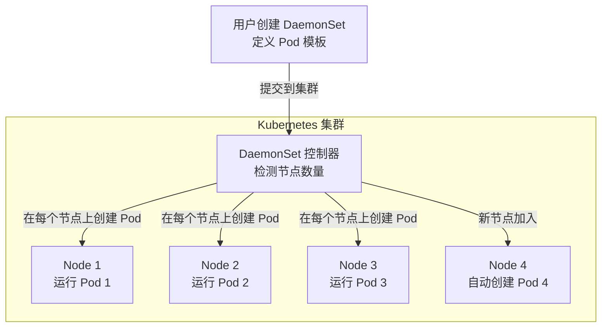
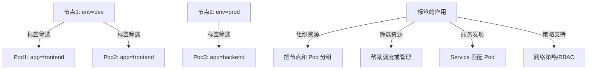
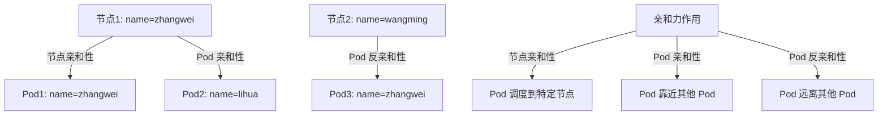
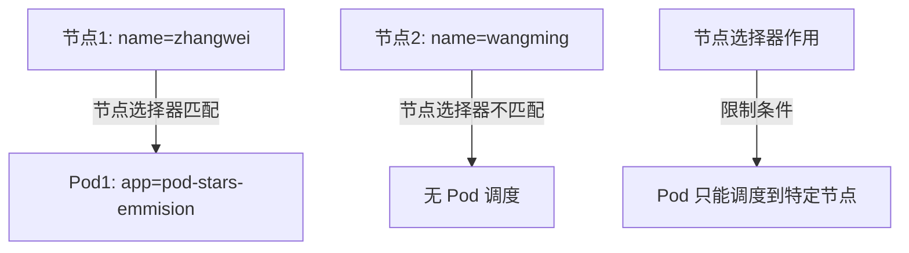

# Day6 Kubernetes 资源对象：DaemonSet

## 教学目标
- 理解 DaemonSet 的基本概念及其在 Kubernetes 中的作用
- 掌握 DaemonSet 的使用场景，特别是在系统服务和节点级任务中的应用
- 了解 DaemonSet 与其他控制器（如 Deployment 和 StatefulSet）的区别
- 学习 DaemonSet 的配置方法及其核心字段的含义
- 能够分析 DaemonSet 在实际集群管理中的优势和局限性

## 第一部分：DaemonSet 理论基础

### 1. 什么是 DaemonSet？为什么需要 DaemonSet？
- **基本概念**：DaemonSet 是 Kubernetes 中的一种控制器，用于确保集群中的每个节点（Node）上都运行一个 Pod 副本。它的名字来源于 Linux 系统中的“守护进程（Daemon）”，意为在后台持续运行的服务进程。
- **核心特点**：
  1. **节点覆盖**：DaemonSet 会自动在集群中的每个节点上创建一个 Pod，即使新节点加入集群，DaemonSet 也会自动在新节点上部署 Pod。
  2. **唯一性**：每个节点上只会运行一个由 DaemonSet 管理的 Pod 副本，不会像 Deployment 那样根据副本数（replicas）创建多个 Pod。
  3. **生命周期管理**：如果某个节点的 Pod 被删除或崩溃，DaemonSet 会自动重新创建 Pod，确保节点始终有一个运行中的 Pod。
- **为什么需要 DaemonSet**：
  - 在 Kubernetes 集群管理中，许多系统级任务需要在每个节点上运行，例如日志收集（如 Fluentd、Logstash）、监控代理（如 Prometheus Node Exporter）、网络插件（如 CNI 插件中的某些组件）等。这些任务通常与节点绑定，而非与应用负载相关。
  - 如果使用 Deployment 或其他控制器，需要手动调整副本数或节点亲和性（affinity）来覆盖所有节点，这种方式既复杂又不灵活。DaemonSet 提供了一种简单且自动化的方式，确保每个节点都有且仅有一个 Pod 运行。
- **问题引导**：如果我们要在一个 10 个节点的集群中部署日志收集代理，使用 Deployment 需要设置多少副本？如果集群新增了一个节点，Deployment 会自动在新节点上部署 Pod 吗？有没有更简单的方法？
- **互动思考**：问学习者，DaemonSet 的“守护进程”特性体现在哪里？它与 Linux 系统中的守护进程有何相似之处？

### 2. DaemonSet 的典型使用场景
- **场景概述**：DaemonSet 适用于需要在每个节点上运行的系统服务或基础设施组件。以下是几个典型的使用场景：
  1. **日志收集**：在每个节点上运行一个日志收集代理（如 Fluentd 或 Filebeat），收集节点和 Pod 的日志，并将其转发到集中式日志系统（如 Elasticsearch）。
  2. **监控代理**：在每个节点上部署监控工具（如 Prometheus Node Exporter），采集节点的性能指标（如 CPU、内存、磁盘使用率）并发送到监控系统。
  3. **网络插件**：某些 CNI（容器网络接口）插件的组件需要在每个节点上运行，以管理 Pod 的网络连接和策略。
  4. **安全代理**：在每个节点上运行安全扫描工具或入侵检测系统，监控节点的安全状态。
  5. **存储驱动**：某些分布式存储系统的客户端或代理需要在每个节点上运行，以便 Pod 能够访问存储资源。
- **问题引导**：如果我们不使用 DaemonSet，而是手动在每个节点上启动一个进程，会有什么问题？Kubernetes 的控制器机制如何帮助我们解决这些问题？
- **互动思考**：问学习者，除了上面提到的场景，你还能想到哪些需要在每个节点上运行的任务？这些任务是否适合用 DaemonSet 管理？

### 3. DaemonSet 与其他控制器的区别
为了帮助学习者更好地理解 DaemonSet 的定位，我们将其与 Kubernetes 中其他常见的控制器（Deployment 和 StatefulSet）进行对比：
- **DaemonSet vs Deployment**：
  1. **目标不同**：Deployment 旨在管理无状态应用的多个副本，副本数量由用户指定，且 Pod 可以分布在任意节点上；DaemonSet 旨在确保每个节点上运行一个 Pod，数量由节点数决定。
  2. **调度方式**：Deployment 根据副本数和调度策略（如资源需求、节点亲和性）分配 Pod；DaemonSet 自动在每个节点上部署一个 Pod，无需手动指定副本数。
  3. **典型场景**：Deployment 适合运行 Web 应用、微服务等负载；DaemonSet 适合运行节点级的系统服务。
- **DaemonSet vs StatefulSet**：
  1. **状态管理**：StatefulSet 专门为有状态应用设计，提供稳定的 Pod 标识和存储绑定；DaemonSet 不关注状态，只关注节点覆盖。
  2. **Pod 分布**：StatefulSet 的 Pod 数量由用户指定，可以分布在任意节点；DaemonSet 严格绑定到每个节点。
  3. **典型场景**：StatefulSet 适合运行数据库、消息队列等有状态服务；DaemonSet 适合运行节点级的基础设施组件。
- **总结表**：
  | 控制器       | 目标                     | Pod 分布方式          | 典型场景                     |
  |--------------|--------------------------|-----------------------|------------------------------|
  | DaemonSet    | 每个节点一个 Pod         | 严格绑定节点          | 日志收集、监控代理、网络插件 |
  | Deployment   | 指定数量的无状态副本     | 任意节点分布          | Web 应用、微服务            |
  | StatefulSet  | 指定数量的有状态副本     | 任意节点分布，稳定标识 | 数据库、分布式存储          |
- **互动思考**：问学习者，如果我们要部署一个分布式数据库，DaemonSet 适合吗？为什么？如果要部署一个节点监控工具，Deployment 和 DaemonSet 哪个更合适？

### 4. DaemonSet 的工作原理
- **基本流程**：
  1. 用户创建 DaemonSet 对象，定义 Pod 模板（包括容器镜像、资源需求等）。
  2. Kubernetes 控制器（DaemonSet Controller）检测集群中的节点数量，并在每个节点上创建一个 Pod。
  3. 如果有新节点加入集群，DaemonSet 控制器会自动在新节点上创建 Pod。
  4. 如果某个节点的 Pod 被删除或崩溃，DaemonSet 控制器会重新创建 Pod，确保节点始终有一个 Pod 运行。
- **调度限制**：虽然 DaemonSet 默认会在每个节点上运行 Pod，但它仍然受限于 Kubernetes 的调度规则。例如，如果节点资源不足或存在污点（Taint），Pod 可能无法调度到该节点。可以通过设置容忍度（Toleration）来解决污点问题。
- **更新机制**：DaemonSet 支持滚动更新（Rolling Update），当用户更新 DaemonSet 的 Pod 模板时，Kubernetes 会逐步在每个节点上替换旧 Pod，确保服务不中断。
- **问题引导**：DaemonSet 如何知道集群中有哪些节点？如果一个节点不可用，DaemonSet 会如何处理？
- **互动思考**：问学习者，DaemonSet 的控制器如何确保每个节点都有一个 Pod？如果一个节点被标记为不可调度（Unschedulable），DaemonSet 会在该节点上创建 Pod 吗？

### 5. Mermaid 结构图：DaemonSet 的工作流程
为了更直观地展示 DaemonSet 的工作原理和 Pod 分布机制，我们用 Mermaid 图进行说明。



- **图解说明**：
  1. **用户创建 DaemonSet**：定义 Pod 模板，提交到 Kubernetes 集群。
  2. **DaemonSet 控制器**：检测集群中的节点数量，并在每个节点上创建一个 Pod。
  3. **Pod 分布**：每个节点运行一个 Pod，且当新节点加入时，DaemonSet 自动在新节点上创建 Pod。
- **互动思考**：问学习者，根据这个图，DaemonSet 如何处理新加入的节点？如果一个节点故障，Pod 无法运行，DaemonSet 会如何反应？

### 6. DaemonSet 的优势与局限性
- **优势**：
    1. **自动化管理**：自动在每个节点上部署和管理 Pod，无需手动干预。
    2. **一致性保证**：确保每个节点都有一个 Pod 运行，适合系统服务的一致性需求。
    3. **动态适应**：当集群节点数量变化时，DaemonSet 自动调整

- **局限性：**
    1. **缺乏灵活性：** DaemonSet 强制在每个节点上运行一个 Pod，无法像 Deployment 那样根据需求选择特定节点或设置副本数量，可能导致资源浪费。
    2. **不适合所有工作负载：** 只适用于需要在每个节点上运行的服务，对于不需要全节点覆盖的应用，DaemonSet 并不合适。
    3. **管理复杂性：** 如果需要对某些节点进行特殊配置或排除，管理起来会比较复杂，需要借助节点标签或污点（Taints）和容忍度（Tolerations）来实现。


## 第二部分: DaemonSet 的语法介绍

**DaemonSet** 是 Kubernetes 中用于在集群的每个节点上运行一个 Pod 的控制器，适用于需要在所有节点上部署系统服务的场景，例如日志收集（Fluentd、Logstash）、监控代理（Prometheus Node Exporter）或网络插件（CNI 插件）。

#### **DaemonSet YAML 示例**
以下是一个典型的 DaemonSet YAML 文件：

```yaml
apiVersion: apps/v1
kind: DaemonSet
metadata:
  name: my-daemonset
  labels:
    app: my-daemonset
spec:
  selector:
    matchLabels:
      app: my-daemonset
  template:
    metadata:
      labels:
        app: my-daemonset
    spec:
      containers:
      - name: daemon-app
        image: busybox:1.28
        command: ['sh', '-c', 'echo "Running on $(hostname)" && sleep 3600']
        resources:
          limits:
            cpu: "200m"
            memory: "128Mi"
      tolerations:  # 可选，用于匹配节点的污点
      - key: "node-role.kubernetes.io/master"
        effect: "NoSchedule"
      nodeSelector:  # 可选，用于选择特定节点
        disktype: ssd
```

#### **语法字段解析**
- **apiVersion**：通常为 `apps/v1`，表示使用的是 Kubernetes 的 apps 组的 v1 版本。
- **kind**：设置为 `DaemonSet`，指定这是一个 DaemonSet 资源。
- **metadata**：包含 DaemonSet 的名称和标签，用于标识和管理。
- **spec.selector**：定义如何选择由该 DaemonSet 管理的 Pod，必须与 `template.metadata.labels` 匹配。
- **spec.template**：定义 Pod 的模板，包含容器配置、镜像、命令等，与 Deployment 和 StatefulSet 的 Pod 模板类似。
- **spec.template.spec.tolerations**（可选）：用于允许 DaemonSet 的 Pod 运行在带有特定污点（Taints）的节点上，例如主控节点（Master Node）。
- **spec.template.spec.nodeSelector**（可选）：用于限制 DaemonSet 只在满足特定标签的节点上运行。
- **spec.template.spec.affinity**（可选，未在示例中展示）：更复杂的节点亲和性规则，用于精确控制 Pod 调度。

#### **特点说明**
- DaemonSet 不需要指定 `replicas` 字段，因为它会自动在每个符合条件的节点上运行一个 Pod。
- 当集群新增节点时，DaemonSet 会自动在该节点上创建一个 Pod；当节点被移除时，对应的 Pod 也会被自动清理。


### 2. **DaemonSet 与 Deployment 和 StatefulSet 的差异**

下面从定义、使用场景、行为特性及语法结构等方面，对比 **DaemonSet**、**Deployment** 和 **StatefulSet** 的差异。

#### **2.1 定义与使用场景**
| 控制器         | 定义                                      | 典型使用场景                          |
|----------------|------------------------------------------|--------------------------------------|
| **DaemonSet**  | 在每个节点上运行一个 Pod 的控制器         | 日志收集、监控代理、网络插件         |
| **Deployment** | 管理无状态应用的控制器，支持指定副本数     | Web 服务器、API 服务、无状态微服务   |
| **StatefulSet**| 管理有状态应用的控制器，支持固定身份和存储 | 数据库（MySQL）、分布式系统（Kafka） |

#### **2.2 主要特性对比**
| 特性                | DaemonSet                          | Deployment                          | StatefulSet                          |
|---------------------|------------------------------------|-------------------------------------|--------------------------------------|
| **应用类型**        | 系统服务（节点级别）               | 无状态应用                         | 有状态应用                          |
| **Pod 数量控制**    | 每个节点一个 Pod，自动调整         | 手动指定副本数（`replicas`）        | 手动指定副本数（`replicas`）        |
| **Pod 名称**        | 随机生成（如 `app-1234567890-abc`）| 随机生成（如 `app-1234567890-abc`）| 有序且固定（如 `app-0`, `app-1`）   |
| **存储支持**        | 不自动绑定持久卷，需手动配置       | 不自动绑定持久卷，需手动配置        | 自动为每个 Pod 绑定持久卷（PVC）    |
| **部署顺序**        | 无序，按节点自动创建               | 无序，Pod 可同时创建或销毁          | 有序，按编号依次创建和销毁          |
| **网络身份**        | 无固定身份，依赖 Service 访问      | 无固定身份，依赖 Service 访问       | 每个 Pod 有固定身份，可直接访问     |
| **更新策略**        | 支持滚动更新，逐节点更新           | 支持滚动更新，可批量替换 Pod        | 默认逐个更新，确保服务稳定性        |
| **调度控制**        | 可通过 `nodeSelector`、`tolerations` 控制 | 可通过 `nodeSelector` 等控制        | 可通过 `nodeSelector` 等控制        |

#### **2.3 语法结构差异**
- **kind 字段**：
  - DaemonSet：`kind: DaemonSet`
  - Deployment：`kind: Deployment`
  - StatefulSet：`kind: StatefulSet`
- **replicas 字段**：
  - DaemonSet：无 `replicas` 字段，Pod 数量由节点数量决定。
  - Deployment 和 StatefulSet：有 `replicas` 字段，手动指定 Pod 副本数。
- **serviceName 字段**：
  - DaemonSet 和 Deployment：无此字段，通常配合普通 Service 使用。
  - StatefulSet：有 `serviceName` 字段，关联 Headless Service 以提供固定网络身份。
- **volumeClaimTemplates 字段**：
  - DaemonSet 和 Deployment：无此字段，持久卷需手动配置。
  - StatefulSet：有此字段，自动为每个 Pod 创建持久卷声明（PVC）。
- **tolerations 和 nodeSelector**：
  - DaemonSet：常用 `tolerations` 和 `nodeSelector` 来控制在哪些节点上运行 Pod（例如包括或排除主控节点）。
  - Deployment 和 StatefulSet：也可以使用，但不常见，通常关注副本数而非节点覆盖。

#### **2.4 行为差异**
- **Pod 创建与管理**：
  - **DaemonSet**：自动在每个节点上创建一个 Pod，节点增减时自动调整，无需手动设置副本数。
  - **Deployment**：根据 `replicas` 创建指定数量的 Pod，无序创建和销毁。
  - **StatefulSet**：根据 `replicas` 创建指定数量的 Pod，有序创建和销毁（从 `0` 开始）。
- **存储管理**：
  - **DaemonSet** 和 **Deployment**：不自动管理持久卷，需手动配置 PVC 和 PV。
  - **StatefulSet**：通过 `volumeClaimTemplates` 自动为每个 Pod 创建独立的 PVC。
- **网络访问**：
  - **DaemonSet** 和 **Deployment**：Pod 没有固定身份，通常通过 Service 负载均衡访问。
  - **StatefulSet**：每个 Pod 有固定 DNS 名称，配合 Headless Service 可直接访问。


### **实验前准备：通过 Kuboard 关闭 Deployment 和 StatefulSet 释放资源**

由于资源有限（2 核 4G），在进行 DaemonSet 实验前，建议学员通过 Kuboard 界面将自己命名空间中的所有 Deployment 和 StatefulSet 的 Pod 数（副本数）修改为 0，以释放 CPU 和内存资源。以下是具体步骤：

#### **步骤 1：登录 Kuboard 界面**
- 打开浏览器，访问你的 Kuboard 管理界面地址（通常由管理员提供，例如 `http://your-kuboard-url:port`）。
- 使用你的账号和密码登录，确保你有权限管理 `shiqi` 命名空间。

#### **步骤 2：进入 shiqi 命名空间**
- 在 Kuboard 界面左侧导航栏中，选择“命名空间”或“Namespaces”。
- 找到并点击 `shiqi` 命名空间，进入该命名空间的资源视图。

#### **步骤 3：调整 Deployment 的 Pod 数为 0**
- 在 `shiqi` 命名空间页面中，找到“工作负载”或“Workloads”选项卡。
- 点击“Deployment”或“部署”，查看当前命名空间中的所有 Deployment 列表。
- 对每个 Deployment 执行以下操作：
  - 点击某个 Deployment 的名称，进入详情页面。
  - 找到“副本数”或“Replicas”设置项（通常是一个可编辑的数字字段）。
  - 将副本数修改为 `0`，然后点击“保存”或“应用”按钮。
  - 等待片刻，确认该 Deployment 的 Pod 数已变为 0（可以通过界面查看 Pod 状态）。

#### **步骤 4：调整 StatefulSet 的 Pod 数为 0**
- 同样在 `shiqi` 命名空间的“工作负载”或“Workloads”选项卡中，找到“StatefulSet”或“有状态集”。
- 对每个 StatefulSet 执行以下操作：
  - 点击某个 StatefulSet 的名称，进入详情页面。
  - 找到“副本数”或“Replicas”设置项。
  - 将副本数修改为 `0`，然后点击“保存”或“应用”按钮。
  - 等待片刻，确认该 StatefulSet 的 Pod 数已变为 0。

#### **步骤 5：确认资源已释放**
- 在 Kuboard 界面中，查看 `shiqi` 命名空间的 Pod 列表（通常在“Pod”或“容器组”选项卡中）。
- 确认所有与 Deployment 和 StatefulSet 相关的 Pod 都已消失，表示资源已释放。
- （可选）如果界面支持资源监控，可以查看 CPU 和内存使用情况，确保资源占用已降低。

#### **注意事项**
- 将副本数设置为 0 不会删除 Deployment 或 StatefulSet 的配置，仅会停止运行 Pod，释放资源。如果后续需要恢复，只需将副本数重新设置为原来的值。
- 如果 Kuboard 界面中某些资源无法直接修改副本数，可以联系管理员，或者通过命令行工具 `kubectl` 执行操作（如下文备用方案）。
- 确保在操作时不要误改其他人的命名空间或资源。

#### **备用方案：使用 kubectl 命令行**
如果 Kuboard 界面操作受限或不方便，可以使用 `kubectl` 命令行工具调整副本数：
```bash
# 将某个 Deployment 的副本数设为 0
kubectl scale deployment <deployment-name> --replicas=0 -n shiqi

# 将某个 StatefulSet 的副本数设为 0
kubectl scale statefulset <statefulset-name> --replicas=0 -n shiqi

# 查看当前资源状态
kubectl get deployment -n shiqi
kubectl get statefulset -n shiqi
```


### 1. **DaemonSet YAML 文件（带详细中文注释）**
做完了作业，一定要删除啊, 每个人33个pod, 全班30+人,一共900多个pod k8s会爆炸的，你们长点心啊

以下是你的 `daemonset-busybox-test.yaml` YAML 文件，添加了详细的中文注释，方便学员理解每个字段的作用：

```yaml
apiVersion: apps/v1  # 指定 Kubernetes API 版本，这里使用 apps 组的 v1 版本，适用于 DaemonSet 等资源
kind: DaemonSet      # 资源类型为 DaemonSet，用于在集群的每个节点上运行一个 Pod
metadata:
  name: daemonset-busybox-test  # DaemonSet 的名称，唯一标识该资源
  namespace: shiqi              # 资源所在的命名空间，实验将在 shiqi 命名空间中进行
  labels:
    app: busybox-test           # 为 DaemonSet 定义标签，便于管理和查询
spec:
  selector:                       # 选择器，用于匹配由该 DaemonSet 管理的 Pod
    matchLabels:
      app: busybox-test          # 必须与 Pod 模板中的标签一致，否则无法关联
  template:                       # Pod 模板，定义 DaemonSet 创建的 Pod 的具体配置
    metadata:
      labels:
        app: busybox-test        # Pod 的标签，与 selector.matchLabels 保持一致
    spec:                        # Pod 的具体规范，定义容器、资源等配置
      containers:                # 容器列表，定义 Pod 中运行的容器
      - name: busybox            # 容器名称，方便识别
        image: swr.cn-north-4.myhuaweicloud.com/ddn-k8s/docker.io/library/busybox:1.28.4  # 容器镜像，使用华为云镜像仓库中的 busybox 1.28.4 版本，镜像极小（约 1.2MB）
        command: ['sh', '-c', 'echo "Running on $(hostname)" && sleep 3600']  # 容器启动命令，输出当前主机名并保持运行 3600 秒（1 小时）
        resources:               # 资源配置，限制和请求容器的 CPU 和内存使用
          limits:                # 资源上限，容器使用的最大资源量
            cpu: "50m"          # CPU 上限为 50 毫核（0.05 核），防止占用过多 CPU
            memory: "32Mi"      # 内存上限为 32MB，防止占用过多内存
          requests:            # 资源请求，容器启动时所需的最小资源量
            cpu: "20m"          # CPU 请求为 20 毫核（0.02 核）
            memory: "16Mi"      # 内存请求为 16MB
```

#### **保存与应用**
- 将上述内容保存为 `daemonset-busybox-test.yaml` 文件。
- 使用以下命令应用到集群中：
  ```bash
  kubectl apply -f daemonset-busybox-test.yaml
  ```
- 查看 DaemonSet 状态：
  ```bash
  kubectl get daemonset -n shiqi
  ```
- 查看 Pod 分布：
  ```bash
  kubectl get pods -n shiqi -o wide
  ```
- 删除 DaemonSet (一定要删除啊, 每个人33个pod,全班30+人,一共900多个pod k8s会爆炸的)
  ```bash
  kubectl delete daemonset daemonset-busybox-test -n shiqi
  ```

# Day6 Kubernetes 调度策略

## 教学目标
- 理解标签（Labels）的基本概念和作用，学会如何用它组织和筛选资源。
- 掌握亲和力（Affinity）的基本用法，明白如何通过亲和力控制 Pod 的调度位置。

## 第一部分Kubernetes 调度策略：标签（Labels）与亲和力（Affinity）

### **一、标签（Labels）**

#### **1. 什么是标签？**
- 标签是 Kubernetes 中给资源（如 Pod、节点、Service 等）贴上的“标记”，本质上是附加在资源上的元数据（metadata）。
- 标签以“键值对”的形式存在，例如 `app=web` 或 `env=dev`，用于描述资源的特性、用途或分类。
- 标签是 Kubernetes 资源管理的基础，几乎所有高级功能（如调度、亲和力、服务发现）都依赖于标签。

#### **2. 标签的作用**
标签在 Kubernetes 中有多种重要作用，特别是在大规模集群管理中不可或缺。以下是详细说明：
- **组织资源**：
  - 通过标签对资源进行分组和分类，比如将所有开发环境的 Pod 标记为 `env=dev`，生产环境的 Pod 标记为 `env=prod`。
  - 便于管理员快速识别和管理资源，尤其在集群中有数百上千个资源时，标签是区分资源的关键。
- **筛选资源**：
  - 标签与选择器（Selectors）配合使用，用于筛选符合条件的资源。
  - 例如，Deployment 通过 `selector` 匹配具有特定标签的 Pod 来管理它们；Service 通过标签选择器找到对应的 Pod。
- **调度支持**：
  - 标签本身不直接决定 Pod 的调度位置，但它是节点选择器（Node Selector）、亲和力（Affinity）等调度策略的基础。
  - 比如，可以通过节点标签 `env=dev` 限制 Pod 只调度到特定节点。
- **服务发现与负载均衡**：
  - Service 资源通过标签选择器找到需要提供服务的 Pod 组，实现流量转发。
  - 例如，Service 匹配 `app=web` 的 Pod，将流量分发到这些 Pod 上。
- **策略与权限管理**：
  - 标签可以用于定义策略，例如网络策略（Network Policy）通过标签选择器限制 Pod 之间的通信。
  - 也可以用于 RBAC（基于角色的访问控制），通过标签限制用户对特定资源的访问。
- **可扩展性**：
  - 标签是用户自定义的，可以根据业务需求自由设计，比如 `team=frontend` 或 `version=1.0.0`，灵活性极高。

#### **3. 标签的设计与最佳实践**
- **键值对格式**：标签的键可以包含字母、数字、下划线和点号，值可以是任意字符串，但建议简洁有意义。
- **命名规范**：建议使用有意义的键名，比如 `app`、`env`、`role`，避免过于随意。
- **层级结构**：可以通过键名前缀表示层级，比如 `app.kubernetes.io/name=web`（这是 Kubernetes 官方推荐的标签格式）。
- **避免冗余**：不要为每个资源添加过多无意义的标签，保持简洁以提高可读性。
- **常见标签示例**：
  - 环境：`env=dev`、`env=prod`
  - 应用：`app=web`、`app=db`
  - 角色：`role=frontend`、`role=backend`
  - 版本：`version=1.0.0`

#### **4. 简单示例**
- 给一个节点贴上标签，表示它是“开发环境”：
  ```bash
  kubectl label node node1 env=dev
  ```
- 给 Pod 贴上标签，表示它是一个“前端应用”：
  在 YAML 文件中：
  ```yaml
  metadata:
    labels:
      app: frontend
  ```
- 查看资源的标签：
  ```bash
  kubectl get nodes --show-labels
  kubectl get pods --show-labels
  ```

#### **5. 直观理解：Mermaid 图**
为了让学员更直观地理解标签的作用，我用 Mermaid 图展示标签如何帮助组织和筛选资源：



**解释**：
- 节点和 Pod 都有标签，比如节点1 是 `env=dev`，Pod1 和 Pod2 是 `app=frontend`。
- 通过标签，可以把资源分组，或者在调度、服务发现、策略管理时筛选合适的节点或 Pod。

#### **6. 教学提示**
- 标签就像超市里的商品标签，方便我们快速找到需要的东西。
- 标签是 Kubernetes 的“身份证”，几乎所有高级功能都依赖它。
- 问学员：如果你要管理 100 个 Pod，怎么用标签把它们分成“前端”和“后端”两组？如果再加上环境（开发/生产），你会怎么设计标签？

#### **7. 标签的局限性与注意事项**
- **不唯一性**：标签不要求唯一，多个资源可以有相同的标签（这是其灵活性的来源）。
- **手动管理挑战**：在大规模集群中，手动管理标签可能导致混乱，建议结合自动化工具（如 Helm 或 Operator）统一管理。
- **性能影响**：过多或复杂的标签选择器可能影响调度性能，需合理设计。


### **二、实践练习：为节点和 Pod 添加标签**

为了帮助学员将理论转化为实践，以下是为节点和 Deployment 的 Pod 添加标签的详细步骤。这些练习为后续学习节点选择器和亲和力奠定基础。

#### **练习 1：为节点（Node）添加标签**
- **目标**：为自己的节点主机添加标签 `name=名字拼音`，为后期学习节点标签选择器做准备。
- **步骤**：
  1. 查看当前集群中的节点列表：
     ```bash
     kubectl get nodes
     ```
     找到你的目标节点名称（比如 `k8s-node-shiqi-8`）。
  2. 为节点添加标签 `name=名字拼音`（假设名字拼音为 `zhang san`，请替换为自己的拼音）：
     ```bash
     kubectl label node k8s-node-shiqi-8 name=shiqi
     ```
     例如：
     ```bash
     kubectl label node k8s-node-shiqi-8 name=shiqi
     ```
  3. 验证标签是否添加成功：
     ```bash
     kubectl get node k8s-node-shiqi-8 --show-labels
     ```
     检查输出中是否包含 `name=zhangsan`。
- **注意**：确保替换 `<node-name>` 为你实际的节点名称。如果标签已存在，可以用 `--overwrite` 参数覆盖：
  ```bash
  kubectl label node k8s-node-shiqi-8 name=shiqi --overwrite
  ```

#### **练习 2：为 Deployment 的 Pod 添加标签**
- **目标**：为 `deployment-stars-emmision.yml` 文件中的 Pod 添加标签，注意是 Pod 的标签，而不是 Deployment 的标签（Deployment 的标签在亲和力学习中无直接作用）。
- **标签要求**：
  - `app: pod-stars-emmision` （项目标签，表示 stars-emmision 项目）
  - `type: frontend` （类型标签，表示前端应用）
  **注意**：根据 YAML 文件的结构，`app: pod-stars-emmision` 是主要标签，与 `selector` 匹配；这里假设添加多个标签值，但 Kubernetes 同一键名下只能有一个值，建议调整为不同键名（如 `type: frontend`）。
- **完整 YAML 文件**：
    以下是更新后的 `deployment-stars-emmision.yml`，已为 Pod 添加标签：
    ```yaml
    apiVersion: apps/v1  # 指定 Kubernetes API 版本，apps/v1 是 Deployment 资源的 API 版本
    kind: Deployment     # 资源类型为 Deployment，用于管理 Pod 的无状态应用部署
    metadata:            # 资源的元数据，包含名称、命名空间等信息
      name: deployment-stars-emmision  # Deployment 的名称，唯一标识该资源
      namespace: shiqi                 # Deployment 所属的命名空间，用于资源隔离
    spec:                # Deployment 的规格定义，描述期望的状态
      replicas: 1        # 期望运行的 Pod 副本数量，这里是 1 个副本
      revisionHistoryLimit: 10  # 保留的历史版本数量，用于回滚，最多保留 10 个历史版本
      selector:          # 选择器，用于匹配 Deployment 管理的 Pod，必须与 Pod 标签一致
        matchLabels:     # 匹配标签，Deployment 通过这些标签找到要管理的 Pod
          app: pod-stars-emmision  # 匹配标签键值对，Pod 必须有此标签才能被管理
      strategy:          # 部署策略，定义如何更新 Pod
        rollingUpdate:   # 滚动更新策略，逐步替换旧 Pod，避免服务中断
          maxSurge: 25%  # 最大额外副本比例，更新时最多可以超出期望副本数的 25%
          maxUnavailable: 25%  # 最大不可用比例，更新时最多允许 25% 的副本不可用
        type: RollingUpdate  # 更新类型为滚动更新，确保服务平滑过渡
      template:          # Pod 模板，定义 Pod 的结构和配置
        metadata:        # Pod 的元数据，包含 Pod 的标签等信息
          labels:        # Pod 的标签，用于分类和筛选
            app: pod-stars-emmision  # 项目标签，表示属于 stars-emmision 项目
            type: frontend           # 应用类型标签，表示这是一个前端应用（这是我加的，滴滴滴）
        spec:            # Pod 的详细规格，定义 Pod 内部的容器和其他配置
          containers:    # 容器列表，定义 Pod 中运行的容器
            - image: 'harbor.labworlds.cc/stars-emmision/master:08111536-panfulin'  # 容器镜像地址和版本
              imagePullPolicy: IfNotPresent  # 镜像拉取策略，若本地有镜像则不拉取
              livenessProbe:  # 存活探针，用于检测容器是否存活，若失败则重启容器
                failureThreshold: 3  # 失败阈值，连续 3 次失败后认为容器不健康
                httpGet:             # 使用 HTTP GET 请求检测容器健康状态
                  path: /            # 请求路径，检测根路径
                  port: 80           # 请求端口，检测 80 端口
                  scheme: HTTP       # 请求协议，使用 HTTP 协议
                initialDelaySeconds: 5  # 初始延迟，容器启动后等待 5 秒开始检测
                periodSeconds: 5        # 检测周期，每 5 秒检测一次
                successThreshold: 1     # 成功阈值，1 次成功即认为健康
                timeoutSeconds: 1       # 超时时间，每次检测超时时间为 1 秒
              name: stars-emmision      # 容器名称，用于标识容器
              ports:                    # 容器暴露的端口列表
                - containerPort: 80     # 容器内部端口，暴露 80 端口
                  protocol: TCP         # 端口协议，使用 TCP 协议
              readinessProbe:           # 就绪探针，用于检测容器是否就绪提供服务
                failureThreshold: 3     # 失败阈值，连续 3 次失败后认为容器未就绪
                initialDelaySeconds: 5  # 初始延迟，容器启动后等待 5 秒开始检测
                periodSeconds: 5        # 检测周期，每 5 秒检测一次
                successThreshold: 1     # 成功阈值，1 次成功即认为就绪
                tcpSocket:              # 使用 TCP 套接字检测容器就绪状态
                  port: 80              # 检测 80 端口是否可以连接
                timeoutSeconds: 1       # 超时时间，每次检测超时时间为 1 秒
              resources:                # 资源限制和请求，定义容器的 CPU 和内存使用
                limits:                 # 资源上限，容器最多能使用的资源量
                  cpu: 100m             # CPU 上限为 100 毫核（0.1 核）
                  memory: 128Mi         # 内存上限为 128 MiB
                requests:               # 资源请求，容器启动时申请的资源量
                  cpu: 50m              # CPU 请求为 50 毫核（0.05 核）
                  memory: 100Mi         # 内存请求为 100 MiB
              startupProbe:             # 启动探针，用于检测容器是否启动完成
                exec:                   # 使用执行命令的方式检测
                  command:              # 执行的命令列表
                    - sh                # 使用 shell 解释器
                    - '-c'              # 指定 shell 命令
                    - ps aux | grep nginx || ps aux | grep stars  # 检查进程是否存在 nginx 或 stars
                failureThreshold: 30    # 失败阈值，连续 30 次失败后认为启动失败
                initialDelaySeconds: 10 # 初始延迟，容器启动后等待 10 秒开始检测
                periodSeconds: 5        # 检测周期，每 5 秒检测一次
                successThreshold: 1     # 成功阈值，1 次成功即认为启动完成
                timeoutSeconds: 2       # 超时时间，每次检测超时时间为 2 秒
          imagePullSecrets:             # 镜像拉取密钥，用于从私有镜像仓库拉取镜像
            - name: secret-harbor-login # 密钥名称，引用已创建的 Secret 资源
    ```
- **步骤**：
  1. 将以上 YAML 文件保存到本地（比如 `deployment-stars-emmision.yml`）。
  2. 应用该配置文件到集群：
     ```bash
     kubectl apply -f deployment-stars-emmision.yml
     ```
  3. 验证 Pod 是否创建成功并带有指定标签：
     ```bash
     kubectl get pods -n shiqi --show-labels
     ```
     检查输出中是否包含 `app=pod-stars-emmision,type=frontend`。
- **注意**：
  - Pod 标签必须与 Deployment 的 `selector.matchLabels` 一致（这里是 `app: pod-stars-emmision`），否则 Deployment 无法管理这些 Pod。


## **二、亲和力（Affinity）**

### **目标**
- 理解亲和力（Affinity）的概念、类型和作用，掌握如何通过亲和力规则控制 Pod 调度。
- 学会区分节点亲和性（Node Affinity）和 Pod 亲和性/反亲和性（Pod Affinity/Anti-Affinity），以及硬性/软性要求的适用场景。
- 通过示例和直观图表，为后续实践练习打下理论基础。

### **1. 什么是亲和力？**
- **定义**：亲和力是 Kubernetes 中的一种调度规则，用于控制 Pod 被调度到哪些节点，或者 Pod 与其他 Pod 之间的位置关系。
- **通俗理解**：亲和力就像“吸引力”或“排斥力”，可以让 Pod “喜欢”某些节点，或者“靠近”/“远离”其他 Pod。
- **重要性**：亲和力是 Kubernetes 高级调度机制的一部分，帮助优化资源分配、提高性能或增强高可用性。

#### **教学提示**
- 用生活化的例子解释：亲和力就像安排座位，可以让“朋友”坐在一起（Pod 亲和性），或者让“竞争者”分开坐（Pod 反亲和性）。
- 问学员：如果你要安排服务器部署，哪些应用需要放在一起？哪些需要分开？为什么？


### **2. 亲和力的两种主要类型**
亲和力分为两大类，分别控制 Pod 与节点、Pod 与 Pod 之间的关系。以下是详细说明：

- **节点亲和性（Node Affinity）**：
  - **作用**：决定 Pod 倾向于调度到哪些节点，通常基于节点的标签（Labels）。
  - **场景**：希望 Pod 调度到特定环境（如开发环境节点）或特定硬件（如 GPU 节点）。
  - **例子**：将 Pod 限制在有标签 `env=dev` 的节点上。
- **Pod 亲和性（Pod Affinity）与 Pod 反亲和性（Pod Anti-Affinity）**：
  - **Pod 亲和性**：
    - **作用**：让 Pod 倾向于靠近其他特定 Pod，通常为了提高性能或数据交互效率。
    - **场景**：将 Web 应用 Pod 调度到与数据库 Pod 相同的节点，减少网络延迟。
    - **例子**：让 `app=web` 的 Pod 靠近 `app=db` 的 Pod。
  - **Pod 反亲和性**：
    - **作用**：让 Pod 倾向于远离其他特定 Pod，通常为了分散负载或避免单点故障。
    - **场景**：将多个 Web 应用 Pod 分散到不同节点，确保一个节点故障不会影响所有实例。
    - **例子**：让 `app=web` 的 Pod 避免与其他 `app=web` 的 Pod 位于同一节点。

### **3. 亲和力的两种强度**
亲和力规则可以是强制性的，也可以是建议性的，分别对应不同的调度行为：

- **硬性要求（Required）**：
  - **定义**：必须满足亲和力条件，否则 Pod 不会被调度。
  - **特点**：如果没有符合条件的节点或位置，Pod 将处于 `Pending` 状态，直到条件满足。
  - **适用场景**：对调度位置有严格要求的情况，例如必须使用特定硬件的节点。
  - **例子**：Pod 必须调度到 `env=dev` 的节点，否则不运行。
- **软性要求（Preferred）**：
  - **定义**：尽量满足亲和力条件，但如果无法满足，Pod 仍会被调度到其他可用位置。
  - **特点**：调度器会优先选择符合条件的节点，但不会因为条件不满足而拒绝调度。
  - **适用场景**：希望优化调度但允许灵活性的情况，例如尽量靠近数据库 Pod。
  - **例子**：Pod 尽量调度到 `env=dev` 的节点，但如果没有也接受其他节点。

### **4. 亲和力对比表格**
为了帮助学员快速理解不同类型亲和力的作用和适用场景，我整理了以下对比表格，内容简洁直观：

| **类型**                        | **作用**                              | **强度**             | **适用场景**                       | **简单例子**                              |
|---------------------------------|--------------------------------------|---------------------|-----------------------------------|------------------------------------------|
| **节点亲和性<br>(Node Affinity)** | 控制 Pod 调度到特定节点             | 硬性：必须满足<br>软性：尽量满足 | Pod 需要特定环境或硬件的节点       | “把 Pod 调度到 `env=dev` 的节点”         |
| **Pod 亲和性<br>(Pod Affinity)** | 让 Pod 靠近其他特定 Pod             | 硬性：必须满足<br>软性：尽量满足 | 相关服务需靠在一起以提高性能       | “把 Web Pod 放在数据库 Pod 所在节点”     |
| **Pod 反亲和性<br>(Pod Anti-Affinity)** | 让 Pod 远离其他特定 Pod      | 硬性：必须满足<br>软性：尽量满足 | Pod 需要分散以避免单点故障         | “不要把两个 Web Pod 放在同一个节点”      |


### **2. 简单示例（基于 `name=名字拼音` 标签）**
以下是针对你的标签设计的亲和力规则示例，展示如何使用 `name=名字拼音` 来实现节点亲和性和 Pod 反亲和性。

- **节点亲和性（硬性要求）**：
  强制 Pod 调度到带有 `name=zhangwei` 标签的节点（假设 `zhangwei` 是你环境中的一个具体拼音值）。
  ```yaml
  affinity:
    nodeAffinity:
      requiredDuringSchedulingIgnoredDuringExecution:  # 硬性要求，调度时必须满足
        nodeSelectorTerms:
        - matchExpressions:
          - key: name          # 匹配节点的标签键，这里是 name
            operator: In       # 操作符，表示值在列表中
            values:
            - zhangwei         # 匹配值，必须是 zhangwei
  ```
  **解释**：如果没有节点带有 `name=zhangwei` 标签，Pod 将不会被调度。适用于严格要求 Pod 调度到特定节点的场景，例如某个负责人的专用节点。

- **Pod 亲和性（软性要求）**：
  尽量将 Pod 调度到与带有 `name=zhangwei` 标签的 Pod 所在的节点。
  ```yaml
  affinity:
    podAffinity:
      preferredDuringSchedulingIgnoredDuringExecution:  # 软性要求，尽量满足
      - weight: 100           # 权重，值越高优先级越高（1-100）
        podAffinityTerm:
          labelSelector:
            matchLabels:
              name: zhangwei    # 匹配其他 Pod 的标签，寻找 name=zhangwei 的 Pod
          topologyKey: "kubernetes.io/hostname"  # 按主机名划分拓扑，同一主机名表示同一节点
  ```
  **解释**：调度器会尽量将 Pod 调度到与 `name=zhangwei` 的 Pod 相同的节点（例如相关服务需要靠在一起），但如果没有符合条件的节点，Pod 仍会被调度到其他地方。

- **Pod 反亲和性（软性要求）**：
  尽量避免 Pod 与其他带有 `name=zhangwei` 标签的 Pod 调度到同一节点。
  ```yaml
  affinity:
    podAntiAffinity:
      preferredDuringSchedulingIgnoredDuringExecution:  # 软性要求，尽量满足
      - weight: 100           # 权重，值越高优先级越高（1-100）
        podAffinityTerm:
          labelSelector:
            matchLabels:
              name: zhangwei    # 匹配其他 Pod 的标签，寻找 name=zhangwei 的 Pod
          topologyKey: "kubernetes.io/hostname"  # 按主机名划分拓扑，同一主机名表示同一节点
  ```
  **解释**：调度器会尽量将 Pod 分散到不同节点，避免与 `name=zhangwei` 的 Pod 在同一节点上（例如避免单点故障），但如果节点不足，Pod 仍会被调度。

### **3. 直观理解：Mermaid 图（基于 `name=名字拼音` 标签）**
以下是基于 `name=名字拼音` 标签的亲和力效果图，帮助你直观理解调度结果。



#### **图表解释**
- **节点亲和性**：Pod1 因为节点亲和性规则，被调度到带有 `name=zhangwei` 标签的节点1。
- **Pod 亲和性**：Pod2 因为想靠近 Pod1（例如与 `name=zhangwei` 相关的服务），也被调度到节点1。
- **Pod 反亲和性**：Pod3 因为不想与其他 `name=zhangwei` 的 Pod 在同一节点，所以被调度到节点2（`name=wangming`）。

### **7. 亲和力的优势与注意事项**
- **优势**：
  - **灵活性**：亲和力规则支持硬性和软性要求，适应不同场景。
  - **优化性能**：通过 Pod 亲和性减少网络延迟，提高应用效率。
  - **高可用性**：通过 Pod 反亲和性分散 Pod，降低单点故障风险。
- **注意事项**：
  - **复杂性**：亲和力规则可能增加配置复杂性，尤其在硬性要求下可能导致 Pod 无法调度。
  - **资源需求**：反亲和性可能需要更多节点资源，确保集群有足够容量。
  - **调试难度**：如果 Pod 因亲和力规则无法调度，需仔细检查规则和节点标签是否匹配。

### **实验 1：节点亲和性（Node Affinity）**
#### **实验目标**
- 通过节点亲和性规则，将 Pod 强制调度到带有特定标签 `name=zhangwei` 的节点上。
- 理解硬性要求（Required）的调度行为：如果没有符合条件的节点，Pod 将无法调度。

#### **完整 YAML 文件**
以下是添加了节点亲和性规则的 `deployment-stars-emmision-node-affinity.yml` 文件：

```yaml
apiVersion: apps/v1
kind: Deployment
metadata:
  name: deployment-stars-emmision
  namespace: shiqi
spec:
  replicas: 1
  revisionHistoryLimit: 10
  selector:
    matchLabels:
      app: pod-stars-emmision
  strategy:
    rollingUpdate:
      maxSurge: 25%
      maxUnavailable: 25%
    type: RollingUpdate
  template:
    metadata:
      labels:
        app: pod-stars-emmision
        type: frontend
    spec:
      affinity:  # 添加亲和力规则
        nodeAffinity:  # 节点亲和性配置
          requiredDuringSchedulingIgnoredDuringExecution:  # 硬性要求，必须满足
            nodeSelectorTerms:
            - matchExpressions:
              - key: name  # 匹配节点标签键
                operator: In  # 操作符，值需在列表中
                values:
                - zhangwei  # 目标标签值，节点必须有 name=zhangwei
      containers:
        - image: 'harbor.labworlds.cc/stars-emmision/master:08111536-panfulin'
          imagePullPolicy: IfNotPresent
          livenessProbe:
            failureThreshold: 3
            httpGet:
              path: /
              port: 80
              scheme: HTTP
            initialDelaySeconds: 5
            periodSeconds: 5
            successThreshold: 1
            timeoutSeconds: 1
          name: stars-emmision
          ports:
            - containerPort: 80
              protocol: TCP
          readinessProbe:
            failureThreshold: 3
            initialDelaySeconds: 5
            periodSeconds: 5
            successThreshold: 1
            tcpSocket:
              port: 80
            timeoutSeconds: 1
          resources:
            limits:
              cpu: 100m
              memory: 128Mi
            requests:
              cpu: 50m
              memory: 100Mi
          startupProbe:
            exec:
              command:
                - sh
                - '-c'
                - ps aux | grep nginx || ps aux | grep stars
            failureThreshold: 30
            initialDelaySeconds: 10
            periodSeconds: 5
            successThreshold: 1
            timeoutSeconds: 2
      imagePullSecrets:
        - name: secret-harbor-login
```

#### **实验步骤**
1. 保存上述 YAML 文件为 `deployment-stars-emmision-node-affinity.yml`。
2. 部署资源：`kubectl apply -f deployment-stars-emmision-node-affinity.yml`。
3. 检查 Pod 状态：`kubectl get pods -n shiqi -o wide`，观察 Pod 是否被调度到带有 `name=zhangwei` 标签的节点。
4. 如果 Pod 处于 `Pending` 状态，查看事件日志：`kubectl describe pod <pod-name> -n shiqi`，确认是否因无符合条件的节点导致调度失败。
5. 如果集群中没有 `name=zhangwei` 标签的节点，为某个节点添加标签：`kubectl label nodes <node-name> name=zhangwei`，然后观察 Pod 是否被调度。

#### **预期结果**
- 如果存在带有 `name=zhangwei` 标签的节点，Pod 将被调度到该节点。
- 如果没有符合条件的节点，Pod 将保持 `Pending` 状态，直到条件满足。

#### **教学提示**
- 强调硬性要求的特点：`requiredDuringSchedulingIgnoredDuringExecution` 表示调度时必须满足条件，否则 Pod 不会运行。
- 问学员：如果你的节点没有目标标签，Pod 无法调度，你会如何调整亲和性规则？


### **实验 2：Pod 亲和性（Pod Affinity）**
#### **实验目标**
- 通过 Pod 亲和性规则，尽量将 Pod 调度到与已有特定标签 Pod（例如 `name=zhangwei`）相同的节点上。
- 理解软性要求（Preferred）的调度行为：优先满足条件，但不满足也能调度。

#### **实验前提**
- 假设集群中已有一个运行中的 Pod，带有标签 `name=zhangwei`，我们希望新部署的 Pod 靠近它。
- 如果没有这样的 Pod，可先部署一个简单的测试 Pod（如 `kubectl run test-pod --image=nginx --labels=name=zhangwei -n shiqi`）。

#### **完整 YAML 文件**
以下是添加了 Pod 亲和性规则的 `deployment-stars-emmision-pod-affinity.yml` 文件：

```yaml
apiVersion: apps/v1
kind: Deployment
metadata:
  name: deployment-stars-emmision
  namespace: shiqi
spec:
  replicas: 1
  revisionHistoryLimit: 10
  selector:
    matchLabels:
      app: pod-stars-emmision
  strategy:
    rollingUpdate:
      maxSurge: 25%
      maxUnavailable: 25%
    type: RollingUpdate
  template:
    metadata:
      labels:
        app: pod-stars-emmision
        type: frontend
    spec:
      affinity:  # 添加亲和力规则
        podAffinity:  # Pod 亲和性配置
          preferredDuringSchedulingIgnoredDuringExecution:  # 软性要求，尽量满足
          - weight: 100  # 权重，值越高优先级越高
            podAffinityTerm:
              labelSelector:
                matchLabels:
                  pod: pod-admin3-ui  # 匹配目标 Pod 的标签
              topologyKey: "kubernetes.io/hostname"  # 按主机名划分拓扑，同一节点
      containers:
        - image: 'harbor.labworlds.cc/stars-emmision/master:08111536-panfulin'
          imagePullPolicy: IfNotPresent
          livenessProbe:
            failureThreshold: 3
            httpGet:
              path: /
              port: 80
              scheme: HTTP
            initialDelaySeconds: 5
            periodSeconds: 5
            successThreshold: 1
            timeoutSeconds: 1
          name: stars-emmision
          ports:
            - containerPort: 80
              protocol: TCP
          readinessProbe:
            failureThreshold: 3
            initialDelaySeconds: 5
            periodSeconds: 5
            successThreshold: 1
            tcpSocket:
              port: 80
            timeoutSeconds: 1
          resources:
            limits:
              cpu: 100m
              memory: 128Mi
            requests:
              cpu: 50m
              memory: 100Mi
          startupProbe:
            exec:
              command:
                - sh
                - '-c'
                - ps aux | grep nginx || ps aux | grep stars
            failureThreshold: 30
            initialDelaySeconds: 10
            periodSeconds: 5
            successThreshold: 1
            timeoutSeconds: 2
      imagePullSecrets:
        - name: secret-harbor-login
```

#### **实验步骤**
1. 确保集群中有一个带有 `name=zhangwei` 标签的 Pod 正在运行，记录其所在节点：`kubectl get pods -n shiqi -o wide`。
2. 保存上述 YAML 文件为 `deployment-stars-emmision-pod-affinity.yml`。
3. 部署资源：`kubectl apply -f deployment-stars-emmision-pod-affinity.yml`。
4. 检查 Pod 状态：`kubectl get pods -n shiqi -o wide`，观察新 Pod 是否被调度到与目标 Pod 相同的节点。
5. 如果新 Pod 未调度到同一节点，可能是因为节点资源不足或其他调度约束，查看事件日志：`kubectl describe pod <pod-name> -n shiqi`。

#### **预期结果**
- 如果可能，新 Pod 将被调度到与 `name=zhangwei` 标签的 Pod 相同的节点。
- 如果无法满足条件（例如节点资源不足），Pod 仍会被调度到其他可用节点，因为这是软性要求。

#### **教学提示**
- 强调软性要求的特点：`preferredDuringSchedulingIgnoredDuringExecution` 表示尽量满足，但不强制。
- 问学员：如果你的应用需要前端和后端 Pod 靠在一起，你会如何调整亲和性规则？


### **实验 3：Pod 反亲和性（Pod Anti-Affinity）**
#### **实验目标**
- 通过 Pod 反亲和性规则，尽量避免多个 Pod 调度到同一节点，以提高高可用性。
- 理解软性要求（Preferred）在反亲和性中的应用：优先分散 Pod，但不满足也能调度。

#### **实验前提**
- 将 `replicas` 增加到 3，确保有多个 Pod 副本，便于观察反亲和性效果。
- 使用 Pod 自身的标签 `app=pod-stars-emmision`，让 Pod 互相避免调度到同一节点。

#### **完整 YAML 文件**
以下是添加了 Pod 反亲和性规则的 `deployment-stars-emmision-pod-anti-affinity.yml` 文件：

```yaml
apiVersion: apps/v1
kind: Deployment
metadata:
  name: deployment-stars-emmision
  namespace: shiqi
spec:
  replicas: 3  # 增加副本数到 3，以便观察反亲和性效果
  revisionHistoryLimit: 10
  selector:
    matchLabels:
      app: pod-stars-emmision
  strategy:
    rollingUpdate:
      maxSurge: 25%
      maxUnavailable: 25%
    type: RollingUpdate
  template:
    metadata:
      labels:
        app: pod-stars-emmision
        type: frontend
    spec:
      affinity:  # 添加亲和力规则
        podAntiAffinity:  # Pod 反亲和性配置
          preferredDuringSchedulingIgnoredDuringExecution:  # 软性要求，尽量满足
          - weight: 100  # 权重，值越高优先级越高
            podAffinityTerm:
              labelSelector:
                matchLabels:
                  app: pod-stars-emmision  # 匹配自身标签，避免同一应用的 Pod 在同一节点
              topologyKey: "kubernetes.io/hostname"  # 按主机名划分拓扑，同一节点
      containers:
        - image: 'harbor.labworlds.cc/stars-emmision/master:08111536-panfulin'
          imagePullPolicy: IfNotPresent
          livenessProbe:
            failureThreshold: 3
            httpGet:
              path: /
              port: 80
              scheme: HTTP
            initialDelaySeconds: 5
            periodSeconds: 5
            successThreshold: 1
            timeoutSeconds: 1
          name: stars-emmision
          ports:
            - containerPort: 80
              protocol: TCP
          readinessProbe:
            failureThreshold: 3
            initialDelaySeconds: 5
            periodSeconds: 5
            successThreshold: 1
            tcpSocket:
              port: 80
            timeoutSeconds: 1
          resources:
            limits:
              cpu: 100m
              memory: 128Mi
            requests:
              cpu: 50m
              memory: 100Mi
          startupProbe:
            exec:
              command:
                - sh
                - '-c'
                - ps aux | grep nginx || ps aux | grep stars
            failureThreshold: 30
            initialDelaySeconds: 10
            periodSeconds: 5
            successThreshold: 1
            timeoutSeconds: 2
      imagePullSecrets:
        - name: secret-harbor-login
```

#### **实验步骤**
1. 保存上述 YAML 文件为 `deployment-stars-emmision-pod-anti-affinity.yml`。
2. 部署资源：`kubectl apply -f deployment-stars-emmision-pod-anti-affinity.yml`。
3. 检查 Pod 状态：`kubectl get pods -n shiqi -o wide`，观察 3 个 Pod 副本是否被调度到不同节点。
4. 如果 Pod 副本未完全分散（例如只有 2 个节点可用），查看事件日志：`kubectl describe pod <pod-name> -n shiqi`，确认调度器是否因资源限制无法满足反亲和性。

#### **预期结果**
- 如果集群有足够多的节点，3 个 Pod 将尽量被调度到不同节点。
- 如果节点数量不足（例如只有 2 个节点），部分 Pod 仍会共享节点，因为这是软性要求。


## **三、节点选择器（Node Selector）**


### **1. 什么是节点选择器？**
- **定义**：节点选择器是 Kubernetes 中一种简单的调度机制，用于将 Pod 限制在具有特定标签的节点上运行。
- **通俗理解**：节点选择器就像一个“过滤器”，告诉调度器只考虑某些带有特定标签的节点来放置 Pod。
- **重要性**：节点选择器提供了一种基础的调度控制方式，适用于简单的节点选择需求，例如将 Pod 调度到特定环境或硬件类型的节点。


### **2. 节点选择器的特点**
- **简单直接**：节点选择器通过简单的键值对匹配，指定 Pod 必须运行在具有特定标签的节点上。
- **硬性要求**：节点选择器是强制性的，如果没有符合条件的节点，Pod 将无法被调度，处于 `Pending` 状态。
- **局限性**：相比节点亲和性（Node Affinity），节点选择器不支持复杂的逻辑（如“不在某个值范围内”或“优先选择”），只能做简单的等于匹配。

### **3. 节点选择器与节点亲和性的对比**
为了帮助理解节点选择器的定位，以下是与节点亲和性（Node Affinity）的对比表格：

| **特性**                | **节点选择器（Node Selector）**                | **节点亲和性（Node Affinity）**              |
|-------------------------|----------------------------------------------|---------------------------------------------|
| **复杂性**             | 简单，仅支持键值对匹配                      | 复杂，支持多种操作符（如 In、NotIn、Exists） |
| **要求类型**           | 硬性要求，必须满足                         | 支持硬性（Required）和软性（Preferred）要求  |
| **灵活性**             | 低，只能指定必须条件                       | 高，支持优先级权重和多种匹配条件            |
| **适用场景**           | 简单调度需求，如指定特定环境节点            | 复杂调度需求，如优先选择或多条件组合        |
| **配置方式**           | 直接在 `nodeSelector` 字段中指定标签        | 在 `affinity.nodeAffinity` 中配置规则       |


### **4. 节点选择器的配置方式**
节点选择器通过在 Pod 模板的 `spec` 中添加 `nodeSelector` 字段来实现，格式为简单的键值对。以下是一个基本示例：

```yaml
spec:
  nodeSelector:
    env: dev  # 要求 Pod 调度到具有标签 env=dev 的节点
```

**解释**：Pod 将只会被调度到带有 `env=dev` 标签的节点，如果没有这样的节点，Pod 将处于 `Pending` 状态。


### **5. 实验：使用节点选择器调度 Pod**
以下是一个基于你提供的 `deployment-stars-emmision.yml` 文件设计的实验，通过节点选择器将 Pod 限制在带有 `name=zhangwei` 标签的节点上。

#### **实验目标**
- 使用节点选择器，将 Pod 强制调度到带有 `name=zhangwei` 标签的节点。
- 观察当没有符合条件的节点时，Pod 的调度行为（`Pending` 状态）。

#### **完整 YAML 文件**
以下是添加了节点选择器配置的 `deployment-stars-emmision.yml` 文件：

```yaml
apiVersion: apps/v1
kind: Deployment
metadata:
  name: deployment-stars-emmision
  namespace: shiqi
spec:
  replicas: 1
  revisionHistoryLimit: 10
  selector:
    matchLabels:
      app: pod-stars-emmision
  strategy:
    rollingUpdate:
      maxSurge: 25%
      maxUnavailable: 25%
    type: RollingUpdate
  template:
    metadata:
      labels:
        app: pod-stars-emmision
        type: frontend
    spec:
      nodeSelector:  # 添加节点选择器
        name: zhangwei  # 要求 Pod 调度到具有 name=zhangwei 标签的节点
      containers:
        - image: 'harbor.labworlds.cc/stars-emmision/master:08111536-panfulin'
          imagePullPolicy: IfNotPresent
          livenessProbe:
            failureThreshold: 3
            httpGet:
              path: /
              port: 80
              scheme: HTTP
            initialDelaySeconds: 5
            periodSeconds: 5
            successThreshold: 1
            timeoutSeconds: 1
          name: stars-emmision
          ports:
            - containerPort: 80
              protocol: TCP
          readinessProbe:
            failureThreshold: 3
            initialDelaySeconds: 5
            periodSeconds: 5
            successThreshold: 1
            tcpSocket:
              port: 80
            timeoutSeconds: 1
          resources:
            limits:
              cpu: 100m
              memory: 128Mi
            requests:
              cpu: 50m
              memory: 100Mi
          startupProbe:
            exec:
              command:
                - sh
                - '-c'
                - ps aux | grep nginx || ps aux | grep stars
            failureThreshold: 30
            initialDelaySeconds: 10
            periodSeconds: 5
            successThreshold: 1
            timeoutSeconds: 2
      imagePullSecrets:
        - name: secret-harbor-login
```

#### **实验步骤**
1. 保存上述 YAML 文件为 `deployment-stars-emmision-node-selector.yml`。
2. 检查节点标签：使用 `kubectl get nodes --show-labels` 确认是否存在带有 `name=zhangwei` 标签的节点；如果没有，可通过 `kubectl label nodes <node-name> name=zhangwei` 为某个节点添加标签。
3. 部署资源：`kubectl apply -f deployment-stars-emmision-node-selector.yml`。
4. 检查 Pod 状态：`kubectl get pods -n shiqi -o wide`，观察 Pod 是否被调度到带有 `name=zhangwei` 标签的节点。
5. 如果 Pod 处于 `Pending` 状态，查看事件日志：`kubectl describe pod <pod-name> -n shiqi`，确认是否因无符合条件的节点导致调度失败。
6. 如果需要测试调度失败后的解决方法，为某个节点添加标签：`kubectl label nodes <node-name> name=zhangwei`，然后观察 Pod 是否被调度。

#### **预期结果**
- 如果存在带有 `name=zhangwei` 标签的节点，Pod 将被调度到该节点。
- 如果没有符合条件的节点，Pod 将保持 `Pending` 状态，直到有节点满足条件。

### **6. 直观理解：Mermaid 图**
以下是使用 Mermaid 图展示节点选择器如何影响 Pod 调度的直观表示：



#### **图表解释**
- **节点选择器匹配**：Pod1 因为节点选择器规则 `name=zhangwei`，被调度到节点1。
- **节点选择器不匹配**：节点2 因为标签不匹配（`name=wangming`），不会被考虑用于调度 Pod。

### **7. 节点选择器的优势与注意事项**
- **优势**：
  - **简单易用**：配置简单，适合快速指定 Pod 调度到特定节点。
  - **直观明了**：通过简单的键值对即可实现调度控制，易于理解和调试。
- **注意事项**：
  - **硬性限制**：如果没有符合条件的节点，Pod 将无法调度，可能导致资源闲置。
  - **功能有限**：不支持复杂的逻辑或优先级，难以满足高级调度需求。
  - **标签管理**：需要确保节点标签准确且一致，否则可能导致调度失败。


## **四、污点（Taints）与容忍度（Tolerations）：理论详解**

### **1. 什么是污点（Taints）？**
- **定义**：污点（Taints）是 Kubernetes 中一种应用于节点的特殊标记，用于限制 Pod 调度到特定节点上。简单来说，污点是节点上的一个“排斥规则”，告诉调度器“除非 Pod 有特殊许可（容忍度），否则不要把 Pod 放到我这里”。
- **通俗理解**：想象一个节点就像一个“私人俱乐部”，污点就是门口的“禁止入内”牌子，只有持有“VIP 卡”（即容忍度）的 Pod 才能进去。污点的作用是从节点的视角“拒绝”不符合条件的 Pod，而不是像亲和性那样从 Pod 的视角“选择”节点。
- **重要性**：污点提供了一种强大的资源隔离机制，可以保护特定节点只供特定应用或团队使用，也可以用于节点维护（比如暂时不让新 Pod 调度到某个节点）。


### **2. 污点的作用与应用场景**
- **作用**：污点通过在节点上设置限制条件，阻止不符合条件的 Pod 被调度到该节点，从而实现资源分配的精细控制。
- **常见应用场景**：
  1. **资源隔离**：为某些节点设置污点，确保只有特定团队或应用的 Pod 能使用这些节点。例如，数据分析团队可能有专用的高性能节点，其他团队的 Pod 不能占用。
  2. **节点维护**：当某个节点需要维护或升级时，可以通过污点阻止新 Pod 调度到该节点，甚至驱逐已经在运行的 Pod。
  3. **硬件特性分配**：将某些节点（比如有 GPU 的节点）通过污点限制为特定工作负载（如机器学习任务）专用。
  4. **安全隔离**：防止某些敏感应用的 Pod 被调度到不安全的节点，或者反过来，防止普通 Pod 干扰敏感节点。

### **3. 污点的特点与效果类型**
- **特点**：
  - 污点是定义在节点上的属性，由键（key）、值（value）和效果（effect）组成，格式为 `key=value:effect`。
  - 污点是一种限制机制，只有当 Pod 声明了匹配的容忍度（Tolerations）时，才能绕过污点的限制。
- **三种效果类型**：
  1. **NoSchedule**（不允许调度）：
     - 作用：如果 Pod 没有匹配的容忍度，则不会被调度到该节点。
     - 场景：最常用的污点效果，用于限制新 Pod 调度，比如保护节点资源。
     - 通俗理解：就像门口写着“非请勿入”，没有邀请函（容忍度）的 Pod 进不去。
  2. **PreferNoSchedule**（尽量不调度）：
     - 作用：尽量不把 Pod 调度到该节点，但如果集群没有其他可用节点，Pod 仍然可能被调度过去。
     - 场景：用于“软性限制”，比如优先保护节点，但紧急情况下可以让步。
     - 通俗理解：就像门口写着“尽量别来”，但如果别处没地方，Pod 还是能挤进来。
  3. **NoExecute**（不允许执行）：
     - 作用：不仅阻止新 Pod 调度，还会驱逐已经在该节点上运行的、没有匹配容忍度的 Pod。
     - 场景：用于节点维护或紧急隔离，比如节点故障或需要清空。
     - 通俗理解：就像门口突然贴出“立即清场”，没通行证的 Pod 会被赶走。

### **4. 什么是容忍度（Tolerations）？**
- **定义**：容忍度（Tolerations）是 Pod 上的一种声明，用于表示 Pod 可以接受某些节点的污点，从而绕过污点的限制。
- **通俗理解**：容忍度就像 Pod 手里的“通行证”，告诉调度器“我可以忽略这个节点的警告牌，把我放进去吧”。
- **重要性**：污点和容忍度是一对配合使用的机制，污点设置限制，容忍度解除限制，只有当 Pod 的容忍度与节点的污点完全匹配时，Pod 才能被调度到该节点。


### **5. 污点与容忍度的关系**
- **匹配规则**：Pod 的容忍度必须与节点的污点在键（key）、值（value）和效果（effect）上完全一致，否则 Pod 无法绕过污点的限制。
- **多污点情况**：如果一个节点有多个污点，Pod 必须对每个污点都有对应的容忍度，否则仍然无法调度。
- **简单例子**：
  - 节点上的污点：`team=dev:NoSchedule`（表示只有 dev 团队的 Pod 可以调度到此节点）。
  - Pod 上的容忍度：必须声明可以接受 `team=dev:NoSchedule` 的污点。
  - 如果 Pod 没有这个容忍度，或者声明的容忍度是 `team=test:NoSchedule`，则无法调度到该节点。


### **6. 污点与亲和性/节点选择器的对比**
为了帮助初学者理解污点在 Kubernetes 调度中的独特定位，以下是与节点选择器和亲和性的对比：

| **特性**                | **污点（Taints）**                          | **节点选择器（Node Selector）**          | **亲和性（Affinity）**                   |
|-------------------------|--------------------------------------------|-----------------------------------------|-----------------------------------------|
| **控制方向**           | 节点排斥 Pod（反向控制，“我不想要你”）    | Pod 选择节点（正向控制，“我要去那里”） | Pod 选择节点或 Pod（正向控制）          |
| **配置位置**           | 节点上（Taints）与 Pod 上（Tolerations）  | Pod 上                                 | Pod 上                                 |
| **限制类型**           | 支持硬性（NoSchedule）和软性（PreferNoSchedule）限制，还可驱逐（NoExecute） | 硬性限制，必须满足条件                 | 支持硬性（Required）和软性（Preferred）要求 |
| **适用场景**           | 节点隔离、维护、资源专属分配              | 简单指定目标节点                       | 复杂调度需求，如优先级或 Pod 关联       |

#### **通俗解释**
- 污点：节点说“别来，除非你有通行证”。
- 节点选择器：Pod 说“我只去特定的地方”。
- 亲和性：Pod 说“我想去那里，或者尽量靠近某个朋友”。


### **7. 污点的优势与局限性**
- **优势**：
  1. **资源保护**：污点可以有效隔离节点资源，确保重要节点不被无关 Pod 占用。
  2. **维护便利**：通过 `NoExecute` 效果，可以清空节点上的 Pod，方便维护或故障处理。
  3. **灵活控制**：三种效果类型（NoSchedule、PreferNoSchedule、NoExecute）适应不同场景。
- **局限性**：
  1. **匹配复杂**：污点和容忍度必须完全匹配，配置错误可能导致 Pod 无法调度。
  2. **调度风险**：如果污点设置过多或容忍度配置不当，可能导致 Pod 无处可调度，影响服务。
  3. **管理负担**：在大型集群中，管理和维护多个节点的污点可能增加复杂性。


### **8. 污点在 Kubernetes 集群中的实际意义**
- **资源分配优化**：污点帮助集群管理员合理分配资源，避免资源争用。例如，可以将高性能节点通过污点限制为特定工作负载（如 AI 训练）专用。
- **服务稳定性**：通过污点隔离，可以减少不同应用之间的干扰，提高服务稳定性。
- **运维效率**：污点支持动态调整（添加或移除），便于运维人员在不影响整体服务的情况下管理节点。


## **四、污点（Taints）与容忍度（Tolerations）：语法详解**

### **1. 污点（Taints）的语法与配置方法**
污点是定义在节点上的限制标记，通过键（key）、值（value）和效果（effect）组成，格式为 `key=value:effect`。污点的配置主要通过 `kubectl taint` 命令完成，下面是详细的语法和操作步骤。

#### **1.1 为节点添加污点**
- **语法**：
  ```bash
  kubectl taint nodes <node-name> <key>=<value>:<effect>
  ```
- **参数说明**：
  - `<node-name>`：目标节点的名称，可以通过 `kubectl get nodes` 获取。
  - `<key>`：污点的键名，自定义字符串，用于标识限制类型（如 `team`、`env`）。
  - `<value>`：污点的值，自定义字符串，用于具体限制条件（如 `dev`、`prod`）。
  - `<effect>`：污点的效果类型，支持三种：
    - `NoSchedule`：不允许不匹配的 Pod 调度到该节点。
    - `PreferNoSchedule`：尽量不调度不匹配的 Pod，但紧急情况下可能允许。
    - `NoExecute`：不允许调度，并驱逐已在节点上运行的不匹配 Pod。
- **示例**：
  ```bash
  kubectl taint nodes k8s-node-shiqi-8 team=dev:NoSchedule
  ```
  **解释**：为名为 `k8s-node-shiqi-8` 的节点添加污点 `team=dev:NoSchedule`，表示只有声明了对应容忍度的 Pod 才能被调度到该节点。

#### **1.2 查看节点污点**
- **语法**：
  ```bash
  kubectl describe node <node-name>
  ```
- **操作说明**：在输出结果中，查找 `Taints` 字段即可看到该节点上的所有污点。
- **示例**：
  ```bash
  kubectl describe node k8s-node-shiqi-8
  ```
  **输出样例**（部分内容）：
  ```
  Name:               k8s-node-shiqi-8
  ...
  Taints:             team=dev:NoSchedule
  ...
  ```
  **解释**：可以看到 `k8s-node-shiqi-8` 节点有一个污点 `team=dev:NoSchedule`。

- **替代命令**：如果你只想快速查看所有节点的污点，可以结合 `kubectl get nodes` 和 `grep`：
  ```bash
  kubectl get nodes -o wide | grep Taint
  ```
  或者直接查看节点详情：
  ```bash
  kubectl get nodes -o json | grep taints
  ```

#### **1.3 移除节点污点**
- **语法**：
  ```bash
  kubectl taint nodes <node-name> <key>=<value>:<effect>-
  ```
- **参数说明**：在污点定义后加一个 `-` 表示移除该污点。
- **示例**：
  ```bash
  kubectl taint nodes k8s-node-shiqi-8 team=dev:NoSchedule-
  ```
  **解释**：移除 `k8s-node-shiqi-8` 节点上的污点 `team=dev:NoSchedule`，之后任何 Pod 都可以调度到该节点（除非有其他污点限制）。

#### **1.4 添加多个污点**
- **方法**：可以多次执行 `kubectl taint` 命令，为同一个节点添加多个污点。
- **示例**：
  ```bash
  kubectl taint nodes k8s-node-shiqi-8 env=prod:NoSchedule
  kubectl taint nodes k8s-node-shiqi-8 role=gpu:PreferNoSchedule
  ```
  **解释**：为 `k8s-node-shiqi-8` 节点添加两个污点，分别是 `env=prod:NoSchedule` 和 `role=gpu:PreferNoSchedule`。Pod 必须对这两个污点都有对应的容忍度才能被调度到该节点。


### **2. 容忍度（Tolerations）的语法与配置方法**
容忍度是定义在 Pod 上的声明，用于绕过节点的污点限制。容忍度通常在 Pod 模板的 `spec` 字段中配置，支持在 YAML 文件中直接定义，适用于 Pod、Deployment、StatefulSet 等资源。

#### **2.1 基本语法**
- **位置**：容忍度定义在 Pod 模板的 `spec.tolerations` 字段中。
- **格式**：
  ```yaml
  spec:
    tolerations:
    - key: "<key>"
      operator: "<operator>"
      value: "<value>"
      effect: "<effect>"
  ```
- **参数说明**：
  - `key`：污点的键名，必须与目标污点的键匹配。
  - `operator`：匹配操作符，支持 `Equal`（等于，默认）和 `Exists`（仅检查键是否存在，不关心值）。
  - `value`：污点的值，必须与目标污点的值匹配（如果 `operator` 为 `Exists`，可以省略）。
  - `effect`：污点的效果，必须与目标污点的效果匹配（如 `NoSchedule`、`NoExecute`）。
- **注意**：如果 Pod 需要容忍多个污点，可以在 `tolerations` 列表中添加多个容忍度条目。

#### **2.2 示例：单个容忍度**
- **场景**：容忍节点上的污点 `team=dev:NoSchedule`。
- **配置**：
  ```yaml
  apiVersion: v1
  kind: Pod
  metadata:
    name: my-pod
  spec:
    containers:
    - name: my-container
      image: nginx
    tolerations:
    - key: "team"
      operator: "Equal"
      value: "dev"
      effect: "NoSchedule"
  ```
  **解释**：这个 Pod 声明了容忍度 `team=dev:NoSchedule`，因此可以被调度到带有该污点的节点。

#### **2.3 示例：多个容忍度**
- **场景**：容忍节点上的两个污点 `team=dev:NoSchedule` 和 `role=gpu:PreferNoSchedule`。
- **配置**：
  ```yaml
  apiVersion: v1
  kind: Pod
  metadata:
    name: my-pod
  spec:
    containers:
    - name: my-container
      image: nginx
    tolerations:
    - key: "team"
      operator: "Equal"
      value: "dev"
      effect: "NoSchedule"
    - key: "role"
      operator: "Equal"
      value: "gpu"
      effect: "PreferNoSchedule"
  ```
  **解释**：这个 Pod 对两个污点都有容忍度，因此可以被调度到同时具有这两个污点的节点。

#### **2.4 示例：使用 `Exists` 操作符**
- **场景**：容忍任何值为 `team` 的污点，只要效果是 `NoSchedule`。
- **配置**：
  ```yaml
  apiVersion: v1
  kind: Pod
  metadata:
    name: my-pod
  spec:
    containers:
    - name: my-container
      image: nginx
    tolerations:
    - key: "team"
      operator: "Exists"
      effect: "NoSchedule"
  ```
  **解释**：这个 Pod 使用 `Exists` 操作符，表示只要节点的污点键是 `team` 且效果是 `NoSchedule`，不管值是什么（如 `team=dev` 或 `team=test`），Pod 都能接受。

#### **2.5 在 Deployment 中配置容忍度**
- **场景**：在 Deployment 中为 Pod 模板添加容忍度。
- **配置**：
  ```yaml
  apiVersion: apps/v1
  kind: Deployment
  metadata:
    name: my-deployment
  spec:
    replicas: 3
    selector:
      matchLabels:
        app: my-app
    template:
      metadata:
        labels:
          app: my-app
      spec:
        containers:
        - name: my-container
          image: nginx
        tolerations:
        - key: "env"
          operator: "Equal"
          value: "prod"
          effect: "NoSchedule"
  ```
  **解释**：这个 Deployment 定义了容忍度 `env=prod:NoSchedule`，其创建的所有 Pod 都能被调度到带有该污点的节点。


### **3. 污点与容忍度配置的注意事项**
- **匹配严格性**：
  - 污点和容忍度必须在 `key`、`value` 和 `effect` 上完全匹配，否则 Pod 无法绕过限制。
  - 如果节点有多个污点，Pod 必须对每个污点都有对应容忍度。
- **污点效果的影响**：
  - `NoSchedule` 只影响新 Pod 调度，不影响已在节点上运行的 Pod。
  - `NoExecute` 会驱逐已在节点上运行的不匹配 Pod，需谨慎使用，可能导致服务中断。
- **`Exists` 操作符的灵活性**：
  - 使用 `Exists` 时，Pod 可以容忍某个键的所有值，但仍需匹配 `effect`。
  - 示例：`operator: "Exists"` 配合 `key: "team"` 和 `effect: "NoSchedule"`，可以容忍 `team=dev:NoSchedule` 或 `team=test:NoSchedule`。
- **动态调整**：
  - 污点可以通过 `kubectl taint` 动态添加或移除，适合临时维护场景。
  - 容忍度需要在 Pod 定义时静态配置，Pod 创建后无法动态修改（需重新部署）。
- **调试技巧**：
  - 如果 Pod 无法调度，使用 `kubectl describe pod <pod-name>` 查看事件日志，检查是否因污点限制导致。
  - 使用 `kubectl describe node <node-name>` 确认节点上的污点是否符合预期。


## **四、污点（Taints）与容忍度（Tolerations）：实践练习（完整代码）**


### **准备工作**
1. **确保集群环境**：确认你的 Kubernetes 集群正常运行，至少有一个可用的节点。
2. **保存 YAML 文件**：将下文提供的完整 YAML 文件保存到本地，用于后续练习。
3. **获取节点名称**：使用以下命令查看集群中的节点名称，选择一个节点进行实验。
   ```bash
   kubectl get nodes
   ```
   假设你选择的节点名称为 `k8s-node-shiqi-8`，后续命令将以此为例。如果你的节点名称不同，请替换为实际名称。
4. **清理环境**：确保 `shiqi` 命名空间中没有同名资源（`deployment-stars-emmision`），以免干扰实验。
   ```bash
   kubectl delete deployment deployment-stars-emmision -n shiqi
   ```


### **练习一：添加污点并观察 Pod 调度失败**
#### **目标**
- 为节点添加污点，观察没有容忍度的 Pod 无法调度到该节点。

#### **步骤**
1. **为节点添加污点**：
   ```bash
   # 为节点 k8s-node-shiqi-8 添加污点，限制只有特定团队（team=dev）的 Pod 可以调度，效果为 NoSchedule（不允许调度）
   kubectl taint nodes k8s-node-shiqi-8 team=dev:NoSchedule
   # 查看节点污点，确认污点是否成功添加
   kubectl describe node k8s-node-shiqi-8 | grep Taints
   ```
   预期输出：`Taints: team=dev:NoSchedule`。

2. **部署无容忍度的 Deployment**：
   - 使用以下原始 YAML 文件（不包含 `tolerations` 字段）进行部署，保存为 `deployment-stars-emmision.yml`：
      ```yaml
      apiVersion: apps/v1
      kind: Deployment
      metadata:
        name: deployment-stars-emmision
        namespace: shiqi
      spec:
        replicas: 1
        revisionHistoryLimit: 10
        selector:
          matchLabels:
            app: pod-stars-emmision
        strategy:
          rollingUpdate:
            maxSurge: 25%
            maxUnavailable: 25%
          type: RollingUpdate
        template:
          metadata:
            labels:
              app: pod-stars-emmision
              type: frontend
          spec:
            nodeSelector:  # 添加节点选择器
              name: shiqi  # 要求 Pod 调度到具有 name=shiqi 标签的节点
            containers:
              - image: 'harbor.labworlds.cc/stars-emmision/master:08111536-panfulin'
                imagePullPolicy: IfNotPresent
                livenessProbe:
                  failureThreshold: 3
                  httpGet:
                    path: /
                    port: 80
                    scheme: HTTP
                  initialDelaySeconds: 5
                  periodSeconds: 5
                  successThreshold: 1
                  timeoutSeconds: 1
                name: stars-emmision
                ports:
                  - containerPort: 80
                    protocol: TCP
                readinessProbe:
                  failureThreshold: 3
                  initialDelaySeconds: 5
                  periodSeconds: 5
                  successThreshold: 1
                  tcpSocket:
                    port: 80
                  timeoutSeconds: 1
                resources:
                  limits:
                    cpu: 100m
                    memory: 128Mi
                  requests:
                    cpu: 50m
                    memory: 100Mi
                startupProbe:
                  exec:
                    command:
                      - sh
                      - '-c'
                      - ps aux | grep nginx || ps aux | grep stars
                  failureThreshold: 30
                  initialDelaySeconds: 10
                  periodSeconds: 5
                  successThreshold: 1
                  timeoutSeconds: 2
            imagePullSecrets:
              - name: secret-harbor-login
      ```
   - 应用 YAML 文件：
     ```bash
     # 应用原始 YAML 文件，当前文件中没有 tolerations 字段，Pod 无法容忍污点
     kubectl apply -f deployment-stars-emmision.yml
     # 检查 Pod 状态，查看是否因污点限制而无法调度（可能显示为 Pending）
     kubectl get pods -n shiqi -o wide
     ```
     预期结果：如果 `k8s-node-shiqi-8` 是唯一可用节点，Pod 可能处于 `Pending` 状态，因为没有容忍度，无法调度到带有污点的节点。

3. **查看调度失败原因**：
   ```bash
   # 获取 Pod 名称，用于后续查看详细信息
   kubectl get pods -n shiqi
   # 查看 Pod 事件日志，确认是否因污点导致调度失败
   kubectl describe pod <pod-name> -n shiqi
   ```
   预期输出：在 `Events` 部分，可能看到类似 `FailedScheduling: node(s) had taint {team: dev}` 的错误信息。

#### **思考问题**
- 为什么 Pod 无法调度到带有污点的节点？
- 如果集群有多个节点，Pod 是否可能调度到其他无污点的节点？


### **练习二：添加容忍度并观察 Pod 调度成功**
#### **目标**
- 在 Deployment 中添加容忍度，观察 Pod 成功调度到带有污点的节点。

#### **步骤**
1. **修改 YAML 文件添加容忍度**：
   - 使用以下完整 YAML 文件，添加 `tolerations` 字段以容忍 `team=dev:NoSchedule` 污点，保存为 `deployment-stars-emmision-toleration.yml`：
      ```yaml
      apiVersion: apps/v1
      kind: Deployment
      metadata:
        name: deployment-stars-emmision
        namespace: shiqi
      spec:
        replicas: 1
        revisionHistoryLimit: 10
        selector:
          matchLabels:
            app: pod-stars-emmision
        strategy:
          rollingUpdate:
            maxSurge: 25%
            maxUnavailable: 25%
          type: RollingUpdate
        template:
          metadata:
            labels:
              app: pod-stars-emmision
              type: frontend
          spec:
            nodeSelector:  # 添加节点选择器
              name: shiqi  # 要求 Pod 调度到具有 name=shiqi 标签的节点
            # 添加 tolerations 字段，声明 Pod 可以容忍特定污点
            tolerations:
            - key: "team"          # 污点的键名，必须与节点污点的 key 匹配
              operator: "Equal"    # 操作符为 Equal，表示 key 和 value 都必须匹配
              value: "dev"         # 污点的值，必须与节点污点的 value 匹配
              effect: "NoSchedule" # 污点的效果，必须与节点污点的 effect 匹配
            containers:
              - image: 'harbor.labworlds.cc/stars-emmision/master:08111536-panfulin'
                imagePullPolicy: IfNotPresent
                livenessProbe:
                  failureThreshold: 3
                  httpGet:
                    path: /
                    port: 80
                    scheme: HTTP
                  initialDelaySeconds: 5
                  periodSeconds: 5
                  successThreshold: 1
                  timeoutSeconds: 1
                name: stars-emmision
                ports:
                  - containerPort: 80
                    protocol: TCP
                readinessProbe:
                  failureThreshold: 3
                  initialDelaySeconds: 5
                  periodSeconds: 5
                  successThreshold: 1
                  tcpSocket:
                    port: 80
                  timeoutSeconds: 1
                resources:
                  limits:
                    cpu: 100m
                    memory: 128Mi
                  requests:
                    cpu: 50m
                    memory: 100Mi
                startupProbe:
                  exec:
                    command:
                      - sh
                      - '-c'
                      - ps aux | grep nginx || ps aux | grep stars
                  failureThreshold: 30
                  initialDelaySeconds: 10
                  periodSeconds: 5
                  successThreshold: 1
                  timeoutSeconds: 2
            imagePullSecrets:
              - name: secret-harbor-login
      ```

2. **重新部署 Deployment**：
   ```bash
   # 应用修改后的 YAML 文件，Pod 现在可以容忍污点
   kubectl apply -f deployment-stars-emmision-toleration.yml
   # 检查 Pod 状态，确认是否成功调度到带有污点的节点
   kubectl get pods -n shiqi -o wide
   ```
   预期结果：Pod 应成功调度到 `k8s-node-shiqi-8` 节点（或带有污点的节点），状态为 `Running`。

3. **确认调度节点**：
   ```bash
   # 确认 Pod 确实运行在带有污点的节点上，查看 NODE 字段是否为 k8s-node-shiqi-8
   kubectl get pods -n shiqi -o wide | grep k8s-node-shiqi-8
   ```
   预期结果：Pod 的 `NODE` 字段显示为 `k8s-node-shiqi-8`。

#### **思考问题**
- 为什么添加容忍度后 Pod 可以调度到带有污点的节点？
- 如果节点有多个污点，Pod 需要容忍几个才能成功调度？


### **练习三：测试多污点场景**
#### **目标**
- 为节点添加多个污点，观察 Pod 必须容忍所有污点才能调度成功。

#### **步骤**
1. **为节点添加第二个污点**：
   ```bash
   # 为 k8s-node-shiqi-8 添加第二个污点，限制环境为 prod，效果为 NoSchedule
   kubectl taint nodes k8s-node-shiqi-8 env=prod:NoSchedule
   # 确认污点是否成功添加，查看所有污点列表
   kubectl describe node k8s-node-shiqi-8 | grep Taints
   ```
   预期输出：`Taints: team=dev:NoSchedule, env=prod:NoSchedule`。

2. **检查当前 Pod 状态**：
   ```bash
   # 检查 Pod 状态，当前 Pod 只容忍一个污点，可能无法重新调度到 k8s-node-shiqi-8
   kubectl get pods -n shiqi -o wide
   ```
   预期结果：如果 Pod 仍在运行，可能是因为它已经在节点上（`NoSchedule` 不影响已运行 Pod）；如果触发重新调度，Pod 可能变为 `Pending`。

3. **修改 YAML 添加第二个容忍度**：
   - 使用以下完整 YAML 文件，添加对 `env=prod:NoSchedule` 的容忍度，保存为 `deployment-stars-emmision-toleration-multi.yml`：
      ```yaml
      apiVersion: apps/v1
      kind: Deployment
      metadata:
        name: deployment-stars-emmision
        namespace: shiqi
      spec:
        replicas: 1
        revisionHistoryLimit: 10
        selector:
          matchLabels:
            app: pod-stars-emmision
        strategy:
          rollingUpdate:
            maxSurge: 25%
            maxUnavailable: 25%
          type: RollingUpdate
        template:
          metadata:
            labels:
              app: pod-stars-emmision
              type: frontend
          spec:
            nodeSelector:  # 添加节点选择器
              name: shiqi  # 要求 Pod 调度到具有 name=shiqi 标签的节点
            # 容忍多个污点，Pod 必须对节点上的每个污点都声明容忍度
            tolerations:
            - key: "team"          # 第一个污点的键名
              operator: "Equal"    # 操作符为 Equal，严格匹配键和值
              value: "dev"         # 第一个污点的值
              effect: "NoSchedule" # 第一个污点的效果
            - key: "env"           # 第二个污点的键名
              operator: "Equal"    # 操作符为 Equal，严格匹配键和值
              value: "prod"        # 第二个污点的值
              effect: "NoSchedule" # 第二个污点的效果
            containers:
              - image: 'harbor.labworlds.cc/stars-emmision/master:08111536-panfulin'
                imagePullPolicy: IfNotPresent
                livenessProbe:
                  failureThreshold: 3
                  httpGet:
                    path: /
                    port: 80
                    scheme: HTTP
                  initialDelaySeconds: 5
                  periodSeconds: 5
                  successThreshold: 1
                  timeoutSeconds: 1
                name: stars-emmision
                ports:
                  - containerPort: 80
                    protocol: TCP
                readinessProbe:
                  failureThreshold: 3
                  initialDelaySeconds: 5
                  periodSeconds: 5
                  successThreshold: 1
                  tcpSocket:
                    port: 80
                  timeoutSeconds: 1
                resources:
                  limits:
                    cpu: 100m
                    memory: 128Mi
                  requests:
                    cpu: 50m
                    memory: 100Mi
                startupProbe:
                  exec:
                    command:
                      - sh
                      - '-c'
                      - ps aux | grep nginx || ps aux | grep stars
                  failureThreshold: 30
                  initialDelaySeconds: 10
                  periodSeconds: 5
                  successThreshold: 1
                  timeoutSeconds: 2
            imagePullSecrets:
              - name: secret-harbor-login
      ```
   - 保存文件并重新部署：
     ```bash
     # 应用修改后的 YAML 文件，Pod 现在可以容忍所有污点
     kubectl apply -f deployment-stars-emmision-toleration-multi.yml
     # 检查 Pod 状态，确认是否成功调度
     kubectl get pods -n shiqi -o wide
     ```
     预期结果：Pod 应成功调度到 `k8s-node-shiqi-8`，状态为 `Running`。

#### **思考问题**
- 为什么 Pod 必须容忍所有污点才能调度到节点？
- 如果节点有三个污点，但 Pod 只容忍两个，如何修改配置解决问题？

### **练习四：测试 `NoExecute` 污点效果**
#### **目标**
- 了解 `NoExecute` 污点的驱逐作用，观察 Pod 被驱逐的行为。

#### **步骤**
1. **为节点添加 `NoExecute` 污点**：
   ```bash
   # 为 k8s-node-shiqi-8 添加 NoExecute 污点，表示节点进入维护模式，会驱逐不匹配的 Pod
   kubectl taint nodes k8s-node-shiqi-8 maintenance=true:NoExecute
   # 确认污点是否成功添加
   kubectl describe node k8s-node-shiqi-8 | grep Taints
   ```

2. **观察 Pod 被驱逐**：
   ```bash
   # 检查 Pod 状态，Pod 将因未容忍 NoExecute 污点而被驱逐
   kubectl get pods -n shiqi -o wide
   ```
   预期结果：由于当前 Pod 未容忍 `maintenance=true:NoExecute`，Pod 将被驱逐，可能变为 `Terminating` 或重新调度到其他节点（如果有其他可用节点）。
   ```bash
   # 查看 Pod 事件日志，确认驱逐原因
   kubectl describe pod <pod-name> -n shiqi
   ```
   预期输出：可能看到类似 `TaintEviction: Pod is being evicted due to taint` 的信息。

3. **添加容忍度避免驱逐**：
   - 使用以下完整 YAML 文件，添加对 `maintenance=true:NoExecute` 的容忍度，保存为 `deployment-stars-emmision-toleration-noexecute.yml`：
      ```yaml
      apiVersion: apps/v1
      kind: Deployment
      metadata:
        name: deployment-stars-emmision
        namespace: shiqi
      spec:
        replicas: 1
        revisionHistoryLimit: 10
        selector:
          matchLabels:
            app: pod-stars-emmision
        strategy:
          rollingUpdate:
            maxSurge: 25%
            maxUnavailable: 25%
          type: RollingUpdate
        template:
          metadata:
            labels:
              app: pod-stars-emmision
              type: frontend
          spec:
            nodeSelector:  # 添加节点选择器
              name: shiqi  # 要求 Pod 调度到具有 name=shiqi 标签的节点
            # 容忍多个污点，包括 NoExecute 类型的污点，避免 Pod 被驱逐
            tolerations:
            - key: "team"
              operator: "Equal"
              value: "dev"
              effect: "NoSchedule"
            - key: "env"
              operator: "Equal"
              value: "prod"
              effect: "NoSchedule"
            - key: "maintenance"    # 新增容忍度，针对 NoExecute 污点
              operator: "Equal"     # 操作符为 Equal，严格匹配键和值
              value: "true"         # 污点的值
              effect: "NoExecute"   # 污点的效果，必须匹配 NoExecute
            containers:
              - image: 'harbor.labworlds.cc/stars-emmision/master:08111536-panfulin'
                imagePullPolicy: IfNotPresent
                livenessProbe:
                  failureThreshold: 3
                  httpGet:
                    path: /
                    port: 80
                    scheme: HTTP
                  initialDelaySeconds: 5
                  periodSeconds: 5
                  successThreshold: 1
                  timeoutSeconds: 1
                name: stars-emmision
                ports:
                  - containerPort: 80
                    protocol: TCP
                readinessProbe:
                  failureThreshold: 3
                  initialDelaySeconds: 5
                  periodSeconds: 5
                  successThreshold: 1
                  tcpSocket:
                    port: 80
                  timeoutSeconds: 1
                resources:
                  limits:
                    cpu: 100m
                    memory: 128Mi
                  requests:
                    cpu: 50m
                    memory: 100Mi
                startupProbe:
                  exec:
                    command:
                      - sh
                      - '-c'
                      - ps aux | grep nginx || ps aux | grep stars
                  failureThreshold: 30
                  initialDelaySeconds: 10
                  periodSeconds: 5
                  successThreshold: 1
                  timeoutSeconds: 2
            imagePullSecrets:
              - name: secret-harbor-login
      ```
   - 保存并重新部署：
     ```bash
     # 应用修改后的 YAML 文件，Pod 现在可以容忍 NoExecute 污点
     kubectl apply -f deployment-stars-emmision-toleration-noexecute.yml
     # 检查 Pod 状态，确认是否成功调度且不被驱逐
     kubectl get pods -n shiqi -o wide
     ```
     预期结果：Pod 应成功调度到 `k8s-node-shiqi-8`，不会被驱逐。

#### **思考问题**
- `NoExecute` 污点与 `NoSchedule` 污点的主要区别是什么？
- 如果添加 `NoExecute` 污点导致服务中断，你会如何提前预防？


### **练习五：使用 `Exists` 操作符容忍污点**
#### **目标**
- 学习使用 `Exists` 操作符容忍一类污点，观察其灵活性。

#### **步骤**
1. **为节点添加新污点**：
   ```bash
   # 为 k8s-node-shiqi-8 添加新污点，类别为 test，效果为 NoSchedule
   kubectl taint nodes k8s-node-shiqi-8 category=test:NoSchedule
   ```

2. **修改 YAML 使用 `Exists` 操作符**：
   - 使用以下完整 YAML 文件，使用 `Exists` 操作符容忍所有 `category` 键的污点（效果为 `NoSchedule`），保存为 `deployment-stars-emmision-toleration-exists.yml`：
      ```yaml
      apiVersion: apps/v1
      kind: Deployment
      metadata:
        name: deployment-stars-emmision
        namespace: shiqi
      spec:
        replicas: 1
        revisionHistoryLimit: 10
        selector:
          matchLabels:
            app: pod-stars-emmision
        strategy:
          rollingUpdate:
            maxSurge: 25%
            maxUnavailable: 25%
          type: RollingUpdate
        template:
          metadata:
            labels:
              app: pod-stars-emmision
              type: frontend
          spec:
            nodeSelector:  # 添加节点选择器
              name: shiqi  # 要求 Pod 调度到具有 name=shiqi 标签的节点
            # 容忍多个污点，包括使用 Exists 操作符的容忍度
            tolerations:
            - key: "team"
              operator: "Equal"
              value: "dev"
              effect: "NoSchedule"
            - key: "env"
              operator: "Equal"
              value: "prod"
              effect: "NoSchedule"
            - key: "maintenance"
              operator: "Equal"
              value: "true"
              effect: "NoExecute"
            - key: "category"       # 针对 category 键的污点
              operator: "Exists"    # 使用 Exists 操作符，不关心具体值，只检查键和效果是否匹配
              effect: "NoSchedule"  # 效果必须匹配
            containers:
              - image: 'harbor.labworlds.cc/stars-emmision/master:08111536-panfulin'
                imagePullPolicy: IfNotPresent
                livenessProbe:
                  failureThreshold: 3
                  httpGet:
                    path: /
                    port: 80
                    scheme: HTTP
                  initialDelaySeconds: 5
                  periodSeconds: 5
                  successThreshold: 1
                  timeoutSeconds: 1
                name: stars-emmision
                ports:
                  - containerPort: 80
                    protocol: TCP
                readinessProbe:
                  failureThreshold: 3
                  initialDelaySeconds: 5
                  periodSeconds: 5
                  successThreshold: 1
                  tcpSocket:
                    port: 80
                  timeoutSeconds: 1
                resources:
                  limits:
                    cpu: 100m
                    memory: 128Mi
                  requests:
                    cpu: 50m
                    memory: 100Mi
                startupProbe:
                  exec:
                    command:
                      - sh
                      - '-c'
                      - ps aux | grep nginx || ps aux | grep stars
                  failureThreshold: 30
                  initialDelaySeconds: 10
                  periodSeconds: 5
                  successThreshold: 1
                  timeoutSeconds: 2
            imagePullSecrets:
              - name: secret-harbor-login
      ```
   - 保存并重新部署：
     ```bash
     # 应用修改后的 YAML 文件，Pod 现在可以容忍 category 相关的污点
     kubectl apply -f deployment-stars-emmision-toleration-exists.yml
     # 检查 Pod 状态，确认是否成功调度
     kubectl get pods -n shiqi -o wide
     ```
     预期结果：Pod 应成功调度到 `k8s-node-shiqi-8`，因为 `Exists` 操作符容忍了 `category=test:NoSchedule`。

3. **测试 `Exists` 的灵活性**：
   ```bash
   # 移除原污点 category=test:NoSchedule，注意末尾的 "-" 表示移除
   kubectl taint nodes k8s-node-shiqi-8 category=test:NoSchedule-
   # 添加新污点 category=qa:NoSchedule，测试 Exists 是否仍有效
   kubectl taint nodes k8s-node-shiqi-8 category=qa:NoSchedule
   # 检查 Pod 状态，确认是否仍能调度到 k8s-node-shiqi-8
   kubectl get pods -n shiqi -o wide
   ```
   预期结果：Pod 仍能调度到 `k8s-node-shiqi-8`，因为 `Exists` 不关心具体值。

#### **思考问题**
- `Exists` 操作符与 `Equal` 操作符的区别是什么？
- 在什么场景下使用 `Exists` 操作符更合适？


### **练习六：清理污点并恢复环境**
#### **目标**
- 学习如何移除污点，恢复节点到无限制状态。

#### **步骤**
1. **移除所有污点**：
   ```bash
   # 移除 k8s-node-shiqi-8 上的所有污点，注意末尾的 "-" 表示移除操作
   kubectl taint nodes k8s-node-shiqi-8 team=dev:NoSchedule-
   kubectl taint nodes k8s-node-shiqi-8 env=prod:NoSchedule-
   kubectl taint nodes k8s-node-shiqi-8 maintenance=true:NoExecute-
   kubectl taint nodes k8s-node-shiqi-8 category=qa:NoSchedule-
   # 确认污点是否已移除，输出应为 Taints: <none>
   kubectl describe node k8s-node-shiqi-8 | grep Taints
   ```
   预期输出：`Taints: <none>`。

2. **检查 Pod 状态**：
   ```bash
   # 确认 Pod 仍正常运行，污点移除不影响已运行 Pod
   kubectl get pods -n shiqi -o wide
   ```

3. **清理 Deployment**（可选）：
   ```bash
   # 如果不再需要实验资源，可删除 Deployment，释放资源
   kubectl delete deployment deployment-stars-emmision -n shiqi
   ```
