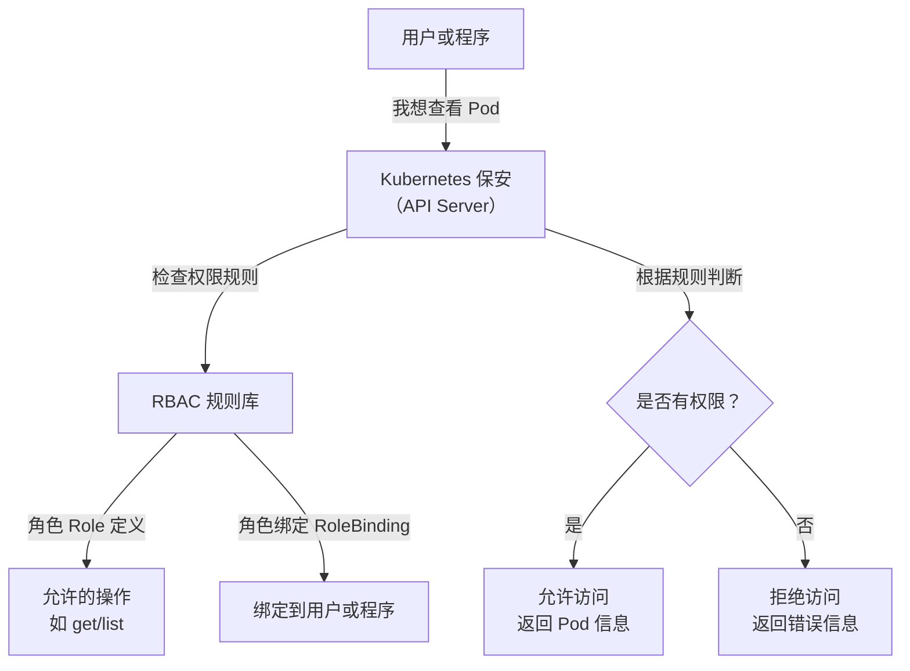
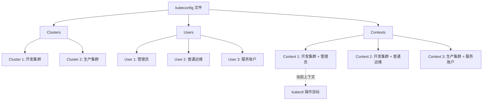

# Kubernetes RBAC权限管理

## 学习目标：
- **理解 RBAC 权限管理**：掌握 Kubernetes 中基于角色的访问控制（RBAC）的核心概念，了解角色（Role）和集群角色（ClusterRole）的定义与应用场景。
- **掌握角色绑定**：学会如何通过 RoleBinding 和 ClusterRoleBinding 将权限分配给用户、服务账户或组。
- **kubectl config**：了解如何使用 kubectl 配置文件管理多个集群和上下文，以及如何切换上下文。


## 第一部分：Kubernetes RBAC 权限管理理论

### 1. RBAC 是什么？用生活化的方式理解
RBAC（Role-Based Access Control，基于角色的访问控制）是 Kubernetes 用来管理“谁能做什么”的一个规则系统。想象一下，你在一个公司工作，公司有不同的部门和员工，每个员工根据自己的职位有不同的权限。比如：
- 前台只能查看访客登记表，不能进入财务室。
- 财务人员可以查看和修改账单，但不能决定公司战略。
- 老板则可以访问所有地方，做任何决定。

在 Kubernetes 中，RBAC 就像公司的门禁系统，它决定哪个用户（或程序）可以访问哪些资源（比如 Pod、Service），以及能做什么操作（比如查看、创建、删除）。通过 RBAC，我们可以确保每个人只做自己该做的事，避免混乱或安全问题。

### 2. RBAC 的核心组成部分
RBAC 就像一个“权限分配游戏”，有几个关键角色和道具：
- **Role（角色）**：定义一组权限，比如“可以查看 Pod，但不能删除 Pod”。Role 通常只在一个小范围（某个命名空间）内有效，类似于公司某个部门的权限规则。
- **ClusterRole（集群角色）**：和 Role 类似，但它的权限范围是整个集群，就像公司总部的全局权限规则。
- **RoleBinding（角色绑定）**：把 Role 分配给某个用户或程序，就像发一张部门门禁卡给某个员工。
- **ClusterRoleBinding（集群角色绑定）**：把 ClusterRole 分配给用户或程序，就像发一张全公司通用的门禁卡。
- **Subject（主体）**：就是“谁”，可以是用户、组，或者一个程序（服务账户）。
- **Resources（资源）和 Verbs（操作）**：资源是 Kubernetes 里的“东西”，比如 Pod、Deployment；操作是“做什么”，比如查看、创建、删除。
- **ServiceAccount（服务账户）**：一种特殊的主体，通常用于集群内部的程序或 Pod 访问 Kubernetes API。服务账户就像公司内部的“机器人员工”，它们需要权限来执行任务。

### 3. 为什么需要 RBAC？有什么好处？
想象一下，如果公司没有门禁系统，所有人都能随便进出财务室、服务器机房，会发生什么？可能会有人不小心删掉重要文件，或者恶意破坏系统。Kubernetes 集群就像一个大公司，里面有很多资源（Pod、Service 等），如果不限制权限，可能导致：
- 某个开发人员不小心删掉了生产环境的 Pod，造成服务中断。
- 外部攻击者获取了权限，破坏整个集群。

RBAC 的好处就是：
- **安全第一**：只有被授权的人才能访问特定资源，就像只有财务人员才能打开财务室的门。
- **分工明确**：不同团队有不同权限，比如开发团队只能查看自己的 Pod，运维团队可以管理整个集群，避免误操作。
- **便于审计**：如果出了问题，可以查到是谁做的，方便追责和改进。

### 4. RBAC 是怎么工作的？
RBAC 的工作原理就像一个严格的保安系统：
1. 首先，管理员定义好权限规则（Role 或 ClusterRole），比如“开发人员可以查看 Pod，但不能删除”。
2. 然后，通过绑定（RoleBinding 或 ClusterRoleBinding），把这些规则分配给具体的人或程序。
3. 当用户或程序想要操作 Kubernetes 资源时（比如查看 Pod），请求会先到 Kubernetes 的“保安”（API Server）。
4. “保安”会检查 RBAC 规则，确认是否有权限。如果有，就允许操作；如果没有，就拒绝。

用一个生活化的例子来说：你去公司拿文件，保安会先看你的工卡，确认你是哪个部门的，然后根据部门权限决定是否让你进某个办公室。Kubernetes 的 RBAC 就是这个“保安”。

### 5. 举个具体的例子
假设我们有一个 Kubernetes 集群，里面有一个开发团队，他们负责一个叫“dev”的命名空间。他们需要查看 Pod 和 Deployment 的状态，但不应该有权限删除这些资源。我们可以这样设置：
- 创建一个权限规则，名字叫“dev-viewer”，规则是：允许“查看”、“列出”和“观察”Pod 和 Deployment，但不允许“删除”。
- 通过绑定，把“dev-viewer”这个权限规则分配到开发团队的账户（比如一个服务账户）。
- 结果：开发团队的成员登录后，只能看到自己命名空间的 Pod 和 Deployment 信息，但如果他们尝试删除资源，系统会直接拒绝。

这样设置后，即使他们不小心输入了删除命令，也不会造成损失，集群的安全得到了保障。

### 6. ServiceAccount 与 Secret 的关系及 Kubernetes 1.24 后的变化
在 Kubernetes 中，ServiceAccount（服务账户）是一种特殊的身份，通常用于 Pod 或其他集群内部组件访问 Kubernetes API Server。服务账户就像公司内部的“机器人员工”，它们需要一个“身份凭证”来证明自己是谁，这个凭证通常以一种特殊的形式存储。

#### 6.1 传统模式（Kubernetes 1.24 之前）
在 Kubernetes 1.24 之前的版本中，当你创建一个 ServiceAccount 时，系统会自动为它生成一个对应的身份凭证，并以某种方式存储。这个凭证会自动与使用该 ServiceAccount 的 Pod 关联，Pod 里的程序可以通过这个凭证访问 Kubernetes API。

用生活化的例子来说：就像公司给每个新员工发一张工卡（ServiceAccount），工卡里内置了门禁芯片（身份凭证），员工拿着工卡就能进公司大门（访问 API Server）。

#### 6.2 Kubernetes 1.24 及之后的变化
从 Kubernetes 1.24 开始，出于安全性和灵活性的考虑，系统不再自动为 ServiceAccount 生成身份凭证。默认情况下，创建 ServiceAccount 后不会有对应的长期凭证，除非手动启用或配置。这意味着：
- 如果你需要为 ServiceAccount 生成一个身份凭证，必须手动进行操作，或者通过特定的方式请求一个临时的凭证。
- 新的默认机制推荐使用动态请求短期凭证的方式，而不是长期有效的凭证。这种方式就像公司不再发永久工卡，而是每次进入大楼时临时领取一个有效期一天的临时通行证，过期后自动失效，安全性更高。

#### 6.3 为什么要做这样的改变？
- **安全性提升**：长期有效的凭证如果泄露，可能导致权限被滥用。短期凭证过期后自动失效，降低了风险。
- **灵活性增强**：管理员可以更精细地控制凭证的生命周期和权限范围。
- **减少资源浪费**：不是所有 ServiceAccount 都需要凭证，自动生成会占用不必要的资源。

#### 6.4 对初学者的建议
对于初学者来说，理解 ServiceAccount 和其身份凭证的关系非常重要：
- ServiceAccount 是“谁”的身份，凭证是用来证明身份的“通行证”。
- 在 Kubernetes 1.24 之后，默认不自动生成长期凭证，需要手动配置或使用短期凭证。
- 如果你在学习或测试环境，可以暂时忽略这些变化，使用旧版 Kubernetes 或手动配置来简化操作。但在生产环境中，建议使用短期凭证以提升安全性。

### 7. 用 Mermaid 图表梳理 RBAC 流程
为了让大家更直观地理解 RBAC 的工作流程，我用一个简单的图表来展示。想象这是一个“权限检查地图”，从用户发起请求到最终结果的每一步都画了出来：



这个图表就像一个流程图，展示了用户请求如何一步步经过 RBAC 检查，最终决定是否允许操作。初学者可以把这个图当成一个“思维导图”，帮助自己记住 RBAC 的关键步骤。

### 8. 理论总结：RBAC 对初学者来说意味着什么？
- RBAC 是 Kubernetes 的“门禁系统”，它的目的是保护资源安全，避免误操作或恶意破坏。
- 它通过“角色（Role）-绑定（Binding）-用户（Subject）”的模式，把权限分配给不同的人或程序。
- ServiceAccount 是一种特殊的主体，用于集群内部程序的身份验证，其凭证存储方式在 Kubernetes 1.24 之后发生了变化，不再自动生成长期凭证，需要手动配置或使用短期凭证。
- 对于初学者来说，不需要一开始就记住所有细节，但要理解它的核心思想：权限控制是为了让每个人只做自己该做的事。


## 第二部分：Kubernetes RBAC 权限管理语法学习

### 1. RBAC 相关资源的基本语法结构
在 Kubernetes 中，RBAC 权限管理通过 YAML 文件定义资源对象来实现。以下是与 RBAC 相关的核心资源及其基本语法结构。对于初学者来说，可以把这些 YAML 文件看作是“权限规则的说明书”，告诉 Kubernetes 谁能做什么。

### 1.1 Role（角色）
Role 定义了一组权限规则，适用于特定命名空间内的资源。它的结构如下：

```yaml
apiVersion: rbac.authorization.k8s.io/v1
kind: Role
metadata:
  namespace: <命名空间名称>  # 权限作用的命名空间
  name: <角色名称>            # 角色的名称
rules:
- apiGroups: [""]             # 资源所属的 API 组，空字符串表示核心组
  resources: ["pods"]         # 允许操作的资源类型
  verbs: ["get", "list", "watch"]  # 允许的操作
```

**解释**：  
- `namespace`：指定这个 Role 生效的命名空间，比如 `default` 或 `dev`。
- `rules`：定义权限规则，包括可以操作哪些资源（`resources`）和具体操作（`verbs`）。
- `verbs`：常见的操作有 `get`（查看单个资源）、`list`（列出资源）、`watch`（持续观察资源变化）、`create`（创建）、`update`（更新）、`delete`（删除）等。

### 1.2 ClusterRole（集群角色）
ClusterRole 与 Role 类似，但它适用于整个集群，不局限于某个命名空间。语法如下：

```yaml
apiVersion: rbac.authorization.k8s.io/v1
kind: ClusterRole
metadata:
  name: <集群角色名称>  # 集群角色的名称
rules:
- apiGroups: ["apps"]    # 资源所属的 API 组
  resources: ["deployments"]  # 允许操作的资源类型
  verbs: ["get", "list", "watch", "create", "update"]  # 允许的操作
```

**解释**：  
- 没有 `namespace` 字段，因为 ClusterRole 是集群范围的。
- 其他字段含义与 Role 相同。

### 1.3 RoleBinding（角色绑定）
RoleBinding 将 Role 绑定到用户、组或服务账户，指定谁拥有该角色的权限。语法如下：

```yaml
apiVersion: rbac.authorization.k8s.io/v1
kind: RoleBinding
metadata:
  name: <绑定名称>            # 绑定的名称
  namespace: <命名空间名称>    # 绑定生效的命名空间
subjects:
- kind: User                   # 主体类型，可以是 User、Group 或 ServiceAccount
  name: <用户名称>            # 主体的名称
  apiGroup: rbac.authorization.k8s.io
roleRef:
  kind: Role                   # 绑定的角色类型（Role 或 ClusterRole）
  name: <角色名称>            # 绑定的角色名称
  apiGroup: rbac.authorization.k8s.io
```

**解释**：  
- `subjects`：指定权限的主体，可以是用户（User）、组（Group）或服务账户（ServiceAccount）。
- `roleRef`：指定绑定的角色，比如某个 Role 或 ClusterRole。

### 1.4 ClusterRoleBinding（集群角色绑定）
ClusterRoleBinding 将 ClusterRole 绑定到用户、组或服务账户，适用于整个集群。语法如下：

```yaml
apiVersion: rbac.authorization.k8s.io/v1
kind: ClusterRoleBinding
metadata:
  name: <绑定名称>  # 绑定的名称
subjects:
- kind: ServiceAccount  # 主体类型
  name: <服务账户名称>  # 主体名称
  namespace: <命名空间名称>  # 服务账户所在的命名空间
roleRef:
  kind: ClusterRole     # 绑定的角色类型
  name: <集群角色名称>  # 绑定的集群角色名称
  apiGroup: rbac.authorization.k8s.io
```

**解释**：  
- 与 RoleBinding 类似，但没有 `namespace` 限制，因为它是集群范围的绑定。


#### 1.5 ServiceAccount（服务账户）
ServiceAccount 是一种特殊的主体，通常用于集群内部的程序或 Pod 访问 Kubernetes API。语法如下：

```yaml
apiVersion: v1
kind: ServiceAccount
metadata:
  name: <服务账户名称>  # 服务账户的名称
  namespace: <命名空间名称>  # 服务账户所在的命名空间
```

**解释**：  
- `name`：服务账户的名称，用于标识这个身份。
- `namespace`：服务账户所属的命名空间，通常与使用它的 Pod 或其他资源在同一命名空间。

#### 1.6 为 ServiceAccount 创建 Secret（Kubernetes 1.24 及之后）
从 Kubernetes 1.24 开始，默认情况下创建 ServiceAccount 后不再自动生成对应的 Secret 对象。如果需要为 ServiceAccount 创建一个长期有效的 Token，可以手动创建一个 Secret 对象。以下是手动创建 Secret 的语法结构：

```yaml
apiVersion: v1
kind: Secret
metadata:
  name: <secret名称>  # Secret 的名称
  namespace: <命名空间名称>  # Secret 所在的命名空间
  annotations:
    kubernetes.io/service-account.name: <服务账户名称>  # 关联的服务账户名称
type: kubernetes.io/service-account-token
```

**解释**：  
- `name`：Secret 的名称，用于存储服务账户的 Token。
- `namespace`：Secret 所在的命名空间，应与服务账户一致。
- `annotations`：通过注解关联到具体的 ServiceAccount。
- `type`：指定 Secret 类型为 `kubernetes.io/service-account-token`，表示这是服务账户的 Token。

**注意**：在 Kubernetes 1.24 及以上版本中，推荐使用动态请求短期 Token 的方式，而不是创建长期有效的 Secret。手动创建 Secret 适用于特定场景（如测试或遗留系统支持）。


#### 2. RBAC 权限规则字段的常见取值范围
在 RBAC 的 `rules` 字段中，`apiGroups`、`resources` 和 `verbs` 是定义权限规则的核心部分。以下是它们的常见取值范围和说明，帮助初学者在实际配置中选择合适的参数。

##### 2.1 `apiGroups` 取值范围
`apiGroups` 表示资源所属的 API 组，用于区分不同类型的 Kubernetes 资源。API 组是 Kubernetes 为了组织和管理资源而设计的分类机制。

| **apiGroups 值**         | **说明**                              | **常见资源示例**                     |
|--------------------------|---------------------------------------|--------------------------------------|
| `""` (空字符串)          | 核心 API 组，包含 Kubernetes 最基础的资源 | `pods`, `nodes`, `services`, `configmaps`, `secrets` |
| `apps`                   | 应用程序相关资源组                   | `deployments`, `statefulsets`, `daemonsets` |
| `batch`                  | 批处理任务相关资源组                 | `jobs`, `cronjobs`                  |
| `networking.k8s.io`      | 网络相关资源组                       | `networkpolicies`, `ingresses`      |
| `storage.k8s.io`         | 存储相关资源组                       | `storageclasses`, `persistentvolumeclaims` |
| `rbac.authorization.k8s.io` | RBAC 权限管理相关资源组            | `roles`, `rolebindings`, `clusterroles`, `clusterrolebindings` |
| `policy`                 | 策略相关资源组                       | `poddisruptionbudgets`              |
| `metrics.k8s.io`         | 指标相关资源组                       | 通常与监控相关                      |
| `*` (星号)               | 表示所有 API 组（谨慎使用，权限范围极广） | 所有资源                            |

**说明**：  
- 核心 API 组用空字符串 `""` 表示，包含最常用的资源如 Pod 和 Service。
- 其他 API 组通常与特定功能模块相关，比如 `apps` 包含 Deployment 等资源。
- 使用 `*` 时要特别小心，因为它会匹配所有 API 组，可能会导致权限过大。

##### 2.2 `resources` 取值范围
`resources` 表示允许操作的具体资源类型，与 `apiGroups` 相关联。以下是常见 API 组下的资源类型：

| **apiGroups**            | **resources 值**                     | **说明**                          |
|--------------------------|--------------------------------------|-----------------------------------|
| `""` (核心组)            | `pods`                              | Pod 资源                         |
| `""`                     | `services`                          | Service 资源                     |
| `""`                     | `configmaps`                        | 配置映射资源                     |
| `""`                     | `secrets`                           | 密钥资源                         |
| `""`                     | `nodes`                             | 节点资源                         |
| `""`                     | `namespaces`                        | 命名空间资源                     |
| `apps`                   | `deployments`                       | 部署资源                         |
| `apps`                   | `statefulsets`                      | 有状态集资源                     |
| `apps`                   | `daemonsets`                        | 守护进程集资源                   |
| `batch`                  | `jobs`                              | 任务资源                         |
| `batch`                  | `cronjobs`                          | 定时任务资源                     |
| `networking.k8s.io`      | `ingresses`                         | Ingress 资源                     |
| `storage.k8s.io`         | `persistentvolumeclaims`            | 持久卷声明资源                   |
| `rbac.authorization.k8s.io` | `roles`, `clusterroles`            | 角色和集群角色资源               |
| `*` (星号)               | 表示该 API 组下的所有资源（谨慎使用） | 所有资源                         |

**说明**：  
- `resources` 必须与 `apiGroups` 匹配，比如 `deployments` 属于 `apps` 组，不能写在核心组 `""` 下。
- 资源名称通常是小写复数形式，比如 `pods` 而不是 `Pod`。
- 如果要列出多个资源，可以用数组形式，比如 `["pods", "services"]`。

##### 2.3 `verbs` 取值范围
`verbs` 表示允许对资源执行的操作类型。以下是常见的操作及其含义：

| **verbs 值**   | **说明**                          |
|----------------|-----------------------------------|
| `get`          | 获取单个资源的信息（如 `kubectl get pod pod-name`） |
| `list`         | 列出资源列表（如 `kubectl get pods`）       |
| `watch`        | 持续观察资源变化（如实时监控资源状态）      |
| `create`       | 创建资源（如 `kubectl create`）            |
| `update`       | 更新资源（如 `kubectl edit` 或 `kubectl update`） |
| `patch`        | 部分更新资源（如 `kubectl patch`）         |
| `delete`       | 删除资源（如 `kubectl delete`）            |
| `deletecollection` | 删除资源集合（批量删除）                |
| `exec`         | 在 Pod 中执行命令（如 `kubectl exec`）     |
| `logs`         | 查看 Pod 日志（如 `kubectl logs`）        |
| `*` (星号)     | 表示所有操作（谨慎使用，权限范围极广）      |

**说明**：  
- `verbs` 定义了权限的具体粒度，比如只允许 `get` 和 `list`，用户就只能查看资源，无法修改或删除。
- 某些操作（如 `exec` 和 `logs`）是针对特定资源的子操作，通常与 Pod 相关。
- 使用 `*` 会授予对资源的所有操作权限，需谨慎使用。


### 3. 企业案例：为开发人员配置权限
为了让初学者更容易理解 RBAC 的语法，我们通过一个具体案例来学习。假设有一个开发人员，他在 `shiqi` 命名空间下工作，需要对 `shiqi` 命名空间内的所有资源拥有完全权限，但无法访问其他命名空间的内容。我们一步步创建所需的 RBAC 资源。

#### 3.1 创建 Role
首先，定义一个 Role，允许对 `shiqi` 命名空间内所有资源执行所有操作：

```yaml
apiVersion: rbac.authorization.k8s.io/v1
kind: Role
metadata:
  namespace: shiqi
  name: shiqi-admin
rules:
- apiGroups: ["*"]  # 所有 API 组
  resources: ["*"]   # 所有资源类型
  verbs: ["*"]       # 所有操作
```

**解释**：  
- 这个 Role 名为 `shiqi-admin`，在 `shiqi` 命名空间生效。
- 规则使用通配符 `*`，允许对所有 API 组、所有资源类型执行所有操作，相当于在 `shiqi` 命名空间内拥有完全权限。
- 注意：此 Role 仅限于 `shiqi` 命名空间，对其他命名空间无效。

#### 3.2 创建 ServiceAccount
为了让开发人员使用这个权限，我们创建一个服务账户（ServiceAccount），代表这个开发人员的身份：

```yaml
apiVersion: v1
kind: ServiceAccount
metadata:
  name: shiqi-user
  namespace: shiqi
```

**解释**：  
- 服务账户 `shiqi-user` 在 `shiqi` 命名空间下创建，代表开发人员的身份。

#### 3.3 创建 Secret（适用于 Kubernetes 1.24 及以上版本）
从 Kubernetes 1.24 开始，默认情况下创建 ServiceAccount 后不再自动生成对应的 Secret 对象。如果需要为 ServiceAccount 创建一个长期有效的 Token，可以手动创建一个 Secret 对象：

```yaml
apiVersion: v1
kind: Secret
metadata:
  name: shiqi-user-token
  namespace: shiqi
  annotations:
    kubernetes.io/service-account.name: shiqi-user  # 关联的服务账户名称
type: kubernetes.io/service-account-token
```

**解释**：  
- `name`：Secret 的名称为 `shiqi-user-token`，用于存储服务账户的 Token。
- `namespace`：Secret 所在的命名空间为 `shiqi`，与服务账户一致。
- `annotations`：通过注解关联到 `shiqi-user` 服务账户。
- `type`：指定 Secret 类型为 `kubernetes.io/service-account-token`，表示这是服务账户的 Token。

**注意**：在 Kubernetes 1.24 及以上版本中，推荐使用动态请求短期 Token 的方式，而不是创建长期有效的 Secret。手动创建 Secret 适用于特定场景（如测试或遗留系统支持）。

#### 3.4 创建 RoleBinding
最后，通过 RoleBinding 将 `shiqi-admin` 角色绑定到 `shiqi-user` 服务账户：

```yaml
apiVersion: rbac.authorization.k8s.io/v1
kind: RoleBinding
metadata:
  name: shiqi-admin-binding
  namespace: shiqi
subjects:
- kind: ServiceAccount
  name: shiqi-user
  namespace: shiqi
roleRef:
  kind: Role
  name: shiqi-admin
  apiGroup: rbac.authorization.k8s.io
```

**解释**：  
- 这个 RoleBinding 将 `shiqi-admin` 角色绑定到 `shiqi-user` 服务账户。
- 绑定后，使用 `shiqi-user` 服务账户登录的用户或程序将在 `shiqi` 命名空间内拥有完全权限，但无法访问其他命名空间。

#### 4. 如何应用这些配置？
在实际操作中，我们将这些 YAML 文件保存下来，然后使用 `kubectl` 命令应用到集群中：

```bash
# 应用 Role
kubectl apply -f role-shiqi-admin.yaml

# 应用 ServiceAccount
kubectl apply -f service-account-shiqi-user.yaml

# 应用 Secret（如果需要手动创建 Token）
kubectl apply -f secret-shiqi-user-token.yaml

# 应用 RoleBinding
kubectl apply -f rolebinding-shiqi-admin.yaml
```

**解释**：  
- `kubectl apply` 命令会将 YAML 文件中的配置创建或更新到 Kubernetes 集群中。
- 应用后，权限规则立即生效。

#### 5. 测试权限是否生效
为了验证权限是否正确配置，可以使用 `kubectl` 命令模拟 `shiqi-user` 服务账户的访问：

```bash
# 使用 shiqi-user 服务账户查看 Pod 列表（在 shiqi 命名空间内）
kubectl get pods -n shiqi --as=system:serviceaccount:shiqi:shiqi-user
```

**预期结果**：可以看到 `shiqi` 命名空间内的 Pod 列表，说明权限生效。

```bash
# 尝试查看其他命名空间的 Pod（应该被拒绝）
kubectl get pods -n default --as=system:serviceaccount:shiqi:shiqi-user
```

**预期结果**：会返回错误信息，提示权限不足，因为 `shiqi-user` 服务账户的权限仅限于 `shiqi` 命名空间。

```bash
# 测试在 shiqi 命名空间内创建资源（应该成功）
kubectl create deployment test-app --image=swr.cn-north-4.myhuaweicloud.com/ddn-k8s/docker.io/nginx:alpine -n shiqi --as=system:serviceaccount:shiqi:shiqi-user
```

**预期结果**：可以成功创建 Deployment，因为 `shiqi-user` 在 `shiqi` 命名空间内拥有完全权限。

```bash
# 测试在 shiqi 命名空间内删除资源（应该成功）
kubectl delete deployment test-app -n shiqi --as=system:serviceaccount:shiqi:shiqi-user
```

**预期结果**：可以成功删除 Deployment，因为 `shiqi-user` 在 `shiqi` 命名空间内拥有完全权限。


### 企业案例：创建普通运维人员账号并限制删除权限
为了便于刚入职且不熟悉业务的运维人员安全地操作 Kubernetes 集群，我们需要创建一个普通运维人员账号，授权其在所有命名空间中拥有查看和修改权限，但禁止任何删除操作（包括 `delete` 和 `deletecollection`）。以下是具体步骤和配置。

#### 1. 创建 ServiceAccount
首先，创建一个服务账户（ServiceAccount），代表这个普通运维人员的身份。由于权限将应用于所有命名空间，我们可以在 `kube-system` 命名空间中创建服务账户（或者其他您认为合适的命名空间）：

```yaml
apiVersion: v1
kind: ServiceAccount
metadata:
  name: ops-shiqi-user
  namespace: kube-system
```

**解释**：  
- 服务账户 `ops-shiqi-user` 在 `kube-system` 命名空间下创建，代表普通运维人员的身份。
- 选择 `kube-system` 是因为这是一个系统命名空间，适合存放全局性账户，但您也可以根据需要选择其他命名空间。

#### 2. 创建 ClusterRole
由于权限需要应用于所有命名空间，我们使用 `ClusterRole`（而不是 `Role`）来定义权限规则。以下是 `ClusterRole` 的配置，允许所有操作，但排除删除相关操作：

```yaml
apiVersion: rbac.authorization.k8s.io/v1
kind: ClusterRole
metadata:
  name: ops-read-write-no-delete
rules:
- apiGroups: ["*"]  # 所有 API 组
  resources: ["*"]   # 所有资源类型
  verbs: ["get", "list", "watch", "create", "update", "patch"]  # 允许查看和修改，但不包括删除
```

**解释**：  
- 这个 `ClusterRole` 名为 `ops-read-write-no-delete`，适用于整个集群。
- `verbs` 字段明确指定了允许的操作，包括 `get`、`list`、`watch`（查看类操作）以及 `create`、`update`、`patch`（创建和修改类操作）。
- 故意不包含 `delete` 和 `deletecollection`，以禁止删除操作。
- `apiGroups` 和 `resources` 使用通配符 `*`，覆盖所有资源类型。

#### 3. 创建 ClusterRoleBinding
通过 `ClusterRoleBinding` 将 `ops-read-write-no-delete` 角色绑定到 `ops-shiqi-user` 服务账户，使其权限在所有命名空间生效：

```yaml
apiVersion: rbac.authorization.k8s.io/v1
kind: ClusterRoleBinding
metadata:
  name: ops-read-write-no-delete-binding
subjects:
- kind: ServiceAccount
  name: ops-shiqi-user
  namespace: kube-system
roleRef:
  kind: ClusterRole
  name: ops-read-write-no-delete
  apiGroup: rbac.authorization.k8s.io
```

**解释**：  
- 这个 `ClusterRoleBinding` 将 `ops-read-write-no-delete` 角色绑定到 `ops-shiqi-user` 服务账户。
- 由于使用了 `ClusterRoleBinding`，权限将应用于所有命名空间。
- `subjects` 指定了服务账户的名称和命名空间。

#### 4. 创建 Secret（适用于 Kubernetes 1.24 及以上版本）
如果您的集群版本是 Kubernetes 1.24 或以上，默认情况下创建 ServiceAccount 后不会自动生成对应的 Secret 对象。如果需要为 ServiceAccount 创建一个长期有效的 Token，可以手动创建一个 Secret 对象：

```yaml
apiVersion: v1
kind: Secret
metadata:
  name: ops-shiqi-user-token
  namespace: kube-system
  annotations:
    kubernetes.io/service-account.name: ops-shiqi-user  # 关联的服务账户名称
type: kubernetes.io/service-account-token
```

**解释**：  
- `name`：Secret 的名称为 `ops-shiqi-user-token`，用于存储服务账户的 Token。
- `namespace`：Secret 所在的命名空间为 `kube-system`，与服务账户一致。
- `annotations`：通过注解关联到 `ops-shiqi-user` 服务账户。
- `type`：指定 Secret 类型为 `kubernetes.io/service-account-token`，表示这是服务账户的 Token。
- **注意**：在 Kubernetes 1.24 及以上版本中，推荐使用动态请求短期 Token 的方式，而不是创建长期有效的 Secret。手动创建 Secret 适用于特定场景（如测试或遗留系统支持）。

#### 5. 应用配置
将上述 YAML 文件保存下来，然后使用 `kubectl` 命令应用到集群中：

```bash
# 应用 ServiceAccount
kubectl apply -f service-account-ops-shiqi-user.yaml

# 应用 ClusterRole
kubectl apply -f clusterrole-ops-read-write-no-delete.yaml

# 应用 ClusterRoleBinding
kubectl apply -f clusterrolebinding-ops-read-write-no-delete.yaml

# 应用 Secret（如果需要手动创建 Token）
kubectl apply -f secret-ops-shiqi-user-token.yaml
```

**解释**：  
- `kubectl apply` 命令会将 YAML 文件中的配置创建或更新到 Kubernetes 集群中。
- 应用后，权限规则立即生效。

#### 6. 测试权限是否生效
为了验证权限是否正确配置，可以使用 `kubectl` 命令模拟 `ops-shiqi-user` 服务账户的访问：

```bash
# 使用 ops-shiqi-user 服务账户查看 Pod 列表（在任意命名空间内）
kubectl get pods -n shiqi --as=system:serviceaccount:kube-system:ops-shiqi-user
```

**预期结果**：可以看到 `shiqi` 命名空间内的 Pod 列表，说明查看权限生效。

```bash
# 使用 ops-shiqi-user 服务账户尝试创建资源（应该成功）
kubectl create deployment test-app --image=swr.cn-north-4.myhuaweicloud.com/ddn-k8s/docker.io/nginx:alpine -n shiqi --as=system:serviceaccount:kube-system:ops-shiqi-user
```

**预期结果**：可以成功创建 Deployment，因为 `ops-shiqi-user` 拥有 `create` 权限。

```bash
# 使用 ops-shiqi-user 服务账户尝试删除资源（应该被拒绝）
kubectl delete deployment test-app -n shiqi --as=system:serviceaccount:kube-system:ops-shiqi-user
```

**预期结果**：会返回错误信息，提示权限不足，因为 `ops-shiqi-user` 服务账户没有 `delete` 权限。

#### 7. 查看相关资源
要查看创建的资源和权限配置，可以使用以下命令：

```bash
# 查看 ServiceAccount
kubectl get serviceaccount -n kube-system

# 查看 ClusterRole
kubectl get clusterrole

# 查看 ClusterRoleBinding
kubectl get clusterrolebinding

# 查看 Secret（如果手动创建）
kubectl get secret -n kube-system
```

**解释**：  
- 这些命令用于确认资源是否正确创建。
- 使用 `kubectl describe` 可以查看更详细的信息，例如 `kubectl describe clusterrole ops-read-write-no-delete`。

#### 8. 还原本地用户权限
在测试完成后，如果您需要恢复本地用户的最大权限（管理员权限），只需停止模拟服务账户：

```bash
# 不再使用 --as 参数，恢复本地用户权限
kubectl get pods -n shiqi
```

**预期结果**：如果您的本地用户是集群管理员身份，您将可以执行所有操作，包括删除资源。

您说得对，我之前的描述不准确。根据您提供的 Kuboard 界面截图，我来重新说明正确的查看路径：

### 在 Kuboard 中查看 RBAC 配置的正确路径

#### 1. 查看 ServiceAccount（服务账户）

**正确路径**：访问控制 → 第二阶段授权 → ServiceAccount

**操作步骤**：
1. 在左侧菜单中点击 "访问控制"
2. 展开后点击 "第二阶段授权"
3. 在子菜单中选择 "ServiceAccount"
4. 在这里可以看到所有的服务账户，包括我们创建的 `ops-shiqi-user`

#### 2. 查看 ClusterRole（集群角色）

**正确路径**：访问控制 → 第二阶段授权 → ClusterRole

**操作步骤**：
1. 在左侧菜单中点击 "访问控制"
2. 展开后点击 "第二阶段授权"
3. 在子菜单中选择 "ClusterRole"
4. 找到我们创建的 `ops-read-write-no-delete` 集群角色
5. 点击可查看详细的权限规则

#### 3. 查看 Role（命名空间角色）

**正确路径**：访问控制 → 第二阶段授权 → Role

**操作步骤**：
1. 同样在 "访问控制" → "第二阶段授权" 下
2. 选择 "Role" 查看命名空间级别的角色
3. 如果有创建命名空间级别的角色，会在这里显示

#### 4. 查看角色绑定关系

**查看绑定关系**：
- 在 ClusterRole 或 ServiceAccount 的详情页面中
- 通常会显示相关的绑定关系
- 可以看到 `ops-read-write-no-delete-binding` 的绑定信息

#### 5. 查看ServiceAccount绑定的ClusterRole


**路径**：访问控制 → 第二阶段授权 → ServiceAccount

这里可以查看：
- 与 ServiceAccount 的关联关系

#### 6. 其他相关功能

**可访问时段**：
- 路径：访问控制 → 可访问时段
- 可以设置用户的访问时间限制

**操作审计**：
- 路径：访问控制 → 操作审计
- 可以查看用户的操作记录和权限使用情况

### 实际操作建议

1. **首先查看 ServiceAccount**：
   - 进入 "访问控制" → "第二阶段授权" → "ServiceAccount"
   - 找到 `ops-shiqi-user` 并查看其详细信息

2. **然后查看 ClusterRole**：
   - 在同级菜单选择 "ClusterRole"
   - 找到 `ops-read-write-no-delete` 查看权限配置

3. **验证绑定关系**：
   - 在相应的详情页面中确认绑定关系是否正确


## 第三部分：理论基础 - 理解 kubeconfig 及其重要性
在 Kubernetes 运维中，管理多个集群或多个身份是常见需求。`kubeconfig` 文件是实现这一目标的关键配置文件，它允许用户快速切换操作环境。本教案将详细讲解 `kubeconfig` 文件的基本概念、配置方法以及管理多个集群和账户的优势，帮助学员掌握高效的集群管理技能。

### 1.1 什么是 kubeconfig 文件？
`kubeconfig` 文件是 Kubernetes 客户端工具（如 `kubectl`）使用的配置文件，用于存储以下信息：
- **集群信息（Clusters）**：定义 Kubernetes 集群的连接参数，如 API 服务器地址、证书等。
- **用户凭据（Users）**：定义访问集群的身份认证信息，如证书、Token 等。
- **上下文（Contexts）**：将特定的用户与特定的集群关联，形成一个操作环境。

默认存储路径：
- **Windows**：`C:\Users\<用户名>\.kube\config`
- **Linux/macOS**：`~/.kube/config`

**教学要点**：  
- `kubeconfig` 文件采用 YAML 格式，结构清晰，易于管理和修改。
- 它是 `kubectl` 命令行工具与 Kubernetes 集群交互的桥梁，决定了命令的目标和身份。

### 1.2 为什么需要 kubeconfig 文件管理多个集群或账户？
在实际运维场景中，单一集群或单一身份往往无法满足需求，常见情况包括：
1. **多环境管理**：企业可能维护多个 Kubernetes 集群，如开发、测试和生产环境，需要在不同集群间切换。
2. **多身份操作**：在同一集群中，可能需要以不同权限身份（如管理员、普通运维）操作，以测试 RBAC 配置或限制权限。
3. **团队协作**：多个团队成员共享集群访问权限，但使用不同凭据以确保权限隔离。
4. **自动化需求**：CI/CD 管道或脚本需要以特定服务账户身份访问集群。

**教学要点**：  
- 手动切换集群或身份（例如每次修改配置文件或重新认证）效率低下且易出错。
- `kubeconfig` 文件通过集中管理连接信息和上下文切换机制，简化了多集群多账户的操作。

### 1.3 管理多个集群和账户的优势
通过 `kubeconfig` 文件实现多集群多账户管理，具有以下显著优势：
1. **快速切换**：通过上下文切换命令（`kubectl config use-context`），无需重复认证即可改变操作目标。
2. **集中管理**：所有集群和账户信息存储在一个文件中，便于备份、共享和版本控制。
3. **权限隔离**：为不同上下文分配不同用户凭据，避免误操作或权限泄露。
4. **支持自动化**：脚本和工具可通过指定上下文运行，简化自动化流程。
5. **跨平台一致性**：`kubeconfig` 文件格式在 Windows、Linux 和 macOS 上通用，方便跨平台使用。

**教学要点**：  
- 想象 `kubeconfig` 文件是一个“控制面板”，管理多个集群就像切换多个设备，快速定位目标并执行操作。
- 在大规模分布式系统中，统一管理多个集群的连接信息是提升运维效率和安全性的关键。

### 1.4 可视化辅助：kubeconfig 结构与多集群管理
以下 Mermaid 图表帮助学员直观理解 `kubeconfig` 文件的结构以及如何通过上下文切换管理多个集群和账户。



**教学要点**：  
- **Clusters**：存储多个集群的连接信息。
- **Users**：存储多个用户的凭据信息。
- **Contexts**：将用户和集群关联，形成可切换的操作环境。
- 当前上下文决定了 `kubectl` 命令的目标，切换上下文即可改变操作集群或身份。


## 第四部分：实践操作 - 配置 kubeconfig 文件管理多集群多账户

### 2.1 kubeconfig 文件位置与基本操作
- **Windows**：`C:\Users\<用户名>\.kube\config`
- **Linux/macOS**：`~/.kube/config`

如果文件不存在，可以手动创建或通过 `kubectl` 命令生成初始配置。

**教学步骤**：  
1. 确认文件位置，确保有权限访问和修改。
2. 备份原始配置文件，避免误操作导致配置丢失：
   ```bash
   # Linux/macOS
   cp ~/.kube/config ~/.kube/config.bak
   # Windows
   copy C:\Users\<用户名>\.kube\config C:\Users\<用户名>\.kube\config.bak
   ```
3. 查看当前配置文件内容，了解结构：
   ```bash
   kubectl config view
   # 或直接查看文件内容
   cat ~/.kube/config  # Linux/macOS
   type C:\Users\<用户名>\.kube\config  # Windows
   ```

**预期结果**：输出 YAML 格式内容，包含 `clusters`、`users` 和 `contexts` 部分。

### 2.2 配置多个账户在一个 kubeconfig 文件中
以下以已有的 `ServiceAccount`（`shiqi-user` 和 `ops-shiqi-user`）为例，讲解如何将多个账户添加到 `kubeconfig` 文件。

#### 步骤 1：获取 ServiceAccount 的 Token
`ServiceAccount` 的凭据通常存储在关联的 `Secret` 中，需提取 Token。假设账户在 `shiqi` 命名空间：
```bash
# 获取 shiqi-user 的 Token
SHIQI_TOKEN=$(kubectl get secret shiqi-user-token -n shiqi  -o jsonpath='{.data.token}' | base64 --decode)


# 获取 ops-shiqi-user 的 Token
OPS_TOKEN=$(kubectl get secret ops-shiqi-user-token -n kube-system -o jsonpath='{.data.token}' | base64 --decode)

```

**教学要点**：  
- 命令从 `ServiceAccount` 关联的 `Secret` 中提取 Token，并通过 `base64 --decode` 解码为明文。
- 如果 `ServiceAccount` 未自动生成 `Secret`，需手动创建。

#### 步骤 2：添加用户凭据到 kubeconfig 文件
将提取的 Token 作为用户凭据添加到配置文件：
```bash
# 添加 shiqi-user
kubectl config set-credentials shiqi-user --token=$SHIQI_TOKEN

# 添加 ops-shiqi-user
kubectl config set-credentials ops-shiqi-user --token=$OPS_TOKEN
```

**教学要点**：  
- `kubectl config set-credentials` 将用户凭据添加到 `kubeconfig` 文件的 `users` 部分。
- 使用环境变量存储 Token，避免直接暴露敏感信息。

#### 步骤 3：查看当前集群名称
确认当前配置的集群名称，以便后续创建上下文：
```bash
kubectl config view -o jsonpath='{.clusters[].name}'
```

**预期结果**：输出集群名称，如 `kubernetes` 或自定义名称。

#### 步骤 4：创建上下文关联用户和集群
为每个用户创建上下文，关联到当前集群：
```bash
# 为 shiqi-user 创建上下文
kubectl config set-context shiqi-context --cluster=<cluster-name> --user=shiqi-user --namespace=shiqi
# 答案
kubectl config set-context shiqi-context --cluster=kubernetes --user=shiqi-user --namespace=shiqi
# 为 ops-shiqi-user 创建上下文
kubectl config set-context ops-context --cluster=<cluster-name> --user=ops-shiqi-user --namespace=default
# 答案
kubectl config set-context ops-context --cluster=kubernetes --user=ops-shiqi-user --namespace=default
```

**教学要点**：  
- 替换 `<cluster-name>` 为实际集群名称 `kubernetes`。
- `--namespace=default` 指定默认操作命名空间，可根据需求调整。
- 上下文名称应清晰反映其用途（如用户和集群的组合）。

#### 步骤 5：验证配置
查看更新后的配置文件，确认账户和上下文是否正确添加：
```bash
kubectl config view
```

**预期结果**：  
- `users` 部分包含 `shiqi-user` 和 `ops-shiqi-user`。
- `contexts` 部分包含 `shiqi-context` 和 `ops-context`。

### 2.3 配置多个集群 (暂时没有那个条件，阿里云的时候弄吧)
如果需要管理多个集群，可以添加额外集群信息。假设有一个生产环境集群，步骤如下：

#### 步骤 1：添加新集群配置
```bash
kubectl config set-cluster prod-cluster --server=https://<prod-cluster-api-server>:6443 --certificate-authority=/path/to/prod-ca.crt
```

**教学要点**：  
- `--server` 指定生产集群的 API 服务器地址。
- `--certificate-authority` 指定 CA 证书路径，用于验证服务器身份。
- 可根据认证方式调整参数（如使用 `--insecure-skip-tls-verify` 跳过验证，仅限测试环境）。

#### 步骤 2：为新集群创建上下文
为现有用户创建与生产集群关联的上下文：
```bash
# 为 shiqi-user 创建生产集群上下文
kubectl config set-context shiqi-prod-context --cluster=prod-cluster --user=shiqi-user --namespace=default

# 为 ops-shiqi-user 创建生产集群上下文
kubectl config set-context ops-prod-context --cluster=prod-cluster --user=ops-shiqi-user --namespace=default
```

**教学要点**：  
- 上下文名称应清晰反映关联的集群和用户。
- 可为不同用户设置不同的默认命名空间。

#### 步骤 3：验证配置
查看配置文件，确认新集群和上下文是否正确添加：
```bash
kubectl config view
```

**预期结果**：  
- `clusters` 部分包含多个集群（如 `kubernetes` 和 `prod-cluster`）。
- `contexts` 部分包含所有上下文组合。


### 2.4 上下文切换命令教学
通过 `kubectl config` 命令，学员可以快速切换上下文，改变操作的集群或身份。

#### 1 查看当前上下文
```bash
kubectl config current-context
```

**预期结果**：输出当前使用的上下文名称，如 `shiqi-context`。

#### 2 列出所有上下文
```bash
kubectl config get-contexts
```

**预期结果**：列出所有定义的上下文，当前上下文标有 `*` 符号。

**示例输出**：
```
CURRENT   NAME                   CLUSTER         AUTHINFO        NAMESPACE
*         shiqi-context          kubernetes      shiqi-user      shiqi
          ops-context            kubernetes      ops-shiqi-user        default
          shiqi-prod-context     prod-cluster    shiqi-user      default
          ops-prod-context       prod-cluster    ops-shiqi-user        default
```

#### 3 切换上下文
切换到另一个上下文，例如切换到 `ops-context`：
```bash
kubectl config use-context ops-context
```

**预期结果**：输出 `Switched to context "ops-context".`，表示已切换到 `ops-shiqi-user` 身份操作当前集群。

#### 4 测试上下文切换效果
切换上下文后，执行命令验证身份和权限：
```bash
# 查看当前身份下的资源
kubectl get pods -n shiqi

# 尝试操作，确认权限是否符合预期
kubectl create deployment test-app --image=swr.cn-north-4.myhuaweicloud.com/ddn-k8s/docker.io/nginx:alpine -n shiqi
```

**教学要点**：  
- 切换到不同上下文后，操作权限受限于该上下文关联用户的 RBAC 规则。
- 如果切换到生产集群上下文（如 `shiqi-context`），操作目标变为生产集群。

#### 5. 测试完了，就切换为管理员权限上下文
切换上下文后，执行命令验证身份和权限：
```bash
kubectl config use-context kubernetes-admin@kubernetes
# 查看当前身份下的资源
kubectl get pods -n shiqi
```

#### 5 删除上下文（可选）
如果某个上下文不再需要，可以删除：
```bash
kubectl config delete-context <context-name>
# 答案
kubectl config delete-context shiqi-context
kubectl config delete-context ops-context
```

**教学要点**：  
- 删除上下文不会影响集群或用户配置，仅移除上下文关联。
- 建议定期清理无用上下文，保持配置文件简洁。


### 总结与扩展思考
#### 1 总结
本教案通过理论与实践结合，全面讲解了 `kubeconfig` 文件在 Kubernetes 集群管理中的作用：
- **理论基础**：理解 `kubeconfig` 文件的结构、作用及管理多集群多账户的优势。
- **实践操作**：学习如何配置多个账户（如 `shiqi-user` 和 `ops-shiqi-user`）和多个集群。
- **上下文切换**：掌握 `kubectl config` 命令，快速切换操作环境。
- **可视化辅助**：通过 Mermaid 图表直观展示 `kubeconfig` 的结构和切换逻辑。

#### 2 扩展思考
- **安全管理**：`kubeconfig` 文件包含敏感信息（如 Token），如何确保其安全性？（如权限控制、加密存储）
- **自动化集成**：如何在 CI/CD 管道中利用 `kubeconfig` 文件实现自动化部署？
- **高级认证**：除 Token 外，如何配置基于 OIDC 或证书的认证方式管理人类用户？
