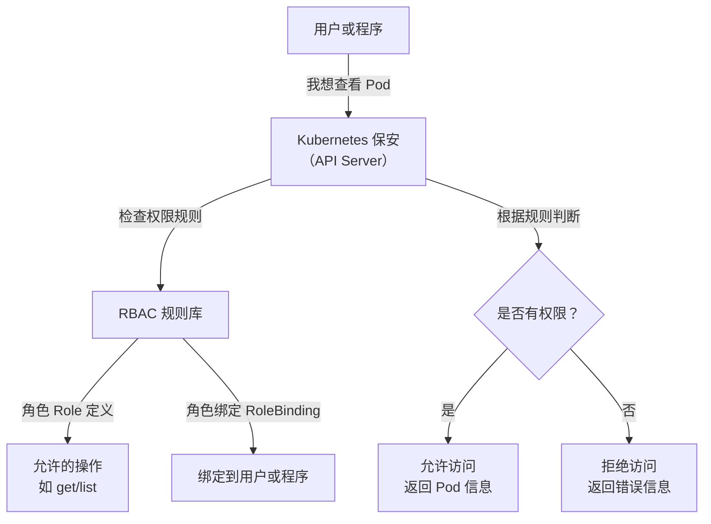

# Kubernetes 权限管理与综合复习

## 学习目标：
- **理解 RBAC 权限管理**：掌握 Kubernetes 中基于角色的访问控制（RBAC）的核心概念，了解角色（Role）和集群角色（ClusterRole）的定义与应用场景。
- **掌握角色绑定**：学会如何通过 RoleBinding 和 ClusterRoleBinding 将权限分配给用户、服务账户或组。
- **熟悉故障排查技巧**：通过查看 Pod 日志和事件（Events），快速定位和解决问题，合理利用 Kuboard 查看日志、事件和指标。
- **复习核心概念**：回顾 Pod、ConfigMap、Secret、Deployment、StatefulSet、DaemonSet、Service、Ingress-Nginx 以及调度策略等 Kubernetes 核心组件，结合面试题加深理解。
- **培养问题定位能力**：通过互动讨论，学习如何利用日志和事件快速定位 Kubernetes 集群中的问题。


## 第一部分：RBAC 权限管理理论

### 1. RBAC 是什么？用生活化的方式理解
RBAC（Role-Based Access Control，基于角色的访问控制）是 Kubernetes 用来管理“谁能做什么”的一个规则系统。想象一下，你在一个公司工作，公司有不同的部门和员工，每个员工根据自己的职位有不同的权限。比如：
- 前台只能查看访客登记表，不能进入财务室。
- 财务人员可以查看和修改账单，但不能决定公司战略。
- 老板则可以访问所有地方，做任何决定。

在 Kubernetes 中，RBAC 就像公司的门禁系统，它决定哪个用户（或程序）可以访问哪些资源（比如 Pod、Service），以及能做什么操作（比如查看、创建、删除）。通过 RBAC，我们可以确保每个人只做自己该做的事，避免混乱或安全问题。

### 2. RBAC 的核心组成部分
RBAC 就像一个“权限分配游戏”，有几个关键角色和道具：
- **Role（角色）**：定义一组权限，比如“可以查看 Pod，但不能删除 Pod”。Role 通常只在一个小范围（某个命名空间）内有效，类似于公司某个部门的权限规则。
- **ClusterRole（集群角色）**：和 Role 类似，但它的权限范围是整个集群，就像公司总部的全局权限规则。
- **RoleBinding（角色绑定）**：把 Role 分配给某个用户或程序，就像发一张部门门禁卡给某个员工。
- **ClusterRoleBinding（集群角色绑定）**：把 ClusterRole 分配给用户或程序，就像发一张全公司通用的门禁卡。
- **Subject（主体）**：就是“谁”，可以是用户、组，或者一个程序（服务账户）。
- **Resources（资源）和 Verbs（操作）**：资源是 Kubernetes 里的“东西”，比如 Pod、Deployment；操作是“做什么”，比如 get（查看）、create（创建）、delete（删除）。

### 3. 为什么需要 RBAC？有什么好处？
想象一下，如果公司没有门禁系统，所有人都能随便进出财务室、服务器机房，会发生什么？可能会有人不小心删掉重要文件，或者恶意破坏系统。Kubernetes 集群就像一个大公司，里面有很多资源（Pod、Service 等），如果不限制权限，可能导致：
- 某个开发人员不小心删掉了生产环境的 Pod，造成服务中断。
- 外部攻击者获取了权限，破坏整个集群。

RBAC 的好处就是：
- **安全第一**：只有被授权的人才能访问特定资源，就像只有财务人员才能打开财务室的门。
- **分工明确**：不同团队有不同权限，比如开发团队只能查看自己的 Pod，运维团队可以管理整个集群，避免误操作。
- **便于审计**：如果出了问题，可以查到是谁做的，方便追责和改进。

### 4. RBAC 是怎么工作的？
RBAC 的工作原理就像一个严格的保安系统：
1. 首先，管理员定义好权限规则（Role 或 ClusterRole），比如“开发人员可以查看 Pod，但不能删除”。
2. 然后，通过绑定（RoleBinding 或 ClusterRoleBinding），把这些规则分配给具体的人或程序。
3. 当用户或程序想要操作 Kubernetes 资源时（比如查看 Pod），请求会先到 Kubernetes 的“保安”（API Server）。
4. “保安”会检查 RBAC 规则，确认是否有权限。如果有，就允许操作；如果没有，就拒绝。

用一个生活化的例子来说：你去公司拿文件，保安会先看你的工卡，确认你是哪个部门的，然后根据部门权限决定是否让你进某个办公室。Kubernetes 的 RBAC 就是这个“保安”。

### 5. 举个具体的例子
假设我们有一个 Kubernetes 集群，里面有一个开发团队，他们负责一个叫“dev”的命名空间。他们需要查看 Pod 和 Deployment 的状态，但不应该有权限删除这些资源。我们可以这样设置：
- 创建一个 Role，名字叫“dev-viewer”，规则是：允许“查看（get）”、“列出（list）”和“观察（watch）”Pod 和 Deployment，但不允许“删除（delete）”。
- 创建一个 RoleBinding，把“dev-viewer”这个 Role 绑定到开发团队的账户（比如一个服务账户）。
- 结果：开发团队的成员登录后，只能看到自己命名空间的 Pod 和 Deployment 信息，但如果他们尝试删除资源，系统会直接拒绝。

这样设置后，即使他们不小心输入了删除命令，也不会造成损失，集群的安全得到了保障。

### 6. 用 Mermaid 图表梳理 RBAC 流程
为了让大家更直观地理解 RBAC 的工作流程，我用一个简单的图表来展示。想象这是一个“权限检查地图”，从用户发起请求到最终结果的每一步都画了出来：



这个图表就像一个流程图，展示了用户请求如何一步步经过 RBAC 检查，最终决定是否允许操作。初学者可以把这个图当成一个“思维导图”，帮助自己记住 RBAC 的关键步骤。

### 7. 理论总结：RBAC 对初学者来说意味着什么？
- RBAC 是 Kubernetes 的“门禁系统”，它的目的是保护资源安全，避免误操作或恶意破坏。
- 它通过“角色（Role）-绑定（Binding）-用户（Subject）”的模式，把权限分配给不同的人或程序。
- 对于初学者来说，不需要一开始就记住所有细节，但要理解它的核心思想：权限控制是为了让每个人只做自己该做的事。


## RBAC 权限规则字段的常见取值范围

在 RBAC 的 `rules` 字段中，`apiGroups`、`resources` 和 `verbs` 是定义权限规则的核心部分。以下是它们的常见取值范围和说明：

### 1. `apiGroups` 取值范围
`apiGroups` 表示资源所属的 API 组，用于区分不同类型的 Kubernetes 资源。API 组是 Kubernetes 为了组织和管理资源而设计的分类机制。

| **apiGroups 值**         | **说明**                              | **常见资源示例**                     |
|--------------------------|---------------------------------------|--------------------------------------|
| `""` (空字符串)          | 核心 API 组，包含 Kubernetes 最基础的资源 | `pods`, `nodes`, `services`, `configmaps`, `secrets` |
| `apps`                   | 应用程序相关资源组                   | `deployments`, `statefulsets`, `daemonsets` |
| `batch`                  | 批处理任务相关资源组                 | `jobs`, `cronjobs`                  |
| `networking.k8s.io`      | 网络相关资源组                       | `networkpolicies`, `ingresses`      |
| `storage.k8s.io`         | 存储相关资源组                       | `storageclasses`, `persistentvolumeclaims` |
| `rbac.authorization.k8s.io` | RBAC 权限管理相关资源组            | `roles`, `rolebindings`, `clusterroles`, `clusterrolebindings` |
| `policy`                 | 策略相关资源组                       | `poddisruptionbudgets`              |
| `metrics.k8s.io`         | 指标相关资源组                       | 通常与监控相关                      |
| `*` (星号)               | 表示所有 API 组（谨慎使用，权限范围极广） | 所有资源                            |

**说明**：  
- 核心 API 组用空字符串 `""` 表示，包含最常用的资源如 Pod 和 Service。
- 其他 API 组通常与特定功能模块相关，比如 `apps` 包含 Deployment 等资源。
- 使用 `*` 时要特别小心，因为它会匹配所有 API 组，可能会导致权限过大。

### 2. `resources` 取值范围
`resources` 表示允许操作的具体资源类型，与 `apiGroups` 相关联。以下是常见 API 组下的资源类型：

| **apiGroups**            | **resources 值**                     | **说明**                          |
|--------------------------|--------------------------------------|-----------------------------------|
| `""` (核心组)            | `pods`                              | Pod 资源                         |
| `""`                     | `services`                          | Service 资源                     |
| `""`                     | `configmaps`                        | 配置映射资源                     |
| `""`                     | `secrets`                           | 密钥资源                         |
| `""`                     | `nodes`                             | 节点资源                         |
| `""`                     | `namespaces`                        | 命名空间资源                     |
| `apps`                   | `deployments`                       | 部署资源                         |
| `apps`                   | `statefulsets`                      | 有状态集资源                     |
| `apps`                   | `daemonsets`                        | 守护进程集资源                   |
| `batch`                  | `jobs`                              | 任务资源                         |
| `batch`                  | `cronjobs`                          | 定时任务资源                     |
| `networking.k8s.io`      | `ingresses`                         | Ingress 资源                     |
| `storage.k8s.io`         | `persistentvolumeclaims`            | 持久卷声明资源                   |
| `rbac.authorization.k8s.io` | `roles`, `clusterroles`            | 角色和集群角色资源               |
| `*` (星号)               | 表示该 API 组下的所有资源（谨慎使用） | 所有资源                         |

**说明**：  
- `resources` 必须与 `apiGroups` 匹配，比如 `deployments` 属于 `apps` 组，不能写在核心组 `""` 下。
- 资源名称通常是小写复数形式，比如 `pods` 而不是 `Pod`。
- 如果要列出多个资源，可以用数组形式，比如 `["pods", "services"]`。

### 3. `verbs` 取值范围
`verbs` 表示允许对资源执行的操作类型。以下是常见的操作及其含义：

| **verbs 值**   | **说明**                          |
|----------------|-----------------------------------|
| `get`          | 获取单个资源的信息（如 `kubectl get pod pod-name`） |
| `list`         | 列出资源列表（如 `kubectl get pods`）       |
| `watch`        | 持续观察资源变化（如实时监控资源状态）      |
| `create`       | 创建资源（如 `kubectl create`）            |
| `update`       | 更新资源（如 `kubectl edit` 或 `kubectl update`） |
| `patch`        | 部分更新资源（如 `kubectl patch`）         |
| `delete`       | 删除资源（如 `kubectl delete`）            |
| `deletecollection` | 删除资源集合（批量删除）                |
| `exec`         | 在 Pod 中执行命令（如 `kubectl exec`）     |
| `logs`         | 查看 Pod 日志（如 `kubectl logs`）        |
| `*` (星号)     | 表示所有操作（谨慎使用，权限范围极广）      |

**说明**：  
- `verbs` 定义了权限的具体粒度，比如只允许 `get` 和 `list`，用户就只能查看资源，无法修改或删除。
- 某些操作（如 `exec` 和 `logs`）是针对特定资源的子操作，通常与 Pod 相关。
- 使用 `*` 会授予对资源的所有操作权限，需谨慎使用。

### 4. 综合示例
结合上述取值范围，我们可以编写一个更复杂的 RBAC 规则：

```yaml
apiVersion: rbac.authorization.k8s.io/v1
kind: Role
metadata:
  namespace: dev
  name: dev-operator
rules:
- apiGroups: [""]
  resources: ["pods", "services"]
  verbs: ["get", "list", "watch", "create", "update"]
- apiGroups: ["apps"]
  resources: ["deployments"]
  verbs: ["get", "list", "watch", "create", "update"]
- apiGroups: [""]
  resources: ["pods"]
  verbs: ["exec", "logs"]
```

**解释**：  
- 这个 Role 允许在 `dev` 命名空间下对 Pod 和 Service 执行查看、创建和更新操作。
- 对 Deployment 资源（属于 `apps` 组）也允许类似操作。
- 额外允许对 Pod 执行 `exec` 和查看 `logs`，便于调试。

### 5. 注意事项和小贴士
- **匹配正确性**：确保 `apiGroups` 和 `resources` 匹配，比如 `deployments` 必须在 `apps` 组下。
- **最小权限原则**：只分配必要的权限，比如不需要删除权限就不要添加 `delete`，避免权限过大。
- **查询资源所属组**：如果不确定某个资源属于哪个 API 组，可以用 `kubectl api-resources` 命令查看。
- **逐步学习**：初学者可以先关注核心组（`""`）的资源和基本操作（如 `get`、`list`），其他组和操作可以慢慢补充。

### 6. 总结
- `apiGroups` 区分资源所属的类别，常见有核心组（`""`）、`apps`、`batch` 等。
- `resources` 指定具体的资源类型，与 `apiGroups` 相关联，常见如 `pods`、`deployments`。
- `verbs` 定义允许的操作，常见如 `get`、`list`、`create`、`delete` 等。
- 通过合理组合这些字段，可以精细化地控制权限，满足不同场景的需求。

