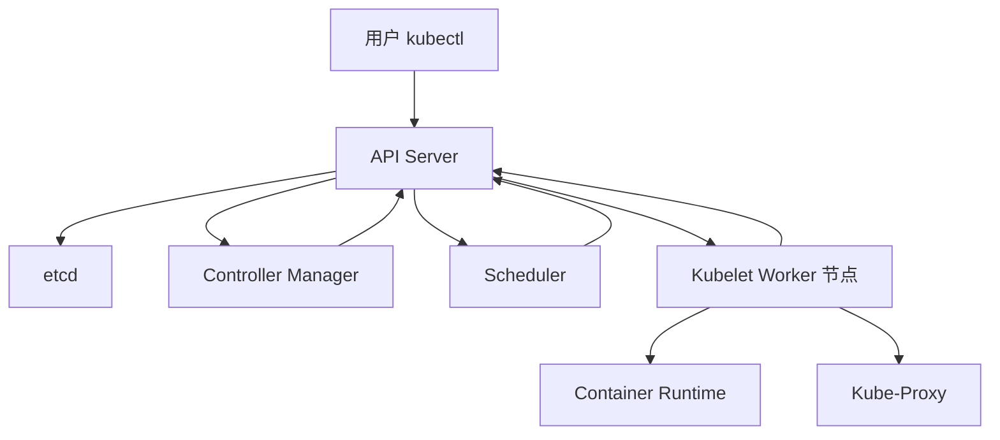

# Kubernetes 完结撒花复习与总结

## 学习目标：
- **熟悉故障排查技巧**：通过查看 Pod 日志和事件（Events），快速定位和解决问题，合理利用 Kuboard 查看日志、事件和指标。
- **复习核心概念**：回顾 Pod、ConfigMap、Secret、Deployment、StatefulSet、DaemonSet、Service、Ingress-Nginx 以及调度策略等 Kubernetes 核心组件，结合面试题加深理解。
- **培养问题定位能力**：通过互动讨论，学习如何利用日志和事件快速定位 Kubernetes 集群中的问题。


## 总结与回顾 Kubernetes Master 组件与 Worker 组件原理

Kubernetes 集群采用 Master-Worker 架构，Master 节点负责集群的控制和管理，Worker 节点负责运行实际的工作负载（如容器化应用）。以下是对 Master 组件和 Worker 组件的原理总结与回顾，帮助您深入理解 Kubernetes 的运行机制。

### 1. Master 组件原理
Master 节点是 Kubernetes 集群的“大脑”，负责整个集群的调度、状态管理和资源分配。Master 节点上运行的组件协同工作，确保集群按照期望状态运行。

#### 1.1 API Server (kube-apiserver)
- **作用**：API Server 是 Kubernetes 集群的唯一入口，负责处理所有 RESTful API 请求，包括来自 `kubectl`、UI 工具或自动化脚本的请求。它负责验证请求、更新集群状态并与存储组件通信。
- **原理**：
  - 提供 REST API 接口，用于创建、更新、删除和查询 Kubernetes 资源（如 Pod、Service 等）。
  - 负责认证、授权和准入控制，确保请求合法且符合策略。
  - 将资源状态更新到 etcd，确保集群状态一致。
- **关键点**：API Server 是无状态的，所有数据存储在 etcd 中，它是集群中其他组件与用户交互的桥梁。

#### 1.2 etcd
- **作用**：etcd 是一个分布式键值存储数据库，用于存储 Kubernetes 集群的所有配置数据和状态信息。
- **原理**：
  - 保存所有资源对象（如 Pod、Deployment）的定义和运行状态。
  - 提供数据一致性保证，支持高可用部署（通常在 Master 节点上以集群模式运行）。
  - API Server 通过 etcd 读取和写入数据，其他组件（如 Controller Manager 和 Scheduler）依赖 etcd 感知集群状态。
- **关键点**：etcd 是 Kubernetes 集群的“数据库”，其性能和可靠性直接影响集群稳定性，建议定期备份。

#### 1.3 Controller Manager (kube-controller-manager)
- **作用**：Controller Manager 运行多个控制器，负责维护集群中资源的期望状态。
- **原理**：
  - 包含多种控制器，如 Node Controller（监控节点状态）、Replication Controller（确保副本数）、Deployment Controller（管理滚动更新）等。
  - 通过 API Server 监控资源状态，与 etcd 中的期望状态对比，若不一致则采取行动（如创建或删除 Pod）。
  - 控制器以“调谐循环”（Reconcile Loop）方式持续工作，确保实际状态趋向于期望状态。
- **关键点**：Controller Manager 是集群的“自动化管理者”，实现资源的自我修复和动态调整。

#### 1.4 Scheduler (kube-scheduler)
- **作用**：Scheduler 负责将 Pod 调度到合适的 Worker 节点上运行。
- **原理**：
  - 根据 Pod 的资源需求、节点状态、调度策略（如亲和性、反亲和性）和约束条件（如资源限制、污点和容忍）选择最优节点。
  - 调度过程分为“过滤”（Filter）和“评分”（Score）两个阶段：
    - 过滤：排除不满足条件的节点。
    - 评分：对剩余节点打分，选择分数最高的节点。
  - 将调度结果写入 etcd，通过 API Server 通知相关组件。
- **关键点**：Scheduler 是集群的“资源分配者”，直接影响工作负载的性能和资源利用率。

#### 1.5 Cloud Controller Manager (可选)
- **作用**：Cloud Controller Manager 负责与底层云服务提供商集成，管理云资源（如负载均衡器、存储卷）。
- **原理**：
  - 运行特定于云提供商的控制器，与云 API 交互，动态分配资源。
  - 将云资源状态同步到 Kubernetes，确保一致性。
- **关键点**：仅在云环境中使用，增强了 Kubernetes 对云原生资源的控制能力。

### 2. Worker 组件原理
Worker 节点是 Kubernetes 集群的“工人”，负责运行实际的容器化工作负载。每个 Worker 节点运行以下核心组件，与 Master 节点通信以执行任务。

#### 2.1 Kubelet
- **作用**：Kubelet 是 Worker 节点上的主要代理，负责管理 Pod 的生命周期。
- **原理**：
  - 通过 API Server 接收 Pod 规格说明（PodSpec），确保 Pod 中的容器按预期运行。
  - 与容器运行时（如 Docker、containerd）交互，创建、启动、停止和删除容器。
  - 监控 Pod 和节点状态，定期向 API Server 汇报健康状况。
  - 执行 liveness 和 readiness 探针，判断容器是否正常运行。
- **关键点**：Kubelet 是 Worker 节点的“管家”，直接负责容器运行和状态同步。

#### 2.2 Kube-Proxy
- **作用**：Kube-Proxy 负责管理网络规则，实现 Service 的负载均衡和 Pod 间的通信。
- **原理**：
  - 根据 Service 定义，在节点上配置网络规则（如 iptables 或 IPVS），将流量转发到后端 Pod。
  - 支持多种模式：userspace、iptables（默认）、IPVS，决定流量转发方式。
  - 动态更新规则，确保 Service 指向的 Pod 变化时流量转发正确。
- **关键点**：Kube-Proxy 是 Worker 节点的“网络代理”，实现 Kubernetes 的服务发现和负载均衡。

#### 3.3 Container Runtime
- **作用**：Container Runtime 是负责实际运行容器的软件。
- **原理**：
  - 常见的容器运行时包括 Docker、containerd、CRI-O 等，符合 CRI（容器运行时接口）标准。
  - 接收 Kubelet 的指令，执行容器镜像拉取、容器创建和销毁等操作。
  - 管理容器生命周期和资源隔离（如 CPU、内存限制）。
- **关键点**：Container Runtime 是 Worker 节点的“执行引擎”，直接影响容器运行效率。

### 3. Master 与 Worker 组件的协作原理
Master 和 Worker 组件通过 API Server 紧密协作，形成一个分布式系统。以下是协作的核心流程：
1. **资源创建**：用户通过 `kubectl` 或其他工具向 API Server 提交资源定义（如 Deployment），API Server 将其存储到 etcd。
2. **状态监控**：Controller Manager 检测到新资源，执行控制逻辑（如创建 Pod 副本），并更新状态到 etcd。
3. **调度分配**：Scheduler 检测到未调度的 Pod，根据策略选择合适的 Worker 节点，并将结果写入 etcd。
4. **任务执行**：Worker 节点上的 Kubelet 通过 API Server 获取 Pod 任务，调用容器运行时创建容器，并通过 Kube-Proxy 配置网络规则。
5. **状态反馈**：Kubelet 定期向 API Server 汇报 Pod 和节点状态，Controller Manager 对比期望状态，必要时采取修复措施。

**可视化辅助**：以下 Mermaid 图表展示 Master 和 Worker 组件的协作流程。



**解释**：
- API Server 是中心枢纽，连接用户和所有组件。
- Master 组件（Controller Manager、Scheduler）负责决策和调度。
- Worker 组件（Kubelet、Kube-Proxy、Container Runtime）负责执行任务和状态汇报。

### 4. 核心资源回顾：Pod
#### 4.1 Pod 的定义与作用
- **定义**：Pod 是 Kubernetes 中最小的调度单位，是一组共享网络和存储资源的容器集合。
- **作用**：
  - 运行一个或多个容器，通常一个 Pod 运行一个主要容器，辅助容器（如 sidecar）提供支持功能。
  - 提供共享环境：同一 Pod 内容器共享 IP 地址、端口空间和存储卷，通过 `localhost` 通信。
  - 支持生命周期管理：Pod 可定义启动、运行和终止行为，适合临时任务或长期服务。

#### 4.2 Pod 的工作原理
- **创建**：用户通过 API Server 定义 Pod 资源，Scheduler 调度到 Worker 节点，Kubelet 调用容器运行时创建容器。
- **运行**：容器运行时管理容器生命周期，Kubelet 通过探针（liveness、readiness）监控容器健康状态。
- **网络**：Kube-Proxy 配置网络规则，确保 Pod 间和服务间通信顺畅。
- **销毁**：当 Pod 被删除或节点故障时，Kubelet 清理容器，Controller Manager 可能重新创建 Pod。

#### 4.3 Pod 的关键特性
- **原子性**：Pod 是不可分割的单位，容器要么全部运行，要么全部不运行。
- **临时性**：Pod 默认是临时的，故障后会被重新创建，可能分配新 IP，需通过 Service 提供稳定访问。
- **资源共享**：支持容器间共享存储卷和网络，适合紧密耦合的应用。

### 5. 总结
- **Master 组件**：API Server、etcd、Controller Manager 和 Scheduler 构成集群控制平面，负责资源管理、状态维护和任务调度。
- **Worker 组件**：Kubelet、Kube-Proxy 和 Container Runtime 负责容器运行、网络管理和状态汇报。
- **协作机制**：Master 和 Worker 通过 API Server 通信，形成闭环控制，确保集群状态一致。
- **Pod 原理**：作为最小调度单位，Pod 封装容器，提供共享环境和生命周期管理，是 Kubernetes 工作负载的基础。


以下是关于 Pod 及其语法组成部分的总结与回顾，包含 Pod 的定义、作用以及 YAML 配置文件的详细解析，并以表格形式总结 Pod 中涉及的部署相关内容。


## 总结与回顾 Pod 以及语法组成部分

### 1. Pod 的概述
- **定义**：Pod 是 Kubernetes 中最小的调度和管理单位，是一组共享网络和存储资源的容器集合。Pod 通常包含一个主要容器，可能还包括辅助容器（如 sidecar 容器）。
- **作用**：
  - 运行一个或多个容器，容器间共享网络（IP 地址和端口）和存储资源。
  - 提供生命周期管理，支持健康检查（liveness 和 readiness 探针）以确保容器正常运行。
  - 作为临时性资源，Pod 故障时可被重新创建，通常通过 Service 提供稳定访问。
- **关键特性**：
  - **原子性**：Pod 内的容器作为一个整体运行或销毁。
  - **资源共享**：同一 Pod 内的容器通过 `localhost` 通信，共享存储卷。
  - **调度单位**：Kubernetes 以 Pod 为单位进行资源调度和分配。

### 2. Pod YAML 配置语法组成部分
Pod 的定义通常通过 YAML 文件描述，以下是您提供的 Pod 配置文件的语法结构解析，帮助理解每个字段的作用。

#### 2.1 基本结构解析
以下是 Pod YAML 文件的详细字段说明：

| **字段**                          | **说明**                                                                                          |
|-----------------------------------|--------------------------------------------------------------------------------------------------|
| `apiVersion: v1`                 | 指定 Kubernetes API 的版本，对于 Pod 通常是 `v1`，表示使用核心 API 组的稳定版本。                |
| `kind: Pod`                      | 资源类型，指定为 `Pod`，表示这是一个 Pod 资源定义。                                             |
| `metadata:`                      | 包含 Pod 的元数据信息，用于标识和组织资源。                                                     |
| `metadata.name`                  | Pod 的名称，需符合企业命名规范，此处为 `pod-stars-emmision`。                                   |
| `metadata.namespace`             | Pod 所属的命名空间，此处为 `your-pinyin-name`，需替换为实际命名空间，如 `zhangwei`。            |
| `spec:`                          | Pod 的规格说明，定义 Pod 的具体配置和行为。                                                     |
| `spec.containers`                | 定义 Pod 中的容器列表，每个容器有独立的配置。                                                  |
| `spec.containers.name`           | 容器名称，此处为 `stars-emmision`，用于标识容器。                                              |
| `spec.containers.image`          | 容器镜像地址，此处为 `harbor.labworlds.cc/stars-emmision/master:08061743-shiqi`，需替换为实际镜像标签。 |
| `spec.containers.ports`          | 指定容器暴露的端口，此处为 `containerPort: 80`，表示容器内部监听 80 端口。                     |
| `spec.containers.envFrom`        | 定义环境变量来源，从 ConfigMap 和 Secret 中引入所有键值对。                                     |
| `spec.containers.volumeMounts`   | 定义容器内的挂载点，将 ConfigMap 和 Secret 挂载为文件，挂载路径分别为 `/etc/config` 和 `/etc/ssl`。 |
| `spec.containers.livenessProbe`  | 活性探针配置，通过 HTTP GET 请求检查容器是否正常运行，路径为 `/`，端口为 `80`，初始延迟 30 秒，每 10 秒探测一次。 |
| `spec.containers.readinessProbe` | 就绪探针配置，通过 HTTP GET 请求检查容器是否可接收流量，路径为 `/`，端口为 `80`，初始延迟 5 秒，每 10 秒探测一次。 |
| `spec.volumes`                   | 定义 Pod 使用的卷，引用 ConfigMap 和 Secret，分别对应 `configmap-app-file` 和 `secret-domain`。  |
| `spec.imagePullSecrets`          | 指定用于拉取镜像的 Secret，此处为 `secret-harbor-login`，用于认证私有镜像仓库。                 |

#### 2.2 Pod 配置中的核心组成部分
Pod 的 YAML 配置主要围绕 `metadata` 和 `spec` 两大块：
- **metadata**：提供 Pod 的基本信息，如名称和命名空间，用于资源标识和管理。
- **spec**：定义 Pod 的运行行为，包括容器配置、资源限制、健康检查、网络和存储等。

### 3. 表格总结：Pod 中涉及的部署相关内容
以下表格总结了您提供的 Pod 配置中涉及的部署相关资源和配置，涵盖了 ConfigMap、Secret 等外部依赖，帮助理解 Pod 如何与其他资源集成。

| **类别**                | **名称**                        | **作用**                                                                 | **相关配置文件**                  | **挂载路径/用途**                     |
|-------------------------|---------------------------------|------------------------------------------------------------------------|-----------------------------------|---------------------------------------|
| **容器镜像**            | `stars-emmision`               | Pod 运行的主要容器镜像，需替换为实际镜像标签。                         | N/A                               | N/A                                   |
| **ConfigMap (环境变量)**| `configmap-app-env`            | 提供环境变量键值对，通过 `envFrom` 引入到容器中。                      | `configmap-app-env.yml`           | 作为环境变量注入容器                 |
| **ConfigMap (文件)**    | `configmap-app-file`           | 提供配置文件，通过卷挂载到容器指定路径。                               | `configmap-app-file.yml`          | 挂载到 `/etc/config`                 |
| **Secret (环境变量)**   | `secret-app-env`               | 提供敏感环境变量（如密码），通过 `envFrom` 引入到容器中。              | `secret-app-env.yml`              | 作为环境变量注入容器                 |
| **Secret (文件)**       | `secret-domain`                | 提供敏感文件（如 HTTPS 证书），通过卷挂载到容器指定路径。              | `secret-domain.yml`               | 挂载到 `/etc/ssl`                    |
| **Secret (镜像拉取)**   | `secret-harbor-login`          | 提供私有镜像仓库的登录凭据，用于拉取镜像。                            | `secret-harbor-login.yml`         | 用于镜像拉取认证                     |
| **健康检查**            | `livenessProbe`                | 检查容器是否存活，若失败则重启容器，HTTP GET 请求路径 `/`，端口 80。   | N/A                               | 初始延迟 30 秒，周期 10 秒          |
| **健康检查**            | `readinessProbe`               | 检查容器是否就绪，若失败则停止流量转发，HTTP GET 请求路径 `/`，端口 80。| N/A                               | 初始延迟 5 秒，周期 10 秒           |

### 4. Pod 配置的实践意义
- **环境变量管理**：通过 `envFrom` 从 ConfigMap 和 Secret 引入环境变量，解耦配置与代码，便于维护和动态调整。
- **文件挂载**：通过 `volumeMounts` 和 `volumes` 将 ConfigMap 和 Secret 挂载为文件，适合配置文件和证书等场景。
- **健康检查**：配置 `livenessProbe` 和 `readinessProbe`，确保容器运行正常并及时响应流量，提升应用可靠性。
- **镜像拉取安全**：使用 `imagePullSecrets` 认证私有仓库，保障镜像拉取的安全性和权限控制。

### 5. 总结
- **Pod 核心**：Pod 是 Kubernetes 的最小单位，封装容器，提供共享网络和存储环境。
- **语法结构**：Pod YAML 配置通过 `metadata` 定义标识信息，通过 `spec` 定义容器、卷、健康检查等运行行为。
- **部署集成**：Pod 通过 ConfigMap、Secret 等资源实现配置管理和安全控制，通过探针机制保障运行可靠性。

### 曾经你们经历最复杂的练习,也恭喜你们完成了作业
```bash
apiVersion: v1  # 指定 Kubernetes API 的版本
kind: Pod  # 资源类型，这里是 Pod
metadata:
  name: pod-stars-emmision  # Pod 的名称，符合企业标准
  namespace: your-pinyin-name  # 替换为你的 Namespace 名称，例如 zhangwei
spec:
  containers:  # 定义 Pod 中的容器
  - name: stars-emmision  # 容器的名称
    image: harbor.labworlds.cc/stars-emmision/master:08061743-shiqi  # 替换为你的镜像标签
    ports:  # 指定容器暴露的端口
    - containerPort: 80  # 容器内部使用的端口号，这里是 80
    envFrom:  # 定义环境变量，从 ConfigMap 和 Secret 中引入所有键值对
    - configMapRef:
        name: configmap-app-env  # ConfigMap 名称，来自 configmap-app-env.yml
    - secretRef:
        name: secret-app-env  # Secret 名称，来自 secret-app-env.yml
    volumeMounts:  # 定义挂载点，将 ConfigMap 和 Secret 挂载为文件
    - name: volume-configmap-app-file  # 挂载 ConfigMap 文件配置，来自 configmap-app-file.yml
      mountPath: /etc/config
    - name: volume-secret-domain  # 挂载 Secret HTTPS 证书，来自 secret-domain.yml
      mountPath: /etc/ssl
    livenessProbe:  # 活性探测配置，用于检查容器是否正常运行
      httpGet:  # 使用 HTTP GET 请求进行探测
        path: /  # 请求的路径，这里是根路径
        port: 80  # 请求的端口，这里是 80
      initialDelaySeconds: 30  # 在容器启动后，等待 30 秒再进行第一次探测
      periodSeconds: 10  # 每 10 秒进行一次探测
    readinessProbe:  # 就绪探测配置，用于检查容器是否可以接收流量
      httpGet:  # 使用 HTTP GET 请求进行探测
        path: /  # 请求的路径，这里是根路径
        port: 80  # 请求的端口，这里是 80
      initialDelaySeconds: 5  # 在容器启动后，等待 5 秒再进行第一次探测
      periodSeconds: 10  # 每 10 秒进行一次探测
  volumes:  # 定义卷，引用 ConfigMap 和 Secret
  - name: volume-configmap-app-file  # 卷名称，与 container 中的 volumeMounts 对应，来自 configmap-app-file.yml
    configMap:
      name: configmap-app-file  # ConfigMap 名称
  - name: volume-secret-domain  # 卷名称，与 container 中的 volumeMounts 对应，来自 secret-domain.yml
    secret:
      secretName: secret-domain  # Secret 名称
  imagePullSecrets:  # 指定用于拉取镜像的 Secret
  - name: secret-harbor-login  # 引用之前创建的 Secret 名称，来自 secret-harbor-login.yml
```


## 总结与回顾 ConfigMap 与 Secret

### 1. ConfigMap 概述
- **定义**：ConfigMap 是一种 Kubernetes 资源，用于存储非敏感的键值对配置数据，供 Pod 或其他资源使用。
- **作用**：
  - 将配置数据与应用代码解耦，便于维护和更新。
  - 支持以环境变量、命令行参数或文件的形式注入到容器中。
  - 适用于存储应用配置、参数设置等非敏感信息。
- **关键特性**：
  - **非加密**：ConfigMap 中的数据以明文存储，不适合存储密码或密钥等敏感信息。
  - **动态更新**：部分情况下支持动态更新（例如通过卷挂载的文件），无需重启 Pod。
  - **易于管理**：支持从文件、目录或字面值创建，适合批量配置。

### 2. Secret 概述
- **定义**：Secret 是一种 Kubernetes 资源，用于存储和管理敏感数据，如密码、API 密钥、证书等。
- **作用**：
  - 提供安全的方式存储敏感信息，避免明文暴露在配置文件中。
  - 支持以环境变量或文件形式注入到容器中。
  - 适用于存储数据库凭据、TLS 证书、私有镜像仓库登录信息等。
- **关键特性**：
  - **加密存储**：Secret 数据在 etcd 中以 base64 编码存储（注意：base64 仅是编码而非加密，需配合 RBAC 控制访问）。
  - **权限控制**：通过 Kubernetes 的 RBAC 机制限制访问，确保只有授权组件能读取。
  - **专用场景**：支持特定类型（如 `kubernetes.io/dockerconfigjson` 用于镜像拉取认证）。

### 3. ConfigMap 与 Secret 的对比
以下表格对比了 ConfigMap 和 Secret 的主要特点和使用场景，帮助快速区分两者的适用范围。

| **特性**            | **ConfigMap**                              | **Secret**                                |
|---------------------|--------------------------------------------|-------------------------------------------|
| **数据类型**        | 非敏感配置数据（如端口号、URL）            | 敏感数据（如密码、密钥、证书）            |
| **存储方式**        | 明文存储在 etcd 中                         | base64 编码存储在 etcd 中                 |
| **安全机制**        | 无内置加密，依赖 RBAC 控制访问             | 无内置加密，依赖 RBAC 控制访问            |
| **使用方式**        | 环境变量、卷挂载文件、命令行参数           | 环境变量、卷挂载文件、镜像拉取凭据        |
| **典型场景**        | 应用配置、环境变量（如日志级别）           | 数据库密码、TLS 证书、私有仓库凭据        |
| **动态更新支持**    | 部分支持（如卷挂载文件可动态更新）         | 部分支持（如卷挂载文件可动态更新）         |

### 4. ConfigMap 与 Secret 在 Pod 中的使用方式
ConfigMap 和 Secret 可以通过以下方式注入到 Pod 中，满足不同的配置需求。

#### 4.1 作为环境变量注入
- **ConfigMap**：通过 `envFrom` 或 `env` 字段从 ConfigMap 中引入环境变量。
  ```yaml
  envFrom:
  - configMapRef:
      name: configmap-app-env
  ```
- **Secret**：通过 `envFrom` 或 `env` 字段从 Secret 中引入敏感环境变量。
  ```yaml
  envFrom:
  - secretRef:
      name: secret-app-env
  ```

#### 4.2 作为文件挂载（卷）
- **ConfigMap**：通过 `volumes` 和 `volumeMounts` 将 ConfigMap 挂载为容器内的文件或目录。
  ```yaml
  volumes:
  - name: volume-configmap-app-file
    configMap:
      name: configmap-app-file
  containers:
  - name: app
    volumeMounts:
    - name: volume-configmap-app-file
      mountPath: /etc/config
  ```
- **Secret**：通过 `volumes` 和 `volumeMounts` 将 Secret 挂载为容器内的文件（如证书）。
  ```yaml
  volumes:
  - name: volume-secret-domain
    secret:
      secretName: secret-domain
  containers:
  - name: app
    volumeMounts:
    - name: volume-secret-domain
      mountPath: /etc/ssl
  ```

#### 4.3 特定用途：Secret 用于镜像拉取
- **Secret**：通过 `imagePullSecrets` 字段指定 Secret，用于私有镜像仓库的认证。
  ```yaml
  imagePullSecrets:
  - name: secret-harbor-login
  ```

### 5. 创建 ConfigMap 和 Secret 的方法
#### 5.1 ConfigMap 创建方式
- **通过字面值创建**：直接在命令行指定键值对。
  ```bash
  kubectl create configmap my-config --from-literal=key1=value1 --from-literal=key2=value2
  ```
- **通过文件创建**：从配置文件加载内容。
  ```bash
  kubectl create configmap my-config --from-file=config.properties
  ```
- **通过目录创建**：从目录中加载多个文件。
  ```bash
  kubectl create configmap my-config --from-file=/path/to/configs
  ```
- **通过 YAML 文件创建**：定义完整的 ConfigMap 资源。
  ```yaml
  apiVersion: v1
  kind: ConfigMap
  metadata:
    name: configmap-app-env
  data:
    LOG_LEVEL: "debug"
    APP_PORT: "8080"
  ```

#### 5.2 Secret 创建方式
- **通过字面值创建**：指定敏感数据（会自动 base64 编码）。
  ```bash
  kubectl create secret generic my-secret --from-literal=password=admin123
  ```
- **通过文件创建**：从文件加载敏感数据。
  ```bash
  kubectl create secret generic my-secret --from-file=secret.txt
  ```
- **通过 YAML 文件创建**：定义 Secret 资源，数据需手动 base64 编码。
  ```yaml
  apiVersion: v1
  kind: Secret
  metadata:
    name: secret-app-env
  type: Opaque
  data:
    DB_PASSWORD: YWRtaW4xMjM=  # base64 编码后的 "admin123"
  ```
- **特定类型 Secret**：如用于镜像拉取的 `dockerconfigjson` 类型。
  ```bash
  kubectl create secret docker-registry secret-harbor-login --docker-server=harbor.labworlds.cc --docker-username=admin --docker-password=Harbor12345
  ```

### 6. 结合 Pod 配置的实际案例解析
以下是基于您之前提供的 Pod 配置中涉及的 ConfigMap 和 Secret 的总结，展示它们如何与 Pod 集成。

| **资源类型**       | **名称**                      | **作用**                                      | **使用方式**               | **相关路径/用途**            |
|--------------------|-------------------------------|----------------------------------------------|---------------------------|-----------------------------|
| **ConfigMap**      | `configmap-app-env`          | 提供应用环境变量，如日志级别、端口号等。       | 作为环境变量注入 (`envFrom`) | 注入容器环境变量            |
| **ConfigMap**      | `configmap-app-file`         | 提供应用配置文件，以文件形式挂载到容器中。     | 作为卷挂载 (`volumeMounts`) | 挂载到 `/etc/config`        |
| **Secret**         | `secret-app-env`             | 提供敏感环境变量，如数据库密码。              | 作为环境变量注入 (`envFrom`) | 注入容器环境变量            |
| **Secret**         | `secret-domain`              | 提供 HTTPS 证书等敏感文件，挂载到容器中。     | 作为卷挂载 (`volumeMounts`) | 挂载到 `/etc/ssl`           |
| **Secret**         | `secret-harbor-login`        | 提供私有镜像仓库登录凭据，用于拉取镜像。      | 镜像拉取凭据 (`imagePullSecrets`) | 用于镜像拉取认证            |

### 7. 最佳实践与注意事项
- **ConfigMap**：
  - 用于非敏感配置，避免存储密码或密钥。
  - 通过卷挂载文件时，合理规划挂载路径，避免覆盖容器内原有文件。
  - 对于动态配置需求，优先使用卷挂载方式，支持部分场景下的热更新。
- **Secret**：
  - 存储敏感数据时，结合 RBAC 限制访问范围，避免未授权访问。
  - 定期轮换密钥和证书，确保安全性。
  - 注意 base64 编码并非加密，必要时可结合外部加密工具或 Vault 增强安全。
- **共同注意事项**：
  - 合理命名资源，避免冲突，建议包含应用名或功能描述。
  - 定期清理无用的 ConfigMap 和 Secret，减少集群资源占用。

### 8. 总结
- **ConfigMap**：适用于存储非敏感配置数据，通过环境变量或文件注入 Pod，简化配置管理。
- **Secret**：适用于存储敏感数据，提供安全存储和访问控制，支持环境变量、文件挂载和镜像拉取等多种场景。
- **集成方式**：两者均可通过 `envFrom`、`volumeMounts` 等方式与 Pod 集成，满足不同配置需求。


## 总结与回顾 ServiceAccount 的 Secret 以及 TLS 证书

### 2. ServiceAccount 的 Secret 概述
- **定义**：ServiceAccount 是 Kubernetes 中用于提供 Pod 身份的资源，允许 Pod 与 Kubernetes API Server 或其他服务进行交互。每个 ServiceAccount 可以关联一个或多个 Secret（通常是 `kubernetes.io/service-account-token` 类型），用于存储身份认证令牌。
- **作用**：
  - 提供 Pod 的身份认证，允许 Pod 访问 Kubernetes API Server 执行操作（如获取资源信息、创建 Pod 等）。
  - 通过令牌（Token）实现自动化认证，适用于集群内部服务间的安全通信。
  - 支持权限控制，与 RBAC（基于角色的访问控制）结合，限制 Pod 的操作权限。
- **关键特性**：
  - **自动生成 Secret**：创建 ServiceAccount 时，Kubernetes 会自动生成一个关联的 Secret，包含认证令牌（Token）。
  - **挂载到 Pod**：ServiceAccount 的 Token 通常通过卷挂载到 Pod 的默认路径 `/var/run/secrets/kubernetes.io/serviceaccount/`，包含 `ca.crt`（CA 证书）、`namespace`（命名空间）和 `token`（令牌）。
  - **权限绑定**：通过 ClusterRole 或 Role 绑定到 ServiceAccount，控制其权限范围。

#### 2.1 ServiceAccount 的 Secret 使用方式
- **默认挂载到 Pod**：当 Pod 指定了 ServiceAccount 时，Kubernetes 会自动将关联的 Secret 挂载到 Pod 中，无需手动配置。
  ```yaml
  apiVersion: v1
  kind: Pod
  metadata:
    name: example-pod
  spec:
    serviceAccountName: my-service-account  # 指定 ServiceAccount 名称
    containers:
    - name: example-container
      image: nginx
  ```
  在 Pod 中，Token 文件路径为 `/var/run/secrets/kubernetes.io/serviceaccount/token`，可用于访问 API Server。

- **手动创建 ServiceAccount 和 Secret**：如果需要自定义，可以手动创建 ServiceAccount，并查看其关联的 Secret。
  ```bash
  kubectl create serviceaccount my-service-account
  kubectl get secrets -o wide  # 查看自动生成的 Secret，名称通常为 my-service-account-token-XXXXX
  ```

- **查看 Token**：可以通过 Secret 查看 ServiceAccount 的令牌（需 base64 解码）。
  ```bash
  kubectl get secret my-service-account-token-XXXXX -o jsonpath='{.data.token}' | base64 --decode
  ```

#### 2.2 ServiceAccount 的 Secret 典型场景
- **API 访问**：Pod 使用 ServiceAccount Token 访问 Kubernetes API，例如在自定义控制器中获取集群资源状态。
- **集群内部通信**：Pod 使用 ServiceAccount 身份与集群内其他服务交互，确保通信安全。
- **权限隔离**：通过不同的 ServiceAccount 为不同应用分配最小权限，避免权限过度授予。

#### 2.3 ServiceAccount 的 YAML 示例
以下是一个 ServiceAccount 的定义及其与 Pod 的关联示例：
```yaml
apiVersion: v1
kind: ServiceAccount
metadata:
  name: my-service-account
  namespace: default
---
apiVersion: v1
kind: Pod
metadata:
  name: example-pod
spec:
  serviceAccountName: my-service-account  # 关联 ServiceAccount
  containers:
  - name: example-container
    image: nginx
```

#### 2.4 注意事项
- **默认 ServiceAccount**：如果 Pod 未指定 ServiceAccount，Kubernetes 会使用命名空间中的 `default` ServiceAccount，其权限可能较宽松，建议显式指定。
- **权限管理**：结合 RBAC，通过 RoleBinding 或 ClusterRoleBinding 限制 ServiceAccount 的权限。
- **Token 安全性**：ServiceAccount Token 是敏感数据，避免泄露，必要时可定期轮换。

### 3. TLS 证书概述（作为 Secret 使用）
- **定义**：TLS 证书在 Kubernetes 中通常以 Secret 形式存储，用于实现安全的 HTTPS 通信或服务间身份验证。Secret 类型为 `kubernetes.io/tls`，包含证书和私钥。
- **作用**：
  - 提供 HTTPS 加密通信，确保数据传输安全，适用于 Ingress、API Server 或自定义服务。
  - 支持服务身份验证，用于 mTLS（双向 TLS）场景，确保通信双方身份可信。
  - 存储证书文件，供 Pod 挂载使用，避免将证书硬编码到镜像中。
- **关键特性**：
  - **特定类型**：TLS 证书使用 Secret 的 `type: kubernetes.io/tls`，包含 `tls.crt`（证书）和 `tls.key`（私钥）。
  - **挂载到 Pod**：通过卷挂载到 Pod 中，供应用读取证书文件。
  - **集成性**：常与 Ingress 或服务网格（如 Istio）结合，用于自动配置 TLS 加密。

#### 3.1 TLS 证书 Secret 的创建方式
- **通过文件创建**：从证书和私钥文件创建 Secret。
  ```bash
  kubectl create secret tls my-tls-secret --cert=tls.crt --key=tls.key
  ```
  创建后，Secret 的数据字段会包含 base64 编码的证书和私钥内容。

- **通过 YAML 文件创建**：手动定义 Secret，数据需 base64 编码。
  ```yaml
  apiVersion: v1
  kind: Secret
  metadata:
    name: my-tls-secret
  type: kubernetes.io/tls
  data:
    tls.crt: <base64-encoded-certificate>  # 证书内容，base64 编码
    tls.key: <base64-encoded-private-key>  # 私钥内容，base64 编码
  ```

#### 3.2 TLS 证书 Secret 的使用方式
- **挂载到 Pod**：通过卷挂载到 Pod 中，供应用读取证书文件。
  ```yaml
  apiVersion: v1
  kind: Pod
  metadata:
    name: tls-pod
  spec:
    containers:
    - name: app
      image: nginx
      volumeMounts:
      - name: tls-volume
        mountPath: /etc/ssl
    volumes:
    - name: tls-volume
      secret:
        secretName: my-tls-secret  # 引用 TLS Secret
  ```

- **用于 Ingress**：在 Ingress 资源中引用 TLS Secret，为域名配置 HTTPS。
  ```yaml
  apiVersion: networking.k8s.io/v1
  kind: Ingress
  metadata:
    name: example-ingress
  spec:
    tls:
    - hosts:
      - example.com
      secretName: my-tls-secret  # 引用 TLS Secret
    rules:
    - host: example.com
      http:
        paths:
        - path: /
          pathType: Prefix
          backend:
            service:
              name: my-service
              port:
                number: 80
  ```

#### 3.3 TLS 证书典型场景
- **HTTPS 加密**：为 Ingress 或负载均衡器配置 TLS 证书，实现外部访问的安全通信。
- **mTLS 认证**：在服务网格（如 Istio）中使用 TLS 证书，实现服务间双向身份验证。
- **自定义应用**：Pod 内应用（如 Nginx、Apache）加载 TLS 证书，提供 HTTPS 服务。

#### 3.4 注意事项
- **证书有效期**：定期检查和更新 TLS 证书，避免因证书过期导致服务中断。
- **权限控制**：通过 RBAC 限制对 TLS Secret 的访问，避免证书和私钥泄露。
- **自动化管理**：结合 Cert-Manager 等工具自动签发和轮换 TLS 证书，减少手动操作。

### 4. 结合 Pod 配置的实际案例解析（补充）
以下是基于您之前提供的 Pod 配置，结合 ServiceAccount 的 Secret 和 TLS 证书的总结，展示它们如何与 Pod 集成。

| **资源类型**           | **名称**                      | **作用**                                      | **使用方式**               | **相关路径/用途**            |
|------------------------|-------------------------------|----------------------------------------------|---------------------------|-----------------------------|
| **Secret (TLS 证书)**  | `secret-domain`              | 提供 HTTPS 证书等敏感文件，挂载到容器中。     | 作为卷挂载 (`volumeMounts`) | 挂载到 `/etc/ssl`           |
| **Secret (镜像拉取)**  | `secret-harbor-login`        | 提供私有镜像仓库登录凭据，用于拉取镜像。      | 镜像拉取凭据 (`imagePullSecrets`) | 用于镜像拉取认证            |
| **ServiceAccount Secret** | 未显式指定（自动生成）      | 提供 Pod 身份认证令牌，用于访问 API Server。 | 自动挂载到 Pod            | 挂载到 `/var/run/secrets/kubernetes.io/serviceaccount/` |

**说明**：在您提供的 Pod 配置中，未显式指定 ServiceAccount 名称，Kubernetes 会默认使用命名空间中的 `default` ServiceAccount，并自动挂载其关联的 Secret。

### 5. 最佳实践与注意事项（补充）
- **ServiceAccount 的 Secret**：
  - 显式指定 ServiceAccount，避免使用默认账户，结合 RBAC 实现最小权限原则。
  - 定期轮换 ServiceAccount Token，避免长期使用同一令牌带来的安全风险。
  - 避免手动管理 Token Secret，依赖 Kubernetes 自动生成和挂载机制。
- **TLS 证书**：
  - 使用专用工具（如 Cert-Manager）管理证书生命周期，自动处理签发和续期。
  - 将 TLS Secret 存储在受限命名空间中，限制访问权限。
  - 确保证书文件路径在 Pod 内合理规划，避免与应用文件冲突。

### 6. 总结
- **ConfigMap**：存储非敏感配置数据，支持环境变量和文件挂载，简化配置管理。
- **Secret**：存储敏感数据，支持多种类型（如通用、TLS、镜像拉取），确保安全访问。
- **ServiceAccount 的 Secret**：为 Pod 提供身份认证令牌，自动挂载到 Pod 中，支持 API 访问和权限控制。
- **TLS 证书**：以 Secret 形式存储证书和私钥，用于 HTTPS 加密和服务身份验证，支持 Ingress 和自定义应用。


## 总结与回顾 工作负载控制器（Deployment）、HPA 与反亲和性

### 1. 前文回顾：Deployment 与 HPA
之前的总结已经详细介绍了 Deployment 和 Horizontal Pod Autoscaler (HPA) 的定义、作用和配置建议，这里不再赘述。如果需要复习相关内容，请参考之前的回答。以下重点讨论反亲和性策略的灵活性和合理性。

### 2. 反亲和性（Anti-Affinity）概述
- **定义**：反亲和性是 Kubernetes 的调度策略，用于控制 Pod 部署在不同主机、区域或拓扑域上，以提升高可用性。
- **作用**：
  - 尽量确保 Pod 副本分散部署在不同主机上，降低单点故障风险。
  - 支持故障隔离，避免硬件或网络故障对服务造成全面影响。
  - 提供灵活的调度规则，适应不同场景的高可用性需求。
- **关键特性**：
  - **硬策略（requiredDuringSchedulingIgnoredDuringExecution）**：必须满足反亲和性条件，否则 Pod 无法调度。
  - **软策略（preferredDuringSchedulingIgnoredDuringExecution）**：尽量满足反亲和性条件，若无法满足仍可调度。
  - **拓扑域**：支持基于主机（`topologyKey: kubernetes.io/hostname`）、区域或自定义标签进行分散。

#### 2.1 反亲和性策略的合理性讨论
您提到的场景非常合理：如果有 10 个 Pod，但只有 9 台机器，硬性要求每个 Pod 必须部署在不同主机上会导致调度失败，因为资源不足以满足条件。这种情况下，硬策略（`required`）确实不适合，而应采用软策略（`preferred`），让 Kubernetes 尽量分散 Pod 部署，即使部分 Pod 不得不部署在同一主机上，也能确保服务正常运行。

- **硬策略的问题**：硬策略要求必须满足条件，若集群节点数少于 Pod 副本数（如 5 台机器 vs 6 个 Pod），部分 Pod 将无法调度，处于 `Pending` 状态，影响服务可用性。
- **软策略的优势**：软策略允许在资源不足时仍能调度 Pod，Kubernetes 会尽可能将 Pod 分散到不同主机（如 5 台机器分别部署 6 个 Pod，第 6 个 Pod 部署到其中一台），最大化高可用性，同时避免调度失败。

#### 2.2 调整后的反亲和性 YAML 配置示例
以下是调整后的反亲和性配置，使用软策略（`preferred`）而非硬策略（`required`），确保在节点资源不足时仍能正常调度 Pod：
```yaml
apiVersion: apps/v1
kind: Deployment
metadata:
  name: my-app
  namespace: default
spec:
  replicas: 2  # 假设有 2 个 Pod 副本
  selector:
    matchLabels:
      app: my-app
  template:
    metadata:
      labels:
        app: my-app
    spec:
      affinity:
        podAntiAffinity:  # 配置 Pod 反亲和性
          preferredDuringSchedulingIgnoredDuringExecution:  # 软策略，尽量满足
          - weight: 100  # 权重，值越高调度器越优先考虑此规则（范围 1-100）
            podAffinityTerm:
              labelSelector:
                matchLabels:
                  app: my-app  # 针对相同标签的 Pod 应用反亲和性
              topologyKey: "kubernetes.io/hostname"  # 基于主机名分散，尽量不同主机
      containers:
      - name: my-container
        image: nginx:1.14.2
        ports:
        - containerPort: 80
```

#### 2.3 软策略的效果说明
- 在上述配置中，Kubernetes 会尽量将 6 个 Pod 分散到不同主机上。如果只有 5 台机器，调度器会将 6 个 Pod 分别部署到 5 台机器上，第 6 个 Pod 会被调度到其中一台机器上（根据资源使用情况选择）。
- `weight: 100` 表示调度器会高度重视反亲和性规则，尽可能实现分散，但不会因为无法完全满足条件而拒绝调度。
- 这种配置在资源不足时仍能保证服务可用性，同时尽可能提升高可用性（5 台机器分别承载 6 个 Pod，只有 1 个 Pod 与其他 Pod 共享主机）。

#### 2.4 反亲和性配置建议（结合企业场景）
- **优先使用软策略**：对于大多数企业场景，建议使用 `preferredDuringSchedulingIgnoredDuringExecution`，以确保调度灵活性，尤其是在节点资源有限的情况下。
- **调整权重**：通过 `weight` 字段（范围 1-100）调整反亲和性规则的优先级，权重越高，调度器越倾向于满足分散条件。
- **结合实际情况**：如果企业集群节点数远大于 Pod 副本数，且对高可用性要求极高（如金融系统），可以考虑硬策略（`required`）；否则，软策略更适合。
- **监控节点分布**：使用 `kubectl describe pod` 或监控工具（如 Prometheus + Grafana）检查 Pod 实际分布情况，确保分散效果符合预期。

### 3. 结合企业需求的高可用性配置总结
根据您的反馈，反亲和性策略不应硬性要求每个 Pod 必须在不同主机上，而应灵活调整以适应资源限制。以下是更新后的综合配置建议和示例。

#### 3.1 高可用性目标
- **Pod 副本数**：至少 2 个副本，确保单 Pod 故障不影响服务。
- **HPA 配置**：最小副本数 2 个，最大副本数为最小副本数的 50% 以上（如最小 2 个，最大建议 3-4 个），根据企业负载调整。
- **反亲和性**：Pod 尽量分散在不同主机上，但允许在节点资源不足时部分 Pod 部署在同一主机，确保调度成功和服务可用性。

#### 3.2 综合 YAML 配置示例
以下是结合 Deployment、HPA 和调整后的反亲和性的完整配置示例：
```yaml
# Deployment 配置
apiVersion: apps/v1
kind: Deployment
metadata:
  name: my-app
  namespace: default
spec:
  replicas: 6  # 假设有 6 个 Pod 副本
  selector:
    matchLabels:
      app: my-app
  strategy:
    type: RollingUpdate  # 滚动更新策略
    rollingUpdate:
      maxSurge: 25%  # 更新时最多超出的 Pod 数
      maxUnavailable: 25%  # 更新时最多不可用的 Pod 数，确保零停机
  template:
    metadata:
      labels:
        app: my-app
    spec:
      affinity:
        podAntiAffinity:  # 反亲和性，尽量分散部署
          preferredDuringSchedulingIgnoredDuringExecution:  # 软策略
          - weight: 100  # 高权重，优先考虑分散
            podAffinityTerm:
              labelSelector:
                matchLabels:
                  app: my-app
              topologyKey: "kubernetes.io/hostname"  # 尽量不同主机
      containers:
      - name: my-container
        image: nginx:1.14.2
        ports:
        - containerPort: 80
        resources:
          requests:
            cpu: "200m"
            memory: "256Mi"
          limits:
            cpu: "500m"
            memory: "512Mi"
        livenessProbe:
          httpGet:
            path: /
            port: 80
          initialDelaySeconds: 30
          periodSeconds: 10
---
# HPA 配置
apiVersion: autoscaling/v2
kind: HorizontalPodAutoscaler
metadata:
  name: my-app-hpa
  namespace: default
spec:
  scaleTargetRef:
    apiVersion: apps/v1
    kind: Deployment
    name: my-app
  minReplicas: 6  # 最小副本数，至少 6 个
  maxReplicas: 9  # 最大副本数，调整为企业需求（例如 9 个 Pod 的 50% 以上）
  metrics:
  - type: Resource
    resource:
      name: cpu
      target:
        type: Utilization
        averageUtilization: 70  # 目标 CPU 使用率 70%
```

#### 3.3 企业定制化建议
- **反亲和性灵活性**：在节点数少于 Pod 副本数时，软策略确保调度成功，同时尽可能分散 Pod（如 5 台机器部署 6 个 Pod，其中 1 台机器承载 2 个 Pod）。
- **HPA 最大副本数**：根据企业集群规模调整 `maxReplicas`，例如，若可能有 6 个 Pod，建议最大副本数设为 9 或更高，确保扩展空间。
- **监控与优化**：定期检查 Pod 分布情况（`kubectl get pods -o wide`），结合企业资源情况调整反亲和性权重或策略类型。

### 4. 最佳实践与注意事项
- **Deployment**：
  - 配置合理的 `replicas` 和 `strategy.rollingUpdate`，确保更新过程零停机。
- **HPA**：
  - 确保 Metrics Server 正常运行，避免 HPA 无法获取数据。
  - 设置合理的 `minReplicas` 和 `maxReplicas`，避免频繁扩缩。
- **反亲和性**：
  - 优先使用软策略（`preferred`），确保在节点资源不足时仍能调度 Pod。
  - 通过 `weight` 字段调整调度优先级，平衡分散需求与调度成功率。
  - 定期检查集群节点数与 Pod 副本数的关系，避免因资源限制导致调度问题。

### 5. 总结
- **Deployment**：管理无状态应用，确保 Pod 副本数和滚动更新，支持高可用性和零停机部署。
- **HPA**：根据负载自动调整 Pod 副本数，最小副本数至少 2 个，最大副本数根据企业需求配置（建议为最小副本数的 50% 以上）。
- **反亲和性**：通过软策略（`preferred`）尽量将 Pod 副本分散在不同主机上，在节点资源不足时（如 10 个 Pod vs 9 台机器）仍能调度成功，最大化高可用性。


## 总结与回顾 StatefulSet

### 1. StatefulSet 概述
- **定义**：StatefulSet 是 Kubernetes 中用于管理有状态应用的工作负载控制器，确保 Pod 具有稳定的身份标识、顺序部署和持久化存储。
- **作用**：
  - 管理有状态应用（如数据库、分布式存储系统），确保每个 Pod 具有唯一且稳定的身份。
  - 支持顺序部署和终止，确保 Pod 按编号顺序启动或停止，满足依赖关系需求。
  - 与持久卷（Persistent Volume, PV）结合，提供稳定的数据存储，避免数据丢失。
- **关键特性**：
  - **稳定身份**：每个 Pod 具有固定名称（如 `app-0`, `app-1`），即使重启或重新调度，名称不变。
  - **顺序操作**：Pod 按索引顺序创建和删除（如先创建 `app-0`，再创建 `app-1`）。
  - **持久存储**：通过 `volumeClaimTemplates` 为每个 Pod 自动创建持久卷声明（PVC），确保数据持久性。

### 2. StatefulSet 与 Deployment 的区别
| **特性**            | **StatefulSet**                          | **Deployment**                          |
|---------------------|------------------------------------------|-----------------------------------------|
| **适用场景**        | 有状态应用（如 MySQL、ZooKeeper）        | 无状态应用（如 Web 服务器、API 服务）   |
| **Pod 身份**        | 稳定且唯一（如 `app-0`, `app-1`）       | 随机且无固定身份                       |
| **部署顺序**        | 按顺序部署和终止                        | 无特定顺序，Pod 可并行创建             |
| **存储支持**        | 支持持久卷模板（`volumeClaimTemplates`） | 不直接支持持久存储，需手动配置         |
| **更新策略**        | 支持分区更新（Partitioned Rolling Update） | 支持滚动更新（Rolling Update）         |

### 3. StatefulSet YAML 配置示例
以下是一个 StatefulSet 的基本配置示例，展示核心字段和典型用法：
```yaml
apiVersion: apps/v1
kind: StatefulSet
metadata:
  name: my-stateful-app
  namespace: default
spec:
  serviceName: my-stateful-service  # 关联的 Headless Service 名称，用于提供稳定网络身份
  replicas: 3  # Pod 副本数
  selector:
    matchLabels:
      app: my-stateful-app
  template:
    metadata:
      labels:
        app: my-stateful-app
    spec:
      containers:
      - name: my-container
        image: mysql:5.7  # 示例使用 MySQL 镜像
        ports:
        - containerPort: 3306
        env:
        - name: MYSQL_ROOT_PASSWORD
          valueFrom:
            secretKeyRef:
              name: mysql-secret
              key: root-password
        volumeMounts:
        - name: data
          mountPath: /var/lib/mysql  # MySQL 数据存储路径
  volumeClaimTemplates:  # 持久卷声明模板，为每个 Pod 自动创建 PVC
  - metadata:
      name: data
    spec:
      accessModes: ["ReadWriteOnce"]  # 访问模式，独占读写
      storageClassName: standard  # 存储类名称，根据集群配置调整
      resources:
        requests:
          storage: 1Gi  # 存储容量
```

### 4. 关联 Headless Service
StatefulSet 通常需要与 Headless Service 配合使用，以提供稳定的网络身份。Headless Service 不会分配 Cluster IP，而是直接返回 Pod 的 DNS 记录（如 `my-stateful-app-0.my-stateful-service.default.svc.cluster.local`）。

#### 4.1 Headless Service YAML 配置示例
```yaml
apiVersion: v1
kind: Service
metadata:
  name: my-stateful-service
  namespace: default
spec:
  ports:
  - port: 3306
    targetPort: 3306
    protocol: TCP
  clusterIP: None  # 设置为 None，表示 Headless Service
  selector:
    app: my-stateful-app
```

### 5. StatefulSet 典型场景
- **数据库**：如 MySQL、PostgreSQL、MongoDB 等，需要稳定身份和持久存储来管理主从关系或数据一致性。
- **分布式系统**：如 ZooKeeper、Etcd、Kafka 等，需要顺序启动和稳定网络身份来协调分布式任务。
- **存储系统**：如 Ceph、GlusterFS 等，需要为每个节点分配独立存储和身份。

### 6. StatefulSet 更新策略
StatefulSet 支持滚动更新，但与 Deployment 不同，它可以配置分区更新（Partitioned Rolling Update），确保只有部分 Pod 更新，避免全部 Pod 同时不可用。

#### 6.1 更新策略 YAML 示例
```yaml
apiVersion: apps/v1
kind: StatefulSet
metadata:
  name: my-stateful-app
spec:
  replicas: 3
  updateStrategy:
    type: RollingUpdate
    rollingUpdate:
      partition: 2  # 分区更新，从索引 2 开始更新（即只更新 app-2，app-0 和 app-1 不更新）
  # 其他字段省略...
```

**说明**：设置 `partition: 2` 后，只有索引 >= 2 的 Pod 会更新，适用于分阶段测试新版本。

### 7. 最佳实践与注意事项
- **Headless Service 必要性**：StatefulSet 必须关联一个 Headless Service，用于提供稳定的 DNS 名称，方便 Pod 间通信。
- **存储类选择**：确保 `volumeClaimTemplates` 中指定的 `storageClassName` 在集群中可用，否则 PVC 无法创建。
- **顺序依赖**：充分利用 StatefulSet 的顺序部署特性，确保有依赖关系的应用按正确顺序启动（如主从数据库）。
- **更新谨慎**：避免一次性更新所有 Pod，可通过 `partition` 控制更新范围，降低风险。
- **资源分配**：为有状态应用合理设置 `resources.requests` 和 `resources.limits`，避免资源争用导致性能问题。
- **备份策略**：定期备份持久卷数据，防止因 Pod 或节点故障导致数据丢失。

### 8. 结合企业需求的高可用性配置建议
- **副本数**：设置合理的 `replicas`（如至少 3 个），确保高可用性，尤其对于数据库或分布式系统。
- **反亲和性**：为 StatefulSet 配置 Pod 反亲和性（建议使用软策略），尽量将 Pod 分散到不同主机，提升容错能力。
  ```yaml
  spec:
    template:
      spec:
        affinity:
          podAntiAffinity:
            preferredDuringSchedulingIgnoredDuringExecution:
            - weight: 100
              podAffinityTerm:
                labelSelector:
                  matchLabels:
                    app: my-stateful-app
                topologyKey: "kubernetes.io/hostname"
  ```
- **持久存储**：选择高性能存储类（如 SSD 存储），确保数据读写速度满足应用需求。
- **监控与告警**：结合 Prometheus 和 Grafana 监控 StatefulSet Pod 状态和存储使用情况，设置告警规则。

### 9. 总结
- **StatefulSet**：专为有状态应用设计，确保 Pod 具有稳定身份、顺序部署和持久存储。
- **核心特性**：提供唯一 Pod 名称、顺序操作和持久卷模板，适用于数据库、分布式系统等场景。
- **与 Deployment 对比**：StatefulSet 更适合需要稳定身份和顺序的场景，而 Deployment 适用于无状态应用。


## 总结与回顾 DaemonSet

### 1. DaemonSet 概述
- **定义**：DaemonSet 是 Kubernetes 中用于管理节点级工作负载的控制器，确保在集群中的每个节点上都运行一个指定的 Pod 副本。
- **作用**：
  - 在每个节点上部署和管理 Pod，适用于需要节点级服务的应用。
  - 自动适应集群节点变化，当新节点加入集群时，DaemonSet 会自动在该节点上创建 Pod；当节点被移除时，相关 Pod 会被清理。
  - 提供统一的节点级功能，无需手动干预即可覆盖所有节点。
- **关键特性**：
  - **节点覆盖**：确保每个符合条件的节点上运行一个且仅一个 Pod 副本。
  - **自动管理**：随节点加入或离开集群自动调整 Pod 数量和分布。
  - **调度灵活性**：支持通过节点选择器（Node Selector）、容忍度（Tolerations）和亲和性（Affinity）控制 Pod 调度范围。

### 2. DaemonSet 与 Deployment/StatefulSet 的区别
| **特性**            | **DaemonSet**                          | **Deployment**                          | **StatefulSet**                          |
|---------------------|---------------------------------------|-----------------------------------------|-----------------------------------------|
| **适用场景**        | 节点级服务（如日志收集、监控代理）    | 无状态应用（如 Web 服务器）            | 有状态应用（如数据库）                 |
| **Pod 分布**        | 每个节点一个 Pod                     | 按副本数随机分布                       | 按副本数分布，稳定身份                 |
| **副本控制**        | 由节点数决定，无法手动指定副本数      | 可指定副本数（`replicas`）             | 可指定副本数（`replicas`）             |
| **身份管理**        | 无稳定身份，Pod 名称随机             | 无稳定身份，Pod 名称随机               | 稳定身份，Pod 名称固定（如 `app-0`）   |
| **典型应用**        | Fluentd、Node Exporter、CNI 插件      | Nginx、API 服务                        | MySQL、ZooKeeper                       |

### 3. DaemonSet YAML 配置示例
以下是一个 DaemonSet 的基本配置示例，展示核心字段和典型用法：
```yaml
apiVersion: apps/v1
kind: DaemonSet
metadata:
  name: my-daemon-app
  namespace: default
spec:
  selector:
    matchLabels:
      app: my-daemon-app
  template:
    metadata:
      labels:
        app: my-daemon-app
    spec:
      containers:
      - name: my-container
        image: fluent/fluentd:v1.14-1  # 示例使用 Fluentd 作为日志收集工具
        ports:
        - containerPort: 24224
        resources:
          requests:
            cpu: "100m"
            memory: "128Mi"
          limits:
            cpu: "200m"
            memory: "256Mi"
        volumeMounts:
        - name: varlog
          mountPath: /var/log  # 挂载节点日志目录
      volumes:
      - name: varlog
        hostPath:
          path: /var/log  # 映射主机日志目录到容器
      tolerations:  # 配置容忍度，确保 Pod 可调度到有污点的节点（如主控节点）
      - key: "node-role.kubernetes.io/master"
        operator: "Exists"
        effect: "NoSchedule"
```

### 4. DaemonSet 典型应用场景
- **日志收集**：如 Fluentd 或 Logstash，在每个节点上运行日志收集代理，收集节点和 Pod 日志并转发到集中存储。
- **监控代理**：如 Prometheus Node Exporter，在每个节点上运行监控代理，收集节点级别的指标（如 CPU、内存、磁盘使用情况）。
- **网络插件**：如 Calico、Flannel 等 CNI 插件，在每个节点上运行网络代理，管理 Pod 网络通信。
- **安全代理**：如 Falco 或其他安全工具，在每个节点上运行以监控系统调用和安全事件。
- **存储代理**：如 Ceph 的 OSD 守护进程，在每个节点上运行存储服务，管理本地磁盘资源。

### 5. DaemonSet 调度控制
DaemonSet 默认会在所有节点上运行 Pod，但可以通过以下机制限制调度范围：
- **节点选择器（Node Selector）**：限制 DaemonSet Pod 仅在特定标签的节点上运行。
  ```yaml
  spec:
    template:
      spec:
        nodeSelector:
          disktype: ssd  # 仅在带有 disktype=ssd 标签的节点上运行
  ```
- **容忍度（Tolerations）**：允许 DaemonSet Pod 调度到带有特定污点（Taint）的节点上（如主控节点）。
  ```yaml
  spec:
    template:
      spec:
        tolerations:
        - key: "node-role.kubernetes.io/master"
          operator: "Exists"
          effect: "NoSchedule"
  ```
- **节点亲和性（Node Affinity）**：更灵活地控制 Pod 调度到特定节点。
  ```yaml
  spec:
    template:
      spec:
        affinity:
          nodeAffinity:
            requiredDuringSchedulingIgnoredDuringExecution:
              nodeSelectorTerms:
              - matchExpressions:
                - key: disktype
                  operator: In
                  values:
                  - ssd
  ```

### 6. DaemonSet 更新策略
DaemonSet 支持滚动更新（Rolling Update），确保更新过程中尽量减少对节点级服务的影响。
- **默认行为**：更新 DaemonSet 时，Kubernetes 会逐个节点更新 Pod，确保旧 Pod 终止后新 Pod 启动。
- **配置方式**：
  ```yaml
  spec:
    updateStrategy:
      type: RollingUpdate
      rollingUpdate:
        maxUnavailable: 1  # 控制同时不可用的 Pod 数量，建议设为 1 以减少影响
  ```

### 7. 最佳实践与注意事项
- **资源限制**：为 DaemonSet Pod 设置合理的 `resources.requests` 和 `resources.limits`，避免节点级服务占用过多资源，影响其他工作负载。
- **节点覆盖控制**：使用 `nodeSelector` 或 `tolerations` 限制 DaemonSet 运行范围，避免在不需要的节点上运行（如主控节点）。
- **挂载主机资源**：通过 `hostPath` 或其他卷类型挂载节点资源（如日志目录、配置文件），确保 DaemonSet Pod 能访问节点数据。
- **更新谨慎**：配置 `maxUnavailable: 1` 或更低，确保滚动更新时服务中断范围最小。
- **监控与告警**：结合监控工具（如 Prometheus）监控 DaemonSet Pod 状态，确保每个节点上的 Pod 正常运行。
- **避免冲突**：多个 DaemonSet 可能在同一节点上运行相同类型的服务（如多个日志收集工具），需合理规划避免资源争用或功能冲突。

### 8. 结合企业需求的高可用性配置建议
- **节点筛选**：根据企业集群架构，使用 `nodeSelector` 或 `affinity` 规则，确保 DaemonSet 仅在符合条件的节点上运行（如仅在工作节点运行，排除主控节点）。
- **容错能力**：配置 `tolerations`，确保 DaemonSet Pod 可调度到关键节点（如主控节点），满足特定需求。
- **资源优化**：根据节点资源情况调整 DaemonSet Pod 的资源限制，避免影响节点上其他关键服务。
- **反亲和性无关**：由于 DaemonSet 强制每个节点运行一个 Pod，无法配置反亲和性（Anti-Affinity），但可以通过节点标签和调度规则间接控制分布范围。

### 9. 总结
- **DaemonSet**：专为节点级服务设计，确保在每个节点上运行一个指定的 Pod，适用于日志收集、监控代理、网络插件等场景。
- **核心特性**：自动覆盖所有节点，随节点变化调整 Pod 数量，支持灵活的调度控制。
- **与 Deployment/StatefulSet 对比**：DaemonSet 关注节点级覆盖，而 Deployment 和 StatefulSet 关注副本数和应用类型（无状态/有状态）。


## 总结与回顾 Service 与 Ingress-Nginx

### 1. Service 概述
- **定义**：Service 是 Kubernetes 中用于定义一组 Pod 的逻辑抽象层，提供稳定的网络端点，方便 Pod 间通信和外部访问。
- **作用**：
  - 为一组 Pod 提供统一的访问入口，隐藏 Pod 的动态变化（如 IP 变化或 Pod 重启）。
  - 支持负载均衡，将流量分发到后端多个 Pod 上。
  - 提供服务发现机制，通过 DNS 名称解析到具体的 Pod IP。
- **关键特性**：
  - **稳定 IP 和端口**：Service 提供固定的虚拟 IP（ClusterIP）或外部 IP，屏蔽 Pod IP 的变化。
  - **类型多样**：支持多种类型，适应不同场景（ClusterIP、NodePort、LoadBalancer、ExternalName）。
  - **选择器机制**：通过标签选择器（Selector）关联后端 Pod。

#### 1.1 Service 类型
| **类型**          | **描述**                                      | **典型场景**                       |
|-------------------|----------------------------------------------|-----------------------------------|
| **ClusterIP**     | 默认类型，仅集群内部访问，提供虚拟 IP         | Pod 间通信，内部服务访问          |
| **NodePort**      | 在每个节点上暴露端口，外部可通过节点 IP 访问   | 临时外部访问，调试用              |
| **LoadBalancer**  | 集成云提供商负载均衡器，分配外部 IP           | 生产环境，外部流量入口            |
| **ExternalName**  | 将服务映射到外部 DNS 名称，不分配 Cluster IP  | 访问集群外部服务                  |

#### 1.2 Service YAML 配置示例
以下是一个 ClusterIP 类型的 Service 配置示例：
```yaml
apiVersion: v1
kind: Service
metadata:
  name: my-service
  namespace: default
spec:
  selector:
    app: my-app  # 关联具有 app=my-app 标签的 Pod
  ports:
  - protocol: TCP
    port: 80  # Service 端口
    targetPort: 8080  # 后端 Pod 容器端口
  type: ClusterIP  # 默认类型，集群内部访问
```

#### 1.3 Headless Service
- **定义**：Headless Service 是一种特殊 Service，设置 `clusterIP: None`，不分配虚拟 IP，直接返回后端 Pod 的 IP 地址。
- **作用**：常用于 StatefulSet，为有状态应用提供稳定的 DNS 名称（如 `my-app-0.my-service.default.svc.cluster.local`）。
- **配置示例**：
  ```yaml
  apiVersion: v1
  kind: Service
  metadata:
    name: my-headless-service
  spec:
    clusterIP: None  # Headless Service
    selector:
      app: my-app
    ports:
    - port: 80
      targetPort: 8080
  ```

### 2. Ingress-Nginx 概述
- **定义**：Ingress-Nginx 是 Kubernetes 中实现 Ingress 资源的一种控制器，用于管理外部流量到集群内部服务的路由，提供高级路由规则和负载均衡功能。
- **作用**：
  - 提供基于 HTTP/HTTPS 的高级路由功能，支持基于路径、域名等的流量转发。
  - 支持 TLS 加密，保护外部流量安全。
  - 作为集群外部流量的统一入口，替代 NodePort 或 LoadBalancer 直接暴露服务。
- **关键特性**：
  - **Ingress 资源**：Ingress 是 Kubernetes 的资源对象，定义流量路由规则。
  - **Ingress 控制器**：Ingress-Nginx 是具体的实现工具，解析 Ingress 资源并应用规则。
  - **功能丰富**：支持重写 URL、限流、认证、监控集成等高级功能。

#### 2.1 Ingress 与 Service 的关系
- **Service**：提供 Pod 的基本访问入口和负载均衡，处理集群内部或基础外部访问。
- **Ingress**：基于 Service 之上，处理外部 HTTP/HTTPS 流量，提供更复杂的路由规则（如按域名或路径分发流量）。
- **协作流程**：外部流量通过 Ingress 控制器（如 Ingress-Nginx）进入集群，根据 Ingress 规则转发到对应的 Service，再由 Service 转发到后端 Pod。

#### 2.2 Ingress-Nginx YAML 配置示例
以下是一个简单的 Ingress 资源配置示例，使用 Ingress-Nginx 控制器：
```yaml
apiVersion: networking.k8s.io/v1
kind: Ingress
metadata:
  name: my-ingress
  namespace: default
  annotations:
    nginx.ingress.kubernetes.io/rewrite-target: /  # 可选：URL 重写规则
spec:
  ingressClassName: nginx  # 指定 Ingress 控制器类型为 Nginx
  rules:
  - host: example.com  # 基于域名路由
    http:
      paths:
      - path: /app1  # 基于路径路由
        pathType: Prefix
        backend:
          service:
            name: my-service1  # 关联的 Service 名称
            port:
              number: 80
      - path: /app2
        pathType: Prefix
        backend:
          service:
            name: my-service2
            port:
              number: 80
  tls:  # 配置 TLS 加密
  - hosts:
    - example.com
    secretName: example-tls  # 存储 TLS 证书的 Secret 名称
```

#### 2.3 Ingress-Nginx 控制器部署
Ingress-Nginx 控制器需要单独部署，通常通过 Helm Chart 或 YAML 文件安装。以下是简要步骤（具体部署方式依集群环境而定）：
1. 安装 Ingress-Nginx 控制器：
   ```bash
   helm repo add ingress-nginx https://kubernetes.github.io/ingress-nginx
   helm install ingress-nginx ingress-nginx/ingress-nginx -n ingress-nginx --create-namespace
   ```
2. 确认控制器运行正常：
   ```bash
   kubectl get pods -n ingress-nginx
   ```
3. 创建 Ingress 资源（如上述 YAML），控制器会自动应用规则。

### 3. Service 与 Ingress-Nginx 典型应用场景
- **Service**：
  - **ClusterIP**：用于 Pod 间通信，如前端应用访问后端 API。
  - **NodePort**：用于临时外部访问或调试，如开发阶段测试服务。
  - **LoadBalancer**：用于生产环境外部访问，结合云提供商负载均衡器。
  - **Headless Service**：用于有状态应用（如数据库集群），提供稳定 DNS 名称。
- **Ingress-Nginx**：
  - **多域名路由**：根据不同域名（如 `app1.example.com` 和 `app2.example.com`）转发流量到不同服务。
  - **路径路由**：根据 URL 路径（如 `/api` 和 `/web`）转发流量到不同后端。
  - **HTTPS 安全**：配置 TLS 证书，确保外部流量加密传输。
  - **高级功能**：配置限流、重写规则、认证等，满足复杂需求。

### 4. 最佳实践与注意事项
#### 4.1 Service
- **类型选择**：优先使用 ClusterIP 进行内部通信，仅在必要时使用 NodePort 或 LoadBalancer 暴露外部访问。
- **端口映射**：确保 `port` 和 `targetPort` 配置正确，避免流量转发失败。
- **标签选择器**：确保 Service 的 `selector` 准确匹配后端 Pod 标签，避免关联错误。
- **Headless Service**：仅在需要直接访问 Pod IP 时使用（如 StatefulSet），否则使用普通 Service。

#### 4.2 Ingress-Nginx
- **控制器选择**：根据集群需求选择合适的 Ingress 控制器，Ingress-Nginx 是最常用的开源选择，支持丰富功能。
- **域名与路径规则**：合理规划 Ingress 规则，避免规则冲突（如多个路径规则重叠）。
- **TLS 配置**：为生产环境配置 TLS 证书，确保流量安全，使用 Secret 存储证书。
- **资源限制**：为 Ingress-Nginx 控制器设置合理的资源限制，避免其占用过多集群资源。
- **监控与日志**：启用 Ingress-Nginx 的访问日志，结合 Prometheus 监控流量和性能。

### 5. 结合企业需求的高可用性配置建议
- **Service 高可用性**：
  - 配置多个 Pod 副本，确保 Service 后端有足够目标进行负载均衡。
  - 使用 LoadBalancer 类型时，结合云提供商的高可用负载均衡器（如 AWS ELB、GCP Load Balancer）。
- **Ingress-Nginx 高可用性**：
  - 部署多个 Ingress-Nginx 控制器副本，确保控制器本身高可用（通过 Deployment 或 DaemonSet）。
  - 配置反亲和性（软策略），尽量将控制器 Pod 分散到不同节点：
    ```yaml
    spec:
      template:
        spec:
          affinity:
            podAntiAffinity:
              preferredDuringSchedulingIgnoredDuringExecution:
              - weight: 100
                podAffinityTerm:
                  labelSelector:
                    matchLabels:
                      app.kubernetes.io/name: ingress-nginx
                  topologyKey: "kubernetes.io/hostname"
    ```
  - 使用外部 DNS 服务（如 Cloudflare、Route 53）解析域名到 Ingress 控制器入口，确保外部访问稳定。

### 6. 总结
- **Service**：Kubernetes 的基础网络抽象，为 Pod 提供稳定访问入口和负载均衡，支持多种类型（ClusterIP、NodePort、LoadBalancer 等），适用于内部通信和基础外部访问。
- **Ingress-Nginx**：基于 Ingress 资源的控制器，处理外部 HTTP/HTTPS 流量，提供高级路由规则（域名、路径）、TLS 加密等功能，是生产环境外部流量的主要入口。
- **协作关系**：Ingress-Nginx 依赖 Service 转发流量到具体 Pod，Service 提供基础负载均衡，Ingress-Nginx 提供高级路由。


## 总结与回顾 StorageClass、PV 和 PVC

### 1. 存储组件概述
Kubernetes 提供了多种存储管理机制，用于为 Pod 提供持久化存储。以下是三个核心组件的定义和作用：
- **PersistentVolume (PV)**：
  - **定义**：PV 是集群中的一块存储资源，由管理员手动创建或通过 StorageClass 动态创建，代表具体的存储容量和访问模式。
  - **作用**：提供存储资源（如 NFS、云存储卷、本地磁盘等），供 Pod 使用。
  - **关键特性**：包含存储大小、访问模式（ReadWriteOnce、ReadOnlyMany、ReadWriteMany）以及回收策略（Reclaim Policy）。
- **PersistentVolumeClaim (PVC)**：
  - **定义**：PVC 是用户或应用对存储资源的请求，指定所需的存储容量和访问模式。
  - **作用**：作为 PV 的使用声明，绑定到符合条件的 PV，为 Pod 提供存储挂载点。
  - **关键特性**：用户无需关心底层存储实现，只需声明需求即可。
- **StorageClass**：
  - **定义**：StorageClass 是存储类的抽象，定义了一组存储资源的配置模板（如存储类型、回收策略等）。
  - **作用**：支持动态创建 PV，简化存储资源管理，允许管理员为不同需求提供多种存储选项。
  - **关键特性**：支持动态供给（Dynamic Provisioning），根据 PVC 请求自动创建 PV。

### 2. PV、PVC 和 StorageClass 的关系
- **PV 和 PVC**：PV 是存储资源，PVC 是对资源的请求。PVC 通过匹配条件（如存储大小、访问模式）绑定到 PV，绑定后 Pod 可通过 PVC 挂载存储。
- **StorageClass 和 PV/PVC**：StorageClass 定义存储资源模板，当 PVC 指定某个 StorageClass 时，若没有合适的 PV，系统会根据 StorageClass 动态创建 PV。
- **工作流程**：
  1. 管理员创建 StorageClass，定义存储类型和配置。
  2. 用户创建 PVC，指定存储需求和 StorageClass。
  3. 系统根据 StorageClass 动态创建 PV（若无现成 PV），并将 PV 绑定到 PVC。
  4. Pod 使用 PVC 挂载存储。

### 3. 配置示例
#### 3.1 StorageClass YAML 配置示例
以下是一个 StorageClass 配置示例，使用云存储（如 AWS EBS）：
```yaml
apiVersion: storage.k8s.io/v1
kind: StorageClass
metadata:
  name: standard
provisioner: kubernetes.io/aws-ebs  # 存储提供者，取决于集群环境
parameters:
  type: gp2  # 存储类型，如 AWS 的 gp2（通用 SSD）
reclaimPolicy: Retain  # 回收策略，Retain 表示 PVC 删除后 PV 保留
allowVolumeExpansion: true  # 是否支持卷扩容
```

#### 3.2 PV YAML 配置示例（手动创建）
以下是一个手动创建的 PV 配置示例：
```yaml
apiVersion: v1
kind: PersistentVolume
metadata:
  name: my-pv
spec:
  capacity:
    storage: 5Gi  # 存储容量
  accessModes:
  - ReadWriteOnce  # 访问模式，独占读写
  persistentVolumeReclaimPolicy: Retain  # 回收策略，保留
  storageClassName: standard  # 关联 StorageClass
  hostPath:  # 示例使用本地存储
    path: /mnt/data
```

#### 3.3 PVC YAML 配置示例
以下是一个 PVC 配置示例，请求存储资源：
```yaml
apiVersion: v1
kind: PersistentVolumeClaim
metadata:
  name: my-pvc
  namespace: default
spec:
  accessModes:
  - ReadWriteOnce  # 请求独占读写模式
  resources:
    requests:
      storage: 5Gi  # 请求 5Gi 存储
  storageClassName: standard  # 指定 StorageClass
```

#### 3.4 Pod 使用 PVC 示例
Pod 通过 `volumeMounts` 挂载 PVC：
```yaml
apiVersion: v1
kind: Pod
metadata:
  name: my-pod
spec:
  containers:
  - name: my-container
    image: nginx
    volumeMounts:
    - mountPath: /data  # 挂载路径
      name: my-volume
  volumes:
  - name: my-volume
    persistentVolumeClaim:
      claimName: my-pvc  # 关联 PVC
```

### 4. 回收策略（Reclaim Policy）
- **定义**：回收策略决定 PVC 被删除后 PV 的处理方式。
- **类型**：
  - **Delete**：PVC 删除后，PV 及其底层存储资源会被自动删除（仅适用于动态创建的 PV）。
  - **Retain**：PVC 删除后，PV 保留，可手动回收或重新绑定。
  - **Recycle**：PVC 删除后，PV 数据会被清除并重新可用（已废弃，不推荐）。
- **企业建议**：**一定要使用 Retain 策略**，避免数据意外删除。数据是企业核心资产，删除操作不应自动化，必须人工确认。

### 5. 典型应用场景
- **PV 和 PVC**：
  - 为数据库 Pod（如 MySQL、PostgreSQL）提供持久存储，确保数据不随 Pod 重启丢失。
  - 为有状态应用（如 StatefulSet）分配独立存储，确保每个 Pod 有固定存储。
- **StorageClass**：
  - 动态创建存储资源，简化大规模集群存储管理。
  - 为不同应用提供多种存储选项（如高性能 SSD、廉价 HDD）。
  - 支持云存储集成（如 AWS EBS、GCP Persistent Disk、Azure Disk）。

### 6. 企业需求与最佳实践
结合您提到的企业需求，以下是针对性建议：
1. **回收保留策略（Reclaim Policy）**：
   - **必须使用 Retain 策略**：确保 PVC 删除后 PV 不会自动删除，防止数据丢失。数据是企业核心资产，任何删除操作应由人工审核，切勿自动化。
   - **操作流程**：建立严格的存储资源回收流程，PV 释放后需备份数据并记录日志，确保可追溯。
2. **动态创建 StorageClass**：
   - **优先使用动态供给**：通过 StorageClass 自动创建 PV，减少手动配置工作量，能覆盖 70% 的存储管理工作。
   - **多 StorageClass 策略**：为不同需求创建多个 StorageClass（如高性能、低成本），通过 `storageClassName` 灵活分配。
   - **检查与验证**：定期检查 StorageClass 配置和底层存储提供者（Provisioner）状态，确保动态创建正常运行。
3. **其他最佳实践**：
   - **存储容量规划**：合理设置 PVC 请求的存储容量，避免资源浪费或不足。
   - **访问模式选择**：根据应用需求选择合适的访问模式（如 ReadWriteOnce 适用于独占存储，ReadWriteMany 适用于共享存储）。
   - **备份策略**：定期备份 PV 数据，结合工具（如 Velero）实现存储卷快照和恢复。
   - **监控与告警**：监控 PVC 和 PV 使用情况，设置存储使用率告警，避免存储不足影响业务。
   - **权限控制**：通过 RBAC 限制 StorageClass 和 PVC 的创建权限，防止未经授权的存储资源分配。

### 7. 结合企业需求的高可用性配置建议
- **存储高可用**：选择支持高可用的存储提供者（如云存储的冗余卷），避免单点故障。
- **多区域存储**：在多区域集群中，使用支持跨区域复制的 StorageClass，确保数据冗余。
- **卷扩容支持**：配置 `allowVolumeExpansion: true`，支持动态扩容存储，避免业务中断。
- **快照与恢复**：为关键应用启用存储卷快照功能（如云存储提供商的快照），确保数据可快速恢复。

### 8. 总结
- **PV**：集群中的存储资源，代表具体的存储卷，可手动或动态创建。
- **PVC**：用户对存储资源的请求，绑定 PV 后供 Pod 使用。
- **StorageClass**：存储资源模板，支持动态创建 PV，简化存储管理。
- **企业重点**：
  - **回收策略**：必须使用 Retain，避免数据自动删除，保护企业资产。
  - **动态创建**：优先使用 StorageClass 动态供给，减少 70% 手动工作量，提升效率。


## 总结与回顾 亲和力、节点选择器和污点

### 1. 亲和力（Affinity）概述
- **定义**：亲和力是 Kubernetes 中用于控制 Pod 调度到节点的规则，支持基于节点或 Pod 关系的灵活调度。
- **作用**：
  - 优化 Pod 分布，提高应用高可用性（如分散部署）。
  - 确保 Pod 与特定资源或服务靠近（如与存储节点同区域）。
- **类型**：
  - **节点亲和性（Node Affinity）**：控制 Pod 调度到特定节点，基于节点标签。
  - **Pod 亲和性（Pod Affinity）**：控制 Pod 与其他 Pod 的位置关系（如同节点或不同节点）。
  - **Pod 反亲和性（Pod Anti-Affinity）**：确保 Pod 分散部署，避免集中于同一节点。
- **策略**：
  - **硬性（Required）**：必须满足亲和性规则，否则 Pod 无法调度。
  - **软性（Preferred）**：尽量满足亲和性规则，若无法满足仍可调度到其他节点。

#### 1.1 亲和力 YAML 配置示例
以下是一个 Pod 反亲和性配置示例，确保 Pod 分散部署：
```yaml
apiVersion: v1
kind: Pod
metadata:
  name: my-pod
spec:
  affinity:
    podAntiAffinity:  # Pod 反亲和性
      preferredDuringSchedulingIgnoredDuringExecution:  # 软性策略
      - weight: 100  # 权重，值越高优先级越高
        podAffinityTerm:
          labelSelector:
            matchLabels:
              app: my-app  # 针对具有 app=my-app 标签的 Pod
          topologyKey: "kubernetes.io/hostname"  # 按主机名区分，确保不同节点
  containers:
  - name: my-container
    image: nginx
```

#### 1.2 企业建议
- **软性策略为主**：企业中尽量使用软性策略（`preferredDuringSchedulingIgnoredDuringExecution`），避免硬性要求（`requiredDuringSchedulingIgnoredDuringExecution`）导致 Pod 无法调度。
- **高可用性**：通过 Pod 反亲和性分散部署 Pod，确保故障域隔离（如不同节点、不同可用区），是高可用的必备手段。

### 2. 节点选择器（Node Selector）概述
- **定义**：节点选择器是一种简单的调度约束机制，通过节点标签指定 Pod 调度到特定节点。
- **作用**：
  - 限制 Pod 仅调度到符合标签条件的节点。
  - 用于区分环境或资源类型（如开发环境节点、GPU 节点）。
- **关键特性**：
  - 简单易用，适合基本调度需求。
  - 硬性要求，若无符合条件的节点，Pod 无法调度。

#### 2.1 节点选择器 YAML 配置示例
以下是一个使用节点选择器的 Pod 配置示例：
```yaml
apiVersion: v1
kind: Pod
metadata:
  name: my-pod
spec:
  nodeSelector:
    env: production  # 仅调度到带有 env=production 标签的节点
  containers:
  - name: my-container
    image: nginx
```

#### 2.2 企业建议
- **区分环境主机**：公司中常用节点选择器区分不同环境（如开发、测试、生产）的节点，确保 Pod 调度到正确环境。
- **标签管理**：规范节点标签命名和分配，避免混乱（如 `env=dev`、`env=prod`）。
- **灵活性不足**：节点选择器功能较为简单，若需求复杂（如权重、多条件），建议使用节点亲和性（Node Affinity）替代。

### 3. 污点（Taint）与容忍度（Toleration）概述
- **定义**：
  - **污点（Taint）**：应用于节点，阻止 Pod 调度到该节点，除非 Pod 有对应的容忍度。
  - **容忍度（Toleration）**：应用于 Pod，允许 Pod 忽略节点的污点，调度到带有污点的节点。
- **作用**：
  - 保护节点资源，限制特定节点仅供特定 Pod 使用（如主控节点）。
  - 支持节点维护，临时阻止新 Pod 调度到节点。
- **污点效果**：
  - **NoSchedule**：阻止新 Pod 调度到节点，但不影响已运行的 Pod。
  - **PreferNoSchedule**：尽量不调度新 Pod 到节点，但若无其他选择仍可调度。
  - **NoExecute**：阻止新 Pod 调度，并驱逐已运行的 Pod（除非 Pod 有容忍度）。

#### 3.1 污点与容忍度 YAML 配置示例
以下是一个 Pod 配置容忍度的示例，允许调度到带有特定污点的节点：
```yaml
apiVersion: v1
kind: Pod
metadata:
  name: my-pod
spec:
  tolerations:  # 容忍度配置
  - key: "node-role.kubernetes.io/master"  # 污点键
    operator: "Exists"  # 存在即可容忍
    effect: "NoSchedule"  # 容忍 NoSchedule 效果的污点
  containers:
  - name: my-container
    image: nginx
```

#### 3.2 设置污点的命令
为节点添加污点（以 `NoSchedule` 为例）：
```bash
kubectl taint nodes node1 maintenance=true:NoSchedule
```
移除污点：
```bash
kubectl taint nodes node1 maintenance=true:NoSchedule-
```

#### 3.3 企业建议
- **污点使用场景**：通常用于集群维护操作（如更新集群、修改主机），临时阻止 Pod 调度到特定节点。
- **避免 NoExecute**：在企业环境中，**严禁使用 NoExecute 效果的污点**，因为它会驱逐已运行的 Pod，可能导致服务无法启动，尤其在不了解公司业务的情况下，使用风险极高。
- **推荐 NoSchedule**：使用 `NoSchedule` 效果，阻止新 Pod 调度，但不影响已运行 Pod，维护时更安全。维护完成后，手动确认并逐一排除污点。
- **维护流程**：建立严格的污点管理流程，记录污点添加和移除操作，确保维护操作可追溯。

### 4. 典型应用场景
- **亲和力**：
  - **Pod 反亲和性**：将关键应用（如 Web 服务器）的多个副本分散到不同节点或可用区，提高高可用性。
  - **节点亲和性**：将 Pod 调度到特定区域的节点（如靠近存储服务的节点），优化性能。
- **节点选择器**：
  - 区分环境，将开发、测试、生产的 Pod 调度到不同节点组。
  - 资源匹配，将需要 GPU 的 Pod 调度到带有 GPU 的节点。
- **污点与容忍度**：
  - 保护主控节点，设置污点（如 `node-role.kubernetes.io/master:NoSchedule`），仅允许特定 Pod（如系统组件）调度。
  - 节点维护，临时为节点设置污点，阻止新 Pod 调度，方便升级或修复。

### 5. 企业需求与最佳实践
结合您提到的企业需求，以下是针对性建议：
1. **亲和力**：
   - **软性为主**：企业中尽量使用软性亲和性策略，避免硬性要求导致调度失败。
   - **高可用性**：通过 Pod 反亲和性实现 Pod 分散部署，确保故障隔离。
2. **节点选择器**：
   - **环境隔离**：通过节点标签区分不同环境主机，确保 Pod 调度到正确节点。
   - **规范管理**：统一节点标签命名规则，定期检查标签状态。
3. **污点与容忍度**：
   - **禁用 NoExecute**：企业中禁止使用 `NoExecute` 污点，避免服务中断风险。
   - **使用 NoSchedule**：维护时仅使用 `NoSchedule` 污点，阻止新 Pod 调度，保护现有服务。
   - **手动确认**：维护操作后，手动逐一确认节点状态，排除污点，确保业务恢复。

### 6. 结合企业需求的高可用性配置建议
- **亲和性高可用**：结合 Pod 反亲和性和节点亲和性，确保关键服务 Pod 分散部署，同时靠近依赖资源。
- **节点选择器规划**：为不同环境和资源类型预先规划节点标签，避免调度冲突。
- **污点管理流程**：建立污点操作 SOP（标准操作流程），确保维护操作安全可控，记录每次污点变更。

### 7. 总结
- **亲和力**：灵活控制 Pod 调度，支持节点和 Pod 关系规则，软性策略适合企业高可用需求。
- **节点选择器**：简单有效的调度约束，适合区分环境主机，但功能有限。
- **污点与容忍度**：用于节点保护和维护，NoSchedule 适合企业使用，NoExecute 风险高应禁用。
- **企业重点**：
  - 亲和力以软性为主，保障高可用。
  - 节点选择器用于环境隔离。
  - 污点仅用 NoSchedule，手动确认排除，避免服务中断。


## 总结与回顾 RBAC 权限管理

### 1. RBAC 概述
- **定义**：RBAC 是 Kubernetes 中用于控制用户或服务对集群资源访问权限的机制，通过角色（Role）和角色绑定（RoleBinding）实现细粒度的权限管理。
- **作用**：
  - 限制用户或服务只能访问必要的资源，遵循最小权限原则（Principle of Least Privilege）。
  - 提高集群安全性，防止未经授权的操作。
  - 支持多团队协作，针对不同角色分配不同权限。
- **关键组件**：
  - **Role**：定义一组权限规则，指定对某些资源（如 Pod、Service）的操作权限（如 get、list、create）。
  - **ClusterRole**：与 Role 类似，但作用于整个集群，而非某个命名空间。
  - **RoleBinding**：将 Role 绑定到用户、组或服务账户（ServiceAccount），赋予具体权限。
  - **ClusterRoleBinding**：将 ClusterRole 绑定到用户、组或服务账户，作用于整个集群。

### 2. RBAC 工作原理
- **权限定义**：通过 Role 或 ClusterRole 定义对资源（如 Pod、Deployment）的操作权限（如 get、create、delete）。
- **权限绑定**：通过 RoleBinding 或 ClusterRoleBinding 将权限分配给具体主体（用户、组、服务账户）。
- **作用范围**：
  - Role 和 RoleBinding 限制在特定命名空间内，适合细粒度控制。
  - ClusterRole 和 ClusterRoleBinding 作用于整个集群，适合全局权限管理。
- **默认无权限**：Kubernetes 默认拒绝所有访问，RBAC 需显式授权。

### 3. 配置示例
#### 3.1 Role YAML 配置示例
以下是一个 Role 配置示例，限制在特定命名空间内对 Pod 和 Service 的读写权限：
```yaml
apiVersion: rbac.authorization.k8s.io/v1
kind: Role
metadata:
  namespace: dev  # 作用于 dev 命名空间
  name: dev-role
rules:
- apiGroups: [""]  # 空字符串表示核心 API 组
  resources: ["pods", "services"]  # 控制的资源类型
  verbs: ["get", "list", "create", "update", "patch"]  # 允许的操作
```

#### 3.2 RoleBinding YAML 配置示例
以下是一个 RoleBinding 配置示例，将上述 Role 绑定到特定用户：
```yaml
apiVersion: rbac.authorization.k8s.io/v1
kind: RoleBinding
metadata:
  namespace: dev  # 作用于 dev 命名空间
  name: dev-role-binding
subjects:
- kind: User  # 主体类型为用户
  name: dev-user  # 用户名
  apiGroup: rbac.authorization.k8s.io
roleRef:
  kind: Role  # 绑定的角色类型
  name: dev-role  # 绑定的角色名称
  apiGroup: rbac.authorization.k8s.io
```

#### 3.3 ClusterRole YAML 配置示例
以下是一个 ClusterRole 配置示例，定义集群范围的只读权限：
```yaml
apiVersion: rbac.authorization.k8s.io/v1
kind: ClusterRole
metadata:
  name: read-only-cluster-role
rules:
- apiGroups: ["*"]  # 所有 API 组
  resources: ["*"]  # 所有资源
  verbs: ["get", "list", "watch"]  # 只读操作
```

#### 3.4 ClusterRoleBinding YAML 配置示例
以下是一个 ClusterRoleBinding 配置示例，将 ClusterRole 绑定到服务账户：
```yaml
apiVersion: rbac.authorization.k8s.io/v1
kind: ClusterRoleBinding
metadata:
  name: read-only-binding
subjects:
- kind: ServiceAccount  # 主体类型为服务账户
  name: read-only-sa  # 服务账户名称
  namespace: default
roleRef:
  kind: ClusterRole
  name: read-only-cluster-role
  apiGroup: rbac.authorization.k8s.io
```

### 4. 典型应用场景
- **命名空间隔离**：为开发、测试、生产环境创建不同命名空间，通过 Role 和 RoleBinding 限制用户只能访问对应命名空间。
- **最小权限分配**：为不同角色分配最小权限，如开发人员只能创建和更新资源，运维人员只能查看和维护。
- **服务账户权限**：为集群内部应用（如 CI/CD 工具）创建服务账户，绑定特定权限，避免使用人类用户凭据。
- **集群管理员**：通过 ClusterRole 和 ClusterRoleBinding 为管理员分配全局权限，管理整个集群。

### 5. 企业需求与最佳实践
结合您提到的企业需求，以下是针对性建议：
1. **开发与测试人员权限**：
   - **命名空间限制**：为开发人员和测试人员分别创建 `dev` 和 `test` 命名空间，通过 Role 和 RoleBinding 限制他们的权限仅限于对应命名空间。
   - **权限范围**：允许开发人员在 `dev` 命名空间内执行常见操作（如 `get`、`list`、`create`、`update`），但禁止访问其他命名空间或集群全局资源。
     示例 Role 配置：
     ```yaml
     apiVersion: rbac.authorization.k8s.io/v1
     kind: Role
     metadata:
       namespace: dev
       name: dev-access
     rules:
     - apiGroups: ["", "apps", "batch"]
       resources: ["pods", "deployments", "services", "configmaps", "jobs"]
       verbs: ["get", "list", "create", "update", "patch"]
     ```
   - **禁止全局权限**：避免为开发和测试人员分配 ClusterRole 或 ClusterRoleBinding，防止他们访问非授权资源。
2. **普通运维人员权限**：
   - **去掉 delete 权限**：为普通运维人员配置 Role 时，禁止 `delete` 和 `deletecollection` 操作，防止误删除资源，尤其是数据相关资源（如 PVC、ConfigMap）。
     示例 Role 配置：
     ```yaml
     apiVersion: rbac.authorization.k8s.io/v1
     kind: Role
     metadata:
       namespace: operations
       name: ops-read-only
     rules:
     - apiGroups: ["*"]
       resources: ["*"]
       verbs: ["get", "list", "watch"]  # 仅允许查看操作
     ```
   - **复杂流程有益**：对于数据删除等高风险操作，设置复杂审批流程，确保操作经过多方确认，降低误操作风险。
3. **其他最佳实践**：
   - **最小权限原则**：严格遵循最小权限原则，仅分配用户或服务账户所需权限，避免过度授权。
   - **定期审计**：定期检查 Role、RoleBinding、ClusterRole 和 ClusterRoleBinding，移除不必要的权限，确保权限分配合理。
   - **命名规范**：为 Role 和 RoleBinding 设置清晰的命名规则（如 `dev-access-role`、`test-read-only-binding`），便于管理和排查。
   - **服务账户管理**：为自动化工具（如 CI/CD 流水线）创建独立服务账户，绑定最小权限，避免共享用户凭据。
   - **日志与监控**：启用 Kubernetes 审计日志，记录权限相关操作，及时发现异常访问行为。

### 6. 结合企业需求的高可用性配置建议
- **权限隔离**：通过命名空间和 RBAC 实现团队间权限隔离，避免权限交叉导致的安全风险。
- **多级审批**：对于高风险操作（如资源删除、集群配置变更），通过 RBAC 限制权限并结合外部审批流程，确保操作合规。
- **备份与恢复**：定期备份 RBAC 配置（如 Role 和 RoleBinding 的 YAML 文件），确保权限配置可快速恢复。
- **权限测试**：在非生产环境测试 RBAC 配置，确保权限分配符合预期，避免生产环境误配置。

### 7. 总结
- **RBAC**：Kubernetes 的核心权限管理机制，通过 Role、ClusterRole、RoleBinding 和 ClusterRoleBinding 实现细粒度访问控制。
- **企业重点**：
  - **开发与测试权限**：限制在 `dev` 和 `test` 命名空间内，禁止访问其他资源，确保隔离。
  - **普通运维权限**：去掉 `delete` 权限，防止误删除，数据操作流程应复杂化以提高安全性。
- **核心原则**：最小权限、定期审计、权限隔离，确保集群安全和稳定。


## 完结撒花
，大家好！🎉

恭喜大家坚持看完了这些总结与回顾！真的很不容易，能花时间学习和消化这些内容，大家已经迈出了非常重要的一步！👏

这是我这几天结合工作经验整理的一些实用总结，希望能对大家有所帮助。愿大家在工作中都能游刃有余，随随便便就能找到心仪的工作，而且薪资都节节高升，未来一片光明！💼💰

最后，撒花庆祝！🌸🌟 大家加油，未来可期！发财了，别忘记我啊，带带我😊
