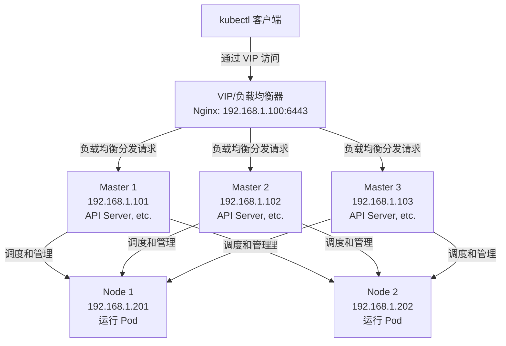

# Kubernetes 云原生世界理论与集群部署

## 学习目标
1. **认识 Kubernetes：** 理解 Kubernetes 是什么，为什么重要，以及它能帮助企业解决哪些实际问题。
2. **掌握基本架构：** 了解 Kubernetes 集群的整体结构，知道“控制中心”和“工作节点”如何分工协作。
3. **深入核心组件：** 详细学习 Kubernetes 每个主要部件的作用、工作原理及协作机制，构建完整的理论体系。
4. **为实践和面试打基础：** 通过详尽的理论讲解和问题引导，掌握 Kubernetes 核心知识点，准备好后续动手操作和应对常见面试问题。
5. **理解高可用性设计：** 深入了解为什么 Kubernetes 集群需要 3 台 Master 节点，etcd 为什么需要 3 个节点，以及它们如何协同工作，确保集群稳定运行。
6. **掌握前置准备：** 学习并完成所有节点（Master 和 Node）的环境配置，为后续搭建 Kubernetes 集群做好准备。

## 第一部分：Kubernetes 理论入门

### Kubernetes 是什么？为什么要学？
- **内容目标：** 用简单语言让学员明白 Kubernetes 的重要性，激发学习兴趣，同时提供足够的背景知识。
- **详细内容：**
  1. **Kubernetes 简介：**
     - Kubernetes（简称 K8s，K 和 s 之间有 8 个字母）是一个开源的“容器管家”，专门用来管理成百上千的容器。容器就像一个个小房子，里面装着我们的程序（应用），而 Kubernetes 负责安排这些小房子怎么放、怎么运行、出了问题怎么修。
     - 它最初由 Google 在 2014 年开发并开源，基于 Google 内部多年的容器管理经验（Borg 系统），现在由云原生计算基金会（CNCF）维护，是云原生技术的事实标准。
     - Kubernetes 不只是一个工具，更是一种思维方式，帮助我们在云时代高效地构建和管理复杂应用。
  2. **企业为什么需要 Kubernetes？**
     - **问题1：应用越来越多，管理太乱：** 现代企业不再用一个大程序解决问题，而是把应用拆成很多小服务（叫微服务），比如一个电商网站可能有支付服务、订单服务、用户服务等，每个服务跑在自己的容器里。几十上百个服务，手动部署和更新非常麻烦，容易出错。比如，程序员发布新版本时，可能忘了一个服务的依赖，导致整个系统崩溃。
     - **问题2：服务器资源浪费严重：** 公司买了很多服务器（或云主机），但资源分配不均，有的机器忙得宕机，有的机器几乎空闲。比如，一个数据库服务占用了 80% 的 CPU，而旁边的机器只有 10% 的负载，白白浪费资源和电费。更糟糕的是，运维人员没有统一工具看清资源使用情况，只能凭经验调整，成本高且不精准。
     - **问题3：服务不能断，用户体验至上：** 如果程序崩溃，用户会立刻跑掉，尤其对银行、电商这种业务，每分钟宕机可能损失几十万。传统方式靠人工发现问题、修复问题，少则几分钟，多则几小时，根本来不及。而企业需要系统在故障时能自动切换、自动恢复，用户几乎察觉不到问题。
     - **额外挑战：** 服务之间的依赖复杂，比如订单服务要调用支付服务，如果支付服务地址变了，订单服务找不到它怎么办？手动修改配置太慢，容易出错。此外，频繁的版本更新和测试环境搭建，也让运维人员不堪重负。
  3. **Kubernetes 能做什么？**
     - **自动部署和扩展：** 想部署 10 个程序？写个简单命令，Kubernetes 自动完成。业务高峰需要更多程序？它能一键扩容，自动增加容器数量；业务低谷时自动缩减，节省资源。
     - **智能分配资源：** Kubernetes 像个聪明管家，把工作合理分到每台机器，避免某台机器过载或闲置。它还能根据程序的需求（比如需要多少 CPU 和内存）精准分配，最大化资源利用率。
     - **故障自修复：** 如果某个程序挂了，Kubernetes 会立刻发现并重启，甚至换一台机器重新跑，确保服务不中断。比如，一个电商网站的后端服务宕机，Kubernetes 能在几秒内启动备用服务，用户几乎感觉不到延迟。
     - **服务管理和通信：** Kubernetes 提供服务发现功能，程序之间能自动找到彼此，不用手动改地址。它还支持负载均衡，把用户请求平均分到多个程序上，避免某个程序过忙。
     - **其他功能：** 它还能管理配置信息（比如数据库密码）、密钥（保护敏感数据），以及自动化测试和版本回滚，确保新版本有问题时能快速回到旧版本。
  4. **Kubernetes 和 Docker 的区别：**
     - Docker 是一个工具，负责把程序打包成容器，就像造一个“便携小房子”。
     - Kubernetes 是管理工具，负责管很多 Docker 容器，就像一个“大管家”，安排这些小房子在哪放、怎么运行、怎么修。
- **Mermaid 图表：** 用简单对比图展示传统方式和 Kubernetes 方式的区别，以及 Kubernetes 的功能概览。
  ```mermaid
  graph TB
      A[程序出问题] -->|传统方式| B[人工发现-手动修复-耗时长]
      A -->|Kubernetes| C[自动发现-自动修复-几秒完成]
  ```
  ```mermaid
  flowchart TD
      A[Kubernetes 核心功能]
      A --> B[自动部署]
      A --> C[弹性扩容]
      A --> D[资源分配]
      A --> E[故障自愈]
      A --> F[服务发现]
      A --> G[负载均衡]
  ```
- **互动环节：** 问大家：“有没有遇到过程序部署或服务器宕机的麻烦？如果有个工具能自动解决，会不会很想试试？你们公司现在是怎么管理服务器和程序的？”
- **问题引导（面试常见）：** 为什么企业需要 Kubernetes？它和 Docker 的区别是什么？Kubernetes 如何提升资源利用率和系统可靠性？
- **教学说明：** 用生活化的例子（比如“管家”“搬家”）解释概念，避免过多技术术语。图表简单直观，突出对比和功能，适合小白。增加背景和挑战细节，让学员理解 Kubernetes 的必要性。


### Kubernetes 集群长什么样？
- **内容目标：** 让学员对 Kubernetes 系统有个整体印象，知道它是由哪些部分组成的，以及基本分工和工作流程。
- **详细内容：**
  1. **Kubernetes 就像一个大团队：**
     - Kubernetes 是一个分布式系统，分成两个主要部分：一个是“指挥部”（也叫控制平面或 Master 节点），负责发号施令、做决策；另一个是“工人”（也叫数据平面或 Node 节点），负责具体干活。
     - 指挥部是整个集群的大脑，它不直接运行业务程序，而是专注于管理和协调，比如决定哪个程序跑在哪台机器上、监控程序是否正常。
     - 工人是干活的主力，真正运行我们的业务程序（比如网站后端、数据库），它们听从指挥部的安排，执行具体任务。
  2. **指挥部和工人的关系：**
     - 指挥部通过“通讯工具”（API 接口）给工人下达命令，比如“启动一个程序”“检查状态”。
     - 工人会定期向指挥部汇报情况，比如“我这台机器运行正常”“我这有个程序挂了”。
     - 指挥部和工人通常不在同一台机器上，指挥部可能是几台高配置服务器，工人可能是几十上百台普通服务器，具体数量根据业务需求调整。
  3. **为什么要分开指挥部和工人？**
     - 分工明确：指挥部专注管理，不被业务程序干扰，能更高效地决策。如果指挥部也跑业务，一旦业务负载过高，可能导致整个集群管理失控。
     - 安全性考虑：指挥部是集群核心，存储关键数据，如果和业务程序混在一起，业务程序漏洞可能影响指挥部安全。
     - 可扩展性：工人数量可以根据需要随时增加或减少，而指挥部保持稳定，确保管理能力不受影响。
  4. **简单的工作流程：**
     - 用户（比如运维工程师）告诉指挥部：“我要部署一个程序。”
     - 指挥部思考：“哪个工人适合干这个活？”然后分配任务。
     - 工人接到任务，启动程序，并定期汇报：“我干完了”或者“我出问题了”。
     - 指挥部根据汇报调整策略，比如程序挂了就安排别的工人接手。
- **Mermaid 图表：** 用基础图展示指挥部和工人的分工及简单通信。
  ```mermaid
  graph LR
      subgraph 指挥部 Master
          A[指挥中心]
      end
      
      subgraph 工人 Node
          B[工人1]
          C[工人2]
          D[工人3]
      end
      
      A -->|下达命令| B
      A -->|下达命令| C
      A -->|下达命令| D
      B -->|汇报状态| A
      C -->|汇报状态| A
      D -->|汇报状态| A
      
      style 指挥部 Master fill:#e6e6ff,stroke:#333,stroke-width:2px
      style 工人 Node fill:#e6fff2,stroke:#333,stroke-width:2px
  ```
- **互动环节：** 问大家：“如果指挥部没了，工人还能干活吗？如果一个工人病了，指挥部会咋办？你们觉得指挥部和工人分开好不好？”
- **问题引导（面试常见）：** Master 节点和 Node 节点的主要区别是什么？为什么 Master 节点不运行业务程序？Kubernetes 的分布式设计有什么好处？
- **教学说明：** 用“指挥部和工人”的比喻让小白理解架构，图表极简，突出分工和通信关系。增加分工理由和流程描述，让学员明白为什么要这样设计。


### 指挥部（Master）里都有谁？
- **内容目标：** 逐步介绍指挥部里的核心角色（组件），详细讲解每个角色的职责、工作原理及重要性。
- **详细内容：**
  1. **前台接待员 - API Server（kube-apiserver）**
     - **职责：** 它是指挥部的“前台”，负责接待所有请求。无论是外部用户（比如通过 kubectl 工具下命令的工程师）还是内部其他角色（比如调度员），都要先找它沟通。
     - **详细工作：**
       - 接收命令：用户说“我要部署 3 个程序”，API Server 接收这个请求，通常是 RESTful API 格式（HTTP 请求）。
       - 验证身份和权限：它会检查“你是谁？有没有权限做这件事？”确保只有合法用户能操作，防止未经授权的访问。
       - 转发和记录：通过验证后，API Server 把命令转发给其他角色处理，同时把任务信息记录到档案室（etcd），确保不丢。
       - 状态查询：其他角色或用户想知道“集群现在咋样”，也通过 API Server 查询最新信息。
     - **重要性：** API Server 是指挥部的唯一入口，如果它宕机，整个集群就“聋了”，无法接收新命令，也无法协调工作。虽然现有程序可能继续运行，但无法更新或修复。
     - **比喻：** 就像公司前台，负责接待访客、登记信息、安排工作。如果前台不在，公司内外就没法沟通。
     - **互动问题：** 如果前台不在，公司还能正常运转吗？前台咋保证不被坏人骗？API Server 宕机后集群会怎样？
     - **问题引导（面试常见）：** API Server 在 Kubernetes 集群中的角色是什么？它如何保证安全性和高可用？
  2. **档案室 - etcd**
     - **职责：** 它是指挥部的“档案室”，存储集群所有的重要信息，包括用户命令、程序状态、机器情况等。
     - **详细工作：**
       - 数据存储：保存所有资源定义，比如“用户要部署 3 个程序，每个程序需要 1G 内存”，以及当前状态“程序 1 在工人 2 上运行”。
       - 一致性保证：etcd 是一个分布式存储，通常部署在多台机器上（比如 3 台或 5 台），通过 Raft 共识算法确保所有机器数据一致，即使一台机器宕机，数据也不会错乱。
       - 实时监听：其他角色（比如监工）可以监听 etcd 的变化，比如发现“程序挂了”，立刻采取行动。
       - 数据保护：支持加密存储，保护敏感信息（比如密码）；还支持版本记录，如果误删数据，可以回滚到之前版本。
     - **重要性：** etcd 是集群的“记忆”，如果数据丢失，指挥部就忘了“谁在干啥”，可能导致任务重复分配或程序失控。etcd 宕机比 API Server 宕机更严重，因为它是数据的唯一来源。
     - **比喻：** 就像公司的档案柜，所有重要文件都放这，丢了就乱套。
     - **互动问题：** 如果档案室被偷了会怎样？咋保护档案不丢？如果 etcd 数据损坏，集群还能工作吗？
     - **问题引导（面试常见）：** etcd 的作用是什么？它如何保证数据一致性？如何备份和恢复 etcd 数据？
  3. **调度员 - Scheduler（kube-scheduler）（20 分钟）**
     - **职责：** 它是指挥部的“调度员”，负责决定“哪个工人去干哪个活”，也就是把程序（Pod）分配到合适的机器上。
     - **详细工作：**
       - 监听任务：从档案室（etcd）获取还没分配的程序。
       - 筛选工人：先看哪些工人能干活，比如“有没有足够的 CPU 和内存”“有没有特殊要求（比如必须有 GPU）”。
       - 优选工人：从能干活的工人中挑一个最好的，比如“哪个工人最空闲”“哪个工人离数据近（传输快）”。
       - 记录结果：把分配结果写回档案室，比如“程序 1 分配到工人 2”。
     - **重要性：** 调度员直接影响资源利用率和程序性能，如果分配不合理，可能导致某些工人过忙、某些闲置，甚至程序跑不起来。
     - **比喻：** 就像物流分拣员，把包裹分到合适的快递员手里。
     - **互动问题：** 如果调度员分错了，会有啥后果？咋让调度更聪明？如果没有调度员，程序会怎样？
     - **问题引导（面试常见）：** Scheduler 的调度流程是什么？它如何选择最优节点？如何自定义调度策略？
  4. **监工 - Controller Manager（kube-controller-manager）（20 分钟）**
     - **职责：** 它是指挥部的“监工”，负责监督任务执行，确保一切按用户期望进行。
     - **详细工作：**
       - 对比状态：从档案室（etcd）读取用户期望（比如“要有 3 个程序运行”）和实际状态（“现在只有 2 个在跑”）。
       - 采取行动：如果不一致，就调整，比如启动一个新程序，或者删除多余的。
       - 多种监工：它包含多个小控制器，比如“节点控制器”（检查工人是否宕机）、“副本控制器”（保证程序数量正确）、“服务控制器”（确保程序能互相找到）。
     - **重要性：** 监工是集群“自愈”的关键，如果没有它，程序挂了没人管，集群状态会越来越乱。
     - **比喻：** 就像工地监工，发现问题就立刻解决。
     - **互动问题：** 如果监工偷懒，工地会咋样？监工咋知道谁出问题了？如果 Controller Manager 宕机，集群会怎样？
     - **问题引导（面试常见）：** Controller Manager 的工作原理是什么？它包含哪些控制器？“期望状态”和“实际状态”如何协调？
- **Mermaid 图表：** 在讲解完指挥部角色后，用图表展示它们的关系和协作。
  ```mermaid
  graph TD
      A[用户命令] --> B[前台 API Server]
      B --> C[档案室 etcd]
      B --> D[调度员 Scheduler]
      B --> E[监工 Controller Manager]
      
      D --> F[分配任务给工人]
      E --> G[监督任务执行]
  ```
- **教学说明：** 每个角色用生活化的比喻解释，增加详细工作内容和重要性分析。时间分配上重点放在 API Server 和 etcd，因为它们是核心。图表在讲解完所有角色后展示，梳理关系。

### 第四部分：工人（Node）里都有谁？
- **内容目标：** 介绍工人的具体角色，详细讲解它们如何运行和管理程序，补充 Kubernetes 能管理的容器运行时种类及版本变化。
- **详细内容：**
  1. **现场主管 - Kubelet（45 分钟）**
     - **职责：** 它是工人的“现场主管”，负责管理本地的程序（Pod，Pod 是 Kubernetes 里程序的最小单位，可能包含一个或多个容器）。
     - **详细工作：**
       - 接收命令：从指挥部（通过 API Server）拿到任务，比如“启动一个程序”。
       - 管理程序：和容器工具（也叫容器运行时，比如 Docker）合作，下载程序镜像，启动容器，确保程序按要求运行。
       - 挂载资源：如果程序需要存储（比如数据库文件），Kubelet 负责把存储挂接到程序上。
       - 健康检查：定期检查程序是否“活着”（还能工作）和“准备好”（能接受请求），如果不行，就报告指挥部。
       - 状态汇报：每隔一段时间告诉指挥部“我这台机器 CPU 用多少”“程序状态咋样”，让指挥部掌握全局。
     - **重要性：** Kubelet 是指挥部和实际程序的桥梁，如果它宕机，本地程序就没人管，可能继续跑但无法更新或修复；指挥部也看不到这台机器的状态，可能以为它失联。
     - **比喻：** 就像工厂车间主任，管好自己地盘的工人。
     - **互动问题：** 如果车间主任不在，工人还能干活吗？主任咋知道工人病了？Kubelet 如何判断程序是否健康？
     - **问题引导（面试常见）：** Kubelet 的职责是什么？它如何与容器运行时交互？如果 Kubelet 宕机，Pod 会怎样？
  2. **补充：Kubernetes 能管理哪些容器组件（容器运行时）？（15 分钟）**
     - **什么是容器运行时？**
       - 容器运行时（Container Runtime）是工人（Node）上负责具体运行容器的工具，相当于“造房子和开房门”的工人。Kubernetes 本身不直接运行容器，而是通过 Kubelet 调用容器运行时来创建、启动、停止容器。
       - 比喻：如果 Kubelet 是车间主任，那么容器运行时就是具体干活的工人，负责把程序装进容器小房子并让它跑起来。
     - **Kubernetes 支持哪些容器运行时？**
       - **Docker：** 最常见的容器运行时，也是最早被 Kubernetes 广泛使用的。它负责打包程序（创建镜像）和运行程序（启动容器）。Docker 功能丰富，不仅能运行容器，还能构建镜像、推送镜像到仓库等。在我们的教学中，主要以 Docker 为例，因为它直观易用，社区资源多，适合初学者。
       - **Containerd：** 这是 Docker 团队剥离出来的一个轻量级容器运行时，专注于运行容器，不包含构建镜像等额外功能。Containerd 更高效、资源占用更少，从 Kubernetes 1.24 版本开始，官方推荐使用 Containerd 作为默认容器运行时。
       - **CRI-O：** 另一个轻量级容器运行时，专为 Kubernetes 设计，支持 OCI（开放容器倡议）标准，资源占用低，适合追求极致性能的场景。
       - **其他：** Kubernetes 还支持 rkt（Rocket，已逐渐淡出）、Mirantis 的 Virtlet（用于运行虚拟机）等运行时，但使用较少，通常不建议初学者尝试。
     - **为什么从 Kubernetes 1.24 开始推荐 Containerd？**
       - **Docker 的问题：** Docker 功能多而复杂，包含了很多 Kubernetes 不需要的模块（比如镜像构建、网络插件），导致资源占用高、维护成本大。此外，Docker 早期与 Kubernetes 的集成方式（通过 Dockershim 组件）不够直接，增加了复杂性和潜在问题。
       - **Containerd 的优势：** Containerd 是 Docker 的核心组件之一，剥离了不必要的功能，更加轻量和专注。它直接支持 CRI（容器运行时接口），与 Kubernetes 集成更顺畅，性能更好，资源占用更低。
       - **版本变化：** 在 Kubernetes 1.24 之前，Docker 是默认支持的运行时，但官方宣布从 1.24 开始移除 Dockershim（Docker 的适配层），不再内置支持 Docker。这并不意味着 Docker 不能用，而是需要额外配置或插件支持。因此，官方推荐转向 Containerd，尤其在新版本集群中。
       - **教学说明：** 虽然 Containerd 是趋势，但考虑到初学者熟悉 Docker 且教学资源多，我们的课程仍以 Docker 为主，后续会介绍如何切换到 Containerd，帮助学员适应新趋势。
     - **重要性：** 选择合适的容器运行时影响集群性能和维护成本。Docker 适合学习和小型项目，Containerd 和 CRI-O 更适合生产环境和高性能需求。
     - **比喻：** 容器运行时就像不同品牌的“造房子工具”，Docker 是个全能工具箱，啥都能干但有点重；Containerd 是个轻便工具，只管造房子，效率更高。
     - **互动问题：** 你们觉得用全能工具（Docker）好还是轻便工具（Containerd）好？如果公司要省资源，用哪个更合适？
     - **问题引导（面试常见）：** Kubernetes 支持哪些容器运行时？Docker 和 Containerd 的区别是什么？为什么 Kubernetes 1.24 后不推荐 Docker？
  3. **交通员 - Kube-Proxy（30 分钟，内容略有压缩以腾出时间）**
     - **职责：** 它是工人的“交通员”，负责程序之间的沟通和任务分发，确保数据（流量）送到正确的地方。
     - **详细工作：**
       - 服务发现：程序之间需要通信（比如订单服务找支付服务），Kube-Proxy 维护一个“地址簿”，告诉程序去哪找对方。
       - 负载均衡：如果多个程序干同一件事（比如 3 个订单服务），Kube-Proxy 把用户请求平均分过去，避免某个程序过忙。
       - 网络规则：它在机器上配置规则（用 iptables 或 IPVS 技术），控制流量怎么走，比如“外部用户访问端口 80，就转到程序 A”。
       - 流量转发：确保程序和外部、程序和程序之间的通信顺畅，不管它们在同一台机器还是不同机器。
     - **重要性：** Kube-Proxy 是集群网络的关键，如果它宕机，程序之间就找不到彼此，用户请求也送不到程序，导致服务中断。
     - **比喻：** 就像交通警察，指挥车辆走哪条路，避免堵车。
     - **互动问题：** 如果交通员指错路，会咋样？咋保证任务不堆到一个工人身上？Kube-Proxy 宕机会有啥影响？
     - **问题引导（面试常见）：** Kube-Proxy 如何实现负载均衡？它的网络模式（iptables 和 IPVS）有什么区别？
- **Mermaid 图表：** 展示工人角色及容器运行时的协作。
  ```mermaid
  graph TD
      A[指挥部命令] --> B[现场主管 Kubelet]
      B --> C[管理程序 Pod]
      C --> D[容器运行时: Docker/Containerd/CRI-O]
      A --> E[交通员 Kube-Proxy]
      E --> F[分配流量给程序]
  ```

### 指挥部和工人怎么一起干活？
- **内容目标：** 帮助学员理解整个系统的协作流程，详细讲解任务如何分配和故障如何处理，初步接触高可用概念。
- **详细内容：**
  1. **一个任务的完整旅程：**
     - **步骤1：用户提交请求：** 运维工程师用工具（kubectl）告诉指挥部：“我要部署一个程序，跑 3 个副本，每个副本要 1G 内存。”这个请求通过 API Server 进入集群。
     - **步骤2：记录和验证：** API Server 验证用户权限，确认没问题后，把请求内容（YAML 或 JSON 格式）存到 etcd，确保任务不丢。
     - **步骤3：任务调度：** Scheduler 监听 etcd，发现有新任务，查看所有工人的状态（从 etcd 获取 CPU、内存等信息），筛选出能干活的工人，再优选出最好的 3 个工人（比如最空闲的），把分配结果写回 etcd。
     - **步骤4：执行任务：** 工人上的 Kubelet 看到自己被分配了任务（通过 API Server 查询 etcd），和 Docker 合作下载程序镜像，启动容器，确保程序跑起来。
     - **步骤5：网络配置：** Kube-Proxy 在工人上配置网络规则，确保 3 个程序副本能被外部访问（比如用户请求进来后平均分配）。
     - **步骤6：持续监督：** Controller Manager 不断对比 etcd 中的期望状态（3 个副本）和实际状态，如果发现只剩 2 个（一个挂了），就通知 API Server 安排新副本。
  2. **如果出问题咋办？**
     - **工人故障（程序或机器宕机）：** Kubelet 发现本地程序挂了，报告 API Server；Controller Manager 看到状态不对，安排在别的工人上启动新程序；Scheduler 重新选择合适的工人。
     - **指挥部故障：** 如果 API Server 或 etcd 单点宕机，集群暂时无法接收新命令，但已有程序可能继续运行。为避免这种情况，指挥部通常多备份（比如 3 台 Master 机器），通过选举机制（Leader Election）决定谁接管。
  3. **简单高可用设计：**
     - **多指挥部备份：** 部署多个 Master 节点（通常 3 或 5 个），etcd 也多节点存储数据，即使一台宕机，其他还能工作。
     - **工人冗余：** 程序多跑几个副本，分布在不同工人上，防止单点故障导致服务中断。
     - **负载均衡：** 在指挥部前加负载均衡器（比如 HAProxy, Nginx），用户请求不会因为单台 API Server 宕机而失败。
- **Mermaid 图表：** 用完整的流程图总结一天内容。
  ```mermaid
  graph TD
      A[用户命令] --> B[API Server]
      B --> C[etcd]
      B --> D[Scheduler]
      D --> E[Kubelet]
      E --> F[Pod]
      B --> G[Controller Manager]
      G --> H[检查并修复]
      B --> I[Kube-Proxy]
      I --> J[流量分配]
  ```
- **互动环节：** 问大家：“如果你的程序挂了，你希望系统咋帮你？多备份指挥部会不会太贵？任务从提交到运行，哪个步骤最关键？”
- **问题引导（面试常见）：** Kubernetes 如何实现 Pod 调度和故障恢复？多 Master 节点如何保证高可用？任务分配流程是什么？
- **教学说明：** 用讲故事的方式详细描述任务流程，图表作为总结工具，展示所有角色协作。高可用部分增加细节，但仍以简单概念为主。


## 第二部分：Kubernetes 集群搭建前的理论与准备

### 为什么需要 3 台 Master 节点？
- **内容目标：** 让学员理解 Kubernetes 集群高可用性（HA）的必要性，详细讲解为什么需要 3 台 Master 节点，以及多 Master 如何提升集群可靠性。
- **详细内容：**
  1. **Master 节点的重要性回顾：**
     - 第一天我们学过，Master 节点是 Kubernetes 集群的“指挥部”，负责接收用户命令、调度任务、监控状态等，核心组件包括 API Server、etcd、Scheduler 和 Controller Manager。
     - 如果只有一台 Master，一旦它宕机（比如硬件故障、电源中断），整个集群就“聋了”，无法接收新命令、无法调度新任务，甚至可能无法修复故障，严重影响业务连续性。
     - 比喻：就像一个公司只有一位老板，老板生病了，公司就没人做决策，彻底停摆。
  2. **为什么需要多台 Master？**
     - **高可用性（HA）：** 多台 Master 节点可以互相备份，即使一台宕机，其他还能继续工作，确保集群管理功能不中断。比如，用户部署新程序的命令依然能被接收，故障程序依然能被修复。
     - **负载分担：** 多台 Master 可以分担请求压力，比如多个运维工程师同时操作集群，API Server 的请求可以分散到不同 Master 上，避免单点过载。
     - **数据安全：** Master 节点上的 etcd 存储集群关键数据，多台 Master 通常意味着 etcd 也多节点部署，数据有备份，不易丢失。
  3. **为什么是 3 台，而不是 2 台或 4 台？**
     - **奇数原则：** 在分布式系统中，决策需要“投票”机制（比如选出谁是主节点），奇数台机器更容易达成一致。如果是 2 台，投票可能平局（1:1），系统无法决定谁说了算，导致“脑裂”（Split Brain）问题。
     - **成本与可靠性的平衡：** 3 台是最低的奇数配置，既能保证高可用，又不至于成本过高。1 台没冗余，2 台有脑裂风险，4 台或更多虽然更安全，但对于中小型集群来说资源浪费严重。
     - **容错能力：** 3 台 Master 组成的集群可以容忍 1 台故障（2 台仍能工作），但如果 2 台同时故障，集群管理功能会停摆。因此，3 台是“至少能容错 1 台”的最小配置。
     - 比喻：就像一个三人裁判团，2 人同意就能做决定，即使 1 人不在也能继续工作；如果是两人团，意见不合就卡住了。
  4. **多 Master 怎么工作？**
     - **Leader 选举：** 3 台 Master 节点中，只有一台是“Leader”（领导者），负责处理所有关键操作（如调度、状态更新），其他两台是“Follower”（跟随者），实时同步 Leader 的数据，随时准备接替。
     - **切换机制：** 如果 Leader 宕机，剩余的 Follower 会通过选举（基于 Raft 或类似算法）选出新 Leader，通常几秒内完成，用户几乎察觉不到中断。
     - **用户访问：** 用户请求（比如通过 kubectl）不会直接指定某台 Master，而是通过负载均衡器（如 HAProxy）分发到任意一台可用 Master，确保请求不因单台故障而失败。
     - 比喻：就像一个团队有 3 个经理，平时只有 1 个做主，其他 2 个随时待命，主经理不在时，另 2 个马上选出新负责人，继续干活。
- **Mermaid 图表：** 展示 3 台 Master 的分工和故障切换。
  ```mermaid
  graph TD
      A[用户请求] --> B[负载均衡器]
      B --> C[Master 1 - Leader]
      B --> D[Master 2 - Follower]
      B --> E[Master 3 - Follower]
      C -->|数据同步| D
      C -->|数据同步| E
      D -->|Leader 宕机后选举| F[Master 2 成为新 Leader]
      style C fill:#ddffdd,stroke:#333,stroke-width:2px
      style F fill:#ddffdd,stroke:#333,stroke-width:2px
  ```
- **互动环节：** 问大家：“如果公司只有 1 个老板，出事了

公司会怎样？如果是 2 个老板意见不合怎么办？”引导学员思考高可用性和奇数原则的重要性。


### 为什么 etcd 需要 3 个节点？
- **内容目标：** 让学员理解 etcd 作为 Kubernetes 集群“数据库”的重要性，明白为什么需要 3 个节点，以及 etcd 集群如何保证数据一致性和高可用性。
- **详细内容：**
  1. **etcd 是什么？**
     - etcd 是 Kubernetes 集群的“记忆中枢”，一个分布式键值存储数据库，保存了集群的所有关键信息，比如有哪些节点、部署了哪些应用、配置参数等。
     - 比喻：etcd 就像公司里的档案室，所有重要文件都存这里，没有档案室，管理者就不知道公司有哪些员工、项目进展如何。
  2. **为什么 etcd 需要多节点？**
     - **数据安全：** 如果只有 1 个 etcd 节点，节点故障会导致所有数据丢失，集群无法恢复正常工作。多节点可以备份数据，即使 1 个节点宕机，数据仍在其他节点上。
     - **高可用性：** 多节点确保 etcd 服务不中断，用户和 Master 节点随时能读取或写入数据。
     - 比喻：档案室如果只有 1 个，火灾烧了就全完了；多建几个档案室，文件有备份，随时能用。
  3. **为什么是 3 个节点？**
     - **一致性与投票：** etcd 使用 Raft 算法保证数据一致性，节点间通过投票决定数据是否写入成功。奇数节点（3、5、7）更容易达成多数共识，避免平局。3 个节点是最小的高可用配置。
     - **容错能力：** 3 个节点可以容忍 1 个节点故障（2 个仍能形成多数），但如果 2 个同时故障，etcd 集群会暂停写操作（只读模式），保护数据不分裂。
     - **资源平衡：** 3 个节点在可靠性与成本之间取得平衡，适合大多数中小型集群。
     - 比喻：就像 3 个会计记账，2 人同意账目才算数，即使 1 人出错，账本依然可靠。
  4. **etcd 如何协同工作？**
     - **Leader-Follower 模型：** etcd 集群中只有 1 个 Leader 节点负责处理写请求，其他 Follower 节点同步 Leader 的数据，并提供读请求支持。
     - **数据同步：** 每次数据更新，Leader 会将变更广播给 Follower，只有大多数节点确认后，更新才算成功，确保数据一致。
     - **故障切换：** 如果 Leader 宕机，剩余 Follower 会选举新 Leader，继续提供服务。
     - 比喻：档案室有 3 个管理员，1 个主管理员负责登记，其他 2 个同步记录，主管理员不在时，其他人马上选出新负责人。
- **Mermaid 图表：** 展示 etcd 集群的 Leader-Follower 关系和数据同步。
  ```mermaid
  graph TD
      A[Master 节点请求] --> B[etcd Leader]
      B -->|数据同步| C[etcd Follower 1]
      B -->|数据同步| D[etcd Follower 2]
      C -->|Leader 宕机后选举| E[etcd Follower 1 成为新 Leader]
      style B fill:#ffddaa,stroke:#333,stroke-width:2px
      style E fill:#ffddaa,stroke:#333,stroke-width:2px
  ```
- **互动环节：** 问大家：“如果档案室只有 1 个，文件丢了会怎样？如果是 2 个，意见不合怎么办？”引导思考数据一致性和高可用性。


### 3 台 Master 与 etcd 如何协同工作？
- **内容目标：** 帮助学员理解 Master 节点与 etcd 集群的协作关系，梳理 Kubernetes 集群整体高可用设计。
- **详细内容：**
  1. **Master 与 etcd 的关系：**
     - 每台 Master 节点都运行 etcd 实例（或连接到独立的 etcd 集群），3 台 Master 通常对应 3 个 etcd 节点，形成一个高可用的分布式存储。
     - Master 节点通过 API Server 访问 etcd，读取或写入集群状态数据。
     - 比喻：Master 是管理者，etcd 是档案室，管理者随时查阅或更新档案，确保工作有序。
  2. **高可用性整体设计：**
     - **Master HA：** 3 台 Master 通过 Leader 选举，只有一台是活跃 Leader，其他 Follower 随时待命，故障时快速切换。
     - **etcd HA：** 3 个 etcd 节点同步数据，大多数节点存活时可正常读写，故障时选举新 Leader。
     - **负载均衡：** 用户请求通过负载均衡器分发到任意 Master，Master 再访问 etcd 获取数据，确保单点故障不影响整体。
  3. **故障场景模拟：**
     - 场景 1：Master 1（Leader）宕机，Master 2 或 3 选举为新 Leader，etcd 数据依然可用，集群管理功能不中断。
     - 场景 2：etcd 节点 1 宕机，剩余 2 个 etcd 节点仍能提供服务，Master 继续正常工作。
     - 比喻：就像公司有 3 个经理和 3 个档案室，即使 1 个经理和 1 个档案室出问题，剩下的人依然能维持运转。
- **Mermaid 图表：** 展示 Master 与 etcd 的整体协作。
  ```mermaid
  graph TD
      U[用户] --> LB[负载均衡器]
      LB --> M1[Master 1 - Leader]
      LB --> M2[Master 2 - Follower]
      LB --> M3[Master 3 - Follower]
      M1 --> E1[etcd 1 - Leader]
      M2 --> E2[etcd 2 - Follower]
      M3 --> E3[etcd 3 - Follower]
      E1 -->|数据同步| E2
      E1 -->|数据同步| E3
      style M1 fill:#ddffdd,stroke:#333,stroke-width:2px
      style E1 fill:#ffddaa,stroke:#333,stroke-width:2px
  ```
- **互动环节：** 问大家：“如果 Master 和 etcd 都只有 1 个，集群还能用吗？多节点设计对业务连续性有多大帮助？”引导思考整体高可用性。

### 节点前置准备工作
- **内容目标：** 指导学员完成所有节点（3 台 Master + 2 台 Node）的环境配置，确保后续集群搭建顺利进行。以下步骤适用于 Ubuntu 系统（以 Ubuntu 24.04 Noble 为例），使用阿里云镜像源。
- **团队分工：** 5 位同学分别负责 1 台设备（3 台 Master + 2 台 Node），每人执行相同的前置步骤，互相帮助，教师或助教巡回指导。

#### **详细步骤：**
##### 1. **主机名与 IP 规划（10 分钟）：**
- 确保每台设备有唯一主机名和静态 IP，方便识别和管理。
- 示例规划：
- Master 1：`k8s-master1`，IP：`192.168.1.101`
- Master 2：`k8s-master2`，IP：`192.168.1.102`
- Master 3：`k8s-master3`，IP：`192.168.1.103`
- Node 1：`k8s-node1`，IP：`192.168.1.201`
- Node 2：`k8s-node2`，IP：`192.168.1.202`
- 命令：
```bash
# 设置主机名（以 k8s-master1 为例）
hostnamectl set-hostname k8s-master1
# 编辑 /etc/hosts 文件，添加所有节点映射
cat >> /etc/hosts << EOF
192.168.1.101 k8s-master1
192.168.1.102 k8s-master2
192.168.1.103 k8s-master3
192.168.1.201 k8s-node1
192.168.1.202 k8s-node2
EOF
```
- 验证：`ping k8s-master2` 确保能通过主机名通信。

##### 2. **修改源为国内阿里源：**
- 使用阿里云镜像源加速软件包下载。
- 命令：
```bash
# 操作文件
vim /etc/apt/sources.list
# 替换为以下内容（适用于 Ubuntu 24.04 Noble）
deb https://mirrors.aliyun.com/ubuntu/ noble main restricted universe multiverse
deb-src https://mirrors.aliyun.com/ubuntu/ noble main restricted universe multiverse
deb https://mirrors.aliyun.com/ubuntu/ noble-security main restricted universe multiverse
deb-src https://mirrors.aliyun.com/ubuntu/ noble-security main restricted universe multiverse
deb https://mirrors.aliyun.com/ubuntu/ noble-updates main restricted universe multiverse
deb-src https://mirrors.aliyun.com/ubuntu/ noble-updates main restricted universe multiverse
deb https://mirrors.aliyun.com/ubuntu/ noble-backports main restricted universe multiverse
deb-src https://mirrors.aliyun.com/ubuntu/ noble-backports main restricted universe multiverse
```
- 如果系统使用 `/etc/apt/sources.list.d/ubuntu.sources`，则相应修改该文件。

##### 3. **刷新 apt 安装源缓存：**
- 命令：
```bash
apt update && apt list --upgradable
```

##### 4. **关闭防火墙：**
- 避免防火墙阻断 Kubernetes 组件通信。
- 命令：
```bash
systemctl stop ufw
systemctl disable ufw
```

##### 5. **修改内核参数与禁用 Swap 分区：**
- Kubernetes 官方要求禁用 Swap 并配置网络参数。
- 命令：
```bash
sudo swapoff -a
sudo sed -i '/ swap / s/^\(.*\)$/#\1/g' /etc/fstab

cat <<EOF | sudo tee /etc/modules-load.d/k8s.conf
overlay
br_netfilter
EOF

sudo modprobe overlay
sudo modprobe br_netfilter

cat <<EOF | sudo tee /etc/sysctl.d/k8s.conf
net.bridge.bridge-nf-call-iptables  = 1
net.bridge.bridge-nf-call-ip6tables = 1
net.ipv4.ip_forward                 = 1
EOF

sudo sysctl --system
```
- 验证：`free -m` 查看 Swap 使用量为 0。
##### 6. **安装依赖插件：**
- 安装常用工具和依赖。
- 命令：
```bash
sudo apt install -y apt-transport-https ca-certificates curl software-properties-common gnupg lsb-release net-tools ntpdate chrony
```

##### 7. **时间同步服务：**
- 确保所有主机时间同步，Kubernetes 通信要求时间差异在纳秒级。
- 命令：
```bash
# 编辑文件
vim /etc/chrony/chrony.conf
# 注释掉默认 NTP 服务器，添加阿里云和腾讯云 NTP 服务器
server ntp.aliyun.com iburst
server cn.pool.ntp.org iburst
server ntp1.aliyun.com iburst
server ntp2.aliyun.com iburst
server ntp.tencent.com iburst
```
```bash
# 重启 chrony 服务，并加入开机自启
systemctl restart chrony
systemctl enable chrony
# 检查时间同步状态
chronyc sources
```
- 验证：通过 `chronyc sources` 输出确认时间同步正常（可引导学员将输出结果询问 AI 助手以理解含义）。

##### 8. **安装容器服务 Containerd 与 Docker 服务：**
- Kubernetes 依赖容器运行时，这里以 Docker 和 Containerd 为例。
- 命令：
```bash
# 添加阿里云官方GPG密钥
curl -fsSL http://mirrors.aliyun.com/docker-ce/linux/ubuntu/gpg | sudo apt-key add -
# 写入阿里云Docker仓库地址
sudo sh -c 'echo "deb [arch=amd64] http://mirrors.aliyun.com/docker-ce/linux/ubuntu $(lsb_release -cs) stable" > /etc/apt/sources.list.d/docker.list'
# 更新源
sudo apt-get update
# 安装Containerd服务
sudo dpkg --configure -a
sudo apt-get install -y docker-ce docker-ce-cli containerd.io docker-buildx-plugin docker-compose-plugin
```
##### 9. **修改 Docker 配置与 Containerd 下载镜像使用国内源：**
- 9.1 创建或修改 crictl 配置文件
    配置 `crictl` 工具的运行时和镜像端点：

    ```bash
    cat <<EOF | sudo tee /etc/crictl.yaml
    runtime-endpoint: unix:///run/containerd/containerd.sock
    image-endpoint: unix:///run/containerd/containerd.sock
    timeout: 10
    debug: false
    EOF
    ```

- 9.2 Containerd 配置文件位置
    Containerd 的主配置文件通常位于 `/etc/containerd/config.toml`。如果该文件不存在，可以通过以下命令生成默认配置：

    ```bash
    sudo containerd config default > /etc/containerd/config.toml
    ```

    使用文本编辑器打开配置文件进行编辑：

    ```bash
    sudo vim /etc/containerd/config.toml
    ```

- 9.3 修改配置镜像加速与私有仓库配置
    在配置文件中找到 `[plugins."io.containerd.grpc.v1.cri".registry]` 部分（通常在第 162 行附近），并按以下内容修改或添加：

    ```toml
    [plugins."io.containerd.grpc.v1.cri".registry]
    # 我在162行
    config_path = "/etc/containerd/certs.d"

    # mirrors 部分用于配置镜像源，加速公共镜像仓库（如 docker.io）的下载。
    # 以下是为 docker.io 配置国内镜像源的示例。
    # 我在170行
    [plugins."io.containerd.grpc.v1.cri".registry.mirrors]
      [plugins."io.containerd.grpc.v1.cri".registry.mirrors."docker.io"]
        endpoint = [
          "https://dockerproxy.com",
          "https://docker.m.daocloud.io",
          "https://hub-mirror.c.163.com",
          "https://mirror.baidubce.com",
          "https://docker.nju.edu.cn",
          "https://docker.mirrors.sjtug.sjtu.edu.cn",
          "https://ccr.ccs.tencentyun.com"
        ]
        
        [plugins."io.containerd.grpc.v1.cri".registry.mirrors."quay.io"]
          # 可选：为其他公共镜像仓库（如 quay.io）配置镜像源
          endpoint = ["https://dockerproxy.com", "https://hub-mirror.c.163.com"]
    ```

- 9.4 配置 `sandbox_image`
    在配置文件中找到 `sandbox_image` 字段（通常在第 67 行附近），并修改为以下内容：

    ```toml
    # 我在67行
    sandbox_image = "registry.aliyuncs.com/google_containers/pause:3.8"
    ```

- 9.5 保存主配置文件
    编辑完成后，保存 `/etc/containerd/config.toml` 文件。

- 9.6 配置 Harbor 仓库（单独文件）
    为了支持私有 Harbor 仓库，推荐使用单独的配置文件，路径为 `/etc/containerd/certs.d/你的仓库域名/`。

    1. **创建目录和文件**：
    ```bash
    sudo mkdir -p /etc/containerd/certs.d/harbor.labworlds.cc
    sudo vim /etc/containerd/certs.d/harbor.labworlds.cc/hosts.toml
    ```

    2. **写入 Harbor 配置内容**：
    在 `hosts.toml` 文件中添加以下内容，适用于 HTTP 协议或需要跳过 TLS 验证的 Harbor 仓库：

    ```toml
    server = "http://harbor.labworlds.cc"
    [host."http://harbor.labworlds.cc"]
      capabilities = ["pull", "resolve", "push"]
      skip_verify = true
    ```

    3. **设置文件权限**：
    限制访问权限以保护认证信息：
    ```bash
    sudo chmod 600 /etc/containerd/certs.d/harbor.labworlds.cc/hosts.toml
    ```

- 9.7 重启 Containerd 服务
    使配置生效，需要重启 Containerd 服务：

    ```bash
    sudo systemctl daemon-reload
    sudo systemctl restart containerd
    sudo systemctl enable containerd
    ```
 - 9.9 测试一下能不能拉去镜像
    ```bash
    # 输出显示镜像成功拉取，包括 manifest 和 layers 均显示 "done"，表明 HTTP 下载配置有效。
    sudo ctr image pull --user admin:admin123 --plain-http=true harbor.labworlds.cc/go-starter/dev:lbw-v1.0

    # 输出应显示 harbor.labworlds.cc/go-starter/dev:lbw-v1.0 镜像存在于列表中，确认镜像已下载到 Containerd 的存储中
    sudo ctr images ls

    # 如果 Containerd 已配置支持 HTTP 明文传输（通过 hosts.toml 或其他方式），此命令应成功拉取镜像并显示进度和完成信息
    sudo crictl pull --creds admin:admin123 harbor.labworlds.cc/go-starter/dev:lbw-v1.0

    # 查看Containerd 镜像
    crictl images
    ```
##### 10. **配置 kubelet、kubeadm、kubectl：**
- 配置 Kubernetes 组件安装源并安装。
- 命令：
```bash
curl -s https://mirrors.aliyun.com/kubernetes/apt/doc/apt-key.gpg | sudo apt-key add -

sudo tee /etc/apt/sources.list.d/kubernetes.list <<EOF
deb https://mirrors.aliyun.com/kubernetes/apt/ kubernetes-xenial main
EOF

sudo apt-get update

# 安装 Kubernetes 组件
sudo apt-get install -y kubelet kubeadm kubectl

# 锁住版本，避免自动更新导致兼容性问题
sudo apt-mark hold kubelet kubeadm kubectl
```
- 验证：`kubeadm version` 查看是否安装成功。
- **互动与检查：** 每完成一步，鼓励同学互相检查，比如 ping 对方主机名、查看 Docker 是否运行，确保 5 台设备环境一致。教师或助教巡回解答问题。


## 第三部分: Kubernetes 高可用集群部署教案

### 课程概述与架构图
- **内容目标：** 本课程将指导您使用 `kubeadm` 工具部署一个 Kubernetes 高可用集群，包括 3 台 Master 节点和 2 台 Node 节点，确保控制平面高可用并支持工作负载扩展。
- **集群架构图：** 以下是集群的逻辑架构，帮助您理解各组件之间的关系。



- **架构说明：**
  1. **客户端（kubectl）**：通过 VIP 地址（`192.168.1.100:6443`）或负载均衡器的 IP 访问 Kubernetes 集群。
  2. **VIP/负载均衡器（Nginx）**：监听 VIP 地址（或直接使用 Nginx 的 IP），将请求分发到后端的 Master 节点。如果没有独立 VIP，可以直接用 Nginx 服务器的 IP，但存在单点故障风险。
  3. **Master 节点（3 台）**：运行 Kubernetes 控制平面组件（如 API Server、Controller Manager、Scheduler），负责集群管理。
  4. **Node 节点（2 台）**：运行实际工作负载（Pod），由 Master 节点调度和管理。
- **VIP 概念说明：**
  - **什么是 VIP？** VIP（Virtual IP，虚拟 IP 地址）是一个虚拟的 IP 地址，通常不直接绑定到某台具体的物理机器上，而是由负载均衡器（如 Nginx）或高可用工具（如 Keepalived）管理。在 Kubernetes 高可用集群中，VIP 作为控制平面的统一入口，客户端通过这个地址访问集群的 API Server。
  - **VIP 作用：** 通过 VIP 和负载均衡器，即使某个 Master 节点宕机，请求仍会被转发到其他可用的 Master 节点，从而保证控制平面的高可用性。
  - **VIP 配置说明：** 在本教案中，我们将 VIP 设置为 `192.168.1.100`（可根据实际环境调整）。如果没有独立的 VIP 地址，可以直接使用负载均衡器（如 Nginx）服务器的 IP 地址作为 `control-plane-endpoint`，但这会导致单点故障风险（即负载均衡器宕机时控制平面不可用）。

### 3 台 Master 节点高可用部署
- **内容目标：** 使用 `kubeadm` 工具初始化第一台 Master 节点，并将其他两台 Master 节点加入，形成高可用集群。
- **详细步骤：**
  1. **初始化第一台 Master 节点（Master 1）：**
     - 在 `k8s-master1` 上执行初始化命令，生成集群配置文件。
     - 命令（根据您的环境 IP 和配置调整）：
       ```bash
       sudo kubeadm init \
       --pod-network-cidr=10.244.0.0/16 \
       --service-cidr=10.96.0.0/12 \
       --apiserver-advertise-address=192.168.1.101 \
       --control-plane-endpoint=192.168.1.100 \
       --image-repository=registry.aliyuncs.com/google_containers \
       --cri-socket=unix:///var/run/containerd/containerd.sock \
       --upload-certs
       ```
       - **参数说明：**
         - `--pod-network-cidr=10.244.0.0/16`：指定 Pod 网络范围，供后续网络插件（如 Calico）使用。
         - `--service-cidr=10.96.0.0/12`：指定 Service 网络范围，用于集群内部服务通信。
         - `--apiserver-advertise-address=192.168.1.101`：指定当前 Master 的 IP 地址（即 `k8s-master1` 的 IP）。
         - `--control-plane-endpoint=192.168.1.100`：指定统一的控制平面入口地址（通常为 VIP，由负载均衡器监听）。如果没有独立的 VIP，可以直接使用负载均衡器（如 Nginx）服务器的 IP 地址。
         - `--image-repository=registry.aliyuncs.com/google_containers`：使用阿里云镜像源加速镜像下载。
         - `--cri-socket=unix:///var/run/containerd/containerd.sock`：指定容器运行时为 Containerd。
         - `--upload-certs`：上传证书，方便其他 Master 节点加入。
     - **重要提示：保存初始化输出内容：**
       - 初始化完成后，终端会输出大量信息，包括 `kubeadm join` 命令等关键内容。
       - 必须保存这些输出内容，否则后续加入节点时需要重新生成，非常麻烦。
       - 命令：
         ```bash
         # 将输出内容保存到文件中
         vim kubeadm-init.txt
         # 或者在初始化时重定向输出：
         sudo kubeadm init [参数列表] | tee kubeadm-init.txt
         ```
       - **kubeadm-init.txt 文件中的三个重要部分：**
         1. **kubectl 命令配置部分：** 用于配置本地 kubectl 工具，使其能连接到集群。
            - 示例内容：
              ```bash
              mkdir -p $HOME/.kube
              sudo cp -i /etc/kubernetes/admin.conf $HOME/.kube/config
              sudo chown $(id -u):$(id -g) $HOME/.kube/config
              ```
            - 作用：将集群配置文件复制到用户目录下，kubectl 工具会读取该文件与集群通信。
         2. **Master 节点加入命令：** 用于将其他 Master 节点加入集群，形成高可用控制平面。
            - 示例内容（以实际初始化输出为准）：
              ```bash
              kubeadm join 192.168.1.100:6443 --token dg7bkm.77u82668vm6qon11 \
              --discovery-token-ca-cert-hash sha256:48f573d1fd60a667775206855e31220897bf018b6f0b9b07912d73a72e77e954 \
              --control-plane --certificate-key 6c5fd8bee32be7e14b600a61d8bc189298f587a46b1f8adbd8eb6c6b5eaea0cd
              ```
            - 注意：`--control-plane` 表示作为控制平面节点加入，`--certificate-key` 用于下载证书，需妥善保存。
         3. **Node 节点加入命令：** 用于将工作节点（Worker Node）加入集群，运行实际工作负载。
            - 示例内容（以实际初始化输出为准）：
              ```bash
              kubeadm join 192.168.1.100:6443 --token dg7bkm.77u82668vm6qon11 \
              --discovery-token-ca-cert-hash sha256:48f573d1fd60a667775206855e31220897bf018b6f0b9b07912d73a72e77e954
              ```
     - **配置 kubectl 工具：**
       - 根据初始化输出中的 kubectl 配置命令，设置本地环境。
       - 命令：
         ```bash
         mkdir -p $HOME/.kube
         sudo cp -i /etc/kubernetes/admin.conf $HOME/.kube/config
         sudo chown $(id -u):$(id -g) $HOME/.kube/config
         ```
       - 验证：`kubectl get nodes` 查看当前节点状态（暂时只有 Master 1）。
  2. **配置负载均衡器（Nginx）以支持控制平面高可用：**
     - **前提说明：** Kubernetes 高可用集群需要一个负载均衡器来将请求分发到多个 Master 节点。以下使用 Nginx 作为负载均衡器，监听 `control-plane-endpoint` 指定的地址（即 `192.168.1.100:6443`）。
     - **情况 1：出去打工才有的玩, 有独立 VIP 地址（如 `192.168.1.100`）：**
       - 选择一台独立服务器（推荐）或暂时使用一台 Master 节点安装 Nginx。
       - 安装 Nginx：
         ```bash
         sudo apt update
         sudo apt install nginx -y  # Ubuntu/Debian
         sudo yum install nginx -y  # CentOS/RHEL
         ```
       - 配置 Nginx（使用 `stream` 模块处理 TCP 流量）：
         - 编辑或创建配置文件 `/etc/nginx/conf.d/kubernetes.conf`：
           ```nginx
           stream {
               upstream kubernetes {
                   server 192.168.1.101:6443;
                   server 192.168.1.102:6443;
                   server 192.168.1.103:6443;
               }
               server {
                   listen 192.168.1.100:6443;
                   proxy_pass kubernetes;
               }
           }
           ```
         - **说明：**
           - `stream` 模块用于处理 TCP/UDP 流量，Kubernetes API Server 使用的是 TCP 协议（端口 6443），因此不能使用 HTTP 模块的 `server` 块。
           - `upstream kubernetes` 定义了后端 Master 节点的 IP 和端口（根据实际 Master IP 调整）。
           - `listen 192.168.1.100:6443` 表示监听 VIP 地址和端口。
         - 如果 `192.168.1.100` 不是 Nginx 服务器的物理 IP，需要手动绑定：
           ```bash
           sudo ip addr add 192.168.1.100/24 dev eth0
           ```
           （将 `eth0` 替换为实际网卡名称）
       - 重启 Nginx：
         ```bash
         sudo systemctl restart nginx
         sudo systemctl enable nginx
         ```
       - 验证：使用 `curl https://192.168.1.100:6443` 测试是否有响应（会提示证书错误，但应有返回）。
     - **情况 2：没有独立 VIP 地址，直接使用 Nginx 服务器的 IP：**
       - 如果没有独立的 VIP 地址，可以直接将 Nginx 服务器的 IP 地址（如 `192.168.1.100`）用作 `control-plane-endpoint`。
       - **代价：** 这会导致单点故障风险，如果 Nginx 服务器宕机，控制平面将不可用。但作为学习或测试环境，这是一个简化的方案。
       - 配置步骤：
         - 假设 Nginx 服务器的 IP 就是 `192.168.1.100`，则 `kubeadm init` 命令中的 `--control-plane-endpoint` 已经设置为 `192.168.1.100`。
         - 安装Nginx扩展插件 关于TCP/IP 网络层流量代理哦
         - 安装命令：
           ```bash
           sudo apt install nginx-full -y
           ```
         - 内容添加至 `worker_processes auto;` 内容下面哦
         - 配置 Nginx（同样使用 `stream` 模块）：
            ```nginx
            # 滴滴滴
            worker_processes auto;
            # 加这个下面哦
            # 启用 stream 模块，用于处理 TCP/UDP 流量（Kubernetes API Server 使用 TCP 协议）
            stream {
                # 定义上游服务器组，即 Kubernetes Master 节点
                upstream kubernetes {
                    # 使用一致性哈希负载均衡策略，确保同一客户端总是访问同一 Master 节点
                    hash $remote_addr consistent;
                    
                    # 配置 Master 节点列表，包含健康检查参数
                    server 192.168.1.101:6443 max_fails=3 fail_timeout=30s;
                    server 192.168.1.102:6443 max_fails=3 fail_timeout=30s;
                    server 192.168.1.103:6443 max_fails=3 fail_timeout=30s;
                }

                # 配置监听服务器
                server {
                    # 监听地址和端口，客户端（如 kubectl）通过此地址访问集群
                    listen 192.168.110.167:6443;
                    
                    # 转发请求到上游服务器组
                    proxy_pass kubernetes;
                }
            }
            ```
         - 重启 Nginx：
           ```bash
           sudo systemctl restart nginx
           sudo systemctl enable nginx
           ```
         - 验证：使用 `curl https://192.168.1.100:6443` 测试是否有响应。
  3. **加入第二台和第三台 Master 节点：**
     - 在 `k8s-master2` 和 `k8s-master3` 上执行 `kubeadm join` 命令（从 `kubeadm-init.txt` 文件中获取 Master 加入命令）。
     - 示例命令（根据实际输出调整）：
       ```bash
       sudo kubeadm join 192.168.1.100:6443 --token dg7bkm.77u82668vm6qon11 \
       --discovery-token-ca-cert-hash sha256:48f573d1fd60a667775206855e31220897bf018b6f0b9b07912d73a72e77e954 \
       --control-plane --certificate-key 6c5fd8bee32be7e14b600a61d8bc189298f587a46b1f8adbd8eb6c6b5eaea0cd
       ```
     - 重复以上步骤在 `k8s-master3` 上执行相同命令。
     - 配置 kubectl 工具（每台 Master 都需要）：
       ```bash
       mkdir -p $HOME/.kube
       sudo cp -i /etc/kubernetes/admin.conf $HOME/.kube/config
       sudo chown $(id -u):$(id -g) $HOME/.kube/config
       ```
     - 验证：在任意 Master 上执行 `kubectl get nodes`，应看到 3 台 Master 节点，状态为 `NotReady`（因未安装网络插件）。
  4. **安装 CNI 网络插件（Calico）：**
     - 在任意一台 Master 节点上安装 Calico 网络插件，确保 Pod 间通信。
     - 命令（考虑到网络限制，建议提前下载文件）：
       ```bash
       # 下载 Calico YAML 文件（若无法直接下载，可在本地下载后传输到 Linux）
       curl https://raw.githubusercontent.com/projectcalico/calico/v3.28.2/manifests/calico.yaml -O
       
       # 更新镜像源为国内源（华为云镜像源示例）
       sed -i 's|docker.io/|swr.cn-north-4.myhuaweicloud.com/ddn-k8s/docker.io/|g' calico.yaml

       # 编辑 calico.yaml 文件，修改 Pod 网络 CIDR
       vim calico.yaml
       # 找到以下行并取消注释，确保与初始化时的 --pod-network-cidr 一致
       # - name: CALICO_IPV4POOL_CIDR
       #   value: "10.244.0.0/16"
       
       # 安装 Calico 至 Kubernetes 集群
       kubectl apply -f calico.yaml
       ```
     - 验证：等待几分钟后，执行 `kubectl get nodes`，状态应变为 `Ready`。
     - 验证 Pod 网络：`kubectl get pods -n kube-system`，确保 Calico 相关 Pod 运行正常（如 `calico-node`、`calico-kube-controllers` 等）。
- **互动与检查：** 每完成一步，检查节点状态，鼓励学员互相确认 3 台 Master 是否都显示 `Ready`。特别强调保存 `kubeadm-init.txt` 的重要性，教师或助教解答问题。

### 2 台 Node 节点加入集群
- **内容目标：** 将 2 台 Node 节点加入 Kubernetes 集群，扩展工作负载能力。
- **详细步骤：**
  1. **获取加入命令：**
     - 从 `kubeadm-init.txt` 文件中获取 Node 节点加入命令。
     - 如果文件丢失或 Token 过期，可在任意 Master 节点上重新生成：
       ```bash
       kubeadm token create --print-join-command
       ```
  2. **加入 Node 节点：**
     - 在 `k8s-node1` 和 `k8s-node2` 上执行从 `kubeadm-init.txt` 中获取的 `kubeadm join` 命令。
     - 示例命令（根据实际输出调整）：
       ```bash
       sudo kubeadm join 192.168.1.100:6443 --token dg7bkm.77u82668vm6qon11 \
       --discovery-token-ca-cert-hash sha256:48f573d1fd60a667775206855e31220897bf018b6f0b9b07912d73a72e77e954
       ```
  3. **验证：**
     - 在任意 Master 节点上执行 `kubectl get nodes`，应看到 5 个节点（3 Master + 2 Node），状态为 `Ready`。
     - 检查 Calico 网络插件是否在 Node 节点上运行：
       ```bash
       kubectl get pods -n kube-system -o wide
       ```
       - 确认每个节点上都有 `calico-node` Pod 运行。
- **互动与检查：** 确认所有节点加入成功，解答学员关于节点状态或加入失败的疑问。


### Windows 系统安装 kubectl

#### 1. 下载 kubectl 二进制文件
- 打开浏览器，访问 Kubernetes 官方发布页面：https://kubernetes.io/releases/
- 找到最新版本（或与您的集群版本兼容的版本），点击进入下载页面。
- 或者直接使用以下命令通过 `curl` 下载最新版本（在 PowerShell 或命令提示符中运行）：
  ```powershell
  curl.exe -LO "https://dl.k8s.io/release/v1.28.0/bin/windows/amd64/kubectl.exe"
  ```
  （如果您需要特定版本，请替换 `v1.28.0` 为目标版本号）

#### 2. 将 kubectl 添加到环境变量
- 将下载的 `kubectl.exe` 文件移动到一个固定目录，例如 `C:\Program Files\kubectl\`。
  ```powershell
  创建文件夹 "C:\Program Files\kubectl"
  把下载好的 kubectl.exe 给我移动到 "C:\Program Files\kubectl\"
  ```
- 右键点击“此电脑” -> “属性” -> “高级系统设置” -> “环境变量”。
- 在“系统变量”下的 `Path` 中添加 `C:\Program Files\kubectl`。
- 点击“确定”保存设置。

#### 3. 验证安装
- 打开新的命令提示符或 PowerShell，运行以下命令验证 `kubectl` 是否安装成功：
  ```powershell
  kubectl version --client
  ```
- 预期输出类似于：
  ```
  Client Version: version.Info{Major:"1", Minor:"28", GitVersion:"v1.28.0", ...}
  ```
  （注意：此时只会显示客户端版本，因为还未配置集群连接）


### 配置 kubectl 连接 K8s 集群
安装 `kubectl` 后，需要配置它以连接到您的 Kubernetes 集群。假设您的集群控制平面地址为 `192.168.1.100:6443`，以下是配置步骤：

#### 1. 获取集群配置文件 (kubeconfig)
- 在 Kubernetes 集群的某个 Master 节点上，找到 `kubeconfig` 文件，通常位于：
  - 如果您使用 `kubeadm` 初始化集群，默认位置为 `/etc/kubernetes/admin.conf`。
- 将该文件复制到您的本地电脑：
  - **手动复制**：查看文件内容并复制到本地：
    ```bash
    # 或者
    sz /etc/kubernetes/admin.conf
    ```
    将输出内容保存到本地文件，例如 `C:\Users\<您的用户名>\.kube\config`。

#### 2. 修改 kubeconfig 文件
- 确保 `kubeconfig` 文件中的 `server` 字段指向您的集群控制平面地址（即 Nginx 负载均衡器的地址）：
  ```yaml
  apiVersion: v1
  clusters:
  - cluster:
      certificate-authority-data: <证书数据>
      server: https://192.168.1.100:6443  # 确保这里是负载均衡器地址
    name: kubernetes
  ```
- 如果地址不正确，使用文本编辑器（如 Notepad）手动修改为 `https://192.168.1.100:6443`。

#### 3. 验证连接
- 运行以下命令测试是否能连接到集群：
  ```powershell
  kubectl get nodes
  ```
- 预期输出类似于：
  ```
  NAME            STATUS   ROLES           AGE   VERSION
  master-1        Ready    control-plane   1h    v1.28.0
  master-2        Ready    control-plane   1h    v1.28.0
  worker-1        Ready    <none>          1h    v1.28.0
  ```
- 如果出现错误，检查：
  - `kubeconfig` 文件是否正确，路径是否为 `C:\Users\<您的用户名>\.kube\config`。
  - 网络是否能访问 `192.168.1.100:6443`（例如使用 `curl https://192.168.1.100:6443` 测试）。
  - 防火墙是否允许 6443 端口流量。


### 常见问题解决
1. **证书错误**：
   - 如果遇到证书错误，可能是 `kubeconfig` 中的 `certificate-authority-data` 不正确，或负载均衡器未正确转发请求。确保 Nginx 配置正确，且 `server` 地址指向负载均衡器。
2. **无法连接到集群**：
   - 使用 `ping 192.168.1.100` 检查网络连通性。
   - 使用 `curl https://192.168.1.100:6443` 检查端口是否可达（可能需要安装 `curl`，或使用浏览器访问）。
   - 确保 Nginx 负载均衡器正常运行。
3. **版本不匹配**：
   - 确保 `kubectl` 版本与集群版本兼容（建议客户端版本与服务器版本相差不超过一个次要版本，例如服务器为 1.27，则客户端可为 1.26~1.28）。
