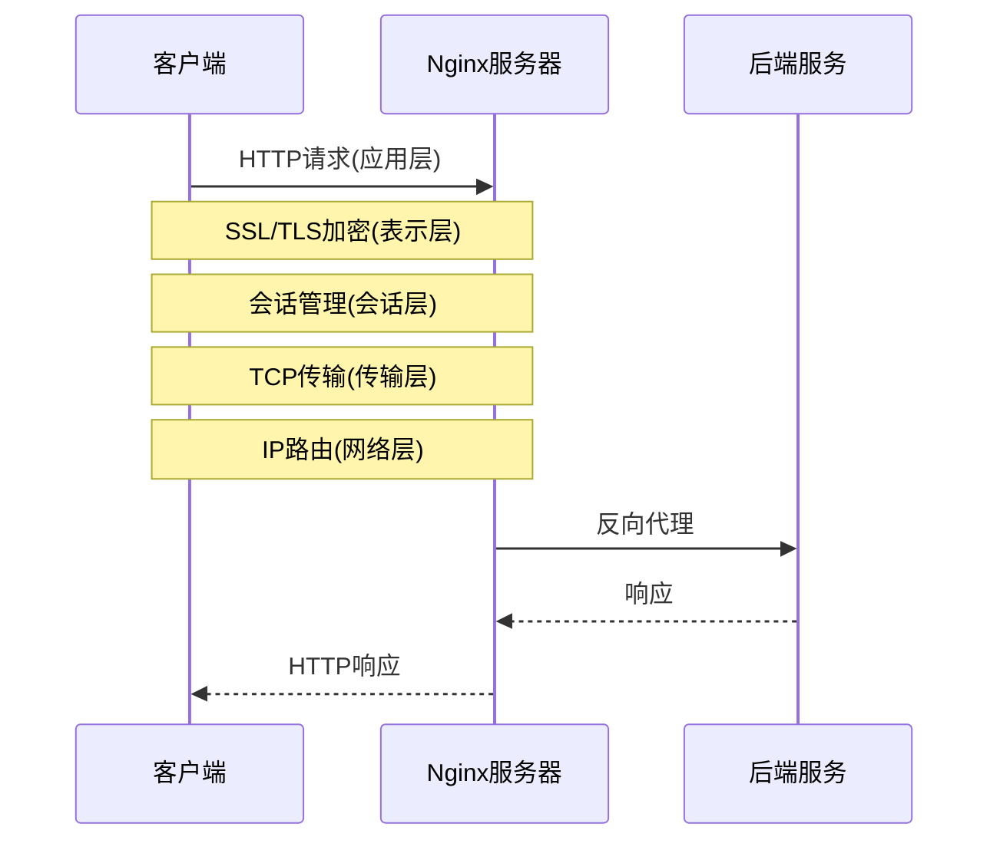
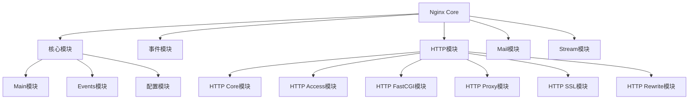
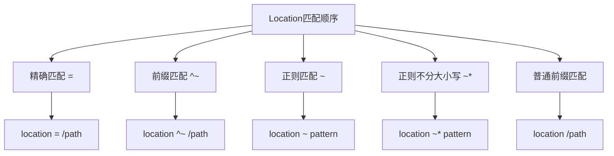

# Linux Web服务与Nginx深入剖析

## 课程目标

通过本课程您将掌握以下核心技能：

1. 深入理解Web服务架构
    * OSI七层模型与Web服务的关系
        - 应用层（HTTP/HTTPS）：用户数据传输
        - 表示层：数据加密、压缩
        - 会话层：会话管理
        - 传输层（TCP/UDP）：端到端连接
        - 网络层（IP）：路由和寻址
        - 数据链路层：错误检测和纠正
        - 物理层：比特流传输

    * HTTP/HTTPS协议原理
        - HTTP请求/响应模型
        - 常见状态码（2xx成功、3xx重定向、4xx客户端错误、5xx服务器错误）
        - HTTP请求方法（GET、POST、PUT、DELETE等）
        - HTTPS工作原理（SSL/TLS加密、证书验证）
        - HTTP/2特性（多路复用、服务器推送、头部压缩）

    * Web服务架构设计最佳实践
        - 前后端分离架构
        - 微服务架构
        - CDN加速
        - 缓存策略（浏览器缓存、服务器缓存）
        - 安全性考虑（WAF、DDoS防护）

2. 掌握Nginx核心功能与配置
    * Nginx模块化架构
        - 核心模块：处理配置文件和进程管理
        - 事件模块：处理网络连接
        - HTTP模块：处理HTTP请求
        - Mail模块：邮件代理
        - Stream模块：TCP/UDP代理

    * 核心配置指令
        - worker_processes：工作进程数
        - worker_connections：每个进程的最大连接数
        - keepalive_timeout：长连接超时时间
        - client_max_body_size：请求体大小限制
        - gzip：压缩配置

    * location匹配规则
        - 精确匹配：=
        - 优先匹配：^
        - 一般匹配：无符号
        - 正则匹配：~（区分大小写）和~*（不区分大小写）
        - 匹配优先级规则

## Web服务基础架构

### 1. OSI七层模型与Web服务

#### 1.1 OSI模型层级表
| 层级 | 名称 | 主要功能 | Web服务相关组件 |
|------|------|----------|----------------|
| 7 | 应用层 | 为应用提供网络服务 | Nginx, Apache |
| 6 | 表示层 | 数据格式转换、加密解密 | SSL/TLS |
| 5 | 会话层 | 建立、维护会话 | HTTP Keep-Alive |
| 4 | 传输层 | 端到端的可靠传输 | TCP |
| 3 | 网络层 | 路由和寻址 | IP |
| 2 | 数据链路层 | 相邻节点间的数据传输 | 以太网 |
| 1 | 物理层 | 比特流的传输 | 网线 |

#### 1.2 Web请求在OSI模型中的流程

1. 客户端(浏览器)向Nginx服务器发送HTTP请求，比如访问www.example.com。
2. 请求经过SSL/TLS加密确保传输安全，同时进行会话管理确认用户身份。
3. 数据通过TCP协议进行可靠传输，IP协议负责找到正确的服务器地址。
4. Nginx收到请求后通过反向代理转发给实际的后端服务器，后端处理完成后将结果返回给客户端。


### 2. Nginx架构深入解析

#### 2.0 Nginx基础概念

Nginx是一个高性能的开源Web服务器、反向代理服务器和负载均衡器。它具有以下核心特点：

1. **Web服务器功能**
   * 提供静态文件服务
   * 支持HTTP/HTTPS协议
   * 支持虚拟主机配置
   * 提供访问日志和错误日志

2. **反向代理能力**
   * 支持HTTP、HTTPS、TCP/UDP代理
   * 可以代理到后端应用服务器（如PHP、Java等）
   * 支持WebSocket代理
   * 提供缓存机制

3. **负载均衡**
   * 支持多种负载均衡算法（轮询、权重、IP哈希等）
   * 支持健康检查
   * 支持后端服务器的动态添加和删除
   * 提供会话保持功能

4. **高性能设计**
   * 采用事件驱动的异步非阻塞架构
   * 支持多进程和多线程模式
   * 内存占用小，并发能力强
   * 支持热部署，不中断服务

#### 2.1 Nginx模块化架构


1. Nginx Core是Nginx的核心部分，它包含了所有基础功能模块。
2. 核心模块(Main/Events/配置模块)负责Nginx的基础运行、事件处理和配置文件解析。
3. HTTP模块处理网站访问相关功能，包括核心处理、访问控制、FastCGI支持、代理功能、SSL加密和URL重写。
4. Mail模块和Stream模块分别用于处理邮件代理和TCP/UDP流量转发。

#### 2.2 核心模块功能表
| 模块类型 | 核心功能 | 常用配置指令 |
|----------|----------|-------------|
| HTTP Core | 处理HTTP请求 | server, location, root |
| HTTP Access | 访问控制 | allow, deny |
| HTTP FastCGI | FastCGI代理 | fastcgi_pass, fastcgi_param |
| HTTP Proxy | 反向代理 | proxy_pass, proxy_set_header |
| HTTP SSL | SSL/TLS支持 | ssl_certificate, ssl_protocols |
| HTTP Rewrite | URL重写 | rewrite, return |

### 3. Nginx配置详解

#### 3.1 主配置文件结构
```nginx
# /etc/nginx/nginx.conf

# 全局块
user www-data;
worker_processes auto;    # 工作进程数
pid /run/nginx.pid;       # PID文件路径

# events块
events {
    worker_connections 768;   # 每个工作进程的最大连接数
    multi_accept on;          # 尽可能多地接受请求
}

# http块
http {
    # 基础配置
    sendfile on;
    tcp_nopush on;
    tcp_nodelay on;
    keepalive_timeout 65;
    types_hash_max_size 2048;

    # MIME类型
    include /etc/nginx/mime.types;
    default_type application/octet-stream;

    # SSL配置
    ssl_protocols TLSv1.2 TLSv1.3;
    ssl_prefer_server_ciphers on;

    # 日志配置
    access_log /var/log/nginx/access.log;
    error_log /var/log/nginx/error.log;

    # 虚拟主机配置
    include /etc/nginx/conf.d/*.conf;
    include /etc/nginx/sites-enabled/*;
}
```

#### 3.2 Location匹配规则


匹配优先级说明：
1. `=` 精确匹配（最高优先级）
2. `^~` 前缀匹配（次高优先级）
3. `~` 和 `~*` 正则匹配（第三优先级）
4. 普通前缀匹配（最低优先级）

示例配置：
```nginx
# 精确匹配
location = / {
    # 只匹配 "/"
}

# 前缀匹配
location ^~ /images/ {
    # 匹配任何以 /images/ 开头的URL
}

# 正则匹配
location ~ \.(gif|jpg|png)$ {
    # 匹配以.gif、.jpg或.png结尾的URL
}

# 正则不分大小写
location ~* \.(pdf|doc)$ {
    # 匹配以.pdf或.doc结尾的URL，不区分大小写
}

# 普通前缀匹配
location /download/ {
    # 匹配任何以 /download/ 开头的URL
}
```

#### 3.3 多域名多端口配置
```nginx
# 多域名配置
server {
    listen 80;
    server_name example.com www.example.com;
    
    location / {
        root /var/www/example;
        index index.html;
    }
}

server {
    listen 80;
    server_name blog.example.com;
    
    location / {
        proxy_pass http://localhost:8080;
    }
}

# 多端口配置
server {
    listen 80;
    listen 443 ssl;
    server_name secure.example.com;
    
    ssl_certificate /etc/nginx/ssl/example.com.crt;
    ssl_certificate_key /etc/nginx/ssl/example.com.key;
    
    location / {
        root /var/www/secure;
        index index.html;
    }
}
```

### 4. 实践练习

#### 4.1 环境准备

1. **Windows系统配置域名解析**
   ```bash
   # 1. 以管理员身份打开记事本
   # 2. 打开文件：C:\Windows\System32\drivers\etc\hosts
   # 3. 添加以下内容：
   192.168.110.你尾号多少 touch.liujun.com
   192.168.110.你尾号多少 stars.liujun.com
   ```
   > 注意：每行前面的IP地址和域名之间使用空格分隔

2. **Ubuntu系统安装Nginx**
   ```bash
   # 更新软件包列表
   sudo apt update
   
   # 安装Nginx
   sudo apt install nginx -y
   
   # 检查Nginx状态
   sudo systemctl status nginx
   ```
   > 提示：如果看到绿色的「active (running)」表示安装成功

#### 4.2 配置两个项目的虚拟主机

1. **创建项目目录**
   ```bash
   # 创建网站根目录
   sudo mkdir -p /opt/nginx/touch.liujun.com
   sudo mkdir -p /opt/nginx/stars.liujun.com
   
   # 设置目录权限
   sudo chown -R nginx:nginx /opt/nginx/touch.liujun.com
   sudo chown -R nginx:nginx /opt/nginx/stars.liujun.com
   ```

2. **下载项目代码**
你们不能翻墙，我发给你们项目哈

   ```bash
   # 安装git工具
   sudo apt install git -y
   
   # 克隆项目代码
   cd /opt/nginx/touch.liujun.com
   git clone https://gitee.com/yinqi/Light-Year-Admin-Template.git .
   
   cd /opt/nginx/stars.liujun.com
   git clone https://github.com/wangyasai/Stars-Emmision .
   ```

3. **创建第一个站点配置文件并测试**
   ```bash
   # 创建配置文件
   sudo vim /etc/nginx/conf.d/touch.liujun.com.conf
   ```

   添加以下内容：
   ```nginx
   # touch.liujun.com 配置
   server {
       listen 80;                          # 监听80端口
       server_name touch.liujun.com;          # 设置域名
       
       root /opt/nginx/touch.liujun.com;       # 网站根目录
       index index.html;               # 默认首页
       
       # 基础访问日志，用于后续性能测试分析
       access_log /var/log/nginx/touch.liujun.com.access.log;
       error_log /var/log/nginx/touch.liujun.com.error.log;
       
       # 启用gzip压缩
       gzip on;
       gzip_types text/plain text/css application/javascript;
   }
   ```

   测试配置并访问：
   ```bash
   # 检查配置是否正确
   sudo nginx -t
   
   # 重新加载配置
   sudo nginx -s reload
   
   # 在浏览器中访问 http://touch.liujun.com
   # 如果能看到网页内容，说明配置成功！
   ```
   ```

4. **为第二个站点添加认证功能**
    ```bash
    # 安装htpasswd工具
    sudo apt install apache2-utils -y
    
    # 创建用户名和密码文件
    # -c：创建一个新文件，如果文件已存在会覆盖
    # 最后的admin是用户名，可以自定义
    # 执行后会提示输入密码，需要输入两次以确认
    sudo htpasswd -c /etc/nginx/.htpasswd admin
    ```

    创建第二个站点配置：
    ```bash
    sudo vim /etc/nginx/conf.d/stars.liujun.com.conf
    ```

    添加以下内容：
    ```nginx
    # stars.liujun.com 配置
    server {
        listen 80;                          # 监听80端口
        server_name stars.liujun.com;          # 设置域名
        
        root /opt/nginx/stars.liujun.com;       # 网站根目录
        index index.html;               # 默认首页
        
        access_log /var/log/nginx/stars.liujun.com.access.log;  # 访问日志
        error_log /var/log/nginx/stars.liujun.com.error.log;    # 错误日志
        
        # 开启gzip压缩
        gzip on;
        gzip_types text/plain text/css application/javascript;
        
        # 添加访问认证
        auth_basic "请输入用户名和密码";
        auth_basic_user_file /etc/nginx/.htpasswd;
    }
    ```

    测试认证功能：
    ```bash
    # 检查配置
    sudo nginx -t
    
    # 重新加载配置
    sudo nginx -s reload
    
    # 在浏览器中访问 http://stars.liujun.com
    # 这时应该会弹出登录框
    # 输入刚才创建的用户名和密码，验证是否能成功访问
    ```

5. **检查并重载配置**
   ```bash
   # 由于配置文件直接放在conf.d目录下，所以会自动启用
   
   # Nginx常用命令说明
   # -t：测试配置文件语法是否正确
   sudo nginx -t
   
   # -s 发送信号给主进程：
   # stop：快速关闭
   # quit：优雅关闭
   # reload：重新加载配置文件
   # reopen：重新打开日志文件
   sudo nginx -s reload
   
   # -V：查看编译参数
   sudo nginx -V
   
   # -c：指定配置文件
   # sudo nginx -c /path/to/nginx.conf
   ```

#### 4.3 测试访问

1. **在浏览器中访问**
   - 打开浏览器，访问 http://touch.test.com
   - 输入用户名：admin 和之前设置的密码
   - 访问 http://stars.test.com

2. **常见问题排查**
   ```bash
   # 查看Nginx状态
   sudo systemctl status nginx
   
   # 查看错误日志
   sudo tail -f /var/log/nginx/error.log
   
   # 查看访问日志
   sudo tail -f /var/log/nginx/access.log
   ```

#### 4.4 性能测试与优化实践

1. **修改主配置文件**
   ```bash
   sudo vim /etc/nginx/nginx.conf
   ```
   
   在http块中添加以下配置：
   ```nginx
   # 全局性能参数
   worker_processes 1;           # 降低工作进程数
   worker_connections 100;       # 限制连接数
   keepalive_timeout 5;          # 降低长连接超时
   
   # 开启gzip压缩（先不开启，用于对比）
   #gzip on;
   #gzip_types text/plain text/css application/javascript application/json;
   #gzip_min_length 1000;        # 小文件不压缩
   #gzip_comp_level 6;           # 压缩级别
   ```

2. **安装压测工具**
   ```bash
   sudo apt install apache2-utils -y
   ```

3. **体验Gzip压缩效果**
   - 打开浏览器F12开发者工具，切换到Network标签
   - 访问你的网站，观察JS、CSS等文件的大小
   - 记录下当前文件大小，例如：`app.js: 156KB`
   
   现在启用Gzip：
   ```bash
   # 取消nginx.conf中gzip相关配置的注释
   sudo vim /etc/nginx/nginx.conf
   
   # 重新加载配置
   sudo nginx -s reload
   ```
   
   再次观察文件大小，你会发现文件明显变小了！

4. **压力测试体验**
   ```bash
   # 测试首页响应
   ab -n 1000 -c 100 http://你的域名/
   ```
   
   当前配置下可能会看到错误。以下是面试必考的HTTP状态码（必须背诵）：

   | 状态码 | 类型 | 含义 | 典型场景 | 面试重点 |
   |--------|------|------|----------|----------|
   | 200 | 成功 | 请求成功完成 | 正常访问网页、接口调用成功 | 最基础的成功响应 |
   | 301 | 永久重定向 | 资源永久移动到新位置 | 网站改版、域名迁移 | 与302的区别：浏览器会缓存新地址 |
   | 302 | 临时重定向 | 资源临时移动到新位置 | 临时活动页面、A/B测试 | 与301的区别：不会缓存新地址 |
   | 403 | 禁止访问 | 服务器拒绝请求 | 未授权访问、IP被封禁 | 与401的区别：401是未认证，403是未授权 |
   | 404 | 未找到 | 请求的资源不存在 | 链接失效、路径错误 | 需要区分后端返回和Nginx配置导致的404 |
   | 500 | 服务器错误 | 服务器内部错误 | 代码异常、服务器崩溃 | 最常见的服务器端错误，需要查看错误日志 |
   | 502 | 网关错误 | 网关从上游服务器收到无效响应 | 后端服务崩溃、负载均衡配置错误 | Nginx作为反向代理时最常见的错误 |
   | 503 | 服务不可用 | 服务器暂时无法处理请求 | 服务器维护、资源耗尽 | 通常是临时性的，与502的区别是服务器主动拒绝 |
   | 504 | 网关超时 | 网关等待上游服务器响应超时 | 后端处理太慢、网络延迟 | 需要检查upstream配置的超时设置 |
   
   > 注意：当前配置下性能较差是正常的，这为后续优化课程做铺垫。记住这些问题出现的位置，我们在优化课程中会一一解决它们。

### 5. 性能优化

#### 5.1 Nginx优化参数
| 参数 | 说明 | 优化建议 |
|------|------|----------|
| worker_processes | 工作进程数 | 设置为CPU核心数 |
| worker_connections | 最大连接数 | 根据内存调整，一般10000-100000 |
| keepalive_timeout | 长连接超时 | 根据业务需求，一般60-120s |
| client_max_body_size | 请求体大小限制 | 根据业务需求设置 |

#### 5.2 系统优化

> 初学者必读：`tee` 命令是Linux中的一个很实用的命令，它能将输入同时写入文件和显示到屏幕上。就像一个"T"形管道，一个输入可以输出到两个地方。使用 `sudo tee` 的原因是我们需要管理员权限来修改系统配置文件。

以下是系统优化参数的配置，每个参数都很重要：

```bash
# 下面我们要使用一个特殊的语法来输入多行内容
# <<EOF 是Linux中的Here Document（嵌入文档）语法
# 它允许我们一次性输入多行文本，直到遇到EOF标记才结束
# 相当于我们打开了一个"输入模式"，可以方便地输入多行配置
# 最后的EOF标记告诉系统："好了，我要输入的内容到此结束"

# 使用tee命令写入系统配置，同时在屏幕上显示
sudo tee /etc/sysctl.conf <<EOF  # 开始多行输入模式
# 增加TCP连接队列长度，提高并发连接数
net.core.somaxconn = 32768                  # 默认值128，增加到32768允许更多等待连接

# 增加SYN队列长度，防止高并发时丢包
net.ipv4.tcp_max_syn_backlog = 16384        # 默认值1024，增加到16384减少连接建立时丢包

# 增加网卡数据包队列长度，提高网络性能
net.core.netdev_max_backlog = 16384         # 默认值1000，增加到16384减少网络拥塞

# 减少TIME_WAIT状态时间，快速释放端口
net.ipv4.tcp_fin_timeout = 20               # 默认值60秒，减少到20秒加快端口复用
EOF  # 结束多行输入模式

# 使新配置生效
sudo sysctl -p
```

> 小贴士：为什么要用 `<<EOF` 而不是多次使用 `echo` 命令？
> 1. 更清晰：所有配置都在一个代码块中，便于阅读和修改
> 2. 更高效：一次性写入多行，不需要多次执行命令
> 3. 更安全：避免多次写入可能带来的文件锁定问题
> 4. 更专业：这是Linux系统管理中的常用技巧

这些优化的好处：
1. 提高并发能力：可以同时处理更多的连接请求
2. 减少丢包：高并发场景下不容易丢失连接请求
3. 提高吞吐量：网卡可以缓存更多数据包
4. 节省资源：连接状态保持时间更合理

> 提示：这些参数的具体值需要根据服务器硬件配置和业务需求来调整，上述配置适合中小型网站使用。

### 6. 监控与排错

#### 6.1 监控指标 - 未来要学习的

以下是运维工作中最常见的监控指标，建议设置到监控面板中：

| 监控类型 | 监控指标 | 说明 | 建议阈值 | 告警级别 |
|---------|---------|------|----------|----------|
| 性能监控 | 请求延迟 | 从收到请求到返回响应的时间 | >500ms | 警告 |
| | 并发连接数 | 同时连接到服务器的连接数 | >1000 | 警告 |
| | 请求成功率 | (成功请求数/总请求数)×100% | <99% | 严重 |
| | 带宽使用率 | 当前带宽使用量/总带宽×100% | >80% | 警告 |
| 健康检查 | 后端服务状态 | 后端服务是否正常响应 | 异常 | 严重 |
| | 证书有效期 | SSL证书剩余有效天数 | <30天 | 警告 |
| | 配置一致性 | 多节点配置文件是否一致 | 不一致 | 严重 |
| | 资源使用率 | CPU、内存、磁盘使用率 | >85% | 警告 |

> 运维小贴士：
> 1. 建议使用Prometheus + Grafana搭建监控系统
> 2. 合理设置告警阈值，避免误报和漏报
> 3. 针对不同级别告警制定响应流程
> 4. 定期进行告警演练，确保流程有效

#### 6.2 日志分析

1. 配置Nginx日志

> **重要提示：** 在实际生产环境中，尤其是在Kubernetes（k8s）集群中运行Nginx时，我们通常不会直接登录服务器查看日志。相反，我们会将日志集成到集中式日志系统（如ELK Stack、Loki等）中进行统一管理和分析。

```bash
# 编辑Nginx主配置文件，添加JSON格式的日志定义
sudo vim /etc/nginx/nginx.conf

# 在http块中添加以下日志格式定义
http {
    # 定义JSON格式的日志
    log_format json_combined escape=json '{"time_local":"$time_local", "remote_addr":"$remote_addr", "host":"$host", "request":"$request", "status":"$status", "body_bytes_sent":"$body_bytes_sent", "http_referer":"$http_referer", "http_user_agent":"$http_user_agent", "http_x_forwarded_for":"$http_x_forwarded_for", "request_time":"$request_time", "upstream_response_time":"$upstream_response_time"}'; # 注意最后的分号
    # ... 其他配置 ...
}
```

编辑站点配置文件：
```bash
sudo vim /etc/nginx/conf.d/touch.liujun.com.conf
```

在server块中添加以下配置：
```nginx
# 访问日志配置（使用JSON格式）
access_log /var/log/nginx/touch.liujun.com.access.log json_combined;  # 使用JSON格式记录访问日志
error_log /var/log/nginx/touch.liujun.com.error.log warn;            # 记录warn及以上级别的错误
```

> **日志系统集成说明：**
> 1. **ELK Stack集成**
>    - Elasticsearch：存储和索引日志
>    - Logstash：收集和处理日志
>    - Kibana：可视化和分析日志
>    - Filebeat：轻量级日志采集器，安装在Nginx所在节点
> 
> 2. **Loki集成（Grafana生态）**
>    - Promtail：日志采集器
>    - Loki：日志聚合器
>    - Grafana：可视化界面
> 
> 3. **日志系统优势**
>    - 集中管理：所有服务器的日志统一收集
>    - 实时分析：支持复杂查询和告警
>    - 可视化：直观的数据展示
>    - 高可用：日志持久化存储
>    - 权限控制：基于角色的访问控制

2. 常用日志分析命令

```bash
# 分析访问日志中访问最频繁的IP地址（TOP 10）
# 使用场景：发现可能的爬虫或攻击行为
# 让我们一步步解析这个命令：
# 1. awk '{print $1}' - 从每行中提取第一列（IP地址）
#    - awk 是一个文本处理工具
#    - {print $1} 表示打印每行的第一个字段
# 2. sort - 对IP地址进行排序
#    - 将相同的IP地址排在一起，方便后续统计
# 3. uniq -c - 统计每个IP出现的次数
#    - -c 参数表示在每行前加上该行重复出现的次数
# 4. sort -nr - 按数字大小逆序排序
#    - -n 表示按数字排序（默认是按字符串）
#    - -r 表示逆序（从大到小）
# 5. head -n 10 - 只显示前10行
awk '{print $1}' /var/log/nginx/touch.liujun.com.access.log | sort | uniq -c | sort -nr | head -n 10

# 实时监控错误日志（按Ctrl+C退出）
# 使用场景：实时排查网站故障
# tail -f 会持续显示文件末尾的内容
# 当有新的错误日志写入时，会立即显示
tail -f /var/log/nginx/touch.liujun.com.error.log

# 统计所有请求的响应时间分布
# 使用场景：分析网站性能，发现慢请求
# 1. awk '{print $NF}' - 提取每行的最后一个字段（响应时间）
#    - $NF 表示最后一个字段（NF = Number of Fields）
# 2. sort -n - 按数字大小排序响应时间
# 3. uniq -c - 统计每个响应时间出现的次数
awk '{print $NF}' /var/log/nginx/touch.liujun.com.access.log | sort -n | uniq -c
```

> 运维小贴士：
> 1. 日志分析最佳实践：
>    - 为每个站点使用独立的日志文件
>    - 定期进行日志切割（使用logrotate）
>    - 重要日志异地备份
>    - 设置合适的日志级别
> 2. 日志分析工具推荐：
>    - ELK Stack：企业级日志分析平台
>    - GoAccess：轻量级实时日志分析器
>    - AWStats：生成访问统计报告

> 小贴士：这些命令组合起来使用非常强大，它们是Linux文本处理的基础工具：
> - `awk`: 强大的文本分析工具，可以提取和处理文本中的数据
> - `sort`: 排序工具，可以按不同方式（字母顺序、数字大小等）排序
> - `uniq`: 去重工具，通常和sort配合使用来统计重复次数
> - `head/tail`: 查看文件的开头/结尾部分，-f 参数可以实时监控文件变化

### 7. 安全配置

#### 7.1 基础安全配置
```nginx
# 隐藏版本号
server_tokens off;

# 配置安全头部
add_header X-Frame-Options "SAMEORIGIN";
add_header X-Content-Type-Options "nosniff";
add_header X-XSS-Protection "1; mode=block";

# 限制请求方法
if ($request_method !~ ^(GET|HEAD|POST)$) {
    return 444;
}
```

#### 7.2 配置HTTPS

在生产环境中，HTTPS证书有两种获取方式：
1. 购买SSL证书（推荐用于生产环境）
   - 从阿里云、腾讯云等云服务商购买
   - 价格从几百到几千不等，根据证书类型和年限决定
   - 优点是更专业、有客服支持、更可靠
   - 适合正式的企业网站和商业应用

2. 使用免费证书（适合测试和个人网站）
   - Let's Encrypt提供免费证书
   - 有效期3个月，需要定期更新
   - 可以使用certbot工具自动续期

实验环境配置HTTPS（以touch.liujun.com为例）：

1. 生成自签名证书（仅用于测试）
```bash
# 创建证书目录
sudo mkdir -p /etc/nginx/ssl/touch.liujun.com

# 生成自签名证书
sudo openssl req -x509 -nodes -days 365 -newkey rsa:2048 \
-keyout /etc/nginx/ssl/touch.liujun.com/private.key \
-out /etc/nginx/ssl/touch.liujun.com/certificate.crt \
-subj "/CN=touch.liujun.com"
```

2. 修改Nginx配置文件
```bash
# 编辑站点配置文件
sudo vim /etc/nginx/conf.d/touch.liujun.com.conf
```

3. 添加HTTPS配置
```nginx
# HTTPS server
server {
    listen 443 ssl;
    server_name touch.liujun.com;
    
    # 证书文件路径
    ssl_certificate /etc/nginx/ssl/touch.liujun.com/certificate.crt;
    ssl_certificate_key /etc/nginx/ssl/touch.liujun.com/private.key;
    
    # SSL优化配置
    ssl_protocols TLSv1.2 TLSv1.3;                     # 只允许TLS1.2和1.3协议，禁用不安全的老版本
    ssl_ciphers ECDHE-ECDSA-AES128-GCM-SHA256:ECDHE-RSA-AES128-GCM-SHA256;  # 使用强加密套件
    ssl_prefer_server_ciphers on;                      # 优先使用服务器的加密套件
    ssl_session_cache shared:SSL:10m;                  # SSL会话缓存，提高性能
    ssl_session_timeout 10m;                           # 缓存会话的超时时间
    ssl_stapling on;                                   # 启用OCSP Stapling
    ssl_stapling_verify on;                           # 验证OCSP响应
    
    # 站点配置
    root /opt/nginx/touch.liujun.com;
    index index.html;
    
    # location / 匹配所有请求
    location / {
        # try_files指令会按顺序尝试查找文件
        # $uri：尝试访问请求的原始URI对应的文件
        # $uri/：如果原始URI不存在，则尝试将其作为目录来访问
        # =404：如果前面都没找到，则返回404错误
        # 例如：访问 /about.html 时的查找顺序：
        # 1. 先找 /opt/nginx/touch.liujun.com/about.html 文件
        # 2. 再找 /opt/nginx/touch.liujun.com/about.html/ 目录
        # 3. 都找不到则返回404错误
        try_files $uri $uri/ =404;
    }
}

# 将HTTP请求重定向到HTTPS
server {
    listen 80;
    server_name touch.liujun.com;
    return 301 https://$server_name$request_uri;
}
```

4. 测试配置并重启Nginx
```bash
# 测试配置是否正确
sudo nginx -t

# 如果测试通过，重新加载配置
sudo nginx -s reload
```

5. 访问测试
- 在浏览器中访问 https://touch.liujun.com
- 因为是自签名证书，浏览器会显示警告，这是正常的
- 在生产环境中使用正式证书则不会有警告

> 重要提示：
> 1. 自签名证书仅用于开发测试，生产环境必须使用正式证书
> 2. 生产环境建议：
>    - 购买正规SSL证书（1-2年）
>    - 定期检查证书有效期
>    - 配置自动更新机制
>    - 使用SSL Labs测试网站安全性
> 3. 安全建议：
>    - 定期更新Nginx版本
>    - 及时修复已知的安全漏洞
>    - 定期进行安全扫描

