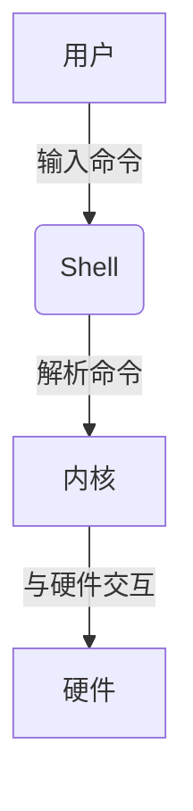

# Linux基础与常用命令入门

## 一、教学目标
1. 掌握Linux命令行的基础操作，包括命令格式、基本语法和快捷技巧。
2. 理解并熟练使用mount命令进行挂载操作，能够挂载并访问不同的设备。
3. 掌握Linux目录与文件管理的基本命令及其用法。
4. 学会使用通配符处理不确定的文件名，提高文件操作效率。
5. 掌握别名的定义和使用方法，优化命令行操作。
6. 深入学习grep命令的高级用法，能够高效搜索和处理文本内容。
7. 通过案例学习和实操，增强命令行操作的实际应用能力。
8. 通过课后练习巩固所学内容，提升Linux命令行基础技能。


## 二、课程大纲
* 命令行基础：命令格式、语法与快捷技巧
* 挂载操作：mount命令及光盘设备挂载
* 目录与文件管理：创建、删除、移动、复制文件与目录
* 通配符使用：处理不确定文件名的技巧
* 别名的定义：定义、使用与删除别名
* grep命令：高级用法与文本处理
* 案例学习：命令行技巧、挂载光盘、文件操作、文本处理
* 课后练习：巩固学习内容与复习昨日知识


## 1. 课程回顾

| **序号** | **问题**                             | **答案**                                                   |
|----------|--------------------------------------|-----------------------------------------------------------|
| 1        | `/`与`/dev`的主要作用是什么？         | `/`：Linux系统的起点，所有数据都在此目录下；`/dev`：储存设备相关的数据 |
| 2        | Linux中第四块SCSI磁盘如何表示？       | `/dev/sdd`                                                |
| 3        | 查看文本文件内容的命令是？           | `cat`、`less`                                             |
| 4        | 查看目录内容的命令是？               | `ls`                                                      |
| 5        | 查看主机名的命令是？                 | `hostname`                                                |
| 6        | 查看IP地址的命令是？                 | `ifconfig`                                                |
| 7        | 切换到`/dev`目录的命令是？           | `cd /dev`                                                 |
| 8        | 显示当前位置的命令是？               | `pwd`                                                     |
| 9        | 查看CPU信息的命令是？                | `lscpu`                                                   |
| 10       | 查看内存信息的命令是？               | `cat /proc/meminfo`                                       |
| 11       | 查看`/boot`目录内容的命令是？        | `ls /boot`                                                |
| 12       | 查看`/etc/passwd`文件前两行的命令是？ | `head -2 /etc/passwd`                                     |
| 13       | 查看`/etc/passwd`中包含`root`的行？  | `grep root /etc/passwd`                                   |


## 2. 命令行基础
> 温馨提示: 学习以下内容，请在先输入 `sudo su -`  切换到超级用户，进行学习

### Linux命令行基本操作
* Linux手册大全：https://www.linuxcool.com/
* 菜鸟Linux命令手册大全：https://www.runoob.com/linux/linux-command-manual.html

### 2.1 Linux命令的执行流程
在Linux中，执行大多数命令时，都需要找到命令所对应的程序。以下是命令执行的基本流程：
1. 用户输入命令。
2. 解释器（默认是/bin/bash）接收命令并解析。
3. 内核根据命令请求与硬件交互，完成操作。



### 2.2 查询命令对应的程序路径
| **命令**           | **解释**                                                      |
|---------------------|--------------------------------------------------------------|
| `which hostname`    | 查询 `hostname` 命令对应的程序路径，如：`/usr/bin/hostname`   |
| `which ifconfig`    | 查询 `ifconfig` 命令对应的程序路径，如：`/usr/sbin/ifconfig`  |
| `which firefox`     | 查询 `firefox` 命令对应的程序路径，如：`/usr/bin/firefox`     |

#### 示例：
```bash
[root@localhost /]# hostname
[root@localhost /]# which hostname
/usr/bin/hostname
[root@localhost /]# which ifconfig
/usr/sbin/ifconfig
[root@localhost /]# firefox
[root@localhost /]# which firefox
/usr/bin/firefox

```

### 2.3 命令行的完整格式
Linux命令的完整格式为：

**命令 [选项]… [参数1] [参数2]…**

* 命令：要执行的操作，比如ls、cat。
* 选项：对命令行为的修饰，比如-l表示长格式显示。
* 参数：命令的目标，比如文件或目录的路径。

**示例：**

```bash
[root@localhost /]# cat --help           # 查看命令帮助信息
[root@localhost /]# cat -n /etc/passwd  # 显示文件内容并添加行号
[root@localhost /]# ls -l /etc/passwd   # 以长格式显示文件详细信息

```

### 2.4 常用命令示例
| 命令 | 功能                     | 示例                          |
|------|--------------------------|-------------------------------|
| cat  | 查看文件内容             | `cat -n /etc/passwd`          |
| ls   | 列出目录内容             | `ls -l /etc/shadow`           |
| ls -l| 以长格式显示目录内容     | `ls -l /root`                 |
| ls /etc/sysconfig/network-scripts/ | 查看网络配置脚本所在目录的内容 | `ls /etc/sysconfig/network-scripts/` |

### 2.5 Tab键的自动补全功能
Tab键可以自动补全命令、选项、参数、文件路径等，极大提高输入效率。

| 操作                                   | 解释                                    |
|----------------------------------------|-----------------------------------------|
| `if(tab)`                              | 列出所有以 `if` 开头的命令              |
| `ifco(tab)`                            | 自动补全为 `ifconfig`                   |
| `cat /etc/re(tab)`                     | 自动补全为 `cat /etc/redhat-release`    |
| `ls /et(tab)/sysco(tab)/netw(tab)- (tab)` | 自动补全为 `ls /etc/sysconfig/network-scripts/` |


**示例：**

```bash
[root@localhost /]# if(tab)        # 列出所有以if开头的命令
[root@localhost /]# ifco(tab)     # 自动补全为ifconfig
[root@localhost /]# cat /etc/re(tab) (tab)  # 自动补全为cat /etc/redhat-release
[root@localhost /]# ls /etc/sysconfig/network-scripts/

```

### 2.6 快捷键操作
Linux命令行支持多种快捷键操作，能够快速完成常见任务。

| 快捷键        | 功能                             |
|---------------|----------------------------------|
| `Ctrl + C`    | 结束正在运行的命令               |
| `Ctrl + L`    | 清空整个屏幕                     |
| `Ctrl + U`    | 从光标处清空至行首               |
| `Ctrl + K`    | 从光标处清空至行尾               |
| `Ctrl + W`    | 往回删除一个单词（以空格界定）   |
| `Home`键      | 从光标处快速移动到行首           |
| `End`键       | 从光标处快速移动到行尾           |
| `Esc + .` 或 `Alt + .` | 粘贴上一个命令的参数     |

**快捷键示例：**
```bash
[root@localhost ~]# ls /etc/hosts
[root@localhost ~]# ls -l Alt + .       # 粘贴上一个命令的参数，变为：ls -l /etc/hosts
[root@localhost ~]# cat Alt + .         # 粘贴上一个命令的参数，变为：cat /etc/hosts
[root@localhost ~]# cat -n Alt + .      # 粘贴上一个命令的参数，变为：cat -n /etc/hosts

```

### 2.7 总结
1. 命令执行依赖解释器：Linux中用户输入的命令会通过解释器解析并执行。
2. 命令查询工具：使用which命令可以查询命令对应的程序路径。
3. 命令格式：命令 [选项]… [参数1] [参数2]…，记住选项和参数的作用。
4. 自动补全与快捷键：利用Tab键自动补全命令和路径，熟练使用快捷键提高效率。

## 3. 挂载操作（mount）
### 3.1 思路引入
在Linux系统中，光盘镜像文件（ISO文件）通常包含软件包或安装文件。为了访问光盘内容，我们需要通过挂载操作，将光盘镜像文件与系统中的一个目录关联起来。

### 3.2 挂载的基本概念
1. 挂载（Mount）：
    * 挂载是指将一个设备（如光盘、硬盘或镜像文件）与系统中的一个目录关联。
    * 挂载后，用户可以通过该目录访问设备中的内容。

2. 挂载点：
    * 挂载点是访问设备内容的入口，通常是一个空目录。
    * 例如，将光盘挂载到/mnt/cdrom目录后，用户可以通过访问/mnt/cdrom来查看光盘内容。

3. 卸载（Umount）：
    * 卸载是指断开设备与挂载点的关联。


### 3.4 挂载光盘操作步骤

#### 3.4.1 查看光驱设备
在Linux系统中，光盘设备通常表示为/dev/cdrom或/dev/sr0。我们可以通过以下命令查看光驱设备：
```bash
$ ls -l /dev/cdrom

```
**示例输出：**

```bash
lrwxrwxrwx. 1 root root 3 6月  22 10:00 /dev/cdrom -> sr0

```

**说明：**
* /dev/cdrom是光驱设备的符号链接，指向/dev/sr0。
* /dev/sr0是真正的光驱设备文件。 

#### 3.4.2 创建挂载点
挂载点是一个空目录，推荐用户自行创建。例如创建一个目录/mnt/cdrom作为挂载点：
```bash
$ sudo mkdir /mnt/cdrom

```

#### 3.4.3 挂载光盘
```bash
$ sudo mount /dev/cdrom /mnt/cdrom

```

**说明：**

* /dev/cdrom：光驱设备文件。
* /mnt/cdrom：挂载点目录。

挂载成功后，可以通过ls命令查看光盘内容：

```bash
$ ls /mnt/cdrom

```

#### 3.4.4 卸载光盘
当不再需要访问光盘时，可以使用umount命令卸载光盘：
```bash
$ sudo umount /mnt/cdrom
```

卸载成功后，/mnt/cdrom目录将变为空。

### 3.3 挂载光盘命令总结
以下是挂载光盘操作中常用的命令：

| **命令**                  | **功能**                              |
|---------------------------|---------------------------------------|
| `ls -l /dev/cdrom`        | 查看光驱设备文件                     |
| `mkdir /mnt/cdrom`        | 创建挂载点目录                       |
| `mount /dev/cdrom /mnt/cdrom` | 挂载光盘到挂载点                  |
| `mount -o loop 文件路径 挂载点` | 挂载ISO镜像文件                   |
| `ls /mnt/cdrom`           | 查看挂载点内容                       |
| `umount /mnt/cdrom`       | 卸载光盘或ISO镜像                   |


### 3.5 mount命令详解
mount命令的基本语法如下：

```bash
mount [选项] 设备文件 挂载点

```

### 3.7 练习操作示例
以下是挂载光盘的完整操作流程：
```bash
# 1. 查看光驱设备
$ ls -l /dev/cdrom

# 2. 创建挂载点
$ sudo mkdir /mnt/cdrom

# 3. 挂载光盘
$ sudo mount /dev/cdrom /mnt/cdrom

# 4. 查看光盘内容
$ ls /mnt/cdrom

# 5. 卸载光盘
$ sudo umount /mnt/cdrom

```

## 4. 目录与文件管理

1. cd命令: 用于切换目录.  [教学链接](https://www.linuxcool.com/cd)
2. ls命令: 用于列出目录内容. [教学链接](https://www.linuxcool.com/ls)
3. mkdir命令: 用于创建目录. [教学链接](https://www.linuxcool.com/mkdir)
4. rm命令: 用于删除文件或目录.  [教学链接](https://www.linuxcool.com/rm)
5. mv命令: 用于移动或重命名文件或目录. [教学链接](https://www.linuxcool.com/mv)
6. cp命令: 用于复制文件或目录. [教学链接](https://www.linuxcool.com/cp)

### ls 高级用法(选学)
通配符使用，针对不确定的文档名称，以特殊字符表示
#### *：任意多个任意字符
```bash
[root@localhost /]# ls /root/a*            # 列出 /root 目录下以 "a" 开头的所有文件或目录
[root@localhost /]# ls /boot/vm*           # 列出 /boot 目录下以 "vm" 开头的所有文件或目录
[root@localhost /]# ls /etc/*tab           # 列出 /etc 目录下以任意字符开头、以 "tab" 结尾的所有文件
[root@localhost /]# ls /etc/*.conf         # 列出 /etc 目录下以 ".conf" 结尾的所有文件
[root@localhost /]# ls /etc/re*.conf       # 列出 /etc 目录下以 "re" 开头、以 ".conf" 结尾的所有文件
[root@localhost /]# ls /dev/tty*           # 列出 /dev 目录下以 "tty" 开头的所有文件或目录
[root@localhost /]# ls -d /etc/r*          # 列出 /etc 目录下以 "r" 开头的所有目录（`-d` 只显示目录本身，不显示其内容）
[root@localhost /]# ls -d /etc/*as*        # 列出 /etc 目录下名称中包含 "as" 的所有目录（`-d` 只显示目录本身，不显示其内容）

```

#### ?：单个字符（必须要有一个）
```bash
[root@localhost /]# ls /etc/??tab       # 列出 /etc/ 目录下以任意两个字符开头、后接 "tab" 的文件，如 fstab、rwtab
[root@localhost /]# ls /dev/tty?        # 列出 /dev/ 目录下以 tty 开头、后接任意一个字符的文件，如 tty1、tty2、ttya
[root@localhost /]# ls /dev/tty??       # 列出 /dev/ 目录下以 tty 开头、后接任意两个字符的文件，如 tty10、tty11、ttyab

```

#### [a-z]:多个字符或连续范围中的一个，若无则忽略
```bash
[root@localhost /]# ls /dev/tty[3-9]      # 列出 /dev/tty3 到 /dev/tty9 的文件
[root@localhost /]# ls /dev/tty[1-7]      # 列出 /dev/tty1 到 /dev/tty7 的文件
[root@localhost /]# ls /dev/tty{1,17,20}  # 列出 /dev/tty1、/dev/tty17 和 /dev/tty20 的文件
[root@localhost /]# ls /dev/tty{10,18,22,33} # 列出 /dev/tty10、/dev/tty18、/dev/tty22 和 /dev/tty33 的文件
[root@localhost /]# ls /dev/tty{26,19,21,30,40} # 列出 /dev/tty26、/dev/tty19、/dev/tty21、/dev/tty30 和 /dev/tty40 的文件
[root@localhost /]# ls /etc/{rw,fs}tab    # 列出 /etc/rwtab 和 /etc/fstab 的文件

```


## 5. 重点 grep命令与高级使用
**day3 最重要的内容**
grep 是 Linux 系统中非常常用的文本搜索工具，用于在文件中查找符合条件的字符串。它的全称是 Global Regular Expression Print，支持正则表达式匹配。

### 基本格式
```bash
grep 参数 文件名
原文链接：
```

### 常用参数
| 选项 | 描述                                   |
|------|----------------------------------------|
| -b   | 显示匹配行距文件头部的偏移量          |
| -c   | 只显示匹配的行数                       |
| -E   | 支持扩展正则表达式                    |
| -F   | 匹配固定字符串的内容                  |
| -h   | 搜索多文件时不显示文件名              |
| -i   | 忽略关键词大小写                      |
| -l   | 只显示符合匹配条件的文件名            |
| -o   | 显示匹配词距文件头部的偏移量          |
| -q   | 静默执行模式                          |
| -r   | 递归搜索模式                          |
| -s   | 不显示没有匹配文本的错误信息          |
| -v   | 显示不包含匹配文本的所有行            |
| -w   | 精准匹配整词                          |
| -x   | 精准匹配整行                          |
| -n   | 显示所有匹配行及其行号                |

### Grep命令的基本用法
#### 1. 基础匹配
```bash
grep root /etc/passwd   # 查找包含字符串 "root" 的行
grep bash /etc/passwd   # 查找包含字符串 "bash" 的行
grep lisi /etc/passwd   # 查找包含字符串 "lisi" 的行

```

#### 2. 反向匹配
```bash
grep -v root /etc/passwd   # 查找不包含字符串 "root" 的行

```

#### 3. 忽略大小写
```bash
grep -i ROOT /etc/passwd   # 查找包含字符串 "root"（忽略大小写）的行

```

### Grep命令的高级用法
#### 1. 使用正则表达式

**示例：**

```bash
grep ^root /etc/passwd      # 查找以 "root" 开头的行
grep root$ /etc/passwd      # 查找以 "root" 结尾的行
grep ^$ /etc/default/useradd # 查找空行
grep -v ^$ /etc/default/useradd # 查找非空行

```

#### 2. 递归搜索
```bash
grep -r 'root' /etc/         # 在 /etc/ 目录及其子目录中查找包含 "root" 的文件
```

#### 3. 统计匹配行数
```bash
grep -c root /etc/passwd     # 统计文件中包含 "root" 的行数

```

#### 4. 显示行号
```bash
grep -n root /etc/passwd     # 查找包含 "root" 的行，并显示行号

```

#### 5. 精确匹配单词
```bash
grep -w root /etc/passwd     # 仅匹配整个单词 "root"
```

#### 6. 同时搜索多个模式
```bash
grep -E 'root|bash' /etc/passwd  # 查找包含 "root" 或 "bash" 的行
```

#### 7. 搜索多个文件
```bash
grep root /etc/passwd /etc/group  # 在多个文件中查找 "root"

```

### 六、练习题
以下练习题可以帮助熟悉 grep 命令的使用。

#### 基础练习
1. 查找 /etc/passwd 文件中包含字符串 nologin 的行。
2. 查找 /etc/passwd 文件中以 root 开头的行。
3. 查找 /etc/passwd 文件中以 bash 结尾的行。
4. 查找 /etc/login.defs 文件中所有空行。
5. 查找 /etc/passwd 文件中不包含字符串 bash 的行。

#### 进阶练习
6. 在 /var/log 目录中递归查找包含字符串 error 的文件。
7. 统计 /etc/passwd 文件中包含字符串 root 的行数。
8. 查找 /etc/passwd 文件中忽略大小写匹配字符串 ROOT 的行。
9. 查找 /etc/passwd 文件中包含单词 nologin 的行。
10. 查找 /etc/passwd 文件中同时包含字符串 root 和 bash 的行。

#### 高级练习
查找 /etc/ 目录中以 .conf 结尾的文件中包含字符串 root 的行。
在 /etc/passwd 文件中查找以 r 开头、以 h 结尾的行。
在 /etc/passwd 文件中查找包含 3 个连续数字的行。
查找 /etc/hosts 文件中包含 IP 地址（如 192.168.1.1 格式）的行。
查找 /etc/passwd 文件中包含 bash 或 nologin 的行，并显示行号。


#### 实战练习
查找 /var/log/messages 文件中包含 failed 或 error 的行，并以高亮显示。
在 /etc 目录中递归查找包含字符串 root 的文件，并显示文件名。
查找 /etc/passwd 文件中以 # 开头的注释行。
查找 /etc/passwd 文件中不包含任何字符的空行。
在 /etc/passwd 文件中查找以字母开头并以数字结尾的行。


#### 答案
**不要直接看我的答案，按照上面给你的参数列表，自己写，这是练习，这是锻炼，直接抄袭，以后找不到工作，怪谁**
```bash
#!/bin/bash

# ===== 基础练习 =====

# 1. 查找 /etc/passwd 文件中包含字符串 nologin 的行
grep "nologin" /etc/passwd

# 2. 查找 /etc/passwd 文件中以 root 开头的行
grep "^root" /etc/passwd

# 3. 查找 /etc/passwd 文件中以 bash 结尾的行
grep "bash$" /etc/passwd

# 4. 查找 /etc/login.defs 文件中所有空行
grep "^$" /etc/login.defs

# 5. 查找 /etc/passwd 文件中不包含字符串 bash 的行
grep -v "bash" /etc/passwd

# ===== 进阶练习 =====

# 6. 在 /var/log 目录中递归查找包含字符串 error 的文件
grep -r "error" /var/log

# 7. 统计 /etc/passwd 文件中包含字符串 root 的行数
grep -c "root" /etc/passwd

# 8. 查找 /etc/passwd 文件中忽略大小写匹配字符串 ROOT 的行
grep -i "ROOT" /etc/passwd

# 9. 查找 /etc/passwd 文件中包含单词 nologin 的行
grep -w "nologin" /etc/passwd

# 10. 查找 /etc/passwd 文件中同时包含字符串 root 和 bash 的行
grep "root" /etc/passwd | grep "bash"

# ===== 高级练习 =====

# 11. 查找 /etc/ 目录中以 .conf 结尾的文件中包含字符串 root 的行
grep -r --include="*.conf" "root" /etc/

# 12. 在 /etc/passwd 文件中查找以 r 开头、以 h 结尾的行
grep "^r.*h$" /etc/passwd

# 13. 在 /etc/passwd 文件中查找包含 3 个连续数字的行
grep "[0-9]\{3\}" /etc/passwd

# 14. 查找 /etc/hosts 文件中包含 IP 地址（如 192.168.1.1 格式）的行
grep -E "([0-9]{1,3}\.){3}[0-9]{1,3}" /etc/hosts

# 15. 查找 /etc/passwd 文件中包含 bash 或 nologin 的行，并显示行号
grep -n -E "bash|nologin" /etc/passwd

# ===== 实战练习 =====

# 16. 查找 /var/log/messages 文件中包含 failed 或 error 的行，并以高亮显示
grep --color=auto -E "failed|error" /var/log/messages

# 17. 在 /etc 目录中递归查找包含字符串 root 的文件，并显示文件名
grep -rl "root" /etc

# 18. 查找 /etc/passwd 文件中以 # 开头的注释行
grep "^#" /etc/passwd

# 19. 查找 /etc/passwd 文件中不包含任何字符的空行
grep "^$" /etc/passwd

# 20. 在 /etc/passwd 文件中查找以字母开头并以数字结尾的行
grep "^[a-zA-Z].*[0-9]$" /etc/passwd

```

## 6. Linux的文本编辑器 vim （必须会，必须）
vim命令的功能是编辑文本内容，是Linux系统字符界面下最常用的文本编辑工具，能够编辑任何的ASCII格式的文件，可对内容进行创建、查找、替换、修改、删除、复制、粘贴等操作。编写文件时，无须担心目标文件是否存在，若不存在则会自动在内存中创建，并随保存操作输出到硬盘中。

### 基础操作
* 使用 vim 文件名 打开文件。如果文件不存在，vim 会创建一个新文件。

### Vim 的三种模式
* 普通模式：默认模式，用于执行命令（如移动光标、删除、复制等）。
* 插入模式：用于编辑文本，按 i 进入，按 Esc 退出。
* 命令模式：用于执行保存、退出等命令，按 : 进入。

### 常用命令
* 进入插入模式：
    * i：在光标前插入。
    * a：在光标后插入。
    * o：在当前行下方插入新行。
* 保存与退出：
    * :w：保存文件。
    * :q：退出。
    * :wq：保存并退出。
    * :q!：强制退出（不保存）。
* 移动光标：
    * h：左移。
    * l：右移。
    * j：下移。
    * k：上移。

### 删除与撤销
* 删除命令：
    * x：删除光标所在字符。
    * dd：删除当前行。
    * dw：删除一个单词。
* 撤销与重做：
    * u：撤销上一次操作。
    * Ctrl+r：重做撤销的操作。

### 进阶操作
1. 复制与粘贴
    * 复制命令：
        * yy：复制当前行。
        * yw：复制一个单词。
    * 粘贴命令：
        * p：粘贴到光标后。
        * P：粘贴到光标前。
2. 查找与替换
* 查找：
    * /字符串：向下查找字符串。
    * ?字符串：向上查找字符串。
    * n：查找下一个匹配项。
    * N：查找上一个匹配项。
* 替换：
    * :%s/旧字符串/新字符串/g：全文替换。
    * :n,m s/旧字符串/新字符串/g：替换第 n 行到第 m 行。

3. 跳转操作
    * gg：跳转到文件开头。
    * G：跳转到文件末尾。
    * nG：跳转到第 n 行。
    * Ctrl+d：向下滚动半屏。
    * Ctrl+u：向上滚动半屏。

4. 多行操作
* :n,m d：删除第 n 行到第 m 行。
* :n,m y：复制第 n 行到第 m 行。
* :n,m s/旧字符串/新字符串/g：替换第 n 行到第 m 行中的字符串。


### 实战练习一
> 先别问，先自己思考，慢一点，我只是想让你多去看看上面的快捷键

#### 练习目标
通过编辑一篇短文，掌握 vim 的常用操作，包括：
1. 插入文本；
2. 保存与退出；
3. 查找与替换；
4. 删除与复制粘贴；
5. 跳转到指定行。

#### 练习步骤

1. 创建并打开文件
    * 在终端输入以下命令，创建并打开一个新文件：
        ```bash
        vim practice.txt
        ```
    * 进入 vim 后，默认是 普通模式。

2. 插入文章内容
    * 按下 i 进入 插入模式，然后将以下短文输入或复制粘贴到文件中：
        ```bash
        雨后的清晨，空气中弥漫着泥土的芬芳，阳光透过树叶洒下点点金光。鸟儿在枝头欢快地歌唱，仿佛在庆祝雨水的洗礼。小路两旁的花草沾满了晶莹的露珠，微风拂过，露珠在阳光下闪烁着七彩的光芒。
        一位老人拄着拐杖，缓缓地走在小路上。他停下脚步，抬头望向远方的青山，嘴角露出一抹微笑。小孩们在田野间嬉戏，笑声回荡在空旷的田野中，仿佛把整个世界都唤醒了。
        这是一个宁静而美好的早晨，充满了生机与希望。

        ```
    * 输入完成后，按 Esc 退出 插入模式，回到 普通模式。

#### 具体练习任务
1. 添加文本
    * 在文章末尾添加一句：“生活就是这样简单而美好。”
    * 操作步骤：
        * 按 G 跳转到文章最后一行（普通模式）。
        * 按 o 在当前行下方插入新行（进入 插入模式）。
        * 输入文本：“生活就是这样简单而美好。”
        * 按 Esc 退出 插入模式。
2. 保存与退出
    * 输入 :w 保存文件（命令模式）。
    * 输入 :q 退出编辑（命令模式）。

3. 查找与替换
    * 查找文中所有的“阳光”，并替换为“晨光”。
    * 操作步骤：
        * 按 Esc 确保处于 普通模式。
        * 输入 :%s/阳光/晨光/g 并按回车（进入 命令模式）。
            * :%s 表示对全文操作。
            * /阳光/晨光/ 是查找“阳光”并替换为“晨光”。
            * /g 表示全局替换。

4. 删除文本
    * 删除第二段中“他停下脚步”这一句。
    * 操作步骤：
        * 按 Esc 确保处于 普通模式。
        *  使用光标移动到“他停下脚步”这一行。
        * 按 dd 删除整行。

5. 复制与粘贴
    * 将第一段复制到文章末尾。
    * 操作步骤：
        * 按 Esc 确保处于 普通模式。
        * 将光标移动到第一段的任意位置。
        * 按 V 进入 可视模式，然后按 j 移动光标选中整段。
        * 按 y 复制选中的内容。
        * 按 G 跳转到文章末尾。
        * 按 p 粘贴到光标后。

6. 跳转到指定行并编辑
    * 快速跳转到文章的第三段，并添加标题“清晨的美好”。
    * 操作步骤：
        * 按 Esc 确保处于 普通模式。
        * 输入 3G 跳转到第三段。
        * 按 O 在当前段落上方插入新行（进入 插入模式）。
        * 输入标题：“清晨的美好”。
        * 按 Esc 退出 插入模式。

#### 练习结果
完成上述操作后，保存文件并退出，最终文件内容应如下：
```bash
清晨的美好
这是一个宁静而美好的早晨，充满了生机与希望。
雨后的清晨，空气中弥漫着泥土的芬芳，晨光透过树叶洒下点点金光。鸟儿在枝头欢快地歌唱，仿佛在庆祝雨水的洗礼。小路两旁的花草沾满了晶莹的露珠，微风拂过，露珠在晨光下闪烁着七彩的光芒。
小孩们在田野间嬉戏，笑声回荡在空旷的田野中，仿佛把整个世界都唤醒了。
生活就是这样简单而美好。
雨后的清晨，空气中弥漫着泥土的芬芳，晨光透过树叶洒下点点金光。鸟儿在枝头欢快地歌唱，仿佛在庆祝雨水的洗礼。小路两旁的花草沾满了晶莹的露珠，微风拂过，露珠在晨光下闪烁着七彩的光芒。

```

#### 总结
通过本练习，学员可以熟悉以下操作及其对应的模式：

* 插入模式：用于输入文本，如 i、o、a 等命令。
* 普通模式：用于移动光标、选择文本、删除、复制粘贴等操作。
* 命令模式：用于保存、退出、查找替换等操作，如 :w、:q、:%s 等。


### 实战练习二：综合文本编辑任务

本练习旨在通过一系列操作，让学员熟悉 `vim` 的核心功能，包括插入文本、删除多行、查找替换、复制粘贴、跳转到指定位置等。任务稍有难度，但完成后将大幅提升操作熟练度。

#### 操作任务：
1. **创建文件并插入文本**  
    * 打开一个新文件 `vim final_practice.txt`，进入插入模式（按 `i`），输入以下内容：  
    ```bash
    春天的花开秋天的风
    夏天的雨滴冬天的雪
    每一个季节都有它的故事
    而我们在时光里留下了足迹
    有些记忆温暖如春，有些过往寒冷如冬
    但所有的经历，都是人生的风景
    ```

输入完成后按 `Esc` 退出插入模式。

2. **删除与替换操作**  
- 删除第 3 行和第 4 行：将光标移动到第 3 行，按 `2dd` 删除两行。
- 替换“春天”为“初春”：按 `:%s/春天/初春/g` 替换所有出现的“春天”。
- 替换“冬天”为“寒冬”，但仅替换第一处匹配：按 `:s/冬天/寒冬/`。

3. **复制与粘贴操作**  
- 复制第 1 行和第 2 行：将光标移动到第 1 行，按 `2yy` 复制两行。
- 将复制的内容粘贴到文件末尾：按 `G` 跳转到文件末尾，按 `p` 粘贴。

4. **插入新内容**  
- 在第 2 行后插入一行新内容：将光标移动到第 2 行，按 `o` 进入插入模式，输入以下内容：  
  ```
  四季轮回，岁月如歌
  ```
- 按 `Esc` 退出插入模式。

5. **跳转与保存退出**  
- 跳转到文件的最后一行：按 `G`。
- 跳转到文件的第 1 行：按 `gg`。
- 保存文件并退出：按 `:wq`。

#### 练习目标：
通过本练习，学员将熟练掌握以下操作：
- 插入模式与普通模式切换；
- 删除多行、查找与替换；
- 多行复制与粘贴；
- 快速跳转到指定位置；
- 保存与退出文件。


## 恭喜你看到这里了
看到这里，把grep和vim的练习再来一遍，谢谢，别觉得枯燥，后面学习更麻烦，总不能还回来学基础吧


## 综合练习
### 今日学习综合练习：文件与目录管理任务

本练习旨在综合运用今天所学的 `cd`、`ls`、`mkdir`、`rm`、`mv`、`cp`、`grep` 和 `vim` 命令，完成一系列文件和目录管理任务。通过本练习，学员将熟悉文件系统的基本操作和常用命令的组合使用。

#### 操作任务：
1. **创建与切换目录**  
   - 在当前目录下创建一个名为 `practice` 的目录：  
     ```
     mkdir practice
     ```
   - 切换到 `practice` 目录：  
     ```
     cd practice
     ```

2. **创建文件与查看目录内容**  
   - 在 `practice` 目录下创建两个文件：`file1.txt` 和 `file2.txt`：  
     ```
     touch file1.txt file2.txt
     ```
   - 使用 `ls` 命令查看当前目录内容：  
     ```
     ls
     ```

3. **编辑文件内容**  
   - 使用 `vim` 编辑 `file1.txt`，输入以下内容：  
     ```
     学习Linux命令是一件非常有趣的事情。
     掌握cd、ls、mkdir等命令，可以轻松管理文件和目录。
     ```
     保存并退出编辑器（按 `Esc`，然后输入 `:wq`）。

4. **复制与移动文件**  
   - 将 `file1.txt` 复制为 `file1_copy.txt`：  
     ```
     cp file1.txt file1_copy.txt
     ```
   - 将 `file2.txt` 移动到 `file2_renamed.txt`：  
     ```
     mv file2.txt file2_renamed.txt
     ```

5. **创建子目录并移动文件**  
   - 创建一个名为 `subdir` 的子目录：  
     ```
     mkdir subdir
     ```
   - 将 `file1_copy.txt` 移动到 `subdir` 目录中：  
     ```
     mv file1_copy.txt subdir/
     ```

6. **查找与删除文件**  
   - 使用 `grep` 查找 `file1.txt` 中包含“命令”一词的行：  
     ```
     grep "命令" file1.txt
     ```
   - 删除 `file2_renamed.txt` 文件：  
     ```
     rm file2_renamed.txt
     ```

7. **综合操作：总结报告**  
   - 使用 `vim` 创建一个名为 `summary.txt` 的文件，输入以下内容：  
     ```
     今日练习总结：
     - 创建了practice目录，并切换到该目录。
     - 创建了file1.txt和file2.txt文件。
     - 使用vim编辑了file1.txt，学习了文本编辑。
     - 复制了file1.txt为file1_copy.txt，重命名了file2.txt。
     - 创建了subdir子目录，并将file1_copy.txt移动到该目录。
     - 使用grep查找了file1.txt中的内容。
     - 删除了file2_renamed.txt文件。
     ```
     保存并退出编辑器。

8. **查看最终目录结构**  
   - 返回上一级目录：  
     ```
     cd ..
     ```
   - 使用 `ls -R practice` 查看 `practice` 目录及其子目录的结构：  
     ```
     ls -R practice
     ```

#### 练习目标：
通过本练习，学员将熟练掌握以下内容：
- 基本文件与目录操作（创建、删除、移动、复制等）；
- 文本编辑器 `vim` 的基础使用；
- 使用 `grep` 查找文件内容；
- 查看目录结构和内容。