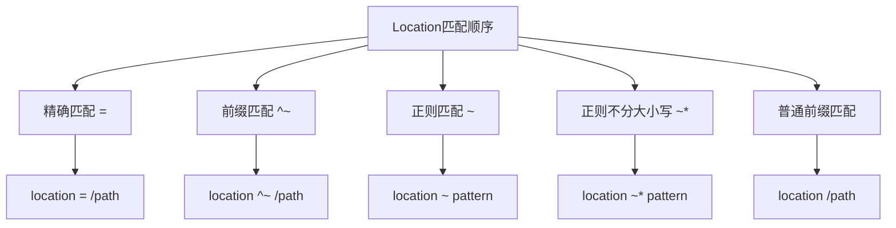

# Linux后端服务部署实践

## 课程回顾

在上一节课中，我们学习了Web服务的基础知识和Nginx的基本配置。今天我们将深入学习如何在Linux环境下部署前后端项目。

## 课程目标

1. 了解不同编程语言的包管理工具
2. 学习Node.js环境的安装和配置
3. 掌握Vue前端项目的部署流程
4. 掌握后端项目的部署流程
5. 深入理解Nginx的反向代理和负载均衡

## Nginx标准配置文件

在修改Nginx配置文件之前，我们需要先备份原有配置文件，以防配置出错时可以快速恢复：

```bash
# 备份原有配置文件
sudo cp /etc/nginx/nginx.conf /etc/nginx/nginx.conf.backup

# 如果配置出错，可以使用以下命令恢复
# sudo cp /etc/nginx/nginx.conf.backup /etc/nginx/nginx.conf
```

以下是一个完整的nginx.conf配置文件，包含详细的中文注释：

```nginx
# 运行用户
user www-data;

# 工作进程数，建议设置为CPU核心数
worker_processes auto;

# 错误日志路径和级别
error_log /var/log/nginx/error.log warn;

# 进程ID文件路径
pid /var/run/nginx.pid;

# 事件模块配置
events {
    # 使用epoll事件驱动，Linux系统使用epoll，FreeBSD使用kqueue
    use epoll;
    
    # 每个工作进程的最大连接数
    worker_connections 1024;
    
    # 尽可能多地接受请求
    multi_accept on;
}

# HTTP模块配置
http {
    # 基础配置
    include /etc/nginx/mime.types;
    default_type application/octet-stream;
    
    # 定义JSON格式的日志  注意最后的分号
    log_format json_combined escape=json '{"time_local":"$time_local", "remote_addr":"$remote_addr", "host":"$host", "request":"$request", "status":"$status", "body_bytes_sent":"$body_bytes_sent", "http_referer":"$http_referer", "http_user_agent":"$http_user_agent", "http_x_forwarded_for":"$http_x_forwarded_for", "request_time":"$request_time", "upstream_response_time":"$upstream_response_time", "upstream_addr":"$upstream_addr"}';
    
    # 访问日志路径
    access_log /var/log/nginx/access.log json_combined;
    
    # 隐藏Nginx版本号
    server_tokens off;
    
    # 文件传输相关配置
    sendfile on;
    tcp_nopush on;
    tcp_nodelay on;
    
    # 连接超时时间
    keepalive_timeout 65;
    
    # 客户端请求主体大小限制
    client_max_body_size 20m;
    
    # GZIP压缩配置
    gzip on;
    gzip_disable "msie6";
    gzip_vary on;
    gzip_proxied any;
    gzip_comp_level 6;
    gzip_min_length 1000;
    gzip_types text/plain text/css application/json application/javascript text/xml application/xml application/xml+rss text/javascript image/svg+xml;
    
    # 安全相关的响应头配置
    add_header X-Frame-Options "SAMEORIGIN";
    add_header X-Content-Type-Options "nosniff";
    add_header X-XSS-Protection "1; mode=block";
    add_header Strict-Transport-Security "max-age=31536000" always;
    
    # SSL会话缓存
    ssl_session_cache shared:SSL:10m;
    ssl_session_timeout 10m;
    
    # SSL协议和密码套件配置
    ssl_protocols TLSv1.2 TLSv1.3;
    ssl_prefer_server_ciphers on;
    ssl_ciphers ECDHE-ECDSA-AES128-GCM-SHA256:ECDHE-RSA-AES128-GCM-SHA256:ECDHE-ECDSA-AES256-GCM-SHA384:ECDHE-RSA-AES256-GCM-SHA384:ECDHE-ECDSA-CHACHA20-POLY1305:ECDHE-RSA-CHACHA20-POLY1305:DHE-RSA-AES128-GCM-SHA256:DHE-RSA-AES256-GCM-SHA384;
    
    # 包含其他配置文件
    include /etc/nginx/conf.d/*.conf;
    include /etc/nginx/sites-enabled/*;
}
```

```bash
# 更新完成配置后，重启nginx
pkill nginx && nginx
```

### Nginx配置文件说明

1. **基础配置部分**
   - `user nginx`: 指定Nginx进程运行的用户
   - `worker_processes auto`: 自动设置工作进程数，通常等于CPU核心数
   - `error_log`: 错误日志的位置和级别
   - `pid`: 记录Nginx主进程ID的文件位置

2. **事件模块配置**
   - `use epoll`: 使用epoll事件驱动模型，这是Linux系统最高效的模型
   - `worker_connections`: 每个工作进程的最大并发连接数
   - `multi_accept`: 允许一次接受多个新连接

3. **HTTP模块配置**
   - **MIME类型**
     * `include mime.types`: 包含文件类型映射表
     * `default_type`: 默认文件类型

   - **日志配置**
     * `log_format`: 定义日志格式，包含访问者IP、时间、请求等信息
     * `access_log`: 访问日志的存储位置

   - **安全配置**
     * `server_tokens off`: 隐藏Nginx版本号
     * `add_header`: 添加安全相关的HTTP头
     * `client_max_body_size`: 限制客户端请求体大小

   - **性能优化**
     * `sendfile on`: 启用高效文件传输
     * `tcp_nopush`: 优化数据包发送
     * `tcp_nodelay`: 禁用Nagle算法
     * `keepalive_timeout`: 保持连接超时时间

   - **压缩配置**
     * `gzip`: 启用压缩
     * `gzip_types`: 指定需要压缩的文件类型
     * `gzip_comp_level`: 压缩级别
     * `gzip_min_length`: 最小压缩文件大小

   - **SSL配置**
     * `ssl_protocols`: 指定支持的SSL/TLS协议版本
     * `ssl_session_cache`: 配置SSL会话缓存
     * `ssl_ciphers`: 指定加密算法

### Linux 系统网络内核优化

在处理高并发Web服务时，Linux系统的默认网络参数可能会成为性能瓶颈。通过优化网络内核参数，我们可以提升服务器的网络性能。

#### 什么是系统内核参数？

系统内核参数是控制Linux系统行为的一些变量。通过修改这些参数，我们可以调整系统的网络性能、内存使用、进程管理等方面的行为。

#### 如何修改系统内核参数？

1. **查看当前参数值**
   ```bash
   # 查看某个具体参数的当前值
   sysctl net.core.somaxconn
   ```

2. **临时修改参数**
   ```bash
   # 临时修改参数（重启后失效）
   sudo sysctl -w net.core.somaxconn=32768
   ```

3. **永久修改参数**
   ```bash
   # 编辑sysctl配置文件
   sudo vim /etc/sysctl.conf

   # 在文件末尾添加以下内容：
   
   # 最大等待连接数，默认128
   net.core.somaxconn = 32768                  # 增加并发连接数量
   
   # TCP SYN队列长度，默认1024
   net.ipv4.tcp_max_syn_backlog = 16384        # 防止高并发时丢包
   
   # 网卡数据包队列长度，默认1000
   net.core.netdev_max_backlog = 16384         # 提高网络性能
   
   # TIME_WAIT状态超时时间，默认60秒
   net.ipv4.tcp_fin_timeout = 20               # 加快端口复用
   
   # 应用新配置
   sudo sysctl -p
   ```

#### 参数说明

1. **net.core.somaxconn**
   - 控制系统中每个端口最大的监听队列的长度
   - 默认值128太小，容易导致连接被拒绝
   - 建议值：32768（根据服务器配置和业务需求调整）

2. **net.ipv4.tcp_max_syn_backlog**
   - 控制TCP SYN队列的最大长度
   - 在高并发环境下，过小的值会导致连接建立失败
   - 建议值：16384（可根据实际情况调整）

3. **net.core.netdev_max_backlog**
   - 网卡接收数据包的速率大于内核处理速率时，会有一个队列保存这些数据包
   - 这个参数控制该队列的最大长度
   - 建议值：16384（可根据网络负载调整）

4. **net.ipv4.tcp_fin_timeout**
   - 控制TCP连接关闭后，系统保持TIME_WAIT状态的时间
   - 降低该值可以更快地释放端口，提高端口复用率
   - 建议值：20（单位：秒）

#### 注意事项

1. 修改系统参数需要root权限
2. 参数修改后需要使用`sysctl -p`命令使其生效
3. 参数值不是越大越好，需要根据服务器硬件配置和业务需求来调整
4. 修改前建议先记录原始值，以便需要时恢复

#### 如何验证修改是否生效？

```bash
# 查看修改后的参数值
sudo sysctl net.core.somaxconn
sudo sysctl net.ipv4.tcp_max_syn_backlog
sudo sysctl net.core.netdev_max_backlog
sudo sysctl net.ipv4.tcp_fin_timeout
```

如果显示的值与配置文件中的值相同，说明修改已经生效。

### 配置建议

1. **性能优化**
   - 根据服务器CPU核心数调整worker_processes
   - 适当调整worker_connections值
   - 对静态文件启用缓存
   - 启用gzip压缩

2. **安全加固**
   - 隐藏版本号
   - 添加安全响应头
   - 限制上传文件大小
   - 禁止访问隐藏文件

3. **日志管理**
   - 配置详细的日志格式
   - 定期轮转日志文件
   - 根据需要调整日志级别

### Nginx 前端静态页面发布总结

#### 部署前的准备工作

1. **确认服务器环境**
   - 确保Nginx已正确安装
   - 检查服务器磁盘空间是否充足
   - 确认服务器防火墙是否放行80和443端口

2. **域名和SSL证书准备**
   - 准备好域名（示例中使用touch.liujun.com）
   - 准备SSL证书文件（.crt和.key文件）
   - 创建证书存放目录：
     ```bash
     sudo mkdir -p /etc/nginx/ssl/touch.liujun.com
     ```
   - 生成自签名证书
      ```bash
      # touch.liujun.com 请替换为你自己的域名
      sudo openssl req -x509 -nodes -days 365 -newkey rsa:2048 \
         -keyout /etc/nginx/ssl/touch.liujun.com/private.key \
         -out /etc/nginx/ssl/touch.liujun.com/certificate.crt \
         -subj "/CN=touch.liujun.com"
      ```
   

#### 部署步骤

1. **创建项目目录**
   ```bash
   # 创建站点目录（注意：目录名与域名保持一致）
   sudo mkdir -p /opt/nginx/touch.liujun.com
   
   # 设置目录权限
   sudo chown -R $USER:$USER /opt/nginx/touch.liujun.com
   ```

2. **克隆项目代码**
   ```bash
   # 进入站点目录
   cd /opt/nginx/touch.liujun.com
   
   # 克隆项目代码（注意末尾的点，表示克隆到当前目录）
   git clone https://gitee.com/yinqi/Light-Year-Admin-Template.git .
   ```
   > 特别注意：命令末尾的点(.)不要遗漏，它表示将代码克隆到当前目录，而不是创建新的子目录

3. **配置Nginx虚拟主机**
   ```bash
   # 创建配置文件（文件名应与域名一致）
   sudo vim /etc/nginx/conf.d/touch.liujun.com.conf
   ```

   配置文件内容：
   ```nginx
   # HTTPS server
   server {
       listen 443 ssl;
       server_name touch.liujun.com;
       access_log /var/log/nginx/touch.liujun.com.access.log json_combined;
       error_log /var/log/nginx/touch.liujun.com.error.log warn;
       
       # 证书文件路径
       ssl_certificate /etc/nginx/ssl/touch.liujun.com/certificate.crt;
       ssl_certificate_key /etc/nginx/ssl/touch.liujun.com/private.key;
       
       # SSL优化配置
       ssl_protocols TLSv1.2 TLSv1.3;                     # 只允许TLS1.2和1.3协议，禁用不安全的老版本
       ssl_ciphers ECDHE-ECDSA-AES128-GCM-SHA256:ECDHE-RSA-AES128-GCM-SHA256;  # 使用强加密套件
       ssl_prefer_server_ciphers on;                      # 优先使用服务器的加密套件
       ssl_session_cache shared:SSL:10m;                  # SSL会话缓存，提高性能
       ssl_session_timeout 10m;                           # 缓存会话的超时时间
       ssl_stapling on;                                   # 启用OCSP Stapling
       ssl_stapling_verify on;                           # 验证OCSP响应
       
       # 站点配置
       root /opt/nginx/touch.liujun.com;
       index index.html;
       
       # 添加location配置
       location / {
           try_files $uri $uri/ /index.html;
           add_header Cache-Control "no-cache, must-revalidate";
       }
       
       # 静态资源缓存配置
       location ~* \.(js|css|png|jpg|jpeg|gif|ico|svg)$ {
           expires 1y;
           add_header Cache-Control "public, no-transform";
       }
   }
   
   # 将HTTP请求重定向到HTTPS
   server {
       listen 80;
       server_name touch.liujun.com;
       return 301 https://$server_name$request_uri;
   }
   ```

4. **检查和应用配置**
   ```bash
   # 检查Nginx配置是否有语法错误
   sudo nginx -t
   
   # 如果配置正确，重新加载Nginx
   sudo nginx -s reload
   ```

#### 部署后的检查清单

1. **访问测试**
   - 通过HTTP访问，确认是否正确重定向到HTTPS
   - 通过HTTPS访问，确认网站是否正常加载
   - 检查SSL证书是否正确配置（浏览器显示安全锁标志）

2. **性能检查**
   - 使用浏览器开发者工具检查资源加载时间
   - 确认静态资源是否正确缓存
   - 检查页面响应速度

3. **安全检查**
   - 确认SSL配置是否正确
   - 验证HTTP到HTTPS的重定向是否正常工作
   - 检查服务器安全头信息是否正确设置

#### 常见问题解决

1. **404错误**
   - 检查目录权限是否正确
   - 确认文件路径是否正确
   - 检查Nginx用户是否有权限访问站点目录

2. **SSL证书问题**
   - 确认证书文件路径是否正确
   - 检查证书文件权限
   - 验证证书是否过期

3. **重定向循环**
   - 检查HTTP到HTTPS重定向配置
   - 确认server_name配置是否正确

#### 维护建议

1. **定期备份**
   - 备份网站文件
   - 备份Nginx配置文件
   - 备份SSL证书

2. **监控和更新**
   - 定期检查网站可用性
   - 及时更新SSL证书
   - 定期更新Nginx版本以修复安全漏洞

## 包管理工具介绍

在开始部署之前，我们需要先了解不同编程语言的包管理工具。这些工具帮助我们管理项目依赖，使项目能够正常运行。

### 常见的包管理工具

1. **Python - pip**
   - 用途：安装和管理Python包
   - 示例：`pip install requests`
   - 配置文件：requirements.txt

2. **Java - Maven**
   - 用途：项目构建和依赖管理
   - 示例：`mvn install`
   - 配置文件：pom.xml

3. **Node.js - npm/yarn**
   - 用途：安装和管理JavaScript包
   - 示例：`npm install express`
   - 配置文件：package.json

4. **Go - go mod**
   - 用途：Go语言依赖管理
   - 示例：`go mod tidy`
   - 配置文件：go.mod

### 为什么需要包管理工具？

1. **依赖管理**：自动处理项目所需的所有依赖包
2. **版本控制**：确保团队使用相同版本的依赖
3. **构建工具**：提供项目构建、测试等功能
4. **镜像源**：支持配置国内镜像源加速下载

## Node.js环境部署

### 基础概念

**Node.js**是一个基于Chrome V8引擎的JavaScript运行环境，它让我们可以使用JavaScript来编写服务器端程序。

**npm（Node Package Manager）**是Node.js默认的包管理工具，用于安装和管理项目依赖。

### 安装步骤

```bash
# 1. 下载Node.js 18.x版本
wget https://registry.npmmirror.com/-/binary/node/v20.11.1/node-v20.11.1-linux-x64.tar.gz

# 2. 解压安装包
tar -zxvf node-v20.11.1-linux-x64.tar.gz

# 3. 移动到指定目录
mv node-v20.11.1-linux-x64 /usr/local/

# 4. 配置环境变量
vim /etc/profile
export NODE_HOME=/usr/local/node-v20.11.1-linux-x64
export PATH=$NODE_HOME/bin:$PATH

# 5. 环境变量生效
source /etc/profile

# 6. 配置npm镜像源（加速下载）
npm config set registry https://registry.npmmirror.com
```

### 验证安装

```bash
# 查看Node.js版本
node -v

# 查看npm版本
npm -v
```

### Vue项目部署说明

#### 1. Vue前端项目（静态资源）

前端项目特点：
- 编译后是静态资源（HTML、CSS、JavaScript）
- 需要通过Nginx提供Web服务
- 通常包含路由功能，需要特殊的location配置

部署步骤：

1. **准备工作**
```bash
# 创建项目目录
mkdir -p /opt/nginx/vue-web.liujun.com
cd /opt/nginx/vue-web.liujun.com

# 克隆Vue项目
git clone https://gitee.com/anydev/vue-manage-system.git .
```

2. **构建项目**
```bash
# 安装项目依赖
npm install  # 这个命令会创建node_modules目录，存放所有项目依赖的包

# 查看生成的node_modules目录
ls -l node_modules  # 你会看到很多依赖包，这些都是项目需要的

# 构建生产环境代码
npm run build   # 这个命令会创建dist目录，里面是打包好的静态文件

# 查看构建后的dist目录
ls -l dist      # 这里包含了index.html和其他静态资源文件
```

> **说明：**
> - `node_modules`：这是npm安装依赖包的目录，包含了项目所需的所有第三方库
> - `dist`：这是Vue项目构建后的目录，包含了所有编译和压缩后的文件，可以直接部署到服务器
>   - `index.html`：网站入口文件
>   - `assets`：存放样式、脚本、图片等静态资源
>   - `js`：编译后的JavaScript文件
>   - `css`：编译后的样式文件

3. **配置SSL证书**
```bash
# 创建SSL证书目录
mkdir -p /etc/nginx/ssl/vue-web.liujun.com

# 生成自签名SSL证书
sudo openssl req -x509 -nodes -days 365 -newkey rsa:2048 \
    -keyout /etc/nginx/ssl/vue-web.liujun.com/private.key \
    -out /etc/nginx/ssl/vue-web.liujun.com/certificate.crt \
    -subj "/CN=vue-web.liujun.com"
```

4. **Nginx配置示例**
```nginx
# HTTPS server - Vue项目配置
server {
    listen 443 ssl;
    server_name vue-web.liujun.com;
    access_log /var/log/nginx/vue-web.liujun.com.access.log json_combined;
    error_log /var/log/nginx/vue-web.liujun.com.error.log warn;
    
    # 证书文件路径
    ssl_certificate /etc/nginx/ssl/vue-web.liujun.com/certificate.crt;
    ssl_certificate_key /etc/nginx/ssl/vue-web.liujun.com/private.key;
    
    # SSL优化配置
    ssl_protocols TLSv1.2 TLSv1.3;                     # 只允许TLS1.2和1.3协议
    ssl_ciphers ECDHE-ECDSA-AES128-GCM-SHA256:ECDHE-RSA-AES128-GCM-SHA256;
    ssl_prefer_server_ciphers on;
    ssl_session_cache shared:SSL:10m;
    ssl_session_timeout 10m;
    ssl_stapling on;
    ssl_stapling_verify on;
    
    # Vue项目根目录配置
    root /opt/nginx/vue-web.liujun.com/dist;    # 指向构建输出目录
    index index.html;
    
    # Vue Router处理
    # location 指令用于匹配特定的URL路径，并为这些路径配置特定的处理规则
    # location / { } 表示匹配所有请求
    location / {
        # try_files 指令会按顺序尝试查找文件：
        # $uri：尝试访问请求的原始路径
        # $uri/：如果原始路径不存在，尝试将其作为目录并查找默认文件
        # /index.html：如果前两者都不存在，返回index.html文件（这是Vue Router需要的）
        try_files $uri $uri/ /index.html;       # 处理前端路由

        # Cache-Control 响应头告诉浏览器不要缓存这些文件
        # no-cache：每次使用前需要验证
        # must-revalidate：过期后必须重新验证
        add_header Cache-Control "no-cache, must-revalidate";
    }
    
    # Vue静态资源缓存配置
    # location /assets/ { } 专门匹配/assets/目录下的文件
    location /assets/ {
        # expires 指令设置缓存过期时间
        # 1y 表示缓存1年，适用于不经常变化的静态资源
        expires 1y;

        # Cache-Control 响应头设置缓存策略
        # public：允许所有环节（浏览器、代理服务器等）缓存
        # no-transform：禁止转换文件格式（比如压缩图片）
        add_header Cache-Control "public, no-transform";

        # 关闭访问日志，因为静态资源访问频繁，没必要记录日志
        access_log off;
    }
    
    # 其他静态资源缓存配置
    location ~* \.(js|css|png|jpg|jpeg|gif|ico|svg)$ {
        expires 1y;
        add_header Cache-Control "public, no-transform";
        access_log off;
    }
}

# HTTP重定向到HTTPS
server {
    listen 80;
    server_name vue-web.liujun.com;
    return 301 https://$server_name$request_uri;
}
```

5. **Windows系统配置域名解析**
   ```bash
   # 1. 以管理员身份打开记事本
   # 2. 打开文件：C:\Windows\System32\drivers\etc\hosts
   # 3. 添加以下内容：
   192.168.110.你尾号多少 vue-web.liujun.com
   ```
   > 注意：每行前面的IP地址和域名之间使用空格分隔

#### 2. Vue后端项目（Node.js服务）

后端项目特点：
- 运行为Node.js服务
- 监听特定端口（如3000）
- 可直接提供API服务
- 通常使用PM2进行进程管理

部署步骤：

1. **准备项目**
```bash
# 创建项目目录
mkdir -p /opt/nginx/vue-backup.liujun.com
cd /opt/nginx/vue-backup.liujun.com

# 克隆项目源码
git clone https://gitee.com/Tender-Liu/typescript-starter.git .

# 安装项目依赖
npm install
```
> 执行`npm install`后会在项目目录下生成`node_modules`文件夹，这里包含了项目所需的所有依赖包。

2. **测试服务**
```bash
# 临时启动服务进行测试
npm run start

# 使用curl测试API接口
# 获取所有用户
curl http://localhost:3000/api/users

# 获取单个用户
curl http://localhost:3000/api/users/1

# 创建用户
curl -X POST http://localhost:3000/api/users -H "Content-Type: application/json" -d '{"name":"Alice"}'

# 更新用户
curl -X PUT http://localhost:3000/api/users/1 -H "Content-Type: application/json" -d '{"name":"Alice Updated"}'

# 删除用户
curl -X DELETE http://localhost:3000/api/users/1
```

3. **Node.js后台运行方案**

有多种方式可以让Node.js应用在后台运行：

**方案一：使用nohup（最简单）**
> 这是作业
```bash
# 你需要在自己的/opt/nginx/项目     路径中执行这个代码
# 启动服务并将输出重定向到日志文件
nohup npm start > output.log 2>&1 &

# 查看进程
netstat -lnpt| grep node

# 停止服务
kill <进程ID>
```

**方案二：使用screen（适合开发测试）**
> 不是给你们练习的，给你们看的
```bash
# 安装screen
yum install screen -y

# 创建新会话
screen -S node-app

# 在screen会话中启动服务
npm start

# 分离会话（按Ctrl+A，然后按D）

# 重新连接会话
screen -r node-app

# 停止会话
exit  # 在screen会话中执行
```

**方案三：使用PM2（生产环境推荐）**
> 不是给你们练习的，给你们看的

```bash
# 全局安装PM2
npm install -g pm2

# 使用PM2启动服务
pm2 start npm -- start

# 设置开机自启
pm2 startup

# 保存当前进程列表
pm2 save
```

> **注意：** 
> - nohup适合简单场景，但缺乏进程管理功能
> - screen适合开发测试，便于实时查看输出
> - PM2虽然功能强大但配置较复杂，是生产环境的推荐选择
> - 在学习Docker之前，了解这些基础方案有助于理解进程管理和服务部署的概念

4. **PM2常用命令说明**
```bash
# 查看运行状态（显示所有应用程序的CPU、内存使用情况等）
pm2 status

# 查看实时日志输出
pm2 logs

# 查看特定应用的日志
pm2 logs <app_name>

# 清空所有日志
pm2 flush

# 重启所有应用
pm2 restart all

# 重启特定应用
pm2 restart <app_name>

# 停止所有应用
pm2 stop all

# 停止特定应用
pm2 stop <app_name>

# 删除所有应用
pm2 delete all

# 删除特定应用
pm2 delete <app_name>

# 显示应用详细信息
pm2 show <app_name>

# 监控CPU/内存使用
pm2 monit
```

### 部署注意事项

1. **前端项目注意事项**
   - 确保build后的dist目录包含所有必要文件
   - 配置正确的publicPath
   - 处理好路由的history模式配置
   - 设置适当的缓存策略

2. **后端项目注意事项**
   - 使用环境变量管理配置
   - 配置错误日志记录
   - 设置合适的进程数量
   - 配置自动重启策略
   - 做好异常处理

### 常见问题解决

1. **依赖安装失败**
   - 检查npm镜像源设置
   - 清除npm缓存：`npm cache clean --force`
   - 删除node_modules重新安装

2. **构建错误**
   - 检查Node.js版本兼容性
   - 查看项目配置文件
   - 检查语法错误

3. **跨域问题**
   - 配置开发环境代理
   - 配置Nginx反向代理（见下文）

4. **路由刷新404**
   - 配置Nginx try_files指令
   - 使用history模式需要特殊配置

## Nginx配置详解

### 3.1 Location匹配规则

在开始实践之前，我们需要先了解Nginx的基本概念和配置规则。

#### Location匹配优先级



匹配优先级从高到低：
1. `=` 精确匹配（最高优先级）
2. `^~` 前缀匹配（次高优先级）
3. `~` 和 `~*` 正则匹配（第三优先级）
4. 普通前缀匹配（最低优先级）

#### Location配置示例
```nginx
# 精确匹配
location = / {
    # 只匹配 "/"
    root /www/root;
    index index.html;
}

# 前缀匹配
location ^~ /images/ {
    # 匹配所有以 /images/ 开头的请求
    root /www/images;
}

# 区分大小写的正则匹配
location ~ \.(gif|jpg|png)$ {
    # 匹配以 .gif、.jpg 或 .png 结尾的请求
    root /www/images;
}

# 不区分大小写的正则匹配
location ~* \.(pdf|doc)$ {
    # 匹配以 .pdf 或 .doc 结尾的请求（不区分大小写）
    root /www/docs;
}

# 普通前缀匹配
location /download/ {
    # 匹配所有以 /download/ 开头的请求
    root /www/download;
}
```

### 3.2 负载均衡调度算法

#### 1. 轮询（默认）
```nginx
upstream backend {
    server 127.0.0.1:3000;
    server 127.0.0.1:3001;
}
```
- 按顺序分配请求
- 适合服务器性能相近的场景

#### 2. 加权轮询
```nginx
upstream backend {
    server 127.0.0.1:3000 weight=3;
    server 127.0.0.1:3001 weight=1;
}
```
- 按权重比例分配请求
- 适合服务器性能不均的场景

#### 3. IP哈希
```nginx
upstream backend {
    ip_hash;
    server 127.0.0.1:3000;
    server 127.0.0.1:3001;
}
```
- 根据客户端IP分配固定服务器
- 适合需要会话保持的场景

#### 4. 最少连接
```nginx
upstream backend {
    least_conn;
    server 127.0.0.1:3000;
    server 127.0.0.1:3001;
}
```
- 优先分配连接数最少的服务器
- 适合请求处理时间差异大的场景

### 3.3 实践配置

#### 1. 环境准备
```bash
# 创建项目目录
mkdir -p /opt/nginx/vue-backup.liujun.com

# 创建SSL证书目录
mkdir -p /etc/nginx/ssl/vue-backup.liujun.com

# 生成自签名SSL证书
openssl req -x509 -nodes -days 365 -newkey rsa:2048 \
-keyout /etc/nginx/ssl/vue-backup.liujun.com/private.key \
-out /etc/nginx/ssl/vue-backup.liujun.com/certificate.crt \
-subj "/C=CN/ST=Beijing/L=Beijing/O=liujun/CN=vue-backup.liujun.com"
```

#### 2. Location实践
```bash
# 创建配置文件（文件名应与域名一致）
sudo vim /etc/nginx/conf.d/vue-backup.liujun.com.conf
```

```nginx
# 基础配置
# 后端服务器组
upstream backend_servers {
    # 使用IP哈希算法实现会话保持
    ip_hash;

    # 后端服务器列表
    server 127.0.0.1:3000 weight=1 max_fails=2 fail_timeout=30s;
    server 127.0.0.1:3001 weight=1 max_fails=2 fail_timeout=30s;
}

# HTTP重定向到HTTPS
server {
    listen 80;
    server_name vue-backup.liujun.com;
    return 301 https://$server_name$request_uri;
}

# HTTPS服务器配置
server {
    listen 443 ssl;
    server_name vue-backup.liujun.com;
    # 证书文件路径
    ssl_certificate /etc/nginx/ssl/vue-backup.liujun.com/certificate.crt;
    ssl_certificate_key /etc/nginx/ssl/vue-backup.liujun.com/private.key;

    access_log /var/log/nginx/vue-backup.liujun.com.access.log json_combined;
    error_log /var/log/nginx/vue-backup.liujun.com.error.log warn;

    # SSL配置
    # SSL优化配置
    ssl_protocols TLSv1.2 TLSv1.3;                     # 只允许TLS1.2和1.3协议，禁用不安全的老版本
    ssl_ciphers ECDHE-ECDSA-AES128-GCM-SHA256:ECDHE-RSA-AES128-GCM-SHA256;  # 使用强加密套件
    ssl_prefer_server_ciphers on;                      # 优先使用服务器的加密套件
    ssl_session_cache shared:SSL:10m;                  # SSL会话缓存，提高性能
    ssl_session_timeout 10m;                           # 缓存会话的超时时间
    ssl_stapling on;                                   # 启用OCSP Stapling
    ssl_stapling_verify on;                           # 验证OCSP响应

    # API代理配置
    location /api/ {
        proxy_pass http://backend_servers;
        proxy_http_version 1.1;
        proxy_set_header Host $host;
        proxy_set_header X-Real-IP $remote_addr;
        proxy_set_header X-Forwarded-For $proxy_add_x_forwarded_for;
        proxy_set_header X-Forwarded-Proto $scheme;

        # 超时设置
        proxy_connect_timeout 60s;
        proxy_send_timeout 60s;
        proxy_read_timeout 60s;
    }
}
```

#### 3. 负载均衡实践
```nginx
# 定义后端服务器组
upstream backend_servers {
    # 1. 轮询策略（默认）
    server 127.0.0.1:3000;
    server 127.0.0.1:3001;

    # 2. 权重策略示例
    # server 127.0.0.1:3000 weight=3;
    # server 127.0.0.1:3001 weight=1;

    # 3. IP哈希示例
    # ip_hash;
    # server 127.0.0.1:3000;
    # server 127.0.0.1:3001;

    # 4. 健康检查示例
    # server 127.0.0.1:3000 max_fails=3 fail_timeout=30s;
    # server 127.0.0.1:3001 backup;
}

# 测试命令
```bash
# 测试轮询效果
# 使用ab进行负载均衡测试
ab -n 1000 -c 50 -k https://vue-backup.liujun.com/api/test

# 测试会话保持
curl -k https://vue-backup.liujun.com/api/test
```

#### 4. 实践测试

1. **启动测试服务器**
```bash
# 启动第一个Node.js服务
PORT=3000 node server.js &

# 启动第二个Node.js服务
PORT=3001 node server.js &
```

2. **测试API接口**
```bash
# 测试API版本
curl -k https://vue-backup.liujun.com/api/version

# 测试API代理
curl -k https://vue-backup.liujun.com/api/users

# 测试API响应时间
curl -k -w "\n响应时间: %{time_total}s\n" https://vue-backup.liujun.com/api/users
```

3. **检查日志**
```bash
# 查看Nginx访问日志
tail -f /var/log/nginx/vue-backup.liujun.com.access.log

# 查看Nginx错误日志
tail -f /var/log/nginx/vue-backup.liujun.com.error.log
```

### 3.5 反向代理详解

反向代理是一种服务器端代理技术，它接收客户端的请求，然后将请求转发给内部网络上的服务器，并将从服务器上得到的结果返回给客户端。

#### 1. 反向代理的作用

- **负载均衡**：分发请求到多个服务器
- **安全防护**：隐藏真实服务器
- **缓存静态内容**：提高访问速度
- **SSL终端**：集中管理SSL证书

#### 2. 反向代理配置要点

```nginx
location /api/ {
    # 1. 去除/api前缀
    rewrite ^/api/(.*) /$1 break;
    
    # 2. 设置上游服务器
    proxy_pass http://backend_servers;
    
    # 3. 配置代理协议
    proxy_http_version 1.1;
    
    # 4. WebSocket支持
    proxy_set_header Upgrade $http_upgrade;
    proxy_set_header Connection 'upgrade';
    
    # 5. 传递客户端信息
    proxy_set_header Host $host;
    proxy_set_header X-Real-IP $remote_addr;
    proxy_set_header X-Forwarded-For $proxy_add_x_forwarded_for;
    proxy_set_header X-Forwarded-Proto $scheme;
    
    # 6. 超时设置
    proxy_connect_timeout 60s;
    proxy_send_timeout 60s;
    proxy_read_timeout 60s;
}
```

### 3.6 负载均衡调度算法

#### 1. 轮询（默认）
```nginx
upstream backend {
    server 127.0.0.1:3000;
    server 127.0.0.1:3001;
}
```
- 按顺序分配请求
- 适合服务器性能相近的场景

#### 2. 加权轮询
```nginx
upstream backend {
    server 127.0.0.1:3000 weight=3;
    server 127.0.0.1:3001 weight=1;
}
```
- 按权重比例分配请求
- 适合服务器性能不均的场景

#### 3. IP哈希
```nginx
upstream backend {
    ip_hash;
    server 127.0.0.1:3000;
    server 127.0.0.1:3001;
}
```
- 根据客户端IP分配固定服务器
- 适合需要会话保持的场景

#### 4. 最少连接
```nginx
upstream backend {
    least_conn;
    server 127.0.0.1:3000;
    server 127.0.0.1:3001;
}
```
- 优先分配连接数最少的服务器
- 适合请求处理时间差异大的场景

#### 5. 服务器状态控制
```nginx
upstream backend {
    server 127.0.0.1:3000 max_fails=3 fail_timeout=30s;
    server 127.0.0.1:3001 backup;
}
```
- `max_fails`：允许请求失败次数
- `fail_timeout`：失败后暂停时间
- `backup`：备用服务器
- `down`：标记服务器永久下线

反向代理是指服务器接收客户端请求，然后将请求转发给内部网络上的其他服务器，并将结果返回给客户端。客户端只知道代理服务器，而不知道实际处理请求的服务器。
