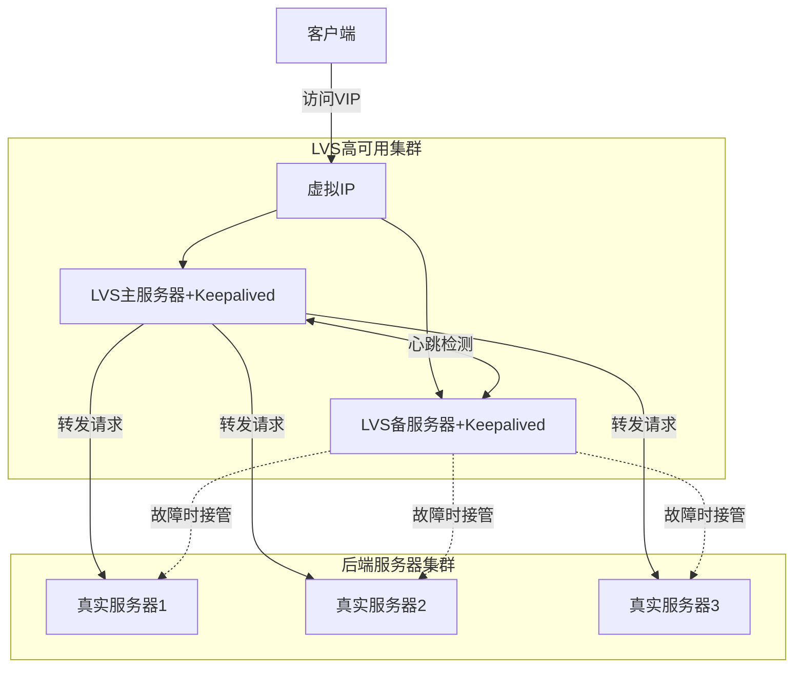
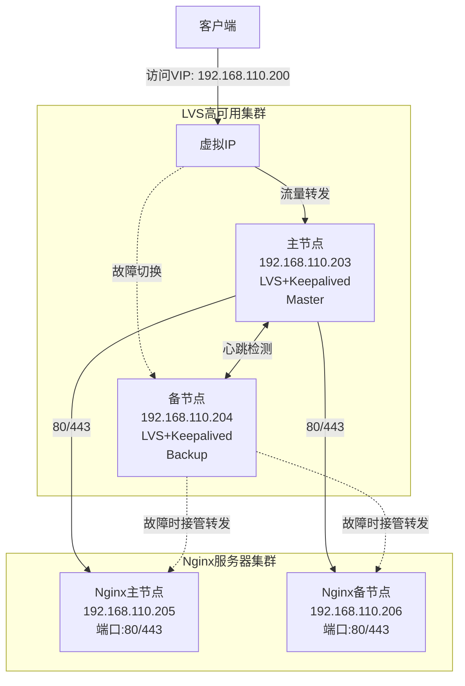
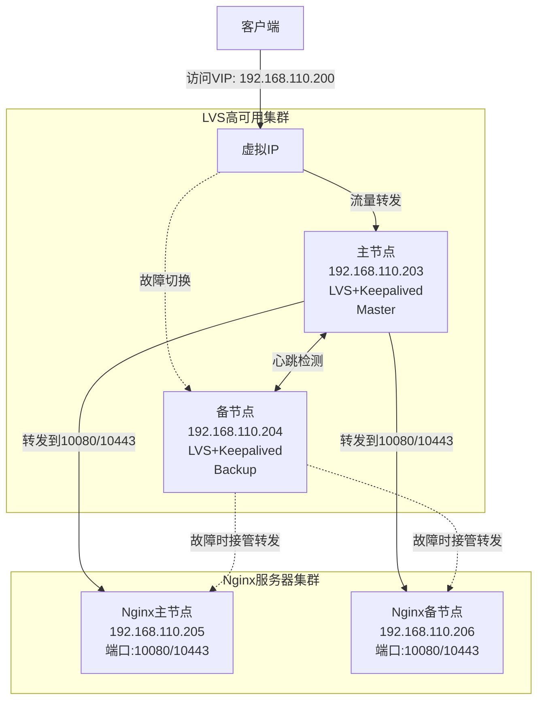

# LVS+KeepAlived高可用集群

## 引言
在前面的章节中，我们学习了如何使用Nginx部署各种后端服务（Java、NodeJS、Python、Go等）。虽然这些服务可以通过横向扩展来提高可用性，但是我们面临一个关键问题：如果Nginx服务器本身发生故障，整个系统将无法访问。那么，如何解决这个单点故障问题呢？这就需要引入LVS（Linux Virtual Server）和Keepalived这两个强大的工具。

## TCP/IP协议与负载均衡
在介绍LVS之前，我们先回顾一下TCP/IP协议的七层模型，这有助于我们理解不同负载均衡技术的工作原理：

1. **应用层（第7层）**
   - 协议：HTTP、FTP、SMTP等
   - 负载均衡：Nginx、HAProxy（HTTP模式）
   - 特点：可以理解应用层协议，支持基于URL、Cookie的转发

2. **表示层（第6层）**
   - 功能：数据格式转换、加密解密
   - 例如：SSL/TLS加密

3. **会话层（第5层）**
   - 功能：建立、维护和断开会话
   - 例如：SSH协议（远程登录会话）、SQL会话、RPC会话
   - 特点：负责管理应用程序之间的会话，确保数据的可靠传输

4. **传输层（第4层）**
   - 协议：TCP、UDP
   - 负载均衡：LVS、HAProxy（TCP模式）
   - 特点：根据IP和端口转发，性能好，无法理解应用协议

5. **网络层（第3层）**
   - 协议：IP、ICMP
   - 功能：负责数据包的路由和转发

6. **数据链路层（第2层）**
   - 协议：以太网协议
   - 功能：处理相邻节点之间的通信

7. **物理层（第1层）**
   - 功能：比特流的传输
   - 例如：网线、光纤等物理介质

## LVS简介
LVS（Linux Virtual Server）是Linux内核自带的负载均衡调度器，由章文嵩博士发起的开源项目。它工作在网络层（第4层），这意味着它可以处理任何基于TCP/UDP的应用，如HTTP、FTP、SMTP等。与工作在应用层的Nginx相比，LVS无法理解应用层协议的内容，但处理性能更高。

**类比**：如果把用户请求比作一堆包裹，LVS 就像一个物流分拣中心的自动化分拣机，不关心包裹里装的是什么（不看应用层内容），只根据地址和规则（网络层信息）快速把包裹送到不同的仓库（后端服务器）。

LVS具有以下特点：

1. **高性能**：工作在内核态，直接处理网络包，性能极高
2. **稳定性好**：作为内核的一部分，经过长期验证
3. **功能丰富**：支持多种负载均衡算法
4. **可扩展性强**：可以轻松处理大规模集群

### LVS 的架构和角色
在 LVS 的架构中，有两个核心角色：

* `Director（指挥者/导向器）`：这是负载均衡服务器，负责接收所有来自用户的请求，并根据预设的规则（调度算法）将请求分发到后端的真实服务器。Director 就像一个交通指挥员，指挥车辆（用户请求）驶向不同的道路（后端服务器）。
* `Real Server（真实服务器）`：这些是真正处理用户请求的服务器，运行具体的业务逻辑（如 Web 服务器、数据库服务器等）。它们接收 Director 转发的请求，处理后返回结果。Real Server 就像工厂里的工人，负责具体生产任务。


### LVS的工作模式
LVS支持三种工作模式：

1. **NAT 模式（Network Address Translation，网络地址转换）**
   - 工作原理：用户请求到达 Director，Director 修改数据包的目标地址（从 VIP 改为 Real Server 的 IP），转发给 Real Server；Real Server 处理后返回给 Director，Director 再修改源地址（从 Real Server 的 IP 改为 VIP），返回给用户。
   - 特点：：
      * 请求和响应都必须经过 Director，Director 成为流量瓶颈。
      * 支持对任意端口的服务进行负载均衡。
      * Real Server 可以是私有 IP，Director 负责地址转换。
   - 适用场景：小型集群，服务器数量不多，流量较低；后端服务器不在同一网络的情况。
   - 缺点：Director 压力大，扩展性差，不适合高并发场景。
   - 类比：就像一个前台接待员，所有的信件（请求和响应）都必须经过他转交，效率较低。

2. **DR 模式（Direct Routing，直接路由）**
   - 工作原理：用户请求到达 Director，Director 修改数据包的目标 MAC 地址（指向 Real Server），转发给 Real Server；Real Server 处理后直接返回给用户（不经过 Director），因为 Real Server 上也配置了 VIP。
   - 特点：
      * 请求经过 Director，但响应直接返回给用户，Director 压力小。
      * 性能最好，使用最广泛。
      * 要求 Director 和 Real Server 在同一个物理网络（同一局域网），因为依赖 MAC 地址转发。
   - 适用场景：高并发场景，如 Web 服务集群；Director 和后端服务器在同一机房。
   - 缺点：网络拓扑受限，无法跨网段部署。
   - 类比：就像一个路标指示员，只告诉包裹配送员去哪个仓库（修改 MAC 地址），但包裹直接从仓库发回给客户，不再经过指示员。

3. **TUN 模式（IP Tunneling，IP 隧道）**
   - 工作原理：用户请求到达 Director，Director 通过 IP 隧道技术（在原数据包外封装一个新 IP 头）将请求转发给 Real Server；Real Server 解封装后处理请求，并直接返回给用户。
   - 特点：
      * 请求经过 Director，响应直接返回给用户，类似 DR 模式。
      * 支持跨网段部署，Real Server 可以不在同一网络。
      * 配置较复杂，性能略低于 DR 模式（因封装和解封装开销）。
   - 适用场景：后端服务器分布在不同地理位置或不同网络的情况。
   - 缺点：配置复杂，性能不如 DR 模式。
   - 类比：就像通过快递公司（隧道）把包裹送到远方的仓库，仓库直接寄回给客户，但快递包装和拆包有额外成本。

**总结**：DR 模式是性能最高的，适用于大多数高并发场景；NAT 模式适合小型部署；TUN 模式适合跨网段的分布式架构。


### LVS的调度算法
LVS 支持多种调度算法，用于决定 Director 如何选择 Real Server 来处理用户请求。不同的算法适用于不同的业务需求，以下是常见的几种：
1. **轮询（Round Robin, RR）**：按顺序轮流分配
   * 原理：按顺序轮流将请求分配给每个 Real Server，就像排队依次服务。
   * 特点：简单公平，适合后端服务器性能相似的情况。
   * 缺点：不考虑服务器的当前负载，可能导致忙闲不均。
   * 类比：像老师按学号顺序点名回答问题，不管学生是否准备好。

2. **加权轮询（Weighted Round Robin）**：按权重比例分配
   * 原理：为每个 Real Server 设置权重，权重高的服务器分配更多请求。
   * 特点：适合后端服务器性能差异大的情况，性能强的服务器多分担任务。
   * 缺点：仍不考虑实时负载，可能不够动态。
   * 类比：像项目分配时，能力强的员工多分任务，但不看他们当前是否忙碌。

3. **最少连接（Least Connection）**：优先分配给连接数最少的服务器
   * 原理：优先将请求分配给当前连接数最少的 Real Server。
   * 特点：动态考虑服务器负载，分配更合理，适合请求处理时间不均的情况。
   * 缺点：不考虑服务器性能差异，弱服务器可能被压垮。
   * 类比：像超市收银台，选择排队人数最少的窗口结账。

4. **加权最少连接（Weighted Least Connection）**：结合权重和最少连接
   * 原理：结合权重和当前连接数，优先分配给“连接数/权重”比例最低的 Real Server。
   * 特点：同时考虑服务器性能和实时负载，分配更精准，是较常用的算法。
   * 缺点：实现稍复杂。
   * 类比：像任务分配时，既考虑员工能力（权重），也看谁当前任务少。

**其他算法**：LVS 还支持目标地址散列（Destination Hashing）、源地址散列（Source Hashing）等，用于会话保持（确保同一用户的请求总是发到同一台服务器），适用于需要状态保持的场景，如购物车功能。

**总结**：选择调度算法时，需根据业务特点和服务器性能决定。简单场景用轮询，负载动态变化用最少连接，服务器性能差异大用加权算法。

## Keepalived简介
Keepalived是一个用于实现高可用性（HA）的开源软件。它主要提供两个功能：

1. **健康检查**：监控服务器和服务的状态
2. **VRRP协议实现**：虚拟路由冗余协议，实现IP故障转移

### 什么是高可用性（HA）？
* 提问：如果一个服务器宕机了，网站或服务无法访问，怎么办？
* 解释：高可用性就是确保服务不中断，即使一台服务器故障，另一台可以接替工作。就像值班室里总有一个人在岗，如果第一个人有事，第二个人马上顶上。
举例：淘宝、微信服务器不能随便宕机，必须有备份机制。

### Keepalived 的作用是什么？
* Keepalived 是一个工具，帮助我们实现“主备切换”：一台服务器是“主力”（主节点），另一台是“替补”（备用节点）。
* 它通过“心跳检查”确认主服务器是否正常，就像两个人值班时互相喊一声“你在吗？”来确认对方状态。
* 如果主服务器不回应，备用服务器会接管工作，确保服务不中断。

### 配置文件的作用
* 配置文件就是告诉 Keepalived “谁是主，谁是备”“怎么检查心跳”“出了问题怎么切换”。
* 就像值班规则表：规定谁先值班、多久确认一次对方状态、如果有人不在岗怎么换人。

### Keepalived的主要特点
1. **自动故障转移**：当主服务器故障时，自动切换到备用服务器
2. **配置简单**：使用简单的配置文件即可实现复杂的HA功能
3. **灵活的健康检查**：支持多种检查方式（TCP、HTTP、脚本等）
4. **可扩展性**：支持配置多个虚拟IP（VIP）


### 配置文件整体结构和逻辑
* Keepalived 配置文件通常分为 3 大部分：
   * 全局设置（global_defs）：定义一些基本信息，比如服务器的名字，就像值班表上的“值班组名称”。
   * VRRP 实例（vrrp_instance）：定义主备切换规则，比如谁是主、谁是备、心跳检查频率，就像值班表上的“轮班规则”。
   * 虚拟服务（virtual_server）：定义如何把流量分发给后端服务器，就像值班人员接到任务后如何分配给具体工作者。

#### 主节点和备用节点的配置差异
* 主节点和备用节点的配置文件几乎一样，只有几个关键地方不同，就像值班表上“主力”和“替补”的标签不同，但值班规则一样。
* 不同点主要是：主节点标明“我是主力”，优先级高；备用节点标明“我是替补”，优先级低。


#### 展示简化版配置文件（仅核心部分）
* 先展示一个极简化的主节点配置，让学员有个直观印象：
   ```bash
   global_defs {
      router_id LVS_MASTER  # 服务器名字，区分主备
   }
   vrrp_instance VI_1 {
      state MASTER        # 我是主节点
      interface ens33     # 用哪个网卡发心跳
      virtual_router_id 51  # 主备组编号
      priority 100        # 优先级，主节点高
      advert_int 1        # 每1秒检查一次心跳
      authentication {
         auth_type PASS
         auth_pass 1111  # 通信密码
      }
      virtual_ipaddress {
         192.168.110.200  # 虚拟IP，服务入口
      }
   }

   ```

* 备用节点配置（只展示不同点）：
   ```bash
   global_defs {
      router_id LVS_BACKUP  # 服务器名字，区分主备
   }
   vrrp_instance VI_1 {
      state BACKUP        # 我是备用节点
      priority 50         # 优先级，备用节点低
      # 其他都一样
   }
   ```

* 主备配置文件 90% 相同，只有“身份”和“优先级”不同，确保两台服务器知道自己的角色。

## LVS+Keepalived架构图



## 工作原理
1. **正常状态**：
   - 主LVS服务器（Master）持有虚拟IP（VIP）
   - 客户端的请求发送到VIP
   - Master负责将请求分发到后端真实服务器
   - Keepalived持续监控服务状态

2. **故障切换**：
   - 当Master发生故障时
   - Keepalived检测到故障
   - 备用LVS服务器（Backup）接管VIP
   - 服务继续运行，客户端无感知

## 总结
LVS+Keepalived的组合为我们提供了一个强大的高可用负载均衡解决方案：
- LVS提供高性能的负载均衡
- Keepalived确保LVS的高可用性
- 整体架构没有单点故障
- 服务器故障时能够自动切换

这种架构特别适合大规模的Web应用，能够确保服务的持续可用性，是构建高可用系统的重要基础设施。

## 云服务商的负载均衡服务
在云计算时代，各大云服务商都提供了成熟的负载均衡服务，比如：

1. **阿里云SLB（Server Load Balancer）**
   - 提供四层和七层负载均衡
   - 自动故障转移
   - 弹性扩展
   - 安全防护

2. **AWS ELB（Elastic Load Balancing）**
   - 应用负载均衡器（ALB）：七层负载均衡
   - 网络负载均衡器（NLB）：四层负载均衡
   - 经典负载均衡器（CLB）：同时支持四层和七层

使用云服务商提供的负载均衡服务的优势：
1. **无需自建维护**：不需要自己搭建和维护LVS+Keepalived这样的高可用集群
2. **按需付费**：根据实际使用量计费，更经济
3. **一键部署**：快速配置，操作简单
4. **安全可靠**：由云服务商保障服务的高可用性
5. **弹性伸缩**：可以根据业务需求自动调整配置

在实际项目中，如果使用云服务，建议优先考虑云服务商提供的负载均衡服务，这样可以大大减少运维工作量，提高系统的可靠性。

## LVS + KeepAlived高可用集群 架构解释

在当前的实验环境中，由于主机资源有限，我们无法像公司生产环境那样部署多台独立的服务器。因此，我们需要在一台主机上同时运行 Nginx 和 IPVS（LVS），并通过修改 Nginx 的默认端口来避免端口冲突。具体的方案是将 Nginx 的 80 和 443 端口修改为 10080 和 10443，为 IPVS 腾出默认端口空间。


### 生产环境部署列表



在生产环境中，Nginx 和 LVS（IPVS）分别部署在独立的服务器上，形成高可用集群，确保系统的稳定性和性能。

| 服务器类型       | 数量 | 端口配置          | 性能要求       | 主要职责                         |
|------------------|------|-------------------|----------------|----------------------------------|
| LVS (IPVS) 负载均衡器 | 2    | 80 (HTTP), 443 (HTTPS) | 较低（类似路由器） | 流量转发、负载均衡               |
| Nginx 反向代理服务器 | 2    | 80 (HTTP), 443 (HTTPS) | 较高           | SSL 终止、静态资源服务、反向代理 |
| 后端应用服务器   | 若干 | 自定义（如 8080） | 根据业务需求   | 处理业务逻辑、动态内容生成       |


**网络架构说明**

- **LVS 服务器**：作为第一层负载均衡，监听标准端口 80 和 443，负责将流量分发到后端的 Nginx 服务器。
- **Nginx 服务器**：作为第二层反向代理，处理 SSL 终止、静态资源缓存，并将动态请求转发到后端应用服务器。
- **高可用性**：LVS 和 Nginx 各部署两台服务器，通过 Keepalived 或其他工具实现主备切换，确保服务不中断。

**注意事项**

- LVS 服务器硬件需求较低，类似于生活中路由器的角色，主要负责流量分发。
- Nginx 服务器需要较高性能以处理大量并发请求和 SSL 加密/解密。
- 生产环境中，各服务器独立部署，避免端口冲突，无需修改默认端口。


### 当前实验环境部署列表


由于实验环境主机资源有限，Nginx 和 LVS（IPVS）部署在同一台主机上，通过修改端口避免冲突，仅用于测试和学习目的。

| 服务器类型       | 数量 | 端口配置              | 性能要求       | 主要职责                         |
|------------------|------|-----------------------|----------------|----------------------------------|
| LVS (IPVS) 负载均衡器 | 1    | 80 (HTTP), 443 (HTTPS) | 较低（类似路由器） | 流量转发、负载均衡               |
| Nginx 反向代理服务器 | 1    | 10080 (HTTP), 10443 (HTTPS) | 较高           | SSL 终止、静态资源服务、反向代理 |
| 后端应用服务器   | 1 或模拟 | 自定义（如 8080） | 根据业务需求   | 处理业务逻辑、动态内容生成       |


**网络架构说明**

- **LVS (IPVS)**：监听标准端口 80 和 443，负责将流量转发到同一主机上的 Nginx。
- **Nginx**：由于与 LVS 部署在同一主机上，修改默认端口为 10080 和 10443，避免冲突，处理反向代理和静态资源请求。
- **资源限制**：所有服务运行在单台主机上，仅为实验目的，不具备高可用性。

**注意事项**
- 实验环境受限于主机数量，Nginx 和 LVS 共用一台服务器，因此需要修改 Nginx 端口以避免冲突。
- 端口选择避开常见端口（如 8000），使用 10080 和 10443 以降低与其他服务冲突的概率。
- 此部署方案不适合生产环境，仅用于学习和测试。


### 生产环境与实验环境部署对比

#### 主要差异
| 方面             | 生产环境                       | 实验环境                       |
|------------------|-------------------------------|-------------------------------|
| 服务器数量       | LVS 2台，Nginx 2台           | LVS 1台，Nginx 1台（共用主机） |
| 端口配置         | 标准端口（80/443）            | LVS 用 80/443，Nginx 用 10080/10443 |
| 高可用性         | 支持（多台服务器主备切换）     | 不支持（单机部署）            |
| 性能与稳定性     | 高（独立硬件资源）            | 低（资源共享，易受干扰）       |
| 适用场景         | 正式上线、业务需求            | 学习、测试、实验目的           |

**总结**

- **生产环境**注重高可用性和性能，采用多台服务器独立部署，确保服务稳定性和冗余性。
- **实验环境**受限于资源，采用单机多服务部署，通过端口调整避免冲突，仅用于学习和测试，不适合正式使用。


## LVS + KeepAlived高可用集群 操作篇

* 学员需要与自己的搭档一起完成 LVS 和 Keepalived 的搭建练习。

### 前置条件 - Nginx 主机端口调整
为了避免与 LVS 的端口冲突，需要将 Nginx 的监听端口从 80 修改为 10080，从 443 修改为 10443。

```bash
# 进入 Nginx 配置文件目录
cd /etc/nginx/conf.d

# 替换 listen 80 为 listen 10080
sed -i 's/listen 80;/listen 10080;/g' *.conf

# 替换 listen 443 ssl 为 listen 10443 ssl
sed -i 's/listen 443 ssl;/listen 10443 ssl;/g' *.conf

# 检查修改结果
grep -r "listen 10080" .
grep -r "listen 10443" .

# 重启 Nginx 服务以应用更改
nignx -s reload
```

```bash
# 检查nginx是否已经将80与443 端口预留出来给lvs
netstat -lnpt | grep nginx

# 命令结果
tcp        0      0 0.0.0.0:10443             0.0.0.0:*               LISTEN      1358/nginx: master  
tcp        0      0 0.0.0.0:10080              0.0.0.0:*               LISTEN      1358/nginx: master  
tcp6       0      0 :::10080                   :::*                    LISTEN      1358/nginx: master 
```

### Ubuntu 安装 LVS 与 Keepalived 的步骤
以下是在 Ubuntu 系统上安装和配置 LVS（Linux Virtual Server）和 Keepalived 的详细步骤，适用于主机一（主节点）和主机二（备节点）。

#### 1. 安装必要软件包
* 两位同学都要执行的哦
* 在两台主机上均需执行以下操作：

```bash
# 更新软件包列表
sudo apt update

# 安装 ipvsadm（用于管理 LVS）
sudo apt install -y ipvsadm

# 安装 Keepalived（用于高可用性）
sudo apt install -y keepalived

```

#### 主机分配与角色表格
以下表格清晰地展示了主机一和主机二的 IP 地址、操作系统、部署的服务以及角色分配：

| 主机       | IP 地址            | 操作系统 | 部署服务                | 角色          |
|------------|--------------------|----------|-------------------------|---------------|
| 主机一     | 192.168.110.203    | Ubuntu   | Nginx, Keepalived, LVS | 主节点(Master) |
| 主机二     | 192.168.110.204    | Ubuntu   | Nginx, Keepalived, LVS | 备节点(Backup) |

**说明**：两台主机均部署了 Nginx、Keepalived 和 LVS 服务，但通过 Keepalived 配置实现主备高可用，主机一作为主节点，主机二作为备节点。

#### 2. 配置 LVS（使用 ipvsadm）
* LVS 负责将客户端访问 VIP 的流量转发到后端的真实服务器（即两台主机上的 Nginx）。我们假设 Nginx 在两台主机上分别监听 10080（HTTP）和 10443（HTTPS）端口。
* 备节点是备用服务器，默认不提供服务，只有在主节点故障时接管 VIP 和流量转发。备节点的 LVS 配置与主节点基本相同，但 VIP 由 Keepalived 控制，不手动绑定。

#### 主机一（主节点）LVS 配置（IP 为 192.168.110.203，VIP 为 192.168.110.200）：
   ```bash
   # 添加虚拟 IP（VIP）到主节点
   sudo ip addr add 192.168.110.200/24 dev ens33

   # 配置 LVS 转发规则（假设 Nginx 服务运行在两台主机上，端口为 10080 和 10443）
   sudo ipvsadm -A -t 192.168.110.200:80 -s rr
   sudo ipvsadm -a -t 192.168.110.200:80 -r 192.168.110.203:10080 -m
   sudo ipvsadm -a -t 192.168.110.200:80 -r 192.168.110.204:10080 -m

   sudo ipvsadm -A -t 192.168.110.200:443 -s rr
   sudo ipvsadm -a -t 192.168.110.200:443 -r 192.168.110.203:10443 -m
   sudo ipvsadm -a -t 192.168.110.200:443 -r 192.168.110.204:10443 -m

   ```

##### 备节点 LVS 配置（主机二，IP 为 192.168.110.204）
   ```bash
   # 配置 LVS 转发规则（与主节点一致）
   # HTTP 流量（端口 80）转发到两台主机的 10080 端口
   sudo ipvsadm -A -t 192.168.110.200:80 -s rr
   sudo ipvsadm -a -t 192.168.110.200:80 -r 192.168.110.203:10080 -m
   sudo ipvsadm -a -t 192.168.110.200:80 -r 192.168.110.204:10080 -m

   # HTTPS 流量（端口 443）转发到两台主机的 10443 端口
   sudo ipvsadm -A -t 192.168.110.200:443 -s rr
   sudo ipvsadm -a -t 192.168.110.200:443 -r 192.168.110.203:10443 -m
   sudo ipvsadm -a -t 192.168.110.200:443 -r 192.168.110.204:10443 -m

   ```

**命令解释**

* `ip addr add`：将 VIP（192.168.110.200）绑定到主节点的网络接口 ens33 上，客户端会访问这个 IP。
* `ipvsadm -A`：添加一个虚拟服务，-t 192.168.110.200:80 表示虚拟 IP 和端口，-s rr 表示使用轮询（Round-Robin）算法，流量会平均分配到后端服务器。
* `ipvsadm -a`：添加真实服务器，-r 192.168.110.203:10080 表示将流量转发到主节点的 Nginx 服务（端口 10080），-m 表示使用 NAT 模式转发。
* 同样，流量也会转发到备节点的 Nginx 服务（-r 192.168.110.204:10080）。
* HTTPS 流量配置类似，只是端口从 80/10080 改为 443/10443。

#### 步骤 3：保存 LVS 配置
为了确保重启后 LVS 规则不会丢失，我们需要保存配置。

```bash
# 两位同学都要做哦，保存 LVS 规则到文件
sudo ipvsadm-save > /etc/ipvsadm.rules
```

**说明**：如果系统重启后规则丢失，可以通过 ipvsadm-restore < /etc/ipvsadm.rules 恢复。


#### 步骤 4：检查 LVS 配置

```bash
# 查看 LVS 转发规则
sudo ipvsadm -Ln

```
**输出结果**

```bash
IP Virtual Server version 1.2.1 (size=4096)
Prot LocalAddress:Port Scheduler Flags
  -> RemoteAddress:Port           Forward Weight ActiveConn InActConn
TCP  192.168.110.200:80 rr
  -> 192.168.110.203:10080       Masq    1      0          0         
  -> 192.168.110.204:10080       Masq    1      0          0         
TCP  192.168.110.200:443 rr
  -> 192.168.110.203:10443       Masq    1      0          0         
  -> 192.168.110.204:10443       Masq    1      0          0    
```

**预期输出**：您会看到 VIP（192.168.110.200）的 80 和 443 端口转发规则，分别指向两台主机的 10080 和 10443 端口。


**含义**

* `Prot`：协议类型（如 TCP 或 UDP）。
* `LocalAddress:Port`：虚拟 IP（VIP）和端口，也就是客户端访问的地址和端口。
* `Scheduler`：调度算法，决定流量如何分配到后端服务器。
* `Flags`：一些额外标志，通常为空。
* `RemoteAddress:Port`：后端真实服务器的 IP 和端口，流量会被转发到这里。
* `Forward`：转发模式（如 Masq 表示 NAT 模式）。
* `Weight`：权重值，影响流量分配比例（权重越高，分配的流量越多）。
* `ActiveConn`：当前活跃连接数，表示有多少客户端正在通过这个规则访问。
* `InActConn`：非活跃连接数，表示已经建立但暂时没有数据传输的连接数。


#### 步骤 5：配置 Keepalived（实现高可用）

##### 主节点配置
Keepalived 负责监控主节点和备节点的状态，确保主节点故障时 VIP 自动切换到备节点。编辑 Keepalived 配置文件：

```bash
# 编辑 Keepalived 配置文件
sudo vim /etc/keepalived/keepalived.conf

```

将以下内容粘贴到文件中（替换原有内容）：

```bash
# 全局定义部分，包含 Keepalived 的全局设置
global_defs {
    # 路由器 ID，用于在日志中标识此节点，区分主备节点
    router_id LVS_MASTER
}

# VRRP 实例定义，用于实现高可用性和主备切换
vrrp_instance VI_1 {
    # 节点初始状态，MASTER 表示此节点为主节点
    state MASTER
    # 网络接口名称，用于发送和接收 VRRP 心跳包
    interface ens33
    # 虚拟路由器 ID，必须与备用节点相同，范围 0-255
    virtual_router_id 51
    # 优先级，范围 1-255，数值越大优先级越高，主节点应高于备用节点
    priority 100
    # VRRP 通告间隔（秒），主备节点需一致，用于心跳检查
    advert_int 1
    # 认证设置，确保主备节点通信安全
    authentication {
        # 认证类型，PASS 表示简单密码认证
        auth_type PASS
        # 认证密码，主备节点必须一致
        auth_pass 1111
    }
    # 虚拟 IP 地址（VIP），主备切换时由持有者绑定到接口
    virtual_ipaddress {
        192.168.110.200
    }
}

# 虚拟服务定义，用于 LVS 负载均衡，端口 80
virtual_server 192.168.110.200 80 {
    # 健康检查循环间隔（秒），用于检测后端服务器状态
    delay_loop 6
    # 负载均衡算法，rr 表示轮询（round-robin）
    lb_algo rr
    # 负载均衡模式，DR 表示直接路由模式（需要后端服务器配置 VIP）
    lb_kind DR
    # 协议类型，TCP 或 UDP
    protocol TCP
    # 后端真实服务器 1，IP 和端口
    real_server 192.168.110.203 10080 {
        # 权重，影响流量分配，1 表示默认权重
        weight 1
        # TCP 健康检查设置
        TCP_CHECK {
            # 连接超时时间（秒）
            connect_timeout 3
            # 重试次数，若连接失败则重试
            nb_get_retry 3
            # 重试前等待时间（秒）
            delay_before_retry 3
            # 检查的后端端口
            connect_port 10080
        }
    }
    # 后端真实服务器 2，IP 和端口
    real_server 192.168.110.204 10080 {
        # 权重，影响流量分配
        weight 1
        # TCP 健康检查设置
        TCP_CHECK {
            # 连接超时时间（秒）
            connect_timeout 3
            # 重试次数
            nb_get_retry 3
            # 重试前等待时间（秒）
            delay_before_retry 3
            # 检查的后端端口
            connect_port 10080
        }
    }
}

# 虚拟服务定义，用于 LVS 负载均衡，端口 443
virtual_server 192.168.110.200 443 {
    # 健康检查循环间隔（秒）
    delay_loop 6
    # 负载均衡算法，rr 表示轮询
    lb_algo rr
    # 负载均衡模式，DR 表示直接路由模式
    lb_kind DR
    # 协议类型，TCP 或 UDP
    protocol TCP
    # 后端真实服务器 1，IP 和端口
    real_server 192.168.110.203 10443 {
        # 权重，影响流量分配
        weight 1
        # TCP 健康检查设置
        TCP_CHECK {
            # 连接超时时间（秒）
            connect_timeout 3
            # 重试次数
            nb_get_retry 3
            # 重试前等待时间（秒）
            delay_before_retry 3
            # 检查的后端端口
            connect_port 10443
        }
    }
    # 后端真实服务器 2，IP 和端口
    real_server 192.168.110.204 10443 {
        # 权重，影响流量分配
        weight 1
        # TCP 健康检查设置
        TCP_CHECK {
            # 连接超时时间（秒）
            connect_timeout 3
            # 重试次数
            nb_get_retry 3
            # 重试前等待时间（秒）
            delay_before_retry 3
            # 检查的后端端口
            connect_port 10443
        }
    }
}


# 保存并退出vim（按ESC，然后输入:wq回车）
```

**配置解释**:
* state MASTER：表示这是主节点，默认持有 VIP。
* priority 100：优先级为 100（比备节点高），表示主节点优先提供服务。
* interface ens33：网络接口名称，根据实际情况调整（可以用 ip link 查看接口名称）。
* virtual_ipaddress：定义 VIP 为 192.168.110.200，Keepalived 会确保这个 IP 绑定到主节点。

##### 备用节点配置
备节点的 Keepalived 配置负责监控主节点状态，并在主节点故障时接管 VIP。编辑 /etc/keepalived/keepalived.conf 文件：

```bash
# 编辑 Keepalived 配置文件
sudo vim /etc/keepalived/keepalived.conf

```

将以下内容粘贴到文件中（替换原有内容）：

```bash
# 全局定义部分，包含 Keepalived 的全局设置
global_defs {
    # 路由器 ID，用于在日志中标识此节点，区分主备节点
    router_id LVS_BACKUP
}

# VRRP 实例定义，用于实现高可用性和主备切换
vrrp_instance VI_1 {
    # 节点初始状态，BACKUP 表示此节点为备用节点
    state BACKUP
    # 网络接口名称，用于发送和接收 VRRP 心跳包
    interface ens33
    # 虚拟路由器 ID，必须与主节点相同，范围 0-255
    virtual_router_id 51
    # 优先级，范围 1-255，数值越大优先级越高，备用节点应低于主节点
    priority 50
    # VRRP 通告间隔（秒），主备节点需一致，用于心跳检查
    advert_int 1
    # 认证设置，确保主备节点通信安全
    authentication {
        # 认证类型，PASS 表示简单密码认证
        auth_type PASS
        # 认证密码，主备节点必须一致
        auth_pass 1111
    }
    # 虚拟 IP 地址（VIP），主备切换时由持有者绑定到接口
    virtual_ipaddress {
        192.168.110.200
    }
}

# 虚拟服务定义，用于 LVS 负载均衡，端口 80
virtual_server 192.168.110.200 80 {
    # 健康检查循环间隔（秒），用于检测后端服务器状态
    delay_loop 6
    # 负载均衡算法，rr 表示轮询（round-robin）
    lb_algo rr
    # 负载均衡模式，DR 表示直接路由模式（需要后端服务器配置 VIP）
    lb_kind DR
    # 协议类型，TCP 或 UDP
    protocol TCP
    # 后端真实服务器 1，IP 和端口
    real_server 192.168.110.203 10080 {
        # 权重，影响流量分配，1 表示默认权重
        weight 1
        # TCP 健康检查设置
        TCP_CHECK {
            # 连接超时时间（秒）
            connect_timeout 3
            # 重试次数，若连接失败则重试
            nb_get_retry 3
            # 重试前等待时间（秒）
            delay_before_retry 3
            # 检查的后端端口
            connect_port 10080
        }
    }
    # 后端真实服务器 2，IP 和端口
    real_server 192.168.110.204 10080 {
        # 权重，影响流量分配
        weight 1
        # TCP 健康检查设置
        TCP_CHECK {
            # 连接超时时间（秒）
            connect_timeout 3
            # 重试次数
            nb_get_retry 3
            # 重试前等待时间（秒）
            delay_before_retry 3
            # 检查的后端端口
            connect_port 10080
        }
    }
}

# 虚拟服务定义，用于 LVS 负载均衡，端口 443
virtual_server 192.168.110.200 443 {
    # 健康检查循环间隔（秒）
    delay_loop 6
    # 负载均衡算法，rr 表示轮询
    lb_algo rr
    # 负载均衡模式，DR 表示直接路由模式
    lb_kind DR
    # 协议类型，TCP 或 UDP
    protocol TCP
    # 后端真实服务器 1，IP 和端口
    real_server 192.168.110.203 10443 {
        # 权重，影响流量分配
        weight 1
        # TCP 健康检查设置
        TCP_CHECK {
            # 连接超时时间（秒）
            connect_timeout 3
            # 重试次数
            nb_get_retry 3
            # 重试前等待时间（秒）
            delay_before_retry 3
            # 检查的后端端口
            connect_port 10443
        }
    }
    # 后端真实服务器 2，IP 和端口
    real_server 192.168.110.204 10443 {
        # 权重，影响流量分配
        weight 1
        # TCP 健康检查设置
        TCP_CHECK {
            # 连接超时时间（秒）
            connect_timeout 3
            # 重试次数
            nb_get_retry 3
            # 重试前等待时间（秒）
            delay_before_retry 3
            # 检查的后端端口
            connect_port 10443
        }
    }
}

```

**配置解释**
* state BACKUP：表示这是备节点，默认不持有 VIP。
* priority 50：优先级比主节点（100）低，只有主节点故障时才会接管 VIP。
* interface ens33：网络接口名称，根据实际情况调整。
* virtual_ipaddress：定义 VIP 为 192.168.110.200，当主节点故障时，Keepalived 会自动将此 IP 绑定到备节点。

#### 步骤 6：启动 Keepalived 服务
两位同学一起做哦，启用并启动 Keepalived 服务：

```bash
# 启用 Keepalived 服务（开机自启）
sudo systemctl enable keepalived

# 启动 Keepalived 服务
sudo systemctl start keepalived

# 检查 Keepalived 状态
sudo systemctl status keepalived

```

**预期结果**：

* Keepalived 服务正常运行，VIP（192.168.110.200）绑定到主节点的网络接口（可以用 ip addr show 确认）。
   ```bash
   1: lo: <LOOPBACK,UP,LOWER_UP> mtu 65536 qdisc noqueue state UNKNOWN group default qlen 1000
      link/loopback 00:00:00:00:00:00 brd 00:00:00:00:00:00
      inet 127.0.0.1/8 scope host lo
         valid_lft forever preferred_lft forever
      inet6 ::1/128 scope host 
         valid_lft forever preferred_lft forever
   2: eth0: <BROADCAST,MULTICAST,UP,LOWER_UP> mtu 1500 qdisc pfifo_fast state UP group default qlen 1000
      link/ether 08:00:27:aa:bb:cc brd ff:ff:ff:ff:ff:ff
      inet 192.168.110.203/24 brd 192.168.110.255 scope global eth0
         valid_lft forever preferred_lft forever
      inet 192.168.110.200/32 scope global eth0
         valid_lft forever preferred_lft forever
      inet6 fe80::a00:27ff:feaa:bbcc/64 scope link 
         valid_lft forever preferred_lft forever
   ```

   * 关键行：inet 192.168.110.200/32 scope global eth0
      * 这表示 VIP（192.168.110.200）已经成功绑定到主节点的网络接口 eth0 上。
      * /32 表示子网掩码为 255.255.255.255，说明这是一个单一 IP，不属于某个子网范围（这是 Keepalived 配置 VIP 的常见方式）。
   * 其他 IP：inet 192.168.110.203/24 是主节点自身的物理 IP 地址，属于 192.168.110.0/24 网段。
   * 对你的意义：看到 VIP（192.168.110.200）在输出中，说明 Keepalived 服务在主节点上正常运行，并且主节点当前处于 MASTER 状态，成功接管了 VIP。客户端可以通过这个 VIP 访问服务。
* Keepalived 服务正常运行，但备节点不会绑定 VIP（可以用 ip addr show 确认）。
   ```bash
   1: lo: <LOOPBACK,UP,LOWER_UP> mtu 65536 qdisc noqueue state UNKNOWN group default qlen 1000
      link/loopback 00:00:00:00:00:00 brd 00:00:00:00:00:00
      inet 127.0.0.1/8 scope host lo
         valid_lft forever preferred_lft forever
      inet6 ::1/128 scope host 
         valid_lft forever preferred_lft forever
   2: eth0: <BROADCAST,MULTICAST,UP,LOWER_UP> mtu 1500 qdisc pfifo_fast state UP group default qlen 1000
      link/ether 08:00:27:dd:ee:ff brd ff:ff:ff:ff:ff:ff
      inet 192.168.110.204/24 brd 192.168.110.255 scope global eth0
         valid_lft forever preferred_lft forever
      inet6 fe80::a00:27ff:fedd:eeff/64 scope link 
         valid_lft forever preferred_lft forever
   ```

   * 关键点：输出中没有 192.168.110.200 这个 VIP。
      * 这表示 VIP 没有绑定到备节点的网络接口 eth0 上。
      * 其他 IP：inet 192.168.110.204/24 是备节点自身的物理 IP 地址，属于 192.168.110.0/24 网段。
   * 对你的意义：看不到 VIP（192.168.110.200）在输出中，说明 Keepalived 服务在备节点上正常运行，但备节点当前处于 BACKUP 状态，没有接管 VIP。这是正常现象，因为在Keepalived 的高可用配置中，只有主节点（MASTER）会绑定 VIP，备节点（BACKUP）在主节点故障时才会接管 VIP。


### 测试高可用性和负载均衡
在测试高可用性和负载均衡时，你需要将域名配置为指向 LVS（Linux Virtual Server）或 Keepalived 配置的 VIP（虚拟 IP），这样客户端请求可以通过 VIP 访问后端服务，验证负载均衡和故障切换是否正常工作。以下是在 Windows 系统中配置域名指向 VIP 的步骤。

#### 测试域名
将以下域名配置为指向 VIP（假设 VIP 为 192.168.110.200），以便通过域名访问服务：
* java-backend.liujun.com
* python-backend.liujun.com
* stars.liujun.com
* touch.liujun.com
* vue-backup.liujun.com
* vue-web.liujun.com

#### 前提条件
* 你已经配置了 LVS 和 Keepalived，VIP（192.168.110.200）在主节点上正常绑定（可以通过 ip addr show 确认）。
* 后端服务（如 Java、Python、Vue 等）已在真实服务器上部署并运行。
* 你有 Windows 系统管理员权限，以便修改系统文件。

#### 配置本地域名解析（开发测试环境）

在Windows系统上，编辑`C:\Windows\System32\drivers\etc\hosts`文件，添加以下内容：

```
# 配置域名解析
192.168.110.200 java-backend.liujun.com
192.168.110.200 python-backend.liujun.com
192.168.110.200 stars.liujun.com
192.168.110.200 touch.liujun.com
192.168.110.200 vue-backup.liujun.com
192.168.110.200 vue-web.liujun.com
```

#### 访问测试页面
* https://java-backend.liujun.com/api/hello
* https://python-backend.liujun.com/api/docs
* https://stars.liujun.com
* https://touch.liujun.com
* https://vue-backup.liujun.com/api/users
* https://vue-web.liujun.com


#### 观察流量走向 - 去主服务器查看哈
查看流量分配：在主节点上执行 `ipvsadm -Ln --stats`，可以看到流量统计信息。

**执行上述命令后，可能的输出如下：**
```bash
IP Virtual Server version 1.2.1 (size=4096)
Prot LocalAddress:Port               Conns   InPkts  OutPkts  InBytes OutBytes
  -> RemoteAddress:Port
TCP  192.168.110.200:80              1200    4800    3600     384000  288000
  -> 192.168.110.203:80              610     2440    1830     195200  146400
  -> 192.168.110.204:80              590     2360    1770     188800  141600
```

#### 测试主备切换（高可用性）
**测试方法**

* 主机异常测试，两种办法
   1. 在主节点上，模拟故障，停止 Keepalived 服务 `sudo systemctl stop keepalived`
   2. 直接主节点关机  `poweroff`

* 在备节点上，检查 VIP 是否绑定到本地:
   ```bash
   ip addr show
   ```

   预期结果：您会看到 192.168.110.200 绑定到备节点的网络接口（如 ens33）。

* 最后再请求以上域名，查看流量走向 `ipvsadm -Ln --stats`