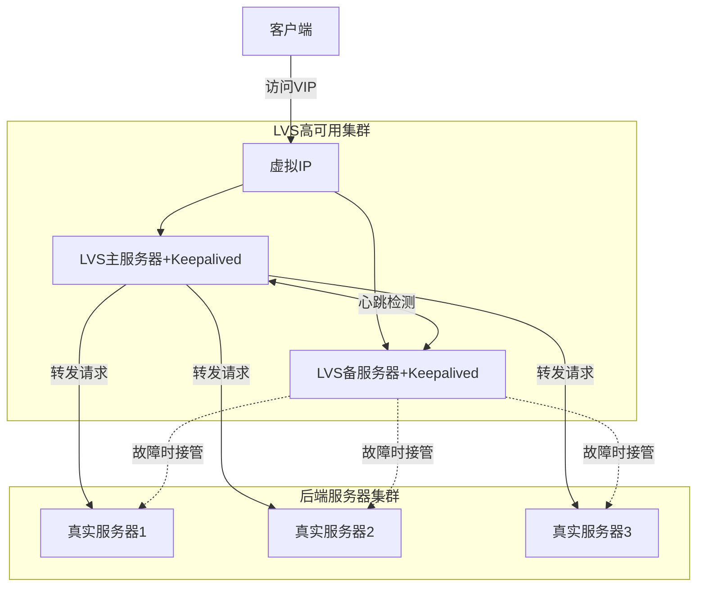

# LVS+KeepAlived高可用集群

## 引言
在前面的章节中，我们学习了如何使用Nginx部署各种后端服务（Java、NodeJS、Python、Go等）。虽然这些服务可以通过横向扩展来提高可用性，但是我们面临一个关键问题：如果Nginx服务器本身发生故障，整个系统将无法访问。那么，如何解决这个单点故障问题呢？这就需要引入LVS（Linux Virtual Server）和Keepalived这两个强大的工具。

## TCP/IP协议与负载均衡
在介绍LVS之前，我们先回顾一下TCP/IP协议的七层模型，这有助于我们理解不同负载均衡技术的工作原理：

1. **应用层（第7层）**
   - 协议：HTTP、FTP、SMTP等
   - 负载均衡：Nginx、HAProxy（HTTP模式）
   - 特点：可以理解应用层协议，支持基于URL、Cookie的转发

2. **表示层（第6层）**
   - 功能：数据格式转换、加密解密
   - 例如：SSL/TLS加密

3. **会话层（第5层）**
   - 功能：建立、维护和断开会话
   - 例如：SSH协议（远程登录会话）、SQL会话、RPC会话
   - 特点：负责管理应用程序之间的会话，确保数据的可靠传输

4. **传输层（第4层）**
   - 协议：TCP、UDP
   - 负载均衡：LVS、HAProxy（TCP模式）
   - 特点：根据IP和端口转发，性能好，无法理解应用协议

5. **网络层（第3层）**
   - 协议：IP、ICMP
   - 功能：负责数据包的路由和转发

6. **数据链路层（第2层）**
   - 协议：以太网协议
   - 功能：处理相邻节点之间的通信

7. **物理层（第1层）**
   - 功能：比特流的传输
   - 例如：网线、光纤等物理介质

## LVS简介
LVS（Linux Virtual Server）是Linux内核自带的负载均衡调度器，由章文嵩博士发起的开源项目。它工作在网络层（第4层），这意味着它可以处理任何基于TCP/UDP的应用，如HTTP、FTP、SMTP等。与工作在应用层的Nginx相比，LVS无法理解应用层协议的内容，但处理性能更高。

在LVS架构中，负载均衡服务器被称为Director（指挥者/导向器），因为它负责接收所有用户请求并将其分发到后端的真实服务器（Real Server）。Director就像一个交通指挥员，根据配置的调度算法，将用户的访问请求合理地分配到不同的后端服务器上。

LVS具有以下特点：

1. **高性能**：工作在内核态，直接处理网络包，性能极高
2. **稳定性好**：作为内核的一部分，经过长期验证
3. **功能丰富**：支持多种负载均衡算法
4. **可扩展性强**：可以轻松处理大规模集群

### LVS的工作模式
LVS支持三种工作模式：

1. **NAT模式（Network Address Translation）**
   - 请求和响应都需要经过Director
   - 支持对任意端口的服务进行负载均衡
   - 扩展性较差，因为所有流量都经过Director

2. **DR模式（Direct Routing）**
   - 请求经过Director，响应直接返回给客户端
   - 性能最好，使用最广泛
   - 要求Director和后端服务器在同一个物理网络

3. **TUN模式（IP Tunneling）**
   - 通过IP隧道技术实现
   - 后端服务器可以跨网段部署
   - 配置相对复杂

### LVS的调度算法
1. **轮询（Round Robin）**：按顺序轮流分配
2. **加权轮询（Weighted Round Robin）**：按权重比例分配
3. **最少连接（Least Connection）**：优先分配给连接数最少的服务器
4. **加权最少连接（Weighted Least Connection）**：结合权重和最少连接

## Keepalived简介
Keepalived是一个用于实现高可用性（HA）的开源软件。它主要提供两个功能：

1. **健康检查**：监控服务器和服务的状态
2. **VRRP协议实现**：虚拟路由冗余协议，实现IP故障转移

### Keepalived的主要特点
1. **自动故障转移**：当主服务器故障时，自动切换到备用服务器
2. **配置简单**：使用简单的配置文件即可实现复杂的HA功能
3. **灵活的健康检查**：支持多种检查方式（TCP、HTTP、脚本等）
4. **可扩展性**：支持配置多个虚拟IP（VIP）

## LVS+Keepalived架构图

## 工作原理
1. **正常状态**：
   - 主LVS服务器（Master）持有虚拟IP（VIP）
   - 客户端的请求发送到VIP
   - Master负责将请求分发到后端真实服务器
   - Keepalived持续监控服务状态

2. **故障切换**：
   - 当Master发生故障时
   - Keepalived检测到故障
   - 备用LVS服务器（Backup）接管VIP
   - 服务继续运行，客户端无感知

## 总结
LVS+Keepalived的组合为我们提供了一个强大的高可用负载均衡解决方案：
- LVS提供高性能的负载均衡
- Keepalived确保LVS的高可用性
- 整体架构没有单点故障
- 服务器故障时能够自动切换

这种架构特别适合大规模的Web应用，能够确保服务的持续可用性，是构建高可用系统的重要基础设施。

## 云服务商的负载均衡服务
在云计算时代，各大云服务商都提供了成熟的负载均衡服务，比如：

1. **阿里云SLB（Server Load Balancer）**
   - 提供四层和七层负载均衡
   - 自动故障转移
   - 弹性扩展
   - 安全防护

2. **AWS ELB（Elastic Load Balancing）**
   - 应用负载均衡器（ALB）：七层负载均衡
   - 网络负载均衡器（NLB）：四层负载均衡
   - 经典负载均衡器（CLB）：同时支持四层和七层

使用云服务商提供的负载均衡服务的优势：
1. **无需自建维护**：不需要自己搭建和维护LVS+Keepalived这样的高可用集群
2. **按需付费**：根据实际使用量计费，更经济
3. **一键部署**：快速配置，操作简单
4. **安全可靠**：由云服务商保障服务的高可用性
5. **弹性伸缩**：可以根据业务需求自动调整配置

在实际项目中，如果使用云服务，建议优先考虑云服务商提供的负载均衡服务，这样可以大大减少运维工作量，提高系统的可靠性。

graph TD
    Client[客户端] -->|访问VIP: 192.168.110.200| VIP[虚拟IP]
    subgraph LVS高可用集群
        VIP --> |流量转发| Master[主节点 192.168.110.203 LVS+Keepalived Master]
        VIP -.->|故障切换| Backup[备节点 192.168.110.204 LVS+Keepalived Backup]
        Master <-->|心跳检测| Backup
    end
    subgraph Nginx服务器
        Master -->|转发到10080/10443| Nginx1[Nginx主节点 192.168.110.203 端口:10080/10443]
        Master -->|转发到10080/10443| Nginx2[Nginx备节点 192.168.110.204 端口:10080/10443]
        Backup -.->|故障时接管| Nginx1
        Backup -.->|故障时接管| Nginx2
    end