# Nginx 面试题与答案

## Nginx 基础与核心

**1. 什么是Nginx？它的主要功能有哪些？**

**答案:**

Nginx (发音为 "engine-x") 是一款高性能、开源的Web服务器软件。它最初是为了解决C10K问题（即单台服务器如何处理一万个并发连接）而设计的，但现在它的功能已经远不止于此。

你可以把它想象成一个网络世界的“交通警察”或“调度中心”。

**主要功能:**

*   **Web服务器 (Web Server):** 和 Apache 一样，它可以直接向用户的浏览器发送静态文件（如HTML页面、CSS样式表、图片等）。
*   **反向代理 (Reverse Proxy):** 这是Nginx最核心和最常用的功能。它作为客户端和后端真实服务器之间的中间人。客户端只与Nginx通信，Nginx再根据配置将请求转发给后端的应用服务器。这样做的好处是：
    *   **安全:** 隐藏了后端服务器的真实IP地址。
    *   **负载均衡:** 将请求分发到多个服务器，避免单点过载。
    *   **缓存:** 缓存常用内容，加快响应速度。
*   **负载均衡 (Load Balancer):** 当你的网站访问量很大时，一台服务器可能不够用。Nginx可以将大量的用户请求平均分配给多台后端服务器，从而提高整个系统的处理能力和可靠性。
*   **邮件代理 (Mail Proxy):** Nginx也可以为IMAP, POP3, SMTP等邮件协议提供代理服务。
*   **通用TCP/UDP代理 (Generic TCP/UDP Proxy):** 不仅限于HTTP，Nginx也可以代理任何基于TCP或UDP的流量。

**Mermaid 结构图 (反向代理):**

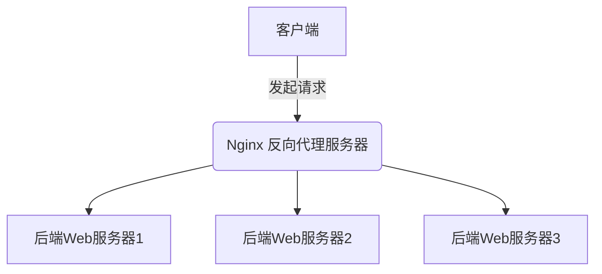

### 20. Nginx如何实现反向代理？请提供一个简单的配置示例。

**答案:**

Nginx实现反向代理主要依赖于`proxy_pass`指令。反向代理是指以代理服务器来接受客户端的连接请求，然后将请求转发给内部网络上的服务器，并将从服务器上得到的结果返回给客户端，此时代理服务器对外就表现为一个服务器。

**核心概念:**

*   **客户端 (Client):** 发起请求的用户浏览器或应用。
*   **Nginx (Reverse Proxy):** 接收客户端请求，并决定将请求转发到哪个后端服务。
*   **后端服务器 (Backend Server):** 实际处理请求并提供业务逻辑的应用服务器（如Tomcat, Django, Node.js等）。

**Mermaid 结构图:**

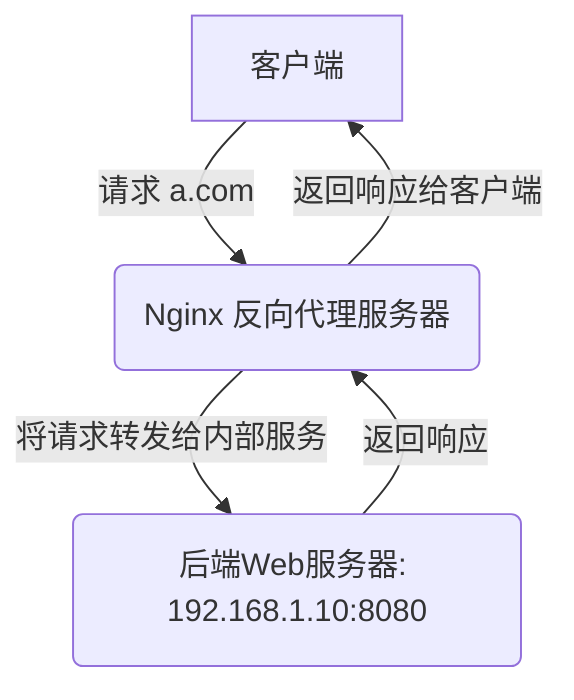

**简单配置示例:**

假设我们有一个在`localhost:8080`运行的后端应用（比如一个Python Flask或Java Spring Boot应用），我们希望通过Nginx，让用户访问`http://your_domain.com`时，能够访问到这个应用。

```nginx
server {
    listen 80;
    server_name your_domain.com;

    # 根路径的请求处理
    location / {
        # proxy_pass 是核心指令，用于指定后端服务器的地址
        # Nginx会将所有匹配到这个location的请求转发到这里
        proxy_pass http://localhost:8080;

        # (可选但推荐) 设置一些代理相关的HTTP头部
        # 这些头部信息可以帮助后端应用获取到真实的客户端信息

        # 将客户端的真实IP地址传递给后端
        proxy_set_header X-Real-IP $remote_addr;

        # 传递客户端IP的另一种方式，在有多级代理时更有用
        proxy_set_header X-Forwarded-For $proxy_add_x_forwarded_for;

        # 传递原始请求的Host头部
        proxy_set_header Host $host;

        # 允许WebSocket连接
        proxy_http_version 1.1;
        proxy_set_header Upgrade $http_upgrade;
        proxy_set_header Connection "upgrade";
    }

    # 你还可以代理其他路径
    location /api/ {
        proxy_pass http://api_server_address;
        # ... 其他配置
    }
}
```

**配置解释:**

1.  `listen 80;`: Nginx监听80端口，这是HTTP的标准端口。
2.  `server_name your_domain.com;`: Nginx会处理`Host`头为`your_domain.com`的请求。
3.  `location / { ... }`: 匹配所有进入的请求（因为`/`是所有路径的前缀）。
4.  `proxy_pass http://localhost:8080;`: 这是反向代理的核心。它告诉Nginx将匹配到的请求转发到`http://localhost:8080`。**注意:** 这里的`http://`不能少。
5.  `proxy_set_header ...`: 这些指令用于修改或添加从Nginx转发到后端的请求头。这对于后端应用记录日志、进行IP限制或处理特定逻辑非常重要。
    *   `X-Real-IP`: 传递客户端的真实IP。
    *   `X-Forwarded-For`: 当请求经过多个代理时，此头部会包含一个IP地址列表，记录了请求经过的每一个代理服务器的IP地址。
    *   `Host`: 保证后端应用收到的`Host`头与客户端请求的`Host`头一致。

通过这个配置，当用户访问`http://your_domain.com`时，Nginx会默默地在后台向`http://localhost:8080`发起请求，并将获取到的内容返回给用户，用户完全不知道后端还有一个`8080`端口的应用在服务。

### 21. 什么是负载均衡？Nginx支持哪些负载均衡算法？

**答案:**

**1. 什么是负载均衡？**

负载均衡（Load Balancing）是一种将网络流量（如HTTP请求、数据库连接等）分发到多个后端服务器（也称为服务器集群或服务器池）的技术。其主要目的是：

*   **提高可用性 (High Availability):** 当单个服务器发生故障时，负载均衡器可以自动将流量切换到其他健康的服务器上，从而避免单点故障，保证服务的持续可用。
*   **提升性能和吞吐量 (Performance & Throughput):** 通过将请求分散到多个服务器，可以并行处理更多的请求，减少单个服务器的负载压力，从而提高整体的处理能力和响应速度。
*   **便于水平扩展 (Scalability):** 当业务量增长时，只需向服务器集群中添加新的服务器，即可线性地扩展服务能力，而无需升级单个服务器的硬件。

**Mermaid 结构图:**

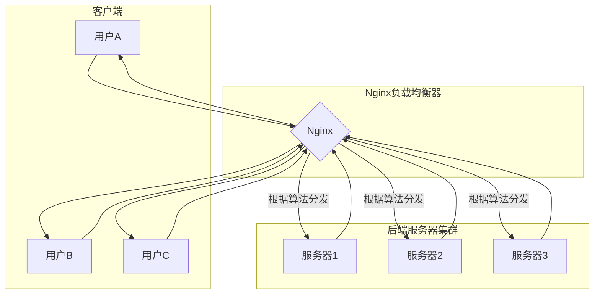

**2. Nginx支持的负载均衡算法**

Nginx实现负载均衡主要通过`upstream`模块。Nginx内置了多种负载均衡算法，可以满足不同场景的需求。

**配置基础:**

```nginx
http {
    # 定义一个名为 backend_servers 的后端服务器集群
    upstream backend_servers {
        # 在这里配置负载均衡算法和服务器列表
        server 192.168.1.10:80;
        server 192.168.1.11:80;
        server 192.168.1.12:80;
    }

    server {
        listen 80;
        server_name your_domain.com;

        location / {
            # 将请求代理到上面定义的服务器集群
            proxy_pass http://backend_servers;
        }
    }
}
```

**内置负载均衡算法:**

| 算法名称 | 指令 | 描述 | 适用场景 |
| :### 22. `proxy_pass`指令中，加与不加`/`有何区别？

**答案:**

在`proxy_pass`指令的URL末尾加不加`/`，是Nginx配置中一个非常关键且容易混淆的细节。它直接决定了Nginx如何将请求的URI映射到后端服务器。

**核心规则总结:**

1.  **`proxy_pass` 的URL不带`/` (例如 `http://backend`)**: Nginx会将**完整的原始请求URI**直接拼接到后端URL。 `请求URI` -> `后端URL` + `请求URI`
2.  **`proxy_pass` 的URL带`/` (例如 `http://backend/`)**: Nginx会将`location`匹配到的部分从请求URI中**剔除**，然后将剩余部分拼接到后端URL。 `请求URI` - `location匹配部分` -> `后端URL` + `剩余URI部分`

**场景对比分析:**

假设我们有以下后端服务器和Nginx配置的基础结构：

*   **后端服务器地址:** `http://127.0.0.1:8080`
*   **Nginx location 块:** `location /app/ { ... }`
*   **客户端请求URL:** `http://your_domain.com/app/user/profile`

### 23. 如何配置Nginx的健康检查（health check）？

**答案:**

Nginx的健康检查是负载均衡中至关重要的一环，它能自动检测后端服务器的健康状况，并将请求从故障服务器上移开，从而保证服务的高可用性。

Nginx开源版本身不直接提供主动的、复杂的健康检查功能（像HAProxy那样）。但它提供了两种机制来实现健康检查：

1.  **被动健康检查 (Passive Health Check):** 这是Nginx开源版内置的功能，通过`upstream`模块的参数来实现。
2.  **主动健康检查 (Active Health Check):** 这需要使用商业版的`Nginx Plus`或第三方的模块，如`nginx_upstream_check_module`。

对于初学者，掌握**被动健康检查**是必须的。

### 24. 什么是动静分离？如何通过Nginx实现？

**答案:**

**1. 什么是动静分离？**

动静分离是一种网站架构优化技术。它将网站的资源分为“静态资源”和“动态资源”，并由不同的服务器或服务来处理，以提高网站的性能和并发能力。

*   **静态资源 (Static Content):**
    *   **定义:** 指的是内容固定不变的文件，无论何时、由何人访问，得到的内容都是一样的。
    *   **示例:** HTML文件、CSS样式表、JavaScript脚本、图片（JPG, PNG, GIF）、字体文件、视频文件等。
    *   **特点:** 无需后端程序处理，可以直接由Web服务器（如Nginx）读取并返回给客户端。可以被浏览器或CDN轻松缓存。

*   **动态资源 (Dynamic Content):**
    *   **定义:** 指的是内容需要经过后端应用程序处理后才能生成的文件。内容通常是可变的，依赖于用户请求、数据库中的数据等因素。
    *   **示例:** JSP、PHP、ASP.NET页面，需要查询数据库生成的API接口数据（JSON/XML）。
    *   **特点:** 需要消耗CPU和内存资源进行计算，处理速度相对较慢。

**动静分离的核心思想:**

利用Nginx处理静态资源极快的能力，将所有静态资源的请求直接由Nginx处理，而将动态资源的请求通过反向代理转发给后端的应用服务器（如Tomcat, uWSGI, PHP-FPM）去处理。这样可以极大地减轻后端应用服务器的压力，让它专注于处理复杂的业务逻辑。

**Mermaid 结构图:**

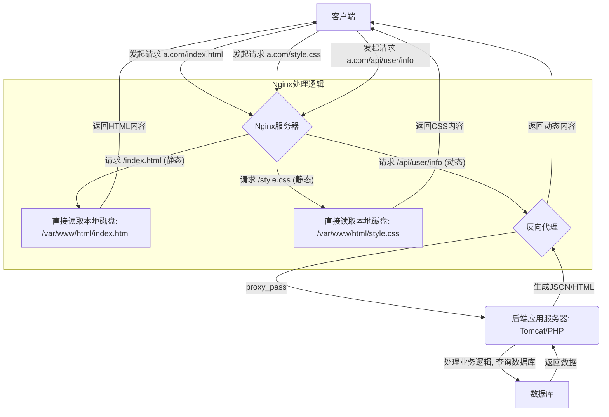

**2. 如何通过Nginx实现动静分离？**

实现动静分离主要依靠Nginx强大的`location`匹配规则和`root`/`alias`、`proxy_pass`指令的配合。

**配置示例:**

假设我们的网站文件结构如下:
```
/data/www/
├── static/
│   ├── css/style.css
│   ├── js/main.js
│   └── images/logo.png
└── index.html
```
后端应用服务器运行在`http://127.0.0.1:8080`。

```nginx
server {
    listen 80;
    server_name your_domain.com;

    # 默认的根目录，可以用于处理如 /index.html 这样的请求
    root /data/www;
    index index.html;

    # 匹配所有以 .css, .js, .png, .jpg, .gif 等结尾的静态文件请求
    # 使用正则表达式进行匹配
    location ~* \.(css|js|png|jpg|jpeg|gif|ico)$ {
        # 设置静态资源的根目录
        root /data/www/static;
        
        # (可选但推荐) 设置浏览器缓存时间，减少服务器压力
        expires 30d;
        
        # (可选) 关闭这个location的访问日志，减少磁盘IO
        access_log off;
    }

    # 匹配所有以 /api/ 开头的动态请求
    location /api/ {
        # 将这些请求转发给后端应用服务器
        proxy_pass http://127.0.0.1:8080;

        # 附带上真实的客户端IP等信息
        proxy_set_header Host $host;
        proxy_set_header X-Real-IP $remote_addr;
        proxy_set_header X-Forwarded-For $proxy_add_x_forwarded_for;
    }

    # 如果有其他动态请求，例如PHP
    # location ~ \.php$ {
    #     proxy_pass http://127.0.0.1:9000; # 转发给php-fpm
    #     ...
    # }
}
```

**配置解释:**

1.  **`location ~* \.(css|js|...)$`**: 这是一个使用正则表达式的`location`块。
    *   `~*`: 表示进行不区分大小写的正则表达式匹配。
    *   `\.`: `.`是正则表达式元字符，需要转义。
    *   `(css|js|...)`: 匹配括号内任意一个后缀。
    *   `$`: 匹配字符串结尾。
    当一个请求，如`http://your_domain.com/css/style.css`进来时，它会被这个`location`块捕获。
2.  **`root /data/www/static;`**: 在这个`location`块内，Nginx会去`/data/www/static`目录下寻找请求的文件。对于`/css/style.css`的请求，Nginx会寻找物理路径`/data/www/static/css/style.css`并返回。
3.  **`expires 30d;`**: 设置HTTP响应头中的`Expires`和`Cache-Control`，告诉浏览器这个资源可以在本地缓存30天，极大地提升了二次访问的速度。
4.  **`location /api/ { ... }`**: 匹配所有以`/api/`开头的URI。这些通常是API接口请求，被认为是动态的。
5.  **`proxy_pass http://127.0.0.1:8080;`**: 将匹配到的动态请求全部转发给后端应用服务器处理。

通过这种方式，Nginx高效地处理了它最擅长的静态文件I/O，而将计算密集型的任务交给了后端的专职应用服务器，实现了职责分离和性能最大化。

### 25. Nginx如何配置HTTPS？请说明关键指令和配置过程。

**答案:**

配置HTTPS是现代Web服务的标配，它通过SSL/TLS协议对HTTP流量进行加密，确保数据在客户端和服务器之间传输的安全性，防止数据被窃取或篡改。在Nginx中配置HTTPS主要涉及获取SSL证书和修改Nginx配置文件两个步骤。

**核心概念:**

*   **SSL/TLS证书:** 一个数字文件，包含公钥、域名信息以及证书颁发机构（CA）的签名。它用于向客户端证明服务器的身份，并用于加密通信。
*   **私钥 (Private Key):** 与证书配对的密钥，必须安全地存放在服务器上，用于解密客户端发来的数据。
*   **证书链 (Certificate Chain):** 除了服务器证书，通常还需要一个中级证书（Intermediate Certificate），用于将你的证书链接到受信任的根CA。

**Mermaid 结构图 (TLS握手简化流程):**

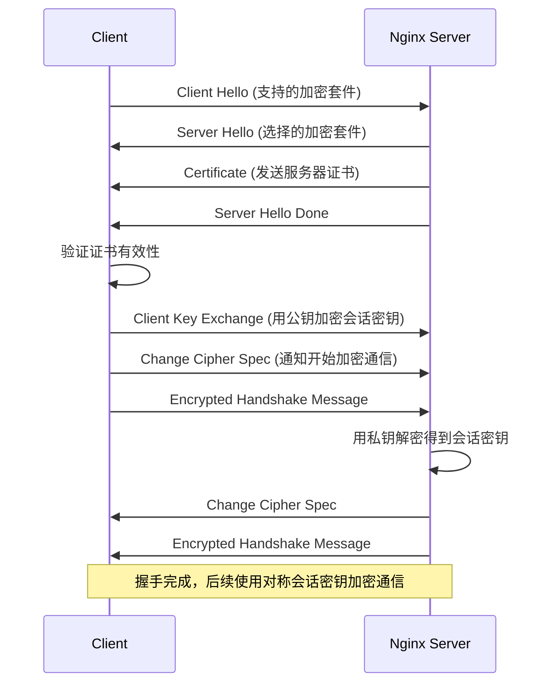

### 26. 什么是C10K问题？Nginx是如何解决的？

**答案:**

**1. 什么是C10K问题？**

C10K问题（Connection 10,000 Problem）是一个在20世纪90年代末被提出的技术挑战，指的是**如何在一台物理服务器上，同时处理和维持一万个（10K）并发连接**。

在那个时代，主流的网络服务器（如Apache）采用的是**“一个连接一个进程/线程” (Process/Thread Per Connection)** 的模型。这种模型的缺点是：

*   **资源消耗大:** 每建立一个连接，操作系统就需要创建一个新的进程或线程。进程/线程是相对“重”的资源，包含独立的内存空间、上下文等。创建成千上万个进程/线程会消耗大量的内存和CPU资源。
*   **上下文切换开销高:** 当CPU需要在多个进程/线程之间切换时，会发生“上下文切换”，这需要保存当前任务的状态，加载新任务的状态，是一个非常耗时的操作。当连接数非常多时，CPU会把大量时间浪费在上下文切换上，而不是真正地处理请求。
*   **扩展性差:** 由于上述两个原因，这种模型的并发能力很快就会达到瓶颈，无法轻松扩展到数万甚至数十万的连接。

因此，C10K问题的本质是：**如何在操作系统层面，用更高效的I/O模型来处理大量的并发连接，以避免传统服务器模型的瓶颈。**

**Mermaid 结构图 (传统模型 vs Nginx模型):**

```mermaid
graph TD
    subgraph 传统模型 (Apache pre-fork)
        C1[连接1] --> P1[进程1]
        C2[连接2] --> P2[进程2]
        C3[连接3] --> P3[进程3]
        C4[...] --> P4[...]
        C10k[连接10000] --> P10k[进程10000]
        P1 & P2 & P3 & P4 & P10k --> |大量内存占用和CPU上下文切换| R1((资源耗尽))
    end

    subgraph Nginx模型 (事件驱动)
        CC1[连接1] & CC2[连接2] & CC3[连接3] & CC4[...] & CC10k[连接10000] --> |所有连接注册到epoll| E(I/O多路复用: epoll)
        E --> |当连接有事件(如数据到达)时通知| WP{Worker进程池}
        WP --> |从有限的进程池中取一个来处理| H[处理事件]
        H --> |处理完后继续等待新事件| E
        WP --> |少量进程处理海量连接| R2((高效稳定))
    end
```

### 27. 请解释Nginx的Master-Worker进程模型及其优势。

**答案:**

Nginx的Master-Worker进程模型是其高性能、高稳定性的基石。这个模型将Nginx的功能职责清晰地划分到两种不同角色的进程中：一个**Master主进程**和多个**Worker工作进程**。

**1. 模型构成与职责**

*   **Master 主进程 (管理者):**
    *   **职责:**
        1.  **读取和验证配置:** 启动时，Master进程负责读取`nginx.conf`等配置文件，并检查语法是否正确。
        2.  **创建和管理Worker进程:** 根据配置（如`worker_processes`指令）创建指定数量的Worker进程。
        3.  **监控Worker进程:** Master进程会持续监控Worker进程的运行状态。如果某个Worker进程因故异常退出，Master会立即重新启动一个新的Worker进程来替代它，保证了服务的健壮性。
        4.  **处理控制信号:** Master进程接收来自外部的控制信号，如`nginx -s reload`（平滑重载配置）、`nginx -s stop`（快速关闭）等，并根据信号来管理Worker进程。
        5.  **绑定端口:** Master进程负责绑定80、443等特权端口（小于1024的端口需要root权限）。Worker进程会继承这些监听套接字。
    *   **特点:** Master进程本身**不处理任何客户端的网络请求**。它非常轻量，只负责管理工作，因此非常稳定，不容易崩溃。

*   **Worker 工作进程 (执行者):**
    *   **职责:**
        1.  **接收和处理连接:** 每个Worker进程都通过`accept()`系统调用来接收新的客户端连接（通过`accept_mutex`机制来避免“惊群效应”）。
        2.  **处理请求和响应:** Worker进程负责读取请求、处理请求（如作为Web服务器提供静态文件，或作为反向代理将请求转发给后端），并将响应数据返回给客户端。
        3.  **执行事件循环:** 每个Worker进程内部都维护一个高效的事件循环（基于`epoll`或`kqueue`），以异步非阻塞的方式处理成千上万的并发连接。
    *   **特点:** Worker进程是真正干活的进程，消耗CPU和内存。它们通常以一个**非特权用户**（如`nobody`或`www-data`）的身份运行，增加了系统的安全性。

**Mermaid 结构图:**

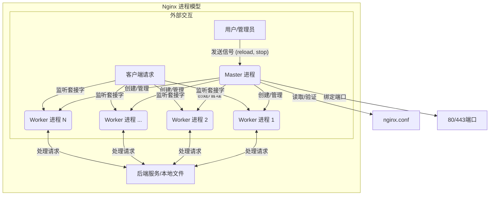

### 28. Nginx的`worker_processes`和`worker_connections`指令有什么作用？如何优化它们？

**答案:**

`worker_processes`和`worker_connections`是Nginx配置中两个至关重要的性能调优指令。它们共同决定了Nginx服务器能够处理的总并发连接数，直接影响其性能和资源利用率。

**1. 指令的作用**

*   **`worker_processes`**
    *   **作用:** 定义Nginx启动时创建的**Worker进程的数量**。
    *   **上下文:** 主配置块 (main context)。
    *   **示例:** `worker_processes 4;` 或 `worker_processes auto;`
    *   **解释:** 这个指令告诉Master进程应该创建并维护多少个Worker子进程来处理客户端的请求。如上一题所述，这些Worker进程是真正处理网络请求的实体。

*   **`worker_connections`**
    *   **作用:** 定义**每个Worker进程**能够同时打开的**最大连接数**。
    *   **上下文:** `events`配置块。
    *   **示例:** `events { worker_connections 1024; }`
    *   **解释:** 这个数字包括了所有类型的连接，即**与客户端的连接**和**与后端代理服务器的连接**。因此，一个Worker进程能处理的并发**客户端请求数**实际上会小于`worker_connections`的值（当作为反向代理时）。

**2. Nginx总并发连接数计算**

Nginx服务器理论上的最大并发连接数可以通过以下公式计算：

**`最大并发连接数 = worker_processes * worker_connections`**

例如，如果`worker_processes`为4，`worker_connections`为1024，那么Nginx理论上可以同时处理 `4 * 1024 = 4096` 个连接。

**Mermaid 结构图: 计算关系**

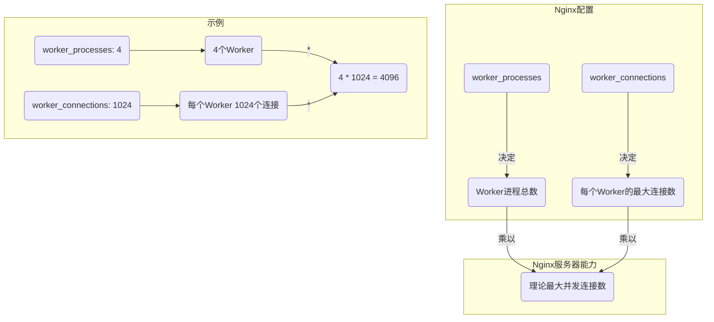

### 29. 什么是Nginx的惊群效应（Thundering Herd）？如何避免？

**答案:**

“惊群效应”是多进程/多线程服务器编程中一个经典的性能问题。在Nginx的场景下，它指的是当一个**新的客户端连接**到达时，所有**空闲的Worker进程**都会被同时唤醒，但最终只有一个Worker进程能够成功地`accept()`这个连接，而其他被唤醒的Worker进程则会`accept()`失败并重新进入休眠状态。这个过程造成了不必要的CPU资源浪费和上下文切换，在高并发下会降低服务器的整体性能。

**1. 惊群效应的产生过程**

1.  **共享监听套接字:** Master进程在启动时创建监听套接字（Listen Socket），所有Worker进程都继承（`fork`）了这个套接字。
2.  **等待连接:** 所有空闲的Worker进程都阻塞在`accept()`系统调用上，等待新的连接到来。
3.  **新连接到达:** 当一个TCP连接请求到达内核时，内核会通知所有正在等待这个套接字的进程。
4.  **集体唤醒:** 所有阻塞的Worker进程都被内核唤醒，从休眠状态转换到就绪状态，并尝试去`accept()`这个连接。
5.  **争抢与浪费:** 只有一个幸运的Worker进程能成功`accept()`连接并开始处理。其他所有Worker进程的`accept()`调用都会失败（返回`EAGAIN`错误），然后它们只好再次进入休眠状态，等待下一个连接。这一瞬间大量的、无效的进程唤醒和上下文切换，就是“惊群效应”。

**Mermaid 结构图: 惊群效应图解**

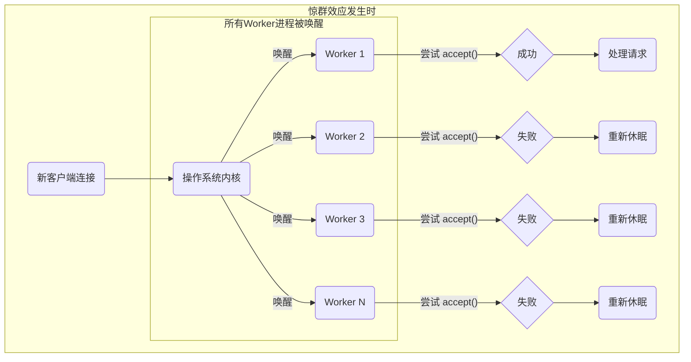

### 30. Nginx中如何配置location的匹配规则？请解释`=`、`~`、`~*`、`^~`的区别。

**答案:**

`location`块是Nginx配置中最为核心和灵活的部分之一。它根据用户请求的URI（Uniform Resource Identifier，即URL中域名后面的部分），来决定使用哪一套配置指令来处理这个请求。理解`location`的匹配规则和不同修饰符的优先级，是编写高效、正确Nginx配置的关键。

**1. `location`修饰符详解**

Nginx的`location`指令主要有以下几种修饰符，它们的优先级和匹配方式各不相同：

| 修饰符 | 名称                 | 匹配规则                                       | 优先级 | 备注                                       |
| :### 31. 请解释`root`和`alias`指令的区别。

**答案:**

`root`和`alias`是Nginx中用于指定`location`块所对应文件系统路径的两个核心指令。虽然它们都用于定义静态资源的根目录，但它们在处理请求URI和拼接最终文件路径的方式上存在一个关键的、微妙的差异。理解这个差异对于正确配置静态文件服务至关重要。

**1. `root` 指令**

*   **定义:** `root`指令定义了一个**根目录**。Nginx会将请求的URI**完整地**附加到`root`指定的路径后面，形成最终要查找的文件路径。
*   **语法:** `root path;`
*   **拼接规则:** `最终文件路径 = root指定的路径 + 请求的URI`

**`root` 配置示例:**

```nginx
location /static/ {
    root /var/www/data;
    # 当请求 /static/images/logo.png 时:
    # root路径: /var/www/data
    # 请求URI: /static/images/logo.png
    # 最终查找路径: /var/www/data/static/images/logo.png
}
```

**2. `alias` 指令**

*   **定义:** `alias`指令定义了一个**别名**。Nginx会用`alias`指定的路径**替换掉**`location`匹配到的那部分URI，然后将URI中剩余的部分附加到`alias`路径后面。
*   **语法:** `alias path;`
*   **拼接规则:** `最终文件路径 = alias指定的路径 + (请求URI - location匹配部分)`

**`alias` 配置示例:**

```nginx
location /static/ {
    alias /var/www/data/assets/;
    # 当请求 /static/images/logo.png 时:
    # alias路径: /var/www/data/assets/
    # location匹配部分: /static/
    # 请求URI中剩余部分: images/logo.png
    # 最终查找路径: /var/www/data/assets/images/logo.png
}
```

**3. 核心区别对比**

| 特性       | `root`                                       | `alias`                                        |
| :### 32. Nginx中的`try_files`指令有什么作用？请举例说明。

**答案:**

`try_files`是Nginx中一个非常强大且高效的指令，它主要用于按顺序检查一系列文件或目录是否存在。如果找到第一个存在的文件，就直接返回其内容；如果所有指定的文件或目录都不存在，它会执行一个内部重定向到最后一个参数指定的URI或返回一个HTTP状态码。

这个指令优雅地解决了Web开发中常见的“如果文件存在则服务，否则执行特定逻辑”的需求，并且性能远高于使用`if`指令进行文件存在性判断。

**1. `try_files`的语法和工作流程**

*   **语法:** `try_files file1 [file2 ...] fallback;`
*   **上下文:** `server`, `location`

**工作流程:**

1.  Nginx会根据`root`或`alias`指令定义的根路径，开始检查`file1`是否存在。
2.  如果`file1`存在，Nginx就直接返回该文件的内容，处理过程结束。
3.  如果`file1`不存在，Nginx继续检查`file2`是否存在。
4.  ...这个过程会一直持续，直到找到一个存在的文件为止。
5.  如果前面所有的`file`参数都不存在，Nginx会执行**最后一个参数**（`fallback`）定义的操作。这个`fallback`可以是：
    *   一个**URI** (如 `/index.html`)：Nginx会发起一个**内部重定向**到这个URI，请求会重新被`location`匹配流程处理。
    *   一个**命名`location`** (如 `@fallback`)：Nginx会跳转到这个命名`location`块中继续处理。
    *   一个**状态码** (如 `=404`)：Nginx会直接返回指定的HTTP状态码。

**Mermaid 结构图: `try_files` 工作流程**

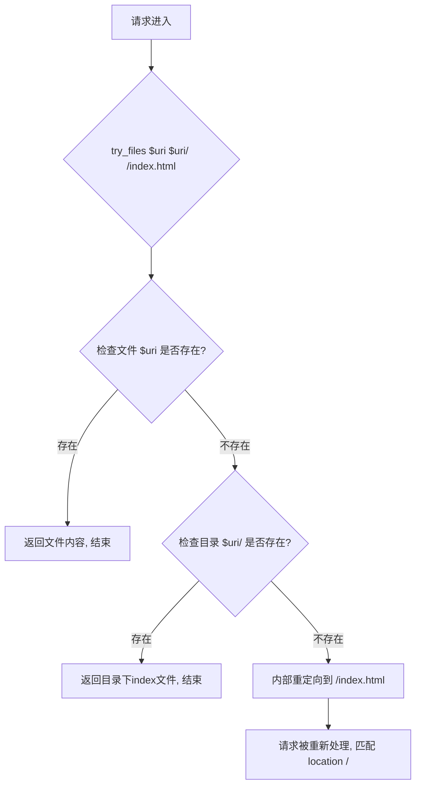

### 33. 如何配置Nginx以防止DDoS攻击？请列举一些常用指令。

**答案:**

Nginx本身虽然不是专业的DDoS防护设备（如硬件防火墙或云DDoS防护服务），但通过其丰富的模块和指令，可以有效地缓解和抵御应用层的DDoS攻击（第七层攻击），例如HTTP Flood攻击。配置Nginx进行基础的DDoS防护是运维工作中的重要一环。

核心思想是**限制单个客户端的资源消耗**，从而防止恶意客户端耗尽服务器资源。

**1. 核心防护指令与策略**

**策略一：限制连接数 (Rate Limiting Connections)**

此策略用于限制来自单个IP地址的并发连接总数。

*   **`limit_conn_zone`**
    *   **作用:** 定义一个共享内存区域（zone），用于存储每个IP地址的连接数状态。
    *   **语法:** `limit_conn_zone key zone=name:size;`
    *   **上下文:** `http`
*   **`limit_conn`**
    *   **作用:** 在指定的`server`, `location`, 或 `http`块中，应用`limit_conn_zone`定义的规则，限制每个IP的并发连接数。
    *   **语法:** `limit_conn zone_name number;`
    *   **上下文:** `http`, `server`, `location`

**策略二：限制请求速率 (Rate Limiting Requests)**

此策略用于限制来自单个IP地址的请求处理速率（如每秒/每分钟处理多少个请求）。这是对抗HTTP Flood攻击最有效的手段之一。

*   **`limit_req_zone`**
    *   **作用:** 定义一个共享内存区域，用于存储每个IP地址的请求速率状态。
    *   **语法:** `limit_req_zone key zone=name:size rate=rate;`
    *   **上下文:** `http`
*   **`limit_req`**
    *   **作用:** 应用`limit_req_zone`定义的规则，限制请求速率。
    *   **语法:** `limit_req zone=zone_name [burst=number] [nodelay];`
    *   **上下文:** `http`, `server`, `location`
    *   **`burst` (突发队列):** 允许客户端在短时间内超过设定的速率，多余的请求会进入一个队列等待处理。这可以应对正常的突发流量，提升用户体验。
    *   **`nodelay`:** 与`burst`配合使用。如果不希望突发请求被延迟处理，而是立即处理并返回`503`错误，则使用此选项。

**策略三：控制超时时间 (Controlling Timeouts)**

恶意连接可能会长时间保持连接而不发送数据（慢速攻击），以消耗服务器资源。合理设置超时时间可以快速释放这些无效连接。

*   `client_body_timeout 10s;`: 读取客户端请求体的超时时间。
*   `client_header_timeout 10s;`: 读取客户端请求头的超时时间。
*   `keepalive_timeout 5s 5s;`: 设置keep-alive连接的超时时间。
*   `send_timeout 10s;`: 向客户端发送响应的超时时间。

**策略四：限制请求体大小 (Limiting Body Size)**

防止客户端上传巨大的文件，消耗磁盘空间和带宽。

*   `client_max_body_size 2m;`: 限制客户端请求体的最大为2MB。

**Mermaid 结构图: Nginx DDoS 防护层**

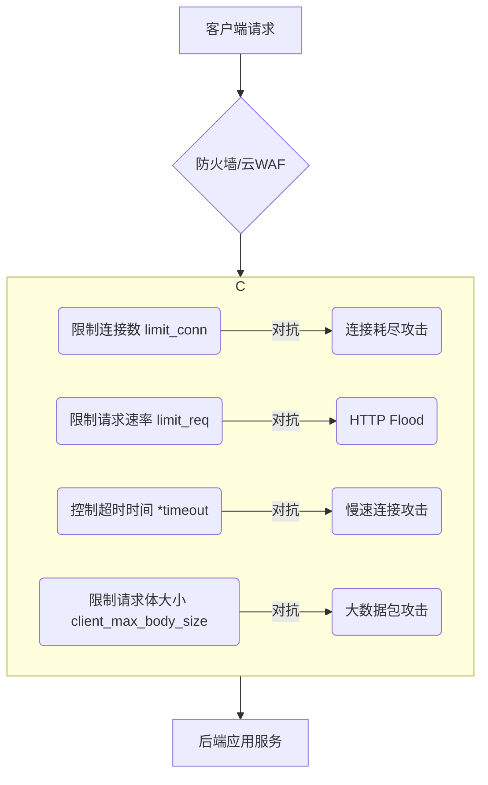

### 34. 什么是Nginx的Rewrite功能？请解释`last`和`break`标志的区别。

**答案:**

Nginx的Rewrite功能是其强大的URL处理能力的核心体现。它允许你根据指定的正则表达式来改变（重写）请求的URI。这个功能广泛应用于URL标准化、域名跳转、路径伪装、以及将用户友好的URL映射到内部应用结构等场景。

Rewrite功能主要通过`rewrite`指令和`return`、`if`等相关指令共同实现。

**1. `rewrite`指令详解**

*   **语法:** `rewrite regex replacement [flag];`
*   **上下文:** `server`, `location`, `if`
*   **参数:**
    *   `regex`: 一个PCRE（Perl兼容正则表达式），用于匹配请求的URI。
    *   `replacement`: 匹配成功后，用于替换URI的字符串。可以包含Nginx变量和正则捕获组（如`$1`, `$2`）。
    *   `flag`: 一个可选的标志，用于控制重写后的行为。最重要的标志是`last`和`break`。

**2. `last` vs `break`：核心区别**

`last`和`break`是两个非常容易混淆但行为截然不同的标志。它们都表示“停止处理当前`location`块中的后续`rewrite`指令”，但它们对重写后的URI的处理方式完全不同。

*   **`last` (重新开始循环)**
    *   **行为:** 当一个`rewrite`指令被`last`标志触发后，Nginx会**立即停止**当前`location`块中的后续指令，然后将**重写后的新URI**重新发起一个**新的`location`匹配周期**。请求会从头开始，寻找能匹配新URI的`location`块。
    *   **可以理解为：** “URL改好了，我们从头再来找一遍路。”
    *   **应用场景:** 当你希望重写后的URL被另一个`location`块处理时，使用`last`。

*   **`break` (中断并继续)**
    *   **行为:** 当一个`rewrite`指令被`break`标志触发后，Nginx会**立即停止**当前`location`块中的后续`rewrite`指令，但是它**不会**重新发起`location`匹配。它会**继续执行当前`location`块中剩余的其他指令**（如`proxy_pass`, `root`等），使用的是**已经重写过的URI**。
    *   **可以理解为：** “URL改好了，就在这里接着处理吧，别再去找别的路了。”
    *   **应用场景:** 当你只是想在当前`location`内部改变URI，并由当前`location`的后续指令（如`proxy_pass`）来处理这个新URI时，使用`break`。

**Mermaid 结构图: `last` vs `break` 流程对比**

```mermaid
flowchart TD
    subgraph "使用 last"
        A[请求 /a] --> LA{location /a { rewrite /a /b last; }}
        LA --> R1[URI重写为 /b]
        R1 --> S1{开始新的location匹配}
        S1 --> LB{location /b { ... }}
        LB --> F1[由 location /b 处理]
    end

    subgraph "使用 break"
        B[请求 /c] --> LC{location /c { rewrite /c /d break; proxy_pass ...; }}
        LC --> R2[URI重写为 /d]
        R2 --> S2{继续在当前location内执行}
        S2 --> P2[proxy_pass 使用 /d ...]
        P2 --> F2[由 location /c 处理]
    end
```

### 35. 如何配置Nginx实现跨域请求（CORS）？

**答案:**

跨域资源共享（Cross-Origin Resource Sharing, CORS）是一种W3C标准，它允许浏览器向不同源（域、协议或端口）的服务器发起XMLHttpRequest或Fetch API请求。默认情况下，出于安全考虑，浏览器会实施“同源策略”（Same-Origin Policy），禁止这种跨域请求。通过在服务器端配置CORS，我们可以安全地放开这一限制。

在Nginx中配置CORS，主要是通过`add_header`指令来添加一系列`Access-Control-*`开头的HTTP响应头。

**1. 核心概念与HTTP头**

*   **同源策略:** 浏览器的核心安全基石，限制从一个源加载的文档或脚本如何与来自另一个源的资源进行交互。
*   **跨域请求分类:**
    *   **简单请求 (Simple Requests):** 不会触发“预检请求”（Preflight Request）的请求。需满足特定条件（如GET/HEAD/POST方法，特定的Content-Type等）。
    *   **预检请求 (Preflighted Requests):** 在发送实际请求之前，浏览器会先发送一个`OPTIONS`方法的“预检”请求到服务器，以确认服务器是否允许该实际请求。当请求方法为`PUT`, `DELETE`, `PATCH`或包含自定义头（如`X-Custom-Header`）时，会触发预检。

*   **关键CORS响应头:**
    *   `Access-Control-Allow-Origin`: **必需**。指定了允许访问该资源的外部域。可以是单个域名，也可以是`*`表示允许所有域。
    *   `Access-Control-Allow-Methods`: **预检请求时必需**。表明服务器允许的跨域请求方法，如`GET, POST, OPTIONS, PUT`。
    *   `Access-Control-Allow-Headers`: **预检请求时必需**。表明服务器允许的请求头字段。
    *   `Access-Control-Allow-Credentials`: **可选**。布尔值，表示是否允许发送Cookie。如果设置为`true`，`Access-Control-Allow-Origin`就**不能**为`*`，必须指定具体的域名。
    *   `Access-Control-Max-Age`: **可选**。指定了预检请求的结果可以被缓存多久（秒）。

**Mermaid 结构图: CORS 预检请求流程**

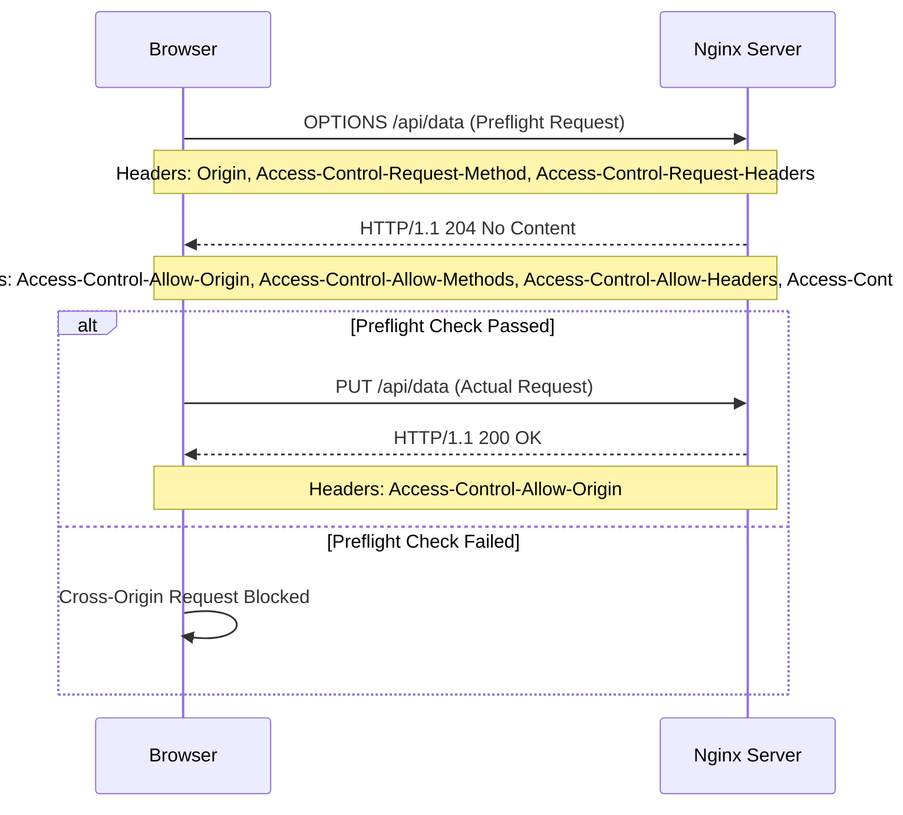

### 36. 如何配置Nginx Gzip压缩以优化网站性能？

**答案:**

Nginx的Gzip压缩功能是提升网站性能、减少网络传输数据量、加快页面加载速度的必备优化手段。其原理是在服务器端对响应内容进行压缩，传输到浏览器后再由浏览器解压缩。对于文本类型的文件（如HTML, CSS, JavaScript, JSON, XML等），Gzip通常能达到很高的压缩比（可达70%-90%），效果显著。

配置Gzip主要涉及`ngx_http_gzip_module`模块，该模块是Nginx的标准模块，默认已编译安装。

**1. Gzip核心配置指令**

这些指令通常配置在`http`块中，使其对所有`server`生效，也可以根据需要配置在`server`或`location`块中。

*   `gzip on;`: **核心开关**。启用或禁用Gzip压缩。
*   `gzip_types ...;`: **指定压缩类型**。定义哪些MIME类型的内容需要被压缩。默认只压缩`text/html`。这是**必须配置**的关键指令。
*   `gzip_comp_level [1-9];`: **设置压缩级别**。级别从1到9，1表示压缩比最低但速度最快，9表示压缩比最高但最消耗CPU。通常设置为**4-6**之间，可以在压缩率和CPU消耗之间取得良好平衡。
*   `gzip_min_length [size];`: **设置最小压缩长度**。只有当响应内容的大小超过这个值时，Nginx才会对其进行压缩。设置太小的值（如几十字节）没有意义，因为压缩本身也有开销，可能导致压缩后的文件比原始文件还大。通常设置为**1k**（`1024`）或更大。
*   `gzip_vary on;`: **添加Vary头**。在响应头中添加`Vary: Accept-Encoding`。这个头会告知代理服务器（如CDN、缓存服务器）为同一URL缓存两个版本的资源：一个压缩版，一个未压缩版。这样可以确保代理服务器能根据客户端是否支持Gzip来返回正确的版本，**强烈建议开启**。
*   `gzip_proxied [any|off|...];`: **配置代理压缩**。定义Nginx作为反向代理时，根据后端服务器返回的响应头来决定是否对响应进行压缩。`any`表示无条件压缩所有代理请求的响应。这是一个常用且省心的设置。
*   `gzip_disable "MSIE [1-6]\.";`: **禁用特定浏览器**。可以根据User-Agent来禁用对某些老旧浏览器的Gzip压缩，因为它们可能存在兼容性问题。这个例子禁用了IE6及以下版本。

**Mermaid 结构图: Gzip 工作流程**

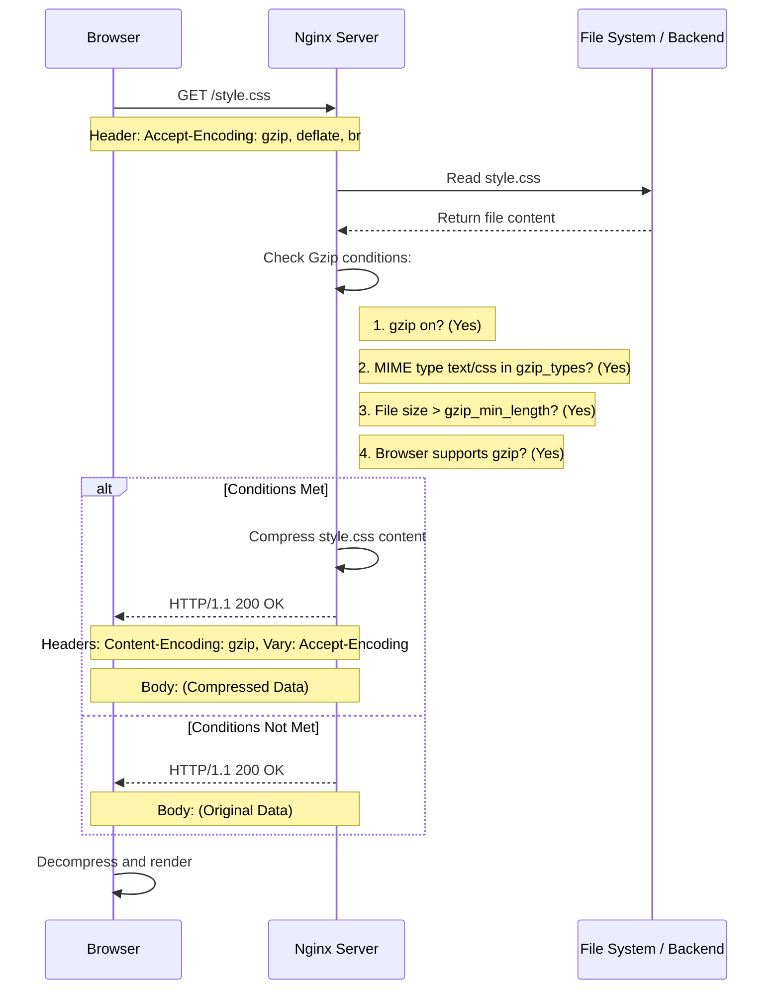

### 37. Nginx如何配置缓存（Proxy Cache）来加速后端服务？

**答案:**

Nginx的Proxy Cache功能是另一个强大的性能优化工具，它允许Nginx将后端服务器的响应内容缓存起来。当后续有相同的请求到达时，Nginx可以直接从缓存中返回响应，而无需再次请求后端服务。这极大地减轻了后端服务器的压力，显著降低了响应延迟，提升了用户体验，尤其适用于那些内容不经常变化的API或页面。

配置Proxy Cache主要涉及`ngx_http_proxy_module`模块中的`proxy_cache`相关指令。

**1. 核心配置指令**

配置缓存分为两步：**定义缓存区域**和**在特定位置启用缓存**。

**第一步：定义缓存区域 (在 `http` 块中)**

*   `proxy_cache_path /path/to/cache keys_zone=NAME:SIZE ...;`
    *   `/path/to/cache`: **必需**。指定缓存文件在磁盘上存储的物理路径。Nginx需要对该目录有读写权限。
    *   `keys_zone=NAME:SIZE`: **必需**。定义一个共享内存区域，用于存储缓存的**键（keys）和元数据（metadata）**。`NAME`是这个区域的名称，后续会引用它。`SIZE`是内存区域的大小，例如`10m`（10兆字节）。1MB的内存大约可以存储8000个key。
    *   `levels=X:Y`: **可选**。设置缓存目录的层级结构。例如`levels=1:2`会创建两级目录结构，有助于在缓存文件过多时提高文件系统性能。
    *   `inactive=TIME`: **可选**。定义缓存项在指定时间内未被访问则被视为“不活跃”，并可能被缓存管理器进程清除。例如`60m`（60分钟）。
    *   `max_size=SIZE`: **可选**。设置缓存目录在磁盘上可以占用的最大空间。当达到此限制时，缓存管理器会根据LRU（最近最少使用）算法移除最老的缓存项。

**第二步：启用缓存 (在 `server` 或 `location` 块中)**

*   `proxy_cache NAME;`: **必需**。启用缓存，并指定使用哪个在`proxy_cache_path`中定义的`keys_zone`。
*   `proxy_cache_key STRING;`: **必需**。定义用于生成缓存key的字符串。默认值通常是`$scheme$proxy_host$request_uri`。一个好的实践是包含`$request_method`，以区分GET/POST等不同方法的请求。例如：`proxy_cache_key "$scheme$request_method$proxy_host$request_uri";`。
*   `proxy_cache_valid [CODE...] TIME;`: **必需**。为不同状态码的响应设置不同的缓存时间。例如`proxy_cache_valid 200 302 10m;`表示为200和302响应缓存10分钟，`proxy_cache_valid 404 1m;`为404响应缓存1分钟。
*   `proxy_cache_use_stale ...;`: **可选，但非常有用**。配置当后端服务出错（如`error`, `timeout`, `http_500`, `http_502`）时，Nginx是否可以使用过期的缓存来响应客户端。这能有效提升网站的可用性。
*   `proxy_cache_lock on;`: **可选，但强烈建议**。当多个相同的请求同时到达，而缓存中又没有该内容时，开启此选项可以确保只有第一个请求会真正到达后端，其他请求会等待第一个请求的结果回来并存入缓存。这可以有效防止“缓存风暴”（Cache Stampede）。
*   `add_header X-Proxy-Cache $upstream_cache_status;`: **可选，用于调试**。在响应头中添加一个`X-Proxy-Cache`字段，其值（如`HIT`, `MISS`, `EXPIRED`, `BYPASS`）可以清晰地告诉你当前请求是命中了缓存、未命中、还是绕过了缓存。

**Mermaid 结构图: Proxy Cache 工作流程**

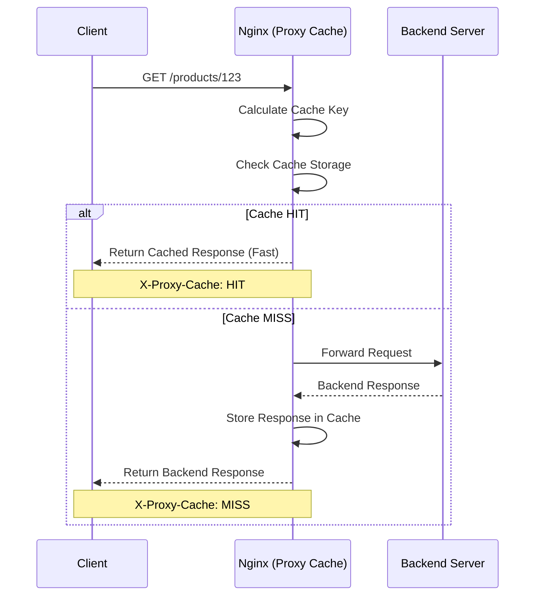

### 38. Nginx如何配置HTTP/2以提升性能？

**答案:**

HTTP/2是HTTP协议的第二个主要版本，于2015年发布。相比于HTTP/1.1，它引入了多路复用、头部压缩、服务器推送等新特性，旨在通过更高效的资源传输来提升网页加载速度和性能。在Nginx中启用HTTP/2非常简单，并且是现代Web服务器的推荐实践。

**1. HTTP/2的核心优势**

*   **多路复用 (Multiplexing):** 这是HTTP/2最核心的改进。在同一个TCP连接上，浏览器和服务器可以同时发送和接收多个请求和响应，而无需按顺序等待。这解决了HTTP/1.1中的“队头阻塞”（Head-of-Line Blocking）问题，使得浏览器可以更高效地并行加载资源。
*   **头部压缩 (Header Compression):** HTTP/2使用HPACK算法来压缩请求和响应的头部。对于重复的头部字段（如User-Agent, Accept等），HPACK可以避免重复发送，只发送差异部分，从而显著减少了请求的开销。
*   **二进制分帧 (Binary Framing):** HTTP/2将所有传输的信息分割为更小的消息和帧，并采用二进制格式编码。这使得协议的解析更高效、更健壮，且不易出错。
*   **服务器推送 (Server Push):** 服务器可以“主动”向客户端推送它认为客户端将会需要的资源（如CSS, JS文件），而无需等待客户端解析HTML后再发起请求。这可以进一步减少请求的往返次数。

**Mermaid 结构图: HTTP/1.1 vs HTTP/2**

```mermaid
graph TD
    subgraph HTTP/1.1 (队头阻塞)
        B1[Browser] --> T1(TCP Connection 1 for HTML)
        B1 --> T2(TCP Connection 2 for CSS)
        B1 --> T3(TCP Connection 3 for JS)
        T1 --> S1[Server]
        T2 --> S1
        T3 --> S1
        note right of B1 : 多个TCP连接，请求串行
    end

    subgraph HTTP/2 (多路复用)
        B2[Browser] -->|Single TCP Connection| S2[Server]
        subgraph B2
            direction LR
            R_HTML[HTML Request]
            R_CSS[CSS Request]
            R_JS[JS Request]
        end
        subgraph S2
            direction LR
            S_HTML[HTML Response]
            S_CSS[CSS Response]
            S_JS[JS Response]
        end
        R_HTML -- Stream 1 --> S_HTML
        R_CSS -- Stream 3 --> S_CSS
        R_JS -- Stream 5 --> S_JS
        note right of B2 : 单个TCP连接，多路并行
    end
```

### 39. 什么是Keepalive连接？如何在Nginx中配置？

**答案:**

Keepalive连接，也称为持久连接（Persistent Connection）或连接复用（Connection Reuse），是HTTP协议中一项至关重要的性能优化技术。它允许在同一个TCP连接上发送和接收多个HTTP请求和响应，而不是每请求一次就新建一个TCP连接。

**1. Keepalive的核心价值**

在没有Keepalive的HTTP/1.0时代，每个HTTP请求都需要经历一个完整的“TCP三次握手建立连接 -> 传输数据 -> TCP四次挥手关闭连接”的过程。对于一个需要加载多个资源（HTML, CSS, JS, 图片）的网页来说，这个过程会重复很多次，带来了巨大的性能开销：

*   **高延迟:** 每次建立TCP连接都需要额外的网络往返时间（RTT），尤其是在高延迟网络（如移动网络）下，延迟会累积得非常严重。
*   **CPU和内存消耗:** 频繁地创建和销毁TCP连接会消耗大量的服务器和客户端CPU及内存资源。
*   **网络拥塞:** 大量短暂的TCP连接会加剧网络拥塞。

Keepalive通过复用TCP连接，完美地解决了以上问题，带来了显著的性能提升。

**Mermaid 结构图: 标准连接 vs Keepalive连接**

```mermaid
sequenceDiagram
    participant C as Client
    participant S as Server

    box "Standard Connection (HTTP/1.0)"
        C->>S: TCP Handshake (Connect)
        C->>S: GET /index.html
        S-->>C: Response
        C->>S: TCP Teardown (Disconnect)

        C->>S: TCP Handshake (Connect)
        C->>S: GET /style.css
        S-->>C: Response
        C->>S: TCP Teardown (Disconnect)
    end

    box "Keepalive Connection (HTTP/1.1+)"
        C->>S: TCP Handshake (Connect)
        C->>S: GET /index.html
        S-->>C: Response
        C->>S: GET /style.css
        S-->>C: Response
        Note over C,S: Connection remains open for a while...
        C->>S: TCP Teardown (Disconnect after timeout)
    end
```

### 40. 如何使用Nginx的`map`指令实现更灵活的配置？

**答案:**

Nginx的`map`指令是一个非常强大且高效的工具，它允许你根据一个变量的值（源变量）来创建另一个新的变量（目标变量）。`map`可以被看作是一个“键值对”映射表，它能极大地简化和优化Nginx配置，避免大量重复的`if`语句，提高配置的可读性和执行效率。

`map`指令必须定义在`http`块中。

**1. `map`指令的核心语法**

```nginx
map $source_variable $target_variable {
    key1 value1;
    key2 value2;
    ...
    default default_value;
}
```

*   `$source_variable`: 源变量，即你想要检查的变量，例如`$http_host`, `$uri`, `$arg_name`等。
*   `$target_variable`: 目标变量，`map`会根据匹配结果将相应的值赋给这个新变量。
*   `key value`: 映射规则。如果`$source_variable`的值等于`key`，那么`$target_variable`的值就为`value`。
*   `default`: 如果`$source_variable`的值没有匹配到任何`key`，则`$target_variable`会取`default_value`作为其值。这是一个可选但强烈推荐的设置。

**`map`指令的匹配规则:**

*   **精确匹配:** `key`是普通的字符串，进行精确匹配。
*   **主机名通配符匹配:** `key`可以包含前缀或后缀通配符，如`*.example.com`或`www.example.*`。
*   **正则表达式匹配:** `key`以`~`开头表示区分大小写的正则匹配，以`~*`开头表示不区分大小写的正则匹配。
*   **`hostnames`参数:** 如果`map`主要用于匹配主机名，添加`hostnames`参数可以优化性能。
*   **`include`指令:** 可以将大量的映射规则放在一个单独的文件中，然后用`include`指令引入，保持主配置文件的整洁。

**Mermaid 结构图: `if` vs `map`**

```mermaid
graph TD
    subgraph "使用多个 if (低效)"
        A[Request] --> I1{if ($http_host = 'a.com')}
        I1 -- Yes --> S1[set $target a]
        I1 -- No --> I2{if ($http_host = 'b.com')}
        I2 -- Yes --> S2[set $target b]
        I2 -- No --> I3{...}
        note right of I1 : 每次请求都可能要经过多次判断
    end

    subgraph "使用 map (高效)"
        B[Request] --> M{map $http_host $target { ... }}
        M --> V[直接获得 $target 的值]
        note right of M : Nginx启动时构建哈希表, 请求时O(1)查找
    end
```

### 41. Nginx如何记录自定义日志格式？

**答案:**

Nginx提供了强大的日志记录功能，允许你完全自定义日志的格式，以满足不同的分析、监控和调试需求。默认的日志格式（`combined`）已经包含了大部分常用信息，但通过自定义日志，你可以添加如请求处理时间、上游响应时间、Gzip压缩率、缓存状态等更多维度的信息。

自定义日志主要通过两个指令来完成：`log_format`和`access_log`。

**1. 核心指令**

*   **`log_format name 'string' ...;`**: 定义一个新的日志格式。
    *   **上下文**: `http`
    *   `name`: 你为这个新格式起的名字，例如`mytag`、`json_format`等。
    *   `'string'`: 日志格式字符串。这个字符串由**普通文本**和**Nginx变量**组成。Nginx在记录日志时，会用变量的实际值替换掉字符串中的变量名。

*   **`access_log path [format [buffer=size] [gzip[=level]] [flush=time] [if=condition]];`**: 指定日志文件的路径和使用的格式。
    *   **上下文**: `http`, `server`, `location`, `if in location`, `limit_except`
    *   `path`: 日志文件的路径。可以设置为`off`来关闭日志记录。
    *   `format`: **可选**。指定使用哪个由`log_format`定义的格式名称。如果省略，则使用默认的`combined`格式。

**2. 常用的Nginx日志变量**

以下是一些在自定义日志格式时非常重要的Nginx内置变量：

*   `$remote_addr`: 客户端IP地址。
*   `$remote_user`: 用于HTTP基础认证的用户名。
*   `$time_local`: 服务器本地时间，格式如`28/Sep/2023:15:30:00 +0800`。
*   `$request`: 完整的原始请求行，如`"GET /api/users?id=123 HTTP/1.1"`。
*   `$status`: 响应状态码，如`200`, `404`, `502`。
*   `$body_bytes_sent`: 发送给客户端的响应体大小（字节）。
*   `$http_referer`: 请求的来源页URL。
*   `$http_user_agent`: 客户端的用户代理（浏览器）信息。
*   `$http_x_forwarded_for`: 客户端的真实IP（当Nginx位于代理之后时）。

**非常有用的性能相关变量:**

*   `$request_time`: **请求处理总时间**（秒，带毫秒精度）。从接收到请求的第一个字节到发送完最后一个字节的时间。
*   `$upstream_addr`: 上游（后端）服务器的地址。
*   `$upstream_status`: 上游服务器返回的状态码。
*   `$upstream_response_time`: **上游响应时间**（秒，带毫秒精度）。从Nginx向上游发起请求到接收到上游响应的最后一个字节的时间。**这是排查后端性能问题的关键指标**。
*   `$upstream_cache_status`: 缓存命中状态 (`HIT`, `MISS`, `EXPIRED`, `BYPASS`等)。
*   `$gzip_ratio`: Gzip压缩比。

**Mermaid 结构图: 日志处理流程**

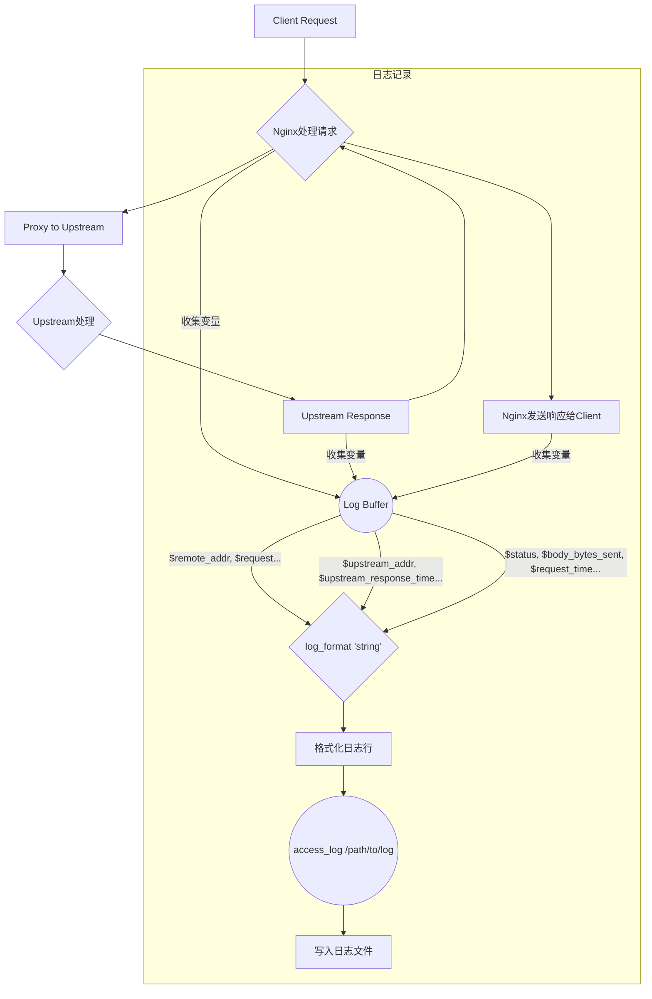

### 42. 如何配置Nginx作为反向代理？

**答案:**

将Nginx配置为反向代理是其最核心和最常见的用途之一。反向代理（Reverse Proxy）是指以代理服务器来接受客户端的连接请求，然后将请求转发给内部网络上的一个或多个后端服务器，并将从服务器上得到的结果返回给客户端。对客户端而言，代理服务器就表现得像是一个原始服务器。

**1. 为什么使用反向代理？**

*   **负载均衡 (Load Balancing)**: 将请求分发到多个后端服务器，提高网站的并发处理能力和可用性。
*   **安全性 (Security)**: 隐藏后端服务器的真实IP地址，保护内部网络免受直接攻击。Nginx可以作为第一道防线，抵御DDoS攻击、过滤恶意请求。
*   **SSL/TLS 卸载 (SSL/TLS Offloading)**: 由Nginx统一处理HTTPS加密和解密，后端服务器只需处理HTTP请求，减轻了后端服务器的CPU负担。
*   **缓存 (Caching)**: 缓存静态和动态内容，减少对后端服务器的请求，加快响应速度。
*   **URL重写和路由**: 根据请求的URL、头部等信息，将请求智能地路由到不同的后端服务（例如，微服务架构）。
*   **压缩 (Compression)**: 对响应内容进行Gzip压缩，减少网络传输量。

**Mermaid 结构图: 反向代理工作流程**

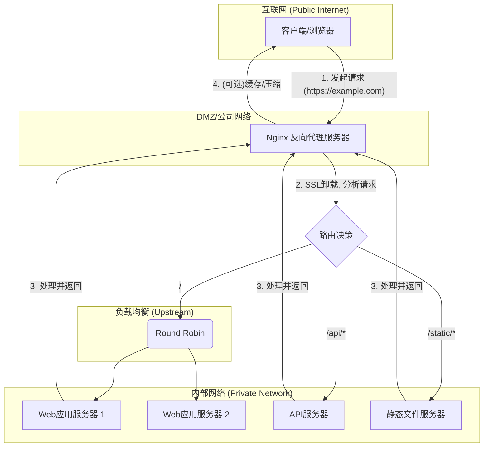

### 43. Nginx支持哪些负载均衡算法？请分别解释。

**答案:**

Nginx的负载均衡功能由`upstream`模块提供，它非常强大且灵活，内置了多种负载均衡算法来满足不同的业务场景。这些算法决定了Nginx如何将客户端的请求分发到后端的一组服务器（`upstream`池）中。

以下是Nginx原生支持的主要负载均衡算法：

**1. 轮询 (Round Robin) - 默认算法**

*   **工作原理**: 这是最简单也是默认的负载均衡算法。Nginx会按顺序、逐一地将请求分发给`upstream`中定义的每个服务器。当到达列表末尾时，它会回到开头重新开始循环。
*   **优点**: 实现简单，能够确保所有后端服务器都能接收到请求，做到“雨露均沾”。
*   **缺点**: 它不关心后端服务器当前的负载、连接数或响应时间。如果服务器的性能存在差异，可能会导致性能较差的服务器过载。
*   **配置示例**:
    ```nginx
    upstream backend {
        server backend1.example.com;
        server backend2.example.com;
        server backend3.example.com;
    }
    ```

**2. 加权轮询 (Weighted Round Robin)**

*   **工作原理**: 这是对标准轮询的改进。你可以为每个服务器分配一个权重（`weight`），权重越高的服务器被分配到的请求比例就越高。权重值默认为1。
*   **适用场景**: 当后端服务器的硬件配置（CPU、内存等）或处理能力不同时，可以使用此算法。给性能更好的服务器分配更高的权重，使其承担更多的流量。
*   **配置示例**:
    ```nginx
    upstream backend {
        # backend1的处理能力是backend2的两倍
        server backend1.example.com weight=2;
        server backend2.example.com; # 默认 weight=1
    }
    # 在一个周期内，大约每3个请求中，2个会发给backend1，1个会发给backend2。
    ```

**3. IP哈希 (IP Hash)**

*   **工作原理**: Nginx会根据请求的客户端IP地址进行哈希计算，然后根据哈希结果将请求固定地分配给某一个后端服务器。只要客户端的IP地址不变，它的请求就会一直由同一台服务器处理。
*   **适用场景**: 需要**会话保持 (Session Persistence)** 的场景。例如，用户登录后，后续的所有操作都需要在同一台服务器上完成，以维持其登录状态或购物车信息。如果将请求分发到其他服务器，可能会导致会话信息丢失。
*   **缺点**: 如果某个客户端的IP地址哈希后总是指向一台有问题的服务器，那么这个客户端将一直无法正常访问。另外，如果客户端IP地址分布不均（例如大量用户通过同一个NAT网关出口），可能会导致流量分配不均。
*   **配置示例**:
    ```nginx
    upstream backend {
        ip_hash;
        server backend1.example.com;
        server backend2.example.com;
    }
    ```

**4. 最少连接 (Least Connections)**

*   **工作原理**: Nginx会将新的请求发送给当前**活动连接数最少**的后端服务器。如果多个服务器的连接数相同，则采用加权轮询的方式进行分配。
*   **适用场景**: 当请求的处理时间长短不一，或者后端服务处理能力动态变化时，此算法非常有效。它能避免将新请求发送给已经很繁忙的服务器，从而实现更动态、更公平的负载均衡。
*   **配置示例**:
    ```nginx
    upstream backend {
        least_conn;
        server backend1.example.com;
        server backend2.example.com;
    }
    ```

**Mermaid 结构图: 负载均衡算法对比**

```mermaid
flowchart TD
    subgraph "请求来源 (Requests)"
        R1[Req 1]
        R2[Req 2]
        R3[Req 3]
        R4[Req 4]
    end

    subgraph "Nginx Upstream"
        U(Upstream Logic)
    end

    subgraph "后端服务器 (Backend Servers)"
        S1[Server 1 (weight=1, conn=10)]
        S2[Server 2 (weight=2, conn=20)]
    end

    R1 --> U
    R2 --> U
    R3 --> U
    R4 --> U

    subgraph "算法决策"
        U -- Round Robin --> S1 -- then --> S2 -- then --> S1
        U -- Weighted RR --> S2 -- then --> S2 -- then --> S1
        U -- IP Hash (e.g. IP_A) --> S1
        U -- IP Hash (e.g. IP_B) --> S2
        U -- Least Conn --> S1
    end
```

### 44. 什么是Nginx的健康检查（Health Check）？如何配置？

**答案:**

**健康检查 (Health Check)** 是负载均衡系统中一个至关重要的机制。它的核心作用是**主动、定期地探测后端服务器（`upstream`中的`server`）是否处于正常工作状态**。如果发现某台服务器无法正常响应或响应异常，负载均衡器会暂时将其标记为“不健康”，并停止向其转发新的请求，从而避免将用户的请求发送给一个已经宕机或有问题的服务器。当这台服务器恢复正常后，健康检查机制会再次发现它，并将其重新加入到服务集群中。

**为什么健康检查如此重要？**

*   **提高可用性 (High Availability)**: 自动隔离故障服务器，确保用户的请求只会被发送到健康的服务器上，防止因单点故障导致整个服务不可用。
*   **自动故障转移 (Automatic Failover)**: 无需人工干预，系统能够自动完成故障服务器的摘除和恢复，提升了系统的自愈能力和运维效率。
*   **防止雪崩效应**: 避免因请求持续涌向故障服务器而导致资源耗尽，进而引发更大范围的系统瘫痪。

**Nginx开源版 vs Nginx Plus**

在健康检查功能上，Nginx开源版和商业版Nginx Plus有显著区别：

*   **Nginx 开源版**: **原生不提供主动的、复杂的健康检查功能**。它只有一种**被动健康检查 (Passive Health Check)** 机制。即，只有在实际的用户请求转发失败时，Nginx才会判断后端服务器有问题。
*   **Nginx Plus (商业版)**: 提供了功能完备的**主动健康检查 (Active Health Check)**。Nginx Plus会定期地、独立于用户请求之外，向上游服务器发送特殊的“健康检查请求”，并根据响应来判断其健康状态。

### 45. 如何配置Nginx实现SSL/TLS加密（即HTTPS）？

**答案:**

配置Nginx以支持SSL/TLS加密，从而启用HTTPS，是现代Web服务的基本要求。HTTPS（HTTP Secure）通过在HTTP和TCP之间添加一层SSL/TLS协议，为网站通信提供了**数据加密**、**身份验证**和**数据完整性**保护，能有效防止数据在传输过程中被窃听或篡改。

**1. 先决条件：获取SSL证书**

在配置HTTPS之前，你必须拥有一个SSL证书。证书由受信任的证书颁发机构（CA）签发，它包含了你的域名、公钥和CA的签名。你可以：

*   **从商业CA购买**: 如 DigiCert, GlobalSign 等，提供不同级别的验证和保险。
*   **使用免费的CA**: **Let's Encrypt** 是目前最流行的免费、自动化的CA，受到所有主流浏览器的信任。通常使用`Certbot`等工具可以轻松获取和续订Let's Encrypt证书。

获取证书后，你通常会得到两个文件：
*   **证书文件 (`.crt`或`.pem`)**: 包含你的公钥和域名信息，发送给客户端。例如 `fullchain.pem`。
*   **私钥文件 (`.key`)**: 必须安全地存放在服务器上，绝不能泄露。例如 `privkey.pem`。

**2. 核心配置指令**

配置HTTPS主要涉及以下几个核心指令：

*   **`listen 443 ssl;`**: 让Nginx在443端口上监听，并启用SSL/TLS协议。`ssl`参数是必需的。
*   **`ssl_certificate path/to/your/fullchain.pem;`**: 指定你的SSL证书文件的路径。这个文件包含了服务器证书和所有中间证书链。
*   **`ssl_certificate_key path/to/your/privkey.key;`**: 指定你的私钥文件的路径。
*   **`server_name your_domain.com;`**: 指定此`server`块处理哪个域名的请求。

**Mermaid 结构图: SSL/TLS 握手简要流程**

```mermaid
sequenceDiagram
    participant Client as 浏览器
    participant Server as Nginx服务器

    Client->>Server: 1. Client Hello (支持的协议/加密套件)
    Server->>Client: 2. Server Hello (选定的协议/加密套件)
    Server->>Client: 3. Certificate (发送服务器的SSL证书)
    Server->>Client: 4. Server Hello Done

    Client->>Client: 5. 验证证书 (由CA签发? 未过期? 域名匹配?)
    Client->>Server: 6. Client Key Exchange (用服务器公钥加密一个预主密钥)
    Client->>Server: 7. Change Cipher Spec (通知服务器开始加密通信)
    Client->>Server: 8. Encrypted Handshake Message

    Server->>Server: 9. 用私钥解密预主密钥
    Server->>Client: 10. Change Cipher Spec (通知客户端开始加密通信)
    Server->>Client: 11. Encrypted Handshake Message

    Note over Client, Server: 握手完成，双方已生成对称会话密钥

    Client->>Server: 12. Encrypted Application Data (HTTPS请求)
    Server->>Client: 13. Encrypted Application Data (HTTPS响应)
```

### 46. 如何在Nginx中配置WebSocket反向代理？

**答案:**

WebSocket是一种在单个TCP连接上进行全双工通信的协议，它允许服务器主动向客户端推送信息，非常适合实时应用，如在线聊天、实时协作、游戏、股票行情等。与HTTP的“请求-响应”模式不同，WebSocket建立的是一个持久性的连接。

Nginx从1.3.13版本开始原生支持WebSocket的反向代理。配置WebSocket代理的关键在于理解其协议升级机制。

**1. WebSocket的握手与协议升级**

WebSocket连接的建立过程始于一个标准的HTTP GET请求，但这个请求包含了几个特殊的请求头，用于通知服务器客户端希望将连接从HTTP升级到WebSocket协议。

*   `Upgrade: websocket`
*   `Connection: Upgrade`

如果服务器支持WebSocket，它会返回一个`101 Switching Protocols`的HTTP响应，并同样包含这两个头。此后，这个底层的TCP连接就不再用于HTTP通信，而是转为WebSocket协议的数据帧传输。

**Mermaid 结构图: WebSocket 握手流程**

```mermaid
sequenceDiagram
    participant Client as 客户端
    participant Nginx as Nginx代理
    participant Backend as WebSocket服务器

    Client->>Nginx: HTTP GET /chat
    Note right of Client: Headers:
    Upgrade: websocket
    Connection: Upgrade

    Nginx->>Backend: Forward HTTP GET /chat
    Note right of Nginx: Nginx必须正确传递Upgrade和Connection头

    Backend-->>Nginx: HTTP/1.1 101 Switching Protocols
    Note left of Backend: Headers:
    Upgrade: websocket
    Connection: Upgrade

    Nginx-->>Client: Forward HTTP/1.1 101 Response

    Note over Client, Backend: TCP连接已升级为WebSocket协议

    Client-->>Backend: WebSocket Data Frame (双向)
    Backend-->>Client: WebSocket Data Frame (双向)
```

### 47. 请解释Nginx的`stub_status`模块有什么用？如何开启和解读？

**答案:**

`ngx_http_stub_status_module`（通常简称为`stub_status`）是Nginx提供的一个非常轻量级的内置模块，用于**实时监控Nginx服务器的基本运行状态和连接信息**。它提供了一个简单的状态页面，展示了几个关键的性能指标，是快速诊断服务器负载和连接问题的便捷工具。

**1. `stub_status`的作用**

*   **快速概览**: 无需复杂的监控系统，即可快速了解Nginx当前的活动连接数、总处理请求数等核心指标。
*   **性能监控**: 可以与Zabbix, Nagios, Prometheus等监控系统集成，通过定期抓取状态页面的数据来绘制Nginx的性能趋势图。
*   **问题排查**: 当服务器响应变慢时，可以通过观察`Reading`, `Writing`, `Waiting`等状态，初步判断瓶颈所在。

**2. 如何开启`stub_status`**

默认情况下，Nginx在编译时就已经包含了`stub_status`模块，但需要手动在配置文件中开启它。

**配置步骤:**

1.  在`server`块中创建一个专门的`location`用于暴露状态信息。
2.  在该`location`中使用`stub_status`指令。
3.  **（强烈推荐）** 使用`allow`和`deny`指令来限制对该页面的访问，避免将服务器状态信息泄露给公网。

**配置示例:**

```nginx
server {
    listen 80;
    server_name example.com;

    # ... 其他配置 ...

    # 配置stub_status模块的访问端点
    location /nginx_status {
        # 开启status页面
        stub_status;

        # ### 48. 如何平滑地重启或升级Nginx？

**答案:**

“平滑”重启或升级（Graceful Restart/Upgrade）是Nginx一个非常重要的特性，它允许你在**不中断任何现有用户连接**的情况下，应用新的配置、升级Nginx程序版本或加载新的模块。这对于需要7x24小时不间断服务的高可用性网站至关重要。

这个功能的核心在于Nginx的Master-Worker进程模型。Master进程负责管理Worker进程，而真正的请求处理是由Worker进程完成的。平滑操作正是通过Master进程向Worker进程发送特定的信号（Signal）来实现的。

**1. 平滑重载配置 (Graceful Reload)**

当你修改了Nginx的配置文件（`nginx.conf`）并希望使其生效时，应该使用平滑重载，而不是粗暴地停止再启动。

*   **命令**: `nginx -s reload`
*   **工作原理**:
    1.  Master进程接收到`reload`信号（即`HUP`信号）。
    2.  Master进程首先会**检查新配置文件的语法是否正确**。如果语法有误，它会回滚更改，并继续使用旧的配置运行，同时在错误日志中记录失败信息。这是非常安全的一步。
    3.  如果新配置语法正确，Master进程会**启动一组新的Worker进程**，这些新的Worker进程将使用新的配置。
    4.  同时，Master进程会向所有**旧的Worker进程发送一个“优雅关闭”的信号** (`QUIT`信号)。
    5.  旧的Worker进程收到`QUIT`信号后，会**停止接受新的连接请求**，但会继续处理完当前正在处理的所有请求。当所有请求都处理完毕后，旧的Worker进程会自动退出。
    6.  在此期间，新的Worker进程已经开始接受和处理新的连接请求了。整个过程无缝衔接，客户端不会感觉到任何服务中断。

**Mermaid 结构图: 平滑重载 (reload) 流程**

```mermaid
sequenceDiagram
    participant Admin as 管理员
    participant Master as Master进程
    participant OldWorkers as 旧Worker进程
    participant NewWorkers as 新Worker进程

    Admin->>Master: 发送 HUP 信号 (nginx -s reload)
    Master->>Master: 1. 检查新配置语法
    alt 语法错误
        Master->>Admin: 报告错误，操作中止
    else 语法正确
        Master->>NewWorkers: 2. 启动使用新配置的新Worker
        NewWorkers->>Master: 启动成功，开始接受新连接
        Master->>OldWorkers: 3. 发送 QUIT 信号 (优雅关闭)
        Note right of OldWorkers: 停止接受新连接，<br/>处理完当前请求后退出
        OldWorkers-->>Master: 所有请求处理完毕，退出
    end
```

### 49. Nginx中的`try_files`指令是如何工作的？

**答案:**

`try_files`是Nginx中一个非常强大且常用的指令，主要用于按顺序检查文件或目录是否存在，并根据结果执行内部重定向或返回指定的状态码。它极大地简化了配置，避免了使用多个`if`指令带来的性能和逻辑问题。

**1. 核心语法与工作流程**

`try_files`指令的语法如下：

```nginx
try_files file1 [file2 ...] uri;
try_files file1 [file2 ...] =code;
```

*   **参数**: 可以是一个或多个文件/目录路径，最后一个参数可以是一个URI或一个带有`=`的状态码。
*   **工作流程**:
    1.  Nginx会按照`try_files`指令中列出的顺序，从左到右检查每个`file`参数对应的文件或目录是否存在于服务器的文件系统中。路径是相对于`root`或`alias`指令定义的根目录。
    2.  **第一个**找到的**存在**的文件或目录将被立即使用，Nginx会发起一个**内部重定向**到该文件或目录的URI。这意味着请求的处理会立即停止，并转到与该文件/目录匹配的新`location`中继续处理。
    3.  如果前面所有的`file`参数都不存在，Nginx会执行**最后一个参数**的指令。
        *   如果最后一个参数是**URI**（例如`/index.html`或`@fallback`），Nginx会发起一个内部重定向到这个URI。
        *   如果最后一个参数是**状态码**（例如`=404`），Nginx会直接返回该HTTP状态码。

**Mermaid 结构图: `try_files` 工作流程**

```mermaid
graph TD
    A[接收请求 Request] --> B{开始 try_files $uri $uri/ /index.html;}
    B --> C{检查文件是否存在: $uri}
    C -- 存在 --> D[内部重定向到 $uri]
    C -- 不存在 --> E{检查目录是否存在: $uri/}
    E -- 存在 --> F[内部重定向到 $uri/]
    E -- 不存在 --> G{检查文件是否存在: /index.html}
    G -- 存在 --> H[内部重定向到 /index.html]
    G -- 不存在 --> I[返回404 (如果最后一个参数是=404)]

    D --> Z[处理结束]
    F --> Z
    H --> Z
    I --> Z
```

**2. 经典应用场景**

`try_files`最经典的应用场景是处理单页应用（SPA，如Vue, React, Angular）的路由。

**场景：配置一个React或Vue项目**

在SPA中，所有的路由都由前端JavaScript控制。当用户刷新页面或直接访问一个深层链接（如`/user/profile`）时，服务器上并不存在一个名为`/user/profile`的文件或目录。此时，我们需要Nginx将这个请求“退回”到应用的入口文件`index.html`，让前端路由接管。

**配置示例:**

```nginx
server {
    listen 80;
    server_name my-spa.com;
    root /var/www/my-spa-project/dist;

    location / {
        # 1. 尝试直接查找与URI匹配的文件 (如 /assets/logo.png)
        # 2. 尝试查找与URI匹配的目录 (如 /static/)
        # 3. 如果都找不到，则回退到 /index.html
        try_files $uri $uri/ /index.html;
    }

    # API请求代理到后端服务
    location /api/ {
        proxy_pass http://backend_server;
    }
}
```

**解释:**

*   当一个请求到达时，例如`https://my-spa.com/user/profile`，`$uri`就是`/user/profile`。
*   `try_files`开始工作：
    1.  它首先检查`root`目录下是否存在文件`/var/www/my-spa-project/dist/user/profile`。**不存在**。
    2.  接着检查是否存在目录`/var/www/my-spa-project/dist/user/profile/`。**不存在**。
    3.  最后，它执行最后一个参数，内部重定向到`/index.html`。Nginx会返回`index.html`的内容，浏览器加载后，React/Vue的路由代码开始执行，并正确显示`/user/profile`页面。
*   如果请求是`https://my-spa.com/assets/logo.png`，`$uri`是`/assets/logo.png`。`try_files`在第一步就找到了文件，并直接返回其内容。

**3. 结合命名`location`使用**

`try_files`可以与命名`location`（以`@`开头）结合，实现更复杂的逻辑。

**配置示例：图片处理回退**

```nginx
location /images/ {
    root /data/www;
    # 尝试查找原始图片，如果找不到，则转到@image_processing处理
    try_files $uri @image_processing;
}

location @image_processing {
    # 这里可以是对图片进行缩放、加水印等操作的代理
    # 例如，代理到一个专门处理图片的后端服务
    proxy_pass http://image_processor_backend;
}
```

**总结:**

`try_files`是Nginx配置中一个优雅且高效的工具。它通过顺序查找文件和目录，并提供一个最终的回退选项，完美地解决了诸如SPA路由、文件存在性检查等常见问题。相比于使用`if`语句进行文件检查，`try_files`性能更好，配置更简洁，可读性也更高，是现代Nginx配置中不可或缺的一部分。

### 50. 请解释Nginx中的`root`和`alias`指令有何不同？

**答案:**

`root`和`alias`是Nginx中用于指定静态文件根目录的两个核心指令，但它们在如何将请求的URI映射到服务器文件系统路径上存在着关键的区别。理解这个区别对于正确配置Nginx至关重要。

**核心区别：路径拼接方式**

*   **`root`**: 将`location`匹配的URI**完整地**附加到`root`指令指定的路径后面，形成最终的文件路径。
    *   **公式**: `最终路径 = root路径 + 请求URI`

*   **`alias`**: 用`alias`指令指定的路径**替换掉**`location`匹配的那部分URI，然后拼接上URI中剩余的部分，形成最终的文件路径。
    *   **公式**: `最终路径 = alias路径 + (请求URI - location匹配部分)`

**Mermaid 结构图: `root` vs `alias` 路径映射**

```mermaid
graph TD
    subgraph Root 示例
        A[请求: /static/img/logo.png] --> B{location /static/ {<br/>  root /var/www/app;<br/>}}
        B --> C{计算路径}
        C -- "/var/www/app" + "/static/img/logo.png" --> D[最终路径: /var/www/app/static/img/logo.png]
    end

    subgraph Alias 示例
        E[请求: /static/img/logo.png] --> F{location /static/ {<br/>  alias /var/www/assets/;<br/>}}
        F --> G{计算路径}
        G -- "/var/www/assets/" + "img/logo.png" --> H[最终路径: /var/www/assets/img/logo.png]
    end
```

### 51. 如何在Nginx中配置URL重写（URL Rewrite）？

**答案:**

URL重写是Nginx中一个强大的功能，它允许你将一个URL重定向或重写为另一个URL。这在处理旧链接重定向、SEO优化、隐藏真实URL结构、实现伪静态等场景中非常有用。

**1. 核心指令：`rewrite`**

`rewrite`指令的基本语法：

```nginx
rewrite regex replacement [flag];
```

*   **`regex`**: 用于匹配URI的正则表达式
*   **`replacement`**: 替换后的URI
*   **`flag`**: 可选标志位，控制重写后的行为
    *   `last`: 停止当前`location`中后续的`rewrite`指令，并用新的URI开始新的`location`匹配。
    *   `break`: 停止当前`location`中后续的`rewrite`指令，继续处理当前`location`中的其他指令。
    *   `redirect`: 返回302临时重定向。
    *   `permanent`: 返回301永久重定向。

**Mermaid 结构图: URL重写流程**

```mermaid
graph TD
    A[接收请求] --> B{匹配rewrite规则}
    B -- 匹配成功 --> C{检查flag}
    C -- last --> D[重新location匹配]
    C -- break --> E[继续处理当前location]
    C -- redirect --> F[返回302重定向]
    C -- permanent --> G[返回301重定向]
    B -- 不匹配 --> H[继续处理]

    D --> I[处理结束]
    E --> I
    F --> I
    G --> I
    H --> I
```

**2. 常见应用场景**

**场景1：伪静态（隐藏动态参数）**

将动态URL转换为静态URL格式，对SEO更友好。

```nginx
# 将 /post-123.html 转换为 /post.php?id=123
location / {
    rewrite ^/post-([0-9]+)\.html$ /post.php?id=$1 last;
}

# 将 /category/books 转换为 /list.php?cat=books
location / {
    rewrite ^/category/([^/]+)$ /list.php?cat=$1 last;
}
```

**场景2：版本升级后的URL重定向**

当网站改版后，需要将旧的URL重定向到新的URL。

```nginx
# 将旧的博客URL永久重定向到新的URL结构
location /blog/ {
    rewrite ^/blog/([0-9]{4})/([0-9]{2})/(.+)$ /articles/$1-$2/$3 permanent;
}

# 将整个旧域名重定向到新域名
server {
    server_name old-site.com;
    return 301 $scheme://new-site.com$request_uri;
}
```

**场景3：多语言网站URL重写**

根据URL前缀自动设置语言参数。

```nginx
# /en/page -> /page.php?lang=en
# /zh/page -> /page.php?lang=zh
location ~ ^/(en|zh)/(.*) {
    rewrite ^/([a-z]{2})/(.*)$ /$2?lang=$1 last;
}
```

**场景4：图片防盗链与备用图片**

```nginx
location ~ .*\.(gif|jpg|jpeg|png)$ {
    valid_referers none blocked example.com *.example.com;
    if ($invalid_referer) {
        rewrite ^/(.*)$ /images/forbidden.jpg last;
    }
}
```

**3. 重要注意事项**

1.  **`last`与`break`的区别**:
    *   `last`: 重写后的URL会重新进入`location`匹配阶段，可能会匹配到其他`location`。
    *   `break`: 重写后停止在当前`location`中处理，不再进行新的`location`匹配。

    ```nginx
    # 使用last的例子
    location /old/ {
        rewrite ^/old/(.*)$ /new/$1 last;  # 会重新匹配location
    }
    location /new/ {
        # 这里的规则会被匹配到
    }

    # 使用break的例子
    location /old/ {
        rewrite ^/old/(.*)$ /new/$1 break;  # 停在当前location
        proxy_pass http://backend;  # 这个指令会被执行
    }
    ```

2.  **正则表达式捕获**:
    *   使用括号`()`进行分组捕获。
    *   在`replacement`中使用`$1`、`$2`等引用捕获的内容。
    *   使用`$args`引用原始的查询字符串。

3.  **性能考虑**:
    *   过多的重写规则会影响性能。
    *   优先使用`location`精确匹配，而不是过度依赖重写。
    *   合理使用`break`避免不必要的重新匹配。

4.  **调试技巧**:
    *   使用Nginx的`error_log`指令设置`debug`级别。
    *   使用`curl -I`命令查看重定向响应。
    *   使用浏览器开发者工具的网络面板观察请求。

**总结:**

URL重写是Nginx中一个既强大又复杂的功能。它可以帮助你优化URL结构、处理历史遗留问题、实现URL规范化等。但要注意：
1. 合理使用`flag`（`last`/`break`/`redirect`/`permanent`）
2. 正确编写和测试正则表达式
3. 考虑性能影响
4. 保持URL重写规则的可维护性

### 52. 如何在Nginx中配置访问控制（Access Control）？

**答案:**

Nginx提供了多种访问控制机制，可以基于IP地址、密码认证、请求频率等多个维度来限制或允许访问。合理配置访问控制对于保护网站安全至关重要。

**1. 基于IP的访问控制**

使用`allow`和`deny`指令可以实现基于IP的访问控制。

```nginx
# 在http、server或location块中使用
location /admin/ {
    # 允许特定IP访问
    allow 192.168.1.0/24;  # 允许192.168.1.x网段
    allow 10.0.0.1;        # 允许单个IP
    deny all;              # 拒绝其他所有IP
}

# 保护敏感目录
location /internal/ {
    # 只允许内部网络访问
    allow 127.0.0.1;       # 允许本机访问
    allow 10.0.0.0/8;      # 允许内网访问
    deny all;              # 拒绝其他所有访问
}
```

**Mermaid 结构图: IP访问控制流程**

```mermaid
graph TD
    A[接收请求] --> B{检查客户端IP}
    B -- 匹配allow规则 --> C[允许访问]
    B -- 匹配deny规则 --> D[返回403 Forbidden]
    B -- 未匹配任何规则 --> E{检查默认规则}
    E -- 默认allow --> C
    E -- 默认deny --> D
    C --> F[继续处理请求]
```

**2. 基于密码的访问控制（HTTP Basic Authentication）**

使用`auth_basic`和`auth_basic_user_file`指令实现基本认证。

```nginx
location /secure/ {
    auth_basic "Restricted Area";              # 认证提示信息
    auth_basic_user_file /etc/nginx/.htpasswd; # 密码文件路径
}
```

密码文件（.htpasswd）的生成：
```bash
# 使用htpasswd命令（需要安装apache2-utils）
htpasswd -c /etc/nginx/.htpasswd username

# 或者使用openssl命令
echo "username:$(openssl passwd -apr1 password)" >> /etc/nginx/.htpasswd
```

**3. 基于请求频率的访问控制（Rate Limiting）**

使用`limit_req_zone`和`limit_req`指令限制请求频率。

```nginx
# 在http块中定义限制区域
limit_req_zone $binary_remote_addr zone=one:10m rate=1r/s;

# 在location块中应用限制
location /api/ {
    limit_req zone=one burst=5 nodelay;  # 允许5个请求排队
    
    # 当触发限制时返回自定义错误页
    error_page 503 /rate-limited.html;
}
```

**4. 基于连接数的访问控制（Connection Limiting）**

使用`limit_conn_zone`和`limit_conn`指令限制连接数。

```nginx
# 在http块中定义限制区域
limit_conn_zone $binary_remote_addr zone=addr:10m;

# 在server或location块中应用限制
location /download/ {
    limit_conn addr 1;  # 每个IP只允许一个并发连接
    limit_rate 50k;     # 限制下载速度为50KB/s
}
```

**5. 基于User-Agent的访问控制**

使用`map`和条件判断限制特定User-Agent的访问。

```nginx
# 在http块中定义map
map $http_user_agent $bad_bot {
    default 0;
    ~*crawl|spider|bot 1;  # 检测爬虫UA
}

# 在server块中使用
if ($bad_bot) {
    return 403;  # 返回禁止访问
}
```

**6. 基于Referer的访问控制（防盗链）**

使用`valid_referers`指令防止资源盗链。

```nginx
location ~* \.(gif|jpg|jpeg|png)$ {
    valid_referers none blocked example.com *.example.com;
    if ($invalid_referer) {
        return 403;  # 或重定向到水印图片
    }
}
```

**7. 综合访问控制示例**

```nginx
# 定义限制区域
limit_req_zone $binary_remote_addr zone=api_limit:10m rate=10r/s;
limit_conn_zone $binary_remote_addr zone=conn_limit:10m;

# API访问控制
location /api/ {
    # IP访问控制
    allow 192.168.0.0/16;
    allow 10.0.0.0/8;
    deny all;

    # 基本认证
    auth_basic "API Access";
    auth_basic_user_file /etc/nginx/api.htpasswd;

    # 频率限制
    limit_req zone=api_limit burst=20;
    limit_conn conn_limit 10;

    # 请求大小限制
    client_max_body_size 10M;

    # 超时设置
    proxy_connect_timeout 60s;
    proxy_send_timeout 60s;
    proxy_read_timeout 60s;

    # 代理到后端
    proxy_pass http://backend;
}
```

**重要注意事项：**

1.  **安全性考虑**:
    *   避免在错误页面暴露服务器信息
    *   合理设置超时和限制值
    *   定期更新密码和访问规则
    *   使用HTTPS加密传输认证信息

2.  **性能影响**:
    *   过多的访问控制规则会影响性能
    *   合理设置共享内存区域大小
    *   监控限制规则的触发情况

3.  **维护建议**:
    *   保持规则的清晰和可维护性
    *   记录访问控制日志
    *   定期审查和更新规则
    *   设置监控和告警机制

**总结:**

Nginx的访问控制功能非常强大和灵活，可以从多个维度保护你的网站安全。关键是要根据实际需求选择合适的控制方式，并注意以下几点：
1. 合理组合多种访问控制方式
2. 仔细测试规则的效果
3. 监控规则的影响
4. 定期维护和更新规则

### 53. 如何在Nginx中配置SSL/TLS证书链（Certificate Chain）？

**答案:**

配置SSL/TLS证书链是确保HTTPS安全性和兼容性的关键。正确配置证书链不仅可以提高安全性，还能避免某些客户端的证书验证问题。

**1. 证书链的概念**

证书链是一系列数字证书的集合，从网站的SSL证书（叶子证书）一直到受信任的根证书颁发机构（Root CA）。中间可能包含一个或多个中间证书（Intermediate Certificates）。

**Mermaid 结构图: SSL证书链结构**

```mermaid
graph TD
    A[根证书 Root CA] --> B[中间证书 1]
    B --> C[中间证书 2]
    C --> D[网站证书 Server Certificate]
    
    style A fill:#f9f,stroke:#333,stroke-width:2px
    style B fill:#bbf,stroke:#333,stroke-width:2px
    style C fill:#bbf,stroke:#333,stroke-width:2px
    style D fill:#bfb,stroke:#333,stroke-width:2px
```

**2. 证书文件准备**

一个完整的SSL/TLS配置通常需要以下文件：

```plaintext
/etc/nginx/ssl/
├── example.com.key     # 私钥文件
├── example.com.crt     # 网站证书
├── intermediate.crt    # 中间证书
└── fullchain.pem       # 完整证书链（网站证书+中间证书）
```

**3. 基本配置示例**

```nginx
server {
    listen 443 ssl http2;
    server_name example.com;

    # 证书配置
    ssl_certificate /etc/nginx/ssl/fullchain.pem;      # 完整证书链
    ssl_certificate_key /etc/nginx/ssl/example.com.key; # 私钥

    # SSL协议和加密套件配置
    ssl_protocols TLSv1.2 TLSv1.3;                    # 只允许TLS 1.2和1.3
    ssl_ciphers ECDHE-ECDSA-AES128-GCM-SHA256:ECDHE-RSA-AES128-GCM-SHA256:ECDHE-ECDSA-AES256-GCM-SHA384:ECDHE-RSA-AES256-GCM-SHA384:ECDHE-ECDSA-CHACHA20-POLY1305:ECDHE-RSA-CHACHA20-POLY1305:DHE-RSA-AES128-GCM-SHA256:DHE-RSA-AES256-GCM-SHA384;
    ssl_prefer_server_ciphers off;                      # TLS 1.3不需要服务器偏好

    # SSL会话缓存
    ssl_session_timeout 1d;                           # 会话超时时间
    ssl_session_cache shared:SSL:50m;                 # 共享会话缓存
    ssl_session_tickets off;                          # 禁用会话票证

    # OCSP Stapling
    ssl_stapling on;                                  # 启用OCSP Stapling
    ssl_stapling_verify on;                          # 验证OCSP响应
    resolver 8.8.8.8 8.8.4.4 valid=300s;            # DNS解析器
    resolver_timeout 5s;

    # 安全头部
    add_header Strict-Transport-Security "max-age=63072000" always;
}
```

**4. 创建完整证书链**

手动创建完整证书链文件：

```bash
# 方法1：直接合并文件
cat example.com.crt intermediate.crt > fullchain.pem

# 方法2：使用文本编辑器
# 1. 复制网站证书内容（包含BEGIN和END标记）
# 2. 在下面附加中间证书内容
# 3. 保存为fullchain.pem
```

**5. 验证证书链**

```bash
# 使用OpenSSL验证证书链
openssl verify -CAfile intermediate.crt example.com.crt

# 检查证书内容
openssl x509 -in fullchain.pem -text -noout

# 验证域名的SSL配置
openssl s_client -connect example.com:443 -servername example.com
```

**6. 常见问题和解决方案**

1.  **证书链不完整**:
    *   症状：某些浏览器显示证书不受信任
    *   解决：确保`fullchain.pem`包含所有必要的中间证书

2.  **证书顺序错误**:
    *   症状：SSL Labs测试显示"Chain issues"
    *   解决：确保证书顺序为：网站证书 -> 中间证书（从低到高）

3.  **私钥不匹配**:
    *   症状：Nginx启动失败
    *   解决：验证私钥和证书是否配对
    ```bash
    # 比较证书和私钥的模数
    openssl x509 -noout -modulus -in example.com.crt | openssl md5
    openssl rsa -noout -modulus -in example.com.key | openssl md5
    ```

**7. 最佳实践建议**

1.  **安全性配置**:
    *   使用强密码套件
    *   启用HTTP/2
    *   配置适当的SSL会话缓存
    *   启用OCSP Stapling
    *   添加安全相关的HTTP头

2.  **性能优化**:
    *   使用SSL会话缓存
    *   适当配置SSL缓冲区大小
    *   考虑使用CDN分担SSL处理负载

3.  **维护建议**:
    *   定期更新证书
    *   监控证书过期时间
    *   保持私钥安全
    *   使用自动化工具（如certbot）管理证书

**总结:**

正确配置SSL/TLS证书链对于网站的安全性和可访问性至关重要。需要注意：
1. 确保证书链完整且顺序正确
2. 定期检查和更新证书
3. 采用安全的配置选项
4. 进行充分的测试和监控

### 54. 如何在Nginx中配置HTTP/3（QUIC）？

**答案:**

HTTP/3是基于QUIC协议的新一代HTTP协议，它提供了更好的性能和可靠性，特别是在不稳定的网络环境下。配置Nginx支持HTTP/3需要特定版本和编译选项的支持。

**1. HTTP/3的主要特点**

*   基于UDP的QUIC协议，而不是TCP
*   内置加密（TLS 1.3）
*   改进的多路复用
*   更好的移动网络支持
*   零RTT（0-RTT）连接建立

**Mermaid 结构图: HTTP/3 vs HTTP/2**

```mermaid
graph TB
    subgraph HTTP/2
        A1[应用层 HTTP/2] --> B1[TLS 1.2/1.3]
        B1 --> C1[TCP]
        C1 --> D1[IP]
    end

    subgraph HTTP/3
        A2[应用层 HTTP/3] --> B2[QUIC + TLS 1.3]
        B2 --> C2[UDP]
        C2 --> D2[IP]
    end

    style A1 fill:#f9f,stroke:#333
    style A2 fill:#f9f,stroke:#333
    style B1 fill:#bbf,stroke:#333
    style B2 fill:#bbf,stroke:#333
    style C1 fill:#bfb,stroke:#333
    style C2 fill:#bfb,stroke:#333
    style D1 fill:#fbb,stroke:#333
    style D2 fill:#fbb,stroke:#333
```

**2. 前提条件**

*   **Nginx版本要求**:
    *   需要Nginx 1.25.0或更高版本
    *   必须使用带有HTTP/3模块的版本

*   **编译依赖**:
    *   OpenSSL 3.0+（支持QUIC）
    *   BoringSSL（Google的OpenSSL分支）

*   **操作系统要求**:
    *   Linux内核 4.18+（更好的UDP性能）
    *   需要适当的系统资源和网络配置

**3. 编译支持HTTP/3的Nginx**

```bash
# 下载并解压Nginx源码
wget https://nginx.org/download/nginx-1.25.1.tar.gz
tar xzf nginx-1.25.1.tar.gz

# 下载并安装BoringSSL
git clone https://github.com/google/boringssl.git
cd boringssl
mkdir build && cd build
cmake ..
make

# 编译Nginx with HTTP/3
cd nginx-1.25.1
./configure --with-http_v3_module \
            --with-http_ssl_module \
            --with-stream_ssl_module \
            --with-stream_quic_module \
            --with-debug
make && make install
```

**4. 基本配置示例**

```nginx
http {
    # HTTP/3 specific
    quic_retry on;
    ssl_early_data on;

    server {
        # 标准HTTPS监听
        listen 443 ssl http2;          
        # HTTP/3 监听
        listen 443 quic reuseport;     
        server_name example.com;

        # SSL配置
        ssl_certificate /etc/nginx/ssl/example.com.crt;
        ssl_certificate_key /etc/nginx/ssl/example.com.key;
        
        # 启用HTTP/3
        add_header Alt-Svc 'h3=":443"; ma=86400';

        # HTTP/3优化
        quic_gso on;                   # 启用GSO（Generic Segmentation Offload）
        quic_retry on;                 # 启用重试机制
        quic_max_concurrent_streams 100;# 最大并发流
        
        # TLS 1.3配置（HTTP/3要求）
        ssl_protocols TLSv1.3;
        ssl_early_data on;             # 启用0-RTT
        
        # 其他标准配置...
    }
}
```

**5. 性能优化配置**

```nginx
http {
    # QUIC/UDP缓冲区设置
    quic_socket_receive_buffer 2M;
    quic_socket_send_buffer 2M;

    # 连接和流控制
    quic_max_concurrent_streams 100;
    quic_max_streams_bidi 100;        # 双向流限制
    quic_max_streams_uni 100;         # 单向流限制

    # 拥塞控制
    quic_congestion_control bbr;      # 使用BBR算法
    quic_ack_delay_exponent 3;
    
    # GSO/GRO优化
    quic_gso on;
    quic_gro on;
}
```

**6. 验证HTTP/3支持**

```bash
# 检查Nginx是否支持HTTP/3
nginx -V 2>&1 | grep http_v3_module

# 使用curl测试HTTP/3连接
curl --http3 https://example.com

# 使用Chrome测试
# 在Chrome中访问 chrome://net-internals/#quic
# 查看QUIC/HTTP3会话信息
```

**7. 常见问题和解决方案**

1.  **兼容性问题**:
    *   症状：某些客户端无法使用HTTP/3
    *   解决：保持HTTP/2作为后备，使用`Alt-Svc`头通告HTTP/3支持

2.  **性能问题**:
    *   症状：HTTP/3性能不如预期
    *   解决：
        *   检查UDP缓冲区大小
        *   优化内核参数
        *   使用BBR拥塞控制

3.  **调试技巧**:
    ```nginx
    error_log /var/log/nginx/error.log debug;
    quic_debug_level info;
    ```

**8. 最佳实践建议**

1.  **渐进式部署**:
    *   先在测试环境验证
    *   使用A/B测试评估性能
    *   监控客户端支持情况

2.  **性能监控**:
    *   监控QUIC连接状态
    *   跟踪重传率和延迟
    *   观察带宽使用情况

3.  **安全考虑**:
    *   定期更新TLS证书
    *   配置适当的安全头
    *   限制并发连接数

**总结:**

HTTP/3是Web传输协议的未来，它提供了显著的性能改进，特别是在移动和不稳定网络环境下。在Nginx中配置HTTP/3需要注意：
1. 确保使用正确的Nginx版本和依赖
2. 正确配置SSL/TLS和QUIC参数
3. 实施适当的性能优化
4. 保持与HTTP/2的向后兼容性

--- 

**详细示例对比**

假设我们有以下文件结构：

```
/var/www/
├── app/
│   └── static/
│       └── img/
│           └── logo.png  (文件A)
└── assets/
    └── img/
        └── logo.png      (文件B)
```

**1. `root` 的使用**

```nginx
location /static/ {
    root /var/www/app;
}
```

当一个请求`GET /static/img/logo.png`到达时：
1.  Nginx匹配到`location /static/`。
2.  它使用`root`指令，将`root`路径`/var/www/app`和完整的请求URI`/static/img/logo.png`拼接起来。
3.  最终查找的文件路径是`/var/www/app/static/img/logo.png`。
4.  结果：返回**文件A**。

**2. `alias` 的使用**

```nginx
location /static/ {
    alias /var/www/assets/;
}
```

当同样的请求`GET /static/img/logo.png`到达时：
1.  Nginx匹配到`location /static/`。
2.  它使用`alias`指令，将`alias`路径`/var/www/assets/`替换掉URI中与`location`匹配的部分（即`/static/`）。
3.  URI中剩下的部分是`img/logo.png`。
4.  最终查找的文件路径是`/var/www/assets/img/logo.png`。
5.  结果：返回**文件B**。

**重要注意事项**

1.  **`alias`路径的尾部斜杠 (`/`)**:
    *   使用`alias`时，强烈建议在路径末尾**加上斜杠**，并且在`location`的末尾也加上斜杠（如果`location`不是`/`）。
    *   如果`alias`路径末尾没有斜杠，如`alias /var/www/assets`，对于请求`/static/img/logo.png`，路径会错误地拼接成`/var/www/assetsimg/logo.png`。

2.  **使用场景**:
    *   `root`是更常用、更直接的指令。当你的文件系统结构与URI结构一致时，应该使用`root`。
    *   `alias`用于更特殊的情况，即当你想让一个URI路径指向一个完全不同的文件系统目录时。例如，将`/downloads/`映射到`/data/files/`。

3.  **`location`类型**:
    *   `root`可以用在任何`location`块中。
    *   `alias`不能在正则表达式的`location`块中使用。Nginx会报错。

**总结对比**

| 特性 | `root` | `alias` |
| :--- | :--- | :--- |
| **路径构建** | `root`路径 + 完整URI | `alias`路径替换`location`匹配段 |
| **尾部斜杠** | 不太敏感 | **非常敏感**，通常必须有 |
| **使用频率** | 非常常用，是标准方式 | 用于特定场景，不常用 |
| **适用`location`** | 所有类型 | 不能用于正则`location` |
| **直观性** | 更直观，易于理解 | 逻辑稍微复杂，易出错 |

**结论:**

优先使用`root`指令，因为它更简单、更可预测。只有当你确实需要将一个URI映射到一个文件系统上完全不同的位置时，才考虑使用`alias`，并且在使用时要特别注意路径末尾的斜杠问题。

--- 

**2. 平滑升级二进制程序 (Binary Upgrade)**

当你需要升级Nginx的版本（例如从1.20升级到1.22）或者添加/删除模块（需要重新编译）时，可以使用平滑升级来替换Nginx的二进制文件。

*   **命令**: 使用`USR2`和`WINCH`信号组合。
*   **工作原理**:
    1.  **备份旧的Nginx二进制文件**，然后用**新的Nginx二进制文件**替换它。
    2.  向Master进程发送`USR2`信号 (`kill -USR2 <master_pid>`)。
    3.  旧的Master进程收到`USR2`信号后，会**启动一个新的Master进程**（使用新的二进制文件）。此时，系统中会有两个Master进程共存，它们共享监听端口。
    4.  新的Master进程会启动它自己的Worker进程。
    5.  向**旧的Master进程发送`WINCH`信号** (`kill -WINCH <old_master_pid>`)。这会告诉旧的Master进程，让它优雅地关闭它的Worker进程（过程同`reload`中的第5步）。
    6.  此时，所有新的请求都由新的Worker进程处理。旧的Worker进程处理完存量请求后退出。
    7.  最终，旧的Master进程也退出了，只留下新的Master和Worker进程。升级完成。

*   **回滚**: 如果升级后发现新版本有问题，只需向**旧的Master进程**发送`HUP`信号（`reload`），它会重新拉起它的Worker进程。然后向**新的Master进程**发送`QUIT`信号，即可安全回滚到旧版本。

**Mermaid 结构图: 平滑升级 (USR2 + WINCH) 流程**

```mermaid
graph TD
    subgraph "初始状态"
        OldMaster(旧Master进程) --> OldWorker(旧Worker进程)
    end

    subgraph "步骤1: 发送USR2"
        A[发送USR2信号给旧Master] --> B{旧Master启动新Master}
        B --> NewMaster(新Master进程)
        NewMaster --> NewWorker(新Worker进程)
        OldMaster & NewMaster -- 共享监听端口 --> C((Socket))
    end

    subgraph "步骤2: 发送WINCH"
        D[发送WINCH信号给旧Master] --> E{旧Master优雅关闭其Worker}
        OldWorker -- 处理完请求后退出 --> F((...))
    end

    subgraph "最终状态"
        NewMaster2(新Master进程) --> NewWorker2(新Worker进程)
    end

    A --> D
```

**3. 常用信号总结**

Nginx通过不同的信号来控制其行为，了解它们是精通Nginx运维的关键。

| 信号 | 名称 | 作用 |
| :--- | :--- | :--- |
| `TERM`, `INT` | 快速关闭 (Quick Shutdown) | 立即停止并退出，不等请求处理完。 |
| `QUIT` | 优雅关闭 (Graceful Shutdown) | 等待所有请求处理完毕后才退出。 |
| `HUP` | 重载配置 (Reload Configuration) | 平滑地应用新配置。 |
| `USR1` | 重新打开日志文件 (Reopen Log Files) | 用于日志切割（log rotation）。 |
| `USR2` | 平滑升级 (Upgrade Executable) | 启动新版本的Nginx二进制程序。 |
| `WINCH` | 优雅关闭Worker进程 | 与`USR2`配合，关闭旧版本的Worker。 |

**总结:**

Nginx的平滑重启和升级能力是其设计上的一大亮点，它完全依赖于其Master-Worker架构和信号处理机制。对于配置变更，始终使用`nginx -s reload` (`HUP`信号)；对于版本升级，则遵循`USR2` -> `WINCH`的流程。这确保了在任何变更操作中，用户服务都不会中断，是实现高可用运维的必备技能。

--- 安全设置 ---
        # 只允许来自本地IP和特定监控服务器IP的访问
        allow 127.0.0.1;
        allow 192.168.1.100; # 假设这是你的监控服务器IP

        # 拒绝所有其他IP的访问
        deny all;
    }
}
```

配置完成后，重载Nginx (`nginx -s reload`)，然后通过访问`http://example.com/nginx_status`（或从允许的IP访问）即可看到状态信息。

**Mermaid 结构图: 访问状态页流程**

```mermaid
flowchart TD
    A[监控系统/管理员] -- 访问 /nginx_status --> B{Nginx}
    B -- 检查访问IP --> C{allow/deny规则}
    C -- IP匹配 --> D[stub_status模块处理]
    C -- IP不匹配 --> E[返回 403 Forbidden]
    D -- 生成状态数据 --> F[输出状态页面]
    F --> A
```

--- 

**3. 如何解读`stub_status`的输出**

当你访问状态页面时，会看到类似下面这样的输出：

```
Active connections: 291 
server accepts handled requests
 16630948 16630948 31070465 
Reading: 6 Writing: 179 Waiting: 106 
```

下面是每一项的详细解释：

*   **`Active connections: 291`**
    *   当前Nginx正在处理的**活动连接总数**。这个数字包括了所有状态的连接，是衡量服务器当前负载的一个重要指标。它等于下面`Reading` + `Writing` + `Waiting`的总和。

*   **`server accepts handled requests`** (三个数字)
    *   **第一个数字 (accepts): `16630948`**
        *   Nginx自启动以来，总共**接受**的客户端连接数。这个值是累计的。
    *   **第二个数字 (handled): `16630948`**
        *   Nginx自启动以来，总共**成功处理**的连接数。通常情况下，这个值应该等于`accepts`。如果`accepts`远大于`handled`，可能意味着因为系统资源限制（如连接数限制`worker_connections`不足），Nginx开始拒绝连接请求了，这是一个需要关注的警告信号。
    *   **第三个数字 (requests): `31070465`**
        *   Nginx自启动以来，总共处理的客户端**请求总数**。一个连接（`handled`）可以处理多个请求（`requests`），特别是在启用了Keep-alive的情况下。因此，`requests`的数量通常会大于或等于`handled`的数量。

*   **`Reading: 6 Writing: 179 Waiting: 106`**
    这三个数字详细分解了`Active connections`的状态：
    *   **`Reading: 6`**
        *   Nginx正在**读取客户端请求头**的连接数。如果这个值很大，可能意味着客户端网络状况不佳，或者正在发送大的请求头。
    *   **`Writing: 179`**
        *   Nginx正在**向客户端发送响应数据**的连接数。如果这个值持续很高，可能表示后端服务响应慢，或者网络带宽成为瓶颈，导致数据发送不畅。
    *   **`Waiting: 106`**
        *   已经处理完请求，正在**等待下一个请求**的空闲连接数。这部分连接处于Keep-alive状态。在一个负载正常的服务器上，这个值通常是`Active connections`中占比最高的部分。如果`Waiting`值很低，而`Reading`或`Writing`很高，说明服务器非常繁忙。

**总结:**

`stub_status`模块是Nginx运维人员和开发者的“听诊器”。它以极低的成本提供了一扇观察Nginx内部工作状态的窗口。通过正确开启并解读其输出，你可以快速判断服务器的健康状况、连接模式和潜在瓶颈，为进一步的性能调优和故障排查提供第一手数据。

--- 

**2. Nginx配置WebSocket代理**

为了让Nginx能够正确处理上述的协议升级请求，我们需要使用`proxy_set_header`指令来传递`Upgrade`和`Connection`这两个关键的请求头给后端WebSocket服务器。

**核心配置:**

```nginx
location /ws/ {
    # 1. 将请求代理到后端的WebSocket服务器
    proxy_pass http://backend_websocket_server;

    # 2. 传递协议升级所需的头信息
    proxy_set_header Upgrade $http_upgrade;
    proxy_set_header Connection "Upgrade";

    # 3. (可选但推荐) 增加超时时间
    # WebSocket是长连接，默认的60秒超时可能不够
    proxy_read_timeout 86400s; # 设置为1天
    proxy_send_timeout 86400s;
}
```

**配置解释:**

*   **`proxy_pass http://backend_websocket_server;`**: 将匹配`/ws/`路径的请求转发到指定的后端服务器。后端服务器需要监听并处理WebSocket连接。

*   **`proxy_set_header Upgrade $http_upgrade;`**: 这是一个关键。`$http_upgrade`是Nginx的一个内置变量。当且仅当客户端请求头中包含`Upgrade`时，`$http_upgrade`的值才等于客户端`Upgrade`头的值（即`websocket`），否则它是一个空字符串。这样可以确保只有在客户端请求升级时，Nginx才向后端发送`Upgrade`头。

*   **`proxy_set_header Connection "Upgrade";`**: 我们在这里硬编码了`Connection`头的值为`"Upgrade"`。这似乎有些奇怪，因为客户端发送的是`Connection: Upgrade`。这是因为`Connection`是一个逐跳（hop-by-hop）的头，通常不会被代理服务器转发。因此，我们必须显式地在Nginx上设置它，以强制Nginx向后端发送`Connection: Upgrade`头，从而完成协议升级的“握手”。

*   **`proxy_read_timeout` / `proxy_send_timeout`**: WebSocket是持久连接，在没有数据交换时，连接也需要保持打开。Nginx默认的代理读/写超时时间（`proxy_read_timeout`和`proxy_send_timeout`）通常是60秒。如果在这个时间内没有任何数据传输，Nginx会主动关闭连接，导致WebSocket断开。因此，对于WebSocket代理，通常需要将这些超时时间设置得非常长（例如一天`86400s`），或者直接禁用超时（设置为`0`）。

**3. 完整示例**

假设你有一个WebSocket服务运行在`127.0.0.1:8080`上。

```nginx
# 定义一个upstream，方便管理
upstream websocket_backend {
    server 127.0.0.1:8080;
}

server {
    listen 80;
    server_name example.com;

    location / {
        # 普通的HTTP请求处理
        root /var/www/html;
    }

    # 为WebSocket专门开一个location
    location /socket.io/ { # 路径可以自定义，例如 /ws/
        proxy_pass http://websocket_backend;

        # WebSocket协议升级配置
        proxy_set_header Upgrade $http_upgrade;
        proxy_set_header Connection "Upgrade";
        proxy_set_header Host $host;
        proxy_set_header X-Real-IP $remote_addr;

        # 设置长连接超时时间
        proxy_read_timeout 3600s;
        proxy_send_timeout 3600s;
    }
}
```

**总结:**

配置Nginx作为WebSocket反向代理的核心在于正确处理协议升级机制。你必须通过`proxy_set_header`指令，将客户端的`Upgrade`请求和`Connection: Upgrade`意图准确无误地传递给后端服务器。同时，考虑到WebSocket是长连接的特性，务必调整`proxy_read_timeout`等超时设置，以防止Nginx因空闲而过早地断开连接。掌握了这几点，就可以轻松地使用Nginx来代理任何WebSocket应用了。

--- 

**3. 完整配置示例**

假设你的证书文件位于`/etc/letsencrypt/live/example.com/`目录下。

```nginx
server {
    listen 80;
    server_name example.com www.example.com;

    # 将所有HTTP请求永久重定向到HTTPS
    return 301 https://$host$request_uri;
}

server {
    # 1. 在443端口监听并启用SSL
    listen 443 ssl http2;
    server_name example.com www.example.com;

    # 2. 配置证书和私钥路径
    ssl_certificate /etc/letsencrypt/live/example.com/fullchain.pem;
    ssl_certificate_key /etc/letsencrypt/live/example.com/privkey.pem;

    # 3. 安全与性能优化 (推荐配置)
    # 只启用安全的TLS协议版本
    ssl_protocols TLSv1.2 TLSv1.3;
    # 使用推荐的、安全的加密套件
    ssl_ciphers 'TLS_AES_128_GCM_SHA256:TLS_AES_256_GCM_SHA384:ECDHE-RSA-AES128-GCM-SHA256';
    # 优先使用服务器端选择的加密套件
    ssl_prefer_server_ciphers on;
    # 启用SSL会话缓存，加速后续连接
    ssl_session_cache shared:SSL:10m;
    ssl_session_timeout 10m;

    # HSTS (HTTP Strict Transport Security) - 强制浏览器使用HTTPS
    add_header Strict-Transport-Security "max-age=31536000; includeSubDomains" always;

    location / {
        # ... 你的网站配置，例如 proxy_pass 或 root
        root /var/www/html;
        index index.html;
    }
}
```

**4. 配置解释与最佳实践**

*   **HTTP到HTTPS重定向**: 第一个`server`块的作用是捕获所有标准的HTTP请求（80端口），并使用`301`永久重定向到对应的HTTPS地址。这是确保所有流量都加密的标准做法。
*   **启用HTTP/2**: 在`listen 443 ssl`后面加上`http2`可以同时启用HTTP/2，它必须在HTTPS下工作，能带来显著的性能提升。
*   **`ssl_protocols`**: 限制只使用安全的协议版本。目前推荐`TLSv1.2`和`TLSv1.3`。旧的SSLv3, TLSv1.0, TLSv1.1都已不再安全。
*   **`ssl_ciphers`**: 定义允许使用的加密算法套件。配置一个强壮、现代的密码套件列表非常重要。你可以从Mozilla SSL Configuration Generator等工具获取推荐的配置。
*   **`ssl_prefer_server_ciphers`**: 设置为`on`，意味着在客户端和服务器都支持的加密套件中，优先使用服务器端列表中的第一个，而不是由客户端决定，这有助于强制使用更强的加密。
*   **`ssl_session_cache`**: 启用会话缓存。客户端在一次完整的SSL握手后，可以“记住”会话信息。在会话超时前再次连接时，可以进行一次“简化握手”，大大减少了延迟和服务器CPU消耗。`shared:SSL:10m`表示创建一个名为`SSL`、大小为10MB的共享缓存。
*   **HSTS头**: `Strict-Transport-Security`告诉浏览器，在接下来的一年（`max-age=31536000`秒）内，所有对该域名（包括子域名`includeSubDomains`）的访问都必须强制使用HTTPS，即使用户输入的是`http://`。

**总结:**

为Nginx配置HTTPS是一个标准化的过程，核心是使用`listen 443 ssl`并提供有效的`ssl_certificate`和`ssl_certificate_key`。然而，仅仅启用HTTPS是不够的，还必须通过优化`ssl_protocols`、`ssl_ciphers`等指令来加固其安全性，并通过`ssl_session_cache`和`http2`来提升性能。同时，配置HTTP到HTTPS的强制跳转和HSTS头部，是确保加密策略被严格执行的最佳实践。

--- 

**1. Nginx开源版的被动健康检查配置**

被动健康检查通过`server`指令的几个参数来配置，它在实际请求失败时触发。

*   **`max_fails=number`**: 在`fail_timeout`时间内，连接后端服务器的失败次数达到`number`次后，Nginx会认为该服务器“不健康”，并在接下来的`fail_timeout`时间内不再向其转发请求。默认值为`1`。
*   **`fail_timeout=time`**: 定义了两个时间：
    1.  认定服务器为“不健康”的连续失败时间窗口。
    2.  服务器被标记为“不健康”后，暂停服务的时长。到达这个时间后，Nginx会尝试用一个真实的用户请求去探测该服务器是否恢复。默认值为`10s`。

**配置示例:**

```nginx
upstream backend {
    server backend1.example.com max_fails=3 fail_timeout=30s;
    server backend2.example.com max_fails=3 fail_timeout=30s;
}

server {
    # ...
    location / {
        proxy_pass http://backend;
    }
}
```

*   **解释**: 在30秒内，如果对`backend1.example.com`的请求连续失败了3次（例如连接超时、502/503/504错误等），Nginx就会将它标记为不可用，并在接下来的30秒内不会再给它发送任何新请求。30秒后，第一个到达的新请求将被用作“探针”发送给它，如果成功，则服务器恢复；如果再次失败，则继续等待下一个30秒。

**Mermaid 结构图: 被动健康检查流程**

```mermaid
sequenceDiagram
    participant Client
    participant Nginx
    participant Backend1
    participant Backend2

    Note over Nginx, Backend2: Backend1 (fails=0, healthy)
    Client->>Nginx: Request 1
    Nginx->>Backend1: Forward Request 1
    Backend1-->>Nginx: Error 502 (fails=1)
    Nginx-->>Client: 502 Bad Gateway

    Client->>Nginx: Request 2
    Nginx->>Backend1: Forward Request 2
    Backend1-->>Nginx: Error 502 (fails=2)
    Nginx-->>Client: 502 Bad Gateway

    Client->>Nginx: Request 3
    Nginx->>Backend1: Forward Request 3
    Backend1-->>Nginx: Error 502 (fails=3)
    Note over Nginx, Backend1: max_fails reached! Mark as unhealthy for 30s.
    Nginx-->>Client: 502 Bad Gateway

    Client->>Nginx: Request 4
    Note over Nginx: Backend1 is unhealthy, skip.
    Nginx->>Backend2: Forward Request 4
    Backend2-->>Nginx: 200 OK
    Nginx-->>Client: 200 OK

    loop After 30s
        Client->>Nginx: Request 5 (Live Probe)
        Nginx->>Backend1: Forward Request 5
        alt Success
            Backend1-->>Nginx: 200 OK
            Note over Nginx, Backend1: Backend1 is healthy again (fails=0).
            Nginx-->>Client: 200 OK
        else Failure
            Backend1-->>Nginx: Error 502
            Note over Nginx, Backend1: Still unhealthy. Wait another 30s.
            Nginx-->>Client: 502 Bad Gateway
        end
    end
```

--- 

**2. Nginx Plus的主动健康检查配置**

Nginx Plus通过`health_check`指令提供主动健康检查，配置更直观、功能更强大。

**配置示例:**

```nginx
http {
    # ...
    upstream backend {
        zone backend_zone 64k; # 必须！为upstream创建一个共享内存区域
        server backend1.example.com;
        server backend2.example.com;
    }

    server {
        # ...
        location / {
            proxy_pass http://backend;
            health_check; # 在此location启用对'backend'的主动健康检查
        }
    }
}
```

*   **工作原理**: Nginx Plus会默认每隔5秒向`backend`中的每个服务器的`/`路径发送一个`GET`请求。如果服务器返回`2xx`或`3xx`状态码，则认为健康。如果超时或返回非预期的状态码，则认为失败。连续失败一定次数后（默认为1），服务器被标记为不健康。
*   **高级配置**: `health_check`指令有很多参数可以定制检查行为，例如：
    *   `interval=time`: 检查间隔，默认5秒。
    *   `fails=number`: 连续多少次失败后认为不健康，默认1次。
    *   `passes=number`: 连续多少次成功后认为恢复健康，默认1次。
    *   `uri=path`: 自定义检查的URL，默认是`/`。
    *   `match=name`: 使用`match`块自定义成功的条件，例如检查响应体内容或特定的状态码。

**示例：自定义健康检查**
```nginx
http {
    # ...
    # 定义一个match块，要求返回200且响应体包含'UP'
    match server_ok {
        status 200;
        body ~ "UP";
    }

    upstream backend {
        zone backend_zone 64k;
        server backend1.example.com;
    }

    server {
        location / {
            proxy_pass http://backend;
            health_check interval=10s fails=3 passes=2 uri=/health match=server_ok;
        }
    }
}
```

**3. 使用第三方模块**

对于Nginx开源版，如果需要主动健康检查，可以编译并安装第三方模块，最著名的是`nginx_upstream_check_module`。它提供了类似Nginx Plus的主动健康检查功能，但需要重新编译Nginx，增加了维护复杂性。

**总结:**

健康检查是构建高可用反向代理和负载均衡服务的基石。Nginx开源版仅提供基于实际请求失败的**被动检查**，通过`max_fails`和`fail_timeout`配置。而Nginx Plus则提供了功能强大的**主动检查**，可以独立于用户流量、更及时、更精确地发现和隔离故障节点。对于关键业务，强烈推荐使用Nginx Plus或第三方模块来实现主动健康检查。

--- 

**5. 最少时间 (Least Time) - (Nginx Plus 商业版功能)**

*   **工作原理**: 这是`least_conn`的增强版，是Nginx商业版`Nginx Plus`独有的功能。它会综合考虑服务器的**活动连接数**和**平均响应时间**，将请求发送给综合表现最优的服务器。
*   **语法**: `least_time header | last_byte;`
    *   `header`: 以接收到响应头的时间为准。
    *   `last_byte`: 以接收到完整响应体的时间为准（更精确）。
*   **优点**: 这是最智能的负载均衡算法，能最大程度地保证低延迟。

**6. 通用哈希 (Generic Hash) - (需要`hash`指令)**

*   **工作原理**: 这是一个更通用的哈希算法。你可以指定任意的请求变量（如`$request_uri`, `$args`等）或它们的组合作为哈希的`key`。`ip_hash`可以看作是`hash $remote_addr`的一个特例。
*   **适用场景**: 需要基于URL、参数等信息做缓存一致性或请求分发的场景。例如，确保对同一篇文章的请求总是由同一台后端缓存服务器处理。
*   **配置示例**:
    ```nginx
    upstream backend {
        hash $request_uri consistent;
        server backend1.example.com;
        server backend2.example.com;
    }
    # 'consistent' 关键字表示使用一致性哈希算法，当后端服务器增减时，能最小化缓存失效的影响。
    ```

**总结:**

Nginx提供了丰富的负载均衡策略，从简单的轮询到智能的最少连接，再到灵活的哈希算法，可以满足绝大多数应用场景的需求。选择哪种算法取决于你的具体业务需求，例如是否需要会话保持、后端服务器性能是否一致、以及请求处理时间的特性等。

| 算法 | 核心思想 | 适用场景 |
| :--- | :--- | :--- |
| **轮询 (Round Robin)** | 依次分配 | 服务器性能相近，无状态服务 |
| **加权轮询 (Weighted RR)** | 按权重分配 | 服务器性能不一，无状态服务 |
| **IP哈希 (IP Hash)** | 基于客户端IP哈希 | 需要会话保持的场景 |
| **最少连接 (Least Conn)** | 谁闲谁上 | 请求处理时间不一，长连接场景 |
| **通用哈希 (Hash)** | 基于指定key哈希 | 需要缓存一致性或特定业务路由 |
| **最少时间 (Least Time)** | 谁快谁上 (Nginx Plus) | 对延迟极度敏感的服务 |

--- 

**2. 核心指令: `proxy_pass`**

`proxy_pass`是配置反向代理的核心指令，它指定了请求应该被转发到的后端服务器地址（URL）。

*   **上下文**: `location`, `if in location`, `limit_except`
*   **语法**: `proxy_pass URL;`

`URL`可以是一个IP地址加端口、一个域名，或者是一个`upstream`块的名称。

**`proxy_pass` URL中带不带`/`的区别:**

这是一个非常关键且容易混淆的点。

*   **不带`/`**: `proxy_pass http://backend;`
    *   Nginx会将`location`匹配的完整URI（包括前缀）附加到代理地址后面。
    *   `location /app/ { proxy_pass http://127.0.0.1:8080; }`
    *   请求`/app/some/page`会被代理到`http://127.0.0.1:8080/app/some/page`。

*   **带`/`**: `proxy_pass http://backend/;`
    *   Nginx会将`location`匹配的URI部分**去除**，然后将剩余部分附加到代理地址后面。
    *   `location /app/ { proxy_pass http://127.0.0.1:8080/; }`
    *   请求`/app/some/page`会被代理到`http://127.0.0.1:8080/some/page`。

**3. 配置示例**

**示例一：简单的反向代理**

将所有到来的请求转发到本地8080端口的单个后端服务。

```nginx
server {
    listen 80;
    server_name example.com;

    location / {
        proxy_pass http://127.0.0.1:8080;
    }
}
```

**示例二：代理到负载均衡的Upstream**

使用`upstream`块定义一组后端服务器，并实现负载均衡。

```nginx
# 定义一个名为 'backend_servers' 的上游服务器组
upstream backend_servers {
    # 默认使用轮询 (round-robin) 负载均衡算法
    server 192.168.1.101:80;
    server 192.168.1.102:80;
    server 192.168.1.103:80 weight=5; # 这台服务器的权重是其他服务器的5倍
}

server {
    listen 80;
    server_name www.example.com;

    location / {
        proxy_pass http://backend_servers;
    }
}
```

**示例三：传递客户端真实IP和其他信息**

当请求经过代理后，后端服务器默认看到的IP是Nginx服务器的IP。为了让后端能获取到客户端的真实IP、协议等信息，需要使用`proxy_set_header`指令。

```nginx
location / {
    proxy_pass http://127.0.0.1:8080;

    # 设置传递给后端服务器的请求头
    proxy_set_header Host $host; # 传递原始请求的主机名
    proxy_set_header X-Real-IP $remote_addr; # 传递客户端真实IP
    proxy_set_header X-Forwarded-For $proxy_add_x_forwarded_for; # 记录请求经过的代理链
    proxy_set_header X-Forwarded-Proto $scheme; # 传递原始请求的协议 (http或https)

    # 建议增加的超时设置
    proxy_connect_timeout 60s;
    proxy_send_timeout 60s;
    proxy_read_timeout 60s;
}
```

*   `$host`: 包含请求中的主机名（域名）。
*   `$remote_addr`: 客户端的IP地址。
*   `$proxy_add_x_forwarded_for`: 一个Nginx内置变量，它会自动在`X-Forwarded-For`头后面追加`$remote_addr`，形成一个IP地址链，方便追踪请求的完整路径。
*   `$scheme`: 请求的协议，`http`或`https`。

**总结:**

配置Nginx作为反向代理是其核心功能，通过`proxy_pass`指令可以轻松实现。结合`upstream`模块可以实现负载均衡，而通过`proxy_set_header`可以向后端传递关键的客户端信息。理解`proxy_pass`中URL是否带`/`的区别，以及正确设置请求头，是配置一个健壮、高效的反向代理的关键。

--- 

**3. 自定义日志格式示例**

**示例一：增强版通用日志格式**

这个格式在`combined`的基础上，增加了请求处理时间和上游响应时间。

```nginx
http {
    # 定义一个名为 'mytag' 的新格式
    log_format mytag '$remote_addr - $remote_user [$time_local] "$request" '
                      '$status $body_bytes_sent "$http_referer" '
                      '"$http_user_agent" "$http_x_forwarded_for" '
                      'rt=$request_time urt=$upstream_response_time';

    server {
        # ...
        # 使用 'mytag' 格式记录日志
        access_log /var/log/nginx/access.log mytag;
    }
}
```
*   **日志输出示例:**
    `192.168.1.100 - - [28/Sep/2023:16:00:00 +0800] "GET /api/v1/data HTTP/1.1" 200 1570 "-" "curl/7.68.0" "-" rt=0.054 urt=0.053`
*   通过`rt`和`urt`，你可以快速判断一个慢请求是慢在Nginx本身还是慢在后端服务。

**示例二：JSON格式日志**

JSON格式的日志非常适合被现代日志分析工具（如Elasticsearch/Logstash/Kibana (ELK) Stack, Splunk, Graylog等）采集和处理。

```nginx
http {
    # 定义一个名为 'json_format' 的格式
    # 注意字符串中的引号需要转义
    log_format json_format '{
        "@timestamp": "$time_iso8601",
        "client_ip": "$remote_addr",
        "request": "$request",
        "status": $status,
        "bytes_sent": $body_bytes_sent,
        "referer": "$http_referer",
        "user_agent": "$http_user_agent",
        "request_time": $request_time,
        "upstream_addr": "$upstream_addr",
        "upstream_status": "$upstream_status",
        "upstream_response_time": "$upstream_response_time",
        "upstream_cache_status": "$upstream_cache_status"
    }';

    server {
        # ...
        access_log /var/log/nginx/access.json json_format;
    }
}
```
*   **日志输出示例:**
    ```json
    {
        "@timestamp": "2023-09-28T16:05:00+08:00",
        "client_ip": "192.168.1.100",
        "request": "GET /static/main.js HTTP/1.1",
        "status": 200,
        "bytes_sent": 12345,
        "referer": "https://example.com/",
        "user_agent": "Mozilla/5.0...",
        "request_time": 0.001,
        "upstream_addr": "-",
        "upstream_status": "-",
        "upstream_response_time": "-",
        "upstream_cache_status": "HIT"
    }
    ```

**总结:**

通过`log_format`和`access_log`指令的组合，你可以创建出完全符合需求的日志格式。无论是为了增强可读性，还是为了对接自动化的日志分析系统，自定义日志都是Nginx运维和问题排查中不可或缺的一项技能。特别是记录JSON格式的日志，已经成为现代云原生环境下的最佳实践。

--- 

**2. `map`指令的实用案例**

**案例一：根据域名设置不同的根目录（替代多个`server`块）**

如果你有多个域名指向同一个IP，但希望它们服务于不同的网站内容，通常需要写多个`server`块。使用`map`可以简化这个过程。

```nginx
http {
    # 根据Host头，将域名映射到对应的网站根目录路径
    map $http_host $site_root {
        hostnames; # 优化主机名匹配

        www.a.com    /var/www/site_a;
        www.b.com    /var/www/site_b;
        *.example.com /var/www/site_example;

        default      /var/www/default;
    }

    server {
        listen 80;
        server_name www.a.com www.b.com *.example.com;

        # 直接使用map创建的变量
        root $site_root;
        index index.html;
    }
}
```

**案例二：实现A/B测试或灰度发布**

根据客户端的cookie、IP地址或URL参数，将一部分流量导向新版本的应用。

```nginx
http {
    upstream backend_v1 { server ...; }
    upstream backend_v2 { server ...; } # 新版本

    # 根据cookie 'version' 的值来选择后端
    map $cookie_version $upstream_backend {
        "v2"    backend_v2;
        default backend_v1;
    }

    server {
        listen 80;
        location / {
            proxy_pass http://$upstream_backend;
        }
    }
}
```

**案例三：根据客户端IP设置访问权限**

使用`map`结合`geo`模块可以实现更复杂的访问控制，但简单的黑白名单用`map`也能实现。

```nginx
http {
    # 默认允许，黑名单IP禁止
    map $remote_addr $allowed {
        1.2.3.4   0; # 禁止
        5.6.7.8   0; # 禁止
        default   1; # 允许
    }

    server {
        listen 80;
        location / {
            if ($allowed = 0) {
                return 403;
            }
            # ... 正常处理
        }
    }
}
```

**案例四：维护模式开关**

通过一个变量来控制网站是否进入维护模式，而无需修改多个`location`。

```nginx
http {
    # 0 = off, 1 = on
    map $maintenance $maintenance_page {
        1   /maintenance.html;
        default "";
    }

    server {
        listen 80;
        set $maintenance 0; # 在这里切换 0 或 1

        location / {
            if ($maintenance_page) {
                return 503 $maintenance_page;
            }
            # ... 正常业务
        }

        location = /maintenance.html {
            internal;
            root /var/www/errors;
        }
    }
}
```

**总结:**

`map`指令是Nginx配置中的一个“瑞士军刀”。它最大的优势在于**性能**和**可维护性**。

*   **性能**: `map`在Nginx启动时将映射规则编译成一个高效的哈希表。在处理请求时，查找操作接近O(1)时间复杂度，远快于需要顺序执行的多个`if`语句。
*   **可维护性**: 它将判断逻辑集中在一个地方，使得配置更清晰、更易于管理，尤其是在规则复杂或数量众多时。

当你发现你的配置中出现了大量基于同一变量的`if`判断时，就应该立即考虑是否可以用`map`来重构它。

--- 

**2. 在Nginx中配置Keepalive**

Nginx对Keepalive的支持分为两个层面：**客户端到Nginx**的Keepalive和**Nginx到后端服务器（Upstream）**的Keepalive。两者都需要配置才能发挥最大效用。

**A. 客户端到Nginx的Keepalive (`keepalive_timeout`)**

这是最常见的Keepalive配置，控制着Nginx与浏览器之间的连接。Nginx默认就是开启Keepalive的。

*   **`keepalive_timeout timeout [header_timeout];`**: 定义了长连接的超时时间。
    *   `timeout`: **必需**。设置一个时间，如果一个Keepalive连接在此时间内没有任何活动，Nginx就会关闭它。**通常设置为65秒**。设置过长会占用过多连接资源，过短则失去了Keepalive的意义。设置为0则禁用Keepalive。
    *   `header_timeout`: **可选**。设置在响应头`Keep-Alive: timeout=time`中发送给客户端的值。浏览器可以根据这个值来决定何时关闭连接。通常可以省略，让其与`timeout`相同。

*   **`keepalive_requests number;`**: 定义了单个Keepalive连接上可以服务的最大请求数。当达到这个数量后，连接将被关闭。默认值是`100`。对于现代网站，可以适当调高，如`1000`。

**配置示例 (在 `http` 或 `server` 块中):**

```nginx
http {
    # ...
    keepalive_timeout 65s;      # 推荐值
    keepalive_requests 1000;    # 增加最大请求数
    # ...
}
```

**B. Nginx到后端服务器的Keepalive (Upstream Keepalive)**

当Nginx作为反向代理时，配置Nginx与后端服务（如Tomcat, Node.js, Python App）之间的Keepalive同样重要。这可以减少Nginx与后端之间频繁建立连接的开销。

这需要在`upstream`块中进行配置。

*   **`keepalive connections;`**: **核心指令**。在`upstream`块中，这个指令激活了到上游服务器的连接池，并指定了每个worker进程缓存的**最大空闲Keepalive连接数**。这个数字不应设置得过大，通常与后端服务器能接受的连接数相匹配。

**配置示例:**

```nginx
http {
    # ...

    upstream backend_servers {
        server backend1.example.com;
        server backend2.example.com;

        # 为每个worker进程维护最多32个到上游的空闲长连接
        keepalive 32;
    }

    server {
        # ...
        location /api/ {
            proxy_pass http://backend_servers;

            # 告诉Nginx使用HTTP/1.1协议，并显式传递Keep-Alive头
            proxy_http_version 1.1;
            proxy_set_header Connection ""; # 清除从客户端传来的Connection头
        }
    }
}
```

**Upstream Keepalive配置解释:**

1.  **`keepalive 32;`**: 这告诉Nginx，每个worker进程在处理完请求后，不要立即关闭与后端服务器的连接，而是将其放入一个连接池中，最多保留32个空闲连接以备后续请求复用。
2.  **`proxy_http_version 1.1;`**: 必须将代理协议版本设置为HTTP/1.1，因为Keepalive是HTTP/1.1的特性。
3.  **`proxy_set_header Connection "";`**: 这是一个关键的“技巧”。它会清除从客户端传来的`Connection`头（通常是`close`或`keep-alive`），从而防止这个头干扰Nginx与后端服务器之间的连接管理。Nginx会自己处理与后端的连接，无需客户端干预。

**总结:**

Keepalive是HTTP性能优化的基石。在Nginx中，你需要关注两个层面的配置：

*   **客户端侧 (`keepalive_timeout`)**: 确保浏览器和Nginx之间可以高效复用连接。
*   **上游侧 (`upstream`中的`keepalive`)**: 确保Nginx和后端服务之间也可以高效复用连接。

同时配置好这两者，可以最大限度地减少TCP连接开销，为你的Web应用带来全面的性能提升。

--- 

**2. Nginx 配置HTTP/2**

在Nginx中启用HTTP/2非常直接，但有几个前提条件和步骤。

**前提条件:**

1.  **Nginx版本**: Nginx从 **1.9.5** 版本开始支持HTTP/2。请确保你的Nginx版本足够新。 (`nginx -v`)
2.  **SSL/TLS加密**: **所有主流浏览器都要求HTTP/2必须运行在HTTPS之上**。因此，你必须先为你的网站配置好SSL/TLS证书。
3.  **OpenSSL版本**: Nginx需要链接到一个支持ALPN（Application-Layer Protocol Negotiation）的OpenSSL库。OpenSSL **1.0.2** 或更高版本支持ALPN。

**配置步骤:**

配置HTTP/2就是在`listen`指令后面加上`http2`参数。就是这么简单。

下面是一个典型的HTTPS server块，并启用了HTTP/2的配置示例：

```nginx
server {
    # 启用HTTP/2的关键就在于在listen指令后添加 'http2'
    listen 443 ssl http2;
    listen [::]:443 ssl http2; # 同时监听IPv6

    server_name www.example.com;

    # SSL/TLS 证书配置 (启用HTTP/2的先决条件)
    ssl_certificate /path/to/your/fullchain.pem;
    ssl_certificate_key /path/to/your/privkey.pem;

    # SSL/TLS 性能与安全优化
    ssl_protocols TLSv1.2 TLSv1.3; # 推荐使用最新的TLS协议
    ssl_ciphers 'ECDHE-ECDSA-AES128-GCM-SHA256:ECDHE-RSA-AES128-GCM-SHA256:ECDHE-ECDSA-AES256-GCM-SHA384:ECDHE-RSA-AES256-GCM-SHA384:DHE-RSA-AES128-GCM-SHA256:DHE-RSA-AES256-GCM-SHA384';
    ssl_prefer_server_ciphers on;
    ssl_session_cache shared:SSL:10m;
    ssl_session_timeout 10m;

    # (可选) 启用服务器推送
    # 当客户端请求 /index.html 时，主动推送 style.css 和 main.js
    location = /index.html {
        http2_push /style.css;
        http2_push /main.js;
        root /var/www/html;
    }

    # 其他 location 配置...
    location / {
        root /var/www/html;
        index index.html;
    }
}

# (可选但推荐) 将所有HTTP请求重定向到HTTPS
server {
    listen 80;
    server_name www.example.com;
    return 301 https://$server_name$request_uri;
}
```

**配置解释与验证:**

1.  **`listen 443 ssl http2;`**: 这是整个配置的核心。它告诉Nginx在这个端口上监听HTTPS连接，并使用HTTP/2协议进行通信。
2.  **服务器推送 (`http2_push`)**: `http2_push`指令用于实现服务器推送。你需要明确指定要推送的资源。注意，过度使用推送可能会适得其反，因为它会强制客户端下载可能已经存在于缓存中的资源。使用时需要谨慎，最好配合缓存摘要（Cache Digests）等更高级的技术。
3.  **验证**: 配置完成后，使用`nginx -t`检查语法，`nginx -s reload`重载配置。然后，你可以使用浏览器的开发者工具来验证HTTP/2是否生效。
    *   在Chrome或Firefox的开发者工具中，打开“Network”面板，右键点击列标题，勾选“Protocol”列。刷新页面后，你应该能看到资源是通过`h2`（HTTP/2）协议加载的。
    *   也可以使用在线工具，如KeyCDN的“HTTP/2 Test”来检查你的网站。

**总结:**

为你的网站启用HTTP/2是现代Web性能优化的一个低成本、高回报的措施。只要你的Nginx和OpenSSL版本达标，并且已经配置了HTTPS，开启HTTP/2仅仅是在`listen`指令后添加一个参数的事情。它能显著改善网站的加载性能，尤其是在资源较多、网络延迟较高的移动环境下。

--- 

**2. 推荐的Nginx缓存配置示例**

```nginx
http {
    # ... 其他http配置 ...

    # 1. 定义缓存区域
    # 路径: /var/cache/nginx, 内存区名: my_cache, 大小: 100m
    # 60分钟内未访问则失效, 磁盘最大占用: 10g
    proxy_cache_path /var/cache/nginx levels=1:2 keys_zone=my_cache:100m inactive=60m max_size=10g;

    server {
        listen 80;
        server_name www.example.com;

        location /api/ {
            # 2. 在此location启用缓存
            proxy_pass http://api_backend;

            # --- Proxy Cache Configuration ---
            proxy_cache my_cache; # 使用名为 my_cache 的缓存区域
            proxy_cache_lock on;  # 防止缓存风暴

            # 定义缓存key
            proxy_cache_key "$scheme$request_method$host$request_uri";

            # 为不同响应码设置缓存时间
            proxy_cache_valid 200 10m;    # 成功的请求缓存10分钟
            proxy_cache_valid 404 1m;     # 404页面缓存1分钟
            proxy_cache_valid any 5m;     # 其他响应码缓存5分钟

            # 后端服务挂掉时，使用过期缓存响应
            proxy_cache_use_stale error timeout invalid_header updating http_500 http_502 http_503 http_504;

            # 绕过POST请求的缓存 (通常POST请求会改变数据，不应被缓存)
            proxy_cache_bypass $http_x_nocache $cookie_nocache $arg_nocache;
            proxy_no_cache $http_x_nocache $cookie_nocache $arg_nocache;

            # 添加调试头，方便查看缓存状态
            add_header X-Proxy-Cache $upstream_cache_status;
        }
    }
}
```

**配置解释与高级技巧:**

1.  **缓存路径权限**: 确保Nginx运行的用户（通常是`nginx`或`www-data`）对`proxy_cache_path`指定的目录有读写权限。`sudo mkdir -p /var/cache/nginx && sudo chown -R nginx:nginx /var/cache/nginx`。
2.  **缓存清除**: 如果需要手动清除缓存，最简单的方法是删除`proxy_cache_path`目录下的所有文件。对于更精细的清除，可以使用第三方模块如`ngx_cache_purge`。
3.  **`proxy_cache_bypass` 和 `proxy_no_cache`**: 这两个指令提供了灵活的机制来决定何时**不使用缓存**和**不存储响应到缓存**。
    *   `proxy_cache_bypass`: 如果指令后的任一变量不为空或非“0”，则Nginx会直接从后端获取数据，**不读取缓存**。
    *   `proxy_no_cache`: 如果指令后的任一变量不为空或非“0”，则Nginx**不会将响应存入缓存**。
    *   在示例中，通过检查特定的HTTP头（`X-NoCache`）、cookie或URL参数，可以实现对特定请求的缓存控制。

**总结:**

Nginx的Proxy Cache是一个功能强大且配置灵活的缓存解决方案。通过合理配置，可以将其作为Web应用的前置缓存层，有效吸收大量重复请求，保护后端服务，是构建高性能、高可用性Web架构的关键一环。

--- 

**2. 推荐的Nginx Gzip配置示例**

将以下配置放入`nginx.conf`的`http`块中，这是一个经过优化的通用配置。

```nginx
http {
    # ... 其他配置 ...

    # Gzip Compression Settings
    gzip on;                            # 启用Gzip
    gzip_disable "MSIE [1-6]\.";       # 禁用IE6及以下版本的Gzip

    gzip_vary on;                       # 告诉代理服务器缓存压缩和未压缩版本
    gzip_proxied any;                   # 代理请求无条件压缩
    gzip_comp_level 6;                  # 压缩级别 (1-9), 6是很好的折中点
    gzip_buffers 16 8k;                 # 设置压缩所需的缓冲区数量和大小
    gzip_http_version 1.1;              # 启用Gzip的最小HTTP版本
    gzip_min_length 1k;                 # 超过1KB的文件才进行压缩

    # 需要进行Gzip压缩的文件MIME类型，这是最关键的一步
    # 默认只压缩 text/html，需要把其他静态资源加上
    gzip_types
        text/plain
        text/css
        text/xml
        text/javascript
        application/json
        application/javascript
        application/x-javascript
        application/xml
        application/xml+rss
        application/rss+xml
        image/svg+xml
        font/ttf
        font/opentype
        font/woff
        font/woff2;

    # ... 其他配置 ...
}
```

**配置解释与注意事项:**

1.  **`gzip_types`是关键**: 一定要包含所有需要压缩的文本文件类型。除了常见的`text/css`和`application/javascript`，`application/json`（API响应）、`image/svg+xml`（矢量图）和字体文件（`font/*`）也应该被包含进来。
2.  **不要压缩图片和已压缩文件**: 不要对`.jpg`, `.png`, `.gif`, `.mp4`, `.zip`, `.gz`等本身已经压缩过的文件类型启用Gzip。对它们进行Gzip压缩几乎没有效果，反而会浪费CPU资源。
3.  **`gzip_buffers`**: 这个指令用于设置存储Gzip压缩结果的缓冲区数量和大小。默认值通常足够，但如果遇到`[crit] ... a buffer is not enough`的错误，可以适当调大。
4.  **验证配置**: 配置完成后，使用`nginx -t`测试语法是否正确，然后`nginx -s reload`重载配置。之后可以通过浏览器的开发者工具（Network面板）来验证Gzip是否生效。检查响应头中是否包含`Content-Encoding: gzip`，并观察文件大小是否显著减小。

**总结:**

正确配置Nginx的Gzip功能是前端性能优化的基础且高效的手段。通过一个合理的配置，可以大幅减少网站的传输体积，为用户带来更快的加载体验，同时也能节省服务器的带宽成本。

--- 

**2. Nginx 配置示例**

下面是一个通用且健壮的Nginx CORS配置，可以放在`server`块或特定的`location`块中。

```nginx
server {
    listen 80;
    server_name api.example.com;

    location / {
        # --- CORS CONFIGURATION START ---

        # 指定允许跨域请求的来源。生产环境建议使用具体域名，如 'https://app.example.com'。
        # 使用 $http_origin 变量可以动态地将请求来源作为允许来源，更灵活。
        # 注意：如果允许多个来源，需要用if语句或map指令判断，不能直接写多个。
        add_header 'Access-Control-Allow-Origin' '$http_origin' always;

        # 指定是否允许浏览器发送凭据（如Cookies）。
        # 如果设置为 'true'，则 'Access-Control-Allow-Origin' 不能为 '*'。
        add_header 'Access-control-Allow-Credentials' 'true' always;

        # 允许的HTTP请求方法。
        add_header 'Access-Control-Allow-Methods' 'GET, POST, PUT, DELETE, OPTIONS' always;

        # 允许的HTTP请求头。
        add_header 'Access-Control-Allow-Headers' 'DNT,User-Agent,X-Requested-With,If-Modified-Since,Cache-Control,Content-Type,Range,Authorization' always;

        # 浏览器可以缓存预检请求结果的时间（秒）。
        add_header 'Access-Control-Max-Age' 1728000 always;

        # 暴露给浏览器JS脚本的响应头，例如让JS可以获取到ETag。
        add_header 'Access-Control-Expose-Headers' 'Content-Length,Content-Range,ETag' always;

        # --- 处理预检请求 (OPTIONS) ---
        # 当请求方法为 OPTIONS 时，直接返回 204 No Content，并带上CORS头。
        # 'always' 参数确保即使在内部重定向或错误处理时，这些头也能被添加。
        if ($request_method = 'OPTIONS') {
            return 204;
        }

        # --- CORS CONFIGURATION END ---

        # 正常的业务逻辑，例如代理到后端服务
        proxy_pass http://backend_server;
    }
}
```

**配置解释:**

1.  **`add_header ... always;`**: `add_header`指令用于添加响应头。`always`参数是一个好习惯，它确保无论响应状态码是什么（2xx, 4xx, 5xx），这个头都会被添加。这对于调试错误情况下的CORS问题非常有帮助。
2.  **`$http_origin`**: 这是一个Nginx变量，它包含了请求头中的`Origin`字段的值。使用它作为`Access-Control-Allow-Origin`的值，可以动态地允许来自任何请求源的访问，同时避免了使用通配符`*`时无法携带凭证（Cookie）的限制。
3.  **处理`OPTIONS`请求**: `if ($request_method = 'OPTIONS') { return 204; }` 这段是处理预检请求的关键。浏览器发送`OPTIONS`请求只是为了“询问”服务器，并不需要实际的响应体。我们直接返回`204 No Content`状态码，表示“请求已成功处理，但无内容返回”，这样最高效。由于`add_header`指令在`if`块之前，所以返回`204`时，所有CORS相关的头都已经准备好并会一并发送给浏览器。

**总结:**

通过在Nginx中添加一系列`Access-Control-*`响应头，并特别处理`OPTIONS`预检请求，就可以轻松、高效地为后端服务启用CORS支持。这种方式将跨域逻辑从应用代码中解耦，使得后端服务可以更专注于业务本身。

--- 

**3. 实践案例**

假设有以下配置，用于将旧的URL `/user.php?id=123` 重写为新的 `/users/123`。

**使用 `last` 的示例 (正确做法):**

```nginx
server {
    # ...

    # 步骤1: 捕获旧URL并重写
    location /user.php {
        if ($arg_id) {
            rewrite ^ /users/$arg_id? last; # 重写为 /users/123 并重新匹配
        }
    }

    # 步骤2: 新的location处理重写后的URL
    location /users/ {
        # 这里处理 /users/123 的请求
        # proxy_pass http://api_server;
    }
}
```
*   **流程:** 请求`/user.php?id=123` -> 匹配`location /user.php` -> `rewrite`将URI改为`/users/123` -> `last`导致重新匹配 -> 匹配`location /users/` -> 由`proxy_pass`处理。

**使用 `break` 的示例 (错误做法):**

```nginx
server {
    # ...

    location /user.php {
        if ($arg_id) {
            rewrite ^ /users/$arg_id? break; # 错误！
        }
        # 这里没有proxy_pass，请求会尝试在文件系统查找 /users/123，导致404
        root /var/www/html;
    }

    location /users/ {
        proxy_pass http://api_server;
    }
}
```
*   **流程:** 请求`/user.php?id=123` -> 匹配`location /user.php` -> `rewrite`将URI改为`/users/123` -> `break`导致在当前`location`继续执行 -> Nginx尝试查找文件`/var/www/html/users/123` -> **404 Not Found**。`location /users/`永远不会被访问到。

**`break`的正确使用场景:**

```nginx
location /download/ {
    # 将 /download/file.zip 重写为 /storage/file.zip，并由同一个location处理
    rewrite ^/download/(.*)$ /storage/$1 break;
    root /mnt;
    # 最终会查找 /mnt/storage/file.zip
}
```

**总结:**

`last`和`break`是`rewrite`模块中控制流程的两个关键工具。它们的区别在于**是否会重新发起一轮`location`匹配**。

*   **`last`：重写URI，然后重新开始`location`匹配过程。** (换路)
*   **`break`：重写URI，然后在当前`location`内部继续执行后续指令。** (不换路)

理解并正确使用它们，可以构建出清晰、高效且符合预期的URL重写规则。

--- 

**2. 综合配置示例**

下面是一个结合了上述策略的`nginx.conf`配置示例：

```nginx
http {
    # ... 其他 http 配置 ...

    # --- DDoS 防护配置 ---

    # 1. 定义限制区域
    # 定义一个名为 perip 的共享内存区域，大小为10MB。
    # 用于存储IP地址的连接数。$binary_remote_addr 是客户端IP地址的二进制格式，更节省空间。
    limit_conn_zone $binary_remote_addr zone=perip:10m;

    # 定义一个名为 req_limit_per_ip 的共享内存区域，大小为10MB。
    # 限制每个IP的请求速率为每秒10个请求。
    limit_req_zone $binary_remote_addr zone=req_limit_per_ip:10m rate=10r/s;

    # 2. 全局超时和大小限制
    client_body_timeout   10s;
    client_header_timeout 10s;
    keepalive_timeout     5s 5s;
    send_timeout          10s;
    client_max_body_size  2m;

    server {
        listen 80;
        server_name example.com;

        # --- 应用防护规则 ---

        # 限制每个IP最多只能建立10个并发连接。
        limit_conn perip 10;

        # 限制每个IP每秒最多处理10个请求，允许5个突发请求在队列中等待。
        # 超过突发队列的请求将立即返回503错误。
        limit_req zone=req_limit_per_ip burst=5 nodelay;

        # 对登录接口进行更严格的限制
        location /login {
            # 限制登录接口每个IP每分钟只能尝试5次
            limit_req zone=req_limit_per_ip burst=5 nodelay;
            # ... proxy_pass to backend ...
        }

        # 屏蔽不友好的爬虫或扫描器
        if ($http_user_agent ~* (Scrapy|Curl|HttpClient)) {
            return 403;
        }

        location / {
            root /var/www/html;
            index index.html;
        }
    }
}
```

**总结:**

配置Nginx进行DDoS防护是一个持续优化的过程。上述指令提供了坚实的基础。关键在于：

1.  **限制速率和连接:** `limit_req`和`limit_conn`是核心中的核心。
2.  **合理设置阈值:** 速率和连接数的阈值需要根据你的业务流量和服务器性能来仔细调整。设置太低会影响正常用户，设置太高则起不到防护作用。
3.  **分层防护:** Nginx是应用层的防护。对于大规模的流量型DDoS攻击（如SYN Flood），仍然需要依赖上游的专业DDoS防护服务（如Cloudflare, AWS Shield等）和网络设备。

通过组合使用这些指令，可以显著提升Nginx服务器在面对恶意流量时的韧性。

--- 

**2. 核心应用场景举例**

`try_files`最经典的应用场景是处理现代Web应用的路由。

**场景一：单页面应用 (SPA) 路由 (如 Vue, React, Angular)**

在SPA中，路由是由前端JavaScript控制的。用户访问`http://example.com/user/profile`时，`/user/profile`是一个虚拟路径，服务器上并不存在对应的文件或目录。我们需要Nginx将所有这类请求都指向应用的入口文件`index.html`。

**配置示例:**
```nginx
location / {
    root /var/www/my-vue-app/dist;
    index index.html;

    # 核心配置
    try_files $uri $uri/ /index.html;
}
```

**解释:**

*   **`$uri`:** 这是一个Nginx变量，代表当前请求的URI（不含域名和查询参数），例如`/user/profile`或`/assets/logo.png`。
*   **`$uri/`:** 这会检查请求的URI是否对应一个**目录**。例如，如果请求是`/admin`，它会检查是否存在`/var/www/my-vue-app/dist/admin/`目录。

**请求处理流程:**

1.  **请求 `GET /assets/logo.png`:**
    *   `try_files`首先检查文件`/var/www/my-vue-app/dist/assets/logo.png`是否存在。**存在**。
    *   Nginx直接返回`logo.png`文件内容。结束。

2.  **请求 `GET /user/profile`:**
    *   `try_files`检查文件`/var/www/my-vue-app/dist/user/profile`是否存在。**不存在**。
    *   接着检查目录`/var/www/my-vue-app/dist/user/profile/`是否存在。**不存在**。
    *   执行`fallback`，内部重定向到`/index.html`。Nginx会找到并返回`/var/www/my-vue-app/dist/index.html`的内容。浏览器收到`index.html`后，其中的JS代码会接管路由，并显示用户个人资料页面。

**场景二：PHP框架的“前端控制器”模式 (如 Laravel, WordPress)**

许多PHP框架使用一个单一的入口文件（如`index.php`）来处理所有请求。

**配置示例:**
```nginx
location / {
    root /var/www/laravel-app/public;
    try_files $uri $uri/ /index.php?$query_string;
}

location ~ \.php$ {
    # ... fastcgi_pass 配置 ...
    include fastcgi_params;
    fastcgi_param SCRIPT_FILENAME $document_root$fastcgi_script_name;
}
```

**解释:**

*   这里的`fallback`是`/index.php?$query_string`。
*   如果请求的静态文件或目录不存在，它会内部重定向到`/index.php`，并将原始的查询字符串（通过`$query_string`变量）附加到后面。这个重定向后的请求会匹配到`location ~ \.php$`块，交由PHP-FPM处理。

**场景三：使用命名`location`处理图片缩放**

如果请求的缩略图不存在，则动态生成它。

**配置示例:**
```nginx
location /thumbnails/ {
    root /var/www/data;
    try_files $uri @generate_thumbnail;
}

location @generate_thumbnail {
    # 假设有一个图片处理服务或脚本
    proxy_pass http://image_resizer_service;
}
```

**解释:**

*   当请求`/thumbnails/image_small.jpg`时，`try_files`会先查找`/var/www/data/thumbnails/image_small.jpg`。
*   如果文件不存在，请求会转到`@generate_thumbnail`这个`location`，然后通过反向代理交给后端的图片处理服务来动态生成缩略图。

**总结:**

`try_files`是Nginx配置中一个极其有用的工具。它提供了一种简洁、高效的方式来处理文件存在性检查和请求的优雅降级（fallback），是实现现代Web应用（如SPA和PHP框架）路由转发和静态资源服务的标准做法。

--------- | :------------------------------------------- | :--------------------------------------------- |
| **路径拼接** | **将完整URI附加到`root`路径后**              | **用`alias`路径替换URI中的`location`匹配部分** |
| **URI保留**  | `location`匹配的URI部分会保留在最终路径中。  | `location`匹配的URI部分会被丢弃。              |
| **使用场景** | 更为常见和直接，适用于目录结构与URI结构一致的情况。 | 适用于目录结构与URI结构不一致的情况，更灵活。  |
| **结尾斜杠** | `root`路径后的`/`可有可无，影响不大。         | `alias`路径后的`/`**至关重要**，通常必须有。    |

**Mermaid 结构图: `root` vs `alias` 路径映射**

```mermaid
graph TD
    subgraph "请求: /static/images/logo.png"
        direction LR
        subgraph "使用 root"
            Loc_Root["location /static/"] -- "root /var/www/data;" --> Path_Root
            Path_Root("最终路径: /var/www/data/static/images/logo.png")
        end
        subgraph "使用 alias"
            Loc_Alias["location /static/"] -- "alias /var/www/data/assets/" --> Path_Alias
            Path_Alias("最终路径: /var/www/data/assets/images/logo.png")
        end
    end
```

--- 

**4. 实践中的注意事项**

1.  **`alias`路径结尾的斜杠 (`/`)**
    *   使用`alias`时，强烈建议在路径末尾加上`/`。如果不加，可能会导致路径拼接错误。
    *   **错误示例 (alias缺少`/`):**
        ```nginx
        location /static/ {
            alias /var/www/data/assets; # 错误！
        }
        # 请求 /static/images/logo.png 会被映射到 /var/www/data/assetsimages/logo.png (assets和images粘在一起了)
        ```

2.  **`location`与指令的上下文**
    *   `root`可以定义在`http`, `server`, `location`块中，并且可以被内层块继承。
    *   `alias`只能定义在`location`块中。

3.  **正则`location`中的`alias`**
    *   当在正则表达式的`location`中使用`alias`时，URI中没有明确的“匹配部分”可以被替换，此时`alias`的行为可能不直观。在这种情况下，使用`root`通常是更安全、更清晰的选择。

**选择建议:**

*   **优先使用`root`:** 如果你的文件系统目录结构和Web的URI结构能够保持一致，`root`是最简单、最直观的选择。例如，将整个网站的根目录设置为`root /var/www/mysite;`，然后通过`location`来处理不同的子目录。

    ```nginx
    server {
        root /var/www/mysite;

        location / {
            # ...
        }

        location /images/ {
            # 对应 /var/www/mysite/images/
        }
    }
    ```

*   **在必要时使用`alias`:** 当你需要将一个URI映射到一个完全不同的、不相关的目录时，`alias`是正确的工具。例如，将`/downloads/`的请求指向一个位于`/mnt/storage/public_files/`的目录。

    ```nginx
    location /downloads/ {
        alias /mnt/storage/public_files/;
    }
    ```

**总结:**

`root`和`alias`的核心区别在于**如何处理`location`匹配到的那段URI**。`root`保留它，`alias`丢弃它。记住这个简单的规则，并注意`alias`结尾的斜杠，就能在实践中正确地使用这两个指令。

------- | :------------------- | :--------------------------------------------- | :------- | :----------------------------------------- |
| `=`      | **精确匹配**         | URI必须与指定的字符串**完全相同**。            | **1 (最高)** | 匹配成功后，立即停止搜索。                 |
| `^~`     | **优先前缀匹配**     | 对URI进行**区分大小写**的前缀匹配。            | **2**    | 若匹配成功，则不再进行后续的正则匹配。     |
| `~`      | **正则匹配 (区分大小写)** | 使用**区分大小写**的正则表达式进行匹配。       | **3**    | 按配置文件中的顺序进行匹配。               |
| `~*`     | **正则匹配 (不区分大小写)** | 使用**不区分大小写**的正则表达式进行匹配。     | **3**    | 按配置文件中的顺序进行匹配。               |
| (无)     | **普通前缀匹配**     | 对URI进行**区分大小写**的前缀匹配。            | **4 (最低)** | 选择最长匹配的前缀。                       |


**2. Nginx的`location`匹配算法**

当一个请求到达时，Nginx会按照以下顺序来寻找最佳的`location`块：

1.  **第一步：精确匹配 (`=`)**
    *   Nginx首先查找是否存在与请求URI完全相同的`=`修饰符的`location`。如果找到，立即使用这个`location`并停止所有后续搜索。

2.  **第二步：前缀匹配**
    *   如果第一步没有找到精确匹配，Nginx会开始查找所有**前缀匹配**的`location`（包括`^~`和无修饰符的）。
    *   在所有匹配到的前缀`location`中，Nginx会选择并**记住**那个**匹配路径最长**的一个。

3.  **第三步：决策点**
    *   如果在第二步中记住的**最长前缀匹配**恰好带有`^~`修饰符，那么Nginx会认为这个匹配足够好，**不再进行正则匹配**，直接采用这个`location`。

4.  **第四步：正则匹配 (`~`, `~*`)**
    *   如果最长前缀匹配**没有**`^~`修饰符，Nginx会继续**按配置文件中的顺序**，从上到下依次检查所有的正则表达式`location`（`~`和`~*`）。
    *   一旦找到**第一个**匹配的正则表达式`location`，Nginx会立即采用它，并停止搜索。

5.  **第五步：最终选择**
    *   如果在第四步中**没有**找到任何匹配的正则表达式，那么Nginx最终会使用在第二步中记住的那个**最长前缀匹配**的`location`。

**Mermaid 结构图: `location`匹配流程**

```mermaid
flowchart TD
    A[接收到请求URI] --> B{查找 `=` 精确匹配};
    B -- 匹配成功 --> C[使用该location, 结束];
    B -- 匹配失败 --> D[查找所有前缀匹配 (`^~` 和 无修饰符)];
    D --> E[选择并记住最长的前缀匹配location];
    E --> F{最长的匹配是否带 `^~` ?};
    F -- 是 --> G[使用该location, 结束];
    F -- 否 --> H[按顺序查找 `~` 和 `~*` 正则匹配];
    H -- 找到第一个匹配 --> I[使用该正则location, 结束];
    H -- 全部未匹配 --> J[使用之前记住的最长前缀匹配location, 结束];
```

--- 

**3. 实践案例与最佳实践**

假设有以下配置：

```nginx
server {
    listen 80;
    server_name example.com;

    # 规则1: 精确匹配
    location = /login.html {
        # ... 只处理对 /login.html 的请求
    }

    # 规则2: 优先前缀匹配
    location ^~ /static/ {
        # ... 处理所有 /static/ 开头的请求，不再检查正则
    }

    # 规则3: 正则匹配 (不区分大小写)
    location ~* \.(gif|jpg|jpeg|png)$ {
        # ... 处理图片请求
    }

    # 规则4: 正则匹配 (区分大小写)
    location ~ \.css$ {
        # ... 处理CSS文件请求
    }

    # 规则5: 普通前缀匹配
    location /api/ {
        # ... 处理API请求
    }

    # 规则6: 通用匹配 (根)
    location / {
        # ... 处理所有其他请求
    }
}
```

**请求URI分析:**

*   `GET /login.html` -> 匹配 **规则1** (精确匹配优先级最高)。
*   `GET /static/js/main.js` -> 匹配 **规则2** (`^~`阻止了后续的正则检查)。
*   `GET /images/Banner.JPG` -> 匹配 **规则3** (正则不区分大小写)。
*   `GET /style.css` -> 匹配 **规则4** (按顺序先于规则3检查，但不匹配，然后检查规则4，匹配)。
*   `GET /api/users` -> 匹配 **规则5** (最长前缀匹配，且无正则匹配)。
*   `GET /about-us` -> 匹配 **规则6** (无其他匹配，最终落入通用匹配)。

**最佳实践:**

1.  **为高频文件使用精确匹配:** 对于像`/favicon.ico`或首页`index.html`这样的高频访问且URI固定的请求，使用`=`可以提升匹配速度。
2.  **用`^~`保护静态资源目录:** 对于存放静态文件（如JS, CSS, 图片）的目录，使用`^~`可以避免Nginx为这些请求去徒劳地检查一堆正则表达式，从而提高性能。
3.  **将通用规则放在最后:** `location /` 应该作为最后一个`location`块，作为所有其他规则都未匹配到的“接盘侠”。

**总结:**

理解`location`的匹配顺序和各个修饰符的含义是Nginx配置的核心技能。一个设计良好的`location`结构不仅能保证请求被正确处理，还能显著提升Nginx的运行效率。记忆关键点：**“等号”最优先，“尖帽波浪”胜正则，正则按顺序，前缀取最长。**

--- 

**2. Nginx如何避免惊群效应**

Nginx通过一个名为`accept_mutex`（接受互斥锁）的机制来解决这个问题。这是一个在Nginx应用层实现的锁。

*   **`accept_mutex` 指令**
    *   **作用:** 控制当一个新的连接到达时，是否只有一个Worker进程被唤醒来处理它。
    *   **上下文:** `events`配置块。
    *   **语法:** `accept_mutex on | off;`
    *   **默认值:** `on` (在Nginx 0.5.33+ 版本中默认开启)。

**`accept_mutex` 的工作原理:**

当`accept_mutex`开启时，Nginx的Worker进程不会直接去调用`accept()`，而是会先尝试获取一个“接受锁”。

1.  **获取锁:** 只有一个Worker进程能够成功获取到这个`accept_mutex`锁。
2.  **注册监听:** 获取到锁的Worker进程会将监听套接字添加到自己的`epoll`事件监听中，然后开始等待连接事件。
3.  **处理连接:** 当新连接到达时，只有这个持有锁并正在监听的Worker进程会被唤醒，然后它调用`accept()`来处理连接。
4.  **释放锁:** 这个Worker进程在处理完连接或达到一定时间（由`accept_mutex_delay`指令控制）后，会释放这个锁。
5.  **轮换:** 其他Worker进程会继续争抢这个锁，下一个获取到锁的进程将负责处理下一批连接。

通过这种方式，Nginx确保了在任何一个时间点，只有一个Worker进程在监听和接受新的连接，从而从根本上避免了多个进程被同时无效唤醒的问题。

**Mermaid 结构图: `accept_mutex` 解决方案**

```mermaid
graph TD
    subgraph "使用 accept_mutex 避免惊群"
        direction LR
        C(新客户端连接) --> K(操作系统内核)

        subgraph "Worker进程轮流获取锁"
            W1(Worker 1) -- "尝试获取锁" --> L(accept_mutex)
            W2(Worker 2) -- "尝试获取锁" --> L
            W3(Worker 3) -- "尝试获取锁" --> L
        end

        L -- "只有一个成功" --> W1_GotLock(Worker 1 获取锁成功)
        W1_GotLock -- "监听套接字" --> K
        K -- "只唤醒持有锁的Worker" --> W1_GotLock
        W1_GotLock -- "accept() 并处理" --> P(处理请求)
        P -- "处理完毕后" --> Release(释放锁)
        Release --> L
    end
```

**3. 配置与建议**

*   **配置示例:**
    ```nginx
    events {
        worker_connections 1024;
        accept_mutex on; # 默认即为on，通常无需显式配置
        accept_mutex_delay 500ms; # Worker获取锁后等待新连接的最长时间
    }
    ```

*   **是否应该关闭 `accept_mutex`？**
    *   在绝大多数情况下，**保持`accept_mutex on`是最佳实践**。它能有效防止惊群效应，保证系统在高并发下的稳定性。
    *   在一些现代的Linux内核版本（如 4.5+）中，`epoll`的`EPOLLEXCLUSIVE`标志也能在内核层面解决惊群问题。如果你的系统和Nginx版本都足够新，并且经过了充分的性能测试，可以尝试关闭`accept_mutex` (`accept_mutex off;`)，这可能会带来微小的性能提升，因为它减少了Nginx应用层的锁开销。但对于绝大多数用户来说，这是一个高风险低回报的优化，不推荐常规使用。

**总结:**

惊群效应是由于多个进程被同时唤醒争抢同一个资源而导致的性能问题。Nginx通过内置的`accept_mutex`机制，在应用层实现了一个互斥锁，确保了同一时间只有一个Worker进程在处理新的连接请求，从而优雅地解决了这个问题。在配置中，保持`accept_mutex`为默认的`on`状态是保证Nginx稳定高效运行的关键。

--- 

**3. 如何优化这两个指令**

优化`worker_processes`和`worker_connections`需要综合考虑服务器的硬件资源（CPU、内存）和系统限制。

**优化 `worker_processes`:**

1.  **基本原则:** 将其设置为服务器的**CPU核心数**。这样可以最大化地利用多核CPU的并行处理能力，同时避免过多的进程间切换带来的开销。

2.  **如何获取CPU核心数:**
    ```bash
    # 在Linux系统上执行
    grep processor /proc/cpuinfo | wc -l
    # 或者
    nproc
    ```

3.  **自动配置 (推荐):**
    从Nginx 1.3.8版本开始，可以使用`auto`值，Nginx会自动检测CPU核心数并进行设置。
    ```nginx
    worker_processes auto;
    ```

4.  **特殊场景:**
    *   **高I/O负载:** 如果Nginx主要处理大量的磁盘I/O操作（例如，作为静态文件服务器，但磁盘性能是瓶颈），可以适当增加`worker_processes`的数量，比如设置为CPU核心数的1.5倍或2倍。这允许在某些进程等待I/O时，其他进程可以继续处理CPU密集型任务。
    *   **CPU密集型负载:** 如果Nginx主要处理CPU密集型任务（如SSL握手、Gzip压缩），保持与CPU核心数相等是最佳选择。

**优化 `worker_connections`:**

1.  **系统限制:** `worker_connections`的值受到操作系统**“最大打开文件描述符数”**的限制。每个连接都会消耗一个文件描述符。你需要确保系统的限制高于`worker_processes * worker_connections`的总和。

2.  **如何查看和修改系统限制:**
    ```bash
    # 查看当前用户的最大打开文件描述符数
    ulimit -n

    # 临时修改（仅对当前会话有效）
    ulimit -n 65535

    # 永久修改 (需要root权限)
    # 编辑 /etc/security/limits.conf 文件，添加以下行：
    # * soft nofile 65535
    # * hard nofile 65535
    ```
    修改后需要重新登录才能生效。同时，还需要在Nginx的配置文件中使用`worker_rlimit_nofile`指令来应用这个限制：
    ```nginx
    worker_rlimit_nofile 65535;
    ```

3.  **内存考虑:** 每个连接都会消耗一定的内存。`worker_connections`的值越大，Nginx占用的内存就越多。你需要根据服务器的可用内存来设定一个合理的值。通常，1024到4096是常见的起始值，对于高并发场景，可以设置为更高的值，如65535。

4.  **综合配置示例:**

假设一台8核CPU、16GB内存的服务器，期望支持高并发。

```nginx
# nginx.conf

# 设置与CPU核心数相等的Worker进程
worker_processes 8;

# 为Nginx进程设置更高的文件描述符限制
worker_rlimit_nofile 65535;

events {
    # 每个Worker进程支持的最大连接数
    worker_connections 8192; # 8 * 8192 = 65536，在系统限制内

    # 使用epoll模型以获得高性能
    use epoll;

    # 允许多个Worker进程同时接受新连接
    multi_accept on;
}
```

**总结:** `worker_processes`和`worker_connections`的优化是一个平衡过程。**`worker_processes`主要关联CPU资源，推荐设置为`auto`或CPU核心数**。**`worker_connections`主要关联内存和系统文件句柄限制，需要根据预期的并发量和系统能力进行调整**，并确保`ulimit`设置足够大。合理的配置是Nginx高性能运行的关键。

--- 

**2. Master-Worker模型的优势**

1.  **高稳定性 (High Stability):**
    *   **隔离性:** Master进程和Worker进程的职责分离。Worker进程处理复杂的、可能不稳定的网络请求，即使某个Worker进程崩溃，也只是影响它正在处理的少数几个请求。Master进程作为管理者，不受影响，并且能立刻拉起一个新的Worker进程，实现了服务的快速恢复。
    *   **权限分离:** Master以root权限启动以绑定特权端口，但Worker以低权限用户运行。这大大降低了安全风险，即使Worker进程被黑客利用，其破坏能力也受到限制。

2.  **高可靠性 (High Reliability) - 支持平滑升级和重载:**
    *   当管理员执行`nginx -s reload`时，Master进程会解析新配置，然后**优雅地**启动新的Worker进程来处理新请求。同时，它会向旧的Worker进程发送一个“优雅关闭”的信号，让它们处理完当前所有连接后自行退出。整个过程**服务不中断**，对用户无感知。这对于需要7x24小时运行的线上服务至关重要。

3.  **高性能 (High Performance) - 充分利用多核CPU:**
    *   通过设置`worker_processes`为CPU的核心数（或使用`auto`），可以创建与CPU核心数量相等的Worker进程。
    *   使用`worker_cpu_affinity`指令，可以将每个Worker进程**绑定**到一个特定的CPU核心上。这避免了操作系统在多个核心之间频繁调度进程，减少了CPU缓存的失效（Cache Miss），使得每个Worker都能最大化地利用其所在核心的计算能力。

4.  **高并发 (High Concurrency) - 无锁化设计:**
    *   Worker进程之间是相互独立的，它们各自处理自己的连接和请求，几乎没有数据需要共享。这避免了在多进程/多线程编程中常见的**锁竞争**问题。
    *   使用锁会带来性能开销和死锁等复杂性。Nginx的无锁化设计是其能够轻松处理高并发连接的关键因素之一。

**总结:**

Nginx的Master-Worker模型是一个精心设计的架构。它通过**职责分离**、**进程隔离**和**优雅的进程管理**，实现了无与伦比的**稳定性**和**可靠性**。同时，通过**多进程并发**和**CPU亲和性**，充分压榨了现代多核服务器的硬件性能。这个模型与Nginx的事件驱动核心相辅相成，共同造就了Nginx在高性能Web服务领域的王者地位。

--- 

**2. Nginx是如何解决C10K问题的？**

Nginx从设计之初就是为了解决C10K问题而生的。它的核心是**事件驱动架构 (Event-Driven Architecture)** 和 **异步非阻塞I/O (Asynchronous Non-Blocking I/O)**。

**核心技术和理念:**

*   **I/O多路复用 (I/O Multiplexing):**
    *   这是解决C10K问题的关键技术。Nginx不为每个连接创建新进程，而是使用`epoll`（在Linux上）、`kqueue`（在FreeBSD/macOS上）或`select`/`poll`（在其他系统上）等系统调用。
    *   这些调用允许一个进程（或线程）同时监视成千上万个网络连接（文件描述符）。操作系统会告诉Nginx，哪些连接上“有事件发生”（比如收到了新数据、可以发送数据了等）。
    *   **`epoll`** 是其中最高效的，它的时间复杂度是O(1)，不会因为连接数的增加而变慢。

*   **事件驱动 (Event-Driven):**
    *   Nginx的工作模式是“当有事件发生时我才去处理”。它在一个事件循环中不断地向操作系统查询“有没有事件？”，一旦有事件，就调用相应的处理函数。处理完后，继续等待下一个事件。
    *   这种方式避免了为没有数据活动的“空闲”连接浪费任何CPU资源。

*   **Master-Worker进程模型:**
    *   Nginx启动时会创建一个`Master`主进程和多个`Worker`工作进程。
    *   **`Master`进程:** 负责读取和验证配置、管理`Worker`进程（如启动、关闭、重载配置）。它不处理实际的请求。
    *   **`Worker`进程:** 数量通常设置为等于CPU的核心数。每个`Worker`进程都是单线程的，它们在自己的事件循环中处理成千上万的连接。所有实际的请求接收、处理和响应都在`Worker`进程中完成。
    *   这种模型的好处是：
        *   **充分利用多核CPU:** 每个`Worker`可以绑定到一个CPU核心上，避免了CPU核心之间的缓存失效和切换开销。
        *   **稳定性高:** `Worker`进程之间是相互独立的。如果一个`Worker`进程因异常崩溃，`Master`进程可以迅速拉起一个新的，不影响其他`Worker`进程的服务。
        *   **无锁设计:** `Worker`进程之间几乎没有数据共享，避免了使用锁带来的复杂性和性能开销。

*   **异步非阻塞 (Asynchronous Non-Blocking):**
    *   **非阻塞:** 当一个`Worker`进程发起一个I/O操作（如读取网络数据）时，如果数据还没准备好，它不会傻等（阻塞），而是立即返回，继续处理其他连接上的事件。当数据准备好后，操作系统会通过事件通知它。
    *   **异步:** 应用程序发起一个操作后，可以不必等待其完成，而是可以继续做其他事情。当操作完成时，系统会通知应用程序。

**总结:**

Nginx通过**I/O多路复用**（特别是`epoll`）作为基石，结合**事件驱动**的编程模型和高效的**Master-Worker进程架构**，实现了**异步非阻塞**的工作方式。这使得Nginx可以用极少的进程（通常是CPU核心数）来处理海量的并发连接，完美地解决了C10K问题，并为其成为当今最高性能的Web服务器之一奠定了基础。

--- 

**配置过程:**

**第一步：获取SSL证书和私钥**

你有多种方式获取证书：

1.  **通过Let's Encrypt免费获取:** 使用`Certbot`等工具可以自动化申请和续签，非常适合个人项目和初学者。
2.  **向商业CA购买:** 如Comodo, DigiCert, GlobalSign等，提供不同级别的验证和保障。
3.  **自签名证书:** 仅用于开发和测试环境，因为浏览器会提示不安全。

假设你已经通过`Certbot`获取了证书，通常会得到以下两个重要文件：

*   **证书文件:** `/etc/letsencrypt/live/your_domain.com/fullchain.pem` (包含了服务器证书和中级证书)
*   **私钥文件:** `/etc/letsencrypt/live/your_domain.com/privkey.pem`

**第二步：修改Nginx配置文件**

关键在于修改`server`块的配置。

**关键指令:**

*   `listen 443 ssl;`: 在443端口上监听，并启用SSL协议。`ssl`参数在较新版本的Nginx中是推荐的写法。
*   `ssl_certificate path;`: 指定**证书文件**（`.pem`或`.crt`）的路径。
*   `ssl_certificate_key path;`: 指定**私钥文件**（`.key`）的路径。
*   `ssl_protocols [protocols...];`: 指定支持的SSL/TLS协议版本。推荐使用较新的安全版本。
*   `ssl_ciphers [ciphers...];`: 指定加密套件。选择安全的加密套件组合非常重要。
*   `ssl_prefer_server_ciphers on;`: 优先使用服务器端定义的加密套件，而不是客户端的。

**配置示例 (包含HTTP到HTTPS的强制跳转):**

```nginx
# HTTP server block: 负责将所有HTTP请求重定向到HTTPS
server {
    listen 80;
    server_name your_domain.com www.your_domain.com;

    # 301永久重定向
    return 301 https://$host$request_uri;
}

# HTTPS server block: 实际处理业务的服务器
server {
    listen 443 ssl http2;
    server_name your_domain.com;

    # --- SSL证书配置 ---
    ssl_certificate /etc/letsencrypt/live/your_domain.com/fullchain.pem;
    ssl_certificate_key /etc/letsencrypt/live/your_domain.com/privkey.pem;

    # --- SSL性能与安全优化 (推荐配置) ---
    ssl_protocols TLSv1.2 TLSv1.3;
    ssl_ciphers 'TLS_AES_128_GCM_SHA256:TLS_AES_256_GCM_SHA384:ECDHE-RSA-AES128-GCM-SHA256';
    ssl_prefer_server_ciphers on;
    ssl_session_cache shared:SSL:10m; # 开启会话缓存，提升后续连接速度
    ssl_session_timeout 10m;

    # --- HSTS (HTTP Strict Transport Security) ---
    # 强制客户端（如浏览器）在一段时间内，只能通过HTTPS访问
    add_header Strict-Transport-Security "max-age=31536000; includeSubDomains" always;

    # --- 其他业务配置 ---
    root /var/www/html;
    index index.html;

    location / {
        # ... 你的反向代理或其他配置
        proxy_pass http://backend_app;
    }
}
```

**配置解释:**

1.  **HTTP重定向:** 第一个`server`块监听80端口，它的唯一作用就是将所有到来的HTTP请求通过`return 301`永久重定向到对应的HTTPS地址。`$host`和`$request_uri`变量确保了URL路径和参数在跳转后保持不变。
2.  **HTTPS服务:** 第二个`server`块监听443端口，并开启了`ssl`和`http2`（HTTP/2可以提升性能，推荐开启）。
3.  **证书路径:** `ssl_certificate`和`ssl_certificate_key`指向你获取到的证书和私钥文件。
4.  **安全优化:** `ssl_protocols`和`ssl_ciphers`限制了只使用当前被认为是安全的协议和加密算法，排除了旧的不安全版本（如SSLv3）。
5.  **性能优化:** `ssl_session_cache`和`ssl_session_timeout`可以缓存TLS握手的会话信息，当同一个客户端再次连接时，可以复用会话，跳过复杂的握手过程，加快连接建立速度。
6.  **HSTS头:** `add_header Strict-Transport-Security ...`告诉浏览器，在接下来的一年（`max-age=31536000`秒）内，所有对这个域名（包括子域名`includeSubDomains`）的请求都必须直接使用HTTPS，禁止使用HTTP。这可以防止中间人攻击中的SSL剥离攻击。

**第三步：重载Nginx配置**

修改并保存配置文件后，执行以下命令使配置生效：

```bash
# 检查配置文件语法是否有错误
sudo nginx -t

# 如果语法正确，则平滑重载配置
sudo nginx -s reload
```

现在，当用户访问`http://your_domain.com`时，会被自动跳转到`https://your_domain.com`，并且所有通信都将被加密。

--- 

**1. 被动健康检查 (Passive Health Check)**

被动健康检查是指Nginx在转发请求的过程中，如果发现某个后端服务器出现错误或超时，就会在一定时间内将其标记为“不可用”，不再向其转发新的请求。当“惩罚时间”过后，Nginx会再次尝试向其发送请求，如果成功，则恢复其“可用”状态。

**核心配置指令:**

这些指令配置在`upstream`块的`server`行后面。

*   `max_fails=number`: 在`fail_timeout`时间内，一个服务器连续发生请求失败的次数。**默认值为1**。
*   `fail_timeout=time`: 定义了两个时间：
    1.  服务器被标记为不可用的持续时间（惩罚时间）。
    2.  `max_fails`指定的连续失败次数的统计时间窗口。
    **默认值为10秒**。

**配置示例:**

```nginx
upstream backend_servers {
    server 192.168.1.10:80 max_fails=3 fail_timeout=30s;
    server 192.168.1.11:80 max_fails=3 fail_timeout=30s;
}

server {
    listen 80;
    location / {
        proxy_pass http://backend_servers;
        # 建议配置，定义哪些情况算作失败
        proxy_next_upstream error timeout http_500 http_502 http_503 http_504;
    }
}
```

**配置解释:**

*   `server 192.168.1.10:80 max_fails=3 fail_timeout=30s;`
    *   **含义:** 如果在**30秒**内，Nginx向`192.168.1.10:80`转发请求**连续失败了3次**，那么Nginx会认为这台服务器已经宕机。
    *   **后续动作:** 在接下来的**30秒**内，所有新的请求都不会被发送到这台服务器。30秒后，Nginx会小心翼翼地再次尝试给它发送一个请求，如果成功，则服务器恢复正常；如果再次失败，则继续下一个30秒的“惩罚”周期。
*   `proxy_next_upstream`
    *   这个指令定义了当Nginx遇到哪些错误时，应该将请求转发给`upstream`中的下一个服务器，而不是直接返回错误给客户端。这与健康检查紧密配合。
    *   `error`: 与后端建立连接时出错。
    *   `timeout`: 与后端通信时超时。
    *   `http_5xx`: 后端返回5xx系列HTTP错误码。

**Mermaid 结构图 (被动检查流程):**

```mermaid
sequenceDiagram
    participant Client
    participant Nginx
    participant Server1
    participant Server2

    Client->>Nginx: 发起请求
    Nginx->>Server1: 转发请求 (第1次失败)
    Server1-->>Nginx: 返回 502 Bad Gateway
    Nginx->>Server1: 转发请求 (第2次失败)
    Server1-->>Nginx: 返回 502 Bad Gateway
    Nginx->>Server1: 转发请求 (第3次失败)
    Server1-->>Nginx: 返回 502 Bad Gateway

    Note over Nginx: Server1达到max_fails=3, 标记为不可用 (持续30s)

    Client->>Nginx: 发起新请求
    Nginx->>Server2: 转发请求 (跳过Server1)
    Server2-->>Nginx: 返回 200 OK
    Nginx-->>Client: 返回 200 OK

    loop 30秒后
        Nginx->>Server1: 尝试发送一个请求
        alt 请求成功
            Server1-->>Nginx: 返回 200 OK
            Note over Nginx: Server1恢复正常
        else 请求失败
            Server1-->>Nginx: 返回 502
            Note over Nginx: Server1继续标记为不可用 (再持续30s)
        end
    end
```

--- 

**2. 主动健康检查 (Active Health Check - Nginx Plus / 第三方模块)**

主动健康检查是指Nginx会定期、主动地向后端服务器发送一个特殊的“心跳”请求（通常是一个轻量的HTTP GET请求），而不管当前是否有业务流量。通过检查心跳请求的响应状态来判断服务器是否健康。

*   **优点:** 检测更及时、更准确，不依赖于实际的业务请求。
*   **实现:**
    *   **Nginx Plus:** 使用`health_check`指令。
    *   **开源方案:** 安装淘宝团队维护的`nginx_upstream_check_module`模块，并使用`check`指令。

**Nginx Plus 配置示例:**

```nginx
upstream backend_servers {
    server 192.168.1.10:80;
    server 192.168.1.11:80;

    # 定义健康检查的参数
    health_check interval=5s fails=2 passes=2 uri=/health;
}

location / {
    proxy_pass http://backend_servers;
}
```

**解释:** Nginx会每隔5秒向每个后端服务器的`/health`路径发送请求。如果连续2次失败，则标记为不健康；如果连续2次成功，则重新标记为健康。

**总结:**

对于初学者和大多数中小型应用，Nginx内置的**被动健康检查**已经足够使用，并且配置简单。当业务对可用性要求极高，需要更快速、精准地发现和剔除故障节点时，可以考虑使用Nginx Plus或第三方模块来实现**主动健康检查**。

--- 

**情况一：`proxy_pass` 不带 `/`**

**配置:**
```nginx
location /app/ {
    proxy_pass http://127.0.0.1:8080;
}
```

**请求转发过程:**

*   客户端请求: `http://your_domain.com/app/user/profile`
*   Nginx接收到的URI是: `/app/user/profile`
*   `proxy_pass`后面没有`/`，Nginx会将完整的URI `/app/user/profile` 直接附加到后端地址。
*   **最终转发到后端的URL是:** `http://127.0.0.1:8080/app/user/profile`

**Mermaid 结构图:**
```mermaid
graph TD
    A[客户端请求: /app/user/profile] --> B{Nginx: location /app/};
    B -- "proxy_pass http://127.0.0.1:8080" --> C(后端服务器);
    C -- "接收到完整URI: /app/user/profile" --> D[处理请求];
```

--- 

**情况二：`proxy_pass` 带 `/`**

**配置:**
```nginx
location /app/ {
    proxy_pass http://127.0.0.1:8080/;
}
```

**请求转发过程:**

*   客户端请求: `http://your_domain.com/app/user/profile`
*   Nginx接收到的URI是: `/app/user/profile`
*   `proxy_pass`后面有`/`，Nginx会将`location`的匹配路径`/app/`从原始URI中去掉。
*   `/app/user/profile` - `/app/` = `user/profile`
*   然后将剩余部分`user/profile`附加到后端地址。
*   **最终转发到后端的URL是:** `http://127.0.0.1:8080/user/profile`

**Mermaid 结构图:**
```mermaid
graph TD
    A[客户端请求: /app/user/profile] --> B{Nginx: location /app/};
    B -- "proxy_pass http://127.0.0.1:8080/" --> C(后端服务器);
    C -- "接收到截断后的URI: /user/profile" --> D[处理请求];
```

**实践建议:**

*   **如果希望后端服务能感知到完整的请求路径（包括location部分），则不加`/`。** 这在某些RESTful API设计中很常见，后端通过完整的URL路径来路由。
*   **如果希望将某个URL前缀映射到后端的根路径，则加上`/`。** 这是最常见的用法，比如将`/app/`下的所有请求都交给后端应用的根目录来处理，后端应用无需关心`/app`这个前缀。
*   **特殊情况：** 如果`proxy_pass`的URL后面不仅有`/`，还有其他路径（如 `http://backend/api/`），那么规则与带`/`一致，会将`location`匹配部分剔除后，拼接到`http://backend/api/`后面。

**总结:**

这个小小的`/`是控制URL重写的关键。理解它的行为模式，可以帮助你更精确地控制Nginx的代理转发逻辑，避免出现`404 Not Found`等路径匹配错误。

--- | :--- | :--- | :--- |
| **轮询 (Round Robin)** | (默认) | 按顺序将每个请求逐一分配给后端服务器。如果某台服务器宕机，会自动剔除。 | 服务器性能相近，无状态服务的场景。 |
| **权重 (Weighted Round Robin)** | `weight` | 在轮询的基础上，为每个服务器分配一个权重值。权重越高的服务器被分配到的请求比例就越大。 | 服务器性能不均衡，希望性能好的服务器承担更多流量。 |
| **IP哈希 (IP Hash)** | `ip_hash` | 根据请求的源IP地址进行哈希计算，然后将请求分配给固定的后端服务器。 | 需要保持会话（Session）一致性的场景，如用户登录状态。 |
| **最少连接 (Least Connections)** | `least_conn` | 将请求分配给当前活动连接数最少的后端服务器。 | 请求处理时间长短不一，需要动态调整负载的场景。 |

**第三方算法 (需要额外模块):**

| 算法名称 | 指令 | 描述 |
| :--- | :--- | :--- |
| **公平 (Fair)** | `fair` | 根据后端服务器的响应时间来动态调整权重，响应时间短的服务器优先分配。 |
| **URL哈希 (URL Hash)** | `hash $request_uri` | 根据请求的URL进行哈希，可将同一URL的请求定向到同一台服务器，利于后端缓存。 |

**配置示例:**

*   **权重 (weight):**

    ```nginx
    upstream backend_servers {
        server 192.168.1.10:80 weight=3; # 3/5的流量
        server 192.168.1.11:80 weight=1; # 1/5的流量
        server 192.168.1.12:80 weight=1; # 1/5的流量
    }
    ```

*   **IP哈希 (ip_hash):**

    ```nginx
    upstream backend_servers {
        ip_hash;
        server 192.168.1.10:80;
        server 192.168.1.11:80;
    }
    ```

*   **最少连接 (least_conn):**

    ```nginx
    upstream backend_servers {
        least_conn;
        server 192.168.1.10:80;
        server 192.168.1.11:80;
    }
    ```

---


**2. Nginx的模块化架构包含哪些核心模块？**

**答案:**

Nginx的强大之处在于其高度模块化的设计。就像玩乐高积木一样，Nginx由许多独立的功能模块组成。你可以在编译安装时选择需要的模块，让Nginx不多不少，只包含你需要的功能，从而保持轻量和高效。

**核心模块 (Core Modules):**

*   **核心模块 (Core Module - `ngx_core_module`):** 这是Nginx的心脏，提供了最基础的功能，比如：
    *   解析配置文件
    *   管理进程（Master进程和Worker进程）
    *   建立主要的事件处理循环
    *   像 `worker_processes` 和 `error_log` 这样的基本指令就属于这个模块。
*   **事件模块 (Events Module - `ngx_events_module`):** 负责处理网络连接。它使用高效的事件驱动模型（如Linux上的`epoll`或FreeBSD上的`kqueue`）来同时管理成千上万的连接。`worker_connections` 指令就是在这里配置的。
*   **HTTP 模块 (HTTP Module - `ngx_http_module`):** 这是最大也最重要的模块，它让Nginx能够作为HTTP服务器和代理服务器工作。这个大模块下面又包含了很多子模块，例如：
    *   `ngx_http_core_module`: HTTP功能的核心部分。
    *   `ngx_http_proxy_module`: 实现反向代理功能。
    *   `ngx_http_upstream_module`: 用于定义后端服务器组，是负载均衡的基础。
    *   `ngx_http_rewrite_module`: 用于重写URL。
    *   `ngx_http_gzip_module`: 用于压缩HTTP响应内容。

**Mermaid 结构图 (模块架构):**

```mermaid
graph TD
    subgraph Nginx
        A[核心模块]
        B[事件模块]
        C[HTTP模块]
        D[邮件模块]
        E[其他模块...]
    end

    A --> B
    A --> C
    A --> D
    A --> E

    subgraph HTTP 模块
        C1[HTTP核心]
        C2[反向代理]
        C3[负载均衡(Upstream)]
        C4[Gzip压缩]
        C5[更多子模块...]
    end

    C --> C1
    C --> C2
    C --> C3
    C --> C4
    C --> C5
```

---

**3. 解释Nginx的事件驱动模型及其优势。**

**答案:**

Nginx的高性能秘诀在于它的**事件驱动模型**，特别是**异步非阻塞**的工作方式。

为了理解这个，我们先看看传统的方式：**多进程/多线程模型**（比如老版本的Apache）。这种模型下，每来一个用户请求，服务器就创建一个新的进程或线程来专门处理它。如果有一万个用户同时访问，服务器就得创建一万个进程/线程。这会消耗大量的内存和CPU资源在进程/线程的创建和切换上，导致服务器性能急剧下降。

**Nginx的事件驱动模型则完全不同：**

1.  **一个Worker进程处理多个连接:** Nginx启动后，会创建少数几个（通常和CPU核心数相同）`worker`进程。每个`worker`进程都是单线程的，可以同时处理成千上万个网络连接。
2.  **事件循环与通知:** 每个`worker`进程内部都有一个高效的事件循环（Event Loop）。它会向操作系统注册它关心的所有“事件”（比如：新的连接来了、某个连接发数据了、某个连接可以发送数据了等等）。
3.  **异步非阻塞:** 当`worker`进程发起一个耗时的操作（比如读取网络数据）时，它不会傻傻地等待结果，而是立即返回，继续处理其他事件。当那个耗时的操作完成后，操作系统会通知`worker`进程（即产生一个“完成事件”），`worker`进程再回过头来处理这个完成的事件。

**Mermaid 结构图 (工作流程):**

```mermaid
sequenceDiagram
    participant Client as 客户端
    participant Worker as Nginx Worker进程
    participant OS as 操作系统内核

    Client->>Worker: 发起连接请求
    Worker->>OS: 注册"新连接"事件
    Note right of Worker: Worker不等结果, 继续处理其他事件

    OS-->>Worker: 通知：有新连接来了！
    Worker->>Client: 接受连接

    Client->>Worker: 发送HTTP请求数据
    Worker->>OS: 注册"数据可读"事件
    Note right of Worker: Worker不等数据, 继续处理其他事件

    OS-->>Worker: 通知：数据已准备好！
    Worker->>OS: 读取数据
    Worker->>Worker: 处理请求 (例如转发给后端)
```

**优势:**

*   **极高的并发能力:** 由于没有为每个连接创建进程/线程的开销，Nginx可以用极少的内存处理海量的并发连接。
*   **资源消耗低:** `worker`进程数量固定，不会因为连接数增加而暴增，内存和CPU占用非常稳定。
*   **高效率:** 避免了CPU在大量进程/线程之间来回切换的开销，CPU可以专注于处理实际的业务逻辑。

---

**4. Nginx中`worker_processes`和`worker_connections`分别表示什么？**

**答案:**

这两个是Nginx配置文件 (`nginx.conf`) 中非常重要的两个参数，它们共同决定了Nginx的服务能力。

*   **`worker_processes`**
    *   **含义:** 指定Nginx要开启的`worker`进程的数量。
    *   **解释:** `worker`进程是真正处理用户请求的进程。你可以把它理解为Nginx雇佣了多少个“工人”来干活。
    *   **如何设置:** 通常，这个值被设置为等于服务器的CPU核心数。比如，如果你的服务器是8核CPU，你就可以设置为`worker_processes 8;`。设置为`auto`则Nginx会自动检测CPU核心数并设置。
    *   **示例代码:**
        ```nginx
        # 设置worker进程数为CPU核心数
        worker_processes auto;
        ```

*   **`worker_connections`**
    *   **含义:** 指定**每一个**`worker`进程能够同时处理的最大连接数。
    *   **解释:** 这不是指Nginx总共能处理的连接数，而是单个“工人”手里最多能同时接多少个“活儿”。
    *   **如何设置:** 这个值的大小取决于你的服务器内存和业务需求。它包括了所有类型的连接（比如与客户端的连接、与后端服务器的连接等）。
    *   **示例代码:**
        ```nginx
        events {
            # 每个worker进程最多处理1024个连接
            worker_connections 1024;
        }
        ```

**Nginx的最大并发连接数理论值:**

理论上，Nginx能处理的总并发连接数是 `worker_processes` * `worker_connections`。

例如，如果 `worker_processes` 是 4，`worker_connections` 是 1024，那么Nginx理论上可以同时处理 `4 * 1024 = 4096` 个连接。

**注意:** 这个是理论值。实际的最大连接数还会受到操作系统级别的限制（比如文件句柄数 `ulimit -n`）。

---

**5. 如何配置Nginx实现反向代理？**

**答案:**

配置反向代理是Nginx最常见的用法。核心就是使用 `proxy_pass` 指令。下面是一个最基础的例子，假设我们有一个在本地 `8080` 端口运行的Web应用，我们想通过Nginx用 `80` 端口来访问它。

**步骤:**

1.  **打开Nginx配置文件:** 通常是 `/etc/nginx/nginx.conf` 或者 `/etc/nginx/conf.d/default.conf`。
2.  **在 `http` 块中添加一个 `server` 块:**
3.  **在 `server` 块中，使用 `location` 块来匹配URL路径。**
4.  **在 `location` 块中，使用 `proxy_pass` 指令指向后端服务的地址。**

**示例代码 (`nginx.conf`):**

```nginx
http {
    # ... 其他配置 ...

    server {
        # 监听80端口
        listen 80;
        # 你的域名或服务器IP
        server_name your_domain.com;

        # 匹配所有请求 (以 / 开头)
        location / {
            # 将请求转发到 http://127.0.0.1:8080
            proxy_pass http://127.0.0.1:8080;

            # (可选但推荐) 设置一些HTTP头部，让后端应用能获取到真实信息
            proxy_set_header Host $host;
            proxy_set_header X-Real-IP $remote_addr;
            proxy_set_header X-Forwarded-For $proxy_add_x_forwarded_for;
            proxy_set_header X-Forwarded-Proto $scheme;
        }
    }
}
```

**代码解释:**

*   `listen 80;`: Nginx监听服务器的80端口，这是HTTP的默认端口。
*   `server_name your_domain.com;`: 匹配来自这个域名的请求。
*   `location / { ... }`: `location`块定义了URL匹配规则。`/` 表示匹配所有请求。
*   `proxy_pass http://127.0.0.1:8080;`: 这是核心！它告诉Nginx：“凡是匹配到这个location的请求，都给我转发到 `http://127.0.0.1:8080` 这个地址去”。
*   `proxy_set_header`: 这些指令用于修改或添加转发到后端服务器的请求头。这非常重要，因为如果不设置，后端应用获取到的客户端IP地址可能就是Nginx服务器的地址（127.0.0.1），而不是真实用户的IP。

---

**6. 什么是负载均衡？Nginx支持哪些负载均衡算法？**

**答案:**

**负载均衡 (Load Balancing)** 是一种将网络流量（比如用户请求）分发到多个服务器（服务器集群）的技术。它的主要目的是：

*   **提高性能和吞吐量:** 多台服务器一起工作，总的处理能力更强。
*   **提高可用性和可靠性:** 如果一台服务器宕机了，负载均衡器会自动将流量切换到其他健康的服务器上，服务不会中断。
*   **便于扩展:** 当业务增长时，只需向服务器集群中添加新的服务器即可，对用户无感知。

**Mermaid 结构图 (负载均衡):**

```mermaid
graph TD
    subgraph 用户
        A[Client 1]
        B[Client 2]
        C[Client 3]
    end

    subgraph Nginx负载均衡器
        D{Load Balancer}
    end

    subgraph 后端服务器集群
        E[Server 1]
        F[Server 2]
        G[Server 3]
    end

    A --> D
    B --> D
    C --> D

    D -->|分发请求| E
    D -->|分发请求| F
    D -->|分发请求| G
```

Nginx通过 `upstream` 模块来实现负载均衡，并内置了多种分发策略（负载均衡算法）：

1.  **轮询 (Round Robin) - 默认算法:**
    *   **描述:** 按顺序将每个请求依次分配给后端服务器，从第一个到最后一个，然后再循环回来。
    *   **场景:** 适用于所有后端服务器性能都差不多的情况。
    *   **代码:**
        ```nginx
        upstream myapp {
            server backend1.example.com;
            server backend2.example.com;
        }
        ```

2.  **权重轮询 (Weighted Round Robin):**
    *   **描述:** 在轮询的基础上，可以给每个服务器分配一个权重（`weight`）。权重越高的服务器被分配到的请求就越多。
    *   **场景:** 适用于后端服务器性能不一致的情况，性能好的服务器可以承担更多流量。
    *   **代码:**
        ```nginx
        upstream myapp {
            server backend1.example.com weight=3;
            server backend2.example.com weight=1;
        }
        ```

3.  **IP哈希 (IP Hash):**
    *   **描述:** 根据请求来源的客户端IP地址进行哈希计算，然后将请求固定分配给某一台服务器。只要客户端IP不变，它后续的请求都会被发送到同一台服务器。
    *   **场景:** 适用于需要保持会话（Session）一致性的场景，比如用户登录状态。
    *   **代码:**
        ```nginx
        upstream myapp {
            ip_hash;
            server backend1.example.com;
            server backend2.example.com;
        }
        ```

4.  **最少连接 (Least Connections):**
    *   **描述:** 将新的请求分配给当前活动连接数最少的那个后端服务器。
    *   **场景:** 适用于请求处理时间长短不一的场景，能有效避免某台服务器过载。
    *   **代码:**
        ```nginx
        upstream myapp {
            least_conn;
            server backend1.example.com;
            server backend2.example.com;
        }
        ```

5.  **最快响应时间 (Least Time) - 商业版功能:**
    *   **描述:** 将请求分配给平均响应时间最短的服务器。

---

**7. 解释Nginx中`location`指令的匹配优先级。**

**答案:**

`location` 指令是Nginx配置中非常关键的一部分，它决定了如何处理一个特定的URL请求。当一个请求到来时，Nginx会根据一套明确的优先级规则来选择使用哪个`location`块的配置。

**`location` 的语法和修饰符:**

```nginx
location [ = | ~ | ~* | ^~ ] uri {
    ...
}
```

*   `=`: **精确匹配**。URL必须与`uri`字符串完全相同。
*   `^~`: **前缀匹配**。如果匹配成功，则停止搜索其他`location`。
*   `~`: **正则表达式匹配**，区分大小写。
*   `~*`: **正则表达式匹配**，不区分大小写。
*   (无修饰符): **前缀匹配**。匹配URL的开头部分。

**匹配优先级 (从高到低):**

1.  **`=` (精确匹配):** 优先级最高。一旦找到完全匹配的，搜索立即停止。
    *   `location = /index.html { ... }` 只会匹配 `http://.../index.html` 这一个URL。

2.  **`^~` (前缀匹配，停止搜索):** 优先级次之。Nginx会选择匹配度最高的那个`^~`块，并且一旦匹配成功，就不会再检查任何正则表达式的`location`。
    *   `location ^~ /images/ { ... }` 匹配任何以 `/images/` 开头的URL，并且会忽略后面的正则匹配。

3.  **`~` 和 `~*` (正则表达式匹配):** 优先级再次。如果多个正则表达式都匹配，Nginx会选择**在配置文件中第一个出现**的那个。
    *   `location ~ \.(gif|jpg|png)$ { ... }` 匹配以 `.gif`, `.jpg`, 或 `.png` 结尾的URL。

4.  **(无修饰符) (前缀匹配):** 优先级最低。如果前面的规则都没有匹配上，Nginx会在这里选择**匹配度最高（最长）**的那个前缀匹配。
    *   `location /documents/ { ... }` 和 `location /documents/specific/ { ... }`，如果URL是 `/documents/specific/file.pdf`，则会选择后者，因为它匹配的更长。

**总结流程图:**

```mermaid
graph TD
    A[收到请求URL] --> B{是否存在 `=` 精确匹配?};
    B -- Yes --> C[使用该location, 结束];
    B -- No --> D{查找所有 `^~` 前缀匹配};
    D --> E{是否存在匹配的 `^~`?};
    E -- Yes --> F[选择最长匹配的 `^~` location, 结束];
    E -- No --> G{按顺序查找 `~` 和 `~*` 正则匹配};
    G --> H{是否存在匹配的正则?};
    H -- Yes --> I[使用第一个匹配的正则location, 结束];
    H -- No --> J{查找所有普通前缀匹配};
    J --> K[选择最长匹配的普通location, 结束];
```

---

**8. 如何配置Nginx实现HTTPS？**

**答案:**

配置HTTPS意味着要为你的网站启用SSL/TLS加密，这能保证数据在客户端和服务器之间传输的安全性。主要步骤包括获取SSL证书和修改Nginx配置。

**前提:** 你需要有一个SSL证书。你可以从Let's Encrypt等机构免费获取，也可以从商业证书颁发机构（CA）购买。一个证书通常包含两个文件：

*   证书文件 (如 `your_domain.crt`)
*   私钥文件 (如 `your_domain.key`)

**配置步骤:**

1.  **上传证书到服务器:** 将你的 `.crt` 和 `.key` 文件上传到服务器的一个安全目录，比如 `/etc/nginx/ssl/`。

2.  **修改Nginx配置文件:** 打开你的站点配置文件。

3.  **配置 `server` 块:**

    *   将 `listen` 指令改为 `443 ssl`。
    *   添加 `ssl_certificate` 和 `ssl_certificate_key` 指令，指向你的证书和私钥文件。
    *   （可选但推荐）配置更安全的SSL协议和加密套件。

**示例代码 (`nginx.conf`):**

```nginx
server {
    # 监听443端口并启用SSL
    listen 443 ssl http2;
    # 你的域名
    server_name your_domain.com;

    # 证书文件路径
    ssl_certificate /etc/nginx/ssl/your_domain.crt;
    # 私钥文件路径
    ssl_certificate_key /etc/nginx/ssl/your_domain.key;

    # --- 可选的SSL优化配置 ---
    # 指定启用的SSL/TLS协议版本
    ssl_protocols TLSv1.2 TLSv1.3;
    # 指定服务器偏好的加密套件
    ssl_prefer_server_ciphers on;
    # 指定加密套件
    ssl_ciphers 'ECDHE-ECDSA-AES128-GCM-SHA256:ECDHE-RSA-AES128-GCM-SHA256:ECDHE-ECDSA-AES256-GCM-SHA384:ECDHE-RSA-AES256-GCM-SHA384';

    # ... 你的其他 location 配置 ...
    location / {
        proxy_pass http://localhost:8080;
        # ...
    }
}
```

**（推荐）配置HTTP到HTTPS的自动跳转:**

为了让用户访问HTTP（80端口）时自动跳转到HTTPS（443端口），你需要再添加一个`server`块。

```nginx
# 这个server块处理所有到80端口的请求
server {
    listen 80;
    server_name your_domain.com;

    # 将所有请求永久重定向 (301) 到HTTPS版本
    return 301 https://$host$request_uri;
}
```

**检查配置并重启Nginx:**

```bash
# 检查配置文件语法是否有错
sudo nginx -t

# 如果没有错误，则重新加载配置
sudo systemctl reload nginx
```

---

**9. 什么是自签名证书？如何生成？**

**答案:**

**自签名证书 (Self-Signed Certificate)** 是一种不由公共的、受信任的证书颁发机构（CA，如Let's Encrypt, DigiCert）签发的SSL/TLS证书。它是用自己的私钥给自己签发的证书。

**与CA证书的区别:**

*   **信任度:** 浏览器和操作系统内置了一个受信任的CA列表。由这些CA签发的证书会被自动信任。而自签名证书因为不是这个列表里的成员签发的，所以浏览器会发出“不安全”的警告。
*   **用途:**
    *   **CA证书:** 用于面向公众的生产环境网站，提供信任和安全。
    *   **自签名证书:** 主要用于内部测试、开发环境，或者在私有网络中加密非关键服务。它的主要目的是**加密**，而不是**身份验证**。

**如何使用OpenSSL生成自签名证书:**

你可以使用 `openssl` 这个强大的命令行工具来生成。一个命令就可以同时生成私钥和证书。

**代码示例:**

```bash
# 在终端中执行以下命令
sudo openssl req -x509 -nodes -days 365 -newkey rsa:2048 \
     -keyout /etc/nginx/ssl/nginx-selfsigned.key \
     -out /etc/nginx/ssl/nginx-selfsigned.crt
```

**命令参数解释:**

*   `openssl req`: 表示执行一个证书签发请求（CSR）的管理命令。
*   `-x509`: 表示我们要输出一个自签名的证书，而不是一个证书请求。
*   `-nodes`: 表示“no DES”，即不对生成的私钥文件进行加密。这样Nginx启动时就不需要手动输入密码了。**注意：在生产环境中，私钥应该被严格保护。**
*   `-days 365`: 设置证书的有效期为365天。
*   `-newkey rsa:2048`: 生成一个新的私钥，使用RSA算法，密钥长度为2048位。
*   `-keyout /path/to/your.key`: 指定生成的私钥文件的存放路径。
*   `-out /path/to/your.crt`: 指定生成的证书文件的存放路径。

执行这个命令后，它会提示你输入一些信息（国家、省份、城市、组织名等），这些信息会被写入证书中。对于自签名证书，最重要的字段是 `Common Name`，你应该将其设置为你的域名或服务器IP地址。

生成后，你就可以像使用普通CA证书一样在Nginx中配置这两个文件了。

---

**10. Nginx中如何配置gzip压缩？**

**答案:**

开启Gzip压缩是Nginx性能优化的一个重要手段。它可以在将网页内容发送给浏览器之前，先对其进行压缩，从而大大减小传输数据的大小，加快页面加载速度，并节省服务器带宽。

浏览器在请求时会通过 `Accept-Encoding` 头告诉服务器它支持哪些压缩算法（如gzip, deflate, br），Nginx看到后如果也开启了相应的功能，就会压缩内容并返回，同时在响应头中加入 `Content-Encoding: gzip`，浏览器收到后就知道要先解压再渲染。

**配置方法:**

在 `nginx.conf` 文件的 `http` 块中添加或修改以下指令：

**示例代码:**

```nginx
http {
    # ... 其他配置 ...

    # 开启gzip压缩
    gzip on;

    # (可选) 对哪些MIME类型的文件进行压缩。text/html默认会压缩。
    # 建议压缩纯文本内容，不要压缩图片、视频等已经压缩过的文件。
    gzip_types text/plain text/css application/json application/javascript text/xml application/xml application/xml+rss;

    # (可选) 设置压缩级别，1-9。级别越高，压缩率越高，但越消耗CPU。
    # 通常设置为4-6是一个比较好的平衡点。
    gzip_comp_level 6;

    # (可选) 设置进行压缩的最小文件大小，小于这个大小的文件不会被压缩。
    # 防止压缩小文件反而增加开销。
    gzip_min_length 1k;

    # (可选) 为反向代理的响应开启压缩。
    gzip_proxied any;

    # (可选) 在响应头中添加 Vary: Accept-Encoding，让代理服务器缓存压缩和未压缩的两个版本。
    gzip_vary on;

    # (可选) 禁用对IE6的gzip压缩，因为老版本IE存在兼容性问题。
    gzip_disable "msie6";

    # ... 其他配置 ...
}
```

**核心指令解释:**

*   `gzip on;`: 这是总开关，必须设置为 `on`。
*   `gzip_types`: 非常重要，定义了除了 `text/html`（默认压缩）之外，还有哪些类型的内容需要被压缩。通常我们只压缩文本类的文件，如CSS, JS, JSON, XML等。像JPG, PNG, MP4这类文件本身就是压缩格式，再用Gzip压缩效果不大，反而浪费CPU。
*   `gzip_comp_level`: 压缩等级。数字越大，压缩得越狠，文件变得越小，但Nginx消耗的CPU就越多。一般设为中间值即可。
*   `gzip_min_length`: 文件大小的门槛。太小的文件（比如小于1KB）压缩后可能体积变化不大，甚至可能因为加上了gzip头而变大，所以设置一个阈值可以避免不必要的CPU消耗。

配置完成后，同样需要检查语法并重新加载Nginx服务。

```bash
sudo nginx -t
sudo systemctl reload nginx
```

---

**11. 如何配置Nginx实现多域名虚拟主机？**

**答案:**

虚拟主机（Virtual Host）技术允许你在**一台物理服务器**上运行**多个独立的网站**。Nginx通过在配置文件中使用多个`server`块来实现这一点，每个`server`块对应一个网站。Nginx通过请求头中的`Host`字段来判断客户端想要访问的是哪个网站，然后将请求交给对应的`server`块来处理。

假设你有一台服务器，IP是 `192.168.1.100`，并且你拥有两个域名：`site1.com` 和 `site2.com`，它们都解析到了这个IP。你希望访问`site1.com`时显示网站1的内容，访问`site2.com`时显示网站2的内容。

**配置步骤:**

1.  为每个网站创建根目录和首页文件。
    ```bash
    # 创建网站1的目录和文件
    sudo mkdir -p /var/www/site1.com/html
    echo "<h1>Welcome to Site 1!</h1>" | sudo tee /var/www/site1.com/html/index.html

    # 创建网站2的目录和文件
    sudo mkdir -p /var/www/site2.com/html
    echo "<h1>Welcome to Site 2!</h1>" | sudo tee /var/www/site2.com/html/index.html
    ```

2.  在Nginx的配置目录（如 `/etc/nginx/conf.d/`）中为每个网站创建一个配置文件。

**示例代码:**

*   **`site1.conf` 文件:**
    ```nginx
    server {
        listen 80;
        server_name site1.com www.site1.com;

        root /var/www/site1.com/html;
        index index.html;

        location / {
            try_files $uri $uri/ =404;
        }
    }
    ```

*   **`site2.conf` 文件:**
    ```nginx
    server {
        listen 80;
        server_name site2.com www.site2.com;

        root /var/www/site2.com/html;
        index index.html;

        location / {
            try_files $uri $uri/ =404;
        }
    }
    ```

**配置解释:**

*   `listen 80;`: 两个`server`块都监听80端口。
*   `server_name`: 这是区分不同虚拟主机的关键。当一个请求到达80端口时，Nginx会检查请求头中的`Host`值。
    *   如果`Host`是 `site1.com` 或 `www.site1.com`，Nginx就会使用 `site1.conf` 的配置。
    *   如果`Host`是 `site2.com` 或 `www.site2.com`，Nginx就会使用 `site2.conf` 的配置。
*   `root`: 指定了该网站的根目录，Nginx会从这个目录里寻找文件。
*   `index`: 指定了默认的首页文件名。

3.  **检查配置并重启Nginx:**

    ```bash
    sudo nginx -t
    sudo systemctl reload nginx
    ```

现在，当你在浏览器中访问 `http://site1.com` 和 `http://site2.com` 时，就会看到各自不同的欢迎页面了。

---

**12. Nginx配置文件的主要结构有哪些？**

**答案:**

Nginx的配置文件 (`nginx.conf`) 采用一种层级分明的块状结构，非常清晰。理解这个结构是掌握Nginx配置的基础。

**主要结构:**

```nginx
# 全局块 (Global Block)
user  nginx;
worker_processes  auto;

error_log  /var/log/nginx/error.log warn;
pid        /var/run/nginx.pid;

# events块
events {
    worker_connections  1024;
}

# http块
http {
    # http全局块
    include       /etc/nginx/mime.types;
    default_type  application/octet-stream;

    log_format  main  '$remote_addr - $remote_user [$time_local] "$request" '
                      '$status $body_bytes_sent "$http_referer" '
                      '"$http_user_agent" "$http_x_forwarded_for"';

    access_log  /var/log/nginx/access.log  main;

    sendfile        on;
    keepalive_timeout  65;

    # server块
    server {
        listen       80;
        server_name  localhost;

        # location块
        location / {
            root   /usr/share/nginx/html;
            index  index.html index.htm;
        }

        error_page   500 502 503 504  /50x.html;
        location = /50x.html {
            root   /usr/share/nginx/html;
        }
    }

    # 可以包含其他server块
    # include /etc/nginx/conf.d/*.conf;
}
```

**Mermaid 结构图 (配置结构):**

```mermaid
graph TD
    A[nginx.conf] --> B(全局块);
    A --> C(events块);
    A --> D(http块);

    subgraph D
        E(http全局定义) --> F(server块1);
        E --> G(server块2);
        E --> H(...);
    end

    subgraph F
        I(server全局定义) --> J(location块1);
        I --> K(location块2);
        I --> L(...);
    end

    B -- 定义 --> a1[user, worker_processes, ...];
    C -- 定义 --> c1[worker_connections, ...];
    E -- 定义 --> e1[log_format, sendfile, ...];
    I -- 定义 --> i1[listen, server_name, root, ...];
    J -- 定义 --> j1[proxy_pass, try_files, ...];
```

**各部分解释:**

1.  **全局块 (Global Block):**
    *   位于配置文件的最顶层，不属于任何块。
    *   设置的是影响Nginx服务器整体运行的参数，比如运行Nginx的用户(`user`)、工作进程数(`worker_processes`)、错误日志路径(`error_log`)等。

2.  **`events` 块:**
    *   用于配置影响Nginx服务器与用户之间网络连接的参数。
    *   比如每个`worker`进程的最大连接数(`worker_connections`)、使用的事件驱动模型等。

3.  **`http` 块:**
    *   这是Nginx配置中**最重要和最复杂**的部分，用于定义HTTP服务器和代理相关的参数。
    *   一个`nginx.conf`中只能有一个`http`块。
    *   它又可以分为两部分：
        *   **`http`全局定义:** 直接在`http`块内，`server`块之外的指令。这些指令对所有`server`块都生效，比如`access_log`（访问日志）、`sendfile`（高效文件传输）、`keepalive_timeout`（长连接超时时间）等。
        *   **`server` 块:** `http`块可以包含一个或多个`server`块。每个`server`块代表一个虚拟主机（一个网站）。

4.  **`server` 块:**
    *   定义了一个具体的虚拟主机。
    *   关键指令是`listen`（监听的端口）和`server_name`（绑定的域名或IP）。
    *   它也可以包含自己的全局定义，比如`root`（网站根目录）、`index`（默认首页）等。

5.  **`location` 块:**
    *   位于`server`块内部，是`server`块中最重要的部分。
    *   用于匹配特定的URL路径，并定义如何处理这些请求（比如是返回一个文件，还是转发给后端服务器）。

这种层级结构使得配置具有很好的继承性，内层块会自动继承外层块的指令，除非在内层被重新定义。

---

**13. 如何使用Nginx实现静态资源缓存？**

**答案:**

静态资源（如CSS、JS、图片、字体文件等）通常在很长一段时间内不会改变。让浏览器将这些文件缓存（Cache）在用户本地，是前端性能优化的核心手段。当用户再次访问网站时，浏览器可以直接从本地读取这些文件，而无需再次向服务器请求，从而极大地提高了加载速度。

Nginx通过设置HTTP响应头中的`Expires`或`Cache-Control`字段来告诉浏览器如何缓存资源。

**配置方法:**

在你的`server`块中，为不同类型的静态资源添加一个`location`块，并使用`expires`指令。

**示例代码:**

```nginx
server {
    listen 80;
    server_name your_domain.com;
    root /var/www/your_domain.com/html;

    # 动态请求，不缓存
    location / {
        # 假设这里是反向代理到后端应用
        proxy_pass http://backend_server;
    }

    # 对图片、视频等媒体文件设置超长缓存，比如30天
    location ~* \.(jpg|jpeg|png|gif|ico|css|js|mp4|webm)$ {
        expires 30d;
        add_header Cache-Control "public";
    }

    # 对字体文件设置更长的缓存，比如1年
    location ~* \.(eot|ttf|woff|woff2)$ {
        expires 1y;
        add_header Cache-Control "public";
    }
}
```

**配置解释:**

*   `location ~* \.(jpg|...)$`: 使用不区分大小写的正则表达式匹配所有以指定后缀结尾的文件。
*   `expires 30d;`: 这是核心指令。它会生成两个HTTP响应头：
    *   `Expires`: 一个具体的过期时间（例如：`Expires: Thu, 31 Dec 2024 23:55:55 GMT`）。
    *   `Cache-Control`: 一个相对的过期时间（例如：`Cache-Control: max-age=2592000`，单位是秒，30天=2592000秒）。
    现代浏览器优先使用`Cache-Control`。
*   `expires 1y;`: 设置缓存有效期为1年。
*   `expires -1;`: 表示不缓存。
*   `expires max;`: 设置为最大缓存时间。
*   `add_header Cache-Control "public";`: `public`表示这个响应可以被任何缓存（包括浏览器、CDN、代理服务器）缓存。

**如何处理缓存更新？**

一个常见的问题是：如果我更新了`style.css`文件，但用户浏览器缓存的是旧版本，怎么办？

**解决方法：文件名哈希（或版本号）**

在前端构建过程中，为静态资源的文件名加上一个独一无二的哈希值或版本号。

*   旧文件: `style.css`
*   新文件: `style.a1b2c3d4.css`

当文件名改变时，对于浏览器来说这是一个全新的文件，它会重新向服务器请求。而没有改变的文件，文件名不变，浏览器会继续使用本地缓存。这样就完美解决了缓存更新的问题。

---

**14. 解释Nginx中的`upstream`模块及其作用。**

**答案:**

`upstream`模块是Nginx实现**负载均衡**和**反向代理**功能的核心。它允许你定义一个或多个后端服务器的集合（我们称之为“上游服务器组”），然后Nginx可以根据指定的策略将客户端的请求转发到这个组里的某一台服务器上。

**作用:**

1.  **定义后端服务器池:** 将多个提供相同服务的后端服务器IP和端口组织在一起，形成一个逻辑上的服务单元。
2.  **实现负载均衡:** 在服务器组内部分配请求，避免单点故障和性能瓶颈。
3.  **健康检查 (Health Checks):** （部分通过第三方模块或商业版实现）可以定期检查后端服务器是否存活，如果发现某台服务器宕机，就自动将其从分发列表中移除，待其恢复后再加回来。

**如何使用:**

1.  **在`http`块中，使用`upstream`指令定义一个服务器组。**
2.  **在`server`块的`location`中，使用`proxy_pass`指令指向这个服务器组的名称。**

**示例代码:**

```nginx
http {
    # 1. 定义一个名为 'backend_servers' 的上游服务器组
    upstream backend_servers {
        # 使用默认的轮询算法
        server 192.168.1.101:8080; # 后端服务器1
        server 192.168.1.102:8080; # 后端服务器2
        server 192.168.1.103:8080; # 后端服务器3
    }

    server {
        listen 80;
        server_name your_domain.com;

        location / {
            # 2. 将请求转发到 'backend_servers' 服务器组
            proxy_pass http://backend_servers;
        }
    }
}
```

**Mermaid 结构图 (Upstream 工作流程):**

```mermaid
graph TD
    A[Client] -->|Request /| B(Nginx Server);
    B -->|proxy_pass http://backend_servers| C{Upstream: backend_servers};
    subgraph C
        direction LR
        D[Server 192.168.1.101]
        E[Server 192.168.1.102]
        F[Server 192.168.1.103]
    end
    C -->|Load Balancing| D;
    C -->|Load Balancing| E;
    C -->|Load Balancing| F;
```

**`upstream`块内的常用指令:**

*   `server address [parameters];`: 定义一台后端服务器的地址。可以带参数，如：
    *   `weight=number`: 设置权重。
    *   `max_fails=number`: 在`fail_timeout`时间内，最大失败尝试次数，超过则认为服务器宕机。
    *   `fail_timeout=time`: 服务器被标记为宕机后的“冻结”时间，过后会再次尝试。
    *   `backup`: 标记为备份服务器，只有在所有主服务器都宕机时才会启用。
*   `ip_hash;`: 使用IP哈希负载均衡算法。
*   `least_conn;`: 使用最少连接负载均衡算法。
*   `keepalive connections;`: 开启与上游服务器的长连接，可以减少连接建立的开销，提升性能。

---

**15. 如何配置Nginx实现API请求的反向代理？**

**答案:**

在现代前后端分离的架构中，Nginx常常被用作API网关，将来自前端的API请求统一转发到后端的微服务或API服务器。这不仅可以解决跨域问题，还能集中处理认证、限流、日志等。

配置方法与普通的反向代理类似，但通常会使用一个特定的`location`来匹配API请求的URL路径，比如所有以`/api/`开头的请求。

**场景:**

*   前端应用部署在 `your_domain.com`。
*   后端API服务运行在 `127.0.0.1:5000`。
*   前端通过访问 `http://your_domain.com/api/users` 来获取用户数据。

**示例代码:**

```nginx
server {
    listen 80;
    server_name your_domain.com;

    # 1. 配置前端静态文件的 location
    location / {
        root /var/www/frontend/dist; # 前端打包后的文件目录
        try_files $uri $uri/ /index.html; # 对于Vue/React等单页应用很重要
    }

    # 2. 配置API请求的 location
    location /api/ {
        # 将请求转发到后端API服务器
        proxy_pass http://127.0.0.1:5000/;

        # (可选) URL重写，去掉请求路径中的 /api 前缀
        # rewrite ^/api/(.*)$ /$1 break;
        # proxy_pass http://127.0.0.1:5000;

        # 推荐的头部设置
        proxy_set_header Host $host;
        proxy_set_header X-Real-IP $remote_addr;
        proxy_set_header X-Forwarded-For $proxy_add_x_forwarded_for;
        proxy_set_header X-Forwarded-Proto $scheme;
    }
}
```

**配置解释:**

*   `location / { ... }`: 这个块处理所有非API的请求，通常是返回前端应用的`index.html`和相关的静态资源。
*   `location /api/ { ... }`: 这个块专门处理所有以`/api/`开头的URL。
*   `proxy_pass http://127.0.0.1:5000/;`: 这是关键。
    *   **注意 `proxy_pass` 地址后面的 `/`**：
        *   **有 `/`** (`http://.../`): Nginx会将`location`匹配的部分从原始URL中去掉，然后拼接上`proxy_pass`的地址。例如，请求 `/api/users` 会被转发到 `http://127.0.0.1:5000/users`。
        *   **没有 `/`** (`http://...`): Nginx会将完整的原始URL路径拼接到`proxy_pass`地址后面。例如，请求 `/api/users` 会被转发到 `http://127.0.0.1:5000/api/users`。
    *   选择哪种方式取决于你的后端API是如何设计的。
*   `rewrite ^/api/(.*)$ /$1 break;`: 这是另一种实现URL重写的方式。它使用正则表达式将`/api/`后面的部分(`(.*)`)捕获为`$1`，然后重写URL为`/$1`。这种方式更灵活，但对于简单的场景，直接在`proxy_pass`后面加`/`更方便。

---

**16. 什么是HTTP状态码502？出现502错误的常见原因有哪些？**

**答案:**

**HTTP 502 Bad Gateway (错误网关)** 是一个服务器端错误状态码。它表示作为网关或代理的服务器（在这里通常是Nginx），从上游服务器（即后端的应用服务器）那里收到了一个**无效的响应**。

简单来说，就是Nginx自己没问题，但是它后面的“兄弟”（后端服务）出问题了，或者Nginx联系不上它那个“兄弟”了。

**Mermaid 结构图 (502 发生在哪里):**

```mermaid
sequenceDiagram
    participant C as Client
    participant N as Nginx (Gateway)
    participant B as Backend Server

    C->>N: Request
    N->>B: Forward Request
    Note over B: 后端服务崩溃、超时或返回无效响应
    B--xN: Invalid Response / No Response
    N-->>C: HTTP/1.1 502 Bad Gateway
```

**常见原因:**

1.  **后端服务未启动或已崩溃:** 这是最常见的原因。Nginx尝试连接后端服务的IP和端口，但连接被拒绝或无响应。
    *   **排查:** 登录后端服务器，检查应用进程是否存在 (`ps aux | grep myapp`)，查看应用日志是否有崩溃信息。

2.  **后端服务处理请求超时:** 客户端请求的业务逻辑非常复杂，后端服务处理时间过长，超过了Nginx的代理超时时间设置。
    *   **排查:** 检查Nginx的 `proxy_read_timeout`, `proxy_connect_timeout` 等配置项的值是否太小。同时优化后端代码的性能。
    *   **示例代码 (增加超时时间):**
        ```nginx
        location /api/ {
            proxy_connect_timeout 60s;
            proxy_read_timeout 60s;
            proxy_send_timeout 60s;
            proxy_pass http://backend;
        }
        ```

3.  **后端服务资源耗尽:** 后端服务器的CPU、内存或连接池等资源被耗尽，导致无法处理新的请求。
    *   **排查:** 在后端服务器上使用 `top`, `free -m`, `netstat` 等命令检查系统资源使用情况。

4.  **Nginx与后端服务之间的网络问题:** 防火墙、安全组规则或网络故障导致Nginx无法访问后端服务。
    *   **排查:** 在Nginx服务器上尝试 `ping` 或 `curl` 后端服务器的IP和端口，看是否能通。

5.  **负载均衡配置错误:** `upstream`中配置的后端服务器地址或端口不正确。
    *   **排查:** 仔细检查Nginx配置文件中`upstream`块的`server`指令。

6.  **PHP-FPM配置问题 (对于PHP应用):** 如果使用PHP，可能是`php-fpm`进程池满了或者`php-fpm.conf`配置不当。
    *   **排查:** 检查`php-fpm`的日志和配置，适当调大`pm.max_children`等参数。

**排查502错误的一般思路:**

*   **第一步：** 查看Nginx的错误日志 (`error.log`)，通常会有明确的错误信息，比如 `(111: Connection refused)` 或 `(110: Connection timed out)`。
*   **第二步：** 根据错误信息，定位是连接问题、超时问题还是其他问题。
*   **第三步：** 登录后端服务器，检查应用状态、日志和系统资源。

---

**17. 如何排查Nginx配置错误？**

**答案:**

Nginx的配置非常灵活，但也容易出错。幸运的是，Nginx提供了简单有效的方法来排查配置问题。

**核心命令: `nginx -t`**

这是排查配置问题的**首选和最重要的命令**。它会检查所有Nginx配置文件的语法，并告诉你文件路径和具体哪一行出了问题。

**排查步骤:**

1.  **修改配置文件后，不要立即重启服务。**

2.  **运行 `nginx -t` 命令进行语法检查。**
    ```bash
    sudo nginx -t
    ```

3.  **分析输出结果:**

    *   **如果配置正确:**
        你会看到类似下面的输出，这表示语法没有问题，可以安全地重新加载或重启服务。
        ```
        nginx: the configuration file /etc/nginx/nginx.conf syntax is ok
        nginx: configuration file /etc/nginx/nginx.conf test is successful
        ```

    *   **如果配置错误:**
        Nginx会明确指出错误的文件、行号和错误原因。例如：
        ```
        nginx: [emerg] unknown directive "proxy_pas" in /etc/nginx/conf.d/default.conf:15
        nginx: configuration file /etc/nginx/nginx.conf test is failed
        ```
        这个例子告诉你：
        *   **错误类型:** `[emerg]` (紧急错误)
        *   **错误描述:** `unknown directive "proxy_pas"` (未知的指令，这里是把`proxy_pass`拼错了)
        *   **错误位置:** `/etc/nginx/conf.d/default.conf` 文件的第 `15` 行。

4.  **根据错误提示，编辑对应的文件，修正错误。**

5.  **重复步骤2，直到 `nginx -t` 显示测试成功。**

6.  **确认无误后，平滑地重新加载配置。**
    ```bash
    # 使用reload可以不中断现有连接，平滑地应用新配置
    sudo systemctl reload nginx
    ```

**其他排查技巧:**

*   **查看错误日志 (`error.log`):** 如果`nginx -t`通过了，但服务运行不正常（比如出现500错误），那么你需要查看Nginx的错误日志。`error.log`记录了Nginx在运行期间遇到的所有问题。你可以在`nginx.conf`的全局块或`http`/`server`块中定义它的路径和日志级别。
    ```nginx
    # 全局配置
    error_log /var/log/nginx/error.log warn;

    http {
        server {
            # server级别的错误日志，会覆盖全局配置
            error_log /var/log/nginx/mysite.error.log debug;
            ...
        }
    }
    ```
    将日志级别设置为`debug`可以获取最详细的排查信息，但注意它会产生大量日志，只在调试时开启。

*   **逐步排查:** 如果你做了大量修改，不确定是哪一处引起的错误，可以先将修改的内容注释掉，然后一小块一小块地放开，每放开一小块就执行一次`nginx -t`，这样可以快速定位问题所在。

---

**18. Nginx如何实现HTTP到HTTPS的重定向？**

**答案:**

当你的网站启用了HTTPS后，一个最佳实践是强制所有用户都使用加密的HTTPS连接。这意味着当用户试图通过HTTP（例如，在浏览器地址栏输入`http://your_domain.com`）访问时，服务器应该自动将他们跳转到HTTPS版本（`https://your_domain.com`）。

Nginx实现这个功能非常简单，主要思路是：

1.  创建一个`server`块，专门监听80端口（HTTP）。
2.  在这个`server`块里，将所有收到的请求都通过301永久重定向到对应的HTTPS URL。

**推荐的配置方法:**

```nginx
# Server块 1: 处理所有HTTP请求，并重定向到HTTPS
server {
    listen 80;
    # 监听IPv6的80端口 (可选)
    listen [::]:80;

    # 匹配你所有的域名
    server_name your_domain.com www.your_domain.com;

    # 将所有请求永久重定向 (301) 到对应的HTTPS地址
    return 301 https://$host$request_uri;
}

# Server块 2: 处理所有HTTPS请求
server {
    listen 443 ssl http2;
    listen [::]:443 ssl http2;

    server_name your_domain.com www.your_domain.com;

    # SSL证书配置...
    ssl_certificate /path/to/your.crt;
    ssl_certificate_key /path/to/your.key;

    # ... 其他网站配置 ...
}
```

**配置解释:**

*   **第一个 `server` 块:**
    *   `listen 80;`: 明确告诉Nginx这个块只处理80端口的HTTP流量。
    *   `server_name ...;`: 匹配你的域名。
    *   `return 301 https://$host$request_uri;`: 这是实现重定向的核心。
        *   `return 301`: 发送一个HTTP状态码`301 Moved Permanently`。这告诉浏览器和搜索引擎，这个地址已经永久性地移动到了新的地址，下次可以直接访问新地址。这对SEO（搜索引擎优化）非常友好。
        *   `https://`: 指定新的协议是HTTPS。
        *   `$host`: 这是一个Nginx变量，代表客户端请求头中的`Host`字段，即用户访问的域名（`your_domain.com`）。
        *   `$request_uri`: 这是另一个Nginx变量，代表请求的URI（URL中域名之后的部分，包含参数，如`/path/to/page?id=123`）。
        *   组合起来，`https://://$host$request_uri`就能完整地将`http://your_domain.com/some/page`重定向到`https://your_domain.com/some/page`。

**为什么不使用 `rewrite`？**

你可能也会看到使用`rewrite`指令来实现重定向的方法，比如：

```nginx
# 不太推荐的方法
rewrite ^/(.*)$ https://$host/$1 permanent;
```

虽然也能实现功能，但`return`指令的执行效率更高，语法也更简洁明了。Nginx官方也推荐使用`return`来处理简单的重定向。

---

**19. 解释Nginx中的`access_log`和`error_log`配置。**

**答案:**

日志是系统运维的眼睛。Nginx提供了两种主要的日志来记录其运行状态：访问日志 (`access_log`) 和错误日志 (`error_log`)。

**1. `error_log` (错误日志)**

*   **作用:** 记录Nginx在启动、运行和关闭过程中遇到的所有**错误**和**诊断信息**。当Nginx出现问题（如配置错误、无法连接后端、权限问题等）时，这里是排查问题的**第一站**。
*   **配置语法:** `error_log file [level];`
    *   `file`: 日志文件的路径。
    *   `level`: 日志的级别，从低到高依次为 `debug`, `info`, `notice`, `warn`, `error`, `crit`, `alert`, `emerg`。默认是`error`。
        *   `debug`: 最详细的调试信息，仅在排查复杂问题时开启。
        *   `warn`: 警告信息，表示可能存在问题，但不影响服务。
        *   `error`: 错误信息，表示请求处理失败。
*   **示例:**
    ```nginx
    # 全局配置
    error_log /var/log/nginx/error.log warn;

    server {
         # 可以为单个server指定不同的错误日志
         error_log /var/log/nginx/my_site.error.log;
         ...
     }
     ```

**2. `access_log` (访问日志)**

*   **作用:** 记录每一个到达Nginx的HTTP请求的详细信息。通过分析访问日志，你可以了解网站的访问量、热门页面、用户来源、客户端类型等信息。
*   **配置语法:** `access_log path [format [buffer=size] [gzip[=level]] [flush=time] [if=condition]];`
    *   `path`: 日志文件路径。
    *   `format`: 日志的格式，通过`log_format`指令定义。
*   **`log_format` 指令:** 用于自定义日志的格式。
    *   **语法:** `log_format name 'string';`
    *   `name`: 格式的名称，供`access_log`指令调用。
    *   `string`: 包含各种Nginx变量的字符串。
*   **示例:**
    ```nginx
    http {
        # 定义一个名为'main'的日志格式
        log_format  main  '$remote_addr - $remote_user [$time_local] "$request" '
                          '$status $body_bytes_sent "$http_referer" '
                          '"$http_user_agent" "$http_x_forwarded_for"';

        # 在server块中使用'main'格式记录访问日志
        server {
            access_log /var/log/nginx/my_site.access.log main;
            ...
        }
    }
    ```
*   **常用日志变量解释:**
    *   `$remote_addr`: 客户端IP地址。
    *   `$remote_user`: 用于HTTP认证的用户名。
    *   `$time_local`: 服务器本地时间。
    *   `$request`: 完整的原始请求行，如 `GET /index.html HTTP/1.1`。
    *   `$status`: HTTP响应状态码，如 `200`, `404`, `502`。
    *   `$body_bytes_sent`: 发送给客户端的响应体大小（字节）。
    *   `$http_referer`: 请求的来源页面URL。
    *   `$http_user_agent`: 客户端的User-Agent信息（浏览器、操作系统等）。
    *   `$http_x_forwarded_for`: 记录客户端真实IP（在有多层代理时常用）。

**关闭日志:**

如果你想为某个`location`关闭访问日志（比如爬虫或监控请求），可以设置为`off`。

```nginx
location /health_check {
    access_log off;
    return 200 'OK';
}
```

---