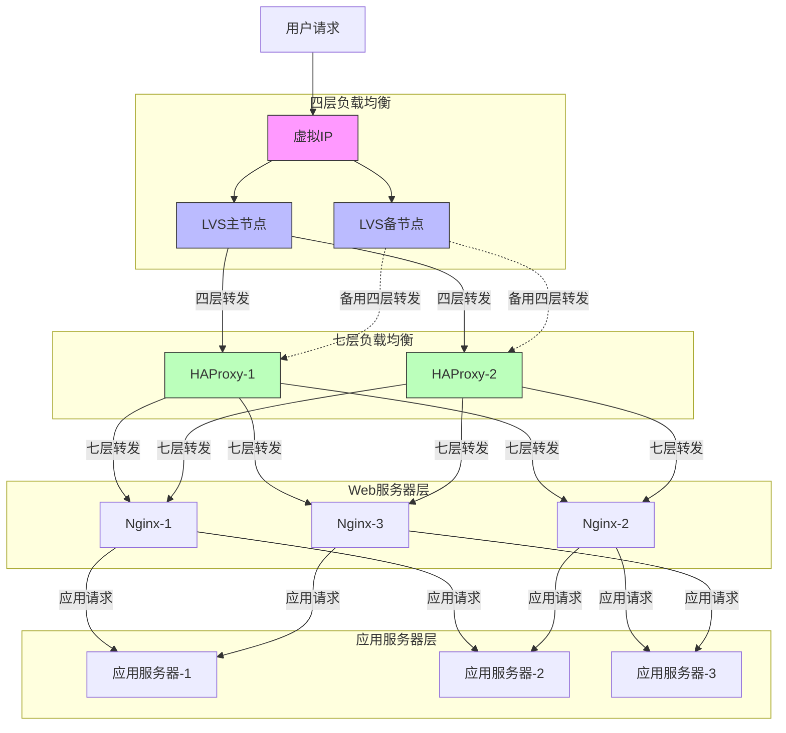
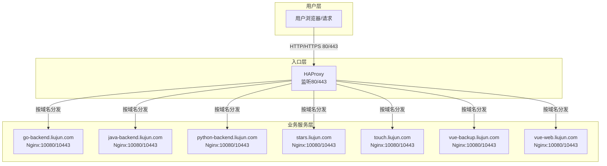

# HAProxy 教程

## 一、HAProxy概述

### 1.1 什么是HAProxy
HAProxy（High Availability Proxy）是一个开源的、高性能的负载均衡和代理服务器软件。它专门用于改善大型网站和应用的可用性、可靠性和性能。

### 1.2 HAProxy的主要特点
- **高性能**：单进程、事件驱动模型，支持数万并发连接
- **可靠性**：生产环境验证的稳定性，提供热备份功能
- **功能丰富**：支持多种负载均衡算法、会话保持、SSL终端等
- **监控友好**：详细的统计信息，支持多种监控方式

## 二、为什么需要HAProxy

### 2.1 业务场景演进

#### 场景一：小型餐厅（小型网站）
想象你开了一家小餐厅：
- 每天客流量：1000人（相当于网站1-10万访问量）
- 只需要一个服务员（相当于一个Nginx服务器）
- 服务员负责：
  - 接待客人（处理用户请求）
  - 点餐（处理动态内容）
  - 上菜（返回页面内容）
- 特点：人不多时，一个服务员就够用了

#### 场景二：餐厅生意火爆（业务快速增长）
餐厅太受欢迎，客人越来越多：
- 每天客流量：5000人（相当于10-100万访问量）
- 问题：
  - 一个服务员忙不过来了（Nginx服务器压力大）
  - 需要增加服务员（增加服务器）
  - 客人希望每次都由同一个服务员服务（会话保持）
- 解决方案：
  - 雇佣一个领班（HAProxy）专门负责分配客人给不同服务员
  - 服务员们（多个Nginx）可以专心服务客人

#### 场景三：开连锁餐厅（大型应用架构）
生意越做越大，开了连锁店：
- 每天客流量：2万人以上（相当于100万以上访问量）
- 架构：
  - 在商场门口安排迎宾（LVS）：专门负责快速指引客人到不同分店
  - 每个分店都有领班（HAProxy）：负责店内的精细化服务安排
  - 多名服务员（Nginx）：专注于服务客人

### 2.2 分层架构的优势

1. **性能最大化**
   - LVS：专注流量分发，性能最强
   - HAProxy：负责会话管理和SSL，性能适中
   - Nginx：处理具体业务，按需扩展

2. **职责明确**
   - LVS：流量调度员，分发快速高效
   - HAProxy：中层管理者，负责精细调控
   - Nginx：一线服务员，处理具体业务

3. **系统弹性**
   - 每层都可以独立扩展
   - 故障隔离，一层问题不影响整体
   - 便于针对性优化和监控

### 2.3 为什么选择HAProxy

1. **从小型项目角度**
   - 配置简单，易于上手
   - 监控界面直观
   - 支持健康检查，避免服务中断

2. **从中型项目角度**
   - 支持会话保持
   - 提供丰富的负载均衡算法
   - 可以根据URL、Cookie等进行智能分发

3. **从大型项目角度**
   - 可以与LVS、Nginx完美配合
   - 支持SSL卸载，减轻后端服务器压力
   - 提供细粒度的访问控制

## 三、HAProxy架构和工作原理

### 3.1 基本架构



### 3.2 工作流程说明
1. **用户请求流程**
   - 用户请求首先到达虚拟IP（VIP）
   - LVS主节点接收请求并进行四层转发
   - HAProxy节点进行七层负载均衡
   - Nginx处理具体的Web请求
   - 应用服务器处理业务逻辑

2. **HAProxy处理流程**
   - 前端监听：接收来自LVS的请求
   - ACL规则匹配：根据规则判断请求类型
   - 负载均衡：选择合适的后端服务器
   - 健康检查：定期检查服务器状态
   - 会话保持：确保用户请求的一致性
   - 监控统计：记录性能和状态指标

## 四、HAProxy与其他负载均衡方案对比

| 特性 | LVS | HAProxy | Nginx |
|------|-----|----------|--------|
| 工作层 | 网络层(L4) | 应用层(L7)/传输层(L4) | 应用层(L7) |
| 性能 | 最强，可达到10Gbps | 较强，可达到2-3Gbps | 中等，可达到1-2Gbps |
| CPU消耗 | 最低 | 中等 | 较高 |
| 并发连接 | 百万级 | 十万级 | 万级 |
| 配置复杂度 | 简单 | 中等 | 较复杂 |
| 健康检查 | 基础TCP检查 | 支持多种协议检查 | 基础HTTP/TCP检查 |
| 会话保持 | 支持 | 支持多种方式 | 需要第三方模块 |
| 安装难度 | 较难 | 简单 | 简单 |
| 维护成本 | 低 | 中 | 中 |
| 功能特点 | - 仅做转发<br>- 性能最强<br>- 资源占用最少<br>- 无流量修改能力 | - 丰富的负载均衡算法<br>- 强大的健康检查<br>- 详细的统计信息<br>- 可编程的ACL规则 | - 反向代理<br>- 静态文件处理<br>- URL重写<br>- 资源缓存 |
| 适用场景 | - 超大并发<br>- 电信级应用<br>- 纯四层转发 | - 七层应用负载均衡<br>- 需要精细控制<br>- 中等规模集群 | - Web服务器<br>- 反向代理<br>- 小规模负载均衡 |

## 五、HAProxy的核心功能

### 5.1 负载均衡算法

#### 5.1.1 轮询（Round Robin）
- 最简单的负载均衡算法
- 按顺序将请求分配给后端服务器
- 适用场景：后端服务器性能相近
- 配置示例：
```conf
backend web-backend
    balance roundrobin    # 使用轮询算法
    server web1 192.168.1.101:80 check
    server web2 192.168.1.102:80 check
```

#### 5.1.2 加权轮询（Weighted Round Robin/static-rr）
- 可以为服务器设置权重，权重越大分配到的请求越多
- static-rr为静态加权轮询，权重运行时不可变
- 适用场景：服务器性能不同
- 配置示例：
```conf
backend web-backend
    balance static-rr
    server web1 192.168.1.101:80 weight 3 check
    server web2 192.168.1.102:80 weight 1 check
```

#### 5.1.3 最少连接（Least Connection）
- 将请求分配给当前连接数最少的服务器
- 动态计算服务器负载
- 适用场景：请求处理时间差异大
- 配置示例：
```conf
backend web-backend
    balance leastconn    # 使用最少连接算法
    server web1 192.168.1.101:80 check
    server web2 192.168.1.102:80 check
```

#### 5.1.4 源地址哈希（Source Hash）
- 根据客户端IP地址计算哈希值分配服务器
- 同一客户端总是访问同一服务器
- 适用场景：需要会话保持
- 配置示例：
```conf
backend web-backend
    balance source    # 使用源地址哈希
    hash-type consistent    # 使用一致性哈希
    server web1 192.168.1.101:80 check
    server web2 192.168.1.102:80 check
```

#### 5.1.5 URI哈希（URI Hash）
- 根据请求的URI进行哈希分配服务器
- 适用场景：代理缓存、提高缓存命中率
- 配置示例：
```conf
backend web-backend
    balance uri
    hash-type consistent
    server web1 192.168.1.101:80 check
    server web2 192.168.1.102:80 check
```

#### 5.1.6 URL参数哈希（URL Parameter Hash）
- 根据HTTP GET请求的指定参数进行哈希分配服务器
- 适用场景：同一用户请求分配到同一服务器
- 配置示例：
```conf
backend web-backend
    balance url_param userid
    hash-type consistent
    server web1 192.168.1.101:80 check
    server web2 192.168.1.102:80 check
```

#### 5.1.7 HTTP头哈希（Header Hash）
- 根据HTTP请求头的指定字段进行哈希分配服务器
- 适用场景：根据自定义头部实现粘性会话
- 配置示例：
```conf
backend web-backend
    balance hdr(User-Agent)
    hash-type consistent
    server web1 192.168.1.101:80 check
    server web2 192.168.1.102:80 check
```

#### 5.1.8 RDP Cookie哈希（RDP Cookie Hash）
- 针对RDP协议，根据cookie进行哈希分配服务器
- 适用场景：RDP协议粘性会话
- 配置示例：
```conf
backend web-backend
    balance rdp-cookie(mstshash)
    server web1 192.168.1.101:3389 check
    server web2 192.168.1.102:3389 check
```

### 5.2 健康检查机制

#### 5.2.1 TCP 端口检查
- 最基本的健康检查方式
- 检查服务器端口是否可连接
- 配置示例：
```conf
backend web-backend
    option tcp-check    # 启用TCP检查
    server web1 192.168.1.101:80 check port 80    # 检查80端口
```

#### 5.2.2 HTTP 请求检查
- 发送HTTP请求检查服务是否正常
- 可以指定检查URL和期望的响应
- 配置示例：
```conf
backend web-backend
    option httpchk GET /health    # 检查/health路径
    http-check expect status 200    # 期望返回200状态码
    server web1 192.168.1.101:80 check
```

#### 5.2.3 SSL 证书检查
- 检查SSL证书是否有效
- 验证证书有效期
- 配置示例：
```conf
backend web-backend
    option ssl-hello-chk    # 启用SSL检查
    server web1 192.168.1.101:443 check
```

### 5.3 安全特性

#### 5.3.1 SSL/TLS 终端
- HAProxy处理SSL/TLS加密解密
- 减轻后端服务器负担
- 配置示例：
```conf
frontend https-in
    bind *:443 ssl crt /etc/ssl/certs/example.pem
    mode http
    default_backend web-backend
```

#### 5.3.2 ACL 访问控制
- 根据各种条件控制访问
- 可以基于IP、域名、路径等
- 配置示例：
```conf
frontend http-in
    acl is_admin path_beg /admin    # 定义管理路径
    acl allowed_ip src 192.168.1.0/24    # 定义允许的IP
    block if is_admin !allowed_ip    # 禁止非允许IP访问管理路径
```

#### 5.3.3 DDoS 防护
- 限制连接数和请求率
- 防止资源耗尽
- 配置示例：
```conf
frontend http-in
    stick-table type ip size 100k expire 30s store conn_rate(3s)
    tcp-request connection reject if { src_conn_rate gt 10 }
```

### 5.4 运维管理

#### 5.4.1 统计信息页面
- 查看服务器状态和性能指标
- 配置示例：
```conf
listen stats
    bind *:8080
    stats enable    # 启用统计页面
    stats uri /stats    # 统计页面URL
    stats auth admin:password    # 访问认证
```

#### 5.4.2 日志配置
- 记录详细的访问日志
- 便于问题排查
- 配置示例：
```conf
global
    log 127.0.0.1 local0 info

frontend http-in
    option httplog    # 启用HTTP日志
    log global    # 使用全局日志配置
```

### 5.5 基础配置模板
这是一个完整的基础配置模板，包含了常用的配置项：

```conf
global
    log 127.0.0.1 local0 info
    maxconn 4096    # 最大连接数
    user haproxy
    group haproxy
    daemon    # 后台运行

defaults
    log global
    mode http    # 默认HTTP模式
    option httplog
    option dontlognull
    timeout connect 5000ms    # 连接超时
    timeout client 50000ms    # 客户端超时
    timeout server 50000ms    # 服务器超时

frontend http-in
    bind *:80
    default_backend web-backend

backend web-backend
    balance roundrobin
    option httpchk GET /health
    server web1 192.168.1.101:80 check
    server web2 192.168.1.102:80 check

listen stats
    bind *:8080
    stats enable
    stats uri /stats
    stats auth admin:password
```

这个配置模板包含了：
1. 基本的全局设置
2. 默认的超时配置
3. 前端HTTP监听
4. 后端服务器配置
5. 统计页面设置

你可以根据实际需求修改IP地址、端口和其他参数。记得在修改配置后重启HAProxy服务使配置生效：
```bash
systemctl restart haproxy
```

## 六、HAProxy实验环境搭建

### 6.1 安装HAProxy

#### 6.1.1 Ubuntu系统安装
```bash
# 更新软件包索引
sudo apt update

# 安装HAProxy
sudo apt install -y haproxy

# 启动并设置开机自启
sudo systemctl enable --now haproxy

# 查看版本和状态
haproxy -v
sudo systemctl status haproxy
```

### 6.2 基础配置模板

创建一个包含日志和监控的基础配置：
```bash
# 给大家一个通用的配置文件
vim  /etc/haproxy/haproxy.cfg 
# 配置文件内容
global
    # 日志配置
    log /dev/log local0 info    # 系统日志
    log /dev/log local1 notice  # 管理日志
    
    # 进程配置
    chroot /var/lib/haproxy
    user haproxy
    group haproxy
    daemon
    
    # 性能优化
    maxconn 50000               # 最大连接数
    # 给大家留着学员自我修改，随意你有兴趣就去查
    # 系统的文件描述符限制（ulimit -n）太低
    # 只有绝对了系统的文件描述符限制，才能让这个配置生效哦
    # ulimit-n 65536             # 文件描述符限制
    
    # 监控配置
    stats socket /var/lib/haproxy/stats mode 660 level admin
    stats timeout 30s

defaults
    # 日志配置
    log global
    option httplog              # 启用HTTP日志
    option dontlognull         # 不记录空连接
    
    # 模式设置
    mode http
    
    # 超时配置
    timeout connect 5000ms     # 连接超时 毫秒的哈
    timeout client 50000ms     # 客户端超时
    timeout server 50000ms     # 服务器超时
    
    # 健康检查
    option redispatch          # 服务器挂掉后重新分发
    retries 3                  # 重试次数

# 监控页面
listen stats
    bind *:8404
    stats enable               # 启用统计页面
    stats uri /stats           # 统计页面URL
    stats refresh 10s          # 刷新间隔
    stats auth admin:123456  # 访问认证
    stats admin if TRUE        # 启用管理功能
    
    # Prometheus监控接口 - 这个以后要用到滴，给我加上加上
    http-request use-service prometheus-exporter if { path /metrics }
    
    # 隐藏版本信息
    stats hide-version

```

### 6.3 配置说明

1. **日志配置**
   - 使用系统rsyslog服务
   - 分别记录系统日志和管理日志
   - 可通过local0和local1分类管理

2. **监控设置**
   - 提供Web统计界面（8404端口）
   - 支持Prometheus监控集成
   - 包含基本认证保护

3. **性能优化**
   - 最大连接数设置为50000
   - 调整文件描述符限制
   - 启用守护进程模式

4. **安全特性**
   - 请求速率限制
   - 隐藏版本信息
   - 访问认证保护

### 6.4 测试方法

1. **配置测试**
```bash
# 检查配置文件语法
haproxy -c -f /etc/haproxy/haproxy.cfg

# 检查服务状态
systemctl status haproxy

# 查看日志
tail -f /var/log/messages
```

2. **监控检查**
```bash
# 访问统计页面
curl -u admin:StrongPassword123 http://192.168.110.5:8404/stats

# 检查Prometheus指标
curl http://192.168.110.5:8404/metrics
```

### 实验二 配置代理后端服务的负载均衡

#### frontend 与 backend 作用说明
- **frontend**：定义客户端请求的接入点，负责监听端口、协议解析、访问控制等，将请求分发到相应的backend。
- **backend**：定义后端服务器池及其负载均衡策略，决定请求如何分发到后端服务器，并可配置健康检查、会话保持等。

#### 需求（新版）
本实验目标：
- 让同学们掌握如何用 HAProxy 统一代理多个业务域名的 HTTP/HTTPS 流量。
- 目前 Nginx 已将 80 和 443 端口预留给 HAProxy，Nginx 自身监听 10080 和 10443。
- 所有外部流量（80/443）先进入 HAProxy，再根据域名分发到不同后端服务。
- 涉及的业务域名有：
  - go-backend.liujun.com
  - java-backend.liujun.com
  - python-backend.liujun.com
  - stars.liujun.com
  - touch.liujun.com
  - vue-backup.liujun.com
  - vue-web.liujun.com

#### 实验整体架构图

#### HAProxy 配置文件示例
假设所有后端 Nginx 监听 10080/10443 端口，HAProxy 监听 80/443 端口并根据域名分发流量：

```bash
# 编辑 HAProxy 配置文件
vim /etc/haproxy/haproxy.cfg

# 监听 80 端口（HTTP）
frontend http-in
    bind *:80
    mode http
    acl host_go hdr(host) -i go-backend.liujun.com
    acl host_java hdr(host) -i java-backend.liujun.com
    acl host_python hdr(host) -i python-backend.liujun.com
    acl host_stars hdr(host) -i stars.liujun.com
    acl host_touch hdr(host) -i touch.liujun.com
    acl host_vueb hdr(host) -i vue-backup.liujun.com
    acl host_vuew hdr(host) -i vue-web.liujun.com
    use_backend go-backend if host_go
    use_backend java-backend if host_java
    use_backend python-backend if host_python
    use_backend stars if host_stars
    use_backend touch if host_touch
    use_backend vueb if host_vueb
    use_backend vuew if host_vuew
    default_backend go-backend

# 监听 443 端口（HTTPS，需证书）
frontend https-in
    bind *:443 ssl crt /etc/haproxy/certs/
    mode http
    acl host_go hdr(host) -i go-backend.liujun.com
    acl host_java hdr(host) -i java-backend.liujun.com
    acl host_python hdr(host) -i python-backend.liujun.com
    acl host_stars hdr(host) -i stars.liujun.com
    acl host_touch hdr(host) -i touch.liujun.com
    acl host_vueb hdr(host) -i vue-backup.liujun.com
    acl host_vuew hdr(host) -i vue-web.liujun.com
    use_backend go-backend if host_go
    use_backend java-backend if host_java
    use_backend python-backend if host_python
    use_backend stars if host_stars
    use_backend touch if host_touch
    use_backend vueb if host_vueb
    use_backend vuew if host_vuew
    default_backend go-backend

# 各业务后端
backend go-backend
    server go1 127.0.0.1:10080 check
backend java-backend
    server java1 127.0.0.1:10080 check
backend python-backend
    server py1 127.0.0.1:10080 check
backend stars
    server stars1 127.0.0.1:10080 check
backend touch
    server touch1 127.0.0.1:10080 check
backend vueb
    server vueb1 127.0.0.1:10080 check
backend vuew
    server vuew1 127.0.0.1:10080 check
```
> 如有多个后端实例，可在 backend 中继续添加 server 行。

#### 证书准备与复制

如果你之前为 Nginx 生成了证书（如 /etc/nginx/ssl/ 目录），可以直接将对应域名的证书和私钥合并为 PEM 文件，复制到 HAProxy 的证书目录（如 /etc/haproxy/certs/）。操作示例：

```bash
# 创建 HAProxy 证书目录
sudo mkdir -p /etc/haproxy/certs/
# 以 go-backend.liujun.com 为例，合并证书和私钥为 PEM 文件
sudo cat /etc/nginx/ssl/go-backend.liujun.com/certificate.crt /etc/nginx/ssl/go-backend.liujun.com/private.key > /etc/haproxy/certs/go-backend.liujun.com.pem
# 其他域名同理
sudo cat /etc/nginx/ssl/java-backend.liujun.com/certificate.crt /etc/nginx/ssl/java-backend.liujun.com/private.key > /etc/haproxy/certs/java-backend.liujun.com.pem
sudo cat /etc/nginx/ssl/python-backend.liujun.com/certificate.crt /etc/nginx/ssl/python-backend.liujun.com/private.key > /etc/haproxy/certs/python-backend.liujun.com.pem
# ... 依次处理所有业务域名
```
> 注意：HAProxy 需要 PEM 格式证书（即证书和私钥合并），配置文件中引用 PEM 文件路径即可。

#### Nginx 配置文件调整

由于 HTTPS 证书已由 HAProxy 统一处理，流量到达 Nginx 时为 HTTP 协议，因此需关闭原有的 HTTP 强制跳转 HTTPS 配置，改为直接提供 HTTP 服务。
最后nginx就不管理https的证书啦，又轻松一点了

##### 修改前配置（示例）
```bash
# 编辑nginx域名配置文件
vim /etc/nginx/conf.d/python-backend.liujun.com.conf

upstream python_backend {
    server 192.168.110.198:8070 weight=1 max_fails=2 fail_timeout=30s;
    server 192.168.110.102:8070 weight=1 max_fails=2 fail_timeout=30s;
    server 192.168.110.143:8070 weight=1 max_fails=2 fail_timeout=30s;
}

server {
    listen 10443 ssl;
    server_name python-backend.liujun.com;
    # 访问日志配置，记录所有访问请求
    access_log /var/log/nginx/python-backend.liujun.com.access.log json_combined;
    # 错误日志配置，记录警告级别以上的错误
    error_log /var/log/nginx/python-backend.liujun.com.error.log warn;
    
    # 证书文件路径
    ssl_certificate /etc/nginx/ssl/python-backend.liujun.com/certificate.crt;  # 公钥证书
    ssl_certificate_key /etc/nginx/ssl/python-backend.liujun.com/private.key;  # 私钥文件
    
    # SSL优化配置（提高安全性和性能）
    ssl_protocols TLSv1.2 TLSv1.3;                     # 只允许TLS1.2和1.3协议，禁用不安全的老版本
    ssl_ciphers ECDHE-ECDSA-AES128-GCM-SHA256:ECDHE-RSA-AES128-GCM-SHA256;  # 使用强加密套件
    ssl_prefer_server_ciphers on;                      # 优先使用服务器的加密套件，提高安全性
    ssl_session_cache shared:SSL:10m;                  # SSL会话缓存，提高性能（10MB共享内存）
    ssl_session_timeout 10m;                           # 缓存会话的超时时间（10分钟）
    ssl_stapling on;                                   # 启用OCSP Stapling（提高性能和隐私）
    ssl_stapling_verify on;                           # 验证OCSP响应的有效性

    # API代理配置 - 处理所有以/api/开头的请求
    location /api/ {
        # 将请求转发到之前定义的后端服务器组
        proxy_pass http://python_backend;
        
        # 配置代理协议版本（HTTP/1.1支持长连接，提高性能）
        proxy_http_version 1.1;
        
        # WebSocket支持（如果你的应用使用WebSocket，这些设置是必需的）
        # WebSocket是一种在单个TCP连接上进行全双工通信的协议
        proxy_set_header Upgrade $http_upgrade;        # 支持协议升级
        proxy_set_header Connection 'upgrade';         # 连接升级为WebSocket
        
        # 传递客户端信息到后端服务器（这样后端可以获取到真实的客户端信息）
        proxy_set_header Host $host;                  # 传递原始主机名
        proxy_set_header X-Real-IP $remote_addr;      # 传递客户端真实IP
        proxy_set_header X-Forwarded-For $proxy_add_x_forwarded_for;  # 传递请求链路上的所有IP
        proxy_set_header X-Forwarded-Proto $scheme;   # 传递原始协议（http/https）
        
        # 超时设置（防止长时间运行的请求占用资源）
        proxy_connect_timeout 60s;  # 与后端服务器建立连接的超时时间
        proxy_send_timeout 60s;     # 向后端服务器传输请求的超时时间
        proxy_read_timeout 60s;     # 从后端服务器读取响应的超时时间
    }

    # 静态资源缓存配置 - 处理常见的静态文件类型
    # ~* 表示不区分大小写的正则匹配，匹配所有以这些扩展名结尾的文件
    location ~* \.(js|css|png|jpg|jpeg|gif|ico|svg)$ {
        expires 1y;                                # 设置缓存过期时间为1年
        add_header Cache-Control "public, no-transform";  # 允许所有缓存服务器缓存，且不允许转换
        access_log off;                           # 关闭访问日志，减少磁盘IO
    }
    
} # 结束HTTPS server块

# HTTP重定向到HTTPS - 安全增强
# 这个server块处理所有HTTP请求，并将其重定向到HTTPS
server {
    listen 10080;                                  # 监听80端口（HTTP标准端口）
    server_name python-backend.liujun.com;       # 注意：这里应该是python-backend.liujun.com而不是vue-web.liujun.com
    
    return 301 https://$server_name$request_uri;  # 重定向到对应的HTTPS地址
}
```

##### 修改后配置（示例）
```bash
upstream python_backend {
    server 192.168.110.198:8070 weight=1 max_fails=2 fail_timeout=30s;
    server 192.168.110.102:8070 weight=1 max_fails=2 fail_timeout=30s;
    server 192.168.110.143:8070 weight=1 max_fails=2 fail_timeout=30s;
}

server {
    listen 10080;                                  # 监听80端口（HTTP标准端口）
    server_name python-backend.liujun.com;
    # 访问日志配置，记录所有访问请求
    access_log /var/log/nginx/python-backend.liujun.com.access.log json_combined;
    # 错误日志配置，记录警告级别以上的错误
    error_log /var/log/nginx/python-backend.liujun.com.error.log warn;
    
    #return 301 https://$server_name$request_uri;  # 重定向到对应的HTTPS地址

    # API代理配置 - 处理所有以/api/开头的请求
    location /api/ {
        # 将请求转发到之前定义的后端服务器组
        proxy_pass http://python_backend;
        
        # 配置代理协议版本（HTTP/1.1支持长连接，提高性能）
        proxy_http_version 1.1;
        
        # WebSocket支持（如果你的应用使用WebSocket，这些设置是必需的）
        # WebSocket是一种在单个TCP连接上进行全双工通信的协议
        proxy_set_header Upgrade $http_upgrade;        # 支持协议升级
        proxy_set_header Connection 'upgrade';         # 连接升级为WebSocket
        
        # 传递客户端信息到后端服务器（这样后端可以获取到真实的客户端信息）
        proxy_set_header Host $host;                  # 传递原始主机名
        proxy_set_header X-Real-IP $remote_addr;      # 传递客户端真实IP
        proxy_set_header X-Forwarded-For $proxy_add_x_forwarded_for;  # 传递请求链路上的所有IP
        proxy_set_header X-Forwarded-Proto $scheme;   # 传递原始协议（http/https）
        
        # 超时设置（防止长时间运行的请求占用资源）
        proxy_connect_timeout 60s;  # 与后端服务器建立连接的超时时间
        proxy_send_timeout 60s;     # 向后端服务器传输请求的超时时间
        proxy_read_timeout 60s;     # 从后端服务器读取响应的超时时间
    }

    # 静态资源缓存配置 - 处理常见的静态文件类型
    # ~* 表示不区分大小写的正则匹配，匹配所有以这些扩展名结尾的文件
    location ~* \.(js|css|png|jpg|jpeg|gif|ico|svg)$ {
        expires 1y;                                # 设置缓存过期时间为1年
        add_header Cache-Control "public, no-transform";  # 允许所有缓存服务器缓存，且不允许转换
        access_log off;                           # 关闭访问日志，减少磁盘IO
    }
}
```

#### 实验操作步骤
1. **准备证书**：将所有业务域名的 SSL 证书（crt+key）合并为 pem 文件，放到 `/etc/haproxy/certs/` 目录下。
2. **编辑配置**：将上述 haproxy.cfg 内容保存到 `/etc/haproxy/haproxy.cfg`。
3. **检查配置**：
   ```bash
   sudo haproxy -c -f /etc/haproxy/haproxy.cfg
   ```
   若无报错说明配置正确。
4. **重启服务**：
   ```bash
   sudo systemctl restart haproxy
   sudo systemctl enable haproxy
   ```
5. **测试访问**：本地 hosts 绑定域名后，访问 http(s)://各业务域名，验证能否正常分发到对应后端。
6. **查看日志与状态**：
   ```bash
   sudo tail -f /var/log/haproxy.log
   sudo ss -tnlp | grep haproxy
   ```

> 如需后端 Nginx 监听 10080/10443 端口，请确保 Nginx 配置正确并已启动。


### Haproxy 独有的sock 操作

HAProxy 支持通过 UNIX Socket 进行运行时管理和监控，可以动态调整后端服务器状态、查看统计信息等。常见 sock 操作语法如下：

- **配置启用 socket**
  在 global 段添加：
  ```
  global
      stats socket /var/run/haproxy.sock mode 600 level admin
  ```

- **连接 socket 执行命令**
  使用 socat 工具：
  ```bash
  echo "show info" | socat stdio /var/run/haproxy.sock
  ```

- **常用 sock 命令**
  - `show info`：显示 HAProxy 进程信息
  - `show stat`：显示统计数据
  - `show sess`：显示当前会话
  - `disable server backend/server`：下线指定后端服务器
  - `enable server backend/server`：上线指定后端服务器

> 说明：sock 操作适合进阶用户进行动态管理和自动化运维，有兴趣的同学可以查阅[官方文档](https://www.haproxy.com/documentation/hapee/latest/management/runtime-api/)深入学习。

        

        