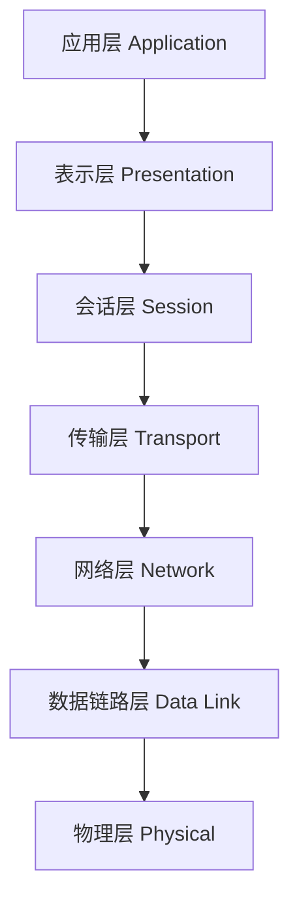
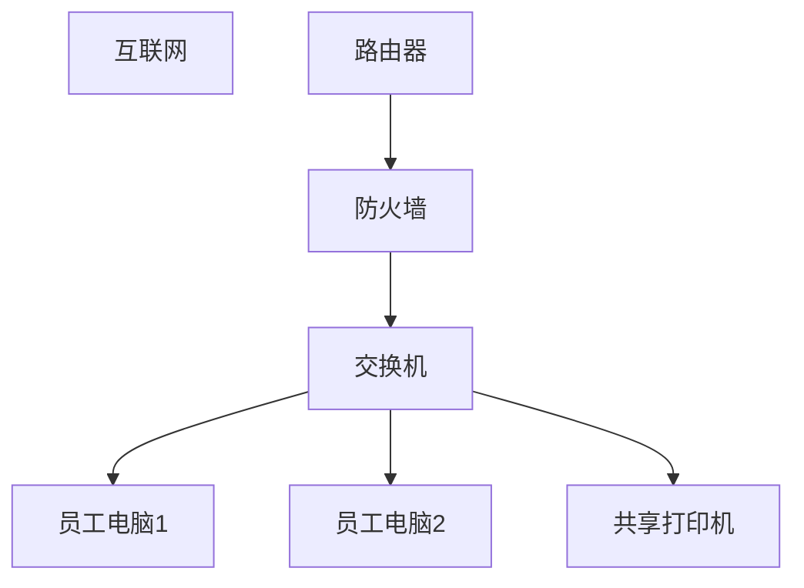

# 云计算基础设施与网络配置

## 教学目标
1. 了解计算机网络的基本概念和作用。
2. 掌握网络通信的基本原理。
3. 理解OSI七层模型及其对应的现实硬件和功能。
4. 能够举一反三，理解网络在现实生活和云计算中的应用。

## 课程大纲
1. 什么是计算机网络？
2. 计算机的基本组成部分（硬件基础）
3. 网络通信的基本原理
4. OSI七层模型详解
5. 网络设备与实际应用案例
6. 总结与答疑

## 1. 什么是计算机网络？
### 定义：
计算机网络是通过**通信介质（如网线、无线信号）**将多台计算机或设备连接起来，实现数据和资源共享的系统。
### 例子：
* 你用手机连接Wi-Fi观看视频，这就是通过网络访问视频服务器。
* 在公司内部，员工通过共享的打印机打印文件，也是网络的一种应用。
### 网络的作用：
* 资源共享：共享文件、打印机等。
* 通信：发送邮件、视频通话、聊天。
* 数据传输：上传照片到云端、下载文件。

---
## 2. 计算机的基本组成部分
在学习网络之前，先了解计算机的基本硬件组成，这有助于理解网络通信的实现。

### 2.1 计算机组成部分
1. 中央处理器（CPU）：负责执行指令，比如计算和逻辑判断。
2. 内存（RAM）：临时存储运行中的数据，速度快但断电丢失数据。
3. 存储设备：
    * 硬盘（HDD）：容量大，速度慢。
    * 固态硬盘（SSD）：速度快，适合高性能需求。
4. 主板：连接所有硬件的核心部件。
5. 网卡（NIC）：负责网络通信。
6. 电源：为计算机提供电能。

---
## 3. 网络通信的基本原理
网络通信的核心是数据的传输。数据从一台设备发送到另一台设备，需要经过以下流程：
1. 数据分组：将大块数据切分成小块（称为数据包）。
2. 寻址：为每个数据包指定发送方和接收方的地址（IP地址）。
3. 传输：通过物理介质（如网线、无线信号）将数据包发送出去。
4. 接收与重组：接收方重新组装数据包，得到完整的数据。

#### 例子：
* 你发送一封邮件：
    * 邮件内容被拆分成多个数据包。
    * 每个数据包带有你的地址（发送方IP）和对方地址（接收方IP）。
    * 数据包通过网络传输到对方的邮箱服务器。
    * 对方的设备接收并重组数据，完整显示你的邮件。

## 4. OSI七层模型详解
OSI模型是一个标准化的网络通信框架，将网络通信分为七个层次。每一层都有特定的功能，负责处理通信中的某一步。

### 4.1 OSI七层模型概览
以下是OSI模型的七层及其主要功能：


### 4.2 每层功能详解与举例

#### 1. 应用层（Application Layer）
* 功能：提供用户与网络交互的接口。
* 协议：HTTP（访问网页）、FTP（文件传输）、SMTP（邮件）。
* 例子：
    * 你用浏览器访问www.google.com，应用层使用HTTP协议处理请求。

#### 2. 表示层（Presentation Layer）
* 功能：数据格式转换、加密/解密。
* 例子：
    * 当你访问HTTPS网站时，表示层负责加密网页数据，保护隐私。

#### 3. 会话层（Session Layer）
* 功能：管理会话连接。
* 例子：
    * 视频会议软件（如Zoom）通过会话层管理会议的连接和断开。

#### 4. 传输层（Transport Layer）
* 功能：确保数据可靠传输。
* 协议：TCP（可靠传输）、UDP（快速传输）。
* 例子：
    * 下载文件时，传输层使用TCP协议确保文件完整。

#### 5. 网络层（Network Layer）
* 功能：数据包的路由选择。
* 协议：IP协议。
* 例子：
    * 路由器根据IP地址将数据包发送到正确的目标网络。

#### 6. 数据链路层（Data Link Layer）
* 功能：管理数据帧的传输。
* 例子：
    * 交换机通过MAC地址将数据帧发送到正确的设备。

#### 7. 物理层（Physical Layer）
* 功能：定义数据的物理传输方式。
* 例子：
    * 网线、光纤负责传输比特流。

---

## 5. 网络设备与实际应用
### 5.1 常见网络设备 
1. 路由器：负责不同网络之间的通信。
2. 交换机：管理局域网中设备之间的通信。
3. 网卡：负责设备与网络的连接。
4. 防火墙：保护网络安全，阻止非法访问。

### 5.2 实际应用案例
#### 案例：公司内部网络

* 员工通过交换机连接到局域网。
* 路由器连接公司网络与外部互联网。
* 防火墙保护公司网络免受外部攻击。



## 6. 什么是TCP/IP协议模型？
### 6.1 定义
TCP/IP协议模型是一组标准化的通信协议，它是互联网的基础，几乎所有的网络通信都基于TCP/IP协议。它的设计目标是支持不同网络架构和操作系统之间的互联互通。

### 6.2 TCP/IP与OSI模型的关系
TCP/IP协议模型是一个四层模型，与OSI的七层模型类似，但更简化。两者的对比如下：

| OSI 模型层级                | TCP/IP 模型层级          | 对应功能                                   |
|-----------------------------|--------------------------|-------------------------------------------|
| 应用层、表示层、会话层      | 应用层 (Application)     | 提供用户与网络的交互接口（如 HTTP、FTP）。 |
| 传输层                      | 传输层 (Transport)       | 提供端到端的可靠传输（如 TCP、UDP）。     |
| 网络层                      | 网络层 (Internet)        | 负责数据包的路由选择和转发（如 IP 协议）。|
| 数据链路层、物理层          | 网络接口层 (Link)        | 负责比特流的传输（如以太网、Wi-Fi）。     |

#### 6.2.1 应用层
* 功能：提供用户与网络的交互接口。
* 常见协议：
    * HTTP/HTTPS：访问网页。
    * FTP：文件传输。
    * SMTP/POP3：电子邮件。

#### 6.2.2 传输层
* 功能：负责端到端的数据传输，确保数据可靠或快速到达。
* 常见协议：
    * TCP（传输控制协议）：提供可靠的数据传输（如文件下载）。
    * UDP（用户数据报协议）：提供快速但不可靠的传输（如视频直播）。

#### 6.2.3 网络层
* 功能：负责数据包的路由选择和转发。
* 核心协议：
    * IP协议：为每台设备分配唯一的地址（IP地址）。
    * ICMP协议：用于网络诊断（如Ping命令）。
    * ARP协议：将IP地址转换为MAC地址。

#### 6.2.4 网络接口层
* 功能：负责数据的物理传输。
* 常见技术：
    * 以太网（Ethernet）。
    * 无线网络（Wi-Fi）。

## 7. 主机与主机之间通信的三个要素
在TCP/IP模型中，主机之间的通信依赖于以下三个要素：

### 7.1 IP地址（IP Address）
* 定义：IP地址是用来标识网络中每台设备的唯一地址。
* IPv4地址格式：
    * 由32位二进制组成，通常以点分十进制表示，例如：192.168.1.10。
    * 每部分的取值范围是0~255。
* 例子：
    * 家庭路由器的默认IP地址通常是192.168.1.1。
    * 你的电脑连接到Wi-Fi时，会被分配一个类似192.168.1.10的IP地址。

### 7.2 子网掩码（Subnet Mask）
* 定义：子网掩码用来划分网络范围，确定IP地址的网络部分和主机部分。
* 常见子网掩码：

    * 255.255.255.0 表示一个网络中可以有254台设备。
    * 255.255.0.0 表示一个网络中可以有65534台设备。
* 例子：
    * 如果你的IP地址是192.168.1.10，子网掩码是255.255.255.0，那么你的设备属于192.168.1.0这个网络。

### 7.3 网关（Gateway）
* 定义：网关是网络中的出口设备，负责将数据包转发到其他网络。
* 例子：
    * 家庭网络中的路由器通常充当网关，默认地址是192.168.1.1。

## 8. TCP/IP地址配置步骤
为了让主机能够正常通信，需要配置以下网络参数：

### 8.1 IP地址
* 作用：标识设备的网络地址。
* 例子：192.168.1.10。

### 8.2 子网掩码
* 作用：划分网络范围。
* 例子：255.255.255.0。
### 8.3 网关地址
* 作用：指定数据包的出口。
* 例子：192.168.1.1。
### 8.4 DNS服务器地址
* 作用：将域名（如www.google.com）转换为IP地址。
* 例子：8.8.8.8（Google的公共DNS）。

## 9 案例：TCP/IP地址配置

### 问题描述
为一台主机配置以下网络参数：
1. IP地址：192.168.1.10
2. 子网掩码：255.255.255.0
3. 网关：192.168.1.254
4. DNS服务器：202.106.0.20

### 配置步骤
1. 打开网络设置：
    * 在Windows系统中，右键点击网络图标，选择“网络和共享中心”。
    * 点击“更改适配器设置”，右键选择当前的网络连接，点击“属性”。
2. 选择“Internet协议版本4（TCP/IPv4）”，点击“属性”。
3. 输入以下参数：
    * IP地址：192.168.1.10
    * 子网掩码：255.255.255.0
    * 默认网关：192.168.1.254
    * DNS服务器：202.106.0.20
4. 点击“确定”，完成配置。

### 配置参数的验证

#### 使用命令行工具
* 打开命令提示符（Windows系统中，按Win+R，输入cmd）。
* 输入以下命令：
    * 查看配置参数：ipconfig
    * 查看更信息的配置参数: ipconfig /all
    * 测试网络连通性：ping 192.168.1.254（测试网关是否可达）。

#### 示例输出
```plaintext
IPv4 地址: 192.168.1.10
子网掩码: 255.255.255.0
默认网关: 192.168.1.254
```


## 10. 总结与答疑
### 总结：
* 计算机网络是现代社会的基础设施。
* OSI七层模型帮助我们理解网络通信的分工与协作。
* 网络设备在不同的层次上完成各自的任务，保障通信顺畅。
* TCP/IP协议模型 是互联网的核心，它简化了网络通信的实现。
* 配置网络参数时，确保IP地址、子网掩码和网关在同一网络范围内。
* DNS服务器地址可以选择公共DNS（如8.8.8.8）或本地运营商提供的DNS。

### 注意事项：
* 如果网络配置错误，可能导致无法访问互联网。
* 动态IP地址（DHCP）可以自动分配网络参数，无需手动设置。

