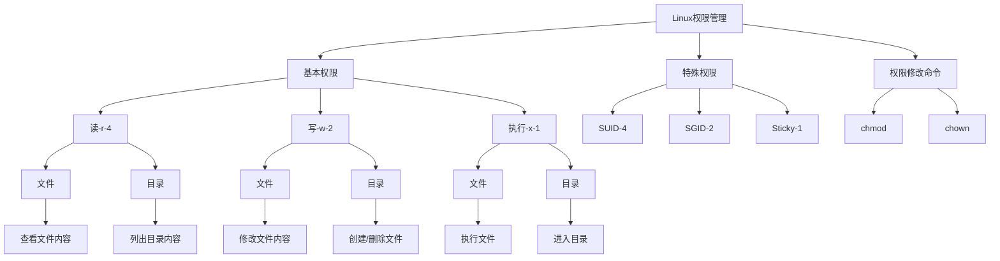
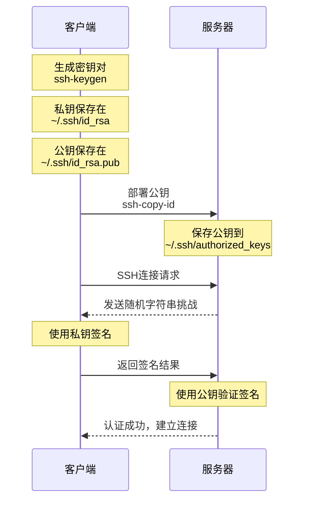
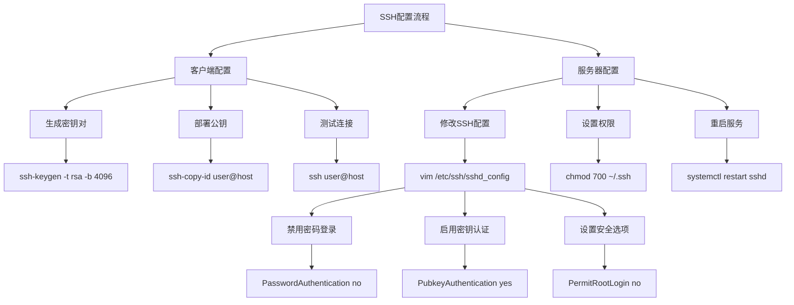
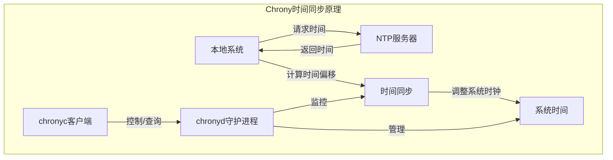
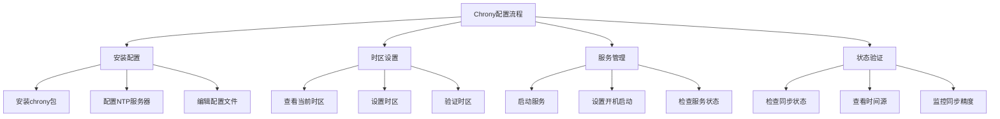

# Linux系统用户管理与安全配置实战

## 课程目标：

1. 掌握Linux系统用户和权限管理的核心操作
    * 能够独立完成用户的创建、修改和删除
    * 理解并正确设置文件权限
    * 熟练配置sudo授权
    * 学会远程安全登录的配置方法

2. 掌握SSH密钥对的创建和使用
    * 能够配置基于密钥的安全登录
    * 了解SSH安全加固方案
    * 配置系统基础服务

3. 掌握时间同步服务的部署和配置
    * 理解NTP服务的重要性
    * 能够验证时间同步状态
    * 熟练使用系统监控命令

4. 掌握系统资源监控的方法
    * 能够查看进程和网络状态
    * 学会分析系统性能指标


## 第一部分：用户管理
### 1. 命令解释
| 命令         | 说明                     |
|--------------|-------------------------|
| `useradd`    | 创建新的系统用户         |
| `usermod`    | 修改用户的属性           |
| `passwd`     | 修改用户密码             |
| `userdel`    | 删除用户                 |
| `groups`     | 查看用户所属的组         |
| `gpasswd`    | 管理用户组               |
| `su`         | 切换用户身份             |

### 2. 常用参数说明
linux用户管理命令详解：useradd命令的功能与使用方法 [参考文档](https://www.linuxcool.com/linux%e7%94%a8%e6%88%b7%e7%ae%a1%e7%90%86%e5%91%bd%e4%bb%a4%e8%af%a6%e8%a7%a3%ef%bc%9auseradd%e5%91%bd%e4%bb%a4%e7%9a%84%e5%8a%9f%e8%83%bd%e4%b8%8e%e4%bd%bf%e7%94%a8%e6%96%b9%e6%b3%95)

#### useradd参数
| 参数 | 作用                     | 举例                              |
|------|-------------------------|-----------------------------------|
| `-d` | 指定用户主目录          | `useradd -d /home/test test`     |
| `-g` | 指定用户所属主组        | `useradd -g admin test`          |
| `-G` | 指定用户所属附加组      | `useradd -G docker,admin test`   |
| `-s` | 指定用户的登录shell     | `useradd -s /bin/bash test`      |
| `-m` | 创建用户主目录          | `useradd -m test`                |


#### usermod参数
| 参数 | 作用                     | 举例                              |
|------|-------------------------|-----------------------------------|
| `-g` | 修改用户主组            | `usermod -g admin test`          |
| `-G` | 修改用户附加组          | `usermod -G docker test`         |
| `-a` | 追加用户到附加组        | `usermod -aG docker test`        |
| `-s` | 修改用户shell           | `usermod -s /bin/bash test`      |
| `-L` | 锁定用户账号            | `usermod -L test`                |
| `-U` | 解锁用户账号            | `usermod -U test`                |

#### passwd参数
| 参数          | 作用                              | 举例                                      |
|---------------|----------------------------------|-------------------------------------------|
| `-l`          | 锁定用户密码                     | `passwd -l test`                         |
| `-u`          | 解锁用户密码                     | `passwd -u test`                         |
| `-d`          | 删除用户密码                     | `passwd -d test`                         |
| `-e`          | 强制用户下次登录修改密码         | `passwd -e test`                         |
| `-S`          | 查看密码状态                     | `passwd -S test`                         |
| `--stdin`     | 从标准输入读取密码               | `echo "123456" | passwd --stdin test`    |


#### groups命令
| 命令格式            | 作用                        | 举例                |
|---------------------|----------------------------|---------------------|
| `groups`            | 查看当前用户所属组          | `groups`            |
| `groups 用户名`     | 查看指定用户所属组          | `groups test`       |


#### gpasswd参数
| 参数  | 作用                    | 举例                            |
|-------|------------------------|---------------------------------|
| `-a`  | 将用户添加到组          | `gpasswd -a test docker`       |
| `-d`  | 将用户从组中删除        | `gpasswd -d test docker`       |
| `-A`  | 指定组管理员            | `gpasswd -A test `              |


#### su命令参数
| 参数  | 作用                          | 举例                      |
|-------|------------------------------|---------------------------|
| `-`   | 切换用户并加载环境变量        | `su - test`              |
| `-c`  | 执行单个命令后返回            | `su - test -c 'ls'`      |
| `-s`  | 指定要使用的 shell            | `su -s /bin/sh test`     |


### 3. 常用语法示例
```bash
# 创建用户
useradd -m -s /bin/bash test     # 创建test用户并指定shell
useradd -g admin -G docker test  # 创建用户并指定组

# 修改用户
usermod -aG docker test         # 将test用户添加到docker组
usermod -s /sbin/nologin test   # 禁止test用户登录

# 设置密码
passwd test                     # 为test用户设置密码
echo "password" | passwd --stdin test  # 非交互式设置密码

# 删除用户
userdel -r test                # 删除用户及其主目录

# 组管理
groups test                    # 查看test用户所属的组
gpasswd -a test docker        # 将test用户添加到docker组
gpasswd -d test docker        # 将test用户从docker组中删除

# 切换用户
su - test                     # 切换到test用户并加载环境变量
su test                       # 切换到test用户但不加载环境变量

```

### 4. 练习实验
**实验一：创建并配置新用户**

```bash
# 任务：创建一个名为student的用户，配置以下要求：
# 1. 主目录为/home/student
# 2. 使用bash作为默认shell
# 3. 添加到docker组
# 4. 设置密码为student123

# 答案：
useradd -m -s /bin/bash student    # 创建用户
usermod -aG docker student         # 添加到docker组
echo "student123" | passwd --stdin student  # 设置密码

```

**实验二：用户组管理**

```bash
# 任务：完成以下操作：
# 1. 创建一个名为project的组
# 2. 创建两个用户dev1和dev2
# 3. 将这两个用户都添加到project组
# 4. 验证用户组关系

# 答案：
groupadd project                   # 创建组
useradd -m dev1                   # 创建用户1
useradd -m dev2                   # 创建用户2
gpasswd -a dev1 project           # 添加用户到组
gpasswd -a dev2 project
groups dev1                       # 验证
groups dev2

```

**实验三：用户管理综合练习**
```bash
# 任务：对已有用户student进行如下修改：
# 1. 锁定账号
# 2. 修改shell为nologin
# 3. 解锁账号
# 4. 恢复shell为bash
# 5. 最后删除该用户

# 答案：
usermod -L student                # 锁定账号
usermod -s /sbin/nologin student  # 修改shell
usermod -U student                # 解锁账号
usermod -s /bin/bash student      # 恢复shell
userdel -r student                # 删除用户

```

**练习四：用户切换**
```bash
# 任务：
# 1. 创建用户dev
# 2. 以dev用户身份执行 whoami 命令
# 3. 切换到dev用户并查看环境变量
# 4. 验证两种切换方式的区别

# 答案：
useradd -m dev
su - dev -c 'whoami'
su - dev    # 使用 env 命令查看环境变量
su dev      # 对比两种方式的环境变量差异
```

注意事项：

1. 在生产环境中修改用户配置前要先备份
2. 删除用户时要确认是否有重要文件需要保留
3. 修改系统用户时要特别谨慎
4. 建议使用-m选项创建用户主目录
5. 添加用户到组时优先使用gpasswd而不是直接修改/etc/group文件


## 第二部分：权限管理

### 1. 命令解释
| 命令   | 说明                         |
|--------|-----------------------------|
| `chmod`| 修改文件或目录的权限         |
| `chown`| 修改文件或目录的所有者和所属组|


### 2. 权限表示方法

#### 2.1 字符权限表示
* r: 读取权限（4）
* w: 写入权限（2）
* x: 执行权限（1）
* -: 无权限（0）

#### 2.2 数字权限表示
* 权限数字 = 用户权限 + 组权限 + 其他用户权限
* 例如：
    - 777 = rwxrwxrwx
    - 755 = rwxr-xr-x
    - 644 = rw-r--r--

#### 2.3 特殊权限
* SUID (4): 执行时具有文件所有者权限
* SGID (2): 执行时具有文件所属组权限
* Sticky (1): 只有所有者能删除文件

### 3. 命令参数说明

#### chmod参数
| 参数  | 作用              | 举例                      |
|-------|------------------|---------------------------|
| `-R`  | 递归修改权限      | `chmod -R 755 /data`     |
| `-V`  | 显示修改过程      | `chmod -v 644 file`      |
| `-C`  | 仅显示修改的文件  | `chmod -c 644 *`         |


#### chmod参数
| 参数  | 作用              | 举例                      |
|-------|------------------|---------------------------|
| `-R`  | 递归修改所有者    | `chown -R user:group /data` |
| `-V`  | 显示修改过程      | `chown -v user file`     |
| `-C`  | 仅显示修改的文件  | `chown -c user *`        |


### 4. 使用示例
```bash
# chmod基本用法
chmod 755 file              # 设置文件权限为rwxr-xr-x
chmod u+x file             # 为所有者添加执行权限
chmod g-w file             # 删除组的写权限
chmod o=r file             # 设置其他用户为只读

# chmod特殊权限
chmod 4755 file            # 设置SUID权限
chmod 2755 file            # 设置SGID权限
chmod 1777 directory       # 设置Sticky权限

# chown使用示例
chown user file            # 修改文件所有者
chown user:group file      # 同时修改所有者和组
chown :group file          # 只修改组

```

### 5. 练习实验



####  实验一：基本权限设置
```bash
# 任务：
# 1. 创建目录test_perm
# 2. 在目录中创建文件file1
# 3. 设置目录权限为755
# 4. 设置文件权限为644

# 答案：
mkdir test_perm
touch test_perm/file1
chmod 755 test_perm
chmod 644 test_perm/file1
ls -l test_perm

```

#### 实验二：特殊权限设置
```bash
# 任务：
# 1. 创建目录share
# 2. 设置SGID权限
# 3. 创建文件并验证权限继承

# 答案：
mkdir share
chmod 2775 share
touch share/test_file
ls -l share/test_file  # 验证组权限是否继承

```

#### 实验三：所有者修改
```bash
# 任务：
# 1. 创建用户test_user
# 2. 创建文件test_file
# 3. 修改文件所有者为test_user
# 4. 同时修改所有者和组

# 答案：
useradd test_user
touch test_file
chown test_user test_file
chown test_user:test_user test_file
ls -l test_file

```

## Sudo配置管理

### 1. 命令解释
| 命令          | 说明                          |
|---------------|------------------------------|
| `visudo`      | 安全地编辑 sudoers 配置文件   |
| `sudo -I`     | 列出当前用户的 sudo 权限      |
| `sudo -v`     | 更新用户的时间戳              |
| `sudo -k`     | 使时间戳失效                  |

### 2. sudo参数说明
| 参数  | 作用                          | 举例                              |
|-------|------------------------------|-----------------------------------|
| `-u`  | 以指定用户执行命令            | `sudo -u mysql mysqld`           |
| `-g`  | 以指定组执行命令              | `sudo -g docker docker ps`       |
| `-i`  | 模拟初始登录 shell            | `sudo -i`                        |
| `-s`  | 运行 shell                    | `sudo -s`                        |
| `-H`  | 设置 HOME 环境变量            | `sudo -H pip install package`    |

### 3. sudoers配置语法
* 配置示例文件位置：
    * 主配置文件：/etc/sudoers
    * 配置目录：/etc/sudoers.d/
    * 建议将自定义配置放在单独的文件中：/etc/sudoers.d/custom

#### 3.1 基本语法格式
```bash
# 用户配置
user    host=(runas)    commands

# 组配置
%group  host=(runas)    commands

# 别名定义
Host_Alias    SERVERS = server1, server2
Cmnd_Alias    NETWORKING = /sbin/route, /sbin/ifconfig
User_Alias    ADMINS = john, mike

```

#### 3.2 常用配置示例
```bash
# 允许用户执行所有命令
admin    ALL=(ALL)       ALL

# 允许用户免密码执行所有命令
admin    ALL=(ALL)       NOPASSWD: ALL

# 允许用户执行特定命令
user1    ALL=(root)      /usr/bin/passwd

# 允许组内所有用户执行命令
%sudo    ALL=(ALL:ALL)   ALL

# 限制特定命令
user2    ALL=(ALL)       !/usr/bin/passwd root

```

### 4. 练习实验
#### 实验一：基本sudo配置
```bash
# 任务：
# 1. 创建用户dev_user
# 2. 配置允许dev_user执行nginx相关命令
# 3. 验证配置

# 答案：
useradd dev_user
visudo
# 添加以下行：
dev_user ALL=(root) /usr/sbin/nginx
# 保存退出
sudo -l -U dev_user  # 验证权限

```

#### 实验二：配置命令别名
```bash
# 任务：
# 1. 创建网络管理命令别名
# 2. 授权用户使用这些命令
# 3. 测试配置

# 答案：
visudo
# 添加以下配置：
Cmnd_Alias NETWORK = /sbin/ifconfig, /sbin/route, /bin/ping
user1 ALL=(root) NETWORK
# 保存退出
sudo -l -U user1  # 验证权限

```

#### 实验三：免密码配置
```bash
# 任务：
# 1. 配置用户可以免密码重启服务
# 2. 验证配置
# 3. 测试权限

# 答案：
visudo
# 添加以下配置：
user2 ALL=(root) NOPASSWD: /usr/bin/systemctl restart nginx
# 保存退出
sudo -l -U user2
sudo systemctl restart nginx  # 测试无需密码

```

## SSH远程登录配置


### 1. 命令解释
| 命令            | 说明                          |
|-----------------|------------------------------|
| `ssh-keygen`    | 生成 SSH 密钥对              |
| `ssh-copy-id`   | 将公钥复制到远程服务器        |
| `ssh`           | SSH 远程登录命令             |
| `sshd`          | SSH 服务器守护进程           |

### 2. 参数说明

#### ssh-keygen参数
| 参数  | 作用                          | 举例                              |
|-------|------------------------------|-----------------------------------|
| `-t`  | 指定密钥类型                 | `ssh-keygen -t rsa`              |
| `-b`  | 指定密钥长度                 | `ssh-keygen -b 4096`            |
| `-f`  | 指定密钥文件名               | `ssh-keygen -f ~/.ssh/my_key`   |
| `-C`  | 添加注释                     | `ssh-keygen -C "work@email.com"`|


#### ssh-copy-id参数
| 参数  | 作用                          | 举例                                      |
|-------|------------------------------|-------------------------------------------|
| `-i`  | 指定公钥文件                 | `ssh-copy-id -i ~/.ssh/id_rsa.pub user@host` |
| `-p`  | 指定端口                     | `ssh-copy-id -p 2222 user@host`          |
| `-f`  | 强制覆盖                     | `ssh-copy-id -f user@host`               |

### 3. 配置示例


#### 3.1 生成SSH密钥
```bash
# 生成默认RSA密钥
ssh-keygen

# 生成指定类型和大小的密钥
ssh-keygen -t ed25519 -C "your_email@example.com"

# 生成指定文件名的密钥
ssh-keygen -t rsa -b 4096 -f ~/.ssh/custom_key

```

#### 3.2 部署公钥
```bash
# 标准部署方式
ssh-copy-id user@remote_host

# 指定端口部署
ssh-copy-id -p 2222 user@remote_host

# 指定密钥文件部署
ssh-copy-id -i ~/.ssh/custom_key.pub user@remote_host

```

#### 3.3 SSH服务器配置
```bash
# 编辑SSH配置文件
vim /etc/ssh/sshd_config

# 常用配置项
Port 22
PermitRootLogin no
PasswordAuthentication no
PubkeyAuthentication yes
AuthorizedKeysFile .ssh/authorized_keys

```

### 4. 练习实验


#### 实验一：基本密钥配置
```bash
# 任务：
# 1. 生成SSH密钥对
# 2. 查看生成的文件
# 3. 确认权限正确

# 答案：
ssh-keygen -t rsa -b 4096
ls -l ~/.ssh/
# 确认权限
chmod 700 ~/.ssh
chmod 600 ~/.ssh/id_rsa
chmod 644 ~/.ssh/id_rsa.pub

```

#### 实验二：部署密钥到服务器
```bash
# 任务：
# 1. 部署公钥到远程服务器
# 2. 测试免密登录
# 3. 查看远程authorized_keys

# 答案：
ssh-copy-id user@remote_host
ssh user@remote_host
ls -l ~/.ssh/authorized_keys

```

#### 实验三：禁用密码登录
```bash
# 任务：
# 1. 备份SSH配置
# 2. 修改配置禁用密码
# 3. 重启SSH服务
# 4. 测试配置

# 答案：
sudo cp /etc/ssh/sshd_config /etc/ssh/sshd_config.bak
sudo vim /etc/ssh/sshd_config

# 修改以下配置
PasswordAuthentication no
PubkeyAuthentication yes

# 重启服务
sudo systemctl restart sshd

```

### 5. 安全建议
1. 密钥管理

```bash
# 使用强密钥
ssh-keygen -t ed25519 -b 4096

# 保护私钥
chmod 600 ~/.ssh/id_rsa

```

2. 服务器配置
```bash
# /etc/ssh/sshd_config
Port 2222                    # 修改默认端口
PermitRootLogin no          # 禁止root登录
MaxAuthTries 3              # 最大尝试次数
LoginGraceTime 30           # 登录超时时间

```

3. 访问控制
```bash
# /etc/ssh/sshd_config
AllowUsers user1 user2      # 允许的用户
DenyUsers baduser           # 禁止的用户
AllowGroups sshusers       # 允许的组

```

### 6. 常见问题处理
1. 权限问题
```bash
# 修复权限
chmod 700 ~/.ssh
chmod 600 ~/.ssh/id_rsa
chmod 644 ~/.ssh/id_rsa.pub
chmod 644 ~/.ssh/authorized_keys

```

2. 连接测试
```bash
# 测试连接（详细模式）
ssh -v user@remote_host

# 指定密钥测试
ssh -i ~/.ssh/custom_key user@remote_host

```

3. 服务状态检查
```bash
# 检查服务状态
systemctl status sshd

# 查看日志
journalctl -u sshd

```

4. 注意事项：
1. 禁用密码登录前确保密钥登录正常
2. 保持一个活动的SSH会话直到确认配置正确
3. 定期更换密钥
4. 保护好私钥文件
5. 使用强密码短语保护私钥
6. 定期审计SSH访问日志
7. 配置文件修改后要重启服务
8. 建议使用非标准端口


## Chrony时间同步服务详解

### 1. 命令解释
#### 1.1 基础命令表格
| 命令          | 作用                          | 示例                                      |
|---------------|------------------------------|-------------------------------------------|
| `timedatectl` | 查看和设置系统时间/时区      | `timedatectl set-timezone Asia/Shanghai` |
| `chronyd`     | 时间同步守护进程             | `systemctl start chronyd`               |
| `chronyc`     | 时间同步客户端工具           | `chronyc sources`                       |
| `date`        | 显示或设置系统日期和时间     | `date "+%Y-%m-%d %H:%M:%S"`            |

#### 1.2 chronyc子命令
| 子命令         | 作用                      | 示例                      |
|----------------|--------------------------|---------------------------|
| `tracking`     | 显示时间同步状态         | `chronyc tracking`       |
| `sources`      | 显示配置的时间源         | `chronyc sources -v`     |
| `sourcestats`  | 显示时间源统计信息       | `chronyc sourcestats`    |
| `makestep`     | 立即同步时间             | `chronyc makestep`       |

### 2. 配置参数表格

#### 2.1 配置文件参数(/etc/chrony.conf)
| 参数          | 作用                          | 示例                                      |
|---------------|------------------------------|-------------------------------------------|
| `server`      | 指定NTP服务器                | `server ntp.aliyun.com iburst`          |
| `pool`        | 指定NTP服务器池              | `pool 2.centos.pool.ntp.org`            |
| `iburst`      | 加快初始同步                 | `server ntp1.example.com iburst`        |
| `allow`       | 允许客户端访问               | `allow 192.168.1.0/24`                 |
| `local`       | 即使无法同步也作为时间服务器 | `local stratum 10`                      |
| `driftfile`   | 时钟偏差记录文件             | `driftfile /var/lib/chrony/drift`       |


#### 2.2 时区设置参数

| 参数            | 作用                      | 示例                                      |
|-----------------|--------------------------|-------------------------------------------|
| `set-timezone`  | 设置系统时区             | `timedatectl set-timezone Asia/Shanghai` |
| `list-timezones`| 列出可用时区             | `timedatectl list-timezones`            |
| `status`        | 显示当前时间设置         | `timedatectl status`                    |

### 3. 语法举例




#### 3.1 基础配置
```bash
# 安装chrony
sudo dnf install chrony

# 编辑配置文件
sudo vim /etc/chrony.conf
server ntp.aliyun.com iburst
server time1.cloud.tencent.com iburst

# 启动服务
sudo systemctl start chronyd
sudo systemctl enable chronyd

```

#### 3.2 时区设置
```bash
# 查看当前时区
timedatectl

# 设置时区
sudo timedatectl set-timezone Asia/Shanghai

# 验证时间同步
date
chronyc tracking

```

#### 3.3 状态检查
```bash
# 查看同步源
chronyc sources -v

# 查看详细统计
chronyc sourcestats

# 查看同步状态
chronyc tracking

```

### 4. 练习实验


#### 练习1：基础配置
```bash
# 任务：配置chrony使用国内NTP服务器
步骤1: 安装chrony
sudo dnf install chrony

步骤2: 编辑配置文件
sudo vim /etc/chrony.conf
# 添加以下内容
server ntp.aliyun.com iburst
server time1.cloud.tencent.com iburst

步骤3: 启动服务
sudo systemctl start chronyd
sudo systemctl enable chronyd

步骤4: 验证配置
chronyc sources

```

#### 练习2：时区设置
```bash
# 任务：将系统时区设置为上海时区
步骤1: 查看当前时区
timedatectl

步骤2: 设置时区
sudo timedatectl set-timezone Asia/Shanghai

步骤3: 验证设置
date
timedatectl status

```

#### 练习3：同步状态检查
```bash
# 任务：检查时间同步状态并分析
步骤1: 查看同步状态
chronyc tracking

步骤2: 查看时间源
chronyc sources -v

步骤3: 分析同步精度
chronyc sourcestats

```

#### 练习4：故障排查
```bash
# 任务：解决常见同步问题
步骤1: 检查服务状态
systemctl status chronyd

步骤2: 查看日志
journalctl -u chronyd

步骤3: 检查网络连接
ping ntp.aliyun.com

步骤4: 验证防火墙设置
sudo firewall-cmd --list-services

```


## 系统状态查看详解

### 1. 命令解释
| 命令       | 作用                        | 基本语法                       |
|------------|----------------------------|-------------------------------|
| `top`      | 实时显示系统资源使用状况    | `top [-d 延时 -p PID]`       |
| `ps`       | 显示进程状态               | `ps [aux -- sort]`           |
| `netstat`  | 显示网络连接信息           | `netstat [-tulpn]`           |
| `free`     | 显示内存使用情况           | `free [-h -s]`              |
| `df`       | 显示磁盘使用情况           | `df [-h -T]`                |

### 2. 参数详解

#### 2.1 top命令参数

| 参数   | 作用                | 示例                |
|--------|---------------------|---------------------|
| `-d`   | 指定刷新间隔        | `top -d 2`          |
| `-p`   | 监控指定进程        | `top -p 1234`       |
| `-u`   | 显示特定用户进程    | `top -u root`       |
| `-b`   | 批处理模式          | `top -b -n 1`       |

交互命令：

* P：按CPU使用率排序
* M：按内存使用率排序
* T：按运行时间排序
* k：终止进程
* r：重新设置优先级
* c: 显示模式-显示完整命令及参数
* z: 进入颜色模式

#### 2.2 ps命令参数
| 参数        | 作用            | 示例                       |
|-------------|-----------------|----------------------------|
| `aux`       | 显示所有进程    | `ps aux`                   |
| `-ef`       | 全格式显示      | `ps -ef`                   |
| `--sort`    | 排序显示        | `ps aux --sort=-pcpu`      |
| `-u`        | 指定用户进程    | `ps -u root`               |


#### 2.3 netstat命令参数
| 参数   | 作用            | 示例              |
|--------|-----------------|-------------------|
| `-t`   | 显示TCP连接     | `netstat -t`      |
| `-u`   | 显示UDP连接     | `netstat -u`      |
| `-l`   | 显示监听端口    | `netstat -l`      |
| `-n`   | 显示端口号      | `netstat -n`      |
| `-p`   | 显示进程信息    | `netstat -p`      |

#### 2.4 free命令参数
| 参数 | 作用     | 示例         |
| ---- | -------- | ------------ |
| -h   | 人性化显示 | `free -h`    |
| -s   | 持续显示   | `free -s 1`  |
| -t   | 显示总计   | `free -t`    |
| -w   | 宽输出     | `free -w`    |

#### 2.5 df命令参数
| 参数 | 作用               | 示例            |
| ---- | ------------------ | --------------- |
| -h   | 人性化显示         | `df -h`         |
| -T   | 显示文件系统类型   | `df -T`         |
| -i   | 显示 inode 信息    | `df -i`         |
| -x   | 排除特定文件系统   | `df -x tmpfs`   |


### 3. 使用示例

#### 3.1 系统负载监控
```bash
# 实时监控系统负载
top

# 监控特定进程
top -p $(pgrep nginx)

# 按CPU使用率排序输出前10个进程
ps aux --sort=-pcpu | head -n 11

```

#### 3.2 网络连接查看
```bash
# 查看所有TCP连接
netstat -tnp

# 查看监听端口
netstat -tlnp

# 查看特定端口
netstat -tnp | grep :80

```

#### 3.3 内存使用监控
```bash
# 查看内存使用情况
free -h

# 每2秒更新一次
free -h -s 2

# 显示详细信息
free -w -h

```

#### 3.4 磁盘使用查看
```bash
# 查看磁盘使用情况
df -h

# 查看文件系统类型
df -T

# 查看inode使用情况
df -i

```

### 4. 练习实验

#### 练习1：系统负载分析
```bash
# 任务：找出CPU使用率最高的前5个进程
步骤1: 使用top命令
top
# 按P键按CPU使用率排序

步骤2: 使用ps命令
ps aux --sort=-pcpu | head -n 6

# 答案分析：
# 1. 进程ID
# 2. CPU使用率
# 3. 内存使用率
# 4. 命令名称

```

#### 练习2：网络连接分析
```bash
# 任务：查看系统所有TCP监听端口
步骤1: 使用netstat命令
netstat -tlnp

# 答案应包含：
# - 协议类型
# - 本地地址
# - 监听端口
# - 进程名/PID

```

#### 练习3：内存使用分析
```bash
# 任务：监控系统内存使用变化
步骤1: 使用free命令持续监控
free -h -s 2

步骤2: 分析内存使用情况
# 关注点：
# - 总内存
# - 已用内存
# - 可用内存
# - 缓存使用

```

#### 练习4：磁盘空间分析  --选学高级用法
不会的哈，自己修养，我不强求

```bash
# 任务：找出磁盘使用率超过80%的分区
步骤1: 使用df命令
df -h | awk '{if(NR>1)if(+$5>80)print}'

# 答案分析：
# - 文件系统
# - 已用空间
# - 可用空间
# - 使用率

```


### 5. 常见问题处理
#### 5.1 系统负载高
```bash
# 检查CPU密集进程
top -c
# 或
ps aux --sort=-pcpu | head

# 检查内存使用
free -h
ps aux --sort=-rss | head

```

#### 5.2 网络连接问题
```bash
# 检查网络连接状态
netstat -ant | awk '{print $6}' | sort | uniq -c

# 检查特定端口
netstat -tlnp | grep :80

```

#### 5.3 内存不足
```bash
# 查看内存使用详情
free -h
# 查看大内存进程
ps aux --sort=-rss | head

```

#### 5.4 磁盘空间不足
```bash
# 查看大文件
find / -type f -size +100M -exec ls -lh {} \;

# 查看目录大小
du -sh /*

```

### 6. 监控要点
1. 系统负载监控
    * CPU使用率
    * 平均负载
    * 进程数量
    * 线程状态
2. 网络状态监控
    * 连接数量
    * 网络流量
    * 端口状态
    * 错误统计
3. 内存使用监控
    * 物理内存使用
    * 交换空间使用
    * 缓存使用
    * 共享内存
4. 磁盘使用监控
    * 空间使用率
    * I/O负载
    * inode使用
    * 读写速度