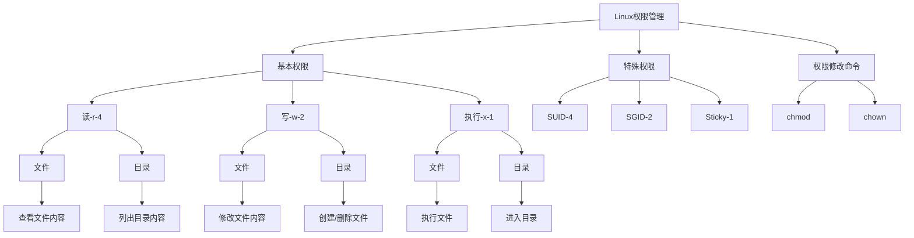
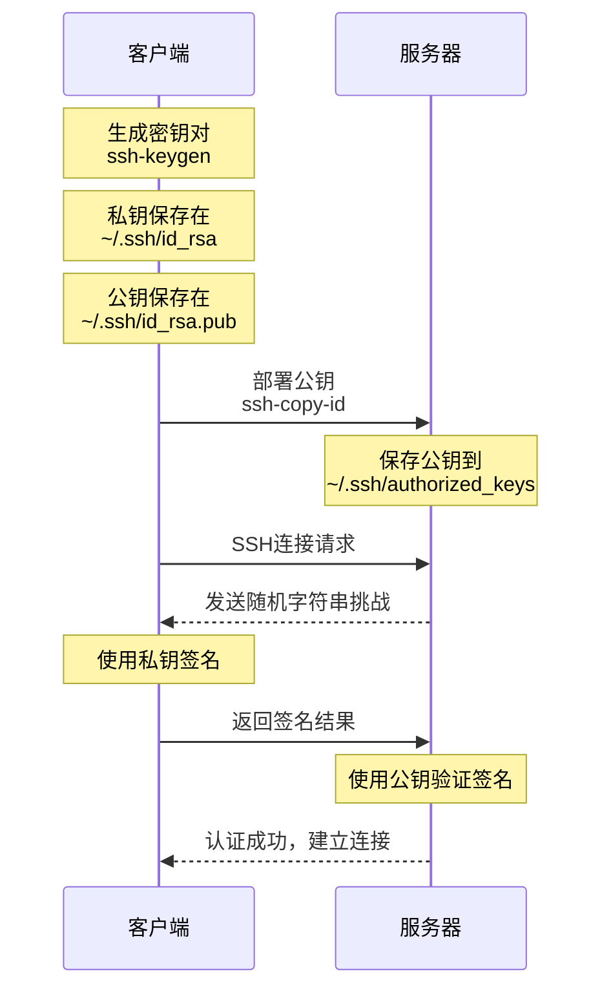
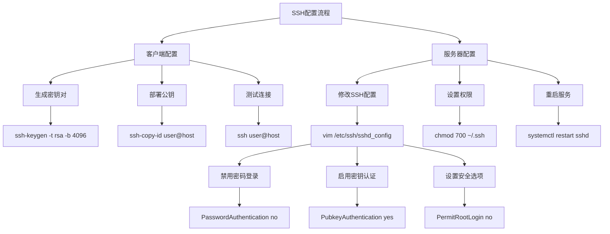

# Linux系统用户管理与安全配置实战

## 课程目标：

1. 掌握Linux系统用户和权限管理的核心操作
    * 能够独立完成用户的创建、修改和删除
    * 理解并正确设置文件权限
    * 熟练配置sudo授权
    * 学会远程安全登录的配置方法

2. 掌握SSH密钥对的创建和使用
    * 能够配置基于密钥的安全登录
    * 了解SSH安全加固方案
    * 配置系统基础服务

3. 掌握时间同步服务的部署和配置
    * 理解NTP服务的重要性
    * 能够验证时间同步状态
    * 熟练使用系统监控命令

4. 掌握系统资源监控的方法
    * 能够查看进程和网络状态
    * 学会分析系统性能指标


## 第一部分：用户管理
### 1. 命令解释
| 命令         | 说明                     |
|--------------|-------------------------|
| `useradd`    | 创建新的系统用户         |
| `usermod`    | 修改用户的属性           |
| `passwd`     | 修改用户密码             |
| `userdel`    | 删除用户                 |
| `groups`     | 查看用户所属的组         |
| `gpasswd`    | 管理用户组               |
| `su`         | 切换用户身份             |

### 2. 常用参数说明
linux用户管理命令详解：useradd命令的功能与使用方法 [参考文档](https://www.linuxcool.com/linux%e7%94%a8%e6%88%b7%e7%ae%a1%e7%90%86%e5%91%bd%e4%bb%a4%e8%af%a6%e8%a7%a3%ef%bc%9auseradd%e5%91%bd%e4%bb%a4%e7%9a%84%e5%8a%9f%e8%83%bd%e4%b8%8e%e4%bd%bf%e7%94%a8%e6%96%b9%e6%b3%95)

#### useradd参数
| 参数 | 作用                     | 举例                              |
|------|-------------------------|-----------------------------------|
| `-d` | 指定用户主目录          | `useradd -d /home/test test`     |
| `-g` | 指定用户所属主组        | `useradd -g adm test`          |
| `-G` | 指定用户所属附加组      | `useradd -G lpadmin,adm test`   |
| `-s` | 指定用户的登录shell     | `useradd -s /bin/bash test`      |
| `-m` | 创建用户主目录          | `useradd -m test`                |


#### usermod参数
| 参数 | 作用                     | 举例                              |
|------|-------------------------|-----------------------------------|
| `-g` | 修改用户主组            | `usermod -g adm test`          |
| `-G` | 修改用户附加组          | `usermod -G lpadmin test`         |
| `-a` | 追加用户到附加组        | `usermod -aG lpadmin test`        |
| `-s` | 修改用户shell           | `usermod -s /bin/bash test`      |
| `-L` | 锁定用户账号            | `usermod -L test`                |
| `-U` | 解锁用户账号            | `usermod -U test`                |

#### passwd参数
| 参数          | 作用                              | 举例                                      |
|---------------|----------------------------------|-------------------------------------------|
| `-l`          | 锁定用户密码                     | `passwd -l test`                         |
| `-u`          | 解锁用户密码                     | `passwd -u test`                         |
| `-d`          | 删除用户密码                     | `passwd -d test`                         |
| `-e`          | 强制用户下次登录修改密码         | `passwd -e test`                         |
| `-S`          | 查看密码状态                     | `passwd -S test`                         |


#### groups命令
| 命令格式            | 作用                        | 举例                |
|---------------------|----------------------------|---------------------|
| `groups`            | 查看当前用户所属组          | `groups`            |
| `groups 用户名`     | 查看指定用户所属组          | `groups test`       |


#### gpasswd参数
| 参数  | 作用                    | 举例                            |
|-------|------------------------|---------------------------------|
| `-a`  | 将用户添加到组          | `gpasswd -a test lpadmin`       |
| `-d`  | 将用户从组中删除        | `gpasswd -d test lpadmin`       |
| `-A`  | 指定组管理员            | `gpasswd -A test `              |


#### su命令参数
| 参数  | 作用                          | 举例                      |
|-------|------------------------------|---------------------------|
| `-`   | 切换用户并加载环境变量        | `su - test`              |
| `-c`  | 执行单个命令后返回            | `su - test -c 'ls'`      |
| `-s`  | 指定要使用的 shell            | `su -s /bin/sh test`     |


### 3. 常用语法示例
```bash
# 创建用户
useradd -m -s /bin/bash test     # 创建test用户并指定shell
useradd -g adm -G lpadmin test  # 创建用户并指定组

# 修改用户
usermod -aG lpadmin test         # 将test用户添加到lpadmin组
usermod -s /sbin/nologin test   # 禁止test用户登录

# 设置密码
passwd test                     # 为test用户设置密码
echo "test:password" | sudo chpasswd # 非交互式设置密码

# 删除用户
userdel -r test                # 删除用户及其主目录

# 组管理
groups test                    # 查看test用户所属的组
gpasswd -a test lpadmin        # 将test用户添加到lpadmin组
gpasswd -d test lpadmin        # 将test用户从lpadmin组中删除

# 切换用户
su - test                     # 切换到test用户并加载环境变量
su test                       # 切换到test用户但不加载环境变量

```

### 4. 练习实验
**实验一：创建并配置新用户**

```bash
# 任务：创建一个名为student的用户，配置以下要求：
# 1. 主目录为/home/student
# 2. 使用bash作为默认shell
# 3. 添加到lpadmin组
# 4. 设置密码为student123

# 答案：
useradd -m -s /bin/bash student    # 创建用户
usermod -aG adm student         # 添加到adm组
echo "student:student123" | sudo chpasswd  # 设置密码

```

**实验二：用户组管理**

```bash
# 任务：完成以下操作：
# 1. 创建一个名为project的组
# 2. 创建两个用户dev1和dev2
# 3. 将这两个用户都添加到project组
# 4. 验证用户组关系

# 答案：
groupadd project                   # 创建组
useradd -m dev1                   # 创建用户1
useradd -m dev2                   # 创建用户2
gpasswd -a dev1 project           # 添加用户到组
gpasswd -a dev2 project
groups dev1                       # 验证
groups dev2

```

**实验三：用户管理综合练习**
```bash
# 任务：对已有用户student进行如下修改：
# 1. 锁定账号
# 2. 修改shell为nologin
# 3. 解锁账号
# 4. 恢复shell为bash
# 5. 最后删除该用户

# 答案：
usermod -L student                # 锁定账号
usermod -s /sbin/nologin student  # 修改shell
usermod -U student                # 解锁账号
usermod -s /bin/bash student      # 恢复shell
userdel -r student                # 删除用户

```

**练习四：用户切换**
```bash
# 任务：
# 1. 创建用户dev
# 2. 以dev用户身份执行 whoami 命令
# 3. 切换到dev用户并查看环境变量
# 4. 验证两种切换方式的区别

# 答案：
useradd -m dev
su - dev -c 'whoami'
su - dev    # 使用 env 命令查看环境变量
su dev      # 对比两种方式的环境变量差异
```

注意事项：

1. 在生产环境中修改用户配置前要先备份
2. 删除用户时要确认是否有重要文件需要保留
3. 修改系统用户时要特别谨慎
4. 建议使用-m选项创建用户主目录
5. 添加用户到组时优先使用gpasswd而不是直接修改/etc/group文件


## 第二部分：权限管理

### 1. 命令解释
| 命令   | 说明                         |
|--------|-----------------------------|
| `chmod`| 修改文件或目录的权限         |
| `chown`| 修改文件或目录的所有者和所属组|


### 2. 权限表示方法

#### 2.1 字符权限表示
* r: 读取权限（4）
* w: 写入权限（2）
* x: 执行权限（1）
* -: 无权限（0）

#### 2.2 数字权限表示
* 权限数字 = 用户权限 + 组权限 + 其他用户权限
* 例如：
    - 777 = rwxrwxrwx
    - 755 = rwxr-xr-x
    - 644 = rw-r--r--

#### 2.3 特殊权限
* SUID (4): 执行时具有文件所有者权限
* SGID (2): 执行时具有文件所属组权限
* Sticky (1): 只有所有者能删除文件

### 3. 命令参数说明

#### chmod参数
| 参数  | 作用              | 举例                      |
|-------|------------------|---------------------------|
| `-R`  | 递归修改权限      | `chmod -R 755 /data`     |
| `-V`  | 显示修改过程      | `chmod -v 644 file`      |
| `-C`  | 仅显示修改的文件  | `chmod -c 644 *`         |


#### chown参数
| 参数  | 作用              | 举例                      |
|-------|------------------|---------------------------|
| `-R`  | 递归修改所有者    | `chown -R user:group /data` |
| `-V`  | 显示修改过程      | `chown -v user file`     |
| `-C`  | 仅显示修改的文件  | `chown -c user *`        |


### 4. 使用示例
```bash
# chmod基本用法
chmod 755 file              # 设置文件权限为rwxr-xr-x
chmod u+x file             # 为所有者添加执行权限
chmod g-w file             # 删除组的写权限
chmod o=r file             # 设置其他用户为只读

# chmod特殊权限
chmod 4755 file            # 设置SUID权限
chmod 2755 file            # 设置SGID权限
chmod 1777 directory       # 设置Sticky权限

# chown使用示例
chown user file            # 修改文件所有者
chown user:group file      # 同时修改所有者和组
chown :group file          # 只修改组

```

### 5. 练习实验



####  实验一：基本权限设置
```bash
# 任务：
# 1. 创建目录test_perm
# 2. 在目录中创建文件file1
# 3. 设置目录权限为755
# 4. 设置文件权限为644

# 答案：
mkdir test_perm
touch test_perm/file1
chmod 755 test_perm
chmod 644 test_perm/file1
ls -l test_perm

```

#### 实验二：特殊权限设置
```bash
# 任务：
# 1. 创建目录share
# 2. 设置SGID权限
# 3. 创建文件并验证权限继承

# 答案：
mkdir share
chmod 2775 share
touch share/test_file
ls -l share/test_file  # 验证组权限是否继承

```

#### 实验三：所有者修改
```bash
# 任务：
# 1. 创建用户test_user
# 2. 创建文件test_file
# 3. 修改文件所有者为test_user
# 4. 同时修改所有者和组

# 答案：
useradd test_user
touch test_file
chown test_user test_file
chown test_user:test_user test_file
ls -l test_file

```

## Sudo配置管理
### 什么是 Sudo？
sudo（Superuser Do）是一个 Linux/Unix 系统中非常重要的权限管理工具。它允许普通用户在不直接使用 root 用户登录的情况下，临时以超级用户（或其他指定用户）的身份执行特定命令。

### 为什么需要 Sudo？ 
* 安全性：避免直接使用 root 用户登录，减少误操作和被攻击的风险。
* 精细权限控制：通过 sudo，可以为不同用户分配不同的命令权限。
* 审计功能：sudo 会记录所有使用 sudo 执行的命令，便于追踪和审查。

### 1. 命令解释
| 命令          | 说明                          |
|---------------|------------------------------|
| `visudo`      | 安全地编辑 sudoers 配置文件   |
| `sudo -l`     | 列出当前用户的 sudo 权限      |
| `sudo -v`     | 更新用户的时间戳              |
| `sudo -k`     | 使时间戳失效                  |

### 2. sudo参数说明
| 参数  | 作用                          | 举例                              |
|-------|------------------------------|-----------------------------------|
| `-u`  | 以指定用户执行命令            | `sudo -u mysql mysqld`           |
| `-g`  | 以指定组执行命令              | `sudo -g lpadmin lpadmin ps`       |
| `-i`  | 模拟初始登录 shell            | `sudo -i`                        |
| `-s`  | 运行 shell                    | `sudo -s`                        |
| `-H`  | 设置 HOME 环境变量            | `sudo -H pip install package`    |

### 3. sudoers配置语法
* 配置示例文件位置：
    * 主配置文件：/etc/sudoers
    * 配置目录：/etc/sudoers.d/
    * 建议将自定义配置放在单独的文件中：/etc/sudoers.d/custom

#### 3.1 基本语法格式
```bash
# 用户配置
user    host=(runas)    commands

# 组配置
%group  host=(runas)    commands

# 别名定义
Host_Alias    SERVERS = server1, server2
Cmnd_Alias    NETWORKING = /sbin/route, /sbin/ifconfig
User_Alias    admS = john, mike

```

* user: 指定用户或用户组（组名前加 %）。
* host: 指定主机（ALL 表示所有主机）。
* runas: 指定可以切换的用户身份（ALL 表示所有用户）。
* commands: 指定允许执行的命令（ALL 表示所有命令）。

#### 3.2 常用配置示例
```bash
# 允许用户执行所有命令
adm    ALL=(ALL)       ALL

# 允许用户免密码执行所有命令
# 注意: 请确保配置写到%sudo 内容以下
adm    ALL=(ALL)     NOPASSWD: ALL

# 允许用户以 root 身份执行特定命令
user1    ALL=(root)      /usr/bin/passwd

# 允许组内所有用户执行命令
%sudo    ALL=(ALL:ALL)   ALL

# 限制特定命令 除了不能修改root密码，其他命令都可以使用
# 注意: 请确保配置写到%sudo 内容以下
user2   ALL=(ALL:ALL) NOPASSWD: ALL, !/usr/bin/passwd root

```

### 4. 练习实验
#### 实验一：基本sudo配置
```bash
# 任务：
# 1. 创建用户dev_user
# 2. 配置允许dev_user执行nginx相关命令
# 3. 验证配置

# 答案：
# 创建测试用户
useradd -m -s /bin/bash dev_user

vim /etc/sudoers
# 添加以下行：
dev_user ALL=(root) /usr/sbin/ls
# 保存退出
sudo -l -U dev_user  # 验证权限

```

#### 实验二：配置命令别名
##### 实验目标
1. 限制普通用户无法直接运行某些命令（通过调整命令的权限）。
2. 授权用户使用 sudo 执行这些被限制的命令。
3. 验证用户只能通过 sudo 执行授权命令，而无法直接运行。

##### 实验步骤
1. 创建测试用户 - 创建一个测试用户 user1：
    ```bash
    sudo useradd -m -s /bin/bash user1
    sudo passwd user1  # 设置密码

    ```

2. 限制普通用户使用这些命令
    为了让普通用户无法直接运行这些命令，可以通过以下方法调整命令的权限：
    ```bash
    sudo chmod o-x /sbin/ifconfig
    sudo chmod o-x /sbin/route
    sudo chmod o-x /bin/ping

    ```

    **解释：**

    chmod o-x：移除“其他用户”（即非文件所有者和非所属组用户）的执行权限。

    验证效果，切换到 user1 用户，尝试直接运行这些命令：

    ```bash
    su - user1
    /sbin/ifconfig
    /sbin/route
    /bin/ping -c 4 www.baidu.com

    ```

3. 配置 sudoers 文件
    * 编辑 /etc/sudoers 文件：
    
    添加以下内容：

    ```bash
    # 请将内容配置到  %sudo 行 后面
    # 定义网络管理命令别名
    Cmnd_Alias NETWORK = /sbin/ifconfig, /sbin/route, /bin/ping

    # 授权 user1 仅能以 root 身份运行网络管理命令
    user1 ALL=(ALL) NETWORK

    ```
4. 测试配置
    * 切换到 user1 用户：`su - user1`
    * 测试用户是否能够通过 sudo 执行这些命令：
        * `sudo /sbin/ifconfig`
        * `/sbin/route`
        * `/bin/ping -c 4 www.baidu.com`
    * 测试用户直接运行这些命令（应提示权限不足）


#### 实验三：精确授权免密码使用特定命令
##### 1. 创建测试用户
```bash
sudo useradd -m -s /bin/bash user2
sudo passwd user2  # 设置密码
```
##### 2. 配置 sudoers 文件
编辑 /etc/sudoers 文件, 添加以下内容：

```bash
# 授权 user2 免密码使用所有命令，但禁止修改 root 密码
user2 ALL=(ALL) NOPASSWD: ALL, !/usr/bin/passwd root
```

#### 3. 验证配置
1. 切换到用户 user2 并测试配置： `su - user2`
2. 测试允许的命令（应免密码执行成功）： `sudo passwd root`

## SSH远程登录配置

### SSH 基本概念
* SSH（Secure Shell）：一种加密的网络协议，用于安全地远程登录和管理服务器。
* 核心组件：
    * ssh：客户端命令，用于远程登录。
    * sshd：服务器守护进程，处理 SSH 连接请求。
    * SSH 密钥：一种基于公钥加密的身份验证方式，由公钥和私钥组成。

* SSH 的主要功能
    * 远程登录：允许用户安全地登录到远程计算机。
    * 命令执行：在远程计算机上执行命令。
    * 文件传输：使用 SCP 或 SFTP 进行安全文件传输。
    * 端口转发：通过加密隧道转发网络端口。

### SSH 服务安装
在大多数 Linux 发行版中，SSH 服务器可以通过以下方式安装：

* Debian/Ubuntu 系列：
```bash
sudo apt update
sudo apt install openssh-server
```

* CentOS/RHEL 系列：
```bash
sudo yum install openssh-server
```

### SSH 密钥登录配置

#### 2.1 生成 SSH 密钥
`ssh-keygen` 在客户端上生成一对密钥（公钥和私钥）：

| 参数  | 作用                          | 举例                              |
|-------|------------------------------|-----------------------------------|
| `-t`  | 指定密钥类型                 | `ssh-keygen -t rsa`              |
| `-b`  | 指定密钥长度                 | `ssh-keygen -b 4096`            |
| `-f`  | 指定密钥文件名               | `ssh-keygen -f ~/.ssh/my_key`   |
| `-C`  | 添加注释                     | `ssh-keygen -C "work@email.com"`|


```bash
ssh-keygen -t rsa -b 4096 -C "your_email@example.com"

```

* 操作步骤：

    * 执行命令后，系统会提示输入密钥保存路径：
        * 默认路径：~/.ssh/id_rsa（私钥）和 ~/.ssh/id_rsa.pub（公钥）。
        * 如果不需要自定义路径，直接按 Enter 使用默认路径。
    * 系统会提示设置密码短语（用于保护私钥）：
        * 建议：初学者可以直接按 Enter 跳过密码短语。
    * 最后会显示密钥生成成功的信息，并说明密钥文件的保存位置。
* 注意：

    * 私钥（id_rsa）：保存在本地，需妥善保管，不能泄露。
    * 公钥（id_rsa.pub）：用于部署到服务器。


#### 2.2 部署公钥到服务器
使用 ssh-copy-id 将公钥复制到服务器：

| 参数  | 作用                          | 举例                                      |
|-------|------------------------------|-------------------------------------------|
| `-i`  | 指定公钥文件                 | `ssh-copy-id -i ~/.ssh/id_rsa.pub user@host` |
| `-p`  | 指定端口                     | `ssh-copy-id -p 2222 user@host`          |
| `-f`  | 强制覆盖                     | `ssh-copy-id -f user@host`               |


```bash
ssh-copy-id user@remote_host

```

* 操作步骤：

* 替换 user 为服务器的用户名，remote_host 为服务器的 IP 地址或域名。
* 输入服务器密码后，公钥会自动复制到服务器的 ~/.ssh/authorized_keys 文件中。
* 部署完成后，可以通过以下命令测试是否成功
    ```bash
    ssh user@remote_host

    ```
* 常见问题：
    * 如果服务器使用了非默认端口（如 2222），需要指定端口号：
    ```bash
    ssh-copy-id -p 2222 user@remote_host

    ```

* 验证成功的标志：
    * 登录时无需再输入密码，直接进入服务器。


#### 3. SSH 密钥登录配置流程



### 3. SSH 服务器配置
SSH 服务器的配置文件通常位于 /etc/ssh/sshd_config。可以使用文本编辑器进行修改，例如：

```bash
sudo vim /etc/ssh/sshd_config

```

**常用配置项说明：**

| 配置项                 | 作用                       | 示例                                 |
| ---------------------- | -------------------------- | ------------------------------------ |
| Port                   | 修改 SSH 服务端口（默认 22） | `Port 2222`                          |
| PermitRootLogin        | 是否允许 root 用户直接登录   | `PermitRootLogin no`                 |
| PasswordAuthentication | 是否允许密码登录            | `PasswordAuthentication no`          |
| PubkeyAuthentication   | 是否启用密钥认证            | `PubkeyAuthentication yes`           |
| AuthorizedKeysFile     | 公钥文件路径               | `AuthorizedKeysFile .ssh/authorized_keys` |

#### 推荐配置：
```bash
Port 2222
PermitRootLogin no
PasswordAuthentication no
PubkeyAuthentication yes
AuthorizedKeysFile .ssh/authorized_keys
```
#### 设置文件权限
确保 .ssh 文件夹和公钥文件的权限正确：

```bash
chmod 700 ~/.ssh
chmod 700 ~/.ssh/isa
chmod 600 ~/.ssh/authorized_keys

```
* 权限说明：
    * .ssh 文件夹：仅允许用户自己访问。
    * isa 私钥文件：仅允许用户自己访问。
    * authorized_keys 文件：仅允许用户自己读取和写入。


#### 启动和重启 SSH 服务
在修改配置文件后，需要重启 SSH 服务以应用更改：

```bash
# 重启 SSH 服务
sudo systemctl restart sshd

# 启动 SSH 服务
sudo systemctl start sshd

# 关闭 SSH 服务
sudo systemctl stop sshd

# 查看 SSH 服务状态
sudo systemctl status sshd
```

```bash
# 编辑SSH配置文件
vim /etc/ssh/sshd_config

# 常用配置项
Port 22
PermitRootLogin no
PasswordAuthentication no
PubkeyAuthentication yes
AuthorizedKeysFile .ssh/authorized_keys

```

### 总结-sudo免密与ssh-key登录
通过以上步骤，您可以成功安装和配置 SSH 服务器，实现安全的远程登录和管理。确保配置文件中的设置符合安全最佳实践，如禁用密码登录和 root 登录，以减少安全风险。



1. 客户端配置
    * 生成密钥对：在客户端生成一对公钥和私钥，用于身份验证。公钥会被部署到服务器，私钥保存在本地。
    * 部署公钥到服务器：将生成的公钥上传到目标服务器的指定位置，以便服务器识别客户端的身份。
    * 测试连接：配置完成后，通过 SSH 登录服务器，确认是否可以使用密钥免密登录。

2. 服务器配置
    * 修改 SSH 配置文件：打开服务器上的 SSH 配置文件，启用密钥认证功能，禁用密码登录（可选），并根据需要调整其他安全设置。
    * 设置文件权限：确保服务器上的 .ssh 文件夹和认证文件权限正确，避免因权限问题导致密钥无法使用。
    * 重启 SSH 服务：修改配置后，重启 SSH 服务以使更改生效。

3. sudo 免密配置流程
    * 编辑权限文件：修改系统的 sudo 配置文件，为指定用户添加免密权限。
    * 在配置文件中为目标用户设置免密码执行 sudo 命令的权限。
    * 保存并测试：保存配置后，执行 sudo 命令，确认是否可以免密码运行。

**注意事项：**

1. 禁用密码登录前确保密钥登录正常
2. 保持一个活动的SSH会话直到确认配置正确
3. 定期更换密钥
4. 保护好私钥文件
5. 使用强密码短语保护私钥
6. 定期审计SSH访问日志
7. 配置文件修改后要重启服务
8. 建议使用非标准端口

### 实验: 创建 Ubuntu 用户，配置 sudo 免密和 SSH 公钥认证
**实验目标**
1. 创建一个名为 ubuntu 的用户。
2. 为 ubuntu 用户配置 sudo 免密权限，允许执行所有命令。
3. 配置 SSH 公钥认证，允许管理员通过私钥管理该用户。
4. 确保私钥文件权限正确，保证安全性。

**实验步骤**

1. 创建 Ubuntu 用户
```bash
useradd -m -s /bin/bash ubuntu
```
2. 编辑编辑 /etc/sudoers 文件
    在 sudoers 文件中添加以下内容，为 ubuntu 用户配置免密权限：

    ```bash
    # 一定要添加到  行开头内容为  `%sudo`  的行下面
    # 这表示 ubuntu 用户可以执行所有命令且无需输入密码。
    ubuntu ALL=(ALL) NOPASSWD:ALL
    ``
3. 验证 sudo 免密
    ```bash
    # 切换至root用户，检查是否需要输入密码
    sudo su -
    ```

4. 配置 SSH 公钥认证
**准备的公钥**
```bash
ssh-rsa AAAAB3NzaC1yc2EAAAADAQABAAABgQDgkHby/f9l0TJ3oOFM1fV+IZsxz+zeiQx1Xh4+uB4qGFVQOS4pzUKTJ4a5hz7KjW6B5NPnZrVhObsovo0ehaDIlFm4BCRLe3NzLlLeiQarockxom+PmtKzNKGEgcArrwQTw7VUJA7O+69Mdz4iHpKjUfLailK8PHuws+jij+MlnhNTf90f4ZIdMad7GCcpscv3o84X9CwdMTe8zeXZ7PzuYrw5MLgy3tuyeRQYjZ8puOYGX9Y1H715QOw+8WPHthRfPeuaO/Y7/G2VMqsJ40j7yIqmbygYijKfurG89RyMiQdwA+z92rhIE/Hrix6K+OSBE9j8P5SgZNskZQcgIpNlAXfIhDE9DxVhZjaJoiR1hqCCrObIdeI6JAHzpc8TjZQ0Re8t3Rb/l+I5bgj5Wnvpo5nt/DLQI8RI1ZHt/mBHZXfPg0SyMLzD1EUqy6jDKPMNMqfiZv1wt1AiaoJefF8l/m1Uv5JcRfTNGZTU1dd98OrQ2Wof7xmZsmLaRL7Yays= root@liujun-virtual-machine

```

1. 创建 .ssh 文件夹
```bash
# 登录到 ubuntu 用户，创建 .ssh 文件夹，用于存放公钥。
mkdir ~/.ssh
chmod 700 ~/.ssh


```
2. 上传公钥
```bash
# 创建公钥存储配置文件
touch ~/.ssh/authorized_keys

# 配置authorized_keys 文件权限
chmod 600 ~/.ssh/authorized_keys

# 将提供的公钥内容写入 ~/.ssh/authorized_keys 文件。
# 请将准备的公钥复制到配置文件中
vim ~/.ssh/authorized_keys
```

3. 权限检查
* 确保 .ssh 文件夹权限为 700。
* 确保 authorized_keys 文件权限为 600。
* 如果权限配置不正确，SSH 登录可能会失败。

4. 测试 SSH 登录-请将私钥导入至xshell中 步骤如图

    * shell秘钥配置
        


    * 导入私钥
        


    * 秘钥登录
        