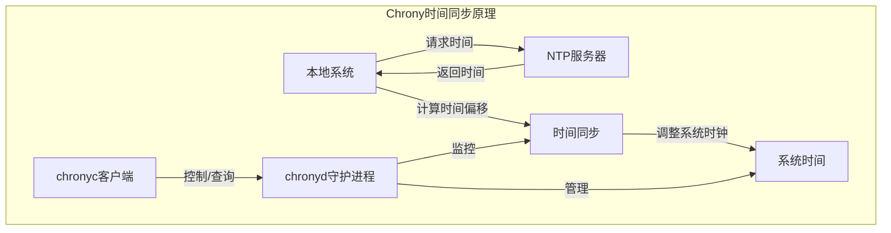
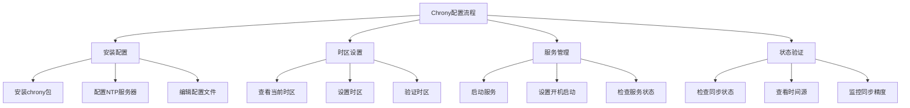

# Linux系统用户管理与安全配置实战

## 课程目标：

3. 掌握时间同步服务的部署和配置
    * 理解NTP服务的重要性
    * 能够验证时间同步状态
    * 熟练使用系统监控命令

4. 掌握系统资源监控的方法
    * 能够查看进程和网络状态
    * 学会分析系统性能指标

## Chrony时间同步服务详解

### 1. 命令解释
#### 1.1 基础命令表格
| 命令          | 作用                          | 示例                                      |
|---------------|------------------------------|-------------------------------------------|
| `timedatectl` | 查看和设置系统时间/时区      | `timedatectl set-timezone Asia/Shanghai` |
| `chronyd`     | 时间同步守护进程             | `systemctl start chronyd`               |
| `chronyc`     | 时间同步客户端工具           | `chronyc sources`                       |
| `date`        | 显示或设置系统日期和时间     | `date "+%Y-%m-%d %H:%M:%S"`            |

#### 1.2 chronyc子命令
| 子命令         | 作用                      | 示例                      |
|----------------|--------------------------|---------------------------|
| `tracking`     | 显示时间同步状态         | `chronyc tracking`       |
| `sources`      | 显示配置的时间源         | `chronyc sources -v`     |
| `sourcestats`  | 显示时间源统计信息       | `chronyc sourcestats`    |
| `makestep`     | 立即同步时间             | `chronyc makestep`       |

### 2. 配置参数表格

#### 2.1 配置文件参数(/etc/chrony.conf)
| 参数          | 作用                          | 示例                                      |
|---------------|------------------------------|-------------------------------------------|
| `server`      | 指定NTP服务器                | `server ntp.aliyun.com iburst`          |
| `pool`        | 指定NTP服务器池              | `pool 2.centos.pool.ntp.org`            |
| `iburst`      | 加快初始同步                 | `server ntp1.example.com iburst`        |
| `allow`       | 允许客户端访问               | `allow 192.168.1.0/24`                 |
| `local`       | 即使无法同步也作为时间服务器 | `local stratum 10`                      |
| `driftfile`   | 时钟偏差记录文件             | `driftfile /var/lib/chrony/drift`       |


#### 2.2 时区设置参数

| 参数            | 作用                      | 示例                                      |
|-----------------|--------------------------|-------------------------------------------|
| `set-timezone`  | 设置系统时区             | `timedatectl set-timezone Asia/Shanghai` |
| `list-timezones`| 列出可用时区             | `timedatectl list-timezones`            |
| `status`        | 显示当前时间设置         | `timedatectl status`                    |

### 3. 语法举例




#### 3.1 基础配置
```bash
# 安装chrony
sudo dnf install chrony

# 编辑配置文件
sudo vim /etc/chrony.conf
server ntp.aliyun.com iburst
server time1.cloud.tencent.com iburst

# 启动服务
sudo systemctl start chronyd
sudo systemctl enable chronyd

```

#### 3.2 时区设置
```bash
# 查看当前时区
timedatectl

# 设置时区
sudo timedatectl set-timezone Asia/Shanghai

# 验证时间同步
date
chronyc tracking

```

#### 3.3 状态检查
```bash
# 查看同步源
chronyc sources -v

# 查看详细统计
chronyc sourcestats

# 查看同步状态
chronyc tracking

```

### 4. 练习实验


#### 练习1：基础配置
```bash
# 任务：配置chrony使用国内NTP服务器
步骤1: 安装chrony
sudo dnf install chrony

步骤2: 编辑配置文件
sudo vim /etc/chrony.conf
# 添加以下内容
server ntp.aliyun.com iburst
server time1.cloud.tencent.com iburst

步骤3: 启动服务
sudo systemctl start chronyd
sudo systemctl enable chronyd

步骤4: 验证配置
chronyc sources

```

#### 练习2：时区设置
```bash
# 任务：将系统时区设置为上海时区
步骤1: 查看当前时区
timedatectl

步骤2: 设置时区
sudo timedatectl set-timezone Asia/Shanghai

步骤3: 验证设置
date
timedatectl status

```

#### 练习3：同步状态检查
```bash
# 任务：检查时间同步状态并分析
步骤1: 查看同步状态
chronyc tracking

步骤2: 查看时间源
chronyc sources -v

步骤3: 分析同步精度
chronyc sourcestats

```

#### 练习4：故障排查
```bash
# 任务：解决常见同步问题
步骤1: 检查服务状态
systemctl status chronyd

步骤2: 查看日志
journalctl -u chronyd

步骤3: 检查网络连接
ping ntp.aliyun.com

步骤4: 验证防火墙设置
sudo firewall-cmd --list-services

```


## 系统状态查看详解

### 1. 命令解释
| 命令       | 作用                        | 基本语法                       |
|------------|----------------------------|-------------------------------|
| `top`      | 实时显示系统资源使用状况    | `top [-d 延时 -p PID]`       |
| `ps`       | 显示进程状态               | `ps [aux -- sort]`           |
| `netstat`  | 显示网络连接信息           | `netstat [-tulpn]`           |
| `free`     | 显示内存使用情况           | `free [-h -s]`              |
| `df`       | 显示磁盘使用情况           | `df [-h -T]`                |

### 2. 参数详解

#### 2.1 top命令参数

| 参数   | 作用                | 示例                |
|--------|---------------------|---------------------|
| `-d`   | 指定刷新间隔        | `top -d 2`          |
| `-p`   | 监控指定进程        | `top -p 1234`       |
| `-u`   | 显示特定用户进程    | `top -u root`       |
| `-b`   | 批处理模式          | `top -b -n 1`       |

交互命令：

* P：按CPU使用率排序
* M：按内存使用率排序
* T：按运行时间排序
* k：终止进程
* r：重新设置优先级
* c: 显示模式-显示完整命令及参数
* z: 进入颜色模式

#### 2.2 ps命令参数
| 参数        | 作用            | 示例                       |
|-------------|-----------------|----------------------------|
| `aux`       | 显示所有进程    | `ps aux`                   |
| `-ef`       | 全格式显示      | `ps -ef`                   |
| `--sort`    | 排序显示        | `ps aux --sort=-pcpu`      |
| `-u`        | 指定用户进程    | `ps -u root`               |


#### 2.3 netstat命令参数
| 参数   | 作用            | 示例              |
|--------|-----------------|-------------------|
| `-t`   | 显示TCP连接     | `netstat -t`      |
| `-u`   | 显示UDP连接     | `netstat -u`      |
| `-l`   | 显示监听端口    | `netstat -l`      |
| `-n`   | 显示端口号      | `netstat -n`      |
| `-p`   | 显示进程信息    | `netstat -p`      |

#### 2.4 free命令参数
| 参数 | 作用     | 示例         |
| ---- | -------- | ------------ |
| -h   | 人性化显示 | `free -h`    |
| -s   | 持续显示   | `free -s 1`  |
| -t   | 显示总计   | `free -t`    |
| -w   | 宽输出     | `free -w`    |

#### 2.5 df命令参数
| 参数 | 作用               | 示例            |
| ---- | ------------------ | --------------- |
| -h   | 人性化显示         | `df -h`         |
| -T   | 显示文件系统类型   | `df -T`         |
| -i   | 显示 inode 信息    | `df -i`         |
| -x   | 排除特定文件系统   | `df -x tmpfs`   |


### 3. 使用示例

#### 3.1 系统负载监控
```bash
# 实时监控系统负载
top

# 监控特定进程
top -p $(pgrep nginx)

# 按CPU使用率排序输出前10个进程
ps aux --sort=-pcpu | head -n 11

```

#### 3.2 网络连接查看
```bash
# 查看所有TCP连接
netstat -tnp

# 查看监听端口
netstat -tlnp

# 查看特定端口
netstat -tnp | grep :80

```

#### 3.3 内存使用监控
```bash
# 查看内存使用情况
free -h

# 每2秒更新一次
free -h -s 2

# 显示详细信息
free -w -h

```

#### 3.4 磁盘使用查看
```bash
# 查看磁盘使用情况
df -h

# 查看文件系统类型
df -T

# 查看inode使用情况
df -i

```

### 4. 练习实验

#### 练习1：系统负载分析
```bash
# 任务：找出CPU使用率最高的前5个进程
步骤1: 使用top命令
top
# 按P键按CPU使用率排序

步骤2: 使用ps命令
ps aux --sort=-pcpu | head -n 6

# 答案分析：
# 1. 进程ID
# 2. CPU使用率
# 3. 内存使用率
# 4. 命令名称

```

#### 练习2：网络连接分析
```bash
# 任务：查看系统所有TCP监听端口
步骤1: 使用netstat命令
netstat -tlnp

# 答案应包含：
# - 协议类型
# - 本地地址
# - 监听端口
# - 进程名/PID

```

#### 练习3：内存使用分析
```bash
# 任务：监控系统内存使用变化
步骤1: 使用free命令持续监控
free -h -s 2

步骤2: 分析内存使用情况
# 关注点：
# - 总内存
# - 已用内存
# - 可用内存
# - 缓存使用

```

#### 练习4：磁盘空间分析  --选学高级用法
不会的哈，自己修养，我不强求

```bash
# 任务：找出磁盘使用率超过80%的分区
步骤1: 使用df命令
df -h | awk '{if(NR>1)if(+$5>80)print}'

# 答案分析：
# - 文件系统
# - 已用空间
# - 可用空间
# - 使用率

```


### 5. 常见问题处理
#### 5.1 系统负载高
```bash
# 检查CPU密集进程
top -c
# 或
ps aux --sort=-pcpu | head

# 检查内存使用
free -h
ps aux --sort=-rss | head

```

#### 5.2 网络连接问题
```bash
# 检查网络连接状态
netstat -ant | awk '{print $6}' | sort | uniq -c

# 检查特定端口
netstat -tlnp | grep :80

```

#### 5.3 内存不足
```bash
# 查看内存使用详情
free -h
# 查看大内存进程
ps aux --sort=-rss | head

```

#### 5.4 磁盘空间不足
```bash
# 查看大文件
find / -type f -size +100M -exec ls -lh {} \;

# 查看目录大小
du -sh /*

```

### 6. 监控要点
1. 系统负载监控
    * CPU使用率
    * 平均负载
    * 进程数量
    * 线程状态
2. 网络状态监控
    * 连接数量
    * 网络流量
    * 端口状态
    * 错误统计
3. 内存使用监控
    * 物理内存使用
    * 交换空间使用
    * 缓存使用
    * 共享内存
4. 磁盘使用监控
    * 空间使用率
    * I/O负载
    * inode使用
    * 读写速度