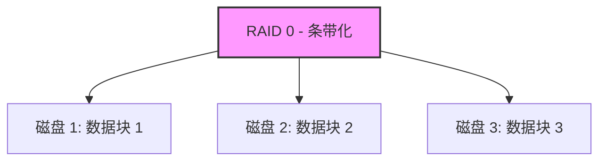
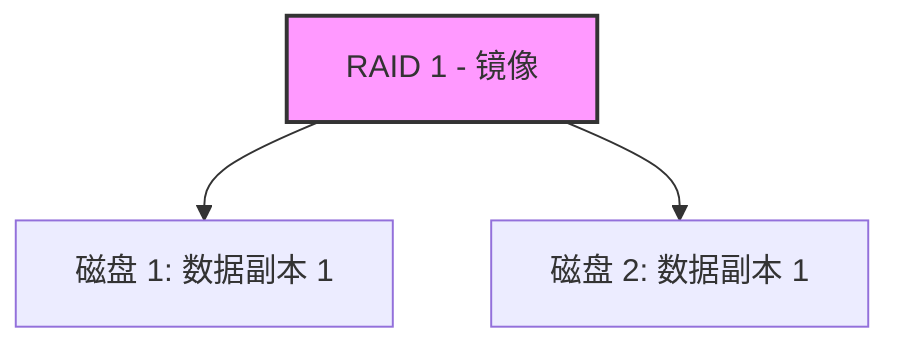
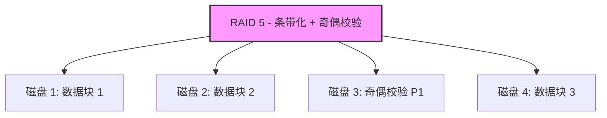
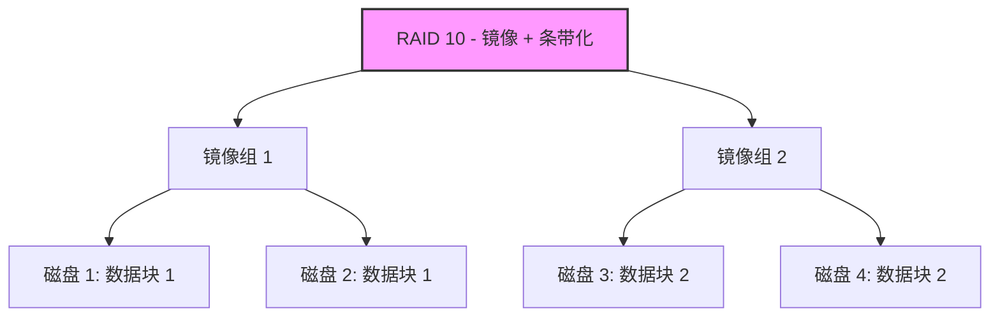
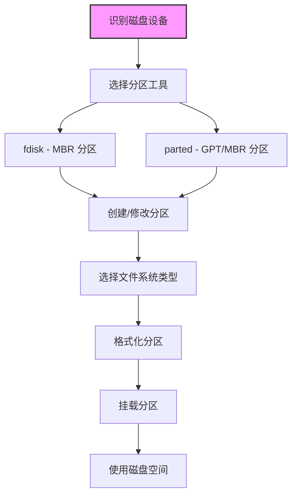

#Linux 存储基础与初步共享

## 目标：

1. 理解 Linux 磁盘阵列（RAID）的基本理论及其应用场景。
2. 掌握磁盘管理工具 fdisk 和 parted 的基本用法。
3. 熟悉 Linux 中的磁盘类型及其命名规则。
4. 学习 LVM（逻辑卷管理）的基本概念和操作，重点是动态卷组管理。
5. 深入掌握 LVM 的高级管理功能。
6. 初步掌握 NFS（网络文件系统），学习如何将磁盘共享到网络。
7. 完成 LVM + NFS 的综合实验操作。

### 环境准备
* 操作系统：Ubuntu 20.04 或更高版本（建议使用虚拟机）。
* 硬件需求：至少 2 个虚拟磁盘（建议每块磁盘 10GB 以上）用于实践。
* 工具：VirtualBox 或 VMware 虚拟机软件。
* 注意：在操作磁盘和存储时，务必备份重要数据，避免误操作导致数据丢失。
* 环境准备：建议使用虚拟机（如 VirtualBox）安装一个 Linux 系统（如 Ubuntu 或 CentOS），确保有至少 2 个虚拟磁盘用于实践。


## 第一部分：Linux 磁盘阵列（RAID）理论
### 什么是 RAID？
RAID（Redundant Array of Independent Disks，独立磁盘冗余阵列）是一种将多个物理磁盘组合起来以提高性能或可靠性的技术。RAID 主要用于数据存储的冗余备份和性能优化。

### 常见的 RAID 级别
#### RAID 0（条带化）：将数据分散在多个磁盘上以提高读写速度，但无冗余，磁盘故障会导致数据丢失。


* 数据被分成小块，分散存储在多个磁盘上。
* 优点：读写速度快，存储容量利用率 100%。
* 缺点：无冗余，任何一个磁盘故障都会导致全部数据丢失。
* 适用场景：对速度要求高但数据安全性不高的场景，如临时缓存。

#### RAID 1（镜像）：数据在多个磁盘上镜像存储，提供冗余，一个磁盘故障不影响数据，但存储容量减半。


* 数据在多个磁盘上完全镜像存储，内容完全相同。
* 优点：提供冗余，一个磁盘故障不影响数据。
* 缺点：存储容量减半，写入速度可能稍慢。
* 适用场景：对数据安全要求高的场景，如数据库日志。

#### RAID 5：结合条带化和奇偶校验，至少需要 3 个磁盘，提供性能和冗余，允许一个磁盘故障。


* 数据和奇偶校验信息分布存储在多个磁盘上，至少需要 3 个磁盘。
* 优点：兼顾性能和冗余，允许一个磁盘故障。
* 缺点：写入性能稍差，重建故障磁盘时性能下降。
* 适用场景：文件服务器、中小型企业存储。

#### RAID 10（1+0）：结合 RAID 0 和 RAID 1，至少需要 4 个磁盘，提供高性能和高冗余。


* 结合 RAID 0 和 RAID 1 的优点，至少需要 4 个磁盘。
* 优点：高性能和高冗余，允许多个磁盘故障（视具体配置）。
* 缺点：存储容量利用率仅 50%，成本较高。
* 适用场景：高性能和高可靠性的场景，如数据库服务器。


#### RAID 的实现方式
* 硬件 RAID：通过专用的 RAID 控制器实现，性能更好但成本较高。
    * 由专用的 RAID 控制器（硬件卡）实现。
    * 优点：性能优异，管理简单，操作系统无需额外配置。
    * 缺点：成本较高，依赖特定硬件。

* 软件 RAID：通过操作系统（如 Linux 的 mdadm 工具）实现，成本低但性能稍逊。
    * 通过操作系统软件（如 Linux 的 mdadm 工具）实现。
    * 优点：成本低，灵活性高，可在普通硬件上运行。
    * 缺点：性能稍逊，依赖 CPU 计算。
    * 在 Ubuntu 中，可以使用 mdadm 创建和管理软件 RAID，后续课程中可以实践。

**实践思考**

* RAID 不是备份，而是一种提高性能或可靠性的方式，数据仍需定期备份。
* 在虚拟机中，可以通过 mdadm 模拟软件 RAID，但今天我们先关注理论，实践可以在后续学习中完成。
* 学习资源：阅读 man mdadm 或搜索 “Linux RAID tutorial” 了解更多。

## 第二部分：磁盘管理工具（fdisk 和 parted）
### 磁盘管理基础
在 Linux 中，磁盘管理是存储技术的起点。通过磁盘管理工具，我们可以对磁盘进行分区、格式化等操作，为后续的文件系统创建和存储管理奠定基础。常用的磁盘管理工具包括 fdisk 和 parted，它们分别适用于不同的分区表类型和使用场景。以下内容将详细介绍这两个工具的功能、命令参数以及操作步骤，适合零基础学习者。

#### 磁盘管理的基本概念
* 磁盘分区：将一块物理磁盘划分为多个逻辑部分，每个部分可以独立格式化为不同的文件系统。
* 分区表：记录磁盘分区信息的结构，常见的有 MBR（Master Boot Record）和 GPT（GUID Partition Table）。
    * MBR：传统分区表，适用于小于 2TB 的磁盘，最多支持 4 个主分区或 3 个主分区加 1 个扩展分区。
    * GPT：现代分区表，支持大于 2TB 的磁盘，分区数量几乎无限制。
* 文件系统：磁盘分区上的数据组织方式，常见的有 ext4、xfs 等，需在分区后格式化。

在 Ubuntu 中，我们可以通过命令行工具查看和管理磁盘设备。以下是磁盘管理的基本流程图：



**说明**：上图展示了磁盘管理的基本流程，从识别磁盘设备开始，选择合适的工具进行分区，选择文件系统类型并格式化后挂载，最终使用磁盘空间。

### Linux 文件系统类型介绍
在 Linux 中，文件系统是磁盘分区存储和组织数据的方式。不同的文件系统类型有不同的特性和适用场景。以下是 Linux 中常见文件系统类型的详细介绍，适合零基础学习者理解：
#### 常见文件系统类型
* ext4（第四代扩展文件系统）：
    * 特点：Linux 的默认文件系统，支持大文件和大分区（最大 1EB 分区，16TB 文件），提供日志功能（Journaling）以提高数据恢复能力。
    * 优点：稳定、性能好、兼容性强，支持文件权限和元数据。
    * 缺点：对极大数据量场景的性能优化不如某些新型文件系统。
    * 适用场景：通用场景，如系统分区、数据存储，适合大多数 Ubuntu 用户。
    * 格式化命令：
    ```bash
    sudo mkfs.ext4 /dev/sdXn

    ```

* ext3：
    * 特点：ext4 的前身，支持日志功能，但性能和容量限制不如 ext4。
    * 优点：稳定，兼容性好。
    * 缺点：不支持大文件和大分区，性能较低。
    * 适用场景：老系统或对兼容性要求高的场景（现已较少使用）。

* 格式化命令：
    ```bash
    sudo mkfs.ext3 /dev/sdXn
    ```

* xfs：
    * 特点：高性能文件系统，支持大文件和大分区（最大 8EB），特别适合处理大数据量。
    * 优点：高并发性能好，支持在线扩展。
    * 缺点：不支持缩小分区，恢复工具较少。
    * 适用场景：企业级存储、大型数据库、文件服务器。
    * 格式化命令：
    ```bash
    sudo mkfs.xfs /dev/sdXn
    ```

* btrfs（B-tree 文件系统）：
    * 特点：现代文件系统，支持快照（Snapshot）、数据校验、在线压缩等高级功能。
    * 优点：支持动态调整大小、快照便于备份、数据完整性检查。
    * 缺点：性能稍逊于 ext4 和 xfs，稳定性在某些场景下不如 ext4。
    * 适用场景：需要快照和数据保护的场景，如备份系统。
    * 格式化命令：
    ```bash
    sudo mkfs.btrfs /dev/sdXn

    ```

* FAT32 和 NTFS：
    * 特点：源自 Windows 系统，FAT32 是老格式，NTFS 是现代格式。
    * 优点：跨平台兼容性好，适合与 Windows 共享数据。
    * 缺点：FAT32 不支持大文件（最大 4GB），NTFS 在 Linux 上性能和权限支持有限。
    * 适用场景：U盘、移动硬盘等需要跨系统使用的设备。
    * 格式化命令：
    ```bash
    sudo mkfs.vfat /dev/sdXn  # FAT32
    sudo mkfs.ntfs /dev/sdXn  # NTFS（需安装 ntfs-3g 工具）

    ```

* swap：
    * 特点：专用于 Linux 交换分区，不是传统文件系统，用于虚拟内存。
    * 优点：当物理内存不足时，提供临时存储空间。
    * 缺点：不适合存储文件，仅用于系统内存扩展。
    * 适用场景：系统运行时内存不足的补充，通常在安装系统时分配。
    * 格式化命令：
    ```bash
    sudo mkswap /dev/sdXn
    sudo swapon /dev/sdXn

    ```

#### 文件系统选择建议
* 普通用户：推荐使用 ext4，它是 Ubuntu 的默认文件系统，稳定且易用。
* 企业用户：处理大数据量时可选择 xfs，需要快照功能时可选择 btrfs。
* 跨平台需求：与 Windows 共享数据时选择 FAT32（小文件）或 NTFS（大文件）。
* 系统需求：安装系统时通常会分配 ext4 作为根分区和 swap 作为交换分区。

#### 查看文件系统类型
可以通过以下命令查看当前磁盘分区的文件系统类型：

```bashlsblk -f
df -T
sudo file -sL /dev/sdXn

```

**输出示例（lsblk -f）：**

```bash
NAME   FSTYPE   LABEL   UUID                                 MOUNTPOINT
sda                                                         
├─sda1 ext4             123e4567-e89b-12d3-a456-426614174000 /boot
└─sda2 ext4             987fcdeb-51a2-4b7e-8f1a-678901234567 /
sdb                                                         
└─sdb1 xfs              456e7890-abcd-1234-efgh-ijk901234567 /mnt/data

```

**解释**：`sda1` 和 `sda2` 是 `ext4` 文件系统，`sdb1` 是 `xfs` 文件系统。

### 识别磁盘设备
在进行磁盘管理之前，需要先识别系统中的磁盘设备。以下是常用命令及其参数的详细介绍：

* lsblk：列出块设备（磁盘及分区）信息。
    * lsblk：列出块设备（磁盘及分区）信息。
    * 语法：lsblk [选项]
    * 常用参数：
        * 无参数：显示所有块设备的树状结构。
        * -f：显示文件系统信息（如挂载点、文件系统类型）。
        * -d：仅显示磁盘设备，不显示分区。
    * 示例：
        ```bash
        lsblk
        lsblk -f
        ```
        **输出示例：**
        ```bash
            NAME   MAJ:MIN RM  SIZE RO TYPE MOUNTPOINT
        sda      8:0    0   20G  0 disk 
        ├─sda1   8:1    0  512M  0 part /boot
        └─sda2   8:2    0 19.5G  0 part /
        sdb      8:16   0   10G  0 disk 

        ```

        **解释**：sda 是第一块磁盘，sda1 和 sda2 是其分区；sdb 是第二块磁盘，未分区。

* fdisk -l：列出所有磁盘的分区表信息（需要管理员权限）。
    * 语法：sudo fdisk -l [设备名]
    * 常用参数：
        * 无参数：列出所有磁盘的分区信息。
        * /dev/sdX：指定特定磁盘查看。
    * 示例：
        ```bash
        sudo fdisk -l /dev/sdb

        ```

        **输出示例：**

        ```bash
        Disk /dev/sdb: 10 GiB, 10737418240 bytes, 20971520 sectors
        Disk model: VBOX HARDDISK   
        Units: sectors of 1 * 512 = 512 bytes
        Sector size (logical/physical): 512 bytes / 512 bytes
        I/O size (minimum/optimal): 512 bytes / 512 bytes
        Disklabel type: dos
        Disk identifier: 0x00000000

        ```

        **解释**：输出显示 /dev/sdb 是一块 10GB 的磁盘，尚未创建分区表。

**注意**：在操作磁盘之前，务必通过以上命令确认目标磁盘，避免误操作导致数据丢失。

### fdisk：传统分区工具
#### 工具介绍
fdisk 是一个传统的命令行分区工具，主要用于管理 MBR（Master Boot Record）分区表，适用于小于 2TB 的磁盘。它通过交互式界面操作，适合对小型磁盘进行分区管理。

#### 基本用法与参数
* 启动 fdisk：

    * 语法：sudo fdisk /dev/sdX
    * 参数：/dev/sdX 是目标磁盘设备名，如 /dev/sdb。
    * 示例：
        ```bash
        sudo fdisk /dev/sdb
        ```

        **解释**：进入 /dev/sdb 的分区管理模式，之后通过交互式命令操作。

* 常用交互式命令：
    * `p`：显示当前分区表。
    * `n`：创建新分区。
        * 选项：`p`（主分区）或 `e`（扩展分区）。
        * 分区号：通常从 1 开始。
    * 起始和结束扇区：可按默认值分配全部空间。
    * `d`：删除分区。
        * 选项：输入分区号删除指定分区。
    * `t`：更改分区类型。
        * 选项：输入分区号和类型代码（如 83 表示 Linux 分区）。
    * `w`：保存修改并退出。
    * `q`：不保存修改直接退出。
    * `m`：显示帮助菜单。

#### 实践步骤（以 Ubuntu 为例）
1. 添加虚拟磁盘：
    * 在虚拟机（如 VMware）中添加一块新磁盘（如 5GB）。
    * 重启虚拟机或使用以下命令重新扫描磁盘：
        ```bash
        sudo echo "- - -" > /sys/class/scsi_host/host0/scan

        ```
2. 确认磁盘设备：
    * 使用 lsblk 查看新添加的磁盘（如 /dev/sdb）。
    ```bash
    lsblk
    ```

3. 进入 fdisk 模式：
    * 对新磁盘进行分区操作：
    ```bash
    sudo fdisk /dev/sdb
    ```

4. 创建分区：
    * 输入 `n` 创建新分区。
    * 选择 `p`（主分区）。
    * 分区号选择 `1`。
    * 起始和结束扇区按默认值（回车），分配全部空间。
    * 输入 `p` 查看分区表，确认分区创建成功。
    * 输入 `w` 保存并退出。

5. 格式化分区：
    * 将新分区格式化为 ext4 文件系统（推荐给普通用户）：
        ```bash
        sudo mkfs.ext4 /dev/sdb1

        ```

6. 验证结果：
    * 使用以下命令查看分区和文件系统信息：
        ```bash
        lsblk -f
        ```

**注意事项**

* `fdisk` 修改分区表后，系统可能需要重启或使用 partprobe 命令更新分区信息：
    ```bash
    sudo partprobe /dev/sdb
    ```
* 操作时务必确认目标磁盘，避免误操作已有数据磁盘。

###  parted：现代分区工具
#### 工具介绍

parted 是一个功能更强大的分区工具，支持 GPT（GUID Partition Table）和 MBR 分区表，适用于大于 2TB 的磁盘，也兼容小型磁盘。相比 fdisk，parted 支持非交互式操作，适合脚本自动化，且功能更全面。

#### 基本用法与参数
* 启动 parted：
    * 语法：sudo parted /dev/sdX
    * 参数：/dev/sdX 是目标磁盘设备名，如 /dev/sdc。
    * 示例：
        ```bash
        sudo parted /dev/sdc
        ```

        **解释**：进入 /dev/sdc 的分区管理模式，通过交互式命令操作。

* 常用交互式命令：

    * print：显示当前分区表。
    * mklabel：创建分区表类型。
        * 选项：gpt（创建 GPT 分区表）或 msdos（创建 MBR 分区表）。
    * mkpart：创建新分区。
        * 语法：mkpart [分区类型] [起始位置] [结束位置]
        * 选项：primary（主分区），起始和结束位置可用百分比（如 0% 100%）。
    * rm：删除分区。
        * 语法：rm [分区号]
    * quit：退出 parted。
    * help：显示帮助信息。

* 非交互式操作（适合脚本）：
    * 语法：sudo parted /dev/sdX [命令]
    * 示例：创建 GPT 分区表并分配一个主分区：
        ```bash
        sudo parted /dev/sdc mklabel gpt
        sudo parted /dev/sdc mkpart primary 0% 100%

        ```

#### 实践步骤（以 Ubuntu 为例）
1. 添加虚拟磁盘：
    * 在虚拟机中添加另一块新磁盘（如 10GB，设备名为 /dev/sdc）。
    * 使用 lsblk 确认新磁盘。
        ```bash
        lsblk
        ```

2. 进入 parted 模式：
    * 对新磁盘进行分区操作：
    ```bash
    sudo parted /dev/sdc
    ```

3. 创建分区表和分区：
    * 输入 mklabel gpt 创建 GPT 分区表。
    * 输入 mkpart primary 0% 100% 创建一个占满磁盘的主分区。
    * 输入 print 查看分区表，确认分区创建成功。
    * 输入 quit 退出。

4. 格式化分区：
    * 将新分区格式化为 ext4 文件系统（推荐给普通用户）：
        ```bash
        sudo mkfs.ext4 /dev/sdc1
        ```

5. 验证结果：
    * 使用以下命令查看分区和文件系统信息：
    ```bash
    lsblk -f

    ```

**注意事项**

* parted 支持在线操作，但对已挂载的分区修改可能需要卸载后操作。
* GPT 分区表适合大容量磁盘，且支持更多分区，推荐现代系统使用。

#### 格式化与挂载基础
##### 格式化分区
创建分区后，需要格式化为文件系统才能存储数据。常用命令如下：

* mkfs：创建文件系统。
    * 语法：sudo mkfs.[文件系统类型] /dev/sdXn
    * 常用参数：
        * ext4：Linux 常用文件系统，稳定且支持大文件。
        * -L：设置卷标（分区标签）。
    * 示例：
        ```bash
        sudo mkfs.ext4 -L "data" /dev/sdb1

        ```

        **解释**：将 /dev/sdb1 格式化为 ext4 文件系统，并设置卷标为 data。

    * 其他文件系统格式化示例：
        ```bash
        sudo mkfs.xfs /dev/sdb2  # 格式化为 xfs
        sudo mkfs.btrfs /dev/sdb3  # 格式化为 btrfs
        sudo mkfs.vfat /dev/sdb4  # 格式化为 FAT32

        ```

##### 挂载分区
格式化后，需要将分区挂载到文件系统目录才能使用。常用命令如下：

* mount：挂载文件系统。
* 示例：
    ```bash
    sudo mkdir /mnt/mydisk
    sudo mount /dev/sdb1 /mnt/mydisk

    ```

    **解释**：将 /dev/sdb1 挂载到 /mnt/mydisk 目录。

* df：查看挂载情况。
    * 语法：df -h
    * 参数：-h 以人类可读格式显示大小。
    * 示例：
        ```bash
        df -h
        ```

        输出示例：

        ```bash
        Filesystem      Size  Used Avail Use% Mounted on
        /dev/sdb1       9.8G   37M  9.3G   1% /mnt/mydisk

        ```

**注意事项**

* 挂载前需确保目标目录存在且为空。
* 如果需要开机自动挂载，需编辑 /etc/fstab 文件，添加挂载配置（后续课程会详细讲解）。

### 总结与对比
| 工具      | 分区表支持 | 适用场景            | 优点                      | 缺点                  |
|-----------|------------|---------------------|---------------------------|-----------------------|
| fdisk     | MBR        | 小于 2TB 磁盘       | 简单易用，交互式界面      | 不支持 GPT，功能有限  |
| parted    | MBR 和 GPT | 大容量磁盘，自动化  | 功能强大，支持非交互式    | 命令稍复杂            |

| 文件系统 | 最大分区/文件大小 | 优点                          | 缺点                        | 适用场景              |
|----------|-------------------|-------------------------------|-----------------------------|-----------------------|
| ext4     | 1EB / 16TB        | 稳定，兼容性好，支持日志      | 极大数据性能稍逊            | 通用，系统分区        |
| xfs      | 8EB / 8EB         | 高性能，支持在线扩展          | 不支持缩小，恢复工具少      | 企业存储，数据库      |
| btrfs    | 16EB / 16EB       | 支持快照、压缩、数据校验      | 性能稍逊，稳定性稍差        | 备份，需要快照的场景  |
| FAT32    | 2TB / 4GB         | 跨平台兼容性好                | 不支持大文件，功能有限      | U盘，跨系统共享       |

### 练习作业
为了帮助零基础学习者巩固磁盘管理和文件系统知识，以下是一些实践作业，建议在虚拟机中操作，确保安全。每个练习都附带了解题思路和具体命令，供参考。

#### 1. 基础练习：识别磁盘设备
* 任务描述：
    * 使用 lsblk 和 fdisk -l 命令查看当前系统的磁盘和分区信息。
    * 记录每块磁盘的设备名（如 /dev/sda）、大小以及是否已分区。
    * 使用 lsblk -f 查看文件系统类型，记录每个分区的文件系统类型。
    * 提交内容：截图或记录输出结果，说明你识别出的磁盘设备和文件系统类型。

* 解题思路：
    * 使用 lsblk 命令查看系统中所有磁盘和分区的树状结构，了解设备名和大小。
    * 使用 sudo fdisk -l 命令查看更详细的分区表信息，确认磁盘是否已分区。
    * 使用 lsblk -f 查看每个分区的文件系统类型和挂载点。
    * 记录关键信息，包括设备名、大小、分区情况和文件系统类型。

* 参考命令：
    ```bash
    lsblk
    sudo fdisk -l
    lsblk -f
    ```
* 输出示例（lsblk -f）：
    ```bash
    NAME   FSTYPE   LABEL   UUID                                 MOUNTPOINT
    sda                                                         
    ├─sda1 ext4             123e4567-e89b-12d3-a456-426614174000 /boot
    └─sda2 ext4             987fcdeb-51a2-4b7e-8f1a-678901234567 /
    sdb                                                         
    └─sdb1 xfs              456e7890-abcd-1234-efgh-ijk901234567 /mnt/data
    sdc                                                         
    └─sdc1 ext4             56789012-3456-7890-1234-567890123456 /mnt/backup

    ```

* 记录建议：
将设备名（如 /dev/sda）、大小（如 20G）、是否分区（如 sda1 和 sda2 已分区）、文件系统类型（如 ext4）整理成表格或列表。

#### 2. fdisk 实践：创建 MBR 分区
* 任务描述：
    * 在虚拟机中添加一块新磁盘（如 5GB）。
    * 使用 fdisk 创建一个主分区，占用全部空间。
    * 格式化为 ext4 文件系统，并挂载到 /mnt/fdisk_test 目录。
    * 使用 df -h 确认挂载成功。
    * 提交内容：记录操作步骤和关键命令输出（如 fdisk 的分区表、df -h 结果）。

* 解题思路：
    * 在虚拟机设置中添加一块新磁盘（参考虚拟机软件手册，如 VirtualBox）。
    * 使用 lsblk 确认新磁盘设备名（如 /dev/sdb）。
    * 使用 fdisk 进入分区模式，创建主分区并分配全部空间。
    * 格式化分区为 ext4 文件系统。
    * 创建挂载点目录并挂载分区。
    * 使用 df -h 确认挂载成功。 

* 参考命令：
```bash
# 确认新磁盘
lsblk
# 进入 fdisk 模式（假设新磁盘为 /dev/sdb）
sudo fdisk /dev/sdb
# 在 fdisk 中操作：
# 输入 n 创建新分区，选择 p（主分区），分区号 1，默认起始和结束扇区（回车）
# 输入 p 查看分区表确认
# 输入 w 保存并退出
# 格式化为 ext4
sudo mkfs.ext4 /dev/sdb1
# 创建挂载点并挂载
sudo mkdir /mnt/fdisk_test
sudo mount /dev/sdb1 /mnt/fdisk_test
# 确认挂载结果
df -h

```

* 记录建议：
记录 lsblk 输出（新磁盘设备名）、fdisk 操作中 p 命令的分区表输出、以及 df -h 的挂载结果。

#### 3. parted 实践：创建 GPT 分区
* 任务描述：
    * 在虚拟机中添加另一块新磁盘（如 5GB）。
    * 使用 parted 创建 GPT 分区表，并创建一个主分区，占用全部空间。
    * 格式化为 xfs 文件系统，并挂载到 /mnt/parted_test 目录。
    * 使用 df -h 确认挂载成功。
    * 提交内容：记录操作步骤和关键命令输出（如 parted 的 print 结果、df -h 结果）。

* 解题思路：
    * 在虚拟机设置中添加另一块新磁盘。
    * 使用 lsblk 确认新磁盘设备名（如 /dev/sdc）。
    * 使用 parted 进入分区模式，创建 GPT 分区表并分配一个主分区。
    * 格式化分区为 xfs 文件系统。
    * 创建挂载点目录并挂载分区。
    * 使用 df -h 确认挂载成功。

* 参考命令：
```bash
# 确认新磁盘
lsblk
# 进入 parted 模式（假设新磁盘为 /dev/sdc）
sudo parted /dev/sdc
# 在 parted 中操作：
# 输入 mklabel gpt 创建 GPT 分区表
# 输入 mkpart primary 0% 100% 创建主分区
# 输入 print 查看分区表确认
# 输入 quit 退出
# 格式化为 xfs
sudo mkfs.xfs /dev/sdc1
# 创建挂载点并挂载
sudo mkdir /mnt/parted_test
sudo mount /dev/sdc1 /mnt/parted_test
# 确认挂载结果
df -h

```

* 记录建议：
记录 lsblk 输出（新磁盘设备名）、parted 中 print 命令的分区表输出、以及 df -h 的挂载结果。

#### 3. 思考题
* 任务描述：
    * MBR 和 GPT 分区表的区别是什么？在什么场景下选择 GPT？
    * 如果误删了分区数据，能否恢复？有哪些工具或方法可以尝试？
    * ext4 和 xfs 文件系统在性能和功能上有什么区别？你会为系统根分区选择哪种文件系统，为什么？
    * 提交内容：写下你的答案和思考过程。

* 解题思路：
    * MBR 和 GPT 区别：从分区表支持的磁盘大小、分区数量、适用场景等方面对比，查阅资料或参考课程内容。GPT 适合大容量磁盘（>2TB）和需要多个分区的场景。
    * 数据恢复：思考误删分区后数据是否可恢复，了解常见恢复工具（如 TestDisk、Photorec）和方法（如避免写入新数据以防止覆盖）。
    * ext4 和 xfs 对比：从性能（并发处理）、功能（是否支持在线扩展、缩小）、稳定性等方面对比。系统根分区通常选择稳定性和兼容性更好的文件系统（如 ext4）。

* 参考答案
    * MBR 支持最大 2TB 磁盘和 4 个主分区，GPT 支持更大磁盘和几乎无限分区；选择 GPT 的场景包括大容量磁盘和现代系统。
    * 误删分区数据有时可恢复，需立即停止写入操作，使用工具如 TestDisk 尝试恢复分区表，或 Photorec 恢复文件。
    * ext4 稳定且兼容性好，适合系统根分区；xfs 高性能但不支持缩小，适合数据存储。我会选 ext4 作为根分区，因其稳定且易恢复。

## 第三部分：Linux 磁盘类型
在 Linux 系统中，磁盘是存储数据的基础设备，不同类型的磁盘在性能、成本、用途等方面存在显著差异。了解 Linux 支持的磁盘类型及其特点，有助于选择合适的存储解决方案，优化系统性能，并为后续的磁盘管理和文件系统学习奠定基础。本部分将以零基础学习者为目标，详细介绍 Linux 中常见的磁盘类型、命名规则、特性对比以及应用场景，帮助大家建立对磁盘技术的全面认知。

### 1. Linux 磁盘类型概述
Linux 系统支持多种磁盘类型，这些磁盘类型根据其物理结构、接口方式和使用场景可以分为几大类。以下是常见的磁盘类型及其基本概念：

* 机械硬盘（HDD, Hard Disk Drive）：
    * 定义：传统的存储设备，使用旋转的磁盘和机械读写头存储和读取数据。
    * 特点：容量大，价格相对较低，但读写速度较慢，功耗较高，易受物理冲击影响。
    * 接口类型：常见接口包括 SATA（Serial ATA）和较老的 IDE（Integrated Drive Electronics）。

* 固态硬盘（SSD, Solid State Drive）：
    * 定义：基于闪存（Flash Memory）技术的存储设备，无机械部件。
    * 特点：读写速度快，功耗低，抗震性强，但价格较高，写入寿命有限（有写入次数限制）。
    * 接口类型：常见接口包括 SATA（与 HDD 兼容）、NVMe（通过 PCIe 提供更高速度）。

* 虚拟磁盘（Virtual Disk）：
    * 定义：在虚拟化环境中模拟的磁盘，通常由虚拟机软件（如 VirtualBox、VMware）创建，实际存储在主机系统的物理磁盘上。
    * 特点：便于管理和迁移，性能依赖于底层物理硬件，广泛用于测试和开发环境。
    * 类型：包括固定大小磁盘和动态分配磁盘（按需扩展）。

* 网络磁盘（Network-Attached Storage, NAS 和 iSCSI）：
    * 定义：通过网络访问的远程存储设备，NAS 提供文件级访问，iSCSI 提供块级访问。
    * 特点：支持多设备共享，适合企业环境，但性能受网络延迟影响。
    * 应用：用于数据备份、文件共享或分布式系统存储。

* 光盘和可移动存储（CD/DVD/USB）：
    * 定义：包括光盘（CD、DVD）和 USB 闪存盘等便携式存储设备。
    * 特点：容量较小，读写速度慢，适合临时数据传输或系统安装介质。
    * 应用：常用于系统安装（如 Linux 发行版 ISO 镜像）或数据归档。

### 2. Linux 磁盘命名规则
在 Linux 系统中，磁盘和分区使用特定的命名规则，以便系统识别和管理。理解这些命名规则有助于快速定位设备，尤其是在进行磁盘管理操作时。以下是常见的命名规则和示例：

* 设备文件路径：磁盘设备文件通常位于 /dev 目录下。
* 命名规则：
    * IDE 磁盘：以 hd 开头，如 /dev/hda（第一块 IDE 磁盘），/dev/hdb1（第二块磁盘的第一个分区）。
    * SATA/SCSI/SAS/USB 磁盘：以 sd 开头，如 /dev/sda（第一块 SATA/SCSI 磁盘），/dev/sdb2（第二块磁盘的第二个分区）。
    * NVMe 磁盘：以 nvme 开头，如 /dev/nvme0n1（第一块 NVMe 磁盘的第一个命名空间），/dev/nvme0n1p1（第一个分区的第一个分区）。
    * 虚拟磁盘：命名规则与物理磁盘类似，通常也以 sd 开头，具体取决于虚拟化平台。
    * 光盘：通常以 sr 开头，如 /dev/sr0（第一块光驱）。
* 分区编号：分区在设备名后以数字表示，如 /dev/sda1 表示第一块 SATA 磁盘的第一个分区。
* 示例：
    ```bash
    /dev/sda   - 第一块 SATA/SCSI 磁盘（整块磁盘）
    /dev/sda1  - 第一块 SATA/SCSI 磁盘的第一个分区
    /dev/nvme0n1p2 - 第一块 NVMe 磁盘的第一个命名空间的第二个分区
    /dev/sr0   - 第一块光驱设备

    ```

**注意**：设备名称是动态分配的，可能会随系统启动顺序或硬件插拔而变化。为避免混淆，现代 Linux 系统使用 UUID（通用唯一标识符）或标签来固定识别磁盘和分区。

### 3. 磁盘类型的特性对比
不同类型的磁盘在性能、成本、寿命等方面有显著差异，选择适合的磁盘类型需要根据具体需求权衡。以下是常见磁盘类型的详细对比表格：

| 磁盘类型              | 性能（读写速度）       | 成本（每 GB） | 寿命与可靠性                | 功耗与噪音         | 典型应用场景                |
|-----------------------|-----------------------|---------------|---------------------------|-------------------|---------------------------|
| 机械硬盘（HDD）       | 慢（几十到百 MB/s）   | 低            | 机械部件易损，怕震动       | 较高，噪音明显     | 大容量存储，备份，归档     |
| 固态硬盘（SSD-SATA）  | 快（几百 MB/s）       | 中等          | 写入寿命有限，抗震         | 较低，静音         | 系统盘，常用软件，游戏     |
| 固态硬盘（SSD-NVMe）  | 极快（几 GB/s）       | 高            | 写入寿命有限，抗震         | 较低，静音         | 高性能计算，数据库，虚拟化 |
| 虚拟磁盘              | 依赖物理硬件          | 无额外成本    | 依赖底层磁盘              | 无额外功耗         | 测试环境，开发环境，虚拟机 |
| 网络磁盘（NAS/iSCSI） | 受网络限制            | 高（含设备成本） | 高（常有冗余机制）      | 较高（设备相关）   | 企业存储，数据共享，远程备份 |
| 光盘/USB 存储         | 慢（几到几十 MB/s）   | 中等          | 易丢失，寿命中等          | 低，静音           | 系统安装，临时数据传输，归档 | 

**解释：**

* 性能：NVMe SSD 由于使用 PCIe 接口，速度远超 SATA 接口的 HDD 和 SSD。
* 成本：HDD 每 GB 成本最低，适合大容量存储；NVMe SSD 成本最高，但性能优越。
* 可靠性：HDD 因机械结构易受物理冲击影响，而 SSD 和网络磁盘可靠性更高。
* 应用场景：系统盘建议使用 SSD 以提升启动和运行速度，数据存储可选择 HDD 或 NAS。

### 4. 磁盘接口与性能影响
磁盘接口决定了数据传输速率和设备兼容性，了解接口类型有助于理解磁盘性能差异。以下是 Linux 中常见的磁盘接口及其特点：

* IDE（Integrated Drive Electronics）：
    * 老式接口，速度慢（最高约 133 MB/s），现已基本淘汰。
    * 常见于旧设备，Linux 仍支持但不推荐使用。
* SATA（Serial ATA）：
    * 主流接口，支持 HDD 和 SSD，速度从 1.5 Gb/s（SATA I）到 6 Gb/s（SATA III）。
    * 广泛用于个人电脑和服务器，性价比高。
* SAS（Serial Attached SCSI）：
    * 企业级接口，支持 HDD 和 SSD，速度高达 12 Gb/s，具有高可靠性和多设备连接能力。
    * 常用于数据中心和高端服务器，成本较高。
* NVMe（Non-Volatile Memory Express）：
    * 专为 SSD 设计的高速接口，通过 PCIe 总线提供超高带宽（可达几十 Gb/s）。
    * 适合高性能应用，如数据库、AI 训练和游戏。
* USB（Universal Serial Bus）：
    * 用于可移动存储设备，速度从 480 Mb/s（USB 2.0）到 20 Gb/s（USB 4.0）。
    * 便携性强，但性能和可靠性不如内置磁盘接口。

**注意**：接口速度是理论值，实际性能受磁盘硬件、系统负载和文件系统类型影响。

| 类型            | 优点                      | 缺点                      | 推荐场景                |
|-----------------|---------------------------|---------------------------|-------------------------|
| HDD             | 容量大，成本低            | 速度慢，易损              | 大容量存储，备份        |
| SSD (SATA)      | 速度快，抗震              | 成本较高，寿命有限        | 系统盘，日常应用        |
| SSD (NVMe)      | 极高速度，低延迟          | 成本高                    | 高性能计算，数据库      |
| 虚拟磁盘        | 灵活，易管理              | 性能依赖物理硬件          | 虚拟机，测试环境        |
| 网络磁盘        | 可共享，高可靠性          | 网络延迟，成本高          | 企业存储，远程访问      |

## 第四部分：LVM（逻辑卷管理）与动态卷组

### LVM 基础介绍
在 Linux 中，LVM（Logical Volume Manager，逻辑卷管理）是一种先进的存储管理技术，它允许用户在磁盘分区之上创建灵活的逻辑卷，从而实现动态调整存储空间、快照功能等高级特性。相比传统的静态分区，LVM 提供了更高的灵活性和管理便利性，特别适合需要频繁调整存储空间或进行数据备份的场景。以下内容将详细介绍 LVM 的基本概念、核心组件、常用命令及其参数，以及具体操作步骤，适合零基础学习者。

### LVM 的基本概念
* 物理卷（Physical Volume, PV）：LVM 的基础构建块，通常是一个磁盘分区或整块磁盘，经过初始化后成为 LVM 管理的物理存储单元。
* 卷组（Volume Group, VG）：由一个或多个物理卷组成，是逻辑卷的存储池，类似于一个大的虚拟磁盘。
* 逻辑卷（Logical Volume, LV）：从卷组中分配的空间，类似于传统分区，可以格式化为文件系统并挂载使用。
* 快照（Snapshot）：逻辑卷的只读副本，用于数据备份或恢复，记录某一时刻的数据状态。
* 动态调整：LVM 允许在线扩展或缩小逻辑卷和卷组，无需重新分区或格式化。

### LVM 的优势
* 灵活性：可以动态调整逻辑卷大小，无需停机或数据迁移。
* 快照功能：便于数据备份和恢复，适合数据库或关键数据保护。
* 跨磁盘管理：可以将多个磁盘整合为一个卷组，统一分配存储空间。
* 易于管理：通过逻辑卷管理复杂的存储需求，简化操作。

### LVM 管理流程图
以下是 LVM 管理的基本流程图，直观展示从物理磁盘到逻辑卷的创建和管理过程：
```bash
graph TD
  A[物理磁盘/分区] --> B[创建物理卷 PV]
  B --> C[组成卷组 VG]
  C --> D[分配逻辑卷 LV]
  D --> E[格式化文件系统]
  E --> F[挂载并使用]
  D --> G[动态调整大小]
  D --> H[创建快照 Snapshot]
  style A fill:#f9f,stroke:#333,stroke-width:2px
```

**说明**：上图展示了 LVM 的核心管理流程，从物理磁盘开始，创建物理卷、卷组和逻辑卷，格式化后挂载使用，同时支持动态调整和快照功能。

### LVM 相关工具与命令
LVM 管理依赖一组专用工具和命令，以下是常用工具及其功能的详细介绍：

* pvcreate：将磁盘分区或整块磁盘初始化为物理卷（PV）。
    * 语法：sudo pvcreate /dev/sdXn
    * 示例:
    ```bash
    sudo pvcreate /dev/sdb1
    ```

    **解释**：将 /dev/sdb1 初始化为物理卷。

* vgcreate：创建卷组（VG），由一个或多个物理卷组成。
    * 语法：sudo vgcreate 卷组名 物理卷1 [物理卷2 ...]
    * 示例:
        ```bash
        sudo vgcreate my_vg /dev/sdb1 /dev/sdc1

        ```

        **解释**：创建名为 my_vg 的卷组，包含 /dev/sdb1 和 /dev/sdc1 两个物理卷。

* lvcreate：从卷组中创建逻辑卷（LV）。
    * 语法：sudo lvcreate -L 大小 -n 逻辑卷名 卷组名
    * 常用参数：
        * -L：指定逻辑卷大小，如 10G（10GB）。
        * -n：指定逻辑卷名称。
    * 示例：
        ```bash
        sudo lvcreate -L 10G -n my_lv my_vg

        ```

        **解释**：从 my_vg 卷组中创建一个大小为 10GB 的逻辑卷，命名为 my_lv。

* lvextend：扩展逻辑卷大小。
    * 语法：sudo lvextend -L +大小 /dev/卷组名/逻辑卷名
    * 示例
        ```bash
        sudo lvextend -L +5G /dev/my_vg/my_lv

        ```

        **解释**：将 my_lv 逻辑卷大小增加 5GB。

* lvreduce：缩小逻辑卷大小（需谨慎，建议先备份数据）。
    * 语法：sudo lvreduce -L -大小 /dev/卷组名/逻辑卷名
    * 示例：
        ```bash
        sudo lvreduce -L -2G /dev/my_vg/my_lv
        ```

        **解释**：将 my_lv 逻辑卷大小减少 2GB。

* lvresize：调整逻辑卷大小（可扩展或缩小）。
    * 语法：sudo lvresize -L 大小 /dev/卷组名/逻辑卷名
    * 示例：
        ```bash
        sudo lvresize -L 12G /dev/my_vg/my_lv
        ```

        **解释**：将 my_lv 逻辑卷大小调整为 12GB。

* lvsnapshot：创建逻辑卷的快照。
    * 语法：sudo lvcreate -L 大小 -s -n 快照名 /dev/卷组名/逻辑卷名
    * 示例：
        ```bash
        sudo lvcreate -L 2G -s -n my_snap /dev/my_vg/my_lv

        ```

        **解释**：为 my_lv 创建一个 2GB 大小的快照，命名为 my_snap。

* pvs, vgs, lvs：查看物理卷、卷组和逻辑卷的状态。
    * 语法：sudo pvs, sudo vgs, sudo lvs
    * 示例：
        ```bash
        sudo pvs
        sudo vgs
        sudo lvs
        ```

        **解释**：分别显示物理卷、卷组和逻辑卷的详细信息。

**注意**：LVM 操作通常需要管理员权限，使用 sudo 执行命令。

### LVM 实践步骤（以 Ubuntu 为例）
以下是在 Ubuntu 系统中创建和管理 LVM 的详细步骤，适合零基础学习者操作。建议在虚拟机中实践，避免对真实数据造成影响。

#### 步骤 1：准备磁盘分区
1. 添加虚拟磁盘：
    * 在虚拟机（如 VirtualBox）中添加两块新磁盘（如每块 10GB）。
    * 重启虚拟机或使用以下命令重新扫描磁盘：
    ```bash
    sudo echo "- - -" > /sys/class/scsi_host/host0/scan

    ```

2. 确认磁盘设备：
    * 使用 lsblk 查看新添加的磁盘（如 /dev/sdb 和 /dev/sdc）。
    ```bash
    lsblk
    ```

3. 创建分区（可选）：
    * 如果需要使用磁盘分区而非整块磁盘，可用 fdisk 或 parted 创建分区。
    * 示例：为 /dev/sdb 创建一个分区：
        ```bash
        sudo fdisk /dev/sdb
        # 输入 n 创建新分区，选择 p（主分区），分区号 1，默认起始和结束扇区
        # 输入 w 保存并退出

        ```

#### 步骤 2：创建物理卷（PV）
* 将磁盘或分区初始化为物理卷：
    ```bash
    sudo pvcreate /dev/sdb1 /dev/sdc
    ```

    **解释**：将 /dev/sdb1（分区）和 /dev/sdc（整块磁盘）初始化为物理卷。

* 查看物理卷状态：
    ```bash
    sudo pvs

    ```

    **输出示例：**

    ```bash
    PV         VG    Fmt  Attr PSize   PFree  
    /dev/sdb1        lvm2 ---  10.00g 10.00g
    /dev/sdc         lvm2 ---  10.00g 10.00g

    ```

#### 步骤 3：创建卷组（VG）
* 使用物理卷创建卷组：
    ```bash
    sudo vgcreate my_vg /dev/sdb1 /dev/sdc

    ```

    **解释**：创建一个名为 my_vg 的卷组，包含两个物理卷，总容量约为 20GB。

* 查看卷组状态：
    ```bash
    sudo vgs

    ```

    **输出示例：**

    ```bash
    VG     #PV #LV #SN Attr   VSize   VFree  
    my_vg   2   0   0 wz--n-  19.99g 19.99g

    ```

#### 步骤 4：创建逻辑卷（LV）
* 从卷组中分配逻辑卷：
    ```bash
    sudo lvcreate -L 10G -n my_lv my_vg

    ```

    **解释**：从 my_vg 卷组中创建一个 10GB 的逻辑卷，命名为 my_lv。

* 查看逻辑卷状态：
    ```bash
    sudo lvs
    ```

    **输出示例：**

    ```bash
    LV     VG     Attr       LSize   Pool Origin Data%  Meta%  Move Log Cpy%Sync Convert
    my_lv  my_vg -wi-a-----  10.00g                                                    

    ```
#### 步骤 5：格式化与挂载逻辑卷
* 格式化为 ext4 文件系统：
    ```bash
    sudo mkfs.ext4 /dev/my_vg/my_lv

    ```

* 创建挂载点并挂载：
    ```bash
    sudo mkdir /mnt/my_lvm
    sudo mount /dev/my_vg/my_lv /mnt/my_lvm

    ```

* 确认挂载结果：
    ```bash
    df -h

    ```

    **输出示例：**

    ```bash
    Filesystem             Size  Used Avail Use% Mounted on
    /dev/my_vg/my_lv      9.8G   37M  9.3G   1% /mnt/my_lvm

    ```

#### 步骤 6：动态调整逻辑卷大小
* 扩展逻辑卷（假设增加 5GB）：
    * 确认卷组有足够空间：
        ```bash
        sudo vgs
        ```

    * 扩展逻辑卷：
        ```bash
        sudo lvextend -L +5G /dev/my_vg/my_lv
        ```

    * 调整文件系统大小以使用新空间：
        ```bash
        sudo resize2fs /dev/my_vg/my_lv
        ```
    
    * 确认新大小：
        ```bash
        df -h
        ```

**注意**：缩小逻辑卷有数据丢失风险，操作前务必备份。

#### 步骤 7：创建快照（Snapshot）
* 创建逻辑卷快照：
    ```bash
    sudo lvcreate -L 2G -s -n my_snap /dev/my_vg/my_lv

    ```

    **解释**：为 my_lv 创建一个 2GB 的快照，命名为 my_snap。

* 查看快照状态：
    ```bash
    sudo lvs
    ```

* 挂载快照查看数据（只读）：
    ```bash
    sudo mkdir /mnt/my_snap
    sudo mount -o ro /dev/my_vg/my_snap /mnt/my_snap
    ls /mnt/my_snap

    ```

**注意**：快照占用空间会随原逻辑卷数据变化而增加，需预留足够空间。

#### LVM 注意事项
* 备份数据：调整逻辑卷大小或创建快照前，建议备份重要数据。
* 空间管理：快照和逻辑卷扩展需要卷组有足够空闲空间，需提前规划。
* 性能影响：快照过多可能影响性能，建议定期清理无用快照。
* 文件系统支持：动态调整大小需文件系统支持（如 ext4、xfs），某些文件系统（如 xfs）不支持缩小。

#### 总结
LVM 是一种强大的存储管理工具，通过物理卷、卷组和逻辑卷的层级结构，实现了存储空间的灵活分配和动态调整。以下是 LVM 的核心功能总结：

| 功能            | 描述                        | 相关命令                      |
|-----------------|-----------------------------|-------------------------------|
| 创建物理卷      | 初始化磁盘或分区为 PV       | pvcreate                      |
| 创建卷组        | 将多个 PV 组成 VG           | vgcreate                      |
| 创建逻辑卷      | 从 VG 中分配 LV             | lvcreate                      |
| 动态调整大小    | 扩展或缩小 LV               | lvextend, lvreduce, lvresize  |
| 创建快照        | 为 LV 创建只读副本          | lvcreate -s                   |
| 查看状态        | 查看 PV、VG、LV 信息        | pvs, vgs, lvs                 |


### 练习作业
为了帮助零基础学习者巩固 LVM 知识，以下是一些实践作业，建议在虚拟机中操作，确保安全。每个练习都附带了解题思路和参考命令。

#### 1. 基础练习：创建 LVM 结构
* 任务描述：
    * 在虚拟机中添加两块新磁盘（如每块 5GB）。
    * 将两块磁盘初始化为物理卷，组成一个卷组。
    * 从卷组中创建一个 6GB 的逻辑卷，格式化为 ext4 文件系统。
    * 挂载到 /mnt/my_lvm_test 目录，使用 df -h 确认挂载成功。
    * 提交内容：记录操作步骤和关键命令输出（如 pvs、vgs、lvs 和 df -h 结果）。

* 解题思路：
    * 添加两块虚拟磁盘并确认设备名。
    * 使用 pvcreate 初始化物理卷。
    * 使用 vgcreate 创建卷组。
    * 使用 lvcreate 创建逻辑卷。
    * 格式化并挂载逻辑卷，确认结果。

* 参考命令：
```bash
# 确认新磁盘
lsblk
# 初始化物理卷（假设磁盘为 /dev/sdb 和 /dev/sdc）
sudo pvcreate /dev/sdb /dev/sdc
sudo pvs
# 创建卷组
sudo vgcreate test_vg /dev/sdb /dev/sdc
sudo vgs
# 创建逻辑卷
sudo lvcreate -L 6G -n test_lv test_vg
sudo lvs
# 格式化并挂载
sudo mkfs.ext4 /dev/test_vg/test_lv
sudo mkdir /mnt/my_lvm_test
sudo mount /dev/test_vg/test_lv /mnt/my_lvm_test
df -h

```

#### 2. 动态调整练习：扩展逻辑卷
* 任务描述：
    * 将上一步创建的逻辑卷扩展 2GB。
    * 调整文件系统大小以使用新空间。
    * 使用 df -h 确认扩展成功。
    * 提交内容：记录操作步骤和关键命令输出（如 lvs 和 df -h 结果）。

* 解题思路：
    * 确认卷组有足够空间。
    * 使用 lvextend 扩展逻辑卷。
    * 使用 resize2fs 调整文件系统大小。
    * 确认扩展结果。

* 参考命令：
```bash
# 确认卷组空间
sudo vgs
# 扩展逻辑卷
sudo lvextend -L +2G /dev/test_vg/test_lv
sudo lvs
# 调整文件系统大小
sudo resize2fs /dev/test_vg/test_lv
# 确认结果
df -h

```

#### 3. 快照练习：创建和查看快照

* 任务描述：
    * 为上一步的逻辑卷创建一个 1GB 的快照。
    * 挂载快照到 /mnt/my_snap_test 目录（只读模式）。
    * 查看快照内容，确认与原逻辑卷一致。
    * 提交内容：记录操作步骤和关键命令输出（如 lvs 和挂载结果）。

* 解题思路：
    * 确认卷组有足够空间创建快照。
    * 使用 lvcreate -s 创建快照。
    * 挂载快照并查看内容。

* 参考命令：
```bash
# 确认卷组空间
sudo vgs
# 创建快照
sudo lvcreate -L 1G -s -n test_snap /dev/test_vg/test_lv
sudo lvs
# 挂载快照（只读）
sudo mkdir /mnt/my_snap_test
sudo mount -o ro /dev/test_vg/test_snap /mnt/my_snap_test
ls /mnt/my_snap_test

```

#### 4. 思考题
* 任务描述：
    * LVM 相比传统分区的优点是什么？在什么场景下适合使用 LVM？
    * 快照（Snapshot）的作用是什么？快照空间不足时会发生什么？
    * 缩小逻辑卷时需要注意哪些问题？为什么操作前要备份数据？
    * 提交内容：写下你的答案和思考过程。

* 解题思路：
    * LVM 优点：思考 LVM 的灵活性、动态调整、快照等功能，适合服务器、数据库等需要动态存储的场景。
    * 快照作用：用于备份和恢复，空间不足时快照可能损坏，需预留空间。
    * 缩小逻辑卷注意事项：可能导致数据丢失，文件系统需先缩小，备份是防止意外损失的必要步骤。

