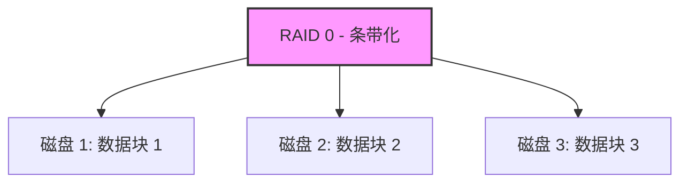
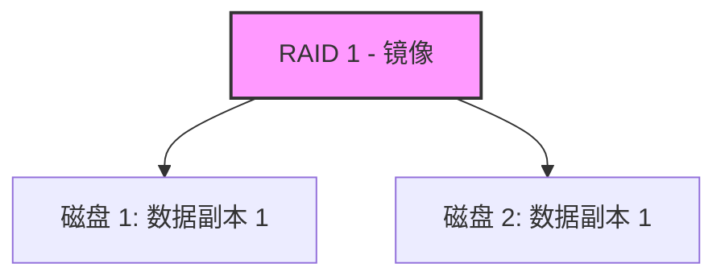
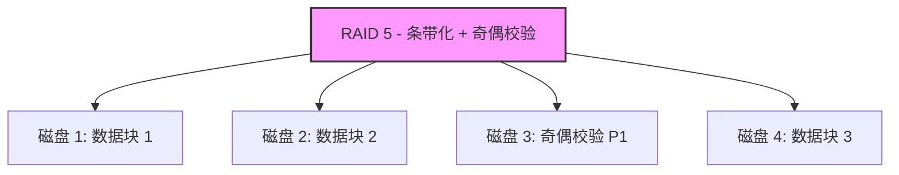
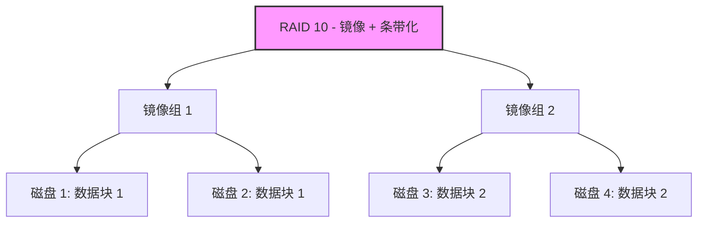
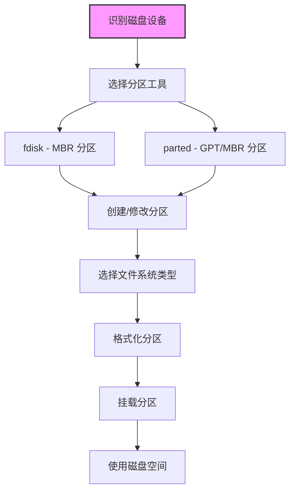

#Linux 存储基础与初步共享

## 目标：

1. 理解 Linux 磁盘阵列（RAID）的基本理论及其应用场景。
2. 掌握磁盘管理工具 fdisk 和 parted 的基本用法。
3. 熟悉 Linux 中的磁盘类型及其命名规则。
4. 学习 LVM（逻辑卷管理）的基本概念和操作，重点是动态卷组管理。
5. 深入掌握 LVM 的高级管理功能。
6. 初步掌握 NFS（网络文件系统），学习如何将磁盘共享到网络。
7. 完成 LVM + NFS 的综合实验操作。

### 环境准备
* 操作系统：Ubuntu 20.04 或更高版本（建议使用虚拟机）。
* 硬件需求：至少 2 个虚拟磁盘（建议每块磁盘 10GB 以上）用于实践。
* 工具：VirtualBox 或 VMware 虚拟机软件。
* 注意：在操作磁盘和存储时，务必备份重要数据，避免误操作导致数据丢失。
* 环境准备：建议使用虚拟机（如 VirtualBox）安装一个 Linux 系统（如 Ubuntu 或 CentOS），确保有至少 2 个虚拟磁盘用于实践。


## 第一部分：Linux 磁盘阵列（RAID）理论
### 什么是 RAID？
RAID（Redundant Array of Independent Disks，独立磁盘冗余阵列）是一种将多个物理磁盘组合起来以提高性能或可靠性的技术。RAID 主要用于数据存储的冗余备份和性能优化。

### 常见的 RAID 级别
#### RAID 0（条带化）：将数据分散在多个磁盘上以提高读写速度，但无冗余，磁盘故障会导致数据丢失。


* 数据被分成小块，分散存储在多个磁盘上。
* 优点：读写速度快，存储容量利用率 100%。
* 缺点：无冗余，任何一个磁盘故障都会导致全部数据丢失。
* 适用场景：对速度要求高但数据安全性不高的场景，如临时缓存。

#### RAID 1（镜像）：数据在多个磁盘上镜像存储，提供冗余，一个磁盘故障不影响数据，但存储容量减半。


* 数据在多个磁盘上完全镜像存储，内容完全相同。
* 优点：提供冗余，一个磁盘故障不影响数据。
* 缺点：存储容量减半，写入速度可能稍慢。
* 适用场景：对数据安全要求高的场景，如数据库日志。

#### RAID 5：结合条带化和奇偶校验，至少需要 3 个磁盘，提供性能和冗余，允许一个磁盘故障。


* 数据和奇偶校验信息分布存储在多个磁盘上，至少需要 3 个磁盘。
* 优点：兼顾性能和冗余，允许一个磁盘故障。
* 缺点：写入性能稍差，重建故障磁盘时性能下降。
* 适用场景：文件服务器、中小型企业存储。

#### RAID 10（1+0）：结合 RAID 0 和 RAID 1，至少需要 4 个磁盘，提供高性能和高冗余。


* 结合 RAID 0 和 RAID 1 的优点，至少需要 4 个磁盘。
* 优点：高性能和高冗余，允许多个磁盘故障（视具体配置）。
* 缺点：存储容量利用率仅 50%，成本较高。
* 适用场景：高性能和高可靠性的场景，如数据库服务器。


#### RAID 的实现方式
* 硬件 RAID：通过专用的 RAID 控制器实现，性能更好但成本较高。
    * 由专用的 RAID 控制器（硬件卡）实现。
    * 优点：性能优异，管理简单，操作系统无需额外配置。
    * 缺点：成本较高，依赖特定硬件。

* 软件 RAID：通过操作系统（如 Linux 的 mdadm 工具）实现，成本低但性能稍逊。
    * 通过操作系统软件（如 Linux 的 mdadm 工具）实现。
    * 优点：成本低，灵活性高，可在普通硬件上运行。
    * 缺点：性能稍逊，依赖 CPU 计算。
    * 在 Ubuntu 中，可以使用 mdadm 创建和管理软件 RAID，后续课程中可以实践。

**实践思考**

* RAID 不是备份，而是一种提高性能或可靠性的方式，数据仍需定期备份。
* 在虚拟机中，可以通过 mdadm 模拟软件 RAID，但今天我们先关注理论，实践可以在后续学习中完成。
* 学习资源：阅读 man mdadm 或搜索 “Linux RAID tutorial” 了解更多。

## 第二部分：磁盘管理工具（fdisk 和 parted）
### 磁盘管理基础
在 Linux 中，磁盘管理是存储技术的起点。通过磁盘管理工具，我们可以对磁盘进行分区、格式化等操作，为后续的文件系统创建和存储管理奠定基础。常用的磁盘管理工具包括 fdisk 和 parted，它们分别适用于不同的分区表类型和使用场景。以下内容将详细介绍这两个工具的功能、命令参数以及操作步骤，适合零基础学习者。

#### 磁盘管理的基本概念
* 磁盘分区：将一块物理磁盘划分为多个逻辑部分，每个部分可以独立格式化为不同的文件系统。
* 分区表：记录磁盘分区信息的结构，常见的有 MBR（Master Boot Record）和 GPT（GUID Partition Table）。
    * MBR：传统分区表，适用于小于 2TB 的磁盘，最多支持 4 个主分区或 3 个主分区加 1 个扩展分区。
    * GPT：现代分区表，支持大于 2TB 的磁盘，分区数量几乎无限制。
* 文件系统：磁盘分区上的数据组织方式，常见的有 ext4、xfs 等，需在分区后格式化。

在 Ubuntu 中，我们可以通过命令行工具查看和管理磁盘设备。以下是磁盘管理的基本流程图：



**说明**：上图展示了磁盘管理的基本流程，从识别磁盘设备开始，选择合适的工具进行分区，选择文件系统类型并格式化后挂载，最终使用磁盘空间。

### Linux 文件系统类型介绍
在 Linux 中，文件系统是磁盘分区存储和组织数据的方式。不同的文件系统类型有不同的特性和适用场景。以下是 Linux 中常见文件系统类型的详细介绍，适合零基础学习者理解：
#### 常见文件系统类型
* ext4（第四代扩展文件系统）：
    * 特点：Linux 的默认文件系统，支持大文件和大分区（最大 1EB 分区，16TB 文件），提供日志功能（Journaling）以提高数据恢复能力。
    * 优点：稳定、性能好、兼容性强，支持文件权限和元数据。
    * 缺点：对极大数据量场景的性能优化不如某些新型文件系统。
    * 适用场景：通用场景，如系统分区、数据存储，适合大多数 Ubuntu 用户。
    * 格式化命令：
    ```bash
    sudo mkfs.ext4 /dev/sdXn

    ```

* ext3：
    * 特点：ext4 的前身，支持日志功能，但性能和容量限制不如 ext4。
    * 优点：稳定，兼容性好。
    * 缺点：不支持大文件和大分区，性能较低。
    * 适用场景：老系统或对兼容性要求高的场景（现已较少使用）。

* 格式化命令：
    ```bash
    sudo mkfs.ext3 /dev/sdXn
    ```

* xfs：
    * 特点：高性能文件系统，支持大文件和大分区（最大 8EB），特别适合处理大数据量。
    * 优点：高并发性能好，支持在线扩展。
    * 缺点：不支持缩小分区，恢复工具较少。
    * 适用场景：企业级存储、大型数据库、文件服务器。
    * 格式化命令：
    ```bash
    sudo mkfs.xfs /dev/sdXn
    ```

* btrfs（B-tree 文件系统）：
    * 特点：现代文件系统，支持快照（Snapshot）、数据校验、在线压缩等高级功能。
    * 优点：支持动态调整大小、快照便于备份、数据完整性检查。
    * 缺点：性能稍逊于 ext4 和 xfs，稳定性在某些场景下不如 ext4。
    * 适用场景：需要快照和数据保护的场景，如备份系统。
    * 格式化命令：
    ```bash
    sudo mkfs.btrfs /dev/sdXn

    ```

* FAT32 和 NTFS：
    * 特点：源自 Windows 系统，FAT32 是老格式，NTFS 是现代格式。
    * 优点：跨平台兼容性好，适合与 Windows 共享数据。
    * 缺点：FAT32 不支持大文件（最大 4GB），NTFS 在 Linux 上性能和权限支持有限。
    * 适用场景：U盘、移动硬盘等需要跨系统使用的设备。
    * 格式化命令：
    ```bash
    sudo mkfs.vfat /dev/sdXn  # FAT32
    sudo mkfs.ntfs /dev/sdXn  # NTFS（需安装 ntfs-3g 工具）

    ```

* swap：
    * 特点：专用于 Linux 交换分区，不是传统文件系统，用于虚拟内存。
    * 优点：当物理内存不足时，提供临时存储空间。
    * 缺点：不适合存储文件，仅用于系统内存扩展。
    * 适用场景：系统运行时内存不足的补充，通常在安装系统时分配。
    * 格式化命令：
    ```bash
    sudo mkswap /dev/sdXn
    sudo swapon /dev/sdXn

    ```

#### 文件系统选择建议
* 普通用户：推荐使用 ext4，它是 Ubuntu 的默认文件系统，稳定且易用。
* 企业用户：处理大数据量时可选择 xfs，需要快照功能时可选择 btrfs。
* 跨平台需求：与 Windows 共享数据时选择 FAT32（小文件）或 NTFS（大文件）。
* 系统需求：安装系统时通常会分配 ext4 作为根分区和 swap 作为交换分区。

#### 查看文件系统类型
可以通过以下命令查看当前磁盘分区的文件系统类型：

```bashlsblk -f
df -T
sudo file -sL /dev/sdXn

```

**输出示例（lsblk -f）：**

```bash
NAME   FSTYPE   LABEL   UUID                                 MOUNTPOINT
sda                                                         
├─sda1 ext4             123e4567-e89b-12d3-a456-426614174000 /boot
└─sda2 ext4             987fcdeb-51a2-4b7e-8f1a-678901234567 /
sdb                                                         
└─sdb1 xfs              456e7890-abcd-1234-efgh-ijk901234567 /mnt/data

```

**解释**：`sda1` 和 `sda2` 是 `ext4` 文件系统，`sdb1` 是 `xfs` 文件系统。

### 识别磁盘设备
在进行磁盘管理之前，需要先识别系统中的磁盘设备。以下是常用命令及其参数的详细介绍：

* lsblk：列出块设备（磁盘及分区）信息。
    * lsblk：列出块设备（磁盘及分区）信息。
    * 语法：lsblk [选项]
    * 常用参数：
        * 无参数：显示所有块设备的树状结构。
        * -f：显示文件系统信息（如挂载点、文件系统类型）。
        * -d：仅显示磁盘设备，不显示分区。
    * 示例：
        ```bash
        lsblk
        lsblk -f
        ```
        **输出示例：**
        ```bash
            NAME   MAJ:MIN RM  SIZE RO TYPE MOUNTPOINT
        sda      8:0    0   20G  0 disk 
        ├─sda1   8:1    0  512M  0 part /boot
        └─sda2   8:2    0 19.5G  0 part /
        sdb      8:16   0   10G  0 disk 

        ```

        **解释**：sda 是第一块磁盘，sda1 和 sda2 是其分区；sdb 是第二块磁盘，未分区。

* fdisk -l：列出所有磁盘的分区表信息（需要管理员权限）。
    * 语法：sudo fdisk -l [设备名]
    * 常用参数：
        * 无参数：列出所有磁盘的分区信息。
        * /dev/sdX：指定特定磁盘查看。
    * 示例：
        ```bash
        sudo fdisk -l /dev/sdb

        ```

        **输出示例：**

        ```bash
        Disk /dev/sdb: 10 GiB, 10737418240 bytes, 20971520 sectors
        Disk model: VBOX HARDDISK   
        Units: sectors of 1 * 512 = 512 bytes
        Sector size (logical/physical): 512 bytes / 512 bytes
        I/O size (minimum/optimal): 512 bytes / 512 bytes
        Disklabel type: dos
        Disk identifier: 0x00000000

        ```

        **解释**：输出显示 /dev/sdb 是一块 10GB 的磁盘，尚未创建分区表。

**注意**：在操作磁盘之前，务必通过以上命令确认目标磁盘，避免误操作导致数据丢失。

### fdisk：传统分区工具
#### 工具介绍
fdisk 是一个传统的命令行分区工具，主要用于管理 MBR（Master Boot Record）分区表，适用于小于 2TB 的磁盘。它通过交互式界面操作，适合对小型磁盘进行分区管理。

#### 基本用法与参数
* 启动 fdisk：

    * 语法：sudo fdisk /dev/sdX
    * 参数：/dev/sdX 是目标磁盘设备名，如 /dev/sdb。
    * 示例：
        ```bash
        sudo fdisk /dev/sdb
        ```

        **解释**：进入 /dev/sdb 的分区管理模式，之后通过交互式命令操作。

* 常用交互式命令：
    * `p`：显示当前分区表。
    * `n`：创建新分区。
        * 选项：`p`（主分区）或 `e`（扩展分区）。
        * 分区号：通常从 1 开始。
    * 起始和结束扇区：可按默认值分配全部空间。
    * `d`：删除分区。
        * 选项：输入分区号删除指定分区。
    * `t`：更改分区类型。
        * 选项：输入分区号和类型代码（如 83 表示 Linux 分区）。
    * `w`：保存修改并退出。
    * `q`：不保存修改直接退出。
    * `m`：显示帮助菜单。

#### 实践步骤（以 Ubuntu 为例）
1. 添加虚拟磁盘：
    * 在虚拟机（如 VMware）中添加一块新磁盘（如 5GB）。
    * 重启虚拟机或使用以下命令重新扫描磁盘：
        ```bash
        sudo echo "- - -" > /sys/class/scsi_host/host0/scan

        ```
2. 确认磁盘设备：
    * 使用 lsblk 查看新添加的磁盘（如 /dev/sdb）。
    ```bash
    lsblk
    ```

3. 进入 fdisk 模式：
    * 对新磁盘进行分区操作：
    ```bash
    sudo fdisk /dev/sdb
    ```

4. 创建分区：
    * 输入 `n` 创建新分区。
    * 选择 `p`（主分区）。
    * 分区号选择 `1`。
    * 起始和结束扇区按默认值（回车），分配全部空间。
    * 输入 `p` 查看分区表，确认分区创建成功。
    * 输入 `w` 保存并退出。

5. 格式化分区：
    * 将新分区格式化为 ext4 文件系统（推荐给普通用户）：
        ```bash
        sudo mkfs.ext4 /dev/sdb1

        ```

6. 验证结果：
    * 使用以下命令查看分区和文件系统信息：
        ```bash
        lsblk -f
        ```

**注意事项**

* `fdisk` 修改分区表后，系统可能需要重启或使用 partprobe 命令更新分区信息：
    ```bash
    sudo partprobe /dev/sdb
    ```
* 操作时务必确认目标磁盘，避免误操作已有数据磁盘。

###  parted：现代分区工具
#### 工具介绍

parted 是一个功能更强大的分区工具，支持 GPT（GUID Partition Table）和 MBR 分区表，适用于大于 2TB 的磁盘，也兼容小型磁盘。相比 fdisk，parted 支持非交互式操作，适合脚本自动化，且功能更全面。

#### 基本用法与参数
* 启动 parted：
    * 语法：sudo parted /dev/sdX
    * 参数：/dev/sdX 是目标磁盘设备名，如 /dev/sdc。
    * 示例：
        ```bash
        sudo parted /dev/sdc
        ```

        **解释**：进入 /dev/sdc 的分区管理模式，通过交互式命令操作。

* 常用交互式命令：

    * print：显示当前分区表。
    * mklabel：创建分区表类型。
        * 选项：gpt（创建 GPT 分区表）或 msdos（创建 MBR 分区表）。
    * mkpart：创建新分区。
        * 语法：mkpart [分区类型] [起始位置] [结束位置]
        * 选项：primary（主分区），起始和结束位置可用百分比（如 0% 100%）。
    * rm：删除分区。
        * 语法：rm [分区号]
    * quit：退出 parted。
    * help：显示帮助信息。

* 非交互式操作（适合脚本）：
    * 语法：sudo parted /dev/sdX [命令]
    * 示例：创建 GPT 分区表并分配一个主分区：
        ```bash
        sudo parted /dev/sdc mklabel gpt
        sudo parted /dev/sdc mkpart primary 0% 100%

        ```

#### 实践步骤（以 Ubuntu 为例）
1. 添加虚拟磁盘：
    * 在虚拟机中添加另一块新磁盘（如 10GB，设备名为 /dev/sdc）。
    * 使用 lsblk 确认新磁盘。
        ```bash
        lsblk
        ```