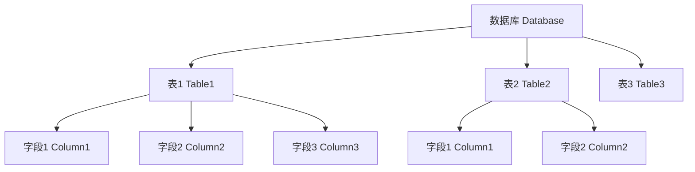
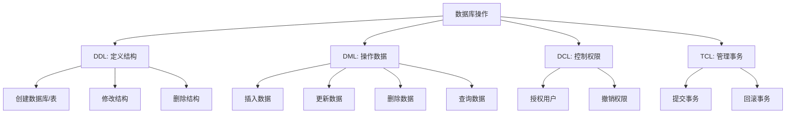

# 第一天教案：数据库基础理论入门

## 教学目标
1. 让学生理解什么是数据库，以及数据库在生活和工作中的作用（用贴近生活的例子）。
2. 掌握数据库的基本分类，尤其是关系型数据库的概念和特点（以 MySQL 为例）。
3. 了解市场上常见的数据库产品（如 MySQL、Oracle、PostgreSQL 等），通过对比表格直观认识它们的异同。
4. 学会在 Linux 系统上安装 MySQL，并通过简单步骤创建一个用户。
5. 学会使用 Navicat 工具远程连接 MySQL，操作数据库就像用手机 App 一样简单。
6. 掌握创建数据库和表的基本方法，理解字符集和排序规则的含义（用简单例子说明）。
7. 学习最基础的数据操作（插入、查询），就像在表格中填写和查看信息。
8. 通过动手练习，熟悉操作步骤，增强记忆。

---

# 数据库基础课程：从入门到实践

## 1. 课程引入：什么是数据库？

### 1.1 数据库的概念与生活化例子
- **内容**：用生活化的例子让学生理解数据库的概念。
  - 想象你在一家小超市工作，每天要记录商品的名称、价格、库存量。如果用纸和笔记录，时间长了会乱七八糟，找起来很麻烦。如果用电脑表格（如 Excel）记录，会方便很多。而数据库就像一个“超级智能的 Excel”，不仅能存数据，还能快速查找、修改、统计，甚至可以处理成千上万条数据。
  - 数据库的作用：存储和管理数据，让信息井井有条。比如，学校用数据库管理学生信息（学号、姓名、成绩），公司用数据库管理员工工资，电商平台用数据库管理商品和订单。
- **目标**：让学生明白数据库是用来“整理和查找信息”的工具，不是高深莫测的东西。

### 1.2 互动环节
- **互动**：问学生：“你们有没有用过 Excel 或者手机上的记事本记录东西？有没有遇到过找信息很麻烦的时候？”引导他们说出自己的经历，连接到数据库的作用。

### 1.3 数据库的附加价值
- **补充**：数据库不仅仅是存储数据，它还能保证数据的安全性（比如防止丢失）、一致性（比如避免重复或错误数据），并且支持多人同时使用（就像多人一起编辑一个共享表格）。

---

## 2. 数据库的基本分类：关系型数据库详解

### 2.1 数据库的分类
- **内容**：讲解数据库的分类，重点介绍关系型数据库的概念。
  1. **分类概述**
     - 数据库按照数据组织方式的不同，可以分为几大类：
       - **关系型数据库（RDBMS）**：数据以表格形式存储，表格之间通过某些字段（如编号）建立关系。就像 Excel 表格，但更强大，支持复杂的查询和关联。比如 MySQL、Oracle、PostgreSQL。
       - **非关系型数据库（NoSQL）**：数据存储方式更灵活，不一定用表格，可以是键值对、文档、图等形式。适合处理大数据或非结构化数据（如社交媒体的图片、视频）。比如 MongoDB、Redis。
       - **其他类型**：如层次型数据库（像文件目录树）、网络型数据库（像复杂的网状关系），但现在用得较少。
     - 解释：我们今天主要学习关系型数据库，因为它最常见，逻辑也最接近日常思维（就像用表格管理数据）。

### 2.2 关系型数据库的核心概念
- **内容**：
  1. **表格（Table）**：数据存储的基本单位，就像 Excel 中的一个工作表。比如“学生表”可以有列（如学号、姓名、年龄）和行（每个学生的信息）。
  2. **字段（Column）**：表格中的列，表示数据的某种属性。比如“学号”是一个字段。
  3. **记录（Row）**：表格中的行，表示一个完整的数据项。比如一个学生的所有信息（学号=001，姓名=张三，年龄=18）是一条记录。
  4. **关系（Relation）**：不同表格之间通过某些字段建立联系。比如“学生表”和“成绩表”可以通过“学号”字段关联起来，查出某个学生的成绩。
  5. **举例**：想象一个学校管理系统，有两张表：
     - 学生表：学号、姓名、年龄
     - 成绩表：学号、科目、分数
     - 通过“学号”字段，可以把两张表关联起来，查出“张三”的数学成绩是多少。

### 2.3 关系型数据库的特点
- **内容**：
  1. 数据结构清晰，用表格表示，容易理解。
  2. 支持复杂查询，比如查找、排序、统计。
  3. 保证数据一致性，比如不允许重复学号。
  4. 适合处理有明确结构的数据（如财务记录、学生信息）。

### 2.4 为什么选择关系型数据库？
- **内容**：
  1. 关系型数据库是最成熟、最广泛使用的数据库类型，几乎所有传统业务系统（如银行、电商、医院）都用它。
  2. 它有标准语言（SQL，结构化查询语言），就像英语一样，学会了 SQL 就能操作几乎所有关系型数据库。

---

## 3. 市场上常见的数据库产品对比

### 3.1 对比目标与内容
- **目标**：让学生知道 MySQL 只是众多数据库中的一种，了解不同数据库适合的场景。
- **内容**：介绍几种主流数据库产品，通过表格对比帮助学生了解它们的用途和特点。

### 3.2 数据库产品对比表格
| 数据库名称       | 类型            | 特点与优势                                      | 适用场景                          | 开源/商业       |
|------------------|-----------------|------------------------------------------------|-----------------------------------|-----------------|
| **MySQL**        | 关系型数据库    | 轻量级、易用、速度快，社区活跃，支持多种平台    | 中小型网站、应用开发（如博客、电商） | 开源（部分商业版） |
| **Oracle**       | 关系型数据库    | 功能强大、安全性高、支持大规模企业应用          | 大型企业系统（如银行、电信）      | 商业（付费）    |
| **PostgreSQL**   | 关系型数据库    | 开源、功能丰富、支持复杂查询和扩展              | 数据分析、地理信息系统、复杂应用  | 开源            |
| **Microsoft SQL Server** | 关系型数据库 | 与 Windows 系统集成好，适合企业环境             | 企业内部系统、商业软件            | 商业（付费）    |
| **MongoDB**      | 非关系型（NoSQL）| 灵活性高，适合存储非结构化数据，支持大数据     | 社交媒体、日志分析、内容管理      | 开源（部分商业版） |
| **Redis**        | 非关系型（NoSQL）| 超快速度，适合缓存和临时数据存储                | 网站缓存、会话管理、排行榜        | 开源            |

### 3.3 讲解要点
- **MySQL**：我们今天学习的数据库，适合初学者，免费且易用，很多小型网站都用它。
- **Oracle**：像一个“重型坦克”，功能多但复杂，适合大公司，价格昂贵。
- **PostgreSQL**：像 MySQL 的“升级版”，免费但功能更复杂，适合需要高级功能的项目。
- **MongoDB 和 Redis**：不属于关系型数据库，存储方式更像“文件夹”或“字典”，适合特定场景。

---

## 4. 数据库结构直观展示：Mermaid 图

### 4.1 展示目标
- **目标**：通过图形化方式，让学生直观理解数据库中“表”和“关系”的概念。

### 4.2 结构图 1：数据库的层级结构

- **解释**：一个数据库就像一个“大文件夹”，里面有很多“表格”，每个表格又有“字段”（列）。比如，数据库是“学校系统”，表1 是“学生表”，字段是“学号、姓名”。

### 4.3 结构图 2：关系型数据库中表的关系（以学校为例）

- **解释**：这张图展示了“学生表”和“成绩表”的关系。通过“学号”字段，可以把两张表关联起来。比如，查出学号为 001 的张三的数学成绩是 85 分。

---

## 5. 环境搭建：在 Linux 上安装 MySQL

### 5.1 学习目标
- **为什么要学**：MySQL 是我们学习数据库的起点，就像学开车要先有一辆车。安装 MySQL 后，我们才能创建数据库、存储数据、练习操作。没有它，就像没有工具就无法开工。

### 5.2 安装步骤
#### 5.2.1 准备工作
- 确保有一台 Linux 服务器（如 Ubuntu），可以通过终端登录（像打开手机的“命令中心”）。
- 如果没有服务器，老师会提供虚拟机或云服务器，提前帮大家准备好。
- **注意**：需要有 `sudo` 权限，就像要有管理员账号才能安装软件。

#### 5.2.2 安装 MySQL
- 打开 Linux 终端，输入以下命令，一步步安装：
  ```bash
  sudo apt update  # 更新软件列表，像检查手机是否有新版本
  sudo apt install mysql-server  # 安装 MySQL，像下载 App
  sudo systemctl start mysql  # 启动 MySQL，像打开 App
  sudo systemctl enable mysql  # 设置开机自启，像让 App 后台运行
  ```
- 检查是否安装成功（像看看 App 能不能用）：
  ```bash
  sudo systemctl status mysql
  ```
  如果看到“active (running)”，说明安装成功，像 App 正常运行。如果状态显示有问题，老师会协助排查。

#### 5.2.3 进入 MySQL
- 输入命令：
  ```bash
  sudo mysql
  ```
  进入后屏幕会变成 `mysql>`，像进入 App 主界面。
- **注意**：默认安装的 MySQL（Ubuntu 上）可能不需要密码直接进入，这是系统默认设置，但安全性较低，后面我们会创建有密码的用户。

### 5.3 互动环节
- **互动**：问学生：“有没有安装过手机 App？是不是也要下载、安装、打开？这里就是一样的！默认没密码是不是不安全？我们接下来就设置用户和密码。”

---

## 6. 修改 MySQL 配置：允许远程访问

### 6.1 学习目标
- **为什么要学**：MySQL 安装后，默认只允许本地访问（即 `127.0.0.1` 或 `localhost`），就像家门只允许自己人进，不让外人进入。这是为了安全，但我们需要远程连接（比如用 Navicat 从自己电脑连接到服务器），就像要让朋友也能来家里做客，所以需要修改设置，打开“远程访问的门”。

### 6.2 配置步骤
#### 6.2.1 检查 MySQL 配置文件
- MySQL 的配置文件通常在 `/etc/mysql/mysql.conf.d/mysqld.cnf` 或 `/etc/my.cnf`（根据 Linux 版本不同可能有差异，Ubuntu 通常是前者）。
- 用文本编辑器 `vim` 打开文件：
  ```bash
  sudo vim /etc/mysql/mysql.conf.d/mysqld.cnf
  ```
- 进入 `vim` 后，按 `i` 键进入插入模式（像开始编辑文档）。
- 找到 `bind-address` 这行，默认是 `bind-address = 127.0.0.1`，意思是“只允许本地访问”，就像“只让家里人进门”。
- **注意**：如果找不到这行，可以用搜索功能（按 `Esc` 键退出插入模式，输入 `/bind-address` 回车搜索），或者问老师确认文件位置。

#### 6.2.2 修改配置以允许远程访问
- 将 `bind-address = 127.0.0.1` 改为 `bind-address = 0.0.0.0`，意思是“允许任何地址访问”，就像“家门对所有人开放”。
- **小贴士**：如果只想允许特定 IP 访问，可以改为特定 IP（如 `bind-address = 192.168.1.100`），但为了简单，我们先用 `0.0.0.0`。
- 保存并退出 `vim`：按 `Esc` 键退出插入模式，输入 `:wq` 回车（意思是保存并退出）。

#### 6.2.3 重启 MySQL 服务
- 输入命令重启 MySQL：
  ```bash
  sudo systemctl restart mysql
  ```
- 检查是否重启成功：
  ```bash
  sudo systemctl status mysql
  ```
  看到“active (running)”说明重启成功。

#### 6.2.4 检查防火墙设置
- 如果服务器有防火墙，可能还需要开放 MySQL 的默认端口 3306，就像小区大门也得开才能让朋友进来。
- 输入命令开放端口（以 Ubuntu 的 `ufw` 防火墙为例）：
  ```bash
  sudo ufw allow 3306/tcp
  ```
- 检查防火墙状态：
  ```bash
  sudo ufw status
  ```
  看到 3306 端口显示“ALLOW”说明开放成功。
- **注意**：如果用的是云服务器（如阿里云、腾讯云），还需要在云服务器控制台的安全组规则中开放 3306 端口，老师会协助解决。

---

## 7. 创建 MySQL 用户：理解语法和授权

### 7.1 学习目标
- **为什么要学**：默认安装的 MySQL 可能没有密码或权限设置，这就像家里大门没锁，任何人可以进来，非常不安全。创建用户和设置密码就像给家门上锁，只有有钥匙的人才能进。同时，远程连接（比如用 Navicat）需要用户名和密码，否则无法登录。所以这一步是必须的，为后续操作打基础。

### 7.2 创建用户步骤
#### 7.2.1 进入 MySQL 命令行
- 如果还没进入 MySQL，输入：
  ```bash
  sudo mysql
  ```

#### 7.2.2 创建一个用户
- 假设我们要创建一个用户名叫 `admin`，密码是 `admin123`，允许从任何地方登录（像设置一个账号可以在任何设备登录）。
- 在 MySQL 命令行中输入：
  ```sql
  CREATE USER 'admin'@'%' IDENTIFIED WITH 'caching_sha2_password' BY 'admin123';
  ```
- **语法解释**（用生活例子说明）：
  - `CREATE USER`：意思是“创建一个新用户”，就像在手机 App 上注册一个新账号。
  - `'admin'@'%'`：`admin` 是用户名，`%` 表示“可以从任何地方登录”，就像你的微信账号可以在任何设备上登录。如果写成 `'admin'@'localhost'`，就只能在本地登录，就像只能在自己家用。
  - `IDENTIFIED WITH 'caching_sha2_password'`：指定密码加密方式，`caching_sha2_password` 是 MySQL 8.0+ 默认的加密方法，更安全，就像给账号设置一个复杂的密码锁。
  - `BY 'admin123'`：设置密码是 `admin123`，就像给账号设置密码。

#### 7.2.3 给用户授权
- 用户创建好了，但没有权限，就像注册了账号但还不能用某些功能。我们需要给用户分配权限：
  ```sql
  GRANT ALL PRIVILEGES ON *.* TO 'admin'@'%' WITH GRANT OPTION;
  ```
- **语法解释**（用生活例子说明）：
  - `GRANT ALL PRIVILEGES`：意思是“授予所有权限”，就像给账号开通 VIP，可以用所有功能。
  - `ON *.*`：表示对所有数据库和表都有权限，`*.*` 就像“所有文件夹和文件”，如果只想给某个数据库权限，可以写成 `ON mydb.*`（某个数据库的所有表）。
  - `TO 'admin'@'%'`：指定给哪个用户。
  - `WITH GRANT OPTION`：允许这个用户再给别人授权，就像“可以邀请朋友一起用”。

#### 7.2.4 刷新权限
- 输入：
  ```sql
  FLUSH PRIVILEGES;
  ```
- 解释：刷新权限确保设置生效，就像保存文件后才能生效。

#### 7.2.5 退出 MySQL 命令行
- 输入：
  ```sql
  EXIT;
  ```
- 回到 Linux 终端。

---

## 8. 使用 Navicat 远程连接 MySQL

### 8.1 学习目标
- **为什么要学**：在 Linux 终端写 SQL 语句就像用老式手机打字，慢且容易出错。Navicat 是一个图形化工具，就像现代手机 App，点几下就能完成复杂操作，特别适合初学者。通过远程连接，我们可以在自己的电脑上管理服务器的数据库，就像用手机远程控制家里的空调。

### 8.2 连接步骤
#### 8.2.1 下载 Navicat
- 在 Windows 或 Mac 上下载 Navicat for MySQL（老师会提供下载链接或安装包）。
- 安装过程就像安装普通软件，跟着提示点“下一步”即可，老师会协助解决安装问题。

#### 8.2.2 配置连接
- 打开 Navicat，点击“连接” -> “MySQL”（或界面上的“New Connection”）。
- 填写信息：
  - 连接名：随意取名，如“MyServer”（像给这个登录记录起个名字）。
  - 主机：Linux 服务器的 IP 地址（如 192.168.1.100，老师会提供）。
  - 端口：默认 3306（MySQL 默认端口，像门牌号）。
  - 用户名：`admin`（刚才创建的）。
  - 密码：`admin123`（刚才设置的）。
- 点击“测试连接”，如果成功会提示“连接成功”，然后点击“确定”保存连接。
- **注意**：如果连接失败，可能是以下原因，老师会协助解决：
  - 配置文件没改好，`bind-address` 仍限制为 `127.0.0.1`。
  - 防火墙或云服务器安全组没开放 3306 端口。
  - 用户名或密码错误，或者用户未设置 `%` 允许远程登录。
  - 网络问题，确保你的电脑和服务器在同一网络或公网可达。

#### 8.2.3 操作数据库
- 连接成功后，左侧显示数据库列表，就像“文件夹”。
- 双击某个数据库可以查看里面的表和数据，就像浏览文件。
- 后续操作（如创建表、插入数据）都可以通过图形界面完成，就像用手机 App 点几下就能搞定。

---

## 9. T-SQL 语句基础：DDL、DML、DCL、TCL 介绍

### 9.1 学习目标
- **为什么要学**：T-SQL 是我们与数据库“对话”的语言，就像用电脑操作 Excel 表格。数据库操作就像使用 Excel，有设计表格、填写数据、设置权限、确保保存等不同步骤，这些步骤对应不同的语言分类。理解 DDL、DML、DCL、TCL 的作用，就像明白用 Excel 的每个功能做什么，只有分清职责，才能高效操作数据库，为后续学习具体语句打基础。

### 9.2 理论讲解
#### 9.2.1 什么是 T-SQL
- T-SQL 是 Transact-SQL 的缩写，是 Microsoft SQL Server 使用的 SQL 语言扩展，也是许多数据库（如 MySQL）操作的基础。就像 Excel 是处理数据的工具，T-SQL 是数据库操作的“工具”，用来创建、修改、查询数据等。
- 它包含四种主要语言类型：DDL、DML、DCL、TCL，每种类型负责不同任务，就像用 Excel 分设计表格、录入数据、设置权限、保存操作。

#### 9.2.2 DDL（Data Definition Language）- 数据定义语言
- 作用：定义和管理数据库结构，就像在 Excel 中设计表格的框架。
- 主要任务：创建、修改、删除数据库和表结构，比如建数据库、建表、改字段。
- 例子：`CREATE DATABASE`（建数据库）、`CREATE TABLE`（建表）、`ALTER TABLE`（改表结构）、`DROP TABLE`（删表）。
- 比喻：就像在 Excel 中设置列名（如“学号”“姓名”）、定义每列的格式（如数字、文本），决定表格长什么样。

#### 9.2.3 DML（Data Manipulation Language）- 数据操作语言
- 作用：操作数据库中的数据，就像在 Excel 表格中填写或修改具体内容。
- 主要任务：添加、删除、修改、查询数据。
- 例子：`INSERT`（插入数据）、`UPDATE`（更新数据）、`DELETE`（删除数据）、`SELECT`（查询数据）。
- 比喻：就像在 Excel 表格的行里填入学生信息、修改成绩、删除某条记录、筛选查看数据。

#### 9.2.4 DCL（Data Control Language）- 数据控制语言
- 作用：控制数据库的访问权限，就像给 Excel 文件设置密码或共享权限。
- 主要任务：管理用户权限，确保数据安全。
- 例子：`GRANT`（授权）、`REVOKE`（撤销权限）。
- 比喻：就像决定谁能打开 Excel 文件、谁能编辑、谁只能查看。

#### 9.2.5 TCL（Transaction Control Language）- 事务控制语言
- 作用：管理事务，确保数据操作的完整性，就像在 Excel 中保存或撤销一组操作。
- 主要任务：控制一组操作要么全成功、要么全失败，防止数据出错。
- 例子：`COMMIT`（提交事务）、`ROLLBACK`（回滚事务）、`SAVEPOINT`（设置保存点）、`SET TRANSACTION`（设置事务属性）。
- 比喻：就像在 Excel 中批量修改数据后，确认保存（COMMIT）或者撤销回原样（ROLLBACK），确保不留错误。

### 9.3 表格总结
| 语言类型 | 全称                        | 主要作用               | 典型语句                              | 生活比喻                     |
|----------|-----------------------------|------------------------|---------------------------------------|------------------------------|
| DDL      | Data Definition Language    | 定义数据库结构         | CREATE, ALTER, DROP, TRUNCATE         | 设计 Excel 表格框架          |
| DML      | Data Manipulation Language  | 操作数据库中的数据     | INSERT, UPDATE, DELETE, SELECT        | 在 Excel 表格中填写数据      |
| DCL      | Data Control Language       | 控制访问权限           | GRANT, REVOKE                         | 给 Excel 文件设置权限        |
| TCL      | Transaction Control Language| 管理事务，确保完整性   | COMMIT, ROLLBACK, SAVEPOINT           | 保存或撤销 Excel 操作        |

### 9.4 Mermaid 结构图

- **解释**：图中“数据库操作”是总目标，下面分出四种语言，各司其职。DDL 负责设计表格框架，就像先定好 Excel 的列；DML 负责填写内容，就像录入数据；DCL 负责权限管理，就像设置文件访问；TCL 负责操作确认，就像保存或撤销。学生可以直观看到每种语言的作用范围。

### 9.5 互动环节
- **互动**：问学生：“是不是像用 Excel 一样，DDL 是设计表格的列，DML 是填数据，DCL 是设密码，TCL 是保存或撤销？如果不先设计列，能直接填数据吗？这样分是不是更清楚？”

---


## 十、DDL 语法详解与实践：创建数据库与表（使用 Navicat 编写 SQL）

### 10.1 教学目标与重要性

- **内容**：详细讲解 DDL（数据定义语言）的核心语法，重点学习创建和删除数据库、创建和删除表的相关知识，并在 Navicat 中通过 SQL 语句进行实践操作。
- **为什么要学**：DDL 是数据库操作的基础，负责定义结构，就像在 Excel 中设计表格框架。创建数据库和表是 DDL 的核心操作，只有先搭建好结构，才能存储和管理数据。通过 Navicat 编写 SQL 语句，既能学习语法，又能利用工具的便捷性，适合初学者，为后续数据操作（DML）打基础。
- **理论与实践承上启下**：前面我们讲了 DDL 是“数据定义语言”，负责定义数据库结构。现在我们深入学习 DDL 的具体语法，从创建数据库开始，逐步到创建表，理解每个语法细节，并在 Navicat 中通过 SQL 语句实践，强化理论知识。

### 10.2 理论讲解：DDL 语法与核心概念（25分钟）

#### 10.2.1 数据库相关操作

##### 10.2.1.1 创建数据库 - CREATE DATABASE

- **语法**：`CREATE DATABASE 数据库名 [CHARSET=字符集] [COLLATE=排序规则];`
- **作用**：创建一个新的数据库，就像新建一个文件夹，用来存放多张表。
- **参数详解**：
  - `数据库名`：自定义名称，如 `school`，建议用小写字母或下划线，易于管理。
  - `CHARSET`：字符集，决定数据库支持的字符范围。字符集是数据存储时的编码方式，选错可能导致乱码。
  - `COLLATE`：排序规则，决定字符比较和排序方式，影响查询时的顺序和大小写敏感性。
- **常见字符集与排序规则表格**：

    | 字符集       | 作用与特点                              | 常见排序规则                 | 排序规则特点                       | 使用场景                     |
    |--------------|----------------------------------------|-----------------------------|-----------------------------------|------------------------------|
    | utf8         | 支持多语言，但不支持部分表情           | utf8_general_ci             | 不区分大小写，通用排序            | 普通多语言应用               |
    | utf8mb4      | 支持所有 Unicode 字符，包括表情        | utf8mb4_unicode_ci          | 不区分大小写，符合 Unicode 标准   | 支持表情和复杂字符的应用     |
    | latin1       | 支持西欧字符，占用空间小               | latin1_swedish_ci           | 不区分大小写，瑞典语排序规则      | 仅限西欧语言应用             |
    | gbk          | 支持简体中文，兼容性好                 | gbk_chinese_ci              | 不区分大小写，中文排序            | 简体中文应用                 |

- **说明**：推荐使用 `utf8mb4` 字符集和 `utf8mb4_unicode_ci` 排序规则，支持范围广，适合国际化应用。`ci` 表示 case insensitive（不区分大小写），如需区分大小写可选择 `utf8mb4_bin`。
- **例子**：`CREATE DATABASE school CHARSET=utf8mb4 COLLATE=utf8mb4_unicode_ci;`
- **比喻**：就像新建一个 Excel 文件夹，设置文件编码为“支持中文和表情”，确保内容不乱码，排序规则就像决定文件列表按什么顺序排列。
- **注意**：数据库名不能重复，创建前要检查是否已存在。

##### 10.2.1.2 删除数据库 - DROP DATABASE

- **语法**：`DROP DATABASE 数据库名;`
- **作用**：删除一个数据库及其所有内容（表、数据），就像删除整个文件夹，操作不可逆。
- **例子**：`DROP DATABASE school;`
- **注意**：删除前要确认是否需要备份，误删会导致数据丢失。

##### 10.2.1.3 无法修改数据库名

- MySQL 不支持直接修改数据库名（不像文件可以直接重命名），如果需要改名，必须先备份数据，创建新数据库，再导入数据。
- **比喻**：就像文件夹名不能直接改，要新建一个文件夹，把内容复制过去。

#### 10.2.2 表相关操作

##### 10.2.2.1 创建表 - CREATE TABLE

- **语法**：
  ```sql
  CREATE TABLE 表名 (
      字段名 数据类型 [长度] [约束],
      字段名 数据类型 [长度] [约束],
      ...
      [PRIMARY KEY (字段名)],
      [UNIQUE (字段名)],
      [INDEX (字段名)]
  ) ENGINE=存储引擎 CHARSET=字符集 COLLATE=排序规则;
  ```
- **作用**：创建一张表，就像设计 Excel 表格的框架，定义好列名和格式。
- **参数详解**：
  - `表名`：自定义，如 `students`，建议小写或下划线。
  - `字段名`：列名，如 `id`、`name`，就像 Excel 的列标题。
  - `数据类型`：字段存储的数据格式，详见下表。
  - `长度`：限制字段存储的数据大小，如 `VARCHAR(50)` 最多 50 个字符，`CHAR(4)` 固定 4 个字符。长度设置要合理，太小存不下数据，太大浪费空间。
  - `约束`：对字段的限制，确保数据有效性，详见下表。
  - `ENGINE`：存储引擎，决定表的数据存储方式，常用 `InnoDB`（支持事务、外键）。
  - `CHARSET` 和 `COLLATE`：与数据库类似，表级字符集和排序规则，通常与数据库一致。
- **常见数据类型表格**：

    | 数据类型         | 分类         | 描述与用途                                      | 存储范围或特点                              | 示例值                        |
    |------------------|--------------|------------------------------------------------|--------------------------------------------|-------------------------------|
    | **INT**          | 数值型       | 整数类型，用于存储整型数值，常用作主键或计数     | -2,147,483,648 到 2,147,483,647           | 100, -50, 0                   |
    | **BIGINT**       | 数值型       | 大整数类型，用于存储更大的整数值                | -9,223,372,036,854,775,808 到 9,223,372,036,854,775,807 | 123456789012, -987654321012 |
    | **FLOAT**        | 数值型       | 单精度浮点数，用于存储近似的小数值              | 精度较低，小数点后约6位                    | 3.14, -0.001, 123.456         |
    | **DOUBLE**       | 数值型       | 双精度浮点数，用于存储更精确的小数值            | 精度较高，小数点后约15位                   | 3.1415926535, -0.0000001      |
    | **DECIMAL(M,D)** | 数值型       | 精确小数类型，用于存储精确的货币或财务数据      | M 是总位数，D 是小数位数，如 DECIMAL(10,2) | 12345.67, -987.50            |
    | **CHAR(N)**      | 字符型       | 固定长度字符串，适合存储定长数据                | 长度固定为 N 个字符，最大 255 字符         | 'ABC', '12345' (定长5字符)    |
    | **VARCHAR(N)**   | 字符型       | 可变长度字符串，适合存储不定长文本              | 长度可变，最大 N 个字符（通常最大 65535）  | '张三', 'Hello World'         |
    | **TEXT**         | 字符型       | 长文本类型，用于存储大段文本                    | 最大 65,535 字符，适合文章或描述           | '这是一篇很长的文章内容...'    |
    | **DATE**         | 日期时间型   | 日期类型，存储年月日                            | 范围：'1000-01-01' 到 '9999-12-31'        | '2023-07-20'                  |
    | **TIME**         | 日期时间型   | 时间类型，存储时分秒                            | 范围：'-838:59:59' 到 '838:59:59'         | '19:38:00'                    |
    | **DATETIME**     | 日期时间型   | 日期时间类型，存储年月日时分秒                  | 范围：'1000-01-01 00:00:00' 到 '9999-12-31 23:59:59' | '2023-07-20 19:38:00'     |
    | **TIMESTAMP**    | 日期时间型   | 时间戳类型，常用于记录数据更新时间              | 范围：'1970-01-01 00:00:01' 到 '2038-01-19 03:14:07' | '2023-07-20 19:38:00'     |
    | **BOOLEAN**      | 布尔型       | 布尔值，用于存储真/假，通常用 0 和 1 表示       | 0 表示 FALSE，1 表示 TRUE                 | 1 (TRUE), 0 (FALSE)           |
    | **BLOB**         | 二进制型     | 二进制大对象，用于存储图片、文件等二进制数据     | 最大 65,535 字节，适合存储小型文件         | 图片数据、音频数据            |

- **常见约束表格**：

    | 约束类型          | 作用与特点                              | 示例                              | 使用场景                     |
    |-------------------|----------------------------------------|----------------------------------|------------------------------|
    | PRIMARY KEY       | 主键，唯一标识记录，不能重复且非空     | id INT PRIMARY KEY               | 唯一编号，如学号、员工号     |
    | AUTO_INCREMENT    | 自增，与 PRIMARY KEY 配合，自动递增    | id INT PRIMARY KEY AUTO_INCREMENT| 自动生成编号，避免重复       |
    | NOT NULL          | 非空，字段必须有值                     | name VARCHAR(50) NOT NULL        | 必填字段，如姓名             |
    | UNIQUE            | 唯一，字段值不能重复，可为空           | email VARCHAR(100) UNIQUE        | 邮箱、用户名，确保不重复     |
    | DEFAULT           | 默认值，未指定时自动填充               | status INT DEFAULT 0             | 默认状态、初始值             |
    | FOREIGN KEY       | 外键，关联其他表字段，确保数据一致性   | dept_id FOREIGN KEY REFERENCES departments(dept_id) | 表间关联，如员工与部门       |

- **主键与自增详细说明**：
  - 主键（PRIMARY KEY）通常是表的唯一标识字段，如 `id`，用来区分每条记录。常见设计是让主键自增（AUTO_INCREMENT），每次插入新记录时自动加 1，避免手动设置重复。
  - 例子：`id INT PRIMARY KEY AUTO_INCREMENT`
  - **注意**：自增字段通常是 `INT` 或 `BIGINT` 类型，自增数字有上限（如 `INT` 最大约 21 亿），如果遇到大数据表（如亿级数据），自增字段可能不够用，建议使用 UUID（通用唯一标识符）。UUID 是一个 36 字符的字符串（如 `550e8400-e29b-41d4-a716-446655440000`），通过算法生成，几乎不会重复，适合分布式系统或超大数据量场景。
  - 比喻：自增就像自动编号的票据，简单但数量有限；UUID 就像全球唯一的身份证号，几乎不可能重复，但更复杂。

- **外键（FOREIGN KEY）详细说明**：
  - 外键（FOREIGN KEY）是一种约束，用于在两张表之间建立关联，确保数据的一致性和完整性。外键字段的值必须来源于另一张表的某个字段（通常是主键），以此保证数据的引用有效性。
  - **作用**：防止插入无效数据，维护表间关系。例如，在员工表中有一个部门编号字段 `dept_id`，通过外键约束确保该字段的值必须存在于部门表的 `dept_id` 字段中，避免员工被分配到一个不存在的部门。
  - **语法**：`FOREIGN KEY (字段名) REFERENCES 关联表名(关联字段名) [ON DELETE 行为] [ON UPDATE 行为];`
    - `ON DELETE` 和 `ON UPDATE` 定义了当关联表数据被删除或更新时，外键表的行为，常见选项包括：
      - `CASCADE`：级联操作，关联表记录删除或更新时，外键表对应记录也删除或更新。
      - `RESTRICT`：限制操作，关联表记录有引用时，禁止删除或更新。
      - `SET NULL`：置空操作，关联表记录删除或更新时，外键表对应字段设为 NULL（前提是字段允许为空）。
  - **例子**：
    ```sql
    -- 创建 departments 表
    CREATE TABLE departments (
        dept_id INT PRIMARY KEY, -- 部门ID，主键
        dept_name VARCHAR(50) NOT NULL -- 部门名称
    );

    -- 创建 employees 表，包含外键
    CREATE TABLE employees (
        emp_id INT PRIMARY KEY, -- 员工ID，主键
        name VARCHAR(50) NOT NULL, -- 员工姓名
        dept_id INT, -- 部门ID，关联到 departments 表
        FOREIGN KEY (dept_id) REFERENCES departments(dept_id) ON DELETE SET NULL ON UPDATE CASCADE -- 外键约束
    );
    ```
  - **比喻**：外键就像一个“链接”，确保员工表中的部门编号必须指向部门表中已存在的部门，就像不允许填写一个不存在的地址。
  - **注意**：
    - 外键约束要求存储引擎支持，通常使用 `InnoDB` 引擎（`MyISAM` 不支持外键）。
    - 关联字段通常是主键或唯一键，确保引用值的唯一性。
    - 外键会影响性能（如插入、删除操作需检查约束），在高并发场景下需权衡是否使用。
    - 定义外键时，需先创建被引用的表（如 `departments`），再创建引用表（如 `employees`）。

- **常见问题解答：为什么要分表？为什么不把所有字段放在一张表里，省去主键和外键？**
  - **学生可能提出的问题**：同学们可能会问：“老师，为什么要分表？把所有字段都放在一张表里，比如员工信息和部门信息都放在一起，不就省去了主键和外键的麻烦吗？”
  - **解答**：
    - **原因1：避免数据冗余（数据库规范化）**：如果把所有字段放在一张表里，比如每个员工记录都包含部门名称、部门地址等信息，那么同一个部门的信息会重复存储多次，浪费存储空间。如果部门信息变更（如部门名称修改），需要更新所有相关员工记录，容易出错。分表后，部门信息只存一次在 `departments` 表中，员工表通过外键引用部门编号，既节省空间，又方便维护。
    - **原因2：提高查询效率**：分表后，每张表的数据量变小，查询时可以更精准地定位数据，速度更快。如果一张表有几十个字段，查询时即使只需要其中几个字段，也要加载整张表的数据，效率低。
    - **原因3：便于管理复杂关系**：现实业务中，数据往往有复杂的关系，比如一个员工可能属于多个部门，或者一个部门有多个经理。分表后，通过外键建立关联，可以清晰地表达这些关系（如 `dept_emp` 表表示员工和部门的关联），而单表难以处理多对多关系。
    - **原因4：主键和外键的作用**：主键是每张表的核心，唯一标识每条记录，就像每个人的身份证号，没有它就无法区分记录；外键是表与表之间的桥梁，确保数据引用有效，比如不允许员工属于一个不存在的部门。没有主键和外键，数据会混乱，查询和维护都会变得困难。
    - **比喻**：就像 Excel 表格，如果把所有信息都塞到一个工作表里，表格会很庞大，查找和修改很麻烦；分成多个工作表（如一个表存员工，一个表存部门），通过编号关联，既清晰又高效。主键就像每行的编号，外键就像跨表的引用公式，确保数据不乱。
    - **总结**：分表是数据库设计的基本原则（称为“数据库规范化”），目的是减少冗余、提高效率、便于管理复杂关系。主键和外键是实现分表设计的关键工具，不能省略。
  - **互动**：问学生：“如果把员工和部门信息都放在一张表里，会遇到什么问题？分表后是不是更像整理好的文件夹？主键和外键是不是就像文件夹之间的索引和链接？”

- **综合例子**：
  ```sql
  -- 创建 students 表，包含自增主键
  CREATE TABLE students (
      id INT PRIMARY KEY AUTO_INCREMENT, -- 主键自增字段，自动生成唯一编号
      name VARCHAR(50) NOT NULL,         -- 姓名字段，最多50字符，不能为空
      age INT                            -- 年龄字段，可选
  ) ENGINE=InnoDB CHARSET=utf8mb4 COLLATE=utf8mb4_unicode_ci;
  ```
- **比喻**：就像设计 Excel 表格，`id` 是“学号”列，自动递增编号；`name` 是“姓名”列，最多 50 个字，不能为空；`age` 是“年龄”列，存数字。

##### 10.2.2.2 删除表 - DROP TABLE

- **语法**：`DROP TABLE 表名;`
- **作用**：删除一张表及其数据，就像删除一个 Excel 文件，操作不可逆。
- **例子**：`DROP TABLE students;`
- **注意**：删除前要确认是否需要备份。

#### 10.2.3 DDL 其他操作简介

- `ALTER TABLE`：修改表结构，如添加字段、修改字段类型。
- **例子**：`ALTER TABLE students ADD COLUMN gender CHAR(1);`（添加性别字段）
- **比喻**：就像在 Excel 表格中加一列。

#### 10.2.4 DDL 语法总结表格

| DDL 语句            | 作用                     | 语法示例                                              | 生活比喻                     |
|---------------------|--------------------------|------------------------------------------------------|------------------------------|
| CREATE DATABASE     | 创建数据库               | CREATE DATABASE school CHARSET=utf8mb4;              | 新建文件夹                   |
| DROP DATABASE       | 删除数据库               | DROP DATABASE school;                                | 删除文件夹                   |
| CREATE TABLE        | 创建表                   | CREATE TABLE students (id INT PRIMARY KEY);          | 设计 Excel 表格框架          |
| DROP TABLE          | 删除表                   | DROP TABLE students;                                 | 删除 Excel 文件              |
| ALTER TABLE         | 修改表结构               | ALTER TABLE students ADD COLUMN age INT;             | 在 Excel 表格中加列          |

- **互动**：问学生：“创建数据库是不是像新建文件夹？字符集和排序规则是不是像设置文件编码？字段和数据类型是不是像 Excel 的列名和格式？自增主键和 UUID 哪个更适合大数据？外键约束是不是像表之间的链接？”

### 10.3 实践操作：使用 Navicat 编写 SQL 语句

#### 10.3.1 打开 Navicat 并连接到 MySQL

- 打开 Navicat，点击之前保存的连接，双击连接到服务器。
- 连接成功后，左侧显示数据库列表。
- **解释**：就像打开一个 App，进入工作界面。

#### 10.3.2 编写 SQL 创建数据库

- 在 Navicat 上方工具栏，点击“查询” -> “新建查询”。
- 在查询窗口中输入以下 SQL 语句：
  ```sql
  -- 创建一个名为 school 的数据库，设置字符集和排序规则
  CREATE DATABASE school CHARSET=utf8mb4 COLLATE=utf8mb4_unicode_ci;
  ```
- 点击“运行”，执行语句。
- 刷新左侧数据库列表，看到 `school` 数据库，双击进入。
- **解释**：就像用指令新建一个文件夹，设置好编码。

#### 10.3.3 编写 SQL 创建表（包含主键和外键的练习）

- 确保已进入 `school` 数据库（如果没进入，先在查询窗口输入 `USE school;` 并运行）。
- 下面我们将创建一个简单的学校管理系统数据库，包含 3 张表，涉及主键和外键的关联：
  - `classes` 表：存储班级信息，主键为 `class_id`。
  - `students` 表：存储学生信息，主键为 `student_id`，外键关联到 `classes` 表的 `class_id`，表示学生所属班级。
  - `teachers` 表：存储教师信息，主键为 `teacher_id`，外键关联到 `classes` 表的 `class_id`，表示教师负责的班级。
- 在查询窗口中按顺序输入并运行以下 SQL 语句（注意：必须先创建被引用的表，再创建引用表）：
  ```sql
  -- 创建 classes 表，存储班级信息
  CREATE TABLE classes (
      class_id INT PRIMARY KEY AUTO_INCREMENT, -- 主键，自增，唯一标识班级
      class_name VARCHAR(50) NOT NULL,        -- 班级名称，不能为空
      grade INT NOT NULL                      -- 年级，不能为空
  ) ENGINE=InnoDB CHARSET=utf8mb4 COLLATE=utf8mb4_unicode_ci;

  -- 创建 students 表，存储学生信息，包含外键关联到 classes 表
  CREATE TABLE students (
      student_id INT PRIMARY KEY AUTO_INCREMENT, -- 主键，自增，唯一标识学生
      name VARCHAR(50) NOT NULL,                -- 学生姓名，不能为空
      age INT,                                  -- 年龄，可选
      gender ENUM('M', 'F'),                    -- 性别，只能是 M 或 F
      class_id INT,                             -- 外键字段，关联到 classes 表的 class_id
      FOREIGN KEY (class_id) REFERENCES classes(class_id) ON DELETE SET NULL ON UPDATE CASCADE -- 外键约束，删除班级时学生 class_id 置空，更新班级ID时级联更新
  ) ENGINE=InnoDB CHARSET=utf8mb4 COLLATE=utf8mb4_unicode_ci;

  -- 创建 teachers 表，存储教师信息，包含外键关联到 classes 表
  CREATE TABLE teachers (
      teacher_id INT PRIMARY KEY AUTO_INCREMENT, -- 主键，自增，唯一标识教师
      name VARCHAR(50) NOT NULL,                -- 教师姓名，不能为空
      subject VARCHAR(50) NOT NULL,             -- 教授科目，不能为空
      class_id INT,                             -- 外键字段，关联到 classes 表的 class_id
      FOREIGN KEY (class_id) REFERENCES classes(class_id) ON DELETE SET NULL ON UPDATE CASCADE -- 外键约束，删除班级时教师 class_id 置空，更新班级ID时级联更新
  ) ENGINE=InnoDB CHARSET=utf8mb4 COLLATE=utf8mb4_unicode_ci;
  ```
- 点击“运行”，执行语句。
- 刷新左侧 `school` 数据库，看到 `classes`、`students` 和 `teachers` 三张表。
- **解释**：就像设计 Excel 表格，`classes` 表是班级清单，`students` 和 `teachers` 表通过 `class_id` 字段关联到班级，确保学生和教师都属于某个已存在的班级。

#### 10.3.4 检查创建结果

- 在 Navicat 左侧，展开 `school` 数据库，看到 `classes`、`students` 和 `teachers` 三张表。
- 双击每张表，或者右键选择“设计表”，查看字段结构、约束和外键关系。
- **解释**：就像检查 Excel 表格的列和链接是否正确，确认外键是否正确关联到 `classes` 表的 `class_id` 字段。

#### 10.3.5 删除操作示例（了解即可，不执行）

- 删除表：`DROP TABLE teachers; DROP TABLE students; DROP TABLE classes;` （注意删除顺序：先删引用表，再删被引用表）
- 删除数据库：`DROP DATABASE school;`
- **注意**：删除操作会清除所有数据，练习时谨慎使用。

- **互动**：问学生：“用 Navicat 写 SQL 语句创建数据库和表，是不是比想象中简单？创建外键时为什么要先创建 `classes` 表？外键约束是不是确保了学生和教师必须属于某个已存在的班级？”

## 十一、练习题：创建 employees 数据库与相关表

### 11.1 练习目标

- **内容**：通过创建 MySQL 经典练习库 `employees` 及其相关表，巩固 DDL 语法，熟悉数据库和表的设计。
- **练习目标**：学员在 Navicat 中编写 SQL 语句，创建 `employees` 数据库及以下 6 张表，理解字段、数据类型、长度、约束、外键等概念。

### 11.2 练习步骤

#### 11.2.1 创建数据库

- 在 Navicat 的查询窗口中编写并运行以下 SQL：
  ```sql
  -- 创建 employees 数据库，设置字符集和排序规则
  CREATE DATABASE employees CHARSET=utf8mb4 COLLATE=utf8mb4_unicode_ci;
  ```
- 刷新左侧列表，进入 `employees` 数据库（或运行 `USE employees;`）。

#### 11.2.2 创建表

- 按顺序创建以下表，注意观察字段类型、长度、约束、外键等设计。

##### 11.2.2.1 表结构与字段含义说明表格

- **departments 表（部门表）**：

    | 字段名      | 数据类型          | 长度 | 约束                   | 含义与设计目的                     |
    |-------------|-------------------|------|-----------------------|-----------------------------------|
    | dept_no     | CHAR              | 4    | PRIMARY KEY, NOT NULL | 部门编号，固定 4 位，唯一标识部门 |
    | dept_name   | VARCHAR           | 40   | NOT NULL, UNIQUE      | 部门名称，最多 40 字符，名称唯一  |

- **employees 表（员工表）**：

    | 字段名      | 数据类型          | 长度 | 约束                   | 含义与设计目的                     |
    |-------------|-------------------|------|-----------------------|-----------------------------------|
    | emp_no      | INT               | -    | PRIMARY KEY, NOT NULL | 员工编号，唯一标识员工            |
    | birth_date  | DATE              | -    | NOT NULL              | 出生日期，记录员工生日            |
    | first_name  | VARCHAR           | 14   | NOT NULL              | 名字，最多 14 字符                |
    | last_name   | VARCHAR           | 16   | NOT NULL              | 姓氏，最多 16 字符                |
    | gender      | ENUM('M','F')     | -    | NOT NULL              | 性别，仅限男（M）或女（F）        |
    | hire_date   | DATE              | -    | NOT NULL              | 入职日期，记录入职时间            |

- **dept_emp 表（部门员工关联表）**：

    | 字段名      | 数据类型          | 长度 | 约束                   | 含义与设计目的                     |
    |-------------|-------------------|------|-----------------------|-----------------------------------|
    | emp_no      | INT               | -    | PRIMARY KEY, NOT NULL, FOREIGN KEY | 员工编号，关联 employees 表 |
    | dept_no     | CHAR              | 4    | PRIMARY KEY, NOT NULL, FOREIGN KEY | 部门编号，关联 departments 表 |
    | from_date   | DATE              | -    | NOT NULL              | 开始日期，记录员工在部门的开始时间 |
    | to_date     | DATE              | -    | NOT NULL              | 结束日期，记录员工在部门的结束时间 |

- **dept_manager 表（部门经理表）**：

    | 字段名      | 数据类型          | 长度 | 约束                   | 含义与设计目的                     |
    |-------------|-------------------|------|-----------------------|-----------------------------------|
    | emp_no      | INT               | -    | PRIMARY KEY, NOT NULL, FOREIGN KEY | 员工编号，关联 employees 表 |
    | dept_no     | CHAR              | 4    | PRIMARY KEY, NOT NULL, FOREIGN KEY | 部门编号，关联 departments 表 |
    | from_date   | DATE              | -    | NOT NULL              | 开始日期，记录经理任职开始时间     |
    | to_date     | DATE              | -    | NOT NULL              | 结束日期，记录经理任职结束时间     |

- **salaries 表（薪资表）**：

    | 字段名      | 数据类型          | 长度 | 约束                   | 含义与设计目的                     |
    |-------------|-------------------|------|-----------------------|-----------------------------------|
    | emp_no      | INT               | -    | PRIMARY KEY, NOT NULL, FOREIGN KEY | 员工编号，关联 employees 表 |
    | salary      | INT               | -    | NOT NULL              | 薪资金额，记录员工薪资            |
    | from_date   | DATE              | -    | PRIMARY KEY, NOT NULL | 开始日期，记录薪资生效时间        |
    | to_date     | DATE              | -    | NOT NULL              | 结束日期，记录薪资结束时间        |

- **titles 表（职位表）**：

    | 字段名      | 数据类型          | 长度 | 约束                   | 含义与设计目的                     |
    |-------------|-------------------|------|-----------------------|-----------------------------------|
    | emp_no      | INT               | -    | PRIMARY KEY, NOT NULL, FOREIGN KEY | 员工编号，关联 employees 表 |
    | title       | VARCHAR           | 50   | PRIMARY KEY, NOT NULL | 职位名称，最多 50 字符            |
    | from_date   | DATE              | -    | PRIMARY KEY, NOT NULL | 开始日期，记录职位生效时间        |
    | to_date     | DATE              | -    | NULLABLE              | 结束日期，可空，记录职位结束时间  |

##### 11.2.2.2 创建语句（按顺序执行以下 SQL，均带有注释）

- **departments 表**：
  ```sql
  -- 创建 departments 表，存储部门信息
  CREATE TABLE departments (
      dept_no CHAR(4) CHARACTER SET utf8mb4 COLLATE utf8mb4_unicode_ci NOT NULL, -- 部门编号，固定4位
      dept_name VARCHAR(40) CHARACTER SET utf8mb4 COLLATE utf8mb4_unicode_ci NOT NULL, -- 部门名称，最多40字符
      PRIMARY KEY (dept_no) USING BTREE, -- 主键，确保部门编号唯一
      UNIQUE INDEX dept_name(dept_name ASC) USING BTREE -- 唯一索引，确保部门名称不重复
  ) ENGINE = InnoDB CHARACTER SET = utf8mb4 COLLATE = utf8mb4_unicode_ci ROW_FORMAT = Dynamic;
  ```

- **employees 表**：
  ```sql
  -- 创建 employees 表，存储员工基本信息
  CREATE TABLE employees (
      emp_no INT NOT NULL, -- 员工编号，唯一标识
      birth_date DATE NOT NULL, -- 出生日期
      first_name VARCHAR(14) CHARACTER SET utf8mb4 COLLATE utf8mb4_unicode_ci NOT NULL, -- 名字，最多14字符
      last_name VARCHAR(16) CHARACTER SET utf8mb4 COLLATE utf8mb4_unicode_ci NOT NULL, -- 姓氏，最多16字符
      gender ENUM('M','F') CHARACTER SET utf8mb4 COLLATE utf8mb4_unicode_ci NOT NULL, -- 性别，仅限M或F
      hire_date DATE NOT NULL, -- 入职日期
      PRIMARY KEY (emp_no) USING BTREE -- 主键，确保员工编号唯一
  ) ENGINE = InnoDB CHARACTER SET = utf8mb4 COLLATE = utf8mb4_unicode_ci ROW_FORMAT = Dynamic;
  ```

- **dept_emp 表**：
  ```sql
  -- 创建 dept_emp 表，存储员工与部门的关联信息
  CREATE TABLE dept_emp (
      emp_no INT NOT NULL, -- 员工编号，关联 employees 表
      dept_no CHAR(4) CHARACTER SET utf8mb4 COLLATE utf8mb4_unicode_ci NOT NULL, -- 部门编号，关联 departments 表
      from_date DATE NOT NULL, -- 开始日期
      to_date DATE NOT NULL, -- 结束日期
      PRIMARY KEY (emp_no, dept_no) USING BTREE, -- 复合主键，确保组合唯一
      INDEX dept_no(dept_no ASC) USING BTREE, -- 索引，加速查询
      CONSTRAINT dept_emp_ibfk_1 FOREIGN KEY (emp_no) REFERENCES employees (emp_no) ON DELETE CASCADE ON UPDATE RESTRICT, -- 外键约束，关联员工
      CONSTRAINT dept_emp_ibfk_2 FOREIGN KEY (dept_no) REFERENCES departments (dept_no) ON DELETE CASCADE ON UPDATE RESTRICT -- 外键约束，关联部门
  ) ENGINE = InnoDB CHARACTER SET = utf8mb4 COLLATE = utf8mb4_unicode_ci ROW_FORMAT = Dynamic;
  ```

- **dept_manager 表**：
  ```sql
  -- 先删除可能存在的 dept_manager 表，确保无冲突
  DROP TABLE IF EXISTS dept_manager;
  -- 创建 dept_manager 表，存储部门经理信息
  CREATE TABLE dept_manager (
      emp_no INT NOT NULL, -- 员工编号，关联 employees 表
      dept_no CHAR(4) CHARACTER SET utf8mb4 COLLATE utf8mb4_unicode_ci NOT NULL, -- 部门编号，关联 departments 表
      from_date DATE NOT NULL, -- 开始日期
      to_date DATE NOT NULL, -- 结束日期
      PRIMARY KEY (emp_no, dept_no) USING BTREE, -- 复合主键，确保组合唯一
      INDEX dept_no(dept_no ASC) USING BTREE, -- 索引，加速查询
      CONSTRAINT dept_manager_ibfk_1 FOREIGN KEY (emp_no) REFERENCES employees (emp_no) ON DELETE CASCADE ON UPDATE RESTRICT, -- 外键约束，关联员工
      CONSTRAINT dept_manager_ibfk_2 FOREIGN KEY (dept_no) REFERENCES departments (dept_no) ON DELETE CASCADE ON UPDATE RESTRICT -- 外键约束，关联部门
  ) ENGINE = InnoDB CHARACTER SET = utf8mb4 COLLATE = utf8mb4_unicode_ci ROW_FORMAT = Dynamic;
  ```

- **salaries 表**：
  ```sql
  -- 创建 salaries 表，存储员工薪资信息
  CREATE TABLE salaries (
      emp_no INT NOT NULL, -- 员工编号，关联 employees 表
      salary INT NOT NULL, -- 薪资金额
      from_date DATE NOT NULL, -- 开始日期
      to_date DATE NOT NULL, -- 结束日期
      PRIMARY KEY (emp_no, from_date) USING BTREE, -- 复合主键，确保组合唯一
      CONSTRAINT salaries_ibfk_1 FOREIGN KEY (emp_no) REFERENCES employees (emp_no) ON DELETE CASCADE ON UPDATE RESTRICT -- 外键约束，关联员工
  ) ENGINE = InnoDB CHARACTER SET = utf8mb4 COLLATE = utf8mb4_unicode_ci ROW_FORMAT = Dynamic;
  ```

- **titles 表**：
  ```sql
  -- 创建 titles 表，存储员工职位信息
  CREATE TABLE titles (
      emp_no INT NOT NULL, -- 员工编号，关联 employees 表
      title VARCHAR(50) CHARACTER SET utf8mb4 COLLATE utf8mb4_unicode_ci NOT NULL, -- 职位名称，最多50字符
      from_date DATE NOT NULL, -- 开始日期
      to_date DATE NULL DEFAULT NULL, -- 结束日期，可空
      PRIMARY KEY (emp_no, title, from_date) USING BTREE, -- 复合主键，确保组合唯一
      CONSTRAINT titles_ibfk_1 FOREIGN KEY (emp_no) REFERENCES employees (emp_no) ON DELETE CASCADE ON UPDATE RESTRICT -- 外键约束，关联员工
  ) ENGINE = InnoDB CHARACTER SET = utf8mb4 COLLATE = utf8mb4_unicode_ci ROW_FORMAT = Dynamic;
  ```

#### 11.2.3 检查结果

- 刷新 Navicat 左侧列表，确认 `employees` 数据库下有 6 张表。
- 双击每张表或右键“设计表”，查看字段、约束、外键等是否正确。

#### 11.2.4 对照总结表格

- 学员对照前面的“DDL 语法总结表格”、“常见数据类型”、“常见约束”表格，以及每张表的“字段含义说明表格”，理解每个表的字段设计（如 `CHAR(4)` 的长度、`PRIMARY KEY` 的作用、`FOREIGN KEY` 的关联）。

- **互动**：问学生：“创建这些表时，字段类型和长度是怎么设计的？外键约束是不是像表格之间的链接？对照字段含义表格和总结表格，是不是更容易理解语法？”
