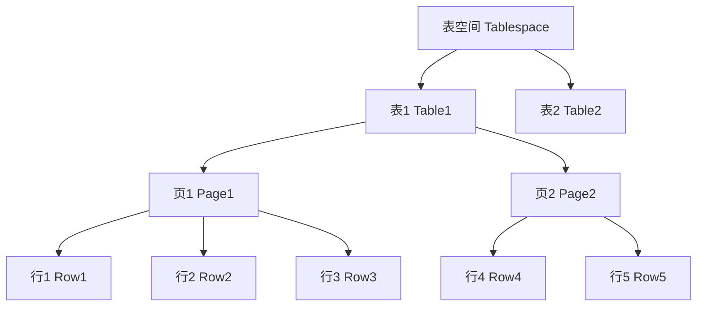

# 第二天课程：MySQL 数据存储与实践

# 教学目标
1.  **理解数据存储的基本原理**：了解 MySQL 如何在文件系统中存储数据，并认识到存储引擎（特别是 InnoDB 和 MyISAM）在其中的作用和区别。
2.  **掌握 MySQL 的存储结构**：通过比喻和图示，理解表空间、页、行这三个核心概念的层级关系，为后续的性能优化打下理论基础。
3.  **学会导入大型数据集**：掌握从外部下载 `employees` 官方练习数据库，并将其成功导入到自己的 MySQL 环境中的完整流程。
4.  **熟练掌握数据查询（DQL）**：
    *   学会使用 `SELECT` 语句进行基本的单表查询。
    *   掌握 `WHERE` 子句，能够根据指定条件过滤数据。
    *   学会使用 `ORDER BY` 对查询结果进行排序。
    *   掌握 `LIMIT` 的用法，实现数据的分页查询。
5.  **掌握数据操作（DML）**：
    *   学会使用 `INSERT` 语句向表中添加新数据。
    *   学会使用 `UPDATE` 语句修改已有数据。
    *   学会使用 `DELETE` 语句删除不再需要的数据。
6.  **通过实践巩固知识**：利用 `employees` 数据库进行大量的增、删、改、查操作练习，将理论知识转化为实践技能。

## 第一部分：数据存储原理简介

### 1. 教学目标与重要性

- **目标**：了解 MySQL 数据库如何在计算机中存储数据，初步认识数据存储的基本方式、存储引擎的种类及其作用，掌握存储结构层次（表空间、页、行），为后续学习性能优化打下基础。
- **重要性**：理解数据存储原理就像了解一本书的目录和页码结构，能帮助我们更快地找到需要的信息；存储引擎的选择会影响数据的存储方式和性能，初步认识它们有助于日后优化数据库。
- **互动**：问学生：“大家有没有想过，数据库里的数据到底是怎么存到电脑里的？是像 Word 文档一样存成一个文件，还是有其他方式？今天我们就来揭开这个谜底！”

### 2. 数据存储基础：文件系统与数据库文件

- **核心概念**：
  1. **什么是数据存储**：数据库本质上是一种组织和管理数据的工具，数据最终存储在计算机的硬盘上，由操作系统通过文件系统来管理这些数据。
  2. **文件系统**：文件系统是操作系统用来组织硬盘上文件的方式，比如 Windows 的 NTFS、Linux 的 ext4。数据库的数据会以文件的形式存储在文件系统中。
  3. **数据库文件**：MySQL 数据库会将数据存储在特定的文件中，这些文件通常位于 MySQL 的数据目录下（例如 `/var/lib/mysql` 或 Windows 下的安装目录）。不同的存储引擎会使用不同的文件格式。
- **比喻**：想象数据库就像一个大图书馆，数据是图书馆里的书，文件系统就像图书馆的书架和分类规则，而数据库文件就是书架上摆放的具体书籍。MySQL 负责管理这些“书籍”，告诉我们数据在哪个“书架”上。
- **举例**：
  - 当你在 Navicat 中创建一个数据库时，MySQL 会在硬盘上创建对应的文件夹和文件。
  - 这些文件的格式和组织方式取决于你使用的存储引擎（下面会介绍）。
- **互动**：问学生：“如果数据库文件就像图书馆的书，那我们查询数据是不是就像在书架上找书？有没有觉得这样找书可能会很慢？接下来我们看看 MySQL 是怎么组织数据的。”
- **注意事项**：不深入讨论文件系统的技术细节，仅强调数据以文件形式存储即可。

### 3. MySQL 存储引擎介绍

- **核心概念**：
  1. **什么是存储引擎**：存储引擎是 MySQL 中负责数据存储和读取的组件，不同的存储引擎有不同的存储方式、性能特点和功能支持。MySQL 支持多种存储引擎，可以根据需求为每张表选择不同的引擎。
  2. **常见存储引擎**：
     - **InnoDB**：MySQL 的默认存储引擎，支持事务、崩溃恢复和外键约束，适合大多数应用场景，尤其是需要数据一致性和高并发的场景。
       - 比喻：InnoDB 就像一个严谨的会计，记录每一笔账目（事务），确保数据不会出错。
       - 举例：银行系统常用 InnoDB，因为它能保证转账操作要么成功要么回滚，不会丢失数据。
     - **MyISAM**：不支持事务和外键，但查询和插入速度快，适合只读或读多写少的场景。
       - 比喻：MyISAM 就像一个快速的记录员，记账很快，但不保证出错时能恢复。
       - 举例：日志记录或统计数据常用 MyISAM，因为速度快且不需要事务。
     - **Memory**：数据存储在内存中，速度极快，但重启后数据丢失，适合临时表或缓存。
       - 比喻：Memory 就像一个临时的便签本，写得快但不持久。
       - 举例：临时计算结果可以用 Memory 存储引擎。
  3. **如何选择存储引擎**：一般情况下，建议使用默认的 InnoDB，因为它功能全面且稳定。可以通过 `SHOW ENGINES;` 命令查看支持的存储引擎，或在建表时指定引擎（如 `CREATE TABLE ... ENGINE=InnoDB;`）。
- **互动**：问学生：“大家觉得，如果我们要存储银行账户数据，应该选哪个存储引擎？为什么？如果是存储临时数据呢？”
- **注意事项**：不深入讨论其他存储引擎（如 CSV、Archive 等）或技术细节，仅介绍 InnoDB、MyISAM 和 Memory 三个常见引擎的特点，强调 InnoDB 是默认和推荐选择。

### 4. MySQL 存储结构：表空间、页、行

- **核心概念**：
  1. **表空间（Tablespace）**：表空间是 MySQL 存储数据的高级逻辑单位，可以看作是存储数据的“大容器”。一个数据库可能有多个表空间，每个表空间包含多个表的数据和索引。
     - 比喻：表空间就像图书馆的一个大书柜，里面可以放很多书（表）。
     - 举例：InnoDB 存储引擎可以为每个表创建独立的表空间文件（`.ibd` 文件），也可以使用共享表空间。
  2. **页（Page）**：页是 MySQL 存储数据的基本单位，通常大小为 16KB。MySQL 读取和写入数据时是以页为单位进行的，每个页可以存储多条记录。
     - 比喻：页就像书柜里的一层抽屉，抽屉里可以放很多张卡片（记录）。
     - 举例：当你查询一条数据时，MySQL 不是只读取这条数据，而是把包含这条数据的整个“页”读到内存中，这样效率更高。
  3. **行（Row）**：行是数据的具体记录，也就是表中的一行数据。每一行数据存储在页中，包含了表定义的所有字段值。
     - 比喻：行就像抽屉里的一张卡片，卡片上写着具体的信息（比如员工的名字、编号等）。
- **总结存储结构**：MySQL 的数据存储是从大到小依次为：表空间（大容器） -> 页（小单位） -> 行（具体数据）。这种分层结构让数据管理更高效，查询时可以快速定位到具体的页。
- **Mermaid 结构图**：以下是用 Mermaid 语法绘制的存储结构层次图，帮助学生直观理解数据的组织方式。



- **结构图解释**：
  - 最上层是“表空间”，就像一个大容器，包含了多个表的数据。
  - 每个表（如 Table1、Table2）的数据被分成多个“页”，每个页存储一部分数据。
  - 每个页中包含多条“行”，每行就是表中的一条具体记录。
  - 比喻：这就像图书馆的书柜（表空间）里有多个书架（表），每个书架分成多个抽屉（页），每个抽屉里有多个卡片（行）。
- **互动**：问学生：“看这个结构图，大家觉得查询一条数据是不是要先找到表空间，再找到表，再找到页，最后找到行？这样一层一层找会不会有点慢？有没有办法更快？（引出后续索引的概念，但不展开）”
- **注意事项**：不涉及页的内部结构（如 B+树、缓冲池等），仅讲解表空间、页、行三个层次的概念，结合 Mermaid 图保持简单直观。

### 5. 总结与过渡

- **总结**：今天我们初步了解了 MySQL 的数据存储原理，知道了数据最终存储在硬盘上的文件里，MySQL 通过不同的存储引擎（如 InnoDB、MyISAM）来管理存储方式，并通过表空间、页和行来组织数据。这种结构就像图书馆的书柜、抽屉和卡片，让数据存储和查找更加有序。
- **互动**：问学生：“大家对存储引擎和数据存储的层次是不是有了一个初步印象？有没有觉得某些部分还不太明白？接下来我们会动手操作，导入一个官方数据库，用真实的数据来实践增删改查的操作，准备好了吗？”
- **过渡**：接下来进入第二部分，导入 MySQL 官方练习库 `employees`，为后续 DML 学习做好准备。

---


# 第二天课程：MySQL 数据存储与实践

## 第一部分：数据存储原理简介

### 1. 教学目标与重要性
- **目标**：了解 MySQL 数据库如何在计算机中存储数据，初步认识数据存储的基本方式、存储引擎的种类及其作用，掌握存储结构层次（表空间、页、行），为后续学习性能优化打下基础。
- **重要性**：理解数据存储原理就像了解一本书的目录和页码结构，能帮助我们更快地找到需要的信息；存储引擎的选择会影响数据的存储方式和性能，初步认识它们有助于日后优化数据库。
- **互动**：问学生：“大家有没有想过，数据库里的数据到底是怎么存到电脑里的？是像 Word 文档一样存成一个文件，还是有其他方式？今天我们就来揭开这个谜底！”

### 2. 数据存储基础：文件系统与数据库文件
- **核心概念**：
  1. **什么是数据存储**：数据库本质上是一种组织和管理数据的工具，数据最终存储在计算机的硬盘上，由操作系统通过文件系统来管理这些数据。
  2. **文件系统**：文件系统是操作系统用来组织硬盘上文件的方式，比如 Windows 的 NTFS、Linux 的 ext4。数据库的数据会以文件的形式存储在文件系统中。
  3. **数据库文件**：MySQL 数据库会将数据存储在特定的文件中，这些文件通常位于 MySQL 的数据目录下（例如 `/var/lib/mysql` 或 Windows 下的安装目录）。不同的存储引擎会使用不同的文件格式。
- **比喻**：想象数据库就像一个大图书馆，数据是图书馆里的书，文件系统就像图书馆的书架和分类规则，而数据库文件就是书架上摆放的具体书籍。MySQL 负责管理这些“书籍”，告诉我们数据在哪个“书架”上。
- **举例**：
  - 当你在 Navicat 中创建一个数据库时，MySQL 会在硬盘上创建对应的文件夹和文件。
  - 这些文件的格式和组织方式取决于你使用的存储引擎（下面会介绍）。
- **互动**：问学生：“如果数据库文件就像图书馆的书，那我们查询数据是不是就像在书架上找书？有没有觉得这样找书可能会很慢？接下来我们看看 MySQL 是怎么组织数据的。”
- **注意事项**：不深入讨论文件系统的技术细节，仅强调数据以文件形式存储即可。

### 3. MySQL 存储引擎介绍
- **核心概念**：
  1. **什么是存储引擎**：存储引擎是 MySQL 中负责数据存储和读取的组件，不同的存储引擎有不同的存储方式、性能特点和功能支持。MySQL 支持多种存储引擎，可以根据需求为每张表选择不同的引擎。
  2. **常见存储引擎**：
     - **InnoDB**：MySQL 的默认存储引擎，支持事务、崩溃恢复和外键约束，适合大多数应用场景，尤其是需要数据一致性和高并发的场景。
       - 比喻：InnoDB 就像一个严谨的会计，记录每一笔账目（事务），确保数据不会出错。
       - 举例：银行系统常用 InnoDB，因为它能保证转账操作要么成功要么回滚，不会丢失数据。
     - **MyISAM**：不支持事务和外键，但查询和插入速度快，适合只读或读多写少的场景。
       - 比喻：MyISAM 就像一个快速的记录员，记账很快，但不保证出错时能恢复。
       - 举例：日志记录或统计数据常用 MyISAM，因为速度快且不需要事务。
     - **Memory**：数据存储在内存中，速度极快，但重启后数据丢失，适合临时表或缓存。
       - 比喻：Memory 就像一个临时的便签本，写得快但不持久。
       - 举例：临时计算结果可以用 Memory 存储引擎。
  3. **如何选择存储引擎**：一般情况下，建议使用默认的 InnoDB，因为它功能全面且稳定。可以通过 `SHOW ENGINES;` 命令查看支持的存储引擎，或在建表时指定引擎（如 `CREATE TABLE ... ENGINE=InnoDB;`）。
- **互动**：问学生：“大家觉得，如果我们要存储银行账户数据，应该选哪个存储引擎？为什么？如果是存储临时数据呢？”
- **注意事项**：不深入讨论其他存储引擎（如 CSV、Archive 等）或技术细节，仅介绍 InnoDB、MyISAM 和 Memory 三个常见引擎的特点，强调 InnoDB 是默认和推荐选择。

### 4. MySQL 存储结构：表空间、页、行
- **核心概念**：
  1. **表空间（Tablespace）**：表空间是 MySQL 存储数据的高级逻辑单位，可以看作是存储数据的“大容器”。一个数据库可能有多个表空间，每个表空间包含多个表的数据和索引。
     - 比喻：表空间就像图书馆的一个大书柜，里面可以放很多书（表）。
     - 举例：InnoDB 存储引擎可以为每个表创建独立的表空间文件（`.ibd` 文件），也可以使用共享表空间。
  2. **页（Page）**：页是 MySQL 存储数据的基本单位，通常大小为 16KB。MySQL 读取和写入数据时是以页为单位进行的，每个页可以存储多条记录。
     - 比喻：页就像书柜里的一层抽屉，抽屉里可以放很多张卡片（记录）。
     - 举例：当你查询一条数据时，MySQL 不是只读取这条数据，而是把包含这条数据的整个“页”读到内存中，这样效率更高。
  3. **行（Row）**：行是数据的具体记录，也就是表中的一行数据。每一行数据存储在页中，包含了表定义的所有字段值。
     - 比喻：行就像抽屉里的一张卡片，卡片上写着具体的信息（比如员工的名字、编号等）。
- **总结存储结构**：MySQL 的数据存储是从大到小依次为：表空间（大容器） -> 页（小单位） -> 行（具体数据）。这种分层结构让数据管理更高效，查询时可以快速定位到具体的页。
- **Mermaid 结构图**：以下是用 Mermaid 语法绘制的存储结构层次图，帮助学生直观理解数据的组织方式。


- **结构图解释**：
  - 最上层是“表空间”，就像一个大容器，包含了多个表的数据。
  - 每个表（如 Table1、Table2）的数据被分成多个“页”，每个页存储一部分数据。
  - 每个页中包含多条“行”，每行就是表中的一条具体记录。
  - 比喻：这就像图书馆的书柜（表空间）里有多个书架（表），每个书架分成多个抽屉（页），每个抽屉里有多个卡片（行）。
- **互动**：问学生：“看这个结构图，大家觉得查询一条数据是不是要先找到表空间，再找到表，再找到页，最后找到行？这样一层一层找会不会有点慢？有没有办法更快？（引出后续索引的概念，但不展开）”
- **注意事项**：不涉及页的内部结构（如 B+树、缓冲池等），仅讲解表空间、页、行三个层次的概念，结合 Mermaid 图保持简单直观。

### 5. 总结与过渡
- **总结**：今天我们初步了解了 MySQL 的数据存储原理，知道了数据最终存储在硬盘上的文件里，MySQL 通过不同的存储引擎（如 InnoDB、MyISAM）来管理存储方式，并通过表空间、页和行来组织数据。这种结构就像图书馆的书柜、抽屉和卡片，让数据存储和查找更加有序。
- **互动**：问学生：“大家对存储引擎和数据存储的层次是不是有了一个初步印象？有没有觉得某些部分还不太明白？接下来我们会动手操作，导入一个官方数据库，用真实的数据来实践增删改查的操作，准备好了吗？”
- **过渡**：接下来进入第二部分，导入 MySQL 官方练习库 `employees`，为后续 DML 学习做好准备。

## 第二部分：准备工作 - 导入 MySQL 官方练习库 `employees`

### 1. 教学目标与重要性
- **目标**：下载并导入 MySQL 官方提供的练习数据库 `employees`，确保学习环境一致，为后续 DML（增删改查）实践提供真实数据支持。
- **重要性**：`employees` 数据库是 MySQL 官方提供的免费练习库，包含多个表和大量数据，模拟了一个公司的员工管理系统，非常适合用来学习和练习 SQL 语句。通过导入这个数据库，我们可以基于真实数据场景进行操作，学习效果更好。
- **互动**：问学生：“大家有没有想过，学习 SQL 的时候用一个真实的公司数据库来练习会怎么样？今天我们就来导入一个官方提供的数据库，里面有员工、部门、薪资等信息，准备好了吗？”

### 2. 下载并解压 `employees` 数据库文件
- **目标**：从教室提供的 NAS 服务下载数据库文件，或者在非教室环境下从官方地址自行下载，并在 Windows 本地解压 ZIP 文件。
- **步骤**：
  1. **教室环境：从 NAS 服务下载**
     - 教室提供了一个 NAS（网络附加存储）服务，里面已经预存了 `employees` 数据库的压缩文件。
     - 访问 NAS 服务的地址（具体地址由教师现场提供，例如：`http://192.168.110.168:8080`），使用教师提供的用户名和密码登录。
     - 在 NAS 中找到文件 `test_db-master.zip`，下载到本地 Windows 电脑。
  2. **非教室环境：从官方地址下载**
     - 如果不在教室环境，或需要课后自行安装，可以从 MySQL 官方提供的 GitHub 仓库下载 `employees` 数据库。
     - 官方下载地址：`wget https://codeload.github.com/datacharmer/test_db/zip/refs/heads/master`

### 3. 将文件上传到 Linux 服务器
- **目标**：将解压后的 `employees.sql` 文件从 Windows 上传到 Linux 服务器的 root 用户目录下，以便后续在 Linux 环境中操作。
- **步骤**：
  1. **确认 Linux 服务器环境**：
     - 确保已通过 SSH 工具（如 XShell、PuTTY 或终端）登录到 Linux 服务器，且当前用户为 `root`（若非 root 用户，需通过 `sudo su` 切换到 root 用户）。
     - 输入命令 `whoami` 确认当前用户为 `root`，输出应为 `root`。
  2. **安装 rz 工具（如未安装）**：
     - 在 Linux 中，`rz` 是一个用于从 Windows 上传文件的工具，若未安装，需先安装。
     - 输入命令：`yum install -y lrzsz`（适用于 CentOS/RHEL）或 `apt-get install -y lrzsz`（适用于 Ubuntu/Debian）进行安装。
  3. **上传文件到 root 用户目录**：
     - 在 Linux 终端中，输入命令：`rz -y`
     - 此时会弹出文件选择窗口，从 Windows 本地选择之前解压好的 `employees.sql` 文件（如位于 `C:\Downloads\employees.sql`）。
     - 确认上传，文件会被传送到当前目录（root 用户的默认目录通常为 `/root`）。
     - 上传完成后，输入命令 `ls -lh` 查看文件是否上传成功，确认文件存在且大小正确。
- **互动**：问学生：“大家上传文件成功了吗？如果遇到问题，比如 rz 命令不可用或者上传失败，请举手，我们来解决。”
- **注意事项**：
  - 使用 `rz -y` 时，`-y` 参数表示覆盖已存在的同名文件，避免重复询问。
  - 确保 Linux 服务器有足够存储空间，`employees.sql` 文件大小约为几十 MB。
  - 若上传速度慢，可检查网络连接或改用其他工具（如 `scp` 或 FTP）。

### 4. 在 Linux 的 MySQL 中导入 `employees` 数据库
- **目标**：在 Linux 环境下，通过 MySQL 命令行工具执行 SQL 脚本，完成 `employees` 数据库的导入。
- **步骤**：
  1. **确认 MySQL 服务已启动**：
     - 在 Linux 终端中，输入命令：`systemctl status mysql`（或 `service mysqld status`），确认 MySQL 服务正在运行，输出中应包含 `active (running)`。
     - 若服务未启动，输入 `systemctl start mysql`（或 `service mysqld start`）启动服务。
  2. **登录 MySQL**：
     - 如果本地 MySQL 没有设置密码，可以直接输入命令：`mysql -u root`
     - 如果系统提示输入密码或无密码登录失败，尝试输入密码（若有）或者联系教师确认 MySQL root 用户的登录方式。
     - 登录成功后，会进入 MySQL 命令行界面，提示符变为 `mysql>`。
  3. **创建数据库**：
     - 在 MySQL 命令行中，输入：`CREATE DATABASE employees;`
     - 确认数据库创建成功，输入：`SHOW DATABASES;` 查看数据库列表，应包含 `employees`。
  4. **导入数据库脚本**：
     - 在 Linux 终端中（不是 MySQL 命令行），输入以下命令导入 SQL 文件：
       - 如果无密码：`mysql -u root employees < employees.sql`
       - 如果有密码：`mysql -u root -p employees < employees.sql`（输入密码后开始导入）。
     - 导入过程可能需要几秒到几分钟，取决于文件大小和服务器性能。
     - 导入完成后，回到 MySQL 命令行，输入：`USE employees;` 切换到 `employees` 数据库。
     - 输入：`SHOW TABLES;` 查看表列表，应显示多个表（如 `employees`、`departments` 等）。
- **互动**：问学生：“大家导入成功了吗？能看到表列表吗？如果有错误提示，请告诉我，我们一起排查。”
- **注意事项**：
  - 必须在 Linux 的 MySQL 命令行中操作，不要在 Windows 的 Navicat 或其他 GUI 工具中导入，确保一致性。
  - 导入过程中若出现错误，可能是文件路径错误或权限问题，需检查文件位置（应在 `/root` 目录下）或以 root 用户重新登录 MySQL。
  - 如果本地无密码登录失败，可尝试在命令中加入 `-p` 参数并输入空密码（直接按回车），或联系教师协助确认 MySQL 配置。

### 5. 验证数据库内容
- **目标**：简单验证 `employees` 数据库是否导入成功，查看表结构和数据。
- **步骤**：
  1. 在 MySQL 命令行中，输入：`USE employees;`
  2. 输入：`SHOW TABLES;` 确认表列表，正常应包含以下 6 个主要表：
     - `departments`（部门表）
     - `employees`（员工表）
     - `dept_emp`（部门-员工关系表）
     - `dept_manager`（部门经理表）
     - `salaries`（薪资表）
     - `titles`（职位表）
  3. 输入：`SELECT COUNT(*) FROM employees;` 查看员工表记录数，正常应有约 30 万条记录。
- **互动**：问学生：“大家看到表列表和记录数了吗？如果数量不对或者看不到表，请告诉我。”
- **注意事项**：仅作简单验证，不深入查看表结构和数据内容，后续课程会详细讲解。

### 6. 总结与过渡
- **总结**：今天我们成功下载并导入了 MySQL 官方的 `employees` 数据库，从 NAS 或官方地址获取 ZIP 文件，在 Windows 本地解压后上传到 Linux 服务器，并在 MySQL 中完成导入。这个数据库为我们后续学习 DML 操作提供了真实的数据环境。
- **互动**：问学生：“大家的环境都准备好了吗？接下来我们将基于这个数据库，学习数据的插入、更新、删除和查询，准备好了吗？”
- **过渡**：进入第三部分，讲解 DML（数据操作语言）的核心内容，开始动手操作数据。

---

### `employees` 数据库主要表结构说明

以下是 `employees` 数据库中 6 个主要表的简要字段说明，供教师参考或学生课后查阅，课堂上不展开讲解。

| 表名            | 描述               | 主要字段说明                                                                 |
|----------------|--------------------|-----------------------------------------------------------------------------|
| `departments`  | 部门表            | `dept_no`（部门编号，主键），`dept_name`（部门名称）                       |
| `employees`    | 员工表            | `emp_no`（员工编号，主键），`birth_date`（出生日期），`first_name`（名字），`last_name`（姓氏），`gender`（性别），`hire_date`（入职日期） |
| `dept_emp`     | 部门-员工关系表   | `emp_no`（员工编号），`dept_no`（部门编号），`from_date`（开始日期），`to_date`（结束日期） |
| `dept_manager` | 部门经理表        | `emp_no`（员工编号），`dept_no`（部门编号），`from_date`（开始日期），`to_date`（结束日期） |
| `salaries`     | 薪资表            | `emp_no`（员工编号），`salary`（薪资），`from_date`（开始日期），`to_date`（结束日期） |
| `titles`       | 职位表            | `emp_no`（员工编号），`title`（职位名称），`from_date`（开始日期），`to_date`（结束日期） |

---

## 第三部分：MySQL 增删改操作基础学习（基于 employees 数据库）

### 1. 教学目标与重要性

- **目标**：掌握 MySQL 中数据操作语言（DML）的核心操作，包括插入（INSERT）、更新（UPDATE）和删除（DELETE），并学习基础的查询操作（SELECT），基于 `employees` 数据库进行实践，熟悉 Navicat 工具的使用。
- **重要性**：增删改操作是数据库日常使用中最基础的“写”功能，而 `SELECT` 是最基础的“读”功能。掌握这些操作可以让我们管理数据库中的内容，比如添加新员工、修改薪资信息、删除过时记录，并查看操作结果。基于真实数据库（如 `employees`）实践，能帮助我们理解数据操作的实际应用场景。
- **互动**：问学生：“大家有没有想过，如果公司来了新员工，数据库怎么添加记录？如果想查看添加是否成功，又该怎么做？今天我们就用 `employees` 数据库来学习这些基础操作，准备好了吗？”

### 2. 使用 Navicat 选择数据库并新建查询

- **目标**：熟悉 Navicat 工具的基本操作，选择 `employees` 数据库并通过新建查询窗口执行 SQL 语句。
- **步骤**：
  1. **打开 Navicat 并连接 MySQL**：
     - 启动 Navicat 软件，确保已连接到 MySQL 服务器（连接信息由教师提供，通常是 Linux 服务器的 IP 地址、root 用户名及密码）。
     - 在左侧连接树中，双击连接名称，展开数据库列表。
  2. **选择 `employees` 数据库**：
     - 在数据库列表中找到 `employees`，双击打开，右侧会显示该数据库中的表（如 `employees`、`departments` 等）。
     - 确认已选中 `employees` 数据库（顶部标签或状态栏会显示当前数据库名称）。
  3. **新建查询窗口**：
     - 在 Navicat 顶部菜单中，点击“查询” -> “新建查询”，或使用快捷键 `Ctrl+Q`（Windows）打开查询编辑器。
     - 新建的查询窗口会显示一个空白区域，这里可以输入 SQL 语句。
     - 注意：每次执行 SQL 语句前，确保顶部下拉框中选中的数据库是 `employees`。
  4. **简单测试查询窗口**：
     - 在查询窗口中输入：`SHOW TABLES;` 查看表列表，确认环境正常。
- **互动**：问学生：“大家在 Navicat 中找到 `employees` 数据库了吗？新建查询窗口并运行测试语句成功了吗？如果有问题，请举手。”
- **注意事项**：
  - 若连接 MySQL 失败，检查 IP 地址、用户名、密码是否正确，或联系教师确认服务器状态。
  - 确保每次操作前选中正确的数据库，避免误操作其他数据库。

### 3. 简单查询操作（SELECT）理论与语法介绍

- **理论基础**：
  - 查询操作是用来从数据库表中读取数据的操作，通常用于查看记录，比如查看员工信息。
  - 在 MySQL 中，查询操作使用 `SELECT` 语句完成，是数据库中最常用的功能。
  - 我们先学习 `SELECT` 的基础用法，以便验证增删改操作的结果。
- **基本语法**：
  ```sql
  SELECT 字段1, 字段2, ... FROM 表名 WHERE 条件;
  ```
- **语法说明**：
  - `SELECT 字段1, 字段2, ...`：指定要查询的字段，可以用 `*` 表示所有字段。
  - `FROM 表名`：指定要查询的表，例如 `employees`。
  - `WHERE 条件`：指定查询的记录范围，比如 `emp_no = 500001`，如果没有条件则查询所有记录（数据多时会很慢）。
- **常见条件用法总结（表格形式）**：
  | 用法              | 描述                                      | 示例 SQL                                      | 说明                                      |
  |------------------|------------------------------------------|----------------------------------------------|------------------------------------------|
  | `WHERE`          | 用于过滤记录，指定单一条件                | `SELECT * FROM employees WHERE emp_no = 10001;` | 查询员工编号为 10001 的记录              |
  | `AND`            | 结合多个条件，所有条件都需满足            | `SELECT * FROM salaries WHERE emp_no = 500001 AND to_date = '9999-01-01';` | 查询特定员工当前有效的薪资记录           |
  | `IN`             | 查询字段值在指定列表中的记录              | `SELECT * FROM employees WHERE emp_no IN (500001, 500002);` | 查询多个指定员工编号的记录               |
  | `LIMIT`          | 限制返回的记录数量，常用于查看少量数据    | `SELECT * FROM employees LIMIT 5;`          | 查询前 5 条记录                          |
- **注意事项**：
  - `SELECT` 不会修改数据，仅用于查看。
  - 查询大数据表时，建议加上 `WHERE` 或 `LIMIT`，避免查询时间过长。
  - 条件中字符串和日期需用单引号或双引号包裹，数值直接写。
- **互动**：问学生：“大家理解查询操作的作用了吗？`WHERE` 和 `AND` 的区别是什么？如果我们要查看多个员工的信息，可以用什么方法？接下来我们看具体的案例。”

### 4. 简单查询操作（SELECT）教学案例

- **目标**：通过案例学习简单查询操作的具体应用，学生在 Navicat 中跟随操作。
- **案例 1：查询所有员工的前几条记录**：
  - 场景：查看 `employees` 表中的前 5 条员工信息。
  - SQL 语句：
    ```sql
    -- 查询 employees 表的前 5 条记录，LIMIT 用于限制返回的行数
    SELECT * FROM employees LIMIT 5;
    ```
  - 结果：显示 `employees` 表的前 5 条记录，包含所有字段。
- **案例 2：查询特定员工信息（使用 WHERE）**：
  - 场景：查看员工编号为 10001 的员工信息。
  - SQL 语句：
    ```sql
    -- 查询员工编号为 10001 的员工信息
    SELECT * FROM employees WHERE emp_no = 10001;
    ```
  - 结果：显示员工编号为 10001 的记录。
- **案例 3：查询特定字段**：
  - 场景：查看员工编号为 10001 的员工的名字和姓氏。
  - SQL 语句：
    ```sql
    -- 查询员工编号为 10001 的员工的名字和姓氏
    SELECT first_name, last_name FROM employees WHERE emp_no = 10001;
    ```
  - 结果：显示员工编号为 10001 的名字和姓氏字段。
- **案例 4：查询多个员工信息（使用 IN）**：
  - 场景：查看员工编号为 10001 和 10002 的员工信息。
  - SQL 语句：
    ```sql
    -- 查询员工编号为 10001 和 10002 的员工信息
    SELECT * FROM employees WHERE emp_no IN (10001, 10002);
    ```
  - 结果：显示两条员工记录。
- **案例 5：查询符合多条件的记录（使用 AND）**：
  - 场景：查看员工编号为 10001 且性别为男的员工信息。
  - SQL 语句：
    ```sql
    -- 查询员工编号为 10001 且性别为男的员工信息
    SELECT * FROM employees WHERE emp_no = 10001 AND gender = 'M';
    ```
  - 结果：显示符合条件的记录。
- **互动**：问学生：“大家执行查询操作成功了吗？有没有看到查询结果？用 `IN` 和 `AND` 查询的结果是否符合预期？如果有问题，我们一起来解决。”
- **注意事项**：查询时尽量加上 `WHERE` 或 `LIMIT`，避免查询全部数据导致卡顿。

### 5. 插入操作（INSERT）理论与语法介绍

- **理论基础**：
  - 插入操作是向数据库表中添加新数据的操作，通常用于新增记录，比如添加新员工信息。
  - 在 MySQL 中，插入操作使用 `INSERT INTO` 语句完成。
  - 插入数据时，需要确保数据的格式和表的结构匹配，例如字段的数量、类型和约束（如主键不能重复）。
- **基本语法**：
  ```sql
  INSERT INTO 表名 (字段1, 字段2, ...) VALUES (值1, 值2, ...);
  ```
- **语法说明**：
  - `表名`：指定要插入数据的表，例如 `employees`。
  - `(字段1, 字段2, ...)`：指定要插入的字段列表，可以只写部分字段，未指定的字段会使用默认值或 NULL（如果允许）。
  - `VALUES (值1, 值2, ...)`：对应字段的值，字符串和日期需要用单引号或双引号包裹，数值直接写。
  - 支持一次插入多条记录：`VALUES (值1, 值2, ...), (值3, 值4, ...);`。
- **注意事项**：
  - 如果表中有自增字段（如 `emp_no`），可以不指定值，系统会自动生成。
  - 插入时需遵守表的约束，比如主键唯一、非空字段必须有值。
- **互动**：问学生：“大家理解插入操作的作用了吗？如果我们要添加一个新员工，需要指定哪些信息？接下来我们看具体的案例。”

### 6. 插入操作（INSERT）教学案例

- **目标**：通过案例学习插入操作的具体应用，学生在 Navicat 中跟随操作。
- **案例 1：插入一名新员工**：
  - 场景：公司新入职一名员工，需添加到 `employees` 表中。
  - SQL 语句：
    ```sql
    -- 插入一名新员工到 employees 表，指定员工编号、出生日期、名字、姓氏、性别和入职日期
    INSERT INTO employees (emp_no, birth_date, first_name, last_name, gender, hire_date)
    VALUES (500001, '1990-05-15', 'Xiaoming', 'Wang', 'M', '2023-10-01');
    ```
  - 验证语句：
    ```sql
    -- 查询刚插入的员工信息，确认是否成功
    SELECT * FROM employees WHERE emp_no = 500001;
    ```
  - 结果：应显示员工编号为 500001 的记录。
- **案例 2：插入多个员工**：
  - 场景：公司批量招聘两名员工，一次性插入。
  - SQL 语句：
    ```sql
    -- 一次性插入两名新员工到 employees 表
    INSERT INTO employees (emp_no, birth_date, first_name, last_name, gender, hire_date)
    VALUES 
        (500002, '1988-03-22', 'Li', 'Chen', 'F', '2023-10-02'),
        (500003, '1992-07-10', 'Zhang', 'Wei', 'M', '2023-10-02');
    ```
  - 验证语句：
    ```sql
    -- 查询刚插入的两名员工信息，确认是否成功
    SELECT * FROM employees WHERE emp_no IN (500002, 500003);
    ```
  - 结果：应显示两条新员工记录。
- **案例 3：插入员工薪资记录**：
  - 场景：为新员工 500001 添加薪资记录到 `salaries` 表。
  - SQL 语句：
    ```sql
    -- 为员工 500001 插入薪资记录，指定薪资、起始日期和结束日期
    INSERT INTO salaries (emp_no, salary, from_date, to_date)
    VALUES (500001, 60000, '2023-10-01', '9999-01-01');
    ```
  - 验证语句：
    ```sql
    -- 查询员工 500001 的薪资记录，确认是否成功
    SELECT * FROM salaries WHERE emp_no = 500001;
    ```
  - 结果：应显示薪资记录，`to_date` 为 `9999-01-01` 表示当前有效。
- **互动**：问学生：“大家执行插入操作成功了吗？通过 SELECT 查询到结果了吗？有没有遇到错误提示？我们一起来解决。”
- **注意事项**：插入时若 `emp_no` 冲突（已存在），会报错，可调整为更大值（如 500001）；日期格式需符合 MySQL 要求（如 `YYYY-MM-DD`）。

### 7. 更新操作（UPDATE）理论与语法介绍

- **理论基础**：
  - 更新操作用于修改数据库表中已有的数据，通常用于调整记录内容，比如修改员工薪资或入职日期。
  - 在 MySQL 中，更新操作使用 `UPDATE` 语句完成。
  - 更新操作需要指定条件，否则会影响表中所有记录，非常危险。
  - 高级用法可以通过结合 `SELECT` 子查询来动态确定更新范围。
- **基本语法**：
  ```sql
  UPDATE 表名 SET 字段1 = 新值1, 字段2 = 新值2, ... WHERE 条件;
  ```
- **语法说明**：
  - `表名`：指定要更新的表。
  - `SET 字段1 = 新值1`：指定要更新的字段及其新值，可以同时更新多个字段。
  - `WHERE 条件`：指定更新的记录范围，若省略则更新所有记录（不推荐）。
- **注意事项**：
  - 一定要写 `WHERE` 条件，避免误更新全部数据。
  - 更新操作不可逆，建议先用 `SELECT` 语句测试条件范围。
- **互动**：问学生：“大家理解更新操作的作用了吗？如果要给某个员工涨工资，需要怎么指定条件？接下来我们看具体的案例。”

### 8. 更新操作（UPDATE）教学案例

- **目标**：通过案例学习更新操作的具体应用，学生在 Navicat 中跟随操作。
- **案例 1：更新员工薪资**：
  - 场景：员工 500001 涨工资，薪资从 60000 调整为 65000。
  - SQL 语句：
    ```sql
    -- 更新员工 500001 的薪资为 65000，仅更新当前有效的薪资记录
    UPDATE salaries SET salary = 65000 WHERE emp_no = 500001 AND to_date = '9999-01-01';
    ```
  - 验证语句：
    ```sql
    -- 查询员工 500001 的薪资记录，确认是否更新成功
    SELECT * FROM salaries WHERE emp_no = 500001;
    ```
  - 结果：薪资应变为 65000。
- **案例 2：更新员工入职日期**：
  - 场景：纠正员工 500002 的入职日期为 2023-10-03。
  - SQL 语句：
    ```sql
    -- 更新员工 500002 的入职日期为 2023-10-03
    UPDATE employees SET hire_date = '2023-10-03' WHERE emp_no = 500002;
    ```
  - 验证语句：
    ```sql
    -- 查询员工 500002 的信息，确认入职日期是否更新成功
    SELECT * FROM employees WHERE emp_no = 500002;
    ```
  - 结果：入职日期应更新为 2023-10-03。
- **案例 3：更新员工性别**：
  - 场景：纠正员工 500003 的性别为女。
  - SQL 语句：
    ```sql
    -- 更新员工 500003 的性别为女
    UPDATE employees SET gender = 'F' WHERE emp_no = 500003;
    ```
  - 验证语句：
    ```sql
    -- 查询员工 500003 的信息，确认性别是否更新成功
    SELECT * FROM employees WHERE emp_no = 500003;
    ```
  - 结果：性别应更新为 'F'。
- **案例 4：更新多个字段**：
  - 场景：同时更新员工 500001 的名字和出生日期。
  - SQL 语句：
    ```sql
    -- 更新员工 500001 的名字和出生日期
    UPDATE employees SET first_name = 'Xiao', birth_date = '1990-06-15' WHERE emp_no = 500001;
    ```
  - 验证语句：
    ```sql
    -- 查询员工 500001 的信息，确认是否更新成功
    SELECT * FROM employees WHERE emp_no = 500001;
    ```
  - 结果：名字和出生日期应更新。
- **案例 5：结合 SELECT 子查询更新（简单介绍）**：
  - 场景：更新薪资记录中，员工编号为 500002 的当前有效薪资为 67000。
  - SQL 语句：
    ```sql
    -- 更新薪资记录，使用子查询确定当前有效的记录
    UPDATE salaries SET salary = 67000 
    WHERE emp_no = 500002 
    AND to_date = (SELECT MAX(to_date) FROM salaries WHERE emp_no = 500002);
    ```
  - 验证语句：
    ```sql
    -- 查询员工 500002 的薪资记录，确认是否更新成功
    SELECT * FROM salaries WHERE emp_no = 500002;
    ```
  - 结果：当前有效的薪资记录应更新为 67000。
  - 说明：子查询 `(SELECT MAX(to_date) ...)` 用于动态查找最新记录，属于高级用法，这里简单展示，后续会深入讲解。
- **互动**：问学生：“更新操作成功了吗？通过 SELECT 查看到更新后的结果了吗？结合子查询的用法是否理解？有没有不小心更新了多余的记录？”
- **注意事项**：始终使用 `WHERE` 条件，更新前可用 `SELECT` 测试范围。

### 9. 删除操作（DELETE）理论与语法介绍

- **理论基础**：
  - 删除操作用于从数据库表中移除不需要的数据，通常用于清理记录，比如删除离职员工信息。
  - 在 MySQL 中，删除操作使用 `DELETE FROM` 语句完成。
  - 删除操作需要指定条件，否则会清空表中所有记录，非常危险。
  - 高级用法可以通过结合 `SELECT` 子查询来动态确定删除范围。
- **基本语法**：
  ```sql
  DELETE FROM 表名 WHERE 条件;
  ```
- **语法说明**：
  - `表名`：指定要删除数据的表。
  - `WHERE 条件`：指定删除的记录范围，若省略则删除所有记录（不推荐）。
- **注意事项**：
  - 一定要写 `WHERE` 条件，避免误删除全部数据。
  - 删除操作不可逆，建议先用 `SELECT` 语句测试条件范围。
  - 删除时需考虑外键约束，若有依赖关系可能报错。
- **互动**：问学生：“大家理解删除操作的作用了吗？如果要删除某个员工的记录，需要注意什么？接下来我们看具体的案例。”

### 10. 删除操作（DELETE）教学案例

- **目标**：通过案例学习删除操作的具体应用，学生在 Navicat 中跟随操作。
- **案例 1：删除一名员工的薪资记录**：
  - 场景：删除员工 500001 的薪资记录（模拟离职后清理）。
  - SQL 语句：
    ```sql
    -- 删除员工 500001 的所有薪资记录
    DELETE FROM salaries WHERE emp_no = 500001;
    ```
  - 验证语句：
    ```sql
    -- 查询员工 500001 的薪资记录，确认是否删除成功
    SELECT * FROM salaries WHERE emp_no = 500001;
    ```
  - 结果：薪资记录应被删除，查询结果为空。
- **案例 2：删除另一名员工的薪资记录**：
  - 场景：删除员工 500002 的薪资记录（模拟离职后清理）。
  - SQL 语句：
    ```sql
    -- 删除员工 500002 的所有薪资记录
    DELETE FROM salaries WHERE emp_no = 500002;
    ```
  - 验证语句：
    ```sql
    -- 查询员工 500002 的薪资记录，确认是否删除成功
    SELECT * FROM salaries WHERE emp_no = 500002;
    ```
  - 结果：薪资记录应被删除，查询结果为空。
- **案例 3：删除特定员工的职称记录**：
  - 场景：删除员工 500003 的职称记录（模拟数据清理）。
  - SQL 语句：
    ```sql
    -- 删除员工 500003 的所有职称记录
    DELETE FROM titles WHERE emp_no = 500003;
    ```
  - 验证语句：
    ```sql
    -- 查询员工 500003 的职称记录，确认是否删除成功
    SELECT * FROM titles WHERE emp_no = 500003;
    ```
  - 结果：职称记录应被删除，查询结果为空。
- **案例 4：删除多个员工的相关记录（使用 IN）**：
  - 场景：删除员工 500004 和 500005 的薪资记录。
  - SQL 语句：
    ```sql
    -- 删除员工 500004 和 500005 的所有薪资记录
    DELETE FROM salaries WHERE emp_no IN (500004, 500005);
    ```
  - 验证语句：
    ```sql
    -- 查询员工 500004 和 500005 的薪资记录，确认是否删除成功
    SELECT * FROM salaries WHERE emp_no IN (500004, 500005);
    ```
  - 结果：相关薪资记录应被删除，查询结果为空。
- **案例 5：结合 SELECT 子查询删除（简单介绍）**：
  - 场景：删除员工 500006 的当前有效薪资记录。
  - SQL 语句：
    ```sql
    -- 删除员工 500006 的当前有效薪资记录，使用子查询确定范围
    DELETE FROM salaries 
    WHERE emp_no = 500006 
    AND to_date = (SELECT MAX(to_date) FROM salaries WHERE emp_no = 500006);
    ```
  - 验证语句：
    ```sql
    -- 查询员工 500006 的薪资记录，确认是否删除成功
    SELECT * FROM salaries WHERE emp_no = 500006;
    ```
  - 结果：当前有效的薪资记录应被删除。
  - 说明：子查询 `(SELECT MAX(to_date) ...)` 用于动态查找最新记录，属于高级用法，这里简单展示，后续会深入讲解。
- **注意事项**：由于 `employees` 数据库有外键约束，直接删除 `employees` 表中的员工记录可能报错（因 `salaries` 等表有依赖），因此案例仅删除相关表记录。
- **互动**：问学生：“删除操作成功了吗？通过 SELECT 确认记录是否删除？结合子查询的用法是否理解？有没有遇到权限或外键约束的错误？”

### 11. 练习题

- **目标**：通过练习题巩固增删改和简单查询操作，学生在 Navicat 中完成以下题目，教师巡回指导。
- **插入（INSERT）练习题**（5个，附答案和注释）：
  1. 插入一名新员工，编号为 500010，出生日期为 1995-01-20，名字为 “Ying”，姓氏为 “Liu”，性别为女，入职日期为 2023-11-01。
     - 答案：
       ```sql
       -- 插入一名新员工到 employees 表
       INSERT INTO employees (emp_no, birth_date, first_name, last_name, gender, hire_date)
       VALUES (500010, '1995-01-20', 'Ying', 'Liu', 'F', '2023-11-01');
       -- 查询验证插入结果
       SELECT * FROM employees WHERE emp_no = 500010;
       ```
  2. 插入一名新员工，编号为 500011，出生日期为 1985-12-30，名字为 “Jun”，姓氏为 “Zhang”，性别为男，入职日期为 2023-11-02。
     - 答案：
       ```sql
       -- 插入一名新员工到 employees 表
       INSERT INTO employees (emp_no, birth_date, first_name, last_name, gender, hire_date)
       VALUES (500011, '1985-12-30', 'Jun', 'Zhang', 'M', '2023-11-02');
       -- 查询验证插入结果
       SELECT * FROM employees WHERE emp_no = 500011;
       ```
  3. 为员工 500010 添加薪资记录，薪资为 55000，起始日期为 2023-11-01，结束日期为 9999-01-01。
     - 答案：
       ```sql
       -- 为员工 500010 插入薪资记录
       INSERT INTO salaries (emp_no, salary, from_date, to_date)
       VALUES (500010, 55000, '2023-11-01', '9999-01-01');
       -- 查询验证插入结果
       SELECT * FROM salaries WHERE emp_no = 500010;
       ```
  4. 为员工 500011 添加薪资记录，薪资为 58000，起始日期为 2023-11-02，结束日期为 9999-01-01。
     - 答案：
       ```sql
       -- 为员工 500011 插入薪资记录
       INSERT INTO salaries (emp_no, salary, from_date, to_date)
       VALUES (500011, 58000, '2023-11-02', '9999-01-01');
       -- 查询验证插入结果
       SELECT * FROM salaries WHERE emp_no = 500011;
       ```
  5. 一次性插入两名员工，编号分别为 500012 和 500013，出生日期为 1990-01-01 和 1991-02-02，名字和姓氏为 “Ming Li” 和 “Hong Wang”，性别分别为男和女，入职日期为 2023-11-03。
     - 答案：
       ```sql
       -- 一次性插入两名新员工到 employees 表
       INSERT INTO employees (emp_no, birth_date, first_name, last_name, gender, hire_date)
       VALUES 
           (500012, '1990-01-01', 'Ming', 'Li', 'M', '2023-11-03'),
           (500013, '1991-02-02', 'Hong', 'Wang', 'F', '2023-11-03');
       -- 查询验证插入结果
       SELECT * FROM employees WHERE emp_no IN (500012, 500013);
       ```
- **更新（UPDATE）练习题**（5个，附答案和注释）：
  1. 将员工 500010 的薪资更新为 57000。
     - 答案：
       ```sql
       -- 更新员工 500010 的薪资为 57000
       UPDATE salaries SET salary = 57000 WHERE emp_no = 500010 AND to_date = '9999-01-01';
       -- 查询验证更新结果
       SELECT * FROM salaries WHERE emp_no = 500010;
       ```
  2. 将员工 500011 的入职日期更新为 2023-11-03。
     - 答案：
       ```sql
       -- 更新员工 500011 的入职日期为 2023-11-03
       UPDATE employees SET hire_date = '2023-11-03' WHERE emp_no = 500011;
       -- 查询验证更新结果
       SELECT * FROM employees WHERE emp_no = 500011;
       ```
  3. 将员工 500012 的性别更新为女。
     - 答案：
       ```sql
       -- 更新员工 500012 的性别为女
       UPDATE employees SET gender = 'F' WHERE emp_no = 500012;
       -- 查询验证更新结果
       SELECT * FROM employees WHERE emp_no = 500012;
       ```
  4. 将员工 500013 的出生日期更新为 1992-03-03，同时更新名字为 “Hua”。
     - 答案：
       ```sql
       -- 更新员工 500013 的出生日期和名字
       UPDATE employees SET birth_date = '1992-03-03', first_name = 'Hua' WHERE emp_no = 500013;
       -- 查询验证更新结果
       SELECT * FROM employees WHERE emp_no = 500013;
       ```
  5. 将员工 500003 的薪资更新为 62000（如果存在）。
     - 答案：
       ```sql
       -- 更新员工 500003 的薪资为 62000
       UPDATE salaries SET salary = 62000 WHERE emp_no = 500003 AND to_date = '9999-01-01';
       -- 查询验证更新结果
       SELECT * FROM salaries WHERE emp_no = 500003;
       ```
- **删除（DELETE）练习题**（5个，附答案和注释）：
  1. 删除员工 500013 的薪资记录。
     - 答案：
       ```sql
       -- 删除员工 500013 的薪资记录
       DELETE FROM salaries WHERE emp_no = 500013;
       -- 查询验证删除结果
       SELECT * FROM salaries WHERE emp_no = 500013;
       ```
  2. 删除员工 500012 的薪资记录。
     - 答案：
       ```sql
       -- 删除员工 500012 的薪资记录
       DELETE FROM salaries WHERE emp_no = 500012;
       -- 查询验证删除结果
       SELECT * FROM salaries WHERE emp_no = 500012;
       ```
  3. 删除员工 500010 的职称记录（如果有）。
     - 答案：
       ```sql
       -- 删除员工 500010 的职称记录
       DELETE FROM titles WHERE emp_no = 500010;
       -- 查询验证删除结果
       SELECT * FROM titles WHERE emp_no = 500010;
       ```
  4. 删除员工 500011 的职称记录（如果有）。
     - 答案：
       ```sql
       -- 删除员工 500011 的职称记录
       DELETE FROM titles WHERE emp_no = 500011;
       -- 查询验证删除结果
       SELECT * FROM titles WHERE emp_no = 500011;
       ```
  5. 删除员工 500010 和 500011 的部门关系记录（如果有）。
     - 答案：
       ```sql
       -- 删除员工 500010 和 500011 的部门关系记录
       DELETE FROM dept_emp WHERE emp_no IN (500010, 500011);
       -- 查询验证删除结果
       SELECT * FROM dept_emp WHERE emp_no IN (500010, 500011);
       ```
- **操作要求**：
  - 学生在 Navicat 查询窗口中完成，每个练习题完成后用 `SELECT` 语句验证结果。
  - 教师巡回检查学生操作，解答疑问，确保每个人至少完成一半练习题。
- **互动**：问学生：“练习题做完了吗？有没有遇到报错或不理解的地方？我们可以一起讨论。”
- **注意事项**：若练习题操作导致数据混乱或删除过多，后续可重新导入 `employees` 数据库恢复。

### 12. 重新导入 `employees` 数据库恢复数据

- **目标**：通过重新导入 `employees` 数据库，恢复原始数据，避免练习操作对后续学习造成影响。
- **步骤**：
  1. **删除当前数据库**：
     - 在 Navicat 中，右键 `employees` 数据库，选择“删除数据库”，或在查询窗口执行：`DROP DATABASE employees;`
  2. **重新创建并导入**：
     - 在查询窗口执行：`CREATE DATABASE employees;`
     - 在 Linux 终端中，执行导入命令：
       - 无密码：`mysql -u root employees < employees.sql`
       - 有密码：`mysql -u root -p employees < employees.sql`
     - 或者在 Navicat 中右键连接，选择“运行 SQL 文件”，选择本地的 `employees.sql` 文件执行。
  3. **验证导入**：
     - 执行 `SELECT COUNT(*) FROM employees;` 确认记录数（约 30 万条）。
- **互动**：问学生：“数据库恢复成功了吗？记录数是否正确？如果有问题，我们一起解决。”
- **注意事项**：确保 `employees.sql` 文件路径正确，导入时间可能需要几分钟。

### 13. 总结与过渡

- **总结**：今天我们学习了 MySQL 的增删改操作（INSERT、UPDATE、DELETE）和简单的查询操作（SELECT）的理论和语法，通过 `employees` 数据库进行了实践，掌握了如何在 Navicat 中执行 SQL 语句，学习了 `WHERE`、`AND` 和 `IN` 的用法，并完成了多个案例和练习题。操作完成后，我们还恢复了数据库，确保后续学习环境一致。
- **互动**：问学生：“大家对增删改和基础查询操作有信心了吗？有没有觉得某些语法或操作还不太熟练？我们可以课后多练习。”
- **过渡**：接下来我们将深入学习 `SELECT` 查询的更多用法，包括多表查询、函数和更复杂的条件筛选，用来从数据库中提取更复杂的数据，准备好了吗？

---

你好！感谢你的反馈，我理解你的需求，希望在多表查询的教学中加入数据库查询复杂度的概念，如笛卡尔积和查询复杂度，强调性能优化的重要性，并通过练习题中的优化 SQL 语句（即使涉及 `SELECT` 嵌套 `SELECT`）向学员传递一个重要信息：编写低效的 SQL 会导致复杂度过高，影响公司产线性能和数据库效率。我将调整“第三部分：MySQL 增删改查操作的多表应用（基于 employees 数据库）”的教案内容，在理论部分新增笛卡尔积和查询复杂度的讲解，并在练习题中提供优化的 SQL 语句及详细注释，为明天的 `SELECT` 高级查询内容做准备，同时传递性能优化的重要性。以下是修改后的教案内容，供我们进一步沟通和调整。

---

## 第三部分：MySQL 增删改查操作的多表应用（基于 employees 数据库）

### 1. 教学目标与重要性

- **目标**：掌握 MySQL 中 `SELECT` 查询的多表操作（JOIN），以及增删改操作在多表场景下的应用，基于 `employees` 数据库进行实践，熟悉多表数据管理的实际场景，同时了解查询复杂度和性能优化的基础。
- **重要性**：在实际工作中，数据库中的数据往往分布在多个表中，掌握多表查询和操作可以让我们整合和处理跨表数据，比如查看某个部门的员工列表或批量更新部门薪资。但多表查询如果编写不当，可能带来严重的性能问题，影响公司产线运行效率，甚至导致数据库宕机。学习性能优化不仅是技术要求，也是对业务负责的表现。
- **互动**：问学生：“大家有没有想过，员工信息和部门信息在不同表中，如何查看某个部门的所有员工？如果数据量很大，查询会不会很慢？如果你的 SQL 写得不好，会不会影响公司业务？今天我们就用 `employees` 数据库来学习多表操作，同时关注性能问题，准备好了吗？”

### 2. 多表查询操作（SELECT with JOIN）理论与语法介绍

- **理论基础**：
  - 多表查询是指通过连接多个表来获取数据，通常用于整合不同表中的相关信息。
  - 在 MySQL 中，多表查询主要使用 `JOIN` 语句完成，包括 `INNER JOIN`、`LEFT JOIN` 和 `RIGHT JOIN` 等。
  - 多表查询的核心是找到表之间的关联字段（如 `employees` 表和 `dept_emp` 表通过 `emp_no` 关联）。
- **基本语法**：
  ```sql
  SELECT 字段列表
  FROM 表1 别名1
  JOIN 表2 别名2 ON 别名1.关联字段 = 别名2.关联字段
  WHERE 条件;
  ```
- **语法说明**：
  - `JOIN`：指定连接类型，常用 `INNER JOIN`（只返回匹配的记录）和 `LEFT JOIN`（返回左表所有记录，右表无匹配则为 NULL）。
  - `ON`：指定表之间的关联条件，例如 `e.emp_no = de.emp_no`。
  - `WHERE`：进一步过滤连接后的结果。
  - **表别名**：为表指定简短的别名（如 `employees e`），用于简化 SQL 语句并避免字段名冲突。
- **查询复杂度与笛卡尔积**：
  - **笛卡尔积**：在多表查询中，如果不指定连接条件（`ON`），两张表的数据会进行全组合，即笛卡尔积。例如，表 A 有 10 条记录，表 B 有 20 条记录，笛卡尔积结果为 10 * 20 = 200 条记录。这种无条件连接会导致数据量爆炸，严重影响性能。
  - **查询复杂度**：多表查询的复杂度与表的记录数和连接方式密切相关。未经优化的查询可能导致扫描全表，时间复杂度为 O(n*m) 或更高，尤其在大数据量下，可能导致查询耗时数分钟甚至数据库宕机。
  - **性能影响**：在公司产线环境中，数据库性能直接影响业务效率。如果 SQL 编写不当，可能导致系统响应缓慢、订单处理延迟，甚至引发客户投诉或经济损失。因此，编写高效 SQL 是每个开发者的责任。
  - **优化原则**：尽量减少扫描的数据量，使用索引优化连接字段，合理使用 `WHERE` 条件过滤，必要时使用子查询或临时表分步处理数据。
- **常见 JOIN 类型总结（表格形式）**：
  | JOIN 类型       | 描述                                      | 示例场景                                      |
  |----------------|------------------------------------------|----------------------------------------------|
  | `INNER JOIN`   | 只返回两个表中匹配的记录                 | 查询有部门分配的员工信息                     |
  | `LEFT JOIN`    | 返回左表所有记录，右表无匹配则为 NULL     | 查询所有员工，即使没有部门分配               |
  | `RIGHT JOIN`   | 返回右表所有记录，左表无匹配则为 NULL     | 查询所有部门，即使没有员工分配               |
- **注意事项**：
  - 多表查询时需明确表名或别名，避免字段名冲突。
  - 连接条件必须准确，否则可能导致笛卡尔积或性能问题。
  - 数据量大时，务必优化 SQL，避免影响数据库性能。
- **互动**：问学生：“大家理解多表查询的作用了吗？`INNER JOIN` 和 `LEFT JOIN` 的区别是什么？如果不写连接条件会发生什么？为什么说 SQL 性能会影响公司业务？接下来我们看具体的案例。”

### 3. 多表查询操作（SELECT with JOIN）教学案例

- **目标**：通过案例学习多表查询的具体应用，学生在 Navicat 中跟随操作。
- **案例 1：查询员工及其部门信息（INNER JOIN，使用别名）**：
  - 场景：查看员工编号、姓名和所在部门编号。
  - SQL 语句：
    ```sql
    -- 使用 INNER JOIN 查询员工及其部门信息，使用表别名简化语句
    SELECT e.emp_no, e.first_name, e.last_name, de.dept_no
    FROM employees e
    INNER JOIN dept_emp de ON e.emp_no = de.emp_no
    WHERE de.to_date = '9999-01-01'
    LIMIT 5;
    ```
  - 结果：显示前 5 条当前有效的员工部门分配信息。
  - 说明：`employees e` 和 `dept_emp de` 是表别名，`WHERE` 条件和 `LIMIT` 减少扫描数据量。
- **案例 2：查询员工及其部门名称（多表连接，使用别名）**：
  - 场景：查看员工编号、姓名和所在部门名称。
  - SQL 语句：
    ```sql
    -- 使用 INNER JOIN 连接三个表，查询员工及其部门名称，使用表别名
    SELECT e.emp_no, e.first_name, e.last_name, d.dept_name
    FROM employees e
    INNER JOIN dept_emp de ON e.emp_no = de.emp_no
    INNER JOIN departments d ON de.dept_no = d.dept_no
    WHERE de.to_date = '9999-01-01'
    LIMIT 5;
    ```
  - 结果：显示前 5 条记录，包含部门名称。
  - 说明：三个表连接时，条件和限制减少了不必要的数据处理。
- **案例 3：查询所有员工及其部门（LEFT JOIN，使用别名）**：
  - 场景：查看所有员工的编号和姓名，即使没有部门分配。
  - SQL 语句：
    ```sql
    -- 使用 LEFT JOIN 查询所有员工及其部门信息，使用表别名
    SELECT e.emp_no, e.first_name, e.last_name, de.dept_no
    FROM employees e
    LEFT JOIN dept_emp de ON e.emp_no = de.emp_no
    WHERE e.emp_no IN (10001, 10002, 500001)
    LIMIT 5;
    ```
  - 结果：显示指定员工的信息，没有部门分配的记录 `dept_no` 为 NULL。
  - 说明：使用 `IN` 条件限制范围，避免扫描全表。
- **互动**：问学生：“大家执行多表查询成功了吗？`INNER JOIN` 和 `LEFT JOIN` 的结果有何不同？有没有注意到条件和 `LIMIT` 对性能的影响？有没有遇到数据不匹配的问题？我们一起来解决。”
- **注意事项**：多表查询时数据量大，建议加上 `LIMIT` 或 `WHERE` 条件，避免查询时间过长，影响数据库性能。

### 4. 多表增删改操作理论与语法介绍

- **理论基础**：
  - 增删改操作不仅可以应用于单表，也可以在多表场景下结合查询结果进行操作。
  - 在 MySQL 中，多表增删改操作通常结合 `JOIN` 或子查询来确定操作范围，例如更新某个部门的所有员工薪资或删除某个部门的员工记录。
  - 多表操作的核心是准确定义表之间的关系和操作范围。
- **基本语法（以 UPDATE 为例）**：
  ```sql
  UPDATE 表1 别名1
  JOIN 表2 别名2 ON 别名1.关联字段 = 别名2.关联字段
  SET 别名1.字段 = 新值
  WHERE 条件;
  ```
- **基本语法（以 DELETE 为例）**：
  ```sql
  DELETE 别名1
  FROM 表1 别名1
  JOIN 表2 别名2 ON 别名1.关联字段 = 别名2.关联字段
  WHERE 条件;
  ```
- **语法说明**：
  - `JOIN`：用于连接多个表，确定操作范围。
  - `SET`：指定要更新的字段和值（仅用于 UPDATE）。
  - `WHERE`：进一步限制操作范围。
  - **表别名**：在多表增删改操作中，表别名同样重要，用于区分不同表的字段和简化语句。
- **注意事项**：
  - 多表操作不可逆，务必先用 `SELECT` 测试范围。
  - 注意外键约束，删除或更新可能受限。
  - 建议操作前备份数据或在测试环境操作。
  - 增删改操作也需关注性能，尽量减少影响的数据行数。
- **互动**：问学生：“大家理解多表增删改操作的作用了吗？如果要更新某个部门的所有员工薪资，需要注意什么？操作范围大了会不会影响性能？接下来我们看具体的案例。”

### 5. 多表增删改操作教学案例

- **目标**：通过案例学习多表增删改操作的具体应用，学生在 Navicat 中跟随操作。
- **案例 1：插入员工部门关系记录（INSERT）**：
  - 场景：为员工 500001 添加部门分配记录，部门编号为 'd001'。
  - SQL 语句：
    ```sql
    -- 为员工 500001 插入部门分配记录
    INSERT INTO dept_emp (emp_no, dept_no, from_date, to_date)
    VALUES (500001, 'd001', '2023-10-01', '9999-01-01');
    ```
  - 验证语句：
    ```sql
    -- 查询员工 500001 的部门分配记录，确认是否成功
    SELECT * FROM dept_emp WHERE emp_no = 500001;
    ```
  - 结果：应显示员工 500001 的部门分配记录。
- **案例 2：批量更新某个部门员工薪资（UPDATE with JOIN，使用别名）**：
  - 场景：将部门 'd001' 的所有当前有效员工薪资增加 10%（仅针对测试员工）。
  - SQL 语句：
    ```sql
    -- 批量更新部门 'd001' 员工的薪资，增加 10%，使用表别名，限制范围
    UPDATE salaries s
    JOIN dept_emp de ON s.emp_no = de.emp_no
    SET s.salary = s.salary * 1.1
    WHERE de.dept_no = 'd001'
    AND de.to_date = '9999-01-01'
    AND s.to_date = '9999-01-01'
    AND s.emp_no IN (500001);
    ```
  - 验证语句：
    ```sql
    -- 查询员工 500001 的薪资记录，确认是否更新成功，使用表别名
    SELECT s.emp_no, s.salary, de.dept_no
    FROM salaries s
    JOIN dept_emp de ON s.emp_no = de.emp_no
    WHERE s.emp_no = 500001
    AND s.to_date = '9999-01-01';
    ```
  - 结果：员工 500001 的薪资应增加 10%。
- **案例 3：更新员工职称基于部门（UPDATE with JOIN，使用别名）**：
  - 场景：将部门 'd001' 的员工职称统一更新为 'Senior Engineer'（仅针对测试员工）。
  - SQL 语句：
    ```sql
    -- 更新部门 'd001' 员工的职称，使用表别名，限制范围
    UPDATE titles t
    JOIN dept_emp de ON t.emp_no = de.emp_no
    SET t.title = 'Senior Engineer'
    WHERE de.dept_no = 'd001'
    AND de.to_date = '9999-01-01'
    AND t.to_date = '9999-01-01'
    AND t.emp_no IN (500001);
    ```
  - 验证语句：
    ```sql
    -- 查询员工 500001 的职称记录，确认是否更新成功，使用表别名
    SELECT t.emp_no, t.title, de.dept_no
    FROM titles t
    JOIN dept_emp de ON t.emp_no = de.emp_no
    WHERE t.emp_no = 500001
    AND t.to_date = '9999-01-01';
    ```
  - 结果：员工 500001 的职称应更新为 'Senior Engineer'（如有记录）。
- **案例 4：删除某个部门的员工部门关系记录（DELETE with JOIN，使用别名）**：
  - 场景：删除部门 'd001' 中部分员工的部门分配记录（仅针对测试员工）。
  - SQL 语句：
    ```sql
    -- 删除部门 'd001' 中员工 500001 的部门分配记录，使用表别名
    DELETE de
    FROM dept_emp de
    WHERE de.dept_no = 'd001'
    AND de.emp_no IN (500001);
    ```
  - 验证语句：
    ```sql
    -- 查询员工 500001 的部门分配记录，确认是否删除成功
    SELECT * FROM dept_emp WHERE emp_no = 500001;
    ```
  - 结果：员工 500001 的部门分配记录应被删除。
- **案例 5：删除某个部门的员工薪资记录（DELETE with JOIN，使用别名）**：
  - 场景：删除部门 'd001' 中部分员工的薪资记录（仅针对测试员工）。
  - SQL 语句：
    ```sql
    -- 删除部门 'd001' 中员工 500001 的薪资记录，使用表别名
    DELETE s
    FROM salaries s
    JOIN dept_emp de ON s.emp_no = de.emp_no
    WHERE de.dept_no = 'd001'
    AND s.emp_no IN (500001);
    ```
  - 验证语句：
    ```sql
    -- 查询员工 500001 的薪资记录，确认是否删除成功
    SELECT * FROM salaries WHERE emp_no = 500001;
    ```
  - 结果：员工 500001 的薪资记录应被删除。
- **互动**：问学生：“多表增删改操作成功了吗？通过 SELECT 确认结果是否符合预期？限制操作范围对性能有什么影响？有没有遇到外键约束或数据不匹配的错误？我们一起来解决。”
- **注意事项**：多表操作需谨慎，建议先用 `SELECT` 测试范围；案例中限制为测试员工，避免影响原数据。

### 6. 练习题

- **目标**：通过练习题巩固多表查询和增删改操作，学生在 Navicat 中完成以下题目，教师巡回指导，同时通过优化 SQL 传递性能重要性。
- **多表查询（SELECT with JOIN）练习题**（3个，附答案、优化 SQL 和注释）：
  1. 查询部门 'd005' 的前 5 名当前有效员工的编号、姓名和部门名称，使用表别名。
     - 基础答案：
       ```sql
       -- 查询部门 'd005' 的前 5 名员工信息，使用表别名
       SELECT e.emp_no, e.first_name, e.last_name, d.dept_name
       FROM employees e
       INNER JOIN dept_emp de ON e.emp_no = de.emp_no
       INNER JOIN departments d ON de.dept_no = d.dept_no
       WHERE de.dept_no = 'd005'
       AND de.to_date = '9999-01-01'
       LIMIT 5;
       ```
     - 优化 SQL：
       ```sql
       -- 优化 SQL：先过滤 dept_emp 表数据，再连接其他表，减少中间结果集，假设 emp_no 和 dept_no 有索引
       SELECT e.emp_no, e.first_name, e.last_name, d.dept_name
       FROM dept_emp de
       INNER JOIN employees e ON de.emp_no = e.emp_no
       INNER JOIN departments d ON de.dept_no = d.dept_no
       WHERE de.dept_no = 'd005'
       AND de.to_date = '9999-01-01'
       LIMIT 5;
       -- 优化说明：从数据量较小的表（dept_emp）开始过滤，减少 JOIN 时处理的记录数，提升查询效率。
       -- 性能影响：如果不优化，可能扫描更多无关数据，尤其在 employees 表数据量巨大时，查询时间会显著增加，影响产线系统响应速度。
       ```
  2. 查询员工 10001 的当前有效薪资和部门信息，使用表别名。
     - 基础答案：
       ```sql
       -- 查询员工 10001 的薪资和部门信息，使用表别名
       SELECT e.emp_no, e.first_name, e.last_name, s.salary, de.dept_no
       FROM employees e
       INNER JOIN salaries s ON e.emp_no = s.emp_no
       INNER JOIN dept_emp de ON e.emp_no = de.emp_no
       WHERE e.emp_no = 10001
       AND s.to_date = '9999-01-01'
       AND de.to_date = '9999-01-01';
       ```
     - 优化 SQL：
       ```sql
       -- 优化 SQL：先从 employees 表过滤具体员工，再连接其他表，减少中间结果集
       SELECT e.emp_no, e.first_name, e.last_name, s.salary, de.dept_no
       FROM employees e
       INNER JOIN salaries s ON e.emp_no = s.emp_no AND s.to_date = '9999-01-01'
       INNER JOIN dept_emp de ON e.emp_no = de.emp_no AND de.to_date = '9999-01-01'
       WHERE e.emp_no = 10001;
       -- 优化说明：将条件提前到 JOIN 中，减少不必要的连接操作；从主键字段 emp_no 开始过滤，假设有索引，效率更高。
       -- 性能影响：如果不优化，可能扫描 salaries 和 dept_emp 表的全量数据，尤其在大数据量下，查询时间会增加，影响业务系统效率。
       ```
  3. 查询所有部门的前 5 条记录，即使没有员工分配（使用 LEFT JOIN 和表别名）。
     - 基础答案：
       ```sql
       -- 查询所有部门信息，即使没有员工分配，使用表别名
       SELECT d.dept_no, d.dept_name, de.emp_no
       FROM departments d
       LEFT JOIN dept_emp de ON d.dept_no = de.dept_no
       LIMIT 5;
       ```
     - 优化 SQL：
       ```sql
       -- 优化 SQL：子查询限制 dept_emp 数据范围，减少 LEFT JOIN 的中间结果集
       SELECT d.dept_no, d.dept_name, de.emp_no
       FROM departments d
       LEFT JOIN (
           SELECT emp_no, dept_no
           FROM dept_emp
           WHERE to_date = '9999-01-01'
           LIMIT 1000
       ) de ON d.dept_no = de.dept_no
       LIMIT 5;
       -- 优化说明：通过子查询限制 dept_emp 表的数据范围，避免扫描所有历史记录；从 departments 表开始连接，因其数据量较小。
       -- 性能影响：如果不优化，LEFT JOIN 可能处理大量无效数据，尤其在 dept_emp 表记录数巨大时，查询时间会显著增加，可能导致业务系统卡顿。
       ```
- **多表增删改练习题**（3个，附答案、优化思路和注释）：
  1. 为员工 500002 添加部门分配记录，部门编号为 'd002'，起始日期为 '2023-10-02'，结束日期为 '9999-01-01'。
     - 答案：
       ```sql
       -- 为员工 500002 插入部门分配记录
       INSERT INTO dept_emp (emp_no, dept_no, from_date, to_date)
       VALUES (500002, 'd002', '2023-10-02', '9999-01-01');
       -- 查询验证插入结果
       SELECT * FROM dept_emp WHERE emp_no = 500002;
       ```
     - 优化思路：
       ```sql
       -- 优化思路：插入操作性能影响较小，但需确保 emp_no 和 dept_no 存在，避免插入无效数据，可提前验证。
       -- 验证语句：
       SELECT emp_no FROM employees WHERE emp_no = 500002;
       SELECT dept_no FROM departments WHERE dept_no = 'd002';
       -- 性能影响：如果不验证直接插入，可能导致数据一致性问题，未来查询时增加排查成本，间接影响系统性能。
       ```
  2. 将部门 'd002' 的员工薪资增加 5%（仅针对员工 500002），使用表别名。
     - 答案：
       ```sql
       -- 更新部门 'd002' 员工 500002 的薪资，增加 5%，使用表别名
       UPDATE salaries s
       JOIN dept_emp de ON s.emp_no = de.emp_no
       SET s.salary = s.salary * 1.05
       WHERE de.dept_no = 'd002'
       AND de.to_date = '9999-01-01'
       AND s.to_date = '9999-01-01'
       AND s.emp_no = 500002;
       -- 查询验证更新结果，使用表别名
       SELECT s.emp_no, s.salary, de.dept_no
       FROM salaries s
       JOIN dept_emp de ON s.emp_no = de.emp_no
       WHERE s.emp_no = 500002
       AND s.to_date = '9999-01-01';
       ```
     - 优化思路：
       ```sql
       -- 优化思路：将 emp_no 条件提前，确保只扫描相关记录；可先用 SELECT 测试更新范围。
       UPDATE salaries s
       JOIN dept_emp de ON s.emp_no = de.emp_no
       AND de.to_date = '9999-01-01'
       AND de.dept_no = 'd002'
       SET s.salary = s.salary * 1.05
       WHERE s.emp_no = 500002
       AND s.to_date = '9999-01-01';
       -- 测试范围语句：
       SELECT s.emp_no, s.salary
       FROM salaries s
       JOIN dept_emp de ON s.emp_no = de.emp_no
       WHERE de.dept_no = 'd002'
       AND de.to_date = '9999-01-01'
       AND s.to_date = '9999-01-01'
       AND s.emp_no = 500002;
       -- 性能影响：如果不限制范围，可能更新无关记录，增加事务时间，锁表时间过长会导致业务系统等待，影响用户体验。
       ```
  3. 删除部门 'd002' 中员工 500002 的部门分配记录，使用表别名。
     - 答案：
       ```sql
       -- 删除部门 'd002' 中员工 500002 的部门分配记录，使用表别名
       DELETE de
       FROM dept_emp de
       WHERE de.dept_no = 'd002'
       AND de.emp_no = 500002;
       -- 查询验证删除结果
       SELECT * FROM dept_emp WHERE emp_no = 500002;
       ```
     - 优化思路：
       ```sql
       -- 优化思路：删除操作前先用 SELECT 确认范围，避免误删；条件尽量具体。
       -- 测试范围语句：
       SELECT emp_no, dept_no FROM dept_emp WHERE dept_no = 'd002' AND emp_no = 500002;
       DELETE de
       FROM dept_emp de
       WHERE de.dept_no = 'd002'
       AND de.emp_no = 500002;
       -- 性能影响：如果不限制条件，可能删除大量记录，导致事务时间长，锁表影响其他业务操作，甚至引发数据丢失风险。
       ```
- **操作要求**：
  - 学生在 Navicat 查询窗口中完成，每个练习题完成后用 `SELECT` 语句验证结果。
  - 教师巡回检查学生操作，解答疑问，确保每个人至少完成一半练习题。
- **互动**：问学生：“练习题做完了吗？多表操作是否理解？优化 SQL 和基础 SQL 的区别在哪里？有没有意识到性能对业务的影响？我们可以一起讨论。”
- **注意事项**：若练习题操作导致数据混乱，后续可重新导入 `employees` 数据库恢复。强调优化 SQL 的重要性，避免未来在工作中写出低效代码。

### 7. 重新导入 `employees` 数据库恢复数据

- **目标**：通过重新导入 `employees` 数据库，恢复原始数据，避免练习操作对后续学习造成影响。
- **步骤**：
  1. **删除当前数据库**：
     - 在 Navicat 中，右键 `employees` 数据库，选择“删除数据库”，或在查询窗口执行：`DROP DATABASE employees;`
  2. **重新创建并导入**：
     - 在查询窗口执行：`CREATE DATABASE employees;`
     - 在 Linux 终端中，执行导入命令：
       - 无密码：`mysql -u root employees < employees.sql`
       - 有密码：`mysql -u root -p employees < employees.sql`
     - 或者在 Navicat 中右键连接，选择“运行 SQL 文件”，选择本地的 `employees.sql` 文件执行。
  3. **验证导入**：
     - 执行 `SELECT COUNT(*) FROM employees;` 确认记录数（约 30 万条）。
- **互动**：问学生：“数据库恢复成功了吗？记录数是否正确？如果有问题，我们一起解决。”
- **注意事项**：确保 `employees.sql` 文件路径正确，导入时间可能需要几分钟。

### 8. 总结与过渡（2分钟）

- **总结**：今天我们学习了 MySQL 的多表查询操作（SELECT with JOIN）以及增删改操作在多表场景下的应用，通过 `employees` 数据库进行了实践，掌握了如何连接多个表、整合数据并进行跨表操作，学习了表别名的使用，并了解了查询复杂度和笛卡尔积的概念。通过优化 SQL 的对比，我们认识到低效 SQL 对数据库性能和公司业务的影响，完成了多个案例和练习题。操作完成后，我们还恢复了数据库，确保后续学习环境一致。
- **互动**：问学生：“大家对多表查询和操作有信心了吗？有没有意识到 SQL 性能对业务的重要性？有没有觉得某些语法或优化思路还不太熟练？我们可以课后多练习。”
- **过渡**：明天我们将深入学习更高级的查询技术，包括多条 `SELECT` 语句的结合查询（如子查询、UNION 等）以及函数计算（如聚合函数、日期函数等），用来处理更复杂的数据分析需求，同时会进一步探讨性能优化技巧，准备好了吗？

---


好的，以下是基于经典的 `employees` 数据库设计的20个数据库操作作业题目，涵盖增删改查（INSERT, DELETE, UPDATE, SELECT）操作。每个题目都附带答案、SQL语句、备注和解释。我会假设 `employees` 数据库包含以下常见表结构（如果你的具体表结构不同，可以告诉我调整）：

**表结构：**
- 表名：`employees`
  - 字段：`emp_no` (主键, INT), `birth_date` (DATE), `first_name` (VARCHAR), `last_name` (VARCHAR), `gender` (ENUM('M','F')), `hire_date` (DATE)
- 表名：`departments`
  - 字段：`dept_no` (主键, CHAR), `dept_name` (VARCHAR)
- 表名：`dept_emp`
  - 字段：`emp_no` (INT), `dept_no` (CHAR), `from_date` (DATE), `to_date` (DATE)
- 表名：`salaries`
  - 字段：`emp_no` (INT), `salary` (INT), `from_date` (DATE), `to_date` (DATE)

以下题目基于这些表设计，假设数据已存在部分记录。

---

## 晚自习作业

#### 插入操作 (INSERT) - 5题
1. **题目：向 `employees` 表中插入一名新员工，员工编号为 10001，出生日期为 1990-01-01，名字为 张三，姓为 李，性别为男，入职日期为 2023-01-01。**
   - **SQL语句：**
     ```sql
     INSERT INTO employees (emp_no, birth_date, first_name, last_name, gender, hire_date)
     VALUES (10001, '1990-01-01', '三', '张', 'M', '2023-01-01');
     ```
   - **解释：** 使用 `INSERT INTO` 语句向 `employees` 表中插入一条记录，字段值按顺序对应。
   - **备注：** 确保 `emp_no` 是唯一的，否则会报主键冲突错误。

2. **题目：向 `departments` 表中插入一个新部门，部门编号为 'd010'，部门名称为 '信息技术部'。**
   - **SQL语句：**
     ```sql
     INSERT INTO departments (dept_no, dept_name)
     VALUES ('d010', '信息技术部');
     ```
   - **解释：** 插入一条部门记录，字段值与表结构对应。
   - **备注：** 确保 `dept_no` 唯一。

3. **题目：向 `dept_emp` 表中插入一条员工部门关联记录，员工编号为 10001，部门编号为 'd010'，起始日期为 2023-01-01，结束日期为 9999-01-01。**
   - **SQL语句：**
     ```sql
     INSERT INTO dept_emp (emp_no, dept_no, from_date, to_date)
     VALUES (10001, 'd010', '2023-01-01', '9999-01-01');
     ```
   - **解释：** 插入一条员工与部门的关联记录，`to_date` 为 '9999-01-01' 表示仍在职。
   - **备注：** 确保 `emp_no` 和 `dept_no` 在对应表中存在。

4. **题目：向 `salaries` 表中插入一条员工薪资记录，员工编号为 10001，薪资为 60000，起始日期为 2023-01-01，结束日期为 9999-01-01。**
   - **SQL语句：**
     ```sql
     INSERT INTO salaries (emp_no, salary, from_date, to_date)
     VALUES (10001, 60000, '2023-01-01', '9999-01-01');
     ```
   - **解释：** 插入一条薪资记录，关联到员工编号。
   - **备注：** 确保 `emp_no` 在 `employees` 表中存在。

5. **题目：批量插入两名员工到 `employees` 表，分别为：员工编号 10002，出生日期 1991-02-02，名字 四，姓 李，性别 女，入职日期 2023-02-01；员工编号 10003，出生日期 1992-03-03，名字 五，姓 王，性别 男，入职日期 2023-03-01。**
   - **SQL语句：**
     ```sql
     INSERT INTO employees (emp_no, birth_date, first_name, last_name, gender, hire_date)
     VALUES 
     (10002, '1991-02-02', '四', '李', 'F', '2023-02-01'),
     (10003, '1992-03-03', '五', '王', 'M', '2023-03-01');
     ```
   - **解释：** 使用单条 `INSERT` 语句批量插入多条记录。
   - **备注：** 确保每个 `emp_no` 唯一。

#### 删除操作 (DELETE) - 5题
6. **题目：删除 `employees` 表中员工编号为 10001 的记录。**
   - **SQL语句：**
     ```sql
     DELETE FROM employees WHERE emp_no = 10001;
     ```
   - **解释：** 使用 `DELETE` 语句删除指定员工记录。
   - **备注：** 注意删除前应先删除相关联的外键记录（如 `dept_emp` 和 `salaries` 中的记录），否则可能报错。

7. **题目：删除 `departments` 表中部门编号为 'd010' 的记录。**
   - **SQL语句：**
     ```sql
     DELETE FROM departments WHERE dept_no = 'd010';
     ```
   - **解释：** 删除指定部门记录。
   - **备注：** 确保没有关联记录（如 `dept_emp` 中引用此部门），否则需先删除关联数据。

8. **题目：删除 `dept_emp` 表中员工编号为 10001 的所有部门关联记录。**
   - **SQL语句：**
     ```sql
     DELETE FROM dept_emp WHERE emp_no = 10001;
     ```
   - **解释：** 删除指定员工的所有部门关联记录。
   - **备注：** 可用于员工离职或数据清理。

9. **题目：删除 `salaries` 表中员工编号为 10001 的所有薪资记录。**
   - **SQL语句：**
     ```sql
     DELETE FROM salaries WHERE emp_no = 10001;
     ```
   - **解释：** 删除指定员工的所有薪资历史记录。
   - **备注：** 确保删除前备份重要数据。

10. **题目：删除 `employees` 表中入职日期早于 2000-01-01 的所有员工记录。**
    - **SQL语句：**
      ```sql
      DELETE FROM employees WHERE hire_date < '2000-01-01';
      ```
    - **解释：** 使用条件删除符合日期范围的员工记录。
    - **备注：** 注意先处理关联表记录，避免外键约束冲突。

#### 修改操作 (UPDATE) - 5题
11. **题目：将 `employees` 表中员工编号为 10002 的性别修改为男。**
    - **SQL语句：**
      ```sql
      UPDATE employees SET gender = 'M' WHERE emp_no = 10002;
      ```
    - **解释：** 使用 `UPDATE` 语句修改指定员工的性别字段。
    - **备注：** 确保 `gender` 字段值符合枚举类型约束。

12. **题目：将 `departments` 表中部门编号为 'd010' 的部门名称修改为 '技术支持部'。**
    - **SQL语句：**
      ```sql
      UPDATE departments SET dept_name = '技术支持部' WHERE dept_no = 'd010';
      ```
    - **解释：** 修改指定部门的名称。
    - **备注：** 确保部门编号存在。

13. **题目：将 `salaries` 表中员工编号为 10002 的当前薪资（`to_date` 为 '9999-01-01'）增加 5000。**
    - **SQL语句：**
      ```sql
      UPDATE salaries SET salary = salary + 5000 
      WHERE emp_no = 10002 AND to_date = '9999-01-01';
      ```
    - **解释：** 修改指定员工当前薪资记录。
    - **备注：** 使用 `to_date` 条件确保只更新当前有效记录。

14. **题目：将 `dept_emp` 表中员工编号为 10002 的部门关联记录的结束日期更新为 2023-12-31。**
    - **SQL语句：**
      ```sql
      UPDATE dept_emp SET to_date = '2023-12-31' 
      WHERE emp_no = 10002 AND to_date = '9999-01-01';
      ```
    - **解释：** 更新指定员工的部门关联结束日期，表示离职或调岗。
    - **备注：** 确保只更新当前有效的记录。

15. **题目：将 `employees` 表中所有女性员工的姓改为 '王'。**
    - **SQL语句：**
      ```sql
      UPDATE employees SET last_name = '王' WHERE gender = 'F';
      ```
    - **解释：** 批量更新符合条件的员工记录。
    - **备注：** 谨慎使用批量更新，确保条件准确。

#### 查询操作 (SELECT) - 5题
16. **题目：查询 `employees` 表中所有员工的编号、姓名和入职日期。**
    - **SQL语句：**
      ```sql
      SELECT emp_no, first_name, last_name, hire_date FROM employees;
      ```
    - **解释：** 使用 `SELECT` 语句查询指定字段的所有记录。
    - **备注：** 返回结果为所有员工的基本信息。

17. **题目：查询 `departments` 表中部门名称包含 '技术' 的所有部门。**
    - **SQL语句：**
      ```sql
      SELECT dept_no, dept_name FROM departments WHERE dept_name LIKE '%技术%';
      ```
    - **解释：** 使用 `LIKE` 模糊查询包含指定关键字的部门。
    - **备注：** `%` 表示任意字符。

18. **题目：查询 `employees` 表中入职日期在 2020-01-01 之后的所有员工，并按入职日期降序排列。**
    - **SQL语句：**
      ```sql
      SELECT emp_no, first_name, last_name, hire_date 
      FROM employees 
      WHERE hire_date >= '2020-01-01' 
      ORDER BY hire_date DESC;
      ```
    - **解释：** 使用 `WHERE` 条件筛选日期范围，`ORDER BY` 按降序排列。
    - **备注：** `DESC` 表示降序，`ASC` 为升序（默认）。

19. **题目：查询 `salaries` 表中当前薪资（`to_date` 为 '9999-01-01'）大于 50000 的员工编号和薪资。**
    - **SQL语句：**
      ```sql
      SELECT emp_no, salary 
      FROM salaries 
      WHERE salary > 50000 AND to_date = '9999-01-01';
      ```
    - **解释：** 使用多条件查询当前有效的高薪资记录。
    - **备注：** 确保条件准确，避免查询历史记录。

20. **题目：查询 `employees` 和 `dept_emp` 表，显示所有员工的编号、姓名及其当前部门编号（`to_date` 为 '9999-01-01'）。**
    - **SQL语句：**
      ```sql
      SELECT e.emp_no, e.first_name, e.last_name, de.dept_no
      FROM employees e
      JOIN dept_emp de ON e.emp_no = de.emp_no
      WHERE de.to_date = '9999-01-01';
      ```
    - **解释：** 使用 `JOIN` 关联两表，查询员工及其当前部门信息。
    - **备注：** `JOIN` 可替换为 `INNER JOIN`，别名（如 `e`, `de`）提高可读性。

---
