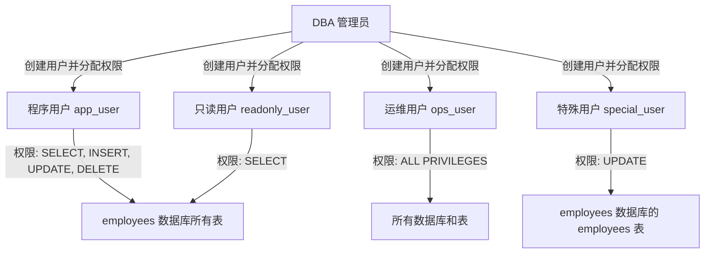
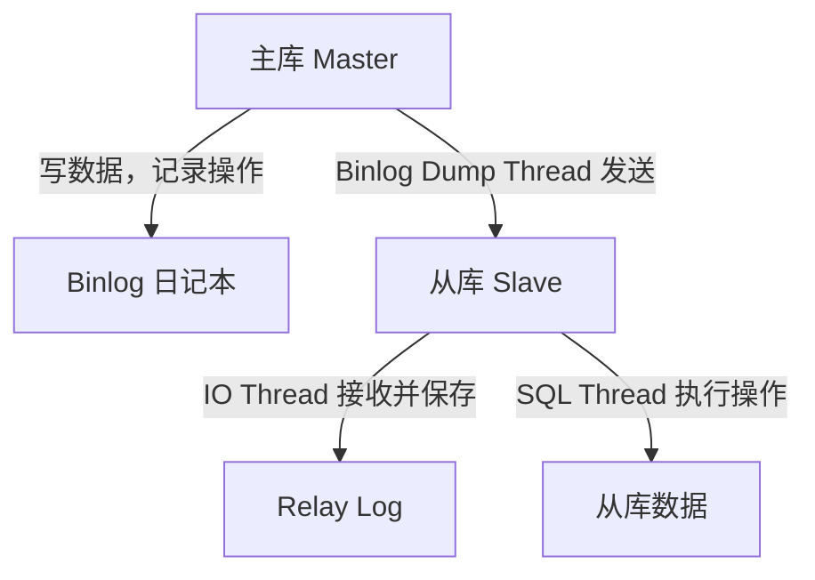

# **MySQL 核心技术：用户权限管理、Binlog、主从同步与读写分离**

---
## **学习目标**

1. **MySQL 用户权限管理**：能够创建用户、分配权限、撤销权限，并理解企业场景中的权限分配逻辑。
2. **Binlog 理论**：理解 Binlog 的作用、工作原理及其在数据恢复和主从同步中的重要性。
3. **主从同步**：掌握 MySQL 主从同步的配置步骤，理解一主两从架构的实现方式。
4. **读写分离**：了解读写分离的概念及其在企业中的应用，掌握如何通过中间件实现。
5. **Mycat 部署**：初步掌握 Mycat 的安装与配置，理解其在读写分离和分库分表中的作用。

---

## **第一部分：MySQL 用户权限管理（语法结构详细教学）**

### **目标：**
掌握 MySQL 用户权限管理的基本语法，理解每条命令的结构和含义，能够根据需求创建用户并分配权限。

### **一、权限管理相关语法的详细讲解**
在 MySQL 中，权限管理主要涉及以下核心 SQL 语句：`CREATE USER`、`GRANT`、`REVOKE`、`SHOW GRANTS`、`DROP USER` 和 `FLUSH PRIVILEGES`。下面逐一拆解它们的语法结构，说明每个部分的作用和可选值。

#### **1. CREATE USER 语法（创建用户）**
**语法结构：**
```sql
CREATE USER '用户名'@'主机名' IDENTIFIED BY '密码';
```
**结构拆解与说明：**
- **`'用户名'`**：你要创建的用户的名称，比如 `app_user`。可取值：任意字符串，通常是字母、数字或下划线的组合，区分大小写。示例：`'app_user'`、`'readonly_user'`。
- **`'@主机名'`**：指定用户可以从哪个主机登录。可取值：`'localhost'`（只能本地登录）、`'%'`（可以从任何主机登录）、特定 IP 或域名（如 `'192.168.1.100'`）。示例：`'@localhost'`、`'@%'`。
- **`IDENTIFIED BY '密码'`**：设置用户的登录密码。可取值：任意字符串，建议使用强密码（包含字母、数字、特殊字符）。示例：`'admin123'`。

**完整示例：**
```sql
CREATE USER 'app_user'@'%' IDENTIFIED BY 'admin123';
```
**解释：** 创建一个名为 `app_user` 的用户，可以从任何主机（`%`）登录，密码是 `admin123`。

**MySQL 8.0 注意事项：** MySQL 8.0 默认使用 `caching_sha2_password` 认证插件，如果客户端不支持可能会出现警告或连接错误。若需兼容旧客户端，可在创建用户时指定旧插件：
```sql
CREATE USER 'app_user'@'%' IDENTIFIED WITH 'mysql_native_password' BY 'admin123';
```

#### **2. GRANT 语法（授权）**
**语法结构：**
```sql
GRANT 权限类型 [, 权限类型 ...] 
ON 数据库名.表名 
TO '用户名'@'主机名' 
[WITH GRANT OPTION];
```
**结构拆解与说明：**
- **`GRANT 权限类型 [, 权限类型 ...]`**：指定要赋予用户的权限，可以是单个或多个权限（用逗号分隔）。可取值：`SELECT`（查询）、`INSERT`（插入）、`UPDATE`（更新）、`DELETE`（删除）、`CREATE`（创建）、`DROP`（删除）、`ALL PRIVILEGES`（所有权限，谨慎使用）。示例：`SELECT, INSERT, UPDATE` 或 `ALL PRIVILEGES`。
- **`ON 数据库名.表名`**：指定权限作用的范围，即用户可以操作哪些数据库或表。可取值：`数据库名.*`（某数据库所有表，如 `employees.*`）、`数据库名.表名`（特定表，如 `employees.employees`）、`*.*`（所有数据库和表）。示例：`employees.*`、`*.*`。
- **`TO '用户名'@'主机名'`**：指定将权限赋予哪个用户。可取值：与 `CREATE USER` 中定义的用户名和主机名一致。示例：`'app_user'@'%'`。
- **`[WITH GRANT OPTION]`**（可选）：允许该用户将自己拥有的权限再授予其他用户，通常只给管理员用户。示例：`WITH GRANT OPTION`。

**完整示例：**
```sql
GRANT SELECT, INSERT, UPDATE, DELETE 
ON employees.* 
TO 'app_user'@'%';
```
**解释：** 给用户 `app_user`（可从任何主机登录）赋予对 `employees` 数据库所有表的查询、插入、更新和删除权限。

#### **3. REVOKE 语法（撤销权限）**
**语法结构：**
```sql
REVOKE 权限类型 [, 权限类型 ...] 
ON 数据库名.表名 
FROM '用户名'@'主机名';
```
**结构拆解与说明：**
- **`REVOKE 权限类型 [, 权限类型 ...]`**：指定要撤销的权限，可以是单个或多个权限。可取值：与 `GRANT` 中的权限类型一致。示例：`DELETE` 或 `SELECT, INSERT`。
- **`ON 数据库名.表名`**：指定权限作用范围，与 `GRANT` 一致。可取值：`employees.*`、`*.*` 等。示例：`employees.*`。
- **`FROM '用户名'@'主机名'`**：指定要撤销权限的用户。可取值：与 `CREATE USER` 中定义的用户名和主机名一致。示例：`'app_user'@'%'`。

**完整示例：**
```sql
REVOKE DELETE 
ON employees.* 
FROM 'app_user'@'%';
```
**解释：** 撤销用户 `app_user` 对 `employees` 数据库所有表的删除权限。

#### **4. SHOW GRANTS 语法（查看权限）**
**语法结构：**
```sql
SHOW GRANTS FOR '用户名'@'主机名';
```
**结构拆解与说明：**
- **`SHOW GRANTS FOR '用户名'@'主机名'`**：查看指定用户的权限列表。可取值：与 `CREATE USER` 中定义的用户名和主机名一致。示例：`'app_user'@'%'`。

**完整示例：**
```sql
SHOW GRANTS FOR 'app_user'@'%';
```
**解释：** 查看用户 `app_user`（可从任何主机登录）的所有权限。

#### **5. DROP USER 语法（删除用户）**
**语法结构：**
```sql
DROP USER '用户名'@'主机名';
```
**结构拆解与说明：**
- **`DROP USER '用户名'@'主机名'`**：删除指定的用户账户。可取值：与 `CREATE USER` 中定义的用户名和主机名一致。示例：`'app_user'@'%'`。

**完整示例：**
```sql
DROP USER 'app_user'@'%';
```
**解释：** 删除用户 `app_user`（可从任何主机登录）的账户。

#### **6. FLUSH PRIVILEGES 语法（刷新权限）**
**语法结构：**
```sql
FLUSH PRIVILEGES;
```
**说明：**
- 含义：刷新权限表，确保权限变更立即生效。
- 使用场景：每次执行 `GRANT` 或 `REVOKE` 后，建议运行此命令。

**完整示例：**
```sql
FLUSH PRIVILEGES;
```
**解释：** 刷新权限设置，确保之前的权限变更（如 `GRANT` 或 `REVOKE`）生效。

---

### **二、权限分配总结表格**
以下表格总结了计划创建的各用户的权限范围，方便快速理解企业场景中的权限分配逻辑。

| 用户名            | 主机       | 权限范围                | 具体权限                          | 备注                              |
|------------------|-----------|------------------------|----------------------------------|----------------------------------|
| app_user         | %         | employees.*            | SELECT, INSERT, UPDATE, DELETE   | 程序用户，应用操作数据库         |
| readonly_user    | %         | employees.*            | SELECT                           | 只读用户，仅用于查询和报表       |
| ops_user         | %         | *.*                    | ALL PRIVILEGES                   | 运维用户，最大权限，可管理结构   |
| special_user     | %         | employees.employees    | UPDATE                           | 特殊用户，仅对 employees 表更新  |

**解释：**
- 每个用户的权限范围和具体权限都根据角色需求设计，确保权限最小化原则（只分配必要权限）。
- 运维用户有 `WITH GRANT OPTION`，可以再授权他人，适合管理场景。

---

### **三、Mermaid 图详细解释权限逻辑**
为了直观展示权限分配，我用 Mermaid 图展示用户与数据库的关系，并标注权限范围。



**图解说明：**
- **DBA 管理员**：负责创建所有用户并分配权限。
- **程序用户（app_user）**：拥有对 `employees` 数据库所有表的增删改查权限，适合应用程序使用。
- **只读用户（readonly_user）**：只能查询 `employees` 数据库的所有表，适合数据分析。
- **运维用户（ops_user）**：拥有最大权限，可以操作所有数据库和表，适合管理任务。
- **特殊用户（special_user）**：只能更新 `employees` 数据库中的 `employees` 表，适合临时特定任务。

---

### **四、实践与复习：创建用户并测试权限（结合 employees 数据库）**
现在我们已经掌握了权限管理的理论知识，接下来通过实践巩固学习内容。以 `employees` 数据库为例，创建上述用户并分配权限，同时结合昨天学习的增删改查操作进行测试，验证权限是否正确生效。

#### **步骤 1：创建用户并分配权限**
以下是完整的 SQL 脚本，适用于 MySQL 8.0，默认使用 `caching_sha2_password` 认证插件。如果遇到客户端兼容性问题，可在 `IDENTIFIED BY` 前添加 `IDENTIFIED WITH 'mysql_native_password'`。

```sql
-- 创建程序用户，允许从任何主机登录，密码为 admin123
CREATE USER 'app_user'@'%' IDENTIFIED WITH caching_sha2_password BY 'admin123';
-- 创建只读用户，允许从任何主机登录，密码为 admin123
CREATE USER 'readonly_user'@'%' IDENTIFIED WITH caching_sha2_password BY 'admin123';
-- 创建运维用户，允许从任何主机登录，密码为 admin123
CREATE USER 'ops_user'@'%' IDENTIFIED WITH caching_sha2_password BY 'admin123';
-- 创建特殊用户，允许从任何主机登录，密码为 admin123
CREATE USER 'special_user'@'%' IDENTIFIED WITH caching_sha2_password BY 'admin123';

-- 程序用户：对 employees 数据库的所有表有增删改查权限
GRANT SELECT, INSERT, UPDATE, DELETE 
ON employees.* 
TO 'app_user'@'%';

-- 只读用户：只对 employees 数据库有查询权限
GRANT SELECT 
ON employees.* 
TO 'readonly_user'@'%';

-- 运维用户：拥有所有权限，包括结构管理
GRANT ALL PRIVILEGES 
ON *.* 
TO 'ops_user'@'%' 
WITH GRANT OPTION;

-- 特殊用户：只对 employees 数据库的 employees 表有更新权限
GRANT UPDATE 
ON employees.employees 
TO 'special_user'@'%';

-- 刷新权限，确保变更立即生效
FLUSH PRIVILEGES;
```

**解释：** 以上脚本创建了四个不同角色的用户，并根据需求分配了权限。`FLUSH PRIVILEGES` 确保权限设置立即生效。

#### **步骤 2：查看权限验证**
执行以下命令，查看各用户的权限是否正确分配：
```sql
SHOW GRANTS FOR 'app_user'@'%';
SHOW GRANTS FOR 'readonly_user'@'%';
SHOW GRANTS FOR 'ops_user'@'%';
SHOW GRANTS FOR 'special_user'@'%';
```

**解释：** 通过 `SHOW GRANTS` 命令，可以确认每个用户的权限是否与表格中规划的一致。

#### **步骤 3：结合增删改查测试权限（复习昨天内容）**
现在使用不同用户登录 `employees` 数据库，执行增删改查操作，测试权限是否生效。以下是测试建议和预期结果：

1. **使用 app_user 登录测试（权限：SELECT, INSERT, UPDATE, DELETE）**
   - 登录：使用 `app_user` 用户和密码 `admin123` 登录。
   - 测试操作：
     ```sql
     USE employees;
     SELECT * FROM employees LIMIT 5; -- 预期：成功，允许查询
     INSERT INTO departments (dept_no, dept_name) VALUES ('d010', 'Test Dept'); -- 预期：成功，允许插入
     UPDATE employees SET first_name = 'Test' WHERE emp_no = 10001; -- 预期：成功，允许更新
     DELETE FROM departments WHERE dept_no = 'd010'; -- 预期：成功，允许删除
     ```
   - 解释：`app_user` 拥有对 `employees` 数据库所有表的增删改查权限，所有操作都应成功。

2. **使用 readonly_user 登录测试（权限：SELECT）**
   - 登录：使用 `readonly_user` 用户和密码 `admin123` 登录。
   - 测试操作：
     ```sql
     USE employees;
     SELECT * FROM employees LIMIT 5; -- 预期：成功，允许查询
     INSERT INTO departments (dept_no, dept_name) VALUES ('d011', 'Test Dept'); -- 预期：失败，无插入权限
     ```
   - 解释：`readonly_user` 只有查询权限，插入操作会失败，提示无权限。

3. **使用 special_user 登录测试（权限：UPDATE，仅限 employees 表）**
   - 登录：使用 `special_user` 用户和密码 `admin123` 登录。
   - 测试操作：
     ```sql
     USE employees;
     UPDATE employees SET first_name = 'SpecialTest' WHERE emp_no = 10001; -- 预期：成功，允许更新 employees 表
     UPDATE departments SET dept_name = 'Test' WHERE dept_no = 'd001'; -- 预期：失败，无权限更新 departments 表
     SELECT * FROM employees LIMIT 5; -- 预期：失败，无查询权限
     ```
   - 解释：`special_user` 只有对 `employees` 表的更新权限，其他操作会失败。

4. **使用 ops_user 登录测试（权限：ALL PRIVILEGES）**
   - 登录：使用 `ops_user` 用户和密码 `admin123` 登录（注意：只能本地登录）。
   - 测试操作：
     ```sql
     USE employees;
     CREATE TABLE test_table (id INT); -- 预期：成功，允许创建表
     DROP TABLE test_table; -- 预期：成功，允许删除表
     ```
   - 解释：`ops_user` 拥有所有权限，所有操作都应成功。

**实践目标：** 通过以上测试，不仅可以验证权限分配是否正确，还能复习昨天学习的增删改查操作，熟悉 SQL 语句的实际应用。

#### **步骤 4：权限调整测试**
尝试撤销某个用户的部分权限，并验证效果。例如：
```sql
REVOKE DELETE 
ON employees.* 
FROM 'app_user'@'%';
FLUSH PRIVILEGES;
```
- 解释：撤销 `app_user` 的删除权限，再次登录后尝试删除操作，应提示无权限。
- 验证：使用 `SHOW GRANTS FOR 'app_user'@'%';` 查看权限是否已更新。

---

## **第二部分 MySQL Binlog 理论与配置优化**

### **Binlog 理论深度解析**

#### **1.1 Binlog 的定义与作用**
**定义：** Binlog（Binary Log，二进制日志）是 MySQL 数据库的一种日志机制，以二进制格式记录所有对数据库产生变更的操作，包括数据操作（如 INSERT、UPDATE、DELETE）和结构操作（如 CREATE TABLE、ALTER TABLE）。它不记录纯查询操作（如 SELECT），只关注对数据库有实际影响的变更。

**作用：**
- **数据恢复：** Binlog 记录了数据库的操作历史，可用于恢复误删除的数据或回滚到特定时间点（Point-in-Time Recovery, PITR）。
- **主从同步：** Binlog 是主从复制的核心机制，主库通过 Binlog 将变更传递给从库，确保数据一致性。
- **审计与分析：** Binlog 可用于追踪数据库操作历史，适用于安全审计或问题排查。

**类比解释：** Binlog 就像一个“操作日记本”，记录了数据库每一次的“修改动作”。如果数据丢失，我们可以通过重放“日记本”中的记录来恢复数据；在主从架构中，从库就像一个“抄写员”，不断抄写主库的“日记本”，从而保持数据同步。这种类比可以帮助您理解 Binlog 的本质：它是数据库变更的“历史记录”，也是数据传递的“通信工具”。

#### **1.2 Binlog 的工作原理**
Binlog 的工作机制是理解其作用的基础，尤其对后续学习至关重要。

- **操作记录过程：** 当 MySQL 执行写操作并提交事务时，数据库引擎会将操作详情写入 Binlog 文件。记录内容包括操作类型、目标表、具体数据变更、时间戳、事务 ID 等，以二进制格式存储。
- **顺序追加：** Binlog 文件按时间顺序记录操作，形成一个连续的日志流。每个操作在文件中有一个唯一的位置（Position），用于标识和定位。
- **文件切换：** Binlog 文件会根据大小上限或手动刷新（如 `FLUSH LOGS` 命令）生成新文件，文件名通常为 `mysql-bin.000001`、`mysql-bin.000002` 等。

**类比解释：** Binlog 的工作原理就像一个“流水账”，每笔交易（数据库操作）都按顺序记录在账本上，每条记录都有一个编号（Position）。当账本写满时，会换一本新的账本继续记录（文件切换）。这种顺序性和连续性保证了操作不会丢失或错乱，为数据恢复和后续应用提供了可靠基础。

**案例：** 在 `employees` 数据库中执行以下操作：
```sql
INSERT INTO employees (emp_no, first_name, last_name) VALUES (999999, 'Test', 'User');
```
- 该操作在事务提交时写入 Binlog，记录内容包括操作类型（INSERT）、目标表（employees）、插入数据等，位置信息可能是 `mysql-bin.000001` 文件的 Position 1200。

#### **1.3 Binlog 的三种格式**
Binlog 支持三种记录格式，直接影响日志大小和性能：
- **Statement 模式（基于语句）：**
  - 记录原始的 SQL 语句，如 `INSERT INTO employees VALUES (999999, 'Test', 'User');`。
  - 优点：日志文件小，写入性能高。
  - 缺点：某些情况下（如 SQL 中包含随机函数或触发器）可能导致数据不一致。
- **Row 模式（基于行）：**
  - 记录每一行数据的具体变更，如某行数据的字段值从旧值变为新值。
  - 优点：准确性高，确保数据一致，即使有随机函数也能正确复制。
  - 缺点：日志文件较大，写入性能稍低。
  - 备注：MySQL 5.7 及以上默认使用此模式，推荐使用。
- **Mixed 模式（混合模式）：**
  - 结合 Statement 和 Row 模式，根据操作类型选择记录方式。
  - 优点：兼顾性能和准确性。
  - 缺点：配置和排查复杂，不如 Row 模式直观。

**类比解释：** Statement 模式就像记录“做菜的指令”（如“加一勺盐”），简单但可能因环境不同导致结果不一致；Row 模式就像记录“每一步的具体结果”（如“盐加了 5 克”），更精确但记录内容多；Mixed 模式则是两者的混合，根据情况选择记录方式。推荐使用 Row 模式，因为它就像“精确的实验记录”，确保结果一致。

**结论：** 在大多数场景中，建议使用 **Row 模式**，以保证数据准确性。

---

### **Binlog 配置与优化实践**

#### **2.1 启用 Binlog**
编辑 MySQL 配置文件（如 `/etc/my.cnf` 或 `/etc/mysql/my.cnf`），在 `[mysqld]` 部分添加以下配置：
```ini
[mysqld]
log_bin = /var/log/mysql/mysql-bin
binlog_format = ROW
server_id = 1
```
- `log_bin`：启用 Binlog，指定文件存储路径和前缀。
- `binlog_format`：设置 Binlog 格式，推荐 `ROW` 模式。
- `server_id`：为服务器设置唯一 ID，值范围 1-4294967295。

**操作步骤：**
1. 编辑配置文件：
   ```bash
   vim /etc/my.cnf
   ```
2. 保存后重启 MySQL 服务：
   ```bash
   systemctl restart mysql
   ```

#### **2.2 验证 Binlog 配置**
检查 Binlog 是否启用：
```sql
SHOW VARIABLES LIKE 'log_bin';
```
检查 Binlog 格式：
```sql
SHOW VARIABLES LIKE 'binlog_format';
```
查看当前 Binlog 文件和位置：
```sql
SHOW MASTER STATUS;
```

#### **2.3 Binlog 优化配置**
以下是针对性能优化的 Binlog 配置建议，继续在 `my.cnf` 的 `[mysqld]` 部分添加参数：
1. **限制 Binlog 记录范围：**
   ```ini
   binlog_do_db = employees
   ```
   - 作用：仅记录指定数据库的操作，减少 Binlog 文件大小。
2. **设置 Binlog 文件过期清理：**
   ```ini
   binlog_expire_logs_seconds = 604800
   ```
   - 作用：设置 Binlog 文件保留 7 天（604800 秒），避免磁盘空间占用。
3. **启用 GTID（全局事务 ID）：**
   ```ini
   gtid_mode = ON
   enforce_gtid_consistency = ON
   ```
   - 作用：GTID 提供全局唯一的事务标识，简化管理。
4. **优化 Binlog 写入性能：**
   ```ini
   sync_binlog = 0
   innodb_flush_log_at_trx_commit = 2
   ```
   - 作用：减少磁盘 I/O 开销，提升写性能，但需权衡数据一致性。

**完整优化后的 my.cnf 示例：**
```ini
[mysqld]
log_bin = /var/log/mysql/mysql-bin
binlog_format = ROW
server_id = 1
binlog_do_db = employees
binlog_expire_logs_seconds = 604800
gtid_mode = ON
enforce_gtid_consistency = ON
sync_binlog = 0
innodb_flush_log_at_trx_commit = 2
```

**类比解释：** 配置 Binlog 就像“设置日记本的规则”，`log_bin` 是决定是否记日记，`binlog_format` 是决定日记的详细程度（Row 模式更详细），`server_id` 是给日记本编号以区分不同作者，优化参数则是让记日记的过程更高效（如自动清理旧日记、减少频繁保存）。

#### **2.4 查看 Binlog 内容**
使用 `mysqlbinlog` 工具查看 Binlog 文件内容：
```bash
mysqlbinlog /var/log/mysql/mysql-bin.000001
```
或者在 MySQL 中查看 Binlog 事件：
```sql
SHOW BINLOG EVENTS IN 'mysql-bin.000001' LIMIT 10;
```

---

### **总结与实践任务**
1. **理论总结：**
   - Binlog 是 MySQL 的二进制日志，记录所有数据库变更操作，是数据恢复和后续应用的基础。
   - Binlog 工作原理是按顺序记录操作，通过“流水账”的类比可以理解其连续性和可靠性。
   - Binlog 支持三种格式，推荐使用 Row 模式以确保数据准确性。

2. **配置总结：**
   - 启用 Binlog 需要在 `my.cnf` 中设置 `log_bin`、`binlog_format=ROW` 和 `server_id`。
   - 优化配置包括限制记录范围（`binlog_do_db`）、设置过期时间（`binlog_expire_logs_seconds`）、启用 GTID 和调整性能参数（`sync_binlog` 等）。

3. **实践任务：**
   - 检查自己的 MySQL 是否启用了 Binlog，使用 `SHOW VARIABLES LIKE 'log_bin';` 和 `SHOW MASTER STATUS;` 命令。
   - 编辑 `my.cnf` 文件，按照上述优化建议配置 Binlog 参数，特别是确保 `binlog_format=ROW`。
   - 在测试数据库中执行一些写操作（如 INSERT、UPDATE），然后使用 `SHOW BINLOG EVENTS;` 或 `mysqlbinlog` 工具查看 Binlog 记录，熟悉操作记录的格式。
   - 重启 MySQL 服务，验证配置是否生效。

4. **下一步：**
   - 如果您对 Binlog 的理论和配置已经掌握，可以随时告诉我，我们可以进入后续内容的学习。
   - 如果您对 Binlog 有任何疑问，或者需要更深入的解释、类比说明或实践指导，请随时提出，我会进一步细化内容。

**特别提醒：** Binlog 是 MySQL 数据库的重要机制，理解其理论和配置将为后续学习打下坚实基础。期待您的反馈！

## **第三部分：MySQL 主从同步理论与实践**

### **3.1 主从同步的理论与基本原理**

#### **3.1.1 什么是主从同步？**
MySQL 主从同步（Replication）是一种数据库高可用和负载均衡的技术，它允许将一台数据库服务器（称为主库，Master）上的数据自动复制到一台或多台其他数据库服务器（称为从库，Slave）。主库通常负责处理写操作（INSERT、UPDATE、DELETE 等），而从库主要负责读操作（SELECT 查询），从而实现读写分离，提升系统性能和可靠性。

**主要作用：**
- **负载均衡：** 通过将读操作分担到从库，减轻主库的压力，提高数据库整体吞吐量。
- **数据备份：** 从库作为主库的副本，可用于数据备份，防止主库故障导致数据丢失。
- **高可用性：** 当主库发生故障时，从库可以快速切换为主库（需额外配置），减少服务中断时间。
- **数据分析：** 从库可用于执行复杂的查询或报表分析，不影响主库的在线业务。

**小白类比：** 想象一个老师（主库）负责写讲义和改作业（写操作），而多个学生（从库）负责抄写讲义并回答问题（读操作）。这样老师就不用回答所有问题，减轻了负担；如果老师生病，学生还有讲义可以继续学习（备份作用）。

**小白举例：** 比如一个电商网站，主库负责处理用户下单（写数据），从库负责显示商品列表（读数据）。用户查询商品时不会占用主库资源，主库可以更快地处理订单。

#### **3.1.2 主从同步的工作原理（详细流程，面试常考）**
MySQL 主从同步的核心机制基于二进制日志（Binary Log，简称 Binlog），这是主库记录所有写操作的日志文件。从库通过读取主库的 Binlog，重复执行这些操作，从而保持与主库数据一致。以下是详细的工作流程：

- **主库（Master）的工作流程：**
  1. **记录操作到 Binlog：** 每当主库执行写操作（INSERT、UPDATE、DELETE 等），这些操作会被记录到 Binlog 文件中。Binlog 文件按顺序编号（如 `mysql-bin.000001`），每个操作在文件中有具体位置（Position，如 1200），用于标识操作发生的顺序。
  2. **Binlog Dump Thread（Binlog 转储线程）：** 主库有一个专门的线程，称为 Binlog Dump Thread。当从库连接到主库请求同步时，这个线程会读取 Binlog 文件内容，并将其发送给从库。这个线程是主从同步的起点，确保从库能获取主库的操作记录。

- **从库（Slave）的工作流程：**
  1. **IO Thread（输入输出线程）：** 从库启动一个 IO Thread，负责连接主库，接收主库的 Binlog Dump Thread 发送的 Binlog 数据，并将这些数据写入从库本地的 Relay Log（中继日志）中。Relay Log 是从库的临时日志，相当于从库自己的“抄写本”。
  2. **SQL Thread（SQL 执行线程）：** 从库还有一个 SQL Thread，负责读取 Relay Log 中的操作记录，并在从库数据库上逐一执行这些操作（如插入、更新、删除），确保从库的数据与主库保持一致。
  3. **Relay Log 存储位置：** 中继日志默认存储在 MySQL 的数据目录下（通常是 `/var/lib/mysql/`），文件名格式为 `relay-bin.XXX`（如 `relay-bin.000001`）。具体路径可以通过 MySQL 配置文件或查询 `SHOW VARIABLES LIKE 'relay_log';` 确认。如果未特别设置，Relay Log 与数据文件在同一目录下。

**小白类比：** 想象老师（主库）在黑板上写下知识点并记录到日记本（Binlog），有个助手（Binlog Dump Thread）专门把日记内容读给学生听；学生派一个抄写员（IO Thread）把内容抄到自己的小本子（Relay Log），然后另一个执行员（SQL Thread）按照小本子上的内容在自己的作业本上重写一遍（从库执行操作）。这样学生和老师的内容就一样了。

**小白举例：** 假设主库新增了一条订单记录：“用户小明购买手机，订单号 1001”。主库把这条操作记到 Binlog（文件 `mysql-bin.000001`，位置 1200），助手（Binlog Dump Thread）告诉学生；学生抄写员（IO Thread）抄到自己的小本子（Relay Log），执行员（SQL Thread）在从库也添加这条订单记录，从库也有了“订单号 1001”的数据。

**直观结构图（主从同步流程）：**

**图解说明：**
- 主库（A）记录操作到 Binlog（B），通过 Binlog Dump Thread 发送给从库。
- 从库（C）用 IO Thread 接收数据，存到 Relay Log（D），再用 SQL Thread 执行操作，更新从库数据（E）。

**核心点（面试常问）：** 主从同步依赖 Binlog 作为数据传输的桥梁，主库的 Binlog Dump Thread 和从库的 IO Thread、SQL Thread 协同工作，缺一不可。理解这三个线程的作用和数据流向，是回答“主从同步原理”问题的关键。

#### **3.1.3 为什么同步会有延迟？**
MySQL 主从同步默认是异步复制（Asynchronous Replication），即主库执行写操作后不会等待从库完成同步，而是立即返回结果。从库的 IO Thread 和 SQL Thread 需要时间接收和执行操作，因此从库数据可能比主库滞后，导致同步延迟。

- **延迟原因：** 从库的 Relay Log 写入和执行是串行操作，如果主库写操作频繁或从库性能较低，延迟会更明显。
- **解决方案：** MySQL 提供了半同步复制（Semi-Synchronous Replication），主库在提交事务时至少等待一个从库确认收到 Binlog 数据，这样减少数据丢失风险，但可能降低主库性能。
- **影响：** 延迟可能导致从库查询结果与主库不一致，需根据业务场景选择异步或半同步模式。

**小白类比：** 学生抄老师的笔记（从库同步）总比老师写得慢（主库操作），所以学生可能还没抄完最新内容（数据延迟）。半同步就像老师写完一句就等学生确认抄完再写下一句，保证学生不丢内容，但老师写得就慢了。

**小白举例：** 电商网站主库刚新增一条订单（订单号 1002），但从库还没执行完这条操作，用户在从库查询订单列表可能看不到 1002，这就是延迟。如果用半同步，主库会等从库确认收到操作再返回，用户下单会稍慢，但数据一致性更好。

#### **3.1.4 主从同步的两种方式：全库同步与部分库同步**
主从同步可以根据业务需求选择同步全部数据库（全库同步）或只同步特定数据库（部分库同步）。

- **全库同步：**
  - **定义：** 主库的所有数据库操作都记录到 Binlog，从库同步所有数据库的数据。
  - **配置：** 默认模式，无需特别设置，只需开启主库 Binlog。
  - **适用场景：** 适合大多数企业场景，确保从库数据完整，常用作备份或读写分离。
  - **小白类比：** 学生把老师所有科目的笔记都抄下来，不管是数学还是语文，保证不漏内容。
  - **小白举例：** 一个网站有“用户库”和“订单库”，全库同步让从库两个库都有数据，用户查询订单时不会因为缺用户数据而出错。

- **部分库同步：**
  - **定义：** 主库只记录特定数据库的操作到 Binlog，或从库只同步特定数据库的数据。
  - **配置：** 主库设置 `binlog_do_db=数据库名`（限制记录的数据库），从库设置 `replicate_do_db=数据库名`（限制同步的数据库）。
  - **适用场景：** 适合大公司针对高压力数据库优化，比如只同步查询量大的“订单库”到专用从库，其他数据库不占用资源。
  - **注意问题：** 如果数据库之间有关联操作（如用户和订单联合查询），部分同步可能导致从库查询出错，需谨慎使用。
  - **小白类比：** 学生只抄“数学笔记”，针对性强，节省时间，但如果考试有语文内容，就可能答不上来。
  - **小白举例：** 电商网站的“订单库”每天查询几百万次，压力大，就单独同步到几个从库专门处理订单查询，而“用户库”用其他从库处理，避免资源浪费。

---

### **3.2 企业中重要问题：不停机导出数据及记录数据点**
在企业环境中，数据库通常需要 24 小时运行，不能因备份而停机，同时必须准确记录备份时的“数据点”（Binlog 文件和 Position），确保从库同步正常。以下是解决方法，在实验中尤为重要。

#### **3.2.1 如何不停机导出数据？**
企业数据库不能停止服务，用 `mysqldump` 导出全量数据时需尽量减少对业务的影响：
- **使用 `--single-transaction` 参数：** 适用于 InnoDB 引擎，确保导出过程中数据一致，且不影响其他事务（无需长时间锁表）。
  ```bash
  mysqldump -u root -p --single-transaction --all-databases > backup.sql
  ```
- **记录导出时的 Binlog 位置：** 导出时自动记录数据点，减少手动操作和锁表时间。
  ```bash
  mysqldump -u root -p --single-transaction --master-data=2 --all-databases > backup.sql
  ```
  - `--master-data=2` 会将导出时的 Binlog 文件和 Position 写入备份文件顶部（作为注释），如：
    ```
    -- CHANGE MASTER TO MASTER_LOG_FILE='mysql-bin.000001', MASTER_LOG_POS=1200;
    ```
  - 这样无需额外查询 `SHOW MASTER STATUS`，直接从备份文件提取位置，减少对业务的影响。

**小白类比：** 就像老师在不停课的情况下，把讲义复印给新学生（备份数据），用特殊标记（`--master-data=2`）告诉学生从哪里开始抄新笔记（记录数据点），不耽误其他学生学习。

**小白举例：** 网站数据库每天处理订单，不能停，用 `mysqldump --single-transaction` 导出数据就像在后台悄悄复印讲义，用户下单不受影响。

#### **3.2.2 如何记录导出数据点，确保从库同步正常？**
全量备份后，Binlog 同步只负责“备份之后的新操作”，必须准确记录备份完成时的 Binlog 文件和 Position（数据点），否则从库同步会错乱。
- **方法 1：用 `--master-data` 参数（推荐）：** 如上，导出时自动记录数据点，备份文件顶部有 `CHANGE MASTER TO` 语句，直接读取注释即可。
- **方法 2：手动记录（不推荐）：** 导出前执行 `FLUSH TABLES WITH READ LOCK;` 锁定数据库，再执行 `SHOW MASTER STATUS;` 获取 Binlog 文件和 Position，记录后立即解锁 `UNLOCK TABLES;`，但这会短暂影响业务。
- **为什么重要？** 如果找不到对应数据点，从库可能从错误位置开始同步，导致数据重复或缺失。比如备份时主库在 Position 1200，但从库从 1000 开始同步，就会重复执行旧操作，数据错乱。
- **小白类比：** 就像学生借旧笔记（备份数据），必须知道老师讲到哪里（数据点），才能从正确位置开始抄新笔记（同步新操作）。如果不知道位置，抄错了地方，笔记就乱了。
- **小白举例：** 主库备份时已经写到 Position 1200，但从库从 Position 500 开始同步，就会重复处理 500 到 1200 的旧订单，数据库里可能出现重复记录，订单统计就错了。

#### **3.2.3 企业实践建议：**
- 优先用 `mysqldump --single-transaction --master-data=2` 导出，既不停机，又自动记录数据点。
- 导出后检查备份文件顶部注释，确认 Binlog 文件和 Position，用于从库配置。
- 如果数据量大，可用更高效工具（如 Percona XtraBackup），支持热备份且记录 Binlog 位置。

---

### **3.3 实验场景：1 主 1 从同步配置（超详细版）**

#### **3.3.1 实验目标和环境**
**目标：** 搭建一个主库和一个从库的架构，让从库同步主库数据，验证效果。
**实验环境表格：**

| 角色         | IP 地址          | MySQL 版本 | server_id | 操作系统         | 备注                     |
|--------------|------------------|------------|-----------|------------------|--------------------------|
| 主库 (Master) | 192.168.1.100   | 8.0        | 1         | Ubuntu 22.04 LTS | 负责写数据，生成 Binlog |
| 从库 (Slave)  | 192.168.1.101   | 8.0        | 2         | Ubuntu 22.04 LTS | 负责读数据，同步主库     |

**注意：** 如果本地测试，可用两台虚拟机，或一台机器装两个 MySQL 实例（改端口，如主库 3306，从库 3307）。

#### **3.3.2 配置步骤（1 主 1 从，全库同步）**
以下步骤面向所有用户，详细解释每步操作，包含小白类比和举例。

**步骤 0：准备工作（确保主从数据一致）**
- 如果主库已有数据，需先备份到从库，Binlog 同步只管之后的新操作。
- **备份主库数据（不停机）：** 在主库执行：
  ```bash
  mysqldump -u root -p --single-transaction --master-data=2 --all-databases > backup.sql
  ```
  **小白类比：** 就像老师把之前的讲义复印给新学生（备份数据），不影响课堂继续。
  **小白举例：** 网站主库有 1000 条订单记录，用这个命令备份，就像把 1000 条订单抄到 U 盘，不影响用户继续下单。
- **提取数据点：** 查看备份文件顶部注释，找到类似以下内容：
  ```
  -- CHANGE MASTER TO MASTER_LOG_FILE='mysql-bin.000001', MASTER_LOG_POS=1200;
  ```
  记录 `MASTER_LOG_FILE` 和 `MASTER_LOG_POS`，用于从库配置。
- **导入从库：** 将备份文件传到从库（用 `scp` 或其他工具），在从库执行：
  ```bash
  mysql -u root -p < backup.sql
  ```
  **小白举例：** 就像把 U 盘里的 1000 条订单记录导入从库电脑，从库也有了这 1000 条数据。

**步骤 1：主库设置（192.168.1.100）**
1. **编辑主库配置文件：** 开启 Binlog。
   - 打开配置文件（Ubuntu 上通常是 `/etc/mysql/mysql.conf.d/mysqld.cnf`）：
     ```bash
     sudo vim /etc/mysql/mysql.conf.d/mysqld.cnf
     ```
   - 在 `[mysqld]` 部分加：
     ```ini
     [mysqld]
     log_bin = /var/log/mysql/mysql-bin  # 开启 Binlog
     binlog_format = ROW                # 记录方式，ROW 更准确
     server_id = 1                      # 主库编号，唯一
     ```
   **小白类比：** 就像老师开始记日记（Binlog），记录每节课的内容，编号 1 是老师的名字。
2. **重启主库：** 让设置生效。
   ```bash
   sudo systemctl restart mysql
   ```
3. **创建同步账号：** 给从库权限读 Binlog。
   - 登录主库 MySQL：
     ```bash
     mysql -u root -p
     ```
   - 创建用户并授权：
     ```sql
     CREATE USER 'repl'@'192.168.1.101' IDENTIFIED BY 'ReplPass123';
     GRANT REPLICATION SLAVE ON *.* TO 'repl'@'192.168.1.101';
     FLUSH PRIVILEGES;
     ```
   **小白举例：** 就像老师给学生一个通行证（账号和密码），允许学生来看日记本（Binlog）。

**步骤 2：从库设置（192.168.1.101）**
1. **编辑从库配置文件：** 设置唯一编号。
   - 打开配置文件：
     ```bash
     sudo vim /etc/mysql/mysql.conf.d/mysqld.cnf
     ```
   - 在 `[mysqld]` 部分加：
     ```ini
     [mysqld]
     server_id = 2  # 从库编号，和主库不同
     ```
   **小白类比：** 学生给自己取个编号 2，和老师的编号 1 区分开。
2. **重启从库：** 让设置生效。
   ```bash
   sudo systemctl restart mysql
   ```
3. **配置从库连接主库：** 设置同步起点（用备份文件记录的 Binlog 文件和 Position）。
   - 登录从库 MySQL：
     ```bash
     mysql -u root -p
     ```
   - 设置同步：
     ```sql
     CHANGE MASTER TO
         MASTER_HOST = '192.168.1.100',    # 主库 IP
         MASTER_USER = 'repl',             # 同步账号
         MASTER_PASSWORD = 'ReplPass123',  # 同步密码
         MASTER_LOG_FILE = 'mysql-bin.000001',  # 备份时的 Binlog 文件
         MASTER_LOG_POS = 1200;            # 备份时的 Position
     ```
   **小白类比：** 学生告诉自己，从老师的日记本第 1 本第 1200 行开始抄（同步新操作）。
   **小白举例：** 从库知道主库备份时写到 1200，就从 1201 开始同步新订单，避免重复抄前 1200 条。
4. **开始同步：** 启动从库同步。
   ```sql
   START SLAVE;
   ```
5. **检查同步状态：** 确认同步是否正常。
   ```sql
   SHOW SLAVE STATUS\G;
   ```
   - 看两行：
     ```
     Slave_IO_Running: Yes  # 接收数据正常
     Slave_SQL_Running: Yes # 执行操作正常
     ```
   - 如果都是 `Yes`，同步正常；否则需排查（IP、密码、Position 是否正确）。
   **小白举例：** 就像检查学生抄写员（IO Thread）和执行员（SQL Thread）是否在工作，如果都在干活，说明笔记抄对了。

**步骤 3：测试同步效果**
1. **主库写数据：** 加一条记录。
   - 登录主库：
     ```sql
     INSERT INTO students (id, name) VALUES (1, '小明');
     ```
   **小白举例：** 老师在主库加了“小明”的记录，就像写了一条新笔记。
2. **从库查数据：** 确认同步。
   - 登录从库：
     ```sql
     SELECT * FROM students WHERE id = 1;
     ```
   - 看到“小明”记录，说明同步成功。
   **小白举例：** 学生在从库看到“小明”，说明抄笔记成功，数据和老师一样。

#### **3.3.3 注意事项（常见问题）**
- **版本一致：** 主从 MySQL 版本最好都是 8.0，避免兼容问题。
- **编号唯一：** `server_id` 必须不同（如主库 1，从库 2）。
- **初始数据：** 同步前备份主库数据到从库，用 `--master-data=2` 记录数据点。
- **同步延迟：** 从库可能慢几秒，`SHOW SLAVE STATUS` 的 `Seconds_Behind_Master` 显示延迟时间。
- **小白举例：** 如果从库延迟 5 秒，用户刚下单，可能 5 秒后才能在从库看到订单信息。

#### **3.3.4 部分库同步配置提示**
如果需要部分库同步（本案例不展开），只需在主库配置中加 `binlog_do_db=数据库名`（指定记录的数据库），从库配置中加 `replicate_do_db=数据库名`（指定同步的数据库），重启后生效。具体操作可参考 MySQL 文档。
**小白举例：** 如果只想同步“订单库”，就在主库和从库设置只处理“订单库”，就像学生只抄“数学笔记”，其他科目不抄。

---

### **总结与下一步计划**
1. **总结：**
   - **主从同步原理：** 主库用 Binlog Dump Thread 发送 Binlog，从库用 IO Thread 接收到 Relay Log（存储在数据目录如 `/var/lib/mysql/`），SQL Thread 执行，保持数据一致。
   - **企业问题：** 不停机导出用 `mysqldump --single-transaction --master-data=2`，记录数据点确保从库同步准确。
   - **实验配置：** 1 主 1 从步骤详细，备份和同步数据点结合，避免实验失败。
   - **小白类比：** 主从同步就像老师和学生抄笔记，备份和同步结合，确保学生笔记完整。

2. **实践建议：**
   - 按步骤搭建主从同步，先备份数据并记录数据点，再配置同步。
   - 用 `SHOW SLAVE STATUS` 检查状态，确保同步正常。

3. **下一步：**
   - 如果基本原理和配置清楚，可学习 1 主多从或延迟优化。
   - 如有疑问（备份、数据点、同步错误），随时告诉我，我会进一步解释。

**特别提醒：** 主从同步中备份和数据点的准确性是成功关键，企业场景下尤其重要。希望这次内容既全面又易懂，能满足你的需求，期待反馈！