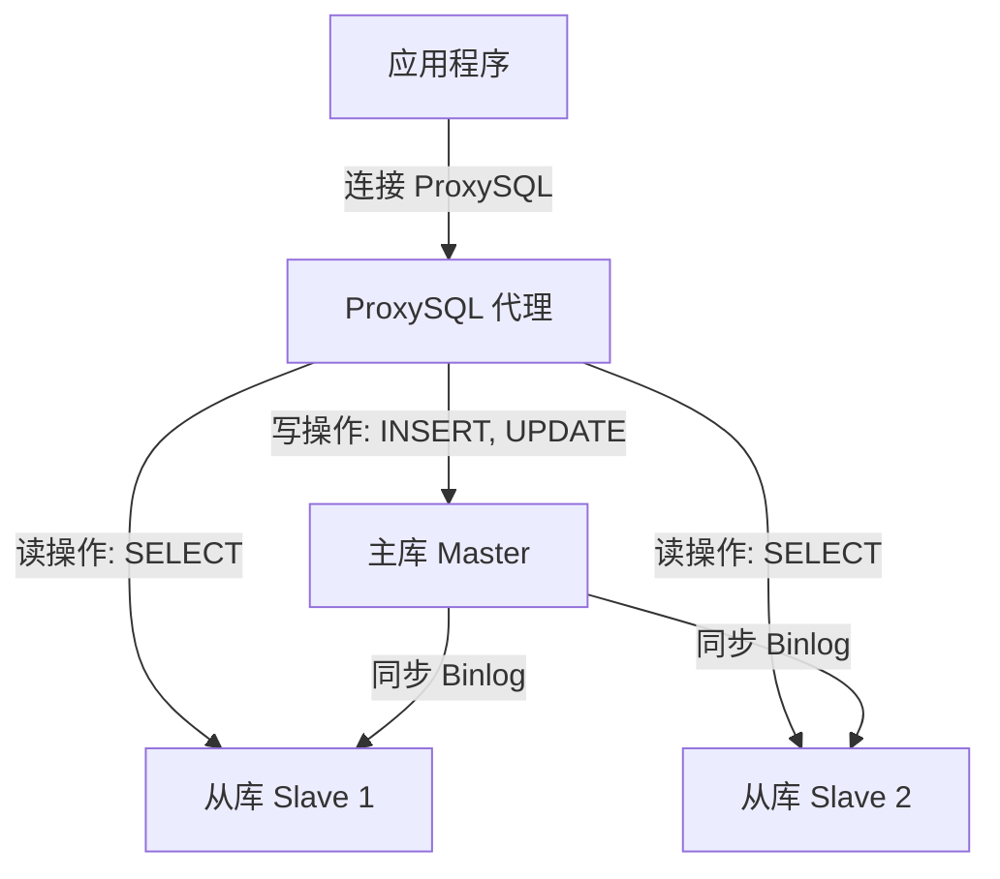

# **MySQL 核心技术：用户权限管理、Binlog、主从同步与读写分离**

---
## **学习目标**

1. **MySQL 用户权限管理**：能够创建用户、分配权限、撤销权限，并理解企业场景中的权限分配逻辑。
2. **Binlog 理论**：理解 Binlog 的作用、工作原理及其在数据恢复和主从同步中的重要性。
3. **主从同步**：掌握 MySQL 主从同步的配置步骤，理解一主两从架构的实现方式。
4. **读写分离**：了解读写分离的概念及其在企业中的应用，掌握如何通过中间件实现。
5. **Mycat 部署**：初步掌握 Mycat 的安装与配置，理解其在读写分离和分库分表中的作用。

---

## **第一部分：MySQL 用户权限管理（语法结构详细教学）**

### **目标：**
掌握 MySQL 用户权限管理的基本语法，理解每条命令的结构和含义，能够根据需求创建用户并分配权限。

### **一、权限管理相关语法的详细讲解**
在 MySQL 中，权限管理主要涉及以下核心 SQL 语句：`CREATE USER`、`GRANT`、`REVOKE`、`SHOW GRANTS`、`DROP USER` 和 `FLUSH PRIVILEGES`。下面逐一拆解它们的语法结构，说明每个部分的作用和可选值。

#### **1. CREATE USER 语法（创建用户）**
**语法结构：**
```sql
CREATE USER '用户名'@'主机名' IDENTIFIED BY '密码';
```
**结构拆解与说明：**
- **`'用户名'`**：你要创建的用户的名称，比如 `app_user`。可取值：任意字符串，通常是字母、数字或下划线的组合，区分大小写。示例：`'app_user'`、`'readonly_user'`。
- **`'@主机名'`**：指定用户可以从哪个主机登录。可取值：`'localhost'`（只能本地登录）、`'%'`（可以从任何主机登录）、特定 IP 或域名（如 `'192.168.1.100'`）。示例：`'@localhost'`、`'@%'`。
- **`IDENTIFIED BY '密码'`**：设置用户的登录密码。可取值：任意字符串，建议使用强密码（包含字母、数字、特殊字符）。示例：`'admin123'`。

**完整示例：**
```sql
CREATE USER 'app_user'@'%' IDENTIFIED BY 'admin123';
```
**解释：** 创建一个名为 `app_user` 的用户，可以从任何主机（`%`）登录，密码是 `admin123`。

**MySQL 8.0 注意事项：** MySQL 8.0 默认使用 `caching_sha2_password` 认证插件，如果客户端不支持可能会出现警告或连接错误。若需兼容旧客户端，可在创建用户时指定旧插件：
```sql
CREATE USER 'app_user'@'%' IDENTIFIED WITH 'mysql_native_password' BY 'admin123';
```

#### **2. GRANT 语法（授权）**
**语法结构：**
```sql
GRANT 权限类型 [, 权限类型 ...] 
ON 数据库名.表名 
TO '用户名'@'主机名' 
[WITH GRANT OPTION];
```
**结构拆解与说明：**
- **`GRANT 权限类型 [, 权限类型 ...]`**：指定要赋予用户的权限，可以是单个或多个权限（用逗号分隔）。可取值：`SELECT`（查询）、`INSERT`（插入）、`UPDATE`（更新）、`DELETE`（删除）、`CREATE`（创建）、`DROP`（删除）、`ALL PRIVILEGES`（所有权限，谨慎使用）。示例：`SELECT, INSERT, UPDATE` 或 `ALL PRIVILEGES`。
- **`ON 数据库名.表名`**：指定权限作用的范围，即用户可以操作哪些数据库或表。可取值：`数据库名.*`（某数据库所有表，如 `employees.*`）、`数据库名.表名`（特定表，如 `employees.employees`）、`*.*`（所有数据库和表）。示例：`employees.*`、`*.*`。
- **`TO '用户名'@'主机名'`**：指定将权限赋予哪个用户。可取值：与 `CREATE USER` 中定义的用户名和主机名一致。示例：`'app_user'@'%'`。
- **`[WITH GRANT OPTION]`**（可选）：允许该用户将自己拥有的权限再授予其他用户，通常只给管理员用户。示例：`WITH GRANT OPTION`。

**完整示例：**
```sql
GRANT SELECT, INSERT, UPDATE, DELETE 
ON employees.* 
TO 'app_user'@'%';
```
**解释：** 给用户 `app_user`（可从任何主机登录）赋予对 `employees` 数据库所有表的查询、插入、更新和删除权限。

#### **3. REVOKE 语法（撤销权限）**
**语法结构：**
```sql
REVOKE 权限类型 [, 权限类型 ...] 
ON 数据库名.表名 
FROM '用户名'@'主机名';
```
**结构拆解与说明：**
- **`REVOKE 权限类型 [, 权限类型 ...]`**：指定要撤销的权限，可以是单个或多个权限。可取值：与 `GRANT` 中的权限类型一致。示例：`DELETE` 或 `SELECT, INSERT`。
- **`ON 数据库名.表名`**：指定权限作用范围，与 `GRANT` 一致。可取值：`employees.*`、`*.*` 等。示例：`employees.*`。
- **`FROM '用户名'@'主机名'`**：指定要撤销权限的用户。可取值：与 `CREATE USER` 中定义的用户名和主机名一致。示例：`'app_user'@'%'`。

**完整示例：**
```sql
REVOKE DELETE 
ON employees.* 
FROM 'app_user'@'%';
```
**解释：** 撤销用户 `app_user` 对 `employees` 数据库所有表的删除权限。

#### ** 4. SHOW GRANTS 语法（查看权限）**
**语法结构：**
```sql
SHOW GRANTS FOR '用户名'@'主机名';
```
**结构拆解与说明：**
- **`SHOW GRANTS FOR '用户名'@'主机名'`**：查看指定用户的权限列表。可取值：与 `CREATE USER` 中定义的用户名和主机名一致。示例：`'app_user'@'%'`。

**完整示例：**
```sql
SHOW GRANTS FOR 'app_user'@'%';
```
**解释：** 查看用户 `app_user`（可从任何主机登录）的所有权限。

#### **5. DROP USER 语法（删除用户）**
**语法结构：**
```sql
DROP USER '用户名'@'主机名';
```
**结构拆解与说明：**
- **`DROP USER '用户名'@'主机名'`**：删除指定的用户账户。可取值：与 `CREATE USER` 中定义的用户名和主机名一致。示例：`'app_user'@'%'`。

**完整示例：**
```sql
DROP USER 'app_user'@'%';
```
**解释：** 删除用户 `app_user`（可从任何主机登录）的账户。

#### **6. FLUSH PRIVILEGES 语法（刷新权限）**
**语法结构：**
```sql
FLUSH PRIVILEGES;
```
**说明：**
- 含义：刷新权限表，确保权限变更立即生效。
- 使用场景：每次执行 `GRANT` 或 `REVOKE` 后，建议运行此命令。

**完整示例：**
```sql
FLUSH PRIVILEGES;
```
**解释：** 刷新权限设置，确保之前的权限变更（如 `GRANT` 或 `REVOKE`）生效。

---

### **二、权限分配总结表格**
以下表格总结了计划创建的各用户的权限范围，方便快速理解企业场景中的权限分配逻辑。

| 用户名            | 主机       | 权限范围                | 具体权限                          | 备注                              |
|------------------|-----------|------------------------|----------------------------------|----------------------------------|
| app_user         | %         | employees.*            | SELECT, INSERT, UPDATE, DELETE   | 程序用户，应用操作数据库         |
| readonly_user    | %         | employees.*            | SELECT                           | 只读用户，仅用于查询和报表       |
| ops_user         | %         | *.*                    | ALL PRIVILEGES                   | 运维用户，最大权限，可管理结构   |
| special_user     | %         | employees.employees    | UPDATE                           | 特殊用户，仅对 employees 表更新  |

**解释：**
- 每个用户的权限范围和具体权限都根据角色需求设计，确保权限最小化原则（只分配必要权限）。
- 运维用户有 `WITH GRANT OPTION`，可以再授权他人，适合管理场景。

---

### **三、Mermaid 图详细解释权限逻辑**
为了直观展示权限分配，我用 Mermaid 图展示用户与数据库的关系，并标注权限范围。


**图解说明：**
- **DBA 管理员**：负责创建所有用户并分配权限。
- **程序用户（app_user）**：拥有对 `employees` 数据库所有表的增删改查权限，适合应用程序使用。
- **只读用户（readonly_user）**：只能查询 `employees` 数据库的所有表，适合数据分析。
- **运维用户（ops_user）**：拥有最大权限，可以操作所有数据库和表，适合管理任务。
- **特殊用户（special_user）**：只能更新 `employees` 数据库中的 `employees` 表，适合临时特定任务。

---

### **四、实践与复习：创建用户并测试权限（结合 employees 数据库）**
现在我们已经掌握了权限管理的理论知识，接下来通过实践巩固学习内容。以 `employees` 数据库为例，创建上述用户并分配权限，同时结合昨天学习的增删改查操作进行测试，验证权限是否正确生效。

#### **步骤 1：创建用户并分配权限**
以下是完整的 SQL 脚本，适用于 MySQL 8.0，默认使用 `caching_sha2_password` 认证插件。如果遇到客户端兼容性问题，可在 `IDENTIFIED BY` 前添加 `IDENTIFIED WITH 'mysql_native_password'`。

```sql
-- 创建程序用户，允许从任何主机登录，密码为 admin123
CREATE USER 'app_user'@'%' IDENTIFIED WITH caching_sha2_password BY 'admin123';
-- 创建只读用户，允许从任何主机登录，密码为 admin123
CREATE USER 'readonly_user'@'%' IDENTIFIED WITH caching_sha2_password BY 'admin123';
-- 创建运维用户，允许从任何主机登录，密码为 admin123
CREATE USER 'ops_user'@'%' IDENTIFIED WITH caching_sha2_password BY 'admin123';
-- 创建特殊用户，允许从任何主机登录，密码为 admin123
CREATE USER 'special_user'@'%' IDENTIFIED WITH caching_sha2_password BY 'admin123';

-- 程序用户：对 employees 数据库的所有表有增删改查权限
GRANT SELECT, INSERT, UPDATE, DELETE 
ON employees.* 
TO 'app_user'@'%';

-- 只读用户：只对 employees 数据库有查询权限
GRANT SELECT 
ON employees.* 
TO 'readonly_user'@'%';

-- 运维用户：拥有所有权限，包括结构管理
GRANT ALL PRIVILEGES 
ON *.* 
TO 'ops_user'@'%' 
WITH GRANT OPTION;

-- 特殊用户：只对 employees 数据库的 employees 表有更新权限
GRANT UPDATE 
ON employees.employees 
TO 'special_user'@'%';

-- 刷新权限，确保变更立即生效
FLUSH PRIVILEGES;
```

**解释：** 以上脚本创建了四个不同角色的用户，并根据需求分配了权限。`FLUSH PRIVILEGES` 确保权限设置立即生效。

#### **步骤 2：查看权限验证**
执行以下命令，查看各用户的权限是否正确分配：
```sql
SHOW GRANTS FOR 'app_user'@'%';
SHOW GRANTS FOR 'readonly_user'@'%';
SHOW GRANTS FOR 'ops_user'@'%';
SHOW GRANTS FOR 'special_user'@'%';
```

**解释：** 通过 `SHOW GRANTS` 命令，可以确认每个用户的权限是否与表格中规划的一致。

#### **步骤 3：结合增删改查测试权限（复习昨天内容）**
现在使用不同用户登录 `employees` 数据库，执行增删改查操作，测试权限是否生效。以下是测试建议和预期结果：

1. **使用 app_user 登录测试（权限：SELECT, INSERT, UPDATE, DELETE）**
   - 登录：使用 `app_user` 用户和密码 `admin123` 登录。
   - 测试操作：
     ```sql
     USE employees;
     SELECT * FROM employees LIMIT 5; -- 预期：成功，允许查询
     INSERT INTO departments (dept_no, dept_name) VALUES ('d010', 'Test Dept'); -- 预期：成功，允许插入
     UPDATE employees SET first_name = 'Test' WHERE emp_no = 10001; -- 预期：成功，允许更新
     DELETE FROM departments WHERE dept_no = 'd010'; -- 预期：成功，允许删除
     ```
   - 解释：`app_user` 拥有对 `employees` 数据库所有表的增删改查权限，所有操作都应成功。

2. **使用 readonly_user 登录测试（权限：SELECT）**
   - 登录：使用 `readonly_user` 用户和密码 `admin123` 登录。
   - 测试操作：
     ```sql
     USE employees;
     SELECT * FROM employees LIMIT 5; -- 预期：成功，允许查询
     INSERT INTO departments (dept_no, dept_name) VALUES ('d011', 'Test Dept'); -- 预期：失败，无插入权限
     ```
   - 解释：`readonly_user` 只有查询权限，插入操作会失败，提示无权限。

3. **使用 special_user 登录测试（权限：UPDATE，仅限 employees 表）**
   - 登录：使用 `special_user` 用户和密码 `admin123` 登录。
   - 测试操作：
     ```sql
     USE employees;
     UPDATE employees SET first_name = 'SpecialTest' WHERE emp_no = 10001; -- 预期：成功，允许更新 employees 表
     UPDATE departments SET dept_name = 'Test' WHERE dept_no = 'd001'; -- 预期：失败，无权限更新 departments 表
     SELECT * FROM employees LIMIT 5; -- 预期：失败，无查询权限
     ```
   - 解释：`special_user` 只有对 `employees` 表的更新权限，其他操作会失败。

4. **使用 ops_user 登录测试（权限：ALL PRIVILEGES）**
   - 登录：使用 `ops_user` 用户和密码 `admin123` 登录（注意：只能本地登录）。
   - 测试操作：
     ```sql
     USE employees;
     CREATE TABLE test_table (id INT); -- 预期：成功，允许创建表
     DROP TABLE test_table; -- 预期：成功，允许删除表
     ```
   - 解释：`ops_user` 拥有所有权限，所有操作都应成功。

**实践目标：** 通过以上测试，不仅可以验证权限分配是否正确，还能复习昨天学习的增删改查操作，熟悉 SQL 语句的实际应用。

#### **步骤 4：权限调整测试**
尝试撤销某个用户的部分权限，并验证效果。例如：
```sql
REVOKE DELETE 
ON employees.* 
FROM 'app_user'@'%';
FLUSH PRIVILEGES;
```
- 解释：撤销 `app_user` 的删除权限，再次登录后尝试删除操作，应提示无权限。
- 验证：使用 `SHOW GRANTS FOR 'app_user'@'%';` 查看权限是否已更新。

---

## **第二部分 MySQL Binlog 理论与配置优化**

### **Binlog 理论深度解析**

#### **1.1 Binlog 的定义与作用**
**定义：** Binlog（Binary Log，二进制日志）是 MySQL 数据库的一种日志机制，以二进制格式记录所有对数据库产生变更的操作，包括数据操作（如 INSERT、UPDATE、DELETE）和结构操作（如 CREATE TABLE、ALTER TABLE）。它不记录纯查询操作（如 SELECT），只关注对数据库有实际影响的变更。

**作用：**
- **数据恢复：** Binlog 记录了数据库的操作历史，可用于恢复误删除的数据或回滚到特定时间点（Point-in-Time Recovery, PITR）。
- **主从同步：** Binlog 是主从复制的核心机制，主库通过 Binlog 将变更传递给从库，确保数据一致性。
- **审计与分析：** Binlog 可用于追踪数据库操作历史，适用于安全审计或问题排查。

**类比解释：** Binlog 就像一个“操作日记本”，记录了数据库每一次的“修改动作”。如果数据丢失，我们可以通过重放“日记本”中的记录来恢复数据；在主从架构中，从库就像一个“抄写员”，不断抄写主库的“日记本”，从而保持数据同步。这种类比可以帮助您理解 Binlog 的本质：它是数据库变更的“历史记录”，也是数据传递的“通信工具”。

#### **1.2 Binlog 的工作原理**
Binlog 的工作机制是理解其作用的基础，尤其对后续学习至关重要。

- **操作记录过程：** 当 MySQL 执行写操作并提交事务时，数据库引擎会将操作详情写入 Binlog 文件。记录内容包括操作类型、目标表、具体数据变更、时间戳、事务 ID 等，以二进制格式存储。
- **顺序追加：** Binlog 文件按时间顺序记录操作，形成一个连续的日志流。每个操作在文件中有一个唯一的位置（Position），用于标识和定位。
- **文件切换：** Binlog 文件会根据大小上限或手动刷新（如 `FLUSH LOGS` 命令）生成新文件，文件名通常为 `mysql-bin.000001`、`mysql-bin.000002` 等。

**类比解释：** Binlog 的工作原理就像一个“流水账”，每笔交易（数据库操作）都按顺序记录在账本上，每条记录都有一个编号（Position）。当账本写满时，会换一本新的账本继续记录（文件切换）。这种顺序性和连续性保证了操作不会丢失或错乱，为数据恢复和后续应用提供了可靠基础。

**案例：** 在 `employees` 数据库中执行以下操作：
```sql
INSERT INTO employees (emp_no, first_name, last_name) VALUES (999999, 'Test', 'User');
```
- 该操作在事务提交时写入 Binlog，记录内容包括操作类型（INSERT）、目标表（employees）、插入数据等，位置信息可能是 `mysql-bin.000001` 文件的 Position 1200。

#### **1.3 Binlog 的三种格式**
Binlog 支持三种记录格式，直接影响日志大小和性能：
- **Statement 模式（基于语句）：**
  - 记录原始的 SQL 语句，如 `INSERT INTO employees VALUES (999999, 'Test', 'User');`。
  - 优点：日志文件小，写入性能高。
  - 缺点：某些情况下（如 SQL 中包含随机函数或触发器）可能导致数据不一致。
- **Row 模式（基于行）：**
  - 记录每一行数据的具体变更，如某行数据的字段值从旧值变为新值。
  - 优点：准确性高，确保数据一致，即使有随机函数也能正确复制。
  - 缺点：日志文件较大，写入性能稍低。
  - 备注：MySQL 5.7 及以上默认使用此模式，推荐使用。
- **Mixed 模式（混合模式）：**
  - 结合 Statement 和 Row 模式，根据操作类型选择记录方式。
  - 优点：兼顾性能和准确性。
  - 缺点：配置和排查复杂，不如 Row 模式直观。

**类比解释：** Statement 模式就像记录“做菜的指令”（如“加一勺盐”），简单但可能因环境不同导致结果不一致；Row 模式就像记录“每一步的具体结果”（如“盐加了 5 克”），更精确但记录内容多；Mixed 模式则是两者的混合，根据情况选择记录方式。推荐使用 Row 模式，因为它就像“精确的实验记录”，确保结果一致。

**结论：** 在大多数场景中，建议使用 **Row 模式**，以保证数据准确性。

---

### **Binlog 配置与优化实践**

#### **2.1 启用 Binlog**
编辑 MySQL 配置文件（如 `/etc/my.cnf` 或 `/etc/mysql/my.cnf`），在 `[mysqld]` 部分添加以下配置：
```ini
[mysqld]
log_bin = /var/log/mysql/mysql-bin
binlog_format = ROW
server_id = 1
```
- `log_bin`：启用 Binlog，指定文件存储路径和前缀。
- `binlog_format`：设置 Binlog 格式，推荐 `ROW` 模式。
- `server_id`：为服务器设置唯一 ID，值范围 1-4294967295。

**操作步骤：**
1. 编辑配置文件：
   ```bash
   vim /etc/my.cnf
   ```
2. 保存后重启 MySQL 服务：
   ```bash
   systemctl restart mysql
   ```

#### **2.2 验证 Binlog 配置**
检查 Binlog 是否启用：
```sql
SHOW VARIABLES LIKE 'log_bin';
```
检查 Binlog 格式：
```sql
SHOW VARIABLES LIKE 'binlog_format';
```
查看当前 Binlog 文件和位置：
```sql
SHOW MASTER STATUS;
```

#### **2.3 Binlog 优化配置**
以下是针对性能优化的 Binlog 配置建议，继续在 `my.cnf` 的 `[mysqld]` 部分添加参数：
1. **限制 Binlog 记录范围：**
   ```ini
   binlog_do_db = employees
   ```
   - 作用：仅记录指定数据库的操作，减少 Binlog 文件大小。
2. **设置 Binlog 文件过期清理：**
   ```ini
   binlog_expire_logs_seconds = 604800
   ```
   - 作用：设置 Binlog 文件保留 7 天（604800 秒），避免磁盘空间占用。
3. **启用 GTID（全局事务 ID）：**
   ```ini
   gtid_mode = ON
   enforce_gtid_consistency = ON
   ```
   - 作用：GTID 提供全局唯一的事务标识，简化管理。
4. **优化 Binlog 写入性能：**
   ```ini
   sync_binlog = 0
   innodb_flush_log_at_trx_commit = 2
   ```
   - 作用：减少磁盘 I/O 开销，提升写性能，但需权衡数据一致性。

**完整优化后的 my.cnf 示例：**
```ini
[mysqld]
log_bin = /var/log/mysql/mysql-bin
binlog_format = ROW
server_id = 1
binlog_do_db = employees
binlog_expire_logs_seconds = 604800
gtid_mode = ON
enforce_gtid_consistency = ON
sync_binlog = 0
innodb_flush_log_at_trx_commit = 2
```

**类比解释：** 配置 Binlog 就像“设置日记本的规则”，`log_bin` 是决定是否记日记，`binlog_format` 是决定日记的详细程度（Row 模式更详细），`server_id` 是给日记本编号以区分不同作者，优化参数则是让记日记的过程更高效（如自动清理旧日记、减少频繁保存）。

#### **2.4 查看 Binlog 内容**
使用 `mysqlbinlog` 工具查看 Binlog 文件内容：
```bash
mysqlbinlog /var/log/mysql/mysql-bin.000001
```
或者在 MySQL 中查看 Binlog 事件：
```sql
SHOW BINLOG EVENTS IN 'mysql-bin.000001' LIMIT 10;
```

---

### **总结与实践任务**
1. **理论总结：**
   - Binlog 是 MySQL 的二进制日志，记录所有数据库变更操作，是数据恢复和后续应用的基础。
   - Binlog 工作原理是按顺序记录操作，通过“流水账”的类比可以理解其连续性和可靠性。
   - Binlog 支持三种格式，推荐使用 Row 模式以确保数据准确性。

2. **配置总结：**
   - 启用 Binlog 需要在 `my.cnf` 中设置 `log_bin`、`binlog_format=ROW` 和 `server_id`。
   - 优化配置包括限制记录范围（`binlog_do_db`）、设置过期时间（`binlog_expire_logs_seconds`）、启用 GTID 和调整性能参数（`sync_binlog` 等）。

3. **实践任务：**
   - 检查自己的 MySQL 是否启用了 Binlog，使用 `SHOW VARIABLES LIKE 'log_bin';` 和 `SHOW MASTER STATUS;` 命令。
   - 编辑 `my.cnf` 文件，按照上述优化建议配置 Binlog 参数，特别是确保 `binlog_format=ROW`。
   - 在测试数据库中执行一些写操作（如 INSERT、UPDATE），然后使用 `SHOW BINLOG EVENTS;` 或 `mysqlbinlog` 工具查看 Binlog 记录，熟悉操作记录的格式。
   - 重启 MySQL 服务，验证配置是否生效。

4. **下一步：**
   - 如果您对 Binlog 的理论和配置已经掌握，可以随时告诉我，我们可以进入后续内容的学习。
   - 如果您对 Binlog 有任何疑问，或者需要更深入的解释、类比说明或实践指导，请随时提出，我会进一步细化内容。

**特别提醒：** Binlog 是 MySQL 数据库的重要机制，理解其理论和配置将为后续学习打下坚实基础。期待您的反馈！

## **MySQL配置优化总结**
修改 `vim /etc/mysql/mysql.conf.d/mysqld.cnf`, 企业配置优化，希望大家喜欢
```bash
[mysqld]
# 基本设置
# 指定运行 MySQL 的用户，保持默认
user = mysql
# MySQL 监听端口
port = 3306
# 监听所有地址，允许远程连接（覆盖默认的 127.0.0.1）
bind-address = 0.0.0.0
# MySQL X 协议绑定地址，保持默认本地监听
mysqlx-bind-address = 127.0.0.1
# 服务器默认字符集，支持 emoji 等复杂字符
character-set-server = utf8mb4
# 字符集排序规则
collation-server = utf8mb4_unicode_ci
# 默认存储引擎，推荐使用 InnoDB
default-storage-engine = InnoDB

# InnoDB 缓冲池设置 (内存的60%-75%)
# InnoDB 缓冲池大小，占内存的60%-75%，用于缓存数据和索引
innodb_buffer_pool_size = 2560M

# 连接数设置
# 最大连接数，适配中小型应用
max_connections = 150
# 线程缓存大小，减少线程创建开销
thread_cache_size = 100

# NVMe 固态硬盘优化
# 关闭邻近页刷新，适合 NVMe SSD
innodb_flush_neighbors = 0
# I/O 容量，NVMe 硬盘可设置较高值
innodb_io_capacity = 1000
# 每个表独立文件，提升管理效率
innodb_file_per_table = 1
# 性能优化，非严格事务一致性场景，日志刷新频率降低
innodb_flush_log_at_trx_commit = 2

# 其他性能参数
# MyISAM 引擎缓冲区大小，保持默认，适用于少量 MyISAM 表
key_buffer_size = 16M
# 临时表大小，适配中等规模查询
tmp_table_size = 64M
# InnoDB 读 I/O 线程数，与 CPU 核心数匹配
innodb_read_io_threads = 2
# InnoDB 写 I/O 线程数，与 CPU 核心数匹配
innodb_write_io_threads = 2
# MyISAM 表恢复选项，保持默认
myisam-recover-options = BACKUP

# 日志设置
# 启用慢查询日志，记录执行时间过长的查询
slow_query_log = 1
# 慢查询日志文件路径
slow_query_log_file = /var/log/mysql/mysql-slow.log
# 慢查询阈值设为 2 秒
long_query_time = 2
# 错误日志文件路径，记录启动和运行错误
log_error = /var/log/mysql/error.log
# 二进制日志文件最大大小，控制日志文件增长
max_binlog_size = 100M

# 安全设置
# 跳过主机名解析，提升连接速度
skip-name-resolve

log_bin = /var/log/mysql/mysql-bin  # 开启 Binlog
binlog_format = ROW                # 记录方式，ROW 更准确
server_id = 1                      # 主库编号，唯一
```

**总结**
  * 配置完成记得 `systemctl restart mysql`
  * 沙雕，`server_id` 记得集群别重复啊

## **第三部分：MySQL 主从同步理论与实践**

### **3.1 主从同步的理论与基本原理**

#### **3.1.1 什么是主从同步？**
MySQL 主从同步（Replication）是一种数据库高可用和负载均衡的技术，它允许将一台数据库服务器（称为主库，Master）上的数据自动复制到一台或多台其他数据库服务器（称为从库，Slave）。主库通常负责处理写操作（INSERT、UPDATE、DELETE 等），而从库主要负责读操作（SELECT 查询），从而实现读写分离，提升系统性能和可靠性。

**主要作用：**
- **负载均衡：** 通过将读操作分担到从库，减轻主库的压力，提高数据库整体吞吐量。
- **数据备份：** 从库作为主库的副本，可用于数据备份，防止主库故障导致数据丢失。
- **高可用性：** 当主库发生故障时，从库可以快速切换为主库（需额外配置），减少服务中断时间。
- **数据分析：** 从库可用于执行复杂的查询或报表分析，不影响主库的在线业务。

**小白类比：** 想象一个老师（主库）负责写讲义和改作业（写操作），而多个学生（从库）负责抄写讲义并回答问题（读操作）。这样老师就不用回答所有问题，减轻了负担；如果老师生病，学生还有讲义可以继续学习（备份作用）。

**小白举例：** 比如一个电商网站，主库负责处理用户下单（写数据），从库负责显示商品列表（读数据）。用户查询商品时不会占用主库资源，主库可以更快地处理订单。

#### **3.1.2 主从同步的工作原理（详细流程，面试常考）**
MySQL 主从同步的核心机制基于二进制日志（Binary Log，简称 Binlog），这是主库记录所有写操作的日志文件。从库通过读取主库的 Binlog，重复执行这些操作，从而保持与主库数据一致。以下是详细的工作流程：

- **主库（Master）的工作流程：**
  1. **记录操作到 Binlog：** 每当主库执行写操作（INSERT、UPDATE、DELETE 等），这些操作会被记录到 Binlog 文件中。Binlog 文件按顺序编号（如 `mysql-bin.000001`），每个操作在文件中有具体位置（Position，如 1200），用于标识操作发生的顺序。
  2. **Binlog Dump Thread（Binlog 转储线程）：** 主库有一个专门的线程，称为 Binlog Dump Thread。当从库连接到主库请求同步时，这个线程会读取 Binlog 文件内容，并将其发送给从库。这个线程是主从同步的起点，确保从库能获取主库的操作记录。

- **从库（Slave）的工作流程：**
  1. **IO Thread（输入输出线程）：** 从库启动一个 IO Thread，负责连接主库，接收主库的 Binlog Dump Thread 发送的 Binlog 数据，并将这些数据写入从库本地的 Relay Log（中继日志）中。Relay Log 是从库的临时日志，相当于从库自己的“抄写本”。
  2. **SQL Thread（SQL 执行线程）：** 从库还有一个 SQL Thread，负责读取 Relay Log 中的操作记录，并在从库数据库上逐一执行这些操作（如插入、更新、删除），确保从库的数据与主库保持一致。
  3. **Relay Log 存储位置：** 中继日志默认存储在 MySQL 的数据目录下（通常是 `/var/lib/mysql/`），文件名格式为 `relay-bin.XXX`（如 `relay-bin.000001`）。具体路径可以通过 MySQL 配置文件或查询 `SHOW VARIABLES LIKE 'relay_log';` 确认。如果未特别设置，Relay Log 与数据文件在同一目录下。

**小白类比：** 想象老师（主库）在黑板上写下知识点并记录到日记本（Binlog），有个助手（Binlog Dump Thread）专门把日记内容读给学生听；学生派一个抄写员（IO Thread）把内容抄到自己的小本子（Relay Log），然后另一个执行员（SQL Thread）按照小本子上的内容在自己的作业本上重写一遍（从库执行操作）。这样学生和老师的内容就一样了。

**小白举例：** 假设主库新增了一条订单记录：“用户小明购买手机，订单号 1001”。主库把这条操作记到 Binlog（文件 `mysql-bin.000001`，位置 1200），助手（Binlog Dump Thread）告诉学生；学生抄写员（IO Thread）抄到自己的小本子（Relay Log），执行员（SQL Thread）在从库也添加这条订单记录，从库也有了“订单号 1001”的数据。

**直观结构图（主从同步流程）：**

**图解说明：**
- 主库（A）记录操作到 Binlog（B），通过 Binlog Dump Thread 发送给从库。
- 从库（C）用 IO Thread 接收数据，存到 Relay Log（D），再用 SQL Thread 执行操作，更新从库数据（E）。

**核心点（面试常问）：** 主从同步依赖 Binlog 作为数据传输的桥梁，主库的 Binlog Dump Thread 和从库的 IO Thread、SQL Thread 协同工作，缺一不可。理解这三个线程的作用和数据流向，是回答“主从同步原理”问题的关键。

#### **3.1.3 为什么同步会有延迟？**
MySQL 主从同步默认是异步复制（Asynchronous Replication），即主库执行写操作后不会等待从库完成同步，而是立即返回结果。从库的 IO Thread 和 SQL Thread 需要时间接收和执行操作，因此从库数据可能比主库滞后，导致同步延迟。

- **延迟原因：** 从库的 Relay Log 写入和执行是串行操作，如果主库写操作频繁或从库性能较低，延迟会更明显。
- **解决方案：** MySQL 提供了半同步复制（Semi-Synchronous Replication），主库在提交事务时至少等待一个从库确认收到 Binlog 数据，这样减少数据丢失风险，但可能降低主库性能。
- **影响：** 延迟可能导致从库查询结果与主库不一致，需根据业务场景选择异步或半同步模式。

**小白类比：** 学生抄老师的笔记（从库同步）总比老师写得慢（主库操作），所以学生可能还没抄完最新内容（数据延迟）。半同步就像老师写完一句就等学生确认抄完再写下一句，保证学生不丢内容，但老师写得就慢了。

**小白举例：** 电商网站主库刚新增一条订单（订单号 1002），但从库还没执行完这条操作，用户在从库查询订单列表可能看不到 1002，这就是延迟。如果用半同步，主库会等从库确认收到操作再返回，用户下单会稍慢，但数据一致性更好。

#### **3.1.4 主从同步的两种方式：全库同步与部分库同步**
主从同步可以根据业务需求选择同步全部数据库（全库同步）或只同步特定数据库（部分库同步）。

- **全库同步：**
  - **定义：** 主库的所有数据库操作都记录到 Binlog，从库同步所有数据库的数据。
  - **配置：** 默认模式，无需特别设置，只需开启主库 Binlog。
  - **适用场景：** 适合大多数企业场景，确保从库数据完整，常用作备份或读写分离。
  - **小白类比：** 学生把老师所有科目的笔记都抄下来，不管是数学还是语文，保证不漏内容。
  - **小白举例：** 一个网站有“用户库”和“订单库”，全库同步让从库两个库都有数据，用户查询订单时不会因为缺用户数据而出错。

- **部分库同步：**
  - **定义：** 主库只记录特定数据库的操作到 Binlog，或从库只同步特定数据库的数据。
  - **配置：** 主库设置 `binlog_do_db=数据库名`（限制记录的数据库），从库设置 `replicate_do_db=数据库名`（限制同步的数据库）。
  - **适用场景：** 适合大公司针对高压力数据库优化，比如只同步查询量大的“订单库”到专用从库，其他数据库不占用资源。
  - **注意问题：** 如果数据库之间有关联操作（如用户和订单联合查询），部分同步可能导致从库查询出错，需谨慎使用。
  - **小白类比：** 学生只抄“数学笔记”，针对性强，节省时间，但如果考试有语文内容，就可能答不上来。
  - **小白举例：** 电商网站的“订单库”每天查询几百万次，压力大，就单独同步到几个从库专门处理订单查询，而“用户库”用其他从库处理，避免资源浪费。

---

### **3.2 企业中重要问题：不停机导出数据及记录数据点**
在企业环境中，数据库通常需要 24 小时运行，不能因备份而停机，同时必须准确记录备份时的“数据点”（Binlog 文件和 Position），确保从库同步正常。以下是解决方法，在实验中尤为重要。

#### **3.2.1 如何不停机导出数据？**
企业数据库不能停止服务，用 `mysqldump` 导出全量数据时需尽量减少对业务的影响：
- **使用 `--single-transaction` 参数：** 适用于 InnoDB 引擎，确保导出过程中数据一致，且不影响其他事务（无需长时间锁表）。
  ```bash
  mysqldump -u root -p --single-transaction --all-databases > backup.sql
  ```
- **记录导出时的 Binlog 位置：** 导出时自动记录数据点，减少手动操作和锁表时间。
  ```bash
  mysqldump -u root -p --single-transaction --source-data=2 --all-databases > backup.sql
  ```
  - `--source-data=2` 会将导出时的 Binlog 文件和 Position 写入备份文件顶部（作为注释），如：
    ```
    -- CHANGE MASTER TO MASTER_LOG_FILE='mysql-bin.000001', MASTER_LOG_POS=1200;
    ```
  - 这样无需额外查询 `SHOW MASTER STATUS`，直接从备份文件提取位置，减少对业务的影响。

**小白类比：** 就像老师在不停课的情况下，把讲义复印给新学生（备份数据），用特殊标记（`--source-data=2`）告诉学生从哪里开始抄新笔记（记录数据点），不耽误其他学生学习。

**小白举例：** 网站数据库每天处理订单，不能停，用 `mysqldump --single-transaction` 导出数据就像在后台悄悄复印讲义，用户下单不受影响。

#### **3.2.2 如何记录导出数据点，确保从库同步正常？**
全量备份后，Binlog 同步只负责“备份之后的新操作”，必须准确记录备份完成时的 Binlog 文件和 Position（数据点），否则从库同步会错乱。
- **方法 1：用 `--source-data` 参数（推荐）：** 如上，导出时自动记录数据点，备份文件顶部有 `CHANGE MASTER TO` 语句，直接读取注释即可。
- **方法 2：手动记录（不推荐）：** 导出前执行 `FLUSH TABLES WITH READ LOCK;` 锁定数据库，再执行 `SHOW MASTER STATUS;` 获取 Binlog 文件和 Position，记录后立即解锁 `UNLOCK TABLES;`，但这会短暂影响业务。
- **为什么重要？** 如果找不到对应数据点，从库可能从错误位置开始同步，导致数据重复或缺失。比如备份时主库在 Position 1200，但从库从 1000 开始同步，就会重复执行旧操作，数据错乱。
- **小白类比：** 就像学生借旧笔记（备份数据），必须知道老师讲到哪里（数据点），才能从正确位置开始抄新笔记（同步新操作）。如果不知道位置，抄错了地方，笔记就乱了。
- **小白举例：** 主库备份时已经写到 Position 1200，但从库从 Position 500 开始同步，就会重复处理 500 到 1200 的旧订单，数据库里可能出现重复记录，订单统计就错了。

#### **3.2.3 企业实践建议：**
- 优先用 `mysqldump --single-transaction --source-data=2` 导出，既不停机，又自动记录数据点。
- 导出后检查备份文件顶部注释，确认 Binlog 文件和 Position，用于从库配置。
- 如果数据量大，可用更高效工具（如 Percona XtraBackup），支持热备份且记录 Binlog 位置。

---

### **3.3 实验场景：1 主 1 从同步配置（超详细版）**

#### **3.3.1 实验目标和环境**
**目标：** 搭建一个主库和一个从库的架构，让从库同步主库数据，验证效果。
**实验环境表格：**

| 角色         | IP 地址          | MySQL 版本 | server_id | 操作系统         | 备注                     |
|--------------|------------------|------------|-----------|------------------|--------------------------|
| 主库 (Master) | 192.168.1.100   | 8.0        | 1         | Ubuntu 22.04 LTS | 负责写数据，生成 Binlog |
| 从库 (Slave)  | 192.168.1.101   | 8.0        | 2         | Ubuntu 22.04 LTS | 负责读数据，同步主库     |

**注意：** 如果本地测试，可用两台虚拟机，或一台机器装两个 MySQL 实例（改端口，如主库 3306，从库 3307）。

#### **3.3.2 配置步骤（1 主 1 从，全库同步）**
以下步骤面向所有用户，详细解释每步操作，包含小白类比和举例。


**步骤 0：主库设置（192.168.1.100）**
1. **编辑主库配置文件：** 开启 Binlog。
   - 打开配置文件（Ubuntu 上通常是 `/etc/mysql/mysql.conf.d/mysqld.cnf`）：
     ```bash
     sudo vim /etc/mysql/mysql.conf.d/mysqld.cnf
     ```
   - 在 `[mysqld]` 部分加：
     ```ini
     [mysqld]
     log_bin = /var/log/mysql/mysql-bin  # 开启 Binlog
     binlog_format = ROW                # 记录方式，ROW 更准确
     server_id = 1                      # 主库编号，唯一
     ```
   **小白类比：** 就像老师开始记日记（Binlog），记录每节课的内容，编号 1 是老师的名字。
2. **重启主库：** 让设置生效。
   ```bash
   sudo systemctl restart mysql
   ```
3. **创建同步账号：** 给从库权限读 Binlog。
   - 登录主库 MySQL：
     ```bash
     mysql -u root -p
     ```
   - 创建用户并授权：
     ```sql
     CREATE USER 'repl'@'%' IDENTIFIED BY 'admin123';
     GRANT REPLICATION SLAVE ON *.* TO 'repl'@'%';
     FLUSH PRIVILEGES;
     ```
   **小白举例：** 就像老师给学生一个通行证（账号和密码），允许学生来看日记本（Binlog）。

**步骤 1：准备工作（确保主从数据一致）**
- 如果主库已有数据，需先备份到从库，Binlog 同步只管之后的新操作。
- 留一手: `-p` 说明你本地登录是要密码的哦，我这里没有密码哈
- **备份主库数据（不停机）：** 在主库执行：
  ```bash
  mysqldump -u root -p --single-transaction --source-data=2 --all-databases > backup.sql
  ```
  **小白类比：** 就像老师把之前的讲义复印给新学生（备份数据），不影响课堂继续。
  **小白举例：** 网站主库有 1000 条订单记录，用这个命令备份，就像把 1000 条订单抄到 U 盘，不影响用户继续下单。
- **提取数据点：** 查看备份文件顶部注释，找到类似以下内容：
  ```
  -- CHANGE MASTER TO MASTER_LOG_FILE='mysql-bin.000001', MASTER_LOG_POS=1200;
  ```
  记录 `MASTER_LOG_FILE` 和 `MASTER_LOG_POS`，用于从库配置。
- **导入从库：** 将备份文件传到从库（用 `scp` 或其他工具），在从库执行：
  ```bash
  # 注意注意，喂喂喂你是个从库啊，你得干净一点呀，请把你自己之前哪些创建的数据库，给我删除掉，你不干净，会报错的
  mysql -u root -p < backup.sql
  ```
  **小白举例：** 就像把 U 盘里的 1000 条订单记录导入从库电脑，从库也有了这 1000 条数据。

**步骤 2：从库设置（192.168.1.101）**
1. **编辑从库配置文件：** 设置唯一编号。
   - 打开配置文件：
     ```bash
     sudo vim /etc/mysql/mysql.conf.d/mysqld.cnf
     ```
   - 在 `[mysqld]` 部分加：
     ```ini
     [mysqld]
     server_id = 2  # 从库编号，和主库不同
     ```
   **小白类比：** 学生给自己取个编号 2，和老师的编号 1 区分开。
2. **重启从库：** 让设置生效。
   ```bash
   sudo systemctl restart mysql
   ```
3. **配置从库连接主库：** 设置同步起点（用备份文件记录的 Binlog 文件和 Position）。
   - 登录从库 MySQL：
     ```bash
     mysql -u root -p
     ```
   - 设置同步：
     ```sql
     CHANGE MASTER TO
         MASTER_HOST = '192.168.110.8',    # 主库 IP
         MASTER_USER = 'repl',             # 同步账号
         MASTER_PASSWORD = 'admin123',  # 同步密码
         MASTER_LOG_FILE = 'mysql-bin.000001',  # 备份时的 Binlog 文件
         MASTER_LOG_POS = 1200;            # 备份时的 Position
     ```
   **小白类比：** 学生告诉自己，从老师的日记本第 1 本第 1200 行开始抄（同步新操作）。
   **小白举例：** 从库知道主库备份时写到 1200，就从 1201 开始同步新订单，避免重复抄前 1200 条。
4. **开始同步：** 启动从库同步。
   ```sql
   START SLAVE;
   ```
5. **检查同步状态：** 确认同步是否正常。
   ```sql
   SHOW SLAVE STATUS\G;
   ```
   - 看两行：
     ```
     Slave_IO_Running: Yes  # 接收数据正常
     Slave_SQL_Running: Yes # 执行操作正常
     ```
   - 如果都是 `Yes`，同步正常；否则需排查（IP、密码、Position 是否正确）。
   **小白举例：** 就像检查学生抄写员（IO Thread）和执行员（SQL Thread）是否在工作，如果都在干活，说明笔记抄对了。

**步骤 3：测试同步效果**
1. **主库写数据：** 加一条记录。
   - 登录主库：
     ```sql
     INSERT INTO students (id, name) VALUES (1, '小明');
     ```
   **小白举例：** 老师在主库加了“小明”的记录，就像写了一条新笔记。
2. **从库查数据：** 确认同步。
   - 登录从库：
     ```sql
     SELECT * FROM students WHERE id = 1;
     ```
   - 看到“小明”记录，说明同步成功。
   **小白举例：** 学生在从库看到“小明”，说明抄笔记成功，数据和老师一样。


#### **3.3.3 注意事项（常见问题）**
- **版本一致：** 主从 MySQL 版本最好都是 8.0，避免兼容问题。
- **编号唯一：** `server_id` 必须不同（如主库 1，从库 2）。
- **初始数据：** 同步前备份主库数据到从库，用 `--source-data=2` 记录数据点。
- **同步延迟：** 从库可能慢几秒，`SHOW SLAVE STATUS` 的 `Seconds_Behind_Master` 显示延迟时间。
- **小白举例：** 如果从库延迟 5 秒，用户刚下单，可能 5 秒后才能在从库看到订单信息。
- **重置复制配置** 
  ```bash
  # 万一搞错了，重置咯，还能怎么办
  -- 停止所有复制线程
  STOP REPLICA;

  -- 重置所有复制配置
  RESET REPLICA ALL;

  -- 现在重新配置复制（使用新语法）
  CHANGE MASTER TO
    MASTER_HOST = '192.168.110.8',    # 主库 IP
    MASTER_USER = 'repl',             # 同步账号
    MASTER_PASSWORD = 'admin123',  # 同步密码
    MASTER_LOG_FILE = 'mysql-bin.000001',  # 备份时的 Binlog 文件
    MASTER_LOG_POS = 1200;            # 备份时的 Position

  -- 启动复制
  START REPLICA;

  -- 检查状态
  SHOW REPLICA STATUS\G

  ```

#### **3.3.4 部分库同步配置提示**
如果需要部分库同步（本案例不展开），只需在主库配置中加 `binlog_do_db=数据库名`（指定记录的数据库），从库配置中加 `replicate_do_db=数据库名`（指定同步的数据库），重启后生效。具体操作可参考 MySQL 文档。
**小白举例：** 如果只想同步“订单库”，就在主库和从库设置只处理“订单库”，就像学生只抄“数学笔记”，其他科目不抄。

---

### **总结与下一步计划**
1. **总结：**
   - **主从同步原理：** 主库用 Binlog Dump Thread 发送 Binlog，从库用 IO Thread 接收到 Relay Log（存储在数据目录如 `/var/lib/mysql/`），SQL Thread 执行，保持数据一致。
   - **企业问题：** 不停机导出用 `mysqldump --single-transaction --source-data=2`，记录数据点确保从库同步准确。
   - **实验配置：** 1 主 1 从步骤详细，备份和同步数据点结合，避免实验失败。
   - **小白类比：** 主从同步就像老师和学生抄笔记，备份和同步结合，确保学生笔记完整。

2. **实践建议：**
   - 按步骤搭建主从同步，先备份数据并记录数据点，再配置同步。
   - 用 `SHOW SLAVE STATUS` 检查状态，确保同步正常。

3. **下一步：**
   - 如果基本原理和配置清楚，可学习 1 主多从或延迟优化。
   - 如有疑问（备份、数据点、同步错误），随时告诉我，我会进一步解释。

**特别提醒：** 主从同步中备份和数据点的准确性是成功关键，企业场景下尤其重要。希望这次内容既全面又易懂，能满足你的需求，期待反馈！


## **第四部分 从主从同步到 ProxySQL：实现读写分离**

#### **3.4.1 为什么要读写分离？（带着问题思考）**
在搭建好 MySQL 主从同步后，我们已经实现了数据的备份和初步的负载分担：主库负责写操作，从库负责读操作。但随着业务增长，我们会遇到以下问题：
- **问题 1：如何让应用程序自动区分读和写操作？** 目前主从同步后，应用程序需要手动修改代码，写操作连接主库，读操作连接从库。如果有多个从库，代码逻辑会更复杂，维护成本高。
- **问题 2：如何动态分配读请求到多个从库？** 如果有多个从库，手动指定某个从库处理读请求，会导致负载不均衡，某些从库过载，某些闲置。
- **问题 3：如何应对主库故障？** 主库宕机时，需要手动切换从库为主库，应用程序也要修改连接配置，切换时间长，影响业务连续性。
- **问题 4：如何处理大规模数据和高并发？** 单台主库写入能力有限，数据量大时性能瓶颈明显，主从同步无法解决写入压力问题。

**小白类比：** 就像一个老师（主库）负责写讲义，多个学生（从库）负责回答问题，但现在问题太多，学生不知道谁该回答（读分配问题），老师累得写不动（写压力问题），如果老师生病（主库故障），课堂就乱了（业务中断）。我们需要一个“班主任”（中间层）来协调学生分工，减轻老师负担，甚至在老师不在时安排学生接替。

**小白举例：** 电商网站用户量激增，每天有百万订单写入（主库压力大），千万查询商品（从库读压力大），程序员手动写代码指定主库下单、从库查商品，代码改来改去很麻烦。如果主库宕机，程序员还得连夜改配置，用户无法下单，损失巨大。

**解决思路：** 引入一个中间层工具，自动实现读写分离，动态分配读请求，处理故障切换，甚至支持更复杂的优化策略。这就是 ProxySQL 的作用。

#### **3.4.2 什么是 ProxySQL？**
ProxySQL 是一个高性能的 MySQL 代理工具，作用是作为应用程序和数据库之间的“代理层”，实现读写分离、负载均衡、查询重写、故障切换和性能监控等功能。搭建好主从同步后，引入 ProxySQL 可以解决上述问题，让数据库架构更高效且易于管理。

**主要功能：**
- **读写分离：** 自动将写操作（如 INSERT、UPDATE）发往主库，读操作（如 SELECT）发往从库，无需修改应用程序代码。
- **负载均衡：** 在多个从库之间动态分配读请求，确保各从库负载均衡，支持多种策略（如轮询、权重）。
- **高可用性：** 支持主从切换，当主库故障时，ProxySQL 可以自动检测并切换到从库，减少业务中断。
- **查询优化：** 支持查询重写、缓存和监控，优化数据库性能。
- **轻量高效：** 相比其他中间件，ProxySQL 更轻量，性能开销低，配置灵活。

**小白类比：** ProxySQL 就像一个“班主任”，站在老师（主库）和学生（从库）之间，帮老师分担管理工作：告诉学生谁回答哪个问题（读分配），帮老师收作业（写操作），如果老师生病，安排一个学生临时当老师（主从切换）。

**小白举例：** 电商网站用 ProxySQL 后，程序员不用管主库还是从库，ProxySQL 自动把下单请求发到主库，把查商品请求平均分到几个从库，主库宕机时 ProxySQL 还能快速切换到从库，用户几乎察觉不到问题。

#### **3.4.3 读写分离的原理（详细讲解，面试常考）**
读写分离是 ProxySQL 的核心功能之一，目的是将数据库操作按类型分开，写操作（INSERT、UPDATE、DELETE）发送到主库，读操作（SELECT）发送到从库，从而减轻主库压力，提高系统性能。以下是 ProxySQL 实现读写分离的详细原理：

- **1. 代理机制：**
  ProxySQL 基于 MySQL 协议，应用程序连接 ProxySQL 就像连接普通 MySQL 数据库，ProxySQL 接收所有 SQL 请求后进行解析和转发。应用程序无需知道后端是主库还是从库，连接配置只指向 ProxySQL。
  - **原理：** ProxySQL 监听一个端口（如默认 6033），应用程序通过这个端口发送 SQL 请求，ProxySQL 解析 SQL 语句，判断是读还是写操作，再决定转发到主库还是从库。
  - **小白类比：** 就像学生有问题不直接问老师，而是先问班主任（ProxySQL），班主任看问题是“提交作业”（写）就转给老师，看问题是“查资料”（读）就转给某个学生。
  - **小白举例：** 电商网站程序连接 ProxySQL 端口 6033，发一个“SELECT 商品信息”请求，ProxySQL 看是读操作，就转给从库 1 或从库 2 处理。

- **2. SQL 解析与路由：**
  ProxySQL 内置强大的查询解析引擎，能识别 SQL 语句类型：
  - 写操作（INSERT、UPDATE、DELETE 等）：默认路由到主库，因为主库是数据更新的源头，确保数据一致性。
  - 读操作（SELECT 等）：默认路由到从库，根据配置策略（如轮询、权重）选择具体从库，实现负载均衡。
  - **特殊情况：** 如果读操作涉及事务或需要强一致性（比如刚写入就读取），ProxySQL 可配置将读请求也发往主库。
  - **小白类比：** 班主任收到问题后，看是“改作业”就给老师（写操作到主库），是“查笔记”就给学生（读操作到从库），如果问题特别急（强一致性），也直接找老师。
  - **小白举例：** 用户下单后立刻查订单状态，ProxySQL 发现是刚写入的数据，为确保看到最新订单，可能临时把读请求发到主库。

- **3. 负载均衡策略：**
  ProxySQL 支持多种读操作分配策略，确保多个从库负载均衡：
  - **轮询（Round-Robin）：** 按顺序分配读请求到每个从库，依次循环。
  - **权重（Weight）：** 根据从库性能配置权重，性能好的从库分配更多请求。
  - **延迟感知：** ProxySQL 可监控从库延迟，动态调整分配策略。
  - **小白举例：** 网站有 3 个从库，ProxySQL 用轮询策略，第一个用户查商品发到从库 1，第二个发到从库 2，第三个发到从库 3，第四个又回到从库 1，这样每个从库负担差不多。

- **4. 主从同步延迟的处理：**
  由于 MySQL 主从同步可能有延迟，从库数据可能不是最新的，ProxySQL 提供配置选项处理延迟问题：
  - **强制主库读：** 配置某些关键读操作强制走主库，确保数据一致性。
  - **延迟监控：** ProxySQL 可实时检测从库延迟，延迟大的从库会减少分配请求，甚至临时下线。
  - **小白类比：** 学生抄笔记慢（从库延迟），班主任发现某个学生抄得太慢，就少安排他回答问题（减少分配），或者直接问老师（强制主库读）。
  - **小白举例：** 用户刚下单查订单，如果从库延迟 5 秒看不到新订单，ProxySQL 可以强制把查询发到主库，确保用户看到最新订单。

- **5. 高可用性支持：**
  ProxySQL 配合主从同步，可实现主库故障时的快速切换：
  - 配置多个数据库节点，标记主库和从库，故障时 ProxySQL 自动检测并切换写操作到新的主库（需配合脚本或外部工具）。
  - **小白举例：** 主库宕机就像老师生病，ProxySQL 马上安排一个学生（从库）当临时老师，接管写作业任务，用户下单不受影响。

**读写分离结构图：**

**图解说明：**
- 应用程序连接 ProxySQL，ProxySQL 解析 SQL，写操作发主库，读操作分发到从库。
- 主库通过 Binlog 同步数据到从库，确保从库数据最终一致。

#### **3.4.4 为什么要用 ProxySQL 实现读写分离？（核心价值）**
- **简化开发：** 应用程序无需区分主从库，连接 ProxySQL 即可，代码逻辑简单，维护成本低。
- **提升性能：** 读写分离减轻主库压力，负载均衡优化从库资源利用率，整体吞吐量提升，ProxySQL 本身性能开销极低。
- **增强可靠性：** 主库故障时，ProxySQL 快速切换，业务中断时间短。
- **灵活优化：** ProxySQL 支持查询重写、缓存和监控，适合复杂场景下的性能调优。
- **小白类比：** 没有班主任（ProxySQL），学生直接找老师，老师累垮，学生分工乱；有了班主任，老师轻松，学生有序，课堂效率高，就算老师不在，班主任也能维持秩序。
- **小白举例：** 电商网站不用 ProxySQL 时，程序员手动指定主从连接，改代码忙不过来；用了 ProxySQL，程序员只连一个地址，ProxySQL 自动分配请求，网站响应更快，主库宕机也能快速恢复。

---

你好！非常感谢你的反馈和提出的问题。确实，之前的教案中没有明确说明 ProxySQL 连接 MySQL 主库和从库时使用的账号和密码的配置细节，也没有详细解释为什么应用程序通过 ProxySQL 连接时使用的是 ProxySQL 配置的用户，以及如何与 MySQL 用户关联。这些都是非常重要的内容，我会在以下更新中补充这些细节，并对相关步骤进行优化，确保内容更清晰易懂。

我将更新 **3.4.5 ProxySQL 安装与基本配置** 部分，补充 ProxySQL 连接 MySQL 的账号配置说明，并解释用户连接的逻辑和原理。其他部分保持不变。

---

### **3.4 从主从同步到 ProxySQL：实现读写分离**

#### **3.4.5 ProxySQL 安装与基本配置（基于 Docker 的实验步骤）**
在主从同步基础上部署 ProxySQL，使用 Docker 镜像实现读写分离。以下是具体步骤，假设 ProxySQL 部署在单独的服务器上（IP 地址 192.168.1.102），并且使用镜像 `swr.cn-north-4.myhuaweicloud.com/ddn-k8s/docker.io/proxysql/proxysql:3.0.1`。

**实验环境：**
- **主库（Master）：** IP 192.168.1.100，端口 3306
- **从库 1（Slave 1）：** IP 192.168.1.101，端口 3306
- **ProxySQL 服务器：** IP 192.168.1.102，Ubuntu 18.04（已安装 Docker）
- **目标：** 配置 ProxySQL 实现读写分离，写操作走主库，读操作分发到从库。

**步骤 1：准备账号和数据库权限（优化前置步骤）**
在部署 ProxySQL 之前，先在主库和从库上准备好必要的用户账号和权限，确保后续配置顺利进行。
1. **创建应用程序用户：** 在主库和从库上创建相同的用户（如 `proxy_user`），并赋予权限。建议主从权限一致，以避免主从切换时的权限问题。
   ```sql
   -- 在主库和从库分别执行
   CREATE USER 'proxy_user'@'%' IDENTIFIED BY 'admin123';
   GRANT ALL PRIVILEGES ON *.* TO 'proxy_user'@'%';
   FLUSH PRIVILEGES;
   ```
   **注意：** 如果对安全性要求高，可以为从库用户仅赋予读权限（`GRANT SELECT ON *.*`），但建议统一权限以简化管理。
2. **创建监控用户（可选）：** 为 ProxySQL 监控后端数据库状态创建单独的低权限用户（如 `monitor_user`）。
   ```sql
   -- 在主库和从库分别执行
   CREATE USER 'monitor_user'@'%' IDENTIFIED BY 'monitor_password';
   GRANT USAGE ON *.* TO 'monitor_user'@'%';
   FLUSH PRIVILEGES;
   ```
3. **验证用户：** 确保用户创建成功，可以通过 MySQL 客户端测试连接。
   ```bash
   mysql -u proxy_user -padmin123 -h 192.168.1.100 -P 3306
   mysql -u proxy_user -padmin123 -h 192.168.1.101 -P 3306
   ```

**小白类比：** 就像开学前先给老师和学生发好通行证（账号和权限），确保每个人都能进入教室（数据库），避免上课时被拦在门外（权限错误）。

**小白举例：** 电商网站在主库和从库都创建了 `proxy_user`，无论请求发到哪个库都不会因权限问题失败，省去后续排查麻烦。

**步骤 2：安装 Docker（如果未安装）**
1. 在 ProxySQL 服务器上安装 Docker：
   ```bash
   sudo apt update
   sudo apt install -y docker.io
   sudo systemctl start docker
   sudo systemctl enable docker
   ```
2. 验证 Docker 是否正常运行：
   ```bash
   docker --version
   ```

**步骤 3：拉取并运行 ProxySQL Docker 镜像**
1. 拉取提供的 ProxySQL 镜像：
   ```bash
   docker pull swr.cn-north-4.myhuaweicloud.com/ddn-k8s/docker.io/proxysql/proxysql:3.0.1
   ```
2. 运行 ProxySQL 容器，映射必要的端口，并配置持久化存储：
   - ProxySQL 默认监听 6033 端口（用于应用程序连接）
   - ProxySQL 管理接口默认监听 6032 端口（用于配置）
   - 使用挂载卷避免重启后配置丢失：
   ```bash
   docker run -d \
     --name proxysql \
     --network host \
     --restart unless-stopped \
     -v /proxysql/data:/var/lib/proxysql \
     swr.cn-north-4.myhuaweicloud.com/ddn-k8s/docker.io/proxysql/proxysql:3.0.1
   ```
3. 验证容器是否运行：
   ```bash
   docker ps
   ```
   应看到 `proxysql` 容器处于运行状态。

**步骤 4：连接 ProxySQL 管理接口**
**细节留一手：** 只能从容器终端操作命令时，可使用 `docker exec -it proxysql /bin/bash` 进入容器内部进行操作。
ProxySQL 提供一个管理接口（默认端口 6032）用于配置，初始用户和密码为 `admin/admin`。
1. 使用 MySQL 客户端连接管理接口：
   ```bash
   mysql -u admin -padmin -h 192.168.1.102 -P 6032
   ```
   **注意：** 如果在本地连接，可用 `127.0.0.1`，如果是远程连接，确保防火墙开放 6032 端口。
2. 进入后可查看当前配置：
   ```sql
   SELECT * FROM mysql_servers;
   ```

**步骤 5：配置后端数据库（主库和从库）**
1. 定义主机组（hostgroup），例如：
   - 主机组 0：主库（写操作）
   - 主机组 1：从库（读操作）
2. 添加主库到主机组 0：
   ```sql
   INSERT INTO mysql_servers (hostgroup_id, hostname, port, weight) VALUES (0, '192.168.1.100', 3306, 1);
   ```
3. 添加从库到主机组 1：
   ```sql
   INSERT INTO mysql_servers (hostgroup_id, hostname, port, weight) VALUES (1, '192.168.1.101', 3306, 1);
   ```
   如果有多个从库，继续添加，权重可根据性能调整。
4. 加载配置到运行时：
   ```sql
   LOAD MYSQL SERVERS TO RUNTIME;
   SAVE MYSQL SERVERS TO DISK;
   ```

**步骤 6：配置读写分离规则（新增 DDL 语句路由）**
1. 定义查询规则，将写操作（包括 DDL 语句）路由到主机组 0（主库），读操作路由到主机组 1（从库）：
   - DDL 语句（如 CREATE、ALTER、DROP、TRUNCATE 等）是数据库结构变更操作，必须路由到主库，因为从库通常是只读模式，且结构变更需要通过主库同步到从库。
   ```sql
   -- 写操作规则（数据变更）
   INSERT INTO mysql_query_rules (rule_id, active, match_pattern, destination_hostgroup, apply) VALUES (1, 1, '^INSERT', 0, 1);
   INSERT INTO mysql_query_rules (rule_id, active, match_pattern, destination_hostgroup, apply) VALUES (2, 1, '^UPDATE', 0, 1);
   INSERT INTO mysql_query_rules (rule_id, active, match_pattern, destination_hostgroup, apply) VALUES (3, 1, '^DELETE', 0, 1);
   -- DDL 操作规则（结构变更）
   INSERT INTO mysql_query_rules (rule_id, active, match_pattern, destination_hostgroup, apply) VALUES (4, 1, '^CREATE', 0, 1);
   INSERT INTO mysql_query_rules (rule_id, active, match_pattern, destination_hostgroup, apply) VALUES (5, 1, '^ALTER', 0, 1);
   INSERT INTO mysql_query_rules (rule_id, active, match_pattern, destination_hostgroup, apply) VALUES (6, 1, '^DROP', 0, 1);
   INSERT INTO mysql_query_rules (rule_id, active, match_pattern, destination_hostgroup, apply) VALUES (7, 1, '^TRUNCATE', 0, 1);
   -- 读操作规则
   INSERT INTO mysql_query_rules (rule_id, active, match_pattern, destination_hostgroup, apply) VALUES (8, 1, '^SELECT', 1, 1);
   -- 查询权限
   SELECT rule_id, active, match_pattern, destination_hostgroup, apply FROM mysql_query_rules ORDER BY rule_id;
   ```
   **注意：** 规则优先级按 `rule_id` 顺序执行，建议将 DDL 和写操作规则放在前面，确保这些操作优先路由到主库。如果有更复杂的业务需求（如特定 SELECT 走主库），可以添加更多规则。
2. 加载规则到运行时：
   ```sql
   LOAD MYSQL QUERY RULES TO RUNTIME;
   SAVE MYSQL QUERY RULES TO DISK;
   ```

**小白类比：** 就像班主任（ProxySQL）不仅要分配作业（写操作）和查资料（读操作），还要确保教室布置（DDL 结构变更）由老师（主库）亲自决定，不能让学生（从库）乱改规则。

**小白举例：** 电商网站要建新表存储商品数据，`CREATE TABLE` 语句通过 ProxySQL 自动发到主库，主库创建后同步到从库，确保结构一致，不会因发到从库而报错。

**步骤 7：配置用户权限（补充 ProxySQL 连接 MySQL 的账号说明）**
1. **添加应用程序连接 ProxySQL 使用的用户：**
   在 ProxySQL 中配置的用户是应用程序连接 ProxySQL 时使用的凭据，ProxySQL 会将这些凭据转发给后端的 MySQL 数据库（主库或从库）。因此，此处的用户和密码必须与步骤 1 中在主库和从库上创建的用户一致。
   ```sql
   INSERT INTO mysql_users (username, password, default_hostgroup) VALUES ('proxy_user', 'admin123', 0);
   ```
   **解释：**
   - `username` 和 `password` 是应用程序连接 ProxySQL 时提供的用户和密码，ProxySQL 会用这些凭据去连接后端的 MySQL 服务器。
   - `default_hostgroup` 定义了默认路由的主机组（这里是 0，即主库），当查询不匹配任何规则时，会路由到默认主机组。
   - **为什么应用程序只能用 ProxySQL 配置的用户？** ProxySQL 作为一个代理层，拦截了应用程序的连接请求，它会根据 `mysql_users` 表中配置的用户信息来验证连接。如果应用程序提供的用户和密码不在 `mysql_users` 表中，ProxySQL 会拒绝连接。因此，应用程序必须使用在 ProxySQL 中配置的用户（如 `proxy_user`）来连接，而不能直接使用未在 ProxySQL 中定义的用户。
   - **ProxySQL 如何连接 MySQL？** 当应用程序连接到 ProxySQL（端口 6033）并提供用户凭据（如 `proxy_user` 和 `admin123`）后，ProxySQL 会用相同的用户和密码去连接后端的 MySQL 服务器（主库或从库）。因此，后端 MySQL 服务器上必须存在相同的用户和密码，且具备相应权限，否则连接会失败。

   **小白类比：** 就像班主任（ProxySQL）是学校的门卫，学生（应用程序）要进教室（MySQL 数据库）必须先通过门卫检查身份证（用户和密码）。只有门卫登记簿（`mysql_users` 表）上有的名字和密码才能通过，门卫再用同样的身份证去帮你开门（连接 MySQL）。

   **小白举例：** 电商网站程序连接 ProxySQL 时，必须用 `proxy_user` 和 `admin123`，因为这是 ProxySQL 认识的用户。ProxySQL 拿到这个用户和密码后，转头用同样的凭据去连接主库或从库。如果主库和从库没有这个用户或密码不对，连接就会失败。

2. **配置监控用户（可选）：**
   ProxySQL 使用监控用户定期检查后端 MySQL 服务器的状态（如延迟、可用性）。监控用户必须在后端 MySQL 服务器上存在，且具备最低权限（如 `USAGE`）。
   ```sql
   UPDATE global_variables SET variable_value='monitor_user' WHERE variable_name='mysql-monitor_username';
   UPDATE global_variables SET variable_value='monitor_password' WHERE variable_name='mysql-monitor_password';
   LOAD MYSQL VARIABLES TO RUNTIME;
   SAVE MYSQL VARIABLES TO DISK;
   ```
   **解释：** 监控用户独立于应用程序用户，专门用于 ProxySQL 检测后端服务器健康状态，不会影响应用程序的连接。

3. **加载用户配置：**
   ```sql
   LOAD MYSQL USERS TO RUNTIME;
   SAVE MYSQL USERS TO DISK;
   ```

**步骤 8：测试读写分离效果**
1. **应用程序连接 ProxySQL（默认端口 6033）：**
   应用程序必须使用在 ProxySQL 中配置的用户和密码（如 `proxy_user` 和 `admin123`）连接到 ProxySQL，而不是直接连接到 MySQL 服务器。
   - 连接字符串示例：
     ```bash
     mysql -u proxy_user -padmin123 -h 192.168.1.102 -P 6033
     ```
   **解释：** 应用程序连接到 ProxySQL 的 6033 端口，ProxySQL 验证用户凭据后，根据查询规则将请求转发到主库（192.168.1.100）或从库（192.168.1.101）。应用程序无需知道后端 MySQL 的具体地址和端口，也无需关心读写分离的实现细节。

2. 执行写操作（如 INSERT），确认数据写入主库（192.168.1.100）。
3. 执行读操作（如 SELECT），确认请求分发到从库（192.168.1.101）。
4. 执行 DDL 操作（如 CREATE TABLE），确认请求路由到主库：
   ```sql
   CREATE TABLE test_table (id INT AUTO_INCREMENT PRIMARY KEY, name VARCHAR(50));
   ```
   在主库查看表是否创建成功，并在从库确认是否同步。

**ProxySQL 配置命令总结表格:**
| 命令 | 作用对象 | 功能描述 | 应用场景 |
|------|---------|---------|---------|
| `LOAD MYSQL USERS TO RUNTIME;` | 用户配置 | 将内存表中的用户配置应用到运行环境 | 修改用户账号、权限、密码后 |
| `SAVE MYSQL USERS TO DISK;` | 用户配置 | 将内存表中的用户配置持久化到磁盘 | 确保用户配置在重启后不丢失 |
| `LOAD MYSQL VARIABLES TO RUNTIME;` | 系统变量 | 将内存表中的系统变量应用到运行环境 | 修改连接池大小、超时设置等参数后 |
| `SAVE MYSQL VARIABLES TO DISK;` | 系统变量 | 将内存表中的系统变量持久化到磁盘 | 确保系统变量配置在重启后不丢失 |
| `LOAD MYSQL QUERY RULES TO RUNTIME;` | 查询规则 | 将内存表中的查询规则应用到运行环境 | 修改查询路由、缓存、重写规则后 |
| `SAVE MYSQL QUERY RULES TO DISK;` | 查询规则 | 将内存表中的查询规则持久化到磁盘 | 确保查询规则在重启后不丢失 |
| `LOAD MYSQL SERVERS TO RUNTIME;` | 服务器配置 | 将内存表中的服务器配置应用到运行环境 | 添加/删除服务器、修改主机组后 |
| `SAVE MYSQL SERVERS TO DISK;` | 服务器配置 | 将内存表中的服务器配置持久化到磁盘 | 确保服务器配置在重启后不丢失 |


**小白类比：** 就像给班主任（ProxySQL）一份名单，写明老师（主库）负责写和改教室布置，学生（从库）负责读，问题来了按名单分配，班主任启动工作后，课堂（系统）就井井有条。Docker 就像一个便携式教室，快速搭建好环境。

**小白举例：** 电商网站程序连接 ProxySQL 端口 6033，用 `proxy_user` 登录，下单请求（INSERT）和建表请求（CREATE）自动发到主库，查商品请求（SELECT）自动分到从库，程序员无需改代码，系统运行顺畅。

**注意：**
- ProxySQL 配置灵活，可根据需求调整规则（如事务内读写都走主库）。
- 建议监控 ProxySQL 日志和性能，确保负载均衡和延迟处理符合预期。
- 更多高级功能（如查询缓存、故障切换脚本）可参考 ProxySQL 官方文档（https://proxysql.com/）。