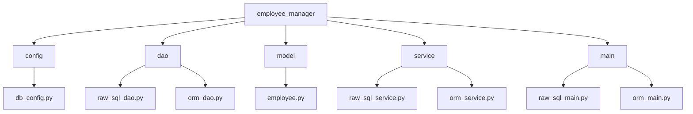
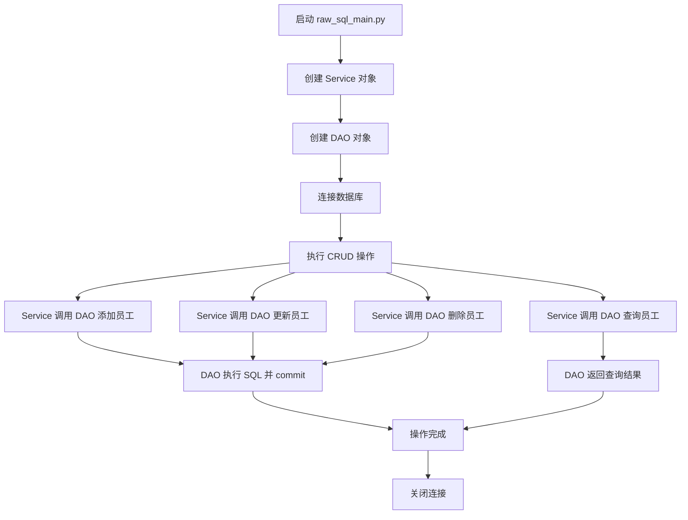
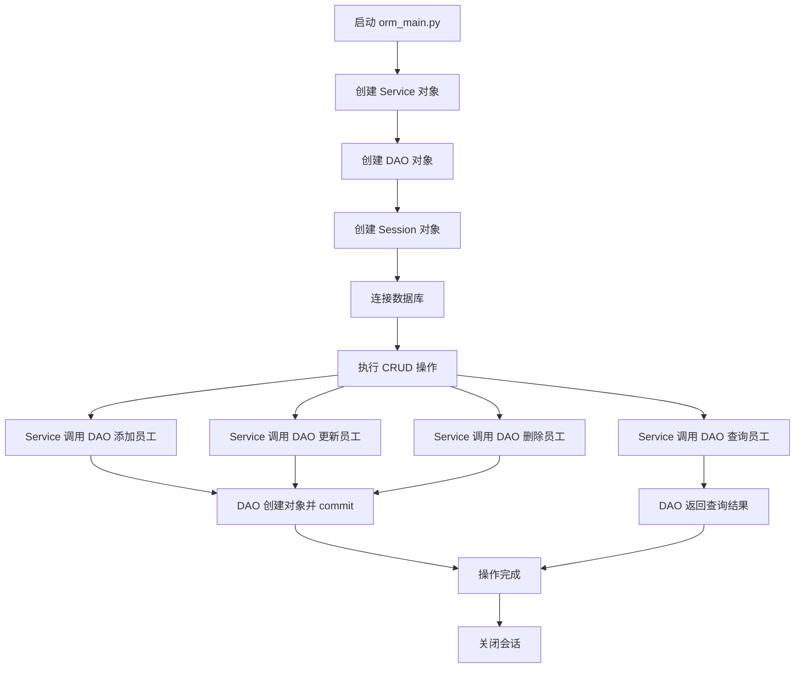

# Python 数据库操作入门教案：原生 SQL 与 ORM 实现 CRUD（小白专用版）

温馨提示: 不在教学的范围，希望有开发基础的同学们，自学哦，只有学习过框架的同学才能看的懂哈

## 教学目标
- 理解 Python 连接 MySQL 数据库的基本概念和步骤。
- 掌握 `mysql-connector-python` 模块的基础用法，学习原生 SQL 实现增删改查（CRUD）。
- 初步认识 ORM（对象关系映射）的概念，使用 SQLAlchemy 实现 CRUD 操作。
- 学习代码分层规范，理解项目结构和文件组织的重要性。
- 通过详细注释和逻辑图，逐步掌握数据库操作的每个细节。

## 前置条件
- 已学习 Python 基础和面向对象编程（类、对象、方法等），但不熟练。
- 已安装 Python 环境（建议 3.8+）。
- 已安装 MySQL 数据库，并导入官方示例数据库 `employees`（可从 MySQL 官网下载）。
- 对 SQL 语句（如 SELECT、INSERT、UPDATE、DELETE）有基本了解，但不要求熟练。

## 教学步骤概述
1. 重新设计项目结构，符合代码分层规范。
2. 详细讲解 `mysql-connector-python` 模块的基础语法和用法。
3. 使用原生 SQL 实现 CRUD 操作，逐步拆解代码。
4. 详细讲解 ORM（SQLAlchemy）的基础概念和用法。
5. 使用 ORM 实现 CRUD 操作，逐步拆解代码。
6. 提供学习表格和逻辑图，帮助理解。

---

## 第一部分：项目创建与代码分层规范

### 步骤1：什么是代码分层规范？
**代码分层** 是软件开发中的一种组织方式，将代码按照功能分成不同的层（如配置层、数据访问层、业务逻辑层等），让代码结构更清晰，易于维护和扩展。常见的企业级分层结构如下：
- **config**：存储配置信息，如数据库连接参数。
- **dao**（Data Access Object）：数据访问层，负责与数据库直接交互，执行 SQL 或 ORM 操作。
- **model**：模型层，定义数据结构（如 ORM 中的表映射）。
- **service**：业务逻辑层，处理具体业务需求，调用 DAO 层。
- **main**：入口层，程序启动入口，调用 service 层。

**学习点**：分层就像把一个大任务拆成小任务，分给不同的人负责，互不干扰，方便团队协作。

### 步骤2：创建项目目录
我们将创建一个名为 `employee_manager` 的项目，用于管理 `employees` 数据库中的员工信息。

```bash
mkdir employee_manager  # 创建项目文件夹
cd employee_manager     # 进入项目文件夹
```

### 步骤3：安装依赖包
使用 `pip` 安装所需的 Python 包：
- `mysql-connector-python`：用于原生 SQL 操作。
- `sqlalchemy` 和 `pymysql`：用于 ORM 操作。

```bash
pip install mysql-connector-python sqlalchemy pymysql
# pymysql 是 SQLAlchemy 连接 MySQL 的驱动
```

### 步骤4：创建项目文件结构（符合分层规范）
在 `employee_manager` 文件夹中创建以下文件和目录结构：

```
employee_manager/
│
├── config/             # 配置层
│   └── db_config.py    # 数据库配置信息
│
├── dao/                # 数据访问层
│   ├── raw_sql_dao.py  # 原生 SQL 操作数据库
│   └── orm_dao.py      # ORM 操作数据库
│
├── model/              # 模型层
│   └── employee.py     # ORM 模型定义
│
├── service/            # 业务逻辑层
│   ├── raw_sql_service.py  # 原生 SQL 业务逻辑
│   └── orm_service.py      # ORM 业务逻辑
│
└── main/               # 入口层
    ├── raw_sql_main.py  # 原生 SQL 主程序入口
    └── orm_main.py      # ORM 主程序入口
```

使用命令创建文件和目录：
```bash
mkdir config dao model service main
touch config/db_config.py dao/raw_sql_dao.py dao/orm_dao.py model/employee.py service/raw_sql_service.py service/orm_service.py main/raw_sql_main.py main/orm_main.py
```

### 项目结构逻辑图
以下是项目结构的 Mermaid 图，帮助理解文件组织：



**学习点**：每一层有自己的职责，`main` 调用 `service`，`service` 调用 `dao`，`dao` 负责数据库操作，`config` 提供配置信息，`model` 定义数据结构。

---

## 第二部分：使用原生 SQL 实现 CRUD 操作

### 步骤1：什么是 `mysql-connector-python`？
`mysql-connector-python` 是一个 Python 模块，用于连接和操作 MySQL 数据库。它允许我们直接写 SQL 语句与数据库交互。以下是初学者需要了解的核心概念和方法：

#### 核心概念和方法（小白详解）
| **方法/概念**              | **作用**                                      | **简单解释**                                                                 |
|----------------------------|----------------------------------------------|-----------------------------------------------------------------------------|
| `mysql.connector.connect()` | 连接到 MySQL 数据库                          | 就像拨打电话给数据库，告诉它你的用户名、密码和想连接的数据库名称。          |
| `cursor()`                 | 创建游标对象，用于执行 SQL 语句              | 游标就像一支笔，用来在数据库上“写”或“读”数据。                             |
| `execute(sql, values)`     | 执行 SQL 语句                                | 告诉数据库你要做什么，比如查询或插入数据，`values` 是 SQL 中的参数值。      |
| `fetchone()`               | 获取查询结果中的一条记录                     | 就像从一堆数据中拿出一条来看。                                              |
| `fetchall()`               | 获取查询结果中的所有记录                     | 就像从一堆数据中拿出所有数据来看。                                          |
| `commit()`                 | 提交事务，确保数据写入数据库                 | 就像保存文件，不提交的话，插入或更新操作不会真正生效。                      |
| `close()`                  | 关闭游标或连接                               | 就像挂断电话，释放资源，防止内存泄漏。                                      |

**学习点**：这些方法是原生 SQL 操作的基础，理解它们就像理解“打开-操作-保存-关闭”这样的流程。

### 步骤2：编写数据库配置文件 `config/db_config.py`
我们将数据库连接信息单独放在一个文件中，方便管理和修改。

```python
# config/db_config.py
# 数据库配置信息，存储连接参数
DB_CONFIG = {
    'host': 'localhost',      # 数据库主机地址，通常是 localhost，表示本机
    'user': 'root',           # 数据库用户名，替换为你的实际用户名
    'password': 'yourpassword',  # 数据库密码，替换为你的实际密码
    'database': 'employees'   # 数据库名称，这里使用 MySQL 官方的 employees 示例数据库
}
```

**学习点**：配置信息单独存储，就像把家里的钥匙放在固定位置，方便查找和修改。

### 步骤3：编写数据访问层 `dao/raw_sql_dao.py`
在数据访问层中，定义一个类专门负责与数据库交互，直接执行 SQL 语句。

```python
# dao/raw_sql_dao.py
import mysql.connector
from config.db_config import DB_CONFIG

class RawSqlDao:
    def __init__(self):
        # 初始化方法，建立数据库连接
        # mysql.connector.connect() 是连接数据库的方法，参数来自 DB_CONFIG
        self.conn = mysql.connector.connect(**DB_CONFIG)
        # 创建游标对象，游标用来执行 SQL 语句
        self.cursor = self.conn.cursor()
        print("数据库连接成功！")

    def add_employee(self, emp_no, first_name, last_name, gender, birth_date, hire_date):
        # 添加员工记录，使用 INSERT 语句插入数据
        # %s 是占位符，防止 SQL 注入，实际值通过 values 传入
        sql = """
        INSERT INTO employees (emp_no, first_name, last_name, gender, birth_date, hire_date)
        VALUES (%s, %s, %s, %s, %s, %s)
        """
        values = (emp_no, first_name, last_name, gender, birth_date, hire_date)
        # execute() 方法执行 SQL 语句，values 是传入的参数
        self.cursor.execute(sql, values)
        # commit() 方法提交事务，确保数据真的写入数据库
        self.conn.commit()
        print(f"员工 {first_name} {last_name} 添加成功！")

    def get_employee(self, emp_no):
        # 查询员工记录，使用 SELECT 语句
        sql = "SELECT * FROM employees WHERE emp_no = %s"
        # 执行查询语句，传入 emp_no 作为参数
        self.cursor.execute(sql, (emp_no,))
        # fetchone() 获取查询结果的第一条记录
        result = self.cursor.fetchone()
        if result:
            print(f"查询结果：{result}")
            return result
        else:
            print(f"未找到员工编号 {emp_no} 的记录！")
            return None

    def update_employee(self, emp_no, first_name, last_name):
        # 更新员工记录，使用 UPDATE 语句
        sql = "UPDATE employees SET first_name = %s, last_name = %s WHERE emp_no = %s"
        values = (first_name, last_name, emp_no)
        # 执行更新语句
        self.cursor.execute(sql, values)
        # 提交事务，确保更新生效
        self.conn.commit()
        print(f"员工编号 {emp_no} 的信息已更新！")

    def delete_employee(self, emp_no):
        # 删除员工记录，使用 DELETE 语句
        sql = "DELETE FROM employees WHERE emp_no = %s"
        # 执行删除语句
        self.cursor.execute(sql, (emp_no,))
        # 提交事务，确保删除生效
        self.conn.commit()
        # rowcount 属性表示受影响的行数，用来判断是否真的删除了记录
        if self.cursor.rowcount > 0:
            print(f"员工编号 {emp_no} 已删除！")
        else:
            print(f"未找到员工编号 {emp_no} 的记录！")

    def close(self):
        # 关闭游标和连接，释放资源
        self.cursor.close()
        self.conn.close()
        print("数据库连接已关闭！")
```

**学习点**：
- 每个方法对应一个数据库操作（增删改查），使用 `execute()` 执行 SQL 语句。
- `commit()` 就像“保存”按钮，不调用的话，数据不会真正写入数据库。
- `fetchone()` 和 `rowcount` 帮助我们获取结果或确认操作是否成功。
- `close()` 方法确保资源释放，就像用完工具后收拾好。

### 步骤4：编写业务逻辑层 `service/raw_sql_service.py`
在业务逻辑层中，调用 DAO 层的方法，处理具体业务需求。

```python
# service/raw_sql_service.py
from dao.raw_sql_dao import RawSqlDao

class RawSqlService:
    def __init__(self):
        # 初始化时创建 DAO 对象，DAO 负责数据库操作
        self.dao = RawSqlDao()

    def add_employee(self, emp_no, first_name, last_name, gender, birth_date, hire_date):
        # 调用 DAO 层方法，添加员工
        self.dao.add_employee(emp_no, first_name, last_name, gender, birth_date, hire_date)

    def get_employee(self, emp_no):
        # 调用 DAO 层方法，查询员工
        return self.dao.get_employee(emp_no)

    def update_employee(self, emp_no, first_name, last_name):
        # 调用 DAO 层方法，更新员工
        self.dao.update_employee(emp_no, first_name, last_name)

    def delete_employee(self, emp_no):
        # 调用 DAO 层方法，删除员工
        self.dao.delete_employee(emp_no)

    def close(self):
        # 调用 DAO 层方法，关闭连接
        self.dao.close()
```

**学习点**：业务逻辑层就像“中间人”，负责接收请求并调用 DAO 层，不直接操作数据库，保持代码分层清晰。

### 步骤5：编写主程序入口 `main/raw_sql_main.py`
在主程序中调用 Service 层，测试 CRUD 操作。

```python
# main/raw_sql_main.py
from service.raw_sql_service import RawSqlService

def main():
    # 创建 Service 对象，Service 会间接连接数据库
    service = RawSqlService()

    # 测试添加员工
    service.add_employee(999999, "Xiao", "Ming", "M", "1990-01-01", "2025-07-24")
    
    # 测试查询员工
    service.get_employee(999999)
    
    # 测试更新员工
    service.update_employee(999999, "Xiao", "Hong")
    
    # 测试查询更新后的员工
    service.get_employee(999999)
    
    # 测试删除员工
    service.delete_employee(999999)
    
    # 关闭数据库连接
    service.close()

if __name__ == "__main__":
    main()
```

**学习点**：主程序是程序的“入口”，就像一个总指挥，调用 Service 层完成任务。

### 原生 SQL 操作逻辑图
以下是原生 SQL 操作的 Mermaid 流程图，帮助理解程序执行顺序和分层调用：



---

## 第三部分：使用 ORM（SQLAlchemy）实现 CRUD 操作

### 步骤1：什么是 ORM 和 SQLAlchemy？
**ORM（对象关系映射）** 是一种技术，它将数据库表映射为 Python 类，表的字段映射为类的属性。使用 ORM，我们可以像操作 Python 对象一样操作数据库，而不需要写 SQL 语句。

**SQLAlchemy** 是 Python 中最常用的 ORM 框架。以下是初学者需要了解的核心概念和方法：

#### 核心概念和方法（小白详解）
| **方法/概念**              | **作用**                                      | **简单解释**                                                                 |
|----------------------------|----------------------------------------------|-----------------------------------------------------------------------------|
| `create_engine()`          | 创建数据库引擎，连接数据库                   | 就像打开数据库的“大门”，告诉程序去哪里找数据库。                          |
| `declarative_base()`       | 创建基类，所有模型类继承它                   | 就像一个“模板”，让你的类能变成数据库表。                                  |
| `Column()`                 | 定义表字段                                   | 就像告诉数据库这个表有哪些列，比如名字、年龄等。                           |
| `sessionmaker()`           | 创建会话工厂，用于管理数据库操作             | 就像一个“工作区”，在里面可以添加、查询、删除数据。                        |
| `session.add()`            | 添加对象到会话                               | 就像把数据放到“购物车”，还没真正保存到数据库。                            |
| `session.query()`          | 查询数据                                     | 就像在数据库里“搜索”，找到你想要的数据。                                  |
| `session.commit()`         | 提交事务，写入数据库                         | 就像点击“保存”，把购物车里的数据真正写入数据库。                          |
| `session.delete()`         | 删除对象                                     | 就像把数据从“购物车”移除，并从数据库删除。                                |
| `session.close()`          | 关闭会话                                     | 就像关掉“工作区”，释放资源。                                              |

**学习点**：ORM 的核心思想是“对象即表，属性即字段”，让数据库操作像操作 Python 对象一样简单。

### ORM 学习表格
以下表格帮助初学者进一步理解 ORM 的核心概念：

| **概念**          | **说明**                              | **示例（SQLAlchemy）**                     |
|-------------------|--------------------------------------|-------------------------------------------|
| 模型（Model）     | Python 类，映射到数据库表            | `class Employee(Base):`                   |
| 字段（Column）    | 类的属性，映射到表字段               | `emp_no = Column(Integer, primary_key=True)` |
| 会话（Session）   | 管理数据库操作，类似事务             | `session = Session(engine)`               |
| 查询（Query）     | 通过对象方式查询数据                 | `session.query(Employee).filter_by(...)`  |
| 提交（Commit）    | 将操作写入数据库                     | `session.commit()`                        |

### 步骤2：编写模型层 `model/employee.py`
定义数据库表对应的模型类，使用 SQLAlchemy。

```python
# model/employee.py
from sqlalchemy import Column, Integer, String, Date, Enum
from sqlalchemy.ext.declarative import declarative_base

# 创建基类，所有模型类都继承自它
# 基类就像一个“模板”，让我们的类能映射到数据库表
Base = declarative_base()

# 定义 Employee 模型类，对应 employees 表
class Employee(Base):
    __tablename__ = 'employees'  # 指定表名，告诉 SQLAlchemy 这个类对应哪个表

    # 定义字段，映射到数据库表的列
    # Column 就像定义表的每一列，Integer、String 等是字段类型
    emp_no = Column(Integer, primary_key=True)  # 员工编号，主键（唯一标识）
    first_name = Column(String(14))             # 名，字符串类型，长度14
    last_name = Column(String(16))              # 姓，字符串类型，长度16
    gender = Column(Enum('M', 'F'))             # 性别，枚举类型，只能是 M 或 F
    birth_date = Column(Date)                   # 出生日期，日期类型
    hire_date = Column(Date)                    # 入职日期，日期类型

    def __str__(self):
        # 定义对象的字符串表示，便于打印查看
        # 就像告诉程序，当打印这个对象时显示什么内容
        return f"Employee(emp_no={self.emp_no}, name={self.first_name} {self.last_name})"
```

**学习点**：模型类就像数据库表的“蓝图”，定义了表结构，字段类型对应数据库中的列类型。

### 步骤3：编写数据访问层 `dao/orm_dao.py`
在数据访问层中，使用 SQLAlchemy 会话操作数据库。

```python
# dao/orm_dao.py
from sqlalchemy import create_engine
from sqlalchemy.orm import sessionmaker
from config.db_config import DB_CONFIG
from model.employee import Employee

class OrmDao:
    def __init__(self):
        # 创建数据库引擎，连接数据库
        # create_engine 就像打开数据库的“大门”，参数是连接字符串
        self.engine = create_engine(f"mysql+pymysql://{DB_CONFIG['user']}:{DB_CONFIG['password']}@{DB_CONFIG['host']}/{DB_CONFIG['database']}")
        # 创建会话工厂，Session 是会话工厂，负责管理数据库操作
        Session = sessionmaker(bind=self.engine)
        # 创建会话对象，就像打开一个“工作区”
        self.session = Session()
        print("数据库会话创建成功！")

    def add_employee(self, emp_no, first_name, last_name, gender, birth_date, hire_date):
        # 创建 Employee 对象，相当于准备一条记录
        new_emp = Employee(
            emp_no=emp_no,
            first_name=first_name,
            last_name=last_name,
            gender=gender,
            birth_date=birth_date,
            hire_date=hire_date
        )
        # add() 方法把对象添加到会话，就像放入“购物车”
        self.session.add(new_emp)
        # commit() 方法提交事务，真正写入数据库
        self.session.commit()
        print(f"添加员工：{new_emp}")
        return new_emp

    def get_employee(self, emp_no):
        # query() 方法查询数据，filter_by() 相当于 WHERE 条件
        # first() 获取查询结果的第一条记录
        emp = self.session.query(Employee).filter_by(emp_no=emp_no).first()
        if emp:
            print(f"查询结果：{emp}")
            return emp
        else:
            print(f"未找到员工编号 {emp_no} 的记录！")
            return None

    def update_employee(self, emp_no, first_name, last_name):
        # 先查询员工
        emp = self.session.query(Employee).filter_by(emp_no=emp_no).first()
        if emp:
            # 直接修改对象属性，相当于更新数据
            emp.first_name = first_name
            emp.last_name = last_name
            # commit() 提交事务，写入数据库
            self.session.commit()
            print(f"更新员工：{emp}")
            return emp
        else:
            print(f"未找到员工编号 {emp_no} 的记录！")
            return None

    def delete_employee(self, emp_no):
        # 先查询员工
        emp = self.session.query(Employee).filter_by(emp_no=emp_no).first()
        if emp:
            # delete() 方法删除对象
            self.session.delete(emp)
            # commit() 提交事务，写入数据库
            self.session.commit()
            print(f"员工编号 {emp_no} 已删除！")
            return True
        else:
            print(f"未找到员工编号 {emp_no} 的记录！")
            return False

    def close(self):
        # 关闭会话，释放资源
        self.session.close()
        print("数据库会话已关闭！")
```

**学习点**：
- ORM 不需要写 SQL 语句，直接操作对象（如 `new_emp = Employee(...)`）。
- `session.add()`、`session.delete()` 等方法管理增删，`session.commit()` 写入数据库。
- 查询使用 `session.query()`，就像在 Python 中“过滤”数据。

### 步骤4：编写业务逻辑层 `service/orm_service.py`
在业务逻辑层中，调用 ORM DAO 层的方法。

```python
# service/orm_service.py
from dao.orm_dao import OrmDao

class OrmService:
    def __init__(self):
        # 初始化时创建 DAO 对象，DAO 负责数据库操作
        self.dao = OrmDao()

    def add_employee(self, emp_no, first_name, last_name, gender, birth_date, hire_date):
        # 调用 DAO 层方法，添加员工
        return self.dao.add_employee(emp_no, first_name, last_name, gender, birth_date, hire_date)

    def get_employee(self, emp_no):
        # 调用 DAO 层方法，查询员工
        return self.dao.get_employee(emp_no)

    def update_employee(self, emp_no, first_name, last_name):
        # 调用 DAO 层方法，更新员工
        return self.dao.update_employee(emp_no, first_name, last_name)

    def delete_employee(self, emp_no):
        # 调用 DAO 层方法，删除员工
        return self.dao.delete_employee(emp_no)

    def close(self):
        # 调用 DAO 层方法，关闭连接
        self.dao.close()
```

**学习点**：业务逻辑层依然是“中间人”，负责调用 DAO 层，保持代码分层清晰。

### 步骤5：编写主程序入口 `main/orm_main.py`
在主程序中调用 ORM Service 层，测试 CRUD 操作。

```python
# main/orm_main.py
from service.orm_service import OrmService
from datetime import date

def main():
    # 创建 Service 对象，Service 会间接连接数据库
    service = OrmService()

    # 测试添加员工
    service.add_employee(999999, "Xiao", "Ming", "M", date(1990, 1, 1), date(2025, 7, 24))
    
    # 测试查询员工
    service.get_employee(999999)
    
    # 测试更新员工
    service.update_employee(999999, "Xiao", "Hong")
    
    # 测试查询更新后的员工
    service.get_employee(999999)
    
    # 测试删除员工
    service.delete_employee(999999)
    
    # 关闭数据库连接
    service.close()

if __name__ == "__main__":
    main()
```

**学习点**：主程序依然是“总指挥”，调用 Service 层完成任务，代码逻辑与原生 SQL 版本一致。

### ORM 操作逻辑图
以下是 ORM 操作的 Mermaid 流程图，帮助理解程序执行顺序和分层调用：



---

## 第四部分：总结与对比

### 原生 SQL 与 ORM 的对比表格
| **方式**      | **优点**                              | **缺点**                              | **适用场景**                  |
|---------------|--------------------------------------|--------------------------------------|------------------------------|
| 原生 SQL      | 灵活性高，直接控制 SQL 语句          | 代码复杂，易出错，维护困难           | 小型项目，复杂查询           |
| ORM (SQLAlchemy) | 代码简洁，像操作对象，易于维护       | 性能稍低，复杂查询需额外学习         | 中大型项目，标准 CRUD 操作   |

**学习点**：初学者可以先掌握原生 SQL 理解数据库原理，再学习 ORM 提高开发效率。

### 运行与测试
1. 确保 MySQL 服务已启动，`employees` 数据库已导入。
2. 运行原生 SQL 程序：
   ```bash
   python main/raw_sql_main.py
   ```
3. 运行 ORM 程序：
   ```bash
   python main/orm_main.py
   ```

### 作业与练习
1. 修改 `dao/raw_sql_dao.py`，添加一个查询所有员工的功能（提示：使用 `cursor.fetchall()`）。
2. 修改 `dao/orm_dao.py`，查询所有姓名为 "Xiao" 的员工（提示：使用 `filter_by` 或 `filter`）。
3. 尝试为 `Employee` 模型添加一个新字段（如 `email`），并思考如何更新数据库表结构。

---

## 教学说明
- 本教案从最基础的概念开始，详细讲解 `mysql-connector-python` 和 SQLAlchemy 的每个方法和作用，适合完全小白。
- 代码分层规范调整为更符合企业标准的结构（config、dao、model、service、main），并通过注释和逻辑图帮助学生理解分层思想。
- 每个代码段都有详细注释，确保学生能理解每行代码的作用。
- 通过 Mermaid 逻辑图和学习表格，帮助学生直观理解项目结构和操作流程。
