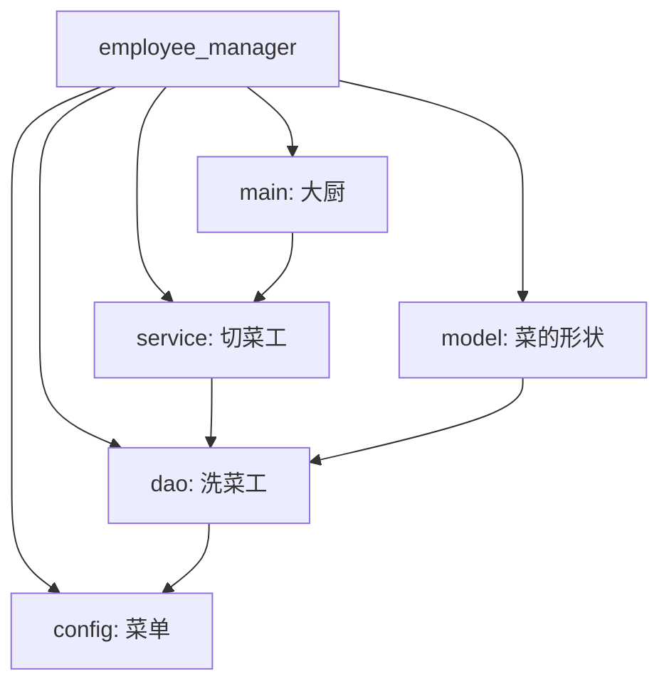
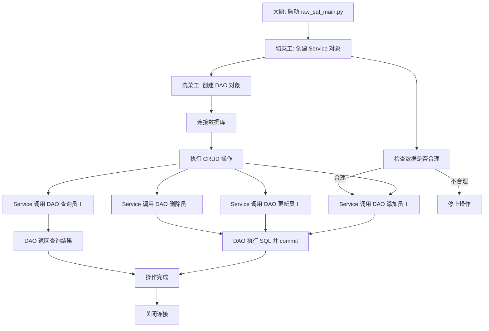
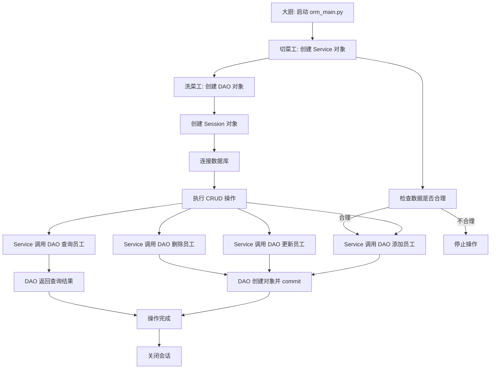

# Python 数据库操作入门教案：原生 SQL 与 ORM 实现 CRUD（超详细小白专用版）
温馨提示: 不在教学的范围，希望有开发基础的同学们，自学哦，只有学习过框架的同学才能看的懂哈

---

## 教学目标
- 理解数据库的基本概念以及 Python 操作数据库的意义。
- 掌握 Python 连接 MySQL 数据库的基本步骤，完成增删改查（CRUD）操作。
- 学会两种操作数据库的方式：原生 SQL（直接编写 SQL 语句）和 ORM（对象关系映射，像操作对象一样操作数据库）。
- 理解代码分层规范的重要性，掌握每一层的职责和作用。
- 通过超详细的注释、比喻、逻辑图和学习表格，逐步理解每个代码片段的含义和操作流程。

---

## 前置条件
- 熟悉 Python 基础语法（如变量、函数、类），但不要求熟练。
- 已安装 Python 环境（建议 3.8+）和 MySQL 数据库。
- MySQL 中已导入官方示例数据库 `employees`（如果没有，可用一个简单表替代，教案会提供替代方案）。
- 对 SQL 语句（如 SELECT、INSERT）完全不了解也没关系，本教案会用通俗语言解释。

---

## 什么是数据库？为什么要用 Python 操作它？
**数据库** 就像一个巨大的电子表格或数据仓库，用来存储和管理大量信息，比如员工信息、订单记录等。MySQL 是一种常见的数据库软件，相当于一个“数据仓库”，可以帮助我们高效地存储、查询和修改数据。

**Python 操作数据库的意义** 在于：通过 Python 程序，我们可以自动化地与数据库交互，比如读取数据、添加记录或修改信息，而无需手动操作 MySQL 软件。例如，用 Python 写一个程序批量添加员工信息，比手动在 MySQL 中输入要快得多。

**学习点**：想象数据库是一个大仓库，Python 是一个智能机器人，机器人可以帮你从仓库里拿东西、放东西或整理东西，省时省力。

---

## 第一部分：项目创建与代码分层规范详解

### 步骤1：什么是代码分层？为什么要分层？
**代码分层** 是软件开发中的一种组织方式，将代码按照功能分成不同的层（如配置层、数据访问层、业务逻辑层等），让代码结构更清晰，易于维护和扩展。分层就像做菜时的分工：有人洗菜、有人切菜、有人炒菜。如果所有人都做所有事，就会乱套。分层让每层只负责自己的任务，方便团队协作和后期修改。

我们将代码分为以下几层，并用做菜的比喻来解释每一层的职责：
- **config（配置层）**：就像菜单，记录了做菜需要的材料信息（如数据库的地址、用户名、密码等）。
- **dao（Data Access Object，数据访问层）**：就像洗菜工，专门与数据库打交道，负责数据的存取操作。
- **model（模型层）**：就像菜的“形状”或“蓝图”，定义数据结构（主要在 ORM 中使用）。
- **service（业务逻辑层）**：就像切菜工，处理具体的业务规则，比如检查数据是否合理。
- **main（入口层）**：就像大厨，负责整体流程，指挥其他层完成任务。

**学习点**：分层就像团队分工，每一层有自己的职责，互不干扰，整体效率更高。分层还能让代码更易读，方便后期维护或扩展。

### 步骤2：创建项目目录
我们将创建一个名为 `employee_manager` 的项目，用于管理 `employees` 数据库中的员工信息。

```bash
mkdir employee_manager  # 创建项目文件夹，就像建一个厨房
cd employee_manager     # 进入项目文件夹，开始工作
```

### 步骤3：安装依赖包
使用 `pip` 安装所需的 Python 包，就像做菜前准备刀具和锅具：
- `mysql-connector-python`：用于原生 SQL 操作数据库。
- `sqlalchemy` 和 `pymysql`：用于 ORM 操作数据库（SQLAlchemy 是 ORM 框架，pymysql 是连接 MySQL 的驱动）。

```bash
pip install mysql-connector-python sqlalchemy pymysql
```

### 步骤4：创建项目文件结构（符合分层规范）
在 `employee_manager` 文件夹中创建以下文件和目录结构，就像把厨房分成不同的工作区：

```
employee_manager/
│
├── config/             # 配置层：存储菜单和材料信息（如数据库连接参数）
│   └── db_config.py    # 数据库配置信息
│
├── dao/                # 数据访问层：洗菜工，专门操作数据库
│   ├── raw_sql_dao.py  # 使用原生 SQL 操作数据库
│   └── orm_dao.py      # 使用 ORM 操作数据库
│
├── model/              # 模型层：定义菜的“形状”（只在 ORM 中使用）
│   └── employee.py     # 员工数据的结构定义
│
├── service/            # 业务逻辑层：切菜工，处理业务规则和逻辑
│   ├── raw_sql_service.py  # 原生 SQL 的业务逻辑
│   └── orm_service.py      # ORM 的业务逻辑
│
└── main/               # 入口层：大厨，指挥所有人完成任务
    ├── raw_sql_main.py  # 原生 SQL 的主程序入口
    └── orm_main.py      # ORM 的主程序入口
```

使用命令创建文件和目录：
```bash
mkdir config dao model service main
touch config/db_config.py dao/raw_sql_dao.py dao/orm_dao.py model/employee.py service/raw_sql_service.py service/orm_service.py main/raw_sql_main.py main/orm_main.py
```

### 项目结构逻辑图
以下是项目结构的 Mermaid 图，帮助直观理解文件组织和分层关系：



**学习点**：大厨（main）指挥切菜工（service），切菜工指挥洗菜工（dao），洗菜工根据菜单（config）去拿材料，菜的形状（model）帮助洗菜工理解数据结构。

---

## 第二部分：使用原生 SQL 实现 CRUD 操作（像写信一样直接告诉数据库做什么）

### 步骤1：什么是原生 SQL 和 `mysql-connector-python`？
**原生 SQL** 是一种直接操作数据库的方式，就像给数据库写信，明确告诉它“我要做什么”（比如查询数据或添加记录）。我们使用的工具是 `mysql-connector-python`，它就像一个邮递员，负责把我们的“信”（SQL 语句）送到数据库，并带回回复。

#### 核心概念和方法（用邮递员比喻，超小白详解）
| **方法/概念**              | **作用**                                      | **比喻解释**                                                                 |
|----------------------------|----------------------------------------------|-----------------------------------------------------------------------------|
| `mysql.connector.connect()` | 连接到 MySQL 数据库                          | 就像拨通邮递员的电话，告诉他你要寄信，连接信息包括地址、用户名、密码等。    |
| `cursor()`                 | 创建游标对象，用于执行 SQL 语句              | 就像一支笔，用来写信的内容。                                               |
| `execute(sql, values)`     | 执行 SQL 语句                                | 就像把信的内容写好并交给邮递员，`values` 是信中填入的具体数据。             |
| `fetchone()`               | 获取查询结果中的一条记录                     | 就像邮递员回信，带回一条数据给你看。                                       |
| `fetchall()`               | 获取查询结果中的所有记录                     | 就像邮递员回信，带回所有相关数据给你看。                                   |
| `commit()`                 | 提交事务，确保数据写入数据库                 | 就像确认信已送到，确保数据库收到并处理了你的请求。                         |
| `close()`                  | 关闭游标或连接                               | 就像挂断电话，和邮递员说再见，释放资源。                                   |

**学习点**：原生 SQL 操作就像寄信，连接是拨号，执行是写信，提交是确认送达，获取结果是读回信。

### 步骤2：编写数据库配置文件 `config/db_config.py`
我们将数据库连接信息单独放在一个文件中，就像一个“地址簿”，方便管理和修改。

```python
# config/db_config.py
# 这是一个“地址簿”或“菜单”，记录了怎么找到数据库仓库
DB_CONFIG = {
    'host': 'localhost',      # 数据库主机地址，localhost 表示本机，就像“隔壁仓库”
    'user': 'root',           # 数据库用户名，就像仓库管理员的名字，替换为你的实际用户名
    'password': 'yourpassword',  # 数据库密码，就像仓库的钥匙，替换为你的实际密码
    'database': 'employees'   # 数据库名称，就像仓库的名字，这里使用 employees 示例数据库
}
```

**学习点**：配置信息单独存储，就像把家里的钥匙放在固定位置，方便查找和修改。如果连接信息变了，只需改这个文件，不用动其他代码。

### 步骤3：编写数据访问层 `dao/raw_sql_dao.py`
在数据访问层中，定义一个类专门负责与数据库交互，就像“洗菜工”直接和仓库打交道，执行 SQL 语句。

```python
# dao/raw_sql_dao.py
import mysql.connector  # 导入邮递员工具
from config.db_config import DB_CONFIG  # 导入地址簿

class RawSqlDao:
    def __init__(self):
        # 初始化方法，就像一开始拨通邮递员电话，建立数据库连接
        # mysql.connector.connect() 是拨号方法，使用地址簿的信息连接数据库
        self.conn = mysql.connector.connect(**DB_CONFIG)
        # 创建一支笔（游标），用来写信或执行 SQL 语句
        self.cursor = self.conn.cursor()
        print("邮递员联系上了，数据库连接成功！")

    def add_employee(self, emp_no, first_name, last_name, gender, birth_date, hire_date):
        # 添加员工记录，就像写信告诉数据库“加一条数据”
        # 下面是信的内容，%s 是空白格，待会填上具体值，防止 SQL 注入
        sql = """
        INSERT INTO employees (emp_no, first_name, last_name, gender, birth_date, hire_date)
        VALUES (%s, %s, %s, %s, %s, %s)
        """
        values = (emp_no, first_name, last_name, gender, birth_date, hire_date)  # 填上具体值
        # 用笔写信，把内容交给邮递员去执行
        self.cursor.execute(sql, values)
        # 确认信送到了，确保数据库收到并保存数据
        self.conn.commit()
        print(f"员工 {first_name} {last_name} 添加成功！")

    def get_employee(self, emp_no):
        # 查询员工记录，就像写信问数据库“某人信息是什么”
        sql = "SELECT * FROM employees WHERE emp_no = %s"
        # 写信，告诉邮递员去查
        self.cursor.execute(sql, (emp_no,))
        # 邮递员回信，拿回一条数据
        result = self.cursor.fetchone()
        if result:
            print(f"查询结果：{result}")
            return result
        else:
            print(f"未找到员工编号 {emp_no} 的记录！")
            return None

    def update_employee(self, emp_no, first_name, last_name):
        # 更新员工记录，就像写信告诉数据库“改一下某人信息”
        sql = "UPDATE employees SET first_name = %s, last_name = %s WHERE emp_no = %s"
        values = (first_name, last_name, emp_no)
        # 写信，交给邮递员去执行
        self.cursor.execute(sql, values)
        # 确认送达，确保更新生效
        self.conn.commit()
        print(f"员工编号 {emp_no} 的信息已更新！")

    def delete_employee(self, emp_no):
        # 删除员工记录，就像写信告诉数据库“删掉某人信息”
        sql = "DELETE FROM employees WHERE emp_no = %s"
        # 写信，交给邮递员去执行
        self.cursor.execute(sql, (emp_no,))
        # 确认送达，确保删除生效
        self.conn.commit()
        # 检查是否真的删除了（rowcount 是受影响的行数）
        if self.cursor.rowcount > 0:
            print(f"员工编号 {emp_no} 已删除！")
        else:
            print(f"未找到员工编号 {emp_no} 的记录！")

    def close(self):
        # 关闭笔和电话，和邮递员说再见，释放资源
        self.cursor.close()
        self.conn.close()
        print("邮递员下班了，数据库连接已关闭！")
```

**学习点**：
- 每个方法对应一个数据库操作（增删改查），使用 `execute()` 执行 SQL 语句，就像写信。
- `commit()` 就像“确认送达”，不调用的话，数据不会真正写入数据库。
- `fetchone()` 和 `rowcount` 帮助我们获取查询结果或确认操作是否成功。
- `close()` 方法确保资源释放，就像挂断电话，防止资源浪费。

### 步骤4：编写业务逻辑层 `service/raw_sql_service.py`
在业务逻辑层中，调用 DAO 层的方法，处理具体业务需求，就像“切菜工”检查材料是否合格，再交给洗菜工。

**重要说明**：数据校验通常在这一层进行，因为业务逻辑层负责处理业务规则，比如“名字不能为空”或“编号不能重复”。

```python
# service/raw_sql_service.py
from dao.raw_sql_dao import RawSqlDao

class RawSqlService:
    def __init__(self):
        # 初始化时，找一个洗菜工（DAO 对象），负责数据库操作
        self.dao = RawSqlDao()

    def add_employee(self, emp_no, first_name, last_name, gender, birth_date, hire_date):
        # 在添加员工前，检查数据是否合理（数据校验）
        if not first_name or not last_name:
            print("错误：名字和姓氏不能为空！")
            return False
        if emp_no <= 0:
            print("错误：员工编号必须是正数！")
            return False
        if gender not in ['M', 'F']:
            print("错误：性别只能是 'M' 或 'F'！")
            return False
        # 如果数据没问题，交给洗菜工去添加
        self.dao.add_employee(emp_no, first_name, last_name, gender, birth_date, hire_date)
        return True

    def get_employee(self, emp_no):
        # 查询员工，直接交给洗菜工
        return self.dao.get_employee(emp_no)

    def update_employee(self, emp_no, first_name, last_name):
        # 更新员工前，检查数据是否合理
        if not first_name or not last_name:
            print("错误：名字和姓氏不能为空！")
            return False
        # 如果数据没问题，交给洗菜工去更新
        self.dao.update_employee(emp_no, first_name, last_name)
        return True

    def delete_employee(self, emp_no):
        # 删除员工，直接交给洗菜工
        self.dao.delete_employee(emp_no)

    def close(self):
        # 告诉洗菜工下班
        self.dao.close()
```

**学习点**：业务逻辑层是“中间人”，负责数据校验和调用 DAO 层，不直接操作数据库。校验就像检查菜是否新鲜，如果不合格就不交给洗菜工，保持代码分层清晰。

### 步骤5：编写主程序入口 `main/raw_sql_main.py`
在主程序中调用 Service 层，测试 CRUD 操作，就像“大厨”指挥所有人完成任务。

```python
# main/raw_sql_main.py
from service.raw_sql_service import RawSqlService

def main():
    # 找一个切菜工（Service 对象），Service 会间接连接数据库
    service = RawSqlService()

    # 指挥切菜工添加员工
    print("尝试添加一个员工...")
    service.add_employee(999999, "Xiao", "Ming", "M", "1990-01-01", "2025-07-24")
    
    # 指挥切菜工查询员工
    print("\n尝试查询这个员工...")
    service.get_employee(999999)
    
    # 指挥切菜工更新员工
    print("\n尝试更新这个员工的名字...")
    service.update_employee(999999, "Xiao", "Hong")
    
    # 指挥切菜工再次查询员工
    print("\n再次查询这个员工，看看是否更新成功...")
    service.get_employee(999999)
    
    # 指挥切菜工删除员工
    print("\n尝试删除这个员工...")
    service.delete_employee(999999)
    
    # 所有人下班
    print("\n任务完成，关闭所有连接...")
    service.close()

if __name__ == "__main__":
    main()
```

**学习点**：主程序是程序的“入口”，就像一个总指挥，只负责调用 Service 层完成任务，不直接操作数据库或处理业务规则。

### 原生 SQL 操作逻辑图
以下是原生 SQL 操作的 Mermaid 流程图，帮助理解程序执行顺序和分层调用：



**学习点**：逻辑图展示了调用顺序：大厨（main）指挥切菜工（service），切菜工检查数据后指挥洗菜工（dao），洗菜工与数据库交互。

---

## 第三部分：使用 ORM（SQLAlchemy）实现 CRUD 操作（像玩积木一样操作数据库）

### 步骤1：什么是 ORM 和 SQLAlchemy？
**ORM（对象关系映射）** 是一种技术，它将数据库表映射为 Python 类，表的字段映射为类的属性。使用 ORM，我们可以像操作 Python 对象一样操作数据库，而不需要写 SQL 语句，就像玩积木，直接拼装数据。

**SQLAlchemy** 是 Python 中最常用的 ORM 框架，相当于一个“积木盒子”，帮助我们定义和管理数据结构。

#### 核心概念和方法（用积木比喻，超小白详解）
| **方法/概念**              | **作用**                                      | **比喻解释**                                                                 |
|----------------------------|----------------------------------------------|-----------------------------------------------------------------------------|
| `create_engine()`          | 创建数据库引擎，连接数据库                   | 就像打开积木盒子，连接到数据库仓库。                                       |
| `declarative_base()`       | 创建基类，所有模型类继承它                   | 就像一个积木模板，让你的类能变成数据库表。                                 |
| `Column()`                 | 定义表字段                                   | 就像定义积木的每个部分，比如编号、名字等。                                 |
| `sessionmaker()`           | 创建会话工厂，用于管理数据库操作             | 就像准备一双“手”，用来拿积木、拼积木。                                    |
| `session.add()`            | 添加对象到会话                               | 就像把积木放进盒子，准备保存到数据库。                                     |
| `session.query()`          | 查询数据                                     | 就像在盒子里找某个积木，找到你想要的数据。                                 |
| `session.commit()`         | 提交事务，写入数据库                         | 就像确认积木拼好了，固定到数据库中。                                       |
| `session.delete()`         | 删除对象                                     | 就像把积木从盒子里拿走，从数据库删除数据。                                 |
| `session.close()`          | 关闭会话                                     | 就像收起手，关掉盒子，释放资源。                                           |

**学习点**：ORM 的核心思想是“对象即表，属性即字段”，操作数据库就像玩积木，直接拼装，不用写信。

### ORM 学习表格
以下表格帮助初学者进一步理解 ORM 的核心概念：

| **概念**          | **说明**                              | **示例（SQLAlchemy）**                     |
|-------------------|--------------------------------------|-------------------------------------------|
| 模型（Model）     | Python 类，映射到数据库表            | `class Employee(Base):`                   |
| 字段（Column）    | 类的属性，映射到表字段               | `emp_no = Column(Integer, primary_key=True)` |
| 会话（Session）   | 管理数据库操作，类似事务             | `session = Session(engine)`               |
| 查询（Query）     | 通过对象方式查询数据                 | `session.query(Employee).filter_by(...)`  |
| 提交（Commit）    | 将操作写入数据库                     | `session.commit()`                        |

### 步骤2：编写模型层 `model/employee.py`
定义数据库表对应的模型类，就像定义积木的形状。

```python
# model/employee.py
from sqlalchemy import Column, Integer, String, Date, Enum  # 这些是积木的零件
from sqlalchemy.ext.declarative import declarative_base  # 这是积木的模板

# 创建基类（模板），所有模型类都继承自它
# 基类就像一个“模板”，让我们的类能映射到数据库表
Base = declarative_base()

# 定义 Employee 模型类，对应 employees 表，就像定义积木的形状
class Employee(Base):
    __tablename__ = 'employees'  # 指定表名，告诉 SQLAlchemy 这个类对应哪个表

    # 定义字段，映射到数据库表的列，就像定义积木的每个部分
    emp_no = Column(Integer, primary_key=True)  # 员工编号，主键（唯一标识）
    first_name = Column(String(14))             # 名，字符串类型，长度14
    last_name = Column(String(16))              # 姓，字符串类型，长度16
    gender = Column(Enum('M', 'F'))             # 性别，枚举类型，只能是 M 或 F
    birth_date = Column(Date)                   # 出生日期，日期类型
    hire_date = Column(Date)                    # 入职日期，日期类型

    def __str__(self):
        # 定义对象的字符串表示，便于打印查看
        # 就像告诉程序，当打印这个对象时显示什么内容
        return f"Employee(emp_no={self.emp_no}, name={self.first_name} {self.last_name})"
```

**学习点**：模型类就像数据库表的“蓝图”，定义了表结构，字段类型对应数据库中的列类型。

### 步骤3：编写数据访问层 `dao/orm_dao.py`
在数据访问层中，使用 SQLAlchemy 会话操作数据库，就像“洗菜工”用积木的方式与仓库打交道。

```python
# dao/orm_dao.py
from sqlalchemy import create_engine  # 积木盒子
from sqlalchemy.orm import sessionmaker  # 你的手
from config.db_config import DB_CONFIG  # 地址簿
from model.employee import Employee  # 积木形状

class OrmDao:
    def __init__(self):
        # 创建数据库引擎，打开积木盒子，连接数据库
        # create_engine 就像打开数据库的“大门”，参数是连接字符串
        self.engine = create_engine(f"mysql+pymysql://{DB_CONFIG['user']}:{DB_CONFIG['password']}@{DB_CONFIG['host']}/{DB_CONFIG['database']}")
        # 创建会话工厂，Session 是会话工厂，负责管理数据库操作
        Session = sessionmaker(bind=self.engine)
        # 创建会话对象，就像打开一个“工作区”或准备一双“手”
        self.session = Session()
        print("积木盒子打开了，数据库会话创建成功！")

    def add_employee(self, emp_no, first_name, last_name, gender, birth_date, hire_date):
        # 创建 Employee 对象，相当于做一个新积木或准备一条记录
        new_emp = Employee(
            emp_no=emp_no,
            first_name=first_name,
            last_name=last_name,
            gender=gender,
            birth_date=birth_date,
            hire_date=hire_date
        )
        # add() 方法把对象添加到会话，就像把积木放进盒子
        self.session.add(new_emp)
        # commit() 方法提交事务，真正写入数据库，就像确认积木固定好
        self.session.commit()
        print(f"添加员工：{new_emp}")
        return new_emp

    def get_employee(self, emp_no):
        # query() 方法查询数据，filter_by() 相当于 WHERE 条件
        # first() 获取查询结果的第一条记录，就像在盒子里找到第一个匹配的积木
        emp = self.session.query(Employee).filter_by(emp_no=emp_no).first()
        if emp:
            print(f"查询结果：{emp}")
            return emp
        else:
            print(f"未找到员工编号 {emp_no} 的记录！")
            return None

    def update_employee(self, emp_no, first_name, last_name):
        # 先查询员工
        emp = self.session.query(Employee).filter_by(emp_no=emp_no).first()
        if emp:
            # 直接修改对象属性，相当于更新积木的形状
            emp.first_name = first_name
            emp.last_name = last_name
            # commit() 提交事务，写入数据库
            self.session.commit()
            print(f"更新员工：{emp}")
            return emp
        else:
            print(f"未找到员工编号 {emp_no} 的记录！")
            return None

    def delete_employee(self, emp_no):
        # 先查询员工
        emp = self.session.query(Employee).filter_by(emp_no=emp_no).first()
        if emp:
            # delete() 方法删除对象，就像把积木从盒子里拿走
            self.session.delete(emp)
            # commit() 提交事务，写入数据库
            self.session.commit()
            print(f"员工编号 {emp_no} 已删除！")
            return True
        else:
            print(f"未找到员工编号 {emp_no} 的记录！")
            return False

    def close(self):
        # 关闭会话，释放资源，就像收起手，关掉盒子
        self.session.close()
        print("积木盒子关上了，数据库会话已关闭！")
```

**学习点**：
- ORM 不需要写 SQL 语句，直接操作对象（如 `new_emp = Employee(...)`），就像拼积木。
- `session.add()`、`session.delete()` 等方法管理增删，`session.commit()` 写入数据库。
- 查询使用 `session.query()`，就像在 Python 中“过滤”数据。

### 步骤4：编写业务逻辑层 `service/orm_service.py`
在业务逻辑层中，调用 ORM DAO 层的方法，处理业务逻辑和数据校验。

```python
# service/orm_service.py
from dao.orm_dao import OrmDao

class OrmService:
    def __init__(self):
        # 初始化时，找一个洗菜工（DAO 对象），负责数据库操作
        self.dao = OrmDao()

    def add_employee(self, emp_no, first_name, last_name, gender, birth_date, hire_date):
        # 检查数据是否合理（数据校验）
        if not first_name or not last_name:
            print("错误：名字和姓氏不能为空！")
            return False
        if emp_no <= 0:
            print("错误：员工编号必须是正数！")
            return False
        if gender not in ['M', 'F']:
            print("错误：性别只能是 'M' 或 'F'！")
            return False
        # 如果没问题，交给洗菜工
        return self.dao.add_employee(emp_no, first_name, last_name, gender, birth_date, hire_date)

    def get_employee(self, emp_no):
        # 直接交给洗菜工
        return self.dao.get_employee(emp_no)

    def update_employee(self, emp_no, first_name, last_name):
        # 检查数据是否合理
        if not first_name or not last_name:
            print("错误：名字和姓氏不能为空！")
            return False
        # 如果没问题，交给洗菜工
        return self.dao.update_employee(emp_no, first_name, last_name)

    def delete_employee(self, emp_no):
        # 直接交给洗菜工
        return self.dao.delete_employee(emp_no)

    def close(self):
        # 告诉洗菜工下班
        self.dao.close()
```

**学习点**：业务逻辑层依然是“中间人”，负责数据校验和调用 DAO 层，保持代码分层清晰。

### 步骤5：编写主程序入口 `main/orm_main.py`
在主程序中调用 ORM Service 层，测试 CRUD 操作。

```python
# main/orm_main.py
from service.orm_service import OrmService
from datetime import date  # 日期工具，用于创建日期对象

def main():
    # 找一个切菜工（Service 对象），Service 会间接连接数据库
    service = OrmService()

    # 指挥切菜工添加员工
    print("尝试添加一个员工...")
    service.add_employee(999999, "Xiao", "Ming", "M", date(1990, 1, 1), date(2025, 7, 24))
    
    # 指挥切菜工查询员工
    print("\n尝试查询这个员工...")
    service.get_employee(999999)
    
    # 指挥切菜工更新员工
    print("\n尝试更新这个员工的名字...")
    service.update_employee(999999, "Xiao", "Hong")
    
    # 指挥切菜工再次查询员工
    print("\n再次查询这个员工，看看是否更新成功...")
    service.get_employee(999999)
    
    # 指挥切菜工删除员工
    print("\n尝试删除这个员工...")
    service.delete_employee(999999)
    
    # 所有人下班
    print("\n任务完成，关闭所有连接...")
    service.close()

if __name__ == "__main__":
    main()
```

**学习点**：主程序依然是“总指挥”，调用 Service 层完成任务，代码逻辑与原生 SQL 版本一致。

### ORM 操作逻辑图
以下是 ORM 操作的 Mermaid 流程图，帮助理解程序执行顺序和分层调用：



**学习点**：ORM 的调用流程与原生 SQL 类似，但操作方式更像拼积木，直接处理对象而非写信。

---

## 第四部分：数据校验的位置与原生 SQL 和 ORM 的对比

### 数据校验在哪一层？为什么？
**数据校验通常在业务逻辑层（service）进行**，原因如下：
- **service 层是业务规则的中心**：这一层负责处理具体的业务逻辑，比如“名字不能为空”“编号必须是正数”“性别只能是 M 或 F”等规则。如果校验放在 DAO 层，DAO 层会变得复杂，违背分层职责分离的原则。
- **main 层不适合做校验**：main 层是入口，只负责整体流程，不应该处理具体业务规则。
- **dao 层只负责数据操作**：DAO 层就像洗菜工，只管与数据库打交道，不关心数据是否合理。

**学习点**：校验就像检查菜是否新鲜，切菜工（service）负责检查，而不是洗菜工（dao）或大厨（main）。这样保持了每一层的职责清晰，代码易于维护。

### 原生 SQL 与 ORM 的对比表格
| **方式**           | **优点**                              | **缺点**                              | **适用场景**                  |
|--------------------|--------------------------------------|--------------------------------------|------------------------------|
| 原生 SQL          | 灵活性高，直接控制 SQL 语句，性能较好 | 代码复杂，易出错，维护困难           | 小型项目，复杂查询           |
| ORM (SQLAlchemy)  | 代码简洁，像操作对象，易于维护       | 性能稍低，复杂查询需额外学习         | 中大型项目，标准 CRUD 操作   |

**学习点**：初学者可以先掌握原生 SQL 理解数据库原理，再学习 ORM 提高开发效率。原生 SQL 像写信，灵活但繁琐；ORM 像玩积木，简单但有时不够灵活。

### 运行与测试
1. 确保 MySQL 服务已启动，`employees` 数据库已导入。如果没有 `employees` 数据库，可以创建一个简单表替代：
   ```sql
   CREATE TABLE employees (
       emp_no INT PRIMARY KEY,
       first_name VARCHAR(14),
       last_name VARCHAR(16),
       gender ENUM('M', 'F'),
       birth_date DATE,
       hire_date DATE
   );
   ```
2. 运行原生 SQL 程序：
   ```bash
   python main/raw_sql_main.py
   ```
3. 运行 ORM 程序：
   ```bash
   python main/orm_main.py
   ```

### 作业与练习
1. 修改 `dao/raw_sql_dao.py`，添加一个查询所有员工的功能（提示：使用 `cursor.fetchall()`）。
2. 修改 `dao/orm_dao.py`，查询所有姓名为 "Xiao" 的员工（提示：使用 `filter_by` 或 `filter`）。
3. 在 `service/raw_sql_service.py` 和 `service/orm_service.py` 中，为 `add_employee` 方法添加一个校验：入职日期不能是未来的日期（提示：比较 `hire_date` 和当前日期）。
4. 尝试为 `Employee` 模型添加一个新字段（如 `email`），并思考如何更新数据库表结构（提示：使用 `ALTER TABLE` 语句）。
5. 运行程序，观察打印信息，试着理解每一步的操作和输出结果。

---

## 第五部分：教学说明与总结

### 教学特色
- **从小白角度出发**：本教案从最基础的概念开始，详细讲解 `mysql-connector-python` 和 SQLAlchemy 的每个方法和作用，适合完全没有数据库经验的学习者。
- **比喻辅助理解**：使用“邮递员”和“积木”的比喻，将抽象概念转化为直观形象的场景，帮助学生快速理解。
- **代码分层规范**：项目结构调整为符合企业标准的结构（config、dao、model、service、main），并通过注释和逻辑图帮助学生理解分层思想。
- **详细注释**：每个代码段都有超详细注释，确保学生能理解每行代码的作用。
- **逻辑图和表格**：通过 Mermaid 逻辑图和学习表格，帮助学生直观理解项目结构、操作流程和核心概念。

### 总结
通过本教案，学生将掌握 Python 操作数据库的两种方式：原生 SQL 和 ORM。原生 SQL 提供了对数据库的直接控制，适合理解底层原理；ORM 提供了更简洁的对象操作方式，适合快速开发。代码分层让程序结构清晰，数据校验在业务逻辑层（service）进行，确保了职责分离。希望学生通过运行代码、完成作业，逐步从“超小白”成长为“数据库操作小能手”！

**学习点**：数据库操作就像管理一个仓库，Python 是你的助手，无论是写信（原生 SQL）还是玩积木（ORM），都能帮你高效完成任务。分层和校验让工作更有条理，未来的学习和开发会更加顺畅。
