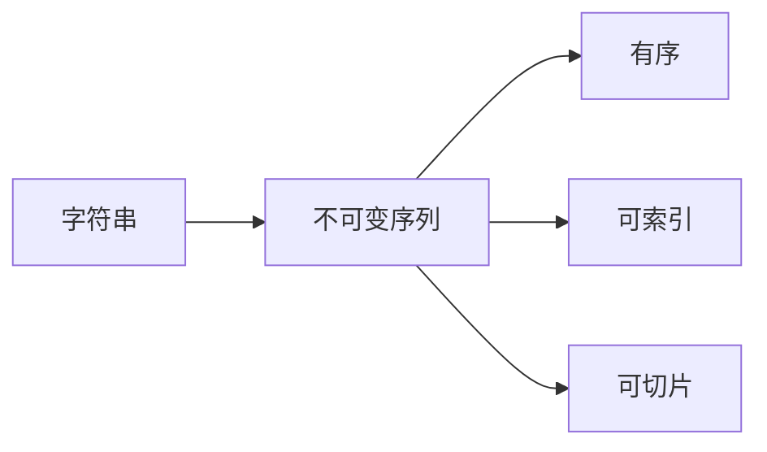
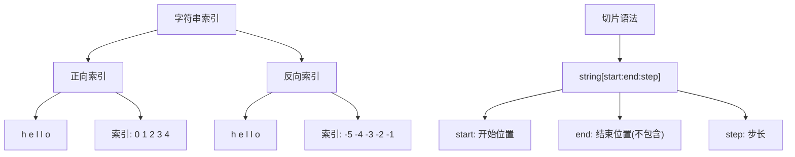
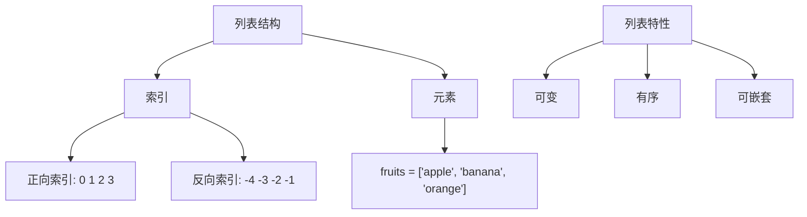
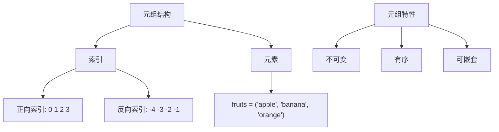
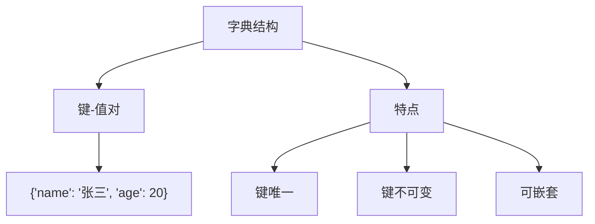
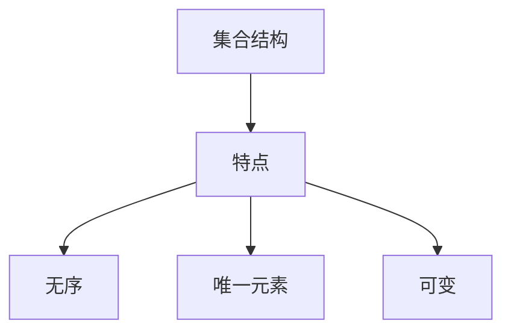

# Python数据类型与结构（第三天）

## 课程目标
1. 掌握Python中的基本数据结构（字符串、列表、元组、字典、集合）
2. 理解每种数据结构的特点和适用场景
3. 能够运用基本的数据结构方法解决简单问题
4. 理解可变与不可变数据类型的区别


## 1. 字符串（String）
### 1.1 什么是字符串？
* 字符串是 Python 中最常用的数据类型。我们可以使用引号( ' 或 " )来创建字符串。
* 创建字符串很简单，只要为变量分配一个值即可。例如：

*  字符串特点


```python
# 不可变性演示
str_text = "hello"
# str_text[0] = 'H'  # 这行代码会报错，证明字符串不可变

```

####  字符串常用方法

| 方法          | 描述               | 示例                                       |
|---------------|--------------------|--------------------------------------------|
| `upper()`     | 转大写            | `"hello".upper()` → `"HELLO"`              |
| `lower()`     | 转小写            | `"HELLO".lower()` → `"hello"`              |
| `strip()`     | 去除两侧空白      | `" hello ".strip()` → `"hello"`            |
| `split()`     | 分割字符串        | `"hello world".split()` → `['hello', 'world']` |
| `replace()`   | 替换子串          | `"hello".replace('l', 'X')` → `"heXXo"`    |
| `startswith()`| 是否以某个子串开头| `"hello".startswith('he')` → `True`        |
| `endswith()`  | 是否以某个子串结尾| `"hello".endswith('lo')` → `True`          |
| `find()`      | 查找子串位置      | `"hello".find('l')` → `2`                  |
| `count()`     | 统计子串出现次数  | `"hello".count('l')` → `2`                 |
| `join()`      | 字符串拼接        | `'-'.join(['a', 'b', 'c'])` → `"a-b-c"`    |

### 1.2 字符串定义示例
```python
# 单引号字符串
name = 'Alice'

# 双引号字符串
message = "Hello, Python!"

# 多行字符串
long_text = '''
这是一个
多行字符串
'''
```

### 1.3 字符串基本操作
```python
# 字符串拼接
greeting = "Hello" + " " + "World"

# 字符串重复
repeat_str = "Ha" * 3  # "HaHaHa"

# 字符串长度
length = len(greeting)

# 字符串索引
first_char = greeting[0]  # "H"
last_char = greeting[-1]  # "d"

```

### 1.4 字符串常用方法
```python
text = "python programming"

# 大小写转换
print(text.upper())     # "PYTHON PROGRAMMING"
print(text.lower())     # "python programming"

# 替换
new_text = text.replace("python", "Python")

# 分割
words = text.split()    # ['python', 'programming']

# 去除空白
clean_text = "  hello  ".strip()

```

### 1.5 字符串格式化
```python
# 方式1：%格式化
name = "Alice"
age = 25
print("我的名字是%s，今年%d岁" % (name, age))

# 方式2：format()方法
print("我的名字是{}，今年{}岁".format(name, age))

# 方式3：f-string（推荐）
print(f"我的名字是{name}，今年{age}岁")

```

### 1.6 字符串索引与切片 Mermaid 图解


```python
s = "hello"

# 正向索引
print(s[0])    # 'h'
print(s[1:4])  # 'ell'

# 反向索引
print(s[-1])   # 'o'
print(s[-3:])  # 'llo'

# 步长切片
print(s[::2])  # 'hlo'
print(s[::-1]) # 反转字符串 'olleh'

```


###  练习题1：字符串处理 - 名字大写转换
#### 题目：
编写一个程序，将用户输入的名字转换为大写，并打印"Hello, 大写名字!"

#### 解题思路：
* 使用 input() 获取用户输入
* 使用 upper() 方法转换为大写
* 使用 f-string 格式化输出 f(foramt)

#### 代码实现：
```python
# 获取用户输入
name = input("请输入您的名字：")

# 转换为大写并打印
print(f"Hello, {name.upper()}!")

```
### 练习题2：字符串字符统计

#### 题目：
创建一个包含5个单词的句子，并统计这个句子的总字符数。

#### 解题思路：
* 创建一个包含多个单词的字符串
* 使用 len() 统计总字符数
* 使用 replace() 去除空格后再统计字符数

#### 代码实现：
```python
# 创建句子
sentence = "Python is a powerful programming language"

# 统计总字符数（包含空格）
total_chars = len(sentence)
print(f"总字符数（包含空格）: {total_chars}")

# 统计总字符数（不包含空格）
chars_without_space = len(sentence.replace(" ", ""))
print(f"总字符数（不包含空格）: {chars_without_space}")


```

### 练习题3：字符串处理 - 2
给定字符串 s = "  Hello world! Python is fun.  ", 请按照以下步骤完成字符串处理：
1. 去掉两端的空白字符。
2. 判断字符串是否以单词 "Hello" 开头，并以句号 "." 结尾。
3. 将字符串中的所有 "o" 替换为 "0"。
4. 将字符串按空格分割为单词列表。
5. 统计单词列表中包含字母 "i" 的单词个数。
6. 最后将单词列表用逗号拼接为一个新的字符串，并输出。

#### 解析思路
1. 去除两端空白字符：使用 strip() 方法。
2. 判断开头和结尾：分别使用 startswith() 和 endswith() 方法。
3. 替换字符：使用 replace() 方法将所有的 "o" 替换为 "0"。
4. 分割字符串：使用 split() 方法按空格分割字符串为单词列表。
5. 统计包含字母 "i" 的单词：遍历单词列表，用 count() 方法统计每个单词中 "i" 的出现次数，并累加。
6. 拼接字符串：使用 join() 方法将单词列表用逗号拼接为一个字符串。

#### 答案
```python
# 原始字符串
s = "  Hello world! Python is fun.  "

# 1. 去掉两端空白字符
s = s.strip()

# 2. 判断开头和结尾
is_start_hello = s.startswith("Hello")
is_end_dot = s.endswith(".")

# 3. 替换字符
s = s.replace("o", "0")

# 4. 分割字符串为单词列表
words = s.split()

# 5. 统计包含字母 "i" 的单词个数
count_i = sum(1 for word in words if "i" in word)

# 6. 拼接单词列表为新字符串
result_string = ",".join(words)

# 输出结果
print(f"是否以 'Hello' 开头: {is_start_hello}")
print(f"是否以 '.' 结尾: {is_end_dot}")
print(f"包含字母 'i' 的单词个数: {count_i}")
print(f"处理后的字符串: {result_string}")

```

## 2. 列表（List）

### 2.1 列表定义
列表是Python中最常用的数据结构之一，具有以下特点：

* 可变序列
* 允许存储不同类型的元素
* 有序
* 可以嵌套
* 支持增删改查操作

#### 列表结构图解


#### list 常用方法

| 方法         | 描述               | 示例                              |
|--------------|--------------------|-----------------------------------|
| `append()`   | 末尾添加元素       | `fruits.append('grape')`          |
| `insert()`   | 指定位置插入       | `fruits.insert(1, 'cherry')`      |
| `remove()`   | 删除首个匹配元素   | `fruits.remove('apple')`          |
| `pop()`      | 删除并返回指定元素 | `fruits.pop(1)`                   |
| `index()`    | 查找元素索引       | `fruits.index('banana')`          |
| `count()`    | 统计元素出现次数   | `fruits.count('apple')`           |
| `sort()`     | 列表排序           | `numbers.sort()`                  |
| `reverse()`  | 列表反转           | `fruits.reverse()`                |
| `extend()`   | 合并列表           | `fruits.extend(['kiwi'])`         |
| `clear()`    | 清空列表           | `fruits.clear()`                  |

### 2.2 列表创建与访问
```python
# 创建列表
fruits = ['apple', 'banana', 'cherry']

# 访问元素
first_fruit = fruits[0]     # "apple"
last_fruit = fruits[-1]     # "cherry"

# 切片
subset = fruits[1:3]        # ['banana', 'cherry']

```

### 2.3 列表操作
```python
# 添加元素
fruits.append('orange')     # 末尾添加
fruits.insert(1, 'grape')   # 指定位置添加

# 删除元素
del fruits[2]               # 删除指定索引元素
fruits.remove('banana')     # 删除指定值元素

# 排序
fruits.sort()               # 升序排序
fruits.reverse()            # 反转列表

```

### 2.4 列表推导式 （选学）
```python
# 快速创建列表
squares = [x**2 for x in range(1, 6)]  # [1, 4, 9, 16, 25]

```

### 练习题1：学生成绩管理
#### 题目要求：
1. 创建一个包含5个学生成绩的列表
2. 计算平均分
3. 找出最高分和最低分
4. 对成绩进行排序

#### 新增知识内容点
* sum()   计算数字列表之和
* max()   获取数字列表中最大的值
* min()   获取数字列表中最小的值

#### 参考解决方案：
```python
# 学生成绩列表
scores = [85, 92, 78, 90, 88]

# 计算平均分
average = sum(scores) / len(scores)
print(f"平均分: {average}")

# 找出最高分和最低分
max_score = max(scores)
min_score = min(scores)
print(f"最高分: {max_score}")
print(f"最低分: {min_score}")

# 降序排列   先给列表排序再将列表反转
sorted_scores = scores.sort().reverse()
print("降序排列:", sorted_scores)

```


### 练习题2：购物车管理

#### 题目要求：
1. 创建一个购物车列表
2. 添加商品
3. 删除商品
4. 计算商品总数

#### 参考解决方案：
```python
# 初始化购物车
cart = ['手机', '耳机']

# 添加商品
cart.append('充电器')
cart.insert(1, '保护壳')

# 删除商品
cart.remove('耳机')

# 统计商品数量
total_items = len(cart)
print("购物车商品:", cart)
print("商品总数:", total_items)

```


## 3. 元组（Tuple）
### 3.1 元组特点
* 不可变（immutable）
* 使用圆括号 ()
* 适合存储不需要修改的数据



### 3.2 元组创建与访问
```python
# 创建元组
coordinates = (10, 20)
mixed_tuple = (1, "hello", 3.14)

# 访问元素
x = coordinates[0]  # 10

```

### 3.3 元组与列表区别
* 元组不可修改
* 元组通常用于存储固定的数据集

### 练习题1：学生信息管理
#### 题目要求：
1. 创建包含多个学生信息的元组
2. 提取特定学生信息
3. 统计学生数量

#### 参考解决方案：
```python
# 学生信息元组
students = (
    ('张三', 18, '男', 85),
    ('李四', 19, '女', 92),
    ('王五', 20, '男', 88)
)

# 提取第二个学生的信息
second_student = students[1]
print("第二个学生信息:", second_student)

# 统计学生数量
student_count = len(students)
print("学生总数:", student_count)

# 提取所有学生的名字
student_names = [student[0] for student in students]
print("学生名单:", student_names)

```

## 4. 字典（Dictionary）

### 4.1 字典基本概念
字典是Python中的键-值对集合，具有以下特点：
* 使用大括号 {} 定义
* 键必须唯一且不可变
* 可存储不同类型的值
* 无序（Python 3.7+保持插入顺序）


### 4.2 字典创建方式
```python
# 多种创建字典的方式
# 空字典
empty_dict = {}  

# 常规创建方法                  
student = {
    'name': '张三',
    'age': 20,
    'grade': 95
}

nested_dict = {
    'student1': {'name': '张三', 'age': 20},
    'student2': {'name': '李四', 'age': 21}
}

# 高级用法，选学，不强求，有兴趣自行研究
# fromkeys 创建多个Key，值都为 0
dict_from_keys = dict.fromkeys(['a', 'b'], 0)  # 使用fromkeys()


```

### 4.3 字典方法
```python
student = {
    "name": "Tom",
    "age": 20,
    "courses": ["Math", "Physics"]
}

# 获取所有键和值
keys = student.keys()
print(f'字典所有的键: {keys}')
values = student.values()
print(f'字典所有的值: {values}')

# 添加键值对内容
student["grade"] = 95

# 修改指定键的内容
student["name"] = "Tender"

# 删除键值对
del student["age"]

print(f"当前字典内容: {student}")

```

### 练习题1：学生成绩管理系统

#### 题目要求：
* 创建学生成绩字典
* 添加和修改学生成绩
* 计算平均分
* 查找最高分学生

#### 参考解决方案：
```python
# 学生成绩字典
scores = {
    '张三': 85,
    '李四': 92,
    '王五': 78
}

# 添加新学生
scores['赵六'] = 88

# 修改学生成绩
scores['张三'] = 90

# 计算平均分
average_score = sum(scores.values()) / len(scores)
print(f"班级平均分: {average_score:.2f}")

# 找出最高分学生
max_score_student = max(scores, key=scores.get)
print(f"最高分学生: {max_score_student}, 分数: {scores[max_score_student]}")

```

## 5 集合（Set）

### 5.1 集合定义
集合是无序的唯一元素集合，具有以下特点：
* 使用大括号 {} 或 set() 创建
* 元素唯一
* 可变（可增删元素）
* 支持数学集合运算

#### 集合结构图解


#### set() 常用方法
| 方法             | 描述         | 示例                        |
|------------------|--------------|-----------------------------|
| `add()`          | 添加元素     | `set.add(element)`          |
| `remove()`       | 删除元素     | `set.remove(element)`       |
| `discard()`      | 安全删除元素 | `set.discard(element)`      |
| `union()`        | 并集         | `set1.union(set2)`          |
| `intersection()` | 交集         | `set1.intersection(set2)`   |
| `difference()`   | 差集         | `set1.difference(set2)`     |
| `clear()`        | 清空集合     | `set.clear()`               |

### 5.2 集合创建方式
```python
# 多种创建集合的方式
empty_set = set()                   # 空集合

fruits = {'apple', 'banana', 'orange'}  # 直接赋值

number_list = [1, 2, 2, 3, 4]
set_from_list = set(number_list)    # 列表转集合

```

### 5.3 自动去重
```python
# 去重示例
numbers_list = [1, 2, 2, 3, 3, 4, 5, 5]
numbers_set = set(numbers_list)

print("原始列表:", numbers_list)  # [1, 2, 2, 3, 3, 4, 5, 5]
print("去重后集合:", numbers_set)  # {1, 2, 3, 4, 5}
```

### 5.4 集合运算
```python
# 班级学生集合
class1_students = {'张三', '李四', '王五'}
class2_students = {'李四', '赵六', '孙七'}

# 共同学生（交集）
common_students = class1_students.intersection(class2_students)
print("共同学生:", common_students)  # {'李四'}

# 所有学生（并集）
all_students = class1_students.union(class2_students)
print("所有学生:", all_students)  # {'张三', '李四', '王五', '赵六', '孙七'}

# 只在第一个班级的学生（差集）
unique_class1 = class1_students.difference(class2_students)
print("只在第一个班级的学生:", unique_class1)  # {'张三', '王五'}

```

### 练习题1：去重和集合运算
#### 题目要求：
1. 创建两个集合
2. 执行集合运算
3. 去除重复元素
4. 找出共同元素

#### 参考解决方案：
```python
# 创建两个集合
class1 = {'张三', '李四', '王五'}
class2 = {'李四', '赵六', '孙七'}

# 并集：所有学生
all_students = class1.union(class2)
print("所有学生:", all_students)

# 交集：共同学生
common_students = class1.intersection(class2)
print("共同学生:", common_students)

# 差集：只在class1的学生
unique_class1 = class1.difference(class2)
print("只在class1的学生:", unique_class1)

```
