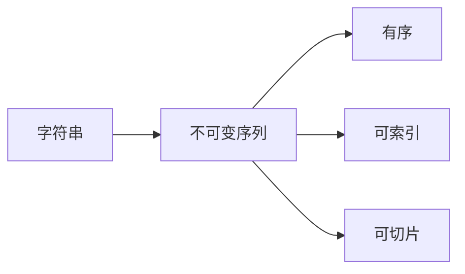

# Python数据类型与结构（第三天）

## 课程目标
1. 掌握Python中的基本数据结构（字符串、列表、元组、字典、集合）
2. 理解每种数据结构的特点和适用场景
3. 能够运用基本的数据结构方法解决简单问题
4. 理解可变与不可变数据类型的区别


## 1.1 字符串的本质
* 字符串是 Python 中最常用的数据类型。我们可以使用引号( ' 或 " )来创建字符串。
* 创建字符串很简单，只要为变量分配一个值即可。例如：



```python
var1 = 'Hello World!'
var2 = "Runoob"

print(f"{var1}")
print(f"{var2}")
```

### 1.2 字符串常用功能表


### 1.3 基础操作示例

#### 1.3.1 字符串基本操作
```python
# 1. 创建字符串
name = "Tom"               # 双引号
city = 'Beijing'          # 单引号
message = """
你好，
世界
"""                      # 三引号，支持多行

# 2. 获取长度
print(len(name))          # 输出：3

# 3. 访问字符
print(name[0])           # 输出：T
print(name[-1])          # 输出：m

# 4. 字符串拼接
first_name = "Tom"
last_name = "Cat"
full_name = first_name + " " + last_name
print(full_name)         # 输出：Tom Cat

# 5. 字符串重复
print("Ha" * 3)          # 输出：HaHaHa

```

#### 1.3.2 字符串常用方法
```python
text = "Hello, Python"

# 大小写转换
print(text.upper())      # 输出：HELLO, PYTHON
print(text.lower())      # 输出：hello, python

# 查找内容
print(text.find("Python"))  # 输出：7
print(text.count("o"))     # 输出：2

# 替换内容
new_text = text.replace("Python", "World")
print(new_text)          # 输出：Hello, World

# 去除空格
message = "  Hello  "
print(message.strip())   # 输出：Hello

```

#### 1.3.3 简单练习
```python
# 练习1：输入你的名字并打印欢迎信息
name = input("请输入你的名字：")
print("你好，" + name)

# 练习2：统计字符串中某个字母出现的次数
message = "hello world"
print("字母l出现的次数：", message.count("l"))

# 练习3：把字符串转换成大写并打印
print(message.upper())

```


