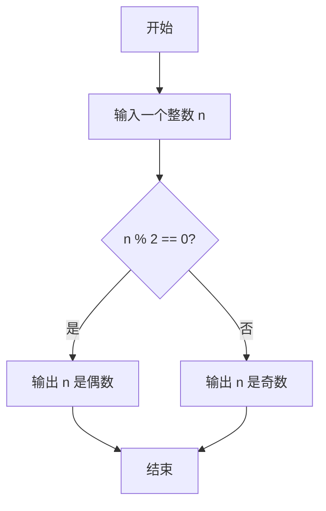
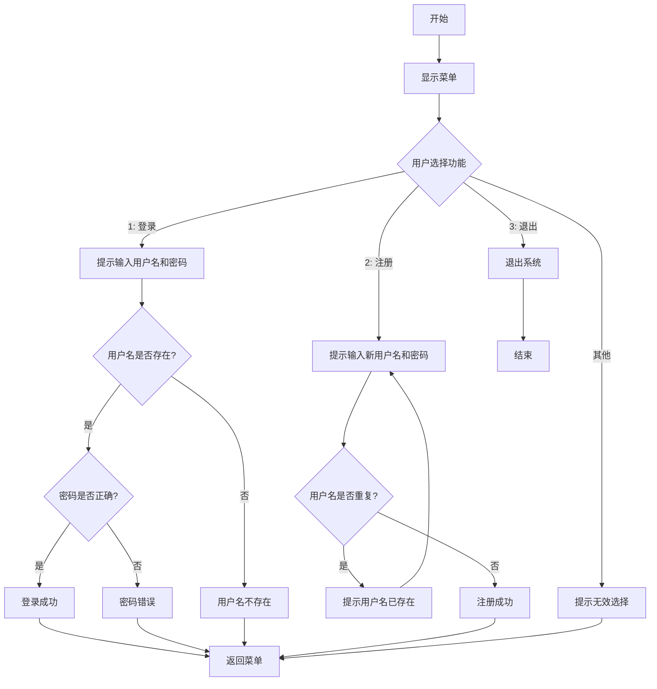

## 题目 1：判断奇数或偶数

### 题目要求
编写一个程序，判断用户输入的整数是奇数还是偶数。

### 设计思路
1. 接收用户输入的整数。
2. 使用 `if` 判断输入数字是否能被 2 整除。
3. 根据判断结果输出该数字是奇数还是偶数。

### 代码流程图



### 完整代码实现
```python
n = int(input("请输入一个整数："))

if n % 2 == 0:
    print(f"{n} 是偶数")
else:
    print(f"{n} 是奇数")
```

## 题目 2：注册登录系统 -- 选做
### 题目要求
编写一个程序，模拟一个简单的注册和登录系统，支持用户注册新账户并登录已注册账户。

### 设计思路
1. 使用一个 `list` 存储多个用户信息，每个用户是一个 `dict`，包含 `username` 和 `password`。
2. 提供两个功能：
   - **登录**：用户输入用户名和密码进行登录，验证成功后输出“登录成功”，否则提示错误信息。
   - **注册**：用户可以输入新的用户名和密码注册，但用户名不能重复。
   - **退出**：结束程序。
3. 使用 `while` 循环实现菜单选择，用户可以反复选择操作。

### 代码流程图


# 完整代码实现
```python
users = [
    {"username": "admin", "password": "123456"},  # 默认用户1
    {"username": "user1", "password": "abc123"}  # 默认用户2
]

# 主循环，用来显示菜单并让用户选择操作
while True:
    # 显示系统菜单
    print("\n=== 欢迎使用多用户登录系统 ===")
    print("1. 登录")  # 功能1：登录
    print("2. 注册")  # 功能2：注册
    print("3. 退出")  # 功能3：退出
    
    # 提示用户输入选择
    choice = input("请选择操作：")
    
    # 如果用户选择登录功能
    if choice == "1":
        # 登录功能
        print("\n--- 登录 ---")
        # 提示用户输入用户名和密码
        input_username = input("请输入用户名：")
        input_password = input("请输入密码：")
        
        # 使用 while 循环检查用户是否存在
        i = 0  # 从第一个用户开始检查
        user_found = False  # 标记是否找到用户
        while i < len(users):  # 遍历用户列表
            if users[i]["username"] == input_username:  # 如果用户名匹配
                user_found = True  # 找到用户
                if users[i]["password"] == input_password:  # 检查密码是否正确
                    print("登录成功！")  # 登录成功
                else:
                    print("密码错误！")  # 密码错误
                break  # 无论密码对错，都可以结束检查
            i += 1  # 检查下一个用户
        
        # 如果循环结束后没有找到用户
        if not user_found:
            print("用户名不存在！")  # 提示用户不存在

    # 如果用户选择注册功能
    elif choice == "2":
        # 注册功能
        print("\n--- 注册 ---")
        while True:  # 使用循环让用户输入有效的新用户名和密码
            # 提示用户输入新用户名和密码
            new_username = input("请输入新用户名：")
            new_password = input("请输入新密码：")
            
            # 使用 while 循环检查用户名是否重复
            i = 0  # 从第一个用户开始检查
            username_exists = False  # 标记用户名是否重复
            while i < len(users):  # 遍历用户列表
                if users[i]["username"] == new_username:  # 如果用户名已存在
                    username_exists = True  # 标记为重复
                    print("用户名已存在，请重新输入！")  # 提示用户重新输入
                    break  # 结束检查
                i += 1  # 检查下一个用户
            
            # 如果用户名不重复
            if not username_exists:
                # 将新用户添加到用户列表
                users.append({"username": new_username, "password": new_password})
                print("注册成功！")  # 提示注册成功
                break  # 结束注册循环

    # 如果用户选择退出功能
    elif choice == "3":
        # 退出系统
        print("退出系统，再见！")
        break  # 结束主循环，退出程序

    # 如果用户输入了无效的选择
    else:
        print("无效选择，请重新输入！")  # 提示用户重新输入

```