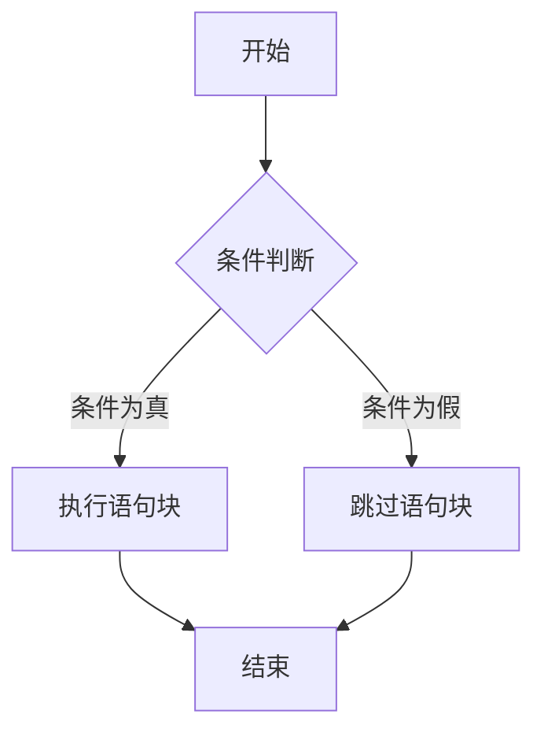
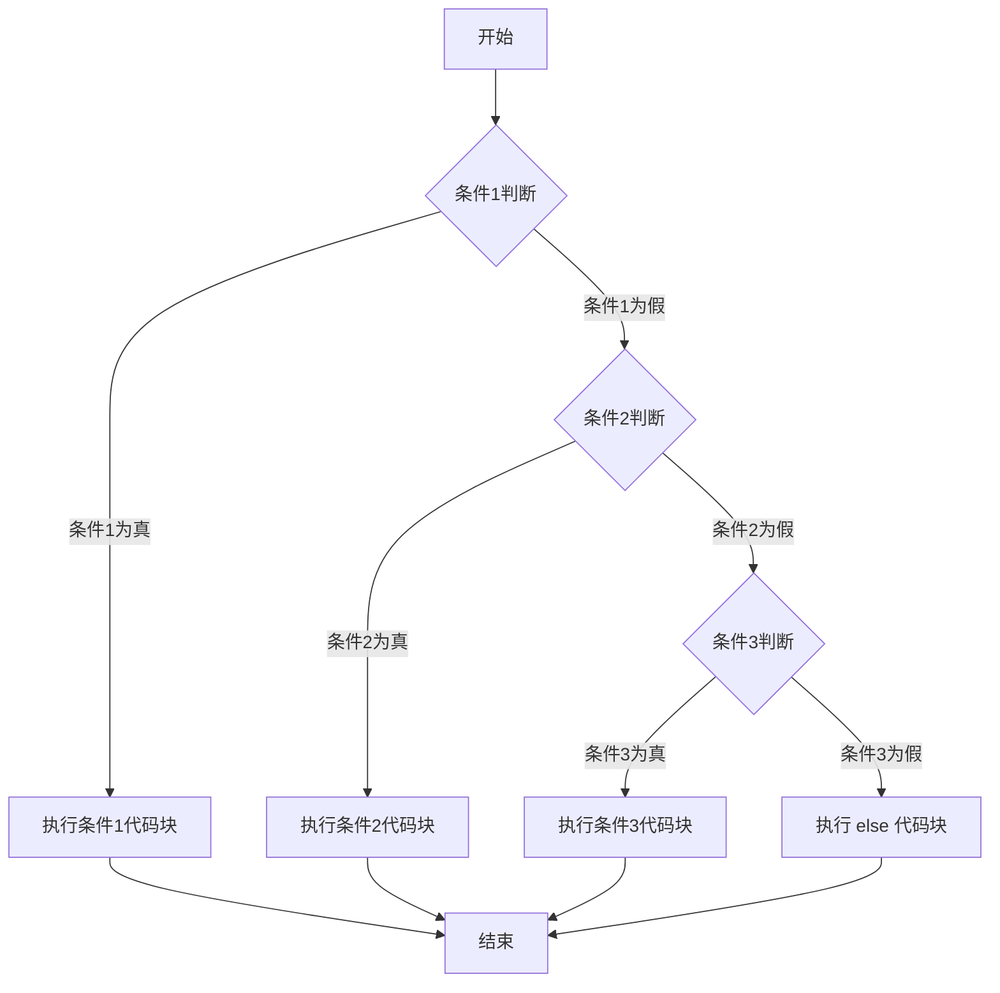
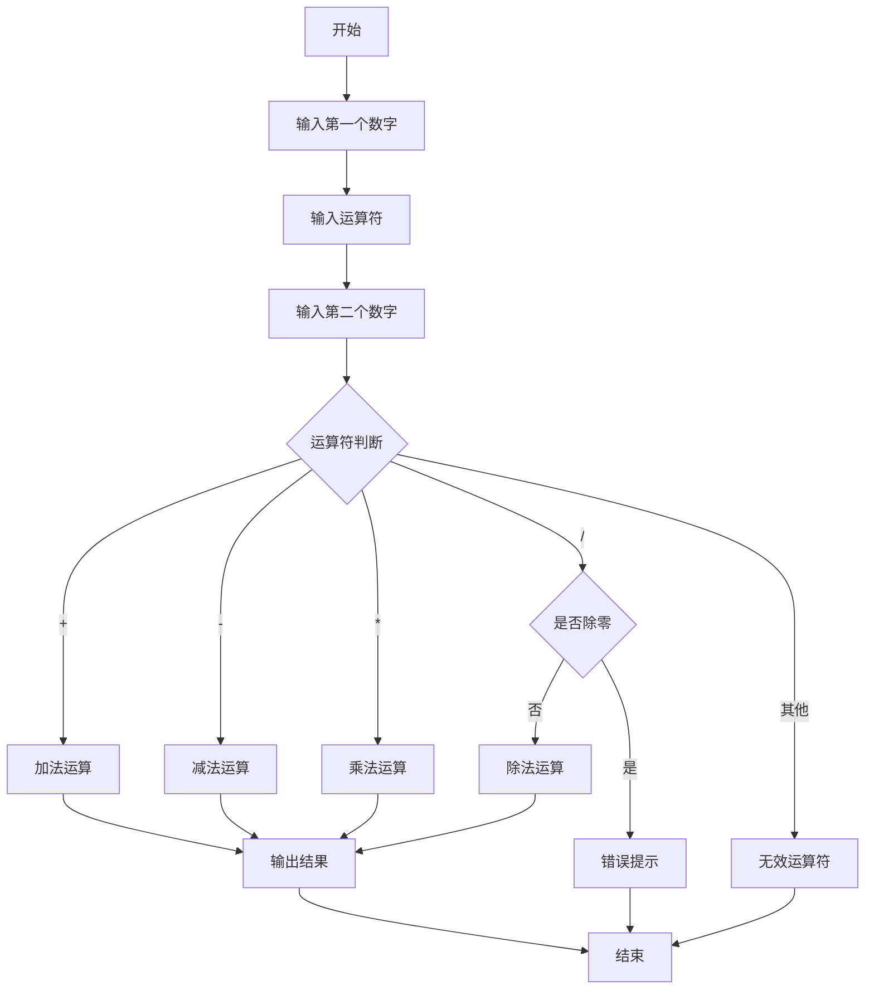
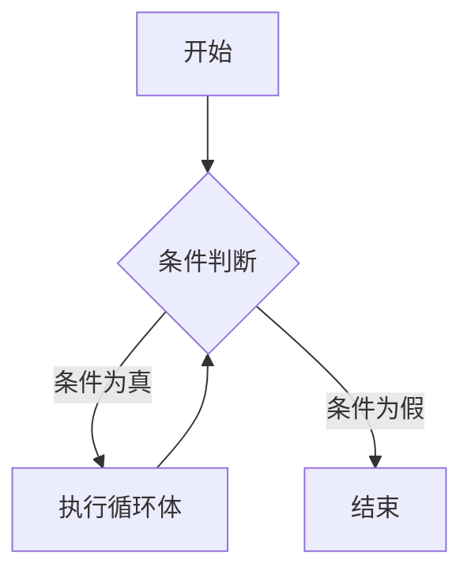
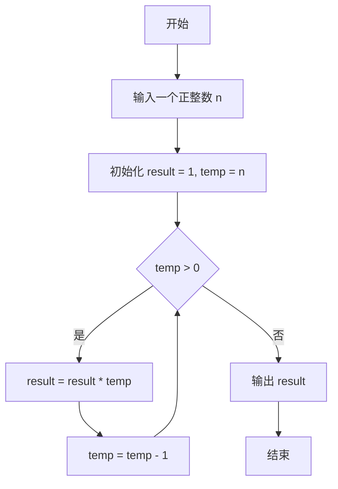
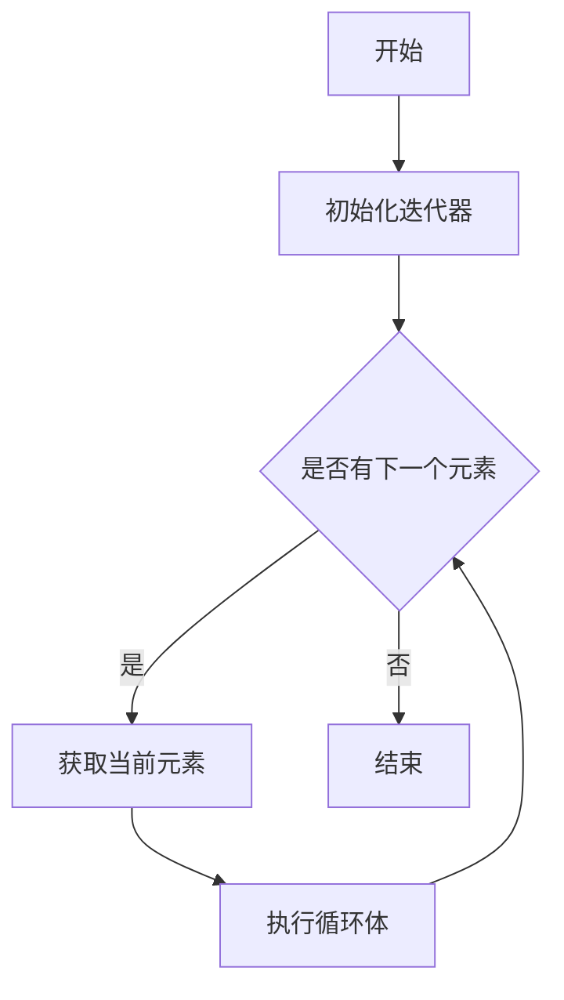
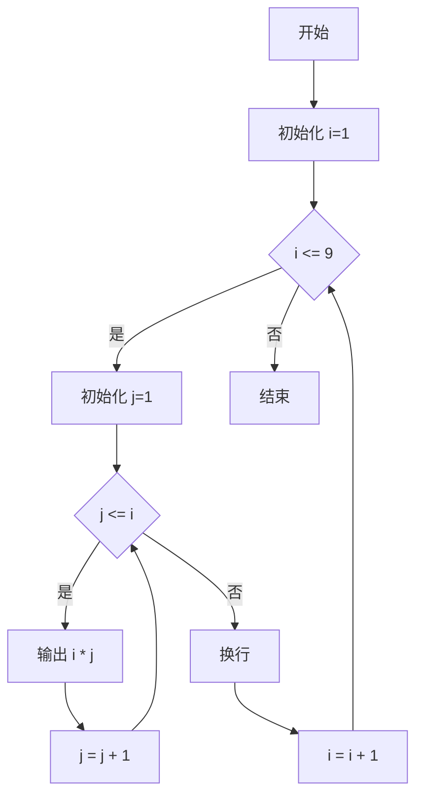

# Python 第四天：流程控制详细教程

## 课程目标
1. 理解条件控制语句的基本概念和使用方法
2. 掌握 if 语句的不同形式和应用场景
3. 学习 for 和 while 循环的使用技巧
4. 培养逻辑思维和程序设计能力


## 1. 条件控制语句 (if)
Python 条件语句是通过一条或多条语句的执行结果（True 或者 False）来决定执行的代码块。

### 1.1 语法结构


```python
if 条件:
    # 缩进的代码块
    # 当条件为 True 时执行
else:
    # 缩进的代码块
    # 当条件为 False 时执行
```

### 1.2 if else 语句练习题
```python
# 要求：根据输入的年龄判断是否成年
age = int(input("请输入你的年龄："))

if age >= 18:
    print("你已经成年了")
else
    print("你还未成年哦")
```

### 1.2 if-elif-else 语句语法


```python
if 条件1:
    # 条件1为真时执行的代码块
elif 条件2:
    # 条件2为真时执行的代码块
elif 条件3:
    # 条件3为真时执行的代码块
else:
    # 所有条件都为假时执行的代码块

```

### 1.3 if-elif-else 语句练习题
```python
# 要求：根据分数判断成绩等级
score = int(input("请输入你的分数："))

if score >= 90:
    print("优秀")
elif score >= 80:
    print("良好")
elif score >= 60:
    print("及格")
else:
    print("不及格")
```

### 作业题：简单的登录系统
#### 题目要求
创建一个简单的登录验证系统：

1. 预设用户名和密码
2. 要求用户输入用户名和密码
3. 进行登录验证
4. 根据不同情况给出提示

#### 解题思路
1. 定义预设的用户名和密码
2. 使用 input() 获取用户输入
3. 使用 if-elif-else 进行多重判断
4. 输出相应的登录结果

#### 参考代码实现
```python
# 预设用户名和密码
correct_username = "admin"
correct_password = "123456"

# 获取用户输入
input_username = input("请输入用户名：")
input_password = input("请输入密码：")

# 登录验证
if input_username == correct_username:
    if input_password == correct_password:
        print("登录成功！欢迎进入系统")
    else:
        print("密码错误，登录失败")
else:
    print("用户名不存在，登录失败")

```


### 挑战题：简单的计算器 (选做)
#### 题目要求
设计一个交互式计算器程序，能够实现以下功能：
* 接收用户输入的两个数字
* 接收用户输入的运算符
* 根据运算符执行相应的数学运算
* 输出计算结果
* 处理特殊情况（如除零错误）

#### 设计思路
1. 输入阶段
    * 使用 input() 函数获取用户输入
    * 将输入的字符串转换为数字（float()）
    * 捕获可能的输入错误
2. 运算符判断
    * 使用 if-elif-else 结构
    * 判断用户输入的运算符
    * 执行对应的数学运算
3. 错误处理
    * 检查除零情况
    * 处理无效运算符
    * 提供友好的错误提示

#### 代码流程图

#### 完整代码实现
```python

# 要求：实现一个简单的计算器
num1 = float(input("请输入第一个数："))
operator = input("请输入运算符（+, -, *, /）：")
num2 = float(input("请输入第二个数："))

if operator == '+':
    result = num1 + num2
    print(f"结果是：{result}")
elif operator == '-':
    result = num1 - num2
    print(f"结果是：{result}")
elif operator == '*':
    result = num1 * num2
    print(f"结果是：{result}")
elif operator == '/':
    if num2 != 0:
        result = num1 / num2
        print(f"结果是：{result}")
    else:
        print("错误：除数不能为零")
else:
    print("无效的运算符")

```

## 2. While 循环基本概念
### 2.1 什么是 While 循环
while 循环是一种条件控制循环，只要指定的条件为 True，循环体内的代码块就会重复执行。适合用于不确定循环次数但有明确终止条件的情况。

### 2.2 语法结构
```python
while 条件:
    # 缩进的代码块
    # 条件为 True 时重复执行

```

### 2.3 流程图


### 2.4 While 循环练习题
```python
# 要求：打印 1 到 5 的数字
count = 1
while count <= 5:
    print(count)
    count += 1


```

### 2.5 While 循环中的 break 和 continue
* break：立即跳出循环，结束循环的执行。
* continue：跳过本次循环的剩余部分，直接进入下一次循环。

**示例代码**

```python
# 要求：打印 1 到 10，但遇到 5 时跳出循环
count = 1
while count <= 10:
    if count == 5:
        break
    print(count)
    count += 1

# 要求：打印 1 到 10，但跳过 5
count = 1
while count <= 10:
    if count == 5:
        count += 1
        continue
    print(count)
    count += 1


```

### 作业题：猜数字游戏
**题目要求**

创建一个简单的猜数字游戏：

1. 系统随机生成一个 1 到 100 之间的数字。
2. 用户通过输入猜测数字。
3. 系统提示用户猜测是否正确，若不正确则提示是“太大”还是“太小”。
4. 直到用户猜对为止。

**解题思路**

1. 使用 random 模块生成随机数。
2. 使用 while 循环不断接收用户输入。
3. 使用条件判断给出提示。
4. 猜对后结束循环。

**参考代码实现**
```python
import random

# 生成一个1到100的随机数
target = random.randint(1, 100)

# 初始化猜测次数
guess_count = 0

while True:
    guess = int(input("请输入你猜测的数字（1-100）："))
    guess_count += 1
    
    if guess > target:
        print("太大了，再试一次！")
    elif guess < target:
        print("太小了，再试一次！")
    else:
        print(f"恭喜你！猜对了！用了 {guess_count} 次。")
        break


```

### 挑战题：计算阶乘 (选做)

**题目要求**

编写一个程序，计算用户输入的正整数的阶乘（例如 5! = 5 × 4 × 3 × 2 × 1 = 120）。

**设计思路**

1. 接收用户输入的正整数。
2. 使用 while 循环从输入数字递减到 1，累乘结果。
3. 输出最终结果。

**代码流程图**



**完整代码实现**

```python
# 要求：计算一个数的阶乘
n = int(input("请输入一个正整数："))
result = 1
temp = n

while temp > 0:
    result *= temp
    temp -= 1

print(f"{n} 的阶乘是：{result}")

```

## 3. For 循环基本概念
### 3.1 什么是 For 循环
for 循环用于遍历一个序列（如列表、字符串、元组等）或指定范围内的元素，适合用于已知循环次数或需要遍历容器的情况。

### 3.2 语法结构
```python
for 变量 in 可迭代对象:
    # 缩进的代码块
    # 对每个元素执行操作

```

### 3.3 流程图


### 3.4 For 循环练习题

**遍历范围**
```python
# 要求：打印 1 到 5 的数字
for i in range(1, 6):
    print(i)

```

**遍历列表**
```python
# 要求：打印列表中的每个元素
fruits = ["苹果", "香蕉", "橙子"]
for fruit in fruits:
    print(f"我喜欢吃 {fruit}")

```

### 3.5 For 循环中的 break 和 continue
与 `while` 循环类似，`break` 和 `continue` 也可以在 `for` 循环中使用：

* `break`：立即跳出循环。
* `continue`：跳过本次循环的剩余部分。

**示例代码**

```python
# 要求：打印 1 到 10，但遇到 5 时跳出循环
for i in range(1, 11):
    if i == 5:
        break
    print(i)

# 要求：打印 1 到 10，但跳过 5
for i in range(1, 11):
    if i == 5:
        continue
    print(i)

```

### 3.6 补充知识：print 函数的不换行输出
在 Python 中，print() 函数默认会在输出后换行。如果我们希望输出后不换行（例如在一行内连续打印多个内容），可以使用 end 参数来控制换行行为。

**语法说明**

```python
print(内容, end="")  # end="" 表示输出后不换行，而是继续在同一行

```
* end 参数默认值是 \n（换行符），所以 print() 默认会换行。
* 将 end 设置为其他值（如空字符串 "" 或制表符 \t）可以改变输出后的行为。

**示例代码**
```python
# 要求：在一行内打印 1 到 5 的数字，用空格分隔
for i in range(1, 6):
    print(i, end=" ")  # 输出后不换行，用空格分隔
print()  # 单独调用 print() 会换行，结束这一行输出

```

**输出结果：**
```bash
1 2 3 4 5

```


### 作业题：统计字符串中的元音字母
**题目要求**

编写一个程序，统计用户输入的字符串中元音字母（a, e, i, o, u）的个数。

**解题思路**

1. 接收用户输入的字符串。
2. 使用 for 循环遍历字符串的每个字符。
3. 判断是否为元音字母，若是则计数加 1。
4. 输出最终结果。

**参考代码实现**

```python
# 要求：统计字符串中的元音字母个数
text = input("请输入一段文本：")
vowels = ['a', 'e', 'i', 'o', 'u', 'A', 'E', 'I', 'O', 'U']
count = 0

for char in text:
    if char in vowels:
        count += 1

print(f"这段文本中有 {count} 个元音字母。")

```

### 挑战题：九九乘法表 (选做)
**题目要求**

编写一个程序，打印出九九乘法表。

**设计思路**

1. 使用嵌套 for 循环，外层循环控制行，内层循环控制列。
2. 计算并格式化输出每行的乘法结果。




**完整代码实现**

```python
# 要求：打印九九乘法表
for i in range(1, 10):
    for j in range(1, i + 1):
        print(f"{j} × {i} = {i * j}", end="\t")
    print()  # 换行

```

### 冒泡排序
冒泡排序（Bubble Sort）是一种简单的排序算法，它通过重复地遍历要排序的列表，比较相邻的元素并交换它们的位置，直到列表完全有序。以下是具体的思路：
1. **遍历列表**：从列表的第一个元素开始，逐个比较相邻的两个元素。
2. **比较与交换**：如果当前元素比下一个元素大，则交换它们的位置。这样每一轮遍历后，最大的元素会“冒泡”到列表的末尾。
3. **重复过程**：对列表进行多轮遍历，每一轮都会将一个较大的元素放到正确的位置，直到没有需要交换的元素为止。
4. **优化**：可以设置一个标志来检查是否在某一轮中发生了交换，如果没有交换，说明列表已经有序，可以提前结束排序。

#### Python 代码实现（不使用函数）
下面是冒泡排序的 Python 代码实现，仅使用 `for` 循环：

```python
number_list = [7, 6, 2, 1, 9, 11, 3]

# 打印原始列表
print("原始列表:", number_list)

n = len(number_list)
for i in range(n):  # 外层循环，控制排序轮数
    swapped = False  # 标志位，记录本轮是否有交换操作
    for j in range(0, n - i - 1):  # 内层循环，控制每轮比较次数
        if number_list[j] > number_list[j + 1]:  # 如果当前元素大于下一个元素
            # 交换位置
            temp = number_list[j]
            number_list[j] = number_list[j + 1]
            number_list[j + 1] = temp
            swapped = True  # 发生了交换
    if not swapped:  # 如果本轮没有交换，说明已有序
        break

# 打印排序后的列表
print("排序后列表:", number_list)
```

运行结果：

```bash
原始列表: [7, 6, 2, 1, 9, 11, 3]
排序后列表: [1, 2, 3, 6, 7, 9, 11]

```

#### 流程逻辑图
```mermaid
graph TD
  A[开始] --> B[初始化列表长度 n]
  B --> C[外循环 i 从 0 到 n-1]
  C --> D[设置 swapped = False]
  D --> E[内循环 j 从 0 到 n-i-2]
  E --> F{列表[j] > 列表[j+1]?}
  F -->|是| G[交换 列表[j] 和 列表[j+1]]
  G --> H[设置 swapped = True]
  H --> I[继续内循环]
  F -->|否| I
  I --> J[内循环结束]
  J --> K{swapped == False?}
  K -->|是| L[提前结束排序]
  K -->|否| M[继续外循环]
  M --> C
  L --> N[输出排序后的列表]
  N --> O[结束]
```

#### 逻辑图说明
* 外循环：控制排序的轮数，每轮将一个最大元素放到列表末尾。
* 内循环：在每轮中比较相邻元素，如果顺序不对则交换位置。
* 标志位 swapped：用于优化，如果某一轮没有发生交换，说明列表已经有序，可以提前结束排序。