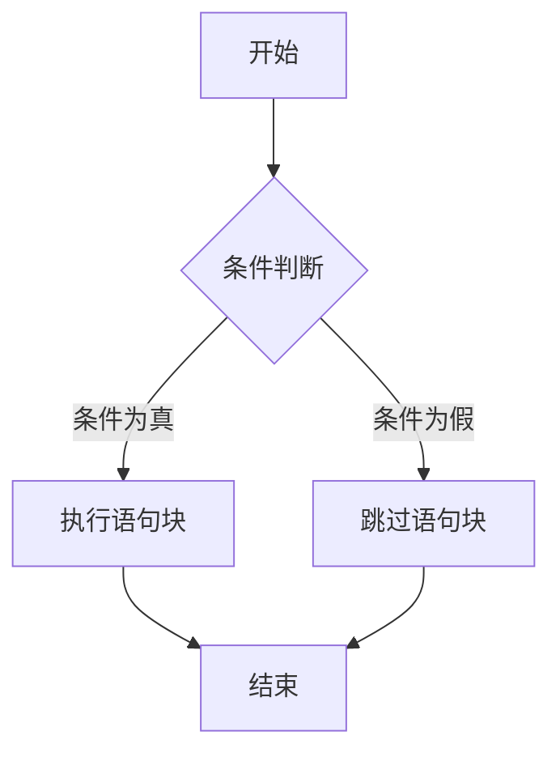
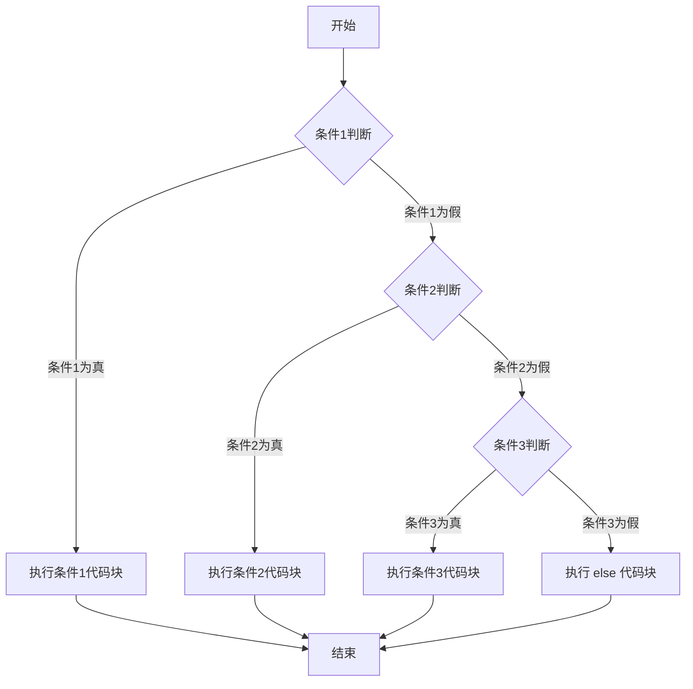
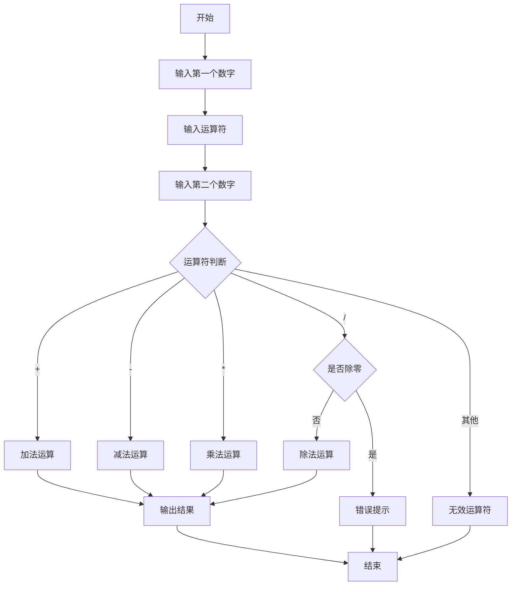

# Python 第四天：流程控制详细教程

## 课程目标
1. 理解条件控制语句的基本概念和使用方法
2. 掌握 if 语句的不同形式和应用场景
3. 学习 for 和 while 循环的使用技巧
4. 培养逻辑思维和程序设计能力


## 1. 条件控制语句 (if)
Python 条件语句是通过一条或多条语句的执行结果（True 或者 False）来决定执行的代码块。

### 1.1 语法结构


```python
if 条件:
    # 缩进的代码块
    # 当条件为 True 时执行
else:
    # 缩进的代码块
    # 当条件为 False 时执行
```

### 1.2 if else 语句练习题
```python
# 要求：根据输入的年龄判断是否成年
age = int(input("请输入你的年龄："))

if age >= 18:
    print("你已经成年了")
else
    print("你还未成年哦")
```

### 1.2 if-elif-else 语句语法


```python
if 条件1:
    # 条件1为真时执行的代码块
elif 条件2:
    # 条件2为真时执行的代码块
elif 条件3:
    # 条件3为真时执行的代码块
else:
    # 所有条件都为假时执行的代码块

```

### 1.3 if-elif-else 语句练习题
```python
# 要求：根据分数判断成绩等级
score = int(input("请输入你的分数："))

if score >= 90:
    print("优秀")
elif score >= 80:
    print("良好")
elif score >= 60:
    print("及格")
else:
    print("不及格")
```

### 作业题：简单的登录系统
#### 题目要求
创建一个简单的登录验证系统：

1. 预设用户名和密码
2. 要求用户输入用户名和密码
3. 进行登录验证
4. 根据不同情况给出提示

#### 解题思路
1. 定义预设的用户名和密码
2. 使用 input() 获取用户输入
3. 使用 if-elif-else 进行多重判断
4. 输出相应的登录结果

#### 参考代码实现
```python
# 预设用户名和密码
correct_username = "admin"
correct_password = "123456"

# 获取用户输入
input_username = input("请输入用户名：")
input_password = input("请输入密码：")

# 登录验证
if input_username == correct_username:
    if input_password == correct_password:
        print("登录成功！欢迎进入系统")
    else:
        print("密码错误，登录失败")
else:
    print("用户名不存在，登录失败")

```


### 挑战题：简单的计算器 (选做)
#### 题目要求
设计一个交互式计算器程序，能够实现以下功能：
* 接收用户输入的两个数字
* 接收用户输入的运算符
* 根据运算符执行相应的数学运算
* 输出计算结果
* 处理特殊情况（如除零错误）

#### 设计思路
1. 输入阶段
    * 使用 input() 函数获取用户输入
    * 将输入的字符串转换为数字（float()）
    * 捕获可能的输入错误
2. 运算符判断
    * 使用 if-elif-else 结构
    * 判断用户输入的运算符
    * 执行对应的数学运算
3. 错误处理
    * 检查除零情况
    * 处理无效运算符
    * 提供友好的错误提示

#### 代码流程图

#### 完整代码实现
```python

# 要求：实现一个简单的计算器
num1 = float(input("请输入第一个数："))
operator = input("请输入运算符（+, -, *, /）：")
num2 = float(input("请输入第二个数："))

if operator == '+':
    result = num1 + num2
    print(f"结果是：{result}")
elif operator == '-':
    result = num1 - num2
    print(f"结果是：{result}")
elif operator == '*':
    result = num1 * num2
    print(f"结果是：{result}")
elif operator == '/':
    if num2 != 0:
        result = num1 / num2
        print(f"结果是：{result}")
    else:
        print("错误：除数不能为零")
else:
    print("无效的运算符")

```

## 2. While 循环基本概念