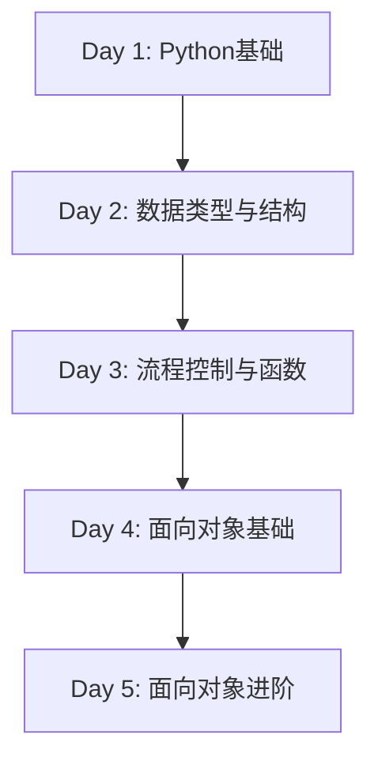

# Python 5天教学课程大纲

## 课程概述
* 课程名称：Python基础到面向对象实战课程
* 课程周期：5天
* 课程目标：掌握Python基础语法，数据类型，流程控制，函数和面向对象编程
* 授课方式：理论讲解（40%）+ 实战练习（60%）

## 详细课程安排

### Day 1：Python基础入门

1.  Python简介
    * Python的特点和应用场景
    * Python 2.x与3.x的区别
    * Python在各领域的应用

2. 开发环境配置
    * Python安装
    * IDE选择和配置（PyCharm/VS Code）
    * 第一个Python程序：Hello World

3. 基础语法
    * Python缩进规则
    * 变量与命名规则
    * 基本运算符
    * 注释的使用
    * print()函数和input()函数

4. 基础数据类型
    * Number（数字）
    * 整数（int）
    * 浮点数（float）
    * 复数（complex）
    * 布尔值（bool）
    * 数据类型转换

5. 实战练习
    * 基础运算练习
    * 类型转换练习
    * 简单程序编写

### Day 2：数据类型与结构

1. 字符串（String）
    * 字符串定义和基本操作
    * 字符串常用方法
    * 字符串格式化
    * 转义字符

2. 列表（List）
    * 列表的创建和访问
    * 列表操作（增删改查）
    * 列表推导式
    * 列表常用方法

3. 元组（Tuple）
    * 元组的特点
    * 元组的创建和访问
    * 元组与列表的区别

4. 字典（Dict）和集合（Set）
    * 字典的创建和访问
    * 字典常用方法
    * 集合的特点和操作
    * 集合运算

5. 综合练习
    * 数据结构综合应用
    * 实际案例解析

### Day 3：流程控制与函数

1. if语句
    * if-else语句
    * if-elif-else语句
    * 嵌套条件语句
    * 循环语句（10:30-12:00）

2. while循环
    * for循环
    * range()函数
    * break和continue
    * pass语句

3. 函数基础（14:00-15:30）
    * 函数的定义和调用
    * 参数传递
    * 必需参数
    * 关键字参数
    * 默认参数
    * 不定长参数
    * return语句
    * 变量作用域

4. 函数进阶
    * Lambda函数
    * 递归函数
    * 函数文档字符串
    * 内置函数介绍

### Day 4：面向对象基础
1. 面向对象概念
    * 类和对象的基本概念
    * 面向对象三大特性
    * Python的面向对象特点

2. 类的定义和使用
    * 类的创建
    * 实例化对象
    * 构造方法（init）
    * 实例属性和类属性

3. 方法
    * 实例方法
    * 类方法
    * 静态方法
    * 特殊方法（魔法方法）

4. 实战练习（15:30-17:00）
    * 简单类的设计
    * 属性和方法的使用
    * 综合案例实践

### Day 5：面向对象进阶

1. 继承
    * 单继承
    * 多重继承
    * super()函数
    * 方法重写
    * 封装和多态

2. 访问限制
    * 属性装饰器
    * 多态性
    * 抽象类

3. 综合项目实战
    * 项目需求分析
    * 类的设计
    * 代码实现
    * 功能测试
    * 课程总结

4. 知识点回顾
    * 学习建议
    * 答疑解惑

## 教学资源
1. 参考教材
    * 菜鸟教程Python3教程
    * Python官方文档

2. 教学工具
    * PyCharm/VS Code
    * Python 3.x

3. 拓展资源
    * Python官网：https://www.python.org/
    * 菜鸟教程：https://www.runoob.com/python3/
    * Python标准库文档
    * GitHub优秀Python项目
