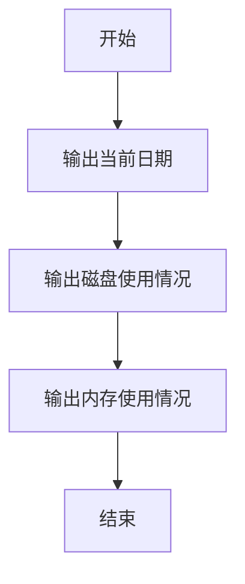
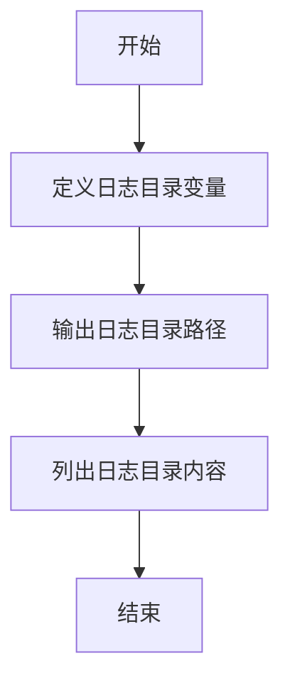
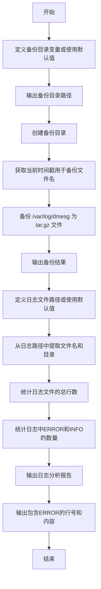

# Shell基础与运维实战教案

## 1. Shell基础应用 - 理论介绍

### 1.1 什么是Shell？
* 定义：Shell是Linux/Unix系统中的一个命令行解释器，充当用户与操作系统之间的接口。用户通过Shell输入命令，Shell解释并执行这些命令。
* 常见Shell类型：
    * bash：Bourne Again Shell，是Linux系统最常用的Shell。
    * sh：Bourne Shell，bash的前身，功能较少。
* 作用：Shell不仅可以交互式执行命令，还可以通过脚本自动化完成任务，尤其在运维中用于批量管理服务器、监控系统、日志处理等。


### 1.2 基础命令
* 命令结构：命令通常由“命令名 + 选项 + 参数”组成。
    * 示例：ls -l /home（ls是命令，-l是选项，/home是参数）。
* 脚本文件：Shell脚本是一个包含多条Shell命令的文件，通常以.sh结尾。
    * 第一行需指定解释器：#!/bin/bash。
* 执行脚本：需要赋予执行权限 chmod +x script.sh，然后运行 ./script.sh。
* 注释：以 # 开头的行是注释，用于解释代码，不会被执行。

### 1.3 企业运维场景中的Shell基础命令
以下是一些基础命令在运维中的实际应用：

```bash
# 查看系统资源使用情况
top  # 实时查看CPU、内存使用
df -h  # 查看磁盘空间使用情况
free -m  # 查看内存使用情况

# 文件操作：运维中常用于日志管理
find /var/log -type f -size +100M  # 查找大于100M的日志文件
du -sh /var/log/*  # 查看日志目录下各文件大小
rm -f /var/log/*.log  # 删除特定日志文件

# 系统信息查询：运维中用于收集环境信息
uname -a      # 查看系统内核版本和架构
hostname      # 查看当前主机名
whoami        # 查看当前登录用户
```

### 1.4 命令执行状态码 $?
* 定义：$? 是一个特殊变量，用于存储上一条命令的退出状态码（Exit Status），表示命令执行是否成功。
* 值含义：
    * 0：表示命令执行成功。
    * 非0：表示命令执行失败，具体值可能代表不同错误类型（例如 1 通常是通用错误，127 表示命令未找到）。
* 运维场景：在脚本中检查命令是否成功执行，便于故障排查。
* 示例：
    ```bash
    ls /tmp
    echo "ls 命令的退出状态码：$?"
    ls /not_exist_dir
    echo "ls 命令的退出状态码：$?"
    ```

## 2. 简单Shell脚本的设计

### 2.1 什么是Shell脚本？
* 定义：Shell脚本是一个包含多条Shell命令的文件，用于自动化执行任务。
* 脚本结构：
* 第一行指定解释器：`#!/bin/bash`。
* 后面是命令序列，按顺序执行。
* 创建和运行脚本：
* 使用编辑器（如`vim`）创建文件。
* 赋予执行权限：`chmod +x 文件名`。
* 运行：`./文件名`。

### 2.2 企业运维脚本示例

#### 脚本1：输出系统基本信息

**逻辑流程图：**



**说明：** 上面的Mermaid流程图展示了脚本的逻辑：首先获取磁盘使用率，然后判断是否超过80%，根据结果输出不同信息。

**脚本代码：**

```bash
#!/bin/bash
# 脚本目的：输出系统基本信息

echo "当前日期："
date
echo "磁盘使用情况："
df -h
echo "内存使用情况："
free -m
```

**操作步骤：**

1. 创建脚本文件 `vim system_info.sh`
2. 赋予执行权限 `chmod +x system_info.sh`
3. 运行脚本 `./system_info.sh`

**代码解释：**

* `echo`：输出文本到终端，用于显示信息。
* `date`：显示当前日期和时间。
* `df -h` 和 `free -m`：分别显示磁盘和内存使用情况。

**运维场景：** 快速查看系统状态，常用于日常巡检。

#### 脚本2：检查命令执行状态
**脚本代码：**

```bash
#!/bin/bash
# 脚本目的：检查命令执行状态并输出结果

echo "尝试列出 /tmp 目录内容："
ls /tmp
echo "ls 命令的退出状态码：$?"

echo "尝试列出不存在的目录："
ls /not_exist_dir
echo "ls 命令的退出状态码：$?"
```

**操作步骤：**
1. 创建脚本文件：`vim check_status.sh`，粘贴代码，保存退出（:wq）。
2. 赋予执行权限：`chmod +x check_status.sh`。
3. 运行脚本：`./check_status.sh`。

**代码解释：**

* `$?`：获取上一条命令的退出状态码，0 表示成功，非 0 表示失败。
* 运维中可用于脚本调试，确认每条关键命令是否执行成功。

**运维场景：** 在自动化脚本中检查命令执行状态，确保任务按预期完成，例如检查备份命令是否成功。

## 3. 使用Shell变量
#### 3.1 变量基础
* 定义变量：`variable_name=value`（等号两边不能有空格）。
* 引用变量：`$variable_name` 或 `${variable_name}`。
* 查看变量：`echo $variable_name`。

## 3.2 企业运维脚本示例
**脚本2：使用变量定义日志路径并查看**

**逻辑流程图：**



**说明：** 流程图展示了如何使用变量存储路径并操作。

**脚本代码：**

```bash
#!/bin/bash
# 脚本目的：使用变量定义日志目录并查看内容

LOG_DIR="/var/log"
echo "日志目录是：$LOG_DIR"
ls -l $LOG_DIR

```

**操作步骤：**

1. 创建脚本文件： `vim log_path.sh`
2. 赋予执行权限：`chmod +x log_path.sh`
3. 运行脚本：`./log_path.sh`

**代码解释：**

* `LOG_DIR="/var/log"`：定义变量存储日志目录路径。
* `echo "日志目录是：$LOG_DIR"`：输出变量值。
* `ls -l $LOG_DIR`：列出该目录内容。

**运维场景：** 变量便于管理路径，尤其在脚本中需要多次引用同一路径时。

## 4. 变量的扩展应用

### 4.1 变量扩展技巧
* 命令替换：将命令的输出存储到变量中，使用 $(命令) 或 `命令`，例如 CURRENT_DATE=$(date)。
* 参数变量：脚本运行时传入的参数，常见的有：
    * `$0`：脚本文件名本身。
    * `$1, $2, ...`：脚本的第1个、第2个参数，例如 `./script.sh arg1 arg2`，则 `$1` 是 `arg1`，`$2` 是 `arg2`。
    * `$#`：参数个数，例如传入3个参数则 $# 为 3。
    * `$@`：所有参数的列表，例如传入 `arg1 arg2` 则 `$@` 表示 `"arg1 arg2"`。

* 默认值扩展：`${variable:-default}`，如果变量未定义或为空，则使用默认值，例如 `${1:-"default"}`（如果未传入第一个参数，则使用 `"default"`）。

* 字符串操作：
    * `${variable#pattern}`：从变量开头删除匹配的模式，例如 `VAR="abc123"; echo ${VAR#abc}` 输出 123。
    * `${variable%pattern}`：从变量结尾删除匹配的模式，例如 `VAR="123xyz"; echo ${VAR%xyz}` 输出 123。

#### 订单编号处理 - 提取订单信息
在业务中，订单编号通常包含前缀和流水号，字符串操作可以帮助提取关键信息，例如提取订单日期用于统计。

**要求**

1. 定义一个变量存储订单编号，例如 order_id="ORD_20230711_12345"。
2. 使用 ${variable#pattern} 去掉订单编号开头的前缀 "ORD_"，输出结果。
3. 使用 ${variable%pattern} 去掉订单编号结尾的流水号 "_12345"，输出结果。

**参考代码：**

```bash
#!/bin/bash
# 脚本目的：使用字符串操作处理订单编号

order_id="ORD_20230711_12345"

echo "原始订单编号：$order_id"
echo "去掉前缀 'ORD_' 后：${order_id#ORD_}"
echo "去掉后缀 '_12345' 后：${order_id%_12345}"

```

**操作步骤：**

1. 创建脚本文件：vim order_id_process.sh，粘贴代码，保存退出（:wq）。
2. 赋予执行权限：chmod +x order_id_process.sh。
3. 运行脚本：./order_id_process.sh。
4. 查看输出结果，确认订单编号处理是否正确。


#### 作业需求：简易日志文件信息提取脚本

你需要编写一个 Bash 脚本，用于提取一个日志文件的基本信息，并根据用户输入的参数生成一个简单的报告。假设日志文件格式为每行包含日期、时间和消息内容，类似于：

```
2023-10-01 10:00:00 ERROR: Database connection failed
2023-10-01 10:01:00 INFO: Server started
```

**具体功能要求：**
1. 脚本接受一个日志文件路径作为参数 `$1`，如果未提供则使用默认路径 `./default.log`。
2. 使用命令替换获取当前日期和系统用户名，并将其存储到变量中，用于报告输出。
3. 从日志文件名中提取文件名（不包含路径），用于输出报告。
4. 统计日志文件的总行数、包含 `ERROR` 关键字的行数和包含 `INFO` 关键字的行数。
5. 生成一个详细的分析报告，包含当前日期、用户名、日志文件名和统计数据。

**代码：**

````bash
#!/bin/bash

# 获取当前日期并存储到变量中，使用命令替换
CURRENT_DATE=$(date +"%Y-%m-%d %H:%M:%S")

# 获取当前用户名，使用命令替换
CURRENT_USER=$(whoami)

# 使用默认值扩展设置日志文件路径，如果未传入参数 $1 则使用默认值
LOG_FILE=${1:-"./default.log"}

# 从日志文件路径中提取文件名（去除路径部分），使用字符串操作
LOG_NAME=${LOG_FILE##*/}

# 从日志文件路径中提取路径部分（去除文件名），使用字符串操作
LOG_PATH=${LOG_FILE%/*}

# 统计日志文件的总行数，使用命令替换和 wc 命令
TOTAL_LINES=$(wc -l < "$LOG_FILE")

# 统计日志文件中 ERROR 关键字的出现次数
ERROR_COUNT=$(grep -c "ERROR" "$LOG_FILE")

# 统计日志文件中 INFO 关键字的出现次数
INFO_COUNT=$(grep -c "INFO" "$LOG_FILE")

# 输出详细的分析报告
echo "===== 日志分析报告 ====="
echo "分析日期：$CURRENT_DATE"
echo "分析用户：$CURRENT_USER"
echo "日志文件完整路径：$LOG_FILE"
echo "日志文件名：$LOG_NAME"
echo "日志路径：$LOG_PATH"
echo "日志总行数：$TOTAL_LINES"
echo "错误数量（ERROR）：$ERROR_COUNT"
echo "信息数量（INFO）：$INFO_COUNT"
echo "========================="

# 输出脚本执行的参数信息，用于调试
echo "脚本文件名：$0"
echo "传入参数个数：$#"
echo "所有参数：$@"
echo "报告生成完成！"
````

##### 作业任务：
1. **理解脚本**：仔细阅读上述代码，理解每一行的作用，特别是命令替换、参数变量、默认值扩展和字符串操作的使用。
2. **测试脚本**：
   - 创建一个简单的日志文件（例如 `test.log`），包含至少 5 条日志，其中至少 2 条包含 `ERROR`，2 条包含 `INFO`。例如：
     ```
     2023-10-01 10:00:00 ERROR: Database connection failed
     2023-10-01 10:01:00 INFO: Server started
     2023-10-01 10:02:00 ERROR: Timeout occurred
     2023-10-01 10:03:00 INFO: Connection established
     2023-10-01 10:04:00 DEBUG: Processing data
     ```
   - 运行脚本，分别测试传入文件参数（例如 `./script.sh test.log`）和不传入参数的情况（例如 `./script.sh`）。
3. **记录结果**：记录脚本运行的输出结果，观察报告中各项数据是否正确，例如日志文件名、路径、总行数、ERROR 和 INFO 数量等。
4. **提交作业**：将你的测试日志文件内容、脚本运行结果（可以是截图或文本）以及对脚本中关键知识点的理解总结提交。

##### 提示：
- 使用 `wc -l` 统计文件行数，结合命令替换存储到变量。
- 使用 `${variable##pattern}` 和 `${variable%pattern}` 处理字符串，提取文件名和路径。
- 确保脚本逻辑清晰，注释足够，方便自己复习。


好的，我理解你的需求。你希望在 Ubuntu 系统中对 `/var/log/dmesg` 进行备份，使用 `tar` 命令创建压缩文件，并将备份文件名加上时间戳，格式为 `.tar.gz`。以下是针对这一需求的优化脚本和详细说明。


### 4.2 企业运维脚本示例（进一步优化版）

#### 脚本3：备份 `/var/log/dmesg` 并进行日志分析

**说明：** 流程图展示了如何使用变量默认值设置备份目录，并对 `/var/log/dmesg` 进行压缩备份（`.tar.gz` 格式，文件名包含时间戳），同时结合日志分析功能，适用于 Ubuntu 系统的运维场景。

**运维场景：**
- **日志备份**：对 Ubuntu 系统的 `/var/log/dmesg` 进行定期备份，生成带时间戳的 `.tar.gz` 文件，便于历史记录和问题追溯。
- **日志监控**：自动分析日志内容，统计错误和信息数量，并输出错误详情，适用于日常运维监控和问题排查。
- **权限注意**：在 Ubuntu 系统中，`/var/log/dmesg` 通常需要 root 权限访问和备份，因此运行脚本时可能需要使用 `sudo`。

**操作步骤：**

1. **创建脚本文件**：使用 `vim backup_dmesg.sh` 创建脚本文件，并将上述代码粘贴进去。
2. **赋予执行权限**：运行 `chmod +x backup_dmesg.sh` 以确保脚本可执行。
3. **运行脚本**：
   - 不带参数运行命令：`./backup_dmesg.sh`（使用默认备份路径和日志路径 `/var/log/dmesg`）。
   - 带参数运行命令：`./backup_dmesg.sh /backup/default /var/log/dmesg`（自定义备份路径和日志文件路径）。
   - **注意**：如果备份路径或 `/var/log/dmesg` 文件需要 root 权限访问，请以 `sudo` 运行脚本：`sudo ./backup_dmesg.sh /backup/default /var/log/dmesg`。
4. **检查输出**：
   - 观察备份目录是否创建成功，备份文件（如 `dmesg_backup_20250714_151530.tar.gz`）是否生成。
   - 检查日志分析报告是否正确生成，特别是 `ERROR` 详情部分。
5. **测试日志文件**：如果需要测试其他日志文件，可以指定第二个参数为自定义日志文件路径。

**脚本代码：**

```bash
#!/bin/bash
# 日志备份：对 Ubuntu 系统的 /var/log/dmesg 进行定期备份，生成带时间戳的 .tar.gz 文件，便于历史记录和问题追溯。
# 日志监控：自动分析日志内容，统计错误和信息数量，并输出错误详情，适用于日常运维监控和问题排查。
# 权限注意：在 Ubuntu 系统中，/var/log/dmesg 通常需要 root 权限访问和备份，因此运行脚本时可能需要使用 sudo。
# $1  你打包的路径  $2 备份文件路径

# 打包好的日志压缩包，存放在哪里
BACKUP_DIR=${1:-"/backup/default"}

# 定义日志文件路径，如果未传入第二个参数则使用默认值 /var/log/dmesg
LOG_FILE=${2:-"/var/log/dmesg"}

# 输出备份目录路径
echo "备份目录是：$BACKUP_DIR"

# 指定创建文件夹的命令
mkdir -p $BACKUP_DIR

echo "备份目录已经创建完成"

# 获取当前时间戳，用于备份文件名（格式：YYYYMMDD_HHMMSS）
TIMESTAMP=$(date +"%Y%m%d_%H%M%S")

# 定义备份文件名，包含时间戳
# /backup/default/dmesg_backup_2025xxxxx.tar.gz
BACKUP_FILE="$BACKUP_DIR/dmesg_backup_$TIMESTAMP.tar.gz"

# 备份/var/log/dmesg 到指定目录
# tar -zcvf /backup/default/dmesg_backup_2025xxxxx.tar.gz /var/log/dmesg
sudo tar -czvf $BACKUP_FILE $LOG_FILE && echo "备份成功：$BACKUP_FILE" || echo "备份失败，请检查权限或文件是否存在"

echo "日志备份完成，备份文件路径：$BACKUP_FILE"


# 从日志文件路径中提取文件名（去除路径部分），使用字符串操作
LOG_NAME=${LOG_FILE##*/}

# 从日志文件路径中提取路径部分（去除文件名），使用字符串操作
LOG_PATH=${LOG_FILE%/*}

# 获取当前日期和时间，用于报告
CURRENT_DATE=$(date +"%Y-%m-%d %H:%M:%S")

# 获取当前用户名，用于报告
CURRENT_USER=$(whoami)

# 统计日志文件的总行数
TOTAL_LINES=$(wc -l < "$LOG_FILE" 2>/dev/null || echo "无法读取文件")

# 统计日志文件中 ERROR 关键字的出现次数
ERROR_COUNT=$(grep -c "ERROR" "$LOG_FILE" 2>/dev/null || echo "0")

# 统计日志文件中 INFO 关键字的出现次数
INFO_COUNT=$(grep -c "INFO" "$LOG_FILE" 2>/dev/null || echo "0")

# 输出详细的日志分析报告
echo "===== 日志分析报告 ====="
echo "分析日期：$CURRENT_DATE"
echo "分析用户：$CURRENT_USER"
echo "日志文件完整路径：$LOG_FILE"
echo "日志文件名：$LOG_NAME"
echo "日志路径：$LOG_PATH"
echo "日志总行数：$TOTAL_LINES"
echo "错误数量（ERROR）：$ERROR_COUNT"
echo "信息数量（INFO）：$INFO_COUNT"
echo "========================="

# 输出包含 ERROR 的行号和内容，使用 grep -n
echo "错误日志详情（行号:内容）："
grep -n "ERROR" "$LOG_FILE" 2>/dev/null && echo "错误详情输出完成！" || echo "未找到错误日志"

# 输出脚本执行信息
echo "脚本文件名：$0"
echo "传入参数个数：$#"
echo "所有参数：$@"
echo "报告生成完成！"
```

**代码解释：**

- **`${1:-"/backup/default"}`**：如果脚本运行时未提供第一个参数，则使用默认值 `/backup/default` 作为备份目录。
- **`TIMESTAMP=$(date +"%Y%m%d_%H%M%S")`**：获取当前时间戳，格式为 `YYYYMMDD_HHMMSS`，用于生成唯一的备份文件名。
- **`tar -czvf`**：使用 `tar` 命令创建压缩备份文件：
  - `-c`：创建归档文件。
  - `-z`：使用 gzip 压缩，生成 `.tar.gz` 格式。
  - `-v`：显示操作过程（可选）。
  - `-f`：指定输出文件名。
- **`&& echo ... || echo ...`**：条件输出，备份成功或失败时分别显示不同的消息。
- **`${LOG_FILE##*/}` 和 `${LOG_FILE%/*}`**：使用字符串操作分别提取日志文件名和路径部分。
- **`wc -l`**：统计日志文件总行数。
- **`grep -c`**：统计 `ERROR` 和 `INFO` 关键字的出现次数。
- **`grep -n`**：输出包含 `ERROR` 的行号和内容，便于定位问题。
- **`2>/dev/null || echo ...`**：错误处理，如果文件不可读或命令失败，则输出默认信息。

**逻辑流程图：**



## 5. Shell 中的数值运算（优化版）

### 5.1 数值运算基础
* **运算方式**：使用 `(( ))` 进行计算，支持整数运算。
* **示例**：`((result=2+3))`。
* **常用运算符**：
  - `+`（加）、`-`（减）、`*`（乘）、`/`（除）、`%`（取余）。
  - 高级运算符：`**`（幂运算）、`++`（自增）、`--`（自减）。
* **注意事项**：
  - 除法 `/` 结果为整数，余数可用 `%` 获取。
  - 变量引用时不需要 `$`，但输出时需要 `echo $result`。

| 运算符 | 功能     | 示例                 | 结果  |
|--------|----------|----------------------|-------|
| +      | 加法     | ((result=5+3))      | 8     |
| -      | 减法     | ((result=5-3))      | 2     |
| *      | 乘法     | ((result=5*3))      | 15    |
| /      | 除法     | ((result=6/2))      | 3     |
| %      | 取余     | ((result=5%2))      | 1     |
| **     | 幂运算   | ((result=2**3))     | 8     |
| ++     | 自增     | ((result=5; result++)) | 6  |
| --     | 自减     | ((result=5; result--)) | 4  |

### 5.2 用户输入：read 命令（优化版）
* **定义**：`read` 命令用于从标准输入（通常是键盘）读取用户输入，并将其存储到变量中。
* **常用选项**：
  - `-p`：显示提示信息。
  - `-t`：设置超时时间（秒）。
  - `-n`：限制输入字符数。

#### 使用 read 实现交互式运维工具：备份频率计算器
编写一个 Shell 脚本，使用 `read` 命令从用户输入获取备份相关数据（如数据量大小、备份时间间隔），然后计算备份频率和每次备份的数据量。

**逻辑流程图：**

```mermaid
    flowchart TD
    A[开始] --> B[提示用户输入总数据量大小 (GB)]
    B --> C[提示用户输入备份时间间隔 (小时)]
    C --> D[提示用户输入备份周期 (天)]
    D --> E[计算每小时备份数据量]
    E --> F[计算每天备份次数]
    F --> G[计算每次备份数据量]
    G --> H[输出备份频率报告]
    H --> I[结束]
```

**说明：** 流程图展示了如何通过用户输入的数据，计算备份频率和每次备份的数据量，帮助运维人员规划备份策略。

**脚本代码：**

```bash
#!/bin/bash
# 脚本目的：交互式计算备份频率和每次备份数据量

# 提示用户输入总数据量大小（单位：GB）
read -p "请输入总数据量大小（GB）： " TOTAL_DATA

# 提示用户输入备份时间间隔（单位：小时）
read -p "请输入备份时间间隔（小时）： " INTERVAL_HOURS

# 提示用户输入备份周期（单位：天）
read -p "请输入备份周期（天）： " CYCLE_DAYS

# 计算每小时备份数据量（GB/小时）
((DATA_PER_HOUR = TOTAL_DATA / INTERVAL_HOURS))

# 计算每天备份次数（基于时间间隔）
((BACKUPS_PER_DAY = 24 / INTERVAL_HOURS))

# 计算每次备份数据量（GB/次）
((DATA_PER_BACKUP = TOTAL_DATA / (CYCLE_DAYS * BACKUPS_PER_DAY)))

# 输出备份频率报告
echo "===== 备份频率计算报告 ====="
echo "计算时间：$(date +'%Y-%m-%d %H:%M:%S')"
echo "计算用户：$(whoami)"
echo "=============================="
echo "总数据量：$TOTAL_DATA GB"
echo "备份时间间隔：$INTERVAL_HOURS 小时"
echo "备份周期：$CYCLE_DAYS 天"
echo "-----------------------------"
echo "每小时备份数据量：$DATA_PER_HOUR GB"
echo "每天备份次数：$BACKUPS_PER_DAY 次"
echo "每次备份数据量：$DATA_PER_BACKUP GB"
echo "===== 报告结束 ====="
```

**操作步骤：**
1. **创建脚本文件**：使用 `vim backup_calculator.sh` 创建脚本文件，并将上述代码粘贴进去。
2. **赋予执行权限**：运行 `chmod +x backup_calculator.sh`。
3. **运行脚本**：执行 `./backup_calculator.sh`，按提示输入总数据量、备份间隔和周期。
4. **检查输出**：观察报告中每小时备份数据量、每天备份次数和每次备份数据量是否合理。
5. **测试不同输入**：
   - 输入不同的数据量（如 100、500）、间隔（如 2、6）和周期（如 7、30）观察结果。

**代码解释：**
- **`read -p`**：提示用户输入总数据量、备份间隔和周期。
- **`((DATA_PER_HOUR = TOTAL_DATA / INTERVAL_HOURS))`**：计算每小时备份数据量。
- **`((BACKUPS_PER_DAY = 24 / INTERVAL_HOURS))`**：计算每天备份次数（基于 24 小时）。
- **`((DATA_PER_BACKUP = TOTAL_DATA / (CYCLE_DAYS * BACKUPS_PER_DAY)))`**：计算每次备份数据量。

**运维场景：** 该脚本适用于企业运维中规划备份策略，帮助管理员根据数据量和时间间隔计算备份频率和资源需求。


