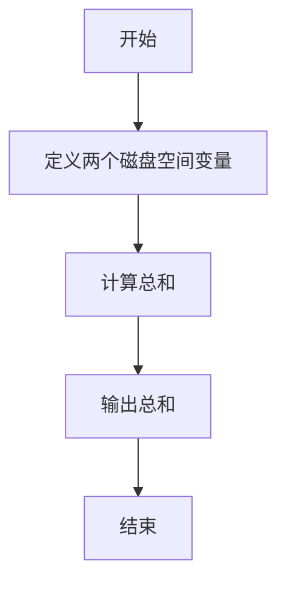
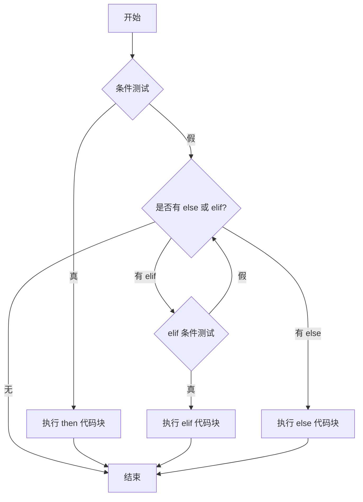
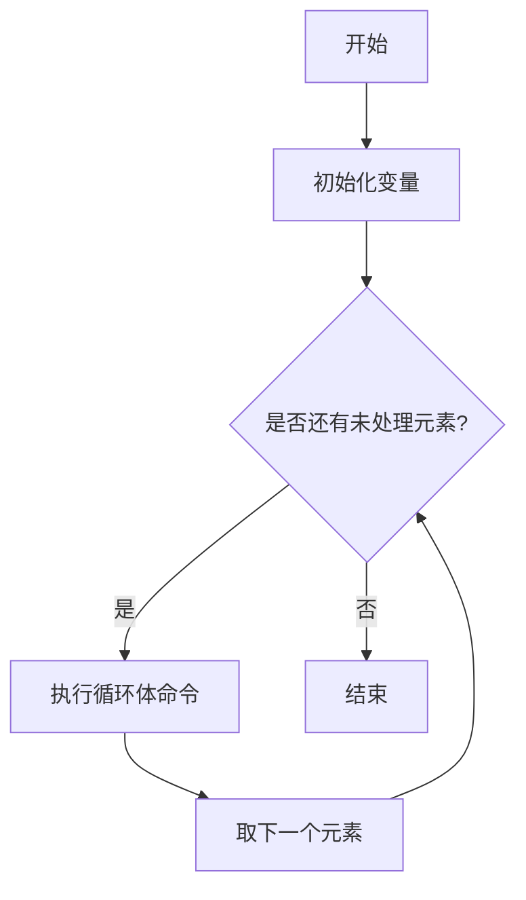
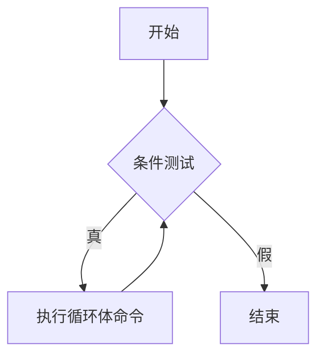

# Shell基础与运维实战教案

## 1. Shell基础应用 - 理论介绍

### 1.1 什么是Shell？
* 定义：Shell是Linux/Unix系统中的一个命令行解释器，充当用户与操作系统之间的接口。用户通过Shell输入命令，Shell解释并执行这些命令。
* 常见Shell类型：
    * bash：Bourne Again Shell，是Linux系统最常用的Shell。
    * sh：Bourne Shell，bash的前身，功能较少。
* 作用：Shell不仅可以交互式执行命令，还可以通过脚本自动化完成任务，尤其在运维中用于批量管理服务器、监控系统、日志处理等。


### 1.2 基础命令
* 命令结构：命令通常由“命令名 + 选项 + 参数”组成。
    * 示例：ls -l /home（ls是命令，-l是选项，/home是参数）。
* 脚本文件：Shell脚本是一个包含多条Shell命令的文件，通常以.sh结尾。
    * 第一行需指定解释器：#!/bin/bash。
* 执行脚本：需要赋予执行权限 chmod +x script.sh，然后运行 ./script.sh。
* 注释：以 # 开头的行是注释，用于解释代码，不会被执行。

### 1.3 企业运维场景中的Shell基础命令
以下是一些基础命令在运维中的实际应用：

```bash
# 查看系统资源使用情况
top  # 实时查看CPU、内存使用
df -h  # 查看磁盘空间使用情况
free -m  # 查看内存使用情况

# 文件操作：运维中常用于日志管理
find /var/log -type f -size +100M  # 查找大于100M的日志文件
du -sh /var/log/*  # 查看日志目录下各文件大小
rm -f /var/log/*.log  # 删除特定日志文件

# 系统信息查询：运维中用于收集环境信息
uname -a      # 查看系统内核版本和架构
hostname      # 查看当前主机名
whoami        # 查看当前登录用户
```

### 1.4 命令执行状态码 $?
* 定义：$? 是一个特殊变量，用于存储上一条命令的退出状态码（Exit Status），表示命令执行是否成功。
* 值含义：
    * 0：表示命令执行成功。
    * 非0：表示命令执行失败，具体值可能代表不同错误类型（例如 1 通常是通用错误，127 表示命令未找到）。
* 运维场景：在脚本中检查命令是否成功执行，便于故障排查。
* 示例：
    ```bash
    ls /tmp
    echo "ls 命令的退出状态码：$?"
    ls /not_exist_dir
    echo "ls 命令的退出状态码：$?"
    ```

## 2. 简单Shell脚本的设计

### 2.1 什么是Shell脚本？
* 定义：Shell脚本是一个包含多条Shell命令的文件，用于自动化执行任务。
* 脚本结构：
* 第一行指定解释器：`#!/bin/bash`。
* 后面是命令序列，按顺序执行。
* 创建和运行脚本：
* 使用编辑器（如`vim`）创建文件。
* 赋予执行权限：`chmod +x 文件名`。
* 运行：`./文件名`。

### 2.2 企业运维脚本示例

#### 脚本1：输出系统基本信息

**逻辑流程图：**


**说明：** 上面的Mermaid流程图展示了脚本的逻辑：首先获取磁盘使用率，然后判断是否超过80%，根据结果输出不同信息。

**脚本代码：**

```bash
#!/bin/bash
# 脚本目的：输出系统基本信息

echo "当前日期："
date
echo "磁盘使用情况："
df -h
echo "内存使用情况："
free -m
```

**操作步骤：**

1. 创建脚本文件 `vim system_info.sh`
2. 赋予执行权限 `chmod +x system_info.sh`
3. 运行脚本 `./system_info.sh`

**代码解释：**

* `echo`：输出文本到终端，用于显示信息。
* `date`：显示当前日期和时间。
* `df -h` 和 `free -m`：分别显示磁盘和内存使用情况。

**运维场景：** 快速查看系统状态，常用于日常巡检。

#### 脚本2：检查命令执行状态
**脚本代码：**

```bash
#!/bin/bash
# 脚本目的：检查命令执行状态并输出结果

echo "尝试列出 /tmp 目录内容："
ls /tmp
echo "ls 命令的退出状态码：$?"

echo "尝试列出不存在的目录："
ls /not_exist_dir
echo "ls 命令的退出状态码：$?"
```

**操作步骤：**
1. 创建脚本文件：`vim check_status.sh`，粘贴代码，保存退出（:wq）。
2. 赋予执行权限：`chmod +x check_status.sh`。
3. 运行脚本：`./check_status.sh`。

**代码解释：**

* `$?`：获取上一条命令的退出状态码，0 表示成功，非 0 表示失败。
* 运维中可用于脚本调试，确认每条关键命令是否执行成功。

**运维场景：** 在自动化脚本中检查命令执行状态，确保任务按预期完成，例如检查备份命令是否成功。

## 3. 使用Shell变量
#### 3.1 变量基础
* 定义变量：`variable_name=value`（等号两边不能有空格）。
* 引用变量：`$variable_name` 或 `${variable_name}`。
* 查看变量：`echo $variable_name`。

## 3.2 企业运维脚本示例
**脚本2：使用变量定义日志路径并查看**

**逻辑流程图：**


**说明：** 流程图展示了如何使用变量存储路径并操作。

**脚本代码：**

```bash
#!/bin/bash
# 脚本目的：使用变量定义日志目录并查看内容

LOG_DIR="/var/log"
echo "日志目录是：$LOG_DIR"
ls -l $LOG_DIR

```

**操作步骤：**

1. 创建脚本文件： `vim log_path.sh`
2. 赋予执行权限：`chmod +x log_path.sh`
3. 运行脚本：`./log_path.sh`

**代码解释：**

* `LOG_DIR="/var/log"`：定义变量存储日志目录路径。
* `echo "日志目录是：$LOG_DIR"`：输出变量值。
* `ls -l $LOG_DIR`：列出该目录内容。

**运维场景：** 变量便于管理路径，尤其在脚本中需要多次引用同一路径时。

## 4. 变量的扩展应用

### 4.1 变量扩展技巧
* 命令替换：将命令的输出存储到变量中，使用 $(命令) 或 `命令`，例如 CURRENT_DATE=$(date)。
* 参数变量：脚本运行时传入的参数，常见的有：
    * `$0`：脚本文件名本身。
    * `$1, $2, ...`：脚本的第1个、第2个参数，例如 `./script.sh arg1 arg2`，则 `$1` 是 `arg1`，`$2` 是 `arg2`。
    * `$#`：参数个数，例如传入3个参数则 $# 为 3。
    * `$@`：所有参数的列表，例如传入 `arg1 arg2` 则 `$@` 表示 `"arg1 arg2"`。

* 默认值扩展：`${variable:-default}`，如果变量未定义或为空，则使用默认值，例如 `${1:-"default"}`（如果未传入第一个参数，则使用 `"default"`）。

* 字符串操作：
    * `${variable#pattern}`：从变量开头删除匹配的模式，例如 `VAR="abc123"; echo ${VAR#abc}` 输出 123。
    * `${variable%pattern}`：从变量结尾删除匹配的模式，例如 `VAR="123xyz"; echo ${VAR%xyz}` 输出 123。

#### 订单编号处理 - 提取订单信息
在业务中，订单编号通常包含前缀和流水号，字符串操作可以帮助提取关键信息，例如提取订单日期用于统计。

**要求**

1. 定义一个变量存储订单编号，例如 order_id="ORD_20230711_12345"。
2. 使用 ${variable#pattern} 去掉订单编号开头的前缀 "ORD_"，输出结果。
3. 使用 ${variable%pattern} 去掉订单编号结尾的流水号 "_12345"，输出结果。

**参考代码：**

```bash
#!/bin/bash
# 脚本目的：使用字符串操作处理订单编号

order_id="ORD_20230711_12345"

echo "原始订单编号：$order_id"
echo "去掉前缀 'ORD_' 后：${order_id#ORD_}"
echo "去掉后缀 '_12345' 后：${order_id%_12345}"

```

**操作步骤：**

1. 创建脚本文件：vim order_id_process.sh，粘贴代码，保存退出（:wq）。
2. 赋予执行权限：chmod +x order_id_process.sh。
3. 运行脚本：./order_id_process.sh。
4. 查看输出结果，确认订单编号处理是否正确。


#### 作业需求：简易日志文件信息提取脚本

你需要编写一个 Bash 脚本，用于提取一个日志文件的基本信息，并根据用户输入的参数生成一个简单的报告。假设日志文件格式为每行包含日期、时间和消息内容，类似于：

```
2023-10-01 10:00:00 ERROR: Database connection failed
2023-10-01 10:01:00 INFO: Server started
```

**具体功能要求：**
1. 脚本接受一个日志文件路径作为参数 `$1`，如果未提供则使用默认路径 `./default.log`。
2. 使用命令替换获取当前日期和系统用户名，并将其存储到变量中，用于报告输出。
3. 从日志文件名中提取文件名（不包含路径），用于输出报告。
4. 统计日志文件的总行数、包含 `ERROR` 关键字的行数和包含 `INFO` 关键字的行数。
5. 生成一个详细的分析报告，包含当前日期、用户名、日志文件名和统计数据。

**代码：**

````bash
#!/bin/bash

# 获取当前日期并存储到变量中，使用命令替换
CURRENT_DATE=$(date +"%Y-%m-%d %H:%M:%S")

# 获取当前用户名，使用命令替换
CURRENT_USER=$(whoami)

# 使用默认值扩展设置日志文件路径，如果未传入参数 $1 则使用默认值
LOG_FILE=${1:-"./default.log"}

# 从日志文件路径中提取文件名（去除路径部分），使用字符串操作
LOG_NAME=${LOG_FILE##*/}

# 从日志文件路径中提取路径部分（去除文件名），使用字符串操作
LOG_PATH=${LOG_FILE%/*}

# 统计日志文件的总行数，使用命令替换和 wc 命令
TOTAL_LINES=$(wc -l < "$LOG_FILE")

# 统计日志文件中 ERROR 关键字的出现次数
ERROR_COUNT=$(grep -c "ERROR" "$LOG_FILE")

# 统计日志文件中 INFO 关键字的出现次数
INFO_COUNT=$(grep -c "INFO" "$LOG_FILE")

# 输出详细的分析报告
echo "===== 日志分析报告 ====="
echo "分析日期：$CURRENT_DATE"
echo "分析用户：$CURRENT_USER"
echo "日志文件完整路径：$LOG_FILE"
echo "日志文件名：$LOG_NAME"
echo "日志路径：$LOG_PATH"
echo "日志总行数：$TOTAL_LINES"
echo "错误数量（ERROR）：$ERROR_COUNT"
echo "信息数量（INFO）：$INFO_COUNT"
echo "========================="

# 输出脚本执行的参数信息，用于调试
echo "脚本文件名：$0"
echo "传入参数个数：$#"
echo "所有参数：$@"
echo "报告生成完成！"
````

##### 作业任务：
1. **理解脚本**：仔细阅读上述代码，理解每一行的作用，特别是命令替换、参数变量、默认值扩展和字符串操作的使用。
2. **测试脚本**：
   - 创建一个简单的日志文件（例如 `test.log`），包含至少 5 条日志，其中至少 2 条包含 `ERROR`，2 条包含 `INFO`。例如：
     ```
     2023-10-01 10:00:00 ERROR: Database connection failed
     2023-10-01 10:01:00 INFO: Server started
     2023-10-01 10:02:00 ERROR: Timeout occurred
     2023-10-01 10:03:00 INFO: Connection established
     2023-10-01 10:04:00 DEBUG: Processing data
     ```
   - 运行脚本，分别测试传入文件参数（例如 `./script.sh test.log`）和不传入参数的情况（例如 `./script.sh`）。
3. **记录结果**：记录脚本运行的输出结果，观察报告中各项数据是否正确，例如日志文件名、路径、总行数、ERROR 和 INFO 数量等。
4. **提交作业**：将你的测试日志文件内容、脚本运行结果（可以是截图或文本）以及对脚本中关键知识点的理解总结提交。

##### 提示：
- 使用 `wc -l` 统计文件行数，结合命令替换存储到变量。
- 使用 `${variable##pattern}` 和 `${variable%pattern}` 处理字符串，提取文件名和路径。
- 确保脚本逻辑清晰，注释足够，方便自己复习。


好的，我理解你的需求。你希望在 Ubuntu 系统中对 `/var/log/dmesg` 进行备份，使用 `tar` 命令创建压缩文件，并将备份文件名加上时间戳，格式为 `.tar.gz`。以下是针对这一需求的优化脚本和详细说明。

---

### 4.2 企业运维脚本示例（进一步优化版）

#### 脚本3：备份 `/var/log/dmesg` 并进行日志分析

**说明：** 流程图展示了如何使用变量默认值设置备份目录，并对 `/var/log/dmesg` 进行压缩备份（`.tar.gz` 格式，文件名包含时间戳），同时结合日志分析功能，适用于 Ubuntu 系统的运维场景。

**运维场景：**
- **日志备份**：对 Ubuntu 系统的 `/var/log/dmesg` 进行定期备份，生成带时间戳的 `.tar.gz` 文件，便于历史记录和问题追溯。
- **日志监控**：自动分析日志内容，统计错误和信息数量，并输出错误详情，适用于日常运维监控和问题排查。
- **权限注意**：在 Ubuntu 系统中，`/var/log/dmesg` 通常需要 root 权限访问和备份，因此运行脚本时可能需要使用 `sudo`。

**操作步骤：**

1. **创建脚本文件**：使用 `vim backup_dmesg.sh` 创建脚本文件，并将上述代码粘贴进去。
2. **赋予执行权限**：运行 `chmod +x backup_dmesg.sh` 以确保脚本可执行。
3. **运行脚本**：
   - 不带参数运行：`./backup_dmesg.sh`（使用默认备份路径和日志路径 `/var/log/dmesg`）。
   - 带参数运行：`./backup_dmesg.sh /custom/backup/path /custom/log/file.log`（自定义备份路径和日志文件路径）。
   - **注意**：如果备份路径或 `/var/log/dmesg` 文件需要 root 权限访问，请以 `sudo` 运行脚本：`sudo ./backup_dmesg.sh`。
4. **检查输出**：
   - 观察备份目录是否创建成功，备份文件（如 `dmesg_backup_20250714_151530.tar.gz`）是否生成。
   - 检查日志分析报告是否正确生成，特别是 `ERROR` 详情部分。
5. **测试日志文件**：如果需要测试其他日志文件，可以指定第二个参数为自定义日志文件路径。

**脚本代码：**

```bash
#!/bin/bash
# 脚本目的：备份 /var/log/dmesg 并对指定日志文件进行分析

# 定义备份目录变量，如果未传入第一个参数则使用默认值
BACKUP_DIR=${1:-"/backup/default"}

# 输出备份目录路径
echo "备份目录是：$BACKUP_DIR"

# 创建备份目录，-p 确保如果目录不存在则创建
mkdir -p "$BACKUP_DIR"

# 输出创建结果
echo "已创建备份目录：$BACKUP_DIR"

# 获取当前时间戳，用于备份文件名（格式：YYYYMMDD_HHMMSS）
TIMESTAMP=$(date +"%Y%m%d_%H%M%S")

# 定义备份文件名，包含时间戳
BACKUP_FILE="$BACKUP_DIR/dmesg_backup_$TIMESTAMP.tar.gz"

# 备份 /var/log/dmesg 文件为 tar.gz 格式
tar -czvf "$BACKUP_FILE" /var/log/dmesg 2>/dev/null && echo "备份成功：$BACKUP_FILE" || echo "备份失败，请检查权限或文件是否存在"

# 定义日志文件路径，如果未传入第二个参数则使用默认值 /var/log/dmesg
LOG_FILE=${2:-"/var/log/dmesg"}

# 从日志文件路径中提取文件名（去除路径部分），使用字符串操作
LOG_NAME=${LOG_FILE##*/}

# 从日志文件路径中提取路径部分（去除文件名），使用字符串操作
LOG_PATH=${LOG_FILE%/*}

# 获取当前日期和时间，用于报告
CURRENT_DATE=$(date +"%Y-%m-%d %H:%M:%S")

# 获取当前用户名，用于报告
CURRENT_USER=$(whoami)

# 统计日志文件的总行数
TOTAL_LINES=$(wc -l < "$LOG_FILE" 2>/dev/null || echo "无法读取文件")

# 统计日志文件中 ERROR 关键字的出现次数
ERROR_COUNT=$(grep -c "ERROR" "$LOG_FILE" 2>/dev/null || echo "0")

# 统计日志文件中 INFO 关键字的出现次数
INFO_COUNT=$(grep -c "INFO" "$LOG_FILE" 2>/dev/null || echo "0")

# 输出详细的日志分析报告
echo "===== 日志分析报告 ====="
echo "分析日期：$CURRENT_DATE"
echo "分析用户：$CURRENT_USER"
echo "日志文件完整路径：$LOG_FILE"
echo "日志文件名：$LOG_NAME"
echo "日志路径：$LOG_PATH"
echo "日志总行数：$TOTAL_LINES"
echo "错误数量（ERROR）：$ERROR_COUNT"
echo "信息数量（INFO）：$INFO_COUNT"
echo "========================="

# 输出包含 ERROR 的行号和内容，使用 grep -n
echo "错误日志详情（行号:内容）："
grep -n "ERROR" "$LOG_FILE" 2>/dev/null || echo "未找到错误日志"
echo "错误详情输出完成！"

# 输出脚本执行信息
echo "脚本文件名：$0"
echo "传入参数个数：$#"
echo "所有参数：$@"
echo "报告生成完成！"
```

**代码解释：**

- **`${1:-"/backup/default"}`**：如果脚本运行时未提供第一个参数，则使用默认值 `/backup/default` 作为备份目录。
- **`TIMESTAMP=$(date +"%Y%m%d_%H%M%S")`**：获取当前时间戳，格式为 `YYYYMMDD_HHMMSS`，用于生成唯一的备份文件名。
- **`tar -czvf`**：使用 `tar` 命令创建压缩备份文件：
  - `-c`：创建归档文件。
  - `-z`：使用 gzip 压缩，生成 `.tar.gz` 格式。
  - `-v`：显示操作过程（可选）。
  - `-f`：指定输出文件名。
- **`&& echo ... || echo ...`**：条件输出，备份成功或失败时分别显示不同的消息。
- **`${LOG_FILE##*/}` 和 `${LOG_FILE%/*}`**：使用字符串操作分别提取日志文件名和路径部分。
- **`wc -l`**：统计日志文件总行数。
- **`grep -c`**：统计 `ERROR` 和 `INFO` 关键字的出现次数。
- **`grep -n`**：输出包含 `ERROR` 的行号和内容，便于定位问题。
- **`2>/dev/null || echo ...`**：错误处理，如果文件不可读或命令失败，则输出默认信息。

**逻辑流程图：**

````mermaid
flowchart TD
    A[开始] --> B[定义备份目录变量或使用默认值]
    B --> C[输出备份目录路径]
    C --> D[创建备份目录]
    D --> E[获取当前时间戳用于备份文件名]
    E --> F[备份 /var/log/dmesg 为 tar.gz 文件]
    F --> G[输出备份结果]
    G --> H[定义日志文件路径或使用默认值]
    H --> I[从日志路径中提取文件名和目录]
    I --> J[统计日志文件的总行数]
    J --> K[统计日志中ERROR和INFO的数量]
    K --> L[输出日志分析报告]
    L --> M[输出包含ERROR的行号和内容]
    M --> N[结束]
````

## 5. Shell中的数值运算

### 5.1 数值运算基础
* 运算方式：使用 `(( ))` 进行计算。
* 示例：`((result=2+3))`。
* 常用运算符：`+`（加）、`-`（减）、`*`（乘）、`/`（除）。

| 运算符 | 功能   | 示例               | 结果 |
|--------|--------|--------------------|------|
| +      | 加法   | ((result=5+3))    | 8    |
| -      | 减法   | ((result=5-3))    | 2    |
| *      | 乘法   | ((result=5*3))    | 15   |
| /      | 除法   | ((result=6/2))    | 3    |
| %      | 取余   | ((result=5%2))    | 1    |

### 脚本4：计算磁盘空间总和

**逻辑流程图：**



**说明：** 流程图展示了简单的数值运算逻辑。

**脚本代码：**

```bash
#!/bin/bash
# 脚本目的：计算两个磁盘空间的总和

disk1=100  # 第一个磁盘空间大小（GB）
disk2=200  # 第二个磁盘空间大小（GB）

((total=disk1+disk2))
echo "两个磁盘总空间：$total GB"
```

**操作步骤：**

1. 创建脚本文件 `vim disk_calc.sh`
2. 赋予执行权限 `chmod +x disk_calc.sh`
3. 运行脚本 `./disk_calc.sh`

### 4.2 用户输入：read 命令
* 定义：`read` 命令用于从标准输入（通常是键盘）读取用户输入，并将其存储到变量中。
* 基本用法：`read` 变量名，例如：

#### 使用 read 实现交互式计算器
编写一个Shell脚本，使用 read 命令从用户输入获取两个数字，并计算它们的乘积后输出结果。

**解题思路：**
1. 使用 `read -p` 提示用户输入第一个数字，存储到变量。
2. 使用 `read -p` 提示用户输入第二个数字，存储到变量。
3. 使用 `(( ))` 计算乘积。
4. 使用 `echo` 输出结果。

**脚本代码：**

```bash
#!/bin/bash
# 脚本目的：交互式计算两个数字的乘积

read -p "请输入第一个数字： " NUM1
read -p "请输入第二个数字： " NUM2

((PRODUCT=NUM1*NUM2))

echo "第一个数字：$NUM1"
echo "第二个数字：$NUM2"
echo "两数乘积：$PRODUCT"

```

**操作步骤：**
1. 创建脚本文件：`vim interactive_calc.sh`，粘贴代码，保存退出（:wq）。
2. 赋予执行权限：`chmod +x interactive_calc.sh`。
3. 运行脚本：`./interactive_calc.sh`，按提示输入两个数字。
4. 查看输出结果，确认乘积是否正确。

## 6.1 条件测试操作与控制结构
条件测试是 Shell 脚本中控制流程的基础，用于判断某个条件是否成立，返回真（0）或假（非 0）。条件测试通常与 if 或循环结构结合使用。

### 6.1.1 条件测试的基本语法
条件测试使用 test 命令或方括号 [ ] 来实现。注意，方括号两侧必须有空格。

**语法表格：条件测试操作**

| 测试类型     | 语法示例                  | 说明                                      |
|--------------|---------------------------|-------------------------------------------|
| **数值比较** |                           |                                           |
|              | [ 5 -eq 5 ]              | -eq: 等于，返回真 (0)                    |
|              | [ 5 -ne 3 ]              | -ne: 不等于，返回真 (0)                  |
|              | [ 5 -gt 3 ]              | -gt: 大于，返回真 (0)                    |
|              | [ 5 -lt 3 ]              | -lt: 小于，返回真 (0)                    |
|              | [ 5 -ge 5 ]              | -ge: 大于等于，返回真 (0)                |
|              | [ 5 -le 3 ]              | -le: 小于等于，返回真 (0)                |
| **字符串比较** |                         |                                           |
|              | [ "abc" = "abc" ]        | =: 字符串相等，返回真 (0)                |
|              | [ "abc" != "def" ]       | !=: 字符串不等，返回真 (0)               |
| **文件测试** |                           |                                           |
|              | [ -f file.txt ]          | -f: 文件存在且为普通文件，返回真         |
|              | [ -d /tmp ]              | -d: 文件存在且为目录，返回真             |
|              | [ -e path ]              | -e: 文件或目录存在，返回真               |
|              | [ -r file.txt ]          | -r: 文件可读，返回真                     |
|              | [ -w file.txt ]              | -w: 文件可写，返回真                     |
|              | [ -x script.sh ]             | -x: 文件可执行，返回真                   |
| **逻辑操作** |                               |                                           |
|              | [ 5 -gt 3 ] && [ 2 -lt 4 ]  | &&: 逻辑与，两个条件都真则返回真         |
|              | ! [ 5 -lt 3 ]                | !: 逻辑非，条件为假则返回真             |

**说明：**

* 条件测试返回值为 0 表示条件为真，非 0 表示条件为假。
* 方括号 [ ] 是 test 命令的简写形式，必须在两侧留空格，例如 [ 5 -eq 5 ]，而非 [5 -eq 5]。

### 6.1.2 示例代码：条件测试
```bash
#!/bin/bash
# 脚本目的：演示条件测试操作

NUM=10
if [ $NUM -gt 5 ]; then
    echo "数值 $NUM 大于 5"
fi

FILE="test.txt"
if [ -f $FILE ]; then
    echo "文件 $FILE 存在且为普通文件"
else
    echo "文件 $FILE 不存在或不是普通文件"
fi

```

**解释：**
* 第一段测试数值是否大于 5，使用 -gt 比较操作符。
* 第二段测试文件是否存在，使用 -f 文件测试操作符。

## 6.2 使用 if 选择结构
if 结构用于根据条件执行不同的代码块，类似于“如果...那么...”的逻辑。

### 6.2.1 if 结构语法

**基本语法：**

```bash
if 条件测试
then
    命令1
    命令2
else
    命令3
fi

```

**多条件语法：**

```bash
if 条件测试1
then
    命令1
elif 条件测试2
then
    命令2
else
    命令3
fi

```

**说明：**

* then 表示条件为真时执行的代码块。
* else 表示条件为假时执行的代码块（可选）。
* elif 用于添加额外的条件测试（可选）。
* fi 表示 if 结构的结束。

### 6.2.2 Mermaid 流程图：if 结构



**流程图解释：**

* 从“开始”进入条件测试，如果条件为真，执行 then 代码块；如果为假，检查是否有 elif 或 else。
* elif 继续进行条件测试，条件为真则执行对应代码块，否则回到检查。
* 如果有 else，执行 else 代码块；否则直接结束。

### 6.2.3 示例代码：if 结构
```bash
#!/bin/bash
# 脚本目的：根据用户输入的成绩输出评级

read -p "请输入成绩（0-100）： " SCORE

if [ $SCORE -ge 90 ]; then
    echo "优秀！"
elif [ $SCORE -ge 60 ]; then
    echo "合格！"
else
    echo "不合格，需要努力！"
fi

```

**解释：**

* 使用 read 获取用户输入的成绩。
* 使用 if-elif-else 结构，根据成绩范围输出不同评级。

## 6.3 使用 for 循环结构
`for` 循环用于遍历列表或范围内的元素，执行重复操作。

### 6.3.1 for 循环语法

**遍历列表语法：**

```bash
for 变量 in 列表
do
    命令1
    命令2
done
```

**遍历范围语法（C 风格）：**

```bash
for ((初始化; 条件; 更新))
do
    命令1
    命令2
done

```

**说明：**

* in 列表 可以是字符串列表、文件列表等，例如 in 1 2 3 或 in *.txt。
* C 风格的 for 循环适合数值范围遍历，例如 for ((i=1; i<=5; i++))。
* do 和 done 分别表示循环体的开始和结束。

### 6.3.2 Mermaid 流程图：for 循环


**流程图解释：**

* 从“开始”进入，初始化变量（从列表或范围取第一个元素）。
* 判断是否还有未处理元素，如果有，执行循环体命令，然后取下一个元素；如果没有，结束循环。

### 6.3.3 示例代码：for 循环
```bash
#!/bin/bash
# 脚本目的：遍历文件列表并输出文件名

echo "当前目录下的文件列表："
for FILE in *.txt
do
    echo "找到文件：$FILE"
done

echo "输出 1 到 5 的数字："
for ((i=1; i<=5; i++))
do
    echo "数字：$i"
done

```

**解释：**

* 第一个循环遍历当前目录下的所有 .txt 文件，输出文件名。
* 第二个循环使用 C 风格语法，输出 1 到 5 的数字。

## 6.4 使用 while 循环结构
while 循环基于条件反复执行代码块，直到条件为假。

### 6.4.1 while 循环语法
**基本语法：**

```bash
while 条件测试
do
    命令1
    命令2
done

```

**说明：**

* while 循环会在条件为真时执行循环体，条件为假时退出。
* 注意避免死循环，确保循环体中会改变条件状态。

### 6.4.2 Mermaid 流程图：while 循环


**流程图解释：**

* 从“开始”进入条件测试，如果条件为真，执行循环体命令，然后回到条件测试。
* 如果条件为假，直接结束循环。

### 6.4.3 示例代码：while 循环
```bash
#!/bin/bash
# 脚本目的：使用 while 循环倒计时

COUNT=5
while [ $COUNT -gt 0 ]
do
    echo "倒计时：$COUNT"
    ((COUNT--))
done
echo "倒计时结束！"
```

**解释：**

* 初始化变量 COUNT=5，当 COUNT 大于 0 时，输出倒计时并递减 COUNT。
* 条件为假时（COUNT=0），退出循环，输出结束信息。
