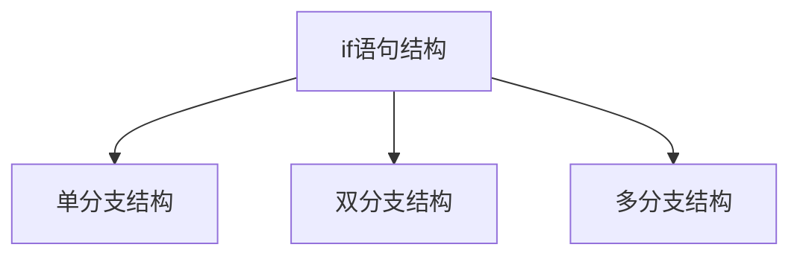
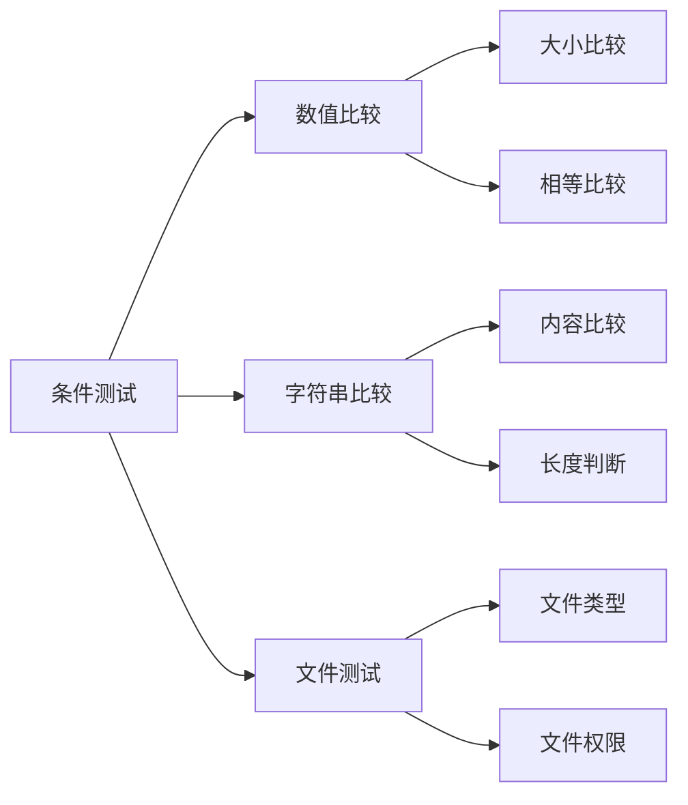
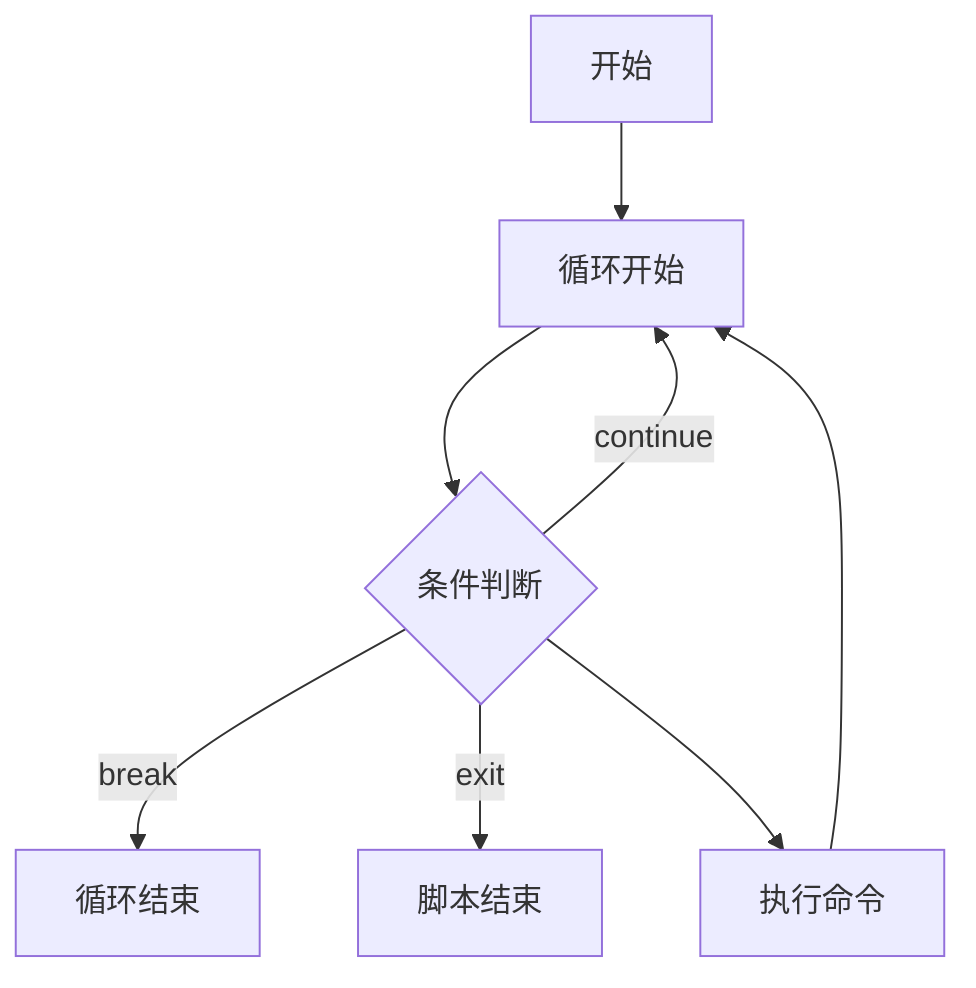
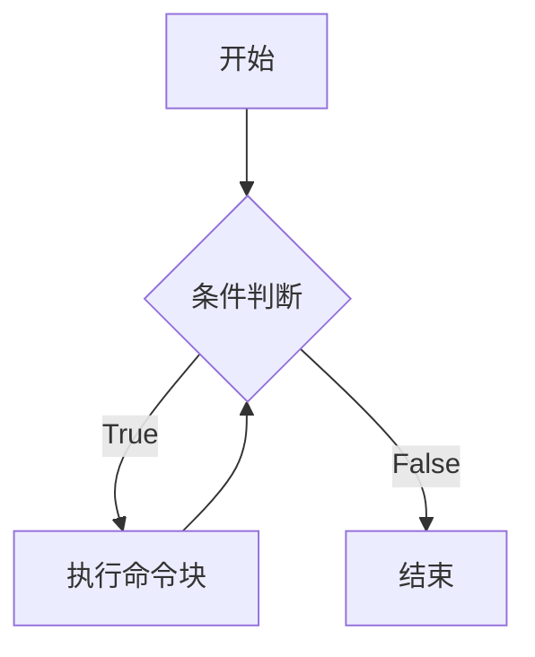

# Shell脚本流程控制结构

## 一、课程介绍
本章节主要介绍Shell脚本中的流程控制结构，包括条件判断和循环控制。通过学习，您将了解如何使用if语句进行条件判断，使用case语句处理多分支选择，以及使用for和while循环来处理重复性任务。这些知识将帮助您编写更加灵活和强大的Shell脚本，实现自动化运维的各种需求。

## 二、课程大纲
* if条件结构：单分支、双分支、多分支判断
* 条件测试：数值比较、字符串比较、文件测试
* case条件结构：多分支选择的另一种实现方式
* for循环：列表遍历与计数循环
* while循环：条件循环与读取文件
* 流程控制：break与continue的使用
* 案例学习：服务监控、文件备份、系统管理
* 课后练习：巩固流程控制知识

## if语句与条件判断介绍
在Shell脚本中，条件测试是实现程序逻辑判断的基础。作为运维工程师，我们经常需要判断服务是否正常运行、文件是否存在、系统资源是否充足等情况，这些都需要用到条件测试。

if语句结合条件判断是Shell脚本中实现逻辑控制的基础，通过判断条件的真假来决定程序的执行流程。


### if语法结构
if语句在Shell中有三种基本结构：


#### 1. 单分支结构
```bash
if [ 条件 ]
then
    命令
fi
```

#### 2. 双分支结构
```bash
if [ 条件 ]
then
    命令1
    命令2
    ...
else
    命令3
    命令4
    ...
fi
```

#### 3. 多分支结构
```bash
if [ 条件1 ]
then
    命令1
    ...
elif [ 条件2 ]
then
    命令2
    ...
else
    命令3
    ...
fi
```

#### 语法注意事项
1. if 和 then 可以写在同一行，需要用分号分隔：if [ 条件 ]; then
2. 条件测试部分的方括号 [] 内部首尾要有空格
3. then 必须另起一行或用分号分隔
4. 所有语句块必须以 fi 结束
5. elif 是 else if 的缩写，可以有多个


### Shell条件测试语法
条件测试：数值比较、字符串比较、文件测试



### 1. 数值比较
| 符号   | 含义       | 示例                  |
|--------|------------|-----------------------|
| -eq    | 等于       | `[ $a -eq $b ]`      |
| -ne    | 不等于     | `[ $a -ne $b ]`      |
| -gt    | 大于       | `[ $a -gt $b ]`      |
| -lt    | 小于       | `[ $a -lt $b ]`      |
| -ge    | 大于等于   | `[ $a -ge $b ]`      |
| -le    | 小于等于   | `[ $a -le $b ]`      |

### 2. 字符串比较
| 符号   | 含义       | 示例                  |
|--------|------------|-----------------------|
| =      | 相等       | `[ "$a" = "$b" ]`    |
| !=     | 不相等     | `[ "$a" != "$b" ]`   |
| -z     | 长度为零   | `[ -z "$a" ]`        |
| -n     | 长度非零   | `[ -n "$a" ]`        |

### 3. 文件测试
| 符号   | 含义           | 示例                  |
|--------|----------------|-----------------------|
| -f     | 是否为普通文件 | `[ -f file ]`        |
| -d     | 是否为目录     | `[ -d directory ]`   |
| -r     | 是否可读       | `[ -r file ]`        |
| -w     | 是否可写       | `[ -w file ]`        |
| -x     | 是否可执行     | `[ -x file ]`        |
| -e     | 是否存在       | `[ -e file ]`        |


您说得对,我来设计两个更基础的教学实验。

### 教学实验一：系统用户登录检查脚本

#### 要求
1. 检查当前登录用户数量
2. 显示具体登录用户信息
3. 判断root是否登录

#### 结题思路
1. 使用who命令获取登录用户信息
2. 使用简单的条件判断
3. 不使用复杂命令,主要练习if语句

#### 代码
```bash
#!/bin/bash
# 功能：检查系统用户登录状态
# 版本：1.0

# 获取当前登录用户数
USER_COUNT=$(who | wc -l)

echo "当前系统登录情况:"
echo "=================="

# 判断是否有用户登录
if [ $USER_COUNT -eq 0 ]
then
    echo "当前没有用户登录"
else
    echo "当前有 $USER_COUNT 个用户登录"
    echo "登录用户列表："
    who
fi

# 检查是否有root用户登录
if who | grep "^root" > /dev/null
then
    echo "警告：root用户已登录！"
fi
```

### 教学实验二：文件类型检查脚本

#### 要求
1. 检查用户输入的文件类型
2. 判断文件权限
3. 显示文件基本信息

#### 结题思路
1. 使用read命令获取用户输入
2. 使用文件测试符号
3. 使用if-elif-else结构

#### 代码
```bash
#!/bin/bash
# 功能：文件类型和权限检查
# 版本：1.0

# 获取用户输入
echo "请输入要检查的文件路径："
read FILE_PATH

# 检查文件是否存在
if [ ! -e "$FILE_PATH" ]
then
    echo "错误：文件不存在！"
    exit 1
fi

# 显示文件信息
echo "文件信息如下："
echo "==============="

# 判断文件类型
if [ -f "$FILE_PATH" ]
then
    echo "这是一个普通文件"
elif [ -d "$FILE_PATH" ]
then
    echo "这是一个目录"
elif [ -L "$FILE_PATH" ]
then
    echo "这是一个符号链接"
else
    echo "这是其他类型文件"
fi

# 检查文件权限
echo "权限检查："
if [ -r "$FILE_PATH" ]
then
    echo "- 可读"
fi

if [ -w "$FILE_PATH" ]
then
    echo "- 可写"
fi

if [ -x "$FILE_PATH" ]
then
    echo "- 可执行"
fi

# 显示文件大小
ls -lh "$FILE_PATH"
```

### 作业一 文件备份脚本
编写一个脚本自动备份指定目录下的文件。

#### 要求
1. 自动备份指定目录下的文件
2. 检查源目录和备份目录的权限
3. 使用日期作为备份文件名
4. 自动清理7天前的旧备份
5. 显示备份结果

#### 结题思路
1. 使用变量定义源目录和备份目录
2. 使用date命令获取当前日期
3. 使用文件测试命令检查目录权限
4. 使用tar命令创建压缩备份
5. 检查命令执行结果
6. 使用find命令清理旧文件

#### 代码讲解
```bash
#!/bin/bash
# 定义变量
SOURCE_DIR="/etc"           # 要备份的源目录
BACKUP_DIR="/backup"        # 备份文件存放目录
DATE=$(date +%Y%m%d)        # 获取当前日期
BACKUP_FILE="backup_${DATE}.tar.gz"  # 备份文件名

# 检查目录权限
if [ ! -r "$SOURCE_DIR" ]   # -r 测试是否可读
then
    echo "错误：源目录无读取权限"
    exit 1
fi

if [ ! -w "$BACKUP_DIR" ]   # -w 测试是否可写
then
    echo "错误：备份目录无写入权限"
    exit 2
fi

# 创建备份
echo "开始备份..."
# tar命令创建压缩备份
tar -czf "${BACKUP_DIR}/${BACKUP_FILE}" "$SOURCE_DIR" 2>/dev/null

# 检查备份结果
if [ $? -eq 0 ]            # $? 获取上一个命令的退出状态
then
    echo "备份成功：${BACKUP_DIR}/${BACKUP_FILE}"
    ls -lh "${BACKUP_DIR}/${BACKUP_FILE}"  # 显示备份文件信息
else
    echo "备份失败！"
    exit 3
fi

# 清理旧备份
# find命令查找并删除7天前的备份文件
find "$BACKUP_DIR" -name "backup_*.tar.gz" -mtime +7 -delete

```

### 作业二 系统资源监控脚本
编写一个脚本监控系统资源使用情况，包括CPU、内存和磁盘空间。

好的,我删除颜色相关内容,重新整理一个更清晰的版本:

#### 要求
1. 监控系统CPU使用率
2. 监控系统内存使用率
3. 监控系统磁盘使用率
4. 当超过阈值时显示警告
5. 提供详细的系统信息

#### 结题思路
1. 定义资源使用阈值
2. 使用系统命令获取当前资源使用情况
3. 通过条件判断进行阈值检查
4. 超过阈值时显示详细信息
5. 格式化输出检查结果

#### 新语法介绍

1. awk命令使用
```bash
# 语法格式: awk '条件 {动作}'

# 常用参数说明:
NR          # 表示当前行号
$1,$2...    # 表示第1列,第2列...
print       # 打印输出

# 实例说明:
awk '{print $2}'           # 提取第2列内容
awk 'NR==2 {print $5}'    # 提取第2行的第5列内容
awk '{print $3/$2 * 100}' # 计算第3列除以第2列乘100
```

2. cut命令使用
```bash
# 语法格式: cut -d分隔符 -f字段序号

# 常用参数说明:
-d    # 指定分隔符
-f    # 指定要提取的字段

# 实例说明:
cut -d. -f1    # 以点号分割,取第1个字段
cut -d% -f1    # 以百分号分割,取第1个字段
```

#### 完整代码
```bash
#!/bin/bash
#
# 功能：系统资源监控
# 版本：1.0
# 作者：XXX
# 日期：2023-07-14

# 定义资源使用阈值(百分比)
CPU_THRESHOLD=80    # CPU使用率警告阈值
MEM_THRESHOLD=80    # 内存使用率警告阈值
DISK_THRESHOLD=90   # 磁盘使用率警告阈值

# 获取CPU使用率
# 说明：通过top命令获取CPU使用率
# top -bn1: 批处理模式执行一次
# grep "Cpu(s)": 过滤CPU行
# awk '{print $2}': 获取用户空间CPU使用率
CPU_USAGE=$(top -bn1 | grep "Cpu(s)" | awk '{print $2}' | cut -d. -f1)

# 获取内存使用率
# 说明：通过free命令计算内存使用百分比
# grep Mem: 过滤内存行
# awk计算：已用内存/总内存*100
MEM_USAGE=$(free | grep Mem | awk '{print $3/$2 * 100}' | cut -d. -f1)

# 获取磁盘使用率
# 说明：通过df命令获取根分区使用率
# awk 'NR==2': 选择第2行
# {print $5}: 打印使用率列
DISK_USAGE=$(df -h / | awk 'NR==2 {print $5}' | cut -d% -f1)

# CPU使用率检查
echo "=== CPU使用率检查 ==="
if [ "$CPU_USAGE" -gt "$CPU_THRESHOLD" ]
then
    echo "警告：CPU使用率过高！($CPU_USAGE%)"
    echo "=== CPU详细信息 ==="
    top -bn1 | head -10
else
    echo "CPU使用率正常：$CPU_USAGE%"
fi

# 内存使用率检查
echo -e "\n=== 内存使用率检查 ==="
if [ "$MEM_USAGE" -gt "$MEM_THRESHOLD" ]
then
    echo "警告：内存使用率过高！($MEM_USAGE%)"
    echo "=== 内存详细信息 ==="
    free -h
else
    echo "内存使用率正常：$MEM_USAGE%"
fi

# 磁盘使用率检查
echo -e "\n=== 磁盘使用率检查 ==="
if [ "$DISK_USAGE" -gt "$DISK_THRESHOLD" ]
then
    echo "警告：磁盘空间不足！($DISK_USAGE%)"
    echo "=== 磁盘详细信息 ==="
    df -h
else
    echo "磁盘使用率正常：$DISK_USAGE%"
fi
```

## For循环基础介绍
for循环用于重复执行一系列命令,主要用于处理列表项和批量操作场景。

### For循环结构图


### For循环语法
```bash
# 基本语法1 - 列表循环
for 变量名 in 列表
do
    命令1
    命令2
done

# 基本语法2 - 类C风格
for ((初始值;条件;步进))
do
    命令1
    命令2
done

# 常见写法示例
for i in 1 2 3 4 5              # 直接列表
for i in {1..5}                 # 范围表示
for i in $(seq 1 5)             # seq命令
for i in $(cat file.txt)        # 文件内容
for i in $(ls *.txt)            # 命令结果
for ((i=1;i<=5;i++))           # C风格循环
```

### 练习案例

#### 需求介绍
开发批量文件重命名脚本,将指定目录下的所有.txt文件重命名为.doc文件。

#### 要求
1. 检查目录是否存在txt文件
2. 批量将.txt文件改名为.doc
3. 显示改名过程
4. 统计处理文件数量

### 实验准备
1. 创建测试目录和文件
    ```bash
    # 创建实验目录
    mkdir -p ~/test_rename
    cd ~/test_rename

    # 创建测试文件
    touch file1.txt file2.txt file3.txt test.txt work.txt
    ```

2. 确认实验环境
    ```bash
    # 查看当前目录文件
    ls -l
    # 预期输出:
    # -rw-r--r-- 1 root root 0 Jul 14 10:00 file1.txt
    # -rw-r--r-- 1 root root 0 Jul 14 10:00 file2.txt
    # -rw-r--r-- 1 root root 0 Jul 14 10:00 file3.txt
    # -rw-r--r-- 1 root root 0 Jul 14 10:00 test.txt
    # -rw-r--r-- 1 root root 0 Jul 14 10:00 work.txt

    ```

#### 结题思路
1. 使用ls命令检查txt文件
2. 使用for循环遍历文件
3. 使用cut命令处理文件名
4. 使用mv命令重命名
5. 使用计数器统计数量

```bash
#!/bin/bash
#
# 功能：批量将.txt文件改名为.doc
# 版本：2.0

# 初始化计数器
count=0
errors=0

# 检查当前目录是否有txt文件
if ! ls *.txt &>/dev/null; then
    echo "当前目录没有txt文件"
    exit 1
fi

# 循环处理所有txt文件
for file in *.txt
do
    # 如果文件不可读,跳过当前文件
    if [ ! -r "$file" ]; then
        echo "警告: $file 无法读取,跳过"
        let errors++
        continue
    fi

    # 获取文件名(不含扩展名)
    name=$(echo $file | cut -d. -f1)
    
    # 重命名文件
    mv $file ${name}.doc
    echo "$file 已更名为 ${name}.doc"
    let count++

    # 如果错误次数超过3次,结束脚本
    if [ $errors -ge 3 ]; then
        echo "错误次数过多,终止处理"
        exit 2
    fi

    # 如果处理文件数超过10个,跳出循环
    if [ $count -ge 10 ]; then
        echo "已达到最大处理数量"
        break
    fi
done

echo "共处理 $count 个文件"

```

### 作业案例

#### 需求介绍
开发服务器批量检测脚本,检查多台服务器是否能正常连接。

#### 要求
1. 从文件读取服务器IP列表
2. 检测每个服务器连通性
3. 记录检测结果到文件
4. 统计服务器在线率

#### 实验准备
1. 创建实验目录和配置文件
    ```bash
    # 创建实验目录
    mkdir -p ~/test_ping
    cd ~/test_ping

    # 创建服务器列表文件
    vim servers.txt 
    # 添加一下内容
    192.168.1.1
    8.8.8.8
    114.114.114.114
    baidu.com
    1.1.1.1
    ```

2. 确认实验环境
    ```bash
    # 检查文件内容
    cat servers.txt
    # 确保ping命令可用
    which ping

    # 测试单个ping
    ping -c1 8.8.8.8
    ```

#### 结题思路
1. 检查输入文件是否存在
2. 使用for循环读取IP
3. 使用ping命令检测
4. 记录结果到文件
5. 计算统计在线率

```bash
#!/bin/bash
#
# 功能：批量检测服务器是否在线
# 版本：2.0

# 检查输入文件
if [ ! -f servers.txt ]; then
    echo "servers.txt不存在"
    exit 1
fi

# 清空结果文件
> result.txt

# 初始化计数器
total=0
online=0
errors=0

# 循环检测服务器
for ip in $(cat servers.txt)
do
    # 检查IP格式是否正确  # 如果IP地址里没有点号
    # 192.168.1.1 → 包含点号,条件为假,继续执行
    # abcdef → 不包含点号,条件为真,会跳过
    # 最好的判断是： ! echo $ip | grep -qE '^[0-9]{1,3}\.[0-9]{1,3}\.[0-9]{1,3}\.[0-9]{1,3}$'
    if [[ ! $ip =~ \. ]]; then
        echo "警告: $ip 格式错误,跳过"
        continue
    fi

    let total++
    # 检测连通性
    if ping -c1 -W1 $ip &>/dev/null; then
        echo "$ip - 在线" >> result.txt
        let online++
    else
        echo "$ip - 离线" >> result.txt
        let errors++
    fi

    # 如果离线服务器超过5个,终止检测
    if [ $errors -ge 5 ]; then
        echo "离线服务器过多,终止检测"
        break
    fi
done

# 计算在线率
rate=$(( online*100/total ))

# 输出统计结果
echo "服务器总数: $total"
echo "在线数量: $online"
echo "在线率: ${rate}%"

# 如果在线率低于50%则异常退出
if [ $rate -lt 50 ]; then
    echo "警告: 在线率过低!"
    exit 2
fi
```

### 企业应用场景
1. 批量文件处理
2. 批量用户管理
3. 批量服务部署
4. 批量监控检测
5. 批量数据处理

## 1. while循环介绍
while循环是一种条件循环,当条件为真时,重复执行指定的命令块。

### 2. 基本语法
```bash
while [ 条件 ]
do
    命令1
    命令2
    ...
done
```

### 3. 流程图


### 4. 循环控制语句
- `break`: 跳出整个循环
- `continue`: 跳过本次循环,继续下一次
- `exit`: 终止整个脚本

### 5. 练习案例(猜数字游戏)

#### 需求介绍
实现一个简单的猜数字游戏,系统生成1-100的随机数,用户输入数字进行猜测,系统给出大小提示。

#### 要求
1. 使用while循环实现无限猜测
2. 正确猜中后结束游戏
3. 显示猜测次数
4. 输入q可以退出游戏

#### 实验准备
```bash
# 创建实验目录
mkdir -p ~/test_guess
cd ~/test_guess

# 创建脚本文件
touch guess.sh
chmod +x guess.sh
```

#### 结题思路
1. 生成随机数
2. while循环接收用户输入
3. 判断输入与目标数的大小
4. 计数并给出提示

#### 参考代码
```bash
#!/bin/bash

# 生成1-100的随机数
target=$((RANDOM % 100 + 1))
count=0

while true
do
    let count++
    read -p "请猜一个1-100的数字(输入q退出):" num
    
    # 判断是否退出
    if [ "$num" = "q" ]; then
        echo "游戏结束"
        exit 0
    fi
    
    # 判断大小
    if [ $num -eq $target ]; then
        echo "恭喜你,猜对了! 共猜了$count次"
        break
    elif [ $num -gt $target ]; then
        echo "猜大了"
    else
        echo "猜小了"
    fi
done
```

### 6. 作业案例(服务监控)

#### 需求介绍
编写一个服务监控脚本,持续监控指定服务的状态,如果服务停止则尝试重启。

#### 要求
1. 每30秒检查一次服务状态
2. 如果服务停止,尝试重启
3. 记录重启次数和时间
4. 最多重试3次
5. 支持优雅退出(Ctrl+C)

#### 实验准备
```bash
# 创建实验目录
mkdir -p ~/test_monitor
cd ~/test_monitor

# 创建日志目录
mkdir -p logs

# 创建脚本文件
touch monitor.sh
chmod +x monitor.sh
```

#### 结题思路
1. 使用while循环持续监控
2. systemctl检查服务状态
3. 记录重启日志
4. 设置重试次数限制

#### 参考代码
```bash
#!/bin/bash

# 配置
SERVICE="nginx"
MAX_RETRY=3
retry_count=0
log_file="logs/monitor.log"

# 信号处理
trap 'echo "正在退出监控..."; exit 0' INT

while true
do
    # 检查服务状态
    if ! systemctl is-active $SERVICE &>/dev/null; then
        let retry_count++
        echo "$(date) - $SERVICE 已停止,尝试重启(第$retry_count次)" >> $log_file
        
        # 尝试重启
        systemctl restart $SERVICE
        
        # 检查重试次数
        if [ $retry_count -ge $MAX_RETRY ]; then
            echo "$(date) - 重试次数超过限制,退出监控" >> $log_file
            break
        fi
    else
        retry_count=0
    fi
    
    # 等待30秒
    sleep 30
done
```

### 7. 注意事项
1. while循环必须有退出条件或手动退出方式
2. 注意避免死循环
3. 合理使用break和continue
4. 考虑添加sleep避免CPU占用过高
5. 重要场景要做好日志记录

