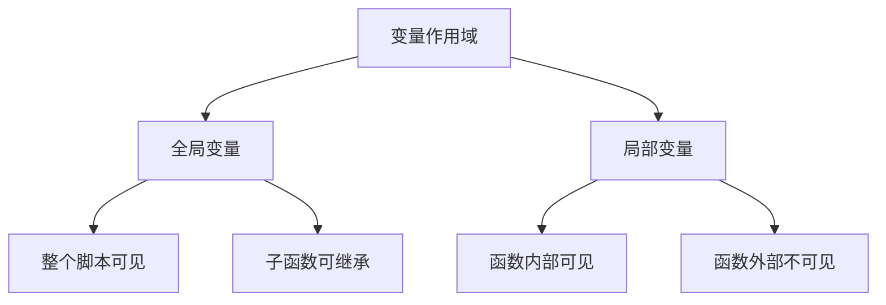
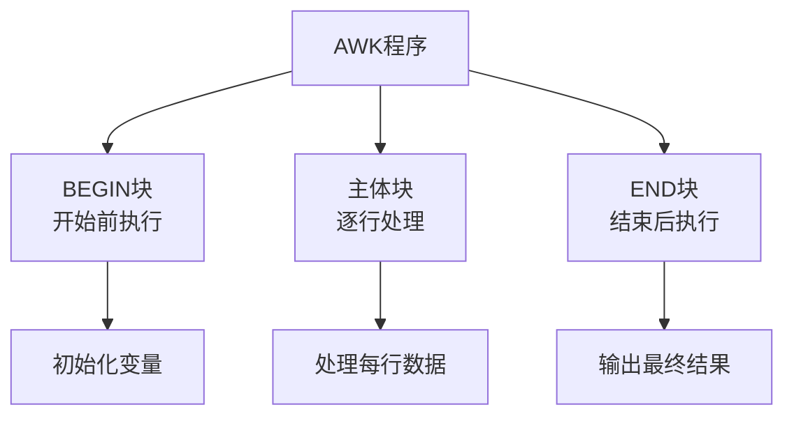
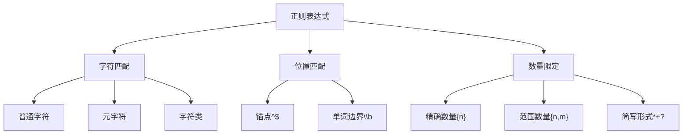

# Shell高级函数编程

## 一、课程介绍
本课程是Shell编程的进阶课程，主要面向已掌握Shell基础语法的学习者。课程将深入讲解Shell函数编程、文本处理工具以及正则表达式的应用，帮助学习者提升Shell脚本开发能力，掌握Linux环境下的高效文本处理技能。

## 二、课程大纲
* 熟练掌握Shell函数的定义、调用及参数传递
* 能够使用awk处理结构化文本数据
* 掌握sed进行文本替换和处理
* 掌握正则表达式的编写和应用
* 能够独立开发文本处理脚本

## Shell函数与作用域教案

### 一、函数的概念（通过生活例子理解）

#### 1. 什么是函数？
想象你在麦当劳点餐：
- 你说"我要一个巨无霸套餐"（调用函数）
- 服务员接收订单（接收参数）
- 后厨按照固定流程制作（函数体）
- 最后给你食物（返回结果）

这整个过程就像一个函数：
```bash
function make_burger_set() {
    local burger_type=$1    # 参数：汉堡类型
    local drink_type=$2     # 参数：饮料类型
    
    # 制作过程（函数体）
    echo "$burger_type"
    echo "$drink_type"
    
    # 返回结果
    return 0  # 表示成功
}

# 调用函数
make_burger_set "巨无霸" "可乐"
```

#### 2. 为什么要用函数？
假设你每天要给5个服务器检查磁盘空间：
```bash
# 不用函数的方式（重复代码）
ssh server1 "df -h /"
echo "server1检查完成"
ssh server2 "df -h /"
echo "server2检查完成"
# ... 重复5次

# 使用函数的方式
function check_disk() {
    local server=$1
    ssh "$server" "df -h /"
    echo "${server}检查完成"
}

# 调用更简单
check_disk "server1"
check_disk "server2"
```

### 二、变量作用域（重点）

#### 1. 作用域是什么？
用一个家庭作比喻：
- 全局变量就像家里的电视机，所有人都能用
- 局部变量就像自己房间的台灯，只有自己能用



#### 2. 全局变量示例
```bash
#!/bin/bash

# 全局变量声明
COMPANY_NAME="ABC公司"
EMPLOYEE_COUNT=100

function print_company_info() {
    echo "公司名称: $COMPANY_NAME"    # 可以访问
    echo "员工人数: $EMPLOYEE_COUNT"   # 可以访问
}

function update_employee_count() {
    EMPLOYEE_COUNT=120    # 可以修改全局变量
}

# 主程序
print_company_info
update_employee_count
print_company_info
```

#### 3. 局部变量示例
```bash
#!/bin/bash

function calculate_salary() {
    # 局部变量
    local base_salary=5000
    local bonus=1000
    
    # 只在函数内可见
    echo "基本工资: $base_salary"
    echo "奖金: $bonus"
    echo "总工资: $((base_salary + bonus))"
}

calculate_salary
echo "尝试访问base_salary: $base_salary"  # 输出空，因为是局部变量
```

#### 4. 变量作用域规则
1. 全局变量规则：
   - 在函数外定义
   - 所有地方都能访问
   - 使用export可传递给子进程

2. 局部变量规则：
   - 必须用local声明
   - 只在函数内有效
   - 函数结束后自动销毁

### 三、参数传递

#### 1. 形参与实参
用快递举例：
- 形参：快递单上的收件人姓名（占位符）
- 实参：实际收件人的名字（实际值）

```bash
# 形参：name, age
function greet() {
    local name=$1    # 形参
    local age=$2     # 形参
    echo "你好，${name}！今年${age}岁了"
}

# 实参："张三", "18"
greet "张三" "18"
```

#### 2. 特殊参数变量
```bash
function show_params() {
    echo "参数个数: $#"
    echo "所有参数: $*"
    echo "第一个参数: $1"
    echo "第二个参数: $2"
    echo "脚本名称: $0"
}
```

让我帮你完善这两个实验的完整内容：

### 四、教学实验

#### 实验一：员工管理系统

**1. 实验需求说明**
- 开发一个基于命令行的员工管理系统
- 实现员工信息的添加和统计功能
- 演示全局变量和局部变量的使用场景
- 数据需要持久化存储到文件中

**2. 实验要求**
- 使用 Bash Shell 脚本语言开发
- 必须包含函数定义和调用
- 合理使用全局变量和局部变量
- 实现基本的错误处理
- 代码需要包含完整的注释

**3. 实验准备**
- Linux 操作系统环境
- 文本编辑器（如 vim、nano 等）
- 基本的 Shell 脚本编程知识
- 文件读写权限

**4. 解答思路**
1. 设计数据存储结构：使用文本文件存储员工信息
2. 实现员工添加功能：包含参数验证和工资计算
3. 实现统计功能：计算总人数和工资相关数据
4. 使用全局变量存储配置信息
5. 使用局部变量处理函数内的临时数据

**5. 代码实现**
```bash
#!/bin/bash

# 文件名：employee_management.sh
# 功能：员工管理系统
# 作者：XXX
# 日期：2025-07-15

# 全局变量定义
EMPLOYEE_FILE="employees.txt"    # 员工信息存储文件
SALARY_BASE=5000                # 基本工资

# 函数：添加员工
# 参数：$1-姓名 $2-职位 $3-部门
function add_employee() {
    local name=$1
    local position=$2
    local department=$3
    
    # 参数验证
    if [ -z "$name" ] || [ -z "$position" ] || [ -z "$department" ]; then
        echo "错误：需要提供 姓名、职位、部门"
        return 1
    fi
    
    # 计算工资
    local salary
    case $position in
        "经理") 
            salary=$((SALARY_BASE + 8000))
            ;;
        "主管")
            salary=$((SALARY_BASE + 5000))
            ;;
        "员工")
            salary=$SALARY_BASE
            ;;
        *)
            salary=$SALARY_BASE
            ;;
    esac
    
    # 保存员工信息
    echo "$name|$position|$department|$salary" >> $EMPLOYEE_FILE
    echo "已添加员工：$name"
}

# 全局变量：统计信息
TOTAL_EMPLOYEES=0
TOTAL_SALARY=0

# 函数：显示统计信息
function show_statistics() {
    # 使用命令替换获取所有员工信息
    local employee_data=$(cat $EMPLOYEE_FILE)
    TOTAL_EMPLOYEES=0
    TOTAL_SALARY=0
    
    # 使用for循环处理每一行数据
    for line in $employee_data; do
        echo -e "\n原始数据行: $line"  # 显示原始数据行
        
        # 使用IFS分割每行数据
        # IFS (Internal Field Separator) 内部字段分隔符
        # IFS默认值是: 空格、制表符(\t)、换行符(\n)
        # 这里我们将IFS设置为 | 来分割数据
        
        IFS='|' read -r name position department salary <<< "$line"
        
        # 显示分割后的各个字段
        echo "分割后的数据："
        echo "姓名: $name"
        echo "职位: $position"
        echo "部门: $department"
        echo "工资: $salary"
        
        # 累加统计信息
        let TOTAL_EMPLOYEES++
        let TOTAL_SALARY+=salary
        
        echo "当前统计："
        echo "员工数: $TOTAL_EMPLOYEES"
        echo "工资总额: $TOTAL_SALARY"
        echo "------------------------"
    done
    
    echo "===== 统计信息 ====="
    echo "员工总数：$TOTAL_EMPLOYEES"
    echo "工资总额：$TOTAL_SALARY"
    if [ $TOTAL_EMPLOYEES -gt 0 ]; then
        echo "平均工资：$((TOTAL_SALARY / TOTAL_EMPLOYEES))"
    fi
}

# 主程序
echo "=== 员工管理系统 ==="

# 测试数据
add_employee "张三" "经理" "技术部"
add_employee "李四" "主管" "销售部"
add_employee "王五" "员工" "技术部"

# 显示统计信息
show_statistics

```

#### 作业：文件备份脚本

**1. 实验需求说明**
- 开发一个文件处理系统
- 实现文件备份
- 包含日志记录功能
- 演示文件操作和错误处理

**2. 实验要求**
- 使用 Bash Shell 脚本编写
- 实现文件备份功能
- 完整的错误处理和日志记录
- 良好的代码注释

**3. 实验准备**
- Linux 操作系统环境
- 文件操作权限
- 基础的 Shell 命令知识
- 了解文件系统结构

**4. 解答思路**
1. 设计日志记录功能
2. 实现文件备份功能，包含错误处理
5. 完善错误处理和日志记录

**5. 代码实现**
```bash
#!/bin/bash

# 文件名：file_processing.sh
# 功能：文件处理系统
# 作者：XXX
# 日期：2025-07-15

# 全局配置
BACKUP_DIR="/tmp/backup"        # 备份目录
LOG_FILE=$1    # 日志文件

# 函数：记录日志
# 参数：$1-日志级别 $2-日志消息
function log_message() {
    local level=$1
    local message=$2
    local timestamp=$(date "+%Y-%m-%d %H:%M:%S")
    echo "[$timestamp][$level] $message"
}

# 函数：文件备份
# 参数：$1-源文件路径
function backup_file() {
    local source=$1
    local destination="${BACKUP_DIR}/$(basename $source).$(date +%Y%m%d)"
    
    # 检查源文件
    if [ ! -f "$source" ]; then
        log_message "ERROR" "源文件不存在：$source"
        return 1
    fi
    
    # 创建备份目录
    if [ ! -d "$BACKUP_DIR" ]; then
        mkdir -p "$BACKUP_DIR"
    fi
    
    # 执行备份
    if cp "$source" "$destination"; then
        log_message "INFO" "备份成功：$source -> $destination"
        return 0
    else
        log_message "ERROR" "备份失败：$source"
        return 2
    fi
}


# 主程序
echo "=== 文件处理系统测试 ==="

# 测试备份功能
backup_file "test1.txt"
backup_file "test2.txt"

```


## AWK和SED文本处理教学指南

### 一、AWK和SED基础介绍

#### 1.1 什么是AWK？
AWK就像一个文本处理助手，特别擅长处理表格式的数据：
- 可以想象成Excel，但是在命令行中操作
- 能够按列处理数据
- 可以进行计算和统计

生活例子：
```
比如有一个学生成绩单：
姓名 语文 数学 英语
张三 85 90 88
李四 78 92 85

AWK可以轻松计算每个学生的平均分
```

#### 1.2 什么是SED？
SED像一个文本编辑器，但是工作在命令行：
- 可以查找和替换文本
- 可以删除特定行
- 可以添加新内容

生活例子：
```
就像在Word文档中的"查找替换"功能
比如把文档中所有的"张三"改成"张小三"
```

### 二、语法结构

#### 2.1 AWK程序结构



说明：
- BEGIN块：程序开始前的准备工作
- 主体块：处理每一行数据
- END块：所有数据处理完后的收尾工作

#### 2.2 SED程序结构


说明：
- 输入：要处理的文件
- 读取行：一次读一行
- 执行命令：进行替换、删除等操作
- 输出：处理后的结果
- 循环直到文件结束

### AWK和SED文本处理教学实验

#### 1.1 实验环境准备
```bash
# 创建测试文件 student.txt
cat > student.txt << EOF
姓名 语文 数学 英语
张三 85 90 78
李四 67 80 95
王五 92 88 76
赵六 59 61 82
EOF
```

#### 1.2 AWK基础命令练习

1. 打印指定列
    * 打印第一列（姓名）
        ```bash
        awk '{print $1}' student.txt
        ```
        ```bash
        语法解释：
        - awk: 命令名
        - '{...}': 动作块，表示要执行的操作
        - print: 打印命令
        - $1: 表示第一列（每行按空格或制表符分割后的第一个字段）
        - student.txt: 要处理的文件

        执行结果：
        姓名    (第一行)
        张三    (第二行)
        李四    (第三行)
        ...
        ```

    * 打印第二列和第三列（语文和数学成绩）
        ```bash
        awk '{print $2,$3}' student.txt
        ```
        ```bash
        语法解释：
        - $2: 第二列（语文成绩）
        - $3: 第三列（数学成绩）
        - 逗号会在输出时自动添加空格

        执行结果：
        语文 数学    (第一行)
        85 90       (第二行)
        67 80       (第三行)
        ...

        ```

2. 条件筛选
    *  1. 查看语文成绩大于80的学生
        ```bash

        awk '$2>80 {print $1,"语文:",$2}' student.txt
        ```

        ```bash
        语法解释：
        - $2>80: 条件语句，表示第二列（语文成绩）大于80
        - {print $1,"语文:",$2}: 满足条件时执行的动作
        - $1: 打印学生姓名
        - "语文:": 打印固定文本
        - $2: 打印语文成绩

        执行结果：
        张三 语文: 85
        王五 语文: 92
        ```

    * 查看数学不及格的学生
        ```bash
        awk '$3<60 {print $1,"数学成绩不及格"}' student.txt
        ```

        ```bash
        语法解释：
        - $3<60: 条件语句，表示第三列（数学成绩）小于60
        - {print $1,"数学成绩不及格"}: 满足条件时执行的动作
        - $1: 打印学生姓名
        - "数学成绩不及格": 打印固定文本

        执行结果：
        （如果有学生数学成绩低于60分，会显示如下）
        李四 数学成绩不及格

        ```

好的，我来详细解释这部分命令的语法和用法。

### AWK 计算操作详解

#### 1. 计算平均分
```bash
awk 'NR>1 {avg=($2+$3+$4)/3; print $1,"平均分:",avg}' student.txt

语法解释：
- NR>1：跳过表头（第一行），NR 表示当前行号
- avg=($2+$3+$4)/3：计算平均分
  - $2：语文成绩
  - $3：数学成绩
  - $4：英语成绩
- print $1,"平均分:",avg：打印学生姓名和平均分

执行结果：
张三 平均分: 84.33
李四 平均分: 80.67
...
```

#### 2. 统计及格人数
```bash
awk 'NR>1 && $2>=60 {count++} END {print "语文及格人数:",count}' student.txt

语法解释：
- NR>1 && $2>=60：两个条件
  - NR>1：跳过表头
  - $2>=60：语文成绩及格
- count++：计数器自增
- END {...}：在所有行处理完后执行
- print "语文及格人数:",count：打印统计结果

执行结果：
语文及格人数: 3
```

### SED 命令详解

### SED 重要概念补充：

1. 命令格式：
   ```bash
   sed '[地址] 命令' 文件名
   ```
   - 地址：可以是行号、正则表达式等
   - 命令：s（替换）、d（删除）、i（插入）、a（追加）等

2. 常用标志：
   - g：全局替换
   - i：忽略大小写
   - p：打印匹配行

3. 常用地址表示：
   - n：第n行
   - $：最后一行
   - /pattern/：匹配模式的行
   - n,m：从第n行到第m行

4. 注意事项：
   - 默认情况下，sed不会修改原文件
   - 要修改原文件，需要使用-i选项
   - 多个命令可以用分号分隔

#### 1. 替换操作
```bash
# 基本替换
sed 's/张三/张小三/' student.txt
```
```bash
语法解释：
- s：substitute（替换）命令
- /张三/张小三/：查找"张三"并替换为"张小三"
- 默认只替换每行第一次匹配

# 全局替换
sed 's/数学/Math/g' student.txt

语法解释：
- g：global（全局）标志，替换所有匹配项
```

#### 2. 删除操作
```bash
# 删除指定行
sed '1d' student.txt
```
```bash
语法解释：
- 1：指定行号
- d：delete（删除）命令
```
```bash
# 删除空行
sed '/^$/d' student.txt
```
```bash
语法解释：
- /^$/：正则表达式，匹配空行
  - ^：行首
  - $：行尾
  - ^$：表示行首紧接着行尾，即空行
```

#### 3. 插入操作
```bash
# 在指定行前插入
sed '1i\====成绩单====' student.txt
```
```bash
语法解释：
- 1：指定行号
- i：insert（插入）命令
- \：续行符号
- ====成绩单====：要插入的内容
```
```bash
# 在文件末尾添加
sed '$a\日期：2025-07-15' student.txt
```
```bash
语法解释：
- $：表示最后一行
- a：append（追加）命令
```


#### 二、综合练习

### 需求说明
处理学生成绩单，实现以下功能：
1. 显示所有及格的成绩
2. 计算每个学生的总分
3. 添加表头和表尾

### 实验步骤

1. 查看及格成绩
```bash
# 显示所有及格的成绩（大于等于60）
awk 'NR>1 {
    if($2>=60) print $1,"语文:",$2;
    if($3>=60) print $1,"数学:",$3;
    if($4>=60) print $1,"英语:",$4
}' student.txt
```

2. 计算总分
```bash
# 计算每个学生的总分并排序
awk 'NR>1 {
    sum=$2+$3+$4;
    print $1,"总分:",sum
}' student.txt | sort -k3 -nr
```

3. 美化输出
```bash
# 组合使用awk和sed
awk 'NR>1 {
    sum=$2+$3+$4;
    printf "%s\t%d\t%d\t%d\t%d\n",$1,$2,$3,$4,sum
}' student.txt | \
sed '1i\姓名\t语文\t数学\t英语\t总分' | \
sed '$a\====统计结束===='
```


# AWK简单成绩处理系统

## 教学目标
1. 学习基本的AWK命令
2. 理解简单的文本处理

## 实验步骤

### 1. 准备数据文件
创建 `student.txt`：
```
姓名 语文 数学 英语
小明 85 76 90
小红 67 82 75
小张 92 88 85
```

### 2. 简单脚本代码
```bash
#!/bin/bash

# 显示及格成绩
show_passing() {
    echo "=== 及格成绩展示(>=60) ==="
    # NR>1 表示从第二行开始处理（跳过表头）
    # $1是第一列（姓名），$2是第二列（语文），以此类推
    # 如果分数>=60就打印
    awk 'NR>1 {
        if($2>=60) print $1,"语文:",$2
        if($3>=60) print $1,"数学:",$3
        if($4>=60) print $1,"英语:",$4
    }' student.txt
}

# 计算总分
calc_total() {
    echo "=== 总分展示 ==="
    # NR>1 跳过表头
    # total将每行的第2、3、4列相加（语文+数学+英语）
    awk 'NR>1 {
        total = $2 + $3 + $4
        print $1,"总分:",total
    }' student.txt
}

# 计算每科平均分
calc_average() {
    echo "=== 平均分展示 ==="
    # sum_chinese累加语文分数
    # sum_math累加数学分数
    # sum_english累加英语分数
    # count计算总人数
    # END块在所有行处理完后执行，计算平均分
    awk 'NR>1 {
        sum_chinese = sum_chinese + $2
        sum_math = sum_math + $3
        sum_english = sum_english + $4
        count = count + 1
    } END {
        print "语文平均分:", sum_chinese/count
        print "数学平均分:", sum_math/count
        print "英语平均分:", sum_english/count
    }' student.txt
}

# 主菜单
while true; do
    echo -e "\n=== 成绩处理系统 ==="
    echo "1. 显示及格成绩"
    echo "2. 显示总分"
    echo "3. 显示平均分"
    echo "4. 退出"
    read -p "请选择(1-4): " choice
    
    case $choice in
        1) 
            show_passing
            ;;
        2) 
            calc_total
            ;;
        3) 
            calc_average 
            ;;
        4) 
            exit 0
            ;;
        *)
            echo "无效选项"
            ;;
    esac
done
```

## AWK命令详细解释

### 1. 显示及格成绩
```awk
NR>1 {
    if($2>=60) print $1,"语文:",$2
    if($3>=60) print $1,"数学:",$3
    if($4>=60) print $1,"英语:",$4
}
```
- `NR>1`: 跳过第一行（表头）
- `$1`: 第一列（姓名）
- `$2`: 第二列（语文成绩）
- `$3`: 第三列（数学成绩）
- `$4`: 第四列（英语成绩）
- `if($2>=60)`: 如果成绩大于等于60分就显示

### 2. 计算总分
```awk
NR>1 {
    total = $2 + $3 + $4
    print $1,"总分:",total
}
```
- 将每个学生的三科成绩相加
- `total`: 存储总分
- `print`: 打印姓名和总分

### 3. 计算平均分
```awk
NR>1 {
    sum_chinese = sum_chinese + $2
    sum_math = sum_math + $3
    sum_english = sum_english + $4
    count = count + 1
} END {
    print "语文平均分:", sum_chinese/count
    print "数学平均分:", sum_math/count
    print "英语平均分:", sum_english/count
}
```
- `sum_chinese`: 累加所有语文成绩
- `sum_math`: 累加所有数学成绩
- `sum_english`: 累加所有英语成绩
- `count`: 统计总人数
- `END`: 在所有数据处理完后执行
- 平均分 = 总分/人数

## 运行方法
```bash
# 添加执行权限
chmod +x grade.sh

# 运行脚本
./grade.sh
```

## 运行结果示例
```
=== 成绩处理系统 ===
1. 显示及格成绩
2. 显示总分
3. 显示平均分
4. 退出
请选择(1-4): 1

=== 及格成绩展示(>=60) ===
小明 语文: 85
小明 数学: 76
小明 英语: 90
...
```


## 第三部分：正则表达式的编写和应用

### 1. 正则表达式基础

#### 1.1 什么是正则表达式
正则表达式(Regular Expression)是一种用于匹配和处理文本的强大工具，通过特定的语法规则来描述文本模式。

#### 1.2 基本元字符表
| 元字符 | 说明 | 示例 |
|--------|------|------|
| . | 匹配任意单个字符 | a.c 匹配 abc, adc |
| * | 匹配前面的字符0次或多次 | ab* 匹配 a, ab, abb |
| + | 匹配前面的字符1次或多次 | ab+ 匹配 ab, abb |
| ? | 匹配前面的字符0次或1次 | ab? 匹配 a, ab |
| ^ | 匹配行首 | ^abc 匹配以abc开头的行 |
| $ | 匹配行尾 | abc$ 匹配以abc结尾的行 |
| [] | 字符类，匹配方括号中任意字符 | [abc] 匹配 a,b,或c |
| [^] | 否定字符类，匹配除方括号中字符外的任意字符 | [^abc] 匹配除a,b,c外的字符 |
| {} | 指定匹配次数 | a{2} 匹配 aa |
| () | 分组 | (ab)+ 匹配 ab,abab |
| \| | 或操作 | a\|b 匹配 a或b |

#### 1.3 特殊字符类
| 字符类 | 说明 | 等价表达式 |
|--------|------|------------|
| \d | 数字 | [0-9] |
| \D | 非数字 | [^0-9] |
| \w | 单词字符 | [a-zA-Z0-9_] |
| \W | 非单词字符 | [^a-zA-Z0-9_] |
| \s | 空白字符 | [ \t\n\r\f] |
| \S | 非空白字符 | [^ \t\n\r\f] |

### 2. 正则表达式语法结构



图解说明：
1. 字符匹配：定义要匹配的具体字符
   - 普通字符：直接匹配对应字符
   - 元字符：具有特殊含义的字符
   - 字符类：匹配一类字符

2. 位置匹配：定义匹配的位置
   - 锚点：指定行首行尾
   - 单词边界：指定单词的开始或结束

3. 数量限定：定义匹配的次数
   - 精确数量：指定具体次数
   - 范围数量：指定最小和最大次数
   - 简写形式：常用的数量词


### Nginx日志正则表达式分析实验

#### 1.1 常用正则表达式符号
```plaintext
^ : 匹配行首
$ : 匹配行尾
. : 匹配任意单个字符
* : 匹配前面的表达式0次或多次
+ : 匹配前面的表达式1次或多次
? : 匹配前面的表达式0次或1次
[] : 匹配方括号中的任意一个字符
[^] : 匹配除方括号中字符外的任意字符
\d : 匹配任意数字，等同于[0-9]
```

### 2. Nginx日志分析实战

#### 2.1 日志格式分析
```plaintext
192.168.110.9 - - [15/Jul/2025:15:48:53 +0800] "GET / HTTP/1.1" 200 409 "-" "Mozilla/5.0"
```

#### 2.2 正则表达式匹配模式

1. **匹配IP地址**
```bash
# IP地址的正则表达式
IP_PATTERN='([0-9]{1,3}\.){3}[0-9]{1,3}'

# 解释：
# [0-9]{1,3} : 匹配1到3个数字
# \. : 匹配点号（需要转义）
# {3} : 前面的模式重复3次
```

2. **匹配时间戳**
```bash
# 时间戳的正则表达式
TIME_PATTERN='\[(.*?)\]'

# 解释：
# \[ : 匹配左方括号
# .*? : 非贪婪模式匹配任意字符
# \] : 匹配右方括号
```

3. **匹配HTTP状态码**
```bash
# HTTP状态码的正则表达式
STATUS_PATTERN='" ([0-9]{3}) '

# 解释：
# " : 匹配引号
# [0-9]{3} : 精确匹配3个数字
# 空格 : 匹配状态码后的空格
```

#### 2.3 实现代码

```bash
#!/bin/bash

# 日志文件路径
LOG_FILE="/var/log/nginx/access.log"

echo "=== Nginx日志分析 ==="

# 1. 提取所有IP地址
echo -e "\n1. IP地址列表："
grep -oP '([0-9]{1,3}\.){3}[0-9]{1,3}' "$LOG_FILE" | sort | uniq -c
# -o: 只输出匹配部分
# -P: 使用Perl正则表达式语法

# 2. 提取HTTP状态码
echo -e "\n2. 状态码统计："
grep -oP '\" \K[0-9]{3}(?= )' "$LOG_FILE" | sort | uniq -c
# \K: 清除之前的匹配内容
# (?= ): 正向预查，确保后面有空格

# 3. 提取404错误的完整行
echo -e "\n3. 404错误详情："
grep -P '\" 404 ' "$LOG_FILE"

# 4. 提取500错误相关
echo -e "\n4. 500错误详情："
grep -P '\" 5[0-9]{2} ' "$LOG_FILE"

# 5. 统计每个小时的访问量
echo -e "\n5. 每小时访问量："
grep -oP '\[.*?\K([0-9]{2})(?=:)' "$LOG_FILE" | sort | uniq -c
```

### 2.4 正则表达式详解

```plaintext
1. IP地址匹配：([0-9]{1,3}\.){3}[0-9]{1,3}
   ┌─ [0-9]{1,3} 匹配1-3个数字
   ├─ \. 匹配点号
   ├─ (){3} 重复三次
   └─ 最后再匹配1-3个数字

2. 时间戳匹配：\[(.*?)\]
   ┌─ \[ 匹配左括号
   ├─ .*? 非贪婪匹配任意字符
   └─ \] 匹配右括号

3. 状态码匹配：" ([0-9]{3}) "
   ┌─ " 匹配引号
   ├─ [0-9]{3} 匹配三个数字
   └─ 空格匹配
```

#### 3. 练习题

1. 编写正则表达式匹配以下内容：
   - 提取所有GET请求的URL
   - 提取用户浏览器信息
   - 提取访问时间的小时和分钟

2. 参考答案：
```bash
# GET请求URL
grep -oP 'GET \K[^ ]*(?= HTTP)' access.log

# 浏览器信息
grep -oP '"Mozilla[^"]*"' access.log

# 时间（小时:分钟）
grep -oP '\[.*?\K([0-9]{2}:[0-9]{2})(?=:)' access.log
```

#### 4. 实践作业

编写一个脚本，使用正则表达式完成以下功能：
1. 分析GET请求的URL
2. 统计浏览器类型
3. 分析访问时间分布
4. 统计IP访问次数
5. 提取404错误请求
6. 统计每小时访问量
7. 分析POST请求

#### 代码实现
```bash
#!/bin/bash

#############################################
# 脚本名称: nginx_log_practice.sh
# 功能: Nginx日志分析练习题解答
# 使用方法: ./nginx_log_practice.sh [日志文件路径]
#############################################


# 检查输入参数
if [ $# -eq 0 ]; then
    LOG_FILE="/var/log/nginx/access.log"
else
    LOG_FILE="$1"
fi

# 1. 分析GET请求的URL
echo "===== TOP 10 GET请求URL ====="
# -F '"': 以双引号为分隔符
# $2 ~ /^GET/: 匹配以GET开头的第2个字段
# print $2: 打印完整GET请求行
# 第二个awk提取URL部分(第2列)
# sort: 排序
# uniq -c: 统计每个URL出现次数
# sort -nr: 按数字(-n)逆序(-r)排序
# head -10: 显示前10行
awk -F '"' '$2 ~ /^GET/ {print $2}' "$LOG_FILE" | \
    awk '{print $2}' | \
    sort | uniq -c | sort -nr | head -10

# 2. 统计浏览器类型
echo -e "\n===== 浏览器类型统计 ====="
# 提取User Agent字段(最后一个双引号内的内容)
# sed去除首尾的双引号
# cut -d/ -f1提取浏览器名称
awk -F '"' '{print $NF}' "$LOG_FILE" | \
    sed 's/"//g' | cut -d/ -f1 | \
    sort | uniq -c | sort -nr | head -5

# 3. 分析访问时间分布
echo -e "\n===== 访问时间分布(小时) ====="
# 使用:作为分隔符
# 提取时间字段中的小时部分
awk -F: '{print $2}' "$LOG_FILE" | \
    sort | uniq -c | sort -n

# 4. 统计IP访问次数
echo -e "\n===== TOP 10 访问IP ====="
# print $1提取每行第一列(IP地址)
awk '{print $1}' "$LOG_FILE" | \
    sort | uniq -c | sort -nr | head -10

# 5. 提取404错误请求
echo -e "\n===== TOP 10 404错误页面 ====="
# $9 == "404": 匹配状态码为404的行
# print $7: 打印URL字段
awk '$9 == "404" {print $7}' "$LOG_FILE" | \
    sort | uniq -c | sort -nr | head -10

# 6. 统计每小时访问量
echo -e "\n===== 每小时访问量 ====="
# 提取时间戳中的小时部分
awk -F'[: ]' '{print $4}' "$LOG_FILE" | \
    sort | uniq -c | sort -n

# 7. 分析POST请求
echo -e "\n===== TOP 10 POST请求 ====="
# $2 ~ /^POST/: 匹配以POST开头的请求
# 提取完整请求行并只显示URL部分
awk -F '"' '$2 ~ /^POST/ {print $2}' "$LOG_FILE" | \
    awk '{print $2}' | \
    sort | uniq -c | sort -nr | head -10


```